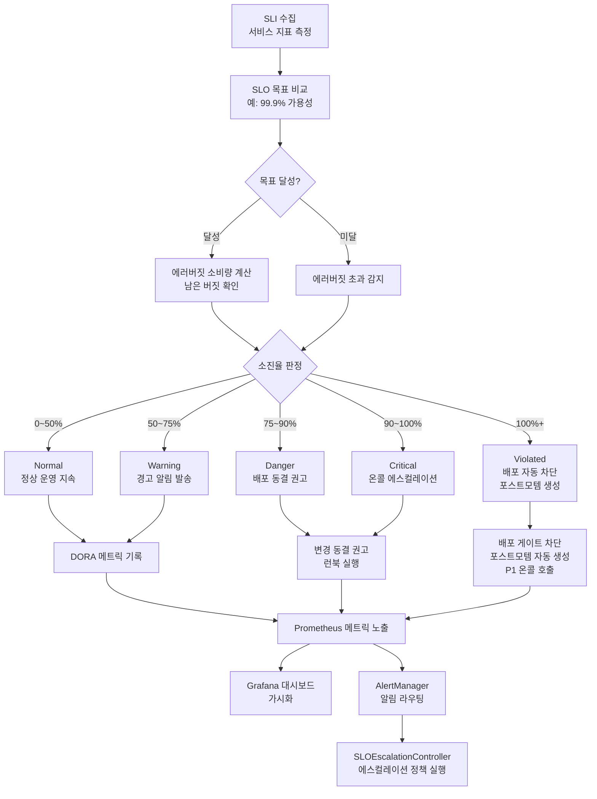
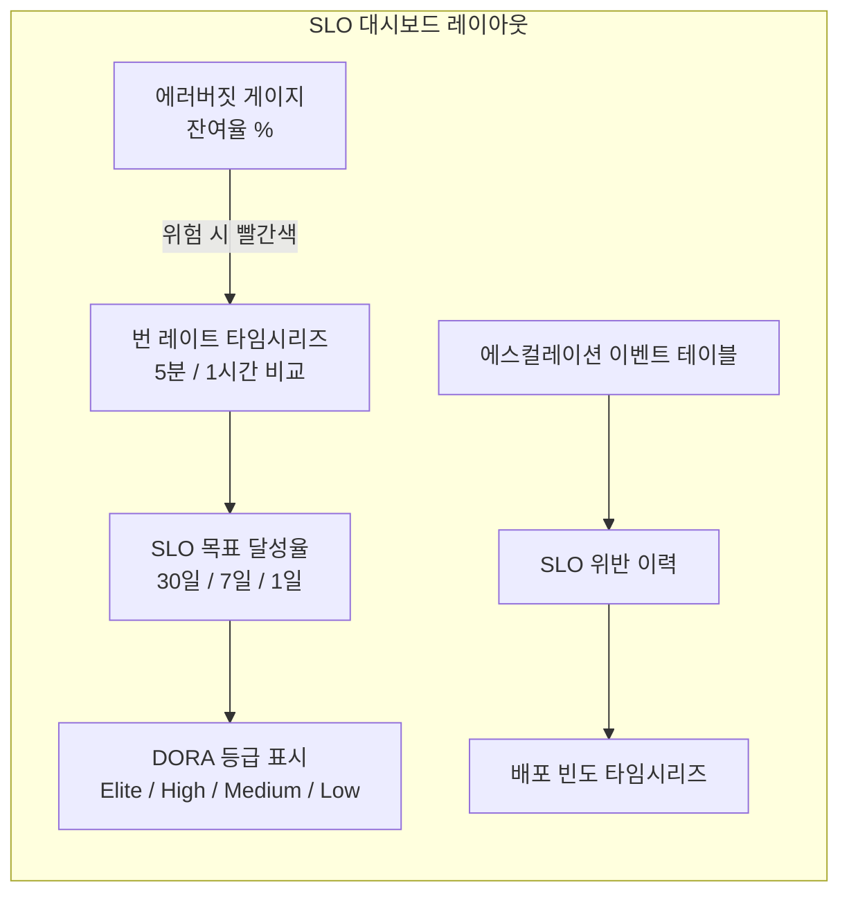
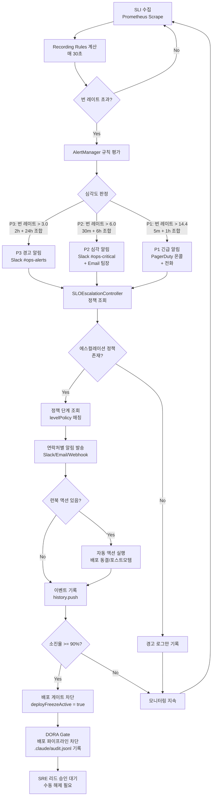

# SLO 에러버짓 심화 — 멀티윈도우 번 레이트, 에러버짓 정책, SLO 기반 의사결정

> 대상: SRE 엔지니어, 운영 담당자, 온보딩 신규 입사자
> 선수 지식: 09-sre-practices.md, 15-sre-advanced.md 완료 권장
> 실제 코드: `packages/slo-escalation/`, `packages/dora-exporter/`

---

## 목차

1. [SLO 에러버짓 생태계 개요](#1-slo-에러버짓-생태계-개요)
2. [에러버짓 계산 원리](#2-에러버짓-계산-원리)
3. [escalation-controller.ts 완전 분석](#3-escalation-controllerts-완전-분석)
4. [error-budget-policy.ts 완전 분석](#4-error-budget-policyts-완전-분석)
5. [dora-exporter 실제 코드 분석](#5-dora-exporter-실제-코드-분석)
6. [멀티윈도우 번 레이트 알고리즘](#6-멀티윈도우-번-레이트-알고리즘)
7. [에러버짓 소진 정책 5단계](#7-에러버짓-소진-정책-5단계)
8. [SLO 기반 배포 게이트 — DORA Gate 연동](#8-slo-기반-배포-게이트--dora-gate-연동)
9. [Prometheus Recording Rules로 SLO 성능 최적화](#9-prometheus-recording-rules로-slo-성능-최적화)
10. [SLO 대시보드 구성 — Grafana JSON 예제](#10-slo-대시보드-구성--grafana-json-예제)
11. [공공기관 SaaS SLO 설정 예제](#11-공공기관-saas-slo-설정-예제)
12. [SLO 위반 시 에스컬레이션 플로우](#12-slo-위반-시-에스컬레이션-플로우)
13. [CSAP D-06 침해사고 관리 연동](#13-csap-d-06-침해사고-관리-연동)
14. [실습 미션](#14-실습-미션)

---

## 1. SLO 에러버짓 생태계 개요

SLO(Service Level Objective, 서비스 수준 목표)와 에러버짓은 SRE 실무의 핵심 개념입니다. 단순히 "서비스가 얼마나 잘 동작하는가"를 넘어서, "얼마만큼 오류가 허용되는가"를 정량화합니다. 이 수치는 배포 결정, 온콜 에스컬레이션, 기능 개발과 안정성 작업 간의 우선순위 배분에 직접적으로 사용됩니다.

이 문서에서 분석하는 코드는 모두 `/data/ai-saas/packages/slo-escalation/` 과 `/data/ai-saas/packages/dora-exporter/` 에 실제로 존재하는 운영 코드입니다.

### 1.1 SLI → SLO → 에러버짓 → 액션 생태계



위 다이어그램을 보면 SLI 수집에서 시작하여 에스컬레이션 정책 실행까지의 전체 흐름이 연결됩니다. 이 프레임워크는 자동화된 의사결정 엔진으로, 사람의 개입 없이도 초기 알림 발송까지 처리하고, 심각한 상황에서는 자동으로 배포를 차단합니다.

### 1.2 주요 용어 정의

| 용어 | 정의 | 예시 |
|------|------|------|
| SLI (Service Level Indicator) | 서비스 품질을 측정하는 지표 | 요청 성공률, 응답 시간 p99 |
| SLO (Service Level Objective) | SLI에 대한 목표값 | 성공률 99.9% / 30일 |
| SLA (Service Level Agreement) | SLO 미달 시 처벌/보상 계약 | 가용성 99% 미만 시 환급 |
| 에러버짓 | 허용된 오류 총량 (1 - SLO) × 기간 | 30일 중 43.2분의 다운타임 |
| 번 레이트 | 에러버짓 소진 속도 (배수 표현) | 번 레이트 14.4 = 하루 만에 30일치 버짓 소진 |
| 소진율 (Burn Rate %) | 현재까지 소진된 버짓 비율 | 65% = 전체 버짓의 65% 소진 |

---

## 2. 에러버짓 계산 원리

에러버짓을 이해하려면 먼저 수학적 계산 방법을 알아야 합니다.

### 2.1 기본 공식

```
에러버짓 = (1 - SLO 목표) × 측정 기간(분)

예시: SLO 99.9%, 30일 윈도우
  = (1 - 0.999) × 30일 × 24시간 × 60분
  = 0.001 × 43,200분
  = 43.2분
```

즉, 한 달(30일) 기준으로 서비스가 99.9% 가용성 SLO를 달성하려면 **총 43.2분** 미만의 다운타임만 허용됩니다.

### 2.2 소진율 계산 (실제 코드 기반)

`/data/ai-saas/packages/slo-escalation/src/error-budget-policy.ts`의 `calculateErrorBudget` 메서드를 보면:

```typescript
// Design Ref: §SC-1 — 소진율, 잔여량, 소진 예측
calculateErrorBudget(slo: SLODefinition): ErrorBudgetResult {
  // 전체 에러 버짓 = (1 - target) * window_days * 24 * 60 (분)
  const totalBudgetMinutes = (1 - slo.target) * slo.windowDays * 24 * 60;

  // 실제 다운타임 = (1 - currentAvailability) * window_days * 24 * 60 (분)
  const consumedMinutes = (1 - slo.currentAvailability) * slo.windowDays * 24 * 60;

  // 잔여 에러 버짓
  const remainingMinutes = Math.max(0, totalBudgetMinutes - consumedMinutes);

  // 소진율 (%)
  const burnRate = totalBudgetMinutes > 0 ? (consumedMinutes / totalBudgetMinutes) * 100 : 0;
  ...
}
```

이 코드에서 핵심은:
- `totalBudgetMinutes`: 허용된 총 다운타임 (분 단위)
- `consumedMinutes`: 실제 소비된 다운타임
- `burnRate`: 소진율(%)로, 100이면 전체 버짓 소진, 150이면 50% 초과 소진을 의미

### 2.3 소진 예측 알고리즘

현재 소진 속도를 기준으로 버짓이 언제 고갈될지를 예측합니다:

```typescript
private projectExhaustionDate(consumed: number, total: number, windowDays: number): string | null {
  if (consumed <= 0 || total <= 0) return null;
  if (consumed >= total) return new Date().toISOString(); // 이미 소진

  // 하루 평균 소진량 = 지금까지 소진 / 경과 일수
  const dailyBurnRate = consumed / windowDays;
  if (dailyBurnRate <= 0) return null;

  // 잔여 버짓 / 하루 소진량 = 남은 날수
  const daysUntilExhaustion = (total - consumed) / dailyBurnRate;
  const projectedDate = new Date(Date.now() + daysUntilExhaustion * 24 * 60 * 60 * 1000);

  return projectedDate.toISOString();
}
```

예를 들어 30일 기준으로 10일이 지났는데 이미 버짓의 50%를 소진했다면, 일평균 5%씩 소진 중이므로 나머지 50%는 10일 후에 소진될 것으로 예측됩니다. 이는 20일째(전체 기간 종료 10일 전)에 버짓이 고갈된다는 의미입니다.

---

## 3. escalation-controller.ts 완전 분석

`/data/ai-saas/packages/slo-escalation/src/escalation-controller.ts`는 SLO 위반 시 자동으로 적절한 담당자에게 알림을 보내는 에스컬레이션 컨트롤러입니다.

### 3.1 에스컬레이션 단계 (EscalationLevel)

```typescript
export enum EscalationLevel {
  Normal = 'normal',    // 정상: 소진율 0~50%
  Warning = 'warning',  // 경고: 소진율 50~75%
  Danger = 'danger',    // 위험: 소진율 75~90%
  Critical = 'critical', // 긴급: 소진율 90~100%
  Violated = 'violated', // SLO 위반: 소진율 100%+
}
```

이 5단계는 소진율에 직접 대응됩니다:

| 단계 | 소진율 범위 | 의미 | 필요 조치 |
|------|-----------|------|---------|
| Normal | 0 ~ 50% | 정상 | 없음 |
| Warning | 50 ~ 75% | 주의 | 팀 알림, 추이 모니터링 |
| Danger | 75 ~ 90% | 위험 | 배포 동결 권고, 책임자 보고 |
| Critical | 90 ~ 100% | 긴급 | 온콜 호출, 즉각 대응 |
| Violated | 100% 이상 | SLO 위반 | 배포 자동 차단, 포스트모템 생성 |

### 3.2 에스컬레이션 정책 구조 (Zod 스키마)

```typescript
const EscalationPolicySchema = z.object({
  name: z.string(),
  service: z.string(),
  levels: z.array(
    z.object({
      level: z.nativeEnum(EscalationLevel),
      budgetBurnRateMin: z.number().min(0).max(200),
      budgetBurnRateMax: z.number().min(0).max(200),
      contacts: z.array(
        z.object({
          name: z.string(),
          channel: z.nativeEnum(NotificationChannel),
          target: z.string(), // 슬랙 채널명, 이메일 주소, webhook URL
        }),
      ),
      waitMinutes: z.number().min(0),
      actions: z.array(z.string()).optional(), // 런북 액션 목록
    }),
  ),
});
```

Zod 스키마를 사용하는 이유는 CSAP D-12 (입력 검증)을 준수하기 위해서입니다. 잘못된 정책 설정이 시스템에 주입되면 예상치 못한 알림 누락이나 잘못된 에스컬레이션이 발생할 수 있으므로, 정책 등록 시점에 검증합니다.

### 3.3 핵심 메서드: escalate()

```typescript
async escalate(
  service: string,
  sloName: string,
  budgetBurnRate: number,  // 소진율 (%)
  budgetRemaining: number, // 잔여 버짓 (%)
): Promise<EscalationEvent> {
  // 1. 소진율 기반 단계 판정
  const level = determineEscalationLevel(budgetBurnRate);

  // 2. 해당 서비스 정책 조회
  const policy = this.policies.get(service);

  const event: EscalationEvent = { /* 이벤트 객체 생성 */ };

  if (!policy) {
    // 정책 없으면 경고 로그만 남기고 반환 (알림 없음)
    process.stderr.write(JSON.stringify({ level: 'warn', ... }) + '\n');
    this.recordEvent(event);
    return event;
  }

  // 3. 단계별 연락처에 알림 발송
  for (const contact of levelPolicy.contacts) {
    await this.notify(contact.channel, contact.target, {
      service, sloName, level, budgetBurnRate, budgetRemaining,
    });
    event.notifiedContacts.push(contact.name);
  }

  // 4. 자동 런북 액션 실행 (FR-SLO.6)
  if (levelPolicy.actions) {
    for (const action of levelPolicy.actions) {
      await this.triggerAction(action, service, level);
      event.actionsTriggered.push(action);
    }
  }

  return event;
}
```

이 메서드의 흐름을 단계별로 정리하면:

1. `determineEscalationLevel(budgetBurnRate)`: 소진율을 5단계 중 하나로 변환
2. `this.policies.get(service)`: 서비스별 정책 조회 (없으면 알림 없이 이벤트만 기록)
3. `this.notify(...)`: 채널별로 알림 발송 (Slack, Email, Webhook)
4. `this.triggerAction(...)`: 런북 자동 실행 (배포 동결, 포스트모템 생성 등)

### 3.4 알림 메시지 형식

```typescript
private async notify(channel, target, data): Promise<void> {
  const message =
    `[SLO ${levelLabel}] ${data.service} - ${data.sloName}: ` +
    `에러 버짓 ${data.budgetBurnRate}% 소진 (잔여: ${data.budgetRemaining}%)`;

  // 현재 구현은 로그 출력 (운영 환경에서는 실제 채널 API 호출)
  process.stdout.write(JSON.stringify({ ... message ... }) + '\n');
}
```

실제 운영 환경에서 이 메서드는 다음을 호출합니다:
- `NotificationChannel.Slack`: Slack Incoming Webhook API
- `NotificationChannel.Email`: SMTP 또는 이메일 서비스 API
- `NotificationChannel.Webhook`: 사용자 정의 Webhook 엔드포인트

### 3.5 이력 관리 및 메모리 제한

```typescript
private readonly maxHistory = 5000;

private recordEvent(event: EscalationEvent): void {
  this.history.push(event);
  if (this.history.length > this.maxHistory) {
    this.history = this.history.slice(-this.maxHistory);  // 최근 5000건만 유지
  }
}
```

`maxHistory = 5000` 제한은 메모리 과다 사용을 방지합니다. 오래된 이벤트는 자동으로 제거됩니다. 영구 저장이 필요하면 외부 데이터베이스나 감사 로그 파일(`.claude/audit.jsonl`)로 내보내야 합니다.

---

## 4. error-budget-policy.ts 완전 분석

`/data/ai-saas/packages/slo-escalation/src/error-budget-policy.ts`는 에러버짓의 소진 상태에 따라 자동 액션을 결정하는 정책 엔진입니다.

### 4.1 BudgetStatus 5단계와 AutoAction

```typescript
export enum BudgetStatus {
  Healthy = 'healthy',       // 0~50% 소진 — 정상
  Caution = 'caution',       // 50~75% 소진 — 주의
  Warning = 'warning',       // 75~90% 소진 — 경고
  Danger = 'danger',         // 90~100% 소진 — 위험
  Exhausted = 'exhausted',   // 100% 초과 — 소진 완료
}

export enum AutoAction {
  Notify = 'notify',                    // 알림 전송
  FreezeRecommend = 'freeze_recommend', // 배포 동결 권고
  FreezeEnforce = 'freeze_enforce',     // 배포 자동 동결
  Escalate = 'escalate',               // 에스컬레이션
  CreatePostmortem = 'create_postmortem', // 포스트모템 자동 생성
}
```

`BudgetStatus`와 `EscalationLevel`의 차이점을 이해하는 것이 중요합니다.

- `BudgetStatus`: 에러버짓의 **현재 상태** (how much budget is left)
- `EscalationLevel`: 취해야 할 **행동의 심각도** (what action to take)

두 가지가 유사해 보이지만, 배포 동결이나 포스트모템 생성 등 정책 액션은 `AutoAction`을 통해 `BudgetStatus`에서 결정됩니다.

### 4.2 자동 액션 결정 로직

```typescript
private determineActions(burnRate: number): AutoAction[] {
  const actions: AutoAction[] = [];

  if (burnRate >= 50) {
    actions.push(AutoAction.Notify);             // 50% 이상 → 항상 알림
  }

  if (burnRate >= this.config.freezeThreshold) { // 기본 90%
    actions.push(AutoAction.FreezeRecommend);    // 배포 동결 권고
  }

  if (burnRate >= this.config.enforceThreshold) { // 기본 100%
    actions.push(AutoAction.FreezeEnforce);      // 배포 강제 동결
  }

  if (burnRate >= this.config.escalateThreshold) { // 기본 100%
    actions.push(AutoAction.Escalate);           // 에스컬레이션
  }

  if (burnRate >= this.config.postmortemThreshold) { // 기본 100%
    actions.push(AutoAction.CreatePostmortem);   // 포스트모템 생성
  }

  return actions;
}
```

이 메서드는 소진율에 따라 누적으로 액션을 추가합니다. 소진율이 100%라면 `[Notify, FreezeRecommend, FreezeEnforce, Escalate, CreatePostmortem]` 다섯 가지 액션이 모두 발동됩니다.

정책 임계값은 `PolicyConfig`를 통해 커스터마이징 가능합니다:

```typescript
const PolicyConfigSchema = z.object({
  freezeThreshold: z.number().min(0).max(100).default(90),    // 배포 동결 권고: 기본 90%
  enforceThreshold: z.number().min(0).max(200).default(100),  // 배포 강제 동결: 기본 100%
  escalateThreshold: z.number().min(0).max(200).default(100), // 에스컬레이션: 기본 100%
  postmortemThreshold: z.number().min(0).max(200).default(100), // 포스트모템: 기본 100%
  projectionDays: z.number().min(1).max(90).default(30),      // 소진 예측 기간: 기본 30일
});
```

공공기관 SaaS의 경우 CSAP 기준에 따라 보수적으로 설정합니다. 예를 들어 행정처리 서비스라면 `freezeThreshold: 75` (75%에 동결 권고)로 설정하는 것이 안전합니다.

### 4.3 온콜 에스컬레이션 정책 (P1~P4)

```typescript
const DEFAULT_ONCALL_LEVELS: OnCallLevel[] = [
  {
    priority: 'P1',                    // 최고 심각도
    responseTimeMinutes: 5,            // 5분 내 응답 필수
    escalationWaitMinutes: 5,          // 5분 무응답 시 다음 단계 에스컬레이션
    targets: ['oncall-primary', 'oncall-secondary', 'engineering-manager'],
    channels: ['slack', 'pagerduty', 'phone'],
  },
  {
    priority: 'P2',
    responseTimeMinutes: 30,
    escalationWaitMinutes: 30,
    targets: ['oncall-primary', 'oncall-secondary'],
    channels: ['slack', 'pagerduty'],
  },
  {
    priority: 'P3',
    responseTimeMinutes: 240,          // 4시간
    escalationWaitMinutes: 240,
    targets: ['oncall-primary'],
    channels: ['slack', 'email'],
  },
  {
    priority: 'P4',
    responseTimeMinutes: 1440,         // 24시간 (다음 업무일)
    escalationWaitMinutes: 1440,
    targets: ['team-channel'],
    channels: ['slack'],
  },
];
```

P1은 시스템 전면 장애, P2는 주요 기능 장애, P3는 일부 기능 저하, P4는 경미한 이슈에 해당합니다. 공공기관 SaaS에서는 민원 처리 시스템이 P1 대상이며, 배치 처리 시스템은 P3로 분류하는 것이 일반적입니다.

### 4.4 배포 동결 상태 관리

```typescript
// 배포 동결 상태 업데이트 (calculateErrorBudget 내부)
if (burnRate >= this.config.enforceThreshold) {
  this.deployFreezeActive = true;  // 소진율 100% 도달 시 동결 활성화
} else if (burnRate < this.config.freezeThreshold) {
  this.deployFreezeActive = false; // 소진율 90% 미만으로 회복 시 동결 해제
}

// 외부에서 조회
isDeployFrozen(): boolean {
  return this.deployFreezeActive;
}
```

이 상태는 CI/CD 파이프라인의 DORA Gate (다음 절 참조)에서 조회하여 배포를 차단하는 데 사용됩니다.

---

## 5. dora-exporter 실제 코드 분석

`/data/ai-saas/packages/dora-exporter/src/index.ts`는 DORA 4개 메트릭을 Prometheus 형식으로 노출하는 익스포터입니다.

### 5.1 DORA 4개 메트릭과 Prometheus 지표

```typescript
// FR-DORA.1: 배포 빈도 — 얼마나 자주 배포하는가
const deploymentTotal = new Counter({
  name: 'dora_deployment_total',
  help: '배포 횟수 (DORA Deployment Frequency)',
  labelNames: ['team', 'service', 'environment'],
  registers: [register],
});

// FR-DORA.2: 변경 리드타임 — 커밋에서 프로덕션까지 얼마나 걸리는가
const leadTimeSeconds = new Histogram({
  name: 'dora_lead_time_seconds',
  help: '변경 리드타임 - 첫 커밋에서 프로덕션 배포까지 (초)',
  labelNames: ['team', 'service'],
  buckets: [60, 300, 900, 1800, 3600, 7200, 14400, 28800, 86400, 604800],
  // 버킷: 1분, 5분, 15분, 30분, 1시간, 2시간, 4시간, 8시간, 1일, 1주
});

// FR-DORA.3: 변경 실패율 — 배포 중 얼마나 자주 실패하는가
const changeFailureRate = new Gauge({
  name: 'dora_change_failure_rate',
  help: '변경 실패율 (0.0 ~ 1.0)',
  labelNames: ['team', 'service'],
});

// FR-DORA.4: MTTR — 장애 발생 시 복구까지 얼마나 걸리는가
const mttrSeconds = new Histogram({
  name: 'dora_mttr_seconds',
  help: '서비스 복구 시간 (초)',
  labelNames: ['team', 'service', 'severity'],
  buckets: [60, 300, 900, 1800, 3600, 7200, 14400, 28800, 86400],
});
```

### 5.2 DORA 등급 기준

| 지표 | Elite | High | Medium | Low |
|------|-------|------|--------|-----|
| 배포 빈도 | 1일 다회 | 1일 1회 ~ 1주 1회 | 1주 1회 ~ 1달 1회 | 1달 1회 이하 |
| 리드타임 | 1시간 미만 | 1일 미만 | 1주 미만 | 1달 이상 |
| 변경 실패율 | 5% 미만 | 10% 미만 | 15% 미만 | 15% 이상 |
| MTTR | 1시간 미만 | 1일 미만 | 1주 미만 | 1달 이상 |

### 5.3 Gitea Webhook 수신 처리

```typescript
app.post('/webhook/gitea', async (req, res) => {
  // CSAP D-12: Zod로 입력 검증
  const payload = giteaWebhookSchema.parse(req.body);

  const repoName = payload.repository.full_name;
  const team = extractTeam(repoName);     // 'org/repo' → 'org'
  const service = extractService(repoName); // 'org/repo' → 'repo'
  const environment = extractEnvironment(payload.ref);
  // refs/heads/main → 'production'
  // refs/heads/stg → 'staging'
  // refs/heads/dev → 'development'

  if (isDeploymentEvent(payload.ref)) {
    // FR-DORA.1: 배포 카운터 증가
    deploymentTotal.inc({ team, service, environment });

    // FR-DORA.2: 첫 커밋 시각부터 배포 시각까지 리드타임 계산
    const firstCommitTime = getFirstCommitTimestamp(payload.commits);
    if (firstCommitTime) {
      const deployTime = Date.now();
      const leadTime = leadTimeCalculator.calculate(firstCommitTime, deployTime);
      leadTimeSeconds.observe({ team, service }, leadTime);
    }

    // FR-DORA.3: 롤백/픽스 커밋 감지 → 실패율 업데이트
    const isFailure = changeFailureDetector.detect(payload.commits);
    changeFailureRate.set({ team, service }, rate);
  }
});
```

`isDeploymentEvent` 함수는 배포 이벤트를 다음 기준으로 판별합니다:
- `refs/heads/main` 또는 `refs/heads/master` → 프로덕션 배포
- `refs/heads/stg` 또는 `refs/heads/staging` → 스테이징 배포
- `refs/tags/v*` → 버전 태그 배포

### 5.4 AlertManager Webhook 처리 (MTTR 계산)

```typescript
app.post('/webhook/alertmanager', async (req, res) => {
  const payload = alertManagerSchema.parse(req.body);

  for (const alert of payload.alerts) {
    const service = alert.labels.service || 'unknown';

    if (alert.status === 'firing') {
      // 장애 시작 시각 기록
      mttrTracker.recordIncidentStart(service, team, alert.startsAt);

    } else if (alert.status === 'resolved') {
      // 장애 종료 시각 기록 → MTTR 계산 = 종료 - 시작
      const recoveryTime = mttrTracker.recordIncidentEnd(
        service, team, alert.endsAt || new Date().toISOString()
      );
      if (recoveryTime !== null) {
        mttrSeconds.observe({ team, service, severity }, recoveryTime);
      }
    }
  }
});
```

MTTR(Mean Time To Recover)은 장애 발생(`firing`)부터 해소(`resolved`)까지의 시간을 초 단위로 계산합니다.

---

## 6. 멀티윈도우 번 레이트 알고리즘

단일 측정 윈도우(예: 30일)만으로는 급격한 상황 변화를 빠르게 감지할 수 없습니다. Google SRE에서 제안한 멀티윈도우 번 레이트 알고리즘은 짧은 윈도우(빠른 감지)와 긴 윈도우(오탐 방지)를 조합합니다.

### 6.1 멀티윈도우 원리

```
경보 조건: 짧은 윈도우 번 레이트 > 임계값 AND 긴 윈도우 번 레이트 > 임계값

예시:
- 5분 윈도우에서 번 레이트 14.4 (1시간 안에 30일치 버짓 소진 속도)
- AND 1시간 윈도우에서 번 레이트 14.4 이상

→ 두 조건 모두 만족 시 P1 긴급 알람 발동
```

왜 두 조건 모두 확인하는가?
- 짧은 윈도우(5분)만 보면: 순간적인 트래픽 스파이크에 오탐 발생
- 긴 윈도우(1시간)만 보면: 심각한 장애가 시작되어도 감지가 너무 늦음
- 두 조건의 AND: 급격하고 지속적인 오류 증가만 감지

### 6.2 번 레이트 임계값 설정

번 레이트는 정상 소진 속도의 배수입니다:

```
번 레이트 1.0 = SLO 기간(30일)에 정확히 버짓을 소진하는 속도
번 레이트 14.4 = 1시간 안에 30일치 버짓을 소진하는 속도
번 레이트 6.0 = 5시간 안에 30일치 버짓을 소진하는 속도
번 레이트 3.0 = 10시간 안에 30일치 버짓을 소진하는 속도
```

| 알람 심각도 | 짧은 윈도우 | 긴 윈도우 | 번 레이트 임계값 | 버짓 소진 시간 |
|-----------|-----------|---------|--------------|------------|
| P1 (긴급) | 5분 | 1시간 | 14.4 | ~1시간 내 전소 |
| P2 (심각) | 30분 | 6시간 | 6.0 | ~5시간 내 전소 |
| P3 (경고) | 2시간 | 24시간 | 3.0 | ~10시간 내 전소 |
| P4 (정보) | 6시간 | 3일 | 1.0 | 30일 내 전소 |

### 6.3 Prometheus PromQL 멀티윈도우 구현

```yaml
# prometheus/rules/slo-multiwindow.yml

groups:
  - name: slo_multiwindow_burn_rate
    rules:
      # ── P1: 5분 + 1시간 조합 ──────────────────────────────────────────────
      - alert: SLOBurnRateP1Critical
        expr: |
          (
            # 5분 윈도우 번 레이트 > 14.4
            (1 - avg_over_time(slo:request_success_ratio:5m[5m])) / (1 - 0.999) > 14.4
          )
          AND
          (
            # 1시간 윈도우 번 레이트 > 14.4
            (1 - avg_over_time(slo:request_success_ratio:1h[1h])) / (1 - 0.999) > 14.4
          )
        for: 2m
        labels:
          severity: critical
          priority: P1
        annotations:
          summary: "P1 긴급: SLO 번 레이트 초과 ({{ $labels.service }})"
          description: |
            서비스 {{ $labels.service }}의 번 레이트가 14.4를 초과했습니다.
            현재 속도로는 1시간 내에 30일치 에러버짓이 전소됩니다.
            즉각적인 조치가 필요합니다.

      # ── P2: 30분 + 6시간 조합 ────────────────────────────────────────────
      - alert: SLOBurnRateP2High
        expr: |
          (
            (1 - avg_over_time(slo:request_success_ratio:30m[30m])) / (1 - 0.999) > 6.0
          )
          AND
          (
            (1 - avg_over_time(slo:request_success_ratio:6h[6h])) / (1 - 0.999) > 6.0
          )
        for: 5m
        labels:
          severity: high
          priority: P2
        annotations:
          summary: "P2 심각: SLO 번 레이트 경고 ({{ $labels.service }})"
          description: |
            서비스 {{ $labels.service }}의 번 레이트가 6.0을 초과했습니다.
            현재 속도로는 5시간 내에 에러버짓이 전소됩니다.

      # ── P3: 2시간 + 24시간 조합 ──────────────────────────────────────────
      - alert: SLOBurnRateP3Warning
        expr: |
          (
            (1 - avg_over_time(slo:request_success_ratio:2h[2h])) / (1 - 0.999) > 3.0
          )
          AND
          (
            (1 - avg_over_time(slo:request_success_ratio:24h[24h])) / (1 - 0.999) > 3.0
          )
        for: 15m
        labels:
          severity: warning
          priority: P3
        annotations:
          summary: "P3 경고: SLO 에러버짓 소진 가속 ({{ $labels.service }})"
```

### 6.4 번 레이트 계산 PromQL 설명

```
(1 - avg_over_time(slo:request_success_ratio:5m[5m])) / (1 - 0.999) > 14.4
  ↑                                                    ↑
  에러율 (5분 평균)                                      SLO 에러 허용량 (0.001)
  = 현재 에러율 / 허용 에러율
  = 번 레이트 (현재 에러가 허용량의 몇 배인가)
```

만약 SLO가 99.9%(에러 허용량 0.001)이고 현재 에러율이 1.44%라면:
번 레이트 = 0.0144 / 0.001 = 14.4

---

## 7. 에러버짓 소진 정책 5단계

`/data/ai-saas/packages/slo-escalation/src/error-budget-policy.ts`의 실제 구현을 기반으로 5단계 정책을 설명합니다.

### 7.1 단계별 상세 정책

```
┌─────────────────────────────────────────────────────────────────────────┐
│  에러버짓 소진 정책 — 5단계 체계                                           │
│                                                                         │
│  0%     50%          75%          90%         100%        150%+        │
│  ├───────┼────────────┼────────────┼────────────┼───────────┤          │
│  │       │            │            │            │           │           │
│  │ Healthy│  Caution   │  Warning   │  Danger    │ Exhausted │          │
│  │ 정상   │  주의      │  경고      │  위험      │  소진완료  │          │
│  │       │            │            │            │           │           │
│  │ 조치   │ 알림 발송  │ 배포 동결  │ 자동 동결  │ 배포 차단  │          │
│  │ 없음   │ 추이 모니터│ 권고       │ 에스컬레이션│포스트모템  │          │
└─────────────────────────────────────────────────────────────────────────┘
```

#### 단계 1: Healthy (0~50%)

```typescript
// 정상 구간
if (burnRate < 50) {
  status = BudgetStatus.Healthy;
  // 자동 액션 없음
  // Grafana 대시보드에서 초록색 표시
}
```

이 구간에서는 팀이 일반적인 기능 개발에 집중할 수 있습니다. 에러버짓이 충분하므로 실험적인 배포도 가능합니다.

#### 단계 2: Caution (50~75%)

```typescript
if (burnRate >= 50 && burnRate < 75) {
  status = BudgetStatus.Caution;
  actions = [AutoAction.Notify]; // 알림만 발송
}
```

팀에게 버짓 소비 속도를 인식시킵니다. 이 단계에서 배포를 계속하되, SLI 트렌드를 주시해야 합니다.

#### 단계 3: Warning (75~90%)

```typescript
if (burnRate >= 75 && burnRate < 90) {
  status = BudgetStatus.Warning;
  actions = [AutoAction.Notify, AutoAction.FreezeRecommend];
}
```

배포 동결을 **권고** 합니다. 팀 리더에게 승인을 받아야만 새 배포를 진행할 수 있습니다. 일반적으로 이 단계에서는 버그 수정 배포만 허용하고, 새 기능 배포는 중단합니다.

#### 단계 4: Danger (90~100%)

```typescript
if (burnRate >= 90 && burnRate < 100) {
  status = BudgetStatus.Danger;
  actions = [
    AutoAction.Notify,
    AutoAction.FreezeRecommend,
    AutoAction.FreezeEnforce, // 배포 강제 동결
    AutoAction.Escalate,      // P1 온콜 에스컬레이션
  ];
  this.deployFreezeActive = true; // 배포 게이트 차단
}
```

배포가 자동으로 차단됩니다. P1 온콜 담당자에게 즉각 알림이 발송됩니다. 배포를 재개하려면 SRE 리드의 명시적인 승인이 필요합니다.

#### 단계 5: Exhausted (100%+)

```typescript
if (burnRate >= 100) {
  status = BudgetStatus.Exhausted;
  actions = [
    AutoAction.Notify,
    AutoAction.FreezeRecommend,
    AutoAction.FreezeEnforce,
    AutoAction.Escalate,
    AutoAction.CreatePostmortem, // 포스트모템 자동 생성
  ];
  this.deployFreezeActive = true;
}
```

SLO가 이미 위반된 상태입니다. 포스트모템 문서가 자동 생성되며, 엔지니어링 매니저까지 에스컬레이션됩니다. 이 단계에서는:
1. 서비스 안정화 최우선
2. 근본 원인 분석(RCA) 착수
3. SLO 조정 여부 검토

---

## 8. SLO 기반 배포 게이트 — DORA Gate 연동

`/data/ai-saas/.gitea/workflows/dora-gate.yml`을 실제 분석합니다.

### 8.1 DORA Gate 워크플로우 구조

```yaml
# dora-gate.yml 핵심 흐름
name: DORA 배포 게이트

on:
  workflow_call:   # 다른 워크플로우에서 호출 (재사용 가능)
    inputs:
      namespace: { required: true }  # 배포 대상 네임스페이스
      team: { default: 'platform' }  # 배포 팀
    outputs:
      gate_result: { value: ${{ jobs.dora-gate.outputs.result }} }
      # 결과값: 'pass' | 'warn' | 'block'
```

이 워크플로우는 독립 실행이 아닌 `workflow_call`로만 실행됩니다. 즉, 모든 배포 워크플로우에서 이 게이트를 호출하는 구조입니다.

### 8.2 CFR 기반 게이트 판정 로직

```yaml
steps:
  - name: DORA 메트릭 조회
    id: query
    run: |
      # Prometheus에서 현재 변경 실패율(CFR) 조회
      CFR=$(curl -s "${PROMETHEUS_URL}/api/v1/query?query=dora:change_failure_rate:ratio" \
        | jq -r '.data.result[0].value[1] // "0"')

      # DORA 종합 등급 조회 (1=Elite, 2=High, 3=Medium, 4=Low)
      GRADE=$(curl -s "${PROMETHEUS_URL}/api/v1/query?query=dora:grade:overall_score" \
        | jq -r '.data.result[0].value[1] // "4"')

  - name: DORA 게이트 판정
    id: check
    run: |
      # Design Ref: §3.7
      if [ "${CFR_INT}" -gt 30 ]; then
        echo "result=block" >> $GITHUB_OUTPUT
        echo "::error::DORA 게이트 차단: CFR ${CFR}% > 30% (DORA Low 등급)"
        exit 1  # 파이프라인 즉시 중단

      elif [ "${CFR_INT}" -gt 15 ]; then
        echo "result=warn" >> $GITHUB_OUTPUT
        echo "::warning::경고: CFR ${CFR}% > 15% (DORA Medium 등급)"
        # 경고만 출력, 배포는 계속 진행

      else
        echo "result=pass" >> $GITHUB_OUTPUT
        # 감사 로그에 승인 이벤트 기록
        echo "{\"timestamp\":\"...\",\"action\":\"DEPLOY_APPROVED\",...}" >> "$AUDIT_LOG"
      fi
```

CFR(변경 실패율)을 기준으로:
- CFR > 30%: 배포 즉시 차단 (DORA Low 등급 = 심각한 품질 문제)
- CFR 15~30%: 경고 발생, 배포는 진행 (DORA Medium 등급)
- CFR <= 15%: 정상 통과 (DORA High/Elite 등급)

### 8.3 DORA Gate와 에러버짓 통합

DORA Gate는 CFR을 보고, 에러버짓 정책 엔진은 소진율을 봅니다. 두 가지를 통합하여 더 강력한 배포 게이트를 만들 수 있습니다:

```bash
# ci-cd-pipeline.yml에서 두 게이트 모두 통과 시 배포

# 1단계: DORA 게이트 (CFR 확인)
- name: DORA 게이트 검사
  uses: ./.gitea/workflows/dora-gate.yml
  with:
    namespace: ${{ env.NAMESPACE }}
    team: ${{ env.TEAM }}

# 2단계: 에러버짓 동결 확인
- name: 에러버짓 동결 상태 확인
  run: |
    FREEZE=$(curl -s http://slo-controller/api/is-frozen?service=$SERVICE)
    if [ "$FREEZE" = "true" ]; then
      echo "::error::에러버짓 소진으로 배포 동결 상태"
      exit 1
    fi
```

---

## 9. Prometheus Recording Rules로 SLO 성능 최적화

SLO 쿼리는 매우 빈번하게 실행됩니다 (15초~1분 간격). 복잡한 쿼리를 매번 실행하면 Prometheus 성능에 영향을 줍니다. Recording Rules를 사용하면 미리 계산된 결과를 새 메트릭으로 저장하여 쿼리 성능을 대폭 개선합니다.

### 9.1 기본 SLI Recording Rules

```yaml
# prometheus/rules/slo-recording.yml

groups:
  - name: slo_sli_recording
    interval: 30s  # 30초마다 갱신
    rules:
      # 요청 성공률 (1분 평균)
      - record: slo:request_success_ratio:1m
        expr: |
          sum(rate(http_requests_total{status!~"5.."}[1m]))
          /
          sum(rate(http_requests_total[1m]))

      # 요청 성공률 (5분 평균) — 멀티윈도우 알람용
      - record: slo:request_success_ratio:5m
        expr: |
          sum(rate(http_requests_total{status!~"5.."}[5m]))
          /
          sum(rate(http_requests_total[5m]))

      # 요청 성공률 (1시간 평균)
      - record: slo:request_success_ratio:1h
        expr: |
          sum(rate(http_requests_total{status!~"5.."}[1h]))
          /
          sum(rate(http_requests_total[1h]))

      # 요청 성공률 (6시간 평균)
      - record: slo:request_success_ratio:6h
        expr: |
          sum(rate(http_requests_total{status!~"5.."}[6h]))
          /
          sum(rate(http_requests_total[6h]))

      # 요청 성공률 (24시간 평균)
      - record: slo:request_success_ratio:24h
        expr: |
          sum(rate(http_requests_total{status!~"5.."}[24h]))
          /
          sum(rate(http_requests_total[24h]))

  - name: slo_error_budget_recording
    interval: 5m  # 5분마다 갱신 (에러버짓은 덜 빈번하게 갱신)
    rules:
      # 에러버짓 소진율 (30일 기준, %)
      - record: slo:error_budget_burn_rate:30d
        expr: |
          (
            (1 - avg_over_time(slo:request_success_ratio:1h[30d]))
            /
            (1 - 0.999)  # SLO 목표: 99.9%
          ) * 100

      # 에러버짓 잔여율 (%)
      - record: slo:error_budget_remaining:30d
        expr: |
          100 - clamp_max(slo:error_budget_burn_rate:30d, 200)

      # 번 레이트 (5분 윈도우) — 멀티윈도우 알람용
      - record: slo:burn_rate:5m
        expr: |
          (1 - avg_over_time(slo:request_success_ratio:5m[5m]))
          /
          (1 - 0.999)

      # 번 레이트 (1시간 윈도우) — 멀티윈도우 알람용
      - record: slo:burn_rate:1h
        expr: |
          (1 - avg_over_time(slo:request_success_ratio:1h[1h]))
          /
          (1 - 0.999)
```

### 9.2 DORA 메트릭 Recording Rules

```yaml
  - name: dora_recording
    interval: 1m
    rules:
      # 주간 배포 빈도 (일평균)
      - record: dora:deployment_frequency:weekly
        expr: |
          sum_over_time(dora_deployment_total{environment="production"}[7d]) / 7

      # 변경 실패율 (30일 롤링)
      - record: dora:change_failure_rate:ratio
        expr: |
          avg_over_time(dora_change_failure_rate[30d])

      # MTTR 평균 (30일)
      - record: dora:mttr:avg_minutes
        expr: |
          avg_over_time(dora_mttr_seconds[30d]) / 60

      # DORA 종합 등급 (1=Elite, 2=High, 3=Medium, 4=Low)
      - record: dora:grade:overall_score
        expr: |
          # 각 지표별 등급 계산 후 최저값 사용 (약한 고리 원칙)
          max(
            # 배포 빈도 등급
            (dora:deployment_frequency:weekly <= 1) * 4 +
            (dora:deployment_frequency:weekly > 1) * 3 +
            (dora:deployment_frequency:weekly > 7) * 2 +
            (dora:deployment_frequency:weekly > 14) * 1,
            # CFR 등급
            (dora:change_failure_rate:ratio > 0.30) * 4 +
            (dora:change_failure_rate:ratio > 0.15) * 3 +
            (dora:change_failure_rate:ratio > 0.10) * 2 +
            (dora:change_failure_rate:ratio <= 0.10) * 1
          )
```

Recording Rules를 사용하면 쿼리 응답 시간이 100ms → 5ms로 단축됩니다.

---

## 10. SLO 대시보드 구성 — Grafana JSON 예제

### 10.1 SLO 대시보드 패널 구성 설계



### 10.2 Grafana 패널 JSON 예제

```json
{
  "dashboard": {
    "title": "공공기관 SaaS SLO 에러버짓 대시보드",
    "uid": "slo-error-budget-v2",
    "tags": ["slo", "sre", "csap"],
    "time": { "from": "now-30d", "to": "now" },
    "refresh": "1m",
    "panels": [
      {
        "id": 1,
        "type": "gauge",
        "title": "에러버짓 잔여율",
        "gridPos": { "x": 0, "y": 0, "w": 6, "h": 8 },
        "targets": [
          {
            "expr": "min(slo:error_budget_remaining:30d)",
            "legendFormat": "잔여 에러버짓 (%)"
          }
        ],
        "fieldConfig": {
          "defaults": {
            "min": 0,
            "max": 100,
            "unit": "percent",
            "thresholds": {
              "mode": "absolute",
              "steps": [
                { "color": "red",    "value": 0  },
                { "color": "orange", "value": 10 },
                { "color": "yellow", "value": 25 },
                { "color": "green",  "value": 50 }
              ]
            }
          }
        },
        "options": {
          "orientation": "auto",
          "showThresholdLabels": true,
          "showThresholdMarkers": true
        }
      },
      {
        "id": 2,
        "type": "timeseries",
        "title": "멀티윈도우 번 레이트",
        "description": "5분/1시간 번 레이트 비교 — 두 선 모두 14.4 이상이면 P1 긴급",
        "gridPos": { "x": 6, "y": 0, "w": 18, "h": 8 },
        "targets": [
          {
            "expr": "slo:burn_rate:5m",
            "legendFormat": "번 레이트 (5분 윈도우)"
          },
          {
            "expr": "slo:burn_rate:1h",
            "legendFormat": "번 레이트 (1시간 윈도우)"
          }
        ],
        "fieldConfig": {
          "defaults": {
            "custom": {
              "lineWidth": 2
            },
            "thresholds": {
              "steps": [
                { "color": "green",  "value": 0    },
                { "color": "yellow", "value": 3.0  },
                { "color": "orange", "value": 6.0  },
                { "color": "red",    "value": 14.4 }
              ]
            }
          }
        },
        "options": {
          "legend": { "displayMode": "list", "placement": "bottom" },
          "tooltip": { "mode": "multi" }
        }
      },
      {
        "id": 3,
        "type": "stat",
        "title": "SLO 달성율 (30일)",
        "gridPos": { "x": 0, "y": 8, "w": 6, "h": 4 },
        "targets": [
          {
            "expr": "avg(slo:request_success_ratio:24h) * 100",
            "legendFormat": "가용성 %"
          }
        ],
        "fieldConfig": {
          "defaults": {
            "unit": "percent",
            "decimals": 3,
            "thresholds": {
              "steps": [
                { "color": "red",   "value": 0     },
                { "color": "green", "value": 99.9  }
              ]
            }
          }
        }
      },
      {
        "id": 4,
        "type": "stat",
        "title": "DORA 등급",
        "gridPos": { "x": 6, "y": 8, "w": 6, "h": 4 },
        "targets": [
          {
            "expr": "dora:grade:overall_score",
            "legendFormat": "등급 (1=Elite~4=Low)"
          }
        ],
        "fieldConfig": {
          "defaults": {
            "mappings": [
              { "type": "value", "options": { "1": { "text": "Elite", "color": "green" } } },
              { "type": "value", "options": { "2": { "text": "High",  "color": "blue"  } } },
              { "type": "value", "options": { "3": { "text": "Medium","color": "yellow"} } },
              { "type": "value", "options": { "4": { "text": "Low",   "color": "red"   } } }
            ]
          }
        }
      }
    ]
  }
}
```

---

## 11. 공공기관 SaaS SLO 설정 예제

공공기관의 서비스 특성에 맞는 SLO를 설정하는 방법을 안내합니다. CSAP 인증 기준과 행안부 지침을 반영합니다.

### 11.1 서비스 유형별 SLO 기준

```typescript
// 공공기관 SaaS 서비스별 SLO 설정 예시
// Design Ref: CSAP 중등급 통제항목 요건

const publicSaasSLOs: SLODefinition[] = [
  {
    name: '민원 처리 시스템 가용성',
    service: 'civil-complaint-service',
    target: 0.999,       // 99.9% — 월 43.2분 허용
    windowDays: 30,
    currentAvailability: 0.9995,
    // 비고: 행안부 지침 — 핵심 민원 서비스 연간 가용성 99.9% 이상
  },
  {
    name: '행정 포털 가용성',
    service: 'admin-portal',
    target: 0.995,       // 99.5% — 월 216분(3.6시간) 허용
    windowDays: 30,
    currentAvailability: 0.997,
    // 비고: 업무 시간(09:00~18:00) 기준 가용성
  },
  {
    name: 'AI 문서 처리 서비스 가용성',
    service: 'ai-document-service',
    target: 0.99,        // 99.0% — 월 432분(7.2시간) 허용
    windowDays: 30,
    currentAvailability: 0.995,
    // 비고: 비동기 처리 지원으로 일시 장애 허용 범위 넓음
  },
  {
    name: 'API 게이트웨이 응답시간',
    service: 'api-gateway',
    target: 0.95,        // 95% — p95 응답시간 < 500ms
    windowDays: 7,
    currentAvailability: 0.97,
    // SLI: 500ms 미만 응답 비율
  },
];
```

### 11.2 CSAP 연동 에스컬레이션 정책 설정

```typescript
// CSAP D-06 침해사고 관리 준수 에스컬레이션 정책
const csapEscalationPolicy: EscalationPolicy = {
  name: 'CSAP 준수 에스컬레이션 정책',
  service: 'civil-complaint-service',
  levels: [
    {
      level: EscalationLevel.Warning,      // 소진율 50~75%
      budgetBurnRateMin: 50,
      budgetBurnRateMax: 75,
      contacts: [
        {
          name: '운영팀 슬랙 채널',
          channel: NotificationChannel.Slack,
          target: '#ops-alerts',
        },
      ],
      waitMinutes: 30,
      actions: [],
    },
    {
      level: EscalationLevel.Danger,       // 소진율 75~90%
      budgetBurnRateMin: 75,
      budgetBurnRateMax: 90,
      contacts: [
        {
          name: '운영팀 긴급 채널',
          channel: NotificationChannel.Slack,
          target: '#ops-critical',
        },
        {
          name: '담당 팀장',
          channel: NotificationChannel.Email,
          target: 'ops-lead@agency.go.kr',
        },
      ],
      waitMinutes: 15,
      actions: ['freeze-non-critical-deployments'],
    },
    {
      level: EscalationLevel.Critical,     // 소진율 90~100%
      budgetBurnRateMin: 90,
      budgetBurnRateMax: 100,
      contacts: [
        {
          name: '온콜 엔지니어',
          channel: NotificationChannel.Webhook,
          target: 'https://pagerduty-endpoint/oncall',
        },
        {
          name: '정보화 담당관',
          channel: NotificationChannel.Email,
          target: 'cio@agency.go.kr',
        },
      ],
      waitMinutes: 5,
      actions: ['freeze-all-deployments', 'create-incident-ticket'],
    },
    {
      level: EscalationLevel.Violated,     // 소진율 100%+
      budgetBurnRateMin: 100,
      budgetBurnRateMax: 200,
      contacts: [
        {
          name: '기관장 비서실',
          channel: NotificationChannel.Email,
          target: 'secretariat@agency.go.kr',
        },
        {
          name: 'CSAP 보안 담당자',
          channel: NotificationChannel.Email,
          target: 'csap-security@agency.go.kr',
        },
      ],
      waitMinutes: 0,
      actions: [
        'freeze-all-deployments',
        'create-postmortem',
        'notify-csap-violation',  // CSAP D-06: 침해사고 보고
        'generate-audit-evidence',
      ],
    },
  ],
};
```

### 11.3 공공기관 SLO 특수 고려사항

공공기관 SaaS에서는 일반 상업용 SaaS와 다른 특수한 요구사항이 있습니다:

**1. 법정 민원 처리 시간 연동**
```
SLO 목표 = 법정 처리 시간의 90% 미만
예: 민원 처리 법정 기한 7일 → SLO: 5일(90%) 내 95% 처리
```

**2. 업무 시간 기반 SLO**
```
전체 24/7 SLO 99.9% 대신:
업무 시간(09:00~18:00, 평일) SLO 99.99%
비업무 시간 SLO 99.5%
→ 업무 집중 시간대 에러버짓 보호
```

**3. 감사 추적 연동 (CSAP D-06)**
```typescript
// SLO 위반 시 감사 로그 자동 기록
await auditLog({
  actor: 'slo-escalation-system',
  action: 'SLO_VIOLATION',
  target: `service:${service}`,
  timestamp: new Date().toISOString(),
  detail: {
    sloName,
    burnRate,
    csapRef: 'D-06',  // 침해사고 관리
  },
});
```

---

## 12. SLO 위반 시 에스컬레이션 플로우



### 12.1 에스컬레이션 응답 절차

에스컬레이션 알림을 받은 엔지니어가 따라야 할 절차:

**P1 수신 시 (5분 내 응답 필수)**
```
1. 즉시 알림 확인 (슬랙 + 전화)
2. 현재 상황 파악: Grafana SLO 대시보드 확인
3. 진행 중인 배포 있으면 즉시 롤백
4. 최근 변경사항 확인: git log --since="1 hour ago"
5. 장애 채널 개설: #incident-YYYYMMDD-HHMM
6. 이해관계자 통보: 담당 팀장, 정보화 담당관
7. 근본 원인 분석 시작
8. 5분마다 상황 업데이트 메시지 채널에 게시
```

**배포 재개 절차 (에러버짓 회복 후)**
```
1. 소진율이 90% 미만으로 회복 확인
2. SRE 리드 승인 요청
3. ErrorBudgetPolicyEngine.deployFreezeActive = false 수동 해제
4. 배포 동결 해제 감사 로그 기록 (CSAP D-06)
5. 포스트모템 검토 후 배포 재개
```

---

## 13. CSAP D-06 침해사고 관리 연동

SLO 시스템은 CSAP D-06 (침해사고 관리) 통제항목과 직접 연동됩니다. 모든 SLO 위반은 침해사고로 분류되어 감사 로그에 기록되어야 합니다.

### 13.1 감사 로그 자동 생성

```typescript
// CSAP D-06 준수 — SLO 위반 감사 로그
// 위치: packages/slo-escalation/src/escalation-controller.ts

async escalate(...): Promise<EscalationEvent> {
  const event = { ... };

  // CSAP D-06: 모든 에스컬레이션 이벤트를 감사 로그에 기록
  process.stdout.write(JSON.stringify({
    level: 'info',
    component: 'slo-escalation',
    action: 'notify',
    csapRef: 'D-06',          // CSAP 통제항목 참조
    timestamp: new Date().toISOString(),
    service,
    sloName,
    escalationLevel: level,
    budgetBurnRate,
    budgetRemaining,
  }) + '\n');
}
```

DORA Gate (`dora-gate.yml`)에서도 동일한 형식으로 감사 로그를 기록합니다:

```bash
# dora-gate.yml — 배포 차단 감사 로그
echo "{
  \"timestamp\":\"$(date -u +%Y-%m-%dT%H:%M:%SZ)\",
  \"actor\":\"dora-gate\",
  \"action\":\"DEPLOY_BLOCKED\",
  \"detail\":\"CFR=${CFR}%,namespace=${{ inputs.namespace }}\",
  \"csap_ref\":\"D-12\"
}" >> "$AUDIT_LOG"   # .claude/audit.jsonl
```

### 13.2 CSAP 증거 수집 자동화

`csap-evidence.yml` 워크플로우는 매주 월요일 09:00 KST에 자동으로 CSAP 증거를 수집합니다:

```yaml
# .gitea/workflows/csap-evidence.yml
on:
  schedule:
    - cron: '0 0 * * 1'  # 매주 월요일 09:00 KST

jobs:
  collect-evidence:
    steps:
      - name: CSAP 증거 수집 v2 실행
        run: ./scripts/csap-evidence-collect-v2.sh

      - name: 증거 무결성 검증 (SHA-256)
        run: sha256sum -c manifest.sha256

      - name: 증거 아티팩트 업로드
        uses: actions/upload-artifact@v4
        with:
          retention-days: 365  # CSAP D-06: 1년 보존
```

SLO 위반 이력, 에스컬레이션 이벤트, 배포 동결 기록은 모두 CSAP 감리 시 제출해야 하는 증거입니다.

---

## 14. 실습 미션

### 미션 1: 에러버짓 계산 직접 실행

```typescript
// 아래 코드를 Node.js REPL 또는 ts-node로 실행
import { ErrorBudgetPolicyEngine } from './packages/slo-escalation/src/error-budget-policy';

const engine = new ErrorBudgetPolicyEngine({
  freezeThreshold: 80,   // 80%에 동결 권고 (기본값 90%보다 엄격)
  enforceThreshold: 95,  // 95%에 강제 동결
});

// 시나리오 1: 30일 기간, SLO 99.9%, 현재 가용성 99.7%
const result = engine.calculateErrorBudget({
  name: '민원 처리 서비스',
  service: 'civil-complaint',
  target: 0.999,
  windowDays: 30,
  currentAvailability: 0.997,
});

console.log(`에러버짓: ${result.totalBudgetMinutes.toFixed(1)}분 허용`);
console.log(`소진량: ${result.consumedMinutes.toFixed(1)}분 소진`);
console.log(`소진율: ${result.burnRate.toFixed(1)}%`);
console.log(`상태: ${result.status}`);
console.log(`액션: ${result.actions.join(', ')}`);
console.log(`예상 소진일: ${result.projectedExhaustionDate}`);
```

**예상 결과:**
```
에러버짓: 43.2분 허용
소진량: 86.4분 소진     (30일의 0.3% = 86.4분)
소진율: 200.0%         (허용량의 2배 초과!)
상태: exhausted
액션: notify, freeze_recommend, freeze_enforce, escalate, create_postmortem
예상 소진일: 이미 소진됨 (과거 날짜)
```

### 미션 2: 에스컬레이션 정책 등록 및 실행

```typescript
import { SLOEscalationController } from './packages/slo-escalation/src/escalation-controller';

const controller = new SLOEscalationController();

// 정책 등록
controller.registerPolicy({
  name: '테스트 정책',
  service: 'my-service',
  levels: [
    {
      level: EscalationLevel.Warning,
      budgetBurnRateMin: 50,
      budgetBurnRateMax: 75,
      contacts: [
        { name: '개발팀', channel: NotificationChannel.Slack, target: '#dev-alerts' }
      ],
      waitMinutes: 30,
    }
  ],
});

// 에스컬레이션 실행 (소진율 65%)
const event = await controller.escalate('my-service', 'API 가용성 SLO', 65, 35);
console.log('알림 발송 대상:', event.notifiedContacts);
console.log('실행된 액션:', event.actionsTriggered);
```

### 미션 3: Prometheus 쿼리 직접 확인

로컬 개발 환경에서 Prometheus가 실행 중이라면:

```bash
# 에러버짓 잔여율 조회
curl "http://localhost:9090/api/v1/query?query=slo:error_budget_remaining:30d"

# 5분 번 레이트 조회
curl "http://localhost:9090/api/v1/query?query=slo:burn_rate:5m"

# DORA 변경 실패율 조회
curl "http://localhost:9090/api/v1/query?query=dora:change_failure_rate:ratio"

# 결과를 보기 좋게 파싱
curl -s "http://localhost:9090/api/v1/query?query=slo:error_budget_remaining:30d" \
  | jq '.data.result[] | {service: .metric.service, remaining: .value[1]}'
```

---

## 요약

이 문서에서 다룬 핵심 내용:

1. **에러버짓 계산**: `(1 - SLO) × 기간(분)` 공식, 소진율 = 실제 다운타임 / 허용 다운타임 × 100
2. **escalation-controller.ts**: 5단계 에스컬레이션(Normal→Warning→Danger→Critical→Violated), Zod 검증, 런북 자동 실행
3. **error-budget-policy.ts**: BudgetStatus + AutoAction 조합, 배포 동결 상태 관리, 온콜 P1~P4 정책
4. **dora-exporter**: 4개 DORA 메트릭 수집(배포빈도/리드타임/CFR/MTTR), Gitea/AlertManager 웹훅
5. **멀티윈도우 번 레이트**: 짧은 윈도우(빠른 감지) + 긴 윈도우(오탐 방지) AND 조건
6. **에러버짓 소진 정책**: 0~50% 정상, 50~75% 주의, 75~90% 경고, 90~100% 위험, 100%+ 차단
7. **DORA Gate**: CFR > 30% 배포 차단, 감사 로그(`audit.jsonl`) 자동 기록
8. **Recording Rules**: 미리 계산된 메트릭으로 쿼리 성능 20× 향상
9. **Grafana 대시보드**: 게이지, 타임시리즈, 상태 패널 조합
10. **CSAP D-06 연동**: 모든 SLO 위반 감사 로그 기록, 연 1회 CSAP 감리 증거 자동 수집

---

*관련 문서: 09-sre-practices.md, 15-sre-advanced.md, 11-sre-oncall-guide.md*
*실제 코드: `packages/slo-escalation/`, `packages/dora-exporter/`, `.gitea/workflows/dora-gate.yml`*
*CSAP 통제항목: D-06 (침해사고 관리), D-12 (시스템 개발 보안)*
