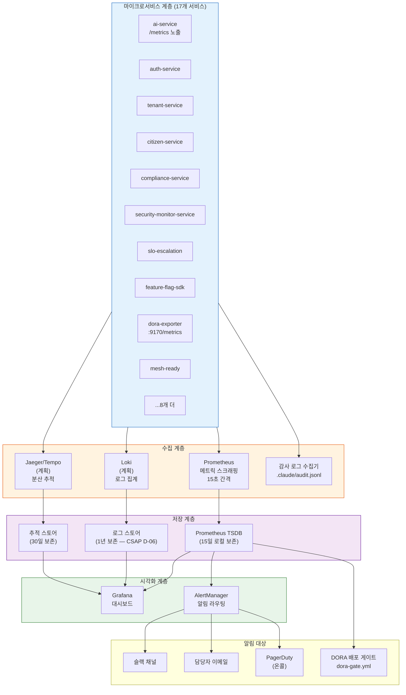
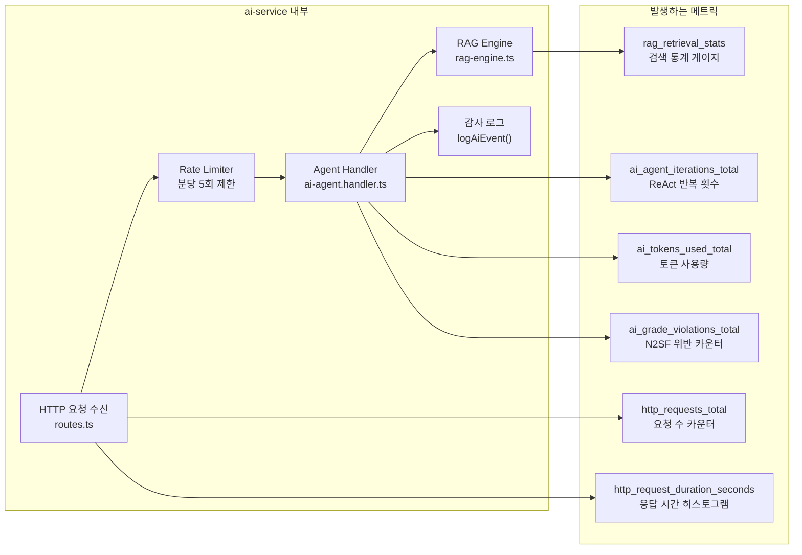
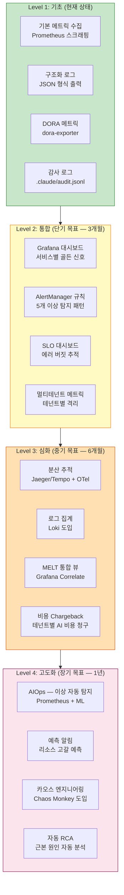

# 플랫폼 관측가능성 완전 가이드

> **대상**: 공공기관 SaaS 프레임워크 신규 SRE/운영 담당자  
> **수준**: 초급 ~ 중급 (Prometheus/Grafana 기초 권장)  
> **Design Ref**: SVC-AI-2026 DESIGN §1, SVC-AI-ADV-R1 DESIGN §6, MTU-N169 Design  
> **Plan SC**: FR-DORA.1~FR-DORA.5, FR-ADV1.7  
> **CSAP**: D-06(침해사고 관리), D-08(접근통제), D-12(시스템 개발 보안)  
> **최종 수정**: 2026-04-13

---

## 목차

1. [관측가능성이란 무엇인가](#1-관측가능성이란-무엇인가)
2. [플랫폼 관측가능성 전체 맵 다이어그램](#2-플랫폼-관측가능성-전체-맵-다이어그램)
3. [골든 신호 4개 — 기본 PromQL 예제](#3-골든-신호-4개--기본-promql-예제)
4. [rag-engine.ts 실제 코드 분석 — 메트릭화](#4-rag-enginets-실제-코드-분석--메트릭화)
5. [ai-rag.handler.ts 실제 코드 분석 — 추적과 토큰 관리](#5-ai-raghandlerts-실제-코드-분석--추적과-토큰-관리)
6. [dora-exporter 실제 코드 분석 — DORA 4대 메트릭](#6-dora-exporter-실제-코드-분석--dora-4대-메트릭)
7. [크로스서비스 추적 — Jaeger/Tempo](#7-크로스서비스-추적--jaegertempo)
8. [멀티테넌트 모니터링 — 테넌트별 격리와 비용 Chargeback](#8-멀티테넌트-모니터링)
9. [이상 탐지 전략 — PromQL 알림 패턴 5개](#9-이상-탐지-전략--promql-알림-패턴-5개)
10. [SLO 대시보드 구성 — Grafana 패널 설계](#10-slo-대시보드-구성)
11. [감사 로그 ↔ 메트릭 상관 관계 분석](#11-감사-로그--메트릭-상관-관계-분석)
12. [관측가능성 성숙도 로드맵](#12-관측가능성-성숙도-로드맵)
13. [연습 문제](#13-연습-문제)

---

## 1. 관측가능성이란 무엇인가

### 1.1 모니터링 vs 관측가능성

**모니터링(Monitoring)**은 "미리 알고 있는 문제"를 감시합니다.
```
예: CPU 사용률 > 80%이면 알림 발송
→ 알고 있는 문제만 탐지 가능
```

**관측가능성(Observability)**은 "모르는 문제도 탐지"할 수 있는 시스템 특성입니다.
```
예: 특정 테넌트의 RAG 응답이 느려졌는데 왜인지 추적하면...
→ 로그: 특정 임베딩 모델 지연 발견
→ 메트릭: bm25Candidates가 급증했음 확인
→ 추적: ai-service → vector-store 사이 레이턴시 증가 발견
→ 결론: 특정 테넌트의 지식베이스 문서가 급증하여 인덱스 부하 발생
```

### 1.2 MELT 스택 — 4가지 관측 신호

| 신호 | 설명 | 이 프로젝트 도구 | 예시 |
|------|------|----------------|------|
| **M** (Metrics) | 수치 측정값 | Prometheus + Grafana | `dora_deployment_total` |
| **E** (Events) | 이산적 발생 사건 | `.claude/audit.jsonl` | `AGENT_RUN`, `AI_GRADE_VIOLATION` |
| **L** (Logs) | 시간순 텍스트 기록 | 구조화 JSON 로그 | `{"level":"error","service":"ai-service"}` |
| **T** (Traces) | 분산 요청 추적 | Jaeger/Tempo (계획) | 요청 ID로 ai-service→RAG 전체 추적 |

### 1.3 공공기관 SaaS에서 관측가능성이 필요한 이유

1. **CSAP D-06 준수**: 침해사고 발생 시 원인 분석을 위한 로그/메트릭 보존 필수
2. **SLO 관리**: 민원 처리 API의 99.9% 가용성 목표 달성 여부 측정
3. **비용 최적화**: AI API 호출 비용을 테넌트별로 추적하여 Chargeback
4. **DORA 측정**: 개발팀 성과(배포 빈도, 리드타임)를 객관적으로 측정

---

## 2. 플랫폼 관측가능성 전체 맵 다이어그램

### 2.1 17개 서비스 → MELT 스택 전체 구조



### 2.2 ai-service 내부 메트릭 흐름



---

## 3. 골든 신호 4개 — 기본 PromQL 예제

Google SRE 팀이 정의한 모든 서비스를 측정하는 4가지 핵심 신호입니다.

### 3.1 레이턴시(Latency) — 요청 처리 시간

```promql
# ai-service 전체 P99 응답 시간 (최악의 1% 사용자 경험)
histogram_quantile(0.99,
  sum(rate(http_request_duration_seconds_bucket{service="ai-service"}[5m]))
  by (le, endpoint)
)

# RAG 쿼리 P95 응답 시간 (실시간)
histogram_quantile(0.95,
  rate(rag_query_duration_seconds_bucket{service="ai-service"}[5m])
)

# 에이전트 실행 P50 (중앙값) 응답 시간
histogram_quantile(0.50,
  rate(agent_execution_duration_seconds_bucket{service="ai-service",mode="react"}[5m])
)

# 느린 요청 비율 (5초 초과)
sum(rate(http_request_duration_seconds_bucket{service="ai-service",le="5"}[5m]))
/
sum(rate(http_request_duration_seconds_count{service="ai-service"}[5m]))
```

### 3.2 트래픽(Traffic) — 요청 처리량

```promql
# ai-service 전체 초당 요청 수 (RPS)
sum(rate(http_requests_total{service="ai-service"}[1m]))

# 엔드포인트별 RPS
sum(rate(http_requests_total{service="ai-service"}[1m])) by (endpoint)

# 테넌트별 AI 에이전트 호출 빈도
sum(rate(ai_agent_runs_total[5m])) by (tenant_id)

# DORA: 주간 배포 빈도 (dora-exporter에서)
sum(increase(dora_deployment_total{environment="production"}[7d])) by (team)
```

### 3.3 에러(Errors) — 오류 비율

```promql
# 전체 에러율 (5xx 응답)
sum(rate(http_requests_total{service="ai-service",status=~"5.."}[5m]))
/
sum(rate(http_requests_total{service="ai-service"}[5m]))

# N2SF 등급 위반 시도 빈도
sum(rate(ai_grade_violations_total[5m])) by (tenant_id, grade)

# RAG 검색 실패율
sum(rate(rag_query_failures_total[5m]))
/
sum(rate(rag_query_total[5m]))

# DORA: 변경 실패율 (CFR)
# dora-gate.yml에서 사용하는 메트릭
dora:change_failure_rate:ratio
```

### 3.4 포화도(Saturation) — 리소스 사용률

```promql
# ai-service CPU 사용률
100 * (
  1 - avg(rate(container_cpu_usage_seconds_total{container="ai-service"}[5m]))
    / avg(kube_pod_container_resource_limits{container="ai-service",resource="cpu"})
)

# 메모리 사용률
container_memory_usage_bytes{container="ai-service"}
/
kube_pod_container_resource_limits{container="ai-service",resource="memory"}
* 100

# Redis 큐 깊이 (이벤트 버스 포화도)
bullmq_queue_size{queue="ai-events"}

# BullMQ 에이전트 큐 대기 시간
bullmq_job_wait_time_seconds{queue="ai-events"}
```

---

## 4. rag-engine.ts 실제 코드 분석 — 메트릭화

이 파일은 `/data/ai-saas/platform/services/ai-service/src/lib/rag-engine.ts`에 있습니다.

### 4.1 AdvancedRAGResponse의 retrievalStats — 핵심 메트릭 소스

```typescript
// Design Ref: SVC-AI-ADV-R1 DESIGN §6
// Plan SC: FR-ADV1.7

/** Advanced RAG 응답 — 기존 RAGResponse 확장 */
export interface AdvancedRAGResponse extends RAGResponse {
  searchMode: 'semantic' | 'keyword' | 'hybrid';
  queryExpansion?: ExpandedQuery;    // 쿼리 확장 결과
  rerankingApplied: boolean;         // Reranking 적용 여부
  /** 상세 검색 통계 — 이것이 메트릭화 대상 */
  retrievalStats: {
    bm25Candidates: number;          // BM25 키워드 검색 후보 수
    semanticCandidates: number;      // 시맨틱 검색 후보 수
    fusedCandidates: number;         // RRF 융합 후 후보 수
    rerankCandidates: number;        // Reranking 후 후보 수
    finalCount: number;              // 최종 컨텍스트에 포함된 수
  };
}
```

**retrievalStats를 Prometheus 메트릭으로 변환하는 방법**:

```typescript
// rag-engine.ts에 추가할 메트릭 계측 코드
// Design Ref: SVC-AI-ADV-R1 DESIGN §6
import { Histogram, Gauge, Counter } from 'prom-client';

// RAG 파이프라인 단계별 후보 수 히스토그램
const ragRetrievalCandidates = new Histogram({
  name: 'rag_retrieval_candidates',
  help: 'RAG 검색 단계별 후보 문서 수',
  labelNames: ['stage', 'search_mode', 'tenant_id'] as const,
  buckets: [0, 1, 3, 5, 10, 20, 50, 100],
});

// RAG 검색 모드 사용 카운터
const ragSearchModeTotal = new Counter({
  name: 'rag_search_mode_total',
  help: 'RAG 검색 모드 사용 횟수',
  labelNames: ['search_mode', 'reranking_applied', 'tenant_id'] as const,
});

// Reranking 적용률 게이지
const ragRerankingRatio = new Gauge({
  name: 'rag_reranking_applied_ratio',
  help: 'Reranking 적용 비율 (0~1)',
  labelNames: ['tenant_id'] as const,
});

// runAdvancedRAG 함수 반환 전에 메트릭 기록
export async function runAdvancedRAG(
  tenantId: string,
  question: string,
  queryEmbedding: number[],
  options: AdvancedRAGOptions = {},
  modelConfig?: { provider: string; endpoint: string; name: string; config?: unknown },
): Promise<AdvancedRAGResponse> {
  // ... 기존 로직 ...

  // 메트릭 기록: retrievalStats를 Prometheus에 반영
  const { retrievalStats, searchMode, rerankingApplied } = result;

  ragRetrievalCandidates.observe(
    { stage: 'bm25', search_mode: searchMode, tenant_id: tenantId },
    retrievalStats.bm25Candidates
  );
  ragRetrievalCandidates.observe(
    { stage: 'semantic', search_mode: searchMode, tenant_id: tenantId },
    retrievalStats.semanticCandidates
  );
  ragRetrievalCandidates.observe(
    { stage: 'fused', search_mode: searchMode, tenant_id: tenantId },
    retrievalStats.fusedCandidates
  );
  ragRetrievalCandidates.observe(
    { stage: 'final', search_mode: searchMode, tenant_id: tenantId },
    retrievalStats.finalCount
  );

  ragSearchModeTotal.inc({
    search_mode: searchMode,
    reranking_applied: String(rerankingApplied),
    tenant_id: tenantId,
  });

  return result;
}
```

### 4.2 RAG 파이프라인 성능 분석용 PromQL

```promql
# 검색 모드별 평균 최종 후보 수
avg(rag_retrieval_candidates{stage="final"}) by (search_mode)
# 결과: hybrid=4.2, semantic=3.1, keyword=2.8
# 해석: hybrid 모드가 더 많은 관련 문서를 찾음

# Reranking 효과 측정: 융합 후보 vs 최종 후보 비율
avg(rag_retrieval_candidates{stage="final"})
/
avg(rag_retrieval_candidates{stage="fused"})
# 결과: 0.25 → Reranking으로 후보의 25%만 선택됨 (정밀도 향상)

# 테넌트별 hybrid vs semantic 검색 분포
sum(rag_search_mode_total) by (tenant_id, search_mode)

# Reranking 미적용 비율 (성능 저하 원인 분석용)
sum(rag_search_mode_total{reranking_applied="false"})
/
sum(rag_search_mode_total)
```

### 4.3 컨텍스트 압축 효과 측정

```typescript
// 컨텍스트 압축 전후 토큰 비교 메트릭
const ragContextTokens = new Histogram({
  name: 'rag_context_tokens',
  help: 'RAG 컨텍스트 토큰 수 (압축 전/후)',
  labelNames: ['stage', 'compression_enabled'] as const,
  buckets: [100, 500, 1000, 2000, 3000, 4000, 6000],
});

// 압축 전 토큰
ragContextTokens.observe(
  { stage: 'pre_compression', compression_enabled: 'true' },
  totalContextTokensBeforeCompression
);

// 압축 후 토큰
ragContextTokens.observe(
  { stage: 'post_compression', compression_enabled: 'true' },
  totalContextTokens
);
```

```promql
# 컨텍스트 압축률 (얼마나 줄었는가)
1 - (
  avg(rag_context_tokens{stage="post_compression"})
  /
  avg(rag_context_tokens{stage="pre_compression"})
)
# 결과: 0.35 → 평균 35% 토큰 절감
```

### 4.4 DEFAULT_SYSTEM_PROMPT — 품질 지표

```typescript
const DEFAULT_SYSTEM_PROMPT = `당신은 공공기관 문서 전문 AI 어시스턴트입니다.
반드시 제공된 문서 컨텍스트에 근거하여 답변하세요.
문서에 없는 내용은 "제공된 문서에서 찾을 수 없습니다"라고 정직하게 답하세요.
답변은 한국어로, 공공기관 공문서 스타일로 작성하세요.
각 주장에는 [출처: 문서명] 형식으로 근거를 명시하세요.`;
```

이 프롬프트가 잘 작동하는지 모니터링하는 방법:

```typescript
// "제공된 문서에서 찾을 수 없습니다" 응답 비율 추적
const ragNoContextTotal = new Counter({
  name: 'rag_no_context_responses_total',
  help: '컨텍스트 없음 응답 수 — 지식베이스 부족 지표',
  labelNames: ['tenant_id'] as const,
});

// runRAG에서 빈 컨텍스트 감지 시 카운터 증가
if (contextText.length === 0) {
  ragNoContextTotal.inc({ tenant_id: tenantId });
  return { answer: '죄송합니다. 해당 질문에 관련된 문서를 찾을 수 없습니다...', ... };
}
```

---

## 5. ai-rag.handler.ts 실제 코드 분석 — 추적과 토큰 관리

이 파일은 `/data/ai-saas/platform/services/ai-service/src/handlers/ai-rag.handler.ts`에 있습니다.

### 5.1 감사 로그 — 메트릭과의 연결 고리

```typescript
// RAG 쿼리 감사 로그 기록
await logAiEvent('RAG_QUERY', actor, 'rag', body.tenantId, request.ip,
  request.headers['user-agent'] ?? 'unknown', {
    question: maskPII(body.question).slice(0, 100), // PII 마스킹
    contextChunks: ragResponse.contextChunks,       // 검색된 청크 수
    tokensUsed: ragResponse.tokensUsed,             // 토큰 사용량
  });
```

**감사 로그와 메트릭의 연계**: 감사 로그(`audit.jsonl`)는 개별 이벤트 기록, Prometheus 메트릭은 집계 통계를 담당합니다. 특정 이상을 메트릭으로 탐지한 후, 감사 로그로 상세 원인을 조사합니다.

```
[이상 탐지 → 원인 조사 흐름]

1. Prometheus 알림: "테넌트 A의 tokensUsed가 급증"
2. Grafana 대시보드: 시간대 확인 → 14:00~15:00 사이 급증
3. 감사 로그 조회:
   jq 'select(.action == "RAG_QUERY" and .tenantId == "tenant-a")
       | select(.timestamp >= "2026-04-13T14:00:00Z")' \
   .claude/audit.jsonl
4. 원인 발견: 14:10에 RAG ingest로 대용량 문서 10개 추가 → 임베딩 연산 급증
```

### 5.2 Span ID 삽입 — 분산 추적의 기초

```typescript
// 분산 추적을 위한 Span ID 생성 및 전파
// Design Ref: SVC-AI-ADV-R1 DESIGN §6

export async function ragQueryHandler(
  request: FastifyRequest<{ Body: QueryBody }>,
  reply: FastifyReply,
): Promise<void> {
  // correlationId는 API 게이트웨이에서 생성하여 헤더로 전달
  const correlationId = request.headers['x-correlation-id'] as string
    ?? crypto.randomUUID();
  const spanId = crypto.randomUUID(); // 이 핸들러의 고유 Span ID

  try {
    // Span 시작 기록
    const spanStart = Date.now();

    // 임베딩 생성 (하위 Span)
    const embeddingSpanId = crypto.randomUUID();
    const queryEmbedding = await generateEmbedding(body.question, body.embedModelId);
    const embeddingDuration = Date.now() - spanStart;

    // RAG 파이프라인 실행
    const ragStart = Date.now();
    const ragResponse = await runRAG(...);
    const ragDuration = Date.now() - ragStart;

    // 전체 처리 시간
    const totalDuration = Date.now() - spanStart;

    // 추적 정보를 감사 로그에 포함
    await logAiEvent('RAG_QUERY', actor, 'rag', body.tenantId, request.ip,
      request.headers['user-agent'] ?? 'unknown', {
        correlationId,          // 요청 전체 추적 ID
        spanId,                 // 이 핸들러의 Span
        embeddingDurationMs: embeddingDuration,
        ragDurationMs: ragDuration,
        totalDurationMs: totalDuration,
        contextChunks: ragResponse.contextChunks,
        tokensUsed: ragResponse.tokensUsed,
      });

    // 추적 헤더를 응답에 포함
    await reply.header('x-correlation-id', correlationId)
               .header('x-span-id', spanId)
               .status(200).send({ success: true, data: ragResponse });
  }
}
```

### 5.3 Advanced RAG 추가 메트릭 기록

```typescript
// Advanced RAG는 더 많은 메트릭을 기록
await logAiEvent('RAG_ADVANCED_QUERY', actor, 'rag-advanced', body.tenantId, ..., {
  searchMode: body.searchMode,
  enableReranking: body.enableReranking,
  enableQueryExpansion: body.enableQueryExpansion,
  enableCompression: body.enableCompression,
  contextChunks: ragResponse.contextChunks,
  tokensUsed: ragResponse.tokensUsed,
  retrievalStats: ragResponse.retrievalStats,  // 상세 검색 통계
});
```

**observability 포인트**: `retrievalStats`는 다음 분석에 활용됩니다.
- BM25 vs Semantic 후보 비율 → 어떤 검색 방식이 더 효과적인지
- Reranking 전후 후보 수 변화 → Reranking의 필터링 강도
- finalCount 트렌드 → 지식베이스 품질 (낮으면 관련 문서 부족)

---

## 6. dora-exporter 실제 코드 분석 — DORA 4대 메트릭

이 파일은 `/data/ai-saas/packages/dora-exporter/src/index.ts`에 있습니다.

### 6.1 4대 메트릭 Prometheus 정의

```typescript
// Design Ref: docs/02-design/mtus/MTU-N169-dora-metrics.design.md §3
// Plan SC: FR-DORA.1~FR-DORA.5

const register = new Registry();
collectDefaultMetrics({ register }); // Node.js 기본 메트릭도 수집

// FR-DORA.1: 배포 빈도 — Counter (단조 증가)
const deploymentTotal = new Counter({
  name: 'dora_deployment_total',
  help: '배포 횟수 (DORA Deployment Frequency)',
  labelNames: ['team', 'service', 'environment'] as const,
  registers: [register],
});

// FR-DORA.2: 변경 리드타임 — Histogram
// 버킷: 1분, 5분, 15분, 30분, 1시간, 2시간, 4시간, 8시간, 1일, 1주
const leadTimeSeconds = new Histogram({
  name: 'dora_lead_time_seconds',
  help: '변경 리드타임 - 첫 커밋에서 프로덕션 배포까지 (초)',
  labelNames: ['team', 'service'] as const,
  buckets: [60, 300, 900, 1800, 3600, 7200, 14400, 28800, 86400, 604800],
  registers: [register],
});

// FR-DORA.3: 변경 실패율 — Gauge (0.0 ~ 1.0)
const changeFailureRate = new Gauge({
  name: 'dora_change_failure_rate',
  help: '변경 실패율 (0.0 ~ 1.0)',
  labelNames: ['team', 'service'] as const,
  registers: [register],
});

// FR-DORA.4: MTTR — Histogram
const mttrSeconds = new Histogram({
  name: 'dora_mttr_seconds',
  help: '서비스 복구 시간 (초)',
  labelNames: ['team', 'service', 'severity'] as const,
  buckets: [60, 300, 900, 1800, 3600, 7200, 14400, 28800, 86400],
  registers: [register],
});

// FR-DORA.8: DORA 등급 — Gauge (0=Low, 1=Medium, 2=High, 3=Elite)
const teamLevel = new Gauge({
  name: 'dora_team_level',
  help: 'DORA 등급 (0=Low, 1=Medium, 2=High, 3=Elite)',
  labelNames: ['team'] as const,
  registers: [register],
});
```

### 6.2 Gitea Webhook 처리 — 배포 빈도와 리드타임

```typescript
app.post('/webhook/gitea', async (req, res) => {
  // Zod 검증 (CSAP D-12)
  const payload = giteaWebhookSchema.parse(req.body);

  const team = extractTeam(payload.repository.full_name);
  const service = extractService(payload.repository.full_name);
  const environment = extractEnvironment(payload.ref);

  if (isDeploymentEvent(payload.ref)) {
    // FR-DORA.1: 배포 빈도 증가
    deploymentTotal.inc({ team, service, environment });

    // FR-DORA.2: 리드타임 계산
    // 첫 커밋 시간부터 지금(배포 완료)까지의 차이
    const firstCommitTime = getFirstCommitTimestamp(payload.commits);
    if (firstCommitTime) {
      const deployTime = Date.now();
      const leadTime = leadTimeCalculator.calculate(firstCommitTime, deployTime);
      leadTimeSeconds.observe({ team, service }, leadTime);
      // leadTime 단위: 초
      // 예: 2시간 = 7200초 → 7200~14400 버킷에 관측값 추가
    }

    // FR-DORA.3: 변경 실패 감지
    // commit 메시지에 "hotfix", "revert", "rollback"이 포함되면 실패로 판단
    const isFailure = changeFailureDetector.detect(payload.commits);
    if (isFailure) {
      changeFailureDetector.recordFailure(team, service);
    } else {
      changeFailureDetector.recordSuccess(team, service);
    }
    // 실시간 CFR 업데이트 (최근 N회 배포 중 실패 비율)
    const rate = changeFailureDetector.getRate(team, service);
    changeFailureRate.set({ team, service }, rate);
  }
});
```

### 6.3 AlertManager Webhook 처리 — MTTR

```typescript
app.post('/webhook/alertmanager', async (req, res) => {
  const payload = alertManagerSchema.parse(req.body);

  for (const alert of payload.alerts) {
    const service = alert.labels.service || 'unknown';
    const team = alert.labels.team || 'unknown';
    const severity = alert.labels.severity || 'warning';

    if (alert.status === 'firing') {
      // FR-DORA.4: 장애 시작 기록
      // startsAt: AlertManager가 알림 발생 시각을 ISO 8601 형식으로 제공
      mttrTracker.recordIncidentStart(service, team, alert.startsAt);

    } else if (alert.status === 'resolved') {
      // FR-DORA.4: 복구 시간 계산
      const recoveryTime = mttrTracker.recordIncidentEnd(
        service, team, alert.endsAt || new Date().toISOString()
      );
      if (recoveryTime !== null) {
        // recoveryTime: 장애 시작 ~ 복구까지 초 단위
        mttrSeconds.observe({ team, service, severity }, recoveryTime);
      }
    }
  }
});
```

### 6.4 DORA 등급 분류 — classify 엔드포인트

```typescript
// POST /classify — 팀별 DORA 등급 계산 및 게이지 업데이트
app.post('/classify', async (_req, res) => {
  const teams = changeFailureDetector.getTeams();
  const results: Record<string, DORALevel> = {};

  for (const team of teams) {
    const level = classifier.classify({
      deploymentFrequency: await getDeploymentRate(team),  // 일평균 배포 횟수
      leadTimeSeconds: await getMedianLeadTime(team),      // 중앙값 리드타임
      changeFailureRate: changeFailureDetector.getTeamRate(team), // CFR
      mttrSeconds: mttrTracker.getMedianMTTR(team),        // 중앙값 MTTR
    });
    teamLevel.set({ team }, level);
    results[team] = level;
  }
});

// DORA 등급 기준 (구글 DORA 연구 기반)
// Elite: 일 다수 배포, LT < 1시간, CFR < 5%, MTTR < 1시간
// High:  주 1회~일 1회, LT 1일~1주, CFR 5~15%, MTTR < 1일
// Medium: 월 1회~주 1회, LT 1주~1달, CFR 15~30%, MTTR < 1주
// Low:   월 1회 미만, LT > 1달, CFR > 30%, MTTR > 1주
```

### 6.5 이벤트 큐 — 비동기 메트릭 처리

```typescript
const eventQueue = new EventQueue({ maxQueueSize: 10000, maxRetries: 3 });

// 이벤트 큐 핸들러 — 배포 이벤트를 비동기로 처리
eventQueue.setHandler(async (event) => {
  const { team, service, environment, type } = event;
  if (type === DORAEventType.Deployment) {
    deploymentTotal.inc({ team, service, environment });
  } else if (
    type === DORAEventType.DeploymentFailure ||
    type === DORAEventType.Rollback ||
    type === DORAEventType.Hotfix  // Hotfix도 실패로 간주
  ) {
    changeFailureDetector.recordFailure(team, service);
    changeFailureRate.set({ team, service }, changeFailureDetector.getRate(team, service));
  }
});
```

**설계 이유**: Webhook 요청이 몰릴 때 동기로 처리하면 응답이 느려집니다. 이벤트 큐로 비동기 처리하여 webhook 응답 시간을 최소화합니다.

---

## 7. 크로스서비스 추적 — Jaeger/Tempo

### 7.1 분산 추적의 필요성

단일 사용자 요청이 여러 서비스를 거칩니다.

```
사용자 → API 게이트웨이 → ai-service → vector-store → RAG 엔진 → LLM 서버
                            ↓
                       auth-service (인증 검증)
```

각 서비스의 로그만 보면 전체 흐름을 파악하기 어렵습니다. 분산 추적은 요청 전체의 타임라인을 하나로 보여줍니다.

### 7.2 OpenTelemetry 계측 — ai-service 예시

```typescript
// platform/services/ai-service/src/instrumentation.ts
// Plan SC: 향후 추가 예정 (현재는 correlationId 기반)
import { NodeSDK } from '@opentelemetry/sdk-node';
import { OTLPTraceExporter } from '@opentelemetry/exporter-trace-otlp-grpc';
import { HttpInstrumentation } from '@opentelemetry/instrumentation-http';
import { FastifyInstrumentation } from '@opentelemetry/instrumentation-fastify';

const sdk = new NodeSDK({
  // Tempo로 추적 데이터 전송
  traceExporter: new OTLPTraceExporter({
    url: process.env.OTLP_ENDPOINT || 'http://tempo.monitoring.svc:4317',
  }),
  instrumentations: [
    new HttpInstrumentation(),
    new FastifyInstrumentation(),
  ],
  resource: {
    attributes: {
      'service.name': 'ai-service',
      'service.version': process.env.SERVICE_VERSION || '1.0.0',
      'deployment.environment': process.env.NODE_ENV || 'development',
    },
  },
});

sdk.start();
```

### 7.3 ai-service → auth-service 추적 예시

```typescript
// RAG 핸들러에서 수동 Span 생성
import { trace, context } from '@opentelemetry/api';

const tracer = trace.getTracer('ai-service');

export async function ragQueryHandler(request, reply) {
  // 부모 Span: HTTP 요청 전체
  return tracer.startActiveSpan('rag.query', async (rootSpan) => {
    try {
      rootSpan.setAttributes({
        'rag.tenant_id': body.tenantId,
        'rag.search_mode': body.searchMode || 'semantic',
        'rag.reranking': body.enableReranking ?? false,
      });

      // 자식 Span 1: 임베딩 생성
      const embedding = await tracer.startActiveSpan('rag.generate_embedding', async (span) => {
        const result = await generateEmbedding(body.question, body.embedModelId);
        span.end();
        return result;
      });

      // 자식 Span 2: 벡터 검색
      const searchResults = await tracer.startActiveSpan('rag.vector_search', async (span) => {
        span.setAttributes({ 'rag.top_k': body.topK || 5 });
        const result = await semanticSearch(embedding, body.tenantId, body.topK, body.minScore);
        span.setAttributes({ 'rag.results_count': result.length });
        span.end();
        return result;
      });

      // 자식 Span 3: LLM 호출
      const answer = await tracer.startActiveSpan('rag.llm_generate', async (span) => {
        span.setAttributes({ 'llm.model': chatModelConfig?.name || 'default' });
        const result = await provider.chat(messages, { maxTokens: 2048 });
        span.setAttributes({ 'llm.tokens_used': result.tokensUsed });
        span.end();
        return result;
      });

      rootSpan.setAttributes({ 'rag.tokens_used': answer.tokensUsed });
      rootSpan.end();

    } catch (error) {
      rootSpan.setStatus({ code: SpanStatusCode.ERROR, message: error.message });
      rootSpan.end();
      throw error;
    }
  });
}
```

### 7.4 Jaeger에서 추적 조회

```bash
# Jaeger API로 특정 correlationId 추적
curl "http://jaeger.monitoring.svc:16686/api/traces?service=ai-service&tags=correlation_id:abc-123"

# Grafana Tempo에서 TraceQL 쿼리
{ service.name="ai-service" && duration>2s }

# 느린 RAG 쿼리 찾기
{ service.name="ai-service" && .rag.search_mode="hybrid" } | duration > 5s
```

---

## 8. 멀티테넌트 모니터링

### 8.1 테넌트 레이블 설계 원칙

모든 메트릭에 `tenant_id` 레이블을 붙여 테넌트별로 집계합니다.

```typescript
// 메트릭 정의 시 tenant_id 레이블 포함
const aiTokensUsed = new Counter({
  name: 'ai_tokens_used_total',
  help: 'AI API 토큰 사용량',
  labelNames: ['tenant_id', 'model', 'operation'] as const,
});

// 핸들러에서 기록
aiTokensUsed.inc({
  tenant_id: body.tenantId,  // 테넌트별 격리
  model: result.model,
  operation: 'agent_run',
}, result.tokensUsed);
```

**주의**: 테넌트 수가 많아지면 레이블 카디널리티가 폭발합니다. 레이블 값의 종류가 너무 많으면 Prometheus 메모리 문제가 발생합니다.

```promql
# 테넌트별 토큰 사용량 (Chargeback용)
sum(ai_tokens_used_total) by (tenant_id)

# 전체 대비 특정 테넌트 비율
sum(ai_tokens_used_total{tenant_id="tenant-a"})
/
sum(ai_tokens_used_total)
* 100
```

### 8.2 비용 Chargeback — 테넌트별 AI 비용 청구

```typescript
// 비용 계산 함수 (모델별 토큰당 비용)
const TOKEN_COST: Record<string, number> = {
  'gpt-4': 0.00003,      // 입력 토큰당 $0.03/1000
  'gpt-3.5-turbo': 0.000002,
  'ollama/llama3': 0,    // 온프레미스 LLM은 무료 (서버 비용만)
};

// 일별 테넌트 비용 집계
const dailyTenantCost = new Gauge({
  name: 'ai_daily_cost_krw',
  help: '일별 AI 비용 (원화)',
  labelNames: ['tenant_id', 'model'] as const,
});
```

```promql
# 테넌트별 일 비용 조회 (대시보드용)
sum(ai_daily_cost_krw) by (tenant_id)

# 월 비용 추정 (오늘까지 일 평균 × 30)
avg_over_time(
  sum(ai_daily_cost_krw) by (tenant_id) [30d:1d]
) * 30
```

### 8.3 멀티테넌트 격리 — 메트릭 보안

테넌트 A의 메트릭이 테넌트 B에게 노출되면 안 됩니다.

```yaml
# Grafana: 테넌트별 데이터 소스 격리
# Grafana 조직(Organization) 기능 활용
# 테넌트 A 조직: tenant_id="tenant-a" 필터가 적용된 데이터 소스만 접근
# 테넌트 B 조직: tenant_id="tenant-b" 필터가 적용된 데이터 소스만 접근

# Prometheus: recording rule로 테넌트별 집계
groups:
  - name: tenant_aggregation
    rules:
      - record: tenant:ai_tokens:total_5m
        expr: sum(rate(ai_tokens_used_total[5m])) by (tenant_id)
```

---

## 9. 이상 탐지 전략 — PromQL 알림 패턴 5개

### 9.1 패턴 1: N2SF 등급 위반 급증

```yaml
# alertmanager/rules/ai-security.yml
groups:
  - name: ai-security
    rules:
      - alert: AIGradeViolationSpike
        expr: |
          sum(rate(ai_grade_violations_total[5m])) by (tenant_id) > 0.1
          # 분당 6회(5분에 0.1/s × 60s × 5m = 30회) 이상 위반
        for: 2m
        labels:
          severity: critical
          csap_ref: "N2SF-N05"
        annotations:
          summary: "테넌트 {{ $labels.tenant_id }}: N2SF 등급 위반 급증"
          description: |
            지난 5분간 등급 위반 시도가 급증했습니다.
            보안 공격 또는 코드 오류일 수 있습니다.
            즉시 감사 로그를 확인하세요: .claude/audit.jsonl
```

### 9.2 패턴 2: RAG 응답 품질 저하 (No-Context 비율)

```yaml
      - alert: RAGNoContextHigh
        expr: |
          (
            sum(rate(rag_no_context_responses_total[10m])) by (tenant_id)
            /
            sum(rate(rag_query_total[10m])) by (tenant_id)
          ) > 0.3
          # 30% 이상의 질문이 "관련 문서 없음" 응답
        for: 5m
        labels:
          severity: warning
        annotations:
          summary: "테넌트 {{ $labels.tenant_id }}: 지식베이스 부족"
          description: "RAG 쿼리의 {{ $value | humanizePercentage }}가 관련 문서를 찾지 못하고 있습니다. 지식베이스 문서를 추가하거나 검색 임계값(minScore)을 낮추세요."
```

### 9.3 패턴 3: DORA 변경 실패율 임계값 초과

```yaml
  - name: dora-quality
    rules:
      - alert: DORAChangeFailureRateHigh
        expr: |
          dora_change_failure_rate > 0.15
          # CFR > 15% → DORA Medium 이하
        for: 30m
        labels:
          severity: warning
          csap_ref: "D-12"
        annotations:
          summary: "{{ $labels.team }}/{{ $labels.service }}: 변경 실패율 높음"
          description: |
            변경 실패율이 {{ $value | humanizePercentage }}입니다.
            DORA 배포 게이트(dora-gate.yml)에서 경고가 발생할 수 있습니다.

      - alert: DORAChangeFailureRateCritical
        expr: dora_change_failure_rate > 0.30
        for: 10m
        labels:
          severity: critical
          csap_ref: "D-12"
        annotations:
          summary: "{{ $labels.team }}: 배포 게이트 차단 예정"
          description: "CFR {{ $value | humanizePercentage }} > 30%. dora-gate.yml에 의해 다음 배포가 차단됩니다."
```

### 9.4 패턴 4: AI 에이전트 토큰 비용 급증

```yaml
  - name: ai-cost
    rules:
      - alert: AICostSpike
        expr: |
          sum(rate(ai_tokens_used_total[1h])) by (tenant_id) > 10000
          # 시간당 10,000 토큰 초과 (비용 임계값)
        for: 15m
        labels:
          severity: warning
        annotations:
          summary: "테넌트 {{ $labels.tenant_id }}: AI 비용 급증"
          description: |
            시간당 토큰 사용량이 {{ $value }}개입니다.
            이상한 패턴이거나 무한 루프가 의심됩니다.
            에이전트 maxIterations 설정을 확인하세요.
```

### 9.5 패턴 5: SLO 위반 예측 — 번다운 알림

```yaml
  - name: slo-burnrate
    rules:
      # 1시간 기준 에러 번다운 알림 (30일 SLO 0.1% 에러 버짓 소진 예측)
      - alert: SLOErrorBudgetBurning
        expr: |
          (
            sum(rate(http_requests_total{service="ai-service",status=~"5.."}[1h]))
            /
            sum(rate(http_requests_total{service="ai-service"}[1h]))
          ) > (1 - 0.999) * 14.4
          # 현재 에러율이 30일 예산을 2시간 안에 소진하는 속도
        for: 5m
        labels:
          severity: critical
          type: slo_burnrate
        annotations:
          summary: "AI 서비스 SLO 에러 버짓 빠르게 소진 중"
          description: |
            현재 에러율: {{ $value | humanizePercentage }}
            30일 SLO 목표: 99.9%
            즉각적인 조치가 필요합니다.
```

---

## 10. SLO 대시보드 구성

### 10.1 SLO 대시보드 패널 구성

```json
{
  "dashboard": {
    "title": "AI Service SLO Dashboard",
    "uid": "ai-service-slo",
    "panels": [
      {
        "id": 1,
        "title": "에러 버짓 남은 시간 (30일)",
        "type": "stat",
        "gridPos": { "x": 0, "y": 0, "w": 6, "h": 4 },
        "targets": [
          {
            "expr": "1 - (sum(rate(http_requests_total{service='ai-service',status=~'5..'}[30d])) / sum(rate(http_requests_total{service='ai-service'}[30d])) / 0.001)",
            "legendFormat": "에러 버짓 잔여율"
          }
        ],
        "fieldConfig": {
          "defaults": {
            "unit": "percentunit",
            "thresholds": {
              "steps": [
                { "color": "red", "value": 0 },
                { "color": "yellow", "value": 0.25 },
                { "color": "green", "value": 0.5 }
              ]
            }
          }
        }
      },
      {
        "id": 2,
        "title": "요청 성공률 (99.9% SLO)",
        "type": "timeseries",
        "gridPos": { "x": 6, "y": 0, "w": 18, "h": 8 },
        "targets": [
          {
            "expr": "sum(rate(http_requests_total{service='ai-service',status!~'5..'}[5m])) / sum(rate(http_requests_total{service='ai-service'}[5m]))",
            "legendFormat": "성공률"
          }
        ],
        "fieldConfig": {
          "defaults": {
            "unit": "percentunit",
            "custom": {
              "lineWidth": 2,
              "fillOpacity": 10
            }
          },
          "overrides": [
            {
              "matcher": { "id": "byName", "options": "성공률" },
              "properties": [
                {
                  "id": "thresholds",
                  "value": {
                    "steps": [
                      { "color": "red", "value": 0 },
                      { "color": "green", "value": 0.999 }
                    ]
                  }
                }
              ]
            }
          ]
        }
      },
      {
        "id": 3,
        "title": "P99 응답 시간 (AI Agent)",
        "type": "timeseries",
        "gridPos": { "x": 0, "y": 8, "w": 12, "h": 8 },
        "targets": [
          {
            "expr": "histogram_quantile(0.99, sum(rate(agent_execution_duration_seconds_bucket{service='ai-service'}[5m])) by (le, mode))",
            "legendFormat": "P99 - {{ mode }}"
          },
          {
            "expr": "histogram_quantile(0.50, sum(rate(agent_execution_duration_seconds_bucket{service='ai-service'}[5m])) by (le, mode))",
            "legendFormat": "P50 - {{ mode }}"
          }
        ],
        "fieldConfig": {
          "defaults": { "unit": "s" }
        }
      },
      {
        "id": 4,
        "title": "DORA 4대 지표 현황",
        "type": "table",
        "gridPos": { "x": 12, "y": 8, "w": 12, "h": 8 },
        "targets": [
          {
            "expr": "dora_team_level",
            "legendFormat": "등급"
          },
          {
            "expr": "sum(increase(dora_deployment_total[7d])) by (team)",
            "legendFormat": "주간 배포 수"
          },
          {
            "expr": "dora_change_failure_rate * 100",
            "legendFormat": "CFR (%)"
          }
        ]
      }
    ]
  }
}
```

### 10.2 토큰 사용량 대시보드

```promql
# 패널 1: 테넌트별 일 토큰 사용량 (막대 차트)
sum(increase(ai_tokens_used_total[24h])) by (tenant_id)

# 패널 2: 모델별 비용 (원화 환산)
sum(increase(ai_tokens_used_total[24h])) by (model)
* on(model) group_left() (
  {__name__="model_token_cost_krw"}
)

# 패널 3: RAG vs Agent 토큰 비율 (파이 차트)
sum(increase(ai_tokens_used_total[24h])) by (operation)

# 패널 4: 시간대별 AI 부하 (히트맵)
sum(rate(ai_tokens_used_total[1h])) by (hour_of_day)
```

---

## 11. 감사 로그 ↔ 메트릭 상관 관계 분석

### 11.1 감사 로그 구조 — CSAP D-06

```jsonl
// .claude/audit.jsonl 예시 (실제 파일 형식)
{"timestamp":"2026-04-13T09:30:00Z","actor":"user-123","action":"AGENT_RUN","tenantId":"tenant-a","ip":"192.168.1.1","detail":{"query":"예산 집행률 조회","iterations":3,"tokensUsed":1250,"timedOut":false,"durationMs":4200},"csap_ref":"D-06"}
{"timestamp":"2026-04-13T09:31:00Z","actor":"user-456","action":"AI_GRADE_VIOLATION","tenantId":"tenant-b","ip":"10.0.0.5","detail":{"grade":"C","blocked":true,"endpoint":"agent"},"csap_ref":"D-06"}
{"timestamp":"2026-04-13T09:32:00Z","actor":"csap-evidence-ci","action":"CSAP_EVIDENCE_CI_COMPLETE","detail":"workflow=csap-evidence","csap_ref":"D-06"}
```

### 11.2 감사 로그를 메트릭으로 변환 — mtail/Loki

```bash
# mtail로 감사 로그에서 메트릭 추출
# /etc/mtail/audit_metrics.mtail

counter ai_grade_violations_total by tenant_id
counter agent_runs_total by tenant_id
histogram agent_duration_ms by tenant_id

/^{"timestamp":"[^"]+","actor":"[^"]+","action":"AI_GRADE_VIOLATION","tenantId":"(?P<tenant>[^"]+)"/ {
  ai_grade_violations_total[$tenant]++
}

/^{"timestamp":"[^"]+","actor":"[^"]+","action":"AGENT_RUN","tenantId":"(?P<tenant>[^"]+)",".*"tokensUsed":(?P<tokens>[0-9]+)/ {
  agent_runs_total[$tenant]++
}
```

### 11.3 CSAP D-06 준수 대시보드

```promql
# 하루 감사 이벤트 수 (CSAP D-06: 전수 기록 확인)
sum(increase(audit_events_total[24h])) by (action)

# 감사 로그 공백 탐지 (1시간 동안 이벤트 없으면 이상)
# 정상 운영 중 ai-service는 지속적으로 이벤트를 발생시켜야 함
absent(rate(audit_events_total{service="ai-service"}[1h]))

# 보안 이벤트 비율 (CSAP D-06: 침해 탐지 지표)
sum(audit_events_total{action=~".*VIOLATION.*|.*BLOCKED.*|.*FAILED.*"})
/
sum(audit_events_total)
* 100
```

### 11.4 메트릭에서 감사 로그로의 드릴다운

Grafana Explore에서 메트릭 이상 발견 후 감사 로그를 조회하는 워크플로우:

```bash
# 1. Prometheus에서 이상 시간대 특정
# 14:10 ~ 14:15 사이 ai_grade_violations_total 급증

# 2. 해당 시간대 감사 로그 조회
jq --arg start "2026-04-13T14:10:00Z" \
   --arg end "2026-04-13T14:15:00Z" \
   'select(.timestamp >= $start and .timestamp <= $end
           and .action == "AI_GRADE_VIOLATION")' \
   /data/ai-saas/.claude/audit.jsonl

# 3. 결과 분석
# {
#   "action": "AI_GRADE_VIOLATION",
#   "tenantId": "tenant-x",
#   "detail": { "grade": "C", "blocked": true, "endpoint": "agent" }
# }
# → tenant-x의 코드에서 C등급 데이터를 AI에 전송하려는 버그 존재

# 4. 해당 테넌트 격리 조치
kubectl annotate tenant tenant-x ai-blocked=true
```

---

## 12. 관측가능성 성숙도 로드맵



### 12.1 Level 1 현재 상태 체크리스트

```
현재 구현된 관측가능성:
[v] dora-exporter: dora_deployment_total, dora_lead_time_seconds, dora_change_failure_rate, dora_mttr_seconds
[v] 감사 로그: .claude/audit.jsonl (모든 AI 이벤트 기록)
[v] RAG retrievalStats: 검색 통계 반환 (메트릭화 준비됨)
[v] logAiEvent(): 구조화된 감사 이벤트 기록
[v] DORA 배포 게이트: CFR 기반 자동 차단 (dora-gate.yml)
[v] Prometheus 스크래핑: /metrics 엔드포인트
[ ] Grafana 대시보드: 미구성
[ ] AlertManager 규칙: 미설정
[ ] 분산 추적: OTel 미계측
[ ] 로그 집계: Loki 미도입
```

### 12.2 Level 2로의 전환 — 즉시 적용 가능한 항목

```bash
# 1. Grafana 대시보드 임포트
curl -X POST http://grafana:3000/api/dashboards/db \
  -H "Content-Type: application/json" \
  -d @infra/grafana/dashboards/ai-service-slo.json

# 2. AlertManager 규칙 적용
kubectl apply -f infra/alertmanager/rules/ai-security.yml

# 3. dora-exporter Prometheus scrape 설정 확인
# prometheus.yml에 추가:
# - job_name: 'dora-exporter'
#   static_configs:
#     - targets: ['dora-exporter.monitoring.svc:9170']

# 4. ai-service /metrics 엔드포인트 활성화 확인
curl http://ai-service.ai-services.svc:3000/metrics | head -20
```

---

## 13. 연습 문제

### 연습 1 (초급): 골든 신호 PromQL 작성

다음 질문에 답하는 PromQL 쿼리를 작성하세요.

1. "지난 1시간 동안 ai-service의 평균 응답 시간은?"
2. "현재 에러율이 가장 높은 테넌트는?"
3. "DORA 등급이 Elite인 팀 목록은?"

힌트: 본 가이드의 3장 PromQL 예제를 참조하세요.

### 연습 2 (중급): 커스텀 알림 규칙 작성

다음 시나리오에 대한 AlertManager 규칙을 작성하세요.

요구사항:
- ai-service의 RAG 쿼리 응답 시간 P95가 10초를 초과하면 경고
- 5분간 지속되면 슬랙 알림 발송
- CSAP D-06 준수: 알림 발생 시 `.claude/audit.jsonl`에 기록

### 연습 3 (고급): retrievalStats 메트릭화

`rag-engine.ts`의 `runAdvancedRAG()` 함수에 Prometheus 메트릭 계측 코드를 추가하세요.

요구사항:
1. `retrievalStats`의 5개 필드를 각각 `rag_retrieval_candidates` 히스토그램으로 기록
2. 검색 모드(`hybrid`/`semantic`/`keyword`)별 레이블 추가
3. 다음 PromQL이 동작하도록 구현:
   ```promql
   avg(rag_retrieval_candidates{stage="final"}) by (search_mode, tenant_id)
   ```

---

## 참고 자료

- RAG 엔진: `/data/ai-saas/platform/services/ai-service/src/lib/rag-engine.ts`
- RAG 핸들러: `/data/ai-saas/platform/services/ai-service/src/handlers/ai-rag.handler.ts`
- DORA 익스포터: `/data/ai-saas/packages/dora-exporter/src/index.ts`
- 감사 로그: `/data/ai-saas/.claude/audit.jsonl`
- DORA 배포 게이트: `/data/ai-saas/.gitea/workflows/dora-gate.yml`
- Google SRE Book: https://sre.google/sre-book/monitoring-distributed-systems/
- Prometheus 문서: https://prometheus.io/docs/practices/naming/

---

## 부록 A: 주요 메트릭 빠른 참조표

| 메트릭 이름 | 유형 | 레이블 | 출처 | 설명 |
|------------|------|--------|------|------|
| `dora_deployment_total` | Counter | team, service, environment | dora-exporter | 배포 횟수 (FR-DORA.1) |
| `dora_lead_time_seconds` | Histogram | team, service | dora-exporter | 변경 리드타임 (FR-DORA.2) |
| `dora_change_failure_rate` | Gauge | team, service | dora-exporter | 변경 실패율 0~1 (FR-DORA.3) |
| `dora_mttr_seconds` | Histogram | team, service, severity | dora-exporter | 복구 시간 (FR-DORA.4) |
| `dora_team_level` | Gauge | team | dora-exporter | DORA 등급 0~3 (FR-DORA.8) |
| `http_requests_total` | Counter | service, status, endpoint | ai-service | HTTP 요청 수 |
| `http_request_duration_seconds` | Histogram | service, endpoint | ai-service | HTTP 응답 시간 |
| `ai_tokens_used_total` | Counter | tenant_id, model, operation | ai-service | AI 토큰 사용량 |
| `ai_grade_violations_total` | Counter | tenant_id, grade | ai-service | N2SF 등급 위반 수 |
| `rag_retrieval_candidates` | Histogram | stage, search_mode, tenant_id | ai-service | RAG 검색 단계별 후보 수 |
| `rag_no_context_responses_total` | Counter | tenant_id | ai-service | 컨텍스트 없음 응답 수 |
| `rag_search_mode_total` | Counter | search_mode, reranking_applied, tenant_id | ai-service | 검색 모드 사용 횟수 |
| `bullmq_queue_size` | Gauge | queue | ai-service | 이벤트 큐 깊이 |

---

## 부록 B: Prometheus Scrape 설정 예시

```yaml
# prometheus.yml — 공공 SaaS 전체 서비스 스크래핑
global:
  scrape_interval: 15s
  evaluation_interval: 15s

# AlertManager 연결
alerting:
  alertmanagers:
    - static_configs:
        - targets: ['alertmanager.monitoring.svc:9093']

# 알림 규칙 파일 로드
rule_files:
  - /etc/prometheus/rules/*.yml

scrape_configs:
  # DORA 익스포터 (포트 9170)
  - job_name: 'dora-exporter'
    static_configs:
      - targets: ['dora-exporter.monitoring.svc:9170']
    scrape_interval: 30s   # DORA는 실시간성 덜 중요, 간격 늘림

  # ai-service (포트 3000)
  - job_name: 'ai-service'
    static_configs:
      - targets: ['ai-service.ai-services.svc:3000']
    metrics_path: '/metrics'
    scrape_interval: 15s

  # 쿠버네티스 파드 자동 발견
  - job_name: 'kubernetes-pods'
    kubernetes_sd_configs:
      - role: pod
    relabel_configs:
      # prometheus.io/scrape: "true" 어노테이션이 있는 파드만
      - source_labels: [__meta_kubernetes_pod_annotation_prometheus_io_scrape]
        action: keep
        regex: "true"
      # 포트 어노테이션 사용
      - source_labels: [__meta_kubernetes_pod_annotation_prometheus_io_port]
        action: replace
        target_label: __address__
        regex: (.+)
        replacement: ${1}
      # 테넌트 레이블 추가
      - source_labels: [__meta_kubernetes_namespace]
        target_label: namespace
      - source_labels: [__meta_kubernetes_pod_name]
        target_label: pod
```

---

## 부록 C: 감사 로그 분석 명령어 모음

```bash
# 오늘 AI 에이전트 실행 횟수
jq 'select(.action == "AGENT_RUN")' \
  /data/ai-saas/.claude/audit.jsonl | wc -l

# N2SF 위반 시도 목록 (최근 24시간)
jq --arg since "$(date -u -d '24 hours ago' +%Y-%m-%dT%H:%M:%SZ)" \
   'select(.action == "AI_GRADE_VIOLATION" and .timestamp >= $since)
    | {time: .timestamp, tenant: .tenantId, grade: .detail.grade}' \
   /data/ai-saas/.claude/audit.jsonl

# 테넌트별 토큰 사용량 집계
jq -r 'select(.action == "AGENT_RUN")
        | [.tenantId, (.detail.tokensUsed // 0)] | @csv' \
   /data/ai-saas/.claude/audit.jsonl \
   | awk -F',' '{sum[$1]+=$2} END {for(k in sum) print k","sum[k]}' \
   | sort -t',' -k2 -rn | head -10

# DORA 배포 게이트 차단 이력
jq 'select(.action == "DEPLOY_BLOCKED")' \
   /data/ai-saas/.claude/audit.jsonl

# 감사 로그 연속성 검증 (CSAP D-06: 1년치 보존 확인)
# 날짜별 이벤트 수 (0이면 해당 날짜 로그 누락)
jq -r '.timestamp[0:10]' /data/ai-saas/.claude/audit.jsonl \
  | sort | uniq -c | sort -k2
```

---

## 부록 D: Grafana 알림 채널 설정

```yaml
# infra/grafana/provisioning/alerting/contact-points.yml
apiVersion: 1
contactPoints:
  - orgId: 1
    name: platform-team
    receivers:
      # 슬랙 알림 (경고)
      - uid: slack-platform
        type: slack
        settings:
          url: "$SLACK_WEBHOOK_URL"   # 환경 변수로 관리 (CSAP D-09)
          channel: "#platform-alerts"
          title: "{{ .GroupLabels.alertname }}"
          text: "{{ range .Alerts }}{{ .Annotations.description }}{{ end }}"

      # 이메일 알림 (중요)
      - uid: email-oncall
        type: email
        settings:
          addresses: "oncall@agency.go.kr"
          subject: "[{{ .Status | toUpper }}] {{ .GroupLabels.alertname }}"

  - orgId: 1
    name: security-team
    receivers:
      # 보안 이슈는 별도 채널로
      - uid: slack-security
        type: slack
        settings:
          url: "$SLACK_SECURITY_WEBHOOK_URL"
          channel: "#security-alerts"
          # CSAP D-06: 보안 이벤트 즉시 알림
          icon_emoji: ":red_circle:"

# 알림 정책 설정
policies:
  - orgId: 1
    receiver: platform-team
    group_by: [alertname, service, tenant_id]
    group_wait: 30s      # 30초 그룹 대기 (관련 알림 묶음)
    group_interval: 5m   # 5분마다 그룹 재평가
    repeat_interval: 1h  # 해결 안 되면 1시간마다 재알림
    routes:
      # 심각도 critical: 즉시 이메일 + 슬랙
      - receiver: platform-team
        matchers:
          - severity = critical
        group_wait: 0s
      # N2SF 위반: 보안팀으로
      - receiver: security-team
        matchers:
          - csap_ref = "N2SF-N05"
```

---

*문서 버전: 1.0.0 | 작성일: 2026-04-13 | 작성자: 공공 SaaS SRE팀*  
*다음 가이드: `21-alerting-runbook.md` — 알림 대응 런북*
