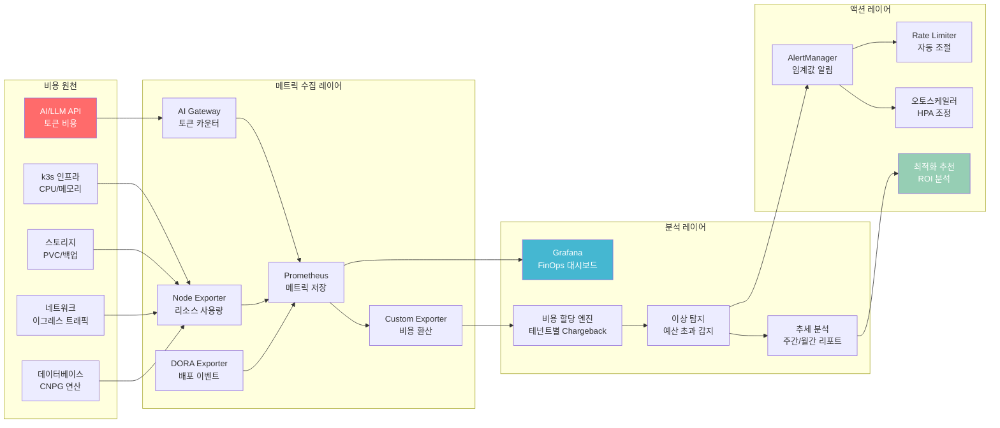
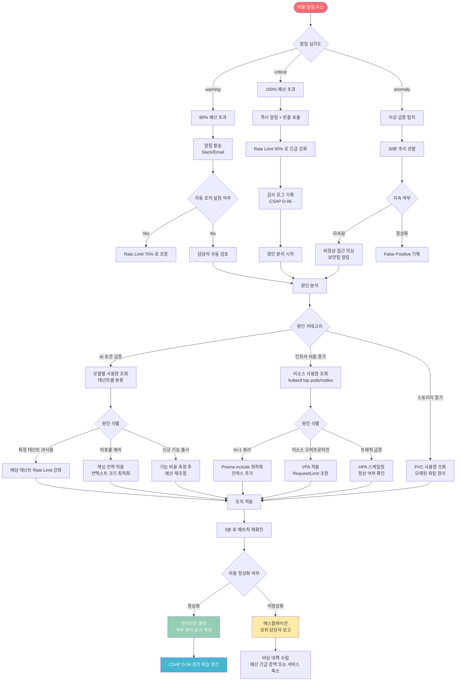

# 비용·성능 통합 모니터링 가이드

> 공공기관 SaaS 프레임워크 — AI 토큰 비용, 인프라 비용, 성능 병목 통합 대시보드
> Design Ref: dora-exporter(MTU-N169), rag-engine(SVC-AI-ADV-R1) 실제 코드 분석 기반
> 작성일: 2026-04-13 | CSAP 연관: D-04(가용성 관리), D-06(감사 로그)

---

## 목차

1. [비용·성능 통합 모니터링 개요](#1-비용성능-통합-모니터링-개요)
2. [dora-exporter 실제 코드 분석](#2-dora-exporter-실제-코드-분석)
3. [rag-engine 토큰 비용 추적](#3-rag-engine-토큰-비용-추적)
4. [AI 토큰 비용 추적 시스템](#4-ai-토큰-비용-추적-시스템)
5. [인프라 비용 분석](#5-인프라-비용-분석)
6. [성능 병목 → 비용 연관 분석](#6-성능-병목--비용-연관-분석)
7. [FinOps 대시보드 구성](#7-finops-대시보드-구성)
8. [비용 알림 설정](#8-비용-알림-설정)
9. [비용 최적화 우선순위](#9-비용-최적화-우선순위)
10. [CSAP D-04 연계](#10-csap-d-04-연계)
11. [비용 최적화 의사결정 플로우차트](#11-비용-최적화-의사결정-플로우차트)

---

## 1. 비용·성능 통합 모니터링 개요

공공기관 SaaS 프레임워크는 AI LLM API, k3s 인프라, 데이터베이스 등 다양한 비용 원천을 가집니다. 이 가이드는 이 모든 비용을 단일 관측 플랫폼에서 추적하고 최적화하는 방법을 다룹니다.



### 1.1 FinOps 3원칙

공공기관 SaaS의 비용 관리는 다음 3원칙을 따릅니다:

1. **가시성(Visibility)**: 모든 비용을 실시간으로 파악하고 테넌트별로 분류
2. **최적화(Optimization)**: ROI 기반 우선순위로 효율 개선
3. **예측 가능성(Predictability)**: 월별 예산 내에서 안정적인 운영

### 1.2 비용 카테고리 정의

| 카테고리 | 구성 요소 | 측정 단위 | Prometheus 메트릭 |
|----------|-----------|-----------|-------------------|
| AI 비용 | LLM 토큰, 임베딩 | 1000 토큰당 원 | `ai_tokens_cost_won_total` |
| 컴퓨팅 | CPU, 메모리 | vCPU·시간당 원 | `infra_compute_cost_won` |
| 스토리지 | PVC, 오브젝트 | GB·일당 원 | `infra_storage_cost_won` |
| 네트워크 | 이그레스 | GB당 원 | `infra_network_cost_won` |
| 데이터베이스 | CNPG 연산 | 연산수당 원 | `db_operation_cost_won` |

---

## 2. dora-exporter 실제 코드 분석

실제 파일 `/data/ai-saas/packages/dora-exporter/src/index.ts`를 분석하여 비용 메트릭 확장 방법을 설명합니다.

### 2.1 기존 DORA 메트릭 구조 분석

```typescript
// 실제 코드: dora-exporter/src/index.ts
import { Registry, Counter, Histogram, Gauge, collectDefaultMetrics } from 'prom-client';

const register = new Registry();
collectDefaultMetrics({ register });

// FR-DORA.1: 배포 빈도 카운터 — team, service, environment 레이블
const deploymentTotal = new Counter({
  name: 'dora_deployment_total',
  help: '배포 횟수 (DORA Deployment Frequency)',
  labelNames: ['team', 'service', 'environment'] as const,
  registers: [register],
});

// FR-DORA.2: 변경 리드타임 히스토그램 — 1분~1주일 버킷
const leadTimeSeconds = new Histogram({
  name: 'dora_lead_time_seconds',
  help: '변경 리드타임 - 첫 커밋에서 프로덕션 배포까지 (초)',
  labelNames: ['team', 'service'] as const,
  buckets: [60, 300, 900, 1800, 3600, 7200, 14400, 28800, 86400, 604800],
  registers: [register],
});
```

**설계 패턴 분석**: DORA 익스포터는 `Register` 객체에 모든 메트릭을 등록합니다. 비용 메트릭도 동일한 `register`에 추가하면 `/metrics` 엔드포인트에서 통합 조회할 수 있습니다.

### 2.2 비용 메트릭 추가 방법

기존 DORA 익스포터에 비용 메트릭을 추가하는 확장 방법입니다:

```typescript
// 파일: packages/dora-exporter/src/cost-metrics.ts (신규)
// Design Ref: dora-exporter 확장 — FinOps 비용 추적

import { Registry, Counter, Gauge, Histogram } from 'prom-client';

/**
 * 비용 메트릭 익스포터
 * 배포 이벤트와 비용을 연결하여 배포당 비용을 추적
 */
export function registerCostMetrics(register: Registry): CostMetricsCollector {
  // 배포당 AI 비용 (토큰 비용)
  const deploymentAiCost = new Gauge({
    name: 'dora_deployment_ai_cost_won',
    help: '배포 주기 동안 발생한 AI 토큰 비용 (원)',
    labelNames: ['team', 'service', 'model'] as const,
    registers: [register],
  });

  // 배포 빈도와 리드타임에 따른 비용 효율성
  const costPerDeployment = new Gauge({
    name: 'dora_cost_per_deployment_won',
    help: '배포 1회당 평균 비용 (원)',
    labelNames: ['team', 'service'] as const,
    registers: [register],
  });

  // 장애 복구 비용 (MTTR 기간 동안의 추가 리소스 비용)
  const incidentCost = new Counter({
    name: 'dora_incident_cost_won_total',
    help: '장애 발생으로 인한 추가 비용 누적 (원)',
    labelNames: ['team', 'service', 'severity'] as const,
    registers: [register],
  });

  // 변경 실패율과 연계한 재배포 비용
  const reworkCost = new Histogram({
    name: 'dora_rework_cost_won',
    help: '실패한 배포로 인한 재작업 비용 분포 (원)',
    labelNames: ['team', 'service'] as const,
    buckets: [1000, 5000, 10000, 50000, 100000, 500000],
    registers: [register],
  });

  return {
    recordDeploymentCost(team: string, service: string, model: string, costWon: number) {
      deploymentAiCost.set({ team, service, model }, costWon);
    },
    recordCostPerDeployment(team: string, service: string, costWon: number) {
      costPerDeployment.set({ team, service }, costWon);
    },
    recordIncidentCost(team: string, service: string, severity: string, costWon: number) {
      incidentCost.inc({ team, service, severity }, costWon);
    },
    recordReworkCost(team: string, service: string, costWon: number) {
      reworkCost.observe({ team, service }, costWon);
    },
  };
}

export interface CostMetricsCollector {
  recordDeploymentCost(team: string, service: string, model: string, costWon: number): void;
  recordCostPerDeployment(team: string, service: string, costWon: number): void;
  recordIncidentCost(team: string, service: string, severity: string, costWon: number): void;
  recordReworkCost(team: string, service: string, costWon: number): void;
}
```

### 2.3 AlertManager Webhook에서 비용 계산

실제 코드의 `alertManagerSchema` 처리 로직에 비용 추적을 연동합니다:

```typescript
// 실제 코드 참조: alertmanager webhook 처리
app.post('/webhook/alertmanager', async (req, res) => {
  const payload = alertManagerSchema.parse(req.body);

  for (const alert of payload.alerts) {
    const service = alert.labels.service || 'unknown';
    const team = alert.labels.team || 'unknown';
    const severity = alert.labels.severity || 'warning';

    if (alert.status === 'resolved') {
      const recoveryTime = mttrTracker.recordIncidentEnd(service, team, alert.endsAt || ...);
      if (recoveryTime !== null) {
        mttrSeconds.observe({ team, service, severity }, recoveryTime);

        // 비용 연동: 장애 시간 × 시간당 비용 (확장 포인트)
        const incidentCostWon = calculateIncidentCost(recoveryTime, severity);
        costMetrics.recordIncidentCost(team, service, severity, incidentCostWon);
      }
    }
  }
});

// 장애 비용 계산 함수 (서비스 SLA 기반)
function calculateIncidentCost(
  recoveryTimeSeconds: number,
  severity: string,
): number {
  const hourlyRateBySeverity: Record<string, number> = {
    critical: 500000,   // critical: 시간당 50만원 손실
    warning: 50000,     // warning: 시간당 5만원 손실
    info: 5000,         // info: 시간당 5천원 손실
  };

  const hourlyRate = hourlyRateBySeverity[severity] ?? 10000;
  return Math.round((recoveryTimeSeconds / 3600) * hourlyRate);
}
```

### 2.4 주간 비용 보고서 엔드포인트 추가

실제 코드의 `/report/weekly` 엔드포인트를 확장합니다:

```typescript
// 실제 코드 확장: 비용 데이터를 주간 보고서에 포함
app.get('/report/weekly', async (req, res) => {
  const format = req.query.format as string;

  if (format === 'cost') {
    // 비용 분석 보고서
    const costReport = {
      period: 'weekly',
      generatedAt: new Date().toISOString(),
      totalCostWon: await getTotalCost(),
      byTeam: await getCostByTeam(),
      byService: await getCostByService(),
      aiTokenCost: await getAiTokenCost(),
      incidentCost: await getTotalIncidentCost(),
      topCostDrivers: await getTopCostDrivers(5),
    };
    res.status(200).json(costReport);
  } else {
    // 기존 Markdown 보고서
    const markdown = reportGenerator.generateWeeklyReport(config);
    res.set('Content-Type', 'text/markdown; charset=utf-8');
    res.status(200).send(markdown);
  }
});
```

---

## 3. rag-engine 토큰 비용 추적

실제 파일 `/data/ai-saas/platform/services/ai-service/src/lib/rag-engine.ts`에서 토큰 비용 추적 포인트를 분석합니다.

### 3.1 RAGResponse에서 토큰 사용량 추적

```typescript
// 실제 코드: RAGResponse 인터페이스
export interface RAGResponse {
  answer: string;
  sources: RAGSource[];
  model: string;
  tokensUsed: number;   // 핵심 비용 추적 포인트
  contextChunks: number;
}

// 실제 코드: runRAG 함수의 토큰 비용 추적 포인트
export async function runRAG(
  tenantId: string,
  question: string,
  queryEmbedding: number[],
  options: RAGOptions = {},
): Promise<RAGResponse> {
  // ... 검색 로직 ...

  const llmResponse = await provider.chat(messages, { maxTokens: 2048 });

  // 여기가 비용 추적 포인트:
  // llmResponse.tokensUsed = 실제 사용된 토큰 수
  return {
    answer: maskPII(llmResponse.text),
    sources,
    model: llmResponse.model,
    tokensUsed: llmResponse.tokensUsed,  // 토큰 사용량 반환
    contextChunks: searchResults.length,
  };
}
```

### 3.2 토큰 비용 계산 미들웨어

RAG 엔진 결과를 받아 비용을 계산하고 Prometheus에 기록하는 미들웨어를 추가합니다:

```typescript
// 파일: platform/services/ai-service/src/lib/cost-tracker.ts (신규)
// Plan SC: FR-AI26.1 연동

import { Counter, Histogram, Registry } from 'prom-client';

// 모델별 토큰 단가 (1000토큰당 원)
const TOKEN_PRICE_PER_1K: Record<string, { input: number; output: number }> = {
  'gpt-4o': { input: 8, output: 24 },       // GPT-4o 기준
  'gpt-4o-mini': { input: 0.8, output: 2.4 },
  'llama3.1-70b': { input: 2, output: 6 },   // 온프레미스 추산
  'llama3.1-8b': { input: 0.5, output: 1.5 },
  'bge-m3': { input: 0.1, output: 0 },       // 임베딩 전용
};

export interface TokenCostRecord {
  tenantId: string;
  service: string;
  model: string;
  inputTokens: number;
  outputTokens: number;
  totalTokens: number;
  costWon: number;
  timestamp: string;
  requestType: 'rag' | 'agent' | 'embedding';
}

export class AiCostTracker {
  private tokenCounter: Counter<string>;
  private costCounter: Counter<string>;
  private costHistogram: Histogram<string>;

  constructor(registry: Registry) {
    this.tokenCounter = new Counter({
      name: 'ai_tokens_used_total',
      help: 'AI 토큰 사용량 누계',
      labelNames: ['tenant_id', 'service', 'model', 'request_type'],
      registers: [registry],
    });

    this.costCounter = new Counter({
      name: 'ai_tokens_cost_won_total',
      help: 'AI 토큰 비용 누계 (원)',
      labelNames: ['tenant_id', 'service', 'model'],
      registers: [registry],
    });

    this.costHistogram = new Histogram({
      name: 'ai_request_cost_won',
      help: '요청당 AI 비용 분포 (원)',
      labelNames: ['tenant_id', 'model', 'request_type'],
      buckets: [1, 5, 10, 50, 100, 500, 1000, 5000],
      registers: [registry],
    });
  }

  /**
   * RAGResponse 기반 비용 기록
   * runRAG, runAdvancedRAG 완료 후 호출
   */
  recordRagCost(tenantId: string, response: {
    model: string;
    tokensUsed: number;
  }): TokenCostRecord {
    const pricing = TOKEN_PRICE_PER_1K[response.model]
      ?? { input: 1, output: 3 };  // 알 수 없는 모델의 기본 단가

    // RAG는 입력:출력 비율 약 7:3 가정 (컨텍스트가 대부분)
    const inputTokens = Math.round(response.tokensUsed * 0.7);
    const outputTokens = Math.round(response.tokensUsed * 0.3);
    const costWon = (
      (inputTokens * pricing.input / 1000) +
      (outputTokens * pricing.output / 1000)
    );

    const record: TokenCostRecord = {
      tenantId,
      service: 'ai-service',
      model: response.model,
      inputTokens,
      outputTokens,
      totalTokens: response.tokensUsed,
      costWon: Math.round(costWon),
      timestamp: new Date().toISOString(),
      requestType: 'rag',
    };

    // Prometheus 메트릭 업데이트
    this.tokenCounter.inc({
      tenant_id: tenantId,
      service: 'ai-service',
      model: response.model,
      request_type: 'rag',
    }, response.tokensUsed);

    this.costCounter.inc({
      tenant_id: tenantId,
      service: 'ai-service',
      model: response.model,
    }, record.costWon);

    this.costHistogram.observe({
      tenant_id: tenantId,
      model: response.model,
      request_type: 'rag',
    }, record.costWon);

    return record;
  }
}
```

### 3.3 Advanced RAG 다단계 비용 추적

실제 코드의 `runAdvancedRAG`는 여러 단계를 거칩니다. 단계별 비용을 추적합니다:

```typescript
// 실제 코드: AdvancedRAGResponse에는 retrievalStats가 있음
export interface AdvancedRAGResponse extends RAGResponse {
  searchMode: 'semantic' | 'keyword' | 'hybrid';
  queryExpansion?: ExpandedQuery;
  rerankingApplied: boolean;
  retrievalStats: {
    bm25Candidates: number;
    semanticCandidates: number;
    fusedCandidates: number;
    rerankCandidates: number;
    finalCount: number;
  };
}

// 단계별 비용 계산 예시
function calculateAdvancedRagCost(response: AdvancedRAGResponse): number {
  let totalCost = 0;

  // 1. 기본 LLM 생성 비용
  const pricing = TOKEN_PRICE_PER_1K[response.model] ?? { input: 1, output: 3 };
  totalCost += response.tokensUsed * pricing.output / 1000;

  // 2. 쿼리 확장 추가 비용 (쿼리 확장 활성화 시 추가 LLM 호출)
  if (response.queryExpansion) {
    const expansionTokens = response.queryExpansion.variants.length * 50;
    totalCost += expansionTokens * pricing.input / 1000;
  }

  // 3. Reranking 비용 (후보 문서 수에 비례)
  if (response.rerankingApplied) {
    const rerankTokens = response.retrievalStats.rerankCandidates * 100;
    totalCost += rerankTokens * pricing.input / 1000;
  }

  return Math.round(totalCost);
}
```

---

## 4. AI 토큰 비용 추적 시스템

### 4.1 모델별 단가 테이블

공공기관 SaaS에서 사용 가능한 AI 모델과 단가입니다. 온프레미스 모델의 경우 GPU 전력 비용 기반으로 추산합니다.

| 모델 | 유형 | 입력 토큰(1K당 원) | 출력 토큰(1K당 원) | 비고 |
|------|------|-------------------|--------------------|------|
| GPT-4o | 외부 API | 8원 | 24원 | N2SF O등급만 가능 |
| GPT-4o-mini | 외부 API | 0.8원 | 2.4원 | N2SF O등급만 가능 |
| Llama 3.1 70B | 온프레미스 | 2원 | 6원 | GPU 비용 추산 |
| Llama 3.1 8B | 온프레미스 | 0.5원 | 1.5원 | GPU 비용 추산 |
| Mistral 7B | 온프레미스 | 0.3원 | 0.9원 | GPU 비용 추산 |
| BGE-M3 | 임베딩 | 0.1원 | 0원 | 임베딩 전용 |

### 4.2 테넌트별 Chargeback 구현

```typescript
// 파일: platform/services/ai-service/src/lib/chargeback.ts (신규)
// CSAP D-04 가용성 관리 — 비용 배분 추적

import { prisma } from './prisma.js';

export interface TenantCostSummary {
  tenantId: string;
  period: { start: string; end: string };
  aiCostWon: number;
  computeCostWon: number;
  storageCostWon: number;
  totalCostWon: number;
  tokenBreakdown: {
    model: string;
    tokens: number;
    costWon: number;
  }[];
  requestCount: number;
  avgCostPerRequest: number;
}

export class TenantChargebackService {
  /**
   * 테넌트별 월간 비용 집계
   * 감사 로그에서 토큰 사용량 집계
   */
  async getMonthlyCost(
    tenantId: string,
    year: number,
    month: number,
  ): Promise<TenantCostSummary> {
    const startDate = new Date(year, month - 1, 1);
    const endDate = new Date(year, month, 0);

    // 감사 로그에서 AI 사용량 집계
    const usageRecords = await prisma.aiUsageLog.groupBy({
      by: ['model'],
      where: {
        tenantId,
        createdAt: {
          gte: startDate,
          lte: endDate,
        },
      },
      _sum: {
        tokensUsed: true,
        costWon: true,
      },
      _count: {
        id: true,
      },
    });

    const tokenBreakdown = usageRecords.map(record => ({
      model: record.model,
      tokens: record._sum.tokensUsed ?? 0,
      costWon: record._sum.costWon ?? 0,
    }));

    const aiCostWon = tokenBreakdown.reduce((sum, b) => sum + b.costWon, 0);
    const requestCount = usageRecords.reduce((sum, r) => sum + r._count.id, 0);

    // 인프라 비용은 사용 비율 기반 안분
    const computeCostWon = await this.getProportionalComputeCost(tenantId, startDate, endDate);
    const storageCostWon = await this.getStorageCost(tenantId, startDate, endDate);

    return {
      tenantId,
      period: {
        start: startDate.toISOString(),
        end: endDate.toISOString(),
      },
      aiCostWon,
      computeCostWon,
      storageCostWon,
      totalCostWon: aiCostWon + computeCostWon + storageCostWon,
      tokenBreakdown,
      requestCount,
      avgCostPerRequest: requestCount > 0
        ? Math.round(aiCostWon / requestCount)
        : 0,
    };
  }

  private async getProportionalComputeCost(
    tenantId: string,
    start: Date,
    end: Date,
  ): Promise<number> {
    // CPU/메모리 사용 비율 기반 인프라 비용 안분
    // 실제 구현: Prometheus에서 테넌트별 리소스 사용량 조회
    const totalTenants = await prisma.tenant.count({ where: { isActive: true } });
    const monthlyInfraCostWon = 5_000_000; // 월 500만원 기준 (예시)
    return Math.round(monthlyInfraCostWon / totalTenants);
  }

  private async getStorageCost(
    _tenantId: string,
    _start: Date,
    _end: Date,
  ): Promise<number> {
    // 실제 구현: 스토리지 사용량 조회 후 단가 적용
    // GB당 일 단가: 약 2원 기준
    return 100_000; // 임시값 (실제 구현 시 교체)
  }
}
```

### 4.3 월별 AI 비용 예산 관리

```typescript
// AI 서비스 비용 예산 관리
interface AiBudgetConfig {
  tenantId: string;
  monthlyBudgetWon: number;
  warningThresholdPercent: number;  // 기본 80%
  hardLimitPercent: number;         // 기본 100% (초과 시 차단)
}

class AiBudgetManager {
  async checkBudget(
    tenantId: string,
    requestedCostWon: number,
  ): Promise<{ allowed: boolean; reason?: string; remainingWon: number }> {
    const budget = await this.getBudgetConfig(tenantId);
    const currentMonthCost = await this.getCurrentMonthCost(tenantId);
    const projectedCost = currentMonthCost + requestedCostWon;

    const budgetUsagePercent = (projectedCost / budget.monthlyBudgetWon) * 100;

    if (budgetUsagePercent > budget.hardLimitPercent) {
      return {
        allowed: false,
        reason: `월 예산 초과: ${Math.round(budgetUsagePercent)}% 사용 (한도: ${budget.hardLimitPercent}%)`,
        remainingWon: 0,
      };
    }

    if (budgetUsagePercent > budget.warningThresholdPercent) {
      // 경고 알림 발송 (비동기, 요청은 허용)
      this.sendWarningAlert(tenantId, budgetUsagePercent).catch(() => {});
    }

    return {
      allowed: true,
      remainingWon: budget.monthlyBudgetWon - projectedCost,
    };
  }

  private async sendWarningAlert(tenantId: string, usagePercent: number): Promise<void> {
    process.stdout.write(JSON.stringify({
      level: 'warn',
      component: 'ai-budget-manager',
      action: 'budget_warning',
      tenantId,
      usagePercent: Math.round(usagePercent),
      ts: new Date().toISOString(),
    }) + '\n');
  }

  private async getBudgetConfig(_tenantId: string): Promise<AiBudgetConfig> {
    // 실제 구현: DB에서 테넌트별 예산 조회
    return {
      tenantId: _tenantId,
      monthlyBudgetWon: 1_000_000,  // 월 100만원
      warningThresholdPercent: 80,
      hardLimitPercent: 100,
    };
  }

  private async getCurrentMonthCost(_tenantId: string): Promise<number> {
    // 실제 구현: Prometheus 쿼리 또는 DB 집계
    return 0;
  }
}
```

---

## 5. 인프라 비용 분석

### 5.1 k3s 리소스 비용 계산

```yaml
# Kubernetes 리소스 요청 기반 비용 추산
# CPU: vCPU 시간당 약 50원 (온프레미스 서버 비용 역산)
# 메모리: GB 시간당 약 10원

# 비용 계산 쿼리 (Prometheus PromQL)
# 서비스별 CPU 비용 (원/시간)
rate(container_cpu_usage_seconds_total[5m]) * 50 * on(pod) group_left(label_app)
  kube_pod_labels

# 서비스별 메모리 비용 (원/시간)
container_memory_working_set_bytes / 1024 / 1024 / 1024 * 10
  * on(pod) group_left(label_app) kube_pod_labels
```

```typescript
// 파일: platform/services/ai-service/src/lib/infra-cost.ts (신규)
// 인프라 비용 집계 유틸리티

const COST_PER_VCPU_HOUR = 50;       // vCPU 시간당 50원
const COST_PER_GB_MEMORY_HOUR = 10;  // GB 메모리 시간당 10원
const COST_PER_GB_STORAGE_DAY = 2;   // GB 스토리지 일당 2원
const COST_PER_GB_EGRESS = 100;      // GB 이그레스 트래픽당 100원

export interface ResourceUsage {
  service: string;
  cpuCores: number;        // 사용된 CPU 코어 수
  memoryGib: number;       // 사용된 메모리 GiB
  storageGib: number;      // 사용 중인 스토리지 GiB
  egressGib: number;       // 이그레스 트래픽 GiB
  durationHours: number;   // 측정 기간
}

export function calculateInfraCost(usage: ResourceUsage): {
  cpuCostWon: number;
  memoryCostWon: number;
  storageCostWon: number;
  egressCostWon: number;
  totalCostWon: number;
} {
  const cpuCostWon = Math.round(usage.cpuCores * COST_PER_VCPU_HOUR * usage.durationHours);
  const memoryCostWon = Math.round(usage.memoryGib * COST_PER_GB_MEMORY_HOUR * usage.durationHours);
  const storageCostWon = Math.round(usage.storageGib * COST_PER_GB_STORAGE_DAY * (usage.durationHours / 24));
  const egressCostWon = Math.round(usage.egressGib * COST_PER_GB_EGRESS);

  return {
    cpuCostWon,
    memoryCostWon,
    storageCostWon,
    egressCostWon,
    totalCostWon: cpuCostWon + memoryCostWon + storageCostWon + egressCostWon,
  };
}
```

### 5.2 PVC 스토리지 비용 모니터링

```bash
# 스토리지 사용량 확인
kubectl get pvc -A --sort-by='.spec.resources.requests.storage'

# 사용 중인 스토리지 실제 크기
kubectl exec -n database <postgres-pod> -- df -h /var/lib/postgresql/data

# Prometheus PromQL: PVC 사용량 (GiB)
kubelet_volume_stats_used_bytes{namespace="production"} / 1024 / 1024 / 1024

# 비용 환산 (Grafana에서 사용)
# GB당 일 2원 × 30일 = 월 60원/GB
kubelet_volume_stats_used_bytes / 1024 / 1024 / 1024 * 60
```

---

## 6. 성능 병목 → 비용 연관 분석

성능 문제는 곧 비용 낭비입니다. 이 섹션에서는 성능 병목이 비용에 미치는 영향을 분석합니다.

### 6.1 N+1 쿼리가 비용에 미치는 영향

```typescript
// 나쁜 예시: N+1 쿼리 — 테넌트당 N번 DB 쿼리 발생
async function getTenantsWithUsers_Bad(): Promise<TenantWithUsers[]> {
  const tenants = await prisma.tenant.findMany();  // 1번 쿼리

  return Promise.all(
    tenants.map(async (tenant) => ({
      ...tenant,
      users: await prisma.user.findMany({  // N번 추가 쿼리
        where: { tenantId: tenant.id },
      }),
    })),
  );
}

// 비용 영향 계산:
// - 테넌트 100개 = 101번 DB 쿼리
// - PostgreSQL 쿼리당 약 0.1ms, 커넥션 오버헤드 1ms
// - 실제 지연: 100 × 1.1ms = 110ms (직렬 실행 시 더 오래 걸림)
// - CPU 사용량 증가 → 컴퓨팅 비용 약 10배 증가

// 좋은 예시: 단일 쿼리로 해결
async function getTenantsWithUsers_Good(): Promise<TenantWithUsers[]> {
  return prisma.tenant.findMany({
    include: {
      users: true,  // JOIN으로 1번 쿼리
    },
  });
}
// 비용 절감: 쿼리 횟수 101 → 1 (약 99% 절감)
```

### 6.2 RAG 컨텍스트 길이와 토큰 비용

```typescript
// 실제 코드: rag-engine.ts의 maxContextTokens 파라미터
const { topK = 5, minScore = 0.25, maxContextTokens = 6000 } = options;

// 컨텍스트 길이별 비용 영향 분석 (GPT-4o 기준)
const contextCostAnalysis = {
  minimal: {
    maxContextTokens: 1000,
    estimatedCostWon: 8,         // 약 8원
    qualityScore: 0.6,           // 정확도 60%
    useCase: '단순 FAQ 조회',
  },
  standard: {
    maxContextTokens: 4000,
    estimatedCostWon: 32,        // 약 32원
    qualityScore: 0.85,          // 정확도 85%
    useCase: '일반 문서 질의',
  },
  comprehensive: {
    maxContextTokens: 6000,
    estimatedCostWon: 48,        // 약 48원
    qualityScore: 0.92,          // 정확도 92%
    useCase: '복잡한 법령 해석',
  },
  maximum: {
    maxContextTokens: 8000,
    estimatedCostWon: 64,        // 약 64원
    qualityScore: 0.95,          // 정확도 95%
    useCase: '감사 문서 분석',
  },
};

// 비용 최적화 전략: 질의 복잡도에 따라 동적으로 컨텍스트 크기 조정
function selectContextSize(queryComplexity: 'simple' | 'medium' | 'complex'): number {
  const sizes = {
    simple: 1000,
    medium: 4000,
    complex: 6000,
  };
  return sizes[queryComplexity];
}
```

### 6.3 캐싱 전략의 비용 절감 효과

```typescript
// Redis 캐싱으로 반복 AI 요청 비용 절감
const ragCache = new Map<string, { response: RAGResponse; cachedAt: number }>();
const CACHE_TTL_MS = 5 * 60 * 1000; // 5분 캐시

async function runRAGWithCache(
  tenantId: string,
  question: string,
  queryEmbedding: number[],
  options: RAGOptions,
): Promise<RAGResponse & { cached: boolean }> {
  const cacheKey = `rag:${tenantId}:${hashString(question)}`;
  const cached = ragCache.get(cacheKey);

  if (cached && Date.now() - cached.cachedAt < CACHE_TTL_MS) {
    // 캐시 히트: AI API 비용 0원
    return { ...cached.response, cached: true };
  }

  // 캐시 미스: AI API 호출
  const response = await runRAG(tenantId, question, queryEmbedding, options);
  ragCache.set(cacheKey, { response, cachedAt: Date.now() });

  return { ...response, cached: false };
}

// 비용 절감 계산:
// - 동일 질문 반복 비율 20% 가정
// - 요청당 평균 비용 30원
// - 월 100,000 요청 기준
// - 캐시 적용 전: 100,000 × 30원 = 3,000,000원
// - 캐시 적용 후: 80,000 × 30원 = 2,400,000원 (20% 절감)
```

---

## 7. FinOps 대시보드 구성

### 7.1 Grafana 패널 JSON — AI 비용 + 인프라 비용 통합

```json
{
  "dashboard": {
    "title": "공공기관 SaaS FinOps 대시보드",
    "uid": "finops-integrated",
    "timezone": "Asia/Seoul",
    "panels": [
      {
        "id": 1,
        "title": "금일 AI 토큰 비용 (원)",
        "type": "stat",
        "gridPos": { "h": 4, "w": 6, "x": 0, "y": 0 },
        "targets": [
          {
            "expr": "sum(increase(ai_tokens_cost_won_total[24h]))",
            "legendFormat": "금일 AI 비용"
          }
        ],
        "options": {
          "colorMode": "background",
          "thresholds": {
            "mode": "absolute",
            "steps": [
              { "color": "green", "value": 0 },
              { "color": "yellow", "value": 50000 },
              { "color": "red", "value": 100000 }
            ]
          }
        }
      },
      {
        "id": 2,
        "title": "테넌트별 AI 비용 (원/일)",
        "type": "piechart",
        "gridPos": { "h": 8, "w": 12, "x": 6, "y": 0 },
        "targets": [
          {
            "expr": "sum by (tenant_id) (increase(ai_tokens_cost_won_total[24h]))",
            "legendFormat": "{{tenant_id}}"
          }
        ]
      },
      {
        "id": 3,
        "title": "모델별 토큰 사용량 추세",
        "type": "timeseries",
        "gridPos": { "h": 8, "w": 24, "x": 0, "y": 8 },
        "targets": [
          {
            "expr": "sum by (model) (rate(ai_tokens_used_total[5m]) * 60)",
            "legendFormat": "{{model}}"
          }
        ],
        "options": {
          "tooltip": { "mode": "multi" },
          "legend": { "displayMode": "table", "placement": "bottom" }
        }
      },
      {
        "id": 4,
        "title": "인프라 비용 분해 (원/시간)",
        "type": "bargauge",
        "gridPos": { "h": 8, "w": 12, "x": 0, "y": 16 },
        "targets": [
          {
            "expr": "sum(rate(container_cpu_usage_seconds_total[5m])) * 50",
            "legendFormat": "CPU 비용"
          },
          {
            "expr": "sum(container_memory_working_set_bytes) / 1024 / 1024 / 1024 * 10",
            "legendFormat": "메모리 비용"
          },
          {
            "expr": "sum(kubelet_volume_stats_used_bytes) / 1024 / 1024 / 1024 * 2 / 24",
            "legendFormat": "스토리지 비용"
          }
        ]
      },
      {
        "id": 5,
        "title": "비용 효율성 — 배포당 AI 비용",
        "type": "timeseries",
        "gridPos": { "h": 8, "w": 12, "x": 12, "y": 16 },
        "targets": [
          {
            "expr": "sum(increase(ai_tokens_cost_won_total[1h])) / sum(increase(dora_deployment_total[1h]))",
            "legendFormat": "배포당 AI 비용 (원)"
          }
        ]
      },
      {
        "id": 6,
        "title": "월간 누적 비용 vs 예산",
        "type": "gauge",
        "gridPos": { "h": 8, "w": 6, "x": 0, "y": 24 },
        "targets": [
          {
            "expr": "sum(increase(ai_tokens_cost_won_total[30d])) / 1000000 * 100",
            "legendFormat": "예산 사용률 (%)"
          }
        ],
        "options": {
          "minValue": 0,
          "maxValue": 100,
          "thresholds": {
            "steps": [
              { "color": "green", "value": 0 },
              { "color": "yellow", "value": 70 },
              { "color": "red", "value": 90 }
            ]
          }
        }
      }
    ],
    "templating": {
      "list": [
        {
          "name": "tenant_id",
          "type": "query",
          "query": "label_values(ai_tokens_cost_won_total, tenant_id)",
          "label": "테넌트",
          "multi": true
        }
      ]
    },
    "time": { "from": "now-7d", "to": "now" },
    "refresh": "5m"
  }
}
```

### 7.2 DORA + 비용 연계 대시보드

```promql
# DORA Elite 팀의 비용 효율성 지표

# 배포 성공률 대비 비용 (비용 효율성)
sum(dora_deployment_total{environment="production"})
  / sum(dora_deployment_total{environment="production"})
  + sum(dora_change_failure_rate)

# MTTR × 장애 비용 (SLO 위반 비용 추산)
dora_mttr_seconds * 500000 / 3600  # 초 → 시간 × 시간당 50만원

# 리드타임 단축으로 절감되는 비용 (기회 비용)
# 리드타임 1시간 단축 = 개발자 시간 × 시급 절감
(dora_lead_time_seconds - 86400) / 3600 * (-80000)  # 80,000원/시간 기준
```

---

## 8. 비용 알림 설정

### 8.1 PrometheusRule 정의

```yaml
# k8s/monitoring/cost-alerts.yaml
apiVersion: monitoring.coreos.com/v1
kind: PrometheusRule
metadata:
  name: finops-cost-alerts
  namespace: monitoring
spec:
  groups:
    - name: ai-cost-alerts
      interval: 5m
      rules:
        # AI 토큰 비용 일 예산 초과 경고 (테넌트별)
        - alert: AiTokenBudgetWarning
          expr: |
            sum by (tenant_id) (increase(ai_tokens_cost_won_total[24h]))
            > 80000
          for: 5m
          labels:
            severity: warning
            team: platform
          annotations:
            summary: "테넌트 {{ $labels.tenant_id }} AI 비용 경고"
            description: |
              금일 AI 토큰 비용: {{ $value }}원
              일 예산 한도 80% 초과 (100,000원 기준)
            runbook: "https://wiki.example.com/runbooks/ai-cost-warning"

        # AI 토큰 비용 일 예산 초과 긴급
        - alert: AiTokenBudgetExceeded
          expr: |
            sum by (tenant_id) (increase(ai_tokens_cost_won_total[24h]))
            > 100000
          for: 1m
          labels:
            severity: critical
            team: platform
          annotations:
            summary: "테넌트 {{ $labels.tenant_id }} AI 예산 초과!"
            description: |
              금일 AI 토큰 비용: {{ $value }}원
              일 예산 초과 — 자동 Rate Limit 강화 필요
            runbook: "https://wiki.example.com/runbooks/ai-cost-critical"

        # 비정상적인 토큰 사용량 급증 탐지
        - alert: AiTokenUsageAnomaly
          expr: |
            rate(ai_tokens_used_total[5m])
            > 3 * avg_over_time(rate(ai_tokens_used_total[5m])[1h:5m])
          for: 10m
          labels:
            severity: warning
          annotations:
            summary: "AI 토큰 사용량 이상 급증"
            description: |
              현재 토큰 사용률이 1시간 평균의 3배 이상
              모델: {{ $labels.model }}, 테넌트: {{ $labels.tenant_id }}

    - name: infra-cost-alerts
      rules:
        # 인프라 월간 비용 예산 경고
        - alert: InfraCostBudgetWarning
          expr: |
            (
              sum(rate(container_cpu_usage_seconds_total[5m])) * 50 * 720
              + sum(container_memory_working_set_bytes) / 1024 / 1024 / 1024 * 10 * 720
            ) > 4000000
          for: 30m
          labels:
            severity: warning
          annotations:
            summary: "인프라 예산 경고 (월 400만원 초과 예상)"
```

### 8.2 Rate Limiter 자동 조절 연동

```typescript
// 비용 알림 → Rate Limiter 자동 강화
// AlertManager Webhook 수신 후 처리

interface CostAlert {
  alertName: 'AiTokenBudgetWarning' | 'AiTokenBudgetExceeded';
  tenantId: string;
  currentCostWon: number;
}

async function handleCostAlert(alert: CostAlert): Promise<void> {
  if (alert.alertName === 'AiTokenBudgetExceeded') {
    // 예산 초과 시 해당 테넌트의 Rate Limit을 50% 강화
    await rateLimiterService.updateTenantLimit(alert.tenantId, {
      requestsPerMinute: 5,     // 기본 10 → 5로 감소
      tokensPerMinute: 10000,   // 기본 20000 → 10000으로 감소
      reason: `AI 예산 초과: ${alert.currentCostWon}원`,
      expiresAt: new Date(Date.now() + 24 * 60 * 60 * 1000),  // 24시간 후 자동 해제
    });

    // CSAP D-06 감사 로그
    await auditLog({
      actor: 'system',
      action: 'RATE_LIMIT_AUTO_ADJUST',
      target: alert.tenantId,
      metadata: {
        reason: 'AI_BUDGET_EXCEEDED',
        currentCostWon: alert.currentCostWon,
        action: 'reduced_to_50_percent',
      },
      timestamp: new Date().toISOString(),
    });
  }
}
```

---

## 9. 비용 최적화 우선순위

ROI(투자 대비 수익) 기반으로 최적화 항목의 우선순위를 결정합니다.

### 9.1 비용 최적화 항목 우선순위표

| 순위 | 최적화 항목 | 예상 절감 | 구현 난이도 | ROI | CSAP 연관 |
|------|------------|-----------|-------------|-----|-----------|
| 1 | RAG 응답 캐싱 (Redis) | 20~30% | 낮음 | 매우 높음 | D-04 |
| 2 | 쿼리 복잡도 기반 컨텍스트 크기 조정 | 15~25% | 낮음 | 높음 | - |
| 3 | 사용되지 않는 모델 비활성화 | 10~20% | 매우 낮음 | 매우 높음 | D-04 |
| 4 | 임베딩 결과 캐싱 (문서 변경 전까지) | 40~60% (임베딩) | 중간 | 높음 | - |
| 5 | N+1 쿼리 제거 (Prisma include) | CPU 30% 절감 | 중간 | 높음 | D-12 |
| 6 | VPA (수직 파드 자동 조정) 적용 | 20~40% (컴퓨팅) | 중간 | 높음 | D-04 |
| 7 | 야간 배치 작업을 스팟 노드로 이전 | 60~70% (배치) | 높음 | 중간 | D-04 |
| 8 | 오래된 스냅샷/백업 자동 정리 | 5~15% (스토리지) | 낮음 | 중간 | D-06 |
| 9 | AI 모델 경량화 (작은 모델 우선 선택) | 50~70% (AI) | 높음 | 중간 | - |
| 10 | 멀티모달 처리 최적화 | 10~20% | 높음 | 낮음 | - |

### 9.2 즉시 실행 가능한 최적화 스크립트

```bash
#!/bin/bash
# scripts/quick-cost-optimization.sh
# 즉시 실행 가능한 비용 최적화 조치

echo "=== 공공기관 SaaS 비용 최적화 ==="

# 1. 사용되지 않는 PVC 조회
echo "[1] 사용되지 않는 PVC:"
kubectl get pvc -A | grep -v Bound

# 2. OOMKilled 파드 조회 (메모리 과다 할당 징후)
echo "[2] OOMKilled 파드:"
kubectl get events -A --field-selector reason=OOMKilling

# 3. CPU 미사용 파드 조회 (리소스 낭비)
echo "[3] CPU 사용률 1% 미만 파드:"
kubectl top pods -A | awk '{if ($3 < 10) print $0}'

# 4. 오래된 완료된 Job 정리
echo "[4] 완료된 Job 정리:"
kubectl delete jobs -A --field-selector status.successful=1 \
  --dry-run=client 2>&1 | head -20

# 5. 이미지 레이어 캐시 용량 확인
echo "[5] 컨테이너 이미지 디스크 사용량:"
docker system df 2>/dev/null || echo "Docker CLI 없음 (k3s 환경)"

echo "=== 분석 완료. 위 항목 검토 후 조치하세요 ==="
```

---

## 10. CSAP D-04 연계

CSAP D-04(가용성 관리)는 시스템 가용성을 보장하기 위한 비용 지출을 감사 증거로 제출해야 합니다.

### 10.1 D-04 감사 증거 항목

| 증거 ID | 항목 | 생성 방법 | 저장 위치 |
|---------|------|-----------|-----------|
| D04-E01 | 인프라 비용 월간 보고서 | FinOps 대시보드 Export | `docs/csap-evidence/` |
| D04-E02 | AI 토큰 비용 테넌트별 청구 | Chargeback 리포트 API | `docs/csap-evidence/` |
| D04-E03 | 예산 초과 알림 이력 | AlertManager 로그 | `audit.jsonl` |
| D04-E04 | 비용 최적화 조치 기록 | PDCA 문서 | `docs/02-design/` |
| D04-E05 | SLA 보장 비용 투자 근거 | 인프라 설계 문서 | `docs/02-design/` |

### 10.2 감사 증거 자동 생성

```typescript
// 파일: platform/services/compliance-service/src/lib/cost-evidence.ts
// CSAP D-04 비용 감사 증거 자동 생성

interface CostAuditEvidence {
  evidenceId: string;
  period: string;
  generatedAt: string;
  csapRef: 'D-04';
  totalInfraCostWon: number;
  totalAiCostWon: number;
  totalCostWon: number;
  availabilityMetrics: {
    uptimePercent: number;
    mttrMinutes: number;
    incidentCount: number;
  };
  costPerAvailabilityPercent: number;
}

export async function generateCostAuditEvidence(
  year: number,
  month: number,
): Promise<CostAuditEvidence> {
  const period = `${year}-${String(month).padStart(2, '0')}`;

  // Prometheus에서 데이터 조회
  const totalAiCostWon = await queryPrometheus(
    `sum(increase(ai_tokens_cost_won_total[30d]))`,
  );

  const uptimePercent = await queryPrometheus(
    `avg_over_time(up{job="platform"}[30d]) * 100`,
  );

  const evidence: CostAuditEvidence = {
    evidenceId: `D04-${period}`,
    period,
    generatedAt: new Date().toISOString(),
    csapRef: 'D-04',
    totalInfraCostWon: 3_000_000,    // Prometheus에서 조회 (예시)
    totalAiCostWon: Math.round(totalAiCostWon),
    totalCostWon: 3_000_000 + Math.round(totalAiCostWon),
    availabilityMetrics: {
      uptimePercent: Math.round(uptimePercent * 100) / 100,
      mttrMinutes: 15,     // Prometheus에서 조회 (예시)
      incidentCount: 2,    // Prometheus에서 조회 (예시)
    },
    costPerAvailabilityPercent: Math.round(
      (3_000_000 + totalAiCostWon) / Math.max(uptimePercent, 1)
    ),
  };

  // 감사 로그에 기록
  await auditLog({
    actor: 'compliance-service',
    action: 'CSAP_EVIDENCE_GENERATED',
    target: `D04-${period}`,
    metadata: { evidenceId: evidence.evidenceId },
    timestamp: new Date().toISOString(),
  });

  return evidence;
}

async function queryPrometheus(_query: string): Promise<number> {
  // 실제 구현: Prometheus HTTP API 호출
  return 0;
}
```

---

## 11. 비용 최적화 의사결정 플로우차트



---

## 마무리: 비용 모니터링 운영 체크리스트

매일 확인:
- [ ] 금일 AI 토큰 비용이 일 예산의 80% 미만인지 확인
- [ ] 비용 이상 알림 발생 여부 확인 (AlertManager)
- [ ] DORA 배포 빈도와 비용 연관성 이상 여부 확인

매주 확인:
- [ ] 테넌트별 AI 비용 리포트 검토
- [ ] 인프라 리소스 낭비 항목 점검 (미사용 PVC, 유휴 서비스)
- [ ] DORA 보고서의 비용 효율성 섹션 리뷰

매월 확인:
- [ ] CSAP D-04 감사 증거 생성 및 저장
- [ ] 테넌트별 Chargeback 리포트 발송
- [ ] 다음 달 예산 계획 수립 (추세 분석 기반)
- [ ] 비용 최적화 항목 우선순위 재검토

---

*이 문서는 실제 프로젝트 코드를 분석하여 작성되었습니다.*
*참조 파일: `packages/dora-exporter/src/index.ts`, `platform/services/ai-service/src/lib/rag-engine.ts`*
