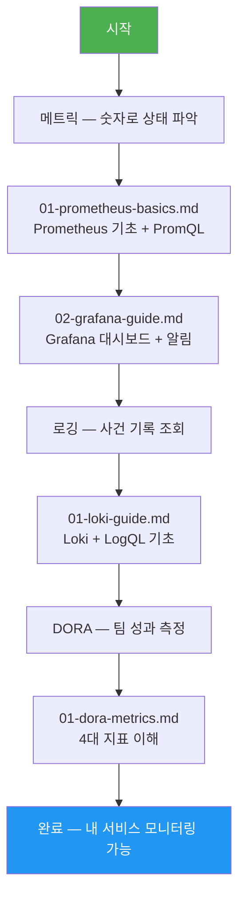

# 5장: 모니터링 — 학습 맵

> **대상**: 신규 합류 개발자, DevOps 엔지니어, SRE
> **버전**: 1.0.0 | **작성일**: 2026-04-11
> **CSAP**: D-06 (침해사고 관리), D-10 (로그 관리)

---

## 이 섹션을 배우면

시스템이 "지금 건강한지", "언제 무슨 문제가 생겼는지", "어디서 느린지"를 스스로 파악할 수 있게 됩니다. 공공기관 SaaS 플랫폼은 LGTM 스택(Loki + Grafana + Tempo + Prometheus)으로 관측가능성(Observability) 3대 기둥을 모두 구현합니다.

---

## 학습 순서

---

## 섹션 구조

| 폴더 | 파일 | 설명 | 소요 시간 |
|------|------|------|----------|
| `metrics/` | `01-prometheus-basics.md` | Prometheus + PromQL 기초 | 60분 |
| `metrics/` | `02-grafana-guide.md` | Grafana 대시보드 만들기 | 45분 |
| `logging/` | `01-loki-guide.md` | Loki + LogQL 로그 조회 | 45분 |
| `dora/` | `01-dora-metrics.md` | DORA 4대 지표 이해 | 30분 |

---

## 기존 참조 문서

이 섹션은 다음 상세 기술 문서의 "입문 편"입니다. 개념을 이해한 후 심화 학습이 필요하다면 아래 문서를 읽으십시오.

- `docs/07-infra/observability-guide.md` — 관측가능성 전체 아키텍처
- `docs/07-infra/monitoring-operations-guide.md` — 운영 절차
- `docs/guides/onboarding/05-monitoring.md` — 기존 통합 가이드 (단일 파일 버전)

---

## 핵심 접근 정보

| 도구 | 주소 | 용도 |
|------|------|------|
| Grafana | `http://localhost:30300` | 메트릭/로그/추적 통합 시각화 |
| Prometheus | `http://localhost:9090` | 메트릭 직접 쿼리 |
| AlertManager | `http://localhost:9093` | 알림 상태 확인 |

> 접근 권한이 없으면 DevOps팀에 요청하십시오. 모든 접근은 RBAC 기반으로 제어됩니다 (CSAP D-08).
