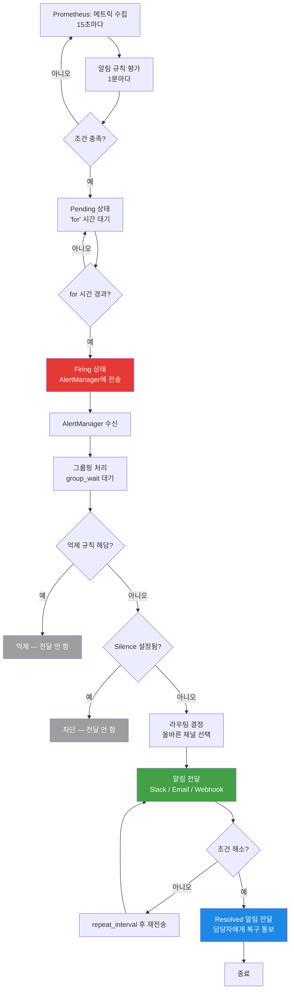
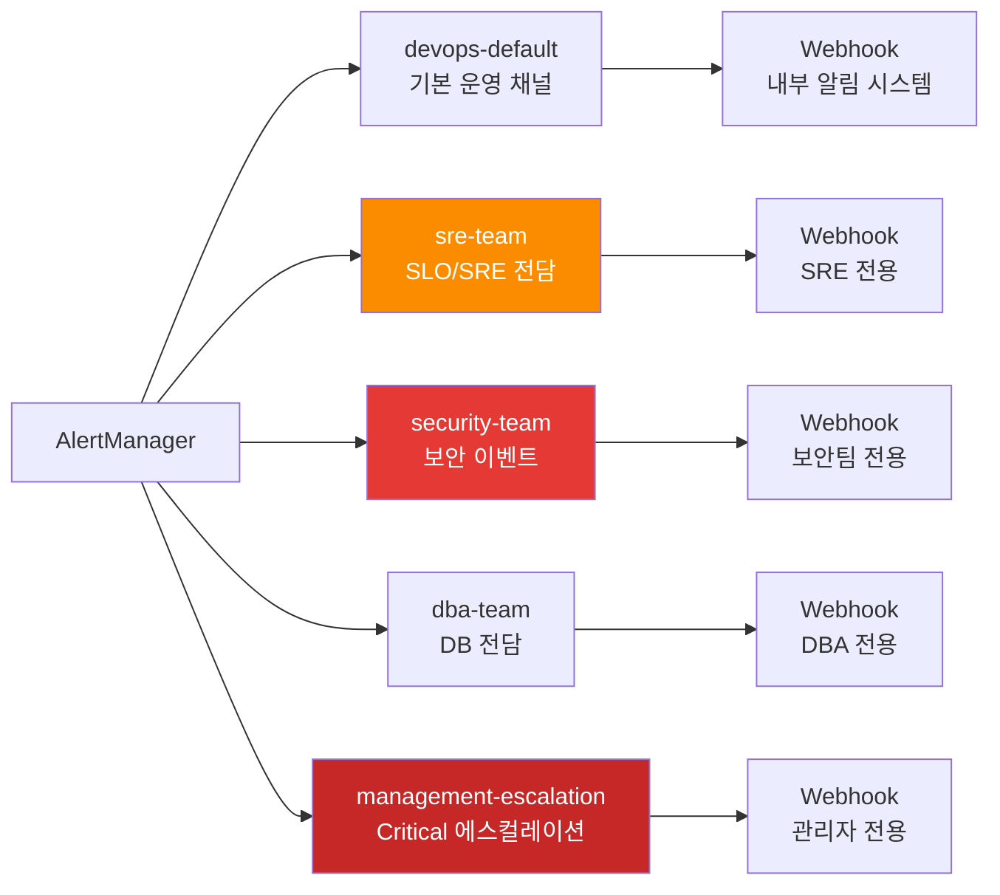
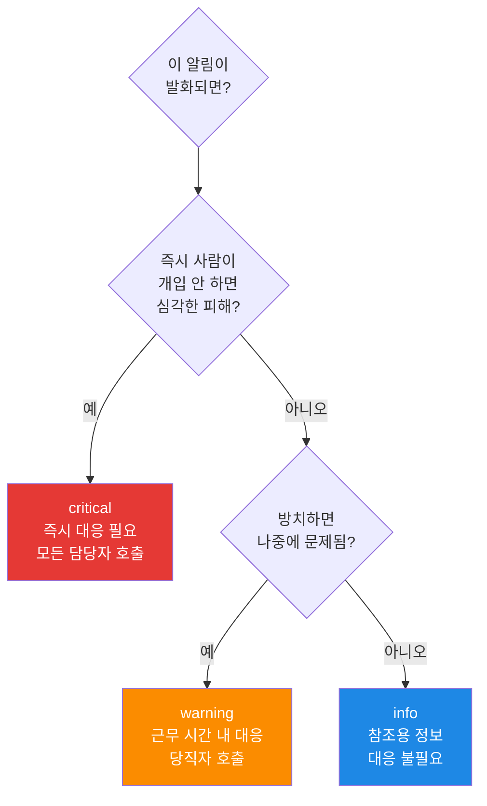
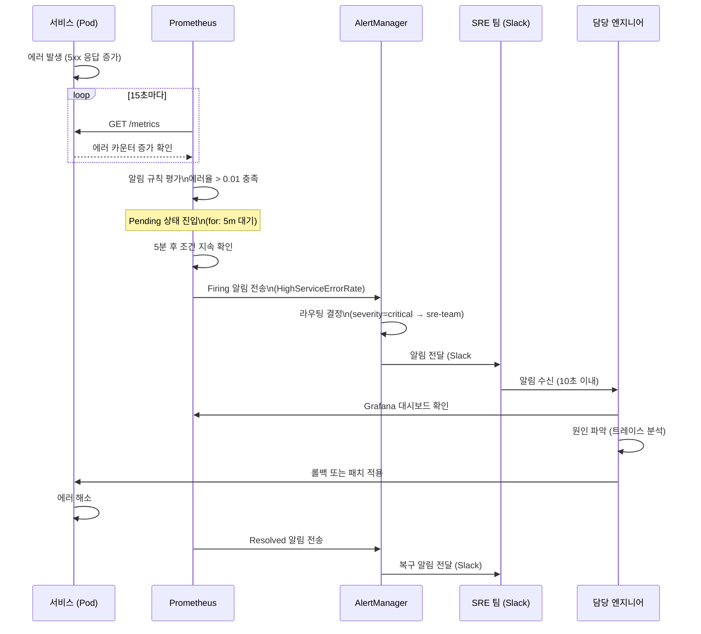

# AlertManager 가이드 — 알림 라우팅과 채널 설계

> **버전**: 1.0.0 | **작성일**: 2026-04-12
> **대상**: 알림 체계를 처음 설정하는 신규 개발자, DevOps 엔지니어
> **소요 시간**: 약 60분
> **이전 단계**: `metrics/02-grafana-guide.md`
> **다음 단계**: `slo/01-slo-guide.md`
> **CSAP**: D-06 (침해사고 관리), D-08 (접근통제 위반 알림)
> **Design Ref**: MTU-N57 Design §3, FR-N57.5, FR-N57.6, FR-N57.7, FR-N57.9

---

## 목차

1. [AlertManager란? — 초보자 비유](#1-alertmanager란--초보자-비유)
2. [Prometheus와 AlertManager의 관계](#2-prometheus와-alertmanager의-관계)
3. [이 프로젝트의 알림 채널 5개](#3-이-프로젝트의-알림-채널-5개)
4. [Alert 정의 방법 — PrometheusRule 작성](#4-alert-정의-방법--prometheusrule-작성)
5. [Severity 레벨 사용 기준](#5-severity-레벨-사용-기준)
6. [AlertManager 라우팅 규칙](#6-alertmanager-라우팅-규칙)
7. [억제 규칙 — 알림 폭주 방지](#7-억제-규칙--알림-폭주-방지)
8. [Silencing — 테스트 중 알림 임시 차단](#8-silencing--테스트-중-알림-임시-차단)
9. [Alert 설계 원칙](#9-alert-설계-원칙)
10. [이 프로젝트의 핵심 알림 목록](#10-이-프로젝트의-핵심-알림-목록)
11. [실습: 알림 추가하고 테스트하기](#11-실습-알림-추가하고-테스트하기)
12. [자주 겪는 문제](#12-자주-겪는-문제)

---

## 1. AlertManager란? — 초보자 비유

### 1.1 소방서 신고 접수 센터 비유

화재가 발생했다고 생각해보십시오.

```
화재 발생 → 신고 전화가 옴 → 접수 직원이 판단:
  - 어느 소방서에 배정할까?
  - 지금 비슷한 신고가 여러 건 왔으니 한 번에 묶어서 전달
  - 야간에는 당직 팀에게만 연락
  - 훈련 중에는 알림 차단
```

AlertManager가 하는 일이 바로 이것입니다.

```
시스템 이상 감지(Prometheus) → AlertManager 접수:
  - 어느 팀(채널)에 보낼까? (라우팅)
  - 비슷한 알림은 묶어서 전달 (그룹핑)
  - 더 중요한 알림이 있으면 하위 알림 억제 (Inhibition)
  - 점검 시간에는 알림 차단 (Silencing)
```

### 1.2 AlertManager가 없다면

```
상황: 서버 1대가 다운됨
결과: 그 서버에서 실행 중인 Pod 20개 × 각각 3가지 알림 = 60개 알림이 동시에 수신
문제: 담당자가 60개 알림에 파묻혀 정작 근본 원인(서버 다운)을 놓침
```

AlertManager가 있다면:

```
"NodeDown" 알림 1개만 전달
Pod 관련 59개 알림은 자동으로 억제
담당자는 핵심 알림만 받고 신속히 조치
```

### 1.3 공공기관에서 AlertManager가 더 중요한 이유

공공기관 SaaS는 CSAP D-06(침해사고 관리) 요건상 **모든 보안 이벤트와 시스템 이상 징후에 대해 실시간 알림 체계**를 갖추어야 합니다.

또한 접근통제 위반(D-08)은 10초 이내에 보안 팀에 전달되어야 합니다. AlertManager는 이 요건을 자동화하는 핵심 컴포넌트입니다.

---

## 2. Prometheus와 AlertManager의 관계

### 2.1 역할 분담

Prometheus와 AlertManager는 서로 다른 역할을 담당합니다.

```
Prometheus의 역할:
  1. 메트릭 수집 (15초마다)
  2. 알림 규칙 평가 (1분마다)
  3. 규칙 조건 충족 시 → AlertManager에 전송

AlertManager의 역할:
  1. 알림 수신
  2. 그룹핑 (비슷한 알림 묶기)
  3. 라우팅 (올바른 채널/팀으로 전달)
  4. 억제 (중복/하위 알림 제거)
  5. Silencing (일시 차단)
```

비유: Prometheus는 소방 감지기(감지+신고), AlertManager는 소방서 상황실(배분+조율)입니다.

### 2.2 Alert 생애주기

Alert 하나가 어떻게 탄생하고 사라지는지 전체 흐름을 봅니다.



### 2.3 Alert 상태 설명

| 상태 | 설명 | 예시 |
|------|------|------|
| **Inactive** | 조건 미충족, 알림 없음 | CPU 70% → 임계값 80% 미달 |
| **Pending** | 조건 충족했지만 `for` 시간 미경과 | CPU 85%, for 5m → 아직 2분 경과 |
| **Firing** | `for` 시간 경과, AlertManager에 전송 중 | CPU 85%, 5분 이상 지속 |
| **Resolved** | 조건이 해소됨 | CPU 70%로 내려감 → 복구 알림 전송 |

---

## 3. 이 프로젝트의 알림 채널 5개

이 플랫폼에는 5가지 알림 채널이 구성되어 있습니다. 각 채널은 역할과 수신 조건이 다릅니다.

### 3.1 채널 개요



### 3.2 채널별 수신 조건

| 채널 | 수신 조건 | 우선순위 | 반복 간격 |
|------|---------|---------|---------|
| `devops-default` | 기본 (라우팅 미지정 모든 알림) | 보통 | 4시간 |
| `sre-team` | SLO, ErrorBudget, BurnRate, Availability 관련 | 높음 | 2시간 |
| `security-team` | Falco, PolicyViolation, AuthenticationFailure, Kyverno | 매우 높음 | 1시간 |
| `dba-team` | PostgreSQL, SlowQuery, IndexUsage, DB 관련 | 보통 | 4시간 |
| `management-escalation` | severity=critical 모든 알림 | 최고 | 1시간 |

### 3.3 실제 AlertManager 수신자 설정

`infra/monitoring/alertmanager-config.yaml`의 실제 설정입니다.

```yaml
# infra/monitoring/alertmanager-config.yaml

receivers:
  # DevOps 기본 수신자 (대부분의 운영 알림)
  - name: "devops-default"
    webhook_configs:
      - url: "http://alertmanager-webhook.monitoring.svc.cluster.local:9095/devops"
        send_resolved: true   # 복구 시에도 알림 전송
        max_alerts: 10        # 한 번에 최대 10개 알림 묶음

  # SRE 팀 (SLO/에러버짓 전담)
  - name: "sre-team"
    webhook_configs:
      - url: "http://alertmanager-webhook.monitoring.svc.cluster.local:9095/sre"
        send_resolved: true
        max_alerts: 5

  # 보안 팀 (CSAP D-06, D-08)
  - name: "security-team"
    webhook_configs:
      - url: "http://alertmanager-webhook.monitoring.svc.cluster.local:9095/security"
        send_resolved: true
        max_alerts: 5

  # DBA 팀
  - name: "dba-team"
    webhook_configs:
      - url: "http://alertmanager-webhook.monitoring.svc.cluster.local:9095/dba"
        send_resolved: true
        max_alerts: 10

  # 관리자 에스컬레이션 (critical만)
  - name: "management-escalation"
    webhook_configs:
      - url: "http://alertmanager-webhook.monitoring.svc.cluster.local:9095/management"
        send_resolved: true
        max_alerts: 3
```

### 3.4 ChatOps 채널 (Botkube 연동)

`infra/chatops/alertmanager-chatops-route.yaml`에 Botkube 기반 ChatOps 라우팅이 추가로 구성되어 있습니다.

```yaml
# ChatOps 라우팅 — Botkube webhook 연동
receivers:
  # #incidents 채널 (Slack): critical + SLO 위반
  - name: chatops-incidents
    webhook_configs:
      - url: "http://botkube.saas-system:2112/api/v1/webhook"
        send_resolved: true

  # #operations 채널 (Slack): warning 알림
  - name: chatops-operations
    webhook_configs:
      - url: "http://botkube.saas-system:2112/api/v1/webhook"
        send_resolved: true

  # #audit 채널 (Slack): 보안 이벤트 (resolved 알림 없음)
  - name: chatops-audit
    webhook_configs:
      - url: "http://botkube.saas-system:2112/api/v1/webhook"
        send_resolved: false  # 보안 이벤트는 복구 알림 불필요
```

---

## 4. Alert 정의 방법 — PrometheusRule 작성

### 4.1 PrometheusRule 구조 이해

PrometheusRule은 Kubernetes 리소스로, Prometheus Operator가 자동으로 인식하여 Prometheus에 알림 규칙을 로드합니다.

```yaml
# 기본 구조
apiVersion: monitoring.coreos.com/v1
kind: PrometheusRule
metadata:
  name: my-service-alerts       # 규칙 집합 이름
  namespace: monitoring          # monitoring 네임스페이스에 위치
  labels:
    app: kube-prometheus-stack   # 반드시 이 레이블 필요
    release: kube-prometheus-stack
spec:
  groups:
    - name: my-service.alerts    # 그룹 이름 (용도별로 묶음)
      rules:
        - alert: MyServiceDown   # 알림 이름 (고유해야 함)
          expr: ...              # PromQL 조건식
          for: 5m                # 이 조건이 몇 분 지속되어야 발화?
          labels:
            severity: warning    # critical / warning / info
            team: devops         # 담당 팀
          annotations:
            summary: "..."       # 한 줄 요약
            description: "..."   # 상세 설명 ({{ $labels.xxx }} 변수 사용 가능)
```

### 4.2 실제 예시 — 이 프로젝트의 알림 규칙

`infra/monitoring/alerting-rules.yaml`에서 실제 사용 중인 규칙입니다.

```yaml
# infra/monitoring/alerting-rules.yaml
apiVersion: monitoring.coreos.com/v1
kind: PrometheusRule
metadata:
  name: saas-custom-alerts
  namespace: monitoring
  labels:
    app: kube-prometheus-stack
    release: kube-prometheus-stack
spec:
  groups:
    # -----------------------------------------------------------------------
    # 노드 리소스 알림
    # -----------------------------------------------------------------------
    - name: saas-node-alerts
      rules:
        - alert: HighCPUUsage
          expr: 100 - (avg(rate(node_cpu_seconds_total{mode="idle"}[5m])) * 100) > 80
          for: 5m
          labels:
            severity: warning
            team: devops
          annotations:
            summary: "노드 CPU 사용률 80% 초과"
            description: |
              노드 CPU 사용률이 {{ $value | printf "%.1f" }}%입니다.
              5분 이상 지속 중입니다.
            csap_ref: "D-06-03"

        - alert: HighMemoryUsage
          expr: (1 - node_memory_MemAvailable_bytes / node_memory_MemTotal_bytes) * 100 > 85
          for: 5m
          labels:
            severity: warning
            team: devops
          annotations:
            summary: "노드 메모리 사용률 85% 초과"
            description: "노드 메모리 사용률이 {{ $value | printf \"%.1f\" }}%입니다."
            csap_ref: "D-06-03"

    # -----------------------------------------------------------------------
    # Pod 상태 알림
    # -----------------------------------------------------------------------
    - name: saas-pod-alerts
      rules:
        - alert: PodCrashLooping
          expr: increase(kube_pod_container_status_restarts_total[15m]) > 5
          for: 1m
          labels:
            severity: critical
            team: devops
          annotations:
            summary: "Pod {{ $labels.namespace }}/{{ $labels.pod }} CrashLooping"
            description: |
              15분 내 {{ $value }}회 재시작.
              컨테이너: {{ $labels.container }}
            csap_ref: "D-06-04"

    # -----------------------------------------------------------------------
    # 서비스 에러율 알림
    # -----------------------------------------------------------------------
    - name: saas-service-alerts
      rules:
        - alert: HighServiceErrorRate
          expr: |
            sum by (client) (rate(traces_service_graph_request_failed_total[5m]))
            / sum by (client) (rate(traces_service_graph_request_total[5m])) > 0.01
          for: 5m
          labels:
            severity: critical
            team: devops
          annotations:
            summary: "서비스 {{ $labels.client }} 에러율 1% 초과"
            description: |
              5분간 에러율 {{ $value | printf "%.2f" }}%.
              트레이스 확인 필요.
            csap_ref: "D-06-03"
```

### 4.3 알림 규칙 작성 시 핵심 필드 설명

| 필드 | 설명 | 예시 |
|------|------|------|
| `alert` | 알림 이름. 영문, 설명적으로 작성 | `HighServiceErrorRate` |
| `expr` | PromQL 조건식. true면 Pending 상태로 진입 | `error_rate > 0.01` |
| `for` | 조건이 이 시간 지속되어야 Firing | `5m` (노이즈 필터링) |
| `labels.severity` | 심각도. 라우팅 기준이 됨 | `critical` / `warning` / `info` |
| `labels.team` | 담당 팀. 라우팅 참조용 | `devops`, `dba`, `sre` |
| `annotations.summary` | 한 줄 요약 (알림 제목) | 한국어로 간결하게 |
| `annotations.description` | 상세 설명. `{{ $labels.xxx }}`, `{{ $value }}` 사용 가능 | 원인, 확인 방법 포함 |
| `annotations.csap_ref` | CSAP 통제항목 참조 | `D-06-03`, `D-08-02` |

### 4.4 PromQL 조건식 작성 팁

```promql
# -------------------------------------------------------
# 패턴 1: 임계값 초과 (가장 흔한 패턴)
# -------------------------------------------------------
# CPU 80% 초과
100 - (avg(rate(node_cpu_seconds_total{mode="idle"}[5m])) * 100) > 80

# 에러율 1% 초과
sum(rate(http_requests_total{status=~"5.."}[5m])) by (service)
/
sum(rate(http_requests_total[5m])) by (service)
> 0.01

# -------------------------------------------------------
# 패턴 2: 특정 상태가 됨 (0/1 값)
# -------------------------------------------------------
# Pod가 Ready가 아님
kube_pod_status_ready{condition="true"} == 0

# -------------------------------------------------------
# 패턴 3: 특정 기간 내 발생 횟수 (increase)
# -------------------------------------------------------
# 15분 내 5회 이상 재시작
increase(kube_pod_container_status_restarts_total[15m]) > 5

# -------------------------------------------------------
# 패턴 4: 특정 메트릭이 없을 때 (absent)
# -------------------------------------------------------
# 6시간 동안 DORA 메트릭 수집 없음
absent(dora_deployment_total) == 1

# -------------------------------------------------------
# 패턴 5: P99 레이턴시 초과
# -------------------------------------------------------
histogram_quantile(
  0.99,
  sum by (client, le) (rate(traces_service_graph_request_duration_seconds_bucket[5m]))
) > 3
```

---

## 5. Severity 레벨 사용 기준

### 5.1 3단계 severity 정의

이 플랫폼은 3가지 severity 레벨을 사용합니다. **어떤 레벨을 쓸지 결정하는 것이 알림 설계의 핵심**입니다.



### 5.2 레벨별 세부 기준

**critical — 즉시 대응 (야간/주말 포함)**

```yaml
# critical을 쓰는 경우:
# - 서비스 완전 다운 (availability 0%)
# - 에러율 1% 초과 (SLO 위반 임박)
# - Pod CrashLooping 감지
# - 보안 위반 감지 (Falco, 접근통제 위반)
# - DORA 변경 실패율 30% 초과 (자동 배포 차단)
# - SLO 에러버짓 90% 이상 소진
labels:
  severity: critical
```

**warning — 근무 시간 내 대응**

```yaml
# warning을 쓰는 경우:
# - CPU/메모리 사용률 임계값 접근 (아직 위험하지 않음)
# - 레이턴시 증가 (SLO 위반 전 단계)
# - DB 슬로우 쿼리 감지
# - Pod NotReady 상태
# - DORA 등급 Medium으로 하락
# - 에러버짓 50~90% 소진
labels:
  severity: warning
```

**info — 참조용 (대응 불필요)**

```yaml
# info를 쓰는 경우:
# - 배포 완료 통보
# - 주기적 상태 요약
# - 설정 변경 감지
# - 용량 계획 참조용 메트릭
labels:
  severity: info
```

### 5.3 severity 결정 체크리스트

알림을 작성하기 전 다음 질문에 답하십시오.

```
[ ] 이 알림이 발화되면 즉시 사람이 개입해야 하는가?
      예 → critical
[ ] 방치하면 SLO 위반 또는 서비스 장애로 이어지는가?
      예 → warning 이상
[ ] 야간/주말에도 당직자를 깨울 가치가 있는가?
      예 → critical만 해당
[ ] 지난 30일간 이 알림이 발화된 횟수는?
      너무 많으면 → 임계값 재조정 또는 for 시간 증가
```

---

## 6. AlertManager 라우팅 규칙

### 6.1 라우팅 트리 구조

라우팅 규칙은 트리 구조로 작동합니다. 위에서 아래로 순서대로 매칭을 시도하며, 첫 번째로 매칭된 규칙을 따릅니다 (`continue: true`가 없는 경우).

```mermaid
flowchart TD
  AM[AlertManager 수신] --> R0{기본 라우트\ndevops-default\ngroup_wait: 30s}

  R0 --> R1{SLO 관련?\nSLO.*|ErrorBudget.*\n|BurnRate.*|Availability.*}
  R1 -->|예| SRE[sre-team\ngroup_wait: 10s\nrepeat: 2h]

  R1 -->|아니오| R2{보안 이벤트?\nFalco.*|PolicyViolation.*\n|AuthenticationFailure.*}
  R2 -->|예| SEC[security-team\ngroup_wait: 10s\nrepeat: 1h]

  R2 -->|아니오| R3{DB 관련?\nPostgreSQL.*|SlowQuery.*}
  R3 -->|예| DBA[dba-team\ngroup_wait: 30s]

  R3 -->|아니오| R4{severity=critical?}
  R4 -->|예| MGT[management-escalation\ngroup_wait: 10s\nrepeat: 1h\ncontinue: true]
  MGT --> R5[다른 라우트도 계속 매칭]

  R4 -->|아니오| R6{GitOps/배포?\nFlux.*|Deployment.*}
  R6 -->|예| DEV[devops-default]
  R6 -->|아니오| DEF[devops-default\n기본]

  style SRE fill:#FB8C00,color:#fff
  style SEC fill:#E53935,color:#fff
  style MGT fill:#C62828,color:#fff
```

### 6.2 라우팅 규칙 설정

`infra/monitoring/alertmanager-config.yaml`의 실제 라우팅 규칙입니다.

```yaml
route:
  # 기본 그룹핑 기준 — 같은 alertname + namespace + severity 는 묶음
  group_by: ["alertname", "namespace", "severity"]
  group_wait: 30s       # 그룹 첫 알림 후 추가 알림 대기 시간 (묶음 전송)
  group_interval: 5m    # 이미 전송된 그룹에 새 알림 추가 시 대기
  repeat_interval: 4h   # 같은 알림을 다시 보내는 간격
  receiver: "devops-default"

  routes:
    # SLO/SRE 알림: 10초 내 전달 (FR-N57.9 요건)
    - matchers:
        - alertname=~".*SLO.*|.*ErrorBudget.*|.*BurnRate.*|.*Availability.*"
      receiver: "sre-team"
      group_wait: 10s      # 기본 30s보다 빠르게
      group_interval: 1m
      repeat_interval: 2h

    # 보안 이벤트: 즉시 전달 (CSAP D-08)
    - matchers:
        - alertname=~"Falco.*|PolicyViolation.*|AuthenticationFailure.*|Kyverno.*"
      receiver: "security-team"
      group_wait: 10s
      group_interval: 2m
      repeat_interval: 1h

    # Critical: 모든 critical은 관리자에게도 전달 (continue: true)
    - matchers:
        - severity="critical"
      receiver: "management-escalation"
      group_wait: 10s
      repeat_interval: 1h
      continue: true  # 이 라우트 매칭 후 다음 라우트도 계속 확인
```

### 6.3 group_wait / group_interval / repeat_interval 이해

알림 빈도를 조절하는 세 가지 시간 설정을 이해하는 것이 중요합니다.

```
시나리오: CPU 높음 알림이 3개의 노드에서 거의 동시에 발화

group_wait: 30s
  → 첫 알림 수신 후 30초 대기
  → 30초 안에 추가로 온 알림을 묶어서 한 번에 전송
  → 결과: 알림 3개가 1개의 묶음으로 전달

group_interval: 5m
  → 이미 전송된 그룹에 새 알림이 오면 5분 후에 전송
  → 같은 그룹의 알림이 계속 오더라도 5분마다 1번

repeat_interval: 4h
  → 조건이 해소되지 않으면 4시간마다 같은 알림 재전송
  → 너무 짧으면 → 알림 피로
  → 너무 길면 → 중요한 문제를 잊어버림
```

---

## 7. 억제 규칙 — 알림 폭주 방지

### 7.1 억제(Inhibition) 개념

억제 규칙은 특정 알림이 발화됐을 때 연관된 하위 알림을 자동으로 차단합니다.

**실제 상황**:

```
서버 1대 다운 (NodeDown 발화)
  → 그 서버의 Pod 5개도 모두 다운
  → Pod 5개 × 3가지 알림 = 15개 추가 알림
  → 담당자에게 16개의 알림이 동시에 옴
  → 담당자 혼란 → 근본 원인(서버 다운) 파악 지연
```

억제 규칙 적용 후:

```
NodeDown 알림 1개만 전달
Pod 관련 15개 알림은 자동 억제
담당자는 핵심 원인만 보고 즉시 대응
```

### 7.2 억제 규칙 설정

```yaml
# infra/monitoring/alertmanager-config.yaml

inhibit_rules:
  # Critical이 발생하면 동일 alertname의 warning 억제
  - source_matchers:
      - severity="critical"
    target_matchers:
      - severity="warning"
    equal: ["alertname", "namespace"]  # 같은 alertname + namespace 일 때만 억제

  # Critical이 발생하면 동일 alertname의 info 억제
  - source_matchers:
      - severity="critical"
    target_matchers:
      - severity="info"
    equal: ["alertname", "namespace"]

  # Warning이 발생하면 동일 alertname의 info 억제
  - source_matchers:
      - severity="warning"
    target_matchers:
      - severity="info"
    equal: ["alertname", "namespace"]

  # 노드 다운 시 해당 노드의 Pod/Container 알림 억제
  - source_matchers:
      - alertname="NodeDown"
    target_matchers:
      - alertname=~"Pod.*|Container.*"
    equal: ["instance"]  # 같은 노드(instance)에 대한 알림만 억제

  # 클러스터 전체 장애 시 개별 서비스 알림 모두 억제
  - source_matchers:
      - alertname="KubernetesClusterUnreachable"
    target_matchers:
      - alertname=~".*"  # 모든 알림 억제
```

### 7.3 SLO 에스컬레이션 억제 규칙

에러버짓 소진율에 따라 상위 심각도 발화 시 하위 레벨 억제:

```yaml
# infra/alertmanager/escalation-policy.yaml

inhibit_rules:
  # SLO 완전 위반(violated) 발화 시 critical 억제 (더 심각한 것만 표시)
  - source_match:
      severity: slo-violated
    target_match:
      severity: slo-critical
    equal: ['service', 'slo']

  # SLO critical 발화 시 danger 억제
  - source_match:
      severity: slo-critical
    target_match:
      severity: slo-danger
    equal: ['service', 'slo']

  # SLO danger 발화 시 warning 억제
  - source_match:
      severity: slo-danger
    target_match:
      severity: slo-warning
    equal: ['service', 'slo']
```

---

## 8. Silencing — 테스트 중 알림 임시 차단

### 8.1 Silence가 필요한 상황

```
시나리오 1: 정기 점검 (새벽 2시~4시)
  → 점검 중 재시작 작업으로 알림 폭발 예상
  → Silence 설정으로 점검 시간 동안 알림 차단

시나리오 2: 부하 테스트
  → 인위적으로 CPU를 높이는 테스트
  → 이 시간 동안 HighCPUUsage 알림 차단

시나리오 3: 새 서비스 배포 직후
  → 배포 완료 직후 5분간 안정화 필요
  → 이 시간의 알림 차단
```

### 8.2 AlertManager UI에서 Silence 설정

```bash
# AlertManager UI 접속
kubectl port-forward -n monitoring svc/kube-prometheus-stack-alertmanager 9093:9093
# 브라우저: http://localhost:9093

# 또는 직접 접속
# http://localhost:9093
```

AlertManager UI → Silences → "New Silence" 클릭 후:

```
Matchers:
  alertname = HighCPUUsage        ← 차단할 알림 이름
  namespace = saas-services       ← 특정 네임스페이스만

Duration:
  시작: 2026-04-12 02:00
  종료: 2026-04-12 04:00         ← 점검 종료 시간

Comment:
  정기 점검 작업 (2026-04-12 02:00~04:00)
  담당자: 홍길동
```

### 8.3 kubectl + amtool을 이용한 Silence 설정

```bash
# amtool 설치 (AlertManager CLI 도구)
# 또는 kubectl exec로 AlertManager Pod에서 실행

# 현재 Silence 목록 조회
kubectl exec -n monitoring deploy/kube-prometheus-stack-alertmanager -- \
  amtool --alertmanager.url=http://localhost:9093 silence list

# Silence 추가
kubectl exec -n monitoring deploy/kube-prometheus-stack-alertmanager -- \
  amtool --alertmanager.url=http://localhost:9093 silence add \
  --duration=2h \
  --comment="정기 점검 2026-04-12" \
  alertname=HighCPUUsage namespace=saas-services

# Silence 만료 전 삭제
kubectl exec -n monitoring deploy/kube-prometheus-stack-alertmanager -- \
  amtool --alertmanager.url=http://localhost:9093 silence expire <silence-id>
```

### 8.4 Silence 사용 시 주의사항

```
주의 1: Silence는 CSAP 감사 대상
  → 누가 언제 어떤 알림을 차단했는지 기록됨
  → 임의로 보안 알림을 Silence하면 감리 지적 사항

주의 2: Silence 범위를 최소화
  → alertname + namespace 조합으로 범위를 좁게 설정
  → severity=critical 전체 Silence 절대 금지

주의 3: 종료 시간 반드시 설정
  → 무기한 Silence 금지
  → 최대 8시간 (점검 종료 후 자동 해제)
```

---

## 9. Alert 설계 원칙

### 9.1 좋은 알림 vs 나쁜 알림

알림이 너무 많으면 담당자가 알림을 무시하게 됩니다. 이를 "알림 피로(Alert Fatigue)"라고 합니다. 알림 피로는 공공기관 SaaS에서 치명적입니다 — 중요한 장애 알림을 놓칠 수 있기 때문입니다.

**나쁜 알림의 특징**:

```
❌ 임계값이 너무 낮아서 자주 발화
   예: CPU 50% 초과 → critical (실제로는 문제없음)

❌ for 시간이 없어서 순간적 스파이크에 반응
   예: for: 0s → 1초 CPU 스파이크에도 발화

❌ 알림 메시지에 조치 방법이 없음
   예: "에러 발생" → 담당자가 무엇을 해야 하는지 모름

❌ critical인데 자주 발화
   예: 하루 20회 발화 → 담당자가 무시하게 됨

❌ 증상(symptom)이 아닌 원인(cause)으로 알림
   예: 각 마이크로서비스마다 CPU 알림 대신
       사용자 응답 에러율 알림 하나가 더 유용
```

**좋은 알림의 특징**:

```
✅ 사용자에게 영향을 주는 증상(symptom) 기반
   예: 에러율 1% 초과, P99 레이턴시 3초 초과

✅ 적절한 for 시간으로 노이즈 필터링
   예: for: 5m → 5분 지속 시에만 발화

✅ 알림 메시지에 런북 URL 포함
   annotations:
     runbook_url: "https://gitea.local/.../runbook.md"

✅ critical은 하루 5회 이하로 유지
   → 자주 발화하면 임계값 재조정

✅ 억제 규칙으로 중복 알림 제거
```

### 9.2 알림 설계 원칙 (SRE 표준)

이 프로젝트는 Google SRE Book의 알림 설계 원칙을 따릅니다.

**원칙 1: 증상 기반 알림 (Symptom-Based Alerting)**

```
❌ 원인 기반: "CPU 사용률 80% 초과"
✅ 증상 기반: "사용자 응답 에러율 1% 초과"

이유: CPU가 높아도 사용자가 정상이면 개입 불필요
     에러율이 높으면 CPU가 정상이어도 즉시 개입 필요
```

**원칙 2: 4개의 황금 신호 (Four Golden Signals)**

알림의 80%는 다음 4가지 신호에서 나와야 합니다.

```
1. Latency (레이턴시): P99가 SLO 임계값 초과
2. Traffic (트래픽): 예상 트래픽 패턴 이탈
3. Errors (에러율): 에러율이 SLO 임계값 초과
4. Saturation (포화도): 리소스 한계 접근 (80% 이상)
```

**원칙 3: 모든 알림은 조치 가능해야 함**

```
"이 알림이 발화됐을 때 담당자가 할 수 있는 일이 있는가?"
  예 → 알림 유지
  아니오 → 알림 삭제 또는 info로 낮춤
```

**원칙 4: 알림 피로 방지**

```
규칙: critical 알림은 한 팀 기준 하루 5회 이하
     초과 시 → 임계값 재조정 또는 for 시간 증가

측정 방법 (PromQL):
# 지난 7일간 서비스별 알림 발화 횟수
sum by (alertname) (
  increase(ALERTS{alertstate="firing"}[7d])
)
```

### 9.3 알림 작성 체크리스트

새 알림을 추가할 때 다음을 확인하십시오.

```
[ ] 이 알림이 발화됐을 때 조치가 필요한가?
[ ] severity 레벨이 적절한가? (너무 높거나 낮지 않은가)
[ ] for 시간이 설정되어 있는가? (0s는 거의 사용 안 함)
[ ] 알림 메시지에 조치 방법 또는 런북 URL이 있는가?
[ ] 억제 규칙이 필요한가?
[ ] 테스트 환경에서 실제로 발화되는지 확인했는가?
[ ] CSAP 통제항목 참조(csap_ref)를 달았는가?
```

---

## 10. 이 프로젝트의 핵심 알림 목록

### 10.1 인프라 알림

| 알림 이름 | 조건 | Severity | 담당 | CSAP |
|---------|------|---------|------|------|
| `HighCPUUsage` | 노드 CPU 80% 5분 지속 | warning | devops | D-06-03 |
| `HighMemoryUsage` | 노드 메모리 85% 5분 지속 | warning | devops | D-06-03 |
| `PodCrashLooping` | 15분 내 5회 이상 재시작 | critical | devops | D-06-04 |
| `PodNotReady` | Pod NotReady 5분 지속 | warning | devops | D-06-04 |

### 10.2 서비스 알림

| 알림 이름 | 조건 | Severity | 담당 | CSAP |
|---------|------|---------|------|------|
| `HighServiceErrorRate` | 에러율 1% 5분 지속 | critical | devops | D-06-03 |
| `HighServiceLatencyP99` | P99 레이턴시 3초 5분 지속 | warning | devops | D-06-03 |
| `FluxReconcileFailure` | Flux Ready=False 5분 지속 | critical | devops | D-12-08 |

### 10.3 DB 알림

| 알림 이름 | 조건 | Severity | 담당 | CSAP |
|---------|------|---------|------|------|
| `SlowQueryDetected` | 쿼리 실행 시간 5초 초과 | warning | dba | D-12-10 |
| `LowIndexUsage` | 인덱스 사용률 30% 미만 30분 지속 | warning | dba | D-12-10 |
| `PostgreSQLHighConnectionCount` | 연결 수 80개 초과 5분 지속 | warning | dba | D-06-03 |

### 10.4 DORA 알림

| 알림 이름 | 조건 | Severity | 담당 |
|---------|------|---------|------|
| `DORAOverallGradeLow` | DORA 종합 등급 Low(4) 1시간 지속 | critical | devops |
| `DORAOverallGradeMedium` | DORA 등급 Medium(3) 24시간 지속 | warning | devops |
| `DORAChangeFailureRateCritical` | 변경 실패율 30% 초과 30분 지속 | critical | devops |
| `DORAMTTRCritical` | P1 MTTR 24시간 초과 | critical | sre |
| `DORALeadTimeHigh` | P90 리드타임 7일 초과 24시간 지속 | warning | devops |

### 10.5 SLO/에러버짓 알림

| 알림 이름 | 조건 | Severity | 담당 |
|---------|------|---------|------|
| SLO Warning | 에러버짓 50~75% 소진 | slo-warning | sre |
| SLO Danger | 에러버짓 75~90% 소진 | slo-danger | sre |
| SLO Critical | 에러버짓 90~100% 소진 | slo-critical | sre + management |
| SLO Violated | 에러버짓 100% 초과 | slo-violated | sre + executive |

---

## 11. 실습: 알림 추가하고 테스트하기

### 실습 목표

새 서비스(`my-service`)에 에러율 알림을 추가하고, 테스트 환경에서 실제 발화를 확인합니다.

### 11.1 PrometheusRule 파일 작성

```yaml
# infra/monitoring/my-service-alerts.yaml
apiVersion: monitoring.coreos.com/v1
kind: PrometheusRule
metadata:
  name: my-service-alerts
  namespace: monitoring
  labels:
    app: kube-prometheus-stack
    release: kube-prometheus-stack
spec:
  groups:
    - name: my-service.alerts
      rules:
        - alert: MyServiceHighErrorRate
          expr: |
            sum(rate(http_requests_total{service="my-service",status=~"5.."}[5m]))
            /
            sum(rate(http_requests_total{service="my-service"}[5m]))
            > 0.01
          for: 5m
          labels:
            severity: critical
            team: devops
          annotations:
            summary: "my-service 에러율 1% 초과"
            description: |
              my-service의 5분간 에러율이 {{ $value | printf "%.2f" }}%입니다.
              Grafana 대시보드에서 트레이스를 확인하십시오.
            runbook_url: "https://gitea.local/ai-saas/docs/runbooks/high-error-rate.md"
            csap_ref: "D-06-03"
```

### 11.2 Kubernetes에 적용

```bash
# PrometheusRule 적용
kubectl apply -f infra/monitoring/my-service-alerts.yaml

# 로드 확인 (몇 초 후)
kubectl get prometheusrule -n monitoring
```

### 11.3 Prometheus에서 규칙 확인

```bash
# Prometheus UI 접속
kubectl port-forward -n monitoring svc/kube-prometheus-stack-prometheus 9090:9090

# 브라우저에서 확인
# http://localhost:9090/rules
# → "my-service.alerts" 그룹이 표시되어야 함
```

### 11.4 테스트용 임시 에러 발생

```bash
# 테스트 Pod에서 에러 요청 생성 (주의: 테스트 환경에서만)
kubectl run load-test --image=curlimages/curl --restart=Never -- \
  /bin/sh -c "for i in \$(seq 1 100); do curl -s http://my-service:3000/api/test-error; done"
```

### 11.5 AlertManager에서 알림 수신 확인

```bash
# AlertManager UI 접속
kubectl port-forward -n monitoring svc/kube-prometheus-stack-alertmanager 9093:9093
# 브라우저: http://localhost:9093

# Alerts 탭에서 MyServiceHighErrorRate 알림 확인
```

---

## 12. 자주 겪는 문제

### 12.1 알림 규칙이 Prometheus에 로드되지 않음

```bash
# PrometheusRule 레이블 확인 (반드시 release: kube-prometheus-stack 필요)
kubectl get prometheusrule -n monitoring my-service-alerts -o yaml | grep -A5 labels

# Prometheus Operator 로그 확인
kubectl logs -n monitoring deploy/kube-prometheus-stack-operator | grep error
```

**원인**: 레이블이 없거나 `release: kube-prometheus-stack`이 빠진 경우

```yaml
# 반드시 포함해야 하는 레이블
labels:
  app: kube-prometheus-stack
  release: kube-prometheus-stack
```

### 12.2 알림이 발화되는데 AlertManager에 수신 안 됨

```bash
# Prometheus → AlertManager 연결 확인
kubectl get prometheus -n monitoring -o yaml | grep alertingEndpoints

# AlertManager 상태 확인
kubectl get alertmanager -n monitoring
kubectl logs -n monitoring alertmanager-kube-prometheus-stack-alertmanager-0
```

### 12.3 알림이 계속 Pending 상태

`for` 시간이 경과하지 않았거나, 조건이 간헐적으로 충족/미충족을 반복하는 경우입니다.

```promql
# Prometheus UI에서 직접 조건식 실행해서 값 확인
# → 값이 임계값 근처에서 왔다갔다하는지 확인
```

해결: `for` 시간을 줄이거나 임계값을 조정합니다.

### 12.4 알림이 너무 많이 옴 (알림 피로)

```bash
# 지난 7일간 가장 많이 발화한 알림 조회 (Prometheus에서)
# (실제로는 AlertManager 로그 또는 메트릭에서 확인)

# 임계값 상향 또는 for 시간 증가
# 예: for: 5m → for: 15m
```

### 12.5 Silence 설정 후에도 알림이 옴

```bash
# Silence 설정 확인
# AlertManager UI → Silences → 상태가 Active인지 확인

# Matcher가 올바른지 확인
# alertname=HighCPUUsage 가 실제 알림 이름과 정확히 일치해야 함
```

---

## 정리 및 다음 단계

### 장애 발생 → 알림 수신 → 대응 전체 흐름



이 문서에서 배운 내용:

1. AlertManager의 역할과 Prometheus와의 관계
2. 이 프로젝트의 5개 알림 채널 구조
3. PrometheusRule 작성법과 PromQL 조건식 패턴
4. Severity 레벨(critical/warning/info) 결정 기준
5. 라우팅 규칙과 억제 규칙으로 알림 폭주 방지
6. Silencing으로 테스트 중 알림 임시 차단
7. 좋은 알림 설계 원칙 (증상 기반, 알림 피로 방지)

다음으로 `slo/01-slo-guide.md`를 학습하여 SLO 기반의 에러버짓 관리와 자동 에스컬레이션을 배우십시오.

---

> **참조**: `infra/monitoring/alertmanager-config.yaml` — AlertManager 전체 라우팅 설정
> **참조**: `infra/monitoring/alerting-rules.yaml` — 커스텀 알림 규칙
> **참조**: `infra/alertmanager/escalation-policy.yaml` — SLO 에스컬레이션 정책
> **CSAP 연관**: D-06 (침해사고 관리 — 알림 체계), D-08 (접근통제 위반 즉시 알림)
