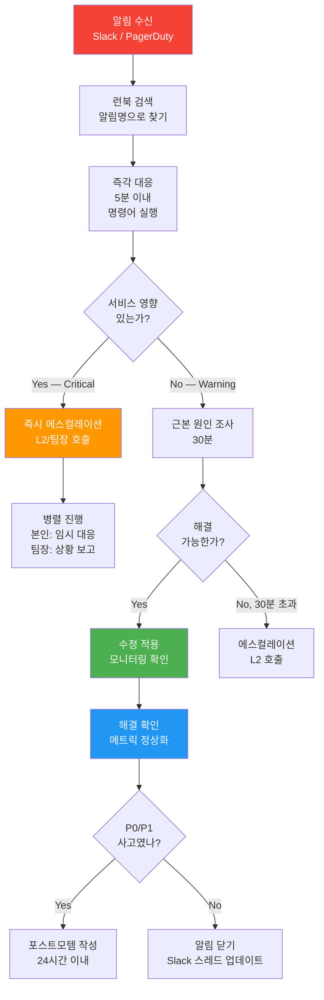

# 알림 런북 가이드 — 10가지 핵심 알림 대응 절차

> **문서 ID**: ONBOARD-05-ALERT-02
> **버전**: 1.0.0 | **작성일**: 2026-04-12 | **작성자**: Implementer (Sonnet)
> **선행 학습**: `01-alertmanager-guide.md` (AlertManager 기초)
> **소요 시간**: 약 90분 (숙지), 장애 발생 시 즉시 참조
> **CSAP**: D-06 (침해사고 관리), D-08 (접근 통제), D-12 (시스템 개발 보안)
> **Design Ref**: MTU-N57 Design §3, MTU-N70 Design §1, MTU-N45 Design §Grafana

---

## 목차

1. [런북(Runbook)이란?](#1-런북runbook이란)
2. [런북 작성 원칙 — 5분 해결 원칙](#2-런북-작성-원칙--5분-해결-원칙)
3. [런북 #01: HighErrorRate — API 에러율 5% 초과](#3-런북-01-higherrorrate--api-에러율-5-초과)
4. [런북 #02: HighLatencyP99 — P99 레이턴시 2초 초과](#4-런북-02-highlatencyp99--p99-레이턴시-2초-초과)
5. [런북 #03: PodCrashLoopBackOff — Pod 재시작 반복](#5-런북-03-podcrashlooopbackoff--pod-재시작-반복)
6. [런북 #04: DiskSpaceWarning — 디스크 85% 초과](#6-런북-04-diskspacewarning--디스크-85-초과)
7. [런북 #05: DatabaseConnectionPoolExhausted — DB 커넥션 풀 고갈](#7-런북-05-databaseconnectionpoolexhausted--db-커넥션-풀-고갈)
8. [런북 #06: JWTTokenBlacklistFull — Redis JWT 블랙리스트 용량 부족](#8-런북-06-jwttokenblacklistfull--redis-jwt-블랙리스트-용량-부족)
9. [런북 #07: SLOErrorBudgetCritical — 에러 버짓 10% 미만](#9-런북-07-sloerrorbudgetcritical--에러-버짓-10-미만)
10. [런북 #08: CSAPAuditLogGap — 감사 로그 5분 이상 공백](#10-런북-08-csapauditloggap--감사-로그-5분-이상-공백)
11. [런북 #09: AIRateLimitExceeded — AI API 호출 한도 초과](#11-런북-09-airatelimitexceeded--ai-api-호출-한도-초과)
12. [런북 #10: SecurityThreatDetected — Falco 보안 위협 탐지](#12-런북-10-securitythreatdetected--falco-보안-위협-탐지)
13. [런북 유지보수 가이드](#13-런북-유지보수-가이드)
14. [온콜 교대 체크리스트](#14-온콜-교대-체크리스트)
15. [학습 체크리스트](#15-학습-체크리스트)
16. [다음 단계](#16-다음-단계)

---

## 1. 런북(Runbook)이란?

### 1.1 런북의 정의

런북(Runbook)은 **특정 알림이 발생했을 때 담당자가 따라야 할 단계별 대응 절차서**입니다.

주방 요리사가 화재 경보가 울릴 때 패닉 없이 소화기 위치, 탈출 경로, 신고 번호를 순서대로 따를 수 있는 것처럼, 온콜 담당자는 알림 수신 즉시 런북을 펼쳐 절차를 따릅니다.

```
알림 수신 → 런북 검색 → 즉각 대응 (5분) → 근본 원인 조사 (30분) → 해결 확인
```

### 1.2 왜 알림마다 런북이 필요한가

**런북이 없을 때 발생하는 문제:**

```
오전 3시 — PodCrashLoopBackOff 알림 수신
  담당자: "무슨 Pod가 문제지? 어떤 명령어를 써야 하지?
           로그는 어디서 보지? 이거 재시작해도 될까?
           상급자한테 전화해야 하나?"
  결과: 15분 경과, 아직 원인 파악 안 됨
```

**런북이 있을 때:**

```
오전 3시 — PodCrashLoopBackOff 알림 수신
  담당자: 런북 #03 펼침 → 1분: kubectl describe 실행
          2분: 에러 로그 확인 → 3분: 재시작 vs 대기 결정
          5분: 해결 또는 에스컬레이션
  결과: 5분 이내 상황 파악 완료
```

### 1.3 공공기관 SaaS에서 런북이 더 중요한 이유

CSAP D-06(침해사고 관리) 요건에 따라 **모든 보안 이벤트는 탐지 후 정해진 절차에 따라 처리**되어야 합니다. 런북 없이 임기응변으로 처리하면 감리 시 "절차 미비" 결함이 발생합니다.

| CSAP 항목 | 런북 연관 내용 |
|----------|------------|
| D-06 침해사고 관리 | 보안 알림 대응 절차 문서화 |
| D-08 접근 통제 | 권한 위반 탐지 시 격리 절차 |
| D-12 시스템 개발 보안 | 운영 중 취약점 탐지 대응 절차 |

---

## 2. 런북 작성 원칙 — 5분 해결 원칙

### 2.1 5분 이내 판단 원칙

좋은 런북은 **첫 5분 안에 다음 세 가지를 결정**할 수 있게 합니다.

```
1. 지금 당장 서비스에 영향이 있는가? (심각도 확인)
2. 내가 직접 해결할 수 있는가? (에스컬레이션 여부)
3. 어떤 명령어를 먼저 실행해야 하는가? (즉각 조치)
```

### 2.2 런북 필수 구성 요소

모든 런북은 다음 구조를 따릅니다.

```
알림명     : 정확한 alert 이름 (Prometheus에서 사용하는 이름)
심각도     : Critical / Warning / Info
발동 조건  : PromQL 수식 (복사해서 바로 실행 가능해야 함)
영향       : 실제로 무슨 일이 일어나는지 비개발자도 이해하는 언어로
즉각 대응  : 5분 이내, 번호 붙인 구체적 명령어
근본 원인  : 30분 이내, 더 깊은 조사 방법
해결 확인  : "이걸 봐야 해결된 것이다"
관련 쿼리  : Grafana 대시보드 링크 + PromQL
에스컬레이션: 해결 못하면 누구에게, 언제
```

### 2.3 알림 대응 흐름도



---

## 3. 런북 #01: HighErrorRate — API 에러율 5% 초과

### 개요

**심각도**: Critical
**담당 팀**: Backend / SRE
**CSAP**: D-06 (서비스 가용성 침해사고)

### 발동 조건 (PromQL)

```promql
# 5분 내 HTTP 5xx 에러율이 전체 요청의 5% 초과
sum(rate(http_requests_total{status=~"5.."}[5m]))
  /
sum(rate(http_requests_total[5m]))
> 0.05
```

발동 지속 시간: 2분 이상 유지 시 알림

### 영향

공공기관 포털 사용자가 "오류가 발생했습니다" 화면을 보게 됩니다. 전자결재, 공문 조회, 민원 신청 등 업무가 중단됩니다. 에러율이 10%를 넘으면 SLO 에러 버짓이 빠르게 소진됩니다.

### 즉각 대응 (5분 이내)

```bash
# 1단계: 어떤 서비스에서 에러가 발생하는지 확인 (1분)
kubectl get pods -n production --field-selector=status.phase!=Running

# 2단계: 에러율이 가장 높은 서비스 확인 (Grafana PromQL로 실행)
# topk(5, sum by(service) (rate(http_requests_total{status=~"5.."}[5m])))

# 3단계: 해당 서비스 최근 로그 확인 (2분)
kubectl logs -n production deployment/api-gateway --tail=100 --since=5m | grep -i "error\|exception\|fatal"

# 4단계: Pod 상태 전체 확인
kubectl get pods -n production -l app=api-gateway

# 5단계: 에러가 DB 연결 문제인지 확인
kubectl exec -n production deployment/api-gateway -- \
  wget -qO- http://localhost:3000/health | python3 -m json.tool
```

### 근본 원인 조사 (30분)

```bash
# 1. 최근 배포가 있었는지 확인
kubectl rollout history deployment/api-gateway -n production

# 2. 에러 패턴 분석 (어떤 엔드포인트에서 5xx가 나는지)
kubectl logs -n production deployment/api-gateway --tail=500 | \
  grep "HTTP 5" | awk '{print $NF}' | sort | uniq -c | sort -rn | head -20

# 3. 의존 서비스 상태 확인 (DB, Redis, 외부 API)
kubectl get pods -n production | grep -v Running
kubectl get pods -n database | grep -v Running

# 4. 리소스 한계 확인 (OOM, CPU throttling)
kubectl top pods -n production --sort-by=memory | head -10

# 5. 최근 ConfigMap / Secret 변경 확인
kubectl get events -n production --sort-by=lastTimestamp | tail -20
```

### 원인별 즉각 처치

| 원인 | 처치 |
|-----|-----|
| 최근 배포 후 에러 발생 | `kubectl rollout undo deployment/api-gateway -n production` |
| 특정 Pod만 에러 | `kubectl delete pod <pod-name> -n production` (재시작) |
| DB 연결 실패 | DB 커넥션 풀 런북 #05 참조 |
| 메모리 부족 | `kubectl scale deployment/api-gateway --replicas=3 -n production` |
| 외부 API 다운 | 회로 차단기 활성화 여부 확인, 대체 경로 사용 |

### 해결 후 확인 사항

```bash
# 에러율이 1% 이하로 떨어졌는지 5분간 모니터링
# Grafana → "SaaS API Overview" 대시보드 → "Error Rate" 패널

# 확인용 PromQL
sum(rate(http_requests_total{status=~"5.."}[5m]))
  /
sum(rate(http_requests_total[5m]))
# 결과가 0.01 이하이면 정상

# Slack 업데이트: "#on-call" 채널에 해결 메시지 남기기
```

### 관련 대시보드 / 쿼리

- Grafana: `SaaS API Overview` > `HTTP Error Rate` 패널
- Grafana: `SaaS API Overview` > `Top 5 Error Endpoints` 패널
- AlertManager UI: `http://alertmanager.monitoring.svc:9093`

### 에스컬레이션

- **5분 내 원인 파악 실패**: L2 백엔드 엔지니어 호출
- **15분 내 해결 실패**: 팀장 + 담당 PM에게 Slack DM
- **에러율 20% 초과**: 서비스 긴급 점검 선언, 공지 게시 필요

---

## 4. 런북 #02: HighLatencyP99 — P99 레이턴시 2초 초과

### 개요

**심각도**: Warning (P99 > 2초) / Critical (P99 > 5초)
**담당 팀**: Backend / SRE
**CSAP**: D-06 (서비스 품질 저하)

### 발동 조건 (PromQL)

```promql
# P99 응답시간이 2초 초과
histogram_quantile(0.99,
  sum by (le, service) (
    rate(http_request_duration_seconds_bucket[5m])
  )
) > 2
```

### 영향

공공기관 사용자가 화면 로딩을 2초 이상 기다립니다. 전자결재 문서 조회, 대용량 보고서 출력 등 업무가 느려집니다. SLO 레이턴시 목표(P99 < 1초) 위반으로 에러 버짓이 소진됩니다.

### 즉각 대응 (5분 이내)

```bash
# 1단계: 느린 엔드포인트 파악
# Grafana Tempo에서 최근 느린 트레이스 확인
# 또는 로그에서 응답 시간 추출
kubectl logs -n production deployment/api-gateway --tail=200 | \
  grep "duration" | awk '{if($NF > 2000) print}' | head -20

# 2단계: DB 슬로우 쿼리 확인
kubectl exec -n database pod/postgres-0 -- \
  psql -U saas -c "SELECT query, mean_exec_time, calls FROM pg_stat_statements ORDER BY mean_exec_time DESC LIMIT 10;"

# 3단계: Redis 응답 시간 확인
kubectl exec -n production deployment/redis -- redis-cli SLOWLOG GET 10

# 4단계: 현재 요청량 확인 (트래픽 급증 여부)
# sum(rate(http_requests_total[5m])) — Grafana에서 확인

# 5단계: CPU/메모리 상태
kubectl top pods -n production | sort -k3 -rn | head -10
```

### 근본 원인 조사 (30분)

```bash
# 1. Grafana Tempo에서 느린 트레이스 분석
# http://grafana.monitoring.svc:3000 → Explore → Tempo
# 검색: { duration > 2s }

# 2. DB N+1 쿼리 탐지
kubectl exec -n database pod/postgres-0 -- \
  psql -U saas -c "
    SELECT queryid, query, calls, total_exec_time/calls AS avg_ms
    FROM pg_stat_statements
    WHERE calls > 100
    ORDER BY avg_ms DESC
    LIMIT 20;
  "

# 3. 인덱스 미사용 쿼리 확인
kubectl exec -n database pod/postgres-0 -- \
  psql -U saas -c "
    SELECT schemaname, tablename, seq_scan, seq_tup_read,
           idx_scan, idx_tup_fetch
    FROM pg_stat_user_tables
    WHERE seq_scan > idx_scan
    ORDER BY seq_tup_read DESC;
  "

# 4. Kubernetes HPA 확인 (스케일링 필요한지)
kubectl get hpa -n production
```

### 원인별 즉각 처치

| 원인 | 처치 |
|-----|-----|
| 트래픽 급증 | `kubectl scale deployment/api-gateway --replicas=5 -n production` |
| DB 슬로우 쿼리 | `pg_cancel_backend(<pid>)` 로 느린 쿼리 중단 |
| Redis 응답 지연 | Redis 재시작 검토 또는 캐시 우회 |
| 특정 서비스만 느림 | 해당 서비스만 재배포 |
| 외부 API 타임아웃 | 타임아웃 값 단축, 회로 차단기 활성화 |

### 해결 후 확인 사항

```bash
# P99가 1초 이하로 개선되었는지 확인
histogram_quantile(0.99,
  sum by (le) (rate(http_request_duration_seconds_bucket[5m]))
)
# 결과가 1.0 이하이면 정상

# 5분간 추이 모니터링 후 알림 해제 확인
```

### 에스컬레이션

- **30분 내 P99 > 3초 지속**: DBA + L2 엔지니어 호출
- **P99 > 10초**: 서비스 점검 공지 검토

---

## 5. 런북 #03: PodCrashLoopBackOff — Pod 재시작 반복

### 개요

**심각도**: Critical
**담당 팀**: DevOps / Backend
**CSAP**: D-06 (서비스 중단)

### 발동 조건 (PromQL)

```promql
# 15분 내 Pod 재시작이 5회 초과
# Design Ref: infra/monitoring/alerting-rules.yaml
increase(kube_pod_container_status_restarts_total[15m]) > 5
```

발동 조건 참고 (실제 정의):

```yaml
# infra/monitoring/alerting-rules.yaml
- alert: PodCrashLooping
  expr: increase(kube_pod_container_status_restarts_total[15m]) > 5
  for: 1m
  labels:
    severity: critical
    team: devops
  annotations:
    summary: "Pod {{ $labels.namespace }}/{{ $labels.pod }} CrashLooping"
    csap_ref: "D-06-04"
```

### 영향

해당 Pod가 서비스하는 기능이 간헐적 또는 완전히 중단됩니다. Pod가 계속 재시작하면서 다른 Pod에 과부하를 줄 수 있습니다. Kubernetes가 `BackOff` 상태로 전환하면 수동 개입 없이 복구되지 않습니다.

### 즉각 대응 (5분 이내)

```bash
# 1단계: 어떤 Pod인지 확인 (알림에서 namespace/pod 이름 확인)
kubectl get pods -n production | grep -v Running | grep -v Completed

# 2단계: 재시작 횟수와 상태 확인
kubectl describe pod <pod-name> -n production | grep -A 5 "Last State:\|Restart Count:\|Reason:"

# 3단계: 크래시 직전 로그 확인 (--previous: 이전 컨테이너 로그)
kubectl logs <pod-name> -n production --previous --tail=100

# 4단계: 현재 이벤트 확인
kubectl get events -n production --field-selector=involvedObject.name=<pod-name>

# 5단계: 서비스 영향 범위 파악 (같은 Deployment의 다른 Pod는 정상인지)
kubectl get pods -n production -l app=<app-name>
```

### 에러 유형별 진단

```bash
# OOMKilled (메모리 부족)
kubectl describe pod <pod-name> -n production | grep "OOMKilled\|memory"
# → 처치: 메모리 limit 상향 또는 메모리 누수 코드 수정

# CrashLoopBackOff (애플리케이션 오류)
kubectl logs <pod-name> -n production --previous | grep -i "error\|panic\|exception" | tail -30
# → 처치: 에러 메시지 분석 후 코드 수정 또는 이전 버전 롤백

# ImagePullBackOff (이미지 문제)
kubectl describe pod <pod-name> -n production | grep "Failed to pull"
# → 처치: Harbor 이미지 존재 확인, imagePullSecrets 확인

# Init container 실패 (초기화 오류)
kubectl logs <pod-name> -n production -c <init-container-name>
# → 처치: Init container 환경변수/볼륨 확인
```

### 근본 원인 조사 (30분)

```bash
# 1. 애플리케이션 에러 코드 분석
kubectl logs <pod-name> -n production --previous --tail=500 | \
  grep -E "ERROR|FATAL|panic|exception" | sort | uniq -c | sort -rn

# 2. 환경변수 / Secret 확인 (설정 오류 여부)
kubectl exec <pod-name> -n production -- env | sort

# 3. 메모리 사용 추이 분석 (OOM인 경우)
# Grafana → "Pod Memory Usage" 패널
# container_memory_working_set_bytes{pod=~"<pod-name>.*"}

# 4. Deployment 변경 이력
kubectl rollout history deployment/<deployment-name> -n production

# 5. 의존 서비스 연결 상태 (DB, Redis 등)
kubectl exec <new-pod-name> -n production -- \
  wget -qO- http://localhost:3000/health 2>&1
```

### 즉각 처치

```bash
# 롤백 (최근 배포가 원인인 경우)
kubectl rollout undo deployment/<deployment-name> -n production
kubectl rollout status deployment/<deployment-name> -n production

# 강제 재배포 (이미지/설정 문제가 없는 경우)
kubectl rollout restart deployment/<deployment-name> -n production

# 리소스 한계 임시 상향 (OOM인 경우, 임시 조치)
kubectl set resources deployment/<deployment-name> -n production \
  --limits=memory=2Gi --requests=memory=1Gi
```

### 해결 후 확인 사항

```bash
# Pod가 안정적으로 Running 상태를 유지하는지 5분간 확인
kubectl get pods -n production -l app=<app-name> -w

# 재시작 카운터가 더 이상 증가하지 않는지 확인
kubectl get pod <pod-name> -n production -o jsonpath='{.status.containerStatuses[0].restartCount}'
```

### 에스컬레이션

- **원인 파악 실패 (15분)**: 코드 담당 개발자 즉시 호출
- **롤백 후에도 크래시 지속**: 개발팀장 + 인프라팀장 호출
- **프로덕션 전체 서비스 영향**: 서비스 점검 공지 + 경영진 보고

---

## 6. 런북 #04: DiskSpaceWarning — 디스크 85% 초과

### 개요

**심각도**: Warning (85%) / Critical (95%)
**담당 팀**: DevOps / 인프라
**CSAP**: D-06 (시스템 가용성)

### 발동 조건 (PromQL)

```promql
# 노드 디스크 사용률 85% 초과
(
  node_filesystem_size_bytes{fstype!="tmpfs"} -
  node_filesystem_avail_bytes{fstype!="tmpfs"}
) / node_filesystem_size_bytes{fstype!="tmpfs"} > 0.85
```

### 영향

- **85~95%**: 디스크 쓰기가 느려짐, 로그 수집 지연 가능
- **95%+**: 새 로그 기록 불가, Pod 생성 실패 가능, DB 트랜잭션 실패
- **100%**: 전체 서비스 중단 (모든 쓰기 작업 불가)

### 즉각 대응 (5분 이내)

```bash
# 1단계: 어느 노드, 어느 마운트 포인트인지 확인
df -h | sort -k5 -rn | head -10

# 2단계: 가장 큰 디렉토리 확인
du -sh /var/log/* | sort -h | tail -20
du -sh /var/lib/containerd/* 2>/dev/null | sort -h | tail -10
du -sh /var/lib/docker/containers/* 2>/dev/null | sort -h | tail -10

# 3단계: 컨테이너 로그 크기 확인 (가장 큰 용량 차지하는 경우)
kubectl exec -n logging pod/loki-0 -- du -sh /data/loki

# 4단계: 긴급 용량 확보 — 오래된 로그 정리
# (주의: 반드시 보존 기간 확인 후 삭제. CSAP D-06: 최소 1년 보존)
find /var/log -name "*.gz" -mtime +7 -exec ls -lh {} \; | head -20
```

### 근본 원인 조사 (30분)

```bash
# 1. 컨테이너 로그 크기 전체 확인
du -sh /var/log/pods/* | sort -h | tail -20

# 2. Loki 보존 정책 확인
kubectl exec -n logging pod/loki-0 -- cat /etc/loki/loki.yaml | grep -A 5 "retention"

# 3. PVC 사용량 확인
kubectl get pvc -A | awk '{print $1, $2, $4, $7}' | column -t

# 4. 이미지 캐시 정리 가능 여부 확인
crictl images | sort -k3 -rn | head -20

# 5. 디스크 증가 추이 (Grafana)
# node_filesystem_avail_bytes{instance=~"<node-name>.*"}
# 지난 24시간 추이로 증가 속도 파악
```

### 즉각 처치 (용량 확보)

```bash
# 1. 미사용 컨테이너 이미지 정리 (안전)
crictl rmi --prune

# 2. 완료된 Pod 정리
kubectl delete pod -n production --field-selector=status.phase=Succeeded
kubectl delete pod -n production --field-selector=status.phase=Failed

# 3. 오래된 컨테이너 로그 압축 (7일 이상, 보존 정책 확인 후)
# find /var/log/pods -name "*.log" -mtime +7 -exec gzip {} \;

# 4. Docker 빌드 캐시 정리 (빌드 노드인 경우)
docker system prune -f --volumes

# 5. PVC 자동 확장이 설정된 경우 StorageClass 확인
kubectl get sc | grep -i allow
```

### 장기 해결책

```yaml
# Loki 보존 기간 설정 (loki-config.yaml)
limits_config:
  retention_period: 720h  # 30일 (CSAP 최소 요건)

compactor:
  retention_enabled: true
  retention_delete_delay: 2h
```

### 해결 후 확인 사항

```bash
# 디스크 사용률이 80% 이하로 떨어졌는지 확인
df -h /  # 또는 해당 마운트 포인트

# Prometheus 메트릭으로 확인
# (node_filesystem_size_bytes - node_filesystem_avail_bytes) / node_filesystem_size_bytes
# 결과가 0.80 이하이면 정상
```

### 에스컬레이션

- **95% 초과**: 인프라팀장 즉시 호출, 볼륨 확장 승인 요청
- **디스크 풀 임박 (99%)**: 서비스 쓰기 제한 검토, 긴급 용량 확보

---

## 7. 런북 #05: DatabaseConnectionPoolExhausted — DB 커넥션 풀 고갈

### 개요

**심각도**: Critical
**담당 팀**: DBA / Backend
**CSAP**: D-06 (서비스 가용성)

### 발동 조건 (PromQL)

```promql
# PostgreSQL 연결 수가 max_connections의 90% 초과
# Design Ref: infra/monitoring/alerting-rules.yaml (PostgreSQLHighConnectionCount)
pg_stat_activity_count > 80
```

또는 더 정밀한 감지:

```promql
pg_stat_activity_count / pg_settings_max_connections > 0.9
```

### 영향

새로운 DB 연결 요청이 "connection refused" 또는 "too many connections" 에러를 반환합니다. API 서버에서 DB 쿼리가 불가능해져 전체 서비스가 멈춥니다.

### 즉각 대응 (5분 이내)

```bash
# 1단계: 현재 연결 수 즉시 확인
kubectl exec -n database pod/postgres-0 -- \
  psql -U saas -c "SELECT count(*) FROM pg_stat_activity;"

# 2단계: 연결 상태별 분류
kubectl exec -n database pod/postgres-0 -- \
  psql -U saas -c "
    SELECT state, count(*)
    FROM pg_stat_activity
    GROUP BY state
    ORDER BY count DESC;
  "

# 3단계: 유휴 연결 점유 중인 프로세스 확인
kubectl exec -n database pod/postgres-0 -- \
  psql -U saas -c "
    SELECT pid, usename, application_name, state, wait_event,
           now() - pg_stat_activity.query_start AS duration
    FROM pg_stat_activity
    WHERE state = 'idle'
    ORDER BY duration DESC
    LIMIT 20;
  "

# 4단계: 오래된 유휴 연결 강제 종료 (30분 이상 유휴)
kubectl exec -n database pod/postgres-0 -- \
  psql -U saas -c "
    SELECT pg_terminate_backend(pid)
    FROM pg_stat_activity
    WHERE state = 'idle'
      AND query_start < now() - interval '30 minutes';
  "

# 5단계: 장시간 실행 중인 쿼리 확인 (블로킹 원인)
kubectl exec -n database pod/postgres-0 -- \
  psql -U saas -c "
    SELECT pid, now() - pg_stat_activity.query_start AS duration, query, state
    FROM pg_stat_activity
    WHERE state != 'idle'
      AND query_start < now() - interval '5 minutes'
    ORDER BY duration DESC;
  "
```

### 근본 원인 조사 (30분)

```bash
# 1. PgBouncer 상태 확인 (커넥션 풀러)
kubectl get pods -n database | grep pgbouncer
kubectl logs -n database deployment/pgbouncer --tail=50

# 2. PgBouncer 통계
kubectl exec -n database deployment/pgbouncer -- \
  psql -h localhost -p 5432 -U pgbouncer pgbouncer -c "SHOW STATS;"
kubectl exec -n database deployment/pgbouncer -- \
  psql -h localhost -p 5432 -U pgbouncer pgbouncer -c "SHOW POOLS;"

# 3. 애플리케이션별 연결 수 분석
kubectl exec -n database pod/postgres-0 -- \
  psql -U saas -c "
    SELECT application_name, count(*)
    FROM pg_stat_activity
    GROUP BY application_name
    ORDER BY count DESC;
  "

# 4. 연결 풀 설정 확인 (각 서비스의 DB_POOL_SIZE 환경변수)
kubectl get deployment -n production -o jsonpath='{range .items[*]}{.metadata.name}{"\n"}{range .spec.template.spec.containers[*]}{.env[?(@.name=="DB_POOL_SIZE")]}{"\n"}{end}{end}'
```

### 즉각 처치

```bash
# 1. 유휴 연결 대량 정리
kubectl exec -n database pod/postgres-0 -- \
  psql -U saas -c "
    SELECT pg_terminate_backend(pid)
    FROM pg_stat_activity
    WHERE state IN ('idle', 'idle in transaction')
      AND query_start < now() - interval '10 minutes';
  "

# 2. PgBouncer 재시작 (연결 풀 초기화)
kubectl rollout restart deployment/pgbouncer -n database

# 3. 임시로 max_connections 상향 (DB 재시작 필요, 주의 필요)
# 재시작 없이 조정 가능한 파라미터:
kubectl exec -n database pod/postgres-0 -- \
  psql -U saas -c "ALTER SYSTEM SET max_connections = 200;"
# 주의: 이후 pg_ctl reload 또는 재시작 필요
```

### 해결 후 확인 사항

```bash
# 연결 수가 정상 범위(최대값의 70% 이하)로 떨어졌는지 확인
kubectl exec -n database pod/postgres-0 -- \
  psql -U saas -c "SELECT count(*) FROM pg_stat_activity;"
# 100 커넥션 설정이면 70 이하가 정상

# API 서버 DB 연결 정상화 확인
curl -s http://api-gateway.production.svc/health | python3 -m json.tool
```

### 에스컬레이션

- **연결 해제 불가 (5분)**: DBA 즉시 호출
- **PgBouncer 재시작 후에도 지속**: 인프라팀 + 개발팀 동시 호출

---

## 8. 런북 #06: JWTTokenBlacklistFull — Redis JWT 블랙리스트 용량 부족

### 개요

**심각도**: Critical
**담당 팀**: Backend / 보안
**CSAP**: D-08 (세션 관리 — 로그아웃 토큰 무효화), D-09 (암호화)

### 발동 조건 (PromQL)

```promql
# Redis 메모리 사용률 95% 초과 (JWT 블랙리스트 세트 포함)
# Design Ref: infra/monitoring/redis-detailed-alerts.yaml
redis:memory:usage_ratio > 95
```

또는 JWT 블랙리스트 크기 직접 감지:

```promql
# Redis의 jwt_blacklist 키 크기가 임계값 초과
redis_key_size{key="jwt_blacklist"} > 1000000
```

### 영향

JWT 블랙리스트가 가득 차면 로그아웃한 사용자의 토큰을 무효화하지 못합니다. 보안상으로 **이미 로그아웃한 계정으로도 API 접근이 가능**해집니다. CSAP D-08 세션 관리 요건 위반 상태입니다.

### 즉각 대응 (5분 이내)

```bash
# 1단계: Redis 메모리 현황 확인
kubectl exec -n cache deployment/redis -- redis-cli INFO memory | grep -E "used_memory:|maxmemory:|mem_fragmentation"

# 2단계: JWT 블랙리스트 크기 확인
kubectl exec -n cache deployment/redis -- redis-cli SCARD jwt_blacklist

# 3단계: 만료된 토큰 항목 수 확인 (TTL 없는 항목)
kubectl exec -n cache deployment/redis -- redis-cli DEBUG SLEEP 0
kubectl exec -n cache deployment/redis -- redis-cli MEMORY USAGE jwt_blacklist

# 4단계: Redis 전체 키 수 확인
kubectl exec -n cache deployment/redis -- redis-cli DBSIZE

# 5단계: 메모리 분석
kubectl exec -n cache deployment/redis -- redis-cli MEMORY DOCTOR
```

### 근본 원인 조사 (30분)

```bash
# 1. JWT 블랙리스트 TTL 정책 확인
# 블랙리스트 항목에 TTL이 설정되어 있는지 확인
kubectl exec -n cache deployment/redis -- redis-cli TTL jwt_blacklist

# 각 블랙리스트 멤버별 TTL 확인 (Set 타입인 경우 별도 만료키 패턴 사용 여부)
kubectl exec -n cache deployment/redis -- redis-cli SCAN 0 MATCH "blacklist:*" COUNT 100

# 2. 소스 코드에서 블랙리스트 추가 로직 확인
# platform/services/auth-service/src/lib/token-blacklist.ts 확인
# TTL 없이 SADD만 하고 있는지 점검

# 3. Redis maxmemory 정책 확인
kubectl exec -n cache deployment/redis -- redis-cli CONFIG GET maxmemory-policy

# 4. 전체 키 중 만료 키 비율
kubectl exec -n cache deployment/redis -- redis-cli INFO keyspace
```

### 즉각 처치

```bash
# 1. 만료된 토큰 수동 정리 (15분 이상 된 블랙리스트 항목)
# JWT 토큰의 exp 클레임 기준으로 만료된 항목 제거
kubectl exec -n production deployment/auth-service -- \
  node -e "
    const redis = require('redis').createClient(process.env.REDIS_URL);
    // 만료된 블랙리스트 토큰 정리 스크립트 실행
    redis.sMembers('jwt_blacklist', (err, tokens) => {
      const now = Date.now() / 1000;
      const expired = tokens.filter(t => {
        const payload = JSON.parse(Buffer.from(t.split('.')[1], 'base64').toString());
        return payload.exp < now;
      });
      console.log('만료된 토큰 수:', expired.length);
      if (expired.length > 0) redis.sRem('jwt_blacklist', ...expired);
    });
  "

# 2. Redis 메모리 정리 (안전한 eviction)
kubectl exec -n cache deployment/redis -- redis-cli MEMORY PURGE

# 3. maxmemory 임시 상향 (용량 확보)
kubectl exec -n cache deployment/redis -- \
  redis-cli CONFIG SET maxmemory 4gb

# 4. 단기 조치: 오래된 블랙리스트 키 패턴으로 삭제
kubectl exec -n cache deployment/redis -- \
  redis-cli --scan --pattern "blacklist:*" | head -1000 | \
  xargs redis-cli DEL
```

### 항구적 해결책 (코드 수정 필요)

```typescript
// Design Ref: CSAP D-08 세션 관리
// auth-service: JWT 블랙리스트에 반드시 TTL 설정

// 잘못된 방법 (TTL 없음 — 블랙리스트가 계속 증가)
await redis.sAdd('jwt_blacklist', token)

// 올바른 방법 (토큰 만료 시간과 동일한 TTL 설정)
async function addToBlacklist(token: string, expiresAt: number): Promise<void> {
  const ttl = expiresAt - Math.floor(Date.now() / 1000)
  if (ttl > 0) {
    // 개별 키로 저장, TTL 적용 — Set 대신 String 타입 사용
    await redis.setEx(`blacklist:${token}`, ttl, '1')
  }
}

async function isBlacklisted(token: string): Promise<boolean> {
  return (await redis.exists(`blacklist:${token}`)) === 1
}
```

### 해결 후 확인 사항

```bash
# Redis 메모리 사용률이 80% 이하로 떨어졌는지 확인
kubectl exec -n cache deployment/redis -- \
  redis-cli INFO memory | grep "used_memory_human\|maxmemory_human"

# JWT 인증이 정상 동작하는지 확인
curl -H "Authorization: Bearer <blacklisted-token>" \
  http://api-gateway.production.svc/api/auth/me
# 결과: 401 Unauthorized (블랙리스트 정상 동작)
```

### 에스컬레이션

- **Redis OOM으로 서비스 중단 시**: 인프라팀 + 보안팀 동시 호출
- **블랙리스트 우회 가능성 확인**: 보안팀에 즉시 보고 (CSAP 사고 보고 절차)

---

## 9. 런북 #07: SLOErrorBudgetCritical — 에러 버짓 10% 미만

### 개요

**심각도**: Critical
**담당 팀**: SRE / 서비스 오너
**CSAP**: D-06 (서비스 가용성 관리)
**Design Ref**: `infra/monitoring/slo-error-budget-alerts.yaml`, `packages/slo-escalation/src/escalation-controller.ts`

### 발동 조건 (PromQL)

```promql
# 에러 버짓 잔여율 10% 미만 (SLOErrorBudget75Consumed 이후)
# Design Ref: infra/monitoring/slo-error-budget-alerts.yaml
slo:error_budget:remaining_ratio < 0.10
```

에스컬레이션 단계 (SLO 에스컬레이션 컨트롤러 기준):

```typescript
// packages/slo-escalation/src/escalation-controller.ts
// FR-SLO.1: 에러 버짓 소진율 기반 에스컬레이션
// budgetBurnRate > 90 → EscalationLevel.Critical
// budgetBurnRate > 100 → EscalationLevel.Violated
```

### 영향

30일 SLO 에러 버짓의 90% 이상이 소진되었습니다. 이 상태가 지속되면 이번 달 SLO를 위반하게 됩니다. 다음 달 SLO가 자동으로 하향 조정되고, 공공기관 계약에서 패널티가 발생할 수 있습니다.

에러 버짓 잔여량과 대응 수위:

| 잔여율 | 상태 | 대응 |
|-------|-----|-----|
| > 50% | Normal | 모니터링 유지 |
| 25~50% | Warning | 원인 분석 시작 |
| 10~25% | Danger | 긴급 조치 |
| < 10% | Critical | 변경 동결 + 경영진 보고 |
| 0% | Violated | SLO 위반 선언 |

### 즉각 대응 (5분 이내)

```bash
# 1단계: 현재 에러 버짓 상태 확인
# Grafana → "SLO Dashboard" → "Error Budget Remaining" 패널

# 2단계: 어떤 SLO가 가장 빠르게 소진되고 있는지 확인
# PromQL:
# sort_desc(1 - slo:error_budget:remaining_ratio)

# 3단계: 번레이트(소진 속도) 확인
# slo:burn_rate:1h  → 1시간 번레이트 (14.4 초과 = 1시간 내 소진)
# slo:burn_rate:6h  → 6시간 번레이트

# 4단계: 에러 버짓을 가장 많이 소진하는 서비스 확인
kubectl logs -n production deployment/api-gateway --tail=200 | \
  grep "HTTP 5" | awk '{print $NF}' | sort | uniq -c | sort -rn

# 5단계: 변경 동결(Change Freeze) 선언 검토
# → SRE 팀장에게 Slack으로 현황 공유
```

### 근본 원인 조사 (30분)

```bash
# 1. 에러 버짓 소진이 시작된 시점 파악 (Grafana에서)
# http_requests_total{status=~"5.."} 과거 7일 추이

# 2. 해당 서비스 최근 배포 이력
kubectl rollout history deployment -n production

# 3. 에러율이 높은 엔드포인트 TOP 10
# topk(10, sum by(handler) (rate(http_requests_total{status=~"5.."}[24h])))

# 4. 에러의 근본 원인 분류
# - 외부 의존성 (DB, Redis, 외부 API)?
# - 코드 버그?
# - 인프라 문제?

# 5. SLO 정책 재검토 (목표가 현실적인지)
# docs/01-plan/ 에서 SLO 정의 문서 확인
```

### 즉각 처치

```bash
# 1. 변경 동결 선언 (팀 공지)
# Slack #engineering 채널:
# "[변경 동결] 서비스 X SLO 에러 버짓 10% 미만 도달.
#  복구 확인 전까지 모든 프로덕션 배포 중단."

# 2. 에러율이 높은 기능 임시 비활성화 (Feature Flag)
# platform/packages/feature-flag-sdk/src/index.ts 활용
kubectl set env deployment/api-gateway -n production \
  FEATURE_FLAG_HIGH_RISK_FEATURE=false

# 3. 회로 차단기 활성화 (외부 의존성 실패 시)
# 해당 서비스의 circuit breaker 임계값 낮추기

# 4. 에러를 유발하는 최근 배포 롤백 검토
kubectl rollout history deployment/<service> -n production
kubectl rollout undo deployment/<service> -n production
```

### 해결 후 확인 사항

```bash
# 에러 버짓 소진 속도가 1.0x 이하로 떨어졌는지 확인
# slo:burn_rate:1h < 1.0  → 정상 소진 속도

# 에러율이 SLO 목표 이하로 개선되었는지 확인
# 예: 가용성 SLO 99.9% → 에러율 < 0.1%
sum(rate(http_requests_total{status=~"5.."}[5m]))
  / sum(rate(http_requests_total[5m]))
# 0.001 이하이면 SLO 목표 달성

# 변경 동결 해제 시 팀 공지 필수
```

### 에스컬레이션

- **에러 버짓 5% 미만**: 서비스 오너 + 팀장 + PM 동시 호출
- **에러 버짓 0% 도달 (SLO 위반)**: 경영진 보고, 고객 공지 검토, 포스트모템 즉시 시작

---

## 10. 런북 #08: CSAPAuditLogGap — 감사 로그 5분 이상 공백

### 개요

**심각도**: Critical
**담당 팀**: 보안 / 운영
**CSAP**: D-06 (침해사고 관리 — 감사 추적 의무)
**Design Ref**: `infra/monitoring/csap-audit-monitoring-rules.yaml`

### 발동 조건 (PromQL)

```promql
# 감사 이벤트가 5분 이상 0인 경우 (수집 중단 의심)
# Design Ref: infra/monitoring/csap-audit-monitoring-rules.yaml
(
  sum(rate(apiserver_audit_event_total[5m])) < 0.1
  * sum(rate(apiserver_audit_event_total[1h]))
)
and sum(rate(apiserver_audit_event_total[1h])) > 0
```

또는:

```promql
# 24시간 감사 이벤트가 0인 경우 (완전 중단)
csap:audit_events:total_24h == 0
```

### 영향

공공기관 CSAP D-06 요건에 따라 **모든 민감 작업은 전수 기록**되어야 합니다. 감사 로그 공백은 다음을 의미합니다.

```
1. CSAP D-06 위반 상태 (감리 결함)
2. 해당 기간 중 발생한 보안 사고 추적 불가
3. 법적 증거 훼손 가능성
4. 감리단에 즉시 보고 의무 발생
```

### 즉각 대응 (5분 이내)

```bash
# 1단계: 감사 로그 수집 상태 즉시 확인
kubectl get pods -n logging | grep -E "loki|promtail|vector"

# 2단계: K8s API 서버 감사 로그 활성화 여부 확인
kubectl get configmap -n kube-system kube-apiserver-config 2>/dev/null || \
  kubectl get pods -n kube-system | grep apiserver

# 3단계: 감사 로그 백엔드 상태 확인
kubectl exec -n logging pod/loki-0 -- wget -qO- http://localhost:3100/ready

# 4단계: 로컬 감사 로그 파일 확인 (노드 직접)
ls -la /var/log/kubernetes/audit/ 2>/dev/null | tail -5

# 5단계: 마지막 감사 이벤트 수신 시간 확인
kubectl exec -n monitoring pod/prometheus-0 -- \
  promtool query instant 'timestamp(sum(rate(apiserver_audit_event_total[1m])) > 0)'
```

### 근본 원인 조사 (30분)

```bash
# 1. Promtail / Fluentbit 에이전트 상태
kubectl get pods -n logging -l app=promtail
kubectl logs -n logging daemonset/promtail --tail=50 | grep -i "error\|warn"

# 2. Loki 쓰기 실패 확인
kubectl logs -n logging pod/loki-0 --tail=100 | grep -i "error\|failed\|reject"

# 3. 볼륨 마운트 상태 (감사 로그 디렉토리가 마운트되어 있는지)
kubectl describe daemonset promtail -n logging | grep -A 5 "Volumes:"

# 4. 네트워크 연결 확인 (Promtail → Loki)
kubectl exec -n logging daemonset/promtail -- \
  wget -qO- http://loki.logging.svc:3100/ready 2>&1

# 5. K8s audit policy 설정 확인
kubectl get apiserver -A 2>/dev/null || \
  cat /etc/kubernetes/audit-policy.yaml 2>/dev/null
```

### 즉각 처치

```bash
# 1. Promtail 재시작 (에이전트 문제인 경우)
kubectl rollout restart daemonset/promtail -n logging
kubectl rollout status daemonset/promtail -n logging

# 2. Loki 재시작 (백엔드 문제인 경우)
kubectl rollout restart statefulset/loki -n logging

# 3. 감사 로그 로컬 백업 확인 (로그 유실 여부 파악)
# 로그 유실이 없으면 재수집 가능, 유실이면 CSAP 보고 필요
find /var/log/kubernetes/audit -name "*.log" -newer /tmp/.last-check 2>/dev/null

# 4. Vector (로그 파이프라인) 재시작
kubectl rollout restart daemonset/vector -n logging 2>/dev/null || true
```

### CSAP 보고 절차 (로그 유실 시)

감사 로그 유실이 확인되면 다음 절차를 따릅니다.

```
1. 유실 기간 기록: [시작 시간] ~ [종료 시간]
2. 유실된 이벤트 유형 파악 (API 서버 메트릭으로 추정)
3. 보안팀장에게 즉시 보고 (15분 이내)
4. CSAP 감리 담당자에게 서면 보고 (24시간 이내)
5. 사고 대응 기록 작성 (.claude/audit.jsonl 에 기록)
6. 재발 방지 대책 수립 (1주일 이내)
```

### 해결 후 확인 사항

```bash
# 감사 이벤트가 다시 수집되는지 확인
kubectl exec -n monitoring pod/prometheus-0 -- \
  promtool query instant 'sum(rate(apiserver_audit_event_total[1m]))'
# 0보다 큰 값이 반환되면 정상

# Grafana에서 감사 로그 수집 재개 확인
# http://grafana.monitoring.svc:3000 → "CSAP Audit Logs" 대시보드
```

### 에스컬레이션

- **10분 내 복구 실패**: 보안팀장 즉시 호출
- **로그 유실 확인**: CSAP 담당 감리원에게 서면 보고 의무 (24시간 이내)
- **의도적 삭제 의심 (Falco 탐지)**: 런북 #10 참조, 즉시 포렌식 조사

---

## 11. 런북 #09: AIRateLimitExceeded — AI API 호출 한도 초과

### 개요

**심각도**: Warning
**담당 팀**: AI팀 / Backend
**CSAP**: N2SF O등급 데이터 관리, AI Gateway 정책
**Design Ref**: N2SF 데이터 분류 규칙 (C/S 등급 전송 금지)

### 발동 조건 (PromQL)

```promql
# AI API 호출 실패율이 10% 초과 (429 Too Many Requests)
sum(rate(ai_api_requests_total{status="429"}[5m]))
  / sum(rate(ai_api_requests_total[5m]))
> 0.10
```

또는:

```promql
# AI Gateway 큐 적체 (100건 초과)
ai_gateway_queue_size > 100
```

### 영향

AI 기반 기능(문서 요약, 자동 분류, RAG 검색)이 오류를 반환합니다. 사용자가 AI 기능을 사용할 수 없지만, 핵심 업무(결재, 조회)는 영향받지 않습니다.

### 즉각 대응 (5분 이내)

```bash
# 1단계: AI 서비스 현재 상태 확인
kubectl get pods -n production -l app=ai-service
kubectl logs -n production deployment/ai-service --tail=50 | grep "429\|rate limit\|quota"

# 2단계: AI Gateway 대기열 상태
kubectl exec -n production deployment/ai-service -- \
  wget -qO- http://localhost:3000/health/ai | python3 -m json.tool

# 3단계: 최근 AI API 호출 패턴 확인
# sum by(endpoint) (rate(ai_api_requests_total[5m]))
# 어떤 엔드포인트가 가장 많이 호출하는지 확인

# 4단계: AI API 할당량 확인
# AI 공급자 콘솔에서 현재 사용량 확인
kubectl get secret -n production ai-api-credentials -o yaml | \
  grep "quota\|limit" 2>/dev/null || echo "비밀 확인 불가 (정책)"

# 5단계: AI 기능 임시 비활성화 (사용자 영향 최소화)
kubectl set env deployment/api-gateway -n production \
  AI_FEATURE_ENABLED=false
```

### N2SF 보안 확인 (중요)

```typescript
// AI API 호출 전 데이터 등급 확인 필수
// Design Ref: CSAP N2SF 규칙

// 현재 AI 서비스 코드에서 다음 패턴이 있는지 확인
// platform/services/ai-service/src/handlers/

// 올바른 구현 (N2SF 준수)
async function sendToAI(data: any, grade: DataGrade): Promise<AIResponse> {
  if (grade === DataGrade.C || grade === DataGrade.S) {
    throw new Error(`BLOCKED: ${grade}등급 데이터 AI 전송 금지 (N2SF N-05)`)
  }
  const masked = await maskPII(data)
  return aiGateway.send(masked)
}
```

레이트 리밋 발생 시 C/S 등급 데이터가 누출되지 않았는지 반드시 확인합니다.

### 근본 원인 조사 (30분)

```bash
# 1. 어떤 기능이 API를 과다 호출하는지 파악
kubectl logs -n production deployment/ai-service --tail=500 | \
  grep "ai_request" | awk '{print $NF}' | sort | uniq -c | sort -rn | head -20

# 2. 배치 처리 작업이 동시에 실행되는지 확인
kubectl get cronjob -n production | grep ai
kubectl get jobs -n production | grep ai

# 3. 재시도 로직이 폭주하는지 확인 (지수 백오프 없는 재시도)
kubectl logs -n production deployment/ai-service --tail=200 | grep "retry\|backoff"

# 4. AI API 일일 할당량과 현재 사용량 비교
# AI 공급자 콘솔 또는 AI Gateway 메트릭 확인
```

### 즉각 처치

```bash
# 1. AI API 호출 속도 제한 설정 (기존에 없는 경우)
kubectl set env deployment/ai-service -n production \
  AI_RATE_LIMIT_RPS=10 \
  AI_RATE_LIMIT_BURST=20

# 2. 배치 작업 임시 중단 (실시간 서비스 우선)
kubectl suspend cronjob/<ai-batch-job> -n production

# 3. AI 요청 큐 정리 (적체된 요청 드롭)
kubectl exec -n production deployment/ai-service -- \
  wget -qO- -X DELETE http://localhost:3000/admin/queue/clear 2>/dev/null

# 4. 지수 백오프 재시도 확인 및 적용
# 코드에서 다음 패턴 사용 확인:
# retryDelay = Math.min(baseDelay * 2 ** attempt, maxDelay)
```

### 해결 후 확인 사항

```bash
# AI API 성공률이 95% 이상으로 회복되었는지 확인
sum(rate(ai_api_requests_total{status="200"}[5m]))
  / sum(rate(ai_api_requests_total[5m]))
# 0.95 이상이면 정상

# AI 기능 재활성화
kubectl set env deployment/api-gateway -n production \
  AI_FEATURE_ENABLED=true
```

### 에스컬레이션

- **할당량 고갈 (일일 한도 소진)**: AI팀장에게 할당량 증가 요청
- **N2SF 위반 의심 (C/S 등급 데이터 전송)**: 보안팀 즉시 보고

---

## 12. 런북 #10: SecurityThreatDetected — Falco 보안 위협 탐지

### 개요

**심각도**: Critical (즉시 대응 필수)
**담당 팀**: 보안관제 / DevSecOps
**CSAP**: D-06 (침해사고 관리), D-08 (접근 통제 위반)
**Design Ref**: `infra/falco/alerting-rules.yaml`

### 발동 조건 (PromQL)

```promql
# Falco Critical 이벤트 탐지 — 즉시 알림
# Design Ref: infra/falco/alerting-rules.yaml
sum(rate(falcosidekick_outputs_total{priority="Critical"}[5m])) > 0
```

주요 탐지 항목:

| Falco 규칙 | 의미 | CSAP |
|-----------|-----|------|
| `Privilege Escalation` | 컨테이너 내 권한 상승 시도 | D-08 |
| `Log Tampering` | 감사 로그 변조 시도 | D-06 |
| `Crypto Mining` | 암호화폐 채굴 프로세스 | D-12 |
| `Shell Spawned` | 컨테이너 내 셸 실행 | D-12 |
| `Sensitive File Access` | 민감 파일 대량 접근 | D-08 |

### 영향

보안 위협이 실제로 발생하고 있음을 의미합니다. 심각도에 따라 데이터 유출, 시스템 탈취, 서비스 방해로 이어질 수 있습니다. 공공기관 개인정보 유출 시 법적 책임이 발생합니다.

### 즉각 대응 (5분 이내, 위협 유형별)

```bash
# 1단계: 어떤 위협이 탐지되었는지 확인
kubectl logs -n falco-system daemonset/falco --tail=50 | \
  grep -i "critical\|warning" | tail -20

# 2단계: 위협을 발생시킨 Pod 식별
# Falco 이벤트에 k8s.pod.name 필드가 포함됨
kubectl logs -n falco-system daemonset/falco --tail=100 | \
  python3 -c "
import sys, json
for line in sys.stdin:
    try:
        event = json.loads(line)
        if event.get('priority') in ['Critical', 'Warning']:
            print(f\"Pod: {event.get('output_fields', {}).get('k8s.pod.name', 'unknown')}\")
            print(f\"Rule: {event.get('rule', 'unknown')}\")
            print(f\"Time: {event.get('time', 'unknown')}\")
            print('---')
    except:
        pass
  "

# 3단계: 의심 Pod 즉시 격리 (네트워크 차단)
# NetworkPolicy로 모든 트래픽 차단
kubectl label pod <suspicious-pod> -n <namespace> quarantine=true

# 격리용 NetworkPolicy 즉시 적용
cat <<EOF | kubectl apply -f -
apiVersion: networking.k8s.io/v1
kind: NetworkPolicy
metadata:
  name: quarantine-pod
  namespace: <namespace>
spec:
  podSelector:
    matchLabels:
      quarantine: "true"
  policyTypes:
  - Ingress
  - Egress
  # 빈 규칙 = 모든 트래픽 차단
EOF

# 4단계: 보안팀 즉시 호출 (10분 이내 에스컬레이션)
# 권한 상승, 로그 변조 탐지 시 10분 이상 혼자 대응하지 않음
```

### 위협 유형별 상세 대응

#### 권한 상승 (Privilege Escalation)

```bash
# 해당 Pod의 capabilities 확인
kubectl get pod <pod-name> -n <namespace> -o yaml | grep -A 20 "securityContext"

# 루트 프로세스 확인
kubectl exec <pod-name> -n <namespace> -- ps aux | grep "^root"

# 즉시 격리 후 이미지 무결성 검사
kubectl get pod <pod-name> -n <namespace> -o jsonpath='{.spec.containers[*].image}'
# 이미지 다이제스트 확인 (변조 여부)
```

#### 감사 로그 변조 (Log Tampering)

```bash
# 감사 로그 디렉토리 무결성 확인
ls -la /var/log/kubernetes/audit/
sha256sum /var/log/kubernetes/audit/*.log > /tmp/audit-checksums.txt

# 최근 파일 변경 감지
find /var/log -newer /tmp/.audit-baseline -name "*.log" 2>/dev/null

# 즉시 로그 백업 (증거 보전)
tar -czf /tmp/audit-evidence-$(date +%Y%m%d%H%M%S).tar.gz \
  /var/log/kubernetes/audit/
```

#### 암호화폐 채굴 (Crypto Mining)

```bash
# CPU 과다 사용 프로세스 확인
kubectl top pods -n <namespace> --sort-by=cpu | head -10
kubectl exec <pod-name> -n <namespace> -- top -b -n 1 | head -20

# 의심 프로세스 목록
kubectl exec <pod-name> -n <namespace> -- \
  ps aux | grep -iE "xmrig|minerd|cpuminer|ethminer"

# 즉시 Pod 삭제 (격리보다 강력한 조치)
kubectl delete pod <pod-name> -n <namespace> --grace-period=0 --force
```

### 포렌식 증거 수집 (격리 후)

```bash
# 1. Pod 전체 스펙 저장
kubectl get pod <pod-name> -n <namespace> -o yaml > /tmp/forensic-pod-spec.yaml

# 2. 컨테이너 프로세스 목록 저장
kubectl exec <pod-name> -n <namespace> -- ps auxf > /tmp/forensic-processes.txt 2>/dev/null

# 3. 네트워크 연결 상태 저장
kubectl exec <pod-name> -n <namespace> -- ss -tnp > /tmp/forensic-network.txt 2>/dev/null

# 4. 최근 커맨드 이력 저장
kubectl exec <pod-name> -n <namespace> -- \
  cat /root/.bash_history 2>/dev/null > /tmp/forensic-history.txt

# 5. 마운트된 볼륨 확인
kubectl exec <pod-name> -n <namespace> -- mount > /tmp/forensic-mounts.txt
```

### CSAP D-06 침해사고 보고 절차

```
탐지 후 즉시 (0~15분):
  1. 보안팀장 호출
  2. 위협 Pod 격리
  3. 증거 수집 시작

1시간 이내:
  4. 침해사고 등록 (내부 사고 관리 시스템)
  5. 영향 범위 파악
  6. 데이터 유출 여부 확인

24시간 이내:
  7. 행정안전부 보고 (개인정보 유출 시)
  8. CSAP 감리원에게 서면 보고
  9. 임시 복구 조치 완료

1주일 이내:
  10. 포렌식 보고서 작성
  11. 재발 방지 대책 수립
  12. 보안 통제 강화
```

### 해결 후 확인 사항

```bash
# Falco 이벤트가 더 이상 발생하지 않는지 확인
sum(rate(falcosidekick_outputs_total{priority="Critical"}[5m]))
# 결과가 0이면 위협 제거

# 격리된 Pod가 삭제되었는지 확인
kubectl get pod <pod-name> -n <namespace>
# "not found"가 나와야 함

# 서비스 정상 복구 확인 (정상 Pod로 대체되었는지)
kubectl get pods -n <namespace> | grep -v <pod-name>
```

### 에스컬레이션

- **탐지 즉시 (0분)**: 보안팀장 호출 (24시간 대기 필수)
- **데이터 유출 의심**: 개인정보보호책임자(CPO) 즉시 보고
- **내부망 전파 의심**: 인프라팀 + 보안팀 전체 비상 소집
- **행정안전부 보고 대상**: 법무팀 포함하여 24시간 이내 보고

---

## 13. 런북 유지보수 가이드

### 13.1 분기별 런북 검토 절차

모든 런북은 분기마다(3개월) 검토하여 현실과 일치하도록 유지합니다.


### 13.2 검토 체크리스트

각 런북을 검토할 때 다음 항목을 확인합니다.

```
[ ] PromQL 수식이 현재 메트릭 이름과 일치하는가?
[ ] kubectl 명령어가 현재 네임스페이스/리소스 이름과 일치하는가?
[ ] 에스컬레이션 연락처(이름/Slack ID)가 최신인가?
[ ] 임계값이 현재 트래픽 패턴에 맞는가? (오경보 발생률 확인)
[ ] 새로운 서비스/컴포넌트 추가 시 런북에 반영되었는가?
[ ] 지난 분기 실제 장애 대응 경험이 반영되었는가?
[ ] 해결 확인 방법이 실제로 동작하는가?
```

### 13.3 알림 임계값 조정 기준

알림 임계값은 다음 기준으로 조정합니다.

| 상황 | 조정 방향 | 이유 |
|-----|---------|-----|
| 오경보(False Positive) 주 1회 이상 | 임계값 완화 | 알림 피로 방지 |
| 실제 장애를 알림이 잡지 못함 | 임계값 강화 | 탐지율 향상 |
| 계절성 트래픽 변화 (명절 등) | 동적 임계값 검토 | 맥락 반영 |
| 서비스 규모 2배 성장 | 전체 재검토 | 기준선 재설정 |

### 13.4 새 알림 런북 작성 가이드

새 알림을 추가할 때는 다음 순서로 작성합니다.

```bash
# 1. 알림 규칙 작성 (PrometheusRule)
cat infra/monitoring/alerting-rules.yaml  # 기존 형식 참고

# 2. 런북 섹션 추가 (이 문서에 추가)
# 위의 10개 런북 형식을 복사하여 작성

# 3. Grafana 대시보드 패널 연결
# AlertManager annotations.runbook 필드에 이 문서 링크 추가

# 4. 팀 리뷰 후 적용
git add infra/monitoring/alerting-rules.yaml
git add docs/guides/onboarding/05-monitoring/alerting/02-alert-runbooks.md
git commit -m "alert: 새 런북 추가 — <알림명>"
```

---

## 14. 온콜 교대 체크리스트

### 14.1 교대 인수 체크리스트 (인수인계 받는 사람)

```
교대 시작 전 확인 사항:

시스템 상태
[ ] Grafana 대시보드 전체 확인 — 비정상 패널 없는지
[ ] AlertManager UI 확인 — 현재 발동 중인 알림 목록
[ ] 최근 24시간 사고 이력 확인 (Slack #incidents 채널)
[ ] 현재 진행 중인 변경 작업 확인 (배포, 인프라 변경)

인수인계 내용 확인
[ ] 진행 중인 장애 있는지
[ ] 임시 조치(Workaround) 적용 중인 것 있는지
[ ] 특별히 주의해야 할 서비스/컴포넌트
[ ] 이번 주 예정된 배포 일정
[ ] 임시로 올린 알림 임계값 있는지

연락처 확인
[ ] 당직 DBA 연락처
[ ] 보안팀 긴급 연락처
[ ] 인프라팀 긴급 연락처
[ ] AI팀 긴급 연락처
[ ] CSAP 감리 담당자 연락처
```

### 14.2 교대 인계 체크리스트 (인계하는 사람)

```
교대 종료 전 준비:

현황 정리
[ ] 지난 교대 중 발생한 알림 목록 정리
[ ] 해결된 사항 vs 미해결 사항 명확히 구분
[ ] 임시 조치(Workaround)가 있으면 완전 해결 날짜 명시
[ ] 후속 조사가 필요한 사항 이슈 등록

문서 업데이트
[ ] 새로 발견한 문제 패턴이 있으면 런북에 반영
[ ] 잘못된 런북 절차 발견 시 수정 PR 생성

인계 완료
[ ] 인수자에게 구두 + 문서로 인계 완료
[ ] Slack #on-call 채널에 교대 완료 메시지
[ ] PagerDuty / 당직 시스템에 교대 등록
```

### 14.3 온콜 주간 마감 보고 형식

매주 금요일 종료 시 다음 형식으로 팀에 공유합니다.

```markdown
## 온콜 주간 마감 보고 — YYYY-MM-DD

### 이번 주 알림 현황
- 총 알림 수: N건
  - Critical: N건
  - Warning: N건
- 실제 장애(P0/P1): N건
- 오경보(False Positive): N건

### 주요 사건
1. [날짜] [알림명] — [요약] — [해결 여부]
2. ...

### 런북 개선 사항
- [런북 #X] [내용] — PR #N 생성함

### 다음 주 주의 사항
- [예정 배포] [일시]
- [특이사항]
```

---

## 15. 학습 체크리스트

이 가이드를 완전히 이해했는지 확인합니다.

### 기본 개념

```
[ ] 런북이 없을 때 발생하는 문제를 설명할 수 있다
[ ] 알림 수신 후 5분 이내 해야 하는 세 가지 판단을 말할 수 있다
[ ] 알림 대응 흐름도(탐지→대응→에스컬레이션→해결)를 그릴 수 있다
[ ] CSAP D-06이 런북과 어떻게 연관되는지 설명할 수 있다
```

### 주요 알림 대응

```
[ ] HighErrorRate 발생 시 첫 번째로 실행할 kubectl 명령어를 안다
[ ] PodCrashLoopBackOff에서 --previous 플래그가 왜 필요한지 안다
[ ] DB 커넥션 풀 고갈 시 유휴 연결을 강제 종료하는 SQL을 실행할 수 있다
[ ] CSAPAuditLogGap이 왜 Critical인지 설명할 수 있다
[ ] SecurityThreatDetected 시 Pod 격리 NetworkPolicy를 적용할 수 있다
```

### 운영 실무

```
[ ] SLO 에러 버짓이 10% 미만일 때 변경 동결을 선언해야 하는 이유를 안다
[ ] JWT 블랙리스트에 TTL이 없으면 왜 문제인지 설명할 수 있다
[ ] AI API 호출 시 N2SF C/S 등급 데이터를 전송하면 안 되는 이유를 안다
[ ] 온콜 교대 시 인수자에게 전달해야 할 5가지 항목을 말할 수 있다
[ ] 런북을 분기마다 검토해야 하는 이유를 설명할 수 있다
```

### 실습 과제

```
[ ] Grafana에서 "SaaS API Overview" 대시보드를 찾아 에러율 패널을 확인했다
[ ] kubectl logs --previous 명령어로 크래시된 Pod 로그를 조회해봤다
[ ] AlertManager UI에서 현재 발동 중인 알림 목록을 확인했다
[ ] Falco 이벤트 로그를 조회하는 명령어를 실행해봤다
[ ] 분기 런북 검토 체크리스트 항목 중 하나를 실제로 확인해봤다
```

---

## 16. 다음 단계

런북 가이드를 숙지했다면 다음 학습으로 이동합니다.

| 다음 학습 | 파일 경로 | 이유 |
|---------|---------|-----|
| SLO 가이드 | `slo/01-slo-guide.md` | 에러 버짓 개념 심화 |
| Grafana 대시보드 | `metrics/02-grafana-guide.md` | 런북에서 사용하는 대시보드 이해 |
| 포스트모템 작성 | `../incidents/01-postmortem-guide.md` | 장애 후 분석 방법 |
| CSAP 보안 가이드 | `../../security/csap-guide.md` | D-06/D-08/D-12 상세 이해 |

---

> **변경 이력**
>
> | 버전 | 일자 | 내용 | 작성자 |
> |-----|------|-----|-------|
> | 1.0.0 | 2026-04-12 | 최초 작성 — 10개 런북 + 유지보수 가이드 | Implementer (Sonnet) |
