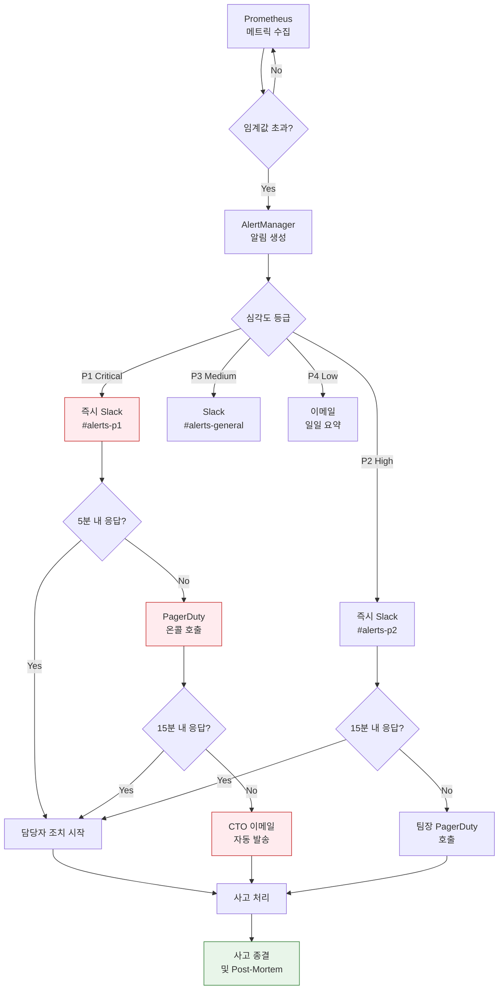
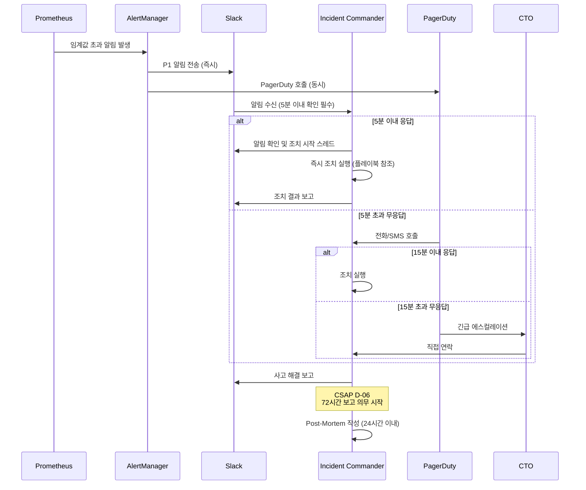

# 에스컬레이션 플레이북 — 알림 수신부터 사고 종결까지

> **문서 ID**: MON-ALERT-03
> **버전**: 1.0.0 | **작성일**: 2026-04-12 | **작성자**: Implementer (Sonnet)
> **목적**: 알림 발생 시 신속하고 일관된 대응을 위한 단계별 플레이북 제공
> **선행 학습**: [02-alert-runbooks.md](./02-alert-runbooks.md)

---

## 목차

1. [에스컬레이션 체계 이해](#1-에스컬레이션-체계-이해)
2. [심각도 등급별 대응 매트릭스](#2-심각도-등급별-대응-매트릭스)
3. [TOP 15 알림별 플레이북](#3-top-15-알림별-플레이북)
4. [사고 대응 역할 분담](#4-사고-대응-역할-분담)
5. [Post-Mortem 작성 가이드](#5-post-mortem-작성-가이드)
6. [SLO 에스컬레이션 자동화](#6-slo-에스컬레이션-자동화)

---

## 1. 에스컬레이션 체계 이해

### 1.1 에스컬레이션이란

에스컬레이션(Escalation)은 문제가 현재 담당자 수준에서 해결되지 않거나 심각도가 높아 상위 담당자의 개입이 필요할 때 알림을 단계적으로 전달하는 프로세스입니다.

이 프로젝트의 에스컬레이션 경로는 다음과 같습니다.

```
Prometheus 알림 규칙
    ↓ (임계값 초과)
AlertManager (그룹핑 + 억제)
    ↓ (채널별 라우팅)
Slack 채널 (#alerts-p1, #alerts-p2, #alerts-general)
    ↓ (5분 무응답 시)
PagerDuty 온콜 호출
    ↓ (15분 무응답 시)
이메일 (팀장/CTO)
```

### 1.2 SLO 에스컬레이션 컨트롤러 분석

`packages/slo-escalation/src/escalation-controller.ts`는 에러 버짓 소진율을 기반으로 자동 에스컬레이션을 수행합니다.

**에스컬레이션 단계 (EscalationLevel enum)**:

```typescript
// packages/slo-escalation/src/escalation-controller.ts
// Design Ref: MTU-N178 §3
// Plan SC: FR-SLO.1~6

export enum EscalationLevel {
  Normal = 'normal',      // 에러 버짓 0~50% 소진
  Warning = 'warning',    // 에러 버짓 50~75% 소진
  Danger = 'danger',      // 에러 버짓 75~90% 소진
  Critical = 'critical',  // 에러 버짓 90~100% 소진
  Violated = 'violated',  // 에러 버짓 100% 초과 (SLO 위반)
}

// FR-SLO.1: 에러 버짓 소진율 기반 단계 판정
export function determineEscalationLevel(budgetBurnRate: number): EscalationLevel {
  if (budgetBurnRate <= 50) return EscalationLevel.Normal;
  if (budgetBurnRate <= 75) return EscalationLevel.Warning;
  if (budgetBurnRate <= 90) return EscalationLevel.Danger;
  if (budgetBurnRate <= 100) return EscalationLevel.Critical;
  return EscalationLevel.Violated;
}
```

**에스컬레이션 실행 흐름** (`SLOEscalationController.escalate()`):

```typescript
// FR-SLO.4: 에스컬레이션 실행 순서
// 1. 에러 버짓 소진율 → 에스컬레이션 단계 판정
// 2. 해당 단계 정책에서 연락처 목록 조회
// 3. 채널별 알림 전송 (Slack, Email, Webhook)
// 4. 자동 런북 액션 트리거 (FR-SLO.6)
// 5. 이벤트 이력 저장 (최대 5000건)
```

### 1.3 에스컬레이션 경로 다이어그램



---

## 2. 심각도 등급별 대응 매트릭스

### 2.1 등급 정의

| 등급 | 이름 | 서비스 영향 | 에러 버짓 | 대응 시간 | 보고 대상 |
|-----|------|-----------|---------|---------|---------|
| P1 | Critical | 서비스 완전 중단 또는 보안 침해 | 95%+ 소진 | **5분 이내** | CTO + 팀장 즉시 |
| P2 | High | 주요 기능 저하, 성능 심각 저하 | 75~95% 소진 | **15분 이내** | 팀장 즉시 |
| P3 | Medium | 부분 기능 이상, 성능 저하 | 50~75% 소진 | **4시간 이내** | 팀원 슬랙 알림 |
| P4 | Low | 경고성, 예방적 조치 필요 | 50% 미만 소진 | **다음 영업일** | 일일 리포트 포함 |

### 2.2 트리거 조건 (실제 임계값)

**P1 트리거 조건**:

| 메트릭 | 임계값 | 지속 시간 |
|-------|-------|---------|
| 인증 서비스 가용성 | < 0% (완전 중단) | 즉시 |
| DB 연결 가용 개수 | = 0 | 즉시 |
| SLO 에러 버짓 잔여 | < 5% | 1분 |
| 보안 이벤트 (CRITICAL) | 1건 이상 | 즉시 |
| 5분간 에러율 | > 50% | 5분 |

**P2 트리거 조건**:

| 메트릭 | 임계값 | 지속 시간 |
|-------|-------|---------|
| API P99 레이턴시 | > 2,000ms | 5분 |
| BullMQ 대기 작업 수 | > 10,000 | 5분 |
| AI API 쿼터 잔여율 | < 10% | 즉시 |
| TLS 인증서 만료 | < 7일 | 즉시 |
| 디스크 사용률 | > 85% | 10분 |

**P3 트리거 조건**:

| 메트릭 | 임계값 | 지속 시간 |
|-------|-------|---------|
| DB 슬로우 쿼리 | > 1,000ms | 5분 |
| 파드 재시작 횟수 | > 3회 | 10분 |
| GitOps Flux 동기화 실패 | 1회 | 5분 |
| 백업 실패 | 1회 | 즉시 |
| 로그 파이프라인 지연 | > 30초 | 15분 |

### 2.3 에스컬레이션 정책 등록 예시

```typescript
// packages/slo-escalation/src/escalation-controller.ts
// FR-SLO.3: 에스컬레이션 정책 등록

const controller = new SLOEscalationController()

// auth-service 에스컬레이션 정책
controller.registerPolicy({
  name: 'auth-service-slo-policy',
  service: 'auth-service',
  levels: [
    {
      level: EscalationLevel.Warning,
      budgetBurnRateMin: 50,
      budgetBurnRateMax: 75,
      contacts: [
        {
          name: '온콜 엔지니어',
          channel: NotificationChannel.Slack,
          target: '#alerts-p3',
        },
      ],
      waitMinutes: 15,
    },
    {
      level: EscalationLevel.Critical,
      budgetBurnRateMin: 90,
      budgetBurnRateMax: 100,
      contacts: [
        {
          name: '온콜 엔지니어',
          channel: NotificationChannel.Slack,
          target: '#alerts-p1',
        },
        {
          name: 'CTO',
          channel: NotificationChannel.Email,
          target: 'cto@example.com',
        },
      ],
      waitMinutes: 5,
      actions: ['freeze-deployments', 'create-postmortem'],
    },
  ],
})
```

---

## 3. TOP 15 알림별 플레이북

### P1 플레이북 (5개)

---

#### P1-1: AUTH_SERVICE_DOWN — 인증 서비스 완전 중단

**심각도**: P1 Critical | **대응 시간**: 5분 이내 | **CSAP**: D-06 침해사고 관리

**발생 원인**:
- auth-service 파드 전체 크래시 (OOM, 코드 버그)
- 데이터베이스 연결 완전 실패
- 네트워크 파티션으로 서비스 격리
- 인증서 만료로 mTLS 연결 실패

**즉시 조치 (0~5분)**:

```bash
# 1. 파드 상태 즉시 확인
kubectl get pods -n production -l app=auth-service

# 2. 최근 로그 확인 (크래시 원인 파악)
kubectl logs -n production -l app=auth-service --tail=100 --previous

# 3. 파드 재시작 (임시 조치)
kubectl rollout restart deployment/auth-service -n production

# 4. 재시작 진행 상황 모니터링
kubectl rollout status deployment/auth-service -n production --timeout=3m
```

**근본 원인 분석 (5~30분)**:

```bash
# 메모리 사용량 확인 (OOM 여부)
kubectl top pods -n production -l app=auth-service

# 이전 파드 종료 이유 확인
kubectl describe pod -n production -l app=auth-service | grep -A 10 "Last State"

# 데이터베이스 연결 상태 확인
kubectl exec -n production deploy/auth-service -- \
  node -e "require('./lib/prisma').prisma.\$connect().then(() => console.log('DB OK'))"

# 인증서 유효기간 확인
kubectl get certificate -n production -o wide
```

**예방 조치**:
- HPA(Horizontal Pod Autoscaler) 최소 파드 수 3개로 설정
- 메모리 리밋 재검토 (OOM 발생 시 증가)
- Readiness Probe 설정 검토 (연결 실패 시 트래픽 차단)
- PodDisruptionBudget 적용 (롤링 업데이트 중 최소 1개 유지)

**CSAP 보고**: 서비스 중단 시작부터 72시간 이내 CSAP D-06 침해사고 보고서 작성 필수

---

#### P1-2: DB_CONNECTION_EXHAUSTED — DB 연결 풀 소진

**심각도**: P1 Critical | **대응 시간**: 5분 이내

**발생 원인**:
- 트래픽 급증으로 연결 수 임계값 초과
- 느린 쿼리로 인한 연결 점유 시간 증가
- 애플리케이션 연결 누수 (connection leak)
- 쿠버네티스 파드 수 급증 (스케일아웃 중 과부하)

**즉시 조치 (0~5분)**:

```bash
# 현재 PostgreSQL 연결 수 확인
kubectl exec -n production deploy/postgresql -- \
  psql -U postgres -c "SELECT count(*) FROM pg_stat_activity;"

# 상태별 연결 분포 확인
kubectl exec -n production deploy/postgresql -- \
  psql -U postgres -c "
    SELECT state, count(*)
    FROM pg_stat_activity
    GROUP BY state
    ORDER BY count DESC;"

# 유휴 상태 연결 강제 종료 (긴급 시)
kubectl exec -n production deploy/postgresql -- \
  psql -U postgres -c "
    SELECT pg_terminate_backend(pid)
    FROM pg_stat_activity
    WHERE state = 'idle'
      AND state_change < NOW() - INTERVAL '5 minutes';"
```

**근본 원인 분석**:

```bash
# 슬로우 쿼리 확인
kubectl exec -n production deploy/postgresql -- \
  psql -U postgres -c "
    SELECT pid, now() - pg_stat_activity.query_start AS duration, query
    FROM pg_stat_activity
    WHERE (now() - pg_stat_activity.query_start) > interval '5 seconds';"

# PgBouncer 풀 상태 확인 (연결 풀러 사용 시)
kubectl exec -n production deploy/pgbouncer -- \
  psql -p 6432 pgbouncer -c "SHOW POOLS;"
```

**예방 조치**:
- PgBouncer 트랜잭션 모드 풀링 적용
- 애플리케이션 연결 풀 사이즈 환경변수로 조정 (`DATABASE_POOL_SIZE`)
- 슬로우 쿼리 알림 임계값 하향 조정 (1000ms → 500ms)

---

#### P1-3: SLO_ERROR_BUDGET_CRITICAL — 에러 버짓 5% 미만

**심각도**: P1 Critical | **대응 시간**: 5분 이내

**발생 원인**:
- 지속적인 API 에러 또는 레이턴시 초과
- 배포 중 발생한 회귀 (regression)
- 외부 의존성 장애 (AI API, 결제 서비스 등)

**즉시 조치 (0~5분)**:

```bash
# SLO 에스컬레이션 컨트롤러 상태 확인
# packages/slo-escalation/src/escalation-controller.ts 기반

# 에러 버짓 현재 소진율 조회 (Prometheus)
curl -sG "http://prometheus.monitoring.svc:9090/api/v1/query" \
  --data-urlencode 'query=
    1 - (
      sum(rate(http_requests_total{status!~"5.."}[7d]))
      / sum(rate(http_requests_total[7d]))
    )
  ' | jq '.data.result'

# 변경 동결 즉시 실행 (더 이상의 악화 방지)
# GitOps: Flux Kustomization suspend
kubectl -n flux-system patch kustomization production \
  --type merge \
  --patch '{"spec":{"suspend":true}}'
```

**근본 원인 분석 (5~30분)**:

```bash
# 에러 발생 서비스 특정
kubectl logs -n production --selector="app.kubernetes.io/part-of=ai-saas" \
  --tail=200 | grep '"level":"error"'

# 최근 배포 이력 확인
kubectl rollout history deployment -n production
```

**예방 조치**:
- 에러 버짓 소진 속도 기반 자동 변경 동결 정책 설정
- 카나리 배포 도입 (전체 트래픽 전환 전 10%로 검증)

---

#### P1-4: SECURITY_BREACH_DETECTED — 보안 침해 탐지

**심각도**: P1 Critical | **대응 시간**: 즉시 | **CSAP**: D-06 최우선

**발생 원인**:
- Falco 규칙 트리거 (컨테이너 내 쉘 실행, 권한 상승 시도)
- 비정상적인 API 접근 패턴 (자격증명 도용 의심)
- 외부 스캐너에서 취약점 익스플로잇 시도 탐지

**즉시 조치 (0~즉시)**:

```bash
# 1. 의심 파드 즉시 격리 (네트워크 정책으로 차단)
kubectl label pod -n production <suspicious-pod> security=isolated

# 2. 의심 계정 즉시 비활성화
curl -X POST http://auth-service/admin/users/<user-id>/disable \
  -H "Authorization: Bearer $ADMIN_TOKEN"

# 3. 해당 세션 전체 무효화 (JWT 블랙리스트)
curl -X POST http://auth-service/admin/sessions/invalidate-all \
  -H "Authorization: Bearer $ADMIN_TOKEN" \
  -d '{"userId": "<user-id>"}'

# 4. 증거 보전 (파드 로그 즉시 수집)
kubectl logs -n production <suspicious-pod> > /tmp/security-evidence-$(date +%Y%m%d-%H%M%S).log
```

**감사 로그 확인**:

```bash
# .claude/audit.jsonl에서 의심 행위 검색
grep '"action":"' .claude/audit.jsonl | \
  jq 'select(.timestamp > "2026-04-12T09:00:00Z") | {timestamp, actor, action, ip}'
```

**CSAP D-06 보고 의무**:
- 침해사고 발생 즉시 사내 보안 담당자에게 보고
- 72시간 이내 CSAP 인증 기관에 침해사고 보고서 제출
- 30일 이내 재발 방지 대책 보고서 제출

---

#### P1-5: DATA_EXFILTRATION_ALERT — 데이터 유출 의심

**심각도**: P1 Critical | **대응 시간**: 즉시 | **CSAP**: D-06 + N2SF N-05

**발생 원인**:
- 비정상적으로 대용량 데이터 조회 (정상 패턴 대비 10배 이상)
- 야간 시간대 대량 API 호출
- N2SF 위반 — C/S 등급 데이터 외부 전송 시도

**즉시 조치**:

```bash
# 1. 해당 계정/IP의 API 접근 즉시 차단
# Rate Limit 강제 적용 (패키지/rate-limit-advanced 활용)

# 2. 네트워크 레벨 차단
kubectl exec -n production deploy/api-gateway -- \
  curl -X POST http://localhost:8080/admin/blocklist \
  -d '{"ip": "<suspicious-ip>", "reason": "data-exfiltration-suspect"}'

# 3. 데이터 접근 로그 추출 (포렌식 용도)
grep '"action":"DATA_READ"' .claude/audit.jsonl | \
  jq 'select(.actor == "<suspicious-user>")' > /tmp/forensic-$(date +%Y%m%d).jsonl
```

**N2SF 위반 여부 확인**:

```typescript
// AI API 데이터 등급 통제 위반 여부 확인
// platform/services/ai-service/src/routes.ts 로그 검색
// C/S 등급 데이터 전송 시도는 에러로 기록됨
grep 'BLOCKED.*N2SF' .claude/audit.jsonl
```

---

### P2 플레이북 (5개)

---

#### P2-1: HIGH_LATENCY_API — API 레이턴시 2초 초과

**심각도**: P2 High | **대응 시간**: 15분 이내

**발생 원인**:
- 데이터베이스 슬로우 쿼리 (인덱스 누락, 대용량 조회)
- AI API 외부 응답 지연
- 메모리 부족으로 GC 압박 증가
- 동시 요청 급증으로 이벤트 루프 블로킹

**즉시 조치 (0~15분)**:

```bash
# 레이턴시 분포 확인
curl -sG "http://prometheus.monitoring.svc:9090/api/v1/query" \
  --data-urlencode 'query=histogram_quantile(0.99, rate(http_request_duration_seconds_bucket[5m]))' \
  | jq '.data.result'

# 슬로우 API 엔드포인트 특정
curl -sG "http://prometheus.monitoring.svc:9090/api/v1/query" \
  --data-urlencode 'query=
    topk(10,
      histogram_quantile(0.99,
        sum by(route, le)(rate(http_request_duration_seconds_bucket[5m]))
      )
    )
  '
```

**예방 조치**:
- 슬로우 쿼리 자동 탐지: `platform/services/security-monitor-service/src/lib/vulnerability-scanner.ts` `VULN-002` 규칙 참조
- 쿼리 실행 계획(EXPLAIN ANALYZE) 주기적 검토

---

#### P2-2: QUEUE_BACKLOG_CRITICAL — BullMQ 적체 10,000+

**심각도**: P2 High | **대응 시간**: 15분 이내

**발생 원인**:
- 워커 프로세스 중단 또는 크래시
- 처리 시간 초과 작업 누적 (긴 AI 처리 작업)
- Redis 연결 장애로 큐 조회 실패

**즉시 조치**:

```bash
# BullMQ 대기 작업 수 확인
kubectl exec -n production deploy/redis -- \
  redis-cli LLEN "bull:ai-tasks:wait"

# 워커 파드 상태 확인
kubectl get pods -n production -l role=worker

# 워커 파드 스케일업 (긴급)
kubectl scale deployment ai-worker -n production --replicas=10

# 실패 작업 상태 확인
kubectl exec -n production deploy/redis -- \
  redis-cli LRANGE "bull:ai-tasks:failed" 0 10
```

---

#### P2-3: AI_QUOTA_EXCEEDED — AI API 할당량 초과

**심각도**: P2 High | **대응 시간**: 15분 이내 | **N2SF**: N-05 관련

**발생 원인**:
- 예상보다 많은 AI API 호출 (버스트 트래픽)
- 무한 재시도 루프 (버그)
- 비효율적인 청킹으로 토큰 과다 소비

**즉시 조치**:

```bash
# AI API 사용량 확인
curl http://ai-service/metrics | grep ai_api_tokens_used

# AI 기능 일시 비활성화 (feature flag)
curl -X PATCH http://feature-flag-service/flags/ai-features \
  -H "Authorization: Bearer $ADMIN_TOKEN" \
  -d '{"enabled": false, "reason": "quota-exceeded"}'
```

**예방 조치**:
- `packages/feature-flag-sdk/src/index.ts` 기반 AI 기능 점진적 비활성화
- 토큰 사용량 일일 한도 설정 및 알림 (`platform/services/ai-service/src/lib/chunker.ts` 청킹 최적화)

---

#### P2-4: CERT_EXPIRY_7DAYS — TLS 인증서 7일 만료

**심각도**: P2 High | **대응 시간**: 15분 이내 | **CSAP**: D-09

**발생 원인**:
- cert-manager 자동 갱신 실패 (ACME 챌린지 오류)
- DNS 설정 변경으로 챌린지 실패
- Let's Encrypt rate limit 초과

**즉시 조치**:

```bash
# 인증서 만료일 확인
kubectl get certificate -n production -o custom-columns=\
  NAME:.metadata.name,READY:.status.conditions[0].status,EXPIRY:.status.notAfter

# cert-manager 로그 확인 (갱신 실패 원인)
kubectl logs -n cert-manager deploy/cert-manager --tail=100

# 수동 인증서 갱신 트리거
kubectl annotate certificate <cert-name> -n production \
  cert-manager.io/issuer-kind=ClusterIssuer \
  --overwrite
```

---

#### P2-5: DISK_USAGE_CRITICAL — 디스크 85% 이상

**심각도**: P2 High | **대응 시간**: 15분 이내

**발생 원인**:
- 로그 파일 과다 누적 (로그 로테이션 미설정)
- 감사 로그 급증 (CSAP D-06)
- 코어 덤프 파일 누적
- 컨테이너 레이어 캐시 누적

**즉시 조치**:

```bash
# 디스크 사용량 상위 디렉토리 확인
kubectl exec -n production <pod-name> -- \
  df -h && du -sh /data/* | sort -rh | head -20

# 오래된 로그 파일 정리 (7일 이상)
kubectl exec -n production <pod-name> -- \
  find /var/log -name "*.log" -mtime +7 -delete

# 도커/컨테이너 레이어 정리
crictl rmi --prune
```

---

### P3 플레이북 (5개)

---

#### P3-1: SLOW_QUERY_DETECTED — 슬로우 쿼리 탐지

**심각도**: P3 Medium | **대응 시간**: 4시간 이내

**조치**:

```sql
-- 슬로우 쿼리 실행 계획 분석
EXPLAIN (ANALYZE, BUFFERS, FORMAT JSON)
SELECT * FROM users WHERE email = 'test@example.com';

-- 인덱스 누락 여부 확인
SELECT schemaname, tablename, attname, n_distinct, correlation
FROM pg_stats
WHERE tablename = 'users';

-- 인덱스 추가 (중단 없이)
CREATE INDEX CONCURRENTLY idx_users_email ON users(email);
```

---

#### P3-2: POD_RESTART_LOOP — 파드 재시작 루프

**심각도**: P3 Medium | **대응 시간**: 4시간 이내

**조치**:

```bash
# 파드 재시작 횟수 확인
kubectl get pods -n production -o wide | grep -v "0/0"

# 크래시 원인 확인
kubectl describe pod -n production <pod-name> | grep -A 5 "Last State"

# 이전 컨테이너 로그 확인
kubectl logs -n production <pod-name> --previous --tail=50

# Liveness Probe 임시 비활성화 (원인 조사 중)
kubectl patch deployment <name> -n production \
  --type json \
  -p '[{"op": "remove", "path": "/spec/template/spec/containers/0/livenessProbe"}]'
```

---

#### P3-3: FLUX_SYNC_FAILED — GitOps 동기화 실패

**심각도**: P3 Medium | **대응 시간**: 4시간 이내

**조치**:

```bash
# Flux Kustomization 상태 확인
kubectl get kustomization -n flux-system

# 동기화 오류 상세 확인
kubectl describe kustomization production -n flux-system | grep -A 20 "Status"

# 수동 동기화 강제 실행
flux reconcile kustomization production --with-source

# Git 저장소 연결 상태 확인
kubectl get gitrepository -n flux-system
```

---

#### P3-4: BACKUP_FAILED — 백업 실패

**심각도**: P3 Medium | **대응 시간**: 4시간 이내 | **CSAP**: D-07

**조치**:

```bash
# Velero 백업 상태 확인
velero backup get

# 실패한 백업 상세 확인
velero backup describe <backup-name> --details

# 백업 수동 실행
velero backup create manual-backup-$(date +%Y%m%d) \
  --include-namespaces production

# 백업 로그 확인
velero backup logs <backup-name>
```

---

#### P3-5: LOG_PIPELINE_LAG — 로그 파이프라인 지연

**심각도**: P3 Medium | **대응 시간**: 4시간 이내

**조치**:

```bash
# Fluent Bit 상태 확인
kubectl get pods -n logging -l app=fluent-bit

# 로그 전송 지연 확인
kubectl logs -n logging deploy/fluent-bit --tail=50 | grep "retry\|error\|lag"

# Loki 수신 상태 확인
curl http://loki.logging.svc:3100/ready

# 버퍼 강제 플러시
kubectl delete pod -n logging -l app=fluent-bit
```

---

### 3.1 P1 알림 대응 시퀀스 다이어그램



---

## 4. 사고 대응 역할 분담

### 4.1 사고 대응 3개 역할

공공기관 SaaS 프로젝트의 사고 대응은 혼란을 방지하기 위해 역할을 명확히 구분합니다.

**Incident Commander (IC, 사고 지휘관)**:
- 사고 전체 조율 및 의사결정 최종 권한 보유
- 기술 팀과 비기술 이해관계자 간 정보 연결
- P1 사고 시 30분마다 상황 업데이트 발행
- 사고 종결 선언 권한

**Tech Lead (기술 리더)**:
- 실제 기술적 조치 실행 책임
- 즉시 조치 → 근본 원인 분석 순서 진행
- 다른 엔지니어 작업 조율 및 분배

**Comms Lead (커뮤니케이션 리더)**:
- 내부 상황 공유 (30분 간격 Slack 업데이트)
- 외부 공지 작성 (서비스 상태 페이지 업데이트)
- CSAP D-06 보고 문서 준비

### 4.2 CSAP D-06 침해사고 보고 의무

```
사고 발생
    ↓ (즉시, 1시간 이내)
내부 보안 책임자 보고
    ↓ (24시간 이내)
기관장 보고
    ↓ (72시간 이내)
CSAP 인증 기관 (KISA) 침해사고 보고
    ↓ (30일 이내)
재발 방지 대책 보고
```

### 4.3 사고 일지 템플릿

```markdown
# 사고 일지 — [사고명]

## 기본 정보
- **사고 ID**: INC-2026-001
- **발생 일시**: 2026-04-12 14:30 KST
- **탐지 일시**: 2026-04-12 14:31 KST (AlertManager 자동 탐지)
- **종결 일시**: 2026-04-12 15:45 KST
- **총 소요 시간**: 75분
- **영향 범위**: 인증 서비스 전체 (인증 불가)
- **영향 사용자 수**: 약 1,200명 (추정)
- **심각도**: P1 Critical

## 타임라인
| 시간 | 행동 | 담당자 |
|------|-----|-------|
| 14:30 | Prometheus 알림 발생 | 자동 |
| 14:31 | Slack #alerts-p1 알림 수신 | AlertManager |
| 14:32 | IC 김철수 알림 확인, 조치 시작 | IC |
| 14:35 | 파드 재시작 시도 | Tech Lead |
| 14:38 | 재시작 실패, DB 연결 문제 파악 | Tech Lead |
| 15:20 | DB 연결 풀 복구 완료 | Tech Lead |
| 15:45 | 서비스 완전 복구, 사고 종결 선언 | IC |

## 근본 원인
DB 연결 풀 설정값(50)이 야간 배치 작업과 사용자 트래픽이 동시에 몰리는
시간대에 부족함. 연결 누수 없이 정상적인 부하 증가가 원인.

## 즉각 조치
1. 파드 재시작 (해결 안 됨)
2. DB 유휴 연결 강제 종료 (부분 완화)
3. PgBouncer 연결 풀 크기 임시 증가 (해결)

## 재발 방지
1. [ ] DB 연결 풀 최대값 200으로 증가 (2026-04-15 배포)
2. [ ] 야간 배치 작업 시간 변경 (02:00 → 04:00, 트래픽 낮은 시간대)
3. [ ] DB 연결 수 알림 임계값 하향 조정 (80% → 70%)
```

---

## 5. Post-Mortem 작성 가이드

### 5.1 Post-Mortem 작성 원칙

Post-Mortem은 누군가를 비난하기 위한 것이 아닙니다. 시스템과 프로세스를 개선하기 위한 학습 문서입니다.

**작성 시기**: 사고 종결 후 24시간 이내 초안, 72시간 이내 완성

**참여자**: 사고 대응에 참여한 모든 엔지니어 + 팀장

### 5.2 5-Why 분석 방법

5-Why는 현상에서 근본 원인까지 "왜?"를 5번 반복하여 도달하는 방법입니다.

**예시: DB_CONNECTION_EXHAUSTED 사고**

```
현상: DB 연결 풀이 소진되었다.

Why 1: 왜 연결 풀이 소진되었는가?
  → 동시 연결 요청 수가 최대 풀 크기(50)를 초과했기 때문이다.

Why 2: 왜 요청 수가 최대 풀 크기를 초과했는가?
  → 야간 배치 작업과 사용자 트래픽이 동시에 몰렸기 때문이다.

Why 3: 왜 이 시간대에 동시 부하가 집중되었는가?
  → 야간 배치 작업 스케줄이 트래픽 패턴 분석 없이 설정되었기 때문이다.

Why 4: 왜 트래픽 패턴 분석 없이 스케줄이 설정되었는가?
  → 초기 설정 시 모니터링 데이터가 충분하지 않았기 때문이다.

Why 5: 왜 스케줄 설정 검토 프로세스가 없었는가?
  → 운영 초기 단계에서 이런 상황을 예상하지 못했기 때문이다.

근본 원인: 운영 중 수집된 트래픽 패턴을 배치 스케줄에 반영하는
           정기 검토 프로세스가 없었다.
```

### 5.3 재발 방지 Action Item 형식

```markdown
## 재발 방지 Action Items

| 우선순위 | 항목 | 담당자 | 기한 | 상태 |
|---------|------|-------|-----|-----|
| P0 | DB 연결 풀 최대값 200으로 증가 배포 | 김철수 | 2026-04-15 | 진행중 |
| P0 | 야간 배치 스케줄 트래픽 최저 시간대(04:00)로 변경 | 이영희 | 2026-04-16 | 대기 |
| P1 | DB 연결 수 알림 임계값 70%로 하향 | 박민준 | 2026-04-20 | 대기 |
| P1 | PgBouncer 도입 검토 및 적용 | 김철수 | 2026-04-30 | 대기 |
| P2 | 분기별 배치 스케줄 트래픽 패턴 검토 프로세스 수립 | 팀장 | 2026-05-01 | 대기 |
```

### 5.4 사고 타임라인 시각화

```mermaid
gantt
    title 사고 타임라인 — DB_CONNECTION_EXHAUSTED (2026-04-12)
    dateFormat HH:mm
    axisFormat %H:%M

    section 탐지
    Prometheus 알림 발생    :milestone, 14:30, 0m
    Slack 알림 수신         :milestone, 14:31, 0m

    section 초기 대응
    IC 알림 확인            :active, 14:32, 3m
    파드 재시작 시도        :active, 14:35, 5m
    DB 연결 문제 파악       :active, 14:38, 10m

    section 조치
    DB 유휴 연결 강제 종료  :active, 14:48, 15m
    PgBouncer 풀 크기 증가  :active, 15:03, 17m

    section 복구
    서비스 정상화 확인      :milestone, 15:20, 0m
    사고 종결 선언          :milestone, 15:45, 0m

    section 사후
    Post-Mortem 초안        :15:45, 24h
```



---

## 6. SLO 에스컬레이션 자동화

### 6.1 에스컬레이션 컨트롤러 동작 원리

`packages/slo-escalation/src/escalation-controller.ts`의 실제 동작을 단계별로 설명합니다.

**STEP 1: SLO 데이터 수집**

Prometheus에서 수집된 에러율 데이터를 기반으로 에러 버짓 소진율을 계산합니다.

```typescript
// 에러 버짓 소진율 = (현재 에러율 / SLO 목표 에러율) * 100
// 예: 현재 에러율 0.5%, SLO 목표 99.9% (에러율 0.1%)
// 소진율 = (0.5 / 0.1) * 100 = 500% → Violated (위반)
```

**STEP 2: 에스컬레이션 단계 판정**

```typescript
// FR-SLO.1: 에러 버짓 소진율 → 단계 매핑
export function determineEscalationLevel(budgetBurnRate: number): EscalationLevel {
  if (budgetBurnRate <= 50) return EscalationLevel.Normal;   // 녹색
  if (budgetBurnRate <= 75) return EscalationLevel.Warning;  // 노란색
  if (budgetBurnRate <= 90) return EscalationLevel.Danger;   // 주황색
  if (budgetBurnRate <= 100) return EscalationLevel.Critical; // 빨간색
  return EscalationLevel.Violated;                           // 검정색 (SLO 위반)
}
```

**STEP 3: 정책 기반 알림 발송**

```typescript
// FR-SLO.2: 알림 라우팅
// 등록된 정책에서 해당 레벨의 연락처 목록 조회
// 각 연락처에 채널별 알림 전송 (Slack, Email, Webhook)
for (const contact of levelPolicy.contacts) {
  await this.notify(contact.channel, contact.target, {
    service, sloName, level, budgetBurnRate, budgetRemaining,
  })
}
```

**STEP 4: 자동 런북 실행**

```typescript
// FR-SLO.6: 자동 런북 트리거
// 정책에 정의된 actions를 순서대로 실행
if (levelPolicy.actions) {
  for (const action of levelPolicy.actions) {
    await this.triggerAction(action, service, level)
    // 예: 'freeze-deployments' → GitOps suspend
    // 예: 'create-postmortem' → Post-Mortem 이슈 자동 생성
  }
}
```

### 6.2 에스컬레이션 정책 커스터마이징

새로운 서비스를 추가하거나 에스컬레이션 임계값을 변경할 때 사용합니다.

```typescript
// 새 서비스 에스컬레이션 정책 등록 예시
import {
  SLOEscalationController,
  EscalationLevel,
  NotificationChannel,
  EscalationPolicy
} from '@public-saas/slo-escalation'

const policy: EscalationPolicy = {
  name: 'new-service-slo-policy',
  service: 'new-service',
  levels: [
    {
      level: EscalationLevel.Warning,
      budgetBurnRateMin: 50,
      budgetBurnRateMax: 75,
      contacts: [
        {
          name: '개발팀 슬랙',
          channel: NotificationChannel.Slack,
          target: '#alerts-p3',
        },
      ],
      waitMinutes: 30,
      // 자동 액션 없음 (수동 대응)
    },
    {
      level: EscalationLevel.Critical,
      budgetBurnRateMin: 90,
      budgetBurnRateMax: 100,
      contacts: [
        {
          name: '온콜',
          channel: NotificationChannel.Slack,
          target: '#alerts-p1',
        },
        {
          name: '팀장',
          channel: NotificationChannel.Email,
          target: 'team-lead@example.com',
        },
      ],
      waitMinutes: 5,
      actions: ['freeze-deployments', 'create-postmortem'],
    },
  ],
}

// 정책 등록 (Zod 스키마로 자동 검증)
controller.registerPolicy(policy)
```

### 6.3 이벤트 이력 조회

사고 분석 시 에스컬레이션 이벤트 이력을 조회합니다.

```typescript
// FR-SLO.5: 에스컬레이션 이력 조회
const history = controller.getHistory('auth-service', 100)

// 가장 최근 에스컬레이션 이벤트 확인
const latest = history[history.length - 1]
console.log(`
  서비스: ${latest.service}
  SLO: ${latest.sloName}
  레벨: ${latest.level}
  소진율: ${latest.budgetBurnRate}%
  잔여율: ${latest.budgetRemaining}%
  알림 수신자: ${latest.notifiedContacts.join(', ')}
  실행된 액션: ${latest.actionsTriggered.join(', ')}
`)
```

---

## 변경 이력

| 버전 | 일자 | 내용 | 작성자 |
|-----|------|------|-------|
| 1.0.0 | 2026-04-12 | 최초 작성 — TOP 15 알림 플레이북 + 에스컬레이션 자동화 | Implementer (Sonnet) |

---

*본 문서는 `packages/slo-escalation/src/escalation-controller.ts`, `platform/services/security-monitor-service/src/lib/vulnerability-scanner.ts` 실제 코드를 기반으로 작성되었습니다.*
