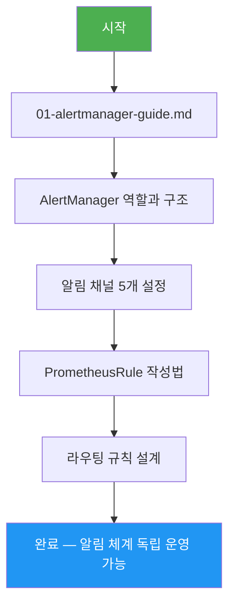

# 알림(Alerting) — 학습 맵

> **대상**: 신규 개발자, DevOps 엔지니어, SRE
> **버전**: 1.0.0 | **작성일**: 2026-04-12
> **CSAP**: D-06 (침해사고 관리), D-08 (접근통제 — 알림 체계)

---

## 이 섹션을 배우면

시스템에 문제가 생겼을 때 **자동으로 올바른 사람에게 올바른 채널로 알림이 전달**되도록 설정할 수 있습니다.
"왜 알림이 너무 많아서 무시하게 됐는가", "왜 중요한 장애를 놓쳤는가"를 방지하는 알림 설계를 이해합니다.

---

## 학습 순서

---

## 섹션 구조

| 파일 | 설명 | 소요 시간 |
|------|------|----------|
| `01-alertmanager-guide.md` | AlertManager 전체 가이드 — 라우팅, 채널, Silencing | 60분 |

---

## 핵심 접근 정보

| 도구 | 주소 | 용도 |
|------|------|------|
| AlertManager UI | `http://localhost:9093` | 알림 상태 확인, Silence 설정 |
| Prometheus Rules | `http://localhost:9090/rules` | 알림 규칙 로드 상태 확인 |

> 접근 권한이 없으면 DevOps팀에 요청하십시오. 모든 접근은 RBAC 기반으로 제어됩니다 (CSAP D-08).
