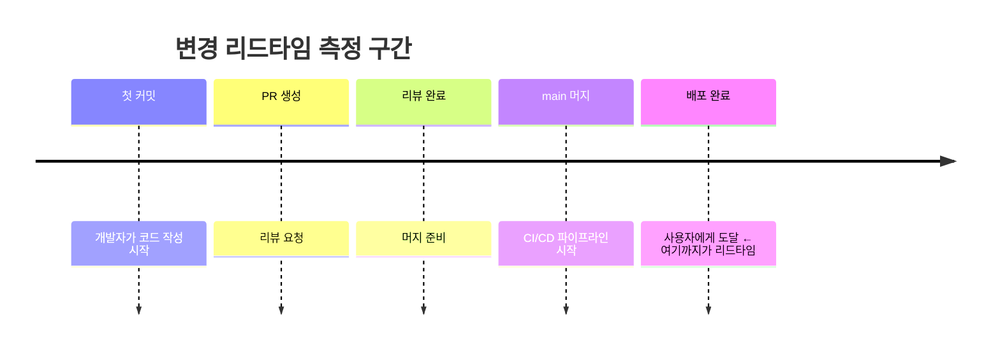
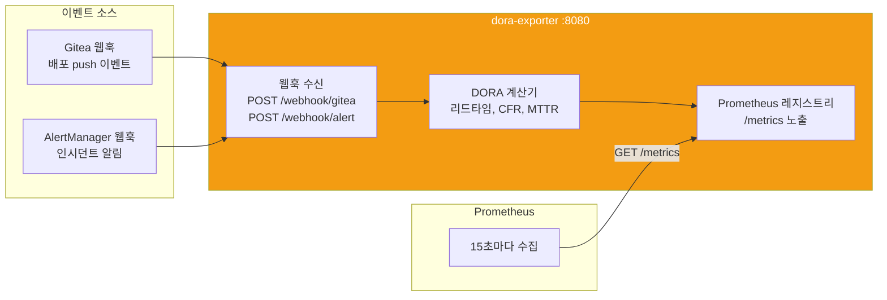
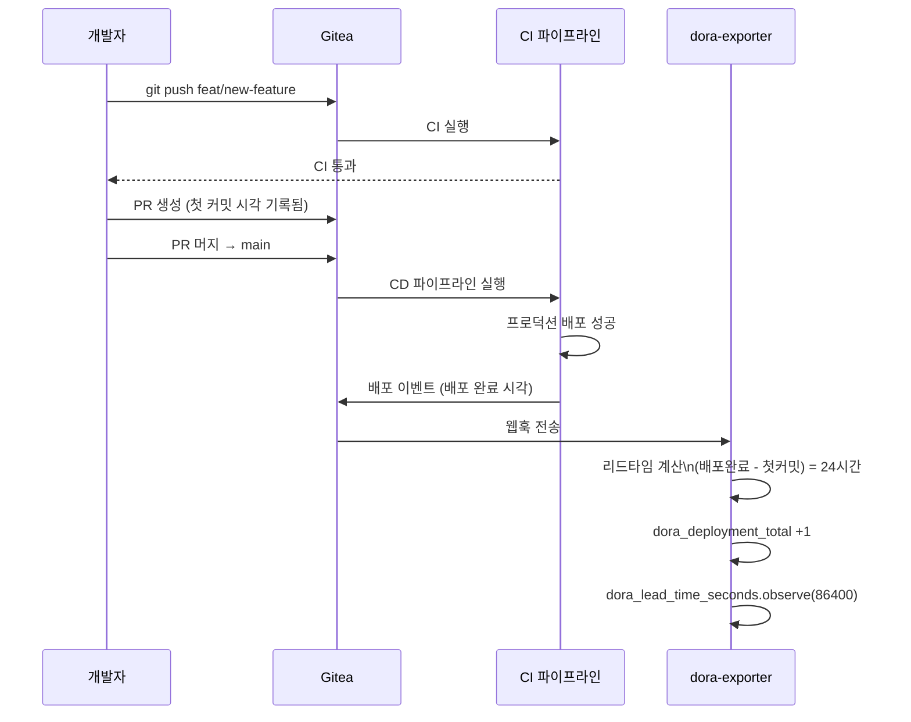

# DORA 메트릭 이해 — 팀의 배포 성과 측정하기

> **버전**: 1.0.0 | **작성일**: 2026-04-11
> **대상**: 모든 개발팀 구성원 (개발자, 비개발자 모두)
> **소요 시간**: 약 30분
> **Plan SC**: FR-DORA.1, FR-DORA.2, FR-DORA.3, FR-DORA.4
> **CSAP**: D-13 (변경 관리)

---

## 목차

1. [DORA란? — 쉬운 설명](#1-dora란--쉬운-설명)
2. [4가지 지표 상세 설명](#2-4가지-지표-상세-설명)
3. [등급 기준표](#3-등급-기준표)
4. [dora-exporter 작동 방식](#4-dora-exporter-작동-방식)
5. [내 배포가 DORA에 기록되는 방법](#5-내-배포가-dora에-기록되는-방법)
6. [좋은 DORA 점수를 위한 습관](#6-좋은-dora-점수를-위한-습관)
7. [현재 우리 팀 DORA 점수 확인](#7-현재-우리-팀-dora-점수-확인)

---

## 1. DORA란? — 쉬운 설명

### 1.1 스포츠 팀 비유

축구팀의 실력을 평가한다고 생각해보십시오.

```
❌ 막연한 평가: "우리 팀은 잘하고 있는 것 같다"
✅ 측정 가능한 평가:
   - 경기당 득점: 2.3골 (공격력)
   - 실점률: 0.8골/경기 (수비력)
   - 경기 후 회복 속도: 2일
   - 부상률: 시즌 3%
```

개발팀도 마찬가지입니다.

```
❌ 막연한 평가: "우리 팀은 빠르게 개발하고 있는 것 같다"
✅ 측정 가능한 평가 (DORA):
   - 배포 빈도: 하루 2회 (얼마나 자주 배포하는가)
   - 리드타임: 평균 1.5일 (코드 작성 → 배포까지 시간)
   - 변경 실패율: 2% (배포 중 얼마나 실패하는가)
   - 복구 시간: 평균 18분 (장애 발생 시 얼마나 빨리 복구하는가)
```

### 1.2 왜 공공기관 SaaS에서 DORA가 중요한가?

공공기관 서비스는 국민이 사용하는 서비스입니다. 다운타임은 국민 불편으로 직결됩니다.

DORA 메트릭은:
1. **투명성**: 팀 성과를 객관적 수치로 공유
2. **개선 방향 파악**: 어떤 부분이 병목인지 가시화
3. **CSAP D-13 변경 관리**: 변경 사항의 안정성 추적

---

## 2. 4가지 지표 상세 설명

### 2.1 배포 빈도 (Deployment Frequency, DF)

**"얼마나 자주 배포하는가?"**

```
비유: 우편 배달부가 하루에 몇 번 배달을 오는가
  → 하루 1회: 늦은 배달, 편지 쌓임
  → 하루 10회: 빠른 배달, 편지 쌓이지 않음
```

**개발에서의 의미**:

```
낮은 배포 빈도 (월 1회):
  ❌ 코드 변경이 오래 쌓임 → 한 번에 많이 배포 → 장애 위험 증가
  ❌ 버그 수정도 한 달을 기다려야 함
  ❌ 피드백 반영이 느림

높은 배포 빈도 (하루 여러 번):
  ✅ 작은 변경 단위로 배포 → 문제 발생 시 원인 파악 쉬움
  ✅ 빠른 버그 수정 → 사용자 불편 최소화
  ✅ 빠른 기능 출시 → 사용자 피드백 빨리 반영
```

**측정 방법**: 프로덕션 또는 스테이징 배포 횟수 / 기간

```promql
# Grafana에서 확인 (일별 배포 횟수)
sum(increase(dora_deployment_total{environment="production"}[24h])) by (team, service)
```

### 2.2 변경 리드타임 (Lead Time for Changes, LT)

**"코드를 작성한 순간부터 사용자에게 도달하기까지 얼마나 걸리는가?"**

```
비유: 식당에서 주문부터 음식이 나오기까지의 시간
  → 30분: 패스트푸드 (빠름)
  → 2시간: 레스토랑 (느림)
```

**개발에서의 타임라인**:



**긴 리드타임의 원인**:

```
1. PR 리뷰가 오래 걸림 (코드가 너무 큰 단위)
2. CI 파이프라인이 느림 (테스트 병렬화 안 됨)
3. 배포 승인 대기 (수동 승인 게이트 과다)
4. 테스트 환경 부족 (큐 대기)
```

**측정 방법**: 첫 커밋 시각 → 프로덕션 배포 완료 시각

```promql
# P50 리드타임 (중앙값)
histogram_quantile(0.50, rate(dora_lead_time_seconds_bucket[24h]))

# P99 리드타임 (가장 오래 걸리는 경우)
histogram_quantile(0.99, rate(dora_lead_time_seconds_bucket[24h]))
```

### 2.3 변경 실패율 (Change Failure Rate, CFR)

**"배포 중 몇 %가 문제를 일으키는가?"**

```
비유: 100대의 신차 중 리콜이 발생하는 차의 비율
  → 1대 리콜 (1%): 우수한 품질
  → 15대 리콜 (15%): 품질 문제
```

**개발에서의 의미**:

```
변경 실패 = 배포 후 롤백, 핫픽스, 서비스 다운 등을 유발한 배포

낮은 CFR (1% 이하):
  ✅ 테스트가 충분함
  ✅ 작은 단위로 배포함
  ✅ 스테이징 환경이 프로덕션과 유사함

높은 CFR (15% 이상):
  ❌ 테스트 커버리지 부족
  ❌ 배포 단위가 너무 큼
  ❌ 롤백 절차 없음
```

**측정 방법**: 문제 배포 수 / 전체 배포 수 × 100

```promql
# 변경 실패율 (%)
dora_change_failure_rate * 100
```

**변경 실패 판단 기준**:

이 플랫폼에서는 다음 이벤트가 발생하면 변경 실패로 자동 기록됩니다.

```
1. 배포 후 30분 이내 SLO 위반 알림 발생
2. 배포 후 롤백 실행
3. 배포 후 핫픽스 PR 생성
4. P1/P2 인시던트 생성 (배포 직후)
```

### 2.4 서비스 복구 시간 (Mean Time to Restore, MTTR)

**"장애가 발생했을 때 얼마나 빨리 복구하는가?"**

```
비유: 정전이 발생했을 때 전력 복구까지 걸리는 시간
  → 30분: 빠른 복구
  → 8시간: 느린 복구 (국민 불편 극대화)
```

**개발에서의 의미**:

```
짧은 MTTR (1시간 이내):
  ✅ 관측가능성이 좋음 (빠른 원인 파악)
  ✅ 롤백 절차가 자동화됨
  ✅ 온콜 대응 체계가 갖춰짐

긴 MTTR (24시간 이상):
  ❌ 로그/메트릭 부족으로 원인 파악이 느림
  ❌ 수동 롤백으로 시간 소요
  ❌ 연락 체계가 없거나 느림
```

**측정 방법**: 인시던트 발생 시각 → 서비스 정상화 시각

```promql
# P50 복구 시간
histogram_quantile(0.50, rate(dora_mttr_seconds_bucket[30d]))

# P99 복구 시간 (최악의 경우)
histogram_quantile(0.99, rate(dora_mttr_seconds_bucket[30d]))
```

---

## 3. 등급 기준표

DORA 연구에서 정의한 팀 등급 기준입니다.

| 지표 | Elite | High | Medium | Low |
|------|-------|------|--------|-----|
| 배포 빈도 | 하루 여러 번 | 하루 1회 ~ 주 1회 | 월 1회 ~ 주 1회 | 월 1회 이하 |
| 리드타임 | 1시간 미만 | 1일 미만 | 1주 ~ 1개월 | 1개월 이상 |
| 변경 실패율 | 0~15% | 16~30% | 16~30% | 16~30% |
| 복구 시간 | 1시간 미만 | 1일 미만 | 1일 ~ 1주 | 1주 이상 |

**우리 팀 목표**: 2026년 말까지 **High 등급** 달성

```
현재 기준 (2026-04-11 기준 — Grafana에서 확인):
  배포 빈도:   ?
  리드타임:    ?
  변경 실패율: ?
  복구 시간:   ?
```

---

## 4. dora-exporter 작동 방식

`packages/dora-exporter/`에 구현된 dora-exporter는 Gitea 이벤트와 AlertManager 웹훅을 수신하여 DORA 메트릭을 Prometheus로 노출합니다.



### 4.1 수집되는 Prometheus 메트릭

```
# 배포 빈도
dora_deployment_total{team, service, environment}

# 변경 리드타임 (히스토그램)
dora_lead_time_seconds_bucket{team, service, le}
dora_lead_time_seconds_sum{team, service}
dora_lead_time_seconds_count{team, service}

# 변경 실패율
dora_change_failure_rate{team, service}

# 서비스 복구 시간 (히스토그램)
dora_mttr_seconds_bucket{team, service, severity, le}

# 팀 DORA 등급 (0=Low, 1=Medium, 2=High, 3=Elite)
dora_team_level{team}
```

---

## 5. 내 배포가 DORA에 기록되는 방법

내가 feature를 개발하고 PR을 머지하면 자동으로 DORA에 기록됩니다. 별도 조작은 필요 없습니다.



### 5.1 리드타임이 기록되는 시점

```
1. 측정 시작: 첫 커밋의 타임스탬프
2. 측정 종료: 프로덕션 배포 완료 타임스탬프
3. 기록:       dora_lead_time_seconds 히스토그램에 관측값 추가
```

### 5.2 변경 실패가 기록되는 경우

```
1. 배포 직후 AlertManager에서 critical 알림 발화
   → dora-exporter가 가장 최근 배포를 실패로 마킹
   
2. 핫픽스 브랜치 push (hotfix/*)
   → 이전 배포를 실패로 마킹하고 핫픽스 배포로 기록

3. MTTR 기록
   → 알림 발화 시각부터 알림 해소 시각까지를 복구 시간으로 기록
```

---

## 6. 좋은 DORA 점수를 위한 습관

### 6.1 배포 빈도 높이기

```
✅ 작은 단위로 PR 만들기
   - 하나의 PR = 하나의 기능 또는 버그 수정
   - 500줄 이상의 변경은 분할 검토

✅ 오래 묵힌 PR 없애기
   - PR 생성 후 2일 이내 리뷰 완료 목표
   - 매일 아침 팀 스탠드업에서 오래된 PR 확인

✅ 피처 플래그 활용
   - 미완성 기능도 플래그를 끈 상태로 배포 가능
   - packages/feature-flag-sdk 사용
```

### 6.2 리드타임 단축하기

```
✅ CI 파이프라인 속도 개선
   - 테스트 병렬 실행 활용 (pnpm run test --parallel)
   - 불필요한 의존성 설치 최소화 (pnpm cache 활용)

✅ 리뷰 응답 속도 높이기
   - 리뷰 요청 후 1일 이내 응답 목표
   - 코드 크기를 작게 유지하면 리뷰가 빨라짐

✅ 자동화 강화
   - Q-Gate 자동 통과 = 수동 확인 불필요
   - 자동 배포 파이프라인 활용
```

### 6.3 변경 실패율 낮추기

```
✅ 테스트 커버리지 80% 이상 유지
   - Q-Gate G4에서 강제 적용됨
   - 단위 테스트 + 통합 테스트 모두 작성

✅ 스테이징에서 충분히 검증
   - stg 브랜치 배포 후 최소 30분 모니터링
   - 주요 사용자 시나리오 E2E 테스트 실행

✅ 점진적 롤아웃 활용
   - Argo Rollouts로 카나리 배포 (10% → 50% → 100%)
   - 에러율 상승 시 자동 롤백
```

### 6.4 복구 시간 단축하기

```
✅ 관측가능성 확보
   - 내 서비스에 메트릭, 로그, 트레이스 모두 추가
   - 이상 징후 알림 설정 (05-monitoring 섹션 참조)

✅ 롤백 방법 숙지
   # 즉각 롤백 명령
   kubectl rollout undo deployment/my-service -n saas-services
   
   # 특정 버전으로 롤백
   kubectl rollout undo deployment/my-service --to-revision=3 -n saas-services

✅ 런북(Runbook) 작성
   - 예상 가능한 장애 시나리오별 대응 절차
   - docs/runbooks/ 폴더에 마크다운으로 관리
```

---

## 7. 현재 우리 팀 DORA 점수 확인

### 7.1 Grafana 대시보드에서 확인

```
1. Grafana 접속: http://localhost:30300
2. 좌측 메뉴 → Dashboards → DORA Metrics
```

### 7.2 Prometheus 직접 쿼리

```bash
# port-forward
kubectl port-forward -n monitoring svc/kube-prometheus-stack-prometheus 9090:9090

# 팀 등급 확인
curl -s 'http://localhost:9090/api/v1/query?query=dora_team_level' | python3 -m json.tool

# 배포 빈도 (최근 7일)
curl -s 'http://localhost:9090/api/v1/query?query=sum(increase(dora_deployment_total%5B7d%5D))%20by%20(team)'
```

### 7.3 dora-exporter 상태 확인

```bash
# dora-exporter 메트릭 직접 확인
kubectl port-forward -n saas-services svc/dora-exporter 8080:8080
curl http://localhost:8080/metrics | grep dora_
```

---

## 다음 단계

모니터링 섹션을 모두 완료했습니다.

다음은 CI/CD 파이프라인을 학습할 차례입니다. `../../06-cicd/README.md`로 이동하십시오.

---

> **참조**: `packages/dora-exporter/src/index.ts` — DORA 익스포터 구현
> **참조**: `infra/monitoring/dora-metrics-rules.yaml` — DORA 알림 규칙
> **Plan SC**: FR-DORA.1 (배포 빈도), FR-DORA.2 (리드타임), FR-DORA.3 (변경 실패율), FR-DORA.4 (복구 시간)
> **CSAP 연관**: D-13 (변경 관리 — 변경 이력 추적)
