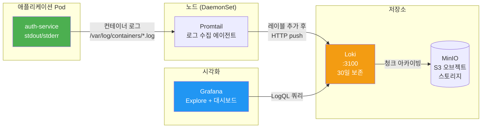

# Loki + LogQL — 로그로 문제 원인 찾기

> **버전**: 1.0.0 | **작성일**: 2026-04-11
> **대상**: 모니터링 기초를 마친 개발자
> **전제 조건**: `metrics/01-prometheus-basics.md` 학습 완료
> **소요 시간**: 약 45분
> **CSAP**: D-06 (침해사고 관리), D-10 (로그 관리)

---

## 목차

1. [로그 수집 흐름](#1-로그-수집-흐름)
2. [LogQL 기초 문법](#2-logql-기초-문법)
3. [Grafana Explore에서 로그 조회하기](#3-grafana-explore에서-로그-조회하기)
4. [실무 필수 쿼리 모음](#4-실무-필수-쿼리-모음)
5. [실습: auth-service 로그인 실패 패턴 분석](#5-실습-auth-service-로그인-실패-패턴-분석)
6. [구조화 로그 작성 가이드](#6-구조화-로그-작성-가이드)
7. [CSAP 로그 보존 요건](#7-csap-로그-보존-요건)
8. [자주 겪는 문제](#8-자주-겪는-문제)

---

## 1. 로그 수집 흐름

### 1.1 로그가 Loki에 도달하는 경로



### 1.2 수집 상세 과정

**1단계: 애플리케이션이 표준 출력에 로그 작성**

```typescript
// 서비스 코드
console.log(JSON.stringify({
  timestamp: new Date().toISOString(),
  level: 'error',
  message: 'Login failed',
  userId: 'user-123',
  tenantId: 'tenant-01',
  ip: '192.168.1.100',
}));
```

**2단계: 쿠버네티스가 컨테이너 로그를 파일로 저장**

```
/var/log/containers/auth-service-xxx_saas-services_auth-container-yyy.log
```

**3단계: Promtail(DaemonSet)이 파일을 읽어 레이블 추가 후 Loki로 전송**

Promtail은 파일명에서 자동으로 레이블을 추출합니다.

```yaml
# Promtail이 추가하는 레이블 예시
namespace: saas-services
pod: auth-service-7d9b4f8c6-xkz2p
container: auth-service
app: auth-service
```

**4단계: Loki에 저장 → Grafana에서 조회**

### 1.3 로그 보존 정책

| 보존 기간 | 대상 | 근거 |
|---------|------|------|
| 30일 | 일반 애플리케이션 로그 | 운영 편의 |
| 1년 이상 | 보안/감사 로그 | CSAP D-06 필수 요건 |
| 영구 | CSAP 증거 로그 | 감사 대비 |

**중요**: CSAP D-06 요건상 침해사고 관련 로그는 최소 1년 보존이 의무입니다. 보안 이벤트 로그는 별도 경로로 Elasticsearch에도 이중 저장됩니다.

---

## 2. LogQL 기초 문법

LogQL은 Loki의 쿼리 언어입니다. PromQL과 비슷하지만 텍스트 처리에 특화되어 있습니다.

### 2.1 스트림 셀렉터 — 로그 대상 선택

모든 LogQL 쿼리는 중괄호 `{}` 안에 레이블 조건을 써서 시작합니다.

```logql
# 기본 형식
{레이블명="값"}

# saas-services 네임스페이스의 모든 로그
{namespace="saas-services"}

# auth-service 앱의 로그만
{app="auth-service"}

# 여러 조건 (AND)
{namespace="saas-services", app="auth-service"}

# 정규식 매칭 (=~ 사용)
{app=~"auth-service|user-service"}

# 정규식 제외 (!~ 사용)
{namespace=~".+", app!~"prometheus.*"}
```

### 2.2 파이프라인 — 로그 필터링 및 변환

스트림 셀렉터 뒤에 `|`(파이프)로 필터를 연결합니다.

```logql
# 텍스트 포함 필터 (|= : 포함)
{namespace="saas-services"} |= "error"

# 텍스트 제외 필터 (!= : 제외)
{namespace="saas-services"} != "healthcheck"

# 정규식 매칭 (|~ : 정규식 포함)
{namespace="saas-services"} |~ "error|ERROR|FATAL"

# 정규식 제외 (!~ : 정규식 제외)
{namespace="saas-services"} !~ "debug|trace"
```

### 2.3 JSON 파서 — 구조화 로그 파싱

JSON 형태로 로그를 작성한 경우, `| json` 파서로 필드를 추출할 수 있습니다.

```logql
# JSON 파서 적용 후 level 필드로 필터링
{app="auth-service"} | json | level="error"

# 여러 필드 조건
{app="auth-service"} | json | level="error" | tenantId="tenant-01"

# 특정 필드 값 포함
{app="auth-service"} | json | message =~ "Login.*failed"
```

### 2.4 메트릭 쿼리 — 로그를 숫자로 변환

LogQL은 로그 개수를 세어 메트릭처럼 활용할 수 있습니다.

```logql
# 5분 단위 에러 로그 수
count_over_time({app="auth-service"} |= "error" [5m])

# 초당 에러 로그 발생률
rate({app="auth-service"} |= "error" [5m])

# 서비스별 에러 로그 수 집계
sum(count_over_time({namespace="saas-services"} |= "error" [5m])) by (app)
```

---

## 3. Grafana Explore에서 로그 조회하기

### 3.1 Explore 접속

1. Grafana 좌측 메뉴 → Explore (나침반 아이콘)
2. 상단 데이터소스 선택: **Loki** 선택
3. 쿼리 입력창에 LogQL 작성

### 3.2 Explore 화면 구성

```
┌──────────────────────────────────────────────────────┐
│  Explore                              [시간 범위]    │
├──────────────────────────────────────────────────────┤
│  데이터소스: [Loki ▼]                                │
│                                                      │
│  LogQL: {app="auth-service"} | json | level="error" │  ← 쿼리 입력
│                                          [Run query] │
├──────────────────────────────────────────────────────┤
│  Logs volume (log rate graph)                        │  ← 로그 볼륨 그래프
│  ░░░▓▓░░░░▓▓▓▓░░░░░░░░░░░░░░░░░░░░░░░░░░░░░░░░░░░  │
├──────────────────────────────────────────────────────┤
│  09:15:32 [error] Login failed userId=user-123       │  ← 로그 라인
│  09:15:45 [error] DB connection timeout              │
│  09:16:01 [error] Login failed userId=user-456       │
└──────────────────────────────────────────────────────┘
```

### 3.3 로그 상세 보기

로그 라인을 클릭하면 상세 정보가 펼쳐집니다.

```
▼ 09:15:32 [error] Login failed userId=user-123
  timestamp:  2026-04-11T09:15:32.451Z
  level:      error
  message:    Login failed
  userId:     user-123
  tenantId:   tenant-01
  ip:         192.168.1.100
  traceId:    abc123def456          ← Tempo에서 추적 트레이스 클릭 가능
  Labels:
    app:        auth-service
    namespace:  saas-services
    pod:        auth-service-7d9b4f8c6-xkz2p
```

**traceId 연동**: `traceId` 필드가 있으면 클릭하여 Tempo에서 해당 요청의 전체 추적 경로를 볼 수 있습니다.

---

## 4. 실무 필수 쿼리 모음

### 4.1 기본 조회 패턴

```logql
# auth-service 에러 로그만 보기
{app="auth-service"} |= "error"

# saas-services 네임스페이스 전체 에러
{namespace="saas-services"} |= "error"

# JSON 로그에서 레벨별 필터링
{app="auth-service"} | json | level="error"

# 특정 시간 이후 에러 (Explore에서 시간 범위로 설정 가능)
{namespace="saas-services"} |= "error"
```

### 4.2 보안 관련 쿼리 (CSAP D-06, D-08)

```logql
# 로그인 실패 탐지
{app="auth-service"} | json | message =~ "Login.*failed|authentication.*failed"

# 권한 오류 탐지
{namespace="saas-services"} |= "403" |= "Forbidden"

# 여러 번 로그인 실패한 IP (브루트포스 의심)
sum by (ip)(count_over_time(
  {app="auth-service"} | json | message=~"Login.*failed" [5m]
)) > 5

# PII 데이터 노출 의심 탐지 (CSAP D-09)
{namespace="saas-services"} |~ "주민등록번호|신용카드|계좌번호"

# 관리자 권한 작업 로그
{namespace="saas-services"} | json | level="info" | action=~"USER_DELETE|ROLE_CHANGE|PERMISSION_.*"
```

### 4.3 성능 문제 분석

```logql
# 응답 시간이 느린 요청 (1초 이상)
{app="auth-service"} | json | duration > 1000

# DB 쿼리 타임아웃
{namespace="saas-services"} |= "timeout" |= "database"

# OOM (메모리 부족)
{namespace="saas-services"} |= "OOMKilled"
```

### 4.4 배포 후 확인

```logql
# 특정 Pod 배포 후 로그 확인
{pod=~"auth-service-new-.*"} | json | level!="debug"

# 스타트업 에러 확인
{app="auth-service"} |= "FATAL" | json

# 배포 직후 에러 급증 확인
rate({app="auth-service"} |= "error" [5m])
```

---

## 5. 실습: auth-service 로그인 실패 패턴 분석

### 실습 목표

실제 로그 데이터로 "비정상적인 로그인 시도 패턴"을 탐지합니다.

### 5.1 실습 환경 준비

Grafana Explore 화면을 열고 데이터소스를 Loki로 선택합니다.

```bash
# 터미널에서 로그 직접 조회 (선택사항)
kubectl logs -n saas-services deployment/auth-service --since=1h | grep -i error
```

### 5.2 Step 1 — 최근 1시간 에러 로그 전체 확인

```logql
{app="auth-service", namespace="saas-services"} | json | level="error"
```

- Explore 우측 상단 시간 범위: "Last 1 hour"
- 에러 로그가 몇 건인지 확인

### 5.3 Step 2 — 로그인 실패 로그만 필터링

```logql
{app="auth-service"} | json | level="error" | message =~ "Login.*failed"
```

로그인 실패 로그의 `ip`, `userId`, `tenantId` 필드를 확인합니다.

### 5.4 Step 3 — IP별 로그인 실패 횟수 집계

```logql
sum by (ip)(count_over_time(
  {app="auth-service"} | json | message =~ "Login.*failed" [1h]
))
```

"Metrics" 뷰로 전환하면 IP별 실패 횟수가 표시됩니다.

특정 IP에서 비정상적으로 많은 시도가 있다면 브루트포스 공격을 의심해야 합니다.

### 5.5 Step 4 — 시간대별 로그인 실패 패턴

```logql
rate(
  {app="auth-service"} | json | message =~ "Login.*failed" [5m]
)
```

그래프에서 특정 시간대에 급증이 있는지 확인합니다.

### 5.6 Step 5 — 잠긴 계정 탐지

```logql
{app="auth-service"} | json | message =~ "Account.*locked"
```

### 5.7 Step 6 — 결과 해석

| 패턴 | 의미 | 대응 |
|------|------|------|
| 특정 IP에서 5분 내 10회 이상 실패 | 브루트포스 공격 의심 | IP 차단, 보안팀 보고 |
| 새벽 2~4시에 실패 집중 | 자동화 공격 의심 | 알림 규칙 설정 |
| 여러 계정에서 같은 IP | 크리덴셜 스터핑 | 2FA 강제 적용 고려 |
| 정상 시간대, 단일 사용자 실패 | 비밀번호 분실 가능성 | 사용자 지원 |

---

## 6. 구조화 로그 작성 가이드

### 6.1 왜 JSON 로그인가?

```
# ❌ 일반 텍스트 로그 (검색하기 어려움)
2026-04-11 09:15:32 ERROR Login failed for user user-123 from 192.168.1.100

# ✅ JSON 구조화 로그 (필드별 필터링 가능)
{"timestamp":"2026-04-11T09:15:32.451Z","level":"error","message":"Login failed","userId":"user-123","ip":"192.168.1.100","tenantId":"tenant-01"}
```

JSON 로그는 LogQL의 `| json` 파서로 각 필드를 분리하여 정확하게 필터링할 수 있습니다.

### 6.2 필수 로그 필드 (CSAP D-06 준수)

```typescript
// 모든 로그에 포함해야 하는 필드
interface LogEntry {
  timestamp: string;    // ISO 8601 형식 (필수)
  level: 'debug' | 'info' | 'warn' | 'error' | 'fatal';  // 필수
  message: string;      // 사람이 읽는 메시지 (필수)
  service: string;      // 서비스 이름 (필수)
  traceId?: string;     // OpenTelemetry 트레이스 ID (권장)
  spanId?: string;      // OpenTelemetry 스팬 ID (권장)

  // 보안 이벤트에는 추가 필수
  userId?: string;      // 행위자 ID (CSAP D-06)
  tenantId?: string;    // 테넌트 ID (멀티테넌트)
  ip?: string;          // 클라이언트 IP (CSAP D-06)
  action?: string;      // 수행한 작업 (감사 추적)
}
```

### 6.3 로거 설정 예시 (pino 사용)

```typescript
// src/lib/logger.ts
import pino from 'pino';

export const logger = pino({
  level: process.env.LOG_LEVEL || 'info',
  // JSON 형식으로 출력 (구조화 로그)
  formatters: {
    level: (label) => ({ level: label }),
  },
  // 기본 필드 자동 포함
  base: {
    service: process.env.SERVICE_NAME || 'unknown',
    version: process.env.APP_VERSION || '0.0.0',
  },
  // 타임스탬프 형식
  timestamp: pino.stdTimeFunctions.isoTime,
  // PII 필드 마스킹 (CSAP D-09)
  redact: {
    paths: ['password', 'token', 'secret', 'authorization'],
    censor: '[REDACTED]',
  },
});

// 사용 예시
logger.info({ userId: 'user-123', tenantId: 'tenant-01' }, 'Login successful');
logger.error({ userId: 'user-456', ip: '192.168.1.100' }, 'Login failed');
```

### 6.4 감사 로그 vs 운영 로그

| 구분 | 운영 로그 | 감사 로그 |
|------|---------|---------|
| 목적 | 장애 분석, 디버깅 | CSAP 증거, 법적 기록 |
| 필드 | 기술적 상세 정보 | 행위자, 대상, 결과, 시각 |
| 보존 | 30일 | 1년 이상 |
| 위치 | Loki | Loki + audit.jsonl |
| 예시 | "DB query took 300ms" | "관리자 A가 사용자 B를 삭제" |

감사 로그 작성 방법은 `../../../07-security/audit/01-audit-logging.md`를 참조하십시오.

---

## 7. CSAP 로그 보존 요건

### 7.1 D-06 침해사고 관리 요건

CSAP D-06은 다음 로그를 1년 이상 보존하도록 요구합니다.

```
1. 시스템 접근 로그: 모든 로그인 성공/실패
2. 권한 변경 로그: 역할/권한 부여 및 취소
3. 데이터 접근 로그: 민감 데이터 조회/수정/삭제
4. 보안 이벤트 로그: 침해 시도, 비정상 접근
5. 관리자 작업 로그: 시스템 설정 변경
```

### 7.2 로그 무결성 보장

CSAP 요건상 감사 로그는 수정 및 삭제가 불가능해야 합니다.

```
현재 구현:
  - Loki: append-only 저장 (삭제 API 비활성화)
  - audit.jsonl: 파일 시스템 append-only
  - MinIO: 객체 잠금(Object Lock) 활성화
```

### 7.3 로그 조회 권한

로그 조회에도 RBAC이 적용됩니다 (CSAP D-08).

```
감사 로그 조회: 보안 관리자, CSAP 담당자
운영 로그 조회: 서비스 담당 개발자 (자기 서비스만)
전체 로그 조회: DevOps, SRE
```

---

## 8. 자주 겪는 문제

### 8.1 로그가 Loki에 안 보임

```bash
# Promtail 상태 확인
kubectl get pods -n monitoring | grep promtail
kubectl logs -n monitoring daemonset/promtail | grep -i error

# 특정 Pod 로그가 없는 경우
# Pod가 실행 중인지 확인
kubectl get pods -n saas-services

# 로그가 실제로 출력되는지 확인
kubectl logs -n saas-services deployment/auth-service --since=5m
```

### 8.2 LogQL 파싱 오류

```logql
# ❌ 잘못된 JSON 파서 사용 (JSON이 아닌 로그에 | json 적용)
{app="nginx"} | json  # nginx는 기본적으로 JSON이 아님

# ✅ 패턴 파서 사용 (비JSON 로그)
{app="nginx"} | pattern `<ip> - - [<timestamp>] "<method> <url> <protocol>" <status> <bytes>`
```

### 8.3 쿼리가 너무 느림

```logql
# ❌ 느린 쿼리: 전체 네임스페이스에서 regex 검색
{namespace="saas-services"} |~ "Login.*failed"

# ✅ 빠른 쿼리: 특정 앱으로 먼저 제한 후 검색
{namespace="saas-services", app="auth-service"} |= "Login" |= "failed"
```

**팁**: 스트림 셀렉터 `{}`에서 최대한 범위를 좁힌 후 파이프라인 필터를 적용하면 쿼리가 빨라집니다.

---

## 다음 단계

로그 조회 방법을 배웠습니다. 다음은 DORA 메트릭으로 팀의 개발 성과를 측정하는 방법을 배울 차례입니다.

`../dora/01-dora-metrics.md`로 이동하십시오.

---

> **참조**: `infra/monitoring/loki/` — Loki 설정 파일
> **참조**: `infra/monitoring/promtail/` — Promtail 파이프라인 설정
> **CSAP 연관**: D-06 (침해사고 관리 — 로그 1년 보존), D-10 (로그 관리)
