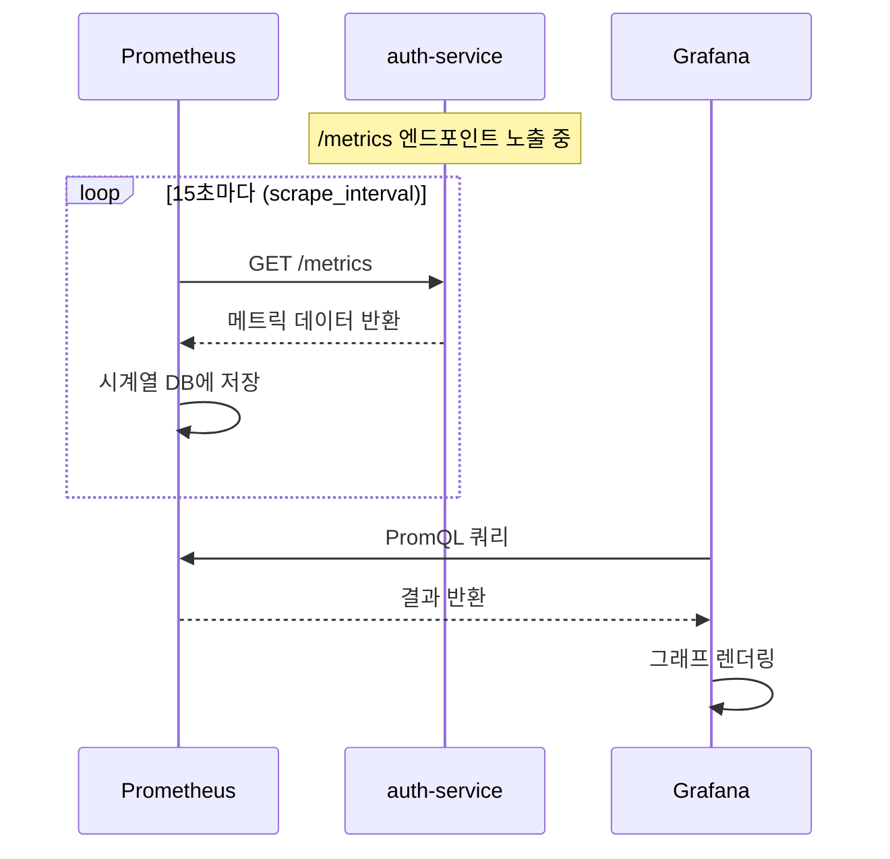

# Prometheus 기초 — 메트릭으로 서비스 상태 파악하기

> **버전**: 1.0.0 | **작성일**: 2026-04-11
> **대상**: 모니터링을 처음 접하는 신규 개발자
> **소요 시간**: 약 60분
> **다음 단계**: `02-grafana-guide.md`
> **CSAP**: D-06 (침해사고 관리), D-10 (로그 관리)

---

## 목차

1. [메트릭이란? — 초보자 비유](#1-메트릭이란--초보자-비유)
2. [4가지 메트릭 타입](#2-4가지-메트릭-타입)
3. [Prometheus 작동 방식](#3-prometheus-작동-방식)
4. [PromQL 기초 문법](#4-promql-기초-문법)
5. [ServiceMonitor 작성법](#5-servicemonitor-작성법)
6. [내 서비스에 메트릭 추가하기](#6-내-서비스에-메트릭-추가하기)
7. [실습: Prometheus UI에서 메트릭 조회](#7-실습-prometheus-ui에서-메트릭-조회)
8. [자주 겪는 문제](#8-자주-겪는-문제)

---

## 1. 메트릭이란? — 초보자 비유

### 1.1 자동차 계기판 비유

자동차를 운전할 때 계기판을 봅니다.

```
속도계: 현재 60km/h
연료계: 남은 연료 30%
온도계: 엔진 온도 정상
경고등: 이상 없음
```

서버도 마찬가지입니다. Prometheus는 서버의 계기판 역할을 합니다.

```
요청 처리 속도: 초당 500개
메모리 사용량: 2.4GB / 4GB (60%)
에러율: 0.2%
응답 시간 P99: 150ms
```

### 1.2 왜 메트릭이 필요한가?

**문제 상황 예시**:

```
오전 9시: 사용자들이 로그인이 안 된다고 신고
담당자: "서버가 왜 느리지? 무슨 일이지?"
```

메트릭이 없다면:
- 서버에 직접 SSH로 접속
- 로그 파일 뒤지기
- 추측으로 원인 파악 시도
- 평균 복구 시간: 수 시간

메트릭이 있다면:
- Grafana 대시보드 열기
- auth-service CPU가 9시에 갑자기 98%로 치솟은 것 확인
- 동시 접속자 급증이 원인임을 즉시 파악
- HPA 스케일아웃으로 3분 만에 복구

### 1.3 공공기관에서 메트릭이 더 중요한 이유

공공기관 SaaS는 CSAP(클라우드 보안 인증) 요건상 **모든 시스템 이상 징후를 감지하고 기록**해야 합니다 (D-06 침해사고 관리).

메트릭은 단순한 모니터링 도구가 아닙니다. CSAP 감사 시 "이 시점에 시스템 상태가 어떠했는가"를 증명하는 증거 자료입니다.

---

## 2. 4가지 메트릭 타입

Prometheus는 4가지 타입의 메트릭을 지원합니다. 각 타입의 특성을 이해하면 어떤 상황에 어떤 타입을 쓸지 판단할 수 있습니다.

### 2.1 Counter — 누적 카운터

**비유**: 자동차 주행 거리계. 한 번 올라가면 절대 내려가지 않습니다.

```
특성: 단조 증가 (0 → 1 → 2 → ... 절대 감소 없음)
용도: 요청 수, 에러 수, 처리 완료 수 등 "발생 횟수" 측정
```

**실제 예시**:

```
http_requests_total{method="GET", status="200"}  = 15234
http_requests_total{method="POST", status="500"} = 42
```

Counter는 절대값보다 변화율(rate)로 봅니다.

```promql
# 초당 요청 수 (5분 평균)
rate(http_requests_total[5m])
```

**언제 쓰는가**: "몇 번 일어났는가"를 측정할 때

```typescript
// TypeScript 예시
import { Counter } from 'prom-client';

const loginAttempts = new Counter({
  name: 'auth_login_attempts_total',
  help: '로그인 시도 횟수',
  labelNames: ['result'],  // 'success' | 'failure'
});

// 사용 시
loginAttempts.inc({ result: 'success' });
loginAttempts.inc({ result: 'failure' });
```

### 2.2 Gauge — 현재값 (올라가거나 내려갈 수 있음)

**비유**: 온도계 또는 연료계. 현재 상태를 나타내며 오르내릴 수 있습니다.

```
특성: 임의 증감 가능
용도: 현재 메모리 사용량, 활성 연결 수, 큐 대기 작업 수 등
```

**실제 예시**:

```
process_resident_memory_bytes = 256000000   (256MB)
http_active_connections       = 142
job_queue_pending             = 38
```

```promql
# 현재 메모리 사용률 (%)
process_resident_memory_bytes / node_memory_MemTotal_bytes * 100
```

**언제 쓰는가**: "지금 얼마인가"를 측정할 때

```typescript
import { Gauge } from 'prom-client';

const activeConnections = new Gauge({
  name: 'db_active_connections',
  help: '현재 활성 DB 연결 수',
  labelNames: ['database'],
});

// 사용 시
activeConnections.set({ database: 'postgres' }, connectionPool.size);
```

### 2.3 Histogram — 분포 측정 (버킷별 집계)

**비유**: 성적 분포표. "90점 이상은 몇 명, 80점 이상은 몇 명..."처럼 구간별로 집계합니다.

```
특성: 값을 미리 정한 버킷(bucket)에 분류하여 집계
용도: 응답 시간, 요청 크기 등 "분포"를 알고 싶을 때
      P50, P90, P99 같은 백분위수(percentile) 계산에 필수
```

**실제 예시** (버킷 설정: [0.01, 0.05, 0.1, 0.5, 1.0, 5.0] 초):

```
http_request_duration_seconds_bucket{le="0.01"}  = 1823   (10ms 이하: 1823건)
http_request_duration_seconds_bucket{le="0.05"}  = 4521   (50ms 이하: 4521건)
http_request_duration_seconds_bucket{le="0.1"}   = 5892   (100ms 이하: 5892건)
http_request_duration_seconds_bucket{le="0.5"}   = 6103   (500ms 이하: 6103건)
http_request_duration_seconds_bucket{le="1.0"}   = 6120   (1초 이하: 6120건)
http_request_duration_seconds_bucket{le="+Inf"}  = 6125   (전체: 6125건)
http_request_duration_seconds_sum              = 312.5   (총 소요 시간 합)
http_request_duration_seconds_count            = 6125    (총 요청 수)
```

```promql
# P99 응답 시간 (5분 윈도우)
histogram_quantile(0.99, rate(http_request_duration_seconds_bucket[5m]))

# P50 응답 시간 (중앙값)
histogram_quantile(0.5, rate(http_request_duration_seconds_bucket[5m]))
```

**언제 쓰는가**: "대부분은 얼마나 걸리는가", "느린 요청이 몇 %인가"를 알고 싶을 때

```typescript
import { Histogram } from 'prom-client';

const requestDuration = new Histogram({
  name: 'http_request_duration_seconds',
  help: 'HTTP 요청 처리 시간 (초)',
  labelNames: ['method', 'route', 'status'],
  buckets: [0.01, 0.05, 0.1, 0.25, 0.5, 1, 2.5, 5],
});

// 미들웨어에서 측정
app.use((req, res, next) => {
  const end = requestDuration.startTimer({
    method: req.method,
    route: req.route?.path || 'unknown',
  });
  res.on('finish', () => {
    end({ status: res.statusCode.toString() });
  });
  next();
});
```

### 2.4 Summary — 사전 계산된 백분위수

**비유**: 미리 계산된 성적표. Histogram이 원본 데이터를 보존한다면, Summary는 합산 통계만 저장합니다.

```
특성: 클라이언트 측에서 백분위수를 미리 계산
단점: 여러 인스턴스 집계가 어려움
장점: 정확한 백분위수 계산 (버킷 근사치 아님)
```

**실제 상황에서의 선택 기준**:

| 상황 | 권장 타입 |
|------|---------|
| 여러 서버 인스턴스가 있음 | Histogram (집계 가능) |
| 단일 인스턴스, 정확한 백분위수 필요 | Summary |
| 분포보다 합계/평균만 필요 | Counter + 직접 계산 |

**실무 팁**: 이 프레임워크에서는 특별한 이유가 없으면 **Histogram을 사용**하십시오. 여러 Pod 간 집계가 가능하기 때문입니다.

---

## 3. Prometheus 작동 방식

### 3.1 Pull 방식의 메트릭 수집

Prometheus는 "끌어오기(Pull)" 방식으로 동작합니다. 서비스가 메트릭을 Prometheus에 보내는 것이 아니라, Prometheus가 주기적으로 서비스에서 메트릭을 가져갑니다.



### 3.2 메트릭 노출 형식 (/metrics 엔드포인트)

서비스는 `/metrics` 경로에서 다음과 같은 텍스트 형식으로 메트릭을 제공합니다.

```
# HELP http_requests_total HTTP 요청 총 수
# TYPE http_requests_total counter
http_requests_total{method="GET",service="auth-service",status="200"} 15234
http_requests_total{method="POST",service="auth-service",status="500"} 42

# HELP process_resident_memory_bytes 프로세스 메모리 사용량 (바이트)
# TYPE process_resident_memory_bytes gauge
process_resident_memory_bytes 268435456

# HELP http_request_duration_seconds HTTP 요청 처리 시간
# TYPE http_request_duration_seconds histogram
http_request_duration_seconds_bucket{le="0.1"} 5892
http_request_duration_seconds_bucket{le="0.5"} 6103
http_request_duration_seconds_bucket{le="+Inf"} 6125
http_request_duration_seconds_sum 312.5
http_request_duration_seconds_count 6125
```

### 3.3 레이블(Label) — 메트릭 분류 방법

레이블은 메트릭에 추가 정보를 붙이는 방법입니다. 같은 이름의 메트릭이라도 레이블로 구분합니다.

```
http_requests_total{method="GET",  status="200"} = 15234  → GET 성공
http_requests_total{method="POST", status="200"} = 3821   → POST 성공
http_requests_total{method="POST", status="500"} = 42     → POST 실패
```

**레이블 설계 시 주의사항**:

```typescript
// ❌ 잘못된 예: 카디널리티 폭발 (레이블 조합이 무한히 늘어남)
const counter = new Counter({
  name: 'requests_total',
  labelNames: ['user_id'],  // 사용자마다 새로운 시계열 생성됨!
});

// ✅ 올바른 예: 제한된 값만 레이블로 사용
const counter = new Counter({
  name: 'requests_total',
  labelNames: ['method', 'status', 'service'],  // 값의 종류가 적음
});
```

**레이블 카디널리티 규칙**: 레이블 값의 종류가 100개를 초과하면 Prometheus 성능이 저하됩니다.

---

## 4. PromQL 기초 문법

PromQL(Prometheus Query Language)은 메트릭을 조회하고 계산하는 언어입니다. SQL과 비슷하지만 시계열 데이터 전용입니다.

### 4.1 기본 조회

```promql
# 메트릭 이름만 쓰면 현재값 전체 조회
http_requests_total

# 레이블로 필터링 (= 일치, != 불일치)
http_requests_total{service="auth-service"}
http_requests_total{status!="200"}

# 정규식 필터링 (=~ 매치, !~ 비매치)
http_requests_total{status=~"5.."}   # 5xx 에러만
http_requests_total{status!~"2.."}   # 2xx 제외
```

### 4.2 핵심 함수들

**rate() — 변화율 계산 (Counter 전용)**

rate()는 Counter의 변화율을 초당 값으로 변환합니다. Counter는 절대값보다 rate()로 보는 것이 기본입니다.

```promql
# 5분 평균 초당 요청 수
rate(http_requests_total[5m])

# 설명: 최근 5분간 http_requests_total이 얼마나 증가했는지 ÷ 300초
```

**sum() — 합계**

```promql
# 서비스별 초당 요청 수 합계
sum(rate(http_requests_total[5m])) by (service)

# 전체 에러 수 합계
sum(http_requests_total{status=~"5.."})
```

**실무에서 가장 자주 쓰는 3가지 쿼리**:

```promql
# 1. 서비스별 초당 요청 수 (트래픽 현황)
sum(rate(http_requests_total[5m])) by (service)

# 2. P99 응답 시간 (성능 현황)
histogram_quantile(
  0.99,
  sum(rate(http_request_duration_seconds_bucket[5m])) by (service, le)
)

# 3. 에러율 (신뢰성 현황)
sum(rate(http_requests_total{status=~"5.."}[5m])) by (service)
/
sum(rate(http_requests_total[5m])) by (service)
```

### 4.3 실무 필수 쿼리 모음

```promql
# ============================================================
# 요청 처리량
# ============================================================

# 전체 서비스 초당 요청 수
sum(rate(http_requests_total[5m])) by (service)

# 특정 서비스의 엔드포인트별 요청 수
sum(rate(http_requests_total{service="auth-service"}[5m])) by (route)

# ============================================================
# 응답 시간 (레이턴시)
# ============================================================

# P99 레이턴시 (99%의 요청이 이 시간 이내에 완료)
histogram_quantile(
  0.99,
  sum(rate(http_request_duration_seconds_bucket[5m])) by (service, le)
)

# P50 레이턴시 (중앙값 — "평균적인" 응답 시간)
histogram_quantile(
  0.50,
  sum(rate(http_request_duration_seconds_bucket[5m])) by (service, le)
)

# 평균 응답 시간
sum(rate(http_request_duration_seconds_sum[5m])) by (service)
/
sum(rate(http_request_duration_seconds_count[5m])) by (service)

# ============================================================
# 에러율
# ============================================================

# 서비스별 5xx 에러율 (0.0 ~ 1.0)
sum(rate(http_requests_total{status=~"5.."}[5m])) by (service)
/
sum(rate(http_requests_total[5m])) by (service)

# 에러율 % 로 표현
(
  sum(rate(http_requests_total{status=~"5.."}[5m])) by (service)
  /
  sum(rate(http_requests_total[5m])) by (service)
) * 100

# ============================================================
# 리소스 사용량
# ============================================================

# 네임스페이스별 CPU 사용량
sum(rate(container_cpu_usage_seconds_total{namespace="saas-services"}[5m])) by (pod)

# 네임스페이스별 메모리 사용량 (MB)
sum(container_memory_working_set_bytes{namespace="saas-services"}) by (pod) / 1024 / 1024

# ============================================================
# DORA 메트릭
# ============================================================

# 배포 빈도 (일별)
sum(increase(dora_deployment_total[24h])) by (team, service)

# 변경 실패율
dora_change_failure_rate

# DORA 등급 현황
dora_team_level
```

### 4.4 PromQL 시간 범위 지정자

```promql
[5m]   # 5분
[1h]   # 1시간
[24h]  # 24시간
[7d]   # 7일
[30d]  # 30일

# 예시: 최근 1시간 변화율
rate(http_requests_total[1h])
```

**범위 선택 가이드**:

| 분석 목적 | 권장 범위 | 이유 |
|---------|---------|------|
| 실시간 모니터링 | `[5m]` | 빠른 반응성 |
| 알림 규칙 | `[5m]` ~ `[15m]` | 노이즈 감소 |
| 용량 계획 | `[1h]` ~ `[24h]` | 추세 파악 |
| SLO 계산 | `[30d]` | 월간 집계 |

---

## 5. ServiceMonitor 작성법

ServiceMonitor는 Prometheus에게 "이 서비스의 메트릭을 수집해라"고 알려주는 Kubernetes 리소스입니다.

### 5.1 ServiceMonitor 구조

```yaml
# infra/monitoring/servicemonitor-auth-service.yaml
apiVersion: monitoring.coreos.com/v1
kind: ServiceMonitor
metadata:
  name: auth-service-monitor      # 모니터 이름
  namespace: saas-services        # 대상 서비스와 같은 네임스페이스
  labels:
    app: auth-service
    # Prometheus Operator가 이 레이블을 보고 수집 대상으로 인식
    release: kube-prometheus-stack
spec:
  selector:
    matchLabels:
      app: auth-service           # 이 레이블을 가진 Service를 대상으로 함
  endpoints:
    - port: http-metrics          # Service의 포트 이름
      interval: 15s               # 수집 주기 (기본 15초)
      path: /metrics              # 메트릭 경로 (기본 /metrics)
      scrapeTimeout: 10s          # 수집 타임아웃
  namespaceSelector:
    matchNames:
      - saas-services             # 대상 네임스페이스
```

### 5.2 서비스에 메트릭 포트 추가

ServiceMonitor가 동작하려면 Kubernetes Service에 메트릭 포트가 정의되어 있어야 합니다.

```yaml
# k8s/services/auth-service.yaml
apiVersion: v1
kind: Service
metadata:
  name: auth-service
  namespace: saas-services
  labels:
    app: auth-service
spec:
  selector:
    app: auth-service
  ports:
    - name: http          # 애플리케이션 포트
      port: 3000
      targetPort: 3000
    - name: http-metrics  # 메트릭 포트 (ServiceMonitor에서 참조)
      port: 9090
      targetPort: 9090
```

### 5.3 내 서비스에 /metrics 엔드포인트 추가 (TypeScript/Express)

```typescript
// src/metrics.ts
import express from 'express';
import { Registry, collectDefaultMetrics, Counter, Histogram } from 'prom-client';

// 메트릭 레지스트리 생성
export const register = new Registry();

// 기본 Node.js 메트릭 자동 수집 (CPU, 메모리, GC 등)
collectDefaultMetrics({ register, prefix: 'my_service_' });

// 비즈니스 메트릭 정의
export const httpRequestsTotal = new Counter({
  name: 'http_requests_total',
  help: 'HTTP 요청 총 수',
  labelNames: ['method', 'route', 'status'],
  registers: [register],
});

export const httpRequestDuration = new Histogram({
  name: 'http_request_duration_seconds',
  help: 'HTTP 요청 처리 시간 (초)',
  labelNames: ['method', 'route', 'status'],
  buckets: [0.01, 0.05, 0.1, 0.25, 0.5, 1, 2.5, 5],
  registers: [register],
});

// /metrics 라우터 생성
export function createMetricsRouter(): express.Router {
  const router = express.Router();

  router.get('/metrics', async (req, res) => {
    res.set('Content-Type', register.contentType);
    res.end(await register.metrics());
  });

  return router;
}
```

```typescript
// src/index.ts (메인 진입점)
import express from 'express';
import { createMetricsRouter } from './metrics';
import { requestMetricsMiddleware } from './middleware/metrics';

const app = express();

// 요청 메트릭 미들웨어 (모든 요청에 적용)
app.use(requestMetricsMiddleware);

// 비즈니스 라우터
app.use('/api', apiRouter);

// 메트릭 엔드포인트 (별도 포트 권장)
const metricsApp = express();
metricsApp.use(createMetricsRouter());
metricsApp.listen(9090, () => {
  console.log('Metrics server listening on :9090');
});

app.listen(3000, () => {
  console.log('App server listening on :3000');
});
```

```typescript
// src/middleware/metrics.ts
import { Request, Response, NextFunction } from 'express';
import { httpRequestsTotal, httpRequestDuration } from '../metrics';

export function requestMetricsMiddleware(
  req: Request,
  res: Response,
  next: NextFunction
): void {
  const start = Date.now();

  res.on('finish', () => {
    const duration = (Date.now() - start) / 1000;
    const route = req.route?.path || req.path || 'unknown';
    const labels = {
      method: req.method,
      route,
      status: res.statusCode.toString(),
    };

    httpRequestsTotal.inc(labels);
    httpRequestDuration.observe(labels, duration);
  });

  next();
}
```

---

## 6. 내 서비스에 메트릭 추가하기

### 6.1 메트릭 추가 체크리스트

새 서비스에 메트릭을 추가할 때 다음 순서로 진행합니다.

```
[ ] 1. prom-client 패키지 설치
[ ] 2. 메트릭 레지스트리 및 메트릭 정의 (metrics.ts)
[ ] 3. 요청 측정 미들웨어 추가
[ ] 4. /metrics 엔드포인트 노출 (9090 포트)
[ ] 5. Kubernetes Service에 메트릭 포트 추가
[ ] 6. ServiceMonitor 리소스 생성
[ ] 7. Prometheus에서 수집 확인
[ ] 8. Grafana 대시보드 확인
```

### 6.2 비즈니스 메트릭 추가 예시

단순한 HTTP 메트릭 외에 비즈니스에 특화된 메트릭도 추가할 수 있습니다.

```typescript
// src/metrics/business.ts

import { Counter, Gauge, Histogram } from 'prom-client';
import { register } from './registry';

// 로그인 성공/실패 카운터 (CSAP D-08 접근 통제 관련)
export const loginAttempts = new Counter({
  name: 'auth_login_attempts_total',
  help: '로그인 시도 횟수',
  labelNames: ['tenant_id', 'result'],  // success | failure | locked
  registers: [register],
});

// 현재 활성 세션 수 (실시간 모니터링용)
export const activeSessions = new Gauge({
  name: 'auth_active_sessions',
  help: '현재 활성 세션 수',
  labelNames: ['tenant_id'],
  registers: [register],
});

// 토큰 검증 시간 (성능 모니터링)
export const tokenValidationDuration = new Histogram({
  name: 'auth_token_validation_duration_seconds',
  help: 'JWT 토큰 검증 소요 시간',
  labelNames: ['tenant_id', 'result'],
  buckets: [0.001, 0.005, 0.01, 0.05, 0.1, 0.5],
  registers: [register],
});
```

```typescript
// src/services/auth.service.ts
import { loginAttempts, activeSessions, tokenValidationDuration } from '../metrics/business';

export async function loginUser(
  tenantId: string,
  email: string,
  password: string
): Promise<AuthResult> {
  const end = tokenValidationDuration.startTimer({ tenant_id: tenantId });

  try {
    const user = await validateCredentials(email, password);

    // 성공 시 메트릭 기록
    loginAttempts.inc({ tenant_id: tenantId, result: 'success' });
    activeSessions.inc({ tenant_id: tenantId });
    end({ result: 'success' });

    return { success: true, user };
  } catch (error) {
    // 실패 시 메트릭 기록
    const result = isAccountLocked(error) ? 'locked' : 'failure';
    loginAttempts.inc({ tenant_id: tenantId, result });
    end({ result });

    throw error;
  }
}
```

---

## 7. 실습: Prometheus UI에서 메트릭 조회

### 실습 목표

직접 Prometheus UI에 접속하여 현재 플랫폼의 메트릭을 조회합니다.

### 7.1 Prometheus UI 접속

```bash
# Prometheus UI 접속 (port-forward 방법)
kubectl port-forward -n monitoring svc/kube-prometheus-stack-prometheus 9090:9090

# 브라우저에서 접속
# http://localhost:9090
```

또는 직접 접속: `http://localhost:9090` (개발 환경에서 포트가 이미 열려 있는 경우)

### 7.2 실습 1 — 기본 메트릭 조회

Prometheus UI의 Expression 입력창에 다음 쿼리를 입력하고 "Execute" 버튼을 누릅니다.

```promql
# 현재 실행 중인 Pod 수 (네임스페이스별)
count(kube_pod_info) by (namespace)
```

"Graph" 탭으로 전환하면 시간에 따른 변화를 볼 수 있습니다.

### 7.3 실습 2 — HTTP 요청 수 조회

```promql
# 최근 5분간 초당 요청 수
sum(rate(http_requests_total[5m])) by (service)
```

서비스 목록이 표시되면 성공입니다. 값이 없다면 아직 트래픽이 없거나 메트릭이 수집되지 않은 것입니다.

### 7.4 실습 3 — 에러율 확인

```promql
# 5xx 에러율
sum(rate(http_requests_total{status=~"5.."}[5m])) by (service)
/
sum(rate(http_requests_total[5m])) by (service)
* 100
```

### 7.5 실습 4 — DORA 메트릭 확인

```promql
# DORA 팀 등급 현황
dora_team_level

# 배포 빈도 (최근 24시간)
sum(increase(dora_deployment_total[24h])) by (team)
```

### 7.6 Targets 페이지로 수집 상태 확인

Prometheus UI 상단 메뉴 → Status → Targets를 클릭합니다.

```
State: UP    → 정상 수집 중
State: DOWN  → 수집 실패 (서비스 다운 또는 /metrics 엔드포인트 오류)
```

내 서비스가 DOWN이면 다음을 확인합니다.
1. 서비스가 실행 중인가? (`kubectl get pods -n saas-services`)
2. /metrics 엔드포인트가 응답하는가? (`curl http://[pod-ip]:9090/metrics`)
3. ServiceMonitor 레이블이 올바른가?

---

## 8. 자주 겪는 문제

### 8.1 내 서비스가 Targets에 안 나타남

**원인 1**: ServiceMonitor 레이블 불일치

```bash
# Prometheus Operator가 감시하는 레이블 확인
kubectl get prometheus -n monitoring -o yaml | grep serviceMonitorSelector

# 내 ServiceMonitor의 레이블 확인
kubectl get servicemonitor -n saas-services -o yaml
```

**원인 2**: 네임스페이스 설정 누락

```yaml
# ServiceMonitor의 namespaceSelector 확인
spec:
  namespaceSelector:
    matchNames:
      - saas-services  # 서비스가 있는 네임스페이스와 일치해야 함
```

### 8.2 메트릭은 수집되는데 Grafana에 안 보임

```bash
# Grafana 데이터소스 설정 확인
# Grafana UI → Configuration → Data Sources → Prometheus

# Prometheus URL이 올바른지 확인
# http://kube-prometheus-stack-prometheus:9090
```

### 8.3 "no data" 오류

```promql
# 메트릭 이름이 정확한지 확인
# {} 없이 이름만 입력해서 존재 여부 확인
http_requests_total

# 레이블 값 확인 (실제 레이블 값 조회)
count(http_requests_total) by (service)
```

### 8.4 rate() 값이 0으로 나옴

Counter가 증가하지 않고 있거나, 조회 범위가 너무 짧은 것입니다.

```promql
# 범위를 늘려서 시도
rate(http_requests_total[15m])  # [5m] 대신 [15m]

# Counter 절대값 확인
http_requests_total  # 값이 계속 증가하는지 확인
```

---

## 정리 및 다음 단계

이 문서에서 배운 내용:

1. 메트릭의 개념과 공공기관에서의 중요성 (CSAP D-06)
2. Counter / Gauge / Histogram / Summary 4가지 타입
3. Prometheus의 Pull 방식 수집 구조
4. PromQL 기초 문법과 실무 필수 쿼리
5. ServiceMonitor로 내 서비스 메트릭 수집하기
6. TypeScript에서 메트릭 추가하는 방법

다음으로 `02-grafana-guide.md`를 학습하여 수집한 메트릭을 대시보드로 시각화하는 방법을 배우십시오.

---

> **참조**: `docs/07-infra/observability-guide.md` — 관측가능성 전체 아키텍처 (심화)
> **CSAP 연관**: D-06 (침해사고 관리 — 시스템 이상 징후 탐지), D-10 (로그 관리)
