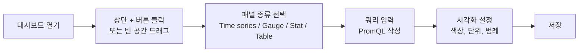
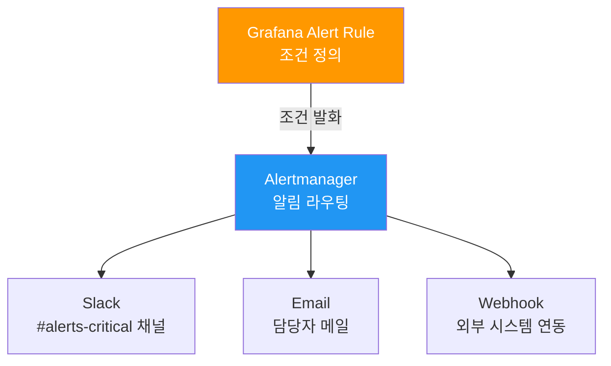

# Grafana 사용법 — 대시보드로 서비스 상태 시각화하기

> **버전**: 1.0.0 | **작성일**: 2026-04-11
> **대상**: Prometheus 기초를 마친 개발자
> **전제 조건**: `01-prometheus-basics.md` 학습 완료
> **소요 시간**: 약 45분
> **CSAP**: D-06 (침해사고 관리), D-10 (로그 관리)

---

## 목차

1. [Grafana란? — 데이터 시각화 허브](#1-grafana란--데이터-시각화-허브)
2. [대시보드 종류](#2-대시보드-종류)
3. [UI 구성 이해하기](#3-ui-구성-이해하기)
4. [새 패널 추가하기](#4-새-패널-추가하기)
5. [Alert 설정하기](#5-alert-설정하기)
6. [실습: 내 서비스 대시보드 만들기](#6-실습-내-서비스-대시보드-만들기)
7. [유용한 팁](#7-유용한-팁)

---

## 1. Grafana란? — 데이터 시각화 허브

Grafana는 Prometheus가 수집한 숫자 데이터를 그래프, 테이블, 게이지 등으로 시각화하는 도구입니다.

```
Prometheus: 데이터 수집 + 저장 (창고)
Grafana:    데이터 시각화 + 알림 (전시관 + 경보 시스템)
```

**Grafana 접속**: `http://localhost:30300`

계정 정보는 시스템 관리자에게 문의하십시오. 역할별 접근 권한이 다릅니다 (CSAP D-08).

| 역할 | 권한 |
|------|------|
| Viewer | 대시보드 조회만 가능 |
| Editor | 대시보드 생성·편집 가능 |
| Admin | 데이터소스, 사용자 관리 |

---

## 2. 대시보드 종류

공공기관 SaaS 플랫폼에서 운영하는 주요 대시보드 목록입니다.

### 2.1 CSAP 준수 대시보드

CSAP 감사 시 필수로 보여줘야 하는 대시보드입니다.

| 대시보드 이름 | 목적 | 주요 패널 |
|-------------|------|---------|
| CSAP Compliance Overview | 79개 항목 준수 현황 전체 보기 | 통제항목별 준수율, 미준수 항목 |
| Security Events | 보안 이벤트 모니터링 | 로그인 실패, 권한 오류, 의심 접근 |
| Audit Log Health | 감사 로그 무결성 확인 | 로그 누락 감지, 로그 볼륨 |

### 2.2 테넌트 현황 대시보드

멀티테넌트 운영 현황을 파악합니다.

| 대시보드 이름 | 목적 |
|-------------|------|
| Tenant Overview | 테넌트별 리소스 사용량 |
| Tenant SLO | 테넌트별 SLO 달성률 |
| Tenant Cost | 테넌트별 비용 배분 |

### 2.3 서비스 운영 대시보드

| 대시보드 이름 | 목적 |
|-------------|------|
| Golden Signals | 처리량, 에러율, 레이턴시, 포화도 |
| DORA Metrics | 배포 빈도, 리드타임, CFR, MTTR |
| SLO Error Budget | SLO 오류 예산 소진 현황 |
| Infrastructure | 노드, Pod, 네트워크 현황 |

---

## 3. UI 구성 이해하기

### 3.1 Grafana UI 주요 영역

```
┌──────────────────────────────────────────────────────┐
│  [≡] 홈  [검색] 대시보드    [알림] [설정]    [사용자] │  ← 상단 메뉴
├──────────────────────────────────────────────────────┤
│                                                      │
│  대시보드 이름                    [저장] [공유] [설정] │  ← 대시보드 툴바
│  ─────────────────────────────────────────────────  │
│  시간 범위: [Last 1 hour ▼]  [자동 갱신: 30s ▼]      │  ← 시간 컨트롤
│                                                      │
│  ┌─────────────┐  ┌─────────────┐  ┌─────────────┐  │
│  │   패널 1    │  │   패널 2    │  │   패널 3    │  │  ← 패널들
│  │  (그래프)   │  │  (게이지)   │  │  (테이블)   │  │
│  └─────────────┘  └─────────────┘  └─────────────┘  │
│                                                      │
└──────────────────────────────────────────────────────┘
```

### 3.2 시간 범위 선택

대시보드 우측 상단의 시간 범위 선택기를 사용합니다.

```
빠른 범위 선택:
  Last 5 minutes  → 실시간 트러블슈팅
  Last 1 hour     → 최근 장애 분석
  Last 24 hours   → 일별 운영 현황
  Last 7 days     → 주별 트렌드
  Last 30 days    → SLO 계산

사용자 정의:
  From: 2026-04-10 09:00
  To:   2026-04-10 12:00
  → 특정 사고 시간대 분석
```

### 3.3 변수(Variable) 활용

대시보드 상단에 드롭다운 메뉴가 있다면 변수를 사용하는 것입니다.

```
서비스: [auth-service ▼]    → 특정 서비스만 필터링
테넌트: [tenant-01 ▼]      → 특정 테넌트만 보기
네임스페이스: [saas-services ▼]
```

---

## 4. 새 패널 추가하기

### 4.1 패널 추가 기본 단계



### 4.2 패널 종류별 용도

| 패널 종류 | 용도 | 예시 |
|---------|------|------|
| Time series | 시간에 따른 변화 추이 | 요청 수, 응답 시간, 에러율 |
| Stat | 단일 최신값 강조 표시 | 현재 에러율, 업타임 |
| Gauge | 목표 대비 현재 수준 | CPU 사용률, SLO 달성률 |
| Bar gauge | 여러 항목 비교 | 서비스별 요청 수 비교 |
| Table | 상세 데이터 목록 | 에러 목록, 느린 쿼리 목록 |
| Pie chart | 비율/구성 | 서비스별 트래픽 비율 |

### 4.3 Time Series 패널 추가 실습

1. 대시보드에서 우측 상단 "Add panel" 버튼 클릭
2. "Add a new panel" 선택
3. 하단 Query 탭에서 PromQL 입력:

```promql
sum(rate(http_requests_total{service="$service"}[5m])) by (route)
```

4. 우측 패널 설정에서:
   - **Title**: "초당 요청 수 (엔드포인트별)"
   - **Standard options → Unit**: "requests/sec" 또는 "reqps"
   - **Standard options → Decimals**: 2

5. 범례 설정 (Legend):
   - **Legend mode**: Table
   - **Legend values**: Mean, Max, Current

6. 우측 상단 "Apply" → "Save dashboard"

### 4.4 알림 임계값(Threshold) 설정

패널에 임계값 선을 표시하여 언제 알림이 발생하는지 시각적으로 표현합니다.

```
우측 패널 설정 → Thresholds 섹션
  기본값: 녹색 (정상)
  추가:
    80 → 노란색 (경고)
    90 → 빨간색 (위험)
```

---

## 5. Alert 설정하기

### 5.1 Alert 흐름



### 5.2 Grafana Alert Rule 생성

**방법 1**: 패널에서 직접 Alert 생성

1. 기존 패널 → 제목 클릭 → Edit
2. Alert 탭 선택
3. "Create alert rule" 클릭

**방법 2**: 메뉴에서 직접 생성

Alerting → Alert rules → New alert rule

### 5.3 Alert Rule 구성 예시

**에러율 알림 예시**:

```yaml
# Alert Rule 설정값
이름: auth-service-error-rate-critical
그룹: auth-service-alerts

# 조건 (Condition)
쿼리 A:
  sum(rate(http_requests_total{service="auth-service", status=~"5.."}[5m]))
  /
  sum(rate(http_requests_total{service="auth-service"}[5m]))
  * 100

조건: A > 5       # 에러율 5% 초과
기간: 5분 지속     # 5분 동안 지속될 때만 발화 (flapping 방지)

# 알림 내용
요약: auth-service 에러율 {{ $value | printf "%.1f" }}% (임계값: 5%)
설명: auth-service 5분 에러율이 {{ $value | printf "%.1f" }}%입니다. 즉시 확인이 필요합니다.
```

### 5.4 Alert 레이블과 라우팅

Alert에 레이블을 붙이면 Alertmanager에서 라우팅 규칙으로 적절한 채널로 전송됩니다.

```yaml
# Alert Rule의 레이블
labels:
  severity: critical    # critical | warning | info
  team: platform        # 담당 팀
  service: auth-service
  csap_domain: D-06     # CSAP 관련 도메인 (감사 추적용)
```

```yaml
# Alertmanager 라우팅 (infra/monitoring/alertmanager-config.yaml 참조)
routes:
  - match:
      severity: critical
    receiver: slack-critical      # #alerts-critical 채널
  - match:
      severity: warning
    receiver: slack-warning       # #alerts-warning 채널
  - match:
      csap_domain: D-06
    receiver: csap-security-team  # CSAP 보안팀 별도 알림
```

---

## 6. 실습: 내 서비스 대시보드 만들기

이 실습에서는 auth-service를 예시로 4개의 패널을 가진 대시보드를 만듭니다.

### 6.1 새 대시보드 생성

1. 좌측 메뉴 → Dashboards → New Dashboard
2. "+ Add visualization" 클릭

### 6.2 패널 1: 초당 요청 수 (Time Series)

**Query**:
```promql
sum(rate(http_requests_total{service="auth-service"}[5m])) by (route)
```

**설정**:
- Title: "초당 요청 수"
- Unit: "reqps"
- Legend: Table (Mean, Max)

### 6.3 패널 2: P99 응답 시간 (Time Series)

**Query**:
```promql
histogram_quantile(
  0.99,
  sum(rate(http_request_duration_seconds_bucket{service="auth-service"}[5m])) by (le, route)
)
```

**설정**:
- Title: "P99 응답 시간"
- Unit: "seconds (s)"
- Thresholds: 0.5s=노란색, 1.0s=빨간색

### 6.4 패널 3: 에러율 (Stat)

**Query**:
```promql
(
  sum(rate(http_requests_total{service="auth-service", status=~"5.."}[5m]))
  /
  sum(rate(http_requests_total{service="auth-service"}[5m]))
) * 100
```

**설정**:
- Title: "에러율 (%)"
- Unit: "Percent (0-100)"
- Color mode: Background
- Thresholds: 1%=노란색, 5%=빨간색

### 6.5 패널 4: 로그인 성공/실패 (Time Series)

**Query A** (성공):
```promql
rate(auth_login_attempts_total{result="success"}[5m])
```

**Query B** (실패):
```promql
rate(auth_login_attempts_total{result="failure"}[5m])
```

**설정**:
- Title: "로그인 시도 현황"
- Query A 색상: 녹색
- Query B 색상: 빨간색

### 6.6 대시보드 저장

1. 우측 상단 저장 버튼 (플로피 디스크 아이콘)
2. 이름: "auth-service 운영 현황"
3. 폴더: "Services / auth-service"
4. Save

### 6.7 대시보드 공유

대시보드를 팀과 공유하는 방법:

```
우측 상단 공유 버튼 → Link → Copy
  옵션: "Current time range" 포함 여부
  → 현재 시간 범위 포함 링크 전송 가능 (장애 분석 시 유용)
```

---

## 7. 유용한 팁

### 7.1 단축키

| 단축키 | 기능 |
|-------|------|
| `d f` | 전체 화면 모드 |
| `?` | 단축키 목록 |
| `e` | 선택한 패널 편집 |
| `Ctrl+S` | 대시보드 저장 |

### 7.2 템플릿 변수로 재사용 가능한 대시보드 만들기

대시보드 설정 → Variables → New variable

```
변수 이름: service
Label: 서비스
Type: Query
Query: label_values(http_requests_total, service)
→ Prometheus에서 실제 서비스 목록을 자동으로 가져옴
```

패널 쿼리에서 `$service` 로 참조:
```promql
rate(http_requests_total{service="$service"}[5m])
```

### 7.3 대시보드를 코드로 관리 (GitOps)

Grafana 대시보드는 JSON으로 내보내어 Git에 저장할 수 있습니다.

```bash
# 대시보드 JSON 내보내기
# Grafana UI → 대시보드 → Share → Export → Save to file

# 저장 위치
infra/monitoring/dashboards/auth-service.json
```

이 파일을 Git에 커밋하면 다른 환경에서도 같은 대시보드를 사용할 수 있습니다.

### 7.4 CSAP 감사를 위한 대시보드 스냅샷

CSAP 감사 증거로 대시보드 스냅샷을 제출할 수 있습니다.

```
대시보드 → Share → Snapshot
  이름: "CSAP 감사 2026-04-11"
  만료: Never (감사 증거 영구 보존)
  → 링크 생성 → 공유
```

---

## 다음 단계

Grafana 대시보드를 만들 수 있게 되었습니다. 다음은 로그 조회 방법을 배울 차례입니다.

`../logging/01-loki-guide.md`로 이동하여 Loki + LogQL을 학습하십시오.

---

> **참조**: `infra/monitoring/dashboards/` — 기존 대시보드 JSON 파일 모음
> **참조**: `docs/07-infra/observability-guide.md` — 심화 가이드
> **CSAP 연관**: D-06 (침해사고 관리), D-10 (로그 관리)
