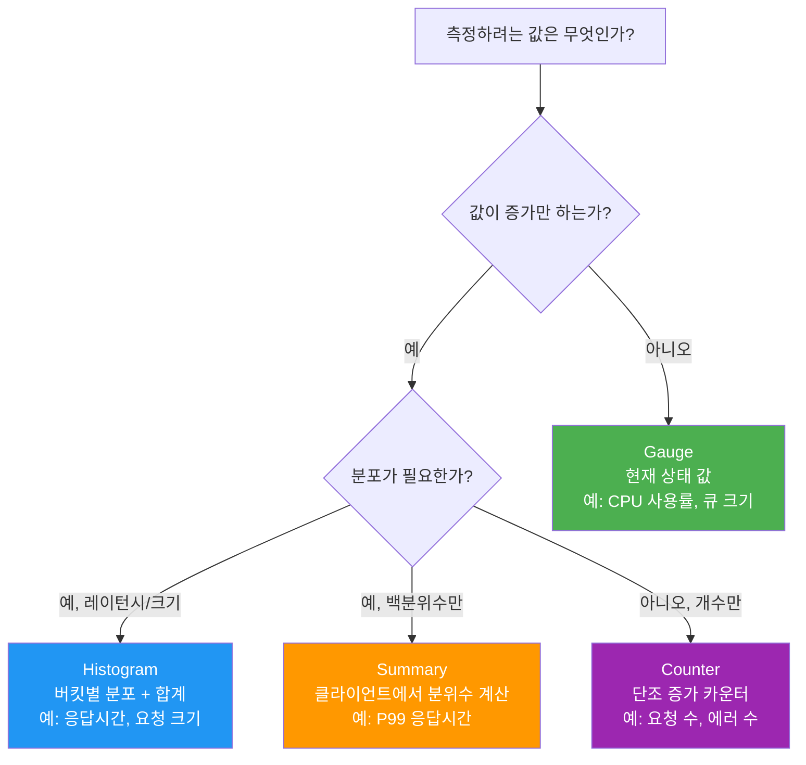
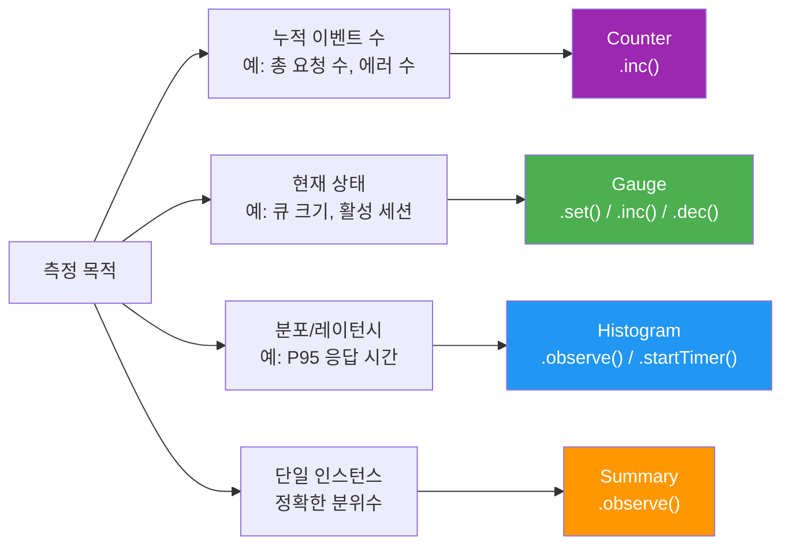
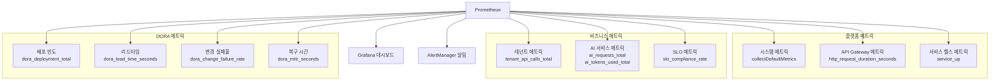
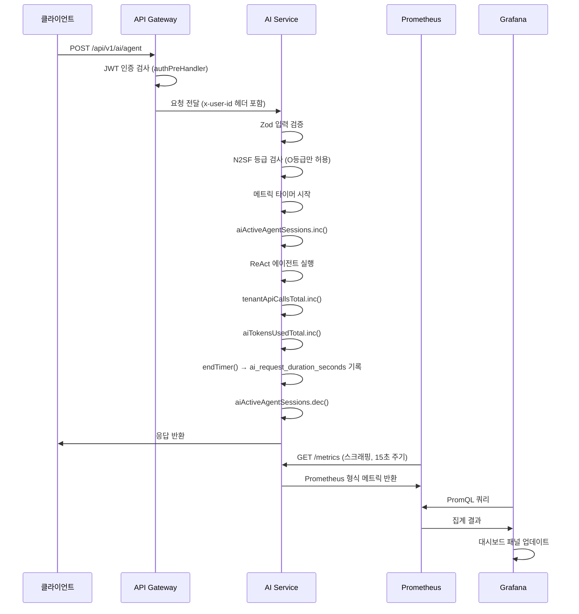

# 커스텀 메트릭 추가 가이드

> 이 가이드를 마치면 직접 비즈니스 메트릭을 정의하고, Prometheus에 노출하고,
> Grafana에서 대시보드 패널로 시각화할 수 있습니다.

## 목차

1. [커스텀 메트릭이란?](#1-커스텀-메트릭이란)
2. [메트릭 4가지 유형 완전 이해](#2-메트릭-4가지-유형-완전-이해)
3. [prom-client로 메트릭 추가하기](#3-prom-client로-메트릭-추가하기)
4. [비즈니스 메트릭 설계하기](#4-비즈니스-메트릭-설계하기)
5. [PromQL로 커스텀 메트릭 쿼리하기](#5-promql로-커스텀-메트릭-쿼리하기)
6. [Grafana에서 커스텀 패널 만들기](#6-grafana에서-커스텀-패널-만들기)
7. [실습: tenant_api_calls_total 직접 추가하기](#7-실습-tenant_api_calls_total-직접-추가하기)
8. [주의사항: 고카디널리티와 명명 규칙](#8-주의사항-고카디널리티와-명명-규칙)
9. [학습 체크리스트](#학습-체크리스트)
10. [다음 단계](#다음-단계)

---

## 1. 커스텀 메트릭이란?

Prometheus는 기본적으로 CPU 사용률, 메모리 사용량 같은 **시스템 메트릭**을 수집합니다.
하지만 공공기관 SaaS 플랫폼에서는 다음과 같은 **비즈니스 메트릭**이 더 중요합니다.

- "어느 테넌트(기관)가 API를 가장 많이 호출했는가?"
- "AI 채팅 요청이 오늘 몇 건이나 들어왔는가?"
- "SLO 달성률이 현재 몇 퍼센트인가?"
- "DORA 4대 지표 중 배포 빈도가 얼마나 되는가?"

이런 질문에 답하기 위해 **커스텀 메트릭(Custom Metrics)**을 직접 정의하고 수집합니다.

```
💡 커스텀 메트릭 = 서비스 코드에서 직접 정의하는 비즈니스 의미 있는 측정값
```

### 이 프로젝트에서 커스텀 메트릭을 사용하는 곳

이 프레임워크는 이미 다양한 커스텀 메트릭을 정의해 두었습니다.
실제 코드에서 어떻게 사용하는지 확인해 봅시다.

**DORA 4대 지표 메트릭** (`packages/dora-exporter/src/index.ts`):

```typescript
// packages/dora-exporter/src/index.ts (실제 코드)
import { Registry, Counter, Histogram, Gauge, collectDefaultMetrics } from 'prom-client';

const register = new Registry();
collectDefaultMetrics({ register });

// FR-DORA.1: 배포 빈도 카운터
const deploymentTotal = new Counter({
  name: 'dora_deployment_total',
  help: '배포 횟수 (DORA Deployment Frequency)',
  labelNames: ['team', 'service', 'environment'] as const,
  registers: [register],
});

// FR-DORA.2: 변경 리드타임 히스토그램
const leadTimeSeconds = new Histogram({
  name: 'dora_lead_time_seconds',
  help: '변경 리드타임 - 첫 커밋에서 프로덕션 배포까지 (초)',
  labelNames: ['team', 'service'] as const,
  buckets: [60, 300, 900, 1800, 3600, 7200, 14400, 28800, 86400, 604800],
  registers: [register],
});

// FR-DORA.3: 변경 실패율 게이지
const changeFailureRate = new Gauge({
  name: 'dora_change_failure_rate',
  help: '변경 실패율 (0.0 ~ 1.0)',
  labelNames: ['team', 'service'] as const,
  registers: [register],
});

// FR-DORA.4: 서비스 복구 시간 히스토그램
const mttrSeconds = new Histogram({
  name: 'dora_mttr_seconds',
  help: '서비스 복구 시간 (초)',
  labelNames: ['team', 'service', 'severity'] as const,
  buckets: [60, 300, 900, 1800, 3600, 7200, 14400, 28800, 86400],
  registers: [register],
});
```

이 4개의 메트릭만으로 팀의 개발 성숙도(DORA 등급)를 자동으로 계산합니다.
Counter, Histogram, Gauge — 서로 다른 유형이 쓰이는 것이 보이시나요?
각 유형의 차이를 지금부터 배워봅시다.

---

## 2. 메트릭 4가지 유형 완전 이해

Prometheus에는 4가지 기본 메트릭 유형이 있습니다.
각각 언제 써야 하는지를 이해하는 것이 커스텀 메트릭 설계의 핵심입니다.



### 2.1 Counter (카운터)

**정의**: 단조 증가(monotonically increasing)하는 값. 절대 감소하지 않습니다.
**재시작 시**: 0으로 리셋됩니다 (PromQL의 `rate()` 함수가 이를 처리).

```
✅ 언제 쓰나:
  - HTTP 요청 총 횟수
  - 에러 발생 횟수
  - 배포 횟수
  - 처리한 이벤트 수

❌ 쓰면 안 되는 경우:
  - 현재 메모리 사용량 (증가/감소 가능)
  - 현재 활성 사용자 수 (감소 가능)
```

```typescript
// Counter 사용 예시
const httpRequestsTotal = new Counter({
  name: 'http_requests_total',
  help: 'HTTP 요청 총 횟수',
  labelNames: ['method', 'route', 'status_code'],
  registers: [register],
});

// 값 증가 (1 증가)
httpRequestsTotal.inc({ method: 'GET', route: '/api/v1/users', status_code: '200' });

// N 증가
httpRequestsTotal.inc({ method: 'POST', route: '/api/v1/tenants', status_code: '201' }, 1);
```

### 2.2 Gauge (게이지)

**정의**: 임의로 증가하거나 감소할 수 있는 값. 현재 상태를 나타냅니다.
**DORA 예시**: `dora_change_failure_rate` — 현재 변경 실패율 (0.0 ~ 1.0)

```
✅ 언제 쓰나:
  - 현재 활성 연결 수
  - 큐에 쌓인 작업 수
  - 메모리 사용량
  - SLO 달성률 (0 ~ 100%)
  - DORA 변경 실패율

❌ 쓰면 안 되는 경우:
  - 누적 요청 수 (항상 증가만 함 → Counter 사용)
```

```typescript
// Gauge 사용 예시 (실제 코드에서 발췌)
const changeFailureRate = new Gauge({
  name: 'dora_change_failure_rate',
  help: '변경 실패율 (0.0 ~ 1.0)',
  labelNames: ['team', 'service'] as const,
  registers: [register],
});

// 값 설정 (임의 값)
changeFailureRate.set({ team: 'platform', service: 'ai-service' }, 0.05);

// 값 증가/감소
const activeConnections = new Gauge({ name: 'active_connections', help: '활성 연결 수', registers: [register] });
activeConnections.inc();  // +1
activeConnections.dec();  // -1
activeConnections.set(42); // 직접 설정
```

### 2.3 Histogram (히스토그램)

**정의**: 값의 분포를 측정. 사전 정의된 버킷(bucket)에 값을 분류합니다.
**DORA 예시**: `dora_lead_time_seconds` — 리드타임의 분포 (60초부터 604800초까지)

```
✅ 언제 쓰나:
  - HTTP 응답 시간 (P50, P95, P99)
  - 요청 크기 (바이트)
  - 배포 리드타임
  - MTTR (서비스 복구 시간)

💡 버킷 선택 팁:
  - SLO 임계값 주변에 버킷을 촘촘하게 배치
  - 예: 응답 시간 SLO가 200ms라면 [100, 150, 200, 250, 300, ...] 설정
```

```typescript
// Histogram 사용 예시 (실제 코드에서 발췌)
const leadTimeSeconds = new Histogram({
  name: 'dora_lead_time_seconds',
  help: '변경 리드타임 - 첫 커밋에서 프로덕션 배포까지 (초)',
  labelNames: ['team', 'service'] as const,
  buckets: [60, 300, 900, 1800, 3600, 7200, 14400, 28800, 86400, 604800],
  registers: [register],
});

// 관측값 기록
leadTimeSeconds.observe({ team: 'platform', service: 'api-gateway' }, 3600); // 1시간

// 타이머 패턴 (가장 많이 쓰는 방법)
const httpDuration = new Histogram({
  name: 'http_request_duration_seconds',
  help: 'HTTP 요청 처리 시간',
  labelNames: ['method', 'route'],
  buckets: [0.01, 0.05, 0.1, 0.2, 0.5, 1, 2, 5],
  registers: [register],
});

// 타이머 시작 → 코드 실행 → 타이머 종료 (자동으로 observe 호출)
const end = httpDuration.startTimer({ method: 'POST', route: '/ai/chat' });
await processAiRequest();
end(); // 경과 시간 자동 기록
```

히스토그램이 Prometheus에 저장하는 것:

| 메트릭명 | 의미 |
|---------|------|
| `dora_lead_time_seconds_bucket{le="3600"}` | 1시간 이하인 샘플 수 |
| `dora_lead_time_seconds_bucket{le="+Inf"}` | 전체 샘플 수 |
| `dora_lead_time_seconds_sum` | 모든 리드타임의 합계 |
| `dora_lead_time_seconds_count` | 총 샘플 수 |

### 2.4 Summary (서머리)

**정의**: 클라이언트 측에서 분위수(quantile)를 계산하는 메트릭.
Histogram과 달리 버킷이 없고 분위수를 직접 계산합니다.

```
⚠️ 주의: Summary는 분산 환경에서 집계가 어렵습니다.
  여러 인스턴스의 P99를 합산할 수 없기 때문에 일반적으로 Histogram을 권장합니다.

✅ Summary를 쓰는 경우:
  - 단일 인스턴스 환경
  - 정확한 분위수가 필요하고 인스턴스가 1개인 경우
```

```typescript
// Summary 사용 예시 (참고용 — 이 프로젝트는 Histogram 권장)
import { Summary } from 'prom-client';

const requestDurationSummary = new Summary({
  name: 'request_duration_summary_seconds',
  help: '요청 처리 시간 (분위수)',
  labelNames: ['service'],
  percentiles: [0.5, 0.9, 0.99], // P50, P90, P99
  registers: [register],
});

requestDurationSummary.observe({ service: 'auth' }, 0.15);
```

### 유형 선택 치트시트



---

## 3. prom-client로 메트릭 추가하기

### 3.1 기본 설정

모든 서비스에서 메트릭을 추가할 때는 **독립적인 Registry**를 사용합니다.
전역 레지스트리를 쓰면 테스트 간 메트릭이 오염됩니다.

```typescript
// lib/metrics.ts — 메트릭 모듈 (권장 패턴)
import { Registry, collectDefaultMetrics } from 'prom-client';

// 서비스별 독립 레지스트리
export const register = new Registry();

// 기본 메트릭 수집 활성화 (CPU, 메모리, GC 등)
collectDefaultMetrics({ register });

// 메트릭 엔드포인트 핸들러
export async function metricsHandler(reply: FastifyReply): Promise<void> {
  reply.header('Content-Type', register.contentType);
  reply.send(await register.metrics());
}
```

### 3.2 실제 프로젝트의 메트릭 엔드포인트 패턴

DORA Exporter에서 발췌한 실제 `/metrics` 엔드포인트:

```typescript
// packages/dora-exporter/src/index.ts (실제 코드)
// Prometheus 메트릭 엔드포인트
app.get('/metrics', async (_req, res) => {
  try {
    res.set('Content-Type', register.contentType);
    res.end(await register.metrics());
  } catch (error) {
    res.status(500).end();
  }
});
```

### 3.3 실제 메트릭 업데이트 예시

Gitea Webhook을 수신할 때 배포 카운터를 증가시키는 실제 코드:

```typescript
// packages/dora-exporter/src/index.ts (실제 코드)
app.post('/webhook/gitea', async (req, res) => {
  try {
    // Zod로 입력 검증 (CSAP D-12)
    const payload = giteaWebhookSchema.parse(req.body);
    const team = extractTeam(payload.repository.full_name);
    const service = extractService(payload.repository.full_name);
    const environment = extractEnvironment(payload.ref);

    if (isDeploymentEvent(payload.ref)) {
      // FR-DORA.1: 배포 빈도 증가
      deploymentTotal.inc({ team, service, environment });

      // FR-DORA.2: 리드타임 계산 및 기록
      const firstCommitTime = getFirstCommitTimestamp(payload.commits);
      if (firstCommitTime) {
        const deployTime = Date.now();
        const leadTime = leadTimeCalculator.calculate(firstCommitTime, deployTime);
        leadTimeSeconds.observe({ team, service }, leadTime);
      }

      // FR-DORA.3: 변경 실패 감지
      const isFailure = changeFailureDetector.detect(payload.commits);
      if (isFailure) {
        changeFailureDetector.recordFailure(team, service);
      } else {
        changeFailureDetector.recordSuccess(team, service);
      }
      const rate = changeFailureDetector.getRate(team, service);
      changeFailureRate.set({ team, service }, rate);
    }

    res.status(200).json({ status: 'accepted' });
  } catch (error) {
    if (error instanceof z.ZodError) {
      // 입력 검증 실패 — 민감 정보 노출 없이 처리
      res.status(400).json({ error: 'Invalid webhook payload', details: error.issues });
      return;
    }
    res.status(500).json({ error: 'Internal server error' });
  }
});
```

### 3.4 타이머 패턴으로 처리 시간 측정

```typescript
// 타이머 패턴 — HTTP 미들웨어에서 사용
const httpRequestDuration = new Histogram({
  name: 'http_request_duration_seconds',
  help: 'HTTP 요청 처리 시간 (초)',
  labelNames: ['method', 'route', 'status_code'],
  buckets: [0.005, 0.01, 0.025, 0.05, 0.1, 0.25, 0.5, 1, 2.5, 5, 10],
  registers: [register],
});

// Fastify 플러그인으로 등록
app.addHook('onRequest', (request, reply, done) => {
  // 타이머 시작
  (request as any).metricsEnd = httpRequestDuration.startTimer();
  done();
});

app.addHook('onResponse', (request, reply, done) => {
  // 타이머 종료 및 기록
  const end = (request as any).metricsEnd;
  if (end) {
    end({
      method: request.method,
      route: request.routerPath ?? request.url,
      status_code: String(reply.statusCode),
    });
  }
  done();
});
```

---

## 4. 비즈니스 메트릭 설계하기

### 4.1 AI 서비스 메트릭 설계

AI 서비스(`platform/services/ai-service/src/routes.ts`)를 보면 rate limiter로 보호된 엔드포인트들이 있습니다.
이를 기반으로 AI 사용량 메트릭을 설계할 수 있습니다.

```typescript
// AI 서비스용 커스텀 메트릭 설계 예시
import { Counter, Histogram, Gauge, Registry } from 'prom-client';

const register = new Registry();

// AI 요청 총 횟수 (엔드포인트별, 테넌트별)
const aiRequestsTotal = new Counter({
  name: 'ai_requests_total',
  help: 'AI API 요청 총 횟수',
  labelNames: ['endpoint', 'tenant_id', 'model_id', 'status'],
  registers: [register],
});

// AI 요청 처리 시간
const aiRequestDuration = new Histogram({
  name: 'ai_request_duration_seconds',
  help: 'AI API 요청 처리 시간 (초)',
  labelNames: ['endpoint', 'model_id'],
  // AI는 보통 오래 걸리므로 버킷을 크게 설정
  buckets: [0.1, 0.5, 1, 2, 5, 10, 30, 60, 120],
  registers: [register],
});

// AI 토큰 사용량
const aiTokensUsed = new Counter({
  name: 'ai_tokens_used_total',
  help: 'AI 모델 토큰 사용량',
  labelNames: ['model_id', 'tenant_id', 'type'], // type: prompt|completion
  registers: [register],
});

// Rate Limit 초과 횟수 (CSAP D-08-06)
const aiRateLimitExceeded = new Counter({
  name: 'ai_rate_limit_exceeded_total',
  help: 'Rate Limit 초과 횟수 (CSAP D-08-06 모니터링)',
  labelNames: ['endpoint', 'tenant_id'],
  registers: [register],
});

// N2SF 등급 위반 차단 횟수
const aiGradeViolations = new Counter({
  name: 'ai_grade_violations_total',
  help: 'N2SF 데이터 등급 위반으로 차단된 요청 수',
  labelNames: ['endpoint', 'grade'],
  registers: [register],
});

// 활성 AI 에이전트 세션 수
const aiActiveAgentSessions = new Gauge({
  name: 'ai_active_agent_sessions',
  help: '현재 실행 중인 AI 에이전트 세션 수',
  labelNames: ['mode'], // react|plan-execute|orchestrate
  registers: [register],
});
```

### 4.2 테넌트별 API 호출 메트릭

```typescript
// 테넌트별 API 호출 추적 메트릭
const tenantApiCallsTotal = new Counter({
  name: 'tenant_api_calls_total',
  help: '테넌트별 API 호출 총 횟수',
  labelNames: ['tenant_id', 'service', 'endpoint'],
  registers: [register],
});

// 테넌트별 에러율 추적
const tenantApiErrorsTotal = new Counter({
  name: 'tenant_api_errors_total',
  help: '테넌트별 API 에러 총 횟수',
  labelNames: ['tenant_id', 'service', 'error_code'],
  registers: [register],
});

// 테넌트별 활성 구독 수
const tenantActiveSubscriptions = new Gauge({
  name: 'tenant_active_subscriptions',
  help: '활성화된 구독 서비스 수',
  labelNames: ['tenant_id', 'plan'],
  registers: [register],
});
```

### 4.3 SLO 달성률 메트릭

SLO 에스컬레이션 컨트롤러(`packages/slo-escalation/src/escalation-controller.ts`)와 연동:

```typescript
// SLO 메트릭
const sloComplianceRate = new Gauge({
  name: 'slo_compliance_rate',
  help: 'SLO 달성률 (0.0 ~ 1.0)',
  labelNames: ['service', 'slo_name'],
  registers: [register],
});

const sloBudgetBurnRate = new Gauge({
  name: 'slo_error_budget_burn_rate',
  help: 'SLO 에러 버짓 소진율 (%)',
  labelNames: ['service', 'slo_name'],
  registers: [register],
});

const sloEscalationEvents = new Counter({
  name: 'slo_escalation_events_total',
  help: 'SLO 에스컬레이션 발생 횟수',
  labelNames: ['service', 'level'], // normal|warning|danger|critical|violated
  registers: [register],
});

// SLO 에스컬레이션 레벨 업데이트 (실제 코드와 연동)
// escalation-controller.ts의 determineEscalationLevel() 결과를 메트릭에 반영
function updateSloMetrics(
  service: string,
  sloName: string,
  budgetBurnRate: number,
  complianceRate: number
): void {
  sloBudgetBurnRate.set({ service, slo_name: sloName }, budgetBurnRate);
  sloComplianceRate.set({ service, slo_name: sloName }, complianceRate);
}
```

### 메트릭 계층 구조 다이어그램



---

## 5. PromQL로 커스텀 메트릭 쿼리하기

### 5.1 DORA 배포 빈도 쿼리

```promql
# 예제 1: 팀별 일별 배포 횟수 (지난 7일 평균)
rate(dora_deployment_total{environment="production"}[7d]) * 86400

# 결과 예시:
# dora_deployment_total{team="platform", service="api-gateway", environment="production"} 3.2
# → platform 팀의 api-gateway 서비스는 하루 평균 3.2회 배포
```

```promql
# 예제 2: 서비스별 배포 빈도 랭킹 (지난 30일)
topk(5, increase(dora_deployment_total{environment="production"}[30d]))

# 결과: 배포가 가장 많은 상위 5개 서비스
```

### 5.2 변경 리드타임 분위수 쿼리

```promql
# 예제 3: 팀별 리드타임 P95 (중앙값 대비 빠른지 느린지 확인)
histogram_quantile(0.95,
  sum by (team, le) (
    rate(dora_lead_time_seconds_bucket[30d])
  )
)

# 결과 해석:
# team="platform" → 86400 (1일)   = "Medium" 등급
# team="backend"  → 604800 (7일)  = "Low" 등급
```

```promql
# 예제 4: 리드타임 중앙값 (P50)
histogram_quantile(0.50,
  sum by (team, le) (
    rate(dora_lead_time_seconds_bucket[30d])
  )
)
```

### 5.3 변경 실패율 쿼리

```promql
# 예제 5: 서비스별 변경 실패율 (현재 값)
dora_change_failure_rate

# 예제 6: 변경 실패율이 15% 초과인 서비스 필터링
dora_change_failure_rate > 0.15
```

### 5.4 SLO 에스컬레이션 쿼리

```promql
# 예제 7: SLO 위반(Violated) 레벨 에스컬레이션이 발생한 서비스
increase(slo_escalation_events_total{level="violated"}[24h]) > 0

# 예제 8: 에러 버짓 소진율 90% 초과 서비스 (위험 경보)
slo_error_budget_burn_rate > 90
```

### 5.5 AI 서비스 메트릭 쿼리

```promql
# 예제 9: 테넌트별 AI 요청 비율 (분당)
sum by (tenant_id) (
  rate(ai_requests_total[5m])
) * 60

# 예제 10: AI 에이전트 평균 처리 시간
histogram_quantile(0.95,
  sum by (le, endpoint) (
    rate(ai_request_duration_seconds_bucket{endpoint="/ai/agent"}[5m])
  )
)
```

### 5.6 테넌트별 API 호출 쿼리

```promql
# 예제 11: 상위 10개 테넌트 API 호출량 (지난 1시간)
topk(10,
  sum by (tenant_id) (
    increase(tenant_api_calls_total[1h])
  )
)

# 예제 12: 테넌트별 에러율 (%)
(
  sum by (tenant_id) (increase(tenant_api_errors_total[5m]))
  /
  sum by (tenant_id) (increase(tenant_api_calls_total[5m]))
) * 100
```

---

## 6. Grafana에서 커스텀 패널 만들기

### 6.1 새 패널 추가 단계

```
단계 1: 대시보드 편집 모드 진입
  → Grafana 우측 상단 "Edit" 버튼 클릭
  → 또는 대시보드 제목 옆 ... 메뉴 → "Edit"

단계 2: 새 패널 추가
  → "Add panel" 버튼 클릭 (+ 아이콘)
  → "Add a new panel" 선택

단계 3: 데이터 소스 선택
  → Data source 드롭다운에서 "Prometheus" 선택
  → 이 프로젝트에서는 "prometheus" (기본 데이터 소스)

단계 4: PromQL 쿼리 입력
  → "Metrics browser" 탭에서 메트릭 이름 검색
  → 또는 직접 쿼리 입력
```

### 6.2 DORA 배포 빈도 패널 만들기

```
패널 유형: Time series (시계열 그래프)

쿼리:
  A: rate(dora_deployment_total{environment="production"}[1d]) * 86400

패널 설정:
  Title: "일별 배포 빈도 (프로덕션)"
  Unit: "deployments/day" (Custom unit)
  Legend: {{team}} / {{service}}

임계선 추가 (Thresholds):
  - 1 이상 (연두색) = "Medium 이상"
  - 3 이상 (초록색) = "High 이상"
  - 10 이상 (파란색) = "Elite"
```

### 6.3 SLO 에러 버짓 게이지 패널 만들기

```
패널 유형: Gauge (원형 게이지)

쿼리:
  A: 100 - slo_error_budget_burn_rate{service="api-gateway"}

패널 설정:
  Title: "에러 버짓 잔여율 (%)"
  Min: 0, Max: 100
  Unit: "percent (0-100)"

색상 임계값:
  - 0 ~ 10%: 빨강 (위험)
  - 10 ~ 25%: 주황 (경고)
  - 25 ~ 100%: 초록 (정상)
```

### 6.4 AI 요청 통계 패널 만들기

```
패널 유형: Stat (통계 수치)

쿼리:
  A: sum(increase(ai_requests_total[24h]))
     Legend: "오늘 총 AI 요청"

  B: sum(rate(ai_requests_total[5m])) * 60
     Legend: "현재 분당 요청"

  C: sum(increase(ai_grade_violations_total[24h]))
     Legend: "등급 위반 차단 (N2SF)"
```

### 6.5 패널 내보내기/가져오기

Grafana 패널 설정을 JSON으로 내보내면 팀원들과 공유할 수 있습니다.

```json
// 패널 JSON 예시 (DORA 배포 빈도)
{
  "title": "일별 배포 빈도 (프로덕션)",
  "type": "timeseries",
  "datasource": { "type": "prometheus", "uid": "prometheus" },
  "targets": [
    {
      "expr": "rate(dora_deployment_total{environment=\"production\"}[1d]) * 86400",
      "legendFormat": "{{team}} / {{service}}"
    }
  ],
  "fieldConfig": {
    "defaults": {
      "unit": "short",
      "thresholds": {
        "steps": [
          { "color": "yellow", "value": 0 },
          { "color": "green", "value": 1 },
          { "color": "blue", "value": 10 }
        ]
      }
    }
  }
}
```

---

## 7. 실습: tenant_api_calls_total 메트릭 직접 추가하기

이제 직접 해봅시다. AI 서비스에 테넌트별 API 호출 메트릭을 추가합니다.

### 7.1 메트릭 모듈 생성

```typescript
// platform/services/ai-service/src/lib/metrics.ts (신규 파일)
// Design Ref: §3 — AI 서비스 비즈니스 메트릭
// Plan SC: 실습용 예제 코드

import { Registry, Counter, Histogram, Gauge, collectDefaultMetrics } from 'prom-client';

// AI 서비스 전용 레지스트리
export const aiMetricsRegistry = new Registry();
collectDefaultMetrics({ register: aiMetricsRegistry });

// ─── 테넌트별 API 호출 카운터 ─────────────────────────────────────────
// Plan SC: 실습 목표 메트릭
export const tenantApiCallsTotal = new Counter({
  name: 'tenant_api_calls_total',
  help: '테넌트별 AI API 호출 총 횟수',
  labelNames: ['tenant_id', 'endpoint', 'status'] as const,
  registers: [aiMetricsRegistry],
});

// ─── AI 요청 처리 시간 히스토그램 ────────────────────────────────────
export const aiRequestDurationSeconds = new Histogram({
  name: 'ai_request_duration_seconds',
  help: 'AI API 요청 처리 시간 (초)',
  labelNames: ['endpoint', 'model_id'] as const,
  buckets: [0.1, 0.5, 1, 2, 5, 10, 30, 60, 120],
  registers: [aiMetricsRegistry],
});

// ─── AI 토큰 사용량 카운터 ───────────────────────────────────────────
export const aiTokensUsedTotal = new Counter({
  name: 'ai_tokens_used_total',
  help: 'AI 모델 토큰 사용량',
  labelNames: ['model_id', 'tenant_id', 'token_type'] as const, // token_type: prompt|completion
  registers: [aiMetricsRegistry],
});

// ─── N2SF 등급 위반 카운터 ───────────────────────────────────────────
export const aiGradeViolationsTotal = new Counter({
  name: 'ai_grade_violations_total',
  help: 'N2SF 데이터 등급 위반으로 차단된 요청 수',
  labelNames: ['endpoint', 'blocked_grade'] as const,
  registers: [aiMetricsRegistry],
});

// ─── 활성 에이전트 세션 게이지 ──────────────────────────────────────
export const aiActiveAgentSessions = new Gauge({
  name: 'ai_active_agent_sessions',
  help: '현재 실행 중인 AI 에이전트 세션 수',
  labelNames: ['mode'] as const, // react|plan-execute|orchestrate
  registers: [aiMetricsRegistry],
});
```

### 7.2 AI 에이전트 핸들러에 메트릭 연동

실제 `ai-agent.handler.ts`를 참고하여 메트릭을 추가합니다.

```typescript
// platform/services/ai-service/src/handlers/ai-agent.handler.ts 수정 예시
// (기존 agentHandler 함수에 메트릭 코드 추가)

import {
  tenantApiCallsTotal,
  aiRequestDurationSeconds,
  aiTokensUsedTotal,
  aiActiveAgentSessions,
} from '../lib/metrics.js';

export async function agentHandler(
  request: FastifyRequest<{ Body: AgentBody }>,
  reply: FastifyReply,
): Promise<void> {
  const body = agentSchema.parse(request.body);
  const actor = (request.headers['x-user-id'] as string) || 'system';

  // 메트릭 타이머 시작
  const endTimer = aiRequestDurationSeconds.startTimer({
    endpoint: '/ai/agent',
    model_id: body.modelId ?? 'default',
  });

  // 활성 세션 증가
  aiActiveAgentSessions.inc({ mode: 'react' });

  // N2SF N-05: C/S 등급 차단
  try {
    validateDataGrade(body.grade as DataGrade);
  } catch (error) {
    if (error instanceof DataGradeViolationError) {
      // 등급 위반 카운터 증가
      aiGradeViolationsTotal.inc({
        endpoint: '/ai/agent',
        blocked_grade: body.grade,
      });

      // 테넌트 API 호출 기록 (차단됨)
      tenantApiCallsTotal.inc({
        tenant_id: body.tenantId,
        endpoint: '/ai/agent',
        status: 'blocked_grade_violation',
      });

      endTimer();
      aiActiveAgentSessions.dec({ mode: 'react' });

      await reply.status(403).send({ /* ... */ });
      return;
    }
    throw error;
  }

  try {
    // ... 기존 에이전트 실행 코드 ...

    // 성공 시 메트릭 기록
    tenantApiCallsTotal.inc({
      tenant_id: body.tenantId,
      endpoint: '/ai/agent',
      status: 'success',
    });

    // 토큰 사용량 기록
    if (result.tokensUsed) {
      aiTokensUsedTotal.inc(
        { model_id: result.model ?? 'unknown', tenant_id: body.tenantId, token_type: 'total' },
        result.tokensUsed
      );
    }

    // 타이머 종료 (경과 시간 자동 기록)
    endTimer();
    aiActiveAgentSessions.dec({ mode: 'react' });

    await reply.status(200).send({ /* ... */ });
  } catch (err) {
    // 에러 시 메트릭 기록
    tenantApiCallsTotal.inc({
      tenant_id: body.tenantId,
      endpoint: '/ai/agent',
      status: 'error',
    });
    endTimer();
    aiActiveAgentSessions.dec({ mode: 'react' });

    await reply.status(502).send({ /* ... */ });
  }
}
```

### 7.3 메트릭 엔드포인트 등록

```typescript
// platform/services/ai-service/src/routes.ts에 추가
import { aiMetricsRegistry } from './lib/metrics.js';

export async function registerRoutes(app: FastifyInstance): Promise<void> {
  // ... 기존 라우트들 ...

  // Prometheus 메트릭 엔드포인트
  app.get('/metrics', async (_request, reply) => {
    reply.header('Content-Type', aiMetricsRegistry.contentType);
    reply.send(await aiMetricsRegistry.metrics());
  });

  // 헬스 체크
  app.get('/health', async (_request, reply) => {
    reply.send({ status: 'ok', service: 'ai-service' });
  });
}
```

### 7.4 메트릭 확인

서비스가 실행 중인 상태에서 `/metrics` 엔드포인트에 접근하면 다음과 같은 출력을 볼 수 있습니다.

```bash
# AI 서비스 메트릭 확인
curl http://localhost:3009/metrics | grep tenant_api_calls

# 출력 예시:
# HELP tenant_api_calls_total 테넌트별 AI API 호출 총 횟수
# TYPE tenant_api_calls_total counter
tenant_api_calls_total{tenant_id="abc123",endpoint="/ai/agent",status="success"} 42
tenant_api_calls_total{tenant_id="abc123",endpoint="/ai/chat",status="success"} 108
tenant_api_calls_total{tenant_id="def456",endpoint="/ai/agent",status="error"} 3
```

### 7.5 Grafana에서 확인

```promql
# 테넌트별 AI API 호출 현황 (지난 1시간)
sum by (tenant_id, endpoint) (
  increase(tenant_api_calls_total[1h])
)

# AI 에이전트 성공률 (%)
(
  sum by (tenant_id) (
    increase(tenant_api_calls_total{status="success"}[1h])
  )
  /
  sum by (tenant_id) (
    increase(tenant_api_calls_total[1h])
  )
) * 100
```

### 실습 흐름 시퀀스 다이어그램



---

## 8. 주의사항: 고카디널리티와 명명 규칙

### 8.1 고카디널리티 레이블 절대 피하기

카디널리티(Cardinality)란 레이블 값의 고유한 조합 수입니다.
카디널리티가 높으면 Prometheus의 메모리와 디스크 사용량이 폭발적으로 증가합니다.

```
❌ 절대 하면 안 되는 것들:

// 사용자 ID를 레이블로 사용 (수십만 개의 시계열 생성!)
const badMetric = new Counter({
  name: 'api_calls_total',
  labelNames: ['user_id'],  // ← 위험! 사용자마다 새 시계열 생성
});

// URL 전체를 레이블로 사용 (쿼리 파라미터 포함 시 무한대!)
const badMetric2 = new Counter({
  name: 'http_requests_total',
  labelNames: ['full_url'],  // ← 위험! /users/123, /users/456...
});

// IP 주소를 레이블로 사용
const badMetric3 = new Counter({
  name: 'requests_by_ip',
  labelNames: ['client_ip'],  // ← 위험! 클라이언트마다 새 시계열
});
```

```
✅ 올바른 방법:

// 테넌트 ID는 수가 제한됨 (수백 ~ 수천 개) → 레이블 사용 가능
const goodMetric = new Counter({
  name: 'tenant_api_calls_total',
  labelNames: ['tenant_id', 'service'],  // ← 안전 (테넌트 수 제한)
});

// URL은 라우트 패턴 사용 (파라미터 제거)
const goodMetric2 = new Counter({
  name: 'http_requests_total',
  labelNames: ['route'],  // /users/:id 형태로 파라미터 제거
});
```

### 8.2 카디널리티 한계 기준

| 레이블 조합 수 | 상태 | 조치 |
|-------------|------|------|
| 0 ~ 1,000 | 안전 | 정상 운영 |
| 1,000 ~ 10,000 | 주의 | 레이블 설계 재검토 |
| 10,000+ | 위험 | 즉시 리팩토링 필요 |
| 100,000+ | 장애 | Prometheus OOM 발생 위험 |

### 8.3 메트릭 명명 규칙

공공기관 SaaS 프레임워크의 메트릭 명명 규칙은 Prometheus 공식 가이드라인을 따릅니다.

```
형식: {네임스페이스}_{서브시스템}_{이름}_{단위}

예시:
  dora_deployment_total          ← dora 네임스페이스, deployment, total(Counter)
  ai_request_duration_seconds    ← ai 네임스페이스, request_duration, seconds
  slo_error_budget_burn_rate     ← slo 네임스페이스, error_budget_burn_rate(Gauge)
  tenant_api_calls_total         ← tenant 네임스페이스, api_calls, total(Counter)
```

```
✅ 명명 규칙 체크리스트:
  □ 소문자와 언더스코어(_)만 사용
  □ Counter는 _total 접미사
  □ 시간 단위는 _seconds
  □ 크기 단위는 _bytes
  □ 비율은 _ratio (0.0 ~ 1.0)
  □ 백분율은 _percent 또는 _rate (0 ~ 100)
  □ 네임스페이스는 서비스/도메인 기반

❌ 피해야 할 것들:
  □ 대문자 사용 (aiRequestTotal ← 잘못됨)
  □ 하이픈 사용 (ai-request-total ← 잘못됨)
  □ 단위 중복 (latency_seconds_sec ← 잘못됨)
  □ 너무 일반적인 이름 (requests_total ← 어느 서비스?)
```

### 8.4 메트릭 설계 체크리스트

새로운 메트릭을 추가하기 전에 반드시 확인하세요.

```
새 메트릭 추가 전 자문하기:

1. 이 메트릭이 실제로 필요한가?
   → 대응되는 알림 규칙이나 대시보드 패널이 없으면 추가하지 말 것

2. 레이블 카디널리티가 합리적인가?
   → 각 레이블의 고유값 수를 추정해볼 것
   → tenant_id: 수백 개 (OK), user_id: 수만 개 (위험)

3. 적합한 메트릭 유형을 선택했는가?
   → 증가만 하는 값 → Counter
   → 현재 상태 → Gauge
   → 분포가 필요 → Histogram

4. 명명 규칙을 따르는가?
   → {namespace}_{subsystem}_{name}_{unit} 형식 확인

5. help 텍스트가 충분한가?
   → 6개월 후 다른 팀원이 읽어도 이해할 수 있어야 함
```

---

## 학습 체크리스트

이 가이드를 완료한 후 다음 항목들을 스스로 확인해 보세요.

**메트릭 유형 이해**
- [ ] Counter, Gauge, Histogram, Summary 4가지 유형의 차이를 설명할 수 있다
- [ ] DORA Exporter의 메트릭 4개(배포 빈도, 리드타임, 변경 실패율, MTTR)가 각각 어떤 유형인지 알 수 있다
- [ ] 주어진 비즈니스 요구사항에 적합한 메트릭 유형을 선택할 수 있다

**prom-client 구현**
- [ ] 독립 Registry를 생성하고 메트릭을 등록할 수 있다
- [ ] Counter의 `inc()`, Gauge의 `set()`, Histogram의 `observe()`와 `startTimer()`를 사용할 수 있다
- [ ] `/metrics` 엔드포인트를 Fastify 라우트로 등록할 수 있다

**PromQL 쿼리**
- [ ] `rate()` 함수로 Counter 변화율을 계산할 수 있다
- [ ] `histogram_quantile()` 로 P95 응답시간을 구할 수 있다
- [ ] `sum by ()` 로 레이블별 집계를 할 수 있다
- [ ] `increase()` 로 특정 기간의 증가분을 구할 수 있다

**Grafana 대시보드**
- [ ] 새 패널을 생성하고 Prometheus 데이터 소스와 연결할 수 있다
- [ ] 패널 유형(Time series, Gauge, Stat)을 목적에 맞게 선택할 수 있다
- [ ] 색상 임계값(Thresholds)을 설정할 수 있다

**설계 원칙**
- [ ] 고카디널리티 레이블이 왜 위험한지 설명할 수 있다
- [ ] 이 프로젝트의 메트릭 명명 규칙을 준수하는 메트릭 이름을 만들 수 있다
- [ ] tenant_api_calls_total 실습을 완료하고 Grafana에서 확인했다

---

## 다음 단계

커스텀 메트릭을 마스터했다면, 다음 가이드로 이어가세요.

- **알림 규칙 설정**: `05-monitoring/alerting/` — PromQL로 AlertManager 알림 규칙 만들기
- **SLO 설정**: `05-monitoring/slo/` — 에러 버짓과 SLO 달성률 대시보드
- **DORA 메트릭 심화**: `05-monitoring/dora/` — DORA 4대 지표와 등급 자동 분류
- **분산 추적**: `05-monitoring/tracing/` — Jaeger로 서비스 간 요청 추적

```
💡 실무 팁: 새로운 기능을 개발할 때는 "이 기능의 성공을 어떻게 측정할 것인가?"를
   먼저 생각하고 메트릭을 설계한 후에 코드를 작성하세요.
   메트릭 없는 기능은 운영 중 문제가 생겨도 원인 파악이 매우 어렵습니다.
```
