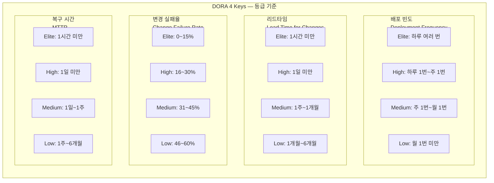
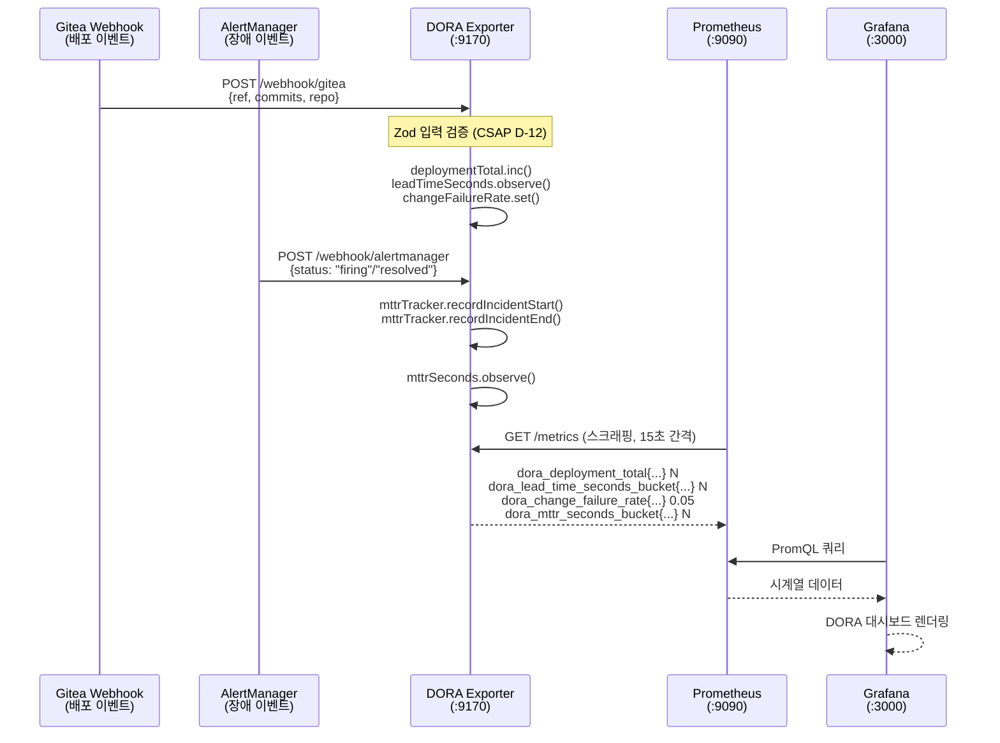
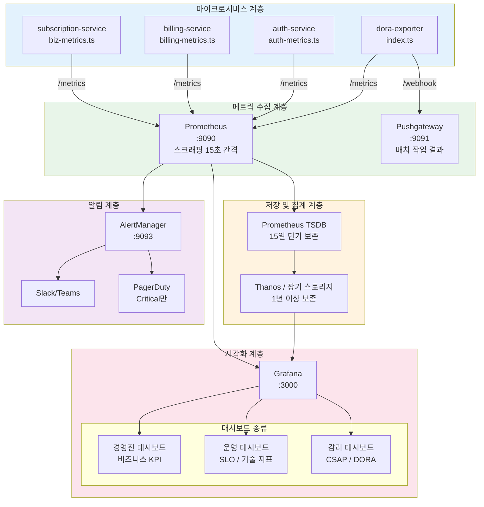
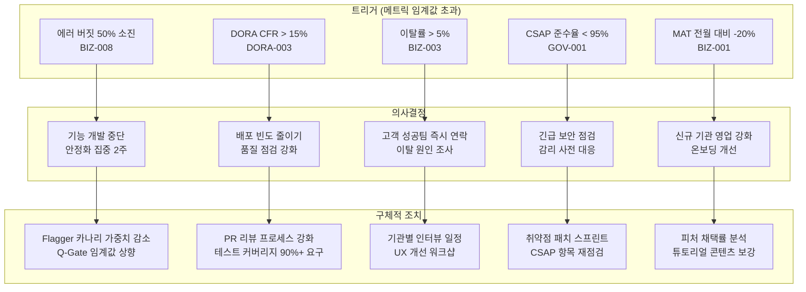

# 비즈니스 메트릭 카탈로그 — 공공기관 SaaS 핵심 지표 정의서

> **문서 ID**: ONBOARD-05-MON-04
> **버전**: 1.0.0 | **작성일**: 2026-04-12 | **대상**: 개발자, 서비스 기획자, 운영팀, 감리 대응 담당자
> **선행 학습**:
>   - `01-prometheus-basics.md` — Prometheus 기초 및 PromQL 이해
>   - `02-grafana-guide.md` — Grafana 대시보드 구성 방법
>   - `03-custom-metrics.md` — prom-client 커스텀 메트릭 추가 방법
> **소요 시간**: 약 120분
> **CSAP**: D-06 (침해사고 관리 — 감사 지표), D-12 (시스템 개발 보안 — 품질 측정)
> **Design Ref**: MTU-N251 §3, MTU-N169 §3.5
> **Plan SC**: FR-DORA.1~FR-DORA.5, FR-N251.1~FR-N251.9

---

## 목차

1. [비즈니스 메트릭이란 무엇인가](#1-비즈니스-메트릭이란-무엇인가)
2. [핵심 비즈니스 메트릭 카탈로그](#2-핵심-비즈니스-메트릭-카탈로그)
   - 2.1 [SaaS 핵심 지표 (12개)](#21-saas-핵심-지표-12개)
   - 2.2 [공공기관 특화 지표 (10개)](#22-공공기관-특화-지표-10개)
   - 2.3 [DORA 4 Keys (4개)](#23-dora-4-keys-4개)
   - 2.4 [AI 서비스 지표 (6개)](#24-ai-서비스-지표-6개)
3. [메트릭 수집 구현 (실제 코드 기반)](#3-메트릭-수집-구현-실제-코드-기반)
4. [Grafana 비즈니스 대시보드 구성](#4-grafana-비즈니스-대시보드-구성)
5. [메트릭 기반 의사결정](#5-메트릭-기반-의사결정)
6. [실습: 구독 서비스에 비즈니스 메트릭 추가하기](#6-실습-구독-서비스에-비즈니스-메트릭-추가하기)
7. [학습 체크리스트](#7-학습-체크리스트)

---

## 1. 비즈니스 메트릭이란 무엇인가

### 1.1 기술 메트릭 vs 비즈니스 메트릭 차이

대부분의 초급 개발자는 모니터링이라고 하면 CPU 사용률, 메모리 사용량, 응답 속도 같은 **기술 메트릭**을 떠올립니다.
이런 지표는 시스템이 건강하게 돌아가는지 알려주지만, 서비스가 가치를 창출하고 있는지는 알려주지 않습니다.

**비즈니스 메트릭(Business Metrics)**은 다릅니다.

| 구분 | 기술 메트릭 | 비즈니스 메트릭 |
|------|------------|----------------|
| 질문 | "서버가 살아있는가?" | "사용자가 가치를 얻고 있는가?" |
| 예시 | CPU 90%, P99 응답 2초 | 월간 활성 테넌트 42개, 구독 이탈률 2% |
| 수신자 | 운영/개발팀 | 경영진, 감리관, 서비스 기획자 |
| 목적 | 장애 탐지 및 성능 최적화 | 서비스 성장과 방향성 판단 |
| 알림 기준 | 임계값 초과 | 목표 대비 달성률 미달 |

```
핵심 통찰: 기술 메트릭이 모두 정상이어도 비즈니스 메트릭은 나빠질 수 있습니다.
예) CPU 10%, 응답 50ms — 그런데 이 달 구독 취소 40% 급증

비즈니스 메트릭 없이는 서비스가 죽어가는 것을 모를 수 있습니다.
```

### 1.2 공공기관 SaaS에서 비즈니스 메트릭의 의미

공공기관 SaaS 플랫폼은 민간 SaaS와 달리 다음과 같은 특수성을 가집니다.

**테넌트 = 공공기관**: 서울시, 국토부, 경기도 같은 기관들이 구독자입니다.
- 기관별 사용량 추적이 예산 배분과 직결됩니다.
- 기관의 시스템 이용률은 정보화 성과 지표로 활용됩니다.

**CSAP 인증 유지가 필수**: 보안 준수율이 계약 조건입니다.
- CSAP 점수 하락은 즉시 감리 이슈로 연결됩니다.
- 감사 로그 완비율이 법적 의무 지표입니다.

**감리 대응**: 연 1~2회 외부 감리 시 비즈니스 메트릭이 성과 증빙 자료가 됩니다.

### 1.3 감리 시 비즈니스 메트릭 활용 (성과 지표)

```
감리 질문                           → 비즈니스 메트릭으로 답변
"서비스 활용률은 얼마나 되는가?"    → Monthly Active Tenants, API 호출량
"보안 관리 수준은 적절한가?"         → CSAP Compliance Score, Audit Log Completeness
"성능 목표를 달성하고 있는가?"       → SLO 달성률, P99 응답시간
"배포 품질이 확보되었는가?"          → DORA 4 Keys (Deployment Frequency, CFR, MTTR)
```

이 문서에 정의된 30개 이상의 메트릭은 모두 감리 대응 자료로 직접 활용할 수 있습니다.

### 1.4 메트릭 계층 구조

아래 다이어그램은 원시 기술 데이터가 전략적 의사결정 지표로 변환되는 구조를 보여줍니다.

```mermaid
graph TB
    subgraph INFRA["인프라 계층 (원시 데이터)"]
        CPU[CPU / Memory / Disk]
        NET[Network I/O]
        DB[DB 쿼리 시간]
    end

    subgraph TECH["기술 메트릭 계층"]
        HTTP[HTTP 응답 시간\nhttp_request_duration_seconds]
        ERR[에러율\nhttp_requests_total{status=5xx}]
        AVAIL[가용성\nup{job=...}]
    end

    subgraph SLO["SLO 계층 (약속)"]
        SLO1[가용성 SLO\n99.9% = 월 43분 허용]
        SLO2[응답시간 SLO\nP99 < 500ms]
        BUDGET[에러 버짓\n현재 소진율]
    end

    subgraph BIZ["비즈니스 메트릭 계층"]
        MAT[월간 활성 테넌트\nMonthly Active Tenants]
        DORA[DORA 4 Keys\n배포 품질 지표]
        CSAP[CSAP 준수율\n보안 점수]
        CHURN[구독 이탈률\nChurn Rate]
    end

    subgraph STRATEGY["전략 계층 (경영진 의사결정)"]
        GROWTH[성장 지표\n기관 확보율]
        QUALITY[품질 성숙도\nDORA Elite 달성]
        COMPLIANCE[규제 준수\nCSAP 중/상 유지]
    end

    INFRA --> TECH
    TECH --> SLO
    SLO --> BIZ
    BIZ --> STRATEGY

    style INFRA fill:#f5f5f5
    style TECH fill:#e3f2fd
    style SLO fill:#e8f5e9
    style BIZ fill:#fff3e0
    style STRATEGY fill:#fce4ec
```

**계층별 주요 차이점**:
- **인프라/기술 계층**: 운영팀이 24시간 모니터링 (알림 즉시 대응)
- **SLO 계층**: 주간 리뷰 (에러 버짓 소진 속도 확인)
- **비즈니스 계층**: 월간 경영 보고 (CSAP 점검, 감리 대비)
- **전략 계층**: 분기 의사결정 (서비스 방향, 투자 우선순위)

---

## 2. 핵심 비즈니스 메트릭 카탈로그

> 이 카탈로그의 모든 메트릭은 실제 구현에서 수집되거나 구현 예정입니다.
> 각 메트릭에는 이름, PromQL, 기준값, 경보 임계값, Grafana 패널 설정이 포함됩니다.

### 2.1 SaaS 핵심 지표 (12개)

---

#### BIZ-001: Monthly Active Tenants (MAT)

**정의**: 최근 30일 이내에 API를 1회 이상 호출한 테넌트(기관) 수

**중요성**: 서비스 실질 사용자 기반을 나타내는 핵심 지표입니다. 계약 기관 수와 실제 활성 기관 수 차이가 크면 서비스 채택 문제를 의미합니다.

```yaml
# Prometheus 메트릭 정의
metric_name: saas_monthly_active_tenants
type: Gauge
labels:
  - plan_tier (starter / professional / enterprise)
  - region (central / local)
```

```promql
# PromQL: 현재 활성 테넌트 수
saas_monthly_active_tenants

# PromQL: 플랜 등급별 활성 테넌트
saas_monthly_active_tenants{plan_tier="enterprise"}

# PromQL: 전월 대비 증가율
(saas_monthly_active_tenants - saas_monthly_active_tenants offset 30d)
  / saas_monthly_active_tenants offset 30d * 100
```

| 항목 | 값 |
|------|-----|
| 기준값 (목표) | 50개 기관 이상 |
| 경고 임계값 | 40개 미만 |
| 위험 임계값 | 30개 미만 |
| 수집 주기 | 일 1회 집계 |
| Grafana 패널 | Stat + 월별 Bar Chart |

```yaml
# Grafana 패널 설정 (JSON Model)
panel:
  title: "월간 활성 테넌트 (MAT)"
  type: stat
  fieldConfig:
    defaults:
      thresholds:
        steps:
          - color: red
            value: 0
          - color: yellow
            value: 40
          - color: green
            value: 50
  options:
    reduceOptions:
      calcs: [lastNotNull]
    orientation: auto
    textMode: auto
    colorMode: background
```

---

#### BIZ-002: API Call Volume per Tenant

**정의**: 테넌트별 월간 API 호출 횟수

**중요성**: 테넌트의 서비스 활용 심도를 나타냅니다. 특정 기관의 호출량이 급격히 줄면 이탈 위험 신호입니다.

```yaml
# Prometheus 메트릭 정의
metric_name: saas_api_calls_total
type: Counter
labels:
  - tenant_id
  - service (auth / subscription / ai / billing)
  - method (GET / POST / PUT / DELETE)
  - status_code
```

```promql
# PromQL: 테넌트별 시간당 API 호출 수
rate(saas_api_calls_total[1h]) * 3600

# PromQL: 에러 없는 성공 호출 비율 (테넌트별)
rate(saas_api_calls_total{status_code=~"2.."}[5m])
  / rate(saas_api_calls_total[5m])

# PromQL: 상위 5개 테넌트 호출량
topk(5, sum by (tenant_id) (rate(saas_api_calls_total[24h])))
```

| 항목 | 값 |
|------|-----|
| 기준값 (활성 판단) | 월 100회 이상 |
| 경고 임계값 | 전월 대비 30% 이상 감소 |
| 위험 임계값 | 전월 대비 70% 이상 감소 (이탈 위험) |
| 수집 주기 | 실시간 (Counter) |
| Grafana 패널 | Time Series + Heatmap |

---

#### BIZ-003: Subscription Churn Rate (구독 이탈률)

**정의**: 당월 취소된 구독 수 / 전월 말 활성 구독 수 × 100 (%)

**중요성**: 공공기관 고객은 한 번 계약하면 장기 유지되는 특성이 있어, 이탈률 상승은 심각한 문제 신호입니다.

```yaml
# Prometheus 메트릭 정의
metric_name: saas_subscription_churn_rate
type: Gauge
labels:
  - plan_tier
  - cancel_reason (price / features / support / migration)
```

```promql
# PromQL: 현재 이탈률
saas_subscription_churn_rate

# PromQL: 3개월 이동 평균 이탈률
avg_over_time(saas_subscription_churn_rate[90d])
```

| 항목 | 값 |
|------|-----|
| 기준값 (건강한 수준) | 월 2% 이하 |
| 경고 임계값 | 5% 초과 |
| 위험 임계값 | 10% 초과 |
| 수집 주기 | 일 1회 |
| Grafana 패널 | Gauge + 추세선 |

---

#### BIZ-004: Feature Adoption Rate (피처 채택률)

**정의**: 피처 플래그가 활성화된 테넌트 중 실제로 해당 기능을 사용한 테넌트 비율

**중요성**: 새로운 기능을 배포해도 사용하지 않으면 의미가 없습니다. 피처 채택률은 기능 개발 우선순위 결정에 활용됩니다.

```yaml
# Prometheus 메트릭 정의
metric_name: saas_feature_adoption_rate
type: Gauge
labels:
  - feature_flag_key
  - plan_tier
```

```promql
# PromQL: AI 어시스턴트 피처 채택률
saas_feature_adoption_rate{feature_flag_key="ai-assistant"}

# PromQL: 전체 신규 피처 채택률 평균
avg(saas_feature_adoption_rate{feature_flag_key=~"new-.*"})
```

| 항목 | 값 |
|------|-----|
| 기준값 (성공 기준) | 출시 90일 후 30% 이상 |
| 경고 임계값 | 출시 90일 후 15% 미만 |
| 위험 임계값 | 출시 90일 후 5% 미만 (기능 재검토) |
| 수집 주기 | 일 1회 |
| Grafana 패널 | Bar Chart (피처별 비교) |

---

#### BIZ-005: Revenue per Tenant (테넌트당 수익)

**정의**: 활성 테넌트 1개당 월간 구독료 평균 (원)

```yaml
metric_name: saas_revenue_per_tenant_krw
type: Gauge
labels:
  - plan_tier
  - contract_type (annual / monthly)
```

```promql
# PromQL: 테넌트당 평균 수익
saas_revenue_per_tenant_krw

# PromQL: 플랜 등급별 평균
avg by (plan_tier) (saas_revenue_per_tenant_krw)
```

| 항목 | 값 |
|------|-----|
| 기준값 | 플랜별 정가 기준 |
| 경고 임계값 | 정가 대비 20% 이상 할인 적용 비율 30% 초과 |
| 수집 주기 | 월 1회 |

---

#### BIZ-006: Time to Value (TtV) — 온보딩 완료 시간

**정의**: 테넌트 계정 생성부터 첫 번째 핵심 기능 사용까지 소요된 시간 (시간 단위)

```yaml
metric_name: saas_time_to_value_hours
type: Histogram
labels:
  - plan_tier
  - onboarding_path (self / assisted)
buckets: [1, 4, 8, 24, 48, 72, 168, 336]
```

```promql
# PromQL: TtV 중앙값
histogram_quantile(0.50, rate(saas_time_to_value_hours_bucket[30d]))

# PromQL: TtV 90퍼센타일
histogram_quantile(0.90, rate(saas_time_to_value_hours_bucket[30d]))
```

| 항목 | 값 |
|------|-----|
| 기준값 | 48시간 이내 (P50 기준) |
| 경고 임계값 | P50 > 72시간 |
| 위험 임계값 | P50 > 168시간 (1주일) |

---

#### BIZ-007: Active Users per Tenant (테넌트별 활성 사용자)

**정의**: 테넌트 내에서 최근 30일 이내에 로그인한 사용자 수

```yaml
metric_name: saas_active_users_per_tenant
type: Gauge
labels:
  - tenant_id
  - user_role (admin / user / viewer)
```

```promql
# PromQL: 전체 활성 사용자 수
sum(saas_active_users_per_tenant)

# PromQL: 테넌트 평균 활성 사용자
avg(saas_active_users_per_tenant)

# PromQL: 테넌트별 활성 사용자 상위 10개
topk(10, saas_active_users_per_tenant)
```

---

#### BIZ-008: SLO Achievement Rate (SLO 달성률)

**정의**: 가용성 SLO(99.9%)를 달성한 날짜 비율 (월간)

```promql
# PromQL: 현재 월 SLO 달성률
(
  sum_over_time(up{job=~"saas-.*"}[30d]) /
  count_over_time(up{job=~"saas-.*"}[30d])
) * 100

# PromQL: 에러 버짓 소진률
1 - (
  sum_over_time(
    (1 - rate(http_requests_total{status_code=~"5.."}[5m]))[30d:5m]
  ) / (30 * 24 * 12)
)
```

| 항목 | 값 |
|------|-----|
| 기준값 | 99.9% (월 43분 다운타임 허용) |
| 경고 임계값 | 에러 버짓 50% 소진 |
| 위험 임계값 | 에러 버짓 80% 소진 (기능 개발 중단) |

---

#### BIZ-009: Support Ticket Volume (지원 요청량)

**정의**: 테넌트에서 제출한 지원 티켓 수 (월간)

```yaml
metric_name: saas_support_tickets_total
type: Counter
labels:
  - priority (critical / high / medium / low)
  - category (bug / feature / usage / billing)
  - resolved_status (open / in_progress / closed)
```

---

#### BIZ-010: Mean Time to Resolve Ticket (티켓 평균 해결 시간)

**정의**: 지원 티켓 제출부터 해결 완료까지 평균 시간 (시간)

```yaml
metric_name: saas_ticket_resolution_hours
type: Histogram
labels:
  - priority
  - category
buckets: [1, 4, 8, 24, 48, 72, 168]
```

| 우선순위 | 목표 해결 시간 |
|---------|------------|
| Critical | 4시간 이내 |
| High | 24시간 이내 |
| Medium | 72시간 이내 |
| Low | 168시간(7일) 이내 |

---

#### BIZ-011: Platform Uptime Score (플랫폼 가동률 점수)

**정의**: 월간 서비스 가동 시간 비율 (% — 네 자리 표시)

```promql
# PromQL: 30일 가동률
avg_over_time(up{job="saas-api-gateway"}[30d]) * 100
```

---

#### BIZ-012: Net Promoter Score Proxy (NPS 대리 지표)

**정의**: 기능 추천 여부를 판단하는 대리 지표 (재사용률 기반)

```promql
# PromQL: 자발적 고급 기능 사용률 (추천 의향 대리 지표)
sum(saas_feature_adoption_rate{feature_flag_key=~"advanced-.*"})
  / count(saas_feature_adoption_rate{feature_flag_key=~"advanced-.*"})
```

---

### 2.2 공공기관 특화 지표 (10개)

---

#### GOV-001: CSAP Compliance Score (CSAP 준수율)

**정의**: CSAP 79개 통제 항목 중 준수 항목 비율 (%)

**중요성**: CSAP 인증 유지는 공공기관 SaaS 계약의 전제 조건입니다. 준수율 하락은 즉시 계약 위기로 연결됩니다.

> CSAP 관련 항목: D-06 (침해사고 관리), D-08 (접근 통제), D-09 (암호화), D-12 (시스템 개발 보안)

```yaml
metric_name: csap_compliance_score_percent
type: Gauge
labels:
  - control_domain (D-01 through D-17)
  - grade_level (medium / high)
```

```promql
# PromQL: 전체 CSAP 준수율
csap_compliance_score_percent{control_domain="all"}

# PromQL: 도메인별 준수율
csap_compliance_score_percent

# PromQL: 준수율 80% 미만인 도메인 수
count(csap_compliance_score_percent < 80)
```

| 항목 | 값 |
|------|-----|
| 기준값 | 100% (인증 유지 필수) |
| 경고 임계값 | 95% 미만 |
| 위험 임계값 | 90% 미만 (재인증 위험) |
| 수집 주기 | 주 1회 자동 점검 |
| Grafana 패널 | Gauge (도메인별) + 레이더 차트 |

---

#### GOV-002: Audit Log Completeness Rate (감사 로그 완비율)

**정의**: 감사 로그가 필수 기록된 민감 작업 수 / 전체 민감 작업 수 × 100 (%)

**중요성**: CSAP D-06은 모든 민감 작업에 감사 로그 기록을 의무화합니다. 감사 로그 누락은 감리 결함입니다.

```yaml
metric_name: audit_log_completeness_rate_percent
type: Gauge
labels:
  - action_category (user_mgmt / data_access / config_change / deploy)
```

```promql
# PromQL: 전체 감사 로그 완비율
audit_log_completeness_rate_percent{action_category="all"}

# PromQL: 카테고리별 완비율
audit_log_completeness_rate_percent

# PromQL: 완비율 99% 미만인 카테고리
audit_log_completeness_rate_percent < 99
```

| 항목 | 값 |
|------|-----|
| 기준값 | 100% (CSAP D-06 절대 요건) |
| 경고 임계값 | 99% 미만 |
| 위험 임계값 | 95% 미만 (즉시 조사 필요) |
| 수집 주기 | 실시간 |

---

#### GOV-003: Security Incident Response Time (보안 사고 응답 시간)

**정의**: 보안 경보 발생부터 첫 대응 조치까지 소요 시간 (분)

```yaml
metric_name: security_incident_response_minutes
type: Histogram
labels:
  - severity (critical / high / medium)
  - incident_type (intrusion / data_leak / auth_failure / anomaly)
buckets: [5, 15, 30, 60, 120, 240, 480]
```

```promql
# PromQL: Critical 사고 응답 시간 중앙값
histogram_quantile(0.50,
  rate(security_incident_response_minutes_bucket{severity="critical"}[30d])
)

# PromQL: 4시간 이내 처리 비율
sum(rate(security_incident_response_minutes_bucket{le="240"}[30d]))
  / sum(rate(security_incident_response_minutes_count[30d]))
```

| 심각도 | 목표 응답 시간 | CSAP 요건 |
|--------|------------|---------|
| Critical | 15분 이내 | D-06 즉시 대응 |
| High | 1시간 이내 | D-06 당일 처리 |
| Medium | 4시간 이내 | D-06 72시간 이내 |

---

#### GOV-004: Data Classification Accuracy (N2SF 데이터 분류 정확도)

**정의**: N2SF 기준으로 올바르게 분류된 데이터 항목 비율 (%)

**중요성**: 잘못 분류된 데이터(예: C등급 → O등급으로 오분류)가 AI API로 전송되면 보안 사고가 됩니다.

```yaml
metric_name: n2sf_classification_accuracy_percent
type: Gauge
labels:
  - data_type (personal / sensitive / public)
  - classification_method (auto / manual)
```

```promql
# PromQL: 자동 분류 정확도
n2sf_classification_accuracy_percent{classification_method="auto"}

# PromQL: 수동 재분류 발생률
rate(n2sf_reclassification_total[24h])
```

| 항목 | 값 |
|------|-----|
| 기준값 | 99% 이상 |
| 경고 임계값 | 95% 미만 |
| 위험 임계값 | 90% 미만 (AI API 전송 차단 활성화) |

---

#### GOV-005: Privileged Access Events (특권 접근 이벤트)

**정의**: 관리자 권한으로 수행된 작업 수 (CSAP D-08 모니터링)

```yaml
metric_name: privileged_access_events_total
type: Counter
labels:
  - actor_role (super_admin / tenant_admin / system)
  - action (user_create / user_delete / config_change / data_export)
  - result (success / failure)
```

```promql
# PromQL: 시간당 특권 접근 이벤트
rate(privileged_access_events_total[1h]) * 3600

# PromQL: 실패한 특권 접근 (보안 이상 탐지)
rate(privileged_access_events_total{result="failure"}[5m]) > 5
```

---

#### GOV-006: Data Retention Compliance Rate (데이터 보존 준수율)

**정의**: 법정 보존 기간을 준수하여 관리되는 데이터 항목 비율 (%)

```yaml
metric_name: data_retention_compliance_rate_percent
type: Gauge
labels:
  - data_type (audit_log / user_data / transaction)
  - retention_policy (1y / 3y / 5y / permanent)
```

| 항목 | 값 |
|------|-----|
| 기준값 | 100% (법적 의무) |
| 위험 임계값 | 95% 미만 (법적 위반 위험) |

---

#### GOV-007: Vulnerability Remediation Time (취약점 조치 시간)

**정의**: 취약점 발견부터 패치 적용까지 소요 시간 (일)

```yaml
metric_name: vulnerability_remediation_days
type: Histogram
labels:
  - severity (critical / high / medium / low)
  - component (os / library / application)
buckets: [1, 3, 7, 14, 30, 60, 90]
```

| 심각도 | CSAP 요건 | 목표 조치 기한 |
|--------|---------|------------|
| Critical | D-12 | 24시간 이내 |
| High | D-12 | 7일 이내 |
| Medium | D-12 | 30일 이내 |
| Low | D-12 | 90일 이내 |

---

#### GOV-008: Backup Success Rate (백업 성공률)

**정의**: 예약된 백업 작업 중 성공한 비율 (%)

```yaml
metric_name: backup_success_rate_percent
type: Gauge
labels:
  - backup_type (full / incremental / snapshot)
  - target (database / filestore / config)
```

| 항목 | 값 |
|------|-----|
| 기준값 | 100% |
| 경고 임계값 | 98% 미만 |
| 위험 임계값 | 90% 미만 (즉시 복구 계획 실행) |

---

#### GOV-009: Patch Compliance Rate (패치 준수율)

**정의**: 최신 보안 패치가 적용된 컴포넌트 비율 (%)

```promql
# PromQL: 패치 미적용 컴포넌트 수
count(component_patch_status{status="outdated"})

# PromQL: 전체 패치 준수율
sum(component_patch_status{status="current"})
  / count(component_patch_status) * 100
```

---

#### GOV-010: Access Control Violation Rate (접근 통제 위반율)

**정의**: 인증 실패 중 비정상 패턴(무차별 대입 의심) 비율 (%)

```promql
# PromQL: 동일 IP에서 분당 5회 이상 실패
count by (client_ip) (
  increase(auth_failures_total[1m])
) > 5
```

---

### 2.3 DORA 4 Keys (4개)

DORA(DevOps Research and Assessment) 4대 지표는 소프트웨어 개발팀의 성숙도를 측정하는 업계 표준입니다.
이 프로젝트는 `packages/dora-exporter/`에서 실제로 이 메트릭들을 수집합니다.



---

#### DORA-001: Deployment Frequency (배포 빈도)

**Prometheus 메트릭** (실제 코드 기반):
```typescript
// packages/dora-exporter/src/index.ts — 실제 구현
const deploymentTotal = new Counter({
  name: 'dora_deployment_total',
  help: '배포 횟수 (DORA Deployment Frequency)',
  labelNames: ['team', 'service', 'environment'] as const,
  registers: [register],
});
```

```promql
# PromQL: 주간 배포 빈도 (서비스별)
increase(dora_deployment_total{environment="production"}[7d])

# PromQL: 일평균 배포 빈도
rate(dora_deployment_total{environment="production"}[30d]) * 86400

# PromQL: DORA 등급 판정 (일평균)
# Elite: > 1/일, High: > 1/주, Medium: > 1/월, Low: 나머지
rate(dora_deployment_total{environment="production"}[30d]) * 86400 > 1
```

| DORA 등급 | 배포 빈도 | 우리 목표 |
|---------|---------|---------|
| Elite | 하루 여러 번 | 달성 목표 |
| High | 하루 1번 ~ 주 1번 | 현재 목표 |
| Medium | 주 1번 ~ 월 1번 | 최소 기준 |
| Low | 월 1번 미만 | 개선 필요 |

---

#### DORA-002: Lead Time for Changes (변경 리드타임)

**Prometheus 메트릭** (실제 코드 기반):
```typescript
// packages/dora-exporter/src/index.ts — 실제 구현
const leadTimeSeconds = new Histogram({
  name: 'dora_lead_time_seconds',
  help: '변경 리드타임 - 첫 커밋에서 프로덕션 배포까지 (초)',
  labelNames: ['team', 'service'] as const,
  // 1분, 5분, 15분, 30분, 1시간, 2시간, 4시간, 8시간, 1일, 1주
  buckets: [60, 300, 900, 1800, 3600, 7200, 14400, 28800, 86400, 604800],
  registers: [register],
});
```

```promql
# PromQL: 리드타임 중앙값 (초)
histogram_quantile(0.50, rate(dora_lead_time_seconds_bucket[30d]))

# PromQL: 리드타임 중앙값 (시간으로 변환)
histogram_quantile(0.50, rate(dora_lead_time_seconds_bucket[30d])) / 3600

# PromQL: 1일 이내 완료 비율
sum(rate(dora_lead_time_seconds_bucket{le="86400"}[30d]))
  / sum(rate(dora_lead_time_seconds_count[30d])) * 100
```

| DORA 등급 | 리드타임 중앙값 |
|---------|------------|
| Elite | 1시간 미만 |
| High | 1일 미만 |
| Medium | 1주일 ~ 1개월 |
| Low | 1개월 이상 |

---

#### DORA-003: Change Failure Rate (변경 실패율)

**Prometheus 메트릭** (실제 코드 기반):
```typescript
// packages/dora-exporter/src/index.ts — 실제 구현
const changeFailureRate = new Gauge({
  name: 'dora_change_failure_rate',
  help: '변경 실패율 (0.0 ~ 1.0)',
  labelNames: ['team', 'service'] as const,
  registers: [register],
});
```

```promql
# PromQL: 현재 변경 실패율 (%)
dora_change_failure_rate * 100

# PromQL: 전체 서비스 평균 변경 실패율
avg(dora_change_failure_rate) * 100

# PromQL: DORA 게이트 차단 조건 (30% 초과)
dora_change_failure_rate * 100 > 30
```

**중요**: 이 메트릭이 30%를 초과하면 `dora-gate.yml` 워크플로우가 배포를 자동 차단합니다.
- 30% 초과: 배포 차단 (DORA Low)
- 15~30%: 경고 + 수동 승인 요구
- 15% 미만: 정상 배포 허용

---

#### DORA-004: Mean Time to Recovery (평균 복구 시간, MTTR)

**Prometheus 메트릭** (실제 코드 기반):
```typescript
// packages/dora-exporter/src/index.ts — 실제 구현
const mttrSeconds = new Histogram({
  name: 'dora_mttr_seconds',
  help: '서비스 복구 시간 (초)',
  labelNames: ['team', 'service', 'severity'] as const,
  // 1분, 5분, 15분, 30분, 1시간, 2시간, 4시간, 8시간, 1일
  buckets: [60, 300, 900, 1800, 3600, 7200, 14400, 28800, 86400],
  registers: [register],
});
```

```promql
# PromQL: MTTR 중앙값 (분)
histogram_quantile(0.50, rate(dora_mttr_seconds_bucket[30d])) / 60

# PromQL: MTTR 90퍼센타일 (시간)
histogram_quantile(0.90, rate(dora_mttr_seconds_bucket[30d])) / 3600

# PromQL: 1시간 이내 복구 비율 (Elite 기준)
sum(rate(dora_mttr_seconds_bucket{le="3600"}[30d]))
  / sum(rate(dora_mttr_seconds_count[30d])) * 100
```

| DORA 등급 | MTTR |
|---------|------|
| Elite | 1시간 미만 |
| High | 1일 미만 |
| Medium | 1일 ~ 1주일 |
| Low | 1주일 이상 |

---

### 2.4 AI 서비스 지표 (6개)

> N2SF 보안 요건 적용: O등급 데이터만 AI API 전송 가능. C/S등급 전송 시도는 차단 및 기록됩니다.

---

#### AI-001: AI Token Usage per Tenant (테넌트별 AI 토큰 사용량)

```yaml
metric_name: ai_token_usage_total
type: Counter
labels:
  - tenant_id
  - model (claude-sonnet / claude-haiku / claude-opus)
  - usage_type (input / output)
```

```promql
# PromQL: 일간 토큰 사용량 (테넌트별)
increase(ai_token_usage_total[24h])

# PromQL: 토큰 비용 추정 (상위 5개 테넌트)
topk(5, sum by (tenant_id) (increase(ai_token_usage_total[30d])))
```

| 항목 | 값 |
|------|-----|
| 기준값 | 플랜별 토큰 한도 이내 |
| 경고 임계값 | 월간 한도의 80% 소진 |
| 위험 임계값 | 월간 한도의 95% 소진 (throttle 적용) |

---

#### AI-002: AI API Success Rate (AI API 성공률)

```yaml
metric_name: ai_request_total
type: Counter
labels:
  - model
  - status (success / failure / timeout / rate_limited)
  - data_grade (O)  # C/S 등급은 전송 자체 차단
```

```promql
# PromQL: AI API 성공률
rate(ai_request_total{status="success"}[5m])
  / rate(ai_request_total[5m]) * 100

# PromQL: 데이터 등급 위반 시도 (보안 감시)
rate(ai_blocked_requests_total{reason="grade_violation"}[1h])
```

---

#### AI-003: AI Response Latency (AI 응답 지연시간)

```yaml
metric_name: ai_response_seconds
type: Histogram
labels:
  - model
  - request_type (chat / rag / analysis)
buckets: [0.5, 1, 2, 5, 10, 30, 60]
```

```promql
# PromQL: AI 응답시간 P50 (초)
histogram_quantile(0.50, rate(ai_response_seconds_bucket[5m]))

# PromQL: AI 응답시간 P99 (초)
histogram_quantile(0.99, rate(ai_response_seconds_bucket[5m]))
```

---

#### AI-004: RAG Knowledge Base Coverage (RAG 지식 베이스 커버리지)

```yaml
metric_name: rag_document_coverage_percent
type: Gauge
labels:
  - tenant_id
  - document_type (policy / manual / faq)
```

---

#### AI-005: AI Data Grade Violation Attempts (AI 데이터 등급 위반 시도)

```yaml
# N2SF 보안 준수 핵심 지표
metric_name: ai_blocked_requests_total
type: Counter
labels:
  - blocked_reason (grade_violation / pii_detected / content_policy)
  - attempted_grade (C / S)  # 차단된 데이터의 등급
```

```promql
# PromQL: 시간당 차단된 요청 수
rate(ai_blocked_requests_total[1h]) * 3600

# PromQL: 차단 사유별 분포
sum by (blocked_reason) (increase(ai_blocked_requests_total[24h]))
```

**알림 설정**: 이 메트릭이 1건이라도 발생하면 즉시 보안팀 알림 (N2SF 위반 의심)

---

#### AI-006: AI Gateway Throughput (AI 게이트웨이 처리량)

```yaml
metric_name: ai_gateway_requests_per_second
type: Gauge
labels:
  - gateway_instance
  - model
```

---

## 3. 메트릭 수집 구현 (실제 코드 기반)

### 3.1 dora-exporter 아키텍처 분석

`packages/dora-exporter/src/index.ts`는 DORA 4대 지표를 수집하는 핵심 컴포넌트입니다.
실제 코드 구조를 따라 메트릭 수집이 어떻게 동작하는지 이해해 봅시다.



### 3.2 비즈니스 메트릭 구현 패턴 (subscription-service 기반)

아래 코드는 `subscription-service`에 비즈니스 메트릭을 추가하는 표준 패턴입니다.
실제 구독 통계 핸들러(`platform/services/subscription-service/src/handlers/subscription-stats.handler.ts`)를 확장합니다.

```typescript
// platform/services/subscription-service/src/lib/business-metrics.ts
// Design Ref: §2.1 비즈니스 메트릭 카탈로그
// Plan SC: BIZ-001, BIZ-002, BIZ-003
// CSAP: D-12 (메트릭 수집 — 민감 정보 라벨 금지)

import { Registry, Counter, Gauge, Histogram } from 'prom-client';

// 전용 레지스트리 (기술 메트릭과 분리)
export const bizRegistry = new Registry();

// BIZ-001: 월간 활성 테넌트
export const monthlyActiveTenants = new Gauge({
  name: 'saas_monthly_active_tenants',
  help: '최근 30일 이내 API를 1회 이상 호출한 테넌트 수',
  labelNames: ['plan_tier'] as const,
  registers: [bizRegistry],
});

// BIZ-002: API 호출량
export const apiCallsTotal = new Counter({
  name: 'saas_api_calls_total',
  help: '테넌트별 API 호출 횟수',
  // 주의: tenant_id는 카디널리티가 높아질 수 있음
  // 테넌트 수가 100개 미만이면 라벨 사용 가능
  // 초과 시 별도 집계 레이어 필요
  labelNames: ['service', 'method', 'status_code'] as const,
  registers: [bizRegistry],
});

// BIZ-003: 구독 이탈률 (일간 집계)
export const subscriptionChurnRate = new Gauge({
  name: 'saas_subscription_churn_rate',
  help: '당월 구독 취소 수 / 전월 활성 구독 수 (0.0 ~ 1.0)',
  labelNames: ['plan_tier'] as const,
  registers: [bizRegistry],
});

// GOV-002: 감사 로그 완비율
export const auditLogCompletenessRate = new Gauge({
  name: 'audit_log_completeness_rate_percent',
  help: '감사 로그가 기록된 민감 작업 비율 (%)',
  labelNames: ['action_category'] as const,
  registers: [bizRegistry],
});
```

```typescript
// platform/services/subscription-service/src/lib/metrics-collector.ts
// Design Ref: §3.2 — 비즈니스 메트릭 수집기
// CSAP: D-12 입력 검증, D-06 민감 데이터 미포함

import { prisma } from './prisma.js';
import {
  monthlyActiveTenants,
  subscriptionChurnRate,
} from './business-metrics.js';

/**
 * 월간 활성 테넌트 메트릭 업데이트
 * 스케줄러에 의해 매일 00:00 실행
 */
export async function updateMonthlyActiveTenantsMetric(): Promise<void> {
  const thirtyDaysAgo = new Date();
  thirtyDaysAgo.setDate(thirtyDaysAgo.getDate() - 30);

  // CSAP D-12: 매개변수화 쿼리 사용 (직접 문자열 결합 금지)
  const activeByPlan = await prisma.subscription.groupBy({
    by: ['planId'],
    where: {
      status: 'ACTIVE',
      updatedAt: { gte: thirtyDaysAgo },
    },
    _count: { tenantId: true },
  });

  // 플랜별로 게이지 설정
  for (const group of activeByPlan) {
    const plan = await prisma.plan.findUnique({
      where: { id: group.planId },
      select: { slug: true },
    });

    if (plan) {
      monthlyActiveTenants.set(
        { plan_tier: plan.slug },
        group._count.tenantId
      );
    }
  }
}

/**
 * 구독 이탈률 메트릭 업데이트
 * 스케줄러에 의해 매일 00:00 실행
 */
export async function updateChurnRateMetric(): Promise<void> {
  const now = new Date();
  const firstOfThisMonth = new Date(now.getFullYear(), now.getMonth(), 1);
  const firstOfLastMonth = new Date(now.getFullYear(), now.getMonth() - 1, 1);

  // 전월 말 활성 구독 수
  const prevMonthActive = await prisma.subscription.count({
    where: {
      status: 'ACTIVE',
      createdAt: { lt: firstOfThisMonth },
    },
  });

  // 당월 취소된 구독 수
  const thisMonthCancelled = await prisma.subscription.count({
    where: {
      status: 'CANCELLED',
      updatedAt: { gte: firstOfThisMonth },
    },
  });

  const churnRate = prevMonthActive > 0
    ? thisMonthCancelled / prevMonthActive
    : 0;

  subscriptionChurnRate.set({}, churnRate);
}
```

### 3.3 메트릭 수집 아키텍처



### 3.4 prom-client 메트릭 타입 선택 가이드

| 상황 | 사용할 타입 | 이유 |
|------|-----------|------|
| 누적 이벤트 수 (API 호출, 배포 횟수) | Counter | 값이 항상 증가 |
| 현재 상태값 (활성 테넌트, 준수율) | Gauge | 올라가고 내려감 |
| 분포/지연시간 측정 | Histogram | 백분위수 계산 필요 |
| 집계 결과 (중앙값, 평균) | Summary | 직접 백분위수 계산 |

---

## 4. Grafana 비즈니스 대시보드 구성

### 4.1 경영진용 대시보드 패널 목록

경영진 대시보드는 기술 세부 사항 없이 서비스의 건강 상태와 성장을 한눈에 보여줍니다.

```
대시보드 ID: business-executive-overview
새로고침 주기: 1시간
기간 범위: 최근 30일 기본값
```

| 행 | 패널명 | 메트릭 | 패널 타입 |
|----|-------|-------|---------|
| 1 | 월간 활성 테넌트 (MAT) | BIZ-001 | Stat (배경색) |
| 1 | 구독 이탈률 | BIZ-003 | Stat (역색 — 낮을수록 좋음) |
| 1 | SLO 달성률 | BIZ-008 | Stat |
| 1 | CSAP 준수율 | GOV-001 | Stat |
| 2 | 월간 활성 테넌트 추이 | BIZ-001 | Time Series (6개월) |
| 2 | 구독 상태 분포 | 구독 통계 | Pie Chart |
| 3 | DORA 4 Keys 요약 | DORA-001~004 | Table |
| 3 | 플랜별 테넌트 분포 | BIZ-001 | Bar Chart |
| 4 | AI 토큰 사용량 추이 | AI-001 | Time Series |
| 4 | 보안 사고 응답 시간 | GOV-003 | Gauge |

### 4.2 운영팀용 대시보드 패널 목록

```
대시보드 ID: business-operations
새로고침 주기: 5분
기간 범위: 최근 24시간 기본값
```

| 행 | 패널명 | 메트릭 | 패널 타입 |
|----|-------|-------|---------|
| 1 | API 호출량 (실시간) | BIZ-002 | Stat + Sparkline |
| 1 | 에러율 | http_requests_total | Stat |
| 1 | 에러 버짓 소진율 | BIZ-008 | Gauge |
| 2 | 테넌트별 API 호출 히트맵 | BIZ-002 | Heatmap |
| 2 | 상위 10개 테넌트 호출량 | BIZ-002 | Bar Chart |
| 3 | 감사 로그 완비율 | GOV-002 | Gauge |
| 3 | 특권 접근 이벤트 | GOV-005 | Time Series |
| 4 | AI 요청 성공률 | AI-002 | Stat |
| 4 | AI 응답 지연시간 P50/P99 | AI-003 | Time Series |
| 4 | AI 데이터 위반 시도 | AI-005 | Alert List |

### 4.3 감리 대비 대시보드 레이아웃

감리 시 가장 많이 요청되는 지표를 한 화면에 모은 전용 대시보드입니다.

```
대시보드 ID: csap-audit-readiness
새로고침 주기: 1시간
기간 범위: 최근 90일 기본값
```

```
┌─────────────────┬─────────────────┬─────────────────┬─────────────────┐
│   CSAP 준수율   │  감사 로그 완비  │  취약점 조치율  │   백업 성공률   │
│   GOV-001       │  GOV-002        │  GOV-007        │  GOV-008        │
│   100%  [OK]    │  99.8%  [OK]    │  96.4%  [WARN]  │  100%   [OK]    │
├─────────────────┴─────────────────┼─────────────────┴─────────────────┤
│     DORA 4 Keys 종합 등급          │        CSAP 도메인별 준수율        │
│     (Elite/High/Medium/Low)        │        (D-01 ~ D-17 레이더 차트)   │
│     현재: High                     │                                   │
├───────────────────────────────────┼───────────────────────────────────┤
│     보안 사고 이력 (90일)          │        패치 미적용 컴포넌트       │
│     (Time Series — 심각도별)       │        (Table — 서비스/버전/기한) │
└───────────────────────────────────┴───────────────────────────────────┘
```

### 4.4 Grafana 알림 규칙 예시

```yaml
# Grafana Alert Rule — 비즈니스 메트릭 알림
groups:
  - name: business-metrics-alerts
    interval: 5m
    rules:
      # CSAP 준수율 하락 (GOV-001)
      - alert: CSAPComplianceScoreLow
        expr: csap_compliance_score_percent{control_domain="all"} < 95
        for: 0m
        labels:
          severity: critical
          csap_ref: D-06
        annotations:
          summary: "CSAP 준수율 {{ $value }}% — 즉시 조사 필요"
          runbook: "https://wiki/runbooks/csap-compliance"

      # 구독 이탈률 급등 (BIZ-003)
      - alert: SubscriptionChurnRateHigh
        expr: saas_subscription_churn_rate > 0.05
        for: 24h
        labels:
          severity: warning
        annotations:
          summary: "구독 이탈률 {{ $value | humanizePercentage }} 경고"

      # AI 데이터 등급 위반 시도 (AI-005)
      - alert: AIDataGradeViolationAttempt
        expr: increase(ai_blocked_requests_total{blocked_reason="grade_violation"}[1h]) > 0
        for: 0m
        labels:
          severity: critical
          csap_ref: N2SF-N05
        annotations:
          summary: "N2SF 위반: C/S등급 데이터 AI API 전송 시도 탐지"

      # DORA 변경 실패율 임계값 (DORA-003)
      - alert: DORAChangeFailureRateHigh
        expr: dora_change_failure_rate * 100 > 15
        for: 0m
        labels:
          severity: warning
        annotations:
          summary: "변경 실패율 {{ $value }}% — DORA 게이트 차단 임박"
```

---

## 5. 메트릭 기반 의사결정

### 5.1 어떤 메트릭이 어떤 결정을 이끄는가



### 5.2 SLO 에러 버짓 → 기능 개발 vs 안정화 결정

에러 버짓(Error Budget)은 SLO를 유지하면서 허용되는 실패의 양입니다.
버짓이 소진되면 기능 개발을 멈추고 안정화에 집중해야 합니다.

```
에러 버짓 소진율       의사결정
0% ~ 50%         → 정상: 기능 개발 계속 진행
50% ~ 80%        → 주의: 고위험 배포 자제, 테스트 강화
80% ~ 100%       → 경고: 버그 수정만 허용, 기능 개발 중단
100% 이상        → 긴급: 즉시 안정화 작업, 배포 동결
```

```promql
# PromQL: 30일 에러 버짓 소진률 (%)
(
  1 - (
    sum_over_time(
      (rate(http_requests_total{status_code!~"5.."}[5m])
      / rate(http_requests_total[5m]))[30d:5m]
    ) / (30 * 24 * 12)
  )
) / 0.001 * 100
# 설명: SLO 99.9% = 허용 에러율 0.1% = 에러 버짓 0.001
```

### 5.3 DORA 메트릭 → 팀 성숙도 평가

```
DORA 등급별 개선 전략

Low (배포 빈도 < 월 1회)
  → 모노레포 구조 점검, Turbo 캐시 최적화
  → CI 파이프라인 단계 병렬화
  → 피처 플래그 도입으로 배포 크기 감소

Medium (배포 빈도 주 1회)
  → Q-Gate 자동화 강화
  → 테스트 커버리지 80% → 90%로 상향
  → 카나리 배포로 배포 위험 감소

High (배포 빈도 일 1회)
  → 자동 롤백 메커니즘 완성
  → DORA 게이트 임계값 강화 (CFR < 10%)
  → 옵저버빌리티 성숙도 향상

Elite (배포 빈도 하루 여러 번)
  → 이 프로젝트의 최종 목표 상태
  → 완전 자동화 CI/CD → GitOps
```

### 5.4 CSAP 점수 → 감리 준비 판단

```
CSAP 준수율       감리 준비 상태
100%            → 감리 즉시 대응 가능 (그린)
95% ~ 99%       → 소수 항목 보완 필요 (옐로우)
90% ~ 94%       → 감리 전 집중 점검 필요 (오렌지)
90% 미만        → 감리 연기 검토, 긴급 조치 필요 (레드)
```

---

## 6. 실습: 구독 서비스에 비즈니스 메트릭 추가하기

이 실습을 마치면 구독 통계 핸들러에 실제 Prometheus 메트릭을 추가할 수 있습니다.

### 실습 목표
- `saas_subscription_stats_total` 메트릭을 구독 서비스에 추가
- `/metrics` 엔드포인트에서 확인
- PromQL로 쿼리하여 Grafana에서 시각화

### 단계 1: 메트릭 정의 파일 생성

```typescript
// platform/services/subscription-service/src/lib/subscription-metrics.ts

import { Registry, Gauge, Counter } from 'prom-client';

export const subscriptionRegistry = new Registry();

// 구독 상태별 현재 수
export const subscriptionStatusGauge = new Gauge({
  name: 'saas_subscriptions_by_status',
  help: '구독 상태별 현재 수량',
  labelNames: ['status', 'plan_tier'] as const,
  registers: [subscriptionRegistry],
});

// 구독 이벤트 카운터
export const subscriptionEventCounter = new Counter({
  name: 'saas_subscription_events_total',
  help: '구독 관련 이벤트 발생 횟수',
  labelNames: ['event_type', 'plan_tier'] as const,
  // event_type: created / upgraded / downgraded / cancelled / renewed
  registers: [subscriptionRegistry],
});
```

### 단계 2: 핸들러에서 메트릭 업데이트

```typescript
// platform/services/subscription-service/src/handlers/subscription-stats.handler.ts
// (기존 코드에 메트릭 업데이트 추가)

import { subscriptionStatusGauge } from '../lib/subscription-metrics.js';

export async function subscriptionStatsHandler(
  request: FastifyRequest,
  reply: FastifyReply,
): Promise<void> {
  // ... 기존 코드 ...

  // 메트릭 업데이트 (비동기 처리 — 응답 지연 없음)
  setImmediate(async () => {
    for (const statusEntry of statusDistribution) {
      subscriptionStatusGauge.set(
        { status: statusEntry.status, plan_tier: 'all' },
        statusEntry.count
      );
    }
  });

  await reply.send({ success: true, data: { /* ... */ } });
}
```

### 단계 3: /metrics 엔드포인트에 레지스트리 병합

```typescript
// platform/services/subscription-service/src/routes.ts (수정)

import { subscriptionRegistry } from './lib/subscription-metrics.js';
import { Registry } from 'prom-client';

const mergedRegistry = Registry.merge([
  defaultRegistry,
  subscriptionRegistry,
]);

app.get('/metrics', async (_request, reply) => {
  reply.header('Content-Type', mergedRegistry.contentType);
  return reply.send(await mergedRegistry.metrics());
});
```

### 단계 4: 확인

```bash
# 로컬에서 메트릭 확인
curl http://localhost:3006/metrics | grep saas_subscriptions

# 예상 출력
# HELP saas_subscriptions_by_status 구독 상태별 현재 수량
# TYPE saas_subscriptions_by_status gauge
saas_subscriptions_by_status{status="ACTIVE",plan_tier="all"} 42
saas_subscriptions_by_status{status="CANCELLED",plan_tier="all"} 5
saas_subscriptions_by_status{status="TRIAL",plan_tier="all"} 8
```

### 단계 5: PromQL 쿼리로 검증

```promql
# Prometheus UI (http://prometheus.monitoring.svc:9090)에서 실행

# 활성 구독 수
saas_subscriptions_by_status{status="ACTIVE"}

# 전체 구독 대비 활성 비율
saas_subscriptions_by_status{status="ACTIVE"}
  / sum(saas_subscriptions_by_status)
```

---

## 7. 학습 체크리스트

이 문서를 완료한 후 다음 항목을 직접 확인하십시오.

- [ ] 비즈니스 메트릭과 기술 메트릭의 차이를 동료에게 설명할 수 있다
- [ ] DORA 4 Keys 각각의 의미와 PromQL을 암기하지 않고도 찾아볼 수 있다
- [ ] `packages/dora-exporter/src/index.ts`에서 `dora_deployment_total`이 어디서 증가하는지 설명할 수 있다
- [ ] CSAP 준수율이 95% 미만으로 떨어지면 어떤 조치를 해야 하는지 안다
- [ ] Grafana에서 `saas_monthly_active_tenants` 메트릭으로 패널을 만들 수 있다
- [ ] 실습: `subscription-service`에 새 메트릭을 추가하고 `/metrics`에서 확인했다
- [ ] AI 데이터 등급 위반 알림이 발생하면 즉시 보안팀에 에스컬레이션해야 하는 이유를 안다

---

## 변경 이력

| 버전 | 일자 | 내용 | 작성자 |
|------|------|------|-------|
| 1.0.0 | 2026-04-12 | 최초 작성 — 30개 이상 비즈니스 메트릭 카탈로그 완성 | 온보딩팀 |
