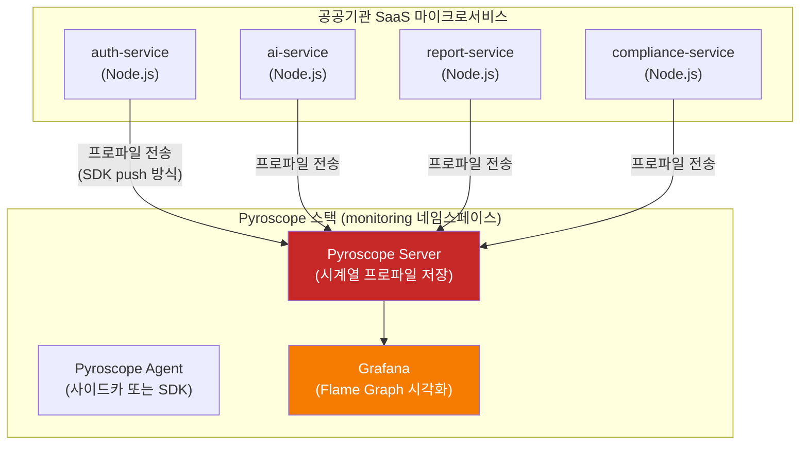
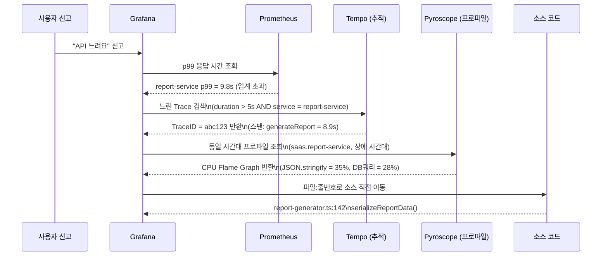

# 지속적 프로파일링 — Pyroscope 완전 입문

> **버전**: 1.0.0 | **작성일**: 2026-04-12
> **대상**: 성능 최적화에 관심 있는 개발자, SRE
> **CSAP**: D-06 (침해사고 관리), D-10 (성능 모니터링)
> **관련 문서**: `05-monitoring/README.md`, `tracing/01-tempo-otel.md`, `platform/packages/observability/src/telemetry.ts`

---

## 목차

1. [지속적 프로파일링이란](#1-지속적-프로파일링이란)
2. [Pyroscope 소개](#2-pyroscope-소개)
3. [이 프로젝트에서 Pyroscope 설정 방법](#3-이-프로젝트에서-pyroscope-설정-방법)
4. [Flame Graph 읽는 법](#4-flame-graph-읽는-법)
5. [Node.js CPU 프로파일 해석](#5-nodejs-cpu-프로파일-해석)
6. [메모리 누수 탐지 방법](#6-메모리-누수-탐지-방법)
7. [Grafana Pyroscope 대시보드](#7-grafana-pyroscope-대시보드)
8. [느린 API 호출 → Tempo → Pyroscope 연결 워크플로우](#8-느린-api-호출--tempo--pyroscope-연결-워크플로우)
9. [자주 발생하는 문제와 해결법](#9-자주-발생하는-문제와-해결법)

---

## 1. 지속적 프로파일링이란

### 1.1 성능 병목을 찾는 기존 방법의 한계

신입 개발자가 흔히 경험하는 상황입니다.

```
상황:
  사용자: "API가 느려요. 보고서 생성에 10초 걸립니다."
  개발자: Grafana 확인 → p99 응답 시간 = 10.2초 (이상 없음, 데이터 확인됨)
  개발자: Loki 로그 확인 → 에러 없음
  개발자: Tempo 추적 확인 → report-service 스팬 9.8초
  개발자: ???

문제: 스팬 내부에서 "어떤 코드"가 9.8초를 쓰는지 알 수 없음
```

메트릭, 로그, 추적은 모두 "얼마나" 걸렸는지는 알려 주지만, "어떤 코드가 어느 함수 호출에서 CPU를 소비했는지"까지는 알려 주지 못합니다.

이 공백을 채우는 것이 **프로파일링(Profiling)**입니다.

### 1.2 프로파일링 vs 스냅샷 프로파일링

전통적인 성능 분석은 **스냅샷 방식**을 사용합니다.

```
스냅샷 방식 (기존):
  1. 개발자가 수동으로 프로파일링 시작
  2. 특정 시나리오를 재현
  3. 프로파일링 종료
  4. 프로파일 파일 다운로드 및 분석

문제점:
  - 이미 발생한 장애는 재현하기 어렵다
  - 운영 환경에서 수동 프로파일링은 위험하다
  - 간헐적 성능 저하는 타이밍을 맞추기 어렵다
```

**지속적 프로파일링(Continuous Profiling)**은 이 문제를 해결합니다.

```
지속적 프로파일링:
  - 서비스가 실행되는 동안 항상 낮은 오버헤드로 프로파일 데이터를 수집
  - 과거 특정 시간대의 프로파일을 조회 가능 (타임머신처럼)
  - 장애 발생 직후 "그 순간" 어떤 코드가 실행됐는지 소급 분석 가능
  - 오버헤드: 일반적으로 CPU 1~3% (운영 환경 적용 가능 수준)
```

### 1.3 건물 단면도 비유

지속적 프로파일링은 건물의 **단면도 촬영기**와 같습니다.

```
건물 = 실행 중인 서비스
층 = 호출 스택 (함수가 함수를 호출하는 깊이)
각 층의 넓이 = 그 함수가 소비한 CPU 시간

단면도를 찍으면:
  - 어느 층(함수)이 가장 넓은지(CPU를 많이 쓰는지) 한눈에 보임
  - 그 층을 지지하는 아랫 층(호출한 함수들)의 구조도 보임
  - 비정상적으로 넓은 층을 발견 → 최적화 대상

Pyroscope = 이 단면도를 실시간으로 계속 찍는 도구
Flame Graph = 단면도 시각화 결과
```

---

## 2. Pyroscope 소개

### 2.1 Pyroscope란

Grafana Pyroscope는 오픈소스 지속적 프로파일링 플랫폼입니다. 원래 독립 프로젝트로 시작했으나 2023년 Grafana Labs에 인수되어, Grafana 생태계(Loki, Tempo, Prometheus)와 긴밀하게 통합되었습니다.

```
핵심 특징:
  - 낮은 오버헤드: CPU 1~3% 추가 소비 (운영 환경 적용 가능)
  - 다양한 언어 지원: Node.js, Go, Python, Java, Ruby, .NET
  - 다양한 프로파일 유형: CPU, 메모리(힙), Goroutine, Mutex, Block
  - Grafana 통합: Tempo 추적 데이터와 연결 (TraceID → Profile)
  - 장기 저장: 최대 30일 이상 프로파일 보존
```

### 2.2 이 프로젝트에서 Pyroscope 위치



### 2.3 프로파일 유형

| 유형 | 측정 대상 | 언제 사용 |
|------|---------|---------|
| CPU | CPU 사용 시간 (함수별) | 응답이 느릴 때 |
| 메모리 (힙 할당) | 메모리 할당량 | 메모리 사용량이 높거나 OOM 발생 시 |
| 메모리 (힙 잔존) | 현재 메모리에 남아 있는 객체 | 메모리 누수 탐지 |
| Goroutine | Go 고루틴 수 | Go 서비스 동시성 문제 |
| Mutex | 잠금 대기 시간 | 동시성 병목 |
| Block | 블로킹 대기 시간 | I/O 대기, 채널 블로킹 |

이 프로젝트의 Node.js 서비스에서는 주로 **CPU**와 **메모리(힙 할당/잔존)** 프로파일을 사용합니다.

---

## 3. 이 프로젝트에서 Pyroscope 설정 방법

### 3.1 Node.js SDK 설치

각 서비스의 `package.json`에 Pyroscope SDK를 추가합니다.

```bash
# 서비스 디렉토리에서 실행
cd platform/services/auth-service
pnpm add @pyroscope/nodejs
```

### 3.2 서비스 진입점에 SDK 초기화

서비스의 `src/index.ts` (또는 `src/main.ts`) 최상단에 SDK를 초기화합니다. **반드시 다른 import보다 먼저** 작성해야 합니다.

```typescript
// src/index.ts
// Pyroscope SDK는 다른 모듈보다 먼저 초기화 (프로파일링 누락 방지)
import Pyroscope from '@pyroscope/nodejs';

const PYROSCOPE_URL = process.env['PYROSCOPE_SERVER_URL'] ?? 'http://pyroscope.monitoring.svc.cluster.local:4040';
const SERVICE_NAME = process.env['SERVICE_NAME'] ?? 'unknown-service';
const ENV = process.env['NODE_ENV'] ?? 'development';

// N2SF: 프로파일 데이터에 PII 포함 금지 — 함수명/파일명만 수집
if (ENV !== 'test') {
  Pyroscope.init({
    serverAddress: PYROSCOPE_URL,
    appName: `saas.${SERVICE_NAME}`,
    tags: {
      region: 'kr-gov',
      env: ENV,
      version: process.env['APP_VERSION'] ?? '0.0.0',
    },
  });
  Pyroscope.start();
}

// 나머지 서비스 코드...
import Fastify from 'fastify';
// ...
```

### 3.3 환경 변수 설정

```yaml
# infra/kubernetes/services/auth-service-deployment.yaml
spec:
  containers:
    - name: auth-service
      env:
        - name: PYROSCOPE_SERVER_URL
          value: "http://pyroscope.monitoring.svc.cluster.local:4040"
        - name: SERVICE_NAME
          value: "auth-service"
        - name: APP_VERSION
          valueFrom:
            fieldRef:
              fieldPath: metadata.labels['app.kubernetes.io/version']
```

### 3.4 Pyroscope 서버 배포 확인

```bash
# Pyroscope 서버 Pod 상태 확인
kubectl get pods -n monitoring -l app=pyroscope
# NAME                          READY   STATUS    RESTARTS   AGE
# pyroscope-0                   1/1     Running   0          7d

# Pyroscope 서비스 확인
kubectl get svc -n monitoring pyroscope
# NAME        TYPE        CLUSTER-IP      PORT(S)
# pyroscope   ClusterIP   10.43.xxx.xxx   4040/TCP

# Pyroscope UI 포트 포워딩 (로컬 접근용)
kubectl port-forward -n monitoring svc/pyroscope 4040:4040
# 브라우저: http://localhost:4040
```

### 3.5 프로파일 수집 확인

```bash
# Pyroscope 서버 로그에서 수신 확인
kubectl logs -n monitoring pyroscope-0 | grep "saas."
# time=2026-04-12T09:00:05Z level=info msg="profile received" app=saas.auth-service
# time=2026-04-12T09:00:15Z level=info msg="profile received" app=saas.ai-service

# 수집된 애플리케이션 목록 API로 확인
curl http://localhost:4040/api/apps
# ["saas.auth-service{env=production}", "saas.ai-service{env=production}", ...]
```

### 3.6 Helm values.yaml 설정 (Pyroscope 서버)

```yaml
# infra/helm/monitoring/values.yaml
pyroscope:
  enabled: true
  replicaCount: 1

  persistence:
    enabled: true
    size: 10Gi
    storageClass: local-path

  config:
    # 프로파일 보존 기간: 30일
    storage:
      retention: 720h  # 30일

  resources:
    requests:
      cpu: 100m
      memory: 256Mi
    limits:
      cpu: 500m
      memory: 1Gi

  # Grafana 연동 (데이터소스 자동 등록)
  grafana:
    datasource:
      enabled: true
      url: "http://pyroscope.monitoring.svc.cluster.local:4040"
```

---

## 4. Flame Graph 읽는 법

### 4.1 Flame Graph란

Flame Graph는 호출 스택 프로파일을 시각화한 차트입니다. 이름처럼 아래에서 위로 올라가며 불꽃 모양처럼 보입니다.

```
건물 단면도 비유 (다시 떠올리기):
  - 건물의 1층 = 최상위 함수 (main, requestHandler, route)
  - 2층, 3층... = 하위 호출 함수
  - 각 층의 너비 = 해당 함수가 소비한 CPU 시간 비율
  - 맨 위 층 = 실제로 CPU를 쓴 마지막 함수 (leaf function)

넓은 블록 = 성능 문제 후보
  → 그 블록을 클릭 → 하위 함수들 확대 → 어디에 시간을 쓰는지 추적
```

### 4.2 Flame Graph 구성 요소

```
전형적인 Node.js Flame Graph:

(전체 너비 = 100% CPU 시간)

┌─────────────────────────────────────────────────────────────────┐
│ node (process entry)                                            │ ← 1층
├────────────────────────────────┬────────────────────────────────┤
│ Fastify.routeHandler           │ I/O callbacks                  │ ← 2층
├───────────────┬────────────────┤                                │
│ authMiddleware│ businessLogic  │                                │ ← 3층
│    (3%)       │    (45%)       │                                │
│               ├─────┬──────────┤                                │
│               │ DB  │ serialize│                                │ ← 4층
│               │query│   (30%) │                                │
│               │(15%)│         │                                │
└───────────────┴─────┴──────────┴────────────────────────────────┘

해석:
  - businessLogic이 전체의 45%를 소비
  - 그 중 serialize(직렬화)가 30%를 소비 → 최적화 1순위
  - DB query는 15% → 인덱스 최적화 검토
  - authMiddleware는 3% → 문제 없음
```

### 4.3 Flame Graph 읽기 단계별 가이드

**1단계: 가장 넓은 블록 찾기**

```
Grafana에서:
  1. Explore → Pyroscope 데이터소스 선택
  2. 애플리케이션: saas.report-service
  3. 프로파일 유형: CPU
  4. 시간 범위: 장애 발생 전후 15분
  5. "Run Query" 클릭

Flame Graph 표시됨 → 가장 넓은 블록 = 성능 병목
```

**2단계: 블록 클릭으로 확대**

```
넓은 블록 클릭 → 해당 함수 기준으로 Flame Graph 확대
하위 함수들의 비율을 다시 분석
반복하며 실제 병목 함수까지 좁혀감
```

**3단계: 툴팁 정보 확인**

```
블록에 마우스 오버 시 표시:
  함수명: generateReport
  파일: /app/src/lib/report-generator.ts:142
  Self Time: 1.2s (30%)     ← 이 함수 자체 소비 시간
  Total Time: 3.8s (95%)    ← 하위 호출 포함 총 소비 시간
  Samples: 380               ← 프로파일 샘플 수
```

**4단계: Table 뷰로 정렬**

```
Flame Graph 아래 "Table" 탭 클릭:
  함수명                          Self%   Total%
  JSON.stringify                   28%      28%   ← 최적화 1순위
  Object.keys                      12%      12%
  generateReport                    8%      95%
  buildReportData                   5%      82%
  ...
```

### 4.4 색상의 의미

Pyroscope의 Flame Graph 색상은 기본적으로 의미가 없습니다(무작위 배색). 단, Grafana에서 설정에 따라 아래와 같이 색을 지정할 수 있습니다.

```
기본 설정:
  - 색상은 함수명 해시 기반 (구분용)
  - 색이 밝다/어둡다는 성능과 무관

Grafana 설정 옵션:
  - "Color by package": 같은 패키지 같은 색 (의존성 구분 용이)
  - "Color by value": CPU 소비량에 따라 빨간색 → 노란색

권장: "Color by package" 설정으로 node_modules vs 자체 코드 구분
```

---

## 5. Node.js CPU 프로파일 해석

### 5.1 Node.js 특유의 Flame Graph 패턴

Node.js는 단일 스레드 이벤트 루프 방식으로 동작합니다. 따라서 CPU Flame Graph에서 특징적인 패턴이 나타납니다.

```
Node.js Flame Graph의 전형적 구조:

최상단: node::Start (C++ 네이티브 코드)
    │
    ├── uv_run (libuv 이벤트 루프)
    │       │
    │       ├── Fastify.routeHandler (요청 처리)
    │       │       │
    │       │       └── [비즈니스 로직 스택]
    │       │
    │       └── timers (setTimeout, setInterval)
    │
    └── V8 GC (가비지 컬렉션)
            └── GC 중이면 요청 처리 중단됨 → 지연 원인

주의: V8 GC 블록이 넓으면 → 메모리 할당이 과도함 → 힙 최적화 필요
```

### 5.2 실제 병목 패턴별 해결책

**패턴 1: JSON 직렬화 병목**

```typescript
// 문제 상황: Flame Graph에서 JSON.stringify가 30%+ 차지
// 원인: 대용량 객체를 매 요청마다 직렬화

// ❌ 문제 코드
async function getReportData(tenantId: string) {
  const data = await prisma.report.findMany({
    where: { tenantId },
    include: { items: true, metadata: true },  // 수천 개 아이템 포함
  });
  return JSON.stringify(data);  // 매 요청마다 대용량 직렬화
}

// ✅ 개선 코드: 필요한 필드만 조회 + 결과 캐싱
const CACHE_TTL = 60; // 60초

async function getReportData(tenantId: string) {
  const cacheKey = `report:${tenantId}`;
  const cached = await redis.get(cacheKey);
  if (cached) return cached;  // 직렬화 없이 문자열 그대로 반환

  const data = await prisma.report.findMany({
    where: { tenantId },
    select: {              // include 대신 select로 필요한 필드만
      id: true,
      title: true,
      createdAt: true,
      // items와 metadata는 필요한 경우만 별도 쿼리
    },
    take: 100,             // 페이지네이션
  });

  const serialized = JSON.stringify(data);
  await redis.setex(cacheKey, CACHE_TTL, serialized);
  return serialized;
}
```

**패턴 2: 동기 암호화/해시 병목**

```typescript
// 문제 상황: Flame Graph에서 crypto.pbkdf2Sync가 25%+ 차지
// 원인: 동기 CPU 집약적 작업이 이벤트 루프 블로킹

// ❌ 문제 코드
function hashPassword(password: string): string {
  // 동기 PBKDF2는 이벤트 루프를 블로킹한다!
  return crypto.pbkdf2Sync(password, salt, 100000, 64, 'sha512').toString('hex');
}

// ✅ 개선 코드: 비동기 버전 사용
async function hashPassword(password: string): Promise<string> {
  return new Promise((resolve, reject) => {
    crypto.pbkdf2(password, salt, 100000, 64, 'sha512', (err, derivedKey) => {
      if (err) reject(err);
      else resolve(derivedKey.toString('hex'));
    });
  });
}

// 더 나은 방법: bcrypt (비동기 기본)
import bcrypt from 'bcrypt';
const hashed = await bcrypt.hash(password, 12); // 자동으로 비동기
```

**패턴 3: 중복 DB 쿼리 (N+1 문제)**

```typescript
// 문제 상황: Flame Graph에서 prisma.query가 70%+ 차지
// Pyroscope + Tempo 연결: 스팬 분석 → 수백 개의 DB 쿼리 확인

// ❌ 문제 코드 (N+1)
async function getUsersWithRoles(tenantId: string) {
  const users = await prisma.user.findMany({ where: { tenantId } });

  // 각 사용자마다 별도 쿼리 → 100명이면 101번 쿼리
  const usersWithRoles = await Promise.all(
    users.map(async (user) => ({
      ...user,
      roles: await prisma.userRole.findMany({ where: { userId: user.id } }),
    }))
  );
  return usersWithRoles;
}

// ✅ 개선 코드: include로 한 번에 조회
async function getUsersWithRoles(tenantId: string) {
  return prisma.user.findMany({
    where: { tenantId },
    include: { roles: true },  // 단 1번의 JOIN 쿼리
  });
}
```

**패턴 4: 정규식 ReDoS 공격**

```typescript
// 문제 상황: Flame Graph에서 RegExp.exec가 50%+ 차지 (특정 입력에서)
// 원인: 악의적 또는 우연한 입력이 정규식 재앙적 역추적 유발

// ❌ 취약한 정규식
const emailRegex = /^([a-zA-Z0-9]+)*@[a-zA-Z0-9]+\.[a-zA-Z]{2,}$/;
// 입력: "aaaaaaaaaaaaaaaaaaaaaaab" → 지수 시간 소비

// ✅ 안전한 대체: Zod 스키마 (내부적으로 안전한 검증 사용)
import { z } from 'zod';
const emailSchema = z.string().email();
const isValid = emailSchema.safeParse(input).success;
```

### 5.3 V8 최적화 힌트 이해

Flame Graph에서 `*DEOPT*` 표시가 보이면 V8 JIT 컴파일 최적화 해제(Deoptimization)가 발생한 것입니다.

```
*DEOPT* 원인과 해결:

원인 1: 타입 변경
  let value = 42;     // 숫자로 JIT 최적화됨
  value = "hello";    // 타입 변경 → 역최적화
  → 해결: TypeScript 타입 엄격히 지정

원인 2: 예외 경로
  function divide(a, b) {
    if (b === 0) throw new Error('...'); // 예외 경로 → 역최적화 트리거
    return a / b;
  }
  → 해결: 예외 대신 null 반환, 외부에서 검증

원인 3: arguments 객체 사용
  function sum() {
    let total = 0;
    for (let i = 0; i < arguments.length; i++) total += arguments[i];
    return total;
  }
  → 해결: 나머지 매개변수 (...args) 사용
```

---

## 6. 메모리 누수 탐지 방법

### 6.1 메모리 누수란

메모리 누수는 더 이상 필요 없는 객체가 가비지 컬렉터에 의해 회수되지 않아 힙 메모리가 계속 증가하는 현상입니다.

```
메모리 누수의 징후:
  - 서비스 재시작 후 메모리 정상
  - 시간이 지남에 따라 메모리 사용량 꾸준히 증가
  - 특정 API 호출 후 메모리가 눈에 띄게 증가
  - 결국 OOMKilled (Out of Memory)로 Pod 재시작

Pyroscope로 탐지:
  - "Heap In-Use" (힙 잔존) 프로파일 → 어떤 객체가 메모리에 남아 있는지
  - 시간 비교: "1시간 전" vs "지금" → 새로 추가된 객체 유형 확인
```

### 6.2 Pyroscope로 메모리 누수 탐지 실습

```bash
# 1. 현재 힙 사용량 기준점 설정
# Grafana → Explore → Pyroscope
# Profile Type: memory:inuse_space:bytes (힙 잔존 바이트)
# Time: 지금으로부터 30분 전

# 2. 의심 API를 반복 호출 (부하 테스트)
for i in {1..100}; do
  curl -X POST http://localhost:3004/reports/generate \
    -H "Content-Type: application/json" \
    -d '{"tenantId":"test-tenant","type":"monthly"}'
  sleep 1
done

# 3. 30분 후 다시 힙 프로파일 조회
# Grafana → Compare: "30분 전" vs "지금"
# 빨간색 (증가) 블록 = 누수 후보
```

### 6.3 일반적인 Node.js 메모리 누수 패턴

**패턴 1: 이벤트 리스너 누수**

```typescript
// ❌ 문제 코드: 매 요청마다 리스너 추가, 제거 안 함
app.post('/process', async (req, reply) => {
  const emitter = getSharedEventEmitter();
  emitter.on('data', (data) => {  // 요청마다 리스너 추가됨
    // 처리
  });
  // 리스너를 제거하지 않음 → 요청 수만큼 리스너 축적
});

// ✅ 개선 코드: once() 사용 또는 명시적 제거
app.post('/process', async (req, reply) => {
  const emitter = getSharedEventEmitter();
  const handler = (data: unknown) => { /* 처리 */ };

  emitter.once('data', handler);   // 한 번만 실행 후 자동 제거
  // 또는
  // emitter.on('data', handler);
  // try { ... } finally { emitter.off('data', handler); }
});
```

**패턴 2: 클로저 메모리 참조 유지**

```typescript
// ❌ 문제 코드: 대용량 배열을 클로저가 계속 참조
function createProcessor() {
  const largeBuffer = new Array(1000000).fill(0);  // 8MB 배열

  return function process(value: number) {
    return largeBuffer.reduce((acc, item) => acc + item + value, 0);
    // largeBuffer가 반환된 함수에 의해 계속 참조됨
  };
}

const processors = new Map<string, Function>();
// processors에 계속 추가하고 삭제하지 않으면 → 누수

// ✅ 개선 코드: 필요한 것만 참조
function createProcessor() {
  const bufferSum = new Array(1000000).fill(0).reduce((a, b) => a + b, 0);
  // 계산 완료 후 largeBuffer는 GC 가능

  return function process(value: number) {
    return bufferSum + value;  // 숫자만 참조
  };
}
```

**패턴 3: 캐시 무제한 증가**

```typescript
// ❌ 문제 코드: 캐시 크기 제한 없음
const cache = new Map<string, ExpensiveObject>();

async function getOrCompute(key: string): Promise<ExpensiveObject> {
  if (cache.has(key)) return cache.get(key)!;

  const result = await expensiveComputation(key);
  cache.set(key, result);  // 캐시가 무한정 증가
  return result;
}

// ✅ 개선 코드: LRU 캐시 사용
import { LRUCache } from 'lru-cache';

const cache = new LRUCache<string, ExpensiveObject>({
  max: 500,           // 최대 500개 항목
  maxSize: 50_000_000,  // 최대 50MB
  sizeCalculation: (value) => JSON.stringify(value).length,
  ttl: 1000 * 60 * 5,  // 5분 TTL
});
```

### 6.4 힙 스냅샷 비교 분석

Pyroscope의 "Diff" 기능을 사용하면 두 시점의 메모리를 비교합니다.

```
Grafana Pyroscope Diff 사용법:
  1. 왼쪽 패널: 기준 시점 프로파일 선택
  2. 오른쪽 패널: 비교 시점 프로파일 선택
  3. "Compare" 클릭

결과 색상:
  빨간색 (양수): 메모리 증가한 함수 → 누수 후보
  파란색 (음수): 메모리 감소한 함수 → 정상 GC
  회색: 변화 없는 함수

빨간색 블록의 함수명을 보고 소스 코드에서 누수 원인 찾기
```

---

## 7. Grafana Pyroscope 대시보드

### 7.1 Grafana에서 Pyroscope 접근

```bash
# Grafana 포트 포워딩 (이미 되어 있으면 생략)
kubectl port-forward -n monitoring svc/grafana 3000:3000

# 브라우저: http://localhost:3000
# 기본 계정: admin / (Vault에서 가져온 비밀번호)
```

Grafana 접속 후:
1. 왼쪽 메뉴 → **Explore** (나침반 아이콘)
2. 데이터소스 드롭다운 → **Pyroscope** 선택

### 7.2 서비스별 CPU 프로파일 조회

```
Explore 화면에서:

1. Application: saas.auth-service{env=production}
   (또는 드롭다운에서 서비스 선택)

2. Profile Type: process_cpu:cpu:nanoseconds:cpu:nanoseconds
   (CPU 사용 시간)

3. Label Filter:
   env = production
   region = kr-gov

4. Time Range: Last 1 hour

5. "Run Query" 클릭 → Flame Graph 표시
```

### 7.3 서비스별 메모리 프로파일 조회

```
Profile Type 변경:
  - "memory:alloc_objects:count" → 힙 할당 횟수 (자주 할당되는 객체)
  - "memory:alloc_space:bytes" → 힙 할당 바이트 (큰 객체)
  - "memory:inuse_objects:count" → 현재 힙에 있는 객체 수 (누수 탐지)
  - "memory:inuse_space:bytes" → 현재 힙 사용 바이트 (누수 크기)
```

### 7.4 Pyroscope 사전 구성 대시보드

```bash
# Grafana 대시보드 가져오기
# 브라우저: http://localhost:3000/dashboard/import
# Dashboard ID: 12687 (Pyroscope 공식 Node.js 대시보드)

# 또는 infra/grafana/dashboards/ 에 있는 파일 직접 가져오기
ls /data/ai-saas/infra/grafana/dashboards/
```

대시보드 주요 패널:

| 패널 | 내용 |
|------|------|
| CPU Usage by Service | 서비스별 CPU 사용 비율 (시계열) |
| Top Functions by CPU | CPU 소비 함수 Top 10 |
| Heap Allocation Rate | 초당 힙 할당량 |
| GC Pause Duration | GC 중단 시간 (지연 원인) |
| Flame Graph | 선택한 서비스의 실시간 Flame Graph |

### 7.5 알림 규칙 설정

```yaml
# infra/monitoring/alerts/pyroscope-alerts.yaml
groups:
  - name: pyroscope.performance
    rules:
      # GC 중단 시간이 100ms 초과 시 경고
      - alert: HighGCPauseTime
        expr: |
          rate(saas_gc_pause_duration_ms[5m]) > 100
        for: 5m
        labels:
          severity: warning
        annotations:
          summary: "GC 중단 시간 과도 — {{ $labels.service }}"
          description: |
            서비스 {{ $labels.service }}의 GC 중단 시간이 {{ $value }}ms입니다.
            Pyroscope에서 메모리 할당 프로파일을 확인하십시오.
            대시보드: http://grafana.monitoring.svc/explore?datasource=pyroscope

      # 힙 사용량이 컨테이너 메모리 제한의 80% 초과 시
      - alert: HeapUsageHigh
        expr: |
          process_heap_bytes / container_memory_limit_bytes > 0.8
        for: 10m
        labels:
          severity: critical
        annotations:
          summary: "힙 사용량 임계값 초과 — {{ $labels.service }}"
```

---

## 8. 느린 API 호출 → Tempo → Pyroscope 연결 워크플로우

### 8.1 전체 워크플로우 개요

성능 문제 발생 시 다음 순서로 조사합니다.



### 8.2 단계별 실습

**1단계: Prometheus에서 느린 서비스 찾기**

```
Grafana → Explore → Prometheus

PromQL:
  histogram_quantile(0.99,
    rate(http_request_duration_seconds_bucket{
      service="report-service"
    }[5m])
  ) > 5

결과: report-service의 p99가 5초 초과
```

**2단계: Tempo에서 느린 Trace 찾기**

```
Grafana → Explore → Tempo

TraceQL:
  { .service.name = "report-service" && duration > 5s }
  | select(span:name, span:duration)

결과:
  TraceID: abc123def456
  Span: generateReport, duration: 9.2s
  Span: serializeReportData, duration: 7.8s  ← 병목
```

**3단계: Pyroscope에서 같은 시간대 프로파일 조회**

```
Grafana → Explore → Pyroscope

설정:
  Application: saas.report-service
  Profile Type: CPU
  Time: Trace 발생 시간 ± 5분 (Tempo에서 타임스탬프 복사)

결과:
  Flame Graph 상단:
    serializeReportData: 78%의 CPU
      ├─ JSON.stringify: 62%
      └─ Object.keys: 16%
```

**4단계: 소스 코드에서 수정**

```typescript
// 발견된 파일: platform/services/report-service/src/lib/report-generator.ts:142
// 문제 함수: serializeReportData

// ❌ 현재 코드
function serializeReportData(data: ReportData): string {
  return JSON.stringify(data, null, 2);  // 포매팅 포함 직렬화 (느림)
}

// ✅ 수정 코드
function serializeReportData(data: ReportData): string {
  // 포매팅 제거 (API 응답에 불필요)
  return JSON.stringify(data);
}

// 더 나은 방법: fast-json-stringify 사용 (스키마 기반, 2~3배 빠름)
import fastJson from 'fast-json-stringify';

const stringify = fastJson({
  type: 'object',
  properties: {
    id: { type: 'string' },
    title: { type: 'string' },
    items: { type: 'array', items: { type: 'object' } },
  },
});

function serializeReportData(data: ReportData): string {
  return stringify(data);
}
```

**5단계: 개선 효과 검증**

```bash
# 수정 후 배포
git commit -m "perf(report): JSON.stringify 최적화 — fast-json-stringify 적용"
# CI/CD 자동 배포 후

# Pyroscope에서 개선 전후 비교
# Grafana → Explore → Pyroscope → Diff 모드

# Before: JSON.stringify 62%, p99 = 9.8s
# After: stringify 18%, p99 = 1.2s
# 개선율: 87.8%
```

### 8.3 Tempo + Pyroscope 직접 연결 (TraceID 기반)

Grafana 10.x 이상에서는 Tempo 추적 뷰에서 Pyroscope 프로파일로 직접 이동할 수 있습니다.

```
설정 방법:
  1. Grafana → Configuration → Data Sources → Tempo
  2. "Linked data sources" 섹션
  3. "Profiles data source": Pyroscope 선택
  4. "Profile type": process_cpu:cpu:nanoseconds
  5. "Save & test"

사용 방법:
  Tempo 추적 뷰에서 느린 스팬 클릭
  → 오른쪽 패널에 "View in Pyroscope" 버튼 표시
  → 클릭 시 해당 TraceID의 시간대 프로파일 자동 조회
```

---

## 9. 자주 발생하는 문제와 해결법

### 9.1 Pyroscope에 데이터가 수집되지 않는 경우

```bash
# 문제: Grafana에서 서비스 프로파일이 보이지 않음

# 진단 1: SDK 초기화 확인
kubectl logs -n saas-platform deployment/auth-service | grep -i pyroscope
# 정상: "Pyroscope agent started"
# 오류: "connection refused" → PYROSCOPE_SERVER_URL 환경 변수 확인

# 진단 2: 네트워크 연결 확인
kubectl exec -n saas-platform deployment/auth-service -- \
  curl -s http://pyroscope.monitoring.svc.cluster.local:4040/api/apps
# 응답 없으면: NetworkPolicy 확인

# 진단 3: Pyroscope 서버 로그
kubectl logs -n monitoring pyroscope-0 | grep ERROR | tail -20

# 해결: 환경 변수 재확인
kubectl describe deployment auth-service -n saas-platform | grep PYROSCOPE
```

### 9.2 프로파일 데이터가 너무 드물게 수집되는 경우

```typescript
// 기본 샘플링 간격: 10초 (10초마다 스택 스냅샷 수집)
// 짧은 요청(< 10ms)은 샘플에 포함되지 않을 수 있음

// 해결: 샘플링 간격 조정 (오버헤드 증가 주의)
Pyroscope.init({
  serverAddress: PYROSCOPE_URL,
  appName: `saas.${SERVICE_NAME}`,
  // 기본값: 10000 (10초)
  // CPU 집약적 서비스에서는 1000 (1초)로 줄일 수 있음
  // 오버헤드: 1초 = ~3% CPU, 10초 = ~0.3% CPU
  sampleRate: 1000,  // 1초 간격 (운영 환경에서는 신중하게)
});
```

### 9.3 Flame Graph가 "[unknown]"으로 가득 찬 경우

```bash
# 원인: Node.js 심볼 정보 없이 컴파일됨
# 해결: --perf-basic-prof 플래그 또는 source-map 활성화

# package.json의 start 스크립트 수정
{
  "scripts": {
    "start": "node --perf-basic-prof dist/index.js",
    "start:prod": "node dist/index.js"  # 운영 환경은 오버헤드 없이
  }
}

# TypeScript source-map 활성화 (tsconfig.json)
{
  "compilerOptions": {
    "sourceMap": true,
    "inlineSources": true
  }
}
```

### 9.4 메모리 사용량이 실제보다 낮게 표시되는 경우

```bash
# 원인: Node.js 힙 외부 메모리 (Buffer, ArrayBuffer 등) 미수집

# 진단: 실제 메모리와 Pyroscope 수집값 비교
kubectl top pods -n saas-platform
# NAME                        CPU    MEMORY
# auth-service-xxx            120m   512Mi

# Pyroscope inuse_space: 200MB → 차이 312MB = 외부 메모리

# 해결: process.memoryUsage() 커스텀 메트릭으로 보완
import client from 'prom-client';

const heapUsed = new client.Gauge({
  name: 'process_heap_used_bytes',
  help: '힙 사용 메모리 (bytes)',
});

const externalMemory = new client.Gauge({
  name: 'process_external_memory_bytes',
  help: '외부 메모리 (Buffer 등) (bytes)',
});

setInterval(() => {
  const mem = process.memoryUsage();
  heapUsed.set(mem.heapUsed);
  externalMemory.set(mem.external);
}, 10_000);
```

---

## 요약 — 핵심 체크리스트

프로파일링을 시작하기 전 아래를 확인하십시오.

| 항목 | 확인 방법 |
|------|---------|
| Pyroscope SDK 설치됨 | `pnpm list \| grep pyroscope` |
| SDK 초기화 코드가 index.ts 최상단에 위치 | 소스 코드 확인 |
| PYROSCOPE_SERVER_URL 환경 변수 설정됨 | `kubectl describe deployment` |
| Pyroscope 서버 Running 상태 | `kubectl get pods -n monitoring` |
| Grafana Pyroscope 데이터소스 연결됨 | Grafana → Configuration → Data Sources |
| Tempo ↔ Pyroscope 연결 설정됨 | Tempo 데이터소스 → Linked data sources |

---

## 변경 이력

| 버전 | 일자 | 내용 | 작성자 |
|------|------|------|--------|
| 1.0.0 | 2026-04-12 | 최초 작성 — Pyroscope 완전 입문 가이드 | Implementer (Sonnet) |
