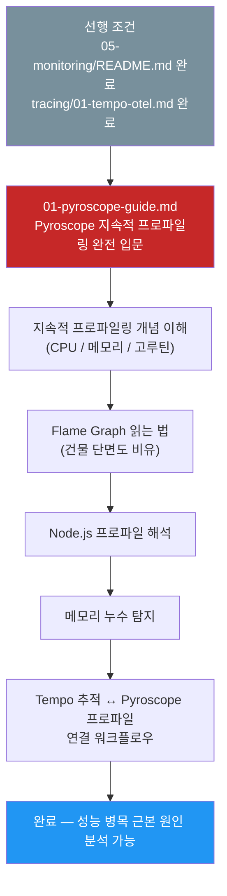
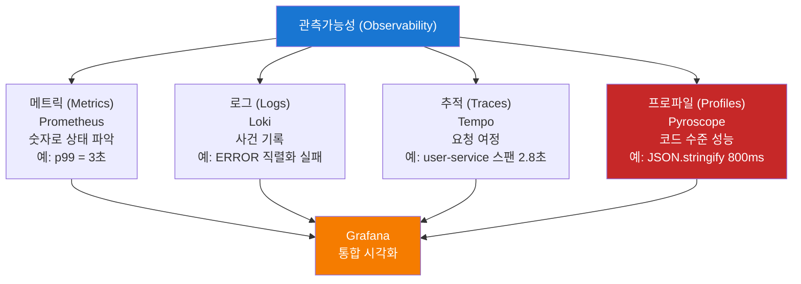

# 지속적 프로파일링 — 학습 맵

> **버전**: 1.0.0 | **작성일**: 2026-04-12
> **대상**: 성능 최적화에 관심 있는 개발자, SRE, DevOps 엔지니어
> **CSAP**: D-06 (침해사고 관리), D-10 (성능 모니터링)
> **선행 학습**: `05-monitoring/README.md`, `tracing/01-tempo-otel.md`

---

## 이 섹션에서 배우는 것

메트릭과 추적(Trace)이 "어디서 느린지"를 가르쳐 준다면, 프로파일링은 "왜 느린지"를 코드 수준까지 파고들어 답해 줍니다. Grafana Pyroscope를 통해 CPU 사용률과 메모리 할당을 함수 단위로 분석하고, 성능 병목을 근본적으로 제거하는 방법을 배웁니다.

---

## 학습 순서



---

## 섹션 구조

| 파일 | 내용 | 예상 학습 시간 |
|------|------|--------------|
| `README.md` | 이 파일 — 학습 맵 | 5분 |
| `01-pyroscope-guide.md` | Pyroscope 완전 입문 — 개념, 설정, 실습, Grafana 통합 | 90분 |

---

## 왜 프로파일링이 필요한가

```
상황 A: 메트릭으로는 알 수 없는 것
  Prometheus: api-gateway 응답 시간 p99 = 3초 (임계값 1초 초과)
  → 어떤 함수가 3초를 사용하고 있는지 알 수 없음

상황 B: 추적으로도 알 수 없는 것
  Tempo: user-service 스팬 = 2.8초
  → 스팬 내부에서 어떤 코드가 2.8초를 소비하는지 알 수 없음

상황 C: Pyroscope로 알 수 있는 것
  Pyroscope: user-service CPU Flame Graph
  → JSON.stringify() 호출 1회당 800ms → 입력 크기 축소로 해결
  → DB 결과 직렬화를 캐싱으로 교체 → p99 0.3초로 개선
```

---

## 관측가능성 3기둥 + 프로파일링



---

## 핵심 접근 정보

| 도구 | 주소 | 용도 |
|------|------|------|
| Grafana Pyroscope | `http://localhost:30300` → Explore → Pyroscope | CPU / 메모리 Flame Graph |
| Grafana Tempo | `http://localhost:30300` → Explore → Tempo | 분산 추적 + 프로파일 연결 |

> Pyroscope 데이터는 Grafana의 `pyroscope` 데이터소스를 통해 조회합니다.

---

## 변경 이력

| 버전 | 일자 | 내용 | 작성자 |
|------|------|------|--------|
| 1.0.0 | 2026-04-12 | 최초 작성 | Implementer (Sonnet) |
