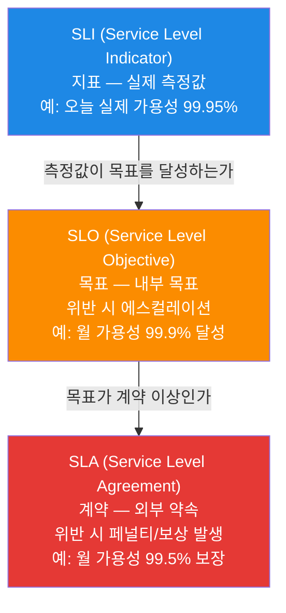
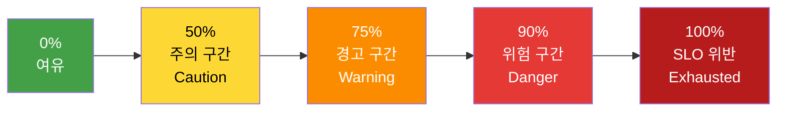
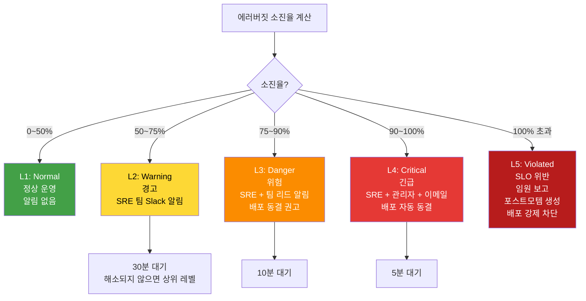
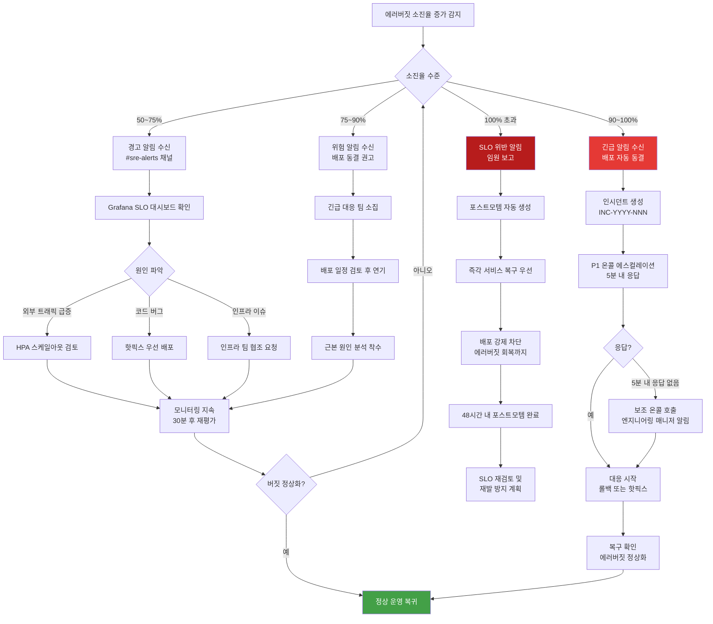
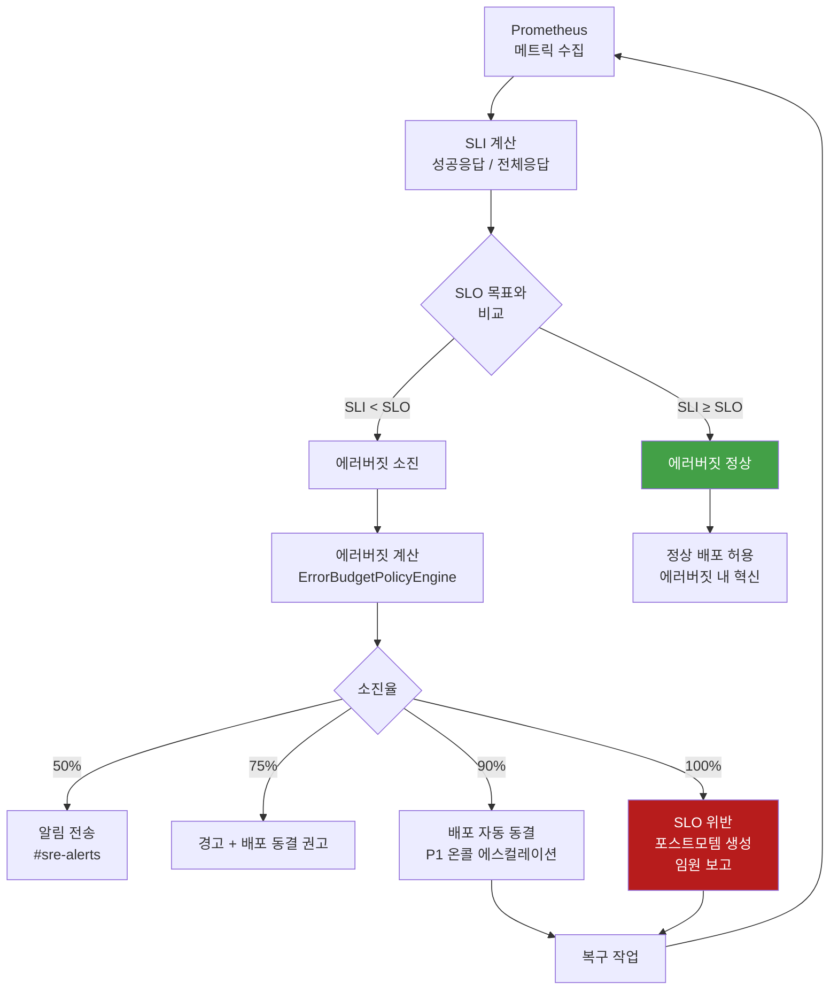

# SLO 가이드 — 서비스 수준 목표와 에러 버짓 관리

> **버전**: 1.0.0 | **작성일**: 2026-04-12
> **대상**: 서비스 신뢰성을 수치로 관리하고 싶은 개발자, SRE
> **소요 시간**: 약 60분
> **이전 단계**: `alerting/01-alertmanager-guide.md`
> **다음 단계**: `dora/01-dora-metrics.md`
> **CSAP**: D-06 (침해사고 관리), D-13 (변경 관리)
> **Design Ref**: MTU-N178, MTU-N255 §SC-1, §SC-2, §SC-3

---

## 목차

1. [SLO란? — 쉬운 비유](#1-slo란--쉬운-비유)
2. [SLA vs SLO vs SLI — 세 가지 개념 정리](#2-sla-vs-slo-vs-sli--세-가지-개념-정리)
3. [이 프로젝트의 SLO 설정](#3-이-프로젝트의-slo-설정)
4. [에러 버짓 계산법](#4-에러-버짓-계산법)
5. [slo-escalation 패키지 사용법](#5-slo-escalation-패키지-사용법)
6. [에스컬레이션 레벨 — L1부터 L5까지](#6-에스컬레이션-레벨--l1부터-l5까지)
7. [PromQL로 SLO 준수율 계산하기](#7-promql로-slo-준수율-계산하기)
8. [SLO 위반 시 대응 프로세스](#8-slo-위반-시-대응-프로세스)
9. [배포 동결 정책](#9-배포-동결-정책)
10. [SLO 설계 원칙](#10-slo-설계-원칙)
11. [자주 겪는 문제](#11-자주-겪는-문제)

---

## 1. SLO란? — 쉬운 비유

### 1.1 버스 시간표 비유

버스 회사가 시간표를 약속합니다.

```
약속: 오전 9시 버스는 9시 0분~9시 3분 사이에 도착합니다.
현실: 하루에 1번은 5분 늦을 수 있습니다.
```

이 약속이 SLO입니다. "완벽하지 않아도 되지만, 어느 정도 이상은 지켜야 한다"는 수치화된 목표입니다.

```
서비스 SLO 예시:
  "이 서비스는 한 달에 99.9%의 시간 동안 정상 응답합니다"
  → 한 달 중 43.8분은 다운되어도 허용됩니다.
  → 44분을 초과하면 SLO 위반입니다.
```

### 1.2 왜 100% 목표를 세우면 안 되는가?

```
100% 가용성 목표의 문제점:
  1. 달성 불가능 (배포 자체도 재시작이 필요)
  2. 개발 속도 0으로 수렴 (배포 → 다운타임 → 위반 두려움 → 배포 안 함)
  3. 사용자 기대치 왜곡 (완벽하다고 홍보 후 0.1% 장애에도 클레임)
  4. 비용 과다 (99.999%는 99.9%보다 10배 비쌈)
```

SLO는 "충분히 좋은 서비스"의 기준선을 정의하고, 나머지는 에러 버짓(Error Budget)으로 혁신에 사용합니다.

### 1.3 공공기관 SaaS에서 SLO가 중요한 이유

공공기관 서비스는 국민이 사용합니다. CSAP D-06(침해사고 관리)과 D-13(변경 관리)은 다음을 요구합니다.

```
CSAP D-06: 서비스 가용성 목표를 정의하고 이를 지속적으로 측정/기록
CSAP D-13: 변경(배포)이 서비스 안정성에 미치는 영향을 추적

SLO는 이 두 요건을 모두 충족하는 핵심 메커니즘입니다.
```

---

## 2. SLA vs SLO vs SLI — 세 가지 개념 정리

### 2.1 세 개념의 관계



### 2.2 상세 설명

**SLI (Service Level Indicator) — 실제 측정값**

```
SLI는 PromQL로 계산되는 실제 측정값입니다.

예시:
  - 가용성 SLI: 성공 응답 수 / 전체 요청 수 = 0.9995 (99.95%)
  - 레이턴시 SLI: P99 응답 시간 = 150ms
  - 에러율 SLI: 5xx 응답 수 / 전체 응답 수 = 0.0008 (0.08%)
```

**SLO (Service Level Objective) — 내부 목표**

```
SLO는 팀이 달성하려는 목표입니다. SLI가 SLO를 달성해야 합니다.

예시:
  - 가용성 SLO: 월간 99.9% 이상 (SLI ≥ 0.999)
  - 레이턴시 SLO: P99 200ms 이하 (SLI ≤ 200ms)
  - 에러율 SLO: 0.1% 이하 (SLI ≤ 0.001)
```

**SLA (Service Level Agreement) — 계약**

```
SLA는 서비스 제공자와 사용자(기관) 간의 법적 약속입니다.

예시:
  - 공공기관 SaaS SLA: 월 가용성 99.5% 보장
  - 위반 시: 서비스 크레딧 제공 또는 계약 해지 가능

SLO는 SLA보다 항상 엄격하게 설정합니다.
  (SLA: 99.5%, SLO: 99.9% → SLO를 달성하면 자동으로 SLA도 달성)
```

### 2.3 세 개념 비교표

| 구분 | SLI | SLO | SLA |
|------|-----|-----|-----|
| 정의 | 실제 측정값 | 내부 목표 | 외부 계약 |
| 대상 | 엔지니어링 팀 | 팀 전체 | 기관/고객 |
| 위반 결과 | 없음 (측정만) | 에스컬레이션 | 페널티/계약 위반 |
| 엄격도 | - | SLA보다 엄격 | 가장 느슨 |
| 측정 도구 | PromQL | 에러버짓 계산 | 계약서 |

---

## 3. 이 프로젝트의 SLO 설정

이 플랫폼에는 3가지 핵심 SLO가 설정되어 있습니다.

### 3.1 SLO 1 — 가용성 99.9%

```
목표: 월간 가용성 99.9% 이상

계산:
  월간 총 시간: 30일 × 24시간 × 60분 = 43,200분
  허용 다운타임: 43,200 × 0.001 = 43.2분 (약 43분)

의미:
  한 달에 43분 이상 서비스가 다운되면 SLO 위반
  43분 이하의 다운타임은 "에러 버짓 내"이므로 허용

SLI 측정:
  성공 응답 수(2xx, 3xx) / 전체 요청 수
```

### 3.2 SLO 2 — P99 레이턴시 200ms 이하

```
목표: P99 응답 시간 200ms 이하

의미:
  99%의 요청이 200ms 이내에 응답
  100개 요청 중 1개는 200ms를 초과해도 허용

SLI 측정:
  histogram_quantile(0.99, http_request_duration_seconds_bucket)

실무 적용:
  200ms를 초과하는 요청이 전체의 1%를 넘으면 SLO 위반 상태
```

### 3.3 SLO 3 — 에러율 0.1% 이하

```
목표: 5xx 에러율 0.1% 이하 (0.001)

의미:
  1,000개 요청 중 최대 1개만 5xx 에러 허용
  2개 이상이면 SLO 위반 상태

SLI 측정:
  sum(rate(http_requests_total{status=~"5.."}[5m]))
  / sum(rate(http_requests_total[5m]))
```

### 3.4 SLO 요약표

| SLO | 목표값 | 에러 버짓 (월) | SLI 측정 방법 |
|-----|--------|--------------|-------------|
| 가용성 | 99.9% | 43.2분 다운 허용 | 성공 응답 수 / 전체 요청 수 |
| P99 레이턴시 | 200ms 이하 | 1% 요청 초과 허용 | histogram_quantile(0.99, ...) |
| 에러율 | 0.1% 이하 | 1,000요청 중 1건 허용 | 5xx 수 / 전체 요청 수 |

---

## 4. 에러 버짓 계산법

### 4.1 에러 버짓이란?

에러 버짓(Error Budget)은 SLO에서 허용하는 "불완전함의 양"입니다.

```
비유: 월급 중 사용 가능한 용돈

  SLO 99.9% → 에러 버짓 = 0.1% = 43.2분/월
                                   ↑
                         이 43.2분을 어떻게 쓸까?

사용 예:
  - 배포 (재시작 시간)
  - 인프라 점검
  - 예상치 못한 버그
  - 실험적 기능 릴리스
```

에러 버짓이 남아있는 동안은 팀이 빠르게 배포하고 실험합니다.
에러 버짓이 소진되면 → 안정화에 집중하고 배포를 줄입니다.

### 4.2 에러 버짓 계산 공식

`packages/slo-escalation/src/error-budget-policy.ts`에 구현된 실제 계산 공식입니다.

```typescript
// 에러 버짓 계산 (ErrorBudgetPolicyEngine.calculateErrorBudget)

// 1. 전체 에러 버짓 (분)
const totalBudgetMinutes = (1 - slo.target) * slo.windowDays * 24 * 60;

// 예시: 가용성 99.9%, 30일 기준
// totalBudgetMinutes = (1 - 0.999) * 30 * 24 * 60
//                    = 0.001 * 43200
//                    = 43.2분

// 2. 소진된 에러 버짓 (분)
const consumedMinutes = (1 - slo.currentAvailability) * slo.windowDays * 24 * 60;

// 예시: 현재 가용성 99.95%, 30일 기준
// consumedMinutes = (1 - 0.9995) * 43200
//                 = 0.0005 * 43200
//                 = 21.6분 소진

// 3. 잔여 에러 버짓 (분)
const remainingMinutes = Math.max(0, totalBudgetMinutes - consumedMinutes);
// remainingMinutes = 43.2 - 21.6 = 21.6분 남음

// 4. 소진율 (%)
const burnRate = (consumedMinutes / totalBudgetMinutes) * 100;
// burnRate = (21.6 / 43.2) * 100 = 50% 소진
```

### 4.3 에러 버짓 상태 단계



| 소진율 | 상태 | 자동 조치 |
|--------|------|---------|
| 0~50% | Healthy (건강) | 알림 없음, 정상 배포 허용 |
| 50~75% | Caution (주의) | SRE 팀 알림 |
| 75~90% | Warning (경고) | 배포 동결 권고 |
| 90~100% | Danger (위험) | 배포 자동 동결 + 에스컬레이션 |
| 100% 초과 | Exhausted (소진) | 배포 강제 차단 + 포스트모템 생성 |

### 4.4 소진 예측 — 언제 버짓이 소진되는가?

```typescript
// 현재 소진 속도 기준으로 남은 에러버짓 소진 예측일 계산
// packages/slo-escalation/src/error-budget-policy.ts

private projectExhaustionDate(
  consumed: number,   // 현재까지 소진된 버짓 (분)
  total: number,      // 전체 에러 버짓 (분)
  windowDays: number  // 측정 기간 (일)
): string | null {
  // 일별 소진 속도
  const dailyBurnRate = consumed / windowDays;

  // 잔여 에러 버짓 소진까지 남은 일수
  const daysUntilExhaustion = (total - consumed) / dailyBurnRate;

  // 예측일 계산
  const projectedDate = new Date(
    Date.now() + daysUntilExhaustion * 24 * 60 * 60 * 1000
  );

  return projectedDate.toISOString();
}

// 예시:
// consumed = 30분, total = 43.2분, windowDays = 30
// dailyBurnRate = 30 / 30 = 1분/일
// daysUntilExhaustion = (43.2 - 30) / 1 = 13.2일 후 소진 예측
```

---

## 5. slo-escalation 패키지 사용법

`packages/slo-escalation/src/` 에는 두 가지 핵심 파일이 있습니다.

- `error-budget-policy.ts`: 에러 버짓 계산 + 배포 동결 + 온콜 에스컬레이션
- `escalation-controller.ts`: 에스컬레이션 레벨 판정 + 알림 라우팅

### 5.1 에러 버짓 계산 — ErrorBudgetPolicyEngine

```typescript
import {
  ErrorBudgetPolicyEngine,
  SLODefinition,
  BudgetStatus,
} from '@saas/slo-escalation';

// 정책 엔진 초기화
const engine = new ErrorBudgetPolicyEngine({
  freezeThreshold: 90,         // 90% 소진 시 배포 동결 권고
  enforceThreshold: 100,       // 100% 소진 시 배포 강제 차단
  escalateThreshold: 100,      // 100% 소진 시 에스컬레이션
  postmortemThreshold: 100,    // 100% 소진 시 포스트모템 자동 생성
  projectionDays: 30,          // 소진 예측 기간 (30일)
});

// SLO 정의
const slo: SLODefinition = {
  name: 'api-availability',
  service: 'auth-service',
  target: 0.999,               // 99.9% 목표
  windowDays: 30,              // 30일 측정 기간
  currentAvailability: 0.9985, // 현재 실제 가용성 (Prometheus에서 가져옴)
};

// 에러 버짓 계산
const result = engine.calculateErrorBudget(slo);

console.log(`전체 에러 버짓: ${result.totalBudgetMinutes}분`);
// → 전체 에러 버짓: 43.2분

console.log(`소진된 버짓: ${result.consumedMinutes}분`);
// → 소진된 버짓: 21.6분

console.log(`잔여 버짓: ${result.remainingMinutes}분`);
// → 잔여 버짓: 21.6분

console.log(`소진율: ${result.burnRate}%`);
// → 소진율: 50%

console.log(`상태: ${result.status}`);
// → 상태: caution

console.log(`예측 소진일: ${result.projectedExhaustionDate}`);
// → 예측 소진일: 2026-04-25T...

console.log(`자동 조치: ${result.actions}`);
// → 자동 조치: ['notify']

// 배포 동결 상태 확인
if (engine.isDeployFrozen()) {
  console.log('⚠️  에러버짓 소진으로 배포가 동결됩니다');
}
```

### 5.2 에스컬레이션 컨트롤러 — SLOEscalationController

```typescript
import {
  SLOEscalationController,
  EscalationLevel,
  NotificationChannel,
  EscalationPolicy,
} from '@saas/slo-escalation';

const controller = new SLOEscalationController();

// 에스컬레이션 정책 등록
const policy: EscalationPolicy = {
  name: 'auth-service-slo',
  service: 'auth-service',
  levels: [
    {
      level: EscalationLevel.Warning,         // 50~75% 소진
      budgetBurnRateMin: 50,
      budgetBurnRateMax: 75,
      contacts: [
        {
          name: '온콜 SRE',
          channel: NotificationChannel.Slack,
          target: '#sre-alerts',
        },
      ],
      waitMinutes: 30,
    },
    {
      level: EscalationLevel.Critical,        // 90~100% 소진
      budgetBurnRateMin: 90,
      budgetBurnRateMax: 100,
      contacts: [
        {
          name: '온콜 SRE',
          channel: NotificationChannel.Slack,
          target: '#incidents',
        },
        {
          name: '팀 리드',
          channel: NotificationChannel.Email,
          target: 'lead@example.gov.kr',
        },
      ],
      waitMinutes: 5,
      actions: ['freeze-deploy', 'create-incident'],
    },
  ],
};

controller.registerPolicy(policy);

// 에스컬레이션 실행 (Prometheus에서 가져온 소진율로 호출)
const event = await controller.escalate(
  'auth-service',       // 서비스 이름
  'api-availability',   // SLO 이름
  92,                   // 현재 소진율 (%)
  8,                    // 잔여 버짓 (%)
);

console.log(`에스컬레이션 레벨: ${event.level}`);
// → 에스컬레이션 레벨: critical

console.log(`알림 대상: ${event.notifiedContacts}`);
// → 알림 대상: ['온콜 SRE', '팀 리드']

// 에스컬레이션 이력 조회
const history = controller.getHistory('auth-service', 10);
console.log(`최근 이력: ${history.length}건`);
```

### 5.3 에스컬레이션 레벨 자동 판정

`determineEscalationLevel()` 함수가 소진율 기반으로 레벨을 자동 판정합니다.

```typescript
import { determineEscalationLevel, EscalationLevel } from '@saas/slo-escalation';

// 소진율 → 에스컬레이션 레벨 자동 판정
console.log(determineEscalationLevel(30));   // → 'normal'   (50% 이하)
console.log(determineEscalationLevel(60));   // → 'warning'  (50~75%)
console.log(determineEscalationLevel(82));   // → 'danger'   (75~90%)
console.log(determineEscalationLevel(95));   // → 'critical' (90~100%)
console.log(determineEscalationLevel(110));  // → 'violated' (100% 초과)
```

### 5.4 온콜 에스컬레이션 — P1/P2/P3/P4 우선순위

```typescript
// 온콜 에스컬레이션 실행 (인시던트 발생 시)
const escalationResult = engine.escalateOnCall(
  'INC-2026-001',  // 인시던트 ID
  'P1',            // 우선순위 (P1이 가장 심각)
  0,               // 현재 에스컬레이션 레벨 (0 = 첫 번째)
);

console.log(`알림 대상: ${escalationResult.notifiedTargets}`);
// → 알림 대상: ['oncall-primary', 'oncall-secondary', 'engineering-manager']

console.log(`다음 에스컬레이션: ${escalationResult.nextEscalationAt}`);
// → 5분 후 응답 없으면 다음 레벨로 에스컬레이션
```

---

## 6. 에스컬레이션 레벨 — L1부터 L5까지

### 6.1 에러버짓 기반 에스컬레이션 (Normal → Violated)



### 6.2 온콜 우선순위 (P1~P4)

| 우선순위 | 응답 시간 | 알림 채널 | 알림 대상 | 에스컬레이션 대기 |
|---------|---------|---------|---------|-------------|
| P1 | 5분 이내 | Slack + PagerDuty + 전화 | 주 온콜 + 보조 온콜 + 엔지니어링 매니저 | 5분 |
| P2 | 30분 이내 | Slack + PagerDuty | 주 온콜 + 보조 온콜 | 30분 |
| P3 | 4시간 이내 | Slack + Email | 주 온콜 | 4시간 |
| P4 | 24시간 이내 | Slack | 팀 채널 | 24시간 |

### 6.3 온콜 에스컬레이션 정책 코드

```typescript
// packages/slo-escalation/src/error-budget-policy.ts
// 기본 온콜 에스컬레이션 정책 (DEFAULT_ONCALL_LEVELS)

const DEFAULT_ONCALL_LEVELS = [
  {
    priority: 'P1',
    responseTimeMinutes: 5,
    escalationWaitMinutes: 5,    // 5분 안에 응답 없으면 다음으로
    targets: ['oncall-primary', 'oncall-secondary', 'engineering-manager'],
    channels: ['slack', 'pagerduty', 'phone'],
  },
  {
    priority: 'P2',
    responseTimeMinutes: 30,
    escalationWaitMinutes: 30,
    targets: ['oncall-primary', 'oncall-secondary'],
    channels: ['slack', 'pagerduty'],
  },
  {
    priority: 'P3',
    responseTimeMinutes: 240,    // 4시간
    escalationWaitMinutes: 240,
    targets: ['oncall-primary'],
    channels: ['slack', 'email'],
  },
  {
    priority: 'P4',
    responseTimeMinutes: 1440,   // 24시간
    escalationWaitMinutes: 1440,
    targets: ['team-channel'],
    channels: ['slack'],
  },
];
```

### 6.4 SLO 위반 → 온콜 우선순위 매핑

| 에러버짓 상태 | SLO 레벨 | 온콜 우선순위 | 의미 |
|------------|---------|------------|------|
| Healthy | Normal | - | 대응 불필요 |
| Caution | Warning | P3 | 근무 시간 내 확인 |
| Warning | Danger | P2 | 당일 대응 |
| Danger | Critical | P1 | 즉시 대응 (야간 포함) |
| Exhausted | Violated | P1 + 임원 | 전사 대응 |

---

## 7. PromQL로 SLO 준수율 계산하기

### 7.1 가용성 SLO 계산

```promql
# -------------------------------------------------------
# 가용성 SLO: 성공 응답 수 / 전체 요청 수
# -------------------------------------------------------

# 현재 가용성 (5분 윈도우)
sum(rate(http_requests_total{status=~"2..|3.."}[5m])) by (service)
/
sum(rate(http_requests_total[5m])) by (service)

# 30일 가용성 (SLO 측정 기간)
sum(rate(http_requests_total{status=~"2..|3.."}[30d])) by (service)
/
sum(rate(http_requests_total[30d])) by (service)

# SLO 준수 여부 (1=준수, 0=위반)
(
  sum(rate(http_requests_total{status=~"2..|3.."}[30d])) by (service)
  /
  sum(rate(http_requests_total[30d])) by (service)
) >= 0.999
```

### 7.2 레이턴시 SLO 계산

```promql
# -------------------------------------------------------
# P99 레이턴시 SLO: 200ms 이하
# -------------------------------------------------------

# 현재 P99 레이턴시 (ms 단위)
histogram_quantile(
  0.99,
  sum by (service, le) (rate(http_request_duration_seconds_bucket[5m]))
) * 1000

# SLO 준수 여부
histogram_quantile(
  0.99,
  sum by (service, le) (rate(http_request_duration_seconds_bucket[5m]))
) <= 0.2

# 200ms 초과 요청 비율 (에러버짓 소진율)
sum(rate(http_request_duration_seconds_bucket{le="0.2"}[30d])) by (service)
/
sum(rate(http_request_duration_seconds_count[30d])) by (service)
```

### 7.3 에러율 SLO 계산

```promql
# -------------------------------------------------------
# 에러율 SLO: 0.1% 이하
# -------------------------------------------------------

# 현재 에러율 (%)
(
  sum(rate(http_requests_total{status=~"5.."}[5m])) by (service)
  /
  sum(rate(http_requests_total[5m])) by (service)
) * 100

# 30일 에러율
(
  sum(rate(http_requests_total{status=~"5.."}[30d])) by (service)
  /
  sum(rate(http_requests_total[30d])) by (service)
) * 100

# SLO 준수 여부
(
  sum(rate(http_requests_total{status=~"5.."}[30d])) by (service)
  /
  sum(rate(http_requests_total[30d])) by (service)
) <= 0.001
```

### 7.4 에러 버짓 소진율 PromQL

```promql
# -------------------------------------------------------
# 에러 버짓 소진율 계산
# -------------------------------------------------------

# 가용성 에러버짓 소진율 (%)
# 소진율 = 실제 에러율 / 허용 에러율 × 100
(
  sum(rate(http_requests_total{status=~"5.."}[30d])) by (service)
  /
  sum(rate(http_requests_total[30d])) by (service)
) / 0.001 * 100

# 소진율이 100%를 초과하면 SLO 위반

# -------------------------------------------------------
# 에러 버짓 잔량 (분 단위)
# -------------------------------------------------------
# = 전체 에러버짓 - 소진된 에러버짓
(0.001 - (
  sum(rate(http_requests_total{status=~"5.."}[30d])) by (service)
  /
  sum(rate(http_requests_total[30d])) by (service)
)) * 30 * 24 * 60

# -------------------------------------------------------
# 번-레이트 (소진 속도)
# 현재 소진 속도가 SLO 허용치의 몇 배인가?
# 번-레이트 1.0 = 월말에 정확히 버짓 소진
# 번-레이트 2.0 = 월말의 절반에 버짓 소진 (2배 빠름)
# -------------------------------------------------------
(
  sum(rate(http_requests_total{status=~"5.."}[1h])) by (service)
  /
  sum(rate(http_requests_total[1h])) by (service)
) / 0.001
```

### 7.5 SLO 대시보드에서 확인

```bash
# Grafana SLO 대시보드 접속
kubectl port-forward -n monitoring svc/grafana 3000:80

# 브라우저: http://localhost:3000
# 대시보드: SLO Overview (이미 설정된 대시보드)
#
# 주요 패널:
# - 가용성 SLO 준수율 (30일)
# - P99 레이턴시 트렌드
# - 에러버짓 소진율 게이지
# - 예상 소진일 표시
```

---

## 8. SLO 위반 시 대응 프로세스

### 8.1 대응 플로우차트



### 8.2 대응 단계별 체크리스트

**경고(Warning, 50~75%) 대응**:

```
[ ] Grafana SLO 대시보드 열기
[ ] 어느 서비스에서 에러가 발생하는지 확인
[ ] Loki에서 에러 로그 확인
[ ] Tempo에서 느린 트레이스 확인
[ ] 배포 이력 확인 (최근 배포와 연관성)
[ ] 30분 내 해소 안 되면 → Danger 레벨 대응
```

**위험(Danger, 75~90%) 대응**:

```
[ ] 배포 예정 작업 일정 연기
[ ] 긴급 대응 채널(#incidents) 생성
[ ] 팀 리드 또는 온콜에 상황 공유
[ ] 근본 원인 분석 (RCA) 착수
[ ] 핫픽스 준비
[ ] 30분 내 해소 안 되면 → Critical 레벨 대응
```

**긴급(Critical, 90~100%) 대응**:

```
[ ] 인시던트 티켓 생성 (INC-YYYY-NNN)
[ ] 모든 배포 작업 즉시 중단
[ ] 온콜 담당자 P1으로 호출
[ ] 관리자에게 상황 보고
[ ] 5분 내 응답 없으면 → 보조 온콜 + 매니저 알림
[ ] 롤백 또는 긴급 수정 배포 결정
```

**SLO 위반(Violated, 100% 초과) 대응**:

```
[ ] 임원진 상황 보고
[ ] 포스트모템 문서 생성 시작
[ ] 서비스 복구 최우선 처리
[ ] 48시간 내 포스트모템 완료
[ ] 재발 방지 계획 수립
[ ] SLO 목표값 재검토 (너무 엄격한가?)
```

---

## 9. 배포 동결 정책

### 9.1 배포 동결이 자동으로 발동되는 조건

```typescript
// packages/slo-escalation/src/error-budget-policy.ts

// 배포 동결 상태 업데이트 로직
if (burnRate >= this.config.enforceThreshold) {
  // enforceThreshold = 100 (기본값)
  this.deployFreezeActive = true;   // 배포 강제 차단
} else if (burnRate < this.config.freezeThreshold) {
  // freezeThreshold = 90 (기본값)
  this.deployFreezeActive = false;  // 동결 해제
}
```

### 9.2 배포 동결 확인 방법

```typescript
// CI/CD 파이프라인에서 배포 전 동결 상태 확인
import { ErrorBudgetPolicyEngine } from '@saas/slo-escalation';

async function checkDeploymentAllowed(service: string): Promise<boolean> {
  const engine = getOrCreateEngine(service);

  if (engine.isDeployFrozen()) {
    console.error(`[배포 차단] ${service} SLO 에러버짓 소진으로 배포 불가`);
    console.error('에러버짓이 90% 이하로 회복될 때까지 배포 대기');
    return false;
  }

  return true;
}

// 사용 예시 (Gitea Actions 파이프라인)
const allowed = await checkDeploymentAllowed('auth-service');
if (!allowed) {
  process.exit(1);  // 파이프라인 중단
}
```

### 9.3 자동 조치 목록

에러버짓 소진율에 따라 자동으로 실행되는 조치입니다.

```typescript
// packages/slo-escalation/src/error-budget-policy.ts

private determineActions(burnRate: number): AutoAction[] {
  const actions: AutoAction[] = [];

  if (burnRate >= 50) {
    actions.push(AutoAction.Notify);           // 알림 전송
  }

  if (burnRate >= 90) {
    actions.push(AutoAction.FreezeRecommend);  // 배포 동결 권고
  }

  if (burnRate >= 100) {
    actions.push(AutoAction.FreezeEnforce);    // 배포 강제 차단
    actions.push(AutoAction.Escalate);         // 에스컬레이션
    actions.push(AutoAction.CreatePostmortem); // 포스트모템 자동 생성
  }

  return actions;
}
```

---

## 10. SLO 설계 원칙

### 10.1 좋은 SLO vs 나쁜 SLO

**나쁜 SLO의 특징**:

```
❌ 측정이 어려운 목표
   "사용자가 만족하는 경험 제공"
   → 어떻게 측정? 명확하지 않음

❌ 너무 높거나 낮은 목표
   99.999% 가용성 → 연간 5분만 허용 → 달성 불가능
   90% 가용성 → 월 72시간 허용 → 너무 느슨

❌ SLI와 연결되지 않은 목표
   "응답이 빠릅니다" → P50? P99? 무엇을 측정?

❌ 팀이 영향을 줄 수 없는 외부 요인 포함
   "외부 API 응답 시간 100ms 이하" → 제어 불가
```

**좋은 SLO의 특징**:

```
✅ PromQL로 정확히 측정 가능
   "P99 레이턴시 200ms 이하"
   → histogram_quantile(0.99, ...) <= 0.2

✅ 사용자 경험과 직결
   "에러율 0.1% 이하"
   → 1,000명 중 1명만 에러를 경험

✅ 팀이 영향을 줄 수 있음
   자체 코드와 인프라의 메트릭 사용

✅ 에러 버짓을 통해 혁신과 안정성 균형
   에러버짓이 있는 동안은 새 기능 배포 가능
```

### 10.2 SLO 설정 시 단계

```
1단계: 사용자에게 가장 중요한 것은 무엇인가?
  → "서비스가 응답하는가" = 가용성
  → "빠르게 응답하는가" = 레이턴시
  → "에러 없이 응답하는가" = 에러율

2단계: 현재 실제 수치는 얼마인가?
  → Prometheus에서 지난 30일 데이터 확인

3단계: 목표값 설정 (현재보다 조금 엄격하게)
  → 현재 99.95%라면 → SLO 99.9% (여유 있게)
  → 처음부터 너무 엄격하면 위반만 자주 발생

4단계: 에러 버짓 계산
  → 허용 다운타임 = (1 - SLO) × 측정기간

5단계: 알림 임계값 설정
  → 에러버짓 50% 소진 시 warning
  → 90% 소진 시 critical
```

### 10.3 SLO 검토 주기

| 검토 항목 | 주기 | 담당자 |
|---------|------|------|
| SLO 달성 현황 | 매주 | SRE 팀 |
| 에러버짓 소진 추세 | 매월 | 팀 전체 |
| SLO 목표값 적절성 | 분기 | 팀 리드 |
| SLA와의 정합성 | 반기 | 관리자 + SRE |

---

## 11. 자주 겪는 문제

### 11.1 에러버짓이 갑자기 100% 소진됨

**원인**: 단기 장애(예: 배포 직후 5분 서비스 다운)가 30일 버짓에 큰 영향

**대응**:
```promql
# 언제 에러가 많이 발생했는지 확인
increase(http_requests_total{status=~"5.."}[30d])

# 특정 시간대 에러 집중 여부
sum(rate(http_requests_total{status=~"5.."}[1h])) by (service)
```

### 11.2 SLO 임계값이 너무 엄격해서 매일 위반

**원인**: 처음에 SLO를 너무 높게 설정

**대응**: SLO를 현실적인 수준으로 낮추고, 점진적으로 개선

```
현재: 99.99% (연간 52분만 허용) → 달성 불가능
조정: 99.9% (연간 8.7시간 허용) → 달성 가능
목표: 점진적으로 99.95%로 높여 나감
```

### 11.3 slo-escalation 패키지를 사용하는데 정책이 등록 안 됨

```typescript
// 정책 등록 확인
const controller = new SLOEscalationController();
controller.registerPolicy(policy);

// 에스컬레이션 실행 전 정책 존재 확인
const history = controller.getHistory('auth-service', 1);
// history가 비어있으면 정책이 없거나 escalate()가 실행되지 않은 것
```

### 11.4 에러버짓 계산값이 이상함

```typescript
// target과 currentAvailability 단위 확인 (0.0~1.0 사이여야 함)
const slo: SLODefinition = {
  target: 0.999,              // ✅ 올바름 (99.9%)
  currentAvailability: 99.95, // ❌ 잘못됨 (0.9995 이어야 함)
};

// currentAvailability가 1.0을 초과하면 소진율이 음수가 됨
```

---

## 정리 및 다음 단계

### SLO 계산 구조 전체 다이어그램



이 문서에서 배운 내용:

1. SLA / SLO / SLI 세 개념의 차이와 관계
2. 이 프로젝트의 SLO 3가지 (가용성, 레이턴시, 에러율)
3. 에러 버짓 계산 공식과 단계별 상태 판정
4. `slo-escalation` 패키지로 에러버짓 계산 및 에스컬레이션 구현
5. 에스컬레이션 레벨 (Normal → Warning → Danger → Critical → Violated)
6. PromQL로 SLO 준수율과 에러버짓 소진율 계산
7. SLO 위반 시 대응 프로세스와 배포 동결 정책

다음으로 `dora/01-dora-metrics.md`를 학습하여 DORA 4대 지표로 팀 성과를 측정하는 방법을 배우십시오.

---

> **참조**: `packages/slo-escalation/src/error-budget-policy.ts` — 에러버짓 정책 엔진
> **참조**: `packages/slo-escalation/src/escalation-controller.ts` — 에스컬레이션 컨트롤러
> **참조**: `infra/alertmanager/escalation-policy.yaml` — AlertManager SLO 라우팅 정책
> **CSAP 연관**: D-06 (침해사고 관리 — 가용성 목표 측정), D-13 (변경 관리 — 배포 동결)
