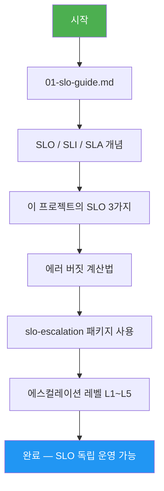

# SLO (Service Level Objective) — 학습 맵

> **대상**: 신규 개발자, SRE, DevOps 엔지니어
> **버전**: 1.0.0 | **작성일**: 2026-04-12
> **CSAP**: D-06 (침해사고 관리), D-13 (변경 관리)

---

## 이 섹션을 배우면

"서비스가 얼마나 잘 작동하고 있는가"를 **수치로 정의하고 측정**할 수 있습니다. SLO가 위반될 위험이 있을 때 자동 에스컬레이션이 어떻게 동작하는지 이해합니다. 에러 버짓이 소진될 때 배포를 동결하는 정책도 설명합니다.

---

## 학습 순서

---

## 섹션 구조

| 파일 | 설명 | 소요 시간 |
|------|------|----------|
| `01-slo-guide.md` | SLO 전체 가이드 — 개념, 설정, 에스컬레이션 | 60분 |

---

## 핵심 패키지

| 패키지 | 경로 | 역할 |
|--------|------|------|
| `slo-escalation` | `packages/slo-escalation/src/` | 에러버짓 계산 + 에스컬레이션 컨트롤러 |

> 이 패키지를 직접 수정하기 전에 반드시 Plan + Design 문서를 작성하십시오 (감리 요건).
