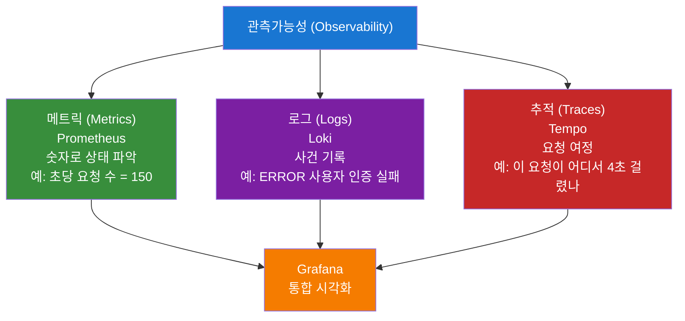
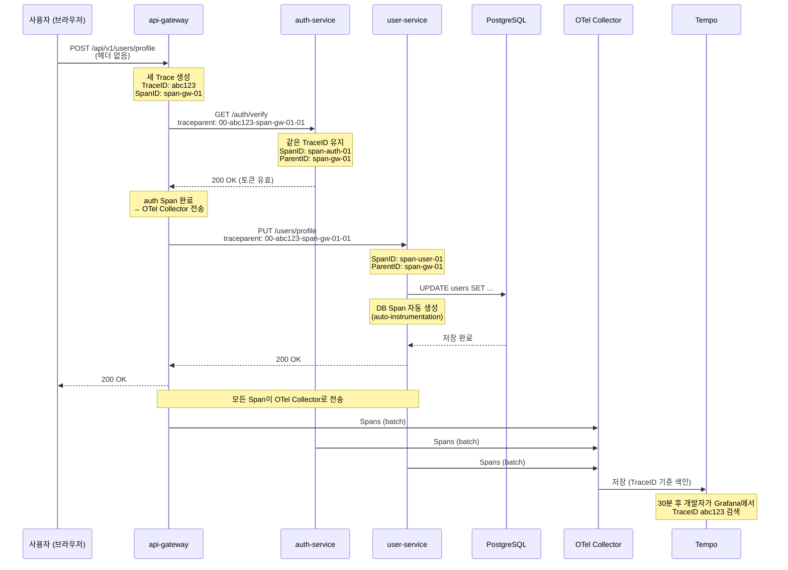
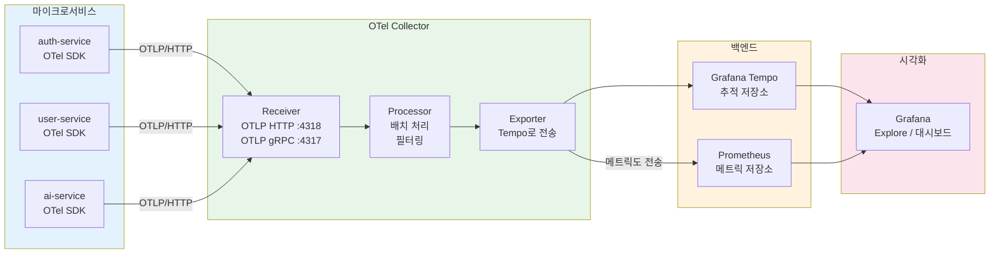

# 분산 추적 — Tempo + OpenTelemetry 완전 입문

> **버전**: 1.0.0 | **작성일**: 2026-04-12
> **대상**: 분산 추적을 처음 접하는 신규 개발자
> **CSAP**: D-06 (침해사고 관리), D-10 (네트워크 보안)
> **관련 문서**: `05-monitoring.md`, `platform/packages/observability/src/telemetry.ts`

---

## 목차

1. [분산 추적이란 무엇인가](#1-분산-추적이란-무엇인가)
2. [OpenTelemetry 핵심 개념](#2-opentelemetry-핵심-개념)
3. [이 프로젝트의 OTel 구성](#3-이-프로젝트의-otel-구성)
4. [Grafana Tempo — 추적 백엔드](#4-grafana-tempo--추적-백엔드)
5. [TraceQL — 추적 검색 쿼리](#5-traceql--추적-검색-쿼리)
6. [Grafana Explore로 추적 찾기](#6-grafana-explore로-추적-찾기)
7. [신규 서비스에 추적 추가하기](#7-신규-서비스에-추적-추가하기)
8. [코드 예제: 함수에 Span 추가](#8-코드-예제-함수에-span-추가)
9. [자주 발생하는 문제와 해결법](#9-자주-발생하는-문제와-해결법)

---

## 1. 분산 추적이란 무엇인가

### 1.1 빵 부스러기 비유

동화 헨젤과 그레텔에서 아이들은 숲에서 길을 잃지 않기 위해 빵 부스러기를 남겼습니다. 분산 추적은 정확히 그 개념입니다.

사용자가 API를 호출하면 요청이 여러 마이크로서비스를 거쳐 이동합니다. 각 서비스마다 "나 여기까지 왔어, 얼마나 걸렸어"라는 빵 부스러기(Span)를 남깁니다. 개발자는 나중에 그 부스러기를 따라가며 전체 여정을 재현할 수 있습니다.

```
사용자 요청 → api-gateway → auth-service → user-service → postgres
   (빵 1)         (빵 2)        (빵 3)         (빵 4)       (빵 5)

나중에 Grafana에서: "요청 ID 'abc123' 의 여정을 보여줘"
→ 빵 1부터 5까지 순서대로 시각화 + 각 구간 소요 시간 표시
```

### 1.2 왜 분산 추적이 필요한가

단순 로그만으로는 알 수 없는 것들:

```
문제 상황:
사용자 A가 "프로필 저장이 5초 걸립니다" 라고 신고
로그에는 에러 없음, 모든 서비스 정상

분산 추적이 없을 때:
- auth-service 로그: "요청 처리 완료, 10ms"
- user-service 로그: "DB 저장 완료, 15ms"
- 어디서 5초가 걸렸는지 알 수 없음

분산 추적이 있을 때:
- api-gateway → auth-service: 10ms
- auth-service → user-service: 4800ms ← 여기가 문제!
- user-service → postgres: 15ms

원인: auth-service와 user-service 사이의 네트워크 지연
해결: 서비스 배치 위치 또는 연결 풀 설정 조정
```

### 1.3 세 가지 관측가능성 기둥

분산 추적은 관측가능성(Observability)의 세 기둥 중 하나입니다.



**실무에서의 협력**: 알림(메트릭)이 울리면 → 로그로 에러를 찾고 → 추적으로 병목을 확인합니다.

---

## 2. OpenTelemetry 핵심 개념

### 2.1 OpenTelemetry란

OpenTelemetry(OTel)는 CNCF(Cloud Native Computing Foundation)가 관리하는 오픈 표준입니다. 여러 벤더의 도구를 단일 방식으로 계측(instrumentation)할 수 있게 해줍니다.

```
이전 방식 (벤더 종속):
- Jaeger 쓰면 → Jaeger SDK 코드
- Zipkin 쓰면 → Zipkin SDK 코드
- Datadog 쓰면 → Datadog SDK 코드
→ 도구 바꾸면 코드 전체 수정 필요

OTel 방식 (벤더 중립):
- OTel SDK로 코드 작성 (한 번만)
→ 백엔드를 Jaeger/Zipkin/Tempo/Datadog으로 자유롭게 교체 가능
→ 이 프로젝트는 현재 Tempo 사용
```

### 2.2 Trace — 요청 전체 여정

Trace는 하나의 요청이 시스템을 통과하는 전체 여정을 담습니다.

```
Trace ID: abc123def456...  (32자리 16진수, 전 세계 유일)

[api-gateway]  POST /api/v1/users/profile ─────────────── 250ms
  [auth-service]  토큰 검증 ─────────── 45ms
  [user-service]  프로필 저장 ─────────────────── 180ms
    [postgres]  UPDATE users SET ... ──── 12ms
    [redis]     캐시 무효화 ─── 8ms
```

모든 Span은 동일한 Trace ID를 가지므로 연관 검색이 가능합니다.

### 2.3 Span — 단일 작업 단위

Span은 하나의 작업(함수 호출, DB 쿼리, HTTP 요청 등)을 나타냅니다.

```
Span 구조:
┌─────────────────────────────────────┐
│ Trace ID:   abc123def456...         │ ← 상위 Trace와 연결
│ Span ID:    7890abcd                │ ← 이 Span의 고유 ID
│ Parent ID:  1234efgh                │ ← 부모 Span ID (없으면 Root Span)
│ Name:       "user-service.save"     │ ← 작업 이름
│ Start:      2026-04-12T09:00:00.100 │ ← 시작 시간
│ Duration:   180ms                   │ ← 소요 시간
│ Status:     OK                      │ ← 성공/실패
│ Attributes:                         │ ← 추가 정보
│   user.id: "user_123"               │
│   db.type: "postgresql"             │
│   http.status_code: 200             │
└─────────────────────────────────────┘
```

Span의 계층 구조가 바로 요청의 "족보"입니다.

### 2.4 Context Propagation — 헤더로 연결하기

서비스 A가 서비스 B를 호출할 때, Trace ID와 Span ID를 HTTP 헤더에 담아 전달합니다. 이것이 Context Propagation입니다.

```
HTTP 헤더 (W3C TraceContext 표준):
traceparent: 00-abc123def456...-7890abcd-01
              ↑  ↑              ↑        ↑
             버전 Trace ID      Span ID  플래그(샘플링)

B3 헤더 (Zipkin/Istio 호환):
x-b3-traceid: abc123def456...
x-b3-spanid: 7890abcd
x-b3-sampled: 1
```

이 프로젝트는 `platform/packages/mesh-ready/src/trace-context-propagator.ts`에서 두 형식을 모두 지원합니다.

```typescript
// trace-context-propagator.ts에서 실제로 사용 중인 헤더 목록
const PROPAGATION_HEADERS = [
  'traceparent',      // W3C 표준
  'tracestate',       // W3C 벤더 확장
  'b3',               // B3 단일 헤더
  'x-b3-traceid',     // B3 멀티 헤더
  'x-b3-spanid',
  'x-b3-parentspanid',
  'x-b3-sampled',
  'x-request-id',     // 기존 correlationId 연동
];
```

### 2.5 요청 추적 전체 흐름 — 시퀀스 다이어그램



---

## 3. 이 프로젝트의 OTel 구성

### 3.1 전체 아키텍처



### 3.2 SDK 초기화 — `platform/packages/observability/src/telemetry.ts`

모든 서비스는 공유 패키지의 `initTelemetry()` 함수를 사용합니다.

```typescript
// platform/packages/observability/src/telemetry.ts
import { initTelemetry } from '@public-saas/observability'

// 서비스 시작 시 가장 먼저 호출 (Fastify 인스턴스 생성 전)
initTelemetry({
  serviceName: 'user-service',    // Tempo에서 서비스 필터로 사용됨
  serviceVersion: '0.2.0',        // Span attribute으로 기록됨
})
```

내부 동작:

```typescript
// OTEL_ENABLED=true 환경 변수가 있을 때만 활성화
// 엔드포인트는 OTEL_EXPORTER_OTLP_ENDPOINT 환경 변수로 설정
const endpoint = process.env['OTEL_EXPORTER_OTLP_ENDPOINT'] ?? 'http://localhost:4318'

const sdk = new NodeSDK({
  resource: new Resource({
    'service.name': config.serviceName,
    'service.version': config.serviceVersion,
  }),
  traceExporter: new OTLPTraceExporter({
    url: `${endpoint}/v1/traces`,   // Collector로 Span 전송
  }),
  instrumentations: getNodeAutoInstrumentations({
    '@opentelemetry/instrumentation-fs': { enabled: false },   // 파일 시스템은 너무 많은 Span 생성
    '@opentelemetry/instrumentation-dns': { enabled: false },  // DNS도 노이즈 많아 비활성화
  }),
})

sdk.start()  // 자동 계측 시작 (HTTP, DB, Redis 등 자동으로 Span 생성)
```

### 3.3 환경 변수 설정

ConfigMap에서 주입되는 환경 변수:

```yaml
# platform/infra/helm/values.yaml 내 관련 설정
env:
  OTEL_ENABLED: "true"
  OTEL_EXPORTER_OTLP_ENDPOINT: "http://saas-otel-collector.monitoring.svc.cluster.local:4318"
  OTEL_SERVICE_NAME: "auth-service"   # SDK 초기화와 일치
  OTEL_TRACES_SAMPLER: "parentbased_traceidratio"
  OTEL_TRACES_SAMPLER_ARG: "0.1"     # 10% 샘플링 (프로덕션 부하 감소)
```

개발 환경에서는 `.env` 파일에 설정:

```bash
# .env (개발 환경)
OTEL_ENABLED=true
OTEL_EXPORTER_OTLP_ENDPOINT=http://localhost:4318
```

### 3.4 자동 계측 (Auto-Instrumentation)

`getNodeAutoInstrumentations()`를 사용하면 코드 변경 없이 다음이 자동으로 Span을 생성합니다.

| 라이브러리 | 생성되는 Span |
|-----------|--------------|
| `node:http` / `axios` | 모든 HTTP 요청/응답 |
| `@prisma/client` | 모든 DB 쿼리 (쿼리 내용 포함) |
| `ioredis` | 모든 Redis 명령 |
| `fastify` | 모든 라우트 처리 |
| `grpc` | gRPC 호출 |

즉, 대부분의 외부 호출은 코드 한 줄 없이도 자동으로 추적됩니다.

### 3.5 TraceContext 전파 — mesh-ready 플러그인

서비스 간 헤더 전파는 `meshReadyPlugin`이 자동으로 처리합니다.

```typescript
// 모든 서비스의 main.ts에 등록
await app.register(meshReadyPlugin, {
  service: { name: 'user-service', version: '0.2.0' },
})

// 내부적으로 onRequest 훅에서 자동 실행:
// 1. 들어오는 요청의 traceparent/b3 헤더 추출
// 2. 추출 헤더 없으면 새 Trace 생성
// 3. 응답 헤더에도 추적 정보 설정 (다운스트림 디버깅용)
// 4. app.mesh.tracer로 발신 요청 시 헤더 첨부 가능
```

---

## 4. Grafana Tempo — 추적 백엔드

### 4.1 Tempo란

Tempo는 Grafana Labs에서 만든 분산 추적 백엔드입니다. 특징:

```
장점:
- 저장 비용이 낮음 (객체 스토리지 사용, 인덱스 최소화)
- Grafana와 완벽 통합
- TraceQL이라는 강력한 쿼리 언어 제공
- Loki 로그와 Prometheus 메트릭과 연결 가능 (Exemplar)

접근 방법:
- Grafana → Explore → 데이터 소스: Tempo 선택
- 직접 접근: http://localhost:3100 (개발 환경)
- k8s: kubectl port-forward svc/tempo -n monitoring 3100:3100
```

### 4.2 Grafana에서 Tempo 접근

```bash
# Grafana 포트 포워딩
kubectl port-forward -n monitoring svc/grafana 3000:3000

# 브라우저에서 접속
# http://localhost:3000
# Explore → 데이터 소스에서 'Tempo' 선택
```

### 4.3 Tempo Trace ID로 직접 검색

Trace ID를 알고 있으면 가장 빠르게 조회할 수 있습니다.

```
Grafana Explore → Tempo → Query Type: TraceID
→ 입력: abc123def456789abcdef012345678901
→ Run Query
```

Trace ID는 다음 위치에서 찾을 수 있습니다.

1. API 응답 헤더: `traceparent: 00-[traceId]-[spanId]-01`
2. 애플리케이션 로그: `{"traceId": "abc123..."}`
3. Nginx/Traefik 액세스 로그

---

## 5. TraceQL — 추적 검색 쿼리

### 5.1 TraceQL 기본 문법

TraceQL은 Tempo의 전용 쿼리 언어입니다. Span의 속성으로 필터링합니다.

```
기본 형식: { 필터 조건 }

예시:
{ .service.name = "auth-service" }     ← auth-service의 모든 Span
{ .http.status_code = 500 }            ← HTTP 500 에러가 있는 Span
{ duration > 1s }                       ← 1초 이상 걸린 Span
{ status = error }                      ← 에러 상태인 Span
```

### 5.2 자주 쓰는 TraceQL 쿼리

**특정 서비스에서 느린 요청 찾기:**

```
{ .service.name = "user-service" && duration > 500ms }
```

**에러가 있는 전체 Trace 찾기:**

```
{ status = error }
```

**특정 사용자의 요청 추적:**

```
{ .user.id = "user_123" }
```

**특정 엔드포인트의 P99 지연 시간:**

```
{ .http.route = "/api/v1/users/profile" && .http.method = "PUT" } | rate()
```

**DB 쿼리가 포함된 느린 요청:**

```
{ .db.type = "postgresql" && duration > 100ms }
```

**특정 시간대의 auth-service 오류:**

```
{ .service.name = "auth-service" && status = error }
```

### 5.3 파이프라인 연산자

TraceQL은 집계 연산도 지원합니다.

```
# 서비스별 평균 응답 시간
{ } | avg(duration) by(.service.name)

# 에러 발생 Span 수
{ status = error } | count() by(.service.name)

# P99 응답 시간
{ .service.name = "api-gateway" } | quantile(duration, 0.99)
```

---

## 6. Grafana Explore로 추적 찾기

### 6.1 기본 탐색 흐름

```
1단계: Grafana 접속
  http://localhost:3000 → Explore (나침반 아이콘)

2단계: 데이터 소스 선택
  상단 드롭다운 → Tempo 선택

3단계: 쿼리 유형 선택
  - Search: 속성 기반 필터 (TraceQL 사용)
  - TraceID: 특정 Trace 직접 조회
  - Service Graph: 서비스 간 연결도 시각화

4단계: 결과 해석
  - Trace 목록 클릭 → 폭포수 (Waterfall) 차트 표시
  - 각 Span의 소요 시간, 속성, 에러 확인
```

### 6.2 Waterfall 차트 읽는 법

```
[api-gateway]     POST /api/users/profile ════════════════════ 250ms
  [auth-service]    verify token ══════ 45ms
  [user-service]    save profile ════════════════ 180ms
    [postgresql]      UPDATE users ═══ 12ms
    [redis]           cache invalidate ══ 8ms

가로축 = 시간 (전체 250ms)
막대 길이 = 각 Span 소요 시간
들여쓰기 = 부모-자식 관계 (호출 계층)

색상:
- 파란색: 정상 Span
- 빨간색: 에러 Span
- 주황색: 경고
```

### 6.3 메트릭-로그-추적 연결하기

Grafana의 강력한 기능은 세 가지를 연결할 수 있다는 점입니다.

```
시나리오: 알림 발생 → 원인 찾기

1. Prometheus 알림 수신
   "auth-service 에러율이 5%를 초과했습니다"

2. Grafana 대시보드 확인
   에러 급증 시간대: 09:15:00 ~ 09:17:00

3. Loki에서 로그 조회 (LogQL)
   {namespace="saas-platform", app="auth-service"} |= "error"
   → "JWT 서명 검증 실패: 만료된 키" 발견
   → 로그 라인 옆의 Trace 아이콘 클릭

4. Tempo에서 추적 조회 (자동 연결)
   → 해당 에러가 발생한 정확한 Trace로 이동
   → auth-service Span에서 user-service도 호출됐는지 확인
   → 영향 범위 파악

5. 원인 확인: JWT 서명 키 만료
   → Secret 갱신으로 즉시 해결
```

---

## 7. 신규 서비스에 추적 추가하기

### 7.1 단계별 설정

새로운 서비스를 만들 때 다음 단계를 따릅니다.

**Step 1: 의존성 추가**

```bash
# 서비스 디렉토리에서 실행
pnpm add @public-saas/observability

# 또는 OTel 패키지 직접 설치
pnpm add @opentelemetry/sdk-node
pnpm add @opentelemetry/exporter-trace-otlp-http
pnpm add @opentelemetry/auto-instrumentations-node
pnpm add @opentelemetry/resources
```

**Step 2: 서비스 진입점에 SDK 초기화**

```typescript
// src/main.ts — 반드시 파일 최상단에 위치해야 합니다
// (Fastify, Prisma 등 다른 import 전에 호출해야 자동 계측이 동작합니다)
import { initTelemetry, shutdownTelemetry } from '@public-saas/observability'

initTelemetry({
  serviceName: 'notification-service',  // Tempo에서 필터로 사용할 이름
  serviceVersion: '0.1.0',
})

// 이후에 다른 import 및 서비스 초기화
import Fastify from 'fastify'
import { meshReadyPlugin } from '@public-saas/mesh-ready'

const app = Fastify({ logger: true })

await app.register(meshReadyPlugin, {
  service: { name: 'notification-service', version: '0.1.0' },
})

// Graceful shutdown 시 OTel SDK 정리
process.on('SIGTERM', async () => {
  await shutdownTelemetry()
  await app.close()
  process.exit(0)
})
```

**Step 3: ConfigMap에 환경 변수 추가**

```yaml
# infra/helm/values/notification-service.yaml
env:
  OTEL_ENABLED: "true"
  OTEL_EXPORTER_OTLP_ENDPOINT: "http://saas-otel-collector.monitoring.svc.cluster.local:4318"
  OTEL_SERVICE_NAME: "notification-service"
  OTEL_TRACES_SAMPLER: "parentbased_traceidratio"
  OTEL_TRACES_SAMPLER_ARG: "0.1"    # 프로덕션: 10% 샘플링
```

개발 환경 `.env`:

```bash
OTEL_ENABLED=true
OTEL_EXPORTER_OTLP_ENDPOINT=http://localhost:4318
```

**Step 4: 동작 확인**

```bash
# 서비스 실행 후 요청 보내기
curl -X POST http://localhost:3005/notifications/send \
  -H "Content-Type: application/json" \
  -d '{"userId": "user_123", "message": "테스트"}'

# 응답 헤더에서 traceparent 확인
curl -v http://localhost:3005/notifications/send ... 2>&1 | grep traceparent
# < traceparent: 00-a1b2c3d4e5f6....-7890abcd-01

# Grafana Explore → Tempo에서 TraceID로 검색
# 00-[여기 TraceID 부분] 검색
```

---

## 8. 코드 예제: 함수에 Span 추가

### 8.1 자동 계측으로 충분한 경우

대부분의 HTTP 요청, DB 쿼리, Redis 호출은 자동으로 추적됩니다. 추가 코드 없이도 충분합니다.

```typescript
// 이 코드는 별도 작업 없이도 자동으로 Span 생성
async function getUserProfile(userId: string) {
  // Prisma 쿼리 → 자동으로 "postgresql.query" Span 생성
  const user = await prisma.user.findUnique({ where: { id: userId } })

  // Redis 조회 → 자동으로 "redis.get" Span 생성
  const cached = await redis.get(`user:${userId}:profile`)

  return user
}
```

### 8.2 커스텀 Span 추가 — 비즈니스 로직 추적

중요한 비즈니스 로직에는 수동으로 Span을 추가하면 더 세밀한 추적이 가능합니다.

```typescript
import { trace, SpanStatusCode, context } from '@opentelemetry/api'

// Tracer 인스턴스 (서비스당 한 번만 생성)
const tracer = trace.getTracer('notification-service', '0.1.0')

/**
 * 알림 발송 함수 — 커스텀 Span 예시
 */
async function sendNotification(
  userId: string,
  message: string,
  channel: 'email' | 'sms'
): Promise<void> {
  // Span 시작: 이름과 초기 속성 설정
  const span = tracer.startSpan('notification.send', {
    attributes: {
      'user.id': userId,
      'notification.channel': channel,
      'notification.message.length': message.length,
    },
  })

  // context.with()로 자식 Span들이 이 Span을 부모로 인식하게 설정
  await context.with(trace.setSpan(context.active(), span), async () => {
    try {
      // 수신자 검증
      const userSpan = tracer.startSpan('notification.validate-user')
      const user = await validateUser(userId)
      userSpan.end()

      // 실제 발송
      if (channel === 'email') {
        await sendEmail(user.email, message)
        span.setAttribute('email.provider', 'sendgrid')
      } else {
        await sendSms(user.phone, message)
        span.setAttribute('sms.provider', 'twilio')
      }

      // 성공 상태 기록
      span.setStatus({ code: SpanStatusCode.OK })
      span.setAttribute('notification.sent', true)

    } catch (error) {
      // 에러 기록 — Tempo에서 빨간색으로 표시됨
      span.setStatus({
        code: SpanStatusCode.ERROR,
        message: error instanceof Error ? error.message : '알 수 없는 오류',
      })
      span.recordException(error instanceof Error ? error : new Error(String(error)))
      span.setAttribute('notification.sent', false)
      throw error

    } finally {
      // Span은 반드시 종료해야 합니다. 종료하지 않으면 Tempo에 전송되지 않습니다.
      span.end()
    }
  })
}
```

### 8.3 Fastify 라우트에서 현재 Span에 속성 추가

```typescript
import { trace } from '@opentelemetry/api'

// Fastify 라우트 핸들러
app.post('/notifications/send', async (request, reply) => {
  const { userId, message, channel } = request.body

  // 자동 생성된 현재 Span에 비즈니스 속성 추가
  const currentSpan = trace.getActiveSpan()
  if (currentSpan) {
    currentSpan.setAttribute('user.id', userId)
    currentSpan.setAttribute('notification.channel', channel)
    currentSpan.setAttribute('tenant.id', request.headers['x-tenant-id'] as string)
  }

  await sendNotification(userId, message, channel)

  return reply.code(200).send({ success: true })
})
```

### 8.4 발신 HTTP 요청에 추적 헤더 전파

다른 서비스를 호출할 때 추적 컨텍스트를 전달합니다.

```typescript
import { app } from './app.js'  // Fastify 인스턴스

async function callUserService(userId: string): Promise<UserProfile> {
  // app.mesh.tracer로 현재 추적 컨텍스트의 헤더를 가져옵니다
  const traceHeaders = app.mesh.tracer.createPropagationHeaders(
    app.mesh.tracer.extractHeaders(request)
  )

  const response = await fetch(
    `http://user-service.saas-platform.svc.cluster.local:3002/users/${userId}`,
    {
      headers: {
        'Content-Type': 'application/json',
        ...traceHeaders,   // traceparent, b3, x-request-id 전달
      },
    }
  )

  return response.json()
}
```

### 8.5 비동기 작업 추적 — 큐 작업자

```typescript
import { trace, context, propagation } from '@opentelemetry/api'

// 큐 메시지에서 추적 컨텍스트 복원
async function processQueueMessage(message: QueueMessage) {
  // 메시지에 저장된 컨텍스트 헤더 추출 (발행자가 저장해야 함)
  const carrier = message.headers ?? {}
  const ctx = propagation.extract(context.active(), carrier)

  // 추출한 컨텍스트로 Span 시작 (부모-자식 관계 유지)
  await context.with(ctx, async () => {
    const span = trace.getTracer('notification-service').startSpan('queue.process')
    try {
      await processNotification(message.payload)
      span.setStatus({ code: SpanStatusCode.OK })
    } catch (err) {
      span.recordException(err as Error)
      span.setStatus({ code: SpanStatusCode.ERROR })
      throw err
    } finally {
      span.end()
    }
  })
}
```

---

## 9. 자주 발생하는 문제와 해결법

### 9.1 Tempo에 추적 데이터가 없는 경우

```
증상: Grafana Explore → Tempo 검색 결과 없음
     또는 "No traces found"
```

**진단 단계:**

```bash
# 1. OTel Collector가 실행 중인지 확인
kubectl get pods -n monitoring | grep otel
# saas-otel-collector-xxx   1/1   Running   0   2d

# 2. Collector가 요청을 받고 있는지 로그 확인
kubectl logs -n monitoring -l app=saas-otel-collector --tail=50

# 3. 서비스의 OTEL_ENABLED 환경 변수 확인
kubectl exec -n saas-platform <pod-name> -- env | grep OTEL
# OTEL_ENABLED=true ← 이게 있어야 함

# 4. 환경 변수가 없다면 ConfigMap 확인
kubectl get configmap -n saas-platform auth-service-config -o yaml | grep OTEL

# 5. OTel Collector 엔드포인트 도달 가능 여부 확인
kubectl exec -n saas-platform <pod-name> -- \
  wget -qO- http://saas-otel-collector.monitoring.svc.cluster.local:4318/
```

**해결:**

```bash
# ConfigMap에 OTEL 설정 추가 후 Pod 재시작
kubectl rollout restart deployment/<service-name> -n saas-platform
```

### 9.2 Trace가 끊기는 경우 (Broken Propagation)

```
증상: Tempo에서 Trace를 조회하면 A → B → C 순서 대신
     A만 따로, B + C만 따로 두 개의 Trace로 분리됨
```

**원인:** 서비스 B를 호출할 때 traceparent 헤더를 전달하지 않았기 때문입니다.

**진단:**

```bash
# 서비스가 내보내는 요청 헤더 확인
# 임시로 HTTP 덤프 미들웨어 추가 또는 tcpdump 사용
kubectl exec -n saas-platform <pod-name> -- \
  wget -S http://user-service.saas-platform.svc.cluster.local:3002/health 2>&1 | grep -i trace
```

**해결 — 발신 요청에 헤더 추가:**

```typescript
// 잘못된 예 (헤더 누락)
const response = await fetch('http://user-service.../users')

// 올바른 예 (추적 헤더 전달)
const traceHeaders = app.mesh.tracer.createPropagationHeaders(
  app.mesh.tracer.extractHeaders(request)
)
const response = await fetch('http://user-service.../users', {
  headers: { ...traceHeaders }
})
```

### 9.3 Span이 너무 많아 노이즈가 심한 경우

```
증상: Tempo 조회 시 결과가 수천 개여서 필요한 것을 찾기 어려움
```

**해결: 샘플링 비율 조정**

```yaml
# ConfigMap 수정
OTEL_TRACES_SAMPLER: "parentbased_traceidratio"
OTEL_TRACES_SAMPLER_ARG: "0.01"   # 1%로 감소 (기본: 0.1 = 10%)
```

또는 특정 경로 제외 (Collector 설정):

```yaml
# otel-collector-config.yaml
processors:
  filter:
    traces:
      exclude:
        match_type: strict
        span_names:
          - "GET /health"    # 헬스체크 제외
          - "GET /metrics"   # 메트릭 스크래핑 제외
```

### 9.4 initTelemetry 호출 순서 오류

```
증상: HTTP 요청이 자동으로 추적되지 않음
     또는 콘솔에 "Span created but no tracer registered" 경고
```

**원인:** `initTelemetry()`를 다른 모듈 import 이후에 호출했기 때문입니다.

**올바른 순서:**

```typescript
// ✅ 올바른 순서
import { initTelemetry } from '@public-saas/observability'
initTelemetry({ serviceName: 'my-service', serviceVersion: '0.1.0' })

// 이후에 나머지 import
import Fastify from 'fastify'
import { prisma } from './db.js'

// ❌ 잘못된 순서
import Fastify from 'fastify'
import { prisma } from './db.js'
import { initTelemetry } from '@public-saas/observability'
initTelemetry(...)  // 이미 Fastify, Prisma가 로드된 후라 패치 불가능
```

### 9.5 개발 환경에서 Tempo 연결 안 되는 경우

```bash
# Tempo를 로컬에서 접근 가능하게 포트 포워딩
kubectl port-forward -n monitoring svc/tempo 3100:3100 &
kubectl port-forward -n monitoring svc/saas-otel-collector 4318:4318 &

# .env 파일 설정
echo "OTEL_ENABLED=true" >> .env
echo "OTEL_EXPORTER_OTLP_ENDPOINT=http://localhost:4318" >> .env

# 서비스 재시작 후 요청 보내기
curl http://localhost:3001/api/test

# 30초 후 Grafana Explore → Tempo에서 확인
# (Collector 배치 전송 지연이 있을 수 있음)
```

---

다음 단계: `../metrics/01-prometheus-basics.md`에서 메트릭 기반 모니터링을 학습하고, 추적과 메트릭을 연결하는 방법을 익히십시오.

---

## 변경 이력

| 버전 | 일자 | 내용 | 작성자 |
|------|------|------|--------|
| 1.0.0 | 2026-04-12 | 초안 작성 | Implementer (Sonnet) |
