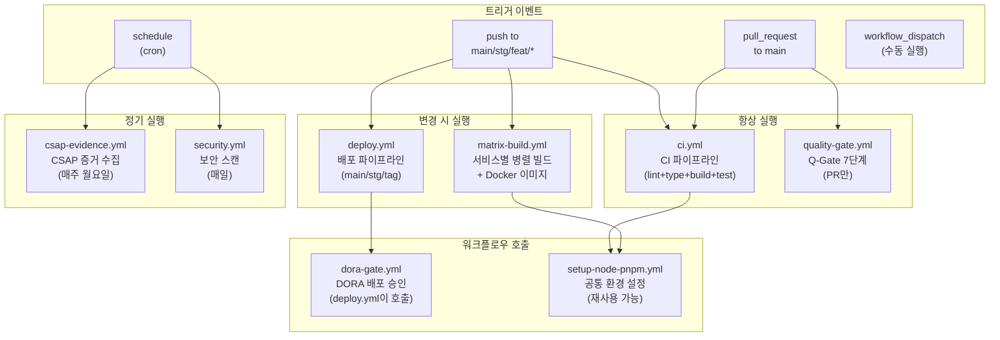
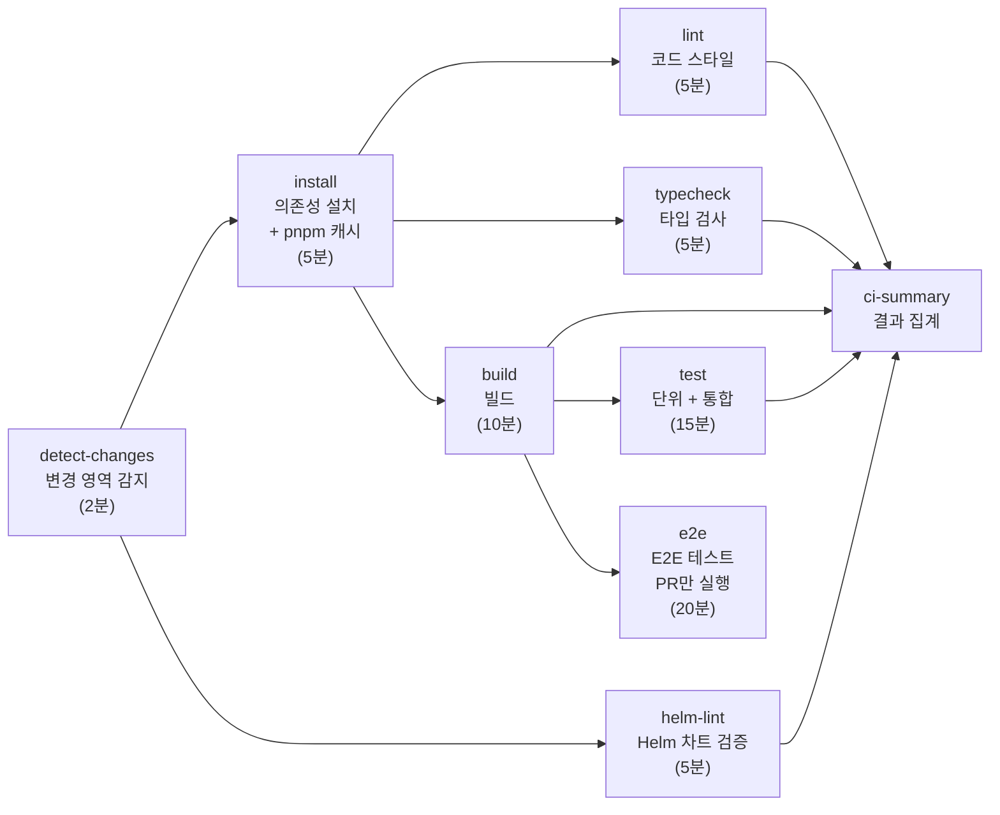
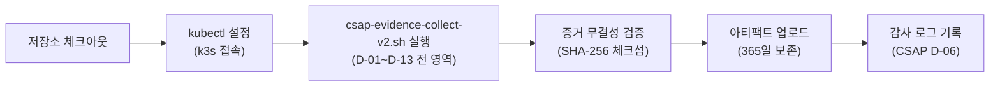
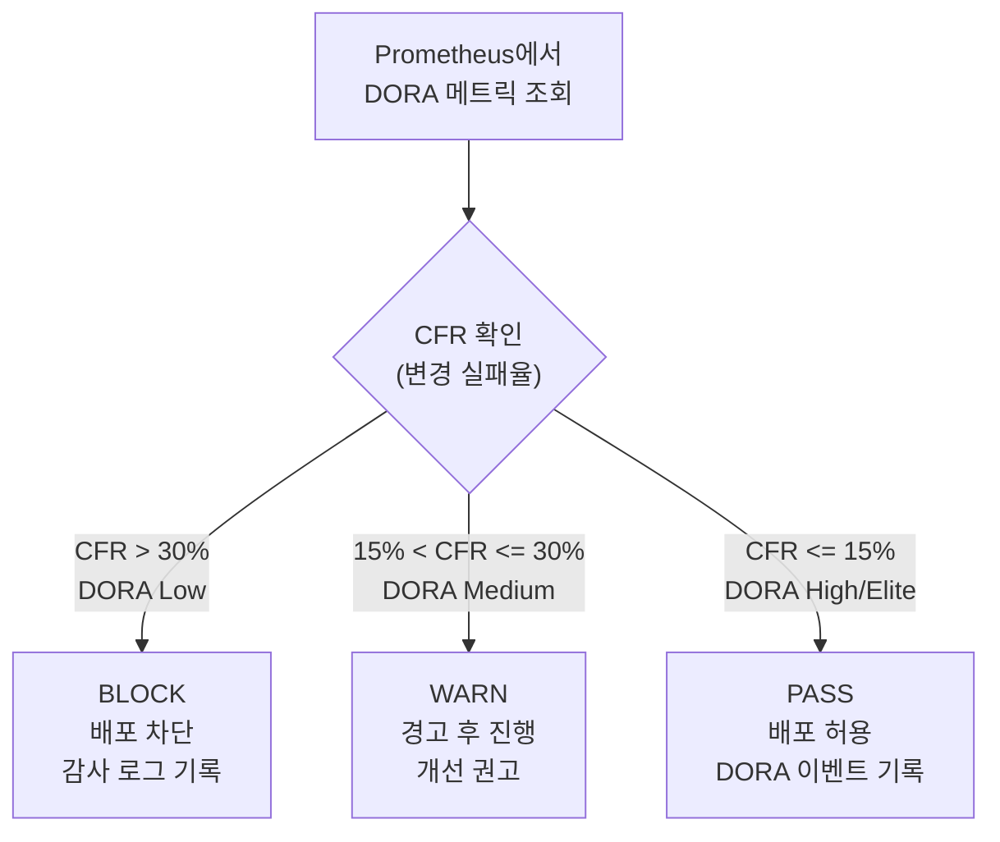
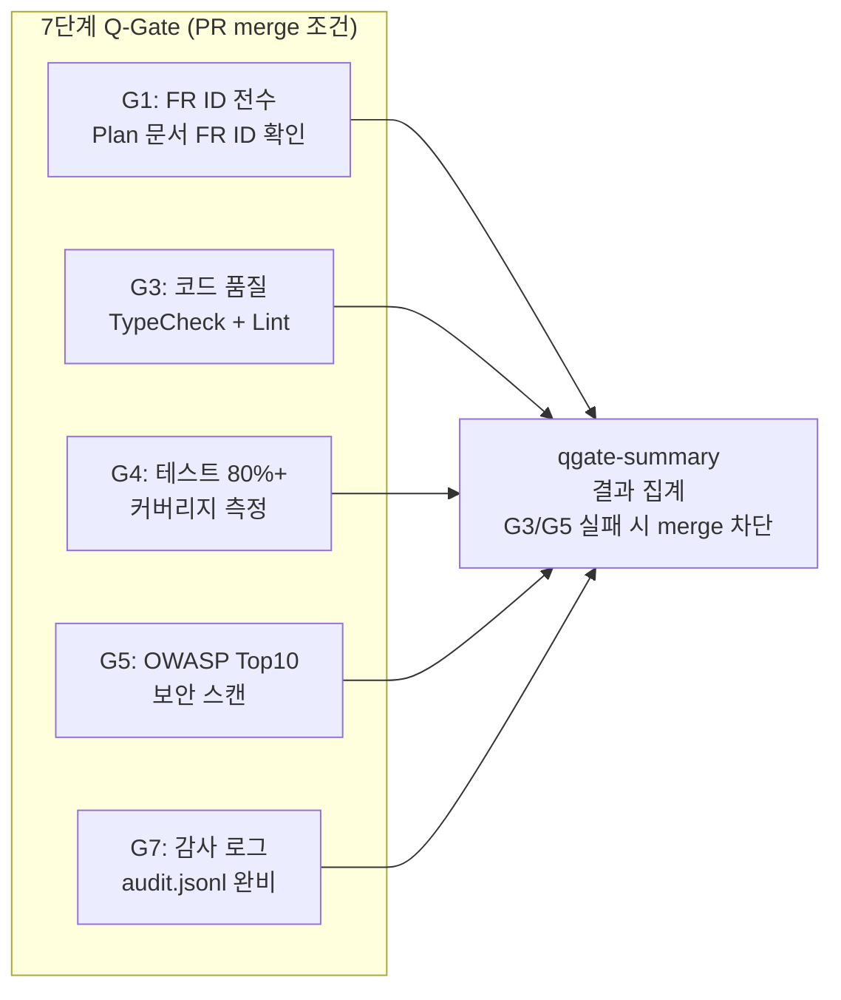
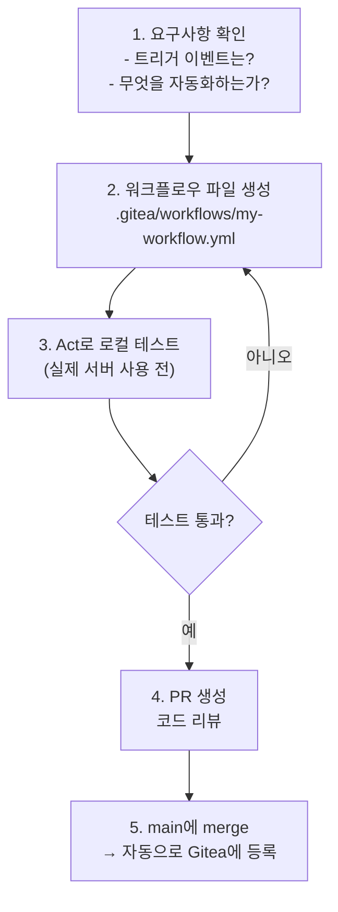
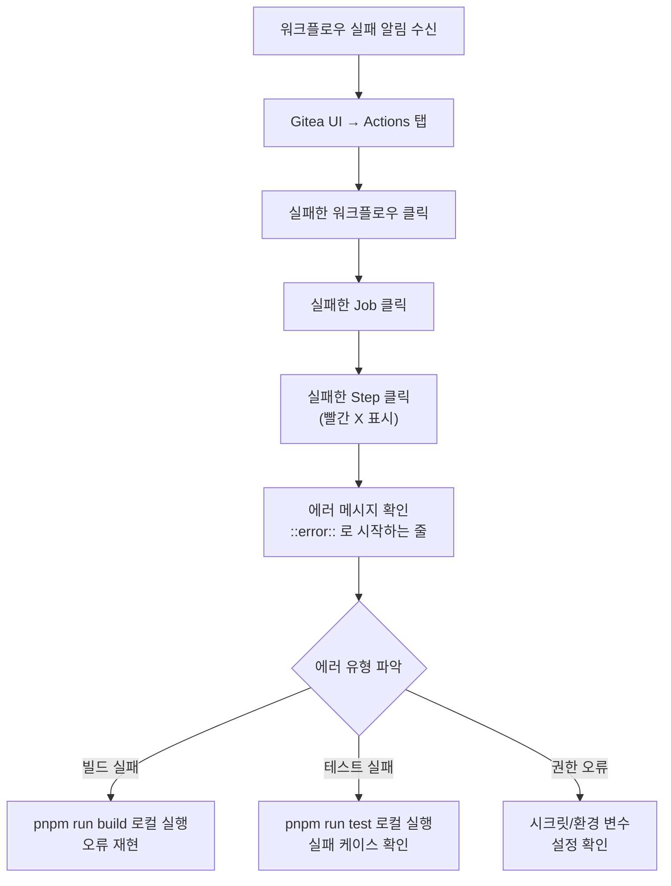

# 워크플로우 자동화 가이드 — Gitea Actions

> **문서 ID**: ONBOARD-06-05
> **버전**: 1.0.0 | **작성일**: 2026-04-12 | **작성자**: Implementer (Sonnet)
> **선행 학습**: `06-cicd/README.md`, `06-cicd/pipelines/`
> **소요 시간**: 약 4~5시간 (실습 포함)
> **CSAP**: D-12 (시스템 개발 보안 — CI/CD 파이프라인 보안)
> **Design Ref**: MTU-N244, MTU-N250, MTU-N251, MTU-N253

---

## 목차

1. [Gitea Actions 개요](#1-gitea-actions-개요)
2. [이 프로젝트의 워크플로우 전체 목록](#2-이-프로젝트의-워크플로우-전체-목록)
3. [각 워크플로우 상세 해설](#3-각-워크플로우-상세-해설)
4. [커스텀 워크플로우 만들기](#4-커스텀-워크플로우-만들기)
5. [워크플로우 디버깅](#5-워크플로우-디버깅)
6. [워크플로우 보안](#6-워크플로우-보안)
7. [실습: Slack 알림 워크플로우 추가하기](#7-실습-slack-알림-워크플로우-추가하기)
8. [변경 이력](#8-변경-이력)

---

## 1. Gitea Actions 개요

### 1.1 Gitea Actions란

Gitea Actions는 GitHub Actions와 거의 동일한 문법을 사용하는 CI/CD 자동화 엔진입니다. 공개 인터넷 없이 온프레미스에서 실행할 수 있어 공공기관 환경에 적합합니다.

```
GitHub Actions   ← GitHub.com에서 실행 (외부 클라우드)
Gitea Actions    ← 자체 서버에서 실행 (이 프로젝트 사용)
```

### 1.2 GitHub Actions와의 주요 차이점

| 항목 | GitHub Actions | Gitea Actions |
|------|--------------|--------------|
| 실행 환경 | GitHub.com 클라우드 | 자체 서버 (self-hosted) |
| Runner | GitHub-managed 또는 self-hosted | 반드시 self-hosted |
| Marketplace | actions.github.com | Gitea Action 호환 (대부분 동작) |
| 문법 | YAML | 동일 YAML |
| 트리거 | `on:` 동일 | 일부 이벤트 미지원 |
| 시크릿 | GitHub Secrets | Gitea Secrets (동일 개념) |
| 비용 | 무료/유료 | 서버 비용만 |
| 인터넷 | 필요 | 불필요 (인터넷 차단 환경 가능) |

**호환되지 않는 GitHub Actions 기능**:
- `actions/github-script` (일부 API 다름)
- GitHub-specific 환경 변수 일부 (`GITHUB_GRAPHQL_URL` 등)
- GitHub Packages (Harbor 레지스트리로 대체)
- GitHub Environments (별도 설정 필요)

### 1.3 워크플로우 파일 위치

```
/data/ai-saas/.gitea/workflows/
├── ci.yml               ← PR 검증 (핵심 파이프라인)
├── matrix-build.yml     ← 병렬 서비스 빌드
├── deploy.yml           ← 배포 파이프라인
├── quality-gate.yml     ← Q-Gate 7단계 검증
├── csap-evidence.yml    ← CSAP 증거 자동 수집
├── dora-gate.yml        ← DORA 메트릭 배포 승인
├── security.yml         ← 보안 스캔
├── devsecops.yml        ← DevSecOps 통합
├── detect-changes.yml   ← 모노레포 변경 감지
├── matrix-build.yml     ← 서비스별 병렬 빌드
├── setup-node-pnpm.yml  ← 공통 빌드 환경 설정
├── release.yml          ← 릴리즈 생성
├── sbom-scan.yml        ← SBOM 생성 + 스캔
├── sign-image.yml       ← 이미지 서명 (Cosign)
└── slsa-provenance.yml  ← SLSA 공급망 보안
```

---

## 2. 이 프로젝트의 워크플로우 전체 목록



---

## 3. 각 워크플로우 상세 해설

### 3.1 ci.yml — 핵심 CI 파이프라인

이 프로젝트의 가장 중요한 워크플로우입니다. 모든 코드 변경이 이 파이프라인을 통과해야 합니다.

**실행 조건**: `main`, `stg`, `feat/*`, `fix/*` 브랜치에 push 또는 `main`으로 PR



**핵심 설계 포인트**:

```yaml
# .gitea/workflows/ci.yml
name: CI

on:
  push:
    branches: [main, stg, "feat/*", "fix/*"]
  pull_request:
    branches: [main]
  workflow_call:        # ← 다른 워크플로우에서 호출 가능
    inputs:
      ref:
        type: string

concurrency:
  group: ci-${{ github.ref }}
  cancel-in-progress: true  # ← 이전 실행 자동 취소 (불필요한 중복 방지)
```

**변경 감지 (Affected Build)**:

```yaml
detect-changes:
  steps:
    - name: Detect affected paths
      run: |
        # PR이면 base 브랜치와 비교, push면 이전 커밋과 비교
        CHANGED_FILES=$(git diff --name-only "$BASE_SHA" HEAD)

        if echo "$CHANGED_FILES" | grep -q '^platform/services/'; then
          SVC_CHANGED="true"
        fi
        # ... 변경된 영역 분류
```

💡 이 감지 덕분에 문서만 변경했을 때는 빌드/테스트가 실행되지 않아 시간을 절약합니다.

**서비스 컨테이너 (통합 테스트용)**:

```yaml
test:
  services:
    postgres:
      image: postgres:16-alpine
      env:
        POSTGRES_USER: saas
        POSTGRES_PASSWORD: saas_test_2026
        POSTGRES_DB: saas_platform_test
      options: >-
        --health-cmd "pg_isready -U saas"
        --health-interval 5s

    redis:
      image: redis:7-alpine
      options: >-
        --health-cmd "redis-cli ping"
```

테스트 실행 시 실제 PostgreSQL과 Redis가 컨테이너로 시작됩니다. 따라서 단위 테스트가 아닌 통합 테스트도 CI에서 실행됩니다.

### 3.2 matrix-build.yml — 병렬 빌드

16개 마이크로서비스를 최대 4개씩 병렬로 빌드합니다.

**실행 조건**: `main`, `stg` 브랜치에 push, 서비스/패키지 코드 변경 시

```yaml
# .gitea/workflows/matrix-build.yml

jobs:
  build:
    strategy:
      matrix:
        service: ${{ fromJson(needs.detect-changes.outputs.services) }}
      max-parallel: 4    # 동시 최대 4개 서비스 빌드
      fail-fast: false   # 한 서비스 실패해도 나머지 계속 빌드
```

**변경된 서비스만 빌드**:

```yaml
detect-changes:
  steps:
    - name: 변경된 서비스 탐지
      run: |
        # 공통 패키지 변경 시: 전체 16개 서비스 빌드
        if echo "$CHANGED_FILES" | grep -q '^platform/packages/'; then
          CHANGED_SERVICES='["api-gateway","auth-service",...,"security-monitor-service"]'
        fi

        # 서비스 코드만 변경 시: 해당 서비스만 빌드
        CHANGED_SERVICES=$(echo "$CHANGED_FILES" | \
          grep '^platform/services/' | \
          cut -d'/' -f3 | \
          sort -u | \
          jq -R -s -c 'split("\n") | map(select(length > 0))')
```

**Docker BuildKit GHA 캐시**:

```yaml
- name: Build Docker Image
  uses: docker/build-push-action@v5
  with:
    cache-from: type=gha,scope=${{ matrix.service }}
    cache-to: type=gha,scope=${{ matrix.service }},mode=max
```

서비스별로 별도 캐시 범위(`scope`)를 사용합니다. `auth-service` 빌드 캐시가 `user-service`에 영향을 주지 않습니다.

### 3.3 csap-evidence.yml — CSAP 증거 수집 자동화

공공기관 CSAP 인증을 위한 증거를 자동으로 수집합니다.

**실행 조건**: 매주 월요일 09:00 KST (자동) 또는 수동 트리거

```yaml
# .gitea/workflows/csap-evidence.yml

on:
  schedule:
    - cron: '0 0 * * 1'  # 매주 월요일 00:00 UTC (09:00 KST)
  workflow_dispatch:      # 수동 트리거
    inputs:
      date:
        description: '수집 기준일 (YYYY-MM-DD)'
      controls:
        description: '수집 대상 통제항목 (예: D-06,D-08 또는 all)'
        default: 'all'
```

**수집 과정**:



**수집되는 증거 예시**:

```
evidence/2026-04-14/
├── D-06-audit-log/           ← 감사 로그 무결성 증거
│   ├── audit-sample.jsonl    ← 최근 감사 로그 샘플
│   └── hash-chain-verify.txt ← 해시 체인 검증 결과
├── D-08-access-control/      ← 접근 통제 증거
│   ├── rbac-policy.yaml      ← RBAC 설정
│   └── session-config.txt    ← 세션 설정
├── D-09-encryption/          ← 암호화 증거
│   ├── tls-config.txt        ← TLS 인증서 정보
│   └── encryption-scan.txt   ← 하드코딩 시크릿 스캔 결과
└── manifest.sha256           ← 전체 파일 무결성
```

**수동 실행 방법**:

```bash
# Gitea 웹 UI에서: Actions → CSAP 증거 수집 → Run workflow

# 또는 Gitea CLI로:
gitea workflow run csap-evidence --ref main \
  -f date=2026-04-14 \
  -f controls=D-06,D-08
```

### 3.4 dora-gate.yml — DORA 메트릭 배포 승인

배포 전 DORA Four Keys 메트릭을 확인하여 품질 기준 미달 시 배포를 차단합니다.

**Design Ref**: MTU-N251 §3.7 — 변경 실패율(CFR) 기반 게이트

```yaml
# .gitea/workflows/dora-gate.yml
# 이 워크플로우는 직접 실행되지 않음 — deploy.yml이 호출

on:
  workflow_call:        # ← deploy.yml에서 호출
    inputs:
      namespace:        # 배포 대상 네임스페이스
      team:             # 배포 팀
      deploy_duration:  # 배포 소요 시간 (초)
    outputs:
      gate_result:      # pass / warn / block
      cfr:              # 현재 변경 실패율 (%)
```

**게이트 판정 로직**:



```bash
# CFR 기반 판정 실제 코드
CFR_INT=$(echo "$CFR" | cut -d'.' -f1)

if [ "${CFR_INT}" -gt 30 ]; then
  echo "result=block"
  echo "::error::DORA 게이트 차단: 변경 실패율 ${CFR}% > 30%"
  exit 1  # 비정상 종료 → deploy.yml 중단
elif [ "${CFR_INT}" -gt 15 ]; then
  echo "result=warn"
  echo "::warning::경고: 변경 실패율 ${CFR}% > 15%"
else
  echo "result=pass"
fi
```

### 3.5 quality-gate.yml — Q-Gate 7단계

PR이 `main` 또는 `stg`에 병합되기 전 7단계 품질 게이트를 통과해야 합니다.

**Design Ref**: MTU-N250, CLAUDE.md §6



**G5 보안 스캔 내용**:

```yaml
g5-owasp:
  steps:
    - name: Secret Detection
      run: |
        # 하드코딩된 API 키, 토큰 패턴 검색
        for pattern in "sk-[a-zA-Z0-9]{20,}" "PRIVATE.KEY"; do
          if grep -rn --include="*.ts" -E "$pattern" platform/; then
            echo "[CRITICAL] 시크릿 발견: $pattern"
            FOUND=1
          fi
        done

    - name: SQL Injection Pattern Check
      run: |
        # SQL 직접 문자열 결합 패턴 검색
        if grep -rn --include="*.ts" \
          -E "SELECT.*FROM.*\${|INSERT.*INTO.*\${" platform/services/; then
          echo "[WARN] SQL 직접 결합 패턴 의심"
        fi
```

### 3.6 security.yml + devsecops.yml — 보안 자동화

```yaml
# security.yml (매일 실행)
on:
  schedule:
    - cron: '0 2 * * *'  # 매일 02:00 UTC

steps:
  # 1. 의존성 취약점 스캔
  - name: npm audit
    run: pnpm audit --audit-level=high

  # 2. SBOM 생성 (소프트웨어 명세서)
  - name: Generate SBOM
    run: syft . -o cyclonedx-json > sbom.json

  # 3. 취약점 스캔 (Grype)
  - name: Vulnerability Scan
    run: grype sbom:sbom.json --fail-on high
```

---

## 4. 커스텀 워크플로우 만들기

### 4.1 새 워크플로우 추가 절차



**워크플로우 기본 템플릿**:

```yaml
# .gitea/workflows/my-workflow.yml
# Design Ref: {설계 문서 섹션}
# Plan SC: {FR ID}
# CSAP: {해당 통제항목}

name: 내 워크플로우 이름

on:
  push:
    branches: [main]
  workflow_dispatch:  # 수동 실행 허용 (개발 편의)

env:
  PNPM_VERSION: "9.15.0"  # 프로젝트 표준 버전 사용
  NODE_VERSION: "22"

jobs:
  my-job:
    name: 작업 이름
    runs-on: self-hosted  # 반드시 self-hosted (외부 클라우드 금지)
    timeout-minutes: 10   # 반드시 설정 (무한 대기 방지)

    steps:
      - name: Checkout
        uses: actions/checkout@v4

      - name: Setup pnpm
        uses: pnpm/action-setup@v4
        with:
          version: ${{ env.PNPM_VERSION }}

      - name: Setup Node.js
        uses: actions/setup-node@v4
        with:
          node-version: ${{ env.NODE_VERSION }}

      - name: 내 작업
        run: |
          echo "작업 실행"

      - name: 감사 로그 기록
        if: always()  # 성공/실패 무관 항상 실행
        run: |
          # CSAP D-06: 자동화 작업 감사 기록
          echo "{\"timestamp\":\"$(date -u +%Y-%m-%dT%H:%M:%SZ)\",\"actor\":\"ci\",\"action\":\"MY_ACTION\",\"csap_ref\":\"D-12\"}" >> .claude/audit.jsonl
```

### 4.2 시크릿 관리 (Gitea Secrets)

⚠️ **절대 금지**: 워크플로우 파일에 직접 시크릿 값 작성

```yaml
# ❌ 절대 금지 — 하드코딩된 시크릿
env:
  HARBOR_PASSWORD: "my-secret-password"  # CSAP D-12 위반!

# ✅ 올바른 방법 — Gitea Secrets 사용
env:
  HARBOR_PASSWORD: ${{ secrets.HARBOR_PASSWORD }}
```

**Gitea에서 시크릿 등록 방법**:

```
1. Gitea 웹 UI → 저장소 → Settings → Secrets and variables → Actions
2. "New repository secret" 클릭
3. Name: HARBOR_PASSWORD
4. Value: (실제 비밀번호)
5. "Add secret" 클릭
```

**이 프로젝트에서 사용하는 시크릿 목록**:

| 시크릿 이름 | 용도 | 참조 워크플로우 |
|------------|------|--------------|
| `HARBOR_URL` | Docker 레지스트리 URL | matrix-build.yml, deploy.yml |
| `HARBOR_USERNAME` | Harbor 로그인 사용자 | matrix-build.yml, deploy.yml |
| `HARBOR_PASSWORD` | Harbor 로그인 비밀번호 | matrix-build.yml, deploy.yml |
| `KUBECONFIG` | k3s 클러스터 접속 설정 | deploy.yml, csap-evidence.yml |

**Vault 연동 (고급)**:

```yaml
# HashiCorp Vault에서 시크릿 동적 발급
- name: Vault에서 Harbor 자격증명 가져오기
  uses: hashicorp/vault-action@v2
  with:
    url: ${{ secrets.VAULT_ADDR }}
    token: ${{ secrets.VAULT_TOKEN }}
    secrets: |
      secret/data/harbor password | HARBOR_PASSWORD ;
      secret/data/harbor username | HARBOR_USERNAME
```

### 4.3 환경별 실행 (dev/stg/prod)

```yaml
# 브랜치에 따라 다른 환경에 배포
jobs:
  deploy:
    steps:
      - name: 환경 결정
        id: env
        run: |
          if [[ "${{ github.ref }}" == refs/tags/v* ]]; then
            echo "name=prod" >> $GITHUB_OUTPUT
            echo "values=helm/values-prod.yaml" >> $GITHUB_OUTPUT
          elif [[ "${{ github.ref }}" == refs/heads/stg ]]; then
            echo "name=stg" >> $GITHUB_OUTPUT
            echo "values=helm/values-stg.yaml" >> $GITHUB_OUTPUT
          else
            echo "name=dev" >> $GITHUB_OUTPUT
            echo "values=helm/values-dev.yaml" >> $GITHUB_OUTPUT
          fi

      - name: Helm 배포
        run: |
          helm upgrade --install saas-${{ steps.env.outputs.name }} \
            ./helm/saas-platform/ \
            -f ${{ steps.env.outputs.values }} \
            --namespace saas-platform
```

---

## 5. 워크플로우 디버깅

### 5.1 로컬에서 Act로 테스트하기

[Act](https://github.com/nektos/act)를 사용하면 실제 Gitea 서버 없이 로컬에서 워크플로우를 테스트할 수 있습니다.

```bash
# Act 설치
curl -s https://raw.githubusercontent.com/nektos/act/master/install.sh | sudo bash

# 특정 이벤트로 워크플로우 실행 (docker 필요)
act push -W .gitea/workflows/ci.yml

# 특정 job만 실행
act push -W .gitea/workflows/ci.yml -j lint

# 시크릿 지정
act push -W .gitea/workflows/ci.yml \
  -s HARBOR_PASSWORD=test-password \
  -s HARBOR_USERNAME=test-user

# 환경 변수 확인 (dry-run)
act push -W .gitea/workflows/ci.yml --dry-run
```

**Act 사용 시 주의사항**:

```yaml
# Act에서는 self-hosted runner 대신 ubuntu-latest 사용
# 로컬 테스트 시 임시 오버라이드 가능
jobs:
  my-job:
    runs-on: ubuntu-latest  # 로컬 테스트용 (커밋 전 self-hosted로 변경)
```

### 5.2 워크플로우 실패 시 로그 읽는 법



**자주 발생하는 에러와 해결법**:

```bash
# 에러 1: pnpm store 캐시 문제
# 증상: pnpm install 무한 대기 또는 실패
# 해결: 캐시 무효화
git commit --allow-empty -m "ci: pnpm cache bust"
# 또는 Gitea UI에서 Actions cache 삭제

# 에러 2: Docker 이미지 빌드 실패
# 증상: docker build 명령에서 실패
# 해결: 로컬에서 직접 빌드해 재현
docker build -f platform/services/auth-service/Dockerfile . \
  --progress=plain \
  --no-cache

# 에러 3: kubectl 권한 없음
# 증상: Error: forbidden: user ... cannot get pods
# 해결: KUBECONFIG 시크릿 갱신 또는 RBAC 확인
kubectl auth can-i get pods --namespace saas-platform

# 에러 4: pnpm frozen-lockfile 실패
# 증상: ERR_PNPM_OUTDATED_LOCKFILE
# 해결: 로컬에서 lockfile 갱신
pnpm install --no-frozen-lockfile
git add pnpm-lock.yaml
git commit -m "chore: update pnpm-lock.yaml"
```

### 5.3 비결정적 실패 (Flaky Test) 대처

같은 코드인데 CI에서 간헐적으로 실패하는 경우입니다.

**원인 분류 및 해결**:

```yaml
# 원인 1: DB/Redis 준비 전 테스트 실행
# 해결: health check 옵션 추가
services:
  postgres:
    options: >-
      --health-cmd "pg_isready -U saas"
      --health-interval 5s
      --health-timeout 5s
      --health-retries 10   # 재시도 횟수 증가

# 원인 2: 타임아웃 너무 짧음
# 해결: timeout-minutes 증가
jobs:
  test:
    timeout-minutes: 20  # 15 → 20

# 원인 3: 경쟁 조건 (Race Condition)
# 해결: 재시도 로직 추가
- name: Test with retry
  run: |
    for i in 1 2 3; do
      pnpm run test && break
      echo "시도 $i 실패, 재시도..."
      sleep 5
    done
```

---

## 6. 워크플로우 보안

### 6.1 시크릿 노출 방지

```yaml
# ✅ 시크릿 값을 로그에서 마스킹
- name: 시크릿 사용
  run: |
    # ::add-mask:: 명령으로 이후 로그에서 해당 값 자동 마스킹
    echo "::add-mask::${{ secrets.MY_SECRET }}"

    # 이제 MY_SECRET 값은 로그에서 *** 로 표시됨
    echo "연결 중: ${{ secrets.MY_SECRET }}"
    # 출력: 연결 중: ***

# ✅ 환경 변수로 전달 (명령어 라인에 직접 사용 금지)
- name: 안전한 시크릿 사용
  env:
    HARBOR_PASS: ${{ secrets.HARBOR_PASSWORD }}  # 환경 변수로 주입
  run: |
    # 명령어 인자로 전달하면 ps aux에서 노출됨 → 금지
    # docker login --password "${{ secrets.HARBOR_PASSWORD }}"  ← 위험!

    # 환경 변수 또는 stdin으로 전달 → 안전
    echo "$HARBOR_PASS" | docker login "$REGISTRY" -u "$HARBOR_USER" --password-stdin
```

### 6.2 Pull Request 권한 제한

외부 기여자의 PR이 악의적인 워크플로우 코드를 실행하지 못하도록 제한합니다.

```yaml
# 외부 PR에서 시크릿 접근 제한
on:
  pull_request:
    branches: [main]

# pull_request 이벤트는 외부 포크에서 secrets에 접근 불가
# 내부 기여자(collaborator)만 시크릿 접근 가능
# → 이 프로젝트는 내부 팀만 사용하므로 문제 없음

# 만약 외부 기여자 PR을 받아야 한다면:
# pull_request_target 이벤트 사용 (주의: 보안 검토 필수)
```

### 6.3 OIDC 기반 인증 (미래 확장)

```yaml
# 시크릿 대신 OIDC 토큰으로 클라우드 자격증명 획득
# (현재 미사용 — 참고용)
permissions:
  id-token: write   # OIDC 토큰 발급 권한

- name: OIDC로 Vault 인증
  uses: hashicorp/vault-action@v2
  with:
    url: https://vault.internal
    method: jwt
    role: gitea-ci
    # 시크릿 없이 Vault에서 자격증명 동적 발급
```

### 6.4 최소 권한 원칙

```yaml
# 워크플로우에 필요한 최소 권한만 부여
permissions:
  contents: read    # 코드 읽기만 허용
  # packages: write # 이 job에서 패키지 쓰기 불필요 → 명시 안 함

jobs:
  build:
    permissions:
      contents: read   # checkout만 필요

  deploy:
    permissions:
      contents: read
      packages: write  # 이미지 푸시 필요
```

---

## 7. 실습: Slack 알림 워크플로우 추가하기

### 7.1 목표

배포 완료 또는 CI 실패 시 Slack 채널에 자동 알림을 보내는 워크플로우를 추가합니다.

### 7.2 사전 준비

```bash
# 1. Slack Incoming Webhook URL 생성
# Slack → Apps → Incoming WebHooks → Add to Slack
# Webhook URL 형식: https://hooks.slack.com/services/XXX/YYY/ZZZ

# 2. Gitea에 시크릿 등록
# Gitea UI → Settings → Secrets → New secret
# Name: SLACK_WEBHOOK_URL
# Value: https://hooks.slack.com/services/...
```

### 7.3 워크플로우 구현

```yaml
# .gitea/workflows/slack-notify.yml
# Design Ref: §7 — 배포 알림
# Plan SC: FR-NOTIFY.1

name: Slack 알림

on:
  # 배포 완료 시
  workflow_run:
    workflows: ["Deploy"]
    types: [completed]

  # CI 실패 시 (main 브랜치만)
  push:
    branches: [main]

jobs:
  # ==========================================================================
  # 배포 완료 알림
  # ==========================================================================
  deploy-notification:
    name: 배포 알림
    runs-on: self-hosted
    if: github.event_name == 'workflow_run'
    timeout-minutes: 2

    steps:
      - name: 배포 결과 알림
        env:
          SLACK_WEBHOOK: ${{ secrets.SLACK_WEBHOOK_URL }}
          DEPLOY_STATUS: ${{ github.event.workflow_run.conclusion }}
          BRANCH: ${{ github.event.workflow_run.head_branch }}
          COMMIT: ${{ github.event.workflow_run.head_sha }}
          ACTOR: ${{ github.event.workflow_run.triggering_actor.login }}
        run: |
          if [ "$DEPLOY_STATUS" = "success" ]; then
            COLOR="#36a64f"  # 초록
            ICON=":white_check_mark:"
            STATUS_TEXT="배포 성공"
          else
            COLOR="#ff0000"  # 빨강
            ICON=":x:"
            STATUS_TEXT="배포 실패"
          fi

          SHORT_COMMIT="${COMMIT:0:7}"

          # Slack Block Kit 형식으로 메시지 구성
          PAYLOAD=$(cat <<EOF
          {
            "attachments": [
              {
                "color": "${COLOR}",
                "blocks": [
                  {
                    "type": "header",
                    "text": {
                      "type": "plain_text",
                      "text": "${ICON} ${STATUS_TEXT}"
                    }
                  },
                  {
                    "type": "section",
                    "fields": [
                      {
                        "type": "mrkdwn",
                        "text": "*브랜치:*\n${BRANCH}"
                      },
                      {
                        "type": "mrkdwn",
                        "text": "*커밋:*\n${SHORT_COMMIT}"
                      },
                      {
                        "type": "mrkdwn",
                        "text": "*배포자:*\n${ACTOR}"
                      },
                      {
                        "type": "mrkdwn",
                        "text": "*시각:*\n$(date -u '+%Y-%m-%d %H:%M UTC')"
                      }
                    ]
                  }
                ]
              }
            ]
          }
          EOF
          )

          # Slack Webhook으로 전송
          curl -s -X POST \
            -H "Content-Type: application/json" \
            --data "$PAYLOAD" \
            "$SLACK_WEBHOOK"

      - name: 감사 로그 기록
        if: always()
        run: |
          # CSAP D-06: 알림 발송 기록
          echo "{\"timestamp\":\"$(date -u +%Y-%m-%dT%H:%M:%SZ)\",\"actor\":\"slack-notify\",\"action\":\"DEPLOY_NOTIFICATION_SENT\",\"detail\":\"status=${{ github.event.workflow_run.conclusion }}\",\"csap_ref\":\"D-06\"}" >> .claude/audit.jsonl

  # ==========================================================================
  # CI 실패 알림 (main 브랜치만)
  # ==========================================================================
  ci-failure-alert:
    name: CI 실패 알림
    runs-on: self-hosted
    if: github.event_name == 'push' && github.ref == 'refs/heads/main'
    timeout-minutes: 2
    # 주의: 이 job은 항상 실행되므로 CI 상태를 별도로 확인해야 함
    # 실제로는 ci.yml의 on-failure 또는 외부 알림 시스템 사용 권장

    steps:
      - name: CI 결과 확인 및 알림
        env:
          SLACK_WEBHOOK: ${{ secrets.SLACK_WEBHOOK_URL }}
        run: |
          # 이 예시는 단순화된 버전
          # 실제 구현 시 GitHub API로 이전 CI 실행 결과 조회 필요
          echo "CI 실패 알림 로직 구현 위치"
```

### 7.4 테스트 및 검증

```bash
# 1. Act로 로컬 테스트 (Slack 실제 전송 없이)
act workflow_run \
  -W .gitea/workflows/slack-notify.yml \
  -s SLACK_WEBHOOK_URL=https://hooks.example.com/test \
  --dry-run

# 2. 테스트용 Webhook으로 실제 전송 테스트
curl -s -X POST \
  -H "Content-Type: application/json" \
  --data '{"text": "CI/CD 알림 테스트"}' \
  "$SLACK_WEBHOOK_URL"

# 3. Gitea에 PR 생성 → 워크플로우 실행 확인
git checkout -b feat/slack-notification
git add .gitea/workflows/slack-notify.yml
git commit -m "feat(cicd): Slack 배포 알림 워크플로우 추가"
git push origin feat/slack-notification
# Gitea에서 PR 생성 → Actions 탭에서 워크플로우 실행 확인
```

### 7.5 확장 아이디어

```yaml
# 심각도별 알림 채널 분리
# - 배포 성공: #deployments 채널
# - CI 실패: #ci-alerts 채널
# - 보안 취약점: #security-alerts 채널 (즉시 알림)

# 방법: 채널별 Webhook URL을 별도 시크릿으로 관리
SLACK_DEPLOYMENTS_WEBHOOK: ${{ secrets.SLACK_DEPLOYMENTS_WEBHOOK }}
SLACK_SECURITY_WEBHOOK: ${{ secrets.SLACK_SECURITY_WEBHOOK }}
```

---

## 8. 변경 이력

| 버전 | 일자 | 내용 | 작성자 |
|------|------|------|--------|
| 1.0.0 | 2026-04-12 | 최초 작성 — Gitea Actions 워크플로우 자동화 가이드 | Implementer (Sonnet) |

---

## 학습 체크리스트

**Gitea Actions 기본 이해**
- [ ] Gitea Actions와 GitHub Actions의 핵심 차이를 3가지 설명할 수 있다
- [ ] `.gitea/workflows/` 디렉토리에 있는 파일 목록을 보고 각 파일의 역할을 설명할 수 있다
- [ ] `workflow_call`과 `workflow_dispatch`의 차이를 설명할 수 있다

**CI 파이프라인 이해**
- [ ] `ci.yml`의 job 실행 순서를 그림으로 그릴 수 있다
- [ ] `detect-changes` job이 왜 필요한지, 어떤 최적화를 가져오는지 설명할 수 있다
- [ ] `concurrency: cancel-in-progress: true` 설정의 효과를 설명할 수 있다
- [ ] CI에서 PostgreSQL과 Redis 컨테이너를 사용하는 이유를 설명할 수 있다

**보안 관련**
- [ ] 하드코딩된 시크릿을 워크플로우에 작성하면 안 되는 이유와 올바른 대안을 설명할 수 있다
- [ ] `::add-mask::` 명령의 역할을 설명할 수 있다
- [ ] G5 OWASP 게이트에서 어떤 패턴을 탐지하는지 설명할 수 있다

**CSAP/DORA 관련**
- [ ] `csap-evidence.yml`이 수집하는 증거의 종류를 3가지 이상 설명할 수 있다
- [ ] DORA 게이트에서 CFR 30% 초과 시 어떤 일이 발생하는지 설명할 수 있다
- [ ] Q-Gate에서 `G3`와 `G5` 실패가 다른 게이트와 다르게 처리되는 이유를 설명할 수 있다

**실습**
- [ ] Act를 설치하고 `ci.yml`의 `lint` job을 로컬에서 실행했다
- [ ] Slack 알림 워크플로우를 추가하고 Gitea에서 실행을 확인했다
- [ ] 의도적으로 워크플로우를 실패시키고 로그에서 에러를 찾아 수정했다

---

## 다음 단계

- `06-cicd/pipelines/` — 파이프라인 상세 구성
- `06-cicd/deployment/` — Helm 배포 전략
- `04-infrastructure/components/08-monitoring.md` — Prometheus/Grafana로 CI 메트릭 모니터링
