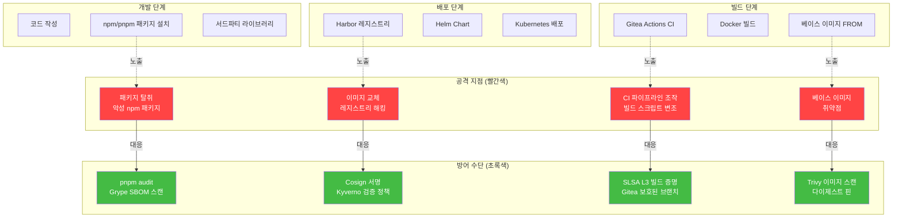
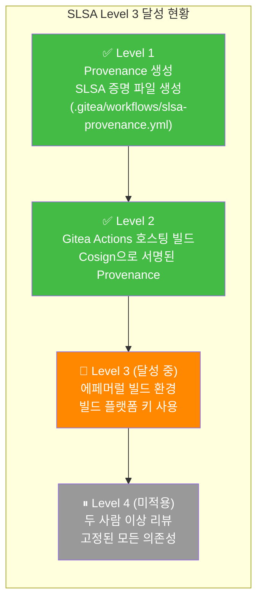
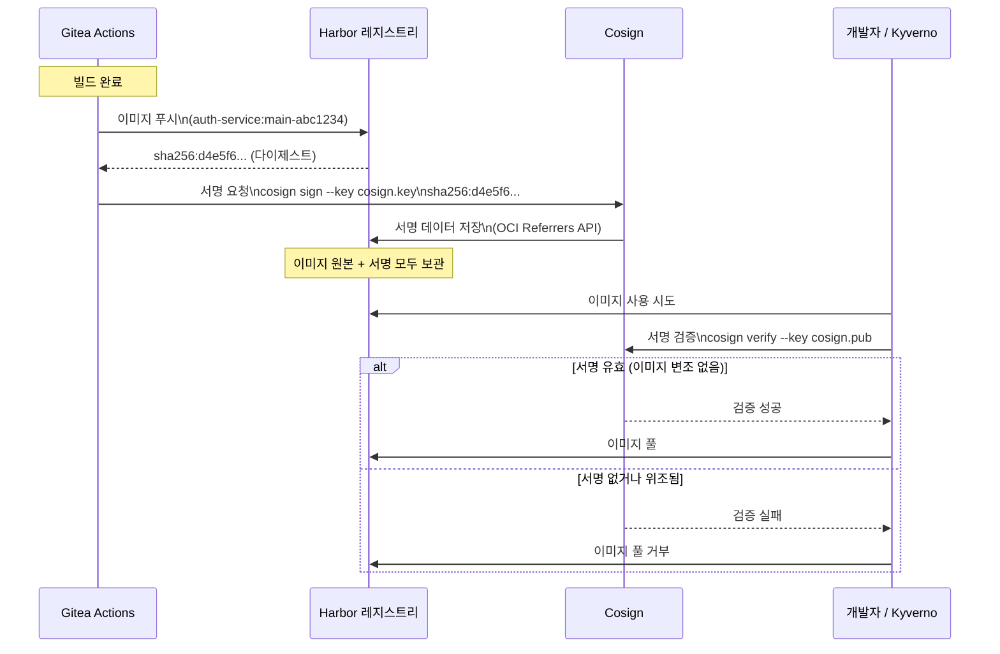

```mermaid
flowchart TD
    subgraph "공급망 보안 전체 플로우"
        CODE[코드 작성\n+ 의존성 추가]
        AUDIT[pnpm audit\n의존성 검사]
        COMMIT[Git 커밋\n+ PR 생성]
        CI[Gitea Actions CI\n자동 실행]

        subgraph "CI 보안 게이트"
            SEMGREP[Semgrep\nSAST 정적 분석]
            TRIVY_FS[Trivy\nFilesystem 스캔]
            BUILD[Docker 이미지 빌드]
            TRIVY_IMG[Trivy\n이미지 스캔]
            SIGN[Cosign\n이미지 서명]
            SBOM[Syft\nSBOM 생성]
            GRYPE[Grype\nSBOM 취약점 스캔]
            SLSA[SLSA\nProvenance 생성]
            ATTEST[Cosign\nSBOM Attestation]
        end

        MERGE[PR 머지]
        DEPLOY[Kyverno 검증 후\nKubernetes 배포]
        MONITOR[Falco\n런타임 모니터링]
        CSAP_EV[CSAP 증거 보관\n365일 아티팩트]
    end

    CODE --> AUDIT
    AUDIT -->|통과| COMMIT
    AUDIT -->|실패| CODE
    COMMIT --> CI

    CI --> SEMGREP
    CI --> TRIVY_FS
    SEMGREP -->|통과| BUILD
    TRIVY_FS -->|통과| BUILD
    BUILD --> TRIVY_IMG
    TRIVY_IMG -->|통과| SIGN
    SIGN --> SBOM
    SBOM --> GRYPE
    GRYPE -->|통과| SLSA
    SLSA --> ATTEST

    ATTEST --> MERGE
    MERGE --> DEPLOY
    DEPLOY --> MONITOR
    CI --> CSAP_EV

    style CODE fill:#4488ff,color:#fff
    style SIGN fill:#44bb44,color:#fff
    style DEPLOY fill:#44bb44,color:#fff
    style CSAP_EV fill:#8844bb,color:#fff
```

# 소프트웨어 공급망 보안 (Supply Chain Security)

> **문서 ID**: ONBOARD-06-06
> **버전**: 1.0.0 | **작성일**: 2026-04-12 | **작성자**: Implementer (Sonnet)
> **학습 대상**: DevSecOps 파이프라인을 이해하고 공급망 보안을 적용하려는 신규 팀원
> **선행 문서**: `06-cicd/pipelines/03-devsecops.md` — DevSecOps 파이프라인
> **예상 소요 시간**: 약 90분
> **CSAP**: D-05 (공급망 보안), D-11 (가상화 보안), D-12 (시스템 개발 보안), D-06 (감사 로그)
> **Design Ref**: MTU-N37 (SBOM), MTU-N46 (SLSA), MTU-N80 (Kyverno 정책)

---

## 목차

1. [소프트웨어 공급망 공격이란?](#1-소프트웨어-공급망-공격이란)
2. [이 프로젝트의 공급망 공격 노출 지점](#2-이-프로젝트의-공급망-공격-노출-지점)
3. [SLSA — 공급망 보안 프레임워크](#3-slsa--공급망-보안-프레임워크)
4. [컨테이너 이미지 서명 — Cosign](#4-컨테이너-이미지-서명--cosign)
5. [SBOM — 소프트웨어 재료 목록](#5-sbom--소프트웨어-재료-목록)
6. [의존성 보안](#6-의존성-보안)
7. [공급망 보안 체크리스트](#7-공급망-보안-체크리스트)
8. [학습 체크리스트](#학습-체크리스트)
9. [다음 단계](#다음-단계)

---

## 1. 소프트웨어 공급망 공격이란?

### 1.1 공급망 공격의 개념

소프트웨어 공급망 공격(Supply Chain Attack)은 직접적인 목표 시스템을 공격하는 대신, 목표 시스템이 **의존하는 소프트웨어, 라이브러리, 빌드 도구**를 공격하는 방식입니다.

```
일반적인 공격:
  공격자 → [방어벽] → 목표 시스템
               ↑ 막혀 있음

공급망 공격:
  공격자 → npm 패키지 → 개발자 의존성 → 빌드 → 배포 → 목표 시스템
                                    ↑ 우회로!
```

식품 비유: 레스토랑(목표)의 경비를 뚫는 대신, 레스토랑에 식재료를 공급하는 납품업체(공급망)에 독을 넣는 것과 같습니다.

### 1.2 실제 사건 교훈

#### SolarWinds 공격 (2020)

**무슨 일이 일어났나**:
- SolarWinds Orion 모니터링 소프트웨어의 **빌드 서버**가 해킹됨
- 빌드 과정에서 악성 코드가 소프트웨어에 자동 삽입됨
- 18,000개 이상의 조직이 악성 업데이트를 설치
- 미국 재무부, 국무부, 국방부 등 정부 기관 침해

**교훈**:
- 소프트웨어 업데이트 자체를 신뢰할 수 없음
- 빌드 환경과 빌드 프로세스 무결성 보장 필요
- **SLSA(Supply chain Levels for Software Artifacts)** 프레임워크 탄생 계기

#### Log4Shell (Log4j, 2021)

**무슨 일이 일어났나**:
- Java 로깅 라이브러리 `log4j`에서 원격 코드 실행(RCE) 취약점 발견
- 수억 개의 자바 애플리케이션이 이 라이브러리를 사용 중이었음
- 공격자는 로그 메시지 하나로 서버에 임의 코드 실행 가능
- CVSS 점수 10.0 (최고 심각도)

**교훈**:
- 간접 의존성(의존성의 의존성)까지 추적 필요
- **SBOM(Software Bill of Materials)** 이 없으면 어떤 서비스가 영향받는지 파악 불가
- 취약한 버전 즉시 탐지를 위한 자동화된 스캔 필수

#### Trivy 공급망 공격 (2026-03-19)

> 💡 이것은 이 프로젝트의 실제 대응 사례입니다. `.gitea/workflows/sbom-scan.yml`에 기록되어 있습니다.

**무슨 일이 일어났나**:
- 보안 스캔 도구 Trivy 자체의 배포 채널이 조작됨
- Trivy를 통해 악성 코드 배포 시도

**이 프로젝트의 대응**:
- SBOM 스캔에 Trivy 대신 **Grype**로 전환
- 모든 바이너리 다운로드 시 **SHA256 체크섬 검증** 의무화
- GitHub Actions 태그 대신 **커밋 SHA 핀 고정**

```yaml
# 잘못된 방식 — 태그는 변경될 수 있음
uses: anchore/grype-action@v1

# 올바른 방식 — 커밋 SHA 고정 (변경 불가)
uses: anchore/grype-action@8d9f3e7a...  # SHA 고정
```

### 1.3 공급망 공격의 종류

| 공격 유형 | 설명 | 이 프로젝트 방어 수단 |
|----------|------|---------------------|
| 악성 npm 패키지 | 오타를 노린 패키지명(typosquatting), 기존 패키지 탈취 | pnpm audit + Grype |
| 빌드 도구 조작 | CI 서버 해킹, 빌드 스크립트 변조 | SLSA L3 빌드 증명 |
| 이미지 레지스트리 조작 | 이미지를 악성 버전으로 교체 | Cosign 서명 + Kyverno 검증 |
| 베이스 이미지 취약점 | 공식 이미지에 취약한 OS 패키지 | Trivy 이미지 스캔 |
| 의존성 혼동 공격 | 내부 패키지명과 같은 공개 패키지 배포 | 내부 레지스트리(Harbor) 강제 |

---

## 2. 이 프로젝트의 공급망 공격 노출 지점



---

## 3. SLSA — 공급망 보안 프레임워크

### 3.1 SLSA란?

SLSA(Supply chain Levels for Software Artifacts, "살사"로 발음)는 소프트웨어 공급망 보안의 국제 표준 프레임워크입니다. SolarWinds 사건 이후 Google이 제안하고 OpenSSF(Open Source Security Foundation)가 관리합니다.

SLSA는 소프트웨어의 "어떻게 만들어졌는가"를 검증합니다.

### 3.2 SLSA Level 1~4

| 레벨 | 요건 | 의미 |
|------|------|------|
| **Level 0** | 요건 없음 | 검증 불가 |
| **Level 1** | 빌드 프로세스 기록 (Provenance 생성) | "이렇게 만들었다고 주장" |
| **Level 2** | 호스팅 빌드 서비스 사용, 서명된 Provenance | "신뢰할 수 있는 환경에서 만들었음을 증명" |
| **Level 3** | 강화된 빌드 환경 (에페머럴), 두 자리 승인 | "빌드 환경 자체가 변조 불가" |
| **Level 4** | 두 사람 이상 코드 리뷰, 고정된 의존성 | "모든 의존성까지 검증" |

> ⚠️ Level 4는 매우 높은 비용이 들어 소수의 중요 프로젝트에서만 달성됩니다. 이 프로젝트의 목표는 **SLSA Level 3**입니다.

### 3.3 이 프로젝트의 현재 SLSA 상태



### 3.4 SLSA Level 3를 위한 조건

이 프로젝트의 SLSA Level 3 달성 조건(`.gitea/workflows/slsa-provenance.yml` 참조):

```yaml
# 실제 slsa-provenance.yml에서 발췌
# Design Ref: MTU-N46 Design §아키텍처
# Plan SC: FR-N46.2, FR-N46.3, FR-N46.4, FR-N46.5

jobs:
  generate-provenance:
    name: SLSA L3 빌드 증명 생성
    # SLSA L3: 에페머럴 환경 (각 실행마다 새 컨테이너)
    runs-on: ubuntu-latest   # ← 에페머럴 환경 (매번 새 VM)

    steps:
      # 빌드 메타데이터 수집 (재현 가능한 빌드 증명)
      - name: 빌드 메타데이터 수집
        run: |
          echo "commit_sha=${{ github.sha }}" >> $GITHUB_OUTPUT
          echo "repository=${{ github.repository }}" >> $GITHUB_OUTPUT
          echo "workflow=${{ github.workflow }}" >> $GITHUB_OUTPUT

      # in-toto SLSA Provenance v1 형식으로 빌드 증명 생성
      - name: Provenance 생성
        run: |
          cat > /tmp/provenance.json << 'EOF'
          {
            "_type": "https://in-toto.io/Statement/v1",
            "predicateType": "https://slsa.dev/provenance/v1",
            "predicate": {
              "buildDefinition": {
                "buildType": "https://gitea-actions/v1",
                "externalParameters": {
                  "commit": "${{ steps.metadata.outputs.commit_sha }}"
                }
              }
            }
          }
          EOF

      # Cosign으로 빌드 증명 서명 (SLSA L3: 빌드 플랫폼 키 사용)
      - name: Cosign Attestation 서명
        run: |
          cosign attest \
            --key env://COSIGN_KEY \      # 빌드 플랫폼 키 (개발자 키 아님)
            --type slsaprovenance \
            --predicate /tmp/provenance.json \
            ${{ inputs.image_ref }}
```

#### Level 3 달성 체크리스트

```
✅ 에페머럴 빌드 환경: 매 빌드마다 새로운 VM (ubuntu-latest)
✅ 소스 코드 무결성: git commit SHA로 특정 커밋 참조
✅ Provenance 서명: Cosign DSSE(Dead Simple Signing Envelope) 서명
✅ 서명 키 관리: 빌드 플랫폼 키 (Runner 환경의 Cosign 키)
✅ Attestation 검증: 배포 시 Kyverno로 자동 검증
⏳ 두 자리 승인 요건: 보호된 브랜치 + CODEOWNERS 설정 필요 (진행 중)
```

---

## 4. 컨테이너 이미지 서명 — Cosign

### 4.1 이미지 태그는 신뢰할 수 없다

```bash
# 동일한 태그가 다른 이미지를 가리킬 수 있음
docker pull harbor.saas-platform.local/public-saas/auth-service:latest
# 오전: sha256:abc123 (정상 이미지)

docker pull harbor.saas-platform.local/public-saas/auth-service:latest
# 오후: sha256:xyz789 (레지스트리 해킹 후 교체된 악성 이미지)
```

Cosign 서명은 이미지의 **다이제스트(sha256 해시)**에 서명합니다. 다이제스트는 이미지 내용의 지문이므로, 내용이 바뀌면 다이제스트도 바뀝니다.



### 4.2 Cosign 키 생성 및 관리

```bash
# Cosign 키 쌍 생성 (최초 1회)
cosign generate-key-pair

# 생성된 파일:
# cosign.key — 서명에 사용하는 비밀 키 (Vault에 보관, 절대 커밋 금지)
# cosign.pub — 검증에 사용하는 공개 키 (infra/cosign/cosign.pub에 커밋)

# 비밀 키는 Vault에 저장
vault kv put secret/cosign private-key=@cosign.key
rm cosign.key    # 로컬에서 즉시 삭제

# 공개 키 확인
cat infra/cosign/cosign.pub
```

### 4.3 CI 파이프라인 자동 서명

이 프로젝트의 자동 서명 워크플로우(`.gitea/workflows/sign-image.yml`):

```yaml
# 이미지 빌드 완료 후 자동 실행
- name: Sign Image with Cosign
  env:
    COSIGN_PASSWORD: ${{ secrets.COSIGN_PASSWORD }}
  run: |
    # 1. 빌드된 이미지 서명
    cosign sign \
      --key /opt/cosign/cosign.key \           # CI 환경의 서명 키
      --signing-config /opt/cosign/signing-config.json \
      --allow-insecure-registry \
      localhost:8080/public-saas/auth-service:main-abc1234

    # 2. 서명 즉시 검증 (자체 검증)
    cosign verify \
      --key infra/cosign/cosign.pub \          # 공개 키로 검증
      --insecure-ignore-tlog \
      --allow-insecure-registry \
      localhost:8080/public-saas/auth-service:main-abc1234

    echo "서명 및 검증 완료"

- name: Audit Log
  if: always()
  run: |
    echo "{\"timestamp\":\"$(date -u +%Y-%m-%dT%H:%M:%SZ)\",
           \"action\":\"IMAGE_SIGN\",
           \"image\":\"auth-service:main-abc1234\",
           \"status\":\"${{ job.status }}\",
           \"actor\":\"gitea-actions\"}" >> .claude/audit.jsonl
```

### 4.4 Kyverno로 서명 검증 정책 강제

서명된 이미지만 Kubernetes에 배포할 수 있도록 정책을 적용합니다.

```yaml
# Design Ref: infra/security/s2c2f/kyverno-policies.yaml
# CSAP D-12: 공급망 보안

apiVersion: kyverno.io/v1
kind: ClusterPolicy
metadata:
  name: s2c2f-allowed-registries
  annotations:
    policies.kyverno.io/title: "S2C2F P5 - 허용된 레지스트리 강제"
    policies.kyverno.io/severity: high
spec:
  validationFailureAction: Enforce     # 위반 시 배포 차단
  rules:
    - name: validate-registry
      match:
        any:
          - resources:
              kinds:
                - Pod
              namespaces:
                - "saas-*"
      validate:
        message: >-
          S2C2F P5 위반: 허용되지 않은 레지스트리입니다.
          Harbor 내부 미러(harbor.saas-platform.local)만 사용하십시오.
        pattern:
          spec:
            containers:
              - image: "harbor.saas-platform.local/*"   # Harbor만 허용

---
# 이미지 다이제스트 핀닝 강제 (프로덕션)
apiVersion: kyverno.io/v1
kind: ClusterPolicy
metadata:
  name: s2c2f-image-digest-pinning
spec:
  validationFailureAction: Audit       # 위반 시 경고 (차후 Enforce로 변경)
  rules:
    - name: require-digest
      match:
        any:
          - resources:
              kinds:
                - Pod
              namespaces:
                - "saas-prod"
      validate:
        message: >-
          프로덕션에서는 이미지 다이제스트(@sha256:)를 사용해야 합니다.
        pattern:
          spec:
            containers:
              - image: "*@sha256:*"    # 다이제스트 참조 강제
```

---

## 5. SBOM — 소프트웨어 재료 목록

### 5.1 SBOM이란?

SBOM(Software Bill of Materials)은 소프트웨어의 "재료 목록"입니다. 식품의 성분표처럼 소프트웨어에 포함된 모든 구성요소(라이브러리, 버전, 라이선스)를 나열합니다.

```
식품 성분표:         SBOM:
  - 밀가루 500g        - express@4.18.2
  - 설탕 100g          - jsonwebtoken@9.0.0
  - 버터 80g           - prisma@5.13.0
  - 계란 2개           - zod@3.22.4
  - 베이킹파우더       - bcrypt@5.1.1
```

Log4Shell 같은 사건이 발생했을 때, SBOM이 있으면 "우리 서비스 중 log4j를 사용하는 것이 어디인가?"를 즉시 파악할 수 있습니다. SBOM이 없으면 모든 서비스를 일일이 확인해야 합니다.

### 5.2 SBOM 형식

이 프로젝트는 두 가지 표준 형식을 사용합니다.

| 형식 | 전체 이름 | 특징 |
|------|--------|------|
| **CycloneDX** | CycloneDX JSON/XML | OWASP 표준, 보안에 특화 |
| **SPDX** | Software Package Data Exchange | Linux Foundation 표준, 라이선스에 특화 |

### 5.3 Syft로 SBOM 생성

```bash
# 컨테이너 이미지에서 SBOM 생성
# (실제 워크플로우: .gitea/workflows/sbom-scan.yml)
syft harbor.saas-platform.local/public-saas/ai-service:main-abc1234 \
  -o cyclonedx-json=sbom-ai-service.cdx.json \
  -o spdx-json=sbom-ai-service.spdx.json \
  --platform linux/amd64

# 소스코드 디렉토리에서 SBOM 생성 (이미지 빌드 전)
syft dir:platform/services/ai-service/ \
  -o cyclonedx-json=sbom-ai-service-src.cdx.json

# SBOM 내용 확인
cat sbom-ai-service.cdx.json | python3 -c "
import json, sys
data = json.load(sys.stdin)
components = data.get('components', [])
print(f'서비스: ai-service')
print(f'총 컴포넌트 수: {len(components)}')
print()
print('주요 구성요소:')
for c in components[:15]:
    name = c.get('name', 'unknown')
    version = c.get('version', 'unknown')
    ctype = c.get('type', 'library')
    print(f'  [{ctype}] {name}@{version}')
"

# 예상 출력:
# 서비스: ai-service
# 총 컴포넌트 수: 347
#
# 주요 구성요소:
#   [library] express@4.18.2
#   [library] jsonwebtoken@9.0.0
#   [library] prisma@5.13.0
#   [library] zod@3.22.4
#   [os-component] openssl@3.0.11
```

### 5.4 Grype로 SBOM 기반 취약점 스캔

SBOM이 생성되면 Grype로 각 구성요소의 알려진 취약점을 스캔합니다.

```bash
# SBOM 기반 취약점 스캔
grype sbom:sbom-ai-service.cdx.json

# 결과 예시:
# NAME           INSTALLED  FIXED-IN   TYPE       VULNERABILITY     SEVERITY
# express        4.18.2     -          npm        CVE-2024-29041    Medium
# semver         7.5.3      7.5.4      npm        CVE-2022-25883    High
# openssl        3.0.11     3.0.12     deb        CVE-2023-5678     Critical

# High/Critical만 표시하고 실패 처리 (CI 파이프라인용)
grype sbom:sbom-ai-service.cdx.json \
  --fail-on critical \     # Critical 발견 시 exit code 1
  -o table

# JSON 형식으로 상세 정보
grype sbom:sbom-ai-service.cdx.json -o json > grype-results.json

# Critical 카운트 추출
python3 -c "
import json
with open('grype-results.json') as f:
    data = json.load(f)
matches = data.get('matches', [])
critical = sum(1 for m in matches
               if m.get('vulnerability',{}).get('severity') == 'Critical')
print(f'Critical 취약점: {critical}개')
"
```

### 5.5 SBOM Attestation — SBOM을 이미지에 첨부

SBOM을 이미지와 함께 저장하여 나중에 검증할 수 있게 합니다.

```bash
# Cosign으로 SBOM을 이미지에 첨부 (Attestation)
cosign attest \
  --key /opt/cosign/cosign.key \
  --type cyclonedx \                    # SBOM 유형 지정
  --predicate sbom-ai-service.cdx.json \
  harbor.saas-platform.local/public-saas/ai-service:main-abc1234

# 첨부된 SBOM 확인
cosign verify-attestation \
  --key infra/cosign/cosign.pub \
  --type cyclonedx \
  harbor.saas-platform.local/public-saas/ai-service:main-abc1234

# 이미지에서 SBOM 추출
cosign download attestation \
  harbor.saas-platform.local/public-saas/ai-service:main-abc1234 \
  | jq '.payload' | base64 -d | jq '.'
```

### 5.6 CSAP 증거로 SBOM 활용

CSAP D-05(공급망 보안) 감사 시 SBOM을 증거로 제출합니다.

```
CSAP 감사원: "소프트웨어 구성요소를 어떻게 관리합니까?"

우리의 답변:
1. 매주 월요일 02:00 모든 서비스의 SBOM 자동 생성
2. SBOM은 CycloneDX + SPDX 형식으로 365일 보관
3. 취약점 스캔 결과와 함께 파이프라인 아티팩트에 저장
4. Cosign Attestation으로 SBOM이 이미지에 첨부되어 변조 불가

증거 제출:
- Gitea Actions 아티팩트: sbom-ai-service-main-abc1234.cdx.json
- Grype 스캔 결과: grype-ai-service-main-abc1234.json
- 감사 로그: sbom-scan-audit.jsonl (CSAP D-06)
```

---

## 6. 의존성 보안

### 6.1 pnpm audit — Node.js 의존성 검사

```bash
# 전체 의존성 스캔 (루트에서 실행)
cd /data/ai-saas
pnpm audit

# 출력 해석:
# ┌─────────────────────────────────────────────────────────────┐
# │                        npm audit report                      │
# │  Packages:  1,247 total, 2 vulnerabilities                  │
# │  Severity:  1 moderate, 1 high                              │
# └─────────────────────────────────────────────────────────────┘
#
# high                          정규 표현식 서비스 거부(ReDoS)
# Package                       minimatch <3.0.8
# Patched in                    >=3.0.8
# Dependency of                 jest [dev]
# Path                          jest > jest-cli > minimatch
# More info                     https://github.com/advisories/GHSA-f8q6-p94x-37v3

# 심각도 기준 이상만 표시
pnpm audit --audit-level=high

# CI 파이프라인에서 사용 (high 이상이면 실패)
pnpm audit --audit-level=high || exit 1
```

### 6.2 pnpm audit 결과 해석 및 대응

```bash
# 1. 취약한 패키지 확인
pnpm audit --json | python3 -c "
import json, sys
data = json.load(sys.stdin)
vulns = data.get('vulnerabilities', {})
for name, info in vulns.items():
    severity = info.get('severity', 'unknown')
    if severity in ('high', 'critical'):
        print(f'[{severity.upper()}] {name}')
        print(f'  현재 버전: {info.get(\"range\", \"?\")}')
        print(f'  수정 버전: {info.get(\"fixAvailable\", \"없음\")}')
        print()
"

# 2. 직접 의존성 업데이트 시도
pnpm update minimatch

# 3. 업데이트 후 테스트 실행
pnpm test

# 4. 업데이트로 해결 불가 시 (하위 호환성 문제)
# override를 package.json에 추가
# "pnpm": {
#   "overrides": {
#     "minimatch": ">=3.0.8"
#   }
# }
```

### 6.3 Trivy — 컨테이너 이미지 스캔

```bash
# 이미지 취약점 스캔 (OS 패키지 + Node.js 의존성)
trivy image \
  --severity HIGH,CRITICAL \
  --exit-code 1 \
  harbor.saas-platform.local/public-saas/auth-service:main-abc1234

# Dockerfile 스캔 (빌드 설정 검사)
trivy config ./platform/services/auth-service/Dockerfile

# 결과 예시:
# Dockerfile (dockerfile)
# ========================
# Tests: 23 (SUCCESSES: 20, FAILURES: 3, EXCEPTIONS: 0)
# Failures: 3 (HIGH: 2, MEDIUM: 1)
#
# HIGH: Specify at least 1 USER command in Dockerfile (DL3002)
# HIGH: Do not use root USER
# MEDIUM: Avoid using 'latest' as image tag (DL3007)

# OS 패키지만 스캔
trivy image \
  --vuln-type os \
  --severity HIGH,CRITICAL \
  harbor.saas-platform.local/public-saas/auth-service:main-abc1234
```

### 6.4 Renovate/Dependabot — 자동 의존성 업데이트

이 프로젝트는 Renovate를 통해 의존성 업데이트 PR을 자동으로 생성합니다.

```json
// renovate.json 설정 예시
{
  "$schema": "https://docs.renovatebot.com/renovate-schema.json",
  "extends": ["config:base"],
  "packageRules": [
    {
      // 패치 버전: 자동 병합 (테스트 통과 시)
      "matchUpdateTypes": ["patch"],
      "automerge": true
    },
    {
      // 마이너 버전: PR 생성 + 검토 필요
      "matchUpdateTypes": ["minor"],
      "automerge": false,
      "reviewers": ["team-security"]
    },
    {
      // 메이저 버전: PR 생성 + 필수 검토
      "matchUpdateTypes": ["major"],
      "automerge": false,
      "assignees": ["team-lead"],
      "labels": ["breaking-change"]
    },
    {
      // 보안 취약점 패치: 즉시 처리
      "matchCategories": ["security"],
      "schedule": ["at any time"],
      "prPriority": 10,
      "labels": ["security-patch"]
    }
  ]
}
```

---

## 7. 공급망 보안 체크리스트

### PR 머지 전 확인 사항

다음 체크리스트는 **PR 작성자**가 머지 전에 확인해야 합니다.

```bash
# ============================================================
# 공급망 보안 체크리스트 — PR 머지 전 필수 확인
# ============================================================

# 1. 새로운 의존성 추가 시 확인
# ----------------------------------------------------------
[ ] pnpm audit 실행하여 새 취약점 없음 확인
    명령어: pnpm audit --audit-level=high

[ ] 추가한 패키지가 Harbor에서 미러링됨
    (직접 npmjs.com 접근 아님)

[ ] 패키지 출처 확인 (공식 패키지인지, 오타 탈취 아닌지)
    검증: https://www.npmjs.com/package/{패키지명}

# 2. Dockerfile 변경 시 확인
# ----------------------------------------------------------
[ ] 베이스 이미지가 다이제스트로 고정됨
    확인: FROM node:20-slim@sha256:abc123... (태그만 사용 금지)

[ ] Trivy Dockerfile 스캔 통과
    명령어: trivy config ./Dockerfile

[ ] 비루트 사용자로 실행
    확인: USER 1000 또는 USER nodejs

# 3. CI/CD 변경 시 확인
# ----------------------------------------------------------
[ ] 외부 Actions 사용 시 커밋 SHA 핀 고정
    잘못된 예: uses: actions/checkout@v4
    올바른 예: uses: actions/checkout@11bd71901bbe5b1630ceea73d27597364c9af683

[ ] 새 워크플로우에서 시크릿 사용 최소화

# 4. 이미지 배포 시 확인 (CI 자동화)
# ----------------------------------------------------------
[ ] 이미지가 Cosign으로 서명됨 (sign-image.yml 자동 실행)
[ ] SBOM이 생성되고 Attestation으로 첨부됨 (sbom-scan.yml)
[ ] SLSA Provenance가 생성됨 (slsa-provenance.yml)
[ ] Kyverno 정책 통과 (Harbor 레지스트리에서 온 이미지)

# 5. 취약점 발견 시 대응 기한
# ----------------------------------------------------------
[ ] Critical: 24시간 이내 패치 → 핫픽스 배포
[ ] High:     72시간 이내 패치
[ ] Medium:   2주 이내 패치
[ ] Low:      다음 분기 패치
```

---



---

## 학습 체크리스트

### 개념 이해

```
[ ] SolarWinds 공격이 공급망 공격인 이유를 설명할 수 있다
[ ] Log4Shell 취약점이 왜 수억 개 시스템에 영향을 미쳤는지 이해한다
[ ] SLSA Level 1~3의 차이를 설명할 수 있다
[ ] SBOM이 없으면 Log4Shell 같은 사건 발생 시 대응이 왜 어려운지 설명할 수 있다
[ ] 이미지 태그보다 다이제스트가 안전한 이유를 설명할 수 있다
```

### 도구 실습

```
[ ] pnpm audit을 실행하고 결과를 해석했다
    명령어: cd /data/ai-saas && pnpm audit

[ ] Syft로 SBOM을 생성해 보았다
    명령어: syft dir:platform/services/auth-service/ -o cyclonedx-json=test-sbom.cdx.json

[ ] Grype로 SBOM을 스캔해 보았다
    명령어: grype sbom:test-sbom.cdx.json

[ ] Cosign으로 이미지 서명을 확인했다
    명령어: cosign verify --key infra/cosign/cosign.pub <이미지-참조>

[ ] Kyverno 정책 위반 시 어떤 일이 일어나는지 확인했다
    명령어: kubectl apply -f (Harbor 외부 레지스트리 이미지 사용 Deployment)
```

### CSAP 연결

```
[ ] SBOM이 CSAP D-05(공급망 보안) 어느 요건을 충족하는지 이해한다
[ ] Cosign 서명이 CSAP D-11(가상화 보안) 어느 요건을 충족하는지 이해한다
[ ] SLSA Provenance가 CSAP 감사 시 어떤 증거가 되는지 설명할 수 있다
```

---

## 다음 단계

소프트웨어 공급망 보안을 학습했습니다.

**다음 권장 학습 경로**:
- `07-security/05-security-hardening.md` — 보안 강화 가이드 (Falco, Vault)
- `07-security/csap/02-dev-checklist.md` — CSAP D-05/D-12 개발 보안 체크리스트
- `10-exercises/10-security-audit-exercise.md` — 보안 감사 실습

**관련 워크플로우 파일**:
- `.gitea/workflows/sbom-scan.yml` — SBOM 생성 + Grype 스캔 자동화
- `.gitea/workflows/sign-image.yml` — Cosign 이미지 서명 자동화
- `.gitea/workflows/slsa-provenance.yml` — SLSA Level 3 빌드 증명 생성
- `infra/security/s2c2f/kyverno-policies.yaml` — 레지스트리/다이제스트 정책

**참고 문서**:
- SLSA 공식 사이트: https://slsa.dev
- CycloneDX 표준: https://cyclonedx.org
- Cosign 문서: https://docs.sigstore.dev/cosign/overview/

---

> **CSAP 연관**: D-05 (공급망 보안), D-06 (감사 로그), D-11 (가상화 보안), D-12 (시스템 개발 보안)
> **Design Ref**: MTU-N37 (SBOM+Grype), MTU-N46 (SLSA), MTU-N80 (Kyverno S2C2F)
> **Plan SC**: FR-N37.1~FR-N37.8, FR-N46.2~FR-N46.5, FR-N80.3~FR-N80.5
