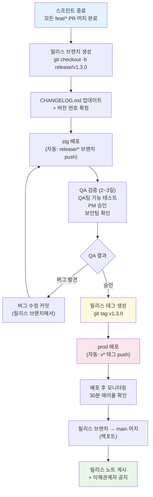
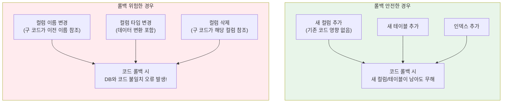
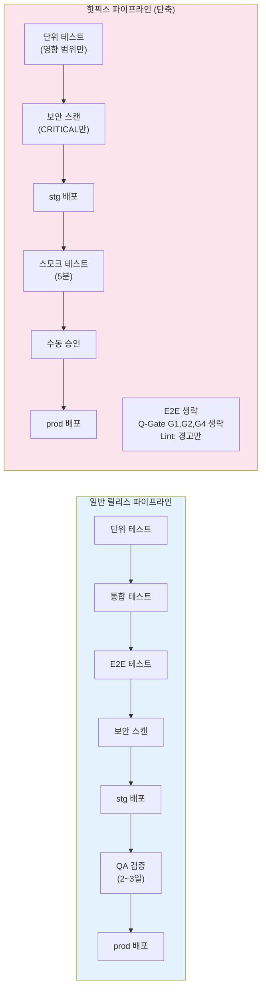

# 릴리스 관리 완전 가이드

> **문서 ID**: ONBOARD-06-07
> **버전**: 1.0.0 | **작성일**: 2026-04-12 | **작성자**: Implementer (Sonnet)
> **학습 대상**: 배포 프로세스에 참여하는 개발자 및 팀 리드
> **예상 소요 시간**: 2시간
> **선행 문서**: `06-cicd/deployment/02-hotfix-process.md`, `06-cicd/pipelines/01-ci-walkthrough.md`
> **Design Ref**: MTU-N42 (자동 릴리스), MTU-N118 (릴리스 파이프라인 v2), MTU-N94 (릴리스 노트)
> **Plan SC**: FR-N42.1, FR-N42.2, FR-N118.1, FR-N94.1
> **CSAP 연관**: D-05 공급망 보안, D-12 시스템 개발 보안, D-13 변경 관리

---

## 목차

1. [릴리스 전략 개요](#1-릴리스-전략-개요)
2. [릴리스 절차](#2-릴리스-절차)
3. [릴리스 승인 프로세스](#3-릴리스-승인-프로세스)
4. [CHANGELOG.md 관리](#4-changelogmd-관리)
5. [롤백 전략](#5-롤백-전략)
6. [긴급 패치 릴리스](#6-긴급-패치-릴리스)
7. [학습 체크리스트](#7-학습-체크리스트)
8. [다음 단계](#다음-단계)

---

## 1. 릴리스 전략 개요

### 1.1 Trunk-Based Development (main 브랜치 중심)

이 프로젝트는 **Trunk-Based Development** 방식을 채택합니다. 개발자들은 짧은 수명의 feature 브랜치를 만들고, 작업이 완료되면 빠르게 `main` 브랜치에 병합합니다.

```
[브랜치 전략]

main ─────────────────────────────────────────────── (항상 배포 가능)
       │            │              │
  feat/fr-2.1  feat/fr-3.2   fix/auth-bug
  (1~3일)      (2~4일)       (수시간)
       │            │              │
       └────────────┴──────────────┘
              (PR → 코드 리뷰 → 머지)

stg ── main의 특정 커밋 또는 릴리스 브랜치 ────────── (QA 환경)
prod ── 릴리스 태그 기준으로 배포 ───────────────────── (운영 환경)
```

**핵심 원칙**:
- `main` 브랜치는 항상 빌드 가능하고 배포 가능한 상태를 유지합니다.
- feature 브랜치는 최대 3~5일 이상 유지하지 않습니다. 오래된 브랜치는 머지 충돌의 원인입니다.
- 완성되지 않은 기능은 Feature Flag로 숨깁니다 (코드는 머지되지만 사용자에게 보이지 않음).

### 1.2 Feature Flags로 안전한 배포

Feature Flag는 코드를 배포하되 특정 조건에서만 기능을 활성화합니다. 이 프로젝트는 `@public-saas/feature-flag-sdk`를 사용합니다.

```typescript
// 사용 예시: 개발 중인 기능을 Feature Flag로 보호
// platform/services/catalog-service/src/handlers/new-search.handler.ts

import { featureFlag } from '@public-saas/feature-flag-sdk'
// Plan SC: FR-FS.1 — Feature Flag 기반 점진적 릴리스

export async function searchHandler(request: FastifyRequest) {
  // Feature Flag: 'advanced-search'가 활성화된 테넌트만 새 기능 사용
  if (await featureFlag.isEnabled('advanced-search', { tenantId: request.user.tenantId })) {
    return newAdvancedSearch(request)
  }
  // 기존 기능 (모든 사용자)
  return legacySearch(request)
}
```

Feature Flag의 이점:
- 코드를 `main`에 머지했지만 아직 준비되지 않은 기능은 비활성 상태로 배포
- 특정 테넌트나 사용자 그룹에게만 먼저 활성화 (카나리 릴리스 효과)
- 문제 발생 시 배포 없이 즉시 비활성화 가능

### 1.3 릴리스 주기 (2주 스프린트 기반)

```
[2주 스프린트 릴리스 캘린더]

Sprint N        Sprint N+1
─────────────── ───────────────
Week 1 | Week 2 | Week 3 | Week 4
  개발     QA     개발      QA
  개발     stg    개발      stg
         릴리스           릴리스
```

| 시점 | 활동 |
|------|------|
| 스프린트 1주차 | feat/* 브랜치 개발, daily PR 머지 |
| 스프린트 2주차 시작 | 릴리스 브랜치 생성, QA 시작 |
| 스프린트 2주차 중반 | stg 배포, QA/PM 검증 |
| 스프린트 2주차 종료 | prod 배포, 릴리스 태그 |

---

## 2. 릴리스 절차

### 2.1 릴리스 절차 전체 흐름



### 2.2 릴리스 브랜치 생성 → stg 배포

```bash
# Step 1: 릴리스 브랜치 생성
git checkout main
git pull origin main
git checkout -b release/v1.3.0

# Step 2: 버전 번호 업데이트 (package.json 루트)
# 자동 릴리스를 사용하는 경우 semantic-release가 자동으로 처리
# 수동인 경우:
# npm version minor  # 1.2.x → 1.3.0

# Step 3: CHANGELOG.md 업데이트 (다음 섹션 참고)
# ...

# Step 4: 커밋 및 push (stg 자동 배포 트리거)
git add CHANGELOG.md package.json
git commit -m "chore(release): v1.3.0 릴리스 준비"
git push origin release/v1.3.0
# → release/* 브랜치 push 시 CI/CD가 stg 자동 배포
```

### 2.3 시맨틱 버전 태깅 (v1.2.3)

이 프로젝트는 Semantic Versioning(SemVer)을 따릅니다.

```
v{MAJOR}.{MINOR}.{PATCH}

MAJOR: 하위 호환성 없는 변경 (Breaking Change)
       예: v1.x.x → v2.0.0 (API 구조 변경)

MINOR: 하위 호환 기능 추가
       예: v1.2.x → v1.3.0 (새 기능)

PATCH: 하위 호환 버그 수정
       예: v1.2.3 → v1.2.4 (버그 수정)
```

```bash
# stg 검증 완료 후 태그 생성
git checkout release/v1.3.0
git tag -a v1.3.0 -m "Release v1.3.0 — 카탈로그 검색 기능 추가"
git push origin v1.3.0
# → v* 태그 push 시 release-pipeline-v2.yaml이 prod 자동 배포
```

### 2.4 릴리스 파이프라인 (자동화)

`v*` 태그가 push되면 `.gitea/workflows/release-pipeline-v2.yaml`이 자동 실행됩니다.

```
[릴리스 파이프라인 단계]

Stage 1: 빌드 및 테스트
  ├── pnpm install
  ├── 단위 테스트 (pnpm test:unit)
  ├── 통합 테스트 (pnpm test:integration)
  ├── 린트 검사
  └── SonarQube 품질 게이트

Stage 2: 보안 스캔 (CSAP D-05)
  ├── Trivy 취약점 스캔 (HIGH, CRITICAL → 실패)
  ├── Semgrep SAST 정적 분석
  └── OpenSSF Scorecard 확인

Stage 3: 이미지 빌드 및 서명
  ├── Docker 이미지 빌드
  ├── Harbor 레지스트리 push
  ├── Cosign 이미지 서명 (공급망 보안)
  └── SBOM 생성 (Syft)

Stage 4: 프로덕션 준비 체크리스트
  └── scripts/production-readiness-check.sh

Stage 5: 스테이징 배포
  ├── Flux ImagePolicy 업데이트
  └── 스모크 테스트

Stage 6: 프로덕션 배포 (수동 승인 필요)
  ├── SLO 에러 버짓 확인
  ├── Argo Rollouts 카나리 배포
  └── SLO 기반 자동 롤백 모니터링

Stage 7: 릴리스 노트 생성 (자동)
  └── scripts/generate-release-notes.sh
```

---

## 3. 릴리스 승인 프로세스

### 3.1 stg 검증 체크리스트

stg에 배포된 후 다음 체크리스트를 순서대로 진행합니다.

```
QA팀 검증 (스프린트 2주차 2~3일)
  [ ] 이번 스프린트 모든 FR(기능 요구사항) 시나리오 테스트 완료
  [ ] 회귀 테스트 (이전 기능이 여전히 동작하는지)
  [ ] 경계 조건 및 오류 시나리오 테스트
  [ ] 모바일/데스크탑 UI 확인 (포털 기능인 경우)
  [ ] 발견된 버그 모두 수정 완료 또는 다음 릴리스로 이관 결정

PM(기획) 검증 (1~2일)
  [ ] 요구사항 충족 여부 최종 확인
  [ ] 사용자 경험 관점의 검토
  [ ] 이해관계자에게 시연 완료 (필요한 경우)

보안팀 검증 (CSAP D-13 변경 관리)
  [ ] 보안 관련 변경사항 검토 (인증, 권한, 암호화)
  [ ] 감사 로그 항목 확인
  [ ] 취약점 스캔 결과 확인 (파이프라인 결과)
  [ ] 개인정보 처리 변경사항 검토 (해당 시)

인프라팀 검증 (배포 관련)
  [ ] 데이터베이스 마이그레이션 계획 확인
  [ ] 리소스 사용량 변화 검토
  [ ] 롤백 계획 수립 완료
```

### 3.2 prod 배포 승인자 지정

프로덕션 배포는 반드시 지정된 승인자의 승인이 필요합니다.

| 배포 유형 | 승인자 | 승인 방법 |
|---------|------|---------|
| 일반 릴리스 | 팀 리드 또는 기술 책임자 | Gitea 환경 승인 (UI 클릭) |
| 보안 패치 | 보안팀 + 팀 리드 | Gitea 환경 승인 |
| 핫픽스 | 팀 리드 (긴급 시 시니어 개발자) | Gitea 환경 승인 |
| 메이저 버전 | CTO + 팀 리드 | 서면 승인 + Gitea 승인 |

```bash
# Gitea 파이프라인에서 승인 대기 중인 배포 확인
# (Gitea Actions 웹 UI에서 진행)
# URL: https://[gitea-url]/[org]/[repo]/actions
# → Release Pipeline v2 실행 중 → "production" 환경 승인 버튼 클릭
```

### 3.3 야간 배포 vs 주간 배포 정책

| 구분 | 권장 시간 | 이유 |
|------|---------|------|
| 일반 릴리스 | **화~목 오전 10시~오후 3시** | 문제 발생 시 당일 대응 가능 |
| 마이너 기능 | 오전 11시 ~ 오후 1시 | 점심 시간대 트래픽 낮음 |
| 야간 배포 | **원칙적 금지** | 문제 발생 시 즉각 대응 불가 |
| 주말 배포 | **원칙적 금지** | 주말 온콜 인력 부족 |
| 예외 허용 | CTO 승인 + 온콜팀 대기 | P1 핫픽스 또는 법적 의무 시 |

⚠️ 공공기관 업무 시간(09:00~18:00)을 피한 배포도 지양합니다. 사용자들이 서비스를 이용 중인 시간대입니다.

---

## 4. CHANGELOG.md 관리

### 4.1 Conventional Commits 기반 자동 생성

이 프로젝트는 Conventional Commits 규약을 따르는 커밋 메시지로 CHANGELOG를 자동 생성합니다.

```bash
# 올바른 커밋 메시지 형식
feat(auth): OAuth2 소셜 로그인 추가              → CHANGELOG: Added 항목
fix(billing): 월간 청구서 금액 계산 오류 수정     → CHANGELOG: Fixed 항목
docs(api): 인증 API 명세 업데이트                → CHANGELOG: 포함 안 됨 (docs는 생략)
refactor(user): 사용자 서비스 DB 쿼리 최적화     → CHANGELOG: Changed 항목
feat!: 테넌트 API v2로 변경 (Breaking Change)    → CHANGELOG: BREAKING CHANGES 섹션
```

**커밋 유형 → CHANGELOG 항목 매핑**:

| 커밋 유형 | CHANGELOG 섹션 | 버전 영향 |
|---------|-------------|---------|
| `feat:` | Added | MINOR 증가 |
| `fix:` | Fixed | PATCH 증가 |
| `perf:` | Performance | PATCH 증가 |
| `refactor:` | Changed | PATCH 증가 |
| `BREAKING CHANGE` | BREAKING CHANGES | MAJOR 증가 |
| `docs:`, `test:`, `chore:` | 포함 안 됨 | 영향 없음 |

### 4.2 `semantic-release`를 통한 자동화

`main` 브랜치에 push할 때마다 `.gitea/workflows/release.yml`이 실행되어 커밋 분석 후 자동으로 버전을 결정하고 릴리스를 생성합니다.

```yaml
# .gitea/workflows/release.yml (핵심 부분)
# Plan SC: FR-N42.1 — 자동 시맨틱 릴리스

- name: Run semantic-release
  env:
    GITHUB_TOKEN: ${{ secrets.GITEA_TOKEN }}
    GIT_AUTHOR_NAME: "Release Bot"
  run: |
    npx semantic-release --no-ci 2>&1 || echo "[INFO] 릴리스할 변경사항 없음"
```

semantic-release 동작:
1. 마지막 태그 이후 커밋 분석
2. `feat:` 커밋이 있으면 minor 버전 증가
3. `fix:` 커밋만 있으면 patch 버전 증가
4. CHANGELOG.md 업데이트 (자동)
5. 새 태그 생성 (자동)
6. Gitea Release 게시 (자동)

### 4.3 CHANGELOG.md 수동 관리 방법

자동화가 동작하지 않는 경우 또는 추가 내용이 필요한 경우 수동으로 관리합니다.

```markdown
# Changelog — 공공기관 SaaS 플랫폼

이 문서는 모든 중요한 변경 사항을 기록합니다.
형식은 [Keep a Changelog](https://keepachangelog.com/ko/1.0.0/)를 따르며,
이 프로젝트는 [Semantic Versioning](https://semver.org/lang/ko/)을 준수합니다.

## [Unreleased]

### Added (추가)
- FR-3.2: 카탈로그 고급 검색 기능 — 키워드, 카테고리, 가격 필터 지원
- FR-3.3: 구독 현황 대시보드 — 실시간 사용량 모니터링

### Fixed (수정)
- fix(billing): 월 마지막 날 청구서 이중 발행 버그 수정
- fix(auth): 세션 만료 후 리다이렉트 경로 오류 수정

### Changed (변경)
- refactor(user): 사용자 목록 조회 쿼리 최적화 (응답 시간 40% 개선)

### Security (보안)
- 의존성: lodash 4.17.20 → 4.17.21 (CVE-2021-23337 수정)

## [1.2.3] — 2026-04-01

### Fixed
- fix(tenant): 멀티테넌트 격리 오류 수정 (긴급 패치)
```

### 4.4 CSAP 요건에 맞는 변경 이력 형식

CSAP D-13(변경 관리) 요건에 따라 릴리스 문서에 추가해야 할 항목:

```markdown
## [1.3.0] — 2026-04-15

> **변경 관리 정보** (CSAP D-13)
> - 변경 요청 번호: CR-2026-042
> - 승인자: 홍길동 (기술 책임자), 이순신 (보안팀 리드)
> - 승인 일자: 2026-04-13
> - 배포 일자: 2026-04-15 10:30 KST
> - 영향 범위: catalog-service, subscription-service
> - 롤백 계획: v1.2.3 태그로 즉시 롤백 가능

### Added
- ...
```

---

## 5. 롤백 전략

### 5.1 빠른 롤백 (이전 배포로 즉시 되돌리기)

배포 후 문제가 발생하면 가장 먼저 롤백을 시도합니다.

```bash
# 방법 1: kubectl rollout undo (가장 빠름 — 2~5분)
# 이전 ReplicaSet으로 즉시 되돌립니다
kubectl rollout undo deployment/auth-service -n saas-services

# 롤백 완료 확인
kubectl rollout status deployment/auth-service -n saas-services

# 방법 2: Helm rollback (Helm으로 배포한 경우)
helm history auth-service -n saas-services
# REVISION  STATUS    CHART              DESCRIPTION
# 1         superseded auth-service-1.2.3  Install complete
# 2         deployed   auth-service-1.3.0  Upgrade complete

helm rollback auth-service 1 -n saas-services
# → Revision 1 (v1.2.3)으로 롤백

# 방법 3: Flux 이미지 태그 변경 (GitOps 방식)
# GitOps 저장소에서 image.tag를 이전 버전으로 변경 후 커밋
# → Flux가 자동으로 감지하고 롤백 (5~10분)
```

**롤백 결정 기준**:

```
배포 후 30분 내 다음 중 하나라도 발생 시 즉시 롤백:
  - 에러율 > 1% (평소 0.01% 미만)
  - P99 응답 시간 > 3초 (평소 500ms 미만)
  - 헬스체크 엔드포인트 실패
  - SLO 에러 버짓 30분 내 30% 이상 소비
```

### 5.2 데이터 마이그레이션과 롤백의 조합

코드 롤백은 쉽지만, DB 마이그레이션이 함께 배포된 경우 롤백이 복잡해집니다.



**안전한 마이그레이션 패턴 (확장-수축 패턴)**:

```
위험한 방법 (한 번에 변경):
  배포 v1.3.0: ALTER TABLE users RENAME COLUMN name TO full_name
  → 롤백 불가! 구 코드가 'name' 컬럼을 찾지 못함

안전한 방법 (3단계):
  배포 v1.3.0: 새 컬럼 full_name 추가, 두 컬럼 모두 쓰기
  배포 v1.3.1: full_name만 읽기 (name도 유지)
  배포 v1.3.2: name 컬럼 삭제 (이제 안전)
```

### 5.3 롤백 불가능한 경우 (단방향 마이그레이션)

일부 마이그레이션은 롤백 자체가 불가능합니다.

| 상황 | 이유 | 대응 방법 |
|------|------|---------|
| 외부 서비스에 이벤트 발행 | 이미 발행된 이벤트는 회수 불가 | 보상 트랜잭션으로 역방향 이벤트 발행 |
| 이메일/SMS 발송 완료 | 보낸 메시지는 회수 불가 | 정정 공지 메시지 발송 |
| 데이터 암호화 키 변경 후 재암호화 | 구 키로 복호화 시도 시 오류 | 키 버전 관리로 구/신 키 모두 유지 |
| 법적 이유로 삭제한 데이터 | 복구 불가 | 소프트 삭제(soft delete)로 보관 |

이러한 단방향 작업이 포함된 릴리스는 배포 전 **별도 위험 분석**을 진행합니다.

---

## 6. 긴급 패치 릴리스

### 6.1 핫픽스 vs 일반 릴리스 결정 기준

```
[결정 흐름도]

문제 발생
    ↓
운영 서비스에 영향이 있는가?
    ├── 아니오 → 일반 릴리스 (다음 스프린트)
    └── 예
        ↓
   즉각 롤백이 가능한가?
        ├── 예 → 롤백 후 일반 릴리스로 수정
        └── 아니오
            ↓
       P1/P2 인시던트인가?
            ├── P1 (전체 서비스 다운): 즉시 핫픽스
            ├── P2 (주요 기능 장애): 핫픽스 고려
            └── P3/P4: 일반 릴리스 (다음 스프린트)
```

**더 자세한 핫픽스 프로세스는 `06-cicd/deployment/02-hotfix-process.md`를 참고하십시오.**

### 6.2 핫픽스 브랜치 명명 및 수명

```bash
# 핫픽스 브랜치 이름 형식
hotfix/YYYYMMDD-{이슈-설명}

# 예시
hotfix/20260415-auth-jwt-crash
hotfix/20260415-billing-double-charge
hotfix/20260415-security-CVE-2026-1234

# 핫픽스 브랜치 수명
# - 생성: 인시던트 발생 즉시
# - 삭제: prod 배포 + main 백포트 완료 후 (최대 48시간)

# main 백포트 후 브랜치 삭제
git push origin --delete hotfix/20260415-auth-jwt-crash
```

### 6.3 핫픽스 버전 번호

핫픽스는 PATCH 버전을 증가시킵니다.

```
현재 prod 버전: v1.3.0
핫픽스 후 버전: v1.3.1

또 다른 핫픽스: v1.3.2
...

다음 일반 릴리스: v1.4.0
```

```bash
# 핫픽스 태그 생성
git tag -a v1.3.1 -m "Hotfix v1.3.1 — auth-service JWT 만료 처리 오류 수정 (P1)"
git push origin v1.3.1
```

### 6.4 핫픽스 전용 파이프라인

`hotfix/*` 브랜치 push 시 `.gitea/workflows/hotfix-pipeline.yaml`이 실행됩니다. 일반 릴리스 파이프라인과 다른 점:



**생략되는 항목과 이유**:
- E2E 테스트: 시간 절약 (30분 → 8분)
- 전체 Q-Gate: 긴급 상황이므로 핵심 보안 항목(G3, G5)만 확인
- 전체 QA: 스모크 테스트로 대체

**절대 생략 불가 항목**:
- Trivy CRITICAL 취약점 스캔 (새 취약점 도입 방지)
- 시크릿 스캔 (시크릿 유출 방지)
- 팀 리드 수동 승인 (책임 추적)

---

## 학습 체크리스트

```
릴리스 전략 이해
  [ ] Trunk-Based Development가 왜 장기 브랜치를 피하는지 설명할 수 있다
  [ ] Feature Flag의 역할을 설명할 수 있다
  [ ] 2주 스프린트에서 릴리스 일정을 설명할 수 있다

릴리스 절차
  [ ] release/* 브랜치를 생성하고 stg에 배포하는 명령어를 안다
  [ ] SemVer (v1.2.3)의 MAJOR/MINOR/PATCH 증가 조건을 안다
  [ ] git tag 명령어로 릴리스 태그를 생성할 수 있다
  [ ] 릴리스 파이프라인 7단계를 순서대로 나열할 수 있다

릴리스 승인 프로세스
  [ ] stg 검증에 QA, PM, 보안팀이 왜 모두 참여해야 하는지 안다
  [ ] 야간 배포를 피해야 하는 이유를 설명할 수 있다
  [ ] Gitea 환경 승인 버튼을 클릭하는 방법을 안다

CHANGELOG 관리
  [ ] feat: 커밋이 MINOR 버전을 올리는 이유를 이해했다
  [ ] CHANGELOG.md에서 Added/Fixed/Changed/Security 섹션 차이를 안다
  [ ] semantic-release가 자동으로 무엇을 하는지 설명할 수 있다

롤백 전략
  [ ] kubectl rollout undo 명령어를 실행할 수 있다
  [ ] helm rollback 명령어를 실행할 수 있다
  [ ] 단방향 마이그레이션이 왜 롤백 불가인지 예시로 설명할 수 있다
  [ ] 확장-수축 패턴(expand-contract)을 설명할 수 있다

긴급 패치 릴리스
  [ ] P1/P2/P3/P4 인시던트 레벨 차이를 안다
  [ ] hotfix 브랜치 이름 형식을 안다 (hotfix/YYYYMMDD-설명)
  [ ] 핫픽스 파이프라인에서 생략되는 항목과 절대 생략 불가 항목을 구분한다
  [ ] 핫픽스 후 main 백포트가 왜 필요한지 설명할 수 있다
```

---

## 다음 단계

릴리스 관리를 이해했다면 다음 주제로 이동하십시오.

- **[06-cicd/deployment/02-hotfix-process.md]** — 핫픽스 프로세스 상세 절차
- **[06-cicd/deployment/03-canary-deploy.md]** — 카나리 배포 전략
- **[06-cicd/pipelines/02-quality-gate.md]** — Q-Gate 7단계 품질 게이트 상세
- **[07-security/]** — CSAP 보안 요건 준수 방법

---

## 변경 이력

| 버전 | 일자 | 내용 | 작성자 |
|------|------|------|------|
| 1.0.0 | 2026-04-12 | 최초 작성 — release.yml, release-pipeline-v2.yaml, release-notes.yaml 기반 실제 파이프라인 반영 | Implementer (Sonnet) |
