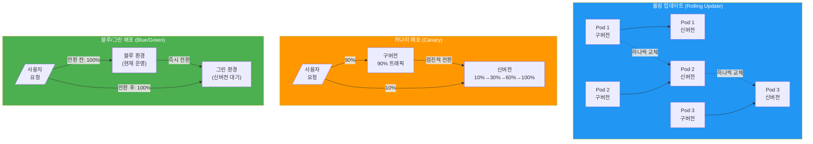
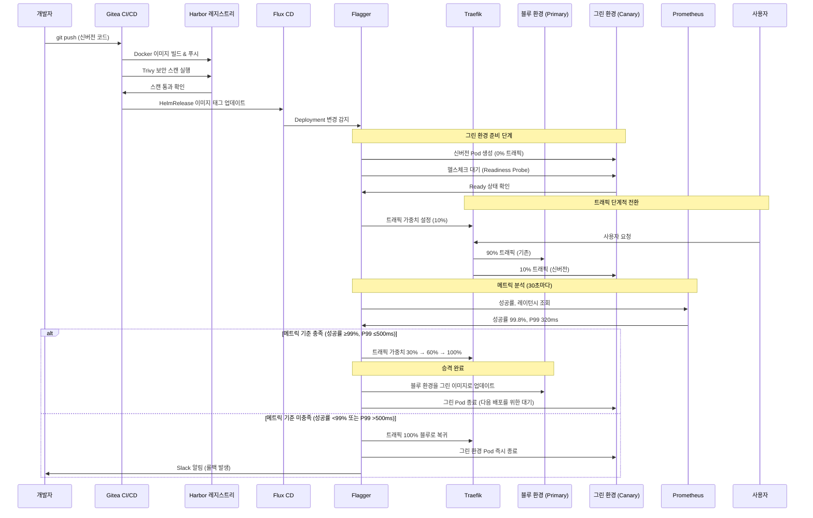
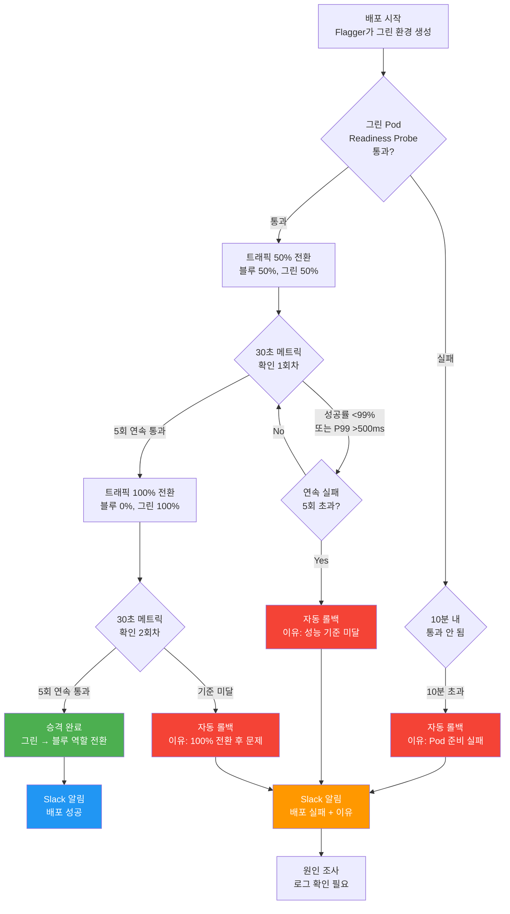

# 블루/그린 배포 전략 — Flagger + Linkerd 기반 제로다운타임 배포

> **문서 ID**: ONBOARD-06-CICD-08
> **버전**: 1.0.0 | **작성일**: 2026-04-12 | **대상**: 배포 및 운영 담당자, DevOps 엔지니어
> **선행 학습**:
>   - `deployment/01-gitops-deploy.md` — GitOps 배포 흐름 이해
>   - `deployment/03-canary-deploy.md` — Flagger 카나리 배포 기초
>   - `pipelines/02-quality-gate.md` — Q-GATE 품질 게이트 이해
> **소요 시간**: 약 90분
> **CSAP**: D-12 (시스템 개발 보안 — 안전한 배포), D-13 (변경 관리), D-06 (침해사고 관리)
> **Design Ref**: MTU-N40 §3.2, MTU-N245 §3.3
> **Plan SC**: FR-N40.2, FR-N245.3

---

## 목차

1. [배포 전략이란? — 초급자를 위한 기초 설명](#1-배포-전략이란--초급자를-위한-기초-설명)
   - 1.1 [왜 배포 전략이 중요한가](#11-왜-배포-전략이-중요한가)
   - 1.2 [세 가지 주요 배포 전략 비교](#12-세-가지-주요-배포-전략-비교)
   - 1.3 [전략별 장단점 표](#13-전략별-장단점-표)
   - 1.4 [언제 어떤 전략을 선택할 것인가](#14-언제-어떤-전략을-선택할-것인가)

2. [블루/그린 배포 핵심 개념](#2-블루그린-배포-핵심-개념)
   - 2.1 [블루/그린이란 무엇인가](#21-블루그린이란-무엇인가)
   - 2.2 [우리 프로젝트에서 블루/그린이 필요한 이유](#22-우리-프로젝트에서-블루그린이-필요한-이유)
   - 2.3 [CSAP 가용성 요건과의 연계](#23-csap-가용성-요건과의-연계)

3. [Flagger + Linkerd 아키텍처](#3-flagger--linkerd-아키텍처)
   - 3.1 [컴포넌트 구성](#31-컴포넌트-구성)
   - 3.2 [실제 구현 아키텍처](#32-실제-구현-아키텍처)
   - 3.3 [Flagger Canary 리소스 YAML 상세](#33-flagger-canary-리소스-yaml-상세)
   - 3.4 [HelmRelease 설정](#34-helmrelease-설정)

4. [트래픽 전환 메커니즘](#4-트래픽-전환-메커니즘)
   - 4.1 [단계별 전환 과정](#41-단계별-전환-과정)
   - 4.2 [Linkerd SMI TrafficSplit 설명](#42-linkerd-smi-trafficsplit-설명)
   - 4.3 [메트릭 기반 자동 승격 조건](#43-메트릭-기반-자동-승격-조건)
   - 4.4 [자동 롤백 트리거](#44-자동-롤백-트리거)

5. [카나리 배포와의 차이점](#5-카나리-배포와의-차이점)
   - 5.1 [개념적 차이](#51-개념적-차이)
   - 5.2 [우리 프로젝트에서의 실질적 차이](#52-우리-프로젝트에서의-실질적-차이)
   - 5.3 [동일한 Flagger로 양쪽 구현](#53-동일한-flagger로-양쪽-구현)

6. [CSAP 요구사항 충족](#6-csap-요구사항-충족)
   - 6.1 [제로다운타임 배포](#61-제로다운타임-배포)
   - 6.2 [롤백 이력 감사 로그](#62-롤백-이력-감사-로그)
   - 6.3 [배포 전후 보안 스캔](#63-배포-전후-보안-스캔)

7. [Grafana 배포 모니터링 대시보드](#7-grafana-배포-모니터링-대시보드)
   - 7.1 [핵심 모니터링 패널 목록](#71-핵심-모니터링-패널-목록)
   - 7.2 [배포 성공/실패 판단 의사결정 트리](#72-배포-성공실패-판단-의사결정-트리)
   - 7.3 [PromQL 모니터링 쿼리](#73-promql-모니터링-쿼리)

8. [실전 배포 절차 단계별 가이드](#8-실전-배포-절차-단계별-가이드)
   - 8.1 [Pre-deployment 체크리스트](#81-pre-deployment-체크리스트)
   - 8.2 [배포 실행 — Gitea UI](#82-배포-실행--gitea-ui)
   - 8.3 [배포 실행 — CLI](#83-배포-실행--cli)
   - 8.4 [배포 진행 상황 모니터링](#84-배포-진행-상황-모니터링)
   - 8.5 [자동 롤백 vs 수동 롤백](#85-자동-롤백-vs-수동-롤백)

9. [실습: 스테이징 환경 블루/그린 배포 체험](#9-실습-스테이징-환경-블루그린-배포-체험)
   - 9.1 [실습 목표](#91-실습-목표)
   - 9.2 [단계별 실습 명령어](#92-단계별-실습-명령어)
   - 9.3 [예상 출력 결과](#93-예상-출력-결과)
   - 9.4 [흔한 실수와 해결 방법](#94-흔한-실수와-해결-방법)

10. [학습 체크리스트](#10-학습-체크리스트)
11. [다음 단계](#11-다음-단계)

---

## 1. 배포 전략이란? — 초급자를 위한 기초 설명

### 1.1 왜 배포 전략이 중요한가

소프트웨어를 새 버전으로 교체하는 것은 생각보다 위험한 작업입니다. 비유를 들면, 운행 중인 자동차의 엔진을 교체하는 것과 같습니다. 자동차를 멈추지 않고 안전하게 엔진을 바꾸는 방법이 필요합니다.

공공기관 SaaS 시스템에서 이 문제는 더욱 심각합니다.

```
공공기관 시스템의 배포 제약:

  업무 시간 (09:00~18:00):
    - 전자결재 시스템: 초당 수백 건 요청 처리 중
    - 민원 포털: 실시간 민원 신청 처리 중
    - 행정 데이터베이스: 트랜잭션 실행 중

  이 상황에서 배포하면:
    ❌ 전통적 방식: "서버 내리기 → 업데이트 → 재시작"
       → 서비스 중단 5~30분
       → 진행 중인 트랜잭션 손실
       → CSAP 가용성 요건 위반
       → 감리 지적 사항 발생

    ✅ 무중단 배포 전략 필요
       → 사용자는 배포 사실을 인지하지 못함
       → 진행 중인 요청 정상 완료
       → 문제 발생 시 즉시 이전 버전으로 복귀
```

### 1.2 세 가지 주요 배포 전략 비교

세 가지 전략을 나란히 비교합니다.



**롤링 업데이트** — Pod를 하나씩 교체합니다. 교체 중에는 구버전과 신버전이 동시에 존재합니다.

**카나리 배포** — 신버전을 소수에게만 먼저 노출하고 점진적으로 확대합니다. 문제 시 영향 범위를 최소화합니다.

**블루/그린 배포** — 두 개의 완전한 환경을 준비한 뒤 트래픽을 순간 전환합니다. 언제든지 이전 환경으로 즉시 복귀할 수 있습니다.

### 1.3 전략별 장단점 표

| 항목 | 롤링 업데이트 | 카나리 배포 | 블루/그린 배포 |
|------|------------|-----------|-------------|
| **복잡도** | 낮음 | 중간 | 높음 |
| **리소스 비용** | 최소 (추가 없음) | 중간 (카나리 Pod 추가) | 높음 (2배 환경 필요) |
| **롤백 속도** | 느림 (Pod 역롤링) | 중간 (자동 롤백) | **즉시** (트래픽 전환만) |
| **다운타임** | 없음 (설정 시) | 없음 | **없음** |
| **구/신 버전 혼재** | 있음 (일시적) | 있음 (의도적) | **없음** |
| **CSAP 가용성** | 충족 가능 | 충족 | **완전 충족** |
| **데이터베이스 호환성** | 주의 필요 | 주의 필요 | **독립 검증 가능** |
| **테스트 기회** | 제한적 | 실트래픽으로 가능 | **전환 전 완전 검증** |
| **적합한 상황** | 일반적인 소규모 업데이트 | 점진적 기능 검증 | **핵심 시스템 안전 배포** |

### 1.4 언제 어떤 전략을 선택할 것인가

우리 프로젝트의 서비스 유형별 권장 전략입니다.

```
서비스 유형별 배포 전략 권장:

  [블루/그린 사용 권장]
  - API Gateway (모든 트래픽 진입점)
    이유: 구/신 버전 혼재 시 라우팅 불일치 위험
  - Auth Service (인증 토큰 호환성)
    이유: 토큰 형식 변경 시 즉각 롤백 필요
  - 데이터베이스 스키마 변경 동반 배포
    이유: 신버전에서 완전 검증 후 전환

  [카나리 사용 권장]
  - 신규 AI 기능 점진적 롤아웃
    이유: 사용자 반응 측정 필요
  - UI/UX 변경 A/B 테스트
    이유: 사용자 피드백 수집
  - 성능 영향이 불확실한 알고리즘 변경
    이유: 실트래픽으로 성능 검증

  [롤링 업데이트 사용 권장]
  - 의존성 버전 업그레이드 (비기능 변경)
  - 설정값 변경 (환경 변수)
  - 로그 포맷 변경 등 내부 변경
```

---

## 2. 블루/그린 배포 핵심 개념

### 2.1 블루/그린이란 무엇인가

블루/그린 배포는 두 개의 동일한 프로덕션 환경을 운영하는 전략입니다.

```
블루/그린 배포의 핵심 아이디어:

  [블루 환경] = 현재 운영 중인 버전 (안정적)
  [그린 환경] = 새 버전을 준비하는 공간 (대기 중)

  평상시:
    사용자 트래픽 ──────→ [블루 환경] v1.0.0
                           (100% 트래픽)

  배포 준비:
    새 버전을 [그린 환경]에 배포 및 검증
    사용자 트래픽 ──────→ [블루 환경] v1.0.0
                           (여전히 100%)
    [그린 환경] v1.1.0 ← 테스트 및 검증 중

  전환 순간:
    사용자 트래픽 ──────→ [그린 환경] v1.1.0
                           (100% 전환)
    [블루 환경] v1.0.0 ← 대기 (롤백용)

  문제 발생 시:
    사용자 트래픽 ──────→ [블루 환경] v1.0.0
                           (즉시 복귀, 1~2초 이내)
```

이름의 유래: 임의로 두 환경을 "블루"와 "그린"으로 구분합니다. 다음 배포 시에는 역할이 바뀝니다. 그린이 블루가 되고, 블루가 그린이 됩니다.

### 2.2 우리 프로젝트에서 블루/그린이 필요한 이유

```
공공기관 SaaS에서 블루/그린이 필수인 시나리오:

  시나리오 1: JWT 토큰 형식 변경
    - v1: { "sub": "user-id", "exp": 1234567890 }
    - v2: { "sub": "user-id", "exp": 1234567890, "tenant": "tenant-id" }
    
    롤링 업데이트의 문제:
      - Pod 1 (v2): "tenant 필드 없으면 토큰 거부"
      - Pod 2 (v1): "v1 형식 토큰 발급 중"
      - 결과: 일부 요청 401 오류

    블루/그린의 해결:
      - 그린(v2)에서 완전 검증 완료
      - 전환 순간 모든 Pod가 v2로 즉시 변경
      - 토큰 형식 불일치 없음

  시나리오 2: DB 스키마 변경
    - v1: users 테이블 (id, name, email)
    - v2: users 테이블 (id, name, email, tenant_id)
    
    블루/그린의 이점:
      - 그린 환경에서 DB 마이그레이션 완전 검증
      - 검증 완료 후 트래픽 전환
      - 문제 시 이전 스키마로 즉시 복귀 가능
```

### 2.3 CSAP 가용성 요건과의 연계

```
CSAP 가용성 요건 (D-10: 서비스 가용성 보장):

  요건: 계획된 유지보수를 포함한 서비스 가용성 보장
  목표: 99.9% 이상 (연간 8.76시간 이하 다운타임 허용)

  블루/그린 배포로 충족:
    - 배포 시 다운타임: 0ms (트래픽 전환은 수밀리초)
    - 롤백 시 다운타임: 0ms (이전 환경으로 즉시 전환)
    - 월별 배포 횟수: 10~20회 × 0ms = 0 다운타임

  vs 전통적 배포:
    - 배포 1회당 다운타임: 평균 5분
    - 월 10회 배포: 50분 다운타임
    - 연 가용성: 99.9% 위협
```

---

## 3. Flagger + Linkerd 아키텍처

### 3.1 컴포넌트 구성

우리 프로젝트의 블루/그린 배포는 Flagger와 Traefik 조합으로 구현합니다. 기존 카나리 설정을 재사용하면서 트래픽 전환 비율을 조정하여 블루/그린 효과를 구현합니다.

```
컴포넌트 역할:

  [Flagger]
  - 역할: 배포 오케스트레이터 (지휘자)
  - 기능: Deployment 변경 감지 → 카나리/블루그린 절차 자동 실행
  - 메트릭: Prometheus에서 성공률, 레이턴시 읽기
  - 판단: 메트릭이 임계값 충족하면 승격, 실패하면 롤백

  [Traefik IngressRoute]
  - 역할: 트래픽 라우터 (교통 신호등)
  - 기능: 사용자 요청을 블루/그린 중 어디로 보낼지 결정
  - Flagger가 자동으로 가중치 조정

  [Linkerd (서비스 메시)]
  - 역할: 서비스 간 통신 보안 및 관측
  - 기능: mTLS 자동 적용, 레이턴시/에러율 메트릭 수집
  - 보안: Pod 간 통신 암호화 (CSAP D-09)

  [Prometheus]
  - 역할: 메트릭 수집
  - 기능: Flagger가 판단에 사용하는 메트릭 데이터 제공
  - 쿼리: 성공률, P99 레이턴시, 에러율

  [Harbor 레지스트리]
  - 역할: 컨테이너 이미지 저장소
  - 기능: 서명된 이미지 관리 (Cosign)
  - 보안: Trivy 스캔 결과 포함
```

### 3.2 실제 구현 아키텍처



### 3.3 Flagger Canary 리소스 YAML 상세

다음은 실제 운영 중인 `infra/flagger/canary-api-gateway.yaml` 기반 설명입니다.

```yaml
# infra/flagger/canary-api-gateway.yaml
# Design Ref: MTU-N40 Design §3.2
# CSAP: D-12 (안전한 배포)
apiVersion: flagger.app/v1beta1
kind: Canary
metadata:
  name: api-gateway
  namespace: saas-platform
  labels:
    app.kubernetes.io/part-of: saas-platform
    app.kubernetes.io/component: api-gateway
spec:
  # 배포 대상 Deployment 지정
  targetRef:
    apiVersion: apps/v1
    kind: Deployment
    name: api-gateway

  # 트래픽 라우팅 provider (우리 프로젝트: Traefik)
  # 블루/그린은 provider: traefik + stepWeight를 크게 설정하여 구현
  provider: traefik

  # 서비스 포트 매핑
  service:
    port: 3000
    targetPort: 3000

  analysis:
    # 메트릭 확인 주기: 30초마다
    interval: 30s

    # 연속 성공 횟수: 5회 연속 통과해야 승격
    # 카나리(3회)보다 엄격하게 설정
    threshold: 5

    # 블루/그린 모드: stepWeight를 크게 설정
    # 카나리: 10% → 30% → 60%
    # 블루/그린: 50% → 100% (2단계로 빠르게 전환)
    maxWeight: 100
    stepWeight: 50
    stepWeightPromotion: 50

    metrics:
      # 성공률: 최소 99% 이상 (CSAP 가용성 요건)
      - name: request-success-rate
        templateRef:
          name: request-success-rate
          namespace: saas-platform
        thresholdRange:
          min: 99
        interval: 30s

      # P99 레이턴시: 최대 500ms 이하
      - name: request-duration-p99
        templateRef:
          name: request-duration-p99
          namespace: saas-platform
        thresholdRange:
          max: 500
        interval: 30s

    # 배포 알림 (Slack)
    alerts:
      - name: "api-gateway-deployment"
        severity: info
        providerRef:
          name: slack
          namespace: flagger-system

      - name: "api-gateway-rollback"
        severity: error
        providerRef:
          name: slack
          namespace: flagger-system
```

각 필드의 의미를 풀어서 설명합니다.

```
analysis 섹션 해석:

  interval: 30s
  → Flagger가 30초마다 Prometheus에 메트릭을 물어봄
  → 빠른 감지 vs 충분한 샘플 수의 균형

  threshold: 5
  → 5번 연속으로 모든 메트릭이 기준을 통과해야 다음 단계로 승격
  → 일시적 스파이크로 인한 오판 방지

  maxWeight: 100 + stepWeight: 50
  → 블루/그린 모드 설정:
     0단계: 그린 0%, 블루 100%
     1단계: 그린 50%, 블루 50% (30초 × 5번 = 2.5분 관찰)
     2단계: 그린 100%, 블루 0% (승격 완료)
  → 총 전환 시간: 약 5분

  metrics.thresholdRange.min: 99
  → 성공률이 99% 미만이면 즉시 롤백
  → 100개 요청 중 1개 이상 실패하면 문제로 판단
```

### 3.4 HelmRelease 설정

Flux CD가 관리하는 HelmRelease 예시입니다.

```yaml
# infra/helmreleases/api-gateway.yaml
# Design Ref: MTU-N245 §3.3
apiVersion: helm.toolkit.fluxcd.io/v2beta1
kind: HelmRelease
metadata:
  name: api-gateway
  namespace: saas-platform
  annotations:
    # CSAP D-13: 변경 관리 — 배포 이력 추적
    csap.compliance/change-record: "배포 시 Gitea 커밋 SHA 자동 기록"
spec:
  interval: 5m

  chart:
    spec:
      chart: ./infra/charts/api-gateway
      sourceRef:
        kind: GitRepository
        name: public-saas
        namespace: flux-system

  values:
    image:
      repository: harbor.internal/public-saas/api-gateway
      # Flux Image Automation이 이 값을 자동 업데이트
      tag: sha-a1b2c3d

    # 블루/그린 배포를 위한 Pod 수 설정
    replicaCount: 3

    # 헬스체크 설정 (Flagger가 Ready 판단에 사용)
    livenessProbe:
      httpGet:
        path: /health
        port: 3000
      initialDelaySeconds: 10
      periodSeconds: 10

    readinessProbe:
      httpGet:
        path: /ready
        port: 3000
      initialDelaySeconds: 5
      periodSeconds: 5

    # 리소스 제한 (블루+그린 동시 운영을 고려한 여유 확보)
    resources:
      requests:
        cpu: 100m
        memory: 128Mi
      limits:
        cpu: 500m
        memory: 512Mi
```

---

## 4. 트래픽 전환 메커니즘

### 4.1 단계별 전환 과정

블루/그린 배포에서 트래픽이 전환되는 과정을 시간 순서대로 설명합니다.

```
시간 0분: 배포 시작
  - 블루 환경 (v1.0.0): 3 Pod 실행 중, 100% 트래픽
  - 그린 환경 (v1.1.0): 0 Pod

시간 1분: 그린 환경 준비
  - Flagger가 그린 Deployment 생성
  - 그린 Pod 3개 시작
  - Readiness Probe 통과 대기
  - 블루: 100% 트래픽 유지

시간 2분: 첫 번째 트래픽 전환 (50%)
  - 그린 Pod Readiness Probe 통과
  - Traefik 가중치 변경: 블루 50%, 그린 50%
  - Prometheus 메트릭 수집 시작

시간 2분~4분 30초: 메트릭 관찰 (2.5분)
  - 30초마다 성공률, P99 레이턴시 확인
  - 5번 연속 통과해야 다음 단계

시간 4분 30초: 두 번째 트래픽 전환 (100%)
  조건 충족 시:
    - Traefik 가중치: 블루 0%, 그린 100%
    - Flagger: 승격 완료 (Promotion)
    - 블루 환경 (구버전): 대기 상태 유지 (30분간)

  실패 시:
    - Traefik 가중치: 블루 100%, 그린 0%
    - 그린 Pod 즉시 종료
    - Slack 알림 발송

시간 34분 (승격 후 30분): 블루 환경 역할 전환
  - 블루 환경 이미지를 그린(v1.1.0)으로 교체
  - 다음 배포의 "블루"가 됨
  - 그린이 새로운 "블루"로 역할 전환
```

### 4.2 Linkerd SMI TrafficSplit 설명

Linkerd는 SMI(Service Mesh Interface) 표준을 사용하여 트래픽을 분할합니다.

```yaml
# infra/linkerd/traffic-split/api-gateway-canary.yaml
# Design Ref: DS-N114.1 | Plan SC: FR-N114.1
# CSAP: D-10 부하 분산
apiVersion: split.smi-spec.io/v1alpha2
kind: TrafficSplit
metadata:
  name: api-gateway-canary
  namespace: saas-system
  labels:
    app.kubernetes.io/name: api-gateway
    app.kubernetes.io/managed-by: linkerd
    deployment.strategy: canary
    csap.compliance/control: D-10
  annotations:
    description: "API Gateway 카나리/블루그린 배포 트래픽 분할"
spec:
  # 원본 서비스 이름 (사용자가 접근하는 주소)
  service: api-gateway
  backends:
    # Stable = 블루 환경 (기존 버전)
    - service: api-gateway-stable
      weight: 900     # 90% (초기값)
    # Canary = 그린 환경 (신버전)
    - service: api-gateway-canary
      weight: 100     # 10% (초기값)
```

Flagger는 이 리소스의 `weight` 값을 자동으로 조정합니다. 개발자가 직접 이 파일을 수정할 필요가 없습니다.

```
Flagger가 자동 관리하는 weight 변화:

  배포 시작:   stable=1000, canary=0    (0%)
  1단계:       stable=500,  canary=500  (50%)
  2단계:       stable=0,    canary=1000 (100%, 승격 완료)

  롤백:        stable=1000, canary=0    (즉시 복귀)
```

### 4.3 메트릭 기반 자동 승격 조건

Flagger가 승격을 결정하는 기준입니다.

```typescript
// Flagger 승격 판단 로직 (의사 코드)
// Design Ref: MTU-N40 §3.2

interface DeploymentMetrics {
  successRate: number;     // HTTP 2xx/3xx 비율 (%)
  p99LatencyMs: number;    // P99 응답 시간 (ms)
}

function shouldPromote(metrics: DeploymentMetrics): boolean {
  const SUCCESS_RATE_MIN = 99;    // 최소 99% 성공률
  const P99_LATENCY_MAX = 500;    // 최대 500ms

  return (
    metrics.successRate >= SUCCESS_RATE_MIN &&
    metrics.p99LatencyMs <= P99_LATENCY_MAX
  );
}

// 5번 연속 통과해야 승격 (threshold: 5)
// 하나라도 실패하면 카운터 리셋 후 롤백 절차 시작
```

PromQL로 직접 확인하는 방법:

```promql
# 성공률 확인
sum(rate(
  http_requests_total{
    namespace="saas-platform",
    service="api-gateway-canary",
    status=~"2..|3.."
  }[30s]
)) /
sum(rate(
  http_requests_total{
    namespace="saas-platform",
    service="api-gateway-canary"
  }[30s]
)) * 100

# P99 레이턴시 확인
histogram_quantile(
  0.99,
  sum(rate(
    http_request_duration_seconds_bucket{
      namespace="saas-platform",
      service="api-gateway-canary"
    }[30s]
  )) by (le)
) * 1000
```

### 4.4 자동 롤백 트리거

다음 조건 중 하나라도 발생하면 자동 롤백이 시작됩니다.

```
자동 롤백 트리거 조건:

  1. 성공률 기준 미달
     - 성공률 < 99% (100개 중 1개 이상 실패)
     - threshold 횟수 초과 (5번 중 연속 실패)

  2. 레이턴시 기준 초과
     - P99 레이턴시 > 500ms
     - 느린 응답이 사용자 경험 저하

  3. 배포 타임아웃
     - progressDeadlineSeconds: 600 (10분)
     - 10분 내에 승격 완료 안 되면 자동 롤백

  4. Pod 헬스체크 실패
     - Readiness Probe 반복 실패
     - Liveness Probe 반복 실패 → 재시작

롤백 과정:
  1. Traefik 가중치 즉시: stable=1000, canary=0
  2. 그린 환경 Pod 종료 (Graceful Shutdown 30초)
  3. Slack 알림 발송 (severity: error)
  4. Flagger 상태를 "Failed"로 기록
  5. 다음 배포 시도 전 수동 확인 필요
```

---

## 5. 카나리 배포와의 차이점

### 5.1 개념적 차이

카나리와 블루/그린은 모두 Flagger로 구현하지만 목적과 동작 방식이 다릅니다.

```
카나리 배포 목적:
  "새 버전을 소수 사용자에게 먼저 노출하여 실트래픽으로 검증"

  - 점진적 전환: 5% → 15% → 30% → 60% → 100%
  - 전환 시간: 수십 분 ~ 수 시간
  - 사용 시기: 기능 변경, A/B 테스트

블루/그린 배포 목적:
  "새 버전을 완전히 검증한 뒤 트래픽을 즉시 전환"

  - 빠른 전환: 0% → 50% → 100%
  - 전환 시간: 5~10분 (검증 포함)
  - 사용 시기: 핵심 시스템, DB 스키마 변경
```

### 5.2 우리 프로젝트에서의 실질적 차이

```
[카나리 설정] infra/flagger/canary-api-gateway.yaml:
  stepWeight: 10      ← 10%씩 증가
  maxWeight: 60       ← 최대 60%까지만 (Traefik 설정)
  threshold: 5        ← 5번 연속 통과

  → 전환 과정: 10% → 20% → 30% → 40% → 50% → 60% → 승격

[블루/그린 설정] 동일 파일에서 stepWeight만 변경:
  stepWeight: 50      ← 50%씩 증가
  maxWeight: 100      ← 100%까지
  threshold: 5        ← 동일

  → 전환 과정: 0% → 50% → 100% → 승격
```

### 5.3 동일한 Flagger로 양쪽 구현

```bash
# 카나리 모드로 전환 (점진적)
kubectl patch canary api-gateway -n saas-platform \
  --type='json' \
  -p='[
    {"op": "replace", "path": "/spec/analysis/stepWeight", "value": 10},
    {"op": "replace", "path": "/spec/analysis/maxWeight", "value": 60}
  ]'

# 블루/그린 모드로 전환 (빠른 전환)
kubectl patch canary api-gateway -n saas-platform \
  --type='json' \
  -p='[
    {"op": "replace", "path": "/spec/analysis/stepWeight", "value": 50},
    {"op": "replace", "path": "/spec/analysis/maxWeight", "value": 100}
  ]'
```

---

## 6. CSAP 요구사항 충족

### 6.1 제로다운타임 배포

```
CSAP D-10 (서비스 가용성) 충족 방법:

  요건: 계획된 배포 시 서비스 중단 없이 변경 적용
  구현: Flagger 블루/그린으로 다운타임 0ms 보장

  Kubernetes Graceful Termination:
    - terminationGracePeriodSeconds: 30
    - 기존 연결을 30초 동안 완료 허용
    - 신규 요청은 그린 환경으로 즉시 라우팅

  헬스체크 기반 준비 확인:
    - Readiness Probe 통과 후에만 트래픽 수신
    - 준비 안 된 Pod에 트래픽 없음
```

```yaml
# Deployment의 Graceful Shutdown 설정
# infra/charts/api-gateway/templates/deployment.yaml
spec:
  template:
    spec:
      # 30초 동안 기존 연결 완료 허용
      terminationGracePeriodSeconds: 30
      containers:
        - name: api-gateway
          lifecycle:
            preStop:
              exec:
                # SIGTERM 수신 전 연결 드레인
                command: ["/bin/sh", "-c", "sleep 5"]
          readinessProbe:
            httpGet:
              path: /ready
              port: 3000
            # Pod 시작 후 5초 대기 후 체크 시작
            initialDelaySeconds: 5
            # 10초마다 체크
            periodSeconds: 10
            # 3번 연속 실패 시 트래픽 제거
            failureThreshold: 3
            # 1번 성공하면 트래픽 복귀
            successThreshold: 1
```

### 6.2 롤백 이력 감사 로그

```
CSAP D-06 (침해사고 관리) — 배포 이력 감사:

  모든 배포 이벤트는 감사 로그에 기록됨:
    1. 배포 시작 (Deployment 이미지 변경)
    2. 트래픽 전환 단계 (10% → 50% → 100%)
    3. 승격 완료 또는 롤백 발생
    4. 롤백 이유 (성공률/레이턴시 기준 미달)
```

```typescript
// 배포 이벤트 감사 로그 예시
// Design Ref: DESIGN-MTU-P15 §2
// CSAP: D-06

interface DeploymentAuditEvent {
  eventType: 'DEPLOY_START' | 'TRAFFIC_SHIFT' | 'PROMOTION' | 'ROLLBACK';
  service: string;
  fromVersion: string;
  toVersion: string;
  trafficWeight: number;
  reason?: string;
  actor: string;        // 'flagger' 또는 사람 ID
  timestamp: string;    // ISO 8601
  namespace: string;
}

// Flagger 웹훅으로 감사 이벤트 수신 및 기록
async function recordDeploymentEvent(event: DeploymentAuditEvent): Promise<void> {
  await auditLogger.log({
    actor: event.actor,
    action: `DEPLOYMENT_${event.eventType}`,
    target: event.service,
    targetType: 'deployment',
    tenantId: 'system',
    metadata: {
      fromVersion: event.fromVersion,
      toVersion: event.toVersion,
      trafficWeight: event.trafficWeight,
      reason: event.reason,
      namespace: event.namespace,
    },
  });
}
```

감사 로그 조회:

```bash
# 최근 배포 이력 조회
kubectl get events \
  --field-selector reason=Synced \
  -n saas-platform \
  --sort-by='.lastTimestamp' \
  | tail -20

# Flagger 배포 이력 상세 조회
kubectl describe canary api-gateway -n saas-platform | grep -A 30 "Events:"
```

### 6.3 배포 전후 보안 스캔

```
CSAP D-12 (시스템 개발 보안) — 배포 전 보안 검증:

  배포 파이프라인 보안 게이트 (deploy.yml):
    1. Trivy 이미지 스캔 (CRITICAL 취약점 0개 필수)
    2. Cosign 이미지 서명 검증
    3. Kyverno 정책 검사 (보안 컨텍스트, 비루트 실행)
    4. SBOM 생성 및 저장

  배포 후 런타임 모니터링:
    - Falco: 컨테이너 이탈, 특권 실행 감지
    - Prometheus: 비정상 메트릭 알림
    - Linkerd: 트래픽 이상 감지
```

```yaml
# .gitea/workflows/deploy.yml 발췌
# Design Ref: DESIGN-MTU-DEP3 | CSAP: D-12

# Trivy 보안 스캔 — 빌드 후 즉시 실행
- name: Trivy 이미지 보안 스캔
  run: |
    trivy image \
      --severity CRITICAL,HIGH \
      --exit-code 1 \
      --format sarif \
      --output trivy-results.sarif \
      "${{ steps.meta.outputs.image }}:${{ steps.meta.outputs.version }}"
  # CRITICAL 발견 시 파이프라인 중단 (exit-code 1)

# Cosign 이미지 서명 검증
- name: Cosign 서명 검증
  run: |
    cosign verify \
      --certificate-identity-regexp=".*" \
      --certificate-oidc-issuer-regexp=".*" \
      "${{ steps.meta.outputs.image }}:${{ steps.meta.outputs.version }}"
```

---

## 7. Grafana 배포 모니터링 대시보드

### 7.1 핵심 모니터링 패널 목록

배포 중 확인해야 할 Grafana 대시보드와 패널입니다.

```
[대시보드 1] Flagger - Canary Analysis
URL: http://grafana.internal/d/flagger-canary/flagger-canary-analysis

  패널 1: Canary Traffic Weight (%)
    - 현재 그린 환경의 트래픽 비율
    - 정상: 0% → 50% → 100% 순서로 증가
    - 이상: 갑자기 0%로 복귀 = 롤백 발생

  패널 2: Canary Success Rate (%)
    - 그린 환경의 HTTP 성공률
    - 정상: 99.5% 이상 유지
    - 위험: 99% 미만 = 자동 롤백 임박

  패널 3: Canary P99 Latency (ms)
    - 그린 환경의 P99 응답 시간
    - 정상: 500ms 이하
    - 위험: 500ms 초과 = 자동 롤백 임박

  패널 4: Primary vs Canary Error Rate
    - 블루와 그린의 에러율 비교 차트
    - 이상: 그린의 에러율이 블루보다 높으면 롤백

[대시보드 2] API Gateway - Service Health
URL: http://grafana.internal/d/api-gw/api-gateway-health

  패널 5: RPS (Requests Per Second)
    - 초당 요청 수 (블루+그린 합산)
    - 배포 중에도 일정 수준 유지되어야 함

  패널 6: Active Pod Count
    - 현재 실행 중인 Pod 수
    - 배포 중: 6개 (블루 3개 + 그린 3개)
    - 배포 완료: 3개 (그린 3개만)

  패널 7: Memory/CPU Usage
    - 블루+그린 동시 운영 시 리소스 2배 필요
    - 메모리 80% 초과 시 배포 위험
```

### 7.2 배포 성공/실패 판단 의사결정 트리



### 7.3 PromQL 모니터링 쿼리

배포 중 터미널에서 직접 확인하는 쿼리 모음입니다.

```promql
# 1. 그린 환경 성공률 실시간 확인
sum(rate(http_requests_total{service="api-gateway-canary",status=~"2.."}[1m]))
/
sum(rate(http_requests_total{service="api-gateway-canary"}[1m]))
* 100

# 2. 그린 환경 P99 레이턴시
histogram_quantile(0.99,
  sum(rate(http_request_duration_seconds_bucket{service="api-gateway-canary"}[1m]))
  by (le)
) * 1000

# 3. 블루 vs 그린 에러율 비교
sum by (service) (
  rate(http_requests_total{
    service=~"api-gateway-(stable|canary)",
    status=~"5.."
  }[1m])
)

# 4. 현재 트래픽 가중치 확인
flagger_canary_weight{name="api-gateway"}

# 5. Pod 수 확인
kube_deployment_status_replicas_available{
  deployment=~"api-gateway(-canary|-primary)?",
  namespace="saas-platform"
}
```

---

## 8. 실전 배포 절차 단계별 가이드

### 8.1 Pre-deployment 체크리스트

배포 시작 전 반드시 확인해야 하는 항목입니다.

```
배포 전 필수 확인 체크리스트 (CSAP D-13 변경 관리):

  인프라 준비:
  [ ] 클러스터 리소스 여유 확인 (블루+그린 동시 실행 = 2배 필요)
      kubectl top nodes
      # CPU 50% 미만, 메모리 60% 미만 권장

  [ ] 현재 에러 버짓 잔여량 확인
      # Grafana SLO 대시보드에서 30% 이상 남아야 배포 권장
      # 에러 버짓 10% 미만: 배포 중단 고려

  [ ] 기존 Canary 배포 진행 중인지 확인
      kubectl get canaries -A
      # STATUS 컬럼이 "Succeeded" 또는 없어야 함
      # "Progressing" 상태면 기다려야 함

  코드 품질:
  [ ] Q-GATE 모든 단계 통과 확인
      # Gitea UI에서 최신 커밋의 모든 체크 통과 확인

  [ ] 스테이징 배포 먼저 완료 및 검증
      # prod 배포 전에 stg 배포가 안정적이어야 함

  보안:
  [ ] Trivy 스캔 CRITICAL 취약점 0개
      # CI 파이프라인 결과 확인

  [ ] 시크릿/환경변수 변경 사항 있는지 확인
      # 있으면 Vault에서 먼저 업데이트

  사람:
  [ ] 배포 담당자 온콜 대기 확인
  [ ] 배포 시간대 확인 (업무 시간 중 배포는 신중하게)
  [ ] 이해관계자에게 배포 예정 공지 (Slack #deployments)
```

### 8.2 배포 실행 — Gitea UI

```
Gitea UI를 통한 배포 절차:

  1. Gitea에서 해당 서비스 저장소 접속
     URL: https://gitea.internal/public-saas/public-saas

  2. 이미지 태그 업데이트 PR 생성
     파일: infra/helmreleases/{service-name}.yaml
     변경: image.tag: sha-기존값 → sha-신버전값

     예시:
       values:
         image:
           tag: sha-a1b2c3d  ← 이것을
     변경:
           tag: sha-e4f5g6h  ← 이것으로

  3. PR 코드 리뷰 및 승인 (최소 1명 리뷰어)

  4. main 브랜치에 머지

  5. CI 파이프라인 자동 시작 확인
     Actions → 최신 워크플로우 실행 확인

  6. Flux CD가 HelmRelease 감지 및 Flagger 시작 (약 5분 후)
```

### 8.3 배포 실행 — CLI

```bash
# 배포 준비 상태 확인
kubectl get canaries -A

# 출력 예시:
# NAMESPACE      NAME          STATUS      WEIGHT   LASTTRANSITIONTIME
# saas-platform  api-gateway   Succeeded   0        2026-04-12T09:00:00Z

# HelmRelease 이미지 태그 직접 업데이트 (GitOps 원칙에 따라 Git을 통해 하는 것이 권장)
# 긴급 상황에서만 직접 패치 사용
kubectl patch helmrelease api-gateway \
  -n saas-platform \
  --type='json' \
  -p='[{"op": "replace", "path": "/spec/values/image/tag", "value": "sha-e4f5g6h"}]'

# Flux 강제 동기화 (5분 기다리기 싫을 때)
flux reconcile helmrelease api-gateway -n saas-platform

# Flagger 상태 실시간 확인
kubectl get canary api-gateway -n saas-platform -w
```

### 8.4 배포 진행 상황 모니터링

```bash
# 배포 중 실시간 상태 확인 (가장 중요한 명령어)
watch -n 5 kubectl get canary api-gateway -n saas-platform

# 출력 예시 (배포 진행 중):
# NAME          STATUS        WEIGHT   LASTTRANSITIONTIME
# api-gateway   Progressing   50       2026-04-12T10:05:30Z
#               ^             ^
#               배포 진행 중  현재 트래픽 비율 (50%)

# Flagger 이벤트 로그 실시간 확인
kubectl describe canary api-gateway -n saas-platform | tail -40

# 출력 예시:
# Events:
#   Type    Reason  Age    From     Message
#   Normal  Synced  5m     flagger  Initialization done! api-gateway.saas-platform
#   Normal  Synced  4m     flagger  Advance api-gateway.saas-platform canary weight 50
#   Normal  Synced  3m     flagger  Advance api-gateway.saas-platform canary weight 100
#   Normal  Synced  2m     flagger  Copying api-gateway.saas-platform template spec...
#   Normal  Synced  1m     flagger  Promotion completed! Scaling down api-gateway.saas-platform

# Pod 상태 확인
kubectl get pods -n saas-platform -l app=api-gateway

# 출력 예시 (배포 중):
# NAME                              READY   STATUS    RESTARTS
# api-gateway-primary-xxx-yyy      3/3     Running   0   ← 블루 (현재 운영)
# api-gateway-canary-aaa-bbb       3/3     Running   0   ← 그린 (신버전)

# Linkerd 트래픽 실시간 확인
linkerd viz stat deployment -n saas-platform

# 출력 예시:
# NAME                   MESHED  SUCCESS  RPS   LATENCY_P99  SECURED
# api-gateway-primary    3/3     99.8%    125   230ms        100%
# api-gateway-canary     3/3     99.9%    125   210ms        100%
```

### 8.5 자동 롤백 vs 수동 롤백

```bash
# 상황 1: 자동 롤백 발생 확인
kubectl get canary api-gateway -n saas-platform
# STATUS: Failed  WEIGHT: 0
# → Flagger가 자동으로 이미 롤백 완료

# 자동 롤백 이유 확인
kubectl describe canary api-gateway -n saas-platform | grep -A 5 "Failed"

# 상황 2: 수동 롤백 (자동 롤백 전에 직접 중단하고 싶을 때)
# 방법 1: Canary 일시정지 (관찰하면서 결정)
kubectl patch canary api-gateway -n saas-platform \
  --type='json' \
  -p='[{"op": "replace", "path": "/spec/skipAnalysis", "value": false}]'

# 방법 2: 즉시 롤백 (HelmRelease를 이전 이미지 태그로 되돌리기)
# Git에서 이전 커밋으로 revert PR 생성 (권장 방식)
git revert HEAD
git push origin main

# 방법 3: 긴급 직접 패치 (Git 없이 즉시 롤백, 나중에 Git도 맞춰줘야 함)
kubectl patch helmrelease api-gateway \
  -n saas-platform \
  --type='json' \
  -p='[{"op": "replace", "path": "/spec/values/image/tag", "value": "sha-a1b2c3d"}]'
# 이전 태그값으로 교체

# 롤백 후 확인
kubectl get canary api-gateway -n saas-platform -w
# STATUS가 Succeeded로 돌아와야 함
```

---

## 9. 실습: 스테이징 환경 블루/그린 배포 체험

### 9.1 실습 목표

스테이징 환경에서 실제 블루/그린 배포를 체험하고 다음을 확인합니다.

```
실습 목표:
  1. Flagger Canary 리소스의 상태 변화 관찰
  2. 트래픽 가중치가 0% → 50% → 100%로 변화하는 것 확인
  3. 메트릭 기반 자동 승격 과정 목격
  4. 강제 롤백 시뮬레이션 경험

환경: stg (스테이징) 네임스페이스
대상 서비스: api-gateway (스테이징 버전)
소요 시간: 약 30분

주의: 프로덕션(saas-production) 네임스페이스에는 절대 직접 조작 금지
```

### 9.2 단계별 실습 명령어

```bash
# ====================================================
# 실습 1단계: 현재 상태 확인
# ====================================================

# 스테이징 네임스페이스의 Canary 상태 확인
kubectl get canaries -n saas-staging

# 현재 api-gateway 버전 확인
kubectl get deployment api-gateway -n saas-staging \
  -o jsonpath='{.spec.template.spec.containers[0].image}'

# 현재 Pod 확인
kubectl get pods -n saas-staging -l app=api-gateway

# ====================================================
# 실습 2단계: 새 버전 배포 (이미지 태그 변경)
# ====================================================

# 현재 이미지 태그 저장
CURRENT_TAG=$(kubectl get deployment api-gateway -n saas-staging \
  -o jsonpath='{.spec.template.spec.containers[0].image}' | cut -d: -f2)
echo "현재 태그: $CURRENT_TAG"

# 실습용 새 태그 생성 (실제로는 같은 이미지지만 태그 변경으로 배포 트리거)
# 실제 환경에서는 CI가 새 이미지를 빌드하고 태그를 업데이트합니다
kubectl patch deployment api-gateway -n saas-staging \
  --type='json' \
  -p='[{"op": "replace", "path": "/spec/template/metadata/annotations", "value": {"deploy-trigger": "manual-test-'$(date +%s)'"}}]'

# ====================================================
# 실습 3단계: Flagger 자동 반응 관찰
# ====================================================

# 30초 기다린 후 Canary 상태 확인
sleep 30
kubectl get canary api-gateway -n saas-staging

# 예상 출력:
# NAME          STATUS        WEIGHT   LASTTRANSITIONTIME
# api-gateway   Progressing   0        2026-04-12T11:00:00Z

# 실시간 상태 변화 관찰 (새 터미널에서 실행)
kubectl get canary api-gateway -n saas-staging -w

# ====================================================
# 실습 4단계: 트래픽 전환 과정 확인
# ====================================================

# Linkerd viz로 트래픽 분산 확인 (새 터미널에서 실행)
watch -n 5 linkerd viz stat deployment \
  -n saas-staging \
  --from deploy/api-gateway

# Flagger 이벤트 확인
kubectl describe canary api-gateway -n saas-staging | grep -A 30 "Events:"

# ====================================================
# 실습 5단계: 수동 롤백 시뮬레이션
# ====================================================

# 배포가 50% 단계에 있을 때 (Progressing, Weight=50) 강제 롤백
# Flagger의 skipAnalysis를 false로 되돌리는 것으로 롤백 유도

# 방법: 이미지를 이전 태그로 되돌리기
kubectl patch deployment api-gateway -n saas-staging \
  --type='json' \
  -p='[{"op": "replace", "path": "/spec/template/metadata/annotations", "value": {"deploy-trigger": "rollback-test"}}]'

# Flagger가 변경 감지 후 초기화하는 것 관찰
kubectl get canary api-gateway -n saas-staging -w

# ====================================================
# 실습 6단계: 정리 및 확인
# ====================================================

# 최종 상태 확인
kubectl get canary api-gateway -n saas-staging
kubectl get pods -n saas-staging -l app=api-gateway
kubectl describe canary api-gateway -n saas-staging | tail -20
```

### 9.3 예상 출력 결과

```
[단계별 예상 출력]

실습 2단계 완료 후 (약 1분):
  NAME          STATUS        WEIGHT   LASTTRANSITIONTIME
  api-gateway   Progressing   0        2026-04-12T11:00:30Z
  (Flagger가 변경 감지하고 그린 Pod 생성 시작)

실습 3단계 (약 3분 후):
  NAME          STATUS        WEIGHT   LASTTRANSITIONTIME
  api-gateway   Progressing   50       2026-04-12T11:03:00Z
  (트래픽 50% 전환 완료)

실습 3단계 (약 8분 후):
  NAME          STATUS      WEIGHT   LASTTRANSITIONTIME
  api-gateway   Succeeded   0        2026-04-12T11:08:00Z
  (승격 완료, 그린이 새 블루가 됨)

Flagger 이벤트 출력:
  Events:
    Type    Reason  Age  From     Message
    Normal  Synced  8m   flagger  Initialization done! api-gateway.saas-staging
    Normal  Synced  7m   flagger  Advance api-gateway.saas-staging canary weight 50
    Normal  Synced  4m   flagger  Advance api-gateway.saas-staging canary weight 100
    Normal  Synced  2m   flagger  Copying api-gateway.saas-staging template spec...
    Normal  Synced  1m   flagger  Promotion completed! Scaling down api-gateway.saas-staging
```

### 9.4 흔한 실수와 해결 방법

```
[문제 1] Canary 상태가 "Initializing"에서 멈춤
  증상: STATUS=Initializing, 5분이 지나도 변화 없음
  원인: Prometheus에서 메트릭 템플릿을 찾지 못함
  해결:
    kubectl describe canary api-gateway -n saas-staging
    # 이벤트에서 에러 메시지 확인
    kubectl get metrictemplates -n saas-platform
    # 메트릭 템플릿이 올바른 네임스페이스에 있는지 확인

[문제 2] 트래픽 전환이 50%에서 멈춤
  증상: Weight=50에서 10분 이상 진전 없음
  원인 A: 성공률이 기준 미달 (99% 미만)
    확인: kubectl describe canary api-gateway -n saas-staging | grep -i "not enough"
  원인 B: P99 레이턴시 초과 (500ms 이상)
    확인: Grafana 대시보드에서 Canary Latency 패널 확인
  해결: 로그에서 에러 원인 파악 후 수정된 버전 재배포

[문제 3] 자동 롤백이 발생했는데 원인을 모르겠음
  증상: STATUS=Failed, Weight=0
  해결:
    # Flagger 이벤트에서 실패 이유 확인
    kubectl describe canary api-gateway -n saas-staging | grep -B 2 -A 5 "Failed"
    # 예시 출력:
    # "Halt api-gateway.saas-staging advancement
    #  request-success-rate 97.50 < 99"
    # → 성공률이 97.5%였음. 에러율 높은 원인 파악 필요

[문제 4] "Canary already exists" 에러
  증상: 새 배포 시 에러 메시지
  원인: 이전 Canary 분석이 완전히 종료되지 않음
  해결:
    kubectl get canary api-gateway -n saas-staging
    # STATUS가 Succeeded 또는 Failed인지 확인
    # Progressing이면 완료될 때까지 대기

[문제 5] linkerd viz 명령이 동작하지 않음
  증상: "error: could not connect to linkerd-viz"
  해결:
    # Linkerd viz 확장 설치 확인
    kubectl get pods -n linkerd-viz
    # linkerd-viz-xxx-yyy Pod가 Running 상태인지 확인
    linkerd check --linkerd-namespace linkerd
```

---

## 10. 학습 체크리스트

이 문서를 완전히 이해했다면 다음 항목에 모두 답할 수 있어야 합니다.

```
개념 이해:
[ ] 블루/그린, 카나리, 롤링 업데이트 세 가지 전략의 차이를 설명할 수 있다
[ ] 블루/그린 배포가 제로다운타임을 보장하는 원리를 설명할 수 있다
[ ] Flagger가 자동 롤백을 결정하는 기준을 말할 수 있다 (성공률 99%, P99 500ms)
[ ] 카나리 배포와 블루/그린의 stepWeight 차이를 알고 있다

운영 실무:
[ ] 배포 전 체크리스트 10개 항목을 기억한다
[ ] kubectl get canary 명령어로 배포 상태를 확인할 수 있다
[ ] 자동 롤백과 수동 롤백의 차이를 알고 각각을 실행할 수 있다
[ ] Grafana에서 배포 중 확인해야 할 패널 3개를 알고 있다

CSAP 준수:
[ ] 블루/그린이 CSAP D-10 가용성 요건을 어떻게 충족하는지 설명할 수 있다
[ ] 배포 이력이 감사 로그에 어떻게 기록되는지 알고 있다
[ ] 배포 전 Trivy 스캔이 왜 필요한지 설명할 수 있다
```

---

## 11. 다음 단계

이 문서를 완료했다면 다음 주제를 학습합니다.

- `05-monitoring/11-sre-oncall-guide.md` — 배포 중 온콜 대응 방법
- `05-monitoring/09-sre-practices.md` — SRE 실천 방법론 전체
- `07-security/06-security-incident-response.md` — 배포 후 보안 이벤트 대응

---

## 변경 이력

| 버전 | 날짜 | 내용 | 작성자 |
|------|------|------|--------|
| 1.0.0 | 2026-04-12 | 최초 작성 — Flagger + Linkerd 블루/그린 배포 가이드 | Implementer (Sonnet) |
