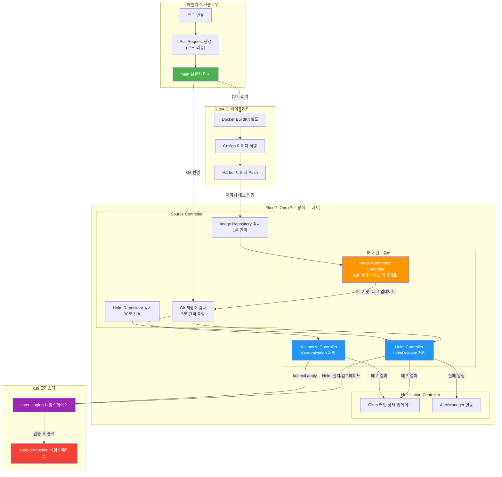
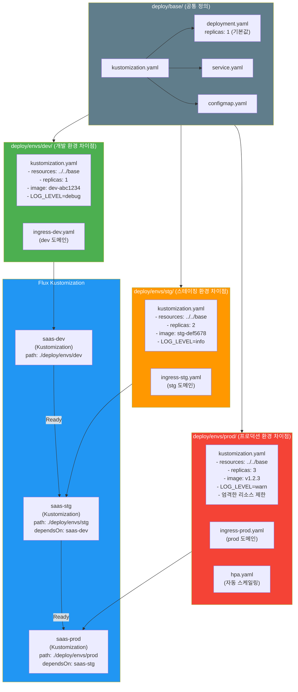

# GitOps 심화 — Flux2 고급 패턴, Kustomize, 멀티 클러스터

> **문서 ID**: ONBOARD-06-CICD-10
> **버전**: 1.0.0 | **작성일**: 2026-04-12 | **작성자**: Implementer (Sonnet)
> **대상**: CI/CD 기초를 마친 DevOps 엔지니어, 인프라 담당자
> **CSAP**: D-12 (시스템 개발 보안 — 변경 관리), D-13 (변경 관리)
> **선행 문서**:
>   - `04-infrastructure/kubernetes/03-gitops-flux.md` (Flux 기초)
>   - `06-cicd/deployment/01-gitops-deploy.md` (GitOps 배포 기초)
> **관련 문서** (중복 불가):
>   - `03-gitops-flux.md` — Flux 기본 컨트롤러 구조 (이 문서에서 심화)
>   - `01-gitops-deploy.md` — 기본 배포 절차 (이 문서는 고급 패턴 다룸)
> **Design Ref**: MTU-N35 §3.2, MTU-N67 §1, MTU-N245 S3.2

---

## 목차

1. [GitOps 심화 이해 — Push vs Pull 모델](#1-gitops-심화-이해--push-vs-pull-모델)
   - 1.1 [Push 방식의 문제점](#11-push-방식의-문제점)
   - 1.2 [Pull 방식 (Flux) 의 장점](#12-pull-방식-flux-의-장점)
   - 1.3 [Flux GitOps 전체 아키텍처](#13-flux-gitops-전체-아키텍처)
   - 1.4 [우리 프로젝트의 GitOps 구조](#14-우리-프로젝트의-gitops-구조)
2. [Flux2 컨트롤러 심화 분석](#2-flux2-컨트롤러-심화-분석)
   - 2.1 [Source Controller](#21-source-controller)
   - 2.2 [Helm Controller](#22-helm-controller)
   - 2.3 [Kustomize Controller](#23-kustomize-controller)
   - 2.4 [Notification Controller](#24-notification-controller)
   - 2.5 [Image Automation Controller](#25-image-automation-controller)
3. [HelmRelease 고급 설정](#3-helmrelease-고급-설정)
   - 3.1 [실제 HelmRelease 심층 분석](#31-실제-helmrelease-심층-분석)
   - 3.2 [의존성 순서 제어 (dependsOn)](#32-의존성-순서-제어-dependson)
   - 3.3 [헬스체크 커스텀 설정](#33-헬스체크-커스텀-설정)
   - 3.4 [값 오버라이드 전략](#34-값-오버라이드-전략)
   - 3.5 [자동 롤백 설정](#35-자동-롤백-설정)
4. [Kustomize를 활용한 환경별 설정](#4-kustomize를-활용한-환경별-설정)
   - 4.1 [base + overlays 구조 설계](#41-base--overlays-구조-설계)
   - 4.2 [환경별 설정 분리 (dev/stg/prod)](#42-환경별-설정-분리-devstgprod)
   - 4.3 [시크릿 관리](#43-시크릿-관리)
   - 4.4 [Kustomize 오버레이 구조도](#44-kustomize-오버레이-구조도)
5. [멀티 클러스터 GitOps (미래 계획)](#5-멀티-클러스터-gitops-미래-계획)
   - 5.1 [클러스터 플릿 관리 개념](#51-클러스터-플릿-관리-개념)
   - 5.2 [테넌시 기반 클러스터 분리](#52-테넌시-기반-클러스터-분리)
   - 5.3 [GitOps 테넌트 격리](#53-gitops-테넌트-격리)
6. [CSAP GitOps 요건](#6-csap-gitops-요건)
   - 6.1 [Git이 Single Source of Truth인 이유](#61-git이-single-source-of-truth인-이유)
   - 6.2 [직접 kubectl apply 금지 이유](#62-직접-kubectl-apply-금지-이유)
   - 6.3 [배포 변경 이력 GitOps 기록](#63-배포-변경-이력-gitops-기록)
   - 6.4 [긴급 변경 시 CSAP 기록 방법](#64-긴급-변경-시-csap-기록-방법)
7. [Flux 트러블슈팅](#7-flux-트러블슈팅)
   - 7.1 [HelmRelease가 Reconciling에서 멈추는 경우](#71-helmrelease가-reconciling에서-멈추는-경우)
   - 7.2 [이미지 업데이트 자동화 실패](#72-이미지-업데이트-자동화-실패)
   - 7.3 [Flux가 Git 변경을 감지 못하는 경우](#73-flux가-git-변경을-감지-못하는-경우)
   - 7.4 [flux 명령어 완전 레퍼런스](#74-flux-명령어-완전-레퍼런스)
8. [학습 체크리스트](#8-학습-체크리스트)
9. [변경 이력](#9-변경-이력)

---

## 1. GitOps 심화 이해 — Push vs Pull 모델

> 선행 학습 `03-gitops-flux.md`에서 GitOps의 기본 개념을 다루었습니다. 이 섹션은 두 모델의 깊은 차이와 우리가 Pull 방식을 선택한 이유를 설명합니다.

### 1.1 Push 방식의 문제점

기존 CI/CD 파이프라인은 "Push" 방식입니다. CI 파이프라인이 빌드 후 클러스터에 직접 명령을 보냅니다.

```
Push 방식의 전통적 문제:

1. 보안 자격증명 노출 위험:
   CI 서버 (Jenkins, GitHub Actions)가 클러스터에 접근하려면
   클러스터 자격증명(kubeconfig)을 CI 환경에 저장해야 합니다.
   → CI 서버 침해 = 클러스터 접근권 탈취

2. 단방향 통신 (CI → 클러스터):
   CI가 배포 명령을 보내면 클러스터 내부의 변화를 감지하지 못합니다.
   → 누군가 직접 kubectl apply로 수정하면 CI는 모름

3. Drift 감지 불가:
   실제 클러스터 상태와 Git 상태가 달라지는 "Drift"를 감지하지 못합니다.
   → "배포는 성공했는데 왜 운영이 다르지?" 상황 발생

4. 네트워크 접근 요건:
   CI 서버가 클러스터 API 서버에 직접 접근 가능해야 합니다.
   → 방화벽, 보안 그룹 복잡도 증가

5. CSAP D-12 준수 어려움:
   모든 배포 이력이 CI 시스템에만 기록됩니다.
   → 감사 추적이 CI 시스템과 클러스터로 분산됨
```

### 1.2 Pull 방식 (Flux) 의 장점

Flux는 클러스터 내부에서 Git을 주기적으로 감시하는 "Pull" 방식입니다.

```
Pull 방식 (Flux):

핵심 원칙: "클러스터가 스스로 Git을 감시하고 스스로 동기화"

장점 1. 자격증명 최소화:
  Flux는 클러스터 내부에서 실행됩니다.
  Git 저장소 접근 자격증명만 필요합니다 (읽기 전용으로 충분).
  CI 서버는 클러스터 자격증명이 필요 없습니다.

장점 2. Drift 감지 및 자동 복구:
  5분마다 Git 상태와 클러스터 상태를 비교합니다.
  누군가 직접 kubectl apply로 수정해도 5분 안에 Git 상태로 복구합니다.
  → "클러스터가 항상 Git 상태를 유지한다"는 보장

장점 3. 단방향 보안:
  클러스터 → Git (읽기): 안전
  Git → 클러스터 (Push 불필요): CI 서버의 클러스터 접근 권한 불필요

장점 4. CSAP D-12 자동 충족:
  모든 배포 변경이 Git 커밋으로 기록됩니다.
  누가, 언제, 무엇을, 왜 변경했는지 PR 히스토리로 완전한 감사 추적이 가능합니다.
```

### 1.3 Flux GitOps 전체 아키텍처



### 1.4 우리 프로젝트의 GitOps 구조

실제 파일 구조를 기반으로 한 GitOps 디렉토리 구성입니다.

```
fleet-infra (Git 저장소)
├── infra/
│   ├── flux/
│   │   ├── gitea-source.yaml          ← GitRepository (Gitea 연동)
│   │   ├── helm-release.yaml          ← HelmRelease (saas-platform, postgres, redis)
│   │   ├── platform-kustomization.yaml ← 4단계 배포 오케스트레이션
│   │   ├── notification.yaml          ← Gitea 커밋 상태 알림
│   │   ├── environments/
│   │   │   ├── dev-kustomization.yaml ← Dev 환경 Kustomization
│   │   │   ├── stg-kustomization.yaml ← Staging 환경 Kustomization
│   │   │   └── prod-kustomization.yaml ← Production 환경 Kustomization
│   │   ├── drift-detection/
│   │   │   ├── drift-config.yaml      ← Drift 감지 설정
│   │   │   └── helmrelease-patch-*.yaml ← 환경별 패치
│   │   └── image-policies/
│   │       └── image-automation.yaml  ← 이미지 자동 업데이트
│   └── storage/
│       ├── storageclass-hot.yaml
│       ├── storageclass-warm.yaml
│       └── storageclass-cold.yaml
└── deploy/
    ├── envs/
    │   ├── dev/                       ← Dev 환경 Kustomize 오버레이
    │   ├── stg/                       ← Staging 환경 Kustomize 오버레이
    │   └── prod/                      ← Production 환경 Kustomize 오버레이
    └── base/                          ← 공통 기본 매니페스트
```

---

## 2. Flux2 컨트롤러 심화 분석

Flux2는 5개의 독립 컨트롤러로 구성됩니다. 각 컨트롤러는 독립 실행되며 특정 Kubernetes CRD를 처리합니다.

### 2.1 Source Controller

Source Controller는 외부 소스(Git, Helm Registry, OCI Registry)를 감시하고 로컬 아티팩트를 생성합니다.

#### GitRepository — Git 저장소 감시

실제 파일: `infra/flux/gitea-source.yaml`

```yaml
# Design Ref: MTU-N24 §2 | Plan SC: FR-N24.1
apiVersion: source.toolkit.fluxcd.io/v1
kind: GitRepository
metadata:
  name: fleet-infra
  namespace: flux-system
spec:
  interval: 5m          # 5분마다 Git 변경 확인
  url: http://172.18.120.97:3000/saas-admin/fleet-infra.git
  ref:
    branch: main        # main 브랜치 감시
  secretRef:
    name: gitea-credentials  # Git 인증 (Basic Auth 또는 SSH)
  timeout: 3m           # Git fetch 타임아웃
```

```bash
# GitRepository 상태 확인
flux get sources git

# 출력 예시:
# NAME         REVISION      SUSPENDED  READY   MESSAGE
# fleet-infra  main@sha1:abc  False      True    stored artifact for revision 'main@sha1:abc'

# 강제 동기화 (5분 기다리지 않고 즉시)
flux reconcile source git fleet-infra
```

#### HelmRepository — Helm 차트 저장소

```yaml
# infra/flux/helm-release.yaml (발췌)
# Bitnami 공개 Helm 저장소
apiVersion: source.toolkit.fluxcd.io/v1
kind: HelmRepository
metadata:
  name: bitnami
  namespace: flux-system
spec:
  interval: 30m          # 30분마다 차트 목록 갱신
  url: https://charts.bitnami.com/bitnami
```

#### OCIRepository — OCI 레지스트리 (Harbor)

```yaml
# OCI 형식으로 Helm 차트를 Harbor에서 가져오는 방식
# (향후 Harbor OCI 지원 시 활용)
apiVersion: source.toolkit.fluxcd.io/v1beta2
kind: OCIRepository
metadata:
  name: harbor-charts
  namespace: flux-system
spec:
  interval: 5m
  url: oci://localhost:8080/public-saas/charts
  ref:
    tag: latest
  insecure: true         # Self-signed 인증서 허용 (개발 환경)
  secretRef:
    name: harbor-credentials
```

### 2.2 Helm Controller

Helm Controller는 HelmRelease 리소스를 감시하고 Helm 설치/업그레이드/롤백을 실행합니다.

```bash
# Helm Controller 로그 확인
kubectl logs -n flux-system deployment/helm-controller -f

# HelmRelease 전체 상태
flux get helmreleases --all-namespaces

# 특정 HelmRelease 상세
flux get helmrelease saas-platform -n flux-system
```

HelmRelease 처리 흐름:

```
HelmRelease 생성/변경 감지
  └── Source Controller에서 차트 아티팩트 수신
      └── Values 병합 (inline + valuesFrom)
          └── Helm diff 계산 (변경 사항 확인)
              └── 변경 있음 → Helm upgrade 실행
                  ├── 성공: Ready=True, 상태 업데이트
                  └── 실패: Remediation 정책 적용
                      ├── retries 남음: 재시도
                      └── retries 소진: 자동 롤백 또는 중단
```

### 2.3 Kustomize Controller

Kustomize Controller는 Kustomization 리소스를 처리하고 `kubectl apply`로 매니페스트를 적용합니다.

```bash
# Kustomization 상태 확인
flux get kustomizations

# 출력 예시:
# NAME           REVISION      SUSPENDED  READY   MESSAGE
# saas-infra     main@sha1:abc  False      True    Applied revision: main@sha1:abc
# saas-monitoring main@sha1:abc  False      True    Applied revision: main@sha1:abc
# saas-apps      main@sha1:abc  False      True    Applied revision: main@sha1:abc
# saas-network   main@sha1:abc  False      True    Applied revision: main@sha1:abc

# 특정 Kustomization 강제 동기화
flux reconcile kustomization saas-apps
```

#### Drift Detection — 실제 설정

실제 파일: `infra/flux/drift-detection/drift-config.yaml`

```yaml
# Design Ref: MTU-N67.design.md §1 | Plan SC: FR-N67.1, FR-N67.2
apiVersion: helm.toolkit.fluxcd.io/v2
kind: HelmRelease
spec:
  driftDetection:
    mode: enabled          # 드리프트 감지 + 자동 복구
    ignore:
      # HPA가 관리하는 replicas는 Flux가 수정하지 않음
      - paths: ["/spec/replicas"]
        target:
          kind: Deployment
      # cert-manager TLS 시크릿 내용은 무시
      - paths: ["/data"]
        target:
          kind: Secret
          annotationSelector: "cert-manager.io/certificate-name"
```

### 2.4 Notification Controller

Notification Controller는 Flux 이벤트(배포 성공/실패)를 외부 시스템으로 전송합니다.

실제 파일: `infra/flux/notification.yaml`

```yaml
# Design Ref: MTU-N24 §4 | Plan SC: FR-N24.4
---
# Gitea Provider: 커밋 상태 업데이트 (PR에 체크 표시)
apiVersion: notification.toolkit.fluxcd.io/v1beta3
kind: Provider
metadata:
  name: gitea-provider
  namespace: flux-system
spec:
  type: gitea
  address: http://172.18.120.97:3000
  secretRef:
    name: gitea-credentials  # Gitea API 토큰 (Secret에서 참조)

---
# Alert: 모든 GitRepository, Kustomization 이벤트를 Gitea로 전송
apiVersion: notification.toolkit.fluxcd.io/v1beta3
kind: Alert
metadata:
  name: flux-alerts
  namespace: flux-system
spec:
  providerRef:
    name: gitea-provider
  eventSeverity: info      # info 이상 (warn, error 포함)
  eventSources:
    - kind: GitRepository
      name: '*'            # 모든 GitRepository 감시
    - kind: Kustomization
      name: '*'
```

Slack 알림 Provider 추가 (선택):

```yaml
# Slack 알림 (선택적 추가)
apiVersion: notification.toolkit.fluxcd.io/v1beta3
kind: Provider
metadata:
  name: slack-provider
  namespace: flux-system
spec:
  type: slack
  channel: "#saas-deployments"
  secretRef:
    name: slack-webhook    # Slack Webhook URL (Secret에서 참조)

---
apiVersion: notification.toolkit.fluxcd.io/v1beta3
kind: Alert
metadata:
  name: slack-critical-alerts
  namespace: flux-system
spec:
  providerRef:
    name: slack-provider
  eventSeverity: error     # error 심각도만 Slack 알림
  eventSources:
    - kind: HelmRelease
      name: saas-platform
```

### 2.5 Image Automation Controller

Image Automation Controller는 Harbor에 새 이미지가 Push되면 자동으로 Git에 커밋하여 배포를 유발합니다.

실제 파일: `infra/flux/image-policies/image-automation.yaml`

```yaml
# Design Ref: MTU-N245 S3.2 | Plan SC: FR-N245.2
# CSAP: D-12 (시스템 개발 보안 — 배포 자동화)

# 1단계: ImageRepository — Harbor 이미지 스캔
apiVersion: image.toolkit.fluxcd.io/v1beta2
kind: ImageRepository
metadata:
  name: api-gateway
  namespace: flux-system
spec:
  image: localhost:8080/public-saas/api-gateway
  interval: 1m             # 1분마다 새 태그 확인
  insecure: true           # Harbor self-signed 인증서 허용

---
# 2단계: ImagePolicy — 어떤 태그를 사용할지 규칙 정의
# Dev: dev- 접두사 + 7자리 git SHA (최신 순)
apiVersion: image.toolkit.fluxcd.io/v1beta2
kind: ImagePolicy
metadata:
  name: api-gateway-dev
  namespace: flux-system
spec:
  imageRepositoryRef:
    name: api-gateway
  filterTags:
    pattern: '^dev-[a-f0-9]{7}$'   # dev-abc1234 형식
  policy:
    alphabetical:
      order: desc          # 알파벳 내림차순 = 최신 태그 선택

# Staging: stg- 접두사
---
apiVersion: image.toolkit.fluxcd.io/v1beta2
kind: ImagePolicy
metadata:
  name: api-gateway-stg
  namespace: flux-system
spec:
  imageRepositoryRef:
    name: api-gateway
  filterTags:
    pattern: '^stg-[a-f0-9]{7}$'
  policy:
    alphabetical:
      order: desc

# Production: 정식 semver 태그 (v1.0.0 형식)
---
apiVersion: image.toolkit.fluxcd.io/v1beta2
kind: ImagePolicy
metadata:
  name: api-gateway-prod
  namespace: flux-system
spec:
  imageRepositoryRef:
    name: api-gateway
  filterTags:
    pattern: '^v\d+\.\d+\.\d+$'    # v1.0.0 형식만
  policy:
    semver:
      range: ">=1.0.0"             # 1.0.0 이상만 배포

---
# 3단계: ImageUpdateAutomation — 새 태그를 Git에 커밋
apiVersion: image.toolkit.fluxcd.io/v1beta2
kind: ImageUpdateAutomation
metadata:
  name: saas-image-update
  namespace: flux-system
spec:
  interval: 1m
  sourceRef:
    kind: GitRepository
    name: saas-platform
  git:
    checkout:
      ref:
        branch: stg
    commit:
      author:
        email: flux-bot@saas-platform.local
        name: Flux Image Automation
      messageTemplate: |
        chore(flux): 이미지 태그 자동 업데이트

        {{range .Updated.Images}}
        - {{.}}
        {{end}}

        Design Ref: MTU-N245 S3.2
        CSAP: D-12 배포 자동화
    push:
      branch: stg          # stg 브랜치에 커밋
  update:
    path: ./deploy         # 업데이트할 경로
    strategy: Setters      # 이미지 태그 치환 방식
```

이미지 태그 자동 업데이트를 위한 HelmRelease 어노테이션:

```yaml
# HelmRelease에 이미지 태그 마커 추가
values:
  image:
    repository: localhost:8080/public-saas/api-gateway
    tag: stg-abc1234  # {"$imagepolicy": "flux-system:api-gateway-stg:tag"}
```

---

## 3. HelmRelease 고급 설정

### 3.1 실제 HelmRelease 심층 분석

실제 파일: `infra/flux/helm-release.yaml`의 saas-platform HelmRelease를 분석합니다.

```yaml
# Design Ref: MTU-N35 §3.2 | Plan SC: FR-N35.2
# CSAP: D-11(가상화 보안), D-12(시스템 개발 보안)
apiVersion: helm.toolkit.fluxcd.io/v2
kind: HelmRelease
metadata:
  name: saas-platform
  namespace: flux-system
spec:
  # ---- 동기화 설정 ----
  interval: 5m             # 5분마다 HelmRelease 상태 확인

  # ---- 차트 소스 ----
  chart:
    spec:
      chart: ./helm/saas-platform   # Git 저장소 내 로컬 차트 경로
      sourceRef:
        kind: GitRepository
        name: fleet-infra            # 어떤 GitRepository 소스를 사용할지
        namespace: flux-system
      interval: 5m
      reconcileStrategy: ChartVersion  # 차트 버전 변경 시만 재배포

  # ---- 배포 대상 ----
  targetNamespace: saas-platform
  releaseName: saas-platform

  # ---- 기본 Values ----
  values:
    global:
      imageRegistry: localhost:8080
      imageProject: public-saas
      environment: staging

    # OTel 관측가능성 연동
    observability:
      otelCollectorEndpoint: http://saas-otel-collector.monitoring.svc.cluster.local:4317
      tracingEnabled: true
      metricsEnabled: true

  # ---- 설치 설정 ----
  install:
    createNamespace: true  # 네임스페이스 자동 생성
    remediation:
      retries: 3           # 설치 실패 시 3회 재시도

  # ---- 업그레이드 설정 ----
  upgrade:
    remediation:
      retries: 3
      remediateLastFailure: true   # 마지막 실패도 복구 시도
    cleanupOnFail: true           # 실패 시 임시 리소스 정리
    force: false                  # 강제 업그레이드 금지 (안전)

  # ---- 롤백 설정 ----
  rollback:
    timeout: 5m
    recreate: false        # Pod 재생성 없이 롤백
    cleanupOnFail: true

  # ---- 타임아웃 ----
  timeout: 10m             # 전체 배포 타임아웃

  # ---- 의존성 ----
  dependsOn:
    - name: saas-postgres
      namespace: flux-system
    - name: saas-redis
      namespace: flux-system
```

### 3.2 의존성 순서 제어 (dependsOn)

`dependsOn`은 HelmRelease 배포 순서를 보장합니다. 플랫폼 전체 배포 순서는 `infra/flux/platform-kustomization.yaml`에 정의되어 있습니다.

```yaml
# infra/flux/platform-kustomization.yaml (요약)

# 1단계: 인프라 기반 (DB, Redis)
---
kind: Kustomization
metadata:
  name: saas-infra
spec:
  path: ./infra/base
  healthChecks:
    - kind: StatefulSet
      name: saas-postgres-postgresql
    - kind: StatefulSet
      name: saas-redis-master

# 2단계: 모니터링 (Prometheus, Loki, Tempo) — 인프라 완료 후
---
kind: Kustomization
metadata:
  name: saas-monitoring
spec:
  dependsOn:
    - name: saas-infra     # saas-infra가 Ready여야 시작

# 3단계: 앱 서비스 — 인프라 + 모니터링 완료 후
---
kind: Kustomization
metadata:
  name: saas-apps
spec:
  dependsOn:
    - name: saas-infra
    - name: saas-monitoring

# 4단계: 네트워크 — 앱 완료 후
---
kind: Kustomization
metadata:
  name: saas-network
spec:
  dependsOn:
    - name: saas-apps
```

이 순서가 없으면 발생하는 문제:
- 앱 서비스가 DB보다 먼저 시작 → DB 연결 실패 → CrashLoopBackOff
- Prometheus가 서비스보다 먼저 시작 → ServiceMonitor 대상 없음 → 스크래핑 실패

### 3.3 헬스체크 커스텀 설정

Flux는 배포 후 헬스체크로 성공 여부를 판단합니다. 기본 헬스체크를 커스텀할 수 있습니다.

```yaml
# HelmRelease 헬스체크 커스텀
apiVersion: helm.toolkit.fluxcd.io/v2
kind: HelmRelease
metadata:
  name: auth-service
  namespace: flux-system
spec:
  # 배포 후 이 리소스들이 Ready 상태여야 성공으로 판단
  postRenderers:
    - kustomize:
        patches:
          - target:
              kind: Deployment
              name: auth-service
            patch: |
              - op: add
                path: /spec/template/spec/containers/0/readinessProbe
                value:
                  httpGet:
                    path: /health/ready
                    port: 3000
                  initialDelaySeconds: 10
                  periodSeconds: 5
                  failureThreshold: 3
```

Kustomization 레벨 헬스체크:

```yaml
# infra/flux/environments/stg-kustomization.yaml
apiVersion: kustomize.toolkit.fluxcd.io/v1
kind: Kustomization
metadata:
  name: saas-stg
spec:
  healthChecks:
    - apiVersion: apps/v1
      kind: Deployment
      name: api-gateway
      namespace: saas-staging
    - apiVersion: apps/v1
      kind: Deployment
      name: auth-service
      namespace: saas-staging
    # HelmRelease 자체의 Ready 상태도 확인
    - apiVersion: helm.toolkit.fluxcd.io/v2
      kind: HelmRelease
      name: saas-platform
      namespace: flux-system
```

### 3.4 값 오버라이드 전략

HelmRelease에서 차트 값을 오버라이드하는 세 가지 방법입니다.

#### 방법 1: inline values (직접 명시)

```yaml
spec:
  values:
    replicaCount: 3
    image:
      tag: "1.2.3"
    resources:
      limits:
        memory: "512Mi"
```

#### 방법 2: valuesFrom (ConfigMap/Secret 참조)

```yaml
spec:
  valuesFrom:
    # ConfigMap에서 공통 설정 가져오기
    - kind: ConfigMap
      name: saas-platform-values
      valuesKey: values.yaml     # ConfigMap의 어떤 키를 사용할지

    # Secret에서 민감 설정 가져오기 (CSAP D-12: 시크릿 하드코딩 금지)
    - kind: Secret
      name: saas-platform-secrets
      valuesKey: values.yaml
      optional: false            # false: Secret 없으면 배포 실패 (안전)
```

valuesFrom을 위한 ConfigMap 예시:

```yaml
apiVersion: v1
kind: ConfigMap
metadata:
  name: saas-platform-values
  namespace: flux-system
data:
  values.yaml: |
    global:
      environment: staging
    monitoring:
      enabled: true
      namespace: monitoring
```

#### 방법 3: 우선순위 (낮음 → 높음)

```
차트 기본 values.yaml
  < valuesFrom ConfigMap
    < valuesFrom Secret
      < inline values (spec.values)
```

가장 나중에 적용된 값이 이깁니다. 환경별 오버라이드는 이 우선순위를 활용합니다.

### 3.5 자동 롤백 설정

배포 실패 시 자동 롤백이 동작하는 방식과 설정 방법입니다.

```yaml
apiVersion: helm.toolkit.fluxcd.io/v2
kind: HelmRelease
spec:
  install:
    remediation:
      retries: 3             # 설치 실패 시 최대 3회 재시도
      ignoreTestFailures: false  # helm test 실패 시 remediation 적용

  upgrade:
    remediation:
      retries: 3
      remediateLastFailure: true  # 마지막 시도도 실패 시 롤백 실행
    timeout: 10m

  rollback:
    timeout: 5m
    recreate: false          # StatefulSet은 true 권장 (Pod 강제 재생성)
    cleanupOnFail: true      # 롤백 실패 시 임시 리소스 정리
    force: false
```

롤백 상태 확인:

```bash
# HelmRelease 롤백 이력 확인
kubectl get helmrelease saas-platform -n flux-system -o yaml | grep -A20 "history:"

# Helm 히스토리 직접 확인
helm history saas-platform -n saas-platform

# 수동 롤백 트리거 (자동화가 막힌 경우)
flux suspend helmrelease saas-platform -n flux-system
helm rollback saas-platform 1 -n saas-platform  # 1: 이전 리비전 번호
flux resume helmrelease saas-platform -n flux-system
```

---

## 4. Kustomize를 활용한 환경별 설정

### 4.1 base + overlays 구조 설계

Kustomize는 공통 설정(base)과 환경별 차이점(overlay)을 분리하여 중복을 최소화합니다.

```
base (공통):
  - 모든 환경에서 동일한 리소스 정의
  - Deployment, Service, ConfigMap 기본값

overlays/dev (개발 환경 차이점):
  - 적은 레플리카 수 (1개)
  - 낮은 리소스 제한
  - 디버그 로그 레벨

overlays/stg (스테이징 환경 차이점):
  - 중간 레플리카 수 (2개)
  - 스테이징 인증서
  - 성능 테스트 설정

overlays/prod (프로덕션 환경 차이점):
  - 고가용성 (3+ 레플리카)
  - 엄격한 리소스 제한
  - 프로덕션 시크릿 참조
```

#### base 디렉토리 구조

```yaml
# deploy/base/kustomization.yaml
apiVersion: kustomize.config.k8s.io/v1beta1
kind: Kustomization

resources:
  - deployment.yaml
  - service.yaml
  - configmap.yaml
  - servicemonitor.yaml

# 공통 레이블 (모든 리소스에 자동 추가)
commonLabels:
  app.kubernetes.io/part-of: public-saas-framework
  managed-by: flux

# 공통 어노테이션
commonAnnotations:
  csap.ref: "D-12"
```

```yaml
# deploy/base/deployment.yaml
apiVersion: apps/v1
kind: Deployment
metadata:
  name: api-gateway
spec:
  replicas: 1              # 기본값 (overlay에서 오버라이드)
  selector:
    matchLabels:
      app: api-gateway
  template:
    spec:
      containers:
        - name: api-gateway
          image: localhost:8080/public-saas/api-gateway:latest  # 태그는 overlay에서 변경
          resources:
            requests:
              cpu: 50m
              memory: 128Mi
            limits:
              cpu: 250m
              memory: 256Mi
```

### 4.2 환경별 설정 분리 (dev/stg/prod)

#### Staging 환경 (실제 파일 기반)

`infra/flux/environments/stg-kustomization.yaml`:

```yaml
# Design Ref: MTU-N41 Design S3 | Plan SC: FR-N41.4
apiVersion: kustomize.toolkit.fluxcd.io/v1
kind: Kustomization
metadata:
  name: saas-stg
  namespace: flux-system
spec:
  interval: 10m
  path: ./deploy/envs/stg   # Kustomize overlay 경로
  prune: true               # Git에 없는 리소스 자동 삭제 (stg는 허용)
  sourceRef:
    kind: GitRepository
    name: saas-platform
  targetNamespace: saas-staging
  wait: true
  timeout: 10m
  dependsOn:
    - name: saas-dev        # Dev 검증 완료 후 Stg 배포
  healthChecks:
    - apiVersion: apps/v1
      kind: Deployment
      name: api-gateway
      namespace: saas-staging
```

#### Production 환경 (실제 파일 기반)

`infra/flux/environments/prod-kustomization.yaml`:

```yaml
# CSAP: D-12 (개발 보안 — 배포 통제)
apiVersion: kustomize.toolkit.fluxcd.io/v1
kind: Kustomization
metadata:
  name: saas-prod
  namespace: flux-system
spec:
  interval: 30m             # Stg보다 낮은 동기화 빈도 (의도적 보수적)
  path: ./deploy/envs/prod
  prune: false              # Production: 자동 삭제 비활성화 (안전 우선)
  sourceRef:
    kind: GitRepository
    name: saas-platform
  targetNamespace: saas-production
  wait: true
  timeout: 15m
  dependsOn:
    - name: saas-stg        # Stg 검증 완료 후만 Prod 배포
  healthChecks:
    - apiVersion: apps/v1
      kind: Deployment
      name: api-gateway
      namespace: saas-production
  # 긴급 시 수동 일시 정지:
  # suspend: true
```

#### Staging overlay Kustomization

```yaml
# deploy/envs/stg/kustomization.yaml
apiVersion: kustomize.config.k8s.io/v1beta1
kind: Kustomization

# base에서 가져올 리소스
resources:
  - ../../base
  - ingress.yaml           # Stg 전용 Ingress

# 이미지 태그 오버라이드 (Image Automation이 여기를 수정)
images:
  - name: localhost:8080/public-saas/api-gateway
    newTag: stg-abc1234   # {"$imagepolicy": "flux-system:api-gateway-stg:tag"}

# 레플리카 수 패치 (Stg: 2개)
replicas:
  - name: api-gateway
    count: 2

# 리소스 제한 패치
patches:
  - target:
      kind: Deployment
      name: api-gateway
    patch: |
      - op: replace
        path: /spec/template/spec/containers/0/resources/limits/memory
        value: "512Mi"
      - op: replace
        path: /spec/template/spec/containers/0/resources/limits/cpu
        value: "500m"

# ConfigMap 생성 (Stg 환경 설정)
configMapGenerator:
  - name: app-config
    literals:
      - LOG_LEVEL=info
      - ENVIRONMENT=staging
      - OTEL_ENABLED=true
```

### 4.3 시크릿 관리

#### 방법 1: Sealed Secrets (현재 사용)

```bash
# Sealed Secrets로 암호화된 시크릿 생성
echo -n "my-secret-value" | kubectl create secret generic my-secret \
  --from-literal=key=value \
  --dry-run=client -o yaml | \
  kubeseal --format yaml > infra/sealed-secrets/my-secret.yaml

# SealedSecret을 Git에 커밋 (암호화되어 있으므로 안전)
git add infra/sealed-secrets/my-secret.yaml
git commit -m "feat(secret): my-service 시크릿 추가 (CSAP D-12)"
```

#### 방법 2: External Secrets Operator (ESO) — Vault 연동

```yaml
# Vault에서 시크릿을 Kubernetes Secret으로 동기화
# Design Ref: MTU-N35 §4 (Vault 연동)
apiVersion: external-secrets.io/v1beta1
kind: ExternalSecret
metadata:
  name: db-credentials
  namespace: saas-staging
spec:
  refreshInterval: 5m      # 5분마다 Vault에서 갱신
  secretStoreRef:
    name: vault-backend
    kind: SecretStore
  target:
    name: db-credentials   # 생성될 Kubernetes Secret 이름
    creationPolicy: Owner
  data:
    - secretKey: DB_PASSWORD     # Secret의 키 이름
      remoteRef:
        key: saas/stg/database   # Vault 경로
        property: password       # Vault 시크릿의 필드
```

#### CSAP D-12 시크릿 관리 원칙

```
금지: 하드코딩 (CSAP D-12 위반)
  ❌ env:
       - name: DB_PASSWORD
         value: "my-password"

금지: 평문 ConfigMap (민감 데이터)
  ❌ configMapGenerator:
       - literals:
           - DB_PASSWORD=my-password

허용: Sealed Secrets (암호화 저장)
  ✅ SealedSecret을 Git에 커밋

허용: External Secrets (Vault 연동)
  ✅ ExternalSecret으로 Vault에서 동적 조회

허용: secretRef (기존 Secret 참조)
  ✅ valueFrom:
       secretKeyRef:
         name: db-credentials
         key: DB_PASSWORD
```

### 4.4 Kustomize 오버레이 구조도



---

## 5. 멀티 클러스터 GitOps (미래 계획)

> 이 섹션은 현재 단일 k3s 클러스터 운영이지만, CSAP 상등급 달성 시 멀티 클러스터로 확장하는 로드맵을 설명합니다.

### 5.1 클러스터 플릿 관리 개념

```
현재 (2026 Q2): 단일 k3s 클러스터
  └── WSL2 환경 (개발/스테이징 통합)

목표 (2026 Q4): 멀티 클러스터
  ├── 개발 클러스터 (k3s, WSL2)
  ├── 스테이징 클러스터 (k3s, 베어메탈)
  └── 프로덕션 클러스터 (k8s, 전용 서버)
       └── CSAP 상등급: 완전 격리된 프로덕션 환경
```

Flux Fleet 관리 패턴:

```yaml
# 향후 멀티 클러스터 시 fleet-infra 구조
fleet-infra/
├── clusters/
│   ├── dev/
│   │   ├── flux-system/         ← Dev 클러스터 Flux 설정
│   │   └── apps/                ← Dev 클러스터 앱 배포
│   ├── staging/
│   │   ├── flux-system/
│   │   └── apps/
│   └── production/
│       ├── flux-system/
│       └── apps/
└── infrastructure/              ← 공통 인프라 컴포넌트
    ├── monitoring/
    └── security/
```

### 5.2 테넌시 기반 클러스터 분리

공공기관 SaaS에서는 기관별 데이터 완전 격리가 필요할 수 있습니다.

```
테넌트 격리 전략 옵션:

옵션 1: 네임스페이스 격리 (현재)
  - 동일 클러스터, 네임스페이스 분리
  - 비용 효율적
  - 기관 간 완전 격리 보장 어려움

옵션 2: 가상 클러스터 (vCluster) — 검토 중
  - 하나의 물리 클러스터에 가상 k8s API 서버 제공
  - 기관마다 독립 클러스터 경험 제공
  - 비용과 격리 수준의 균형

옵션 3: 물리 클러스터 격리 (CSAP 상등급 요건)
  - 기관별 완전히 독립된 클러스터
  - 최고 수준 격리
  - 운영 비용 높음

현재 선택: 옵션 1 (네임스페이스 격리)
  인프라/flux/multi-tenant-cicd/ 참조
```

### 5.3 GitOps 테넌트 격리

멀티 테넌트 환경에서 Flux의 접근 제어:

```yaml
# 테넌트 A는 자신의 네임스페이스에만 배포 가능
apiVersion: kustomize.toolkit.fluxcd.io/v1
kind: Kustomization
metadata:
  name: tenant-a-apps
  namespace: flux-system
spec:
  targetNamespace: tenant-a      # 테넌트 A 네임스페이스만
  serviceAccountName: tenant-a-deployer  # 최소 권한 SA
  path: ./tenants/tenant-a
  sourceRef:
    kind: GitRepository
    name: tenant-a-config        # 테넌트 A 전용 Git 저장소

---
# 테넌트 A 배포 SA: tenant-a 네임스페이스만 접근 가능
apiVersion: rbac.authorization.k8s.io/v1
kind: RoleBinding
metadata:
  name: tenant-a-deployer
  namespace: tenant-a
subjects:
  - kind: ServiceAccount
    name: tenant-a-deployer
    namespace: flux-system
roleRef:
  kind: ClusterRole
  name: cluster-admin
  apiGroup: rbac.authorization.k8s.io
```

---

## 6. CSAP GitOps 요건

### 6.1 Git이 Single Source of Truth인 이유

CSAP D-12와 D-13은 "변경 관리"와 "시스템 개발 보안"을 요구합니다. GitOps는 이 두 요건을 자동으로 충족합니다.

| CSAP 요건 | GitOps 충족 방법 | 증거 |
|---------|---------------|------|
| D-12-01: 변경 통제 절차 | PR 기반 변경 → 리뷰어 승인 필수 | PR 히스토리 |
| D-12-02: 변경 영향 분석 | PR Description에 변경 영향 기술 | PR 코멘트 |
| D-12-03: 테스트 후 배포 | CI 통과 후 머지 → Flux 자동 배포 | CI 결과 + Flux 로그 |
| D-13-01: 변경 이력 관리 | Git 커밋 이력 (변경자, 일시, 내용) | `git log` |
| D-13-02: 현행화 유지 | Flux drift 감지: 실제 상태 ≠ Git 상태 시 자동 복구 | Flux Alert |
| D-12-05: 배포 승인 | Gitea Protected Branch + Required Reviewers | PR 설정 |

### 6.2 직접 kubectl apply 금지 이유

GitOps 환경에서 직접 `kubectl apply`를 실행하는 것이 왜 문제인지 구체적으로 설명합니다.

```
시나리오: 개발자가 실수로 직접 kubectl apply 실행

1. 개발자가 Production에 직접 변경:
   kubectl apply -f my-fix.yaml -n saas-production

2. 5분 후 Flux가 Drift를 감지:
   "실제 상태 ≠ Git 상태"

3. Flux가 Git 상태로 자동 복구:
   개발자의 임시 수정이 사라짐

4. 개발자가 왜 수정이 사라졌는지 이해 못 함

→ 결론: kubectl apply로 Flux가 관리하는 리소스를 수정하면
  5분 안에 원래 Git 상태로 되돌아갑니다.
  원하는 변경이 있으면 Git에 커밋해야 합니다.

CSAP 관점:
  D-13-03: "무단 변경 감지 및 복원"
  Flux의 drift detection = 무단 변경 자동 탐지 + 복원
```

Drift 감지 확인:

```bash
# Drift 발생 시 Flux 이벤트 확인
kubectl get events -n flux-system | grep "drift"

# 특정 HelmRelease의 Drift 상태
kubectl describe helmrelease saas-platform -n flux-system | grep -A5 "Drift"
```

### 6.3 배포 변경 이력 GitOps 기록

모든 배포 변경은 Git 커밋으로 추적됩니다. 감리 시 다음 명령으로 이력을 제출합니다.

```bash
# 배포 관련 커밋 이력 (Conventional Commits 기반)
git log --oneline --grep="^feat\|^fix\|^chore" infra/flux/

# 특정 서비스의 이미지 태그 변경 이력
git log --all --oneline -- infra/flux/image-policies/image-automation.yaml

# 특정 날짜 이후 배포 변경
git log --since="2026-04-01" --until="2026-04-12" infra/flux/

# PR 기반 배포 이력 (Gitea API 활용)
curl -s "http://gitea.saas.local:3000/api/v1/repos/saas-admin/fleet-infra/pulls?state=closed&limit=50" | \
  jq '.[] | {number: .number, title: .title, merged_at: .merged_at, merger: .merged_by.login}'
```

### 6.4 긴급 변경 시 CSAP 기록 방법

긴급 상황에서 GitOps 프로세스를 우회해야 할 때 CSAP D-13 요건을 준수하는 방법입니다.

```
긴급 변경 프로세스 (CSAP D-13 준수):

1. 사전 승인 (5분 이내):
   - Slack/전화로 인프라팀 리더 승인 획득
   - Gitea에 긴급 이슈 생성 (변경 사유 명시)

2. Flux 일시 중지 (특정 리소스만):
   flux suspend helmrelease saas-platform -n flux-system

3. 긴급 변경 실행:
   kubectl apply -f emergency-fix.yaml -n saas-production

4. 사후 Git 반영 (30분 이내):
   # 변경 내용을 Git에 반영
   git checkout -b hotfix/emergency-2026041201
   # YAML 수정
   git commit -m "fix(emergency): [ISSUE-XXX] 긴급 수정 — 원인 및 변경 내용"
   # PR 생성 → 승인 → 머지

5. Flux 재개:
   flux resume helmrelease saas-platform -n flux-system

6. 감사 로그 기록 (CSAP D-06):
   # 변경 내용, 승인자, 사유, 검증 결과를 audit.jsonl에 기록
```

```bash
# 긴급 변경 시 감사 로그 기록 스크립트
cat >> /data/ai-saas/.claude/audit.jsonl << EOF
{"timestamp":"$(date -u +%Y-%m-%dT%H:%M:%SZ)","action":"EMERGENCY_DEPLOY","actor":"admin","target":"saas-platform","details":{"issue":"ISSUE-123","reason":"critical-bug-fix","approver":"infra-lead"},"csap":"D-13"}
EOF
```

---

## 7. Flux 트러블슈팅

### 7.1 HelmRelease가 Reconciling에서 멈추는 경우

```bash
# 증상: flux get helmreleases 에서 READY=False, MESSAGE=Reconciling
flux get helmreleases --all-namespaces | grep "Reconciling"

# 1단계: HelmRelease 이벤트 확인
kubectl describe helmrelease saas-platform -n flux-system | tail -20

# 2단계: Helm Controller 로그 확인
kubectl logs -n flux-system deployment/helm-controller --since=10m | grep "ERROR\|error"

# 3단계: Helm 릴리스 직접 상태 확인
helm list -n saas-platform
helm status saas-platform -n saas-platform
```

원인별 해결:

| 원인 | 증상 | 해결 |
|------|------|------|
| 차트 소스 없음 | "chart not found" | `flux reconcile source git fleet-infra` |
| 의존 HelmRelease 미준비 | "dependency not ready" | 의존 HR 상태 확인 후 해결 |
| 타임아웃 | "timeout exceeded" | `timeout` 값 증가 또는 원인 서비스 확인 |
| 값 오류 | "values validation error" | values 필드 오타/형식 오류 확인 |
| 헬스체크 실패 | "health check failed" | `kubectl get pod -n <ns>` Pod 상태 확인 |

```bash
# Reconciling 강제 해제 (최후 수단)
flux suspend helmrelease saas-platform -n flux-system
flux resume helmrelease saas-platform -n flux-system

# 상태 초기화 (HelmRelease 재생성 없이)
kubectl annotate helmrelease saas-platform -n flux-system \
  reconcile.fluxcd.io/requestedAt="$(date -u +%Y-%m-%dT%H:%M:%SZ)"
```

### 7.2 이미지 업데이트 자동화 실패

```bash
# Image Automation 상태 확인
flux get images all --all-namespaces

# ImageRepository 스캔 상태
kubectl describe imagerepository api-gateway -n flux-system | grep -A10 "Status:"

# Harbor 연결 테스트
kubectl run -it --rm test-harbor --image=curlimages/curl -- \
  curl -v http://localhost:8080/v2/public-saas/api-gateway/tags/list

# Image Automation 로그
kubectl logs -n flux-system deployment/image-automation-controller --since=5m
```

원인별 해결:

```bash
# 1. Harbor 인증 실패
# Secret 확인
kubectl get secret harbor-credentials -n flux-system -o yaml

# 2. 태그 패턴 불일치
# ImagePolicy 필터 패턴 확인
kubectl get imagepolicy api-gateway-stg -n flux-system -o yaml | grep -A3 filterTags

# 3. Git Push 실패 (쓰기 권한 없음)
# ImageUpdateAutomation의 Git 자격증명 확인
kubectl describe imageupdateautomation saas-image-update -n flux-system | grep -A5 "Status:"
```

### 7.3 Flux가 Git 변경을 감지 못하는 경우

```bash
# GitRepository 상태 확인
flux get sources git

# 마지막 성공 동기화 시간 확인
kubectl get gitrepository fleet-infra -n flux-system -o yaml | \
  grep "lastAppliedRevision\|lastAttemptedRevision"

# 강제 동기화 (즉시 Git 폴링)
flux reconcile source git fleet-infra

# Git 연결 테스트
kubectl run -it --rm git-test --image=alpine/git -- \
  git ls-remote http://172.18.120.97:3000/saas-admin/fleet-infra.git

# Gitea 자격증명 확인
kubectl get secret gitea-credentials -n flux-system -o jsonpath='{.data}' | \
  base64 -d  # 주의: 민감 정보 — CSAP D-12
```

네트워크 문제 진단:

```bash
# Flux Source Controller Pod에서 Gitea 접근 가능한지 확인
kubectl exec -n flux-system deployment/source-controller -- \
  wget -qO- http://172.18.120.97:3000/saas-admin/fleet-infra.git/info/refs?service=git-upload-pack

# DNS 해결 확인
kubectl exec -n flux-system deployment/source-controller -- \
  nslookup gitea.saas.local
```

### 7.4 flux 명령어 완전 레퍼런스

```bash
# ===== 상태 확인 =====
# 전체 Flux 상태 한 번에 확인
flux get all --all-namespaces

# Source 상태
flux get sources git                      # GitRepository
flux get sources helm                     # HelmRepository
flux get sources chart                    # HelmChart

# 배포 상태
flux get helmreleases --all-namespaces    # HelmRelease
flux get kustomizations                   # Kustomization

# 이미지 자동화 상태
flux get images repository                # ImageRepository
flux get images policy                    # ImagePolicy
flux get images update                    # ImageUpdateAutomation

# ===== 강제 동기화 =====
flux reconcile source git fleet-infra     # Git 즉시 폴링
flux reconcile helmrelease saas-platform -n flux-system  # HR 즉시 재배포
flux reconcile kustomization saas-apps    # Kustomization 즉시 적용

# ===== 일시 중지 / 재개 =====
flux suspend helmrelease saas-platform -n flux-system
flux resume helmrelease saas-platform -n flux-system
flux suspend kustomization saas-apps
flux resume kustomization saas-apps

# ===== 로그 =====
flux logs --all-namespaces               # 전체 Flux 로그
flux logs --kind=HelmRelease --name=saas-platform -n flux-system
flux logs --level=error                  # 에러 로그만

# ===== 이벤트 =====
flux events --for HelmRelease/saas-platform -n flux-system

# ===== Flux 시스템 확인 =====
flux check                               # Flux 컴포넌트 상태 점검
flux version                             # Flux 버전
```

---

## 8. 학습 체크리스트

이 문서를 학습한 후 다음 항목을 스스로 확인하십시오.

- [ ] Push 방식과 Pull 방식 GitOps의 차이를 설명할 수 있다
- [ ] Flux 5개 컨트롤러의 역할을 각각 설명할 수 있다
- [ ] `flux get all --all-namespaces`로 전체 Flux 상태를 확인할 수 있다
- [ ] HelmRelease의 dependsOn이 왜 필요한지 설명하고 직접 작성할 수 있다
- [ ] Kustomize base + overlays 구조로 환경별 설정을 분리할 수 있다
- [ ] Image Automation이 새 이미지를 Git에 자동 커밋하는 흐름을 설명할 수 있다
- [ ] HelmRelease가 Reconciling에서 멈출 때 진단 절차를 수행할 수 있다
- [ ] CSAP D-12에 따라 직접 kubectl apply 대신 Git 커밋으로 변경해야 하는 이유를 설명할 수 있다
- [ ] 긴급 변경 시 CSAP D-13 요건을 충족하는 절차를 알고 있다
- [ ] `flux reconcile` 명령으로 강제 동기화를 할 수 있다

---

## 9. 변경 이력

| 버전 | 일자 | 변경 내용 | 작성자 |
|------|------|---------|-------|
| 1.0.0 | 2026-04-12 | 최초 작성 — Flux2 심화, Kustomize, 실제 infra 파일 기반 | Implementer (Sonnet) |
