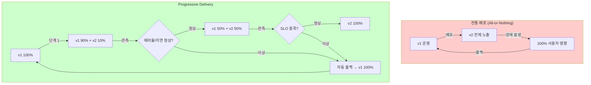
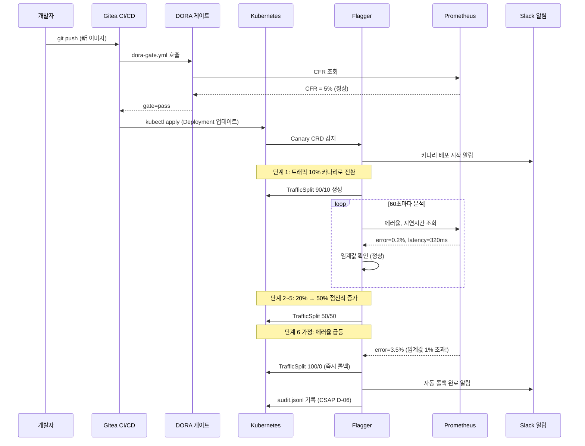
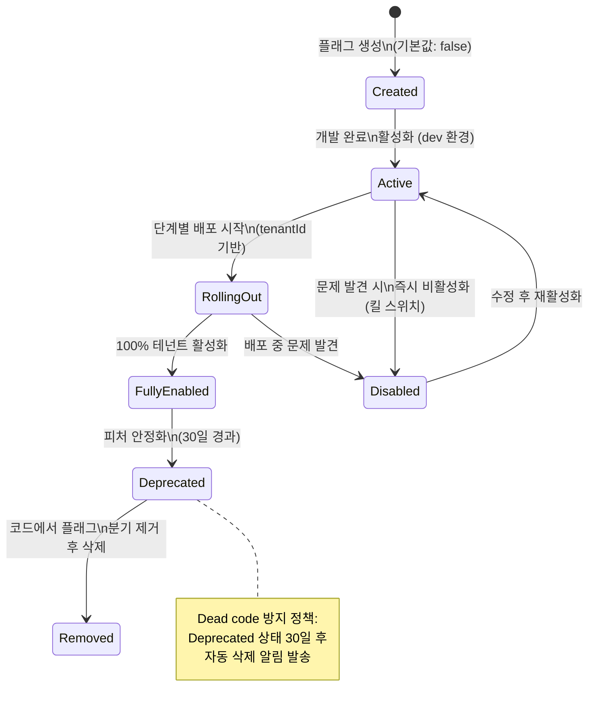
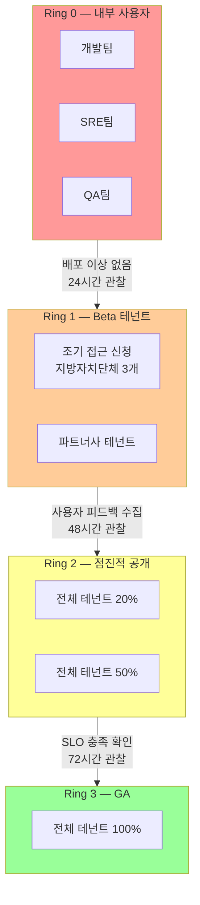

# Progressive Delivery — 카나리·A/B 테스트·피처플래그 완전 가이드

> **문서 ID**: CICD-PROG-11
> **버전**: 1.0.0 | **작성일**: 2026-04-12 | **작성자**: Implementer (Sonnet)
> **목적**: 공공기관 SaaS 플랫폼에서 Flagger 카나리, A/B 테스트, Feature Flag SDK를 활용한 안전한 점진적 배포 전략을 완전히 습득합니다.
> **선행 학습**: [10-gitops-advanced.md](10-gitops-advanced.md), [08-blue-green-deployment.md](08-blue-green-deployment.md)

---

## 목차

1. [Progressive Delivery 개요](#1-progressive-delivery-개요)
2. [Flagger 카나리 배포 심화](#2-flagger-카나리-배포-심화)
3. [A/B 테스트: 헤더 기반 라우팅](#3-ab-테스트-헤더-기반-라우팅)
4. [Feature Flag SDK 심화](#4-feature-flag-sdk-심화)
5. [Shadow 배포: Traffic Mirroring](#5-shadow-배포-traffic-mirroring)
6. [Ring-based Deployment](#6-ring-based-deployment)
7. [운영 관측 및 자동화](#7-운영-관측-및-자동화)
8. [실전 체크리스트](#8-실전-체크리스트)
9. [변경 이력](#변경-이력)

---

## 1. Progressive Delivery 개요

### 1.1 전통 배포 vs Progressive Delivery

전통적인 배포 방식은 새 버전을 한 번에 모든 사용자에게 노출합니다. 문제가 발생하면 전체 사용자가 영향을 받고, 롤백까지 시간이 걸립니다. Progressive Delivery는 이 위험을 최소화합니다.



**Progressive Delivery의 핵심 원칙:**
- **점진적 노출**: 새 버전을 소수 사용자에게 먼저 배포
- **데이터 기반 진행**: SLO 메트릭이 정상일 때만 트래픽 증가
- **자동 롤백**: 임계값 위반 시 수동 개입 없이 즉시 롤백
- **관측 가능성**: 모든 배포 단계에서 Prometheus 메트릭 수집

### 1.2 본 플랫폼의 Progressive Delivery 도구 스택

| 레이어 | 도구 | 역할 |
|-------|------|------|
| 서비스 메시 | Linkerd | 트래픽 분할, 메트릭 수집 |
| 카나리 자동화 | Flagger | Canary CRD 관리, 자동 롤백 |
| A/B 테스트 | Traefik Middleware | 헤더 기반 라우팅 |
| 피처 플래그 | Unleash + SDK | 코드 레벨 트래픽 제어 |
| CI/CD 연동 | Gitea + dora-gate | 배포 게이트, DORA 메트릭 |

### 1.3 공공기관 맥락에서의 고려 사항

공공기관 SaaS에서 Progressive Delivery를 적용할 때 추가 고려 사항:

- **감사 추적 필수**: 모든 배포 단계를 `audit.jsonl`에 기록 (CSAP D-06)
- **변경 관리 절차**: 중요 변경은 변경 승인 위원회(CAB) 심의 후 배포
- **다운타임 금지**: 행정 서비스는 업무 시간 중 무중단 배포 필수
- **테넌트 영향 최소화**: 카나리는 특정 테넌트 그룹에만 우선 적용

---

## 2. Flagger 카나리 배포 심화

### 2.1 Canary CRD 전체 필드 해설

```yaml
# k8s 매니페스트: ai-service-canary.yaml
apiVersion: flagger.app/v1beta1
kind: Canary
metadata:
  name: ai-service
  namespace: production
  # CSAP D-06: 배포 이벤트 레이블 (감사 추적)
  annotations:
    csap.gov.kr/change-id: "CHG-2026-0412"
    csap.gov.kr/approver: "sre-lead"
spec:
  # 관리 대상 Deployment
  targetRef:
    apiVersion: apps/v1
    kind: Deployment
    name: ai-service

  # Ingress 연동 (Traefik)
  ingressRef:
    apiVersion: networking.k8s.io/v1
    kind: Ingress
    name: ai-service

  # 서비스 포트
  service:
    port: 3000
    targetPort: 3000
    # Linkerd 메시 어노테이션
    annotations:
      linkerd.io/inject: enabled

  # Linkerd SMI TrafficSplit 활성화
  provider: linkerd

  # 배포 진행 설정
  analysis:
    # 분석 주기: 60초마다 메트릭 확인
    interval: 60s
    # 최대 가중치: 50%까지만 카나리로 전송 (공공기관 보수적 설정)
    maxWeight: 50
    # 한 번에 증가하는 트래픽 비율
    stepWeight: 10
    # 임계값 초과 허용 횟수 (2회 연속 실패 시 롤백)
    threshold: 2

    # ── 메트릭 기반 자동 승인/롤백 ──────────────────────────
    metrics:
      # 메트릭 1: 에러율 (5xx 응답 비율)
      - name: error-rate
        # Prometheus 쿼리
        templateRef:
          name: error-rate
          namespace: flagger-system
        # 임계값: 1% 초과 시 실패
        thresholdRange:
          max: 1
        # 판정 창: 60초
        interval: 60s

      # 메트릭 2: 요청 지연시간 (p99)
      - name: latency
        templateRef:
          name: latency
          namespace: flagger-system
        # 임계값: 2000ms 초과 시 실패
        thresholdRange:
          max: 2000
        interval: 60s

    # ── 배포 전 스모크 테스트 (Webhook) ─────────────────────
    webhooks:
      - name: smoke-test
        type: pre-rollout
        url: http://flagger-loadtester.flagger-system/
        timeout: 30s
        metadata:
          type: cmd
          cmd: >
            hey -z 10s -q 10 -c 2
            http://ai-service-canary.production/health

      # 감사 로그 웹훅 (CSAP D-06)
      - name: audit-log
        type: rollout
        url: http://compliance-service.production/api/audit/deploy
        timeout: 10s
        metadata:
          actor: flagger
          action: CANARY_ROLLOUT
          service: ai-service
```

### 2.2 Linkerd SMI TrafficSplit 메커니즘

Flagger는 Linkerd의 SMI(Service Mesh Interface) TrafficSplit을 자동으로 생성/수정하여 트래픽을 분할합니다.

```yaml
# Flagger가 자동 생성하는 TrafficSplit 예시 (단계별 변화)

# 단계 1 (10% 카나리)
apiVersion: split.smi-spec.io/v1alpha1
kind: TrafficSplit
metadata:
  name: ai-service
spec:
  service: ai-service
  backends:
    - service: ai-service-primary    # 기존 버전
      weight: 90
    - service: ai-service-canary     # 신규 버전
      weight: 10

# 단계 3 (30% 카나리 — 자동 진행)
spec:
  backends:
    - service: ai-service-primary
      weight: 70
    - service: ai-service-canary
      weight: 30

# 최종 (프로모션 완료)
spec:
  backends:
    - service: ai-service-primary    # 신규 버전이 primary가 됨
      weight: 100
```

### 2.3 자동 롤백 조건

```yaml
# Prometheus 메트릭 템플릿 (flagger-system 네임스페이스)
apiVersion: flagger.app/v1beta1
kind: MetricTemplate
metadata:
  name: error-rate
  namespace: flagger-system
spec:
  provider:
    type: prometheus
    address: http://prometheus.monitoring.svc:9090
  query: |
    100 - sum(
      rate(
        response_total{
          namespace="{{ namespace }}",
          deployment=~"{{ target }}",
          classification="success"
        }[{{ interval }}]
      )
    ) / sum(
      rate(
        response_total{
          namespace="{{ namespace }}",
          deployment=~"{{ target }}"
        }[{{ interval }}]
      )
    ) * 100

---
apiVersion: flagger.app/v1beta1
kind: MetricTemplate
metadata:
  name: latency
  namespace: flagger-system
spec:
  provider:
    type: prometheus
    address: http://prometheus.monitoring.svc:9090
  query: |
    histogram_quantile(0.99,
      sum(
        rate(
          response_latency_ms_bucket{
            namespace="{{ namespace }}",
            deployment=~"{{ target }}"
          }[{{ interval }}]
        )
      ) by (le)
    )
```

### 2.4 카나리 배포 라이프사이클



### 2.5 실제 CI/CD 파이프라인과 연동

```yaml
# Design Ref: .gitea/workflows/dora-gate.yml — 카나리 배포 게이트 연동

# .gitea/workflows/deploy.yml (기존 deploy.yml 확장)
name: 카나리 배포

on:
  push:
    branches: [main]

jobs:
  build-and-push:
    runs-on: self-hosted
    outputs:
      image-tag: ${{ steps.meta.outputs.version }}
    steps:
      - uses: actions/checkout@v4
      - name: 이미지 빌드
        id: meta
        run: |
          TAG="${{ github.sha }}"
          docker build -t registry.gov.kr/ai-service:${TAG} .
          docker push registry.gov.kr/ai-service:${TAG}
          echo "version=${TAG}" >> $GITHUB_OUTPUT

  dora-gate:
    needs: build-and-push
    uses: ./.gitea/workflows/dora-gate.yml
    with:
      namespace: production
      team: ai-platform
      commit_sha: ${{ github.sha }}

  canary-deploy:
    needs: dora-gate
    # DORA 게이트 차단 시 배포 중단
    if: needs.dora-gate.outputs.gate_result != 'block'
    runs-on: self-hosted
    steps:
      - name: 카나리 배포 시작
        run: |
          # Deployment 이미지 업데이트 → Flagger가 자동 감지
          kubectl set image deployment/ai-service \
            ai-service=registry.gov.kr/ai-service:${{ needs.build-and-push.outputs.image-tag }} \
            -n production

          # 카나리 상태 모니터링 (최대 10분)
          kubectl wait canary/ai-service \
            --for=condition=promoted \
            --timeout=600s \
            -n production

          # 감사 로그 (CSAP D-06)
          echo "{\"timestamp\":\"$(date -u +%Y-%m-%dT%H:%M:%SZ)\",\"actor\":\"cicd\",\"action\":\"CANARY_PROMOTED\",\"detail\":\"image=${{ needs.build-and-push.outputs.image-tag }}\",\"csap_ref\":\"D-12\"}" >> .claude/audit.jsonl
```

---

## 3. A/B 테스트: 헤더 기반 라우팅

### 3.1 Traefik Middleware 기반 헤더 라우팅

A/B 테스트는 특정 사용자 그룹을 다른 버전의 서비스로 라우팅합니다. 카나리(무작위 분할)와 달리 A/B는 의도적으로 특정 속성을 가진 사용자를 분리합니다.

```yaml
# Traefik Middleware: 헤더 기반 라우팅
apiVersion: traefik.containo.us/v1alpha1
kind: Middleware
metadata:
  name: ab-test-router
  namespace: production
spec:
  headers:
    customRequestHeaders:
      # X-AB-Test 헤더가 있으면 v2로 라우팅
      X-Route-Version: ""

---
# IngressRoute: 헤더 조건별 라우팅
apiVersion: traefik.containo.us/v1alpha1
kind: IngressRoute
metadata:
  name: ai-service-ab
  namespace: production
spec:
  routes:
    # 규칙 1: X-AB-Test: v2 헤더 → v2 서비스 (beta 사용자)
    - match: "Host(`api.gov.kr`) && HeadersRegexp(`X-AB-Test`, `v2`)"
      kind: Rule
      services:
        - name: ai-service-v2
          port: 3000

    # 규칙 2: 특정 테넌트 → v2 (조기 접근 테넌트)
    - match: "Host(`api.gov.kr`) && HeadersRegexp(`X-Tenant-Id`, `beta-.*`)"
      kind: Rule
      services:
        - name: ai-service-v2
          port: 3000

    # 기본: v1 서비스
    - match: "Host(`api.gov.kr`)"
      kind: Rule
      services:
        - name: ai-service-v1
          port: 3000
```

### 3.2 실험 설계 방법론

공공기관 SaaS에서 A/B 테스트는 단순한 기능 비교가 아니라 행정 효율성 개선의 근거가 됩니다.

**실험 설계 템플릿:**

```yaml
# 실험 정의 문서 (experiment-2026-Q2-rag-ui.yaml)
experiment:
  id: EXP-2026-RAG-001
  name: Advanced RAG vs 기본 RAG 응답 품질 비교
  hypothesis: |
    하이브리드 검색(BM25+시맨틱) + Reranking을 적용하면
    사용자 만족도가 기존 시맨틱 검색 대비 20% 향상될 것이다.

  metrics:
    primary:
      - name: 사용자 만족도 점수
        measurement: 5점 척도 응답 평균
        minimum_detectable_effect: 0.2  # 0.2점 이상 차이

    guardrail:
      - name: 응답 지연시간 p95
        threshold: 1500ms  # 이를 초과하면 실험 중단

  population:
    - group: control    # v1: 기본 시맨틱 검색
      percentage: 50
      filter: "X-AB-Test != v2"
    - group: treatment  # v2: Advanced RAG
      percentage: 50
      filter: "X-AB-Test == v2"

  duration:
    start: 2026-04-15
    end: 2026-04-29
    minimum_sample_size: 1000  # 통계적 유의성 확보

  statistical_settings:
    confidence_level: 0.95   # 95% 신뢰 수준
    power: 0.80              # 검정력 80%
    test_type: two_tailed
```

### 3.3 결과 분석 방법

```typescript
// scripts/ab-analysis.ts — A/B 결과 분석

interface ExperimentResult {
  control: { n: number; mean: number; std: number };
  treatment: { n: number; mean: number; std: number };
}

function calculateTTest(result: ExperimentResult): {
  zScore: number;
  pValue: number;
  significant: boolean;
} {
  const { control, treatment } = result;

  // Z-검정 (n >= 30인 경우)
  const pooledSE = Math.sqrt(
    (control.std ** 2 / control.n) + (treatment.std ** 2 / treatment.n)
  );

  const zScore = (treatment.mean - control.mean) / pooledSE;

  // p값 계산 (양측 검정)
  const pValue = 2 * (1 - normalCDF(Math.abs(zScore)));

  return {
    zScore,
    pValue,
    significant: pValue < 0.05,  // 95% 신뢰 수준
  };
}

// 실험 결론 리포트 생성
async function generateExperimentReport(experimentId: string) {
  const result = await fetchExperimentData(experimentId);
  const stats = calculateTTest(result);

  console.log(`
실험 결과 리포트: ${experimentId}
=================================
대조군 평균: ${result.control.mean.toFixed(2)} (n=${result.control.n})
실험군 평균: ${result.treatment.mean.toFixed(2)} (n=${result.treatment.n})
차이: ${(result.treatment.mean - result.control.mean).toFixed(2)}
Z-score: ${stats.zScore.toFixed(3)}
p값: ${stats.pValue.toFixed(4)}
통계적 유의성: ${stats.significant ? '있음 (p < 0.05)' : '없음'}

결론: ${stats.significant && result.treatment.mean > result.control.mean
    ? '실험군이 유의미하게 우수 → v2 전체 배포 권고'
    : '차이 없음 또는 실험군 열등 → v1 유지'}
  `);
}
```

---

## 4. Feature Flag SDK 심화

### 4.1 실제 SDK 코드 분석

실제 프로젝트의 `packages/feature-flag-sdk/src/index.ts`를 기반으로 Feature Flag SDK의 설계 원칙을 이해합니다.

**핵심 인터페이스 구조:**

```typescript
// Design Ref: packages/feature-flag-sdk/src/index.ts
// Plan SC: FR-FF.3

// 플랫폼 표준 인터페이스 (백엔드 교체 가능하도록 추상화)
export interface IFeatureFlagClient {
  initialize(): Promise<void>;
  isEnabled(flagName: string, context?: FeatureFlagContext): boolean;
  getVariant(flagName: string, context?: FeatureFlagContext): string | undefined;
  getActiveFlags(): string[];
  destroy(): void;
}

// 컨텍스트 (테넌트·사용자 기반 판정에 사용)
export interface FeatureFlagContext {
  userId?: string;
  tenantId?: string;
  environment?: string;
  properties?: Record<string, string>;
}
```

**SDK 초기화 패턴 (실제 코드):**

```typescript
// Design Ref: packages/feature-flag-sdk/src/index.ts §createFeatureFlagClient

// ✅ 환경 변수 기반 초기화 (하드코딩 금지 — CSAP D-09)
const flagClient = createFeatureFlagClient();
// UNLEASH_API_URL, UNLEASH_API_KEY, APP_NAME 환경 변수에서 자동 로드

// 또는 명시적 설정
const flagClient = createFeatureFlagClient({
  apiUrl: process.env.UNLEASH_API_URL ?? 'http://unleash-edge:3063/api',
  apiKey: process.env.UNLEASH_API_KEY ?? '',
  appName: 'ai-service',
  refreshInterval: 15000,   // 15초마다 플래그 갱신
  metricsInterval: 60000,   // 60초마다 사용 통계 전송
});

await flagClient.initialize();

// Fastify 플러그인으로 등록
app.decorate('flags', flagClient);
app.addHook('onClose', async () => {
  flagClient.destroy();
});
```

### 4.2 피처 플래그 라이프사이클



### 4.3 멀티테넌트 피처 플래그 패턴

```typescript
// Design Ref: packages/feature-flag-sdk/src/index.ts §FeatureFlagContext

// ✅ 테넌트별 점진적 롤아웃 패턴
export async function handleRagQuery(request: FastifyRequest) {
  const { tenantId } = request.body;

  const flagContext: FeatureFlagContext = {
    tenantId,
    userId: request.user?.id,
    environment: process.env.NODE_ENV,
    properties: {
      // Unleash 전략에서 사용할 추가 속성
      tenantTier: await getTenantTier(tenantId), // 'enterprise' | 'standard'
      region: 'kr',
    },
  };

  // Advanced RAG 플래그 확인 (캐시에서 < 10ms)
  const useAdvancedRag = request.server.flags.isEnabled(
    'advanced-rag-hybrid-search',
    flagContext
  );

  if (useAdvancedRag) {
    // Design Ref: platform/services/ai-service/src/lib/rag-engine.ts §runAdvancedRAG
    return runAdvancedRAG(tenantId, question, queryEmbedding, {
      searchMode: 'hybrid',
      enableReranking: true,
      bm25Weight: 0.4,
    });
  }

  return runRAG(tenantId, question, queryEmbedding);
}

// ✅ A/B 변형 테스트 패턴 (getVariant 활용)
export async function handleChatWithVariant(request: FastifyRequest) {
  const { tenantId } = request.body;

  const variant = request.server.flags.getVariant(
    'chat-ui-experiment',
    { tenantId }
  );

  // 변형별 다른 시스템 프롬프트 사용
  const systemPrompt = variant === 'concise'
    ? '간결하게 답변하세요 (3문장 이내).'
    : '상세하게 답변하세요.';

  return chatHandler(request, systemPrompt);
}
```

### 4.4 Dead code 방지 전략

Feature Flag를 무한정 방치하면 코드가 복잡해지고 Dead code가 누적됩니다. 자동 감지 전략이 필요합니다.

```typescript
// scripts/detect-stale-flags.ts
// 오래된 피처 플래그를 자동으로 탐지하여 제거를 권고합니다.

import { execSync } from 'child_process';
import { readFileSync } from 'fs';

interface FlagUsage {
  flagName: string;
  files: string[];
  createdAt: Date;
  ageInDays: number;
}

async function detectStaleFlags(): Promise<void> {
  // 1. 코드베이스에서 모든 피처 플래그 사용 위치 탐색
  const grepResult = execSync(
    "grep -r --include='*.ts' --include='*.tsx' 'isEnabled(' platform/ packages/ -l",
    { encoding: 'utf-8' }
  ).trim();

  const files = grepResult.split('\n');

  // 2. 각 파일에서 플래그 이름 추출
  const flagUsages = new Map<string, string[]>();
  for (const file of files) {
    const content = readFileSync(file, 'utf-8');
    const matches = content.match(/isEnabled\(['"]([^'"]+)['"]/g) ?? [];

    for (const match of matches) {
      const flagName = match.match(/isEnabled\(['"]([^'"]+)['"]/)?.[1];
      if (!flagName) continue;

      const existing = flagUsages.get(flagName) ?? [];
      flagUsages.set(flagName, [...existing, file]);
    }
  }

  // 3. Unleash API에서 플래그 생성일 조회
  const unleashFlags = await fetchUnleashFlags();

  // 4. 30일 이상 된 플래그 보고
  const today = new Date();
  const staleFlags: FlagUsage[] = [];

  for (const [flagName, files] of flagUsages) {
    const unleashFlag = unleashFlags.find(f => f.name === flagName);
    if (!unleashFlag) continue;

    const ageInDays = Math.floor(
      (today.getTime() - new Date(unleashFlag.createdAt).getTime()) / 86400000
    );

    if (ageInDays > 30 && unleashFlag.enabled === true) {
      // 30일 이상 활성 상태면 정리 검토 필요
      staleFlags.push({
        flagName,
        files,
        createdAt: new Date(unleashFlag.createdAt),
        ageInDays,
      });
    }
  }

  if (staleFlags.length > 0) {
    console.warn(`\n오래된 피처 플래그 감지 (${staleFlags.length}개):`);
    for (const flag of staleFlags) {
      console.warn(`  - ${flag.flagName} (${flag.ageInDays}일, 사용 위치: ${flag.files.length}개 파일)`);
    }
    console.warn('\n해결 방법: 플래그를 코드에서 제거하거나 Deprecated 상태로 변경하세요.');
  } else {
    console.log('오래된 피처 플래그 없음.');
  }
}

// 주간 자동 실행 (CI/CD 파이프라인 또는 cron)
detectStaleFlags();
```

**플래그 정리 체크리스트:**

```
피처 플래그 제거 전 확인사항:
[ ] 모든 환경에서 플래그가 100% 활성화 또는 100% 비활성화 상태
[ ] 해당 플래그를 참조하는 코드 분기 모두 식별
[ ] 비활성화된 분기 코드 삭제 계획 수립
[ ] 팀 리뷰 완료 (PR 생성)
[ ] Unleash에서 플래그 삭제
[ ] 코드에서 isEnabled('플래그명') 호출 모두 제거
[ ] 불필요한 import 정리
[ ] CHANGELOG.md 업데이트
```

---

## 5. Shadow 배포: Traffic Mirroring

### 5.1 Linkerd Mirror 서비스 설정

Shadow 배포(Traffic Mirroring)는 실제 트래픽을 새 버전으로도 복사하여 병렬 실행합니다. 사용자는 기존 버전의 응답을 받지만, 새 버전은 실제 트래픽으로 검증됩니다.

```yaml
# Linkerd Traffic Mirror 설정
# 실제 트래픽의 사본을 ai-service-shadow로 전송
apiVersion: split.smi-spec.io/v1alpha1
kind: TrafficSplit
metadata:
  name: ai-service-shadow
  namespace: production
spec:
  service: ai-service
  backends:
    # 사용자 응답: 기존 v1 서비스
    - service: ai-service-v1
      weight: 100
    # 미러: 새 v2 서비스 (응답은 버림)
    - service: ai-service-v2-shadow
      weight: 0      # 가중치 0 = 응답 무시
```

```yaml
# Shadow 서비스 Deployment
apiVersion: apps/v1
kind: Deployment
metadata:
  name: ai-service-v2-shadow
  namespace: production
  labels:
    role: shadow   # Prometheus 레이블로 구분
spec:
  replicas: 1  # Shadow는 최소 레플리카
  template:
    spec:
      containers:
        - name: ai-service
          image: registry.gov.kr/ai-service:v2-candidate
          env:
            # Shadow는 실제 DB에 쓰기 금지
            - name: SHADOW_MODE
              value: "true"
            - name: READ_ONLY_MODE
              value: "true"
```

### 5.2 Shadow 결과 비교 분석

```typescript
// platform/services/ai-service/src/lib/shadow-comparator.ts
// Shadow 응답을 Primary 응답과 비교하여 회귀 감지

interface ShadowComparison {
  requestId: string;
  primaryLatencyMs: number;
  shadowLatencyMs: number;
  primaryStatusCode: number;
  shadowStatusCode: number;
  responseMatch: boolean;
  divergenceType?: 'status' | 'body' | 'latency';
}

const shadowDivergence = new Counter({
  name: 'shadow_response_divergence_total',
  help: 'Shadow vs Primary 응답 불일치 수',
  labelNames: ['divergence_type'],
});

export async function compareShadowResponse(
  primary: Response,
  shadow: Response,
  requestId: string
): Promise<ShadowComparison> {
  const comparison: ShadowComparison = {
    requestId,
    primaryLatencyMs: 0,
    shadowLatencyMs: 0,
    primaryStatusCode: primary.status,
    shadowStatusCode: shadow.status,
    responseMatch: true,
  };

  // 상태 코드 불일치 감지
  if (primary.status !== shadow.status) {
    comparison.responseMatch = false;
    comparison.divergenceType = 'status';
    shadowDivergence.inc({ divergence_type: 'status' });
  }

  return comparison;
}
```

---

## 6. Ring-based Deployment

### 6.1 Ring 배포 모델 개요

Ring-based Deployment는 사용자를 동심원(Ring)으로 나누어 안에서 밖으로 점진적으로 새 버전을 배포합니다.



### 6.2 Ring 설정 구현

```typescript
// platform/services/tenant-service/src/lib/ring-deployment.ts

enum DeploymentRing {
  Ring0 = 0,  // 내부 사용자
  Ring1 = 1,  // Beta 테넌트
  Ring2 = 2,  // 점진적 공개
  Ring3 = 3,  // GA (전체)
}

interface TenantRingConfig {
  tenantId: string;
  ring: DeploymentRing;
  registeredAt: Date;
  notes?: string;
}

// Feature Flag와 연동하여 Ring 기반 배포 제어
export function isFeatureEnabledForRing(
  flagName: string,
  tenantId: string,
  currentDeploymentRing: DeploymentRing
): boolean {
  const flagContext: FeatureFlagContext = {
    tenantId,
    properties: {
      deploymentRing: currentDeploymentRing.toString(),
    },
  };

  return flagClient.isEnabled(flagName, flagContext);
}

// Ring별 배포 상태 조회
export async function getRingDeploymentStatus(): Promise<Record<string, string>> {
  const tenants = await prisma.tenant.findMany({
    select: {
      id: true,
      name: true,
      metadata: true,
    },
  });

  const ringStats: Record<string, number> = {
    ring0: 0, ring1: 0, ring2: 0, ring3: 0,
  };

  for (const tenant of tenants) {
    const ring = (tenant.metadata as Record<string, unknown>)?.deploymentRing ?? 3;
    ringStats[`ring${ring}`]++;
  }

  return {
    ring0: `${ringStats.ring0}개 테넌트 (내부)`,
    ring1: `${ringStats.ring1}개 테넌트 (Beta)`,
    ring2: `${ringStats.ring2}개 테넌트 (점진적 공개)`,
    ring3: `${ringStats.ring3}개 테넌트 (GA)`,
  };
}
```

### 6.3 Ring 배포 Gitea 워크플로우

```yaml
# .gitea/workflows/ring-deploy.yml
name: Ring 배포

on:
  workflow_dispatch:
    inputs:
      target_ring:
        description: '배포 대상 Ring (0~3)'
        required: true
        default: '0'
      image_tag:
        description: '배포할 이미지 태그'
        required: true

jobs:
  ring-gate:
    runs-on: self-hosted
    steps:
      - name: Ring 전제 조건 확인
        run: |
          RING="${{ inputs.target_ring }}"
          IMAGE="${{ inputs.image_tag }}"

          # Ring 0 → Ring 1 배포 전 Ring 0 안정성 확인
          if [ "$RING" -gt "0" ]; then
            PREV_RING=$((RING - 1))
            echo "Ring ${PREV_RING} 에러율 확인 중..."
            ERROR_RATE=$(curl -s "${{ vars.PROMETHEUS_URL }}/api/v1/query?query=..." \
              | jq -r '.data.result[0].value[1] // "0"')

            if (( $(echo "$ERROR_RATE > 1.0" | bc -l) )); then
              echo "::error::Ring ${PREV_RING} 에러율 ${ERROR_RATE}% — Ring ${RING} 배포 차단"
              exit 1
            fi
          fi

      - name: Ring 배포 실행
        run: |
          # Ring별 네임스페이스에 배포
          NAMESPACE="ring-${{ inputs.target_ring }}"
          kubectl set image deployment/ai-service \
            ai-service=registry.gov.kr/ai-service:${{ inputs.image_tag }} \
            -n "$NAMESPACE"

          # 감사 로그 (CSAP D-06)
          echo "{\"timestamp\":\"$(date -u +%Y-%m-%dT%H:%M:%SZ)\",\"actor\":\"cicd\",\"action\":\"RING_DEPLOY\",\"detail\":\"ring=${{ inputs.target_ring }},image=${{ inputs.image_tag }}\",\"csap_ref\":\"D-12\"}" >> .claude/audit.jsonl
```

---

## 7. 운영 관측 및 자동화

### 7.1 Prometheus Alert로 자동 롤백 트리거

```yaml
# k8s PrometheusRule — 자동 롤백 알림
apiVersion: monitoring.coreos.com/v1
kind: PrometheusRule
metadata:
  name: canary-auto-rollback
  namespace: production
spec:
  groups:
    - name: canary.rules
      rules:
        # 카나리 에러율 급등 감지
        - alert: CanaryHighErrorRate
          expr: |
            sum(rate(response_total{deployment=~".*-canary", classification="failure"}[5m]))
            /
            sum(rate(response_total{deployment=~".*-canary"}[5m]))
            > 0.05  # 5% 에러율
          for: 2m
          labels:
            severity: critical
            action: rollback
          annotations:
            summary: "카나리 에러율 5% 초과 — 자동 롤백 필요"
            description: "{{ $labels.deployment }} 에러율: {{ $value | humanizePercentage }}"

        # 카나리 지연시간 급등 감지
        - alert: CanaryHighLatency
          expr: |
            histogram_quantile(0.99,
              rate(response_latency_ms_bucket{deployment=~".*-canary"}[5m])
            ) > 3000  # p99 > 3000ms
          for: 2m
          labels:
            severity: warning
          annotations:
            summary: "카나리 p99 지연시간 3000ms 초과"
```

### 7.2 DORA 지표와의 연관

```yaml
# Design Ref: .gitea/workflows/dora-gate.yml — DORA 메트릭 연동

# Progressive Delivery가 DORA 지표에 미치는 영향:
#
# 배포 빈도 (Deployment Frequency):
#   - 카나리 배포는 소규모 점진적 배포를 가능하게 하여 빈도 증가
#   - Feature Flag는 기능 배포와 코드 배포를 분리 → 배포 빈도 극대화
#
# 변경 실패율 (Change Failure Rate = CFR):
#   - 카나리 자동 롤백으로 전체 실패 방지 → CFR 감소
#   - Ring 배포로 영향 범위 최소화
#
# 복구 시간 (MTTR):
#   - 자동 롤백으로 MTTR < 5분 달성 가능
#   - Feature Flag 킬 스위치로 즉각 기능 비활성화
#
# DORA 게이트 CFR 임계값 (dora-gate.yml 참조):
#   - CFR > 30% → 배포 차단 (DORA Low)
#   - CFR > 15% → 경고 + 수동 승인
#   - CFR <= 15% → 자동 승인

# 감사 로그 기록 예시 (dora-gate.yml §DORA 게이트 판정 참조)
# {"timestamp":"2026-04-12T10:00:00Z","actor":"dora-gate","action":"DEPLOY_APPROVED",
#  "detail":"CFR=5%,grade=1,namespace=production","csap_ref":"D-12"}
```

### 7.3 Grafana 대시보드 패널 구성

```json
{
  "dashboard": {
    "title": "Progressive Delivery 모니터링",
    "panels": [
      {
        "title": "카나리 트래픽 분할",
        "type": "gauge",
        "targets": [{
          "expr": "sum(rate(response_total{deployment=~'.*-canary'}[5m])) / sum(rate(response_total[5m])) * 100"
        }],
        "options": { "unit": "percent" }
      },
      {
        "title": "카나리 vs Primary 에러율 비교",
        "type": "timeseries",
        "targets": [
          {
            "expr": "sum(rate(response_total{deployment=~'.*-canary',classification='failure'}[5m]))/sum(rate(response_total{deployment=~'.*-canary'}[5m]))*100",
            "legendFormat": "카나리 에러율"
          },
          {
            "expr": "sum(rate(response_total{deployment=~'.*-primary',classification='failure'}[5m]))/sum(rate(response_total{deployment=~'.*-primary'}[5m]))*100",
            "legendFormat": "Primary 에러율"
          }
        ]
      },
      {
        "title": "Feature Flag 활성화 비율",
        "type": "table",
        "description": "테넌트별 피처 플래그 활성화 현황"
      }
    ]
  }
}
```

---

## 8. 실전 체크리스트

### 8.1 배포 전 체크리스트

```
Progressive Delivery 배포 전 확인사항:

기술 준비
[ ] Canary CRD 매니페스트 검토 완료 (maxWeight, stepWeight, threshold 설정)
[ ] Prometheus 메트릭 템플릿 동작 확인 (error-rate, latency 쿼리)
[ ] 스모크 테스트 스크립트 준비 및 검증
[ ] Feature Flag 생성 완료 (기본값 false 확인)
[ ] DORA 게이트 통과 가능한 현재 CFR 확인

보안 및 감사
[ ] 변경 관리 티켓 생성 (CHG-번호 확보)
[ ] 감사 로그 웹훅 URL 설정 확인 (CSAP D-06)
[ ] 롤백 절차 문서 검토 완료
[ ] 비상 연락처 확인 (on-call 담당자)

모니터링
[ ] Grafana 대시보드 열기 (카나리 트래픽 분할 패널)
[ ] Slack 알림 채널 대기 (Flagger 알림 수신 확인)
[ ] Prometheus Alert 임계값 재확인
```

### 8.2 배포 중 체크리스트

```
배포 진행 중 모니터링 포인트:

단계별 확인 (10% 증가마다)
[ ] 에러율 < 1% 유지 확인
[ ] p99 지연시간 < SLO 임계값 확인
[ ] 카나리 Pod 상태 정상 (kubectl get pods)
[ ] Flagger 이벤트 로그 확인

이상 징후 감지 시
[ ] 즉시 수동 롤백 명령 준비:
    kubectl annotate canary/ai-service flagger.app/action=rollback -n production
[ ] 에러 내용 캡처 (kubectl logs)
[ ] 인시던트 채널 개설
```

### 8.3 배포 후 체크리스트

```
배포 완료 후 확인사항:

기술 검증 (24시간)
[ ] SLO 대시보드 정상 (에러율, 지연시간)
[ ] DORA 메트릭 변화 없음 (CFR 증가 없음)
[ ] 로그 에러 급증 없음
[ ] 알림 발생 없음

감사 및 문서
[ ] audit.jsonl에 배포 기록 확인
[ ] CHANGELOG.md 업데이트
[ ] Feature Flag 상태 문서 업데이트
[ ] 배포 후기 작성 (Ring 1 이상인 경우)

정리
[ ] Shadow 서비스 삭제 (Shadow 배포 사용 시)
[ ] 임시 A/B 테스트 Middleware 정리
[ ] 오래된 Feature Flag 정리 스크립트 실행
```

---

## 부록 A: Unleash 피처 플래그 서버 운영

### A.1 Unleash Edge 설정

Unleash Edge는 Unleash 서버와 서비스 사이에 위치하는 고성능 프록시입니다. SDK가 직접 Unleash 서버에 접속하지 않고 Edge를 통해 접속하면 지연시간이 < 5ms로 감소합니다.

```yaml
# k8s Deployment — Unleash Edge
apiVersion: apps/v1
kind: Deployment
metadata:
  name: unleash-edge
  namespace: platform
spec:
  replicas: 2
  selector:
    matchLabels:
      app: unleash-edge
  template:
    metadata:
      labels:
        app: unleash-edge
    spec:
      containers:
        - name: unleash-edge
          image: unleashorg/unleash-edge:latest
          ports:
            - containerPort: 3063
          env:
            # Unleash 서버 URL (내부 서비스)
            - name: UPSTREAM_URL
              value: "http://unleash-server.platform.svc:4242"
            # Edge API 키 (CSAP D-09 — 환경변수 주입)
            - name: EDGE_API_TOKEN
              valueFrom:
                secretKeyRef:
                  name: unleash-secrets
                  key: edge-api-token
          resources:
            requests:
              memory: "64Mi"
              cpu: "50m"
            limits:
              memory: "128Mi"
              cpu: "100m"
          # 헬스체크
          livenessProbe:
            httpGet:
              path: /internal-backstage/prometheus
              port: 3063
            initialDelaySeconds: 10
            periodSeconds: 30
```

### A.2 피처 플래그 전략 유형

Unleash는 다양한 활성화 전략을 지원합니다. 공공기관 SaaS에서 자주 사용하는 전략:

| 전략 | 사용 사례 | 설정 예시 |
|-----|---------|---------|
| `default` | 전체 활성화/비활성화 | 긴급 킬 스위치 |
| `userWithId` | 특정 사용자에게만 | 개발자, QA 우선 활성화 |
| `gradualRollout` | 점진적 롤아웃 | 10% → 50% → 100% |
| `remoteAddress` | IP 기반 | 내부 IP에만 활성화 |
| `applicationHostname` | 호스트 기반 | 특정 서버에만 |

```typescript
// 전략별 Context 설정 예시
// Design Ref: packages/feature-flag-sdk/src/index.ts §FeatureFlagContext

// userWithId 전략: 특정 사용자에게만 활성화
const isEnabledForAdmin = flagClient.isEnabled('new-admin-ui', {
  userId: 'admin-user-001',
});

// gradualRollout 전략: tenantId 해시 기반 점진적 롤아웃
const isEnabledForTenant = flagClient.isEnabled('advanced-rag', {
  tenantId: 'tenant-uuid-here',
  // Unleash가 tenantId를 해시하여 0~100 중 설정된 %만 활성화
});
```

### A.3 피처 플래그 감사 추적 (CSAP D-06)

```typescript
// 피처 플래그 변경 이벤트 감사 로그
// Design Ref: packages/feature-flag-sdk/src/index.ts §FlagChangeEvent

export interface FlagChangeEvent {
  flagName: string;
  action: 'created' | 'updated' | 'deleted' | 'toggled';
  newState: boolean;
  actor: string;
  timestamp: string;
}

// Unleash Webhook으로 플래그 변경 시 감사 로그 기록
async function handleFlagChangeWebhook(event: FlagChangeEvent): Promise<void> {
  // CSAP D-06: 민감 작업 감사 로그
  const auditEntry = {
    timestamp: new Date().toISOString(),
    actor: event.actor,
    action: `FLAG_${event.action.toUpperCase()}`,
    target: event.flagName,
    detail: `새 상태: ${event.newState}`,
    csap_ref: 'D-06',
  };

  // audit.jsonl에 append (append-only 구조)
  await appendToAuditLog(auditEntry);
}
```

---

## 부록 B: 트러블슈팅 가이드

### B.1 카나리 배포가 진행되지 않을 때

**증상:** `kubectl get canary -n production` 에서 Progressing 상태가 멈춤

```bash
# Flagger 컨트롤러 로그 확인
kubectl logs -n flagger-system deployment/flagger --tail=50 | grep -E "ERROR|WARN|canary"

# Prometheus 쿼리 직접 테스트
# (Flagger가 사용하는 메트릭 쿼리를 직접 실행하여 값 확인)
curl -s "http://prometheus.monitoring.svc:9090/api/v1/query" \
  --data-urlencode 'query=sum(rate(response_total{namespace="production"}[60s]))' \
  | jq '.data.result'

# 일반적인 원인:
# 1. Prometheus 메트릭 없음 → Linkerd inject 확인
# 2. 메트릭 쿼리 오류 → MetricTemplate 문법 확인
# 3. Canary 서비스 헬스체크 실패 → Pod 로그 확인
```

### B.2 Feature Flag SDK 초기화 실패

**증상:** `Error: UNLEASH_API_KEY 환경 변수가 설정되지 않았습니다`

```bash
# k8s Secret 존재 확인
kubectl get secret unleash-secrets -n production

# Secret 값 확인 (base64 디코딩)
kubectl get secret unleash-secrets -n production \
  -o jsonpath='{.data.api-key}' | base64 -d

# Deployment에 환경변수가 올바르게 주입되는지 확인
kubectl describe deployment ai-service -n production | grep -A5 UNLEASH
```

### B.3 카나리 자동 롤백 이유 분석

```bash
# 롤백 이유 상세 확인
kubectl describe canary ai-service -n production | grep -A20 "Events:"

# 예시 출력:
# Events:
#   Type     Reason  Age    From     Message
#   Warning  Synced  2m30s  flagger  Rolling back ai-service failed checks threshold reached
#   Warning  Synced  3m00s  flagger  Halt ai-service advancement error rate 3.45% > 1%

# Prometheus에서 해당 시간대 에러율 확인
# (롤백 직전 1분 데이터)
curl -s "http://prometheus.monitoring.svc:9090/api/v1/query_range" \
  --data-urlencode 'query=100 - sum(rate(response_total{classification="success"}[1m]))/sum(rate(response_total[1m]))*100' \
  --data-urlencode 'start=2026-04-12T10:00:00Z' \
  --data-urlencode 'end=2026-04-12T10:10:00Z' \
  --data-urlencode 'step=15s' \
  | jq '.data.result[0].values'
```

---

## 부록 C: Progressive Delivery 성숙도 모델

조직의 Progressive Delivery 성숙도를 다음 5단계로 평가합니다:

| 단계 | 수준 | 특징 | 본 플랫폼 현재 위치 |
|-----|------|------|-----------------|
| 1 | 초기 | 수동 배포, 롤백 없음 | — |
| 2 | 관리 | Blue/Green 배포 | 완료 (08-blue-green-deployment.md) |
| 3 | 정의 | 카나리 + 자동 롤백 | 완료 (본 문서 §2) |
| 4 | 정량화 | A/B + Feature Flag + DORA 측정 | 완료 (본 문서 §3, §4) |
| 5 | 최적화 | Shadow + Ring + 완전 자동화 | 진행 중 (본 문서 §5, §6) |

**DORA 지표와 성숙도 상관관계:**

```
성숙도 3 달성 시:
  배포 빈도: 주 1~3회 (Medium)
  변경 실패율: 15% 이하 (Medium)

성숙도 4 달성 시:
  배포 빈도: 일 1회 이상 (High)
  변경 실패율: 5% 이하 (High)
  DORA 게이트 자동 통과율: 95%+

성숙도 5 달성 시:
  배포 빈도: 요청 시 즉시 (Elite)
  변경 실패율: 1% 이하 (Elite)
  MTTR: 1시간 이하 (Elite)
```


---

## 변경 이력

| 버전 | 일자 | 내용 | 작성자 |
|-----|------|------|-------|
| 1.0.0 | 2026-04-12 | 최초 작성 — Flagger 카나리, A/B 테스트, Feature Flag SDK 완전 가이드 | Implementer (Sonnet) |
