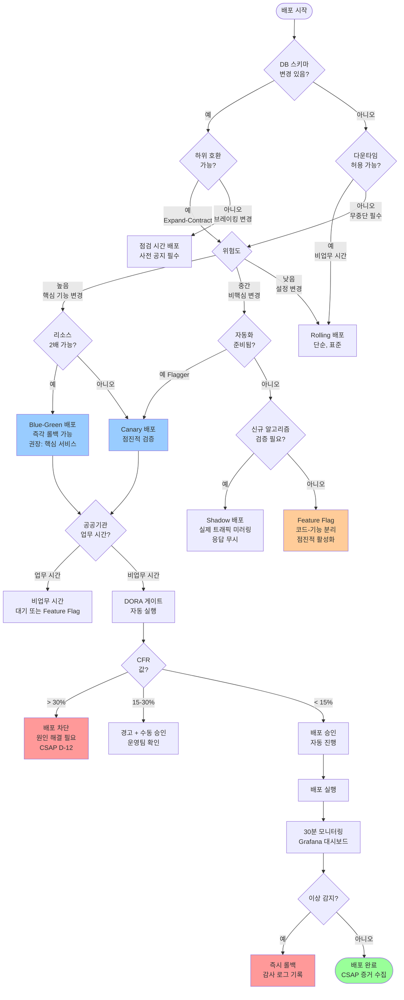
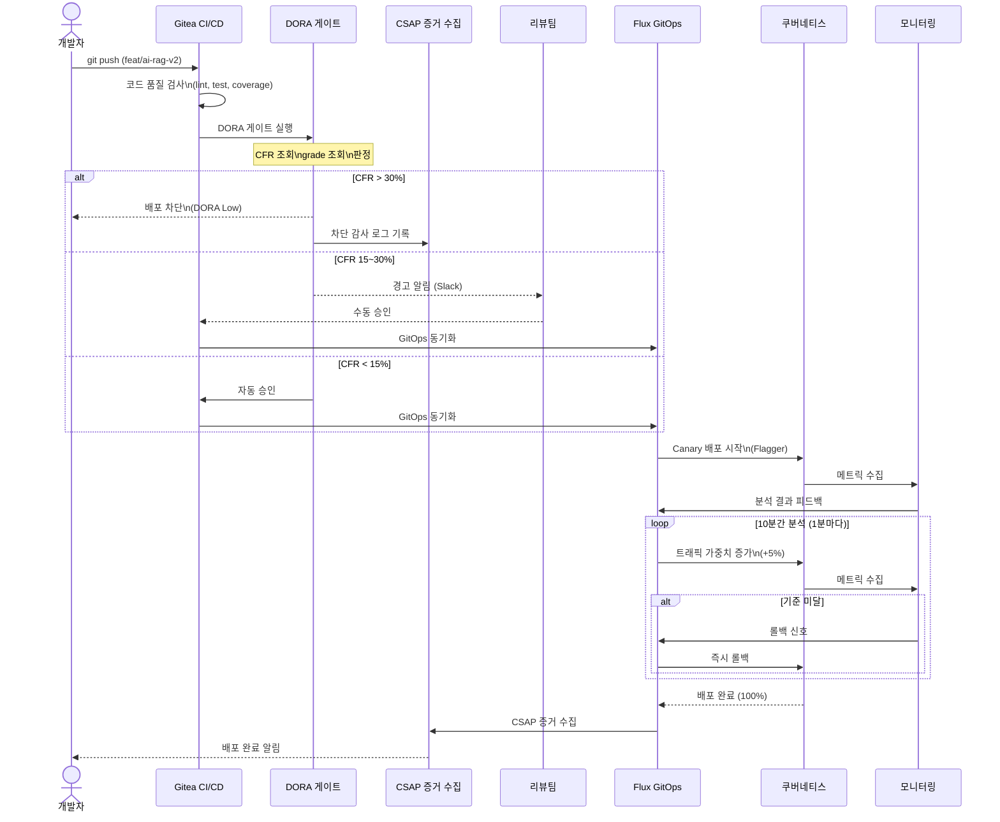

# 배포 전략 고급 — Blue-Green, Canary, Rolling, Feature Flag 완전 비교

> **대상 독자**: 공공기관 SaaS 프레임워크 DevOps 엔지니어 (CI/CD 경험 6개월 이상)
> **작성일**: 2026-04-13
> **관련 CSAP 통제항목**: D-12(시스템 개발 보안 — 배포 품질 게이트)
> **관련 Plan**: MTU-N251(DORA Four Keys), MTU-N248(GitOps 고도화)
> **관련 워크플로우**: `.gitea/workflows/dora-gate.yml`, `.gitea/workflows/csap-evidence.yml`

---

## 목차

1. [배포 전략이란?](#1-배포-전략이란)
2. [Rolling 배포](#2-rolling-배포)
3. [Blue-Green 배포](#3-blue-green-배포-심화)
4. [Canary 배포](#4-canary-배포-심화)
5. [Feature Flag 기반 배포](#5-feature-flag-기반-배포)
6. [Shadow 배포 (트래픽 미러링)](#6-shadow-배포-트래픽-미러링)
7. [Ring 배포](#7-ring-배포-내부베타전체)
8. [전략 선택 결정 트리](#8-전략-선택-결정-트리)
9. [공공기관 SaaS 배포 승인 프로세스](#9-공공기관-saas-배포-승인-프로세스-csap)
10. [실습: Flagger 카나리 배포 설정](#10-실습-flagger-카나리-배포-설정)

---

## 1. 배포 전략이란?

### 1.1 초급자를 위한 직관적 설명

배포(Deployment)는 새로운 버전의 소프트웨어를 프로덕션 환경에서 실행하는 과정입니다. 단순히 파일을 복사하는 것이 아니라, 사용자가 서비스를 이용하는 도중에 새 버전으로 교체해야 하기 때문에 다양한 전략이 필요합니다.

자동차 엔진을 교체하는 상황을 생각해 보십시오.

- **단순 교체 (Big Bang)**: 차를 정지시키고 엔진 전체를 교체합니다. 교체 중에는 운전할 수 없습니다. 소프트웨어의 다운타임 배포와 같습니다.
- **Rolling**: 8기통 엔진 중 1기통씩 순차적으로 교체합니다. 나머지 7기통으로 계속 달리면서 교체합니다.
- **Blue-Green**: 동일한 엔진을 두 개 준비하고, 새 엔진이 준비되면 즉시 전환합니다. 이전 엔진은 문제 시 빠른 롤백용으로 대기합니다.
- **Canary**: 8기통 중 1기통만 새 엔진으로 교체해서 테스트하고, 이상이 없으면 나머지도 교체합니다.

### 1.2 왜 다양한 전략이 필요한가

단일 배포 전략으로는 모든 상황에 대응할 수 없습니다. 배포 전략 선택에 영향을 주는 요소는 다음과 같습니다.

| 고려 요소 | 영향 |
|-----------|------|
| 서비스 중단 허용 여부 | 공공기관은 업무 시간 중 중단 불가 |
| 배포 복잡도 | 팀 역량에 맞는 전략 선택 |
| 롤백 속도 | P1 장애 시 30초 내 롤백 목표 |
| 데이터베이스 마이그레이션 | 스키마 변경 동반 여부 |
| 트래픽 패턴 | 최대 트래픽 시간대 배포 회피 |
| 규제 요건 | CSAP 변경 관리 승인 필요 |

### 1.3 공공기관 SaaS 배포 제약사항

공공기관 SaaS는 일반 B2C 서비스와 달리 다음 제약이 있습니다.

**시간 제약**
- 업무 시간(09:00~18:00)에는 핵심 서비스 배포 금지
- 변경 동결 기간: 공공기관 예산 결산 기간(12~1월), 국가 행사 전후 1주일
- 긴급 배포(P1 장애 수정)는 CSAP 변경 관리 프로세스 예외 인정 (사후 보고 필수)

**품질 게이트**
- DORA 변경 실패율(CFR) > 30%이면 배포 자동 차단 (`.gitea/workflows/dora-gate.yml`)
- CSAP 증거 수집 워크플로우 연동 (`.gitea/workflows/csap-evidence.yml`)
- 배포 전 자동화 테스트 커버리지 80% 이상 필수

**승인 프로세스**
- 소규모 변경: 2인 코드 리뷰 + 자동화 게이트 통과
- 중규모 변경: 추가로 보안 담당자 승인
- 대규모 변경/인프라: 변경관리위원회(CAB) 승인 필수

### 1.4 DORA 배포 게이트 — 실제 워크플로우 분석

실제 프로젝트에서는 `.gitea/workflows/dora-gate.yml`이 모든 배포 전에 자동 실행됩니다.

```yaml
# .gitea/workflows/dora-gate.yml (실제 파일)
# DORA 배포 게이트 판정 로직:
# - CFR > 30% → 배포 차단 (DORA Low)
# - CFR > 15% → 경고 + 수동 승인
# - CFR ≤ 15% → 배포 허용
```

이 게이트는 배포 전략에 관계없이 항상 실행됩니다. DORA 메트릭이 낮으면 아무리 좋은 배포 전략을 사용해도 배포가 차단됩니다.

---

## 2. Rolling 배포

### 2.1 Rolling 배포란?

Rolling 배포는 현재 실행 중인 인스턴스를 하나씩(또는 소수씩) 새 버전으로 교체하는 방식입니다. 쿠버네티스의 기본 배포 전략입니다.

**동작 방식**:
1. Pod 1개를 종료
2. 새 버전 Pod 1개 시작
3. 새 Pod가 Ready 상태가 되면 다음 Pod 교체
4. 전체 교체 완료까지 반복

### 2.2 MaxUnavailable, MaxSurge 설정

```yaml
# platform/services/ai-service/helm/templates/deployment.yaml

apiVersion: apps/v1
kind: Deployment
metadata:
  name: ai-service
  namespace: platform
spec:
  replicas: 4                # 총 4개 Pod 실행
  strategy:
    type: RollingUpdate
    rollingUpdate:
      # maxUnavailable: 교체 중 허용되는 다운 Pod 수
      # 0으로 설정하면 무중단 배포 (항상 4개 가용)
      # 높게 설정하면 배포 빠름, 낮게 설정하면 안정적
      maxUnavailable: 0

      # maxSurge: 교체 중 추가로 생성 허용되는 Pod 수
      # 1이면 교체 중 최대 5개 Pod 실행 (4+1)
      maxSurge: 1

  selector:
    matchLabels:
      app: ai-service
  template:
    metadata:
      labels:
        app: ai-service
        version: "2.1.0"
    spec:
      # 종료 유예 시간 (GracefulShutdown.timeout과 일치)
      # Design Ref: SVC-MESH-R13 — GracefulShutdown 30초
      terminationGracePeriodSeconds: 35    # shutdown 30초 + 버퍼 5초

      containers:
        - name: ai-service
          image: registry.saas.go.kr/platform/ai-service:2.1.0

          # Readiness Probe: 새 Pod가 준비된 후에만 트래픽 전달
          # Rolling Update에서 핵심 — 준비되지 않은 Pod로 트래픽 안 감
          readinessProbe:
            httpGet:
              path: /health/ready
              port: 3000
            initialDelaySeconds: 5     # 시작 후 5초 후 첫 체크
            periodSeconds: 5           # 5초마다 체크
            failureThreshold: 3        # 3번 실패 시 Not Ready
            successThreshold: 1        # 1번 성공 시 Ready

          # Liveness Probe: 데드락 상태 감지 및 재시작
          livenessProbe:
            httpGet:
              path: /health/live
              port: 3000
            initialDelaySeconds: 30    # 서버 시작 시간 여유
            periodSeconds: 10
            failureThreshold: 3

          # Startup Probe: 느린 시작 서비스 보호 (초기 1분간)
          startupProbe:
            httpGet:
              path: /health/live
              port: 3000
            failureThreshold: 12       # 12 * 5초 = 60초 대기
            periodSeconds: 5

          # PodDisruptionBudget과 연계 (아래 참조)
```

```yaml
# PodDisruptionBudget: 유지보수 시 최소 가용 Pod 보장
apiVersion: policy/v1
kind: PodDisruptionBudget
metadata:
  name: ai-service-pdb
  namespace: platform
spec:
  # 항상 최소 3개 Pod 유지 (4개 중 1개만 동시 다운 허용)
  minAvailable: 3
  selector:
    matchLabels:
      app: ai-service
```

### 2.3 롤백 절차

```bash
# Rolling 배포 롤백 방법

# 방법 1: kubectl rollout undo (즉시 이전 버전으로)
kubectl rollout undo deployment/ai-service -n platform

# 방법 2: 특정 버전으로 롤백
kubectl rollout history deployment/ai-service -n platform
# REVISION  CHANGE-CAUSE
# 1         v2.0.0 배포
# 2         v2.1.0 배포 (현재)

kubectl rollout undo deployment/ai-service -n platform --to-revision=1

# 롤백 상태 확인
kubectl rollout status deployment/ai-service -n platform

# 롤백 완료 확인
kubectl get pods -n platform -l app=ai-service
```

---

## 3. Blue-Green 배포 (심화)

### 3.1 Blue-Green 배포란?

Blue-Green 배포는 동일한 프로덕션 환경을 두 개(Blue, Green) 유지하고, 한 번에 하나만 실제 트래픽을 받도록 하는 전략입니다.

- **Blue 환경**: 현재 운영 중인 버전
- **Green 환경**: 새 버전이 배포된 대기 환경

배포 과정:
1. Green 환경에 새 버전 배포 및 테스트
2. 테스트 완료 후 트래픽을 Blue → Green으로 즉시 전환
3. Green이 안정적이면 Blue를 다음 배포용으로 재활용
4. 문제 발생 시 즉시 Green → Blue로 트래픽 전환 (빠른 롤백)

**장점**: 다운타임 없음, 즉각적 롤백 가능, 새 버전 사전 검증 가능
**단점**: 리소스 2배 필요, 스테이트풀 서비스(DB) 처리 복잡

### 3.2 Linkerd TrafficSplit 실제 구성

공공기관 SaaS는 Linkerd 서비스 메시를 사용합니다. Linkerd의 `TrafficSplit` CRD로 Blue-Green 트래픽 전환을 구현합니다.

```yaml
# Blue 환경 Deployment
apiVersion: apps/v1
kind: Deployment
metadata:
  name: ai-service-blue
  namespace: platform
  labels:
    app: ai-service
    slot: blue
    version: "2.0.0"
spec:
  replicas: 4
  selector:
    matchLabels:
      app: ai-service
      slot: blue
  template:
    metadata:
      labels:
        app: ai-service
        slot: blue
    spec:
      containers:
        - name: ai-service
          image: registry.saas.go.kr/platform/ai-service:2.0.0
---
# Green 환경 Deployment (새 버전)
apiVersion: apps/v1
kind: Deployment
metadata:
  name: ai-service-green
  namespace: platform
  labels:
    app: ai-service
    slot: green
    version: "2.1.0"
spec:
  replicas: 4
  selector:
    matchLabels:
      app: ai-service
      slot: green
  template:
    metadata:
      labels:
        app: ai-service
        slot: green
    spec:
      containers:
        - name: ai-service
          image: registry.saas.go.kr/platform/ai-service:2.1.0
---
# Blue Service (Blue 환경 전용)
apiVersion: v1
kind: Service
metadata:
  name: ai-service-blue
  namespace: platform
spec:
  selector:
    app: ai-service
    slot: blue
  ports:
    - port: 3000
---
# Green Service (Green 환경 전용)
apiVersion: v1
kind: Service
metadata:
  name: ai-service-green
  namespace: platform
spec:
  selector:
    app: ai-service
    slot: green
  ports:
    - port: 3000
---
# TrafficSplit: 트래픽 배분 제어
# 처음에는 Blue 100%, 검증 후 Green 100%로 전환
apiVersion: split.smi-spec.io/v1alpha1
kind: TrafficSplit
metadata:
  name: ai-service-split
  namespace: platform
spec:
  # 클라이언트가 접근하는 서비스 이름
  service: ai-service
  backends:
    # Blue 100%, Green 0% (초기 상태)
    - service: ai-service-blue
      weight: 100
    - service: ai-service-green
      weight: 0
```

**트래픽 전환 스크립트**:

```bash
#!/bin/bash
# scripts/blue-green-switch.sh
# Blue → Green 전환 (0%에서 100%로 즉시 전환)
# Design Ref: MTU-N248 §3.4

set -euo pipefail

NAMESPACE="platform"
TRAFFIC_SPLIT="ai-service-split"

switch_to_green() {
  echo "=== Blue → Green 트래픽 전환 시작 ==="

  # Green 환경 헬스체크
  GREEN_POD=$(kubectl get pod -n ${NAMESPACE} -l "app=ai-service,slot=green" \
    -o jsonpath='{.items[0].metadata.name}' 2>/dev/null)

  if [[ -z "${GREEN_POD}" ]]; then
    echo "오류: Green Pod를 찾을 수 없습니다."
    exit 1
  fi

  echo "Green Pod 헬스체크: ${GREEN_POD}"
  kubectl exec -n ${NAMESPACE} "${GREEN_POD}" -- \
    curl -sf http://localhost:3000/health/ready || {
    echo "오류: Green 환경이 준비되지 않았습니다."
    exit 1
  }

  # TrafficSplit 패치: Blue 0%, Green 100%
  kubectl patch trafficsplit ${TRAFFIC_SPLIT} -n ${NAMESPACE} \
    --type='json' \
    -p='[
      {"op": "replace", "path": "/spec/backends/0/weight", "value": 0},
      {"op": "replace", "path": "/spec/backends/1/weight", "value": 100}
    ]'

  echo "=== 전환 완료: Green 100% 트래픽 수신 ==="
  echo "롤백이 필요하면: ./scripts/blue-green-rollback.sh"

  # 감사 로그 기록 (CSAP D-06)
  echo "{\"timestamp\":\"$(date -u +%Y-%m-%dT%H:%M:%SZ)\",\"actor\":\"${USER}\",\"action\":\"BLUE_GREEN_SWITCH\",\"detail\":\"to_green\",\"csap_ref\":\"D-12\"}" \
    >> .claude/audit.jsonl
}

rollback_to_blue() {
  echo "=== 긴급 롤백: Green → Blue ==="

  kubectl patch trafficsplit ${TRAFFIC_SPLIT} -n ${NAMESPACE} \
    --type='json' \
    -p='[
      {"op": "replace", "path": "/spec/backends/0/weight", "value": 100},
      {"op": "replace", "path": "/spec/backends/1/weight", "value": 0}
    ]'

  echo "=== 롤백 완료: Blue 100% 트래픽 수신 ==="

  echo "{\"timestamp\":\"$(date -u +%Y-%m-%dT%H:%M:%SZ)\",\"actor\":\"${USER}\",\"action\":\"BLUE_GREEN_ROLLBACK\",\"detail\":\"to_blue\",\"csap_ref\":\"D-12\"}" \
    >> .claude/audit.jsonl
}

case "${1:-switch}" in
  switch) switch_to_green ;;
  rollback) rollback_to_blue ;;
  *) echo "사용법: $0 [switch|rollback]" ;;
esac
```

### 3.3 데이터베이스 마이그레이션 처리

Blue-Green 배포에서 가장 어려운 문제는 DB 스키마 변경입니다. 잘못 처리하면 롤백 시 데이터가 손상됩니다.

**안전한 DB 마이그레이션 3단계 패턴 (Expand-Contract)**:

```
단계 1 — Expand (확장): 새 컬럼 추가, 기존 컬럼 유지
  - Blue 코드: 기존 컬럼 사용
  - Green 코드: 기존 컬럼 + 새 컬럼 모두 쓰기
  - DB 상태: 기존 + 새 컬럼 모두 존재

단계 2 — 검증: Green 환경이 안정적으로 운영됨을 확인
  - 1~2주 운영 후 문제 없으면 다음 단계

단계 3 — Contract (수축): 기존 컬럼 제거
  - Green 코드: 새 컬럼만 사용
  - 기존 컬럼 DROP (더 이상 불필요)
```

```typescript
// Prisma 마이그레이션 안전 패턴
// Design Ref: MTU-N248 §3.5 — Zero-downtime DB 마이그레이션

// 1단계: 새 컬럼 추가 (nullable로 추가, 기존 코드와 호환)
// prisma/migrations/001_add_tenant_tier.sql
// ALTER TABLE tenants ADD COLUMN tier VARCHAR(20) NULL;

// 2단계: 애플리케이션 코드에서 새 컬럼 쓰기 시작
// platform/services/compliance-service/src/lib/tenant.ts

interface Tenant {
  id: string;
  name: string;
  // 기존 필드
  planCode: string;
  // 새 필드 (단계 1에서 추가됨, 아직 nullable)
  tier?: 'standard' | 'premium' | 'enterprise';
}

async function updateTenant(tenantId: string, data: Partial<Tenant>): Promise<void> {
  // 기존 필드 + 새 필드 모두 업데이트 (하위 호환)
  await prisma.tenant.update({
    where: { id: tenantId },
    data: {
      ...data,
      // 새 필드: planCode에서 자동 변환
      tier: data.planCode ? mapPlanToTier(data.planCode) : undefined,
    },
  });
}

function mapPlanToTier(planCode: string): 'standard' | 'premium' | 'enterprise' {
  if (planCode.startsWith('ENT')) return 'enterprise';
  if (planCode.startsWith('PRE')) return 'premium';
  return 'standard';
}

// 3단계 (2주 후): tier 컬럼 NOT NULL로 변경 후 planCode 컬럼 제거
// ALTER TABLE tenants ALTER COLUMN tier SET NOT NULL;
// ALTER TABLE tenants DROP COLUMN plan_code;
```

---

## 4. Canary 배포 (심화)

### 4.1 Canary 배포란?

Canary 배포는 새 버전을 전체가 아닌 일부 사용자에게만 먼저 배포하고, 문제가 없으면 단계적으로 확대하는 전략입니다. 이름의 유래는 광산에서 유독 가스 탐지용으로 사용한 카나리아 새에서 왔습니다.

**트래픽 단계**:
```
1% → 5% → 10% → 25% → 50% → 100%
```

각 단계에서 메트릭(오류율, 응답 시간)이 기준을 충족하면 다음 단계로 승급합니다. 기준을 초과하면 자동으로 롤백합니다.

### 4.2 Flagger 자동화 설정

Flagger는 Canary 배포를 자동화하는 쿠버네티스 컨트롤러입니다. Prometheus 메트릭을 기반으로 승급/롤백을 자동 결정합니다.

```yaml
# platform/services/ai-service/helm/templates/canary.yaml
# Design Ref: MTU-N248 §3.6 — Flagger 카나리 배포
# Plan SC: FR-N248.5
# CSAP: D-12 배포 품질 게이트

apiVersion: flagger.app/v1beta1
kind: Canary
metadata:
  name: ai-service
  namespace: platform
spec:
  # 대상 Deployment
  targetRef:
    apiVersion: apps/v1
    kind: Deployment
    name: ai-service

  # 배포 완료 후 관련 리소스 초기화
  revertOnDeletion: true

  # 서비스 설정
  service:
    port: 3000
    portDiscovery: true
    # Linkerd 서비스 메시 연동
    trafficPolicy:
      connectionPool:
        http:
          http2MaxRequests: 1000
          http1MaxPendingRequests: 100

  # 카나리 분석 설정 (핵심)
  analysis:
    # 분석 주기: 1분마다 메트릭 체크
    interval: 1m
    # 최대 반복 횟수: 10번 (총 10분간 분석)
    iterations: 10
    # 실패 임계값: 연속 3번 기준 미달 시 롤백
    threshold: 3
    # 최대 가중치: 카나리 트래픽 최대 50%
    maxWeight: 50
    # 가중치 증가 단위: 매 단계 5% 증가
    stepWeight: 5

    # 성공 메트릭 기준
    metrics:
      # 1) 요청 성공률 (99% 이상)
      - name: request-success-rate
        thresholdRange:
          min: 99
        interval: 1m

      # 2) 응답 시간 p99 (500ms 이하)
      - name: request-duration
        thresholdRange:
          max: 500
        interval: 1m

      # 3) 커스텀 메트릭: AI 응답 품질 점수 (0.8 이상)
      - name: ai-response-quality
        templateRef:
          name: ai-quality-metric
          namespace: flagger-system
        thresholdRange:
          min: 0.8
        interval: 2m

    # 카나리 웜업 시간 (처음 몇 초는 무시)
    # 새 Pod가 캐시를 채우는 시간 허용
    stepWeightPromotion: 1

    # 알림 설정
    webhooks:
      # 각 단계 시작 시 Slack 알림
      - name: notify-step
        type: event
        url: "${SLACK_WEBHOOK_URL}"
        metadata:
          type: slack
          channel: "#deployments"

      # 수동 승인 게이트 (50% 이상 시 운영팀 승인 필요)
      - name: manual-approval-gate
        type: confirm-promotion
        url: http://flagger-approval.monitoring.svc/approval
        timeout: 30m    # 30분 내 승인 없으면 롤백
```

```yaml
# 커스텀 메트릭 템플릿: AI 응답 품질 점수
# platform/services/ai-service/helm/templates/metric-template.yaml

apiVersion: flagger.app/v1beta1
kind: MetricTemplate
metadata:
  name: ai-quality-metric
  namespace: flagger-system
spec:
  provider:
    type: prometheus
    address: http://prometheus-operated.monitoring.svc:9090
  query: |
    sum(
      rate(ai_response_quality_score_total{
        namespace="{{ namespace }}",
        pod=~"{{ target }}-[0-9a-zA-Z]+(-[0-9a-zA-Z]+)"
      }[{{ interval }}])
    )
    /
    sum(
      rate(ai_requests_total{
        namespace="{{ namespace }}",
        pod=~"{{ target }}-[0-9a-zA-Z]+(-[0-9a-zA-Z]+)"
      }[{{ interval }}])
    )
```

### 4.3 카나리 메트릭 기준 설정

공공기관 SaaS에서 카나리 기준값 설정은 SLO를 기반으로 합니다.

```yaml
# 공공기관 SaaS 카나리 기준값 (SLO 기반)
# Design Ref: MTU-N251 §3.2 — SLO 정의

카나리 분석 기준:
  # SLO: 가용성 99.9% (월 43분 다운타임 허용)
  # 카나리 기준: SLO보다 10배 엄격 (99% 성공률)
  request-success-rate:
    min: 99.0    # 1% 이상 오류 발생 시 롤백

  # SLO: p99 응답시간 < 2초
  # 카나리 기준: SLO의 25% 수준 (500ms)
  request-duration:
    max: 500     # 500ms 초과 시 롤백

  # AI 서비스 특수 기준: 응답 품질
  ai-response-quality:
    min: 0.80    # 80% 미만 품질 시 롤백
```

### 4.4 Flagger 상태 모니터링

```bash
# 카나리 배포 진행 상황 실시간 확인
kubectl describe canary ai-service -n platform

# 예시 출력:
# Status:
#   Canary Weight:  25      ← 현재 25% 트래픽이 새 버전
#   Failed Checks:  0
#   Iterations:     5 / 10
#   Phase:          Progressing
#   Conditions:
#     - type: Promoted
#       status: "False"
#       reason: Progressing
#       message: "advancing ai-service.platform weight 25"

# 카나리 배포 이벤트 로그
kubectl get events -n platform --field-selector reason=Synced \
  --sort-by='.lastTimestamp' | grep ai-service

# Grafana에서 카나리 대시보드 확인
# 대시보드: "Flagger Canary Analysis"
# Blue Line: 안정 버전 메트릭
# Orange Line: 카나리 버전 메트릭
```

---

## 5. Feature Flag 기반 배포

### 5.1 코드 배포와 기능 배포의 분리

Feature Flag(기능 플래그)는 코드를 배포하면서도 기능의 활성화 여부를 런타임에 제어하는 패턴입니다. 배포와 릴리즈(기능 활성화)를 분리합니다.

**기존 방식의 문제**:
- 코드 배포 = 기능 활성화 (동시)
- 새 기능에 버그가 있으면 전체 롤백 필요
- A/B 테스트를 위한 별도 환경 필요

**Feature Flag 방식의 이점**:
- 코드는 이미 배포되어 있지만, 플래그로 기능 on/off
- 특정 테넌트에게만 먼저 활성화 (점진적 롤아웃)
- 버그 발생 시 롤백 없이 플래그만 끄면 됨
- A/B 테스트를 코드 변경 없이 진행

```typescript
// packages/feature-flag-sdk/src/index.ts 실제 코드 기반
// Design Ref: Feature Flag SDK 패턴

interface FeatureFlag {
  key: string;
  enabled: boolean;
  // 테넌트별 활성화 (선택적)
  enabledTenants?: string[];
  // 사용자 비율 기반 활성화 (0-100)
  rolloutPercentage?: number;
  // 기능 활성화 일정
  enabledFrom?: Date;
  enabledUntil?: Date;
}

/**
 * Feature Flag 평가기
 * CSAP D-12: 기능 릴리즈 통제
 */
export class FeatureFlagEvaluator {
  private flags: Map<string, FeatureFlag>;

  constructor(flags: FeatureFlag[]) {
    this.flags = new Map(flags.map(f => [f.key, f]));
  }

  /**
   * 특정 컨텍스트에서 기능 플래그 활성화 여부 평가
   */
  isEnabled(
    flagKey: string,
    context: { tenantId: string; userId: string }
  ): boolean {
    const flag = this.flags.get(flagKey);
    if (!flag) return false;                  // 플래그 없으면 비활성
    if (!flag.enabled) return false;           // 전역 비활성

    // 시간 기반 활성화 체크
    const now = new Date();
    if (flag.enabledFrom && now < flag.enabledFrom) return false;
    if (flag.enabledUntil && now > flag.enabledUntil) return false;

    // 테넌트별 활성화 체크
    if (flag.enabledTenants && flag.enabledTenants.length > 0) {
      return flag.enabledTenants.includes(context.tenantId);
    }

    // 비율 기반 롤아웃
    if (flag.rolloutPercentage !== undefined) {
      const hash = this.hashUser(context.userId + flagKey);
      return (hash % 100) < flag.rolloutPercentage;
    }

    return true;
  }

  private hashUser(input: string): number {
    // 단순 해시 (실제는 MurmurHash 등 사용)
    let hash = 0;
    for (const char of input) {
      hash = ((hash << 5) - hash) + char.charCodeAt(0);
      hash |= 0;
    }
    return Math.abs(hash);
  }
}

// 사용 예시: AI 분석 기능 점진적 롤아웃
// platform/services/ai-service/src/handlers/ai-agent.handler.ts

const flagEvaluator = new FeatureFlagEvaluator([
  {
    key: 'ai-advanced-rag-v2',
    enabled: true,
    // 1단계: premium 테넌트에게만 활성화
    enabledTenants: ['tenant-premium-001', 'tenant-premium-002'],
    rolloutPercentage: undefined,
  },
  {
    key: 'ai-streaming-response',
    enabled: true,
    // 2단계: 전체 10% 사용자에게 활성화
    enabledTenants: undefined,
    rolloutPercentage: 10,
  },
]);

export async function handleAIRequest(
  request: FastifyRequest,
  reply: FastifyReply
): Promise<void> {
  const { tenantId, userId } = request.user;

  // Feature Flag 평가
  const useAdvancedRag = flagEvaluator.isEnabled('ai-advanced-rag-v2', {
    tenantId,
    userId,
  });

  if (useAdvancedRag) {
    // 새로운 RAG v2 엔진 사용
    return handleWithAdvancedRag(request, reply);
  } else {
    // 기존 RAG v1 엔진 사용
    return handleWithLegacyRag(request, reply);
  }
}
```

### 5.2 테넌트별 점진적 롤아웃

공공기관 SaaS의 멀티테넌시 환경에서 테넌트 티어 기반 롤아웃 전략:

```
1주차: 내부 테스트 테넌트 (1개)
2주차: Premium 테넌트 (10개)
3주차: Standard 테넌트 상위 10% (무작위)
4주차: Standard 테넌트 전체
```

```yaml
# Feature Flag 구성 (Kubernetes ConfigMap)
# 런타임에 변경 가능 (재배포 불필요)

apiVersion: v1
kind: ConfigMap
metadata:
  name: feature-flags
  namespace: platform
data:
  flags.json: |
    [
      {
        "key": "ai-advanced-rag-v2",
        "enabled": true,
        "enabledTenants": [
          "tenant-internal-001",
          "tenant-premium-001",
          "tenant-premium-002"
        ],
        "description": "RAG v2 엔진 — 응답 품질 30% 개선"
      },
      {
        "key": "new-dashboard-ui",
        "enabled": true,
        "rolloutPercentage": 20,
        "description": "새 대시보드 UI — 20% 사용자 대상"
      },
      {
        "key": "csap-report-v3",
        "enabled": false,
        "description": "CSAP 보고서 v3 — 아직 준비 중 (FR-3.2)"
      }
    ]
```

---

## 6. Shadow 배포 (트래픽 미러링)

### 6.1 Shadow 배포란?

Shadow 배포는 실제 프로덕션 트래픽을 새 버전에 **복사(미러링)**하여 테스트하는 방식입니다. 사용자에게는 기존 버전의 응답만 전달되고, 새 버전의 응답은 무시됩니다. 부작용 없이 프로덕션 트래픽으로 새 버전을 검증할 수 있습니다.

**적합한 사용 사례**:
- 새 알고리즘(AI 모델)의 성능을 실제 트래픽으로 검증
- 새 DB 구현체의 응답 정확성 비교
- 성능 테스트 (실제 트래픽 패턴 사용)

**주의 사항**:
- 쓰기 작업(INSERT, UPDATE)이 있는 엔드포인트는 Shadow 배포 부적합 (데이터 중복 위험)
- 읽기 전용(GET) 엔드포인트에 적용 권장

```yaml
# Linkerd 미러링 설정 (Shadow 배포)
# platform/services/ai-service/helm/templates/httproute.yaml

apiVersion: gateway.networking.k8s.io/v1beta1
kind: HTTPRoute
metadata:
  name: ai-service-mirror
  namespace: platform
spec:
  parentRefs:
    - name: platform-gateway
      namespace: platform
  rules:
    - matches:
        - path:
            type: PathPrefix
            value: /api/v1/ai/analyze
          method: GET        # 읽기 요청만 미러링
      filters:
        # 실제 응답: 기존 ai-service
        - type: RequestMirror
          requestMirror:
            backendRef:
              name: ai-service-shadow    # 새 버전 (응답 무시됨)
              port: 3000
      backendRefs:
        - name: ai-service              # 실제 응답을 사용자에게 전달
          port: 3000
```

---

## 7. Ring 배포 (내부→베타→전체)

### 7.1 Ring 배포 개념

Ring 배포는 배포를 동심원(Ring) 단위로 단계적으로 확대하는 전략입니다. Microsoft, Netflix 등에서 사용합니다.

```
Ring 0 (Canary):   내부 직원 (5명)
Ring 1 (Early):    베타 테스터 (100개 테넌트)
Ring 2 (Limited):  Standard 테넌트 25%
Ring 3 (General):  모든 테넌트
```

**각 Ring 승급 조건**:
- 최소 24시간 안정 운영
- 오류율 < 0.1%
- p99 응답시간 < SLO 기준치
- 데이터 이상 없음 확인

```yaml
# Flux GitOps 기반 Ring 배포
# .gitea/workflows/ring-deployment.yml

name: Ring 단계별 배포

on:
  workflow_dispatch:
    inputs:
      ring:
        description: '배포 대상 Ring (0/1/2/3)'
        required: true
        type: choice
        options: ['0', '1', '2', '3']
      version:
        description: '배포 버전 (예: 2.1.0)'
        required: true

jobs:
  ring-deployment:
    name: Ring ${{ inputs.ring }} 배포
    runs-on: ubuntu-latest
    steps:
      - name: DORA 게이트 확인
        uses: ./.gitea/workflows/dora-gate.yml
        with:
          namespace: "platform-ring-${{ inputs.ring }}"
          team: "platform"

      - name: 버전 업데이트 (Kustomize)
        run: |
          RING="${{ inputs.ring }}"
          VERSION="${{ inputs.version }}"

          # Ring별 Kustomize 오버레이 업데이트
          cd k8s/overlays/ring-${RING}
          kustomize edit set image \
            registry.saas.go.kr/platform/ai-service:${VERSION}

          git commit -am "feat(ring${RING}): ai-service v${VERSION} 배포"
          git push

      - name: Flux 동기화 대기
        run: |
          flux wait kustomization platform-ring-${{ inputs.ring }} \
            --timeout=5m

      - name: Ring 헬스체크
        run: |
          ./scripts/ring-health-check.sh ${{ inputs.ring }}
```

---

## 8. 전략 선택 결정 트리

### 8.1 배포 전략 선택 가이드



### 8.2 전략별 비교 요약

| 전략 | 다운타임 | 롤백 속도 | 리소스 비용 | 복잡도 | 권장 사용 사례 |
|------|----------|-----------|-------------|--------|---------------|
| Rolling | 없음 | 5~10분 | x1 | 낮음 | 일반 변경, 설정 업데이트 |
| Blue-Green | 없음 | 10초 | x2 | 중간 | 핵심 서비스, DB 마이그레이션 |
| Canary | 없음 | 자동 (Flagger) | x1.1~1.5 | 높음 | 위험도 높은 기능, AI 모델 |
| Feature Flag | 없음 | 즉시 (플래그 off) | x1 | 중간 | 기능 점진적 롤아웃, A/B 테스트 |
| Shadow | 없음 | 해당 없음 | x2 | 높음 | 알고리즘 검증, 성능 비교 |
| Ring | 없음 | Ring별 | x1.5~3 | 매우 높음 | 대규모 플랫폼 변경 |

---

## 9. 공공기관 SaaS 배포 승인 프로세스 (CSAP)

### 9.1 변경 관리 유형 분류

CSAP D-12(시스템 개발 보안)은 모든 시스템 변경에 대한 통제를 요구합니다.

| 변경 유형 | 정의 | 예시 | 승인 경로 |
|-----------|------|------|-----------|
| 표준 변경 | 사전 승인된 반복적 변경 | 보안 패치, 설정 변경 | 자동화 게이트 통과 시 자동 승인 |
| 일반 변경 | 사전 승인 필요한 계획된 변경 | 신규 기능 배포 | 2인 리뷰 + 운영팀 승인 |
| 긴급 변경 | P1/P2 장애 대응 | 핫픽스 | IC(Incident Commander) 즉시 승인, 사후 보고 |
| 대규모 변경 | 아키텍처 변경 | 신규 서비스 추가, 인프라 변경 | CAB(변경관리위원회) 승인 |

### 9.2 Gitea CI/CD 배포 승인 파이프라인



### 9.3 CSAP 증거 자동 수집

`.gitea/workflows/csap-evidence.yml`이 배포 완료 후 자동 실행됩니다.

```bash
# CSAP 증거 수집 스크립트 흐름
# scripts/csap-evidence-collect-v2.sh

# D-12: 배포 로그 수집
collect_d12_evidence() {
  local DATE="$1"
  local EVIDENCE_DIR="evidence/${DATE}/D-12"
  mkdir -p "${EVIDENCE_DIR}"

  # 배포 이력 수집
  kubectl rollout history deployment --all-namespaces \
    > "${EVIDENCE_DIR}/deployment-history.txt"

  # DORA 메트릭 스냅샷
  curl -s "http://prometheus.monitoring.svc:9090/api/v1/query?query=dora:change_failure_rate:ratio" \
    > "${EVIDENCE_DIR}/dora-cfr.json"

  # 배포 감사 로그 추출
  grep '"action":"DEPLOY_APPROVED"\|"action":"DEPLOY_BLOCKED"' \
    .claude/audit.jsonl \
    > "${EVIDENCE_DIR}/deploy-audit.jsonl"

  # 무결성 해시 생성
  sha256sum "${EVIDENCE_DIR}"/* >> "evidence/${DATE}/manifest.sha256"
}

# D-06: 감사 로그 수집 (1년치)
collect_d06_evidence() {
  local DATE="$1"
  local EVIDENCE_DIR="evidence/${DATE}/D-06"
  mkdir -p "${EVIDENCE_DIR}"

  # 현재 감사 로그 스냅샷
  cp .claude/audit.jsonl "${EVIDENCE_DIR}/audit-snapshot.jsonl"

  # 로그 보존 정책 설정 확인
  kubectl get configmap loki-config -n monitoring -o yaml \
    > "${EVIDENCE_DIR}/loki-retention-config.yaml"
}
```

---

## 10. 실습: Flagger 카나리 배포 설정

### 10.1 실습 목표

`ai-service` v2.1.0을 Flagger를 사용하여 카나리 배포합니다. 5%씩 트래픽을 증가시키며 10분간 검증 후 자동 승급합니다.

### 10.2 사전 준비

```bash
# Flagger 설치 확인
kubectl get pods -n flagger-system
# NAME                        READY   STATUS    RESTARTS
# flagger-7d8d4b6c9-xk2p9    1/1     Running   0

# Prometheus 메트릭 접근 확인
kubectl port-forward svc/prometheus-operated 9090:9090 -n monitoring &
curl -s "http://localhost:9090/api/v1/query?query=up" | jq '.status'
# "success"
```

### 10.3 Canary 리소스 적용

```bash
# 카나리 Deployment 및 Canary 리소스 적용
kubectl apply -f platform/services/ai-service/helm/templates/canary.yaml

# 카나리 상태 확인
kubectl get canary -n platform
# NAME          STATUS         WEIGHT   LASTTRANSITIONTIME
# ai-service    Initialized    0        2026-04-13T00:00:00Z

# 새 버전 이미지 업데이트 (배포 트리거)
kubectl set image deployment/ai-service \
  ai-service=registry.saas.go.kr/platform/ai-service:2.1.0 \
  -n platform

# Flagger가 자동으로 카나리 배포 시작
kubectl describe canary ai-service -n platform | grep -A 20 "Status:"
```

### 10.4 카나리 진행 상황 모니터링

```bash
# 실시간 카나리 상태 감시 (30초마다 갱신)
watch -n 30 kubectl get canary -n platform

# Grafana에서 카나리 대시보드 확인
# URL: https://grafana.saas.go.kr/d/flagger-canary
# - Blue Line: ai-service (stable) 메트릭
# - Orange Line: ai-service-canary 메트릭

# 수동 승인 게이트 확인 (50% 시 대기 중이면)
kubectl annotate canary ai-service -n platform \
  flagger.app/approved="true"

# 카나리 강제 롤백 (긴급 시)
kubectl annotate canary ai-service -n platform \
  flagger.app/override-status="failed"
```

### 10.5 배포 완료 후 정리

```bash
# 배포 완료 확인
kubectl get deployment -n platform | grep ai-service
# NAME                 READY   UP-TO-DATE   AVAILABLE
# ai-service           4/4     4            4          ← 새 버전 전체 배포 완료
# ai-service-primary   4/4     4            4          ← Flagger가 유지하는 안정 버전

# CSAP 증거 수집 수동 실행 (또는 자동 실행 대기)
gh workflow run csap-evidence.yml --field date=$(date +%Y-%m-%d)

# 배포 감사 로그 확인
grep '"action":"DEPLOY_APPROVED"' .claude/audit.jsonl | tail -5

# DORA 이벤트 기록 확인 (Prometheus Pushgateway)
curl -s http://localhost:9090/api/v1/query?query=dora:deployment_frequency:weekly \
  | jq '.data.result[0].value[1]'
```

### 10.6 자주 발생하는 문제

| 증상 | 원인 | 해결 방법 |
|------|------|-----------|
| Canary Status: Failed | 메트릭 기준 미달 | Grafana에서 오류 원인 분석 후 코드 수정 |
| Canary 가중치 0에서 진행 안 됨 | Flagger가 Prometheus 쿼리 실패 | ServiceMonitor 설정 확인 |
| "waiting for approval" 무한 대기 | 수동 승인 게이트 설정 오류 | Webhook URL 확인 |
| 롤백 후 Stable 버전도 오류 | DB 마이그레이션 불일치 | Expand-Contract 패턴 검토 |
| DORA 게이트 차단 | CFR > 30% | 최근 배포 실패 원인 수정 후 재시도 |

---

## 부록: 관련 문서 및 참고 자료

- **DORA 게이트**: `.gitea/workflows/dora-gate.yml`
- **CSAP 증거 수집**: `.gitea/workflows/csap-evidence.yml`
- **Flux GitOps**: `docs/guides/onboarding/06-cicd/10-gitops-advanced.md`
- **Progressive Delivery**: `docs/guides/onboarding/06-cicd/11-progressive-delivery.md`
- **Blue-Green 배포**: `docs/guides/onboarding/06-cicd/08-blue-green-deployment.md`
- **CSAP 준수 규칙**: `.claude/rules/csap-compliance.md`

---

*이 문서는 CSAP D-12(시스템 개발 보안) 및 DORA 메트릭 기반 배포 품질 게이트 요건을 반영합니다.*
*변경 시 DevOps 담당자 및 보안 담당자 검토 필수.*
