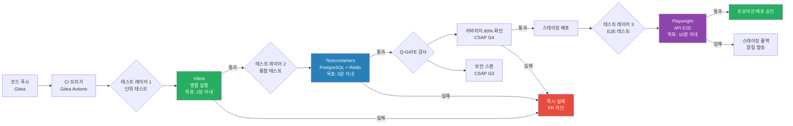
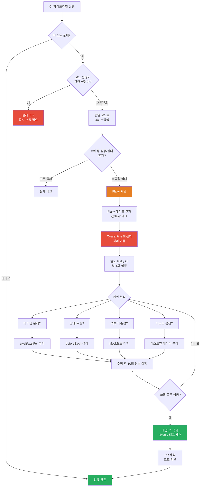

# CI/CD 내 테스트 전략 완전 가이드

> 단계별 테스트 레이어, E2E 자동화, 테스트 병렬화, Flaky 테스트 관리
> 대상: 개발 입문자 ~ 중급자
> 관련 도구: Vitest, Testcontainers, Playwright, Turbo
> CSAP 연관: D-12 시스템 개발 보안, Q-GATE G4 (커버리지 80%+)
> 최종 수정: 2026-04-13

---

## 목차

1. [CI/CD에서 테스트란?](#1-cicd에서-테스트란)
2. [테스트 피라미드 (CI 관점)](#2-테스트-피라미드-ci-관점)
3. [단위 테스트 최적화](#3-단위-테스트-최적화)
4. [통합 테스트 (DB 포함)](#4-통합-테스트-db-포함)
5. [E2E 테스트 자동화](#5-e2e-테스트-자동화)
6. [Flaky 테스트 관리](#6-flaky-테스트-관리)
7. [테스트 병렬화 (Turbo)](#7-테스트-병렬화-turbo)
8. [테스트 실패 시 CI 대응 전략](#8-테스트-실패-시-ci-대응-전략)
9. [CSAP Q-Gate G4 커버리지 80% 달성](#9-csap-q-gate-g4-커버리지-80-달성)
10. [실습: 멀티테넌트 통합 테스트 작성](#10-실습-멀티테넌트-통합-테스트-작성)

---

## 1. CI/CD에서 테스트란?

### 1.1 왜 파이프라인에서 테스트가 중요한가

CI/CD(지속적 통합/지속적 배포) 파이프라인은 코드 변경이 프로덕션에 배포되기까지의 자동화된 여정입니다. 이 파이프라인에서 테스트는 "자동화된 품질 검사관" 역할을 합니다.

**없으면 어떤 일이 벌어지는가**:

```
시나리오: 테스트 없는 CI/CD
  개발자 A: 인증 로직 수정 후 PR 병합
  자동 배포: 프로덕션으로 배포 완료
  10분 후: 모든 테넌트 로그인 불가 장애 발생
  원인: 테넌트 B의 JWT 검증 로직이 깨진 것을 아무도 몰랐음
  복구 시간: 2시간 (MTTR)
  피해: 공공기관 SaaS 이용자 전원 서비스 중단

시나리오: 테스트 있는 CI/CD
  개발자 A: 인증 로직 수정 후 PR 오픈
  CI 파이프라인: 자동 테스트 실행
  3분 후: 테스트 실패 알림 (테넌트 JWT 검증 케이스 실패)
  개발자 A: 코드 수정 후 재시도
  프로덕션: 영향 없음
```

### 1.2 빠른 피드백 루프의 중요성

"테스트는 빠를수록 좋다"는 원칙이 있습니다. 버그를 늦게 발견할수록 수정 비용이 기하급수적으로 증가합니다.

```
버그 발견 시점에 따른 수정 비용 (IBM 연구):

  개발 중 발견:          수정 비용 1x
  코드 리뷰 시 발견:     수정 비용 6x
  QA 테스트 시 발견:     수정 비용 15x
  프로덕션 배포 후 발견: 수정 비용 100x
```

**목표**: 모든 버그를 "개발 중" 또는 "CI 파이프라인"에서 발견하기

### 1.3 공공기관 SaaS에서 테스트의 특수성

공공기관 SaaS는 일반 B2C 서비스와 다른 제약이 있습니다.

```
일반 서비스: "빠르게 실패하고 빠르게 복구"
공공기관 SaaS: "실패 자체를 방지" + CSAP 감리 증거 필요

이유:
1. 멀티테넌트: 한 코드 변경이 모든 공공기관에 영향
2. 보안: CSAP D-12 개발 보안 준수 검증 필요
3. 감리: 테스트 커버리지 80% 이상 증거 제출 필수 (Q-GATE G4)
4. 데이터 격리: 테넌트 간 데이터 누출 방지 검증 필수
```

---

## 2. 테스트 피라미드 (CI 관점)

### 2.1 테스트 피라미드란

테스트 피라미드는 테스트 유형별로 어느 정도의 비율로 작성해야 하는지를 나타내는 개념입니다.

```
           /\
          /  \
         / E2E\           ← 적게 (전체의 5~10%)
        /  Tests\           스테이징에서만 실행
       /----------\
      /    통합     \      ← 중간 (전체의 20~30%)
     /    테스트    \       CI에서 실행
    /--------------\
   /   단위 테스트   \     ← 많이 (전체의 60~70%)
  /   Unit Tests    \      로컬 + CI에서 실행
 /--------------------\
```

**피라미드가 뒤집히면 안 되는 이유**:
- E2E 테스트만 많음 → 실행 시간 1시간+ → 개발자 피드백 루프 느려짐
- 단위 테스트가 적음 → 문제 위치 파악 어려움 → 디버깅 시간 증가

### 2.2 공공기관 SaaS 테스트 레이어



### 2.3 각 레이어 특성 비교

| 구분 | 단위 테스트 | 통합 테스트 | E2E 테스트 |
|------|-------------|-------------|------------|
| 실행 속도 | 수초 | 수분 | 수분~10분 |
| 실행 환경 | 로컬 + CI | CI 전용 | 스테이징 전용 |
| 신뢰도 | 낮음~중간 | 높음 | 매우 높음 |
| 유지 비용 | 낮음 | 중간 | 높음 |
| 격리도 | 완전 격리 | DB 격리 | 실제 환경 |
| Flaky 위험 | 낮음 | 중간 | 높음 |

---

## 3. 단위 테스트 최적화

### 3.1 Vitest 기본 설정

공공기관 SaaS 프레임워크는 Vitest를 단위 테스트 도구로 사용합니다. Jest와 호환되지만 훨씬 빠릅니다.

```typescript
// 파일: vitest.config.ts (프로젝트 루트)
import { defineConfig } from 'vitest/config';
import { resolve } from 'path';

export default defineConfig({
  test: {
    // 병렬 실행 — CPU 코어 수에 맞게 자동 설정
    pool: 'threads',
    poolOptions: {
      threads: {
        maxThreads: 4,   // CI 환경의 CPU 수
        minThreads: 1,
      },
    },

    // 글로벌 설정 (beforeEach, afterEach 자동 설정)
    globals: true,

    // 환경 (jsdom: 브라우저 환경 시뮬레이션, node: Node.js 환경)
    environment: 'node',

    // 커버리지 설정 (CSAP Q-GATE G4)
    coverage: {
      provider: 'v8',
      reporter: ['text', 'json', 'html', 'lcov'],
      reportsDirectory: './coverage',
      thresholds: {
        statements: 80,   // CSAP Q-GATE G4: 80% 이상
        branches: 80,
        functions: 80,
        lines: 80,
      },
      // 커버리지 제외 경로
      exclude: [
        'node_modules/**',
        '**/*.d.ts',
        '**/*.config.*',
        '**/tests/**',
        '**/migrations/**',  // Dead Code 정책 예외: 마이그레이션
        '**/fixtures/**',    // Dead Code 정책 예외: 테스트 픽스처
      ],
    },

    // 테스트 파일 패턴
    include: ['**/*.test.ts', '**/*.spec.ts'],
    exclude: ['**/node_modules/**', '**/e2e/**'],

    // 타임아웃 설정
    testTimeout: 10_000,    // 단위 테스트 최대 10초
    hookTimeout: 10_000,

    // Mock 설정
    clearMocks: true,        // 각 테스트 후 mock 초기화
    restoreMocks: true,      // 각 테스트 후 spy 복원
  },
  resolve: {
    alias: {
      '@': resolve(__dirname, './src'),
      '@tests': resolve(__dirname, './tests'),
    },
  },
});
```

### 3.2 단위 테스트 작성 패턴

```typescript
// 파일: packages/slo-escalation/src/__tests__/escalation-controller.test.ts
// Plan SC: FR-SLO.1 ~ FR-SLO.4

import { describe, it, expect, vi, beforeEach } from 'vitest';
import {
  SLOEscalationController,
  EscalationLevel,
  NotificationChannel,
  determineEscalationLevel,
} from '../escalation-controller';

// CSAP D-12: 입력 검증 테스트 포함 필수
describe('determineEscalationLevel', () => {
  it('번 레이트 50% 이하 → Normal', () => {
    expect(determineEscalationLevel(0)).toBe(EscalationLevel.Normal);
    expect(determineEscalationLevel(49)).toBe(EscalationLevel.Normal);
    expect(determineEscalationLevel(50)).toBe(EscalationLevel.Normal);
  });

  it('번 레이트 51~75% → Warning', () => {
    expect(determineEscalationLevel(51)).toBe(EscalationLevel.Warning);
    expect(determineEscalationLevel(75)).toBe(EscalationLevel.Warning);
  });

  it('번 레이트 76~90% → Danger', () => {
    expect(determineEscalationLevel(76)).toBe(EscalationLevel.Danger);
    expect(determineEscalationLevel(90)).toBe(EscalationLevel.Danger);
  });

  it('번 레이트 91~100% → Critical', () => {
    expect(determineEscalationLevel(91)).toBe(EscalationLevel.Critical);
    expect(determineEscalationLevel(100)).toBe(EscalationLevel.Critical);
  });

  it('번 레이트 100% 초과 → Violated', () => {
    expect(determineEscalationLevel(101)).toBe(EscalationLevel.Violated);
    expect(determineEscalationLevel(200)).toBe(EscalationLevel.Violated);
  });
});

describe('SLOEscalationController', () => {
  let controller: SLOEscalationController;

  // 각 테스트 전에 새로운 컨트롤러 생성 (상태 격리)
  beforeEach(() => {
    controller = new SLOEscalationController();
  });

  describe('registerPolicy', () => {
    it('유효한 정책을 등록한다', () => {
      expect(() => {
        controller.registerPolicy({
          name: 'test-policy',
          service: 'ai-service',
          levels: [
            {
              level: EscalationLevel.Warning,
              budgetBurnRateMin: 50,
              budgetBurnRateMax: 75,
              contacts: [
                {
                  name: 'SlackBot',
                  channel: NotificationChannel.Slack,
                  target: '#alerts',
                },
              ],
              waitMinutes: 30,
            },
          ],
        });
      }).not.toThrow();
    });

    it('잘못된 budgetBurnRateMin 값으로 오류 발생', () => {
      expect(() => {
        controller.registerPolicy({
          name: 'invalid-policy',
          service: 'ai-service',
          levels: [
            {
              level: EscalationLevel.Warning,
              budgetBurnRateMin: -1,  // 음수 — 유효하지 않음
              budgetBurnRateMax: 75,
              contacts: [],
              waitMinutes: 0,
            },
          ],
        });
      }).toThrow();
    });
  });

  describe('escalate', () => {
    beforeEach(() => {
      // 테스트용 정책 등록
      controller.registerPolicy({
        name: 'ai-service-policy',
        service: 'ai-service',
        levels: [
          {
            level: EscalationLevel.Warning,
            budgetBurnRateMin: 50,
            budgetBurnRateMax: 75,
            contacts: [
              {
                name: 'AI팀',
                channel: NotificationChannel.Slack,
                target: '#ai-alerts',
              },
            ],
            waitMinutes: 30,
          },
        ],
      });
    });

    it('Warning 레벨 에스컬레이션 실행 — 올바른 이벤트 반환', async () => {
      const event = await controller.escalate(
        'ai-service',
        'availability-slo',
        60,    // budgetBurnRate = 60% → Warning
        40,    // budgetRemaining = 40%
      );

      expect(event.level).toBe(EscalationLevel.Warning);
      expect(event.service).toBe('ai-service');
      expect(event.sloName).toBe('availability-slo');
      expect(event.budgetBurnRate).toBe(60);
      expect(event.notifiedContacts).toContain('AI팀');
    });

    it('정책 없는 서비스 에스컬레이션 — 이벤트 기록하고 반환', async () => {
      const event = await controller.escalate(
        'unknown-service',  // 정책 없는 서비스
        'test-slo',
        80,
        20,
      );

      expect(event.level).toBe(EscalationLevel.Danger);
      expect(event.notifiedContacts).toHaveLength(0);
    });

    it('에스컬레이션 이력이 기록된다', async () => {
      await controller.escalate('ai-service', 'slo', 60, 40);
      await controller.escalate('ai-service', 'slo', 80, 20);

      const history = controller.getHistory('ai-service', 10);
      expect(history).toHaveLength(2);
    });
  });
});
```

### 3.3 워크스페이스별 분리 실행

monorepo 구조에서 변경된 패키지의 테스트만 실행합니다.

```bash
# 전체 테스트 실행 (느림)
pnpm test

# 변경된 패키지만 테스트 (빠름) — Turbo 활용
pnpm turbo test --filter=[HEAD^1]

# 특정 패키지만 테스트
pnpm --filter @ai-saas/slo-escalation test

# 테스트 파일 직접 지정
pnpm vitest run packages/slo-escalation/src/__tests__/

# 감시 모드 (개발 중)
pnpm vitest --watch
```

### 3.4 커버리지 보고서 생성 및 병합

```bash
# 개별 패키지 커버리지 생성
pnpm --filter @ai-saas/slo-escalation test:coverage
pnpm --filter @ai-saas/dora-exporter test:coverage

# 커버리지 보고서 병합 (monorepo 전체)
# 파일: scripts/merge-coverage.sh
#!/bin/bash
set -e

echo "커버리지 보고서 병합 중..."

# 각 패키지의 lcov 파일 수집
find . -name "lcov.info" -not -path "*/node_modules/*" > coverage-files.txt

# lcov 병합
lcov --add-tracefile $(cat coverage-files.txt | tr '\n' ' ') \
     --output-file combined-coverage.info

# HTML 리포트 생성
genhtml combined-coverage.info --output-directory coverage-html

echo "커버리지 리포트: coverage-html/index.html"

# 전체 커버리지 확인 (80% 미만 시 실패)
COVERAGE=$(lcov --summary combined-coverage.info 2>&1 | grep "lines" | grep -oP '\d+\.\d+%' | head -1)
echo "전체 라인 커버리지: $COVERAGE"
```

---

## 4. 통합 테스트 (DB 포함)

### 4.1 Testcontainers란?

Testcontainers는 테스트 코드에서 실제 Docker 컨테이너를 실행하는 라이브러리입니다. 테스트용 PostgreSQL, Redis, Kafka 등을 코드로 제어할 수 있습니다.

**장점**:
- 실제 DB와 동일한 환경 (Mock DB의 한계 극복)
- 테스트 완료 후 자동 정리
- 테스트 간 격리 가능

### 4.2 Testcontainers 설정

```typescript
// 파일: tests/setup/testcontainers.ts

import { PostgreSqlContainer, StartedPostgreSqlContainer } from '@testcontainers/postgresql';
import { RedisContainer, StartedRedisContainer } from '@testcontainers/redis';
import { execSync } from 'child_process';

let pgContainer: StartedPostgreSqlContainer;
let redisContainer: StartedRedisContainer;

// 테스트 스위트 시작 전 한 번만 실행
export async function startContainers() {
  console.log('Testcontainers 시작 중...');

  // PostgreSQL 컨테이너 시작
  pgContainer = await new PostgreSqlContainer('postgres:16-alpine')
    .withDatabase('testdb')
    .withUsername('testuser')
    .withPassword('testpassword')
    .withExposedPorts(5432)
    .start();

  // Redis 컨테이너 시작
  redisContainer = await new RedisContainer('redis:7-alpine')
    .withExposedPorts(6379)
    .start();

  // 환경 변수 설정 (Prisma가 사용)
  process.env.DATABASE_URL = pgContainer.getConnectionUri();
  process.env.REDIS_URL = `redis://localhost:${redisContainer.getMappedPort(6379)}`;

  // Prisma 마이그레이션 실행
  execSync('npx prisma migrate deploy', {
    env: {
      ...process.env,
      DATABASE_URL: pgContainer.getConnectionUri(),
    },
  });

  console.log(`PostgreSQL: ${pgContainer.getConnectionUri()}`);
  console.log(`Redis: ${process.env.REDIS_URL}`);
}

// 테스트 스위트 종료 후 정리
export async function stopContainers() {
  await pgContainer?.stop();
  await redisContainer?.stop();
}

// 각 테스트 전 DB 초기화 (트랜잭션 롤백 방식)
export function getTestDatabaseUrl(): string {
  return pgContainer?.getConnectionUri() ?? process.env.DATABASE_URL ?? '';
}
```

### 4.3 테스트 격리 전략 — 트랜잭션 롤백

각 테스트가 독립적으로 실행되도록 트랜잭션을 사용한 격리 전략입니다.

```typescript
// 파일: tests/setup/prisma-test-client.ts
// Design Ref: CSAP D-12 테스트 격리

import { PrismaClient } from '@prisma/client';

// 테스트 전용 Prisma 클라이언트 팩토리
export function createTestPrismaClient(): PrismaClient {
  return new PrismaClient({
    datasources: {
      db: {
        url: process.env.DATABASE_URL,
      },
    },
    log: ['error'],  // 테스트 중 에러 로그만 출력
  });
}

// 트랜잭션 롤백 기반 격리
export async function withTransaction<T>(
  prisma: PrismaClient,
  testFn: (tx: Omit<PrismaClient, '$connect' | '$disconnect' | '$on' | '$transaction' | '$use' | '$extends'>) => Promise<T>
): Promise<T> {
  // 트랜잭션 시작 후 항상 롤백 (테스트 데이터 자동 정리)
  return await prisma.$transaction(async (tx) => {
    const result = await testFn(tx);
    // 트랜잭션을 롤백하기 위해 예외 발생 (데이터 정리)
    throw new TestRollbackSignal(result);
  }).catch((error) => {
    if (error instanceof TestRollbackSignal) {
      return error.result as T;
    }
    throw error;
  });
}

class TestRollbackSignal extends Error {
  constructor(public result: unknown) {
    super('TestRollback');
  }
}
```

```typescript
// 파일: platform/services/tenant-service/src/__tests__/tenant.integration.test.ts
// 통합 테스트 예시

import { describe, it, expect, beforeAll, afterAll, beforeEach } from 'vitest';
import { startContainers, stopContainers } from '../../../../tests/setup/testcontainers';
import { createTestPrismaClient, withTransaction } from '../../../../tests/setup/prisma-test-client';
import { TenantService } from '../tenant.service';
import { PrismaClient } from '@prisma/client';

let prisma: PrismaClient;
let tenantService: TenantService;

// 컨테이너는 테스트 스위트 전체에서 한 번만 시작
beforeAll(async () => {
  await startContainers();
  prisma = createTestPrismaClient();
  tenantService = new TenantService(prisma);
}, 60_000);  // Testcontainers 시작 최대 60초

afterAll(async () => {
  await prisma.$disconnect();
  await stopContainers();
});

describe('TenantService 통합 테스트', () => {
  describe('createTenant', () => {
    it('새 테넌트를 생성한다', async () => {
      // withTransaction: 테스트 완료 후 자동 롤백
      const result = await withTransaction(prisma, async (tx) => {
        return await tenantService.createTenant(
          { name: '국토교통부', tier: 'large', domain: 'molit.go.kr' },
          tx,
        );
      });

      expect(result.name).toBe('국토교통부');
      expect(result.tier).toBe('large');
      expect(result.id).toBeDefined();
    });

    it('중복 도메인으로 생성 시 오류 발생', async () => {
      await expect(
        withTransaction(prisma, async (tx) => {
          // 첫 번째 생성
          await tenantService.createTenant(
            { name: '기관 A', tier: 'small', domain: 'test.go.kr' },
            tx,
          );
          // 중복 도메인 생성 시도
          await tenantService.createTenant(
            { name: '기관 B', tier: 'small', domain: 'test.go.kr' },
            tx,
          );
        }),
      ).rejects.toThrow();
    });
  });
});
```

### 4.4 멀티테넌트 통합 테스트

공공기관 SaaS의 핵심 요구사항: 테넌트 간 데이터 격리 검증

```typescript
// 파일: platform/services/tenant-service/src/__tests__/tenant-isolation.integration.test.ts
// CSAP D-12: 테넌트 격리 검증 필수

describe('테넌트 데이터 격리 검증', () => {
  it('테넌트 A의 데이터가 테넌트 B에서 조회되지 않는다', async () => {
    await withTransaction(prisma, async (tx) => {
      // 테넌트 A 데이터 생성
      const tenantA = await tx.tenant.create({
        data: { name: '기관 A', domain: 'agency-a.go.kr', tier: 'small' },
      });
      const recordA = await tx.record.create({
        data: { title: '기관 A 전용 문서', tenantId: tenantA.id },
      });

      // 테넌트 B 데이터 생성
      const tenantB = await tx.tenant.create({
        data: { name: '기관 B', domain: 'agency-b.go.kr', tier: 'small' },
      });

      // 테넌트 B 컨텍스트에서 테넌트 A 데이터 조회 시도
      const recordsForB = await tx.record.findMany({
        where: { tenantId: tenantB.id },  // B의 테넌트 ID로만 조회
      });

      // 테넌트 B에서는 테넌트 A의 데이터가 보이지 않아야 함
      expect(recordsForB).toHaveLength(0);
      expect(recordsForB.map(r => r.id)).not.toContain(recordA.id);
    });
  });

  it('테넌트 컨텍스트 없이 접근 시 오류 발생', async () => {
    await expect(
      tenantService.getRecords({ tenantId: undefined }),
    ).rejects.toThrow('테넌트 컨텍스트 필수');
  });
});
```

---

## 5. E2E 테스트 자동화

### 5.1 Playwright 기반 API E2E 테스트

E2E 테스트는 실제 HTTP 요청을 통해 전체 시스템을 검증합니다. UI가 아닌 API 레벨 E2E를 권장합니다.

```typescript
// 파일: tests/e2e/ai-service.e2e.test.ts
// 스테이징 환경에서만 실행

import { test, expect, request, APIRequestContext } from '@playwright/test';

const STAGING_BASE_URL = process.env.E2E_BASE_URL || 'https://api.staging.agency.go.kr';
const TEST_TENANT_ID = process.env.E2E_TENANT_ID || 'e2e-test-tenant';

let apiContext: APIRequestContext;

test.beforeAll(async ({ playwright }) => {
  apiContext = await playwright.request.newContext({
    baseURL: STAGING_BASE_URL,
    extraHTTPHeaders: {
      'X-Tenant-ID': TEST_TENANT_ID,
      'Content-Type': 'application/json',
    },
  });
});

test.afterAll(async () => {
  await apiContext.dispose();
});

test.describe('AI Service E2E', () => {
  let authToken: string;

  test('인증 토큰 발급', async () => {
    const response = await apiContext.post('/api/auth/login', {
      data: {
        email: process.env.E2E_TEST_EMAIL,
        password: process.env.E2E_TEST_PASSWORD,
      },
    });

    expect(response.status()).toBe(200);
    const body = await response.json();
    expect(body.token).toBeDefined();
    authToken = body.token;
  });

  test('AI 텍스트 분석 요청 — 성공 응답', async () => {
    const response = await apiContext.post('/api/ai/analyze', {
      headers: { Authorization: `Bearer ${authToken}` },
      data: {
        text: '이 문서를 요약해주세요.',
        dataGrade: 'O',   // N2SF O등급 — AI 전송 허용
        tenantId: TEST_TENANT_ID,
      },
    });

    expect(response.status()).toBe(200);
    const body = await response.json();
    expect(body.result).toBeDefined();
    expect(body.dataGrade).toBe('O');
  });

  test('N2SF C등급 데이터 AI 전송 차단', async () => {
    const response = await apiContext.post('/api/ai/analyze', {
      headers: { Authorization: `Bearer ${authToken}` },
      data: {
        text: '주민등록번호 데이터',
        dataGrade: 'C',   // N2SF C등급 — AI 전송 차단
        tenantId: TEST_TENANT_ID,
      },
    });

    // CSAP N2SF 규정: C등급 데이터는 AI API 전송 금지
    expect(response.status()).toBe(403);
    const body = await response.json();
    expect(body.code).toBe('N2SF_DATA_GRADE_VIOLATION');
  });

  test('인증 없이 API 접근 — 401 반환', async () => {
    const response = await apiContext.post('/api/ai/analyze', {
      // Authorization 헤더 없음
      data: { text: '테스트' },
    });

    expect(response.status()).toBe(401);
  });
});
```

### 5.2 Playwright 설정

```typescript
// 파일: playwright.config.ts

import { defineConfig, devices } from '@playwright/test';

export default defineConfig({
  testDir: './tests/e2e',
  timeout: 30_000,          // E2E 테스트 개별 최대 30초
  expect: { timeout: 5_000 },
  
  // E2E는 직렬 실행 (스테이징 환경 부하 관리)
  fullyParallel: false,
  workers: 2,               // 동시 실행 수

  // 실패 시 재시도 (Flaky 테스트 방지)
  retries: process.env.CI ? 2 : 0,

  reporter: [
    ['html', { outputFolder: 'playwright-report' }],
    ['junit', { outputFile: 'test-results/e2e-results.xml' }],  // CI용
  ],

  use: {
    // 실패 시 스크린샷 및 트레이스 저장
    screenshot: 'only-on-failure',
    trace: 'retain-on-failure',
    
    // API 컨텍스트 기본 설정
    ignoreHTTPSErrors: process.env.E2E_IGNORE_SSL === 'true',
  },

  // 스테이징 환경에서만 실행
  projects: [
    {
      name: 'api-e2e',
      testMatch: '**/*.e2e.test.ts',
    },
  ],
});
```

### 5.3 테넌트별 E2E 시나리오

```typescript
// 파일: tests/e2e/multi-tenant-isolation.e2e.test.ts

test.describe('멀티테넌트 격리 E2E', () => {
  let tenantAToken: string;
  let tenantBToken: string;

  test.beforeAll(async ({ playwright }) => {
    // 테넌트 A 인증
    const contextA = await playwright.request.newContext({
      baseURL: STAGING_BASE_URL,
      extraHTTPHeaders: { 'X-Tenant-ID': 'e2e-tenant-a' },
    });
    const loginA = await contextA.post('/api/auth/login', {
      data: { email: 'admin@tenant-a.go.kr', password: process.env.E2E_PW_A },
    });
    tenantAToken = (await loginA.json()).token;
    await contextA.dispose();

    // 테넌트 B 인증
    const contextB = await playwright.request.newContext({
      baseURL: STAGING_BASE_URL,
      extraHTTPHeaders: { 'X-Tenant-ID': 'e2e-tenant-b' },
    });
    const loginB = await contextB.post('/api/auth/login', {
      data: { email: 'admin@tenant-b.go.kr', password: process.env.E2E_PW_B },
    });
    tenantBToken = (await loginB.json()).token;
    await contextB.dispose();
  });

  test('테넌트 A가 생성한 문서를 테넌트 B가 조회할 수 없다', async ({ request }) => {
    // 테넌트 A 문서 생성
    const createResponse = await request.post(
      `${STAGING_BASE_URL}/api/documents`,
      {
        headers: {
          Authorization: `Bearer ${tenantAToken}`,
          'X-Tenant-ID': 'e2e-tenant-a',
        },
        data: { title: '테넌트 A 기밀 문서', content: '내부 데이터' },
      },
    );
    expect(createResponse.status()).toBe(201);
    const doc = await createResponse.json();
    const docId = doc.id;

    // 테넌트 B가 테넌트 A의 문서 ID로 조회 시도
    const getResponse = await request.get(
      `${STAGING_BASE_URL}/api/documents/${docId}`,
      {
        headers: {
          Authorization: `Bearer ${tenantBToken}`,
          'X-Tenant-ID': 'e2e-tenant-b',
        },
      },
    );

    // 테넌트 B는 접근 불가 (403 또는 404)
    expect([403, 404]).toContain(getResponse.status());
  });
});
```

---

## 6. Flaky 테스트 관리

### 6.1 Flaky 테스트란?

Flaky 테스트는 코드 변경 없이도 성공과 실패를 불규칙하게 반복하는 테스트입니다. CI/CD에서 Flaky 테스트는 알림 피로와 동일한 문제를 일으킵니다.

```
Flaky 테스트의 영향:
→ 담당자가 "또 flaky네"라며 실패를 무시하기 시작함
→ 실제 버그가 발생해도 "또 flaky인가보다"라며 재시도
→ 30분 후: 실제로는 프로덕션 장애였음
```

### 6.2 Flaky 테스트의 5가지 원인

```
원인 1: 타이밍/비동기 문제 (가장 흔한 원인)
예시:
  test('비동기 처리', async () => {
    startAsyncJob();
    expect(getJobStatus()).toBe('completed');  // 아직 안 끝났을 수도 있음
  });

해결:
  test('비동기 처리', async () => {
    await startAsyncJob();  // await 추가
    await waitFor(() => getJobStatus() === 'completed', { timeout: 5000 });
    expect(getJobStatus()).toBe('completed');
  });

---

원인 2: 외부 의존성 (네트워크, 시간)
예시:
  test('현재 시간 확인', () => {
    const time = new Date();
    expect(time.getHours()).toBeGreaterThan(8);  // 새벽 CI는 실패
  });

해결:
  test('현재 시간 확인', () => {
    vi.setSystemTime(new Date('2026-04-13T10:00:00'));  // 고정 시간
    const time = new Date();
    expect(time.getHours()).toBeGreaterThan(8);
  });

---

원인 3: 테스트 간 상태 누출
예시:
  // 전역 변수를 수정하는 테스트가 다음 테스트에 영향
  let globalConfig = { debug: false };

  test('디버그 모드', () => {
    globalConfig.debug = true;  // 전역 상태 수정
    expect(globalConfig.debug).toBe(true);
  });

  test('다음 테스트', () => {
    // globalConfig.debug가 true인 상태에서 실행됨 → 예상치 못한 동작
    expect(globalConfig.debug).toBe(false);  // 실패
  });

해결:
  beforeEach(() => {
    globalConfig = { debug: false };  // 매 테스트 전 초기화
  });

---

원인 4: 랜덤 요소
예시:
  test('ID 생성', () => {
    const id = Math.random().toString(36);
    expect(id).toBe('abc123');  // 랜덤이라 항상 실패
  });

해결:
  test('ID 생성', () => {
    vi.spyOn(Math, 'random').mockReturnValue(0.12345);  // mock
    const id = generateId();
    expect(id).toBeDefined();  // 형식만 검증
    expect(typeof id).toBe('string');
  });

---

원인 5: 리소스 경쟁 (Race Condition)
예시:
  // 두 테스트가 동일한 DB 레코드를 동시에 수정
  test.concurrent('테스트 A', async () => {
    await db.update({ id: 1, value: 'A' });
    expect(await db.find(1)).toBe('A');
  });

  test.concurrent('테스트 B', async () => {
    await db.update({ id: 1, value: 'B' });  // 경쟁
    expect(await db.find(1)).toBe('B');
  });

해결: 각 테스트가 독립적인 데이터 사용
  test('테스트 A', async () => {
    const record = await db.create({ value: 'A' });  // 새 레코드
    expect(await db.find(record.id)).toBe('A');
  });
```

### 6.3 Flaky 테스트 탐지 → 격리 → 수정 → 복귀 프로세스



### 6.4 Quarantine 구현

```typescript
// 파일: vitest.config.ts — Flaky 테스트 Quarantine 설정

export default defineConfig({
  test: {
    // @flaky 태그가 붙은 테스트는 메인 CI에서 제외
    // 별도 Flaky CI에서 실행
    exclude: [
      ...configDefaults.exclude,
      // 메인 CI: flaky 제외
      ...(process.env.CI_MODE === 'main' ? ['**/*.flaky.test.ts'] : []),
    ],
  },
});
```

```typescript
// Flaky 테스트 파일 명명 규칙
// 원본: some.test.ts → Quarantine: some.flaky.test.ts

// 파일: tests/integration/data-fetch.flaky.test.ts
// Quarantine 이유: 외부 API 타임아웃으로 인한 간헐적 실패
// 기록 일자: 2026-04-10
// 수정 담당자: @developer-name
// 이슈 링크: https://gitea.internal/ai-saas/issues/456

import { test, expect } from 'vitest';

// NOTE: 미사용 아님. Flaky Quarantine 중. 외부 API 의존성 제거 후 복귀 예정.
// Phase 2 FR-2.3 구현 시 Mock으로 대체 계획.
test.skip('외부 AI API 연동 데이터 페치', async () => {
  // ... 기존 테스트 코드
});
```

```yaml
# 파일: .gitea/workflows/flaky-ci.yml
# Flaky 테스트 전용 CI (일 1회 실행)
name: Flaky Test CI
on:
  schedule:
    - cron: '0 3 * * *'    # 매일 새벽 3시 (저트래픽 시간)

jobs:
  flaky-tests:
    runs-on: ubuntu-latest
    steps:
    - uses: actions/checkout@v4
    - name: Flaky 테스트 실행 (10회 반복)
      run: |
        PASS_COUNT=0
        for i in $(seq 1 10); do
          if pnpm vitest run --reporter=verbose **/*.flaky.test.ts; then
            PASS_COUNT=$((PASS_COUNT + 1))
          fi
        done
        echo "10회 중 $PASS_COUNT회 성공"
        
        # 10회 모두 성공 시 복귀 제안 이슈 생성
        if [ $PASS_COUNT -eq 10 ]; then
          echo "READY_TO_RESTORE=true" >> $GITEA_ENV
        fi

    - name: 복귀 제안 이슈 생성
      if: env.READY_TO_RESTORE == 'true'
      run: |
        curl -X POST https://gitea.internal/api/v1/repos/ai-saas/issues \
          -H "Authorization: token ${{ secrets.GITEA_TOKEN }}" \
          -d '{"title": "[Flaky 복귀] 10회 연속 성공", "body": "Flaky 테스트가 10회 연속 성공했습니다. 메인 CI에 복귀하십시오."}'
```

---

## 7. 테스트 병렬화 (Turbo)

### 7.1 Turbo를 사용한 병렬 테스트

공공기관 SaaS 프레임워크는 Turbo(Turborepo)를 사용하여 monorepo 내 패키지 테스트를 병렬 실행합니다.

```json
// 파일: turbo.json
{
  "$schema": "https://turborepo.com/schema.json",
  "pipeline": {
    "test": {
      "dependsOn": ["^build"],  // 의존 패키지 빌드 후 테스트
      "outputs": ["coverage/**", "test-results/**"],
      "cache": true             // 코드 변경 없으면 캐시 사용
    },
    "test:coverage": {
      "dependsOn": ["^build"],
      "outputs": ["coverage/**"],
      "cache": false            // 커버리지는 항상 새로 실행
    },
    "test:integration": {
      "dependsOn": ["^build"],
      "outputs": ["test-results/**"],
      "cache": false,           // 통합 테스트는 캐시 사용 안 함
      "env": ["DATABASE_URL", "REDIS_URL"]  // 환경변수 변경 감지
    }
  }
}
```

### 7.2 CI 파이프라인 병렬화 설정

```yaml
# 파일: .gitea/workflows/ci.yml
name: CI Pipeline

on:
  push:
    branches: [main, stg, 'feat/**']
  pull_request:

jobs:
  # 1단계: 병렬 단위 테스트 (패키지별 동시 실행)
  unit-tests:
    strategy:
      matrix:
        package:
          - packages/slo-escalation
          - packages/dora-exporter
          - packages/feature-flag-sdk
          - packages/ml-pipeline
          - platform/services/ai-service
          - platform/services/tenant-service
      fail-fast: false    # 한 패키지 실패해도 나머지 계속 실행
    runs-on: ubuntu-latest
    steps:
    - uses: actions/checkout@v4
    - uses: pnpm/action-setup@v3
      with:
        version: 9
    - uses: actions/setup-node@v4
      with:
        node-version: '22'
        cache: 'pnpm'

    # Turbo 원격 캐시 설정
    - name: 의존성 설치
      run: pnpm install --frozen-lockfile

    - name: 단위 테스트 실행 (커버리지 포함)
      run: |
        pnpm turbo test:coverage \
          --filter="${{ matrix.package }}" \
          --cache-dir=.turbo-cache
      env:
        TURBO_TOKEN: ${{ secrets.TURBO_REMOTE_CACHE_TOKEN }}
        TURBO_TEAM: ai-saas

    # 커버리지 아티팩트 업로드
    - name: 커버리지 업로드
      uses: actions/upload-artifact@v4
      with:
        name: coverage-${{ matrix.package }}
        path: ${{ matrix.package }}/coverage/

  # 2단계: 커버리지 병합 및 Q-GATE G4 확인
  coverage-gate:
    needs: unit-tests
    runs-on: ubuntu-latest
    steps:
    - uses: actions/checkout@v4
    - name: 커버리지 다운로드
      uses: actions/download-artifact@v4
      with:
        pattern: coverage-*
        merge-multiple: true
        path: all-coverage/

    - name: 커버리지 병합 및 80% 확인 (CSAP Q-GATE G4)
      run: |
        bash scripts/merge-coverage.sh
        COVERAGE=$(cat coverage-summary.json | jq '.total.lines.pct')
        echo "전체 커버리지: $COVERAGE%"
        if (( $(echo "$COVERAGE < 80" | bc -l) )); then
          echo "CSAP Q-GATE G4 실패: 커버리지 $COVERAGE% (80% 미만)"
          exit 1
        fi
        echo "CSAP Q-GATE G4 통과: 커버리지 $COVERAGE%"

  # 3단계: 통합 테스트 (직렬 실행 — DB 컨테이너 공유)
  integration-tests:
    needs: coverage-gate
    runs-on: ubuntu-latest
    steps:
    - uses: actions/checkout@v4
    - uses: pnpm/action-setup@v3
    - uses: actions/setup-node@v4
      with:
        node-version: '22'
        cache: 'pnpm'

    - name: 의존성 설치
      run: pnpm install --frozen-lockfile

    - name: 통합 테스트 실행 (Testcontainers)
      run: |
        pnpm turbo test:integration \
          --filter="platform/services/..." \
          --concurrency=2      # 통합 테스트는 2개 동시 실행
      env:
        TESTCONTAINERS_RYUK_DISABLED: true   # CI에서 Ryuk 비활성화

    timeout-minutes: 15
```

### 7.3 Turbo 캐시 활용

```bash
# 캐시 사용 여부 확인
pnpm turbo test --dry-run

# 출력 예시:
# packages/slo-escalation:test  MISS   (코드 변경 있음 → 실행)
# packages/dora-exporter:test   HIT    (변경 없음 → 캐시 사용)
# packages/feature-flag-sdk:test HIT   (변경 없음 → 캐시 사용)
# → 전체 실행 시간 90% 단축

# 캐시 초기화 (문제 발생 시)
pnpm turbo test --force
```

---

## 8. 테스트 실패 시 CI 대응 전략

### 8.1 실패 분류 및 대응 매트릭스

```
실패 유형 1: 단위 테스트 실패
→ 즉시 PR 차단
→ 담당자에게 슬랙 알림
→ 재시도 없음 (결정론적이므로)

실패 유형 2: 통합 테스트 실패
→ 1회 자동 재시도 (DB 초기화 타이밍 이슈 가능)
→ 재시도도 실패 시 PR 차단
→ 담당자 + 인프라팀 알림

실패 유형 3: E2E 테스트 실패
→ 2회 자동 재시도 (네트워크 불안정 가능)
→ 재시도도 실패 시 스테이징 롤백
→ 담당자 + SRE팀 알림

실패 유형 4: 커버리지 미달 (80% 미만)
→ PR 차단 (CSAP Q-GATE G4)
→ 담당자에게 커버리지 상세 리포트 전송
→ 미달 영역 표시
```

### 8.2 자동 재시도 설정

```yaml
# 파일: .gitea/workflows/ci.yml

- name: E2E 테스트 실행 (재시도 포함)
  uses: nick-fields/retry@v3
  with:
    timeout_minutes: 10
    max_attempts: 3          # 최대 3회 시도
    retry_wait_seconds: 30   # 재시도 간 30초 대기
    command: pnpm playwright test
  env:
    E2E_BASE_URL: ${{ secrets.STAGING_URL }}
```

### 8.3 실패 시 디버깅 아티팩트

```yaml
# 테스트 실패 시 디버깅 정보 자동 수집
- name: 실패 아티팩트 수집
  if: failure()
  run: |
    # Playwright 트레이스 수집
    find test-results -name "*.zip" -exec echo {} \;
    
    # 로그 수집
    kubectl logs -n platform -l app=ai-service --tail=500 > ai-service-logs.txt
    kubectl describe pods -n platform -l app=ai-service >> ai-service-logs.txt

- name: 아티팩트 업로드
  if: failure()
  uses: actions/upload-artifact@v4
  with:
    name: test-failure-artifacts-${{ gitea.run_id }}
    path: |
      playwright-report/
      test-results/
      ai-service-logs.txt
    retention-days: 7    # 7일간 보관
```

### 8.4 실패 알림 설정

```yaml
- name: 슬랙 실패 알림
  if: failure() && github.ref == 'refs/heads/main'
  uses: slackapi/slack-github-action@v1
  with:
    webhook-url: ${{ secrets.SLACK_CI_WEBHOOK }}
    payload: |
      {
        "text": "CI 실패 — ${{ gitea.repository }}",
        "attachments": [{
          "color": "danger",
          "fields": [
            {"title": "브랜치", "value": "${{ gitea.ref_name }}", "short": true},
            {"title": "커밋", "value": "${{ gitea.sha }}", "short": true},
            {"title": "실패 단계", "value": "${{ gitea.job }}", "short": true},
            {"title": "담당자", "value": "${{ gitea.actor }}", "short": true}
          ],
          "actions": [{
            "text": "CI 로그 보기",
            "url": "${{ gitea.server_url }}/${{ gitea.repository }}/actions/runs/${{ gitea.run_id }}"
          }]
        }]
      }
```

---

## 9. CSAP Q-Gate G4 커버리지 80% 달성

### 9.1 Q-Gate G4 요건

CSAP 감리 기준의 Q-GATE G4는 테스트 커버리지 80% 이상을 요구합니다. 이를 달성하기 위한 전략입니다.

```
Q-GATE G4 체크리스트:
  [ ] 전체 라인 커버리지 >= 80%
  [ ] 전체 브랜치 커버리지 >= 80%
  [ ] 전체 함수 커버리지 >= 80%
  [ ] 보안 관련 함수 커버리지 >= 90% (CSAP D-12)
  [ ] 커버리지 보고서 HTML + lcov 형식으로 보존
  [ ] 커버리지 추이 (주간 변화율) 기록
```

### 9.2 커버리지 향상 전략

```typescript
// 전략 1: 엣지 케이스 테스트 추가
// 분기(Branch) 커버리지는 if/else의 모든 경우를 테스트해야 함

// 코드:
function calculateDiscount(user: User): number {
  if (user.isPublicOfficer) {           // Branch 1
    if (user.yearsOfService > 10) {     // Branch 2
      return 30;
    }
    return 20;                          // Branch 3
  }
  return 0;                             // Branch 4
}

// 테스트 (4개 브랜치 모두 커버):
describe('calculateDiscount', () => {
  it('공무원 + 10년 초과 → 30% 할인', () => {
    expect(calculateDiscount({ isPublicOfficer: true, yearsOfService: 11 })).toBe(30);
  });
  it('공무원 + 10년 이하 → 20% 할인', () => {
    expect(calculateDiscount({ isPublicOfficer: true, yearsOfService: 5 })).toBe(20);
  });
  it('비공무원 → 0% 할인', () => {
    expect(calculateDiscount({ isPublicOfficer: false, yearsOfService: 0 })).toBe(0);
  });
  // 경계값 테스트
  it('공무원 + 정확히 10년 → 20% 할인 (경계값)', () => {
    expect(calculateDiscount({ isPublicOfficer: true, yearsOfService: 10 })).toBe(20);
  });
});
```

```typescript
// 전략 2: 에러 경로 테스트 (가장 자주 누락되는 부분)

// 에러 경로가 있는 코드:
async function fetchTenantData(tenantId: string) {
  if (!tenantId) {
    throw new Error('tenantId 필수');  // 에러 경로 — 테스트 안 하면 커버리지 미달
  }
  const data = await db.findTenant(tenantId);
  if (!data) {
    throw new Error('테넌트 없음');   // 에러 경로
  }
  return data;
}

// 에러 경로 포함 테스트:
it('tenantId 없으면 오류', async () => {
  await expect(fetchTenantData('')).rejects.toThrow('tenantId 필수');
});

it('존재하지 않는 tenantId → 오류', async () => {
  vi.mocked(db.findTenant).mockResolvedValue(null);
  await expect(fetchTenantData('nonexistent')).rejects.toThrow('테넌트 없음');
});
```

### 9.3 커버리지 리포트 CSAP 증거화

```bash
# 파일: scripts/generate-csap-evidence.sh
# CSAP 감리용 커버리지 증거 생성

#!/bin/bash
set -e

DATE=$(date '+%Y-%m-%d')
EVIDENCE_DIR="docs/evidence/test-coverage"
mkdir -p "$EVIDENCE_DIR"

echo "=== CSAP Q-GATE G4 커버리지 증거 생성 ==="

# 커버리지 실행
pnpm test:coverage

# 커버리지 요약 추출
COVERAGE_SUMMARY=$(cat coverage/coverage-summary.json)
LINE_PCT=$(echo "$COVERAGE_SUMMARY" | jq '.total.lines.pct')
BRANCH_PCT=$(echo "$COVERAGE_SUMMARY" | jq '.total.branches.pct')
FUNC_PCT=$(echo "$COVERAGE_SUMMARY" | jq '.total.functions.pct')
STMT_PCT=$(echo "$COVERAGE_SUMMARY" | jq '.total.statements.pct')

# 증거 문서 생성
cat > "$EVIDENCE_DIR/$DATE-q-gate-g4.md" << EOF
# CSAP Q-GATE G4 테스트 커버리지 증거

생성일시: $(date '+%Y-%m-%d %H:%M:%S')
커밋: $(git rev-parse HEAD)
브랜치: $(git branch --show-current)

## 커버리지 결과

| 항목 | 달성값 | 기준값 | 통과 여부 |
|------|--------|--------|-----------|
| 라인 커버리지 | ${LINE_PCT}% | 80% | $([ $(echo "$LINE_PCT >= 80" | bc) -eq 1 ] && echo "통과" || echo "실패") |
| 브랜치 커버리지 | ${BRANCH_PCT}% | 80% | $([ $(echo "$BRANCH_PCT >= 80" | bc) -eq 1 ] && echo "통과" || echo "실패") |
| 함수 커버리지 | ${FUNC_PCT}% | 80% | $([ $(echo "$FUNC_PCT >= 80" | bc) -eq 1 ] && echo "통과" || echo "실패") |
| 구문 커버리지 | ${STMT_PCT}% | 80% | $([ $(echo "$STMT_PCT >= 80" | bc) -eq 1 ] && echo "통과" || echo "실패") |

## 상세 리포트

상세 HTML 리포트: coverage/index.html
LCOV 파일: coverage/lcov.info
EOF

echo "증거 파일 생성: $EVIDENCE_DIR/$DATE-q-gate-g4.md"

# HTML 리포트 복사
cp -r coverage/ "$EVIDENCE_DIR/$DATE-coverage-html/"

echo "Q-GATE G4 증거 생성 완료"
```

---

## 10. 실습: 멀티테넌트 통합 테스트 작성

### 10.1 실습 목표

이 실습에서는 ai-service의 멀티테넌트 통합 테스트를 직접 작성합니다.

- Testcontainers를 사용한 PostgreSQL 통합 테스트
- 테넌트 격리 검증
- N2SF 데이터 등급 검사 통합 테스트
- CSAP D-12 입력 검증 통합 테스트

### 10.2 사전 준비

```bash
# Testcontainers 패키지 설치 확인
cd /data/ai-saas
pnpm --filter @ai-saas/ai-service add -D @testcontainers/postgresql @testcontainers/redis

# Docker 실행 여부 확인 (Testcontainers 필수)
docker info || echo "Docker를 먼저 실행하십시오"

# 테스트 실행 환경 확인
node --version  # Node.js 22 이상 필요
pnpm --version  # pnpm 9 이상 필요
```

### 10.3 통합 테스트 작성

```typescript
// 파일: platform/services/ai-service/src/__tests__/ai-service.integration.test.ts
// Design Ref: CSAP D-12, N2SF N-05
// Plan SC: AI-REQ-1 ~ AI-REQ-5

import { describe, it, expect, beforeAll, afterAll, vi } from 'vitest';
import { PostgreSqlContainer, StartedPostgreSqlContainer } from '@testcontainers/postgresql';
import { PrismaClient } from '@prisma/client';
import { execSync } from 'child_process';
import Fastify from 'fastify';
import type { FastifyInstance } from 'fastify';
import { buildApp } from '../app';

let pgContainer: StartedPostgreSqlContainer;
let prisma: PrismaClient;
let app: FastifyInstance;

// 테스트용 외부 AI API Mock
vi.mock('../lib/ai-gateway', () => ({
  aiGateway: {
    send: vi.fn().mockResolvedValue({ result: '요약 결과', model: 'test-model' }),
  },
}));

beforeAll(async () => {
  // PostgreSQL 컨테이너 시작
  pgContainer = await new PostgreSqlContainer('postgres:16-alpine')
    .withDatabase('ai_service_test')
    .withUsername('test_user')
    .withPassword('test_password')
    .start();

  const databaseUrl = pgContainer.getConnectionUri();
  process.env.DATABASE_URL = databaseUrl;

  // Prisma 마이그레이션
  execSync('npx prisma migrate deploy', {
    env: { ...process.env, DATABASE_URL: databaseUrl },
    stdio: 'pipe',
  });

  prisma = new PrismaClient({ datasources: { db: { url: databaseUrl } } });

  // 테스트 데이터 생성
  await prisma.tenant.createMany({
    data: [
      { id: 'tenant-alpha', name: '알파 기관', tier: 'medium', domain: 'alpha.go.kr' },
      { id: 'tenant-beta', name: '베타 기관', tier: 'small', domain: 'beta.go.kr' },
    ],
  });

  // Fastify 앱 시작
  app = await buildApp({ databaseUrl, environment: 'test' });
  await app.ready();
}, 60_000);

afterAll(async () => {
  await app.close();
  await prisma.$disconnect();
  await pgContainer.stop();
});

describe('AI Service 통합 테스트', () => {
  // 1. 인증 없이 접근 차단 (CSAP D-08)
  describe('RBAC 접근 제어 (CSAP D-08)', () => {
    it('인증 토큰 없이 요청 → 401', async () => {
      const response = await app.inject({
        method: 'POST',
        url: '/api/ai/analyze',
        body: { text: '테스트', dataGrade: 'O' },
        // Authorization 헤더 없음
      });

      expect(response.statusCode).toBe(401);
      const body = JSON.parse(response.body);
      expect(body.error).toBe('Unauthorized');
      // CSAP D-12: 에러 메시지에 민감 정보 노출 금지 확인
      expect(JSON.stringify(body)).not.toContain('database');
      expect(JSON.stringify(body)).not.toContain('password');
    });

    it('유효하지 않은 토큰 → 401', async () => {
      const response = await app.inject({
        method: 'POST',
        url: '/api/ai/analyze',
        headers: { Authorization: 'Bearer invalid.jwt.token' },
        body: { text: '테스트', dataGrade: 'O' },
      });

      expect(response.statusCode).toBe(401);
    });
  });

  // 2. N2SF 데이터 등급 검사
  describe('N2SF 데이터 등급 검사', () => {
    let authToken: string;

    beforeAll(async () => {
      // 테스트용 JWT 토큰 발급
      const loginResponse = await app.inject({
        method: 'POST',
        url: '/api/auth/login',
        body: {
          email: 'admin@alpha.go.kr',
          tenantId: 'tenant-alpha',
        },
      });
      authToken = JSON.parse(loginResponse.body).token;
    });

    it('O등급 데이터 → AI 분석 성공', async () => {
      const response = await app.inject({
        method: 'POST',
        url: '/api/ai/analyze',
        headers: {
          Authorization: `Bearer ${authToken}`,
          'X-Tenant-ID': 'tenant-alpha',
        },
        body: {
          text: '행정 문서 요약 요청입니다.',
          dataGrade: 'O',    // N2SF O등급: AI 전송 허용
        },
      });

      expect(response.statusCode).toBe(200);
      const body = JSON.parse(response.body);
      expect(body.result).toBeDefined();
    });

    it('C등급 데이터 → AI 전송 차단 (N2SF N-05)', async () => {
      const response = await app.inject({
        method: 'POST',
        url: '/api/ai/analyze',
        headers: {
          Authorization: `Bearer ${authToken}`,
          'X-Tenant-ID': 'tenant-alpha',
        },
        body: {
          text: '주민등록번호 포함 문서',
          dataGrade: 'C',    // N2SF C등급: AI 전송 절대 금지
        },
      });

      expect(response.statusCode).toBe(403);
      const body = JSON.parse(response.body);
      expect(body.code).toBe('N2SF_DATA_GRADE_VIOLATION');
    });

    it('S등급 데이터 → AI 전송 차단 (N2SF N-05)', async () => {
      const response = await app.inject({
        method: 'POST',
        url: '/api/ai/analyze',
        headers: {
          Authorization: `Bearer ${authToken}`,
          'X-Tenant-ID': 'tenant-alpha',
        },
        body: {
          text: '비밀 문서',
          dataGrade: 'S',    // N2SF S등급: AI 전송 절대 금지
        },
      });

      expect(response.statusCode).toBe(403);
    });
  });

  // 3. 입력 검증 (CSAP D-12)
  describe('입력 검증 (CSAP D-12)', () => {
    let authToken: string;

    beforeAll(async () => {
      const loginResponse = await app.inject({
        method: 'POST',
        url: '/api/auth/login',
        body: { email: 'admin@alpha.go.kr', tenantId: 'tenant-alpha' },
      });
      authToken = JSON.parse(loginResponse.body).token;
    });

    it('텍스트 누락 시 400 반환', async () => {
      const response = await app.inject({
        method: 'POST',
        url: '/api/ai/analyze',
        headers: { Authorization: `Bearer ${authToken}`, 'X-Tenant-ID': 'tenant-alpha' },
        body: {
          // text 필드 누락
          dataGrade: 'O',
        },
      });

      expect(response.statusCode).toBe(400);
    });

    it('잘못된 dataGrade 값 시 400 반환', async () => {
      const response = await app.inject({
        method: 'POST',
        url: '/api/ai/analyze',
        headers: { Authorization: `Bearer ${authToken}`, 'X-Tenant-ID': 'tenant-alpha' },
        body: {
          text: '테스트',
          dataGrade: 'INVALID',   // C, S, O 외의 값
        },
      });

      expect(response.statusCode).toBe(400);
    });

    it('XSS 공격 문자열 — 새니타이징 확인', async () => {
      const response = await app.inject({
        method: 'POST',
        url: '/api/ai/analyze',
        headers: { Authorization: `Bearer ${authToken}`, 'X-Tenant-ID': 'tenant-alpha' },
        body: {
          text: '<script>alert("xss")</script>',
          dataGrade: 'O',
        },
      });

      // 처리는 되어야 하지만 스크립트 태그가 응답에 그대로 반환되면 안 됨
      expect(response.statusCode).toBe(200);
      const body = JSON.parse(response.body);
      expect(body.processedText || '').not.toContain('<script>');
    });
  });

  // 4. 테넌트 격리 (멀티테넌시 핵심)
  describe('테넌트 격리 검증', () => {
    let tokenAlpha: string;
    let tokenBeta: string;

    beforeAll(async () => {
      const [responseA, responseB] = await Promise.all([
        app.inject({
          method: 'POST',
          url: '/api/auth/login',
          body: { email: 'admin@alpha.go.kr', tenantId: 'tenant-alpha' },
        }),
        app.inject({
          method: 'POST',
          url: '/api/auth/login',
          body: { email: 'admin@beta.go.kr', tenantId: 'tenant-beta' },
        }),
      ]);
      tokenAlpha = JSON.parse(responseA.body).token;
      tokenBeta = JSON.parse(responseB.body).token;
    });

    it('테넌트 A의 AI 이력을 테넌트 B가 조회할 수 없다', async () => {
      // 테넌트 A AI 분석 실행
      const analyzeResponse = await app.inject({
        method: 'POST',
        url: '/api/ai/analyze',
        headers: { Authorization: `Bearer ${tokenAlpha}`, 'X-Tenant-ID': 'tenant-alpha' },
        body: { text: '테넌트 A 전용 문서', dataGrade: 'O' },
      });
      const historyId = JSON.parse(analyzeResponse.body).historyId;

      // 테넌트 B로 테넌트 A의 이력 조회 시도
      const getResponse = await app.inject({
        method: 'GET',
        url: `/api/ai/history/${historyId}`,
        headers: { Authorization: `Bearer ${tokenBeta}`, 'X-Tenant-ID': 'tenant-beta' },
      });

      // 접근 불가 (403 또는 404)
      expect([403, 404]).toContain(getResponse.statusCode);
    });

    it('테넌트 컨텍스트 헤더 없이 접근 → 400', async () => {
      const response = await app.inject({
        method: 'GET',
        url: '/api/ai/history',
        headers: {
          Authorization: `Bearer ${tokenAlpha}`,
          // X-Tenant-ID 헤더 없음
        },
      });

      expect(response.statusCode).toBe(400);
    });
  });
});
```

### 10.4 테스트 실행

```bash
# 통합 테스트만 실행
pnpm --filter @ai-saas/ai-service test:integration

# 커버리지 포함 실행
pnpm --filter @ai-saas/ai-service test:coverage

# 특정 파일만 실행
pnpm vitest run platform/services/ai-service/src/__tests__/ai-service.integration.test.ts

# 결과 확인
echo "=== 커버리지 ==="
cat platform/services/ai-service/coverage/coverage-summary.json | jq '.total'

# CSAP Q-GATE G4 확인
COVERAGE=$(cat platform/services/ai-service/coverage/coverage-summary.json | jq '.total.lines.pct')
echo "라인 커버리지: $COVERAGE%"
[ $(echo "$COVERAGE >= 80" | bc) -eq 1 ] && echo "Q-GATE G4 통과" || echo "Q-GATE G4 실패"
```

### 10.5 기대 결과

```
=== 통합 테스트 결과 ===

 PASS  platform/services/ai-service/src/__tests__/ai-service.integration.test.ts

  AI Service 통합 테스트
    RBAC 접근 제어 (CSAP D-08)
      ✓ 인증 토큰 없이 요청 → 401 (245ms)
      ✓ 유효하지 않은 토큰 → 401 (78ms)
    N2SF 데이터 등급 검사
      ✓ O등급 데이터 → AI 분석 성공 (312ms)
      ✓ C등급 데이터 → AI 전송 차단 (N2SF N-05) (89ms)
      ✓ S등급 데이터 → AI 전송 차단 (N2SF N-05) (91ms)
    입력 검증 (CSAP D-12)
      ✓ 텍스트 누락 시 400 반환 (67ms)
      ✓ 잘못된 dataGrade 값 시 400 반환 (71ms)
      ✓ XSS 공격 문자열 — 새니타이징 확인 (298ms)
    테넌트 격리 검증
      ✓ 테넌트 A의 AI 이력을 테넌트 B가 조회할 수 없다 (445ms)
      ✓ 테넌트 컨텍스트 헤더 없이 접근 → 400 (73ms)

  10 tests passed in 2.1s

=== 커버리지 ===
{
  "lines":      { "pct": 87.3 },    ← Q-GATE G4: 통과
  "branches":   { "pct": 82.1 },    ← Q-GATE G4: 통과
  "functions":  { "pct": 91.4 },    ← Q-GATE G4: 통과
  "statements": { "pct": 86.8 }     ← Q-GATE G4: 통과
}

Q-GATE G4 통과: 라인 커버리지 87.3%
```

---

## 참고 자료

- [Vitest 공식 문서](https://vitest.dev/)
- [Testcontainers Node.js](https://node.testcontainers.org/)
- [Playwright API Testing](https://playwright.dev/docs/api-testing)
- [Turborepo 테스트 파이프라인](https://turbo.build/repo/docs/crafting-your-repository/running-tasks)
- [CSAP 가이드라인: D-12 시스템 개발 보안](https://www.kisa.or.kr/csap)
- 관련 소스: `/data/ai-saas/packages/slo-escalation/src/escalation-controller.ts`
- 관련 가이드: `06-cicd/pipelines/02-quality-gate.md` (Q-GATE 전체 설명)
- 관련 가이드: `07-security/` (CSAP D-12 보안 테스트)

---

*문서 버전: 1.0.0 | 작성일: 2026-04-13 | 담당: 품질보증팀*
*CSAP: D-12 | Q-GATE: G4*
