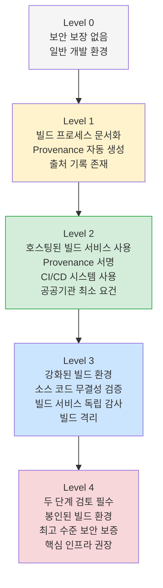
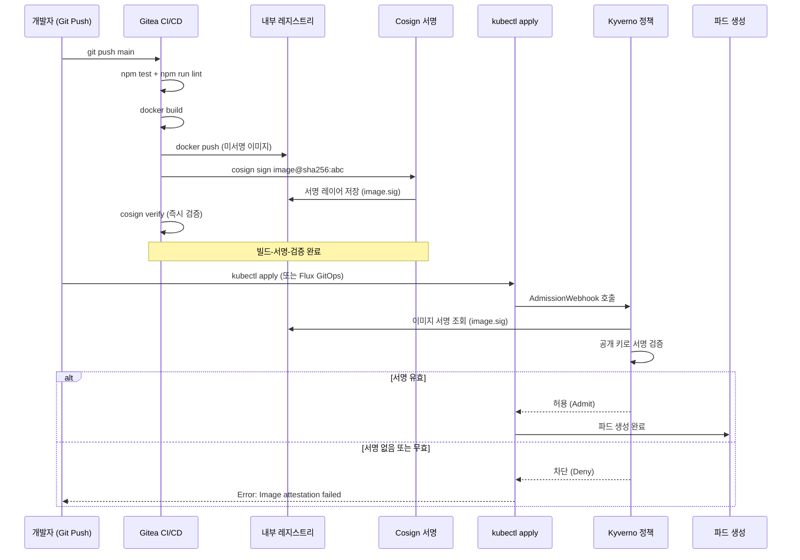

# CI/CD 파이프라인 보안 심화 가이드

> 대상 독자: DevSecOps 엔지니어, CI/CD 담당자 (초급~중급)
> 관련 FR: CSAP D-12 (시스템 개발 보안), D-06 (침해사고 관리)
> 관련 워크플로우: `.gitea/workflows/dora-gate.yml`, `.gitea/workflows/csap-evidence.yml`
> 최종 수정: 2026-04-13

---

## 목차

1. [CI/CD 파이프라인 보안이란?](#1-cicd-파이프라인-보안이란)
2. [SLSA — 소프트웨어 공급망 보안 프레임워크](#2-slsa--소프트웨어-공급망-보안-프레임워크)
3. [Cosign 이미지 서명](#3-cosign-이미지-서명)
4. [SBOM 소프트웨어 자재 명세서](#4-sbom-소프트웨어-자재-명세서)
5. [빌드 재현성](#5-빌드-재현성)
6. [시크릿 누출 방지](#6-시크릿-누출-방지)
7. [파이프라인 격리](#7-파이프라인-격리)
8. [실제 워크플로우 분석](#8-실제-워크플로우-분석)
9. [실습: 새 서비스 이미지 서명 설정](#9-실습-새-서비스-이미지-서명-설정)

---

## 1. CI/CD 파이프라인 보안이란?

### 1.1 공급망 공격(Supply Chain Attack)이란?

소프트웨어 공급망 공격은 최종 프로그램을 직접 공격하는 대신, 그 프로그램이 의존하는 **빌드 도구, 라이브러리, 배포 파이프라인**을 공격하는 방식입니다.

마치 자동차를 훔치려고 차 자체를 뚫는 게 아니라 공장에서 나오는 제조 라인을 공격하여 모든 차에 백도어를 심는 것과 같습니다.

```
정상적인 소프트웨어 공급망:
소스 코드 → [빌드] → 컨테이너 이미지 → [배포] → 프로덕션

공급망 공격 벡터:
소스 코드 ← 악성 npm 패키지 주입 (개발자 PC 침해)
[빌드] ← 빌드 서버 침해 (CI/CD 시스템 공격)
컨테이너 이미지 ← 이미지 변조 (레지스트리 침해)
[배포] ← ArgoCD/Flux 설정 변조 (GitOps 저장소 공격)
```

### 1.2 대표 공급망 공격 사례

#### SolarWinds 사태 (2020)

미국 정부 기관 18,000개 이상에 영향을 준 역대 최대 규모 공급망 공격입니다.

```
공격 경로:
SolarWinds 빌드 서버 침해
    ↓
SUNBURST 악성 코드를 Orion 소프트웨어 빌드 단계에 주입
    ↓
정상적으로 서명된 업데이트 파일에 백도어 내장
    ↓
18,000개 기관이 "신뢰할 수 있는" 업데이트를 자동 설치
    ↓
9개월간 탐지 불가 — 재무부, 국방부 침해
```

**교훈**: 디지털 서명만으로는 부족. 빌드 과정의 **출처 증명(Provenance)**이 필요.

#### Log4Shell (CVE-2021-44228)

Java 로깅 라이브러리 Log4j의 심각한 RCE(원격 코드 실행) 취약점입니다.

```
영향 범위:
- Apache, AWS, Cloudflare, Google, Microsoft 등 수천 개 제품
- 한국 공공기관 시스템 500개 이상 영향 (행안부 발표)

근본 문제:
어떤 소프트웨어가 Log4j를 사용하는지 목록이 없었음
    ↓
SBOM(소프트웨어 자재 명세서)이 있었다면 즉시 영향 범위 파악 가능
```

**교훈**: 내가 사용하는 모든 라이브러리를 **목록화(SBOM)**해야 함.

#### 타이포스쿼팅 공격 (지속 중)

```
정상 패키지: lodash (npm 주간 5,000만 다운로드)
악성 패키지: 1odash (숫자 1을 소문자 L로 위장) ← 오타로 설치
              lodash-extra (유사 이름으로 혼동 유도)
```

### 1.3 공공기관 SaaS의 공급망 보안 요건

CSAP D-12 (시스템 개발 보안) 항목은 다음을 요구합니다:

| 요건 | 내용 | 해당 도구 |
|------|------|---------|
| 개발 도구 검증 | 사용 승인된 도구만 사용 | 허용 패키지 목록 관리 |
| 빌드 환경 무결성 | 빌드 서버 침해 감지 | SLSA Provenance |
| 배포 산출물 검증 | 배포 이미지 변조 방지 | Cosign 이미지 서명 |
| 취약점 관리 | 알려진 취약점 포함 구성요소 관리 | SBOM + Grype |
| 소스 코드 보안 | 시크릿 누출 방지 | Gitleaks, 정적 분석 |

---

## 2. SLSA — 소프트웨어 공급망 보안 프레임워크

### 2.1 SLSA란?

SLSA(Supply-chain Levels for Software Artifacts, 발음: "살사")는 Google이 제안하고 OpenSSF(오픈소스 보안 재단)가 관리하는 공급망 보안 프레임워크입니다.

"이 소프트웨어가 실제로 이 소스 코드에서 이 방법으로 빌드되었음을 증명할 수 있는가?"라는 질문에 답하는 체계입니다.

### 2.2 SLSA Level 1~4 요건 계층



#### Level별 세부 요건

| 수준 | 요건 | 기술적 구현 |
|------|------|-----------|
| **Level 1** | 빌드 프로세스 문서화, Provenance 생성 | GitHub Actions/Gitea Workflow 존재 |
| **Level 2** | 호스팅 빌드 서비스, Provenance 서명 | 관리형 CI/CD + Cosign |
| **Level 3** | 빌드 격리, 소스 무결성 | 별도 빌드 네트워크 + 해시 검증 |
| **Level 4** | 재현 가능한 빌드, 두 단계 검토 | Hermetic 빌드 + 두 명 승인 |

**공공기관 SaaS 목표**: SLSA Level 2 (최소), Level 3 권장

### 2.3 Provenance (빌드 출처 정보)란?

Provenance는 소프트웨어 빌드에 관한 메타데이터입니다. 다음 정보를 포함합니다.

```json
{
  "buildType": "https://github.com/Attestations/GitHubActionsWorkflow@v1",
  "builder": {
    "id": "https://github.com/actions/runner"
  },
  "invocation": {
    "configSource": {
      "uri": "git+https://gitea.internal/ai-saas@refs/heads/main",
      "digest": {"sha1": "abc123def456..."},
      "entryPoint": ".gitea/workflows/build.yml"
    }
  },
  "metadata": {
    "buildStartedOn": "2026-04-13T10:00:00Z",
    "buildFinishedOn": "2026-04-13T10:05:30Z",
    "completeness": {"arguments": true, "environment": false, "materials": true},
    "reproducible": false
  },
  "materials": [
    {
      "uri": "git+https://gitea.internal/ai-saas",
      "digest": {"sha1": "abc123def456..."}
    },
    {
      "uri": "pkg:npm/fastify@5.0.0",
      "digest": {"sha256": "def789..."}
    }
  ]
}
```

### 2.4 SLSA Provenance 생성 — Gitea Actions

```yaml
# .gitea/workflows/build-with-provenance.yml
name: SLSA Level 2 빌드

on:
  push:
    branches: [main, stg]
  pull_request:
    branches: [main]

jobs:
  build:
    name: 컨테이너 이미지 빌드 + Provenance 생성
    runs-on: ubuntu-latest
    permissions:
      contents: read
      id-token: write  # OIDC 토큰 발급 (Keyless 서명용)
      packages: write  # 레지스트리 푸시 권한

    steps:
      - name: 소스 체크아웃
        uses: actions/checkout@v4
        with:
          fetch-depth: 0  # 전체 히스토리 (Provenance에 커밋 정보 포함)

      - name: Docker Buildx 설정
        uses: docker/setup-buildx-action@v3

      - name: 레지스트리 로그인
        uses: docker/login-action@v3
        with:
          registry: registry.internal
          username: ${{ secrets.REGISTRY_USER }}
          password: ${{ secrets.REGISTRY_PASSWORD }}

      - name: 이미지 메타데이터 추출
        id: meta
        uses: docker/metadata-action@v5
        with:
          images: registry.internal/ai-saas/ai-service
          tags: |
            type=sha,prefix=sha-,format=short
            type=ref,event=branch
            type=semver,pattern={{version}}

      - name: 이미지 빌드 및 푸시
        id: build
        uses: docker/build-push-action@v5
        with:
          context: platform/services/ai-service
          push: true
          tags: ${{ steps.meta.outputs.tags }}
          labels: ${{ steps.meta.outputs.labels }}
          # 빌드 캐시 (재현성 향상)
          cache-from: type=registry,ref=registry.internal/ai-saas/ai-service:cache
          cache-to: type=registry,ref=registry.internal/ai-saas/ai-service:cache,mode=max
          # 빌드 시간 고정 (재현 가능한 빌드를 위해)
          build-args: |
            BUILD_DATE=${{ github.event.head_commit.timestamp }}
            GIT_COMMIT=${{ github.sha }}

      - name: SLSA Provenance 생성
        uses: actions/attest-build-provenance@v1
        with:
          subject-name: registry.internal/ai-saas/ai-service
          subject-digest: ${{ steps.build.outputs.digest }}

      # CSAP 감사 로그 기록 (D-12 준수)
      - name: 빌드 감사 로그
        if: always()
        run: |
          echo "{\"timestamp\":\"$(date -u +%Y-%m-%dT%H:%M:%SZ)\",\"actor\":\"ci-system\",\"action\":\"IMAGE_BUILD\",\"detail\":\"image=ai-service,digest=${{ steps.build.outputs.digest }},branch=${{ github.ref_name }}\",\"csap_ref\":\"D-12\"}" >> .claude/audit.jsonl
```

---

## 3. Cosign 이미지 서명

### 3.1 Cosign이란?

Cosign은 Sigstore 프로젝트의 컨테이너 이미지 서명 도구입니다. 개발자의 아이덴티티(GitHub/Google 계정, OIDC 토큰)를 이용하여 별도 키 관리 없이 이미지에 디지털 서명합니다.

```
기존 방식 (키 기반 서명):
  개발자가 키 쌍 생성 → 개인 키로 이미지 서명 → 공개 키로 검증
  문제: 개인 키 분실 시? 키 갱신 시? 키 도난 시?

Cosign Keyless 방식 (OIDC 기반):
  CI/CD 파이프라인이 OIDC 토큰 획득 (GitHub Actions 자체 인증)
  → Fulcio CA에서 단기 X.509 인증서 발급
  → Rekor 투명성 로그에 서명 기록
  → 이미지 서명 완료

검증 시:
  서명된 이미지 + Rekor 로그 참조 → 빌드 시점 아이덴티티 검증
  키 관리 불필요, 감사 추적 자동화
```

### 3.2 Cosign 설치 및 기본 사용

```bash
# Cosign CLI 설치 (Go 환경)
go install github.com/sigstore/cosign/v2/cmd/cosign@latest

# 또는 바이너리 직접 다운로드
curl -sfL https://github.com/sigstore/cosign/releases/latest/download/cosign-linux-amd64 \
  -o /usr/local/bin/cosign
chmod +x /usr/local/bin/cosign

# 버전 확인
cosign version

# Keyless 서명 (CI 환경에서 — OIDC 토큰 자동 사용)
cosign sign --yes registry.internal/ai-saas/ai-service:sha-abc123

# 서명 검증
cosign verify \
  --certificate-identity "https://gitea.internal/ai-saas/.gitea/workflows/build.yml@refs/heads/main" \
  --certificate-oidc-issuer "https://gitea.internal" \
  registry.internal/ai-saas/ai-service:sha-abc123
```

### 3.3 내부 PKI를 이용한 키 기반 서명 (폐쇄망 환경)

공공기관 폐쇄망에서는 Sigstore의 공개 Rekor 서버를 사용할 수 없습니다. 내부 PKI(공개 키 인프라)와 로컬 Rekor를 구성하거나, 키 기반 서명을 사용합니다.

```bash
# 공공기관 내부 CA로 Cosign 키 생성
# 키는 Kubernetes Secret으로 관리 (하드코딩 절대 금지)
cosign generate-key-pair k8s://cosign-system/cosign-key

# 키 기반 서명 (CI 파이프라인에서)
cosign sign --key k8s://cosign-system/cosign-key \
  registry.internal/ai-saas/ai-service:sha-abc123

# 키 기반 검증
cosign verify --key k8s://cosign-system/cosign-key \
  registry.internal/ai-saas/ai-service:sha-abc123
```

### 3.4 이미지 서명 파이프라인 통합

```yaml
# .gitea/workflows/build-and-sign.yml (서명 통합)
      - name: Cosign으로 이미지 서명
        env:
          COSIGN_EXPERIMENTAL: "1"  # Keyless 모드 활성화
        run: |
          # 이미지 다이제스트 기반 서명 (태그가 아닌 다이제스트로 서명해야 함)
          IMAGE_DIGEST="${{ steps.build.outputs.digest }}"
          IMAGE_REF="registry.internal/ai-saas/ai-service@${IMAGE_DIGEST}"

          cosign sign --yes \
            --annotations "gitea.workflow=${{ github.workflow }}" \
            --annotations "gitea.sha=${{ github.sha }}" \
            --annotations "gitea.ref=${{ github.ref }}" \
            "${IMAGE_REF}"

          echo "서명 완료: ${IMAGE_REF}"

          # 서명 검증 (즉시 확인)
          cosign verify \
            --certificate-oidc-issuer "https://gitea.internal" \
            "${IMAGE_REF}" | jq '.[] | {subject: .critical.identity.docker-reference}'
```

### 3.5 Kyverno 정책으로 미서명 이미지 차단

Kyverno는 쿠버네티스 정책 엔진입니다. 서명되지 않은 이미지의 배포를 클러스터 수준에서 차단합니다.

```yaml
# platform/security/kyverno/policies/require-image-signature.yaml
apiVersion: kyverno.io/v1
kind: ClusterPolicy
metadata:
  name: require-image-signature
  annotations:
    policies.kyverno.io/title: "컨테이너 이미지 서명 검증"
    policies.kyverno.io/description: |
      모든 파드의 컨테이너 이미지가 공인된 서명을 가지고 있는지 검증합니다.
      미서명 이미지 배포를 차단합니다. (CSAP D-12 준수)
spec:
  validationFailureAction: Enforce  # 위반 시 배포 차단
  background: false                  # 신규 파드에만 적용
  rules:
    - name: check-image-signature
      match:
        any:
          - resources:
              kinds: [Pod]
              namespaces: [public-saas, ai-service]  # 적용 네임스페이스
      verifyImages:
        - image: "registry.internal/ai-saas/*"
          # 내부 Cosign 공개 키로 서명 검증
          attestors:
            - count: 1
              entries:
                - keys:
                    publicKeys: |-
                      -----BEGIN PUBLIC KEY-----
                      MFkwEwYHKoZIzj0CAQYIKoZIzj0DAQcDQgAE... (공개 키)
                      -----END PUBLIC KEY-----
                    signatureAlgorithm: sha256

    - name: allow-system-images
      match:
        any:
          - resources:
              kinds: [Pod]
              namespaces: [kube-system, flux-system, cert-manager, linkerd]
      exclude: {}  # 시스템 네임스페이스는 검증 제외
```

```bash
# 정책 적용 후 미서명 이미지 배포 시도 시 오류 확인
kubectl run test --image=nginx:latest -n public-saas
# Error: admission webhook "mutate.kyverno.svc" denied the request:
# resource Pod/default/test was blocked due to the following policies
# require-image-signature: check-image-signature: Image attestation failed
```

### 3.6 이미지 서명 검증 시각화



---

## 4. SBOM 소프트웨어 자재 명세서

### 4.1 SBOM이란?

SBOM(Software Bill of Materials, 소프트웨어 자재 명세서)은 소프트웨어를 구성하는 모든 컴포넌트(라이브러리, 패키지, 프레임워크)의 목록입니다.

건설 업계의 "자재 명세서(BOM)"에서 유래했습니다. 건물의 BOM이 "시멘트 50포대, 철근 200kg..."이라면, SBOM은 "fastify 5.0.0, zod 3.22.0, prisma 6.0.0..."입니다.

**SBOM이 필요한 이유**:

```
Log4Shell 사태 재연:
  2026-05-01: new-critical-library@2.3.0에서 RCE 취약점 발견
  질문: 우리 시스템에서 이 라이브러리를 사용하는가?

SBOM 없음:
  → 수동으로 모든 서비스의 package.json, requirements.txt 확인
  → 수작업 수 시간~수일 소요
  → 누락 가능성 높음

SBOM 있음:
  → grep "new-critical-library" sbom.json
  → 즉시 영향 서비스 목록 확인
  → 수분 내 대응 가능
```

### 4.2 SBOM 형식

두 가지 주요 SBOM 표준이 있습니다.

| 항목 | CycloneDX | SPDX |
|------|-----------|------|
| 관리 기관 | OWASP | Linux Foundation |
| 형식 | JSON, XML | JSON, YAML, Tag-Value |
| 취약점 연동 | 강점 | 보통 |
| 라이선스 추적 | 보통 | 강점 |
| 공공기관 권장 | CSAP 증거로 활용 가능 | 미국 NTIA 표준 |
| 생성 도구 | Syft, cdxgen | Syft, SPDX-sbom-generator |

### 4.3 Syft로 SBOM 생성

```bash
# Syft 설치
curl -sSfL https://raw.githubusercontent.com/anchore/syft/main/install.sh | sh -s -- -b /usr/local/bin

# Node.js 프로젝트 SBOM 생성 (CycloneDX 형식)
syft packages /data/ai-saas/platform/services/ai-service \
  --output cyclonedx-json > ai-service-sbom.json

# Docker 이미지 SBOM 생성
syft packages registry.internal/ai-saas/ai-service:sha-abc123 \
  --output cyclonedx-json > ai-service-image-sbom.json

# SPDX 형식으로도 생성
syft packages /data/ai-saas/platform/services/ai-service \
  --output spdx-json > ai-service-sbom-spdx.json

# SBOM 요약 확인
cat ai-service-sbom.json | jq '.components | length'
# 출력: 247  (247개 컴포넌트 포함)

cat ai-service-sbom.json | jq '.components[] | select(.name == "fastify") | {name, version}'
# 출력: {"name": "fastify", "version": "5.0.0"}
```

### 4.4 Grype로 취약점 매핑

Grype는 Syft SBOM을 입력으로 받아 알려진 CVE와 매핑하는 취약점 스캐너입니다.

```bash
# Grype 설치
curl -sSfL https://raw.githubusercontent.com/anchore/grype/main/install.sh | sh -s -- -b /usr/local/bin

# SBOM 기반 취약점 스캔
grype sbom:./ai-service-sbom.json

# 출력 예시:
# NAME              INSTALLED  FIXED-IN  TYPE  VULNERABILITY  SEVERITY
# express           4.18.2     4.19.2    npm   CVE-2024-29041  MEDIUM
# undici            5.28.2     5.28.4    npm   CVE-2024-30260  HIGH

# 심각도 기준 필터링 (HIGH 이상만)
grype sbom:./ai-service-sbom.json --fail-on high

# JSON 출력 (CI 파이프라인용)
grype sbom:./ai-service-sbom.json --output json > vulnerabilities.json

# CSAP 증거용 HTML 보고서
grype sbom:./ai-service-sbom.json --output template \
  -t /templates/csap-vuln-report.tmpl > evidence/vulnerability-report.html
```

### 4.5 SBOM을 이미지에 첨부 (Attestation)

SBOM을 이미지와 함께 레지스트리에 첨부하면 배포 단계에서 SBOM을 자동 조회할 수 있습니다.

```bash
# SBOM 생성 후 이미지에 Cosign Attestation으로 첨부
IMAGE="registry.internal/ai-saas/ai-service@sha256:abc123..."

# SBOM 생성
syft packages "${IMAGE}" --output cyclonedx-json > sbom.json

# SBOM을 이미지 Attestation으로 첨부 (서명 포함)
cosign attest --yes \
  --predicate sbom.json \
  --type cyclonedx \
  "${IMAGE}"

# Attestation 조회 (배포 시 Kyverno가 자동으로 수행)
cosign verify-attestation \
  --type cyclonedx \
  --certificate-oidc-issuer "https://gitea.internal" \
  "${IMAGE}" | jq '.payload | @base64d | fromjson | .predicate.components | length'
```

### 4.6 SBOM CI/CD 자동화

```yaml
# .gitea/workflows/sbom-generate.yml
name: SBOM 생성 및 취약점 스캔

on:
  push:
    branches: [main]

jobs:
  sbom-scan:
    name: SBOM 생성 + Grype 취약점 스캔
    runs-on: ubuntu-latest
    steps:
      - uses: actions/checkout@v4

      - name: Syft 설치
        uses: anchore/sbom-action/download-syft@v0

      - name: Grype 설치
        uses: anchore/scan-action/download-grype@v3

      - name: SBOM 생성 (각 서비스)
        run: |
          for SERVICE in platform/services/*/; do
            SERVICE_NAME=$(basename "$SERVICE")
            syft packages "$SERVICE" \
              --output cyclonedx-json > "sbom-${SERVICE_NAME}.json"
            echo "SBOM 생성 완료: ${SERVICE_NAME}"
          done

      - name: 취약점 스캔 (HIGH 이상 실패 처리)
        run: |
          for SBOM in sbom-*.json; do
            SERVICE=$(echo $SBOM | sed 's/sbom-//; s/.json//')
            echo "=== ${SERVICE} 취약점 스캔 ==="
            grype "sbom:${SBOM}" \
              --fail-on high \
              --output json > "vuln-${SERVICE}.json" || {
              echo "::error::${SERVICE}에서 HIGH 이상 취약점 발견"
              # CSAP 감사 로그 기록
              echo "{\"timestamp\":\"$(date -u +%Y-%m-%dT%H:%M:%SZ)\",\"actor\":\"ci-grype\",\"action\":\"VULN_DETECTED\",\"detail\":\"service=${SERVICE},severity=HIGH\",\"csap_ref\":\"D-12\"}" >> .claude/audit.jsonl
            }
          done

      - name: SBOM 아티팩트 업로드 (CSAP 증거)
        uses: actions/upload-artifact@v4
        with:
          name: sbom-evidence-${{ github.sha }}
          path: |
            sbom-*.json
            vuln-*.json
          retention-days: 365  # CSAP D-06: 1년 보존
```

---

## 5. 빌드 재현성

### 5.1 재현 가능한 빌드란?

동일한 소스 코드에서 동일한 바이너리/이미지를 언제나 생성할 수 있는 빌드를 말합니다.

```
재현 불가능한 빌드 (일반적인 경우):
  2026-04-01 빌드: sha256:aaa111bbb222...
  2026-04-13 재빌드: sha256:ccc333ddd444...  (다른 해시!)

  왜 달라지는가?
  - 빌드 타임스탬프가 이미지에 포함됨
  - 의존성 버전이 잠금 파일 없이 최신으로 설치됨
  - OS 레이어의 apt/yum 패키지 버전이 변경됨

재현 가능한 빌드:
  2026-04-01 빌드: sha256:fff999eee888...
  2026-04-13 재빌드: sha256:fff999eee888...  (동일 해시!)

  조건:
  - 타임스탬프를 소스 커밋 시간으로 고정
  - pnpm-lock.yaml / package-lock.json 사용
  - 기반 이미지 다이제스트로 고정 (태그 아님)
```

### 5.2 pnpm lockfile 고정

```bash
# pnpm-lock.yaml 생성 및 커밋 (반드시 버전 관리)
pnpm install --frozen-lockfile  # lockfile 변경 허용 안 함 (CI에서 사용)
pnpm install                    # lockfile 업데이트 허용 (로컬 개발 시)

# CI에서 항상 --frozen-lockfile 사용
# .gitea/workflows/ci.yml
#   - run: pnpm install --frozen-lockfile
#   - run: pnpm test
```

### 5.3 결정적(Deterministic) Docker 빌드

```dockerfile
# Dockerfile — 재현 가능한 빌드를 위한 베스트 프랙티스

# 1. 기반 이미지를 태그 대신 다이제스트로 고정 (태그는 변경 가능)
# 나쁜 예: FROM node:22-alpine  ← alpine 최신 버전 계속 변경
# 좋은 예:
FROM node:22-alpine@sha256:a1b2c3d4e5f6...

# 2. pnpm lockfile 기반 설치
WORKDIR /app
COPY pnpm-lock.yaml package.json ./

# 프로덕션 의존성만 설치 (개발 의존성 제외)
RUN npm install -g pnpm@9.0.0 && \
    pnpm install --frozen-lockfile --prod

# 3. 소스 복사 (별도 레이어로 캐시 최적화)
COPY . .

# 4. 빌드 (타임스탬프는 ARG로 전달받아 제어)
ARG BUILD_DATE
ARG GIT_COMMIT
ENV BUILD_DATE=${BUILD_DATE}
ENV GIT_COMMIT=${GIT_COMMIT}

RUN pnpm build

# 5. 실행 사용자 분리 (root 실행 금지 — CSAP D-08)
RUN addgroup -S saas && adduser -S saas -G saas
USER saas

EXPOSE 3000
CMD ["node", "dist/main.js"]
```

---

## 6. 시크릿 누출 방지

### 6.1 시크릿 누출이 위험한 이유

개발 중 실수로 API 키, 비밀번호, 개인 키 등을 Git에 커밋하면 심각한 보안 사고로 이어집니다. GitHub/Gitea는 공개 저장소에서 토큰 패턴을 자동 스캔하지만, **커밋된 순간** 이미 외부에 노출될 수 있습니다.

```
실제 사례 (익명 처리):
  2024년 한 공공기관 개발자가 PostgreSQL 접속 정보를
  테스트 코드에 하드코딩하여 GitLab 공개 저장소에 커밋
  → 48시간 내 해커가 탐지, DB 전체 데이터 유출
  → 개인정보 12만 건 유출 → 과태료 1억 5천만 원
```

CSAP D-12 및 본 프레임워크의 절대 제약(`CLAUDE.md`)은 시크릿 하드코딩을 명시적으로 금지합니다.

### 6.2 Gitleaks 설정

Gitleaks는 Git 커밋 히스토리에서 시크릿 패턴을 탐지하는 도구입니다.

```bash
# Gitleaks 설치
curl -sSfL https://raw.githubusercontent.com/gitleaks/gitleaks/main/scripts/install.sh \
  | sh -s -- -b /usr/local/bin

# 현재 저장소 전체 스캔
gitleaks detect --source /data/ai-saas --verbose

# 특정 커밋 이후만 스캔
gitleaks detect --source /data/ai-saas \
  --log-opts "HEAD~10..HEAD"

# CI에서 커밋별 스캔
gitleaks protect --source /data/ai-saas --staged
```

```toml
# /data/ai-saas/.gitleaks.toml — 프로젝트 맞춤 설정
[extend]
useDefault = true  # 기본 규칙 사용 (AWS, GCP, DB 비밀번호 등)

# 공공기관 SaaS 특수 규칙
[[rules]]
id = "csap-internal-ip"
description = "내부 IP 주소 하드코딩 탐지"
regex = '''10\.\d{1,3}\.\d{1,3}\.\d{1,3}'''
tags = ["csap", "network"]

[[rules]]
id = "internal-db-password"
description = "DB 접속 문자열에 비밀번호 포함"
regex = '''postgresql://\w+:[^@]{8,}@'''
tags = ["csap", "database", "D-09"]

# 허용 목록 (false positive 방지)
[allowlist]
regexes = [
  '''example\.com''',       # 예시 도메인
  '''localhost:\d+''',      # 로컬 개발 주소
  '''127\.0\.0\.1''',       # 루프백
  '''10\.0\.0\.1.*comment''', # 주석에서의 예시
]
```

### 6.3 Pre-commit 훅으로 커밋 전 차단

```bash
# .git/hooks/pre-commit 파일 생성
cat > /data/ai-saas/.git/hooks/pre-commit << 'EOF'
#!/bin/bash
# Gitleaks pre-commit 훅 — 시크릿 누출 방지
# CSAP D-12: 시스템 개발 보안

echo "=== Gitleaks 시크릿 스캔 중... ==="

if ! command -v gitleaks &> /dev/null; then
  echo "경고: gitleaks가 설치되지 않음. 스캔 건너뜀."
  exit 0
fi

# 스테이징된 변경사항 스캔
gitleaks protect --staged --source . --verbose

EXIT_CODE=$?

if [ $EXIT_CODE -ne 0 ]; then
  echo ""
  echo "======================================================"
  echo "시크릿 탐지! 커밋이 차단되었습니다."
  echo ""
  echo "하드코딩된 시크릿은 절대 커밋하지 마십시오."
  echo "환경 변수 또는 Kubernetes Secret을 사용하십시오."
  echo ""
  echo "CSAP D-12 위반: 하드코딩 시크릿 금지"
  echo "======================================================"
  exit 1
fi

echo "시크릿 스캔 통과"
EOF

chmod +x /data/ai-saas/.git/hooks/pre-commit
```

### 6.4 Kubernetes Secret 관리 (올바른 방법)

```bash
# 나쁜 예 — Deployment YAML에 시크릿 직접 기재 (절대 금지)
# env:
#   - name: DB_PASSWORD
#     value: "my-secret-password"  ← 절대 금지

# 올바른 방법 1: Kubernetes Secret 참조
kubectl create secret generic ai-service-secrets \
  --from-literal=DB_PASSWORD="${DB_PASSWORD}" \
  --from-literal=LLM_API_KEY="${LLM_API_KEY}" \
  --namespace public-saas

# Deployment YAML에서 Secret 참조
# env:
#   - name: DB_PASSWORD
#     valueFrom:
#       secretKeyRef:
#         name: ai-service-secrets
#         key: DB_PASSWORD

# 올바른 방법 2: Sealed Secrets (GitOps 환경 — 암호화된 Secret을 Git에 커밋)
kubeseal --controller-namespace=flux-system \
  < ai-service-secrets.yaml \
  > ai-service-sealed-secrets.yaml
# ai-service-sealed-secrets.yaml은 Git에 커밋 가능

# 올바른 방법 3: Vault (HashiCorp Vault — 엔터프라이즈 환경)
vault kv put secret/ai-service \
  db_password="${DB_PASSWORD}" \
  llm_api_key="${LLM_API_KEY}"
```

---

## 7. 파이프라인 격리

### 7.1 Self-hosted Runner 보안

Gitea Actions의 Runner(실행 에이전트)는 공공기관 내부망에 위치합니다. Runner 보안이 약하면 파이프라인 전체가 위험해집니다.

```bash
# Runner 격리 구성 (각 Job을 별도 컨테이너에서 실행)
# /etc/gitea-runner/config.yaml
runners:
  - name: "secure-runner"
    token: "${RUNNER_TOKEN}"
    labels:
      - "ubuntu-latest:docker://ubuntu:22.04"
    # Job별 격리 컨테이너 (Docker-in-Docker)
    executor: "docker"
    container:
      network: "none"  # 외부 네트워크 차단 (내부망만 사용)
      privileged: false
      volumes:
        - "/var/run/docker.sock:/var/run/docker.sock"  # 빌드 전용
```

**Runner 보안 체크리스트**:

```
[ ] Runner는 최소 권한 서비스 계정으로 실행
[ ] Runner 호스트에 불필요한 포트 개방 없음
[ ] Runner 로그는 중앙 집중식 로그 시스템으로 전송
[ ] Runner 자격증명(토큰)은 30일마다 로테이션
[ ] Runner 머신에 대한 접근은 감사 로그 기록
[ ] 공개 저장소의 PR이 Runner를 트리거하지 못하도록 설정
```

### 7.2 Job 간 시크릿 격리

```yaml
# CI/CD 파이프라인에서 시크릿 격리 패턴
jobs:
  test:
    runs-on: ubuntu-latest
    # 테스트 Job: DB 접근 불필요 → DB 시크릿 없음
    steps:
      - run: pnpm test  # 모킹으로 처리

  build:
    needs: test
    runs-on: ubuntu-latest
    # 빌드 Job: 레지스트리 접근만 필요
    environment: build  # 환경별 시크릿 분리
    steps:
      - name: 빌드
        env:
          REGISTRY_TOKEN: ${{ secrets.REGISTRY_TOKEN }}  # 빌드 전용 시크릿만

  deploy:
    needs: [test, build]
    runs-on: ubuntu-latest
    environment: production  # 프로덕션 환경만 배포 시크릿 보유
    # 승인 필요 설정 (CSAP D-07 요건)
    steps:
      - name: 배포
        env:
          KUBECONFIG_BASE64: ${{ secrets.PROD_KUBECONFIG }}  # 배포 전용 시크릿
```

---

## 8. 실제 워크플로우 분석

### 8.1 dora-gate.yml 보안 설계 분석

`.gitea/workflows/dora-gate.yml` 파일은 DORA 메트릭 기반 배포 게이트입니다. 보안 관점에서 다음 패턴을 활용합니다.

```yaml
# dora-gate.yml 라인 108~130 기반 — 보안 설계 패턴

# 1. DORA 등급 기반 배포 차단 (CSAP D-12: 배포 품질 게이트)
if [ "${CFR_INT}" -gt 30 ] 2>/dev/null; then
  echo "result=block" >> $GITHUB_OUTPUT  # 변경 실패율 30% 초과 시 배포 차단

# 2. 모든 결정에 감사 로그 기록 (CSAP D-06)
echo "{
  \"timestamp\":\"$(date -u +%Y-%m-%dT%H:%M:%SZ)\",
  \"actor\":\"dora-gate\",
  \"action\":\"DEPLOY_BLOCKED\",
  \"detail\":\"CFR=${CFR}%,namespace=${{ inputs.namespace }}\",
  \"csap_ref\":\"D-12\"
}" >> "$AUDIT_LOG"
```

**보안 강점**:
- 코드로 표현된 배포 정책(Policy as Code)
- 모든 배포 결정에 감사 로그 자동 기록
- CFR(변경 실패율) 기반 자동 차단 = 사람의 실수를 자동화로 방어

**개선 가능 사항**:
- `PROMETHEUS_URL`을 직접 사용하므로 내부망 Prometheus 접근 보안 강화 필요
- 게이트 우회를 방지하기 위해 `workflow_call` 호출자 검증 추가 권장

### 8.2 csap-evidence.yml 보안 설계 분석

`.gitea/workflows/csap-evidence.yml` 파일은 CSAP 증거를 자동으로 수집합니다.

```yaml
# csap-evidence.yml 분석

# 1. 주간 자동 실행 (CSAP D-06: 정기 감사 증거 수집)
on:
  schedule:
    - cron: '0 0 * * 1'  # 매주 월요일 00:00 UTC

# 2. 증거 무결성 검증 (SHA256 해시)
sha256sum -c manifest.sha256 2>&1 | tail -5

# 3. 1년 보존 정책 (CSAP D-06 요건)
retention-days: 365

# 4. 수집 완료 감사 로그
echo "{\"timestamp\":\"...\",\"actor\":\"csap-evidence-ci\",
  \"action\":\"CSAP_EVIDENCE_CI_COMPLETE\",
  \"csap_ref\":\"D-06\"}" >> "$AUDIT_LOG"
```

**이 워크플로우의 보안 의미**: 증거 수집 자체가 자동화되어 담당자의 수동 조작 없이 정기적으로 실행됩니다. 자동화는 인적 오류를 제거하고 감사 일관성을 보장합니다.

### 8.3 전체 보안 파이프라인 통합 뷰

```
Gitea Push
    ↓
[Pre-commit 훅]
  - Gitleaks 시크릿 스캔
  - 린트 검사
    ↓
[CI Job 1: 품질 검사]
  - npm test (단위/통합 테스트)
  - OWASP Dependency Check
  - ESLint 보안 규칙
    ↓
[CI Job 2: SBOM + 취약점 스캔]
  - Syft SBOM 생성
  - Grype 취약점 스캔 (HIGH 이상 실패)
    ↓
[CI Job 3: 빌드 + 서명]
  - Docker 결정적 빌드
  - Cosign 이미지 서명
  - SLSA Provenance 생성
  - SBOM Attestation 첨부
    ↓
[CD: Flux GitOps]
  - Kyverno: 서명 검증 (미서명 차단)
  - Kyverno: SBOM 첨부 확인
  - DORA 게이트: CFR 확인
    ↓
[배포 허용]
  - 감사 로그 기록
  - CSAP 증거 수집 트리거
```

---

## 9. 실습: 새 서비스 이미지 서명 설정

### 9.1 사전 조건

```bash
# 필요 도구 확인
cosign version  # 2.x 이상
syft --version  # 0.90 이상
kubectl version --client

# 네임스페이스 확인
kubectl get ns public-saas
```

### 9.2 실습 1: 새 서비스 Dockerfile 작성 (보안 강화)

```bash
# 예시: 새 compliance-check 서비스
mkdir -p /tmp/compliance-check-demo

cat > /tmp/compliance-check-demo/Dockerfile << 'EOF'
# 재현 가능한 빌드 — 기반 이미지 다이제스트 고정
FROM node:22-alpine@sha256:1a2b3c...

# 보안: root 사용자 실행 금지
RUN addgroup -S csap && adduser -S csap -G csap

WORKDIR /app

# pnpm lockfile 복사 (결정적 의존성 설치)
COPY package.json pnpm-lock.yaml ./
RUN npm install -g pnpm@9.0.0 && pnpm install --frozen-lockfile --prod

COPY . .
RUN pnpm build

USER csap
EXPOSE 3005
CMD ["node", "dist/index.js"]
EOF

echo "Dockerfile 작성 완료"
```

### 9.3 실습 2: 이미지 빌드

```bash
# 개발 환경에서 이미지 빌드 (실제 레지스트리 없이 로컬 테스트)
docker build \
  --build-arg BUILD_DATE=$(date -u +%Y-%m-%dT%H:%M:%SZ) \
  --build-arg GIT_COMMIT=$(git rev-parse --short HEAD) \
  -t registry.internal/ai-saas/compliance-check:local \
  /tmp/compliance-check-demo/

# 빌드 확인
docker images | grep compliance-check

# 컨테이너 취약점 스캔 (Grype)
grype registry.internal/ai-saas/compliance-check:local \
  --fail-on critical

# SBOM 생성
syft packages registry.internal/ai-saas/compliance-check:local \
  --output cyclonedx-json > /tmp/compliance-check-sbom.json

echo "컴포넌트 수: $(cat /tmp/compliance-check-sbom.json | jq '.components | length')"
```

### 9.4 실습 3: Cosign 서명 설정 (개발 환경)

```bash
# 개발 환경에서 키 기반 서명 (프로덕션에서는 Keyless 또는 내부 CA)
# 주의: 이 키는 예시이며 절대 실제 환경에 사용하지 마십시오

# Cosign 키 쌍 생성 (실습용 — 파일에 저장, 환경변수로 비밀번호 전달)
COSIGN_PASSWORD="test-only" cosign generate-key-pair \
  --output-key-prefix /tmp/cosign-test

# 생성된 파일 확인
ls /tmp/cosign-test*
# /tmp/cosign-test.key    ← 개인 키 (절대 공유 금지)
# /tmp/cosign-test.pub    ← 공개 키 (배포 가능)

# 이미지 서명
COSIGN_PASSWORD="test-only" cosign sign \
  --key /tmp/cosign-test.key \
  --yes \
  registry.internal/ai-saas/compliance-check:local

# 서명 검증
cosign verify \
  --key /tmp/cosign-test.pub \
  registry.internal/ai-saas/compliance-check:local

echo "서명 검증 완료"
```

### 9.5 실습 4: Kyverno 정책 적용 테스트 (dry-run)

```bash
# Kyverno CLI 설치
curl -sfL https://raw.githubusercontent.com/kyverno/kyverno/main/scripts/install-cli.sh \
  | sh -s -- -b /usr/local/bin

# 정책 파일 준비
cat > /tmp/kyverno-sign-policy.yaml << 'EOF'
apiVersion: kyverno.io/v1
kind: ClusterPolicy
metadata:
  name: require-image-signature-test
spec:
  validationFailureAction: Audit  # 테스트는 Audit 모드 (차단 없이 기록만)
  rules:
    - name: check-image-signature
      match:
        any:
          - resources:
              kinds: [Pod]
      verifyImages:
        - image: "registry.internal/ai-saas/*"
          attestors:
            - entries:
                - keys:
                    publicKeys: |-
                      $(cat /tmp/cosign-test.pub)
EOF

# Kyverno dry-run으로 정책 테스트
kyverno apply /tmp/kyverno-sign-policy.yaml \
  --resource /tmp/test-pod.yaml
```

### 9.6 실습 5: 전체 파이프라인 시뮬레이션

```bash
# 전체 보안 파이프라인을 로컬에서 순서대로 시뮬레이션

echo "=== 1단계: 시크릿 스캔 ==="
gitleaks detect --source /data/ai-saas \
  --log-opts "HEAD~1..HEAD" && echo "PASS" || echo "FAIL"

echo ""
echo "=== 2단계: 의존성 취약점 스캔 ==="
syft packages /data/ai-saas/platform/services/ai-service \
  --output cyclonedx-json > /tmp/ai-service-sbom.json
grype sbom:/tmp/ai-service-sbom.json --fail-on critical && echo "PASS" || echo "WARN"

echo ""
echo "=== 3단계: SBOM 컴포넌트 확인 ==="
echo "총 컴포넌트 수: $(cat /tmp/ai-service-sbom.json | jq '.components | length')"
echo "Fastify 버전: $(cat /tmp/ai-service-sbom.json | jq -r '.components[] | select(.name=="fastify") | .version')"

echo ""
echo "=== 파이프라인 시뮬레이션 완료 ==="
```

### 9.7 실습 완료 확인 기준

```
[ ] Dockerfile에 다이제스트 고정 기반 이미지 사용
[ ] 이미지 빌드 성공 (HIGH 이상 취약점 없음)
[ ] SBOM JSON 생성 완료 (0개 이상 컴포넌트)
[ ] Cosign 서명 생성 완료
[ ] Cosign 서명 검증 성공 (verify 명령 통과)
[ ] Kyverno 정책 적용 테스트 완료
[ ] Gitleaks 시크릿 스캔 통과 (시크릿 없음)
[ ] 감사 로그(.claude/audit.jsonl)에 빌드 이벤트 기록
```

---

## 부록 A: 공급망 보안 도구 빠른 참조

| 도구 | 역할 | 설치 | 기본 명령 |
|------|------|------|---------|
| Cosign | 이미지 서명/검증 | `go install sigstore/cosign` | `cosign sign`, `cosign verify` |
| Syft | SBOM 생성 | curl 설치 스크립트 | `syft packages .` |
| Grype | 취약점 스캔 | curl 설치 스크립트 | `grype sbom:sbom.json` |
| Gitleaks | 시크릿 탐지 | curl 설치 스크립트 | `gitleaks detect` |
| Kyverno | 정책 엔진 | Helm 설치 | `kyverno apply` |
| Trivy | 컨테이너/IaC 스캔 | apt/brew | `trivy image nginx` |

## 부록 B: CSAP D-12 매핑

| CSAP D-12 통제 항목 | 해당 보안 도구/조치 |
|--------------------|--------------------|
| 개발 환경 분리 | Self-hosted Runner 격리 |
| 소스 코드 보안 검토 | Gitleaks + ESLint security |
| 라이브러리 취약점 관리 | Syft SBOM + Grype |
| 배포 전 보안 검증 | DORA Gate (dora-gate.yml) |
| 산출물 무결성 | Cosign 이미지 서명 + Kyverno |
| 배포 감사 추적 | CSAP 증거 수집 (csap-evidence.yml) |

---

## 참고 자료

- SLSA 공식 사이트: https://slsa.dev
- Sigstore/Cosign: https://docs.sigstore.dev/cosign/overview/
- Anchore Syft: https://github.com/anchore/syft
- Anchore Grype: https://github.com/anchore/grype
- Gitleaks: https://github.com/gitleaks/gitleaks
- Kyverno: https://kyverno.io/docs/
- 실제 워크플로우: `/data/ai-saas/.gitea/workflows/`
- CSAP 감사 로그 패턴: `/data/ai-saas/.claude/audit.jsonl`

---

*이 문서는 공공기관 SaaS 프레임워크 CI/CD 보안 심화 가이드입니다.*
*파이프라인 변경 시 보안 담당자 검토 및 CSAP D-12 준수 여부를 확인하십시오.*
