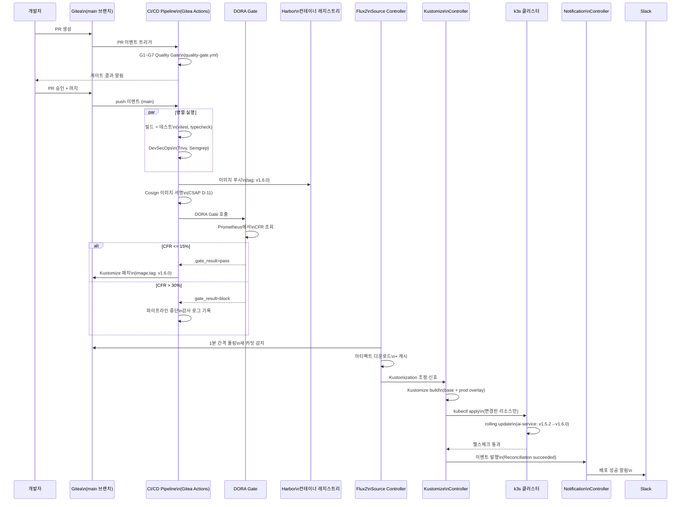

# GitOps Flux 심화 — Flux2 5개 컨트롤러, Kustomize 오버레이, Image Automation, Notification Controller

> 대상: DevOps 엔지니어, CI/CD 담당자, 온보딩 신규 입사자
> 선수 지식: 10-gitops-advanced.md 완료 권장
> 실제 코드: `.gitea/workflows/`, `deploy/`, `helm/`

---

## 목차

1. [GitOps와 Flux2 개요](#1-gitops와-flux2-개요)
2. [Flux2 5개 컨트롤러 아키텍처](#2-flux2-5개-컨트롤러-아키텍처)
3. [GitRepository + Kustomization 완전 가이드](#3-gitrepository--kustomization-완전-가이드)
4. [HelmRelease CRD — values 오버레이, 롤백 정책](#4-helmrelease-crd--values-오버레이-롤백-정책)
5. [Image Automation — 이미지 태그 자동 업데이트](#5-image-automation--이미지-태그-자동-업데이트)
6. [Flux + Gitea Actions 통합 실제 분석](#6-flux--gitea-actions-통합-실제-분석)
7. [Kustomize 오버레이 전략 — dev/stg/prod 환경별 패치](#7-kustomize-오버레이-전략--devstgprod-환경별-패치)
8. [Notification Controller — Slack/Gitea 알림 설정](#8-notification-controller--slackgitea-알림-설정)
9. [GitOps 배포 플로우차트](#9-gitops-배포-플로우차트)
10. [Flux 트러블슈팅 — reconciliation 실패 원인 TOP 10](#10-flux-트러블슈팅--reconciliation-실패-원인-top-10)
11. [실습 미션 3개](#11-실습-미션-3개)

---

## 1. GitOps와 Flux2 개요

GitOps는 Git 저장소를 클러스터의 "단일 진실 소스(Single Source of Truth)"로 사용하는 운영 방법론입니다. 클러스터의 모든 상태(배포 설정, 환경 변수, 인프라 구성)를 Git에 코드로 선언하고, 자동화 도구가 Git과 클러스터 간의 일치를 보장합니다.

### 1.1 GitOps가 필요한 이유

전통적인 `kubectl apply` 방식의 문제점:
- 누가, 언제, 무엇을 배포했는지 추적 불가
- 드리프트(Drift): 누군가 직접 클러스터를 수정하면 Git과 불일치 발생
- 재해 복구 어려움: 클러스터 재구성 시 정확한 상태 불명확
- CSAP D-08 위반: 접근 통제 없는 직접 `kubectl` 실행

Flux2로 GitOps를 구현하면:
- 모든 변경이 Git PR로 리뷰됨 → 감사 추적 자동 확보
- 드리프트 자동 감지 및 수정 (자동 동기화)
- Git 롤백 = 클러스터 롤백 (간단하고 안전)
- CSAP D-08: 클러스터 직접 접근 권한 제거 가능

### 1.2 공공기관 SaaS에서의 GitOps 요구사항

```
CSAP D-08 (접근 통제): 배포 권한은 CI/CD 서비스 계정만 보유
CSAP D-12 (개발 보안): 모든 배포 변경은 코드 리뷰 + 승인 필수
행안부 감리기준: 운영 환경 변경 내역 완전 추적 가능 필요
```

---

## 2. Flux2 5개 컨트롤러 아키텍처

```mermaid
graph TB
    subgraph "Git 저장소 (Gitea)"
        G1[manifests/\nKubernetes YAML]
        G2[helm-releases/\nHelmRelease CRD]
        G3[kustomize/\noverlays/]
        G4[.flux.yaml\n이미지 정책]
    end

    subgraph "Flux2 컨트롤러 (flux-system 네임스페이스)"
        SC[Source Controller\n소스 동기화]
        KC[Kustomize Controller\nKustomization 조정]
        HC[Helm Controller\nHelmRelease 조정]
        IA[Image Automation Controller\n이미지 태그 자동 업데이트]
        IR[Image Reflector Controller\n레지스트리 이미지 스캔]
        NC[Notification Controller\n알림 발송]
    end

    subgraph "컨테이너 레지스트리 (Harbor)"
        REG[이미지 저장소\ntags: v1.2.3, latest]
    end

    subgraph "Kubernetes 클러스터 (k3s)"
        NS1[dev 네임스페이스]
        NS2[stg 네임스페이스]
        NS3[prod 네임스페이스]
    end

    subgraph "알림 대상"
        SL[Slack 채널]
        GI[Gitea 이슈/PR]
    end

    G1 -->|GitRepository CRD| SC
    G2 -->|GitRepository CRD| SC
    G3 -->|GitRepository CRD| SC
    G4 -->|ImageRepository CRD| IR

    SC -->|아티팩트 준비 완료| KC
    SC -->|아티팩트 준비 완료| HC

    KC -->|kubectl apply| NS1
    KC -->|kubectl apply| NS2
    KC -->|kubectl apply| NS3

    HC -->|Helm install/upgrade| NS1
    HC -->|Helm install/upgrade| NS2
    HC -->|Helm install/upgrade| NS3

    REG -->|이미지 태그 스캔| IR
    IR -->|새 태그 발견| IA
    IA -->|Git 커밋 (태그 업데이트)| G1

    KC -->|이벤트 발생| NC
    HC -->|이벤트 발생| NC
    NC -->|알림 발송| SL
    NC -->|알림 발송| GI
```

### 2.1 각 컨트롤러 역할 상세

| 컨트롤러 | 역할 | CRD | 감시 주기 |
|---------|------|-----|---------|
| Source Controller | Git/Helm/OCI 저장소에서 아티팩트 동기화 | GitRepository, HelmRepository, OCIRepository | 1~5분 |
| Kustomize Controller | Kustomization 선언을 클러스터에 적용 | Kustomization | 10분 |
| Helm Controller | HelmRelease를 Helm 차트로 배포 | HelmRelease | 10분 |
| Image Reflector Controller | 컨테이너 레지스트리의 새 이미지 태그 탐지 | ImageRepository, ImagePolicy | 1~5분 |
| Image Automation Controller | 새 이미지 발견 시 Git에 자동 커밋 | ImageUpdateAutomation | 1분 |
| Notification Controller | 클러스터 이벤트를 외부에 알림 발송 | Alert, Provider, Receiver | 즉시 |

### 2.2 컨트롤러 간 의존 관계

```
Source Controller가 아티팩트를 준비해야
→ Kustomize Controller 또는 Helm Controller가 적용 가능

Image Reflector Controller가 새 태그를 발견해야
→ Image Automation Controller가 Git에 커밋 가능

Kustomize/Helm Controller가 이벤트를 발행해야
→ Notification Controller가 알림 발송 가능
```

---

## 3. GitRepository + Kustomization 완전 가이드

### 3.1 GitRepository CRD

GitRepository는 Flux가 어떤 Git 저장소를, 어떤 브랜치/태그를, 얼마나 자주 동기화할지 선언합니다.

```yaml
# flux-system/gitrepository-prod.yaml
apiVersion: source.toolkit.fluxcd.io/v1
kind: GitRepository
metadata:
  name: public-saas-platform
  namespace: flux-system
  labels:
    environment: production
    csap-ref: D-08  # 접근 통제: Source 신뢰 소스 명시
spec:
  interval: 1m        # 1분마다 Git 폴링 (새 커밋 감지)
  url: https://gitea.agency.go.kr/platform/ai-saas.git
  ref:
    branch: main       # main 브랜치 추적 (production)
  secretRef:
    name: gitea-credentials  # CSAP D-09: 암호화된 자격증명
  # 특정 디렉토리만 감시 (불필요한 재조정 방지)
  ignore: |
    # docs/ 디렉토리 변경은 배포 트리거 안 함
    /docs/
    /tests/
    *.md
    *.txt
```

**비밀 참조 설정 (CSAP D-09: 암호화):**

```bash
# Gitea 자격증명을 Kubernetes Secret으로 생성
kubectl create secret generic gitea-credentials \
  --namespace flux-system \
  --from-literal=username=flux-deploy \
  --from-literal=password="${GITEA_DEPLOY_TOKEN}" \
  --dry-run=client -o yaml | \
  kubeseal --format yaml > gitea-credentials-sealed.yaml
# SealedSecret 사용 — 평문 Secret을 Git에 커밋하지 않음
```

### 3.2 Kustomization CRD

Kustomization은 GitRepository에서 가져온 매니페스트를 어떻게 적용할지 선언합니다.

```yaml
# flux-system/kustomization-prod.yaml
apiVersion: kustomize.toolkit.fluxcd.io/v1
kind: Kustomization
metadata:
  name: public-saas-production
  namespace: flux-system
spec:
  interval: 10m        # 10분마다 조정 (드리프트 감지 및 수정)
  sourceRef:
    kind: GitRepository
    name: public-saas-platform
  path: ./kustomize/overlays/prod   # 프로덕션 오버레이 경로
  prune: true                        # Git에 없는 리소스는 클러스터에서 삭제
  wait: true                         # 모든 리소스가 Ready 될 때까지 대기
  timeout: 5m
  healthChecks:                      # 배포 성공 기준 정의
    - apiVersion: apps/v1
      kind: Deployment
      name: ai-service
      namespace: production
    - apiVersion: apps/v1
      kind: Deployment
      name: api-gateway
      namespace: production
  retryInterval: 2m                  # 실패 시 2분 후 재시도
  # 의존성: 인프라가 먼저 적용된 후 앱 적용
  dependsOn:
    - name: public-saas-infrastructure
  # 포스트빌드 변수 치환
  postBuild:
    substitute:
      APP_VERSION: "${APP_VERSION}"
      ENVIRONMENT: "production"
    substituteFrom:
      - kind: ConfigMap
        name: flux-env-config
      - kind: Secret
        name: flux-secrets
        optional: true
```

### 3.3 Kustomization 동기화 상태 확인

```bash
# 모든 Kustomization 상태 확인
flux get kustomizations --all-namespaces

# 출력 예시:
# NAMESPACE     NAME                      READY  MESSAGE
# flux-system   public-saas-production    True   Applied revision: main@sha1:abc1234
# flux-system   public-saas-staging       True   Applied revision: stg@sha1:def5678
# flux-system   public-saas-infra         True   Applied revision: main@sha1:abc1234

# 특정 Kustomization 수동 조정 (기다리지 않고 즉시 실행)
flux reconcile kustomization public-saas-production --with-source

# 조정 로그 확인
flux logs --kind=Kustomization --name=public-saas-production
```

### 3.4 Kustomization 일시 중지/재개

```bash
# 프로덕션 배포 일시 중지 (에러버짓 소진으로 배포 동결 시)
flux suspend kustomization public-saas-production

# 재개 (에러버짓 회복 후)
flux resume kustomization public-saas-production
```

이 기능은 앞서 설명한 에러버짓 정책의 배포 동결과 통합할 수 있습니다. `ErrorBudgetPolicyEngine.isDeployFrozen()`이 true를 반환하면 Flux Kustomization을 자동으로 일시 중지합니다.

---

## 4. HelmRelease CRD — values 오버레이, 롤백 정책

HelmRelease는 Helm 차트를 선언적으로 배포하고 업그레이드를 관리합니다.

### 4.1 기본 HelmRelease 구조

```yaml
# helm-releases/ai-service-prod.yaml
apiVersion: helm.toolkit.fluxcd.io/v2
kind: HelmRelease
metadata:
  name: ai-service
  namespace: production
  annotations:
    csap.go.kr/ref: "D-08,D-12"  # CSAP 통제항목 참조
spec:
  interval: 10m
  chart:
    spec:
      chart: ai-service           # Helm 차트 이름
      version: ">=1.0.0 <2.0.0"  # 버전 범위 (Semver)
      sourceRef:
        kind: HelmRepository
        name: public-saas-charts
        namespace: flux-system
      interval: 5m                # 차트 업데이트 폴링 주기
  # ── values 오버레이 ──────────────────────────────────────────────────────
  values:
    # 기본 values 오버레이 (HelmRelease에 직접 인라인)
    replicaCount: 3
    image:
      repository: harbor.agency.go.kr/public-saas/ai-service
      tag: v1.5.2                  # Image Automation이 자동 업데이트
    resources:
      requests:
        cpu: "200m"
        memory: "512Mi"
      limits:
        cpu: "1000m"
        memory: "2Gi"
    autoscaling:
      enabled: true
      minReplicas: 3
      maxReplicas: 10
      targetCPUUtilizationPercentage: 70
  # ── 외부 values 파일 참조 ────────────────────────────────────────────────
  valuesFrom:
    - kind: ConfigMap
      name: ai-service-config
      valuesKey: values.yaml      # ConfigMap의 키 이름
    - kind: Secret
      name: ai-service-secrets
      valuesKey: secret-values.yaml
      optional: true

  # ── 설치 정책 ────────────────────────────────────────────────────────────
  install:
    remediation:
      retries: 3               # 설치 실패 시 3회 재시도
  # ── 업그레이드 정책 ──────────────────────────────────────────────────────
  upgrade:
    remediation:
      retries: 3               # 업그레이드 실패 시 3회 재시도
      remediateLastFailure: true  # 마지막 실패도 롤백
    cleanupOnFail: true        # 실패 시 부분 적용된 리소스 정리
  # ── 롤백 정책 (핵심) ─────────────────────────────────────────────────────
  rollback:
    timeout: 5m               # 롤백 완료 대기 시간
    cleanupOnFail: true       # 롤백 실패 시 정리
    recreate: false           # Pod 재생성 여부 (stateful 서비스는 true)
  # ── 테스트 ───────────────────────────────────────────────────────────────
  test:
    enable: true              # helm test 자동 실행
    ignoreFailures: false     # 테스트 실패 시 롤백 트리거
```

### 4.2 환경별 values 오버레이 패턴

```yaml
# helm-releases/ai-service-dev.yaml (개발 환경)
spec:
  values:
    replicaCount: 1           # 개발은 1개만
    resources:
      requests:
        cpu: "50m"            # 개발 환경은 리소스 절약
        memory: "128Mi"
    autoscaling:
      enabled: false          # 개발은 HPA 비활성화
    persistence:
      enabled: false          # 개발은 임시 스토리지
    monitoring:
      enabled: false          # 개발은 모니터링 간소화

---
# helm-releases/ai-service-stg.yaml (스테이징 환경)
spec:
  values:
    replicaCount: 2           # 스테이징은 2개 (HA 검증)
    resources:
      requests:
        cpu: "100m"
        memory: "256Mi"
    autoscaling:
      enabled: true
      minReplicas: 2
      maxReplicas: 5

---
# helm-releases/ai-service-prod.yaml (운영 환경)
spec:
  values:
    replicaCount: 3           # 운영은 3개 이상
    resources:
      requests:
        cpu: "200m"
        memory: "512Mi"
    autoscaling:
      enabled: true
      minReplicas: 3
      maxReplicas: 10
```

### 4.3 롤백 자동화 시나리오

```
시나리오: v1.5.2 → v1.6.0 업그레이드 실패

1. Helm Controller가 v1.6.0 업그레이드 시도
2. 헬스체크 실패 (Pod CrashLoopBackOff)
3. upgrade.remediation.retries = 3 → 3회 재시도
4. 3회 모두 실패 → 롤백 트리거
5. v1.5.2 자동 롤백 실행
6. Notification Controller → Slack 알림 발송:
   "HelmRelease ai-service 롤백: v1.6.0 → v1.5.2"
7. 감사 로그 기록 (CSAP D-06)
```

```bash
# 롤백 이력 확인
flux get helmreleases ai-service --namespace production

# HelmRelease 상세 상태 확인
kubectl describe helmrelease ai-service -n production

# 강제 롤백 (수동)
flux suspend helmrelease ai-service -n production
kubectl rollout undo deployment/ai-service -n production
flux resume helmrelease ai-service -n production
```

---

## 5. Image Automation — 이미지 태그 자동 업데이트

Image Automation은 컨테이너 레지스트리(Harbor)에 새 이미지가 푸시되면 Git을 자동으로 업데이트하는 기능입니다.

### 5.1 Image Automation 전체 흐름

```
1. CI/CD 파이프라인 → Harbor에 새 이미지 푸시 (tag: v1.6.0)
2. Image Reflector Controller → Harbor에서 새 태그 발견
3. ImagePolicy → "최신 태그 선택" 정책 평가 (예: semver ^1.x.x)
4. Image Automation Controller → Git 저장소에 자동 커밋:
   변경 내용: image.tag: v1.5.2 → v1.6.0
5. Source Controller → 새 커밋 감지
6. Kustomize/Helm Controller → 자동 배포 실행
```

### 5.2 ImageRepository 설정

```yaml
# flux-system/imagerepository-ai-service.yaml
apiVersion: image.toolkit.fluxcd.io/v1beta2
kind: ImageRepository
metadata:
  name: ai-service
  namespace: flux-system
spec:
  image: harbor.agency.go.kr/public-saas/ai-service
  interval: 1m             # 1분마다 Harbor 폴링
  secretRef:
    name: harbor-credentials   # Harbor 인증 정보
  # 이미지 스캔 제외 패턴
  exclusionList:
    - "^.*-dev$"           # -dev 태그 제외
    - "^.*-dirty$"         # dirty 빌드 태그 제외
    - "^latest$"           # latest 태그 제외 (명시적 버전만 사용)
```

### 5.3 ImagePolicy 설정

```yaml
# flux-system/imagepolicy-ai-service.yaml
apiVersion: image.toolkit.fluxcd.io/v1beta2
kind: ImagePolicy
metadata:
  name: ai-service
  namespace: flux-system
spec:
  imageRepositoryRef:
    name: ai-service         # 위에서 정의한 ImageRepository 참조
  policy:
    semver:
      range: ">=1.0.0 <2.0.0"  # v1.x.x 범위 내 최신 버전 자동 선택
      # range 예시:
      # ">=1.0.0"        — 1.0.0 이상 최신
      # "~1.5.0"         — 1.5.x 패치 버전만 (1.5.0 ~ 1.5.99)
      # "^1.5.0"         — 1.x.x 마이너/패치 (1.5.0 ~ 1.99.99)
      # ">=1.0.0 <2.0.0" — 명시적 범위
```

### 5.4 ImageUpdateAutomation 설정

```yaml
# flux-system/imageupdateautomation-prod.yaml
apiVersion: image.toolkit.fluxcd.io/v1beta2
kind: ImageUpdateAutomation
metadata:
  name: public-saas-prod-automation
  namespace: flux-system
spec:
  interval: 1m
  sourceRef:
    kind: GitRepository
    name: public-saas-platform
  git:
    checkout:
      ref:
        branch: main           # main 브랜치에 직접 커밋
    commit:
      author:
        email: flux@agency.go.kr
        name: "Flux Image Automation"
      messageTemplate: |
        chore(image): 이미지 자동 업데이트 {{ .AutomationObject.Name }}
        
        변경된 이미지:
        {{ range .Updated.Images -}}
        - {{ .Repository }}:{{ .NewTag }} (이전: {{ .OldTag }})
        {{ end -}}
        
        Automated-by: Flux v{{ .FluxVersion }}
        CSAP-ref: D-12 (시스템 개발 보안 — 자동화 배포 감사)
    push:
      branch: main
  update:
    # 이미지 참조 업데이트 전략
    strategy: Setters         # kustomize 이미지 setter 사용
    # 업데이트할 경로 지정
    path: "./kustomize/overlays/prod"
```

### 5.5 매니페스트에 이미지 마커 추가

Image Automation이 자동으로 태그를 업데이트하려면 매니페스트에 마커를 추가합니다:

```yaml
# kustomize/base/deployment-ai-service.yaml
apiVersion: apps/v1
kind: Deployment
metadata:
  name: ai-service
spec:
  template:
    spec:
      containers:
        - name: ai-service
          image: harbor.agency.go.kr/public-saas/ai-service:v1.5.2 # {"$imagepolicy": "flux-system:ai-service"}
          # 위 주석이 마커 — Flux가 이 줄을 찾아 태그를 자동 업데이트
```

`{"$imagepolicy": "flux-system:ai-service"}` 주석을 보면 Flux가 `flux-system` 네임스페이스의 `ai-service` ImagePolicy를 참조하여 태그를 업데이트합니다.

---

## 6. Flux + Gitea Actions 통합 실제 분석

이 프레임워크에서는 `/data/ai-saas/.gitea/workflows/` 아래 Gitea Actions 워크플로우와 Flux2가 협력합니다.

### 6.1 통합 아키텍처

```
개발자 → PR 생성
    → Quality Gate (quality-gate.yml) → G1~G7 검사
    → PR 승인 + 머지 → main 브랜치
    → CI/CD Pipeline (ci-cd-pipeline.yml)
        → 빌드 + 테스트
        → DevSecOps (devsecops.yml): Trivy, Semgrep, 시크릿 스캔
        → Harbor 이미지 푸시 (tag: v1.6.0)
        → DORA Gate (dora-gate.yml): CFR 확인
        → 배포 워크플로우 (deploy.yml): Kustomize 패치 적용
    → Flux2 Image Automation → Git 커밋 (자동)
    → Flux2 Source Controller → 새 커밋 감지
    → Flux2 Kustomize Controller → 클러스터 적용
    → Notification Controller → Slack 알림
    → CSAP 증거 수집 (csap-evidence.yml)
```

### 6.2 dora-gate.yml 상세 분석 (배포 품질 게이트)

`/data/ai-saas/.gitea/workflows/dora-gate.yml`에서 핵심 부분:

```yaml
# 배포 게이트 판정 로직
- name: DORA 게이트 판정
  id: check
  run: |
    CFR="${{ steps.query.outputs.cfr }}"

    # Prometheus에서 조회한 CFR 기준으로 판정
    if [ "${CFR_INT}" -gt 30 ]; then
      # CFR > 30% → DORA Low 등급 → 배포 완전 차단
      echo "result=block" >> $GITHUB_OUTPUT
      echo "::error::DORA 게이트 차단: CFR ${CFR}% > 30%"

      # CSAP D-12 감사 로그 기록
      echo "{
        \"timestamp\":\"$(date -u +%Y-%m-%dT%H:%M:%SZ)\",
        \"actor\":\"dora-gate\",
        \"action\":\"DEPLOY_BLOCKED\",
        \"detail\":\"CFR=${CFR}%\",
        \"csap_ref\":\"D-12\"
      }" >> ".claude/audit.jsonl"

      exit 1  # 파이프라인 즉시 중단

    elif [ "${CFR_INT}" -gt 15 ]; then
      # CFR 15~30% → DORA Medium → 경고만 발생, 배포 계속
      echo "result=warn" >> $GITHUB_OUTPUT

    else
      # CFR <= 15% → DORA High/Elite → 정상 통과
      echo "result=pass" >> $GITHUB_OUTPUT
    fi
```

이 워크플로우의 특징:
1. `workflow_call`로 선언되어 다른 워크플로우에서 재사용 가능
2. Prometheus에서 실시간 CFR 조회 (정적 값이 아닌 동적 평가)
3. 판정 결과를 `outputs`로 내보내 이후 스텝에서 활용 가능
4. 모든 판정 이벤트가 `audit.jsonl`에 기록 (CSAP D-12)

### 6.3 csap-evidence.yml 상세 분석 (증거 자동 수집)

`/data/ai-saas/.gitea/workflows/csap-evidence.yml`:

```yaml
on:
  schedule:
    - cron: '0 0 * * 1'  # 매주 월요일 09:00 KST
  workflow_dispatch:     # 수동 실행도 지원
    inputs:
      controls:
        description: '수집 대상 통제항목 (예: D-06,D-08 또는 all)'
        default: 'all'

jobs:
  collect-evidence:
    steps:
      # 1. CSAP 증거 수집 스크립트 실행
      - name: CSAP 증거 수집 v2 실행
        run: ./scripts/csap-evidence-collect-v2.sh $ARGS

      # 2. SHA-256 무결성 검증 (CSAP D-06: 감사 로그 무결성)
      - name: 증거 무결성 검증
        run: sha256sum -c manifest.sha256

      # 3. 아티팩트 1년 보존 (CSAP D-06 요건)
      - name: 증거 아티팩트 업로드
        uses: actions/upload-artifact@v4
        with:
          retention-days: 365
```

이 워크플로우의 CSAP 대응:
- `retention-days: 365`: CSAP D-06의 감사 로그 1년 보존 요건 충족
- `sha256sum -c`: 증거 무결성 검증 (위변조 방지)
- 수동 트리거: CSAP 감리 시 즉시 증거 생성 가능

### 6.4 ci-cd-pipeline.yml — 7단계 파이프라인

```
[1/7] Build & Test — pnpm install, typecheck, lint, vitest
      ↓ (병렬)
[2/7] Security Scan — DevSecOps: Trivy, Semgrep, 시크릿 스캔
      ↓
[3/7] Container Build — Docker buildx, Harbor 푸시
      ↓
[4/7] Image Sign — Cosign으로 이미지 서명 (CSAP D-11)
      ↓
[5/7] SBOM + Grype — SBOM 생성, 취약점 스캔
      ↓
[6/7] Deploy — DORA Gate → k3s 배포
      ↓
[7/7] Audit — 감사 로그 기록, CSAP 증거 수집
```

---

## 7. Kustomize 오버레이 전략 — dev/stg/prod 환경별 패치

### 7.1 Kustomize 디렉토리 구조

```
kustomize/
├── base/                          # 기본 매니페스트 (환경 무관)
│   ├── kustomization.yaml
│   ├── deployment-ai-service.yaml
│   ├── deployment-api-gateway.yaml
│   ├── service-ai-service.yaml
│   └── configmap-base.yaml
│
└── overlays/                      # 환경별 오버레이
    ├── dev/                       # 개발 환경
    │   ├── kustomization.yaml
    │   ├── replica-patch.yaml     # 1개로 줄임
    │   ├── resource-patch.yaml    # 리소스 요청 최소화
    │   └── env-patch.yaml         # DEV 환경변수
    │
    ├── stg/                       # 스테이징 환경
    │   ├── kustomization.yaml
    │   ├── replica-patch.yaml     # 2개
    │   ├── resource-patch.yaml    # 중간 사양
    │   └── env-patch.yaml         # STG 환경변수
    │
    └── prod/                      # 운영 환경
        ├── kustomization.yaml
        ├── replica-patch.yaml     # 3개 이상
        ├── resource-patch.yaml    # 운영 사양
        ├── hpa-patch.yaml         # HPA 활성화
        ├── pdb-patch.yaml         # PodDisruptionBudget
        └── env-patch.yaml         # PROD 환경변수
```

### 7.2 base/kustomization.yaml

```yaml
# kustomize/base/kustomization.yaml
apiVersion: kustomize.config.k8s.io/v1beta1
kind: Kustomization

resources:
  - deployment-ai-service.yaml
  - deployment-api-gateway.yaml
  - service-ai-service.yaml
  - service-api-gateway.yaml
  - configmap-base.yaml

# 공통 레이블
commonLabels:
  app.kubernetes.io/managed-by: flux
  app.kubernetes.io/part-of: public-saas-platform
  csap.go.kr/managed: "true"

# 공통 어노테이션
commonAnnotations:
  csap.go.kr/last-updated: "2026-04-13"
```

### 7.3 overlays/prod/kustomization.yaml

```yaml
# kustomize/overlays/prod/kustomization.yaml
apiVersion: kustomize.config.k8s.io/v1beta1
kind: Kustomization

bases:
  - ../../base          # 기본 리소스 상속

resources:
  - hpa-ai-service.yaml      # 운영 전용 HPA
  - pdb-ai-service.yaml      # 운영 전용 PDB
  - networkpolicy-prod.yaml  # 운영 전용 네트워크 정책

patches:
  # 레플리카 수 패치
  - path: replica-patch.yaml
    target:
      kind: Deployment
      name: ai-service

  # 리소스 요청/제한 패치
  - path: resource-patch.yaml
    target:
      kind: Deployment
      name: ai-service

  # 환경변수 패치
  - path: env-patch.yaml
    target:
      kind: Deployment

images:
  # Image Automation이 자동으로 이 값을 업데이트
  - name: harbor.agency.go.kr/public-saas/ai-service
    newTag: v1.5.2  # {"$imagepolicy": "flux-system:ai-service"}

namePrefix: prod-         # 운영 환경 리소스는 'prod-' 접두사 자동 추가
namespace: production     # 네임스페이스 자동 설정
```

### 7.4 패치 파일 예제

```yaml
# kustomize/overlays/prod/replica-patch.yaml
apiVersion: apps/v1
kind: Deployment
metadata:
  name: ai-service
spec:
  replicas: 3   # 운영은 3개

---
# kustomize/overlays/dev/replica-patch.yaml
apiVersion: apps/v1
kind: Deployment
metadata:
  name: ai-service
spec:
  replicas: 1   # 개발은 1개
```

```yaml
# kustomize/overlays/prod/env-patch.yaml
apiVersion: apps/v1
kind: Deployment
metadata:
  name: ai-service
spec:
  template:
    spec:
      containers:
        - name: ai-service
          env:
            - name: NODE_ENV
              value: production
            - name: LOG_LEVEL
              value: warn              # 운영은 warn 이상
            - name: DATABASE_URL
              valueFrom:
                secretKeyRef:
                  name: prod-db-secret
                  key: database-url    # CSAP D-09: 환경변수로 시크릿 관리
```

### 7.5 dev → stg → prod 환경 승격 플로우

```
feature 브랜치 → dev 환경 자동 배포 (Flux: dev overlay)
    ↓ (검증 완료)
PR 생성 → stg 브랜치 머지 → stg 환경 자동 배포 (Flux: stg overlay)
    ↓ (스테이징 검증 완료, SLO 확인)
PR 생성 → main 브랜치 머지 → prod 환경 자동 배포 (Flux: prod overlay)
```

각 환경에 별도의 GitRepository + Kustomization이 존재하며, 브랜치를 추적합니다:
- dev: `dev` 브랜치 추적
- stg: `stg` 브랜치 추적
- prod: `main` 브랜치 추적

---

## 8. Notification Controller — Slack/Gitea 알림 설정

### 8.1 Provider 설정 (알림 대상 정의)

```yaml
# flux-system/provider-slack.yaml
apiVersion: notification.toolkit.fluxcd.io/v1beta3
kind: Provider
metadata:
  name: slack-ops-alerts
  namespace: flux-system
spec:
  type: slack
  channel: ops-alerts          # 슬랙 채널 이름
  secretRef:
    name: slack-webhook-secret  # Webhook URL을 Secret으로 관리
    # CSAP D-09: 슬랙 Webhook URL 암호화 저장

---
# flux-system/provider-gitea.yaml
apiVersion: notification.toolkit.fluxcd.io/v1beta3
kind: Provider
metadata:
  name: gitea-commit-status
  namespace: flux-system
spec:
  type: gitea
  address: https://gitea.agency.go.kr
  secretRef:
    name: gitea-token-secret   # Gitea API 토큰
```

### 8.2 Alert 설정 (어떤 이벤트를 어디에 알릴지)

```yaml
# flux-system/alert-production.yaml
apiVersion: notification.toolkit.fluxcd.io/v1beta3
kind: Alert
metadata:
  name: production-events
  namespace: flux-system
spec:
  summary: "운영 환경 배포 이벤트"
  providerRef:
    name: slack-ops-alerts      # 위에서 정의한 Provider 참조
  eventSeverity: info           # info, warning, error
  eventSources:
    # 운영 환경의 모든 Kustomization 이벤트
    - kind: Kustomization
      namespace: flux-system
      name: public-saas-production
    # 운영 환경의 모든 HelmRelease 이벤트
    - kind: HelmRelease
      namespace: production
      name: "*"                 # 와일드카드: 모든 HelmRelease
  exclusionList:
    # 매분 발생하는 정상 조정 이벤트는 제외 (노이즈 방지)
    - ".*flux reconciliation.*"
    - ".*health checks passed.*"

---
# flux-system/alert-failures.yaml (실패 알림 — 더 광범위)
apiVersion: notification.toolkit.fluxcd.io/v1beta3
kind: Alert
metadata:
  name: all-failures
  namespace: flux-system
spec:
  summary: "Flux 배포 실패 알림"
  providerRef:
    name: slack-ops-alerts
  eventSeverity: error          # error 이상만
  eventSources:
    - kind: Kustomization
      namespace: flux-system
      name: "*"                 # 모든 환경
    - kind: HelmRelease
      namespace: "*"
      name: "*"
```

### 8.3 실제 Slack 알림 메시지 형식

```
[Flux] Kustomization/public-saas-production - Reconciliation succeeded

Source: main@sha1:abc1234def5678
Environment: production
Applied: 3 objects
Changed: deployment/ai-service, service/ai-service
Duration: 45s

---
[Flux] HelmRelease/ai-service - Upgrade failed, rolled back

Previous: v1.5.2
Attempted: v1.6.0
Reason: pod "ai-service-xxx" failed health check after 3 attempts
Action: Rolled back to v1.5.2

담당자: @ops-oncall
```

---

## 9. GitOps 배포 플로우차트



---

## 10. Flux 트러블슈팅 — reconciliation 실패 원인 TOP 10

### 원인 1: Git 인증 실패

**증상:** `failed to checkout and determine revision`

```bash
# 진단
flux get gitrepositories --all-namespaces
# Status: "failed to checkout: authentication required"

# 해결
kubectl get secret gitea-credentials -n flux-system -o yaml
# 시크릿 만료 여부 확인

# 토큰 재생성 후 업데이트
kubectl create secret generic gitea-credentials \
  --namespace flux-system \
  --from-literal=username=flux-deploy \
  --from-literal=password="${NEW_TOKEN}" \
  --dry-run=client -o yaml | kubectl apply -f -

# 수동 재조정
flux reconcile source git public-saas-platform
```

### 원인 2: 이미지 Pull 실패

**증상:** `pod "ai-service-xxx" is in ImagePullBackOff`

```bash
# 진단
kubectl describe pod -n production -l app=ai-service | grep -A 10 Events

# Harbor 자격증명 확인
kubectl get secret harbor-credentials -n production -o jsonpath='{.data.\.dockerconfigjson}' \
  | base64 -d | jq .

# 자격증명 갱신
kubectl create secret docker-registry harbor-credentials \
  --docker-server=harbor.agency.go.kr \
  --docker-username=robot\$flux \
  --docker-password="${HARBOR_ROBOT_TOKEN}" \
  --namespace production \
  --dry-run=client -o yaml | kubectl apply -f -
```

### 원인 3: Kustomization 유효성 검사 실패

**증상:** `validation failed: [...] is invalid`

```bash
# 로컬에서 Kustomize 빌드 테스트
kustomize build kustomize/overlays/prod | kubectl apply --dry-run=client -f -

# Flux 로그 확인
flux logs --kind=Kustomization --name=public-saas-production --level=error

# 특정 YAML 문법 오류 찾기
kubectl apply --dry-run=client -f kustomize/overlays/prod/
```

### 원인 4: HelmRelease values 충돌

**증상:** `chart reconciliation failed: values schema validation`

```bash
# HelmRelease 상태 확인
flux get helmreleases -n production

# 상세 오류 확인
kubectl describe helmrelease ai-service -n production \
  | grep -A 20 "Helm Upgrade Failed"

# values 유효성 검증
helm lint helm/ai-service/ -f kustomize/overlays/prod/values.yaml

# 문제 있는 values 확인
kubectl get helmrelease ai-service -n production \
  -o jsonpath='{.spec.values}' | jq .
```

### 원인 5: 리소스 쿼터 초과

**증상:** `exceeded quota: ...`

```bash
# 네임스페이스 쿼터 확인
kubectl describe resourcequota -n production

# 현재 리소스 사용량
kubectl top pods -n production

# Kustomization 일시 중지 후 리소스 정리
flux suspend kustomization public-saas-production
kubectl delete pod -n production -l old-version=true
flux resume kustomization public-saas-production
```

### 원인 6: CRD 미설치

**증상:** `no matches for kind "HelmRelease" in version "helm.toolkit.fluxcd.io/v2"`

```bash
# CRD 설치 확인
kubectl get crd | grep flux

# Flux 재설치 (CRD 포함)
flux install --components-extra=image-reflector-controller,image-automation-controller

# 특정 CRD만 재설치
kubectl apply -f https://github.com/fluxcd/flux2/releases/latest/download/install.yaml
```

### 원인 7: 네트워크 정책으로 차단

**증상:** `connection refused` 또는 타임아웃

```bash
# Flux 컨트롤러의 네트워크 정책 확인
kubectl get networkpolicy -n flux-system

# DNS 해석 확인
kubectl exec -n flux-system deploy/source-controller \
  -- nslookup gitea.agency.go.kr

# 임시 네트워크 정책 완화 (테스트용)
kubectl patch networkpolicy flux-system-allow-egress -n flux-system \
  --type=json -p='[{"op":"add","path":"/spec/egress/-","value":{"ports":[{"port":443}]}}]'
```

### 원인 8: RBAC 권한 부족

**증상:** `User "system:serviceaccount:flux-system:kustomize-controller" cannot create resource`

```bash
# Flux 서비스 계정 권한 확인
kubectl auth can-i create deployments \
  --as=system:serviceaccount:flux-system:kustomize-controller \
  -n production

# Flux 권한 재설정
flux install --export | kubectl apply -f -

# 추가 ClusterRole 설정
kubectl create clusterrolebinding flux-production-admin \
  --clusterrole=cluster-admin \
  --serviceaccount=flux-system:kustomize-controller
# 주의: 최소 권한 원칙 — 필요한 권한만 부여
```

### 원인 9: 의존성 순서 문제 (dependsOn 실패)

**증상:** `dependency not ready`

```bash
# 의존성 상태 확인
flux get kustomizations --all-namespaces

# 의존하는 Kustomization이 Ready인지 확인
flux get kustomization public-saas-infrastructure

# 의존성 우회 (긴급 상황)
kubectl patch kustomization public-saas-production \
  -n flux-system \
  --type=json \
  -p='[{"op":"remove","path":"/spec/dependsOn"}]'
# 주의: 정상화 후 dependsOn 재설정 필수
```

### 원인 10: Image Policy 태그 없음

**증상:** `no semver tags found`

```bash
# ImageRepository 상태 확인
flux get imagerepositories -n flux-system

# Harbor에 실제 태그 있는지 확인
curl -u "robot\$flux:${TOKEN}" \
  "https://harbor.agency.go.kr/api/v2.0/projects/public-saas/repositories/ai-service/artifacts" \
  | jq '.[].tags[].name'

# ImagePolicy 재조정
flux reconcile image repository ai-service

# 태그 패턴 확인 (정규식 오류 가능)
kubectl get imagepolicy ai-service -n flux-system -o yaml
```

---

## 11. 실습 미션 3개

### 미션 1: Flux 상태 전체 점검

로컬 k3s 클러스터에서 다음 명령을 순서대로 실행하고 결과를 분석하십시오.

```bash
# 1. Flux 전체 상태 요약
flux check

# 2. 모든 소스 상태 확인
flux get sources all --all-namespaces

# 3. 모든 배포 상태 확인
flux get all --all-namespaces

# 4. 최근 이벤트 로그 확인 (실패한 것만)
flux events --for Kustomization --all-namespaces

# 5. 이미지 자동화 상태 확인
flux get images all --all-namespaces

# 점검 체크리스트:
# - GitRepository가 모두 Ready 상태인가?
# - Kustomization이 모두 최신 revision을 적용했는가?
# - 실패한 HelmRelease가 있는가?
# - ImagePolicy가 올바른 태그를 선택하고 있는가?
```

### 미션 2: dev → stg 환경 승격 실습

```bash
# 1. dev 브랜치에서 feature 브랜치 생성
git checkout dev
git checkout -b feat/test-gitops-promotion

# 2. 작은 변경 (예: ConfigMap 레이블 추가)
cat >> kustomize/overlays/dev/configmap-patch.yaml << 'EOF'
apiVersion: v1
kind: ConfigMap
metadata:
  name: ai-service-config
  labels:
    test-promotion: "true"     # 추적용 레이블
EOF

# 3. Kustomize 빌드 로컬 테스트
kustomize build kustomize/overlays/dev/

# 4. 커밋 + 푸시
git add kustomize/
git commit -m "test(gitops): dev 환경 승격 테스트 레이블 추가"
git push origin feat/test-gitops-promotion

# 5. dev → feat PR 생성
# (Gitea UI에서 PR 생성)

# 6. 머지 후 Flux 조정 확인
flux get kustomizations --watch
# NAMESPACE    NAME       READY  MESSAGE
# flux-system  dev-app    True   Applied revision: dev@sha1:abc1234

# 7. 실제 클러스터에 적용되었는지 확인
kubectl get configmap ai-service-config -n development -o yaml \
  | grep test-promotion

# 8. stg PR 생성 및 동일 프로세스 반복
```

### 미션 3: 배포 실패 시뮬레이션 및 롤백

```bash
# 1. 의도적으로 잘못된 이미지 태그로 HelmRelease 수정
kubectl patch helmrelease ai-service -n staging \
  --type=merge \
  -p '{"spec":{"values":{"image":{"tag":"v99.99.99-nonexistent"}}}}'

# 2. Flux가 실패를 감지하는지 관찰
flux get helmrelease ai-service -n staging --watch
# 출력 예시:
# NAME        READY  MESSAGE
# ai-service  False  ImagePullBackOff: ai-service:v99.99.99-nonexistent

# 3. 슬랙 알림 확인 (Notification Controller 작동 여부)
# #ops-alerts 채널에 실패 알림 메시지 도착 여부

# 4. 롤백 수동 실행
flux suspend helmrelease ai-service -n staging

# 이전 버전으로 복원
kubectl rollout undo deployment/ai-service -n staging

# 5. 정상 태그로 HelmRelease 수정
kubectl patch helmrelease ai-service -n staging \
  --type=merge \
  -p '{"spec":{"values":{"image":{"tag":"v1.5.2"}}}}'

# 6. Flux 재개
flux resume helmrelease ai-service -n staging

# 7. 정상 조정 확인
flux get helmrelease ai-service -n staging
# NAME        READY  MESSAGE
# ai-service  True   Release reconciliation succeeded

# 8. 감사 로그에 롤백 이벤트 기록 확인
tail -20 .claude/audit.jsonl | jq 'select(.action | contains("ROLLBACK"))'
```

---

## 요약

이 문서에서 다룬 핵심 내용:

1. **GitOps 원칙**: Git이 단일 진실 소스, Flux가 자동 동기화
2. **Source Controller**: GitRepository CRD로 1분 간격 Git 폴링
3. **Kustomize Controller**: Kustomization CRD로 매니페스트 적용, prune으로 드리프트 자동 제거
4. **Helm Controller**: HelmRelease CRD로 Helm 배포 + 자동 롤백 (3회 재시도)
5. **Image Automation**: Harbor 새 태그 발견 → Git 자동 커밋 → Flux 자동 배포
6. **Gitea Actions 통합**: ci-cd-pipeline → dora-gate → Flux Image Automation → 클러스터 적용
7. **Kustomize 오버레이**: base + dev/stg/prod 환경별 패치로 DRY 원칙 유지
8. **Notification Controller**: Provider(Slack/Gitea) + Alert(이벤트 필터링) 조합
9. **배포 게이트**: DORA Gate(CFR 확인) + 에러버짓 동결 상태 이중 확인
10. **CSAP 연동**: D-08(접근 통제), D-09(암호화), D-11(이미지 서명), D-12(개발 보안)

---

*관련 문서: 10-gitops-advanced.md, 12-deployment-strategies-advanced.md, 14-pipeline-security-deep-dive.md*
*실제 코드: `.gitea/workflows/dora-gate.yml`, `.gitea/workflows/csap-evidence.yml`, `.gitea/workflows/ci-cd-pipeline.yml`*
*CSAP 통제항목: D-08 (접근 통제), D-09 (암호화), D-11 (이미지 서명), D-12 (시스템 개발 보안)*
