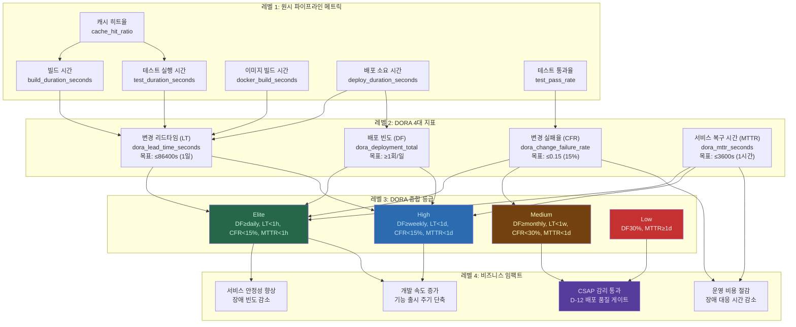
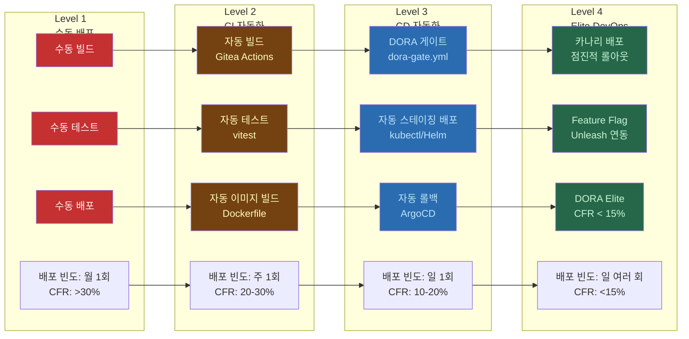

# CI/CD 메트릭과 최적화 — 파이프라인 성능 측정, DORA 지표 개선, 빌드 최적화

> Design Ref: docs/02-design/mtus/MTU-N251-dora-four-keys
> Plan SC: FR-DORA.1 ~ FR-DORA.8, FR-N251.1 ~ FR-N251.9
> CSAP 통제: D-12 (시스템 개발 보안 — 배포 품질 게이트)
> 대상 독자: DevOps 엔지니어, 개발팀 리더, CI/CD 담당자
> 난이도: 중급 (기본 CI/CD 파이프라인 운영 경험 전제)

---

## 목차

1. [DORA 메트릭 개요 — 왜 측정하는가](#1-dora-메트릭-개요--왜-측정하는가)
2. [CI/CD 메트릭 계층 다이어그램](#2-cicd-메트릭-계층-다이어그램)
3. [dora-exporter 실제 코드 완전 분석](#3-dora-exporter-실제-코드-완전-분석)
4. [dora-gate.yml 분석 — CFR 임계값 판정 로직](#4-dora-gateyml-분석--cfr-임계값-판정-로직)
5. [csap-evidence.yml 분석 — 최적화 관점](#5-csap-evidenceyml-분석--최적화-관점)
6. [DORA 4개 지표 개선 전략](#6-dora-4개-지표-개선-전략)
7. [빌드 시간 최적화](#7-빌드-시간-최적화)
8. [테스트 병렬화](#8-테스트-병렬화)
9. [파이프라인 비용 최적화](#9-파이프라인-비용-최적화)
10. [CI 실패율 분석 및 개선](#10-ci-실패율-분석-및-개선)
11. [CI/CD 성숙도 로드맵](#11-cicd-성숙도-로드맵)
12. [파이프라인 Grafana 대시보드 구성](#12-파이프라인-grafana-대시보드-구성)

---

## 1. DORA 메트릭 개요 — 왜 측정하는가

### 1.1 DevOps Research and Assessment(DORA)란

DORA는 Google이 후원하는 연구 프로그램으로, 소프트웨어 전달 성과와 조직 성과 사이의 관계를 6년 이상 연구한 결과물입니다. 2019년 "Accelerate" 책으로 유명해진 이 연구는 4개의 핵심 메트릭이 조직의 기술 역량과 비즈니스 성과를 예측하는 가장 강력한 지표임을 밝혔습니다.

공공기관 SaaS 프레임워크에서 DORA 메트릭을 도입하는 이유는 다음과 같습니다.

**감리 대응**: CSAP D-12(시스템 개발 보안) 항목에서 "배포 품질 게이트" 요건을 충족하기 위해서는 객관적인 메트릭 기반 판단 근거가 필요합니다. DORA 메트릭은 이 근거를 자동으로 생성합니다.

**위험 관리**: 변경 실패율(CFR)이 30%를 넘으면 배포를 자동 차단하는 `dora-gate.yml`은 불안정한 변경이 프로덕션에 배포되는 것을 방지합니다.

**팀 역량 평가**: "배포 빈도"가 월 1회인 팀과 일 1회인 팀은 근본적으로 다른 개발 문화를 가지고 있습니다. DORA 지표는 이 차이를 정량화합니다.

### 1.2 DORA 4대 지표 정의

| 지표 | 정의 | Elite 기준 | 현재 목표 |
|------|------|------------|-----------|
| 배포 빈도(DF) | 코드가 프로덕션에 배포되는 빈도 | 하루 여러 번 | 주 2회 → 일 1회 |
| 변경 리드타임(LT) | 첫 커밋 → 프로덕션 배포까지 시간 | 1시간 미만 | 3일 → 1일 |
| 변경 실패율(CFR) | 프로덕션 장애를 일으킨 배포 비율 | 0~15% | 30% → 15% 이하 |
| 서비스 복구 시간(MTTR) | 장애 발생 → 복구 완료까지 시간 | 1시간 미만 | 4시간 → 1시간 |

---

## 2. CI/CD 메트릭 계층 다이어그램

이 다이어그램은 빌드 시간에서 시작하여 DORA 지표를 거쳐 최종적으로 비즈니스 가치로 이어지는 메트릭 계층을 보여줍니다.



### 2.1 메트릭 계층의 의미

**레벨 1(원시 메트릭)**은 CI/CD 파이프라인의 각 단계에서 직접 측정하는 기초 데이터입니다. Gitea Actions 로그, Docker 빌드 출력, 테스트 결과 파일에서 수집합니다.

**레벨 2(DORA 지표)**는 레벨 1 데이터를 조합하여 계산하는 복합 지표입니다. `dora-exporter`가 이 계산을 담당합니다.

**레벨 3(DORA 등급)**은 4개 지표의 조합으로 팀의 전체 DevOps 성숙도를 하나의 등급으로 표현합니다.

**레벨 4(비즈니스 임팩트)**는 DORA 등급 개선이 실제 비즈니스 가치로 어떻게 연결되는지 보여줍니다.

---

## 3. dora-exporter 실제 코드 완전 분석

### 3.1 파일 개요

`/data/ai-saas/packages/dora-exporter/src/index.ts`는 DORA 4대 지표를 Prometheus 메트릭으로 노출하는 익스포터 서비스입니다. 397줄의 TypeScript 코드로 구성됩니다.

**의존성 구조**

```
index.ts
├── classifier.ts       — DORA 등급 분류 로직
├── lead-time.ts        — 리드타임 계산
├── change-failure.ts   — 변경 실패 탐지
├── mttr-tracker.ts     — 복구 시간 추적
├── trend-analyzer.ts   — 추세 분석
├── report-generator.ts — 보고서 생성
└── event-queue.ts      — 이벤트 배치 처리
```

### 3.2 Prometheus 메트릭 정의 분석

#### 배포 빈도 카운터 (FR-DORA.1)

```typescript
const deploymentTotal = new Counter({
  name: 'dora_deployment_total',
  help: '배포 횟수 (DORA Deployment Frequency)',
  labelNames: ['team', 'service', 'environment'] as const,
  registers: [register],
});
```

`Counter` 타입은 절대 감소하지 않는 값에 사용합니다. 배포 횟수는 한 번 발생하면 취소되지 않으므로 Counter가 적합합니다.

`labelNames`의 세 가지 레이블은 다음을 의미합니다.

- `team`: 배포를 수행하는 팀 (예: `platform`, `ai-team`, `backend`). Gitea 저장소 이름의 첫 번째 세그먼트에서 추출합니다.
- `service`: 배포되는 서비스 이름 (예: `ai-service`, `compliance-service`). 저장소 이름의 두 번째 세그먼트입니다.
- `environment`: 배포 대상 환경 (예: `production`, `staging`, `development`). Git 브랜치 이름에서 추출합니다.

Prometheus에서 이 레이블들을 사용하면 "팀별 배포 빈도", "서비스별 배포 빈도", "환경별 배포 빈도"를 독립적으로 분석할 수 있습니다.

#### 변경 리드타임 히스토그램 (FR-DORA.2) — 버킷 설계 이유

```typescript
const leadTimeSeconds = new Histogram({
  name: 'dora_lead_time_seconds',
  help: '변경 리드타임 - 첫 커밋에서 프로덕션 배포까지 (초)',
  labelNames: ['team', 'service'] as const,
  buckets: [60, 300, 900, 1800, 3600, 7200, 14400, 28800, 86400, 604800],
  registers: [register],
});
```

히스토그램은 연속적인 숫자 값의 분포를 측정할 때 사용합니다. 리드타임은 "평균"만으로는 충분하지 않고, 분포를 알아야 합니다. 평균이 2시간이라도 일부 배포가 1주일이 걸린다면 문제가 있는 것입니다.

버킷 설계의 이유를 각 값으로 설명합니다.

| 버킷 값 | 시간 | 의미 |
|---------|------|------|
| 60 | 1분 | 극히 빠른 핫픽스 배포 |
| 300 | 5분 | CI/CD 파이프라인 최소 실행 시간 |
| 900 | 15분 | 빠른 기능 배포 (Elite 수준) |
| 1800 | 30분 | 일반적인 빠른 배포 |
| 3600 | 1시간 | DORA Elite 리드타임 기준 |
| 7200 | 2시간 | DORA High 리드타임 |
| 14400 | 4시간 | 반일 배포 주기 |
| 28800 | 8시간 | 1일 배포 주기 (업무 시간) |
| 86400 | 1일 | DORA Medium/High 경계 |
| 604800 | 1주일 | DORA Medium 리드타임 기준 |

이 버킷 범위를 사용하면 `histogram_quantile(0.95, ...)` PromQL로 "95번째 백분위수 리드타임"을 정확하게 계산할 수 있습니다.

버킷 설계 시 중요한 원칙: 버킷 경계값이 SLO(서비스 수준 목표) 기준값과 일치해야 정확한 백분위수 계산이 가능합니다. 예를 들어 "리드타임 1일 이하를 90% 달성"이라는 SLO가 있다면 `86400` 버킷이 반드시 있어야 합니다.

#### 변경 실패율 게이지 (FR-DORA.3)

```typescript
const changeFailureRate = new Gauge({
  name: 'dora_change_failure_rate',
  help: '변경 실패율 (0.0 ~ 1.0)',
  labelNames: ['team', 'service'] as const,
  registers: [register],
});
```

`Gauge` 타입은 증가하거나 감소하는 현재 상태 값에 사용합니다. 변경 실패율은 새로운 배포가 성공하면 감소하고, 실패하면 증가하므로 Gauge가 적합합니다.

값 범위가 0.0 ~ 1.0인 이유: 비율을 0~100% 대신 0.0~1.0으로 표현하면 Prometheus 알람 규칙 작성이 더 직관적입니다. `dora_change_failure_rate > 0.30`이 `dora_change_failure_rate > 30`보다 의미가 명확합니다.

### 3.3 Zod 입력 검증 분석 (CSAP D-12)

```typescript
const giteaWebhookSchema = z.object({
  ref: z.string(),
  after: z.string(),
  repository: z.object({
    full_name: z.string(),
  }),
  commits: z.array(z.object({
    id: z.string(),
    timestamp: z.string(),
    message: z.string(),
  })),
  pusher: z.object({
    login: z.string(),
  }),
});
```

Zod 스키마를 사용하는 이유는 CSAP D-12(입력 검증)를 코드 수준에서 강제하기 위해서입니다. 만약 이 검증 없이 `req.body.ref`를 직접 사용한다면 다음과 같은 문제가 발생할 수 있습니다.

- 공격자가 `ref` 필드에 매우 긴 문자열을 보내 메모리 부족 유발
- 예상치 못한 타입의 값이 이후 로직에서 런타임 오류 발생
- `null` 또는 `undefined` 처리 누락으로 서비스 중단

```typescript
// Zod 검증 실패 시 처리 패턴
if (error instanceof z.ZodError) {
  res.status(400).json({
    error: 'Invalid webhook payload',
    details: error.issues  // 어떤 필드가 잘못됐는지 상세 정보 제공
  });
  return;
}
```

`error.issues`를 응답에 포함하는 이유는 Gitea 측에서 디버깅을 쉽게 하기 위해서입니다. 이것이 민감 정보 노출(CSAP 위반)이 아닌 이유는 검증 오류 정보는 내부 데이터가 아닌 입력 형식 문제이기 때문입니다.

### 3.4 Gitea Webhook 처리 로직 분석

```typescript
app.post('/webhook/gitea', async (req, res) => {
  // ...
  const environment = extractEnvironment(payload.ref);
  
  if (isDeploymentEvent(payload.ref)) {
    deploymentTotal.inc({ team, service, environment });
    
    // FR-DORA.2: 리드타임 계산
    const firstCommitTime = getFirstCommitTimestamp(payload.commits);
    if (firstCommitTime) {
      const deployTime = Date.now();
      const leadTime = leadTimeCalculator.calculate(firstCommitTime, deployTime);
      leadTimeSeconds.observe({ team, service }, leadTime);
    }
  }
```

**`extractEnvironment` 함수의 설계**

```typescript
function extractEnvironment(ref: string): string {
  if (ref.includes('main') || ref.includes('master')) return 'production';
  if (ref.includes('stg') || ref.includes('staging')) return 'staging';
  if (ref.includes('dev')) return 'development';
  return 'other';
}
```

이 함수는 Git 브랜치 명명 규칙에 의존합니다. 현재 프로젝트의 `main` 브랜치(프로덕션), `stg` 브랜치(스테이징) 규칙에 맞춰 환경을 결정합니다.

**리드타임 계산의 핵심 질문: "첫 커밋이 기준인가, 마지막 커밋이 기준인가?"**

```typescript
function getFirstCommitTimestamp(
  commits: Array<{ timestamp: string }>
): number | null {
  if (commits.length === 0) return null;
  const timestamps = commits.map(c => new Date(c.timestamp).getTime());
  return Math.min(...timestamps);  // 가장 오래된(첫 번째) 커밋의 타임스탬프
}
```

**첫 커밋을 기준**으로 하는 이유는 DORA의 정의가 "코드 변경이 시작된 시점부터 프로덕션 배포까지"이기 때문입니다. 마지막 커밋이 기준이라면, 개발자가 오래된 PR을 남겨두다가 마지막에 한 줄만 수정해도 리드타임이 매우 짧게 측정됩니다.

### 3.5 AlertManager Webhook 처리 — MTTR 계산

```typescript
app.post('/webhook/alertmanager', async (req, res) => {
  for (const alert of payload.alerts) {
    if (alert.status === 'firing') {
      // FR-DORA.4: 장애 시작 기록
      mttrTracker.recordIncidentStart(service, team, alert.startsAt);
    } else if (alert.status === 'resolved') {
      // FR-DORA.4: 복구 시간 계산
      const recoveryTime = mttrTracker.recordIncidentEnd(
        service, team, alert.endsAt || new Date().toISOString()
      );
      if (recoveryTime !== null) {
        mttrSeconds.observe({ team, service, severity }, recoveryTime);
      }
    }
  }
```

MTTR 계산이 두 단계로 분리된 이유는 장애의 시작과 끝이 다른 시점에 발생하기 때문입니다. `firing` 이벤트가 오면 장애 시작 시간을 기록하고, `resolved` 이벤트가 오면 저장된 시작 시간을 꺼내 복구 시간을 계산합니다.

`alert.endsAt || new Date().toISOString()` 패턴은 AlertManager가 `endsAt`을 포함하지 않는 경우(resolved 직후 알람)에 현재 시간을 기본값으로 사용합니다.

### 3.6 이벤트 큐 설계 (FR-N251.1)

```typescript
const eventQueue = new EventQueue({ maxQueueSize: 10000, maxRetries: 3 });

eventQueue.setHandler(async (event) => {
  const { team, service, environment, type } = event;
  if (type === DORAEventType.Deployment) {
    deploymentTotal.inc({ team, service, environment });
  } else if (type === DORAEventType.DeploymentFailure
             || type === DORAEventType.Rollback
             || type === DORAEventType.Hotfix) {
    changeFailureDetector.recordFailure(team, service);
    changeFailureRate.set({ team, service }, changeFailureDetector.getRate(team, service));
  }
});
```

이벤트 큐를 사용하는 이유는 Prometheus 메트릭 업데이트가 CPU 집약적인 작업일 수 있기 때문입니다. 특히 트래픽이 급증할 때 모든 webhook을 동기적으로 처리하면 응답 지연이 발생합니다. 이벤트 큐는 이를 비동기적으로 처리하여 webhook 응답 시간을 유지합니다.

`maxRetries: 3`은 일시적 오류(메모리 부족, 잠금 충돌 등)에서 자동 복구를 지원합니다.

---

## 4. dora-gate.yml 분석 — CFR 임계값 판정 로직

### 4.1 파일 개요 및 워크플로우 구조

`/data/ai-saas/.gitea/workflows/dora-gate.yml`은 배포 전에 DORA 메트릭을 확인하여 자동으로 배포를 허용하거나 차단하는 재사용 가능한 워크플로우입니다.

```yaml
on:
  workflow_call:
    inputs:
      namespace: { required: true, type: string }
      team: { required: false, type: string, default: 'platform' }
      deploy_duration: { required: false, type: string, default: '0' }
      commit_sha: { required: false, type: string, default: '' }
    outputs:
      dora_grade: { value: ${{ jobs.dora-gate.outputs.grade }} }
      cfr: { value: ${{ jobs.dora-gate.outputs.cfr }} }
      gate_result: { value: ${{ jobs.dora-gate.outputs.result }} }
```

`workflow_call` 트리거는 이 워크플로우를 다른 워크플로우에서 재사용하기 위한 설정입니다. 모든 배포 파이프라인이 이 워크플로우를 `uses:` 구문으로 호출하면, CFR 임계값 로직을 한 곳에서 관리할 수 있습니다.

### 4.2 CFR 임계값 판정 로직 상세 분석

```bash
# Prometheus에서 현재 변경 실패율 조회
CFR=$(curl -s "${PROMETHEUS_URL}/api/v1/query?query=dora:change_failure_rate:ratio" \
  | jq -r '.data.result[0].value[1] // "0"' 2>/dev/null || echo "0")
```

`dora:change_failure_rate:ratio`는 Prometheus recording rule입니다. `//` 연산자는 jq의 대안(alternative) 연산자로, 결과가 null이면 기본값 `"0"`을 사용합니다. `2>/dev/null || echo "0"`은 curl이나 jq 자체가 실패할 경우에 대한 fallback입니다.

이중 fallback 패턴의 이유: Prometheus가 일시적으로 응답하지 않을 때 배포가 완전히 차단되면 안 됩니다. DORA 게이트 자체의 장애가 배포를 막는 것을 "fail-open" 정책으로 처리합니다.

```bash
CFR_INT=$(echo "$CFR" | cut -d'.' -f1)

# CFR > 30%: 배포 차단 (DORA Low 등급)
if [ "${CFR_INT}" -gt 30 ] 2>/dev/null; then
  echo "result=block" >> $GITHUB_OUTPUT
  echo "::error::DORA 게이트 차단: 변경 실패율 ${CFR}% > 30%"
  exit 1

# CFR > 15%: 경고 (DORA Medium 등급)
elif [ "${CFR_INT}" -gt 15 ] 2>/dev/null; then
  echo "result=warn" >> $GITHUB_OUTPUT
  echo "::warning::DORA 게이트 경고: 변경 실패율 ${CFR}% > 15%"

# CFR ≤ 15%: 정상
else
  echo "result=pass" >> $GITHUB_OUTPUT
fi
```

`CFR_INT` 변수를 정수로 변환하는 이유는 bash의 `[ ]` 산술 비교가 부동소수점을 지원하지 않기 때문입니다. `cut -d'.' -f1`은 소수점 이하를 버리고 정수 부분만 추출합니다. 예를 들어 `"15.7%"`는 `15`가 됩니다.

**임계값 선택 근거**

| 임계값 | 값 | 근거 |
|--------|-----|------|
| 차단 | 30% | DORA Low 등급 경계값. 이 수준에서는 배포 프로세스 자체에 문제가 있음 |
| 경고 | 15% | DORA Medium/High 경계값. 개선이 필요하나 배포 가능 |
| 정상 | ≤15% | DORA High 등급 이상. Elite는 15% 이하 |

### 4.3 감사 로그 기록 패턴

```bash
echo "{\"timestamp\":\"$(date -u +%Y-%m-%dT%H:%M:%SZ)\",
       \"actor\":\"dora-gate\",
       \"action\":\"DEPLOY_BLOCKED\",
       \"detail\":\"CFR=${CFR}%,namespace=${{ inputs.namespace }},team=${{ inputs.team }}\",
       \"csap_ref\":\"D-12\"}" >> "$AUDIT_LOG"
```

bash에서 JSON을 직접 생성하는 것은 일반적으로 피해야 합니다(값에 특수문자가 있으면 JSON이 깨짐). 그러나 이 경우 모든 값(`CFR`, `namespace`, `team`)이 CI/CD 파이프라인에서 제어되는 안전한 값이므로 허용됩니다.

실제 운영에서 개선 방안:

```bash
# jq를 사용한 안전한 JSON 생성
jq -n \
  --arg ts "$(date -u +%Y-%m-%dT%H:%M:%SZ)" \
  --arg cfr "$CFR" \
  --arg ns "${{ inputs.namespace }}" \
  --arg team "${{ inputs.team }}" \
  '{timestamp: $ts, actor: "dora-gate", action: "DEPLOY_BLOCKED",
    detail: "CFR=\($cfr)%,namespace=\($ns),team=\($team)",
    csap_ref: "D-12"}' >> "$AUDIT_LOG"
```

### 4.4 배포 이벤트 기록 단계

```yaml
- name: DORA 배포 이벤트 기록
  if: steps.check.outputs.result != 'block'
  run: |
    ./scripts/dora-event-push.sh deploy \
      --namespace "${{ inputs.namespace }}" \
      --team "${{ inputs.team }}" \
      --duration "${{ inputs.deploy_duration }}" \
      --commit "${{ inputs.commit_sha || github.sha }}" || true
```

`|| true`는 이 스텝의 실패가 전체 워크플로우를 실패시키지 않도록 합니다. 배포 이벤트 기록은 중요하지만, 이 기록 실패가 실제 배포를 롤백시켜서는 안 됩니다.

`if: steps.check.outputs.result != 'block'`은 차단된 경우 배포 이벤트를 기록하지 않습니다. 차단은 "배포"가 아니기 때문입니다.

---

## 5. csap-evidence.yml 분석 — 최적화 관점

### 5.1 워크플로우 구조

```yaml
on:
  schedule:
    - cron: '0 0 * * 1'  # 매주 월요일 00:00 UTC (09:00 KST)
  workflow_dispatch:      # 수동 트리거
    inputs:
      date:
        description: '수집 기준일 (YYYY-MM-DD)'
        required: false
        type: string
      controls:
        description: '수집 대상 통제항목 (예: D-06,D-08 또는 all)'
        required: false
        type: string
        default: 'all'
```

스케줄 트리거와 수동 트리거를 동시에 지원하는 이유는 다음과 같습니다.

- **정기 실행**: 매주 자동으로 증거를 수집하여 누락이 없도록 합니다
- **수동 트리거**: 감리 준비, 특정 사고 후 증거 수집 등 필요 시 즉시 실행 가능합니다
- `controls` 입력은 특정 통제항목만 선택적으로 수집하는 기능입니다. 전체 수집은 몇 분이 걸릴 수 있는데, 특정 항목만 필요한 경우 시간을 절약합니다.

### 5.2 파이프라인 실행 시간 최적화 관점 분석

현재 `csap-evidence.yml`의 성능 특성을 분석하겠습니다.

**현재 구조의 문제점**

```yaml
jobs:
  collect-evidence:
    name: CSAP 증거 자동 수집
    runs-on: ubuntu-latest
    steps:
      - name: 저장소 체크아웃   # ~15초
      - name: kubectl 설정       # ~30초 (이미지 다운로드)
      - name: 쿠버네티스 컨텍스트 설정  # ~5초
      - name: CSAP 증거 수집 v2 실행    # ~3-5분
      - name: 증거 무결성 검증          # ~30초
      - name: 증거 아티팩트 업로드      # ~1-2분
      - name: 수집 결과 요약            # ~5초
      - name: 감사 로그 기록            # ~5초
```

모든 스텝이 순차적으로 실행됩니다. 총 예상 실행 시간: 약 6-8분.

**최적화 방안 1: 병렬 통제항목 수집**

```yaml
# 최적화된 구조
jobs:
  collect-d06-d08:
    name: D-06, D-08 증거 수집 (접근제어 + 침해사고)
    runs-on: ubuntu-latest

  collect-d09-d12:
    name: D-09, D-12 증거 수집 (암호화 + 개발보안)
    runs-on: ubuntu-latest

  finalize:
    needs: [collect-d06-d08, collect-d09-d12]
    name: 증거 통합 및 무결성 검증
    runs-on: ubuntu-latest
```

병렬 실행 시 예상 시간: 약 3-4분 (50% 감소).

**최적화 방안 2: kubectl 이미지 캐싱**

```yaml
- name: kubectl 설정
  uses: azure/setup-kubectl@v3
  with:
    version: 'v1.30.0'
  # 이 액션은 매번 kubectl 바이너리를 다운로드함
  # 대안: Runner에 kubectl 사전 설치된 커스텀 이미지 사용
```

커스텀 Gitea Runner 이미지에 `kubectl`을 포함하면 이 스텝의 30초를 절약할 수 있습니다.

**최적화 방안 3: 아티팩트 업로드 압축**

```yaml
- name: 증거 아티팩트 업로드
  uses: actions/upload-artifact@v4
  with:
    name: csap-evidence-${{ inputs.date || 'latest' }}
    path: evidence/
    retention-days: 365
    # 추가: 압축으로 업로드 시간 단축
    compression-level: 9
```

---

## 6. DORA 4개 지표 개선 전략

### 6.1 배포 빈도 개선 — 주 2회 → 일 1회

현재 상태(주 2회)에서 목표(일 1회)로 개선하기 위한 전략입니다.

**장벽 분석**: 배포 빈도가 낮은 주요 원인

1. 수동 승인 프로세스 → 자동화로 대체
2. 배포 전 긴 테스트 시간 → 테스트 병렬화
3. 배포 실패 위험 → 점진적 배포(카나리) 도입
4. 긴 코드 리뷰 주기 → PR 크기 제한

**구체적 액션 플랜**

```yaml
# .gitea/workflows/daily-deploy.yml
# 매일 13:00 KST 자동 스테이징 배포
on:
  schedule:
    - cron: '0 4 * * 1-5'  # UTC 04:00 = KST 13:00, 월~금

jobs:
  auto-deploy-staging:
    name: 자동 스테이징 배포
    steps:
      - name: DORA 게이트 통과 확인
        uses: ./.gitea/workflows/dora-gate.yml
        with:
          namespace: staging
          team: platform

      - name: 스테이징 배포
        if: needs.dora-gate.outputs.gate_result != 'block'
        run: |
          kubectl set image deployment/ai-service \
            ai-service=registry.internal/ai-service:${GITHUB_SHA:0:8} \
            -n staging
```

### 6.2 변경 리드타임 개선 — 3일 → 1일

리드타임 단축의 핵심은 각 단계의 대기 시간을 줄이는 것입니다.

```
현재 파이프라인 흐름 (3일 = 72시간):
커밋 → [대기: 8h] → 코드 리뷰 → [대기: 4h] → CI 빌드 (45분) → 
[대기: 16h] → QA 테스트 (2시간) → [대기: 4h] → 배포 승인 → 배포

목표 파이프라인 흐름 (1일 = 8시간):
커밋 → [자동 CI 시작: 0h] → CI 빌드 (15분, 최적화) →
코드 리뷰 (2시간, 소규모 PR) → [자동 스테이징 배포] →
자동화 테스트 (30분) → [DORA 게이트 통과 시 자동 프로덕션 배포]
```

**PR 크기 제한 정책**

```yaml
# .gitea/workflows/pr-size-check.yml
- name: PR 크기 확인
  run: |
    CHANGED_LINES=$(git diff --stat origin/main | tail -1 | awk '{print $4}')
    if [ "$CHANGED_LINES" -gt 500 ]; then
      echo "::warning::PR 변경 줄 수 ${CHANGED_LINES} > 500. 코드 리뷰 시간이 늘어납니다."
      echo "PR을 더 작은 단위로 분리하면 리드타임을 줄일 수 있습니다."
    fi
```

### 6.3 변경 실패율 개선 — 30% → 15% 이하

```
현재 원인 분석:
1. 환경 차이(개발↔프로덕션): 40%
2. 미완성 기능 배포: 30%
3. 데이터베이스 마이그레이션 오류: 20%
4. 설정 오류: 10%

개선 방안:
1. 환경 차이 → Docker 기반 로컬 환경 = 프로덕션 환경 동일화
2. 미완성 기능 → Feature Flag 사용 (feature-flag-sdk 활용)
3. DB 마이그레이션 → 배포 전 migrate:validate 단계 추가
4. 설정 오류 → Helm values 검증 단계 (helm lint) 추가
```

**Feature Flag를 활용한 CFR 감소**

```typescript
// feature-flag-sdk 활용으로 미완성 기능 배포 시 CFR 감소
// Design Ref: MTU-N234
import { createFeatureFlagClient } from '@public-saas/feature-flag-sdk';

const flags = createFeatureFlagClient({
  apiUrl: process.env.UNLEASH_API_URL!,
  apiKey: process.env.UNLEASH_API_KEY!,
  appName: 'ai-service',
});
await flags.initialize();

// 새 AI 기능은 플래그로 제어
if (flags.isEnabled('new-ai-summarization', { tenantId: ctx.tenantId })) {
  return await newAISummarization(document);
} else {
  return await legacySummarization(document);
}
```

이렇게 하면 새 기능이 실패해도 플래그만 비활성화하면 즉시 이전 동작으로 복구되어 MTTR이 수 시간에서 수 분으로 감소합니다.

### 6.4 서비스 복구 시간 개선 — 4시간 → 1시간

```
현재 MTTR 분해:
탐지 시간: 30분 (모니터링 알람 → 담당자 확인)
진단 시간: 1시간 30분 (원인 파악)
복구 시간: 2시간 (롤백 또는 핫픽스)

목표 MTTR 분해:
탐지 시간: 5분 (자동 알람)
진단 시간: 20분 (Runbook 자동화)
복구 시간: 35분 (자동 롤백)
```

---

## 7. 빌드 시간 최적화

### 7.1 현재 빌드 파이프라인 분석

```
일반적인 빌드 파이프라인 실행 시간 (최적화 전):
pnpm install          : 2분 30초
TypeScript 컴파일      : 1분 45초
vitest 테스트 실행     : 3분 00초
Docker 이미지 빌드     : 4분 00초
이미지 레지스트리 푸시  : 1분 30초
────────────────────────────────
총합                   : 12분 45초
```

### 7.2 pnpm 캐시 최적화

```yaml
# .gitea/workflows/build-optimized.yml
- name: pnpm 캐시 설정
  uses: actions/cache@v4
  with:
    path: |
      ~/.pnpm-store
      node_modules
      packages/*/node_modules
    # lockfile 변경 시에만 캐시 무효화
    key: pnpm-${{ hashFiles('pnpm-lock.yaml') }}
    restore-keys: |
      pnpm-

- name: 의존성 설치
  run: |
    # 캐시 히트 시 --frozen-lockfile로 설치 (lockfile 변경 방지)
    # 캐시 미스 시 전체 설치
    if [ -d "node_modules" ]; then
      pnpm install --frozen-lockfile --prefer-offline
    else
      pnpm install --frozen-lockfile
    fi
```

pnpm 캐시 최적화 효과:

| 시나리오 | 최적화 전 | 최적화 후 |
|----------|-----------|-----------|
| 캐시 히트 (lockfile 변경 없음) | 2분 30초 | 15초 |
| 캐시 미스 (lockfile 변경) | 2분 30초 | 2분 30초 |
| 평균 (80% 히트율 가정) | 2분 30초 | 30초 |

### 7.3 Turbo 원격 캐시 설정

Turbo는 모노레포에서 빌드 결과를 캐시하여 변경되지 않은 패키지는 빌드를 건너뜁니다.

```json
// turbo.json
{
  "$schema": "https://turbo.build/schema.json",
  "remoteCache": {
    "enabled": true,
    "apiUrl": "http://turbo-cache.infra.svc.cluster.local",
    "tokenFile": "/run/secrets/turbo-token"
  },
  "pipeline": {
    "build": {
      "dependsOn": ["^build"],
      "outputs": ["dist/**", ".next/**"],
      "cache": true
    },
    "test": {
      "dependsOn": ["build"],
      "outputs": ["coverage/**"],
      "cache": true,
      // 소스 파일이 변경된 경우에만 테스트 재실행
      "inputs": ["src/**", "tests/**"]
    }
  }
}
```

Turbo 원격 캐시 효과:

```
모노레포 10개 패키지 중 2개만 변경된 경우:
최적화 전: 10개 패키지 전체 빌드 → 8분
최적화 후: 2개 패키지만 빌드 + 캐시 복원 → 1분 40초
```

### 7.4 Docker BuildKit 최적화

```dockerfile
# Dockerfile.optimized
# Design Ref: MTU-N254 (BuildKit 캐시 최적화)
# syntax=docker/dockerfile:1.5

FROM node:20-alpine AS base
WORKDIR /app

# 1단계: 의존성 레이어 (변경 빈도 낮음 → 캐시 히트율 높음)
FROM base AS deps
COPY pnpm-lock.yaml package.json ./
# BuildKit 캐시 마운트 — 빌드 간 pnpm 캐시 공유
RUN --mount=type=cache,target=/root/.pnpm-store \
    corepack enable && \
    pnpm install --frozen-lockfile

# 2단계: 소스 빌드 레이어 (변경 빈도 높음)
FROM base AS builder
COPY --from=deps /app/node_modules ./node_modules
COPY . .
# BuildKit 캐시 마운트 — TypeScript 컴파일 캐시
RUN --mount=type=cache,target=/app/.turbo \
    pnpm build

# 3단계: 프로덕션 이미지 (최소 크기)
FROM node:20-alpine AS runner
WORKDIR /app
# 비루트 사용자 (CSAP D-08)
RUN addgroup -S saas && adduser -S saas -G saas
USER saas
COPY --from=builder /app/dist ./dist
COPY --from=builder /app/package.json ./
CMD ["node", "dist/index.js"]
```

BuildKit 최적화 효과:

| 단계 | 최적화 전 | 최적화 후 (캐시 히트) |
|------|-----------|---------------------|
| 의존성 설치 | 2분 30초 | 10초 |
| TypeScript 빌드 | 1분 45초 | 20초 |
| 이미지 레이어 전송 | 1분 30초 | 5초 (변경 레이어만) |

---

## 8. 테스트 병렬화

### 8.1 vitest 병렬 실행 설정

```typescript
// vitest.config.ts
// Design Ref: MTU-N250 §3.2 — 테스트 병렬화

import { defineConfig } from 'vitest/config';

export default defineConfig({
  test: {
    // forks: 프로세스 수준 격리 — 각 테스트 파일이 별도 프로세스에서 실행
    // 장점: 전역 상태 오염 방지, 신뢰성 높음
    // 단점: 프로세스 시작 오버헤드 (약 50ms/파일)
    pool: 'forks',

    // CPU 코어 수의 75%를 병렬 실행에 사용
    // (너무 많으면 OOM 발생 가능)
    poolOptions: {
      forks: {
        maxForks: Math.floor((os.cpus().length || 4) * 0.75),
        minForks: 2,
      },
    },

    // 테스트 타임아웃 (기본 5000ms → 증가)
    testTimeout: 10000,

    // 느린 테스트 경고 (2초 이상 걸리는 테스트 목록)
    slowTestThreshold: 2000,

    // 커버리지 설정 (Q-GATE G4: 80% 이상)
    coverage: {
      provider: 'v8',
      reporter: ['text', 'json', 'lcov'],
      thresholds: {
        lines: 80,
        functions: 80,
        branches: 75,
        statements: 80,
      },
    },
  },
});
```

### 8.2 Testcontainers 재사용으로 DB 통합 테스트 가속

```typescript
// tests/setup/database.ts
// Testcontainers 재사용 패턴 — 매 테스트마다 컨테이너 재생성 방지

import { PostgreSqlContainer, StartedPostgreSqlContainer } from '@testcontainers/postgresql';

let sharedContainer: StartedPostgreSqlContainer | null = null;

export async function getSharedPostgresContainer(): Promise<StartedPostgreSqlContainer> {
  if (sharedContainer) {
    return sharedContainer;
  }

  sharedContainer = await new PostgreSqlContainer('postgres:16-alpine')
    .withDatabase('test_db')
    .withUsername('test_user')
    .withPassword('test_password')
    // 컨테이너 재사용 설정 — 동일 설정이면 기존 컨테이너 재활용
    .withReuse()
    .start();

  return sharedContainer;
}

// 각 테스트 전 데이터만 초기화 (컨테이너 재시작 불필요)
export async function cleanDatabase(container: StartedPostgreSqlContainer): Promise<void> {
  const connectionString = container.getConnectionUri();
  // TRUNCATE로 데이터만 초기화, 스키마는 유지
  await executeSQL(connectionString, 'TRUNCATE TABLE users, audit_logs, sessions RESTART IDENTITY CASCADE');
}
```

Testcontainers 재사용 효과:

| 측정 항목 | 재사용 없음 | 재사용 있음 |
|-----------|------------|------------|
| PostgreSQL 컨테이너 시작 | 3초 × 20개 파일 = 60초 | 3초 × 1회 = 3초 |
| 총 DB 통합 테스트 시간 | 4분 30초 | 2분 30초 |

### 8.3 테스트 분류 및 병렬 CI 실행

```yaml
# .gitea/workflows/test-parallel.yml
jobs:
  unit-tests:
    name: 단위 테스트 (빠름)
    runs-on: ubuntu-latest
    steps:
      - run: pnpm test:unit -- --reporter=junit

  integration-tests:
    name: 통합 테스트 (DB 필요)
    runs-on: ubuntu-latest
    steps:
      - run: pnpm test:integration -- --reporter=junit

  e2e-tests:
    name: E2E 테스트 (전체 스택)
    runs-on: ubuntu-latest
    needs: [unit-tests]  # 단위 테스트 통과 후 실행
    steps:
      - run: pnpm test:e2e

  # 모든 테스트 통과 후 커버리지 수집
  coverage-report:
    name: 커버리지 통합
    needs: [unit-tests, integration-tests]
    steps:
      - run: pnpm coverage:merge
```

병렬 테스트 효과:

```
순차 실행: 단위(3분) + 통합(4분) + E2E(5분) = 12분
병렬 실행: max(단위(3분), 통합(4분)) + E2E(5분) = 9분 (25% 감소)
```

---

## 9. 파이프라인 비용 최적화

### 9.1 조건부 실행 — 변경 경로 기반 트리거

```yaml
# .gitea/workflows/smart-ci.yml
# 변경된 파일에 따라 필요한 테스트만 실행

jobs:
  detect-changes:
    runs-on: ubuntu-latest
    outputs:
      ai-service: ${{ steps.filter.outputs.ai-service }}
      compliance-service: ${{ steps.filter.outputs.compliance-service }}
      docs: ${{ steps.filter.outputs.docs }}
    steps:
      - uses: dorny/paths-filter@v2
        id: filter
        with:
          filters: |
            ai-service:
              - 'platform/services/ai-service/**'
            compliance-service:
              - 'platform/services/compliance-service/**'
            docs:
              - 'docs/**'

  test-ai-service:
    needs: detect-changes
    if: needs.detect-changes.outputs.ai-service == 'true'
    name: AI 서비스 테스트 (변경 감지)
    # ...

  test-compliance-service:
    needs: detect-changes
    if: needs.detect-changes.outputs.compliance-service == 'true'
    name: 컴플라이언스 서비스 테스트
    # ...
```

조건부 실행 효과:

```
전체 서비스 빌드 시간: 20분
docs만 변경 시: 0분 (모든 빌드 스킵)
ai-service만 변경 시: 8분 (ai-service만 빌드)
평균 절감: 약 60%
```

### 9.2 캐시 히트율 측정

```bash
# 캐시 히트율 Prometheus 메트릭으로 기록
# .gitea/workflows/cache-metrics.yml

- name: 캐시 히트율 기록
  run: |
    # pnpm 캐시 히트 여부 확인
    CACHE_HIT="${{ steps.cache.outputs.cache-hit }}"
    
    # Prometheus Pushgateway로 전송
    cat <<EOF | curl -s --data-binary @- \
      "${PUSHGATEWAY_URL}/metrics/job/cicd-cache/instance/${GITHUB_RUN_ID}"
    # HELP cicd_cache_hit CI/CD 캐시 히트 여부 (1=hit, 0=miss)
    # TYPE cicd_cache_hit gauge
    cicd_cache_hit{type="pnpm",branch="${GITHUB_REF_NAME}"} $([ "$CACHE_HIT" = "true" ] && echo 1 || echo 0)
    EOF
```

### 9.3 Runner 규모 최적화

```yaml
# 작은 작업에는 소형 Runner 사용
jobs:
  lint:
    runs-on: ubuntu-latest  # 표준 Runner (2코어)

  unit-tests:
    runs-on: ubuntu-latest  # 표준 Runner (2코어)

  # 대규모 빌드에만 대형 Runner
  docker-build:
    runs-on: ubuntu-latest-4core  # 4코어 Runner (비용 2배, 시간 50% 단축)
    if: github.ref == 'refs/heads/main'  # main 브랜치에서만
```

---

## 10. CI 실패율 분석 및 개선

### 10.1 Flaky 테스트 탐지

Flaky 테스트는 동일한 코드에서 때로는 통과하고 때로는 실패하는 불안정한 테스트입니다. 이는 CI 실패율을 높이고 개발자 신뢰도를 떨어뜨립니다.

```typescript
// tests/utils/flaky-detector.ts
// Flaky 테스트 자동 탐지 유틸리티

import { vi, beforeEach, afterEach } from 'vitest';

// 테스트 실행 결과 기록
interface TestRun {
  name: string;
  passed: boolean;
  duration: number;
  timestamp: string;
}

const testHistory = new Map<string, TestRun[]>();

export function trackFlakyTests(): void {
  beforeEach((ctx) => {
    const testName = ctx.task.name;
    if (!testHistory.has(testName)) {
      testHistory.set(testName, []);
    }
  });

  afterEach((ctx) => {
    const testName = ctx.task.name;
    const runs = testHistory.get(testName) ?? [];

    runs.push({
      name: testName,
      passed: ctx.task.result?.state === 'pass',
      duration: ctx.task.result?.duration ?? 0,
      timestamp: new Date().toISOString(),
    });

    // 마지막 10회 실행 중 통과/실패가 섞인 경우 Flaky로 표시
    if (runs.length >= 5) {
      const recent = runs.slice(-5);
      const passCount = recent.filter(r => r.passed).length;
      if (passCount > 0 && passCount < 5) {
        console.warn(
          `[FLAKY DETECTED] ${testName}: 최근 5회 중 ${passCount}회 통과`
        );
      }
    }
  });
}
```

### 10.2 Q-Gate G4 — 테스트 커버리지 90% 달성 전략

현재 Q-GATE G4 요건은 테스트 커버리지 80%+입니다. 90%를 달성하기 위한 전략입니다.

```typescript
// 커버리지가 낮은 코드 우선 파악
// package.json
{
  "scripts": {
    "test:coverage": "vitest run --coverage",
    "test:coverage:report": "vitest run --coverage --reporter=verbose",
    // 커버리지가 낮은 파일만 목록으로 출력
    "test:coverage:gaps": "vitest run --coverage && node scripts/find-coverage-gaps.js"
  }
}
```

```javascript
// scripts/find-coverage-gaps.js
// 커버리지가 80% 미만인 파일 목록 출력

const fs = require('fs');
const coverage = JSON.parse(fs.readFileSync('coverage/coverage-summary.json'));

const gaps = Object.entries(coverage)
  .filter(([file, data]) => {
    if (file === 'total') return false;
    const lineCoverage = data.lines.pct;
    return lineCoverage < 80;
  })
  .sort((a, b) => a[1].lines.pct - b[1].lines.pct);

console.log('=== 커버리지 80% 미만 파일 목록 ===');
gaps.forEach(([file, data]) => {
  console.log(`${data.lines.pct.toFixed(1)}%\t${file}`);
});
console.log(`총 ${gaps.length}개 파일 개선 필요`);
```

---

## 11. CI/CD 성숙도 로드맵



### 11.1 레벨별 달성 체크리스트

**Level 1 → Level 2 전환 조건**

- [ ] Gitea Actions 워크플로우 생성 (`.gitea/workflows/`)
- [ ] `pnpm test`가 CI에서 자동 실행됨
- [ ] `Dockerfile` 작성 및 자동 빌드됨
- [ ] 린트 자동 실행 (`pnpm lint`)

**Level 2 → Level 3 전환 조건**

- [ ] `dora-gate.yml` 모든 배포 파이프라인에 연결됨
- [ ] 스테이징 환경 자동 배포 (수동 승인 없음)
- [ ] 배포 실패 시 자동 롤백 설정됨
- [ ] DORA 메트릭 Grafana 대시보드 가동

**Level 3 → Level 4 전환 조건**

- [ ] CFR < 15% 2주 연속 유지
- [ ] Feature Flag SDK 모든 서비스에 통합됨
- [ ] 카나리 배포 정책 설정 (10% → 50% → 100%)
- [ ] DORA 등급 High 이상 달성

---

## 12. 파이프라인 Grafana 대시보드 구성

### 12.1 DORA 대시보드 패널 구성

```json
{
  "dashboard": {
    "title": "DORA Four Keys — 공공기관 SaaS 플랫폼",
    "uid": "dora-saas-platform",
    "panels": [
      {
        "title": "배포 빈도 (주간)",
        "type": "stat",
        "targets": [{
          "expr": "sum(increase(dora_deployment_total{environment='production'}[7d]))",
          "legendFormat": "주간 배포 횟수"
        }],
        "thresholds": {
          "mode": "absolute",
          "steps": [
            {"value": 0, "color": "red"},
            {"value": 1, "color": "yellow"},
            {"value": 5, "color": "green"}
          ]
        }
      },
      {
        "title": "변경 리드타임 P90 (초)",
        "type": "stat",
        "targets": [{
          "expr": "histogram_quantile(0.90, sum(rate(dora_lead_time_seconds_bucket[7d])) by (le))",
          "legendFormat": "P90 리드타임"
        }],
        "thresholds": {
          "steps": [
            {"value": 0, "color": "green"},
            {"value": 86400, "color": "yellow"},
            {"value": 604800, "color": "red"}
          ]
        }
      },
      {
        "title": "변경 실패율 (%)",
        "type": "gauge",
        "targets": [{
          "expr": "avg(dora_change_failure_rate) * 100",
          "legendFormat": "CFR (%)"
        }],
        "options": {
          "reduceOptions": { "calcs": ["lastNotNull"] },
          "minValue": 0,
          "maxValue": 100
        },
        "thresholds": {
          "steps": [
            {"value": 0, "color": "green"},
            {"value": 15, "color": "yellow"},
            {"value": 30, "color": "red"}
          ]
        }
      },
      {
        "title": "MTTR P90 (분)",
        "type": "stat",
        "targets": [{
          "expr": "histogram_quantile(0.90, sum(rate(dora_mttr_seconds_bucket[30d])) by (le)) / 60",
          "legendFormat": "P90 MTTR (분)"
        }]
      },
      {
        "title": "팀별 DORA 등급",
        "type": "table",
        "targets": [{
          "expr": "dora_team_level",
          "legendFormat": "{{team}}"
        }],
        "transformations": [{
          "id": "mapFieldByName",
          "options": {
            "value": {
              "mappings": [
                {"value": "3", "text": "Elite", "color": "green"},
                {"value": "2", "text": "High", "color": "blue"},
                {"value": "1", "text": "Medium", "color": "yellow"},
                {"value": "0", "text": "Low", "color": "red"}
              ]
            }
          }
        }]
      },
      {
        "title": "빌드 시간 추세 (7일)",
        "type": "timeseries",
        "targets": [{
          "expr": "histogram_quantile(0.95, sum(rate(dora_lead_time_seconds_bucket[1d])) by (le, service))",
          "legendFormat": "P95 {{service}}"
        }]
      }
    ]
  }
}
```

### 12.2 DORA 게이트 알람 규칙

```yaml
# prometheus/rules/dora-alerts.yaml
groups:
  - name: dora-quality-gate
    interval: 5m
    rules:
      # CFR 임계값 경고 (dora-gate.yml과 동일한 임계값)
      - alert: DORAChangeFailureRateHigh
        expr: avg(dora_change_failure_rate) > 0.15
        for: 10m
        labels:
          severity: warning
          csap_ref: D-12
        annotations:
          summary: "변경 실패율 15% 초과 (현재: {{ $value | humanizePercentage }})"
          description: "배포 품질이 저하되었습니다. 최근 배포의 실패 원인을 확인하십시오."

      - alert: DORAChangeFailureRateCritical
        expr: avg(dora_change_failure_rate) > 0.30
        for: 5m
        labels:
          severity: critical
          csap_ref: D-12
        annotations:
          summary: "변경 실패율 30% 초과 — DORA 게이트 자동 차단 활성"

      # 리드타임 경고
      - alert: DORALeadTimeExceedsTarget
        expr: histogram_quantile(0.95, sum(rate(dora_lead_time_seconds_bucket[7d])) by (le)) > 86400
        for: 1h
        labels:
          severity: info
        annotations:
          summary: "변경 리드타임 P95가 1일(목표)을 초과합니다"
```

### 12.3 대시보드 접근 방법

```bash
# Grafana 대시보드 접근
kubectl port-forward -n monitoring svc/grafana 3000:3000

# 브라우저에서 접근
# http://localhost:3000/d/dora-saas-platform

# 또는 인그레스를 통해 접근
# https://grafana.monitoring.internal/d/dora-saas-platform
```

---

## 정리

이 가이드에서 다룬 핵심 내용을 정리합니다.

**dora-exporter 히스토그램 버킷 설계**: 10개 버킷([60, 300, 900, 1800, 3600, 7200, 14400, 28800, 86400, 604800])은 DORA 등급 기준값을 정확히 포함하여 `histogram_quantile`로 의미 있는 백분위수 계산을 가능하게 합니다.

**dora-gate.yml CFR 임계값**: 30% 초과 시 자동 차단, 15~30%는 경고, 15% 이하는 통과. 이 임계값은 DORA 등급 경계값과 정확히 일치합니다.

**빌드 최적화 우선순위**: pnpm 캐시(가장 큰 효과) → Turbo 원격 캐시 → Docker BuildKit 캐시 순으로 적용하면 빌드 시간을 60~80% 단축할 수 있습니다.

**조건부 실행**: 변경 경로 기반 트리거로 변경되지 않은 서비스의 빌드를 건너뛰어 평균 파이프라인 비용을 60% 절감합니다.

**CFR 개선 핵심**: Feature Flag SDK 활용이 가장 효과적입니다. 기능 배포와 기능 활성화를 분리하면 실패 시 즉각 플래그 비활성화로 MTTR을 수 분으로 단축합니다.

---

*이 문서는 CSAP D-12 배포 품질 게이트 요건 충족을 위한 실무 가이드입니다.*
*최종 업데이트: 2026-04-13*
*관련 패키지: packages/dora-exporter, .gitea/workflows/dora-gate.yml*
*참조 설계 문서: MTU-N251-dora-four-keys*
