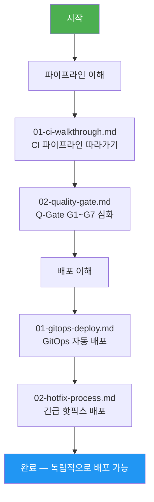

# 6장: CI/CD — 학습 맵

> **대상**: 신규 합류 개발자, DevOps 엔지니어
> **버전**: 1.0.0 | **작성일**: 2026-04-11
> **CSAP**: D-12 (시스템 개발 보안), D-13 (변경 관리)

---

## 이 섹션을 배우면

내가 작성한 코드가 어떤 검증 과정을 거쳐 프로덕션에 배포되는지 이해하고, 문제가 생겼을 때 스스로 디버깅할 수 있게 됩니다.

---

## 학습 순서

---

## 섹션 구조

| 폴더 | 파일 | 설명 | 소요 시간 |
|------|------|------|----------|
| `pipelines/` | `01-ci-walkthrough.md` | CI 파이프라인 전체 흐름 | 60분 |
| `pipelines/` | `02-quality-gate.md` | Q-Gate G1~G7 상세 | 45분 |
| `deployment/` | `01-gitops-deploy.md` | GitOps 자동 배포 | 45분 |
| `deployment/` | `02-hotfix-process.md` | 핫픽스 긴급 배포 | 30분 |

---

## 핵심 워크플로우 파일 위치

| 파일 | 역할 |
|------|------|
| `.gitea/workflows/ci.yml` | 메인 CI 파이프라인 |
| `.gitea/workflows/quality-gate.yml` | Q-Gate G1~G7 검증 |
| `.gitea/workflows/devsecops.yml` | 보안 스캔 (Trivy, Semgrep) |
| `.gitea/workflows/matrix-build.yml` | Docker 이미지 병렬 빌드 |
| `.gitea/workflows/hotfix-pipeline.yaml` | 핫픽스 긴급 배포 |
| `.gitea/workflows/release-pipeline-v2.yaml` | 릴리스 배포 |
