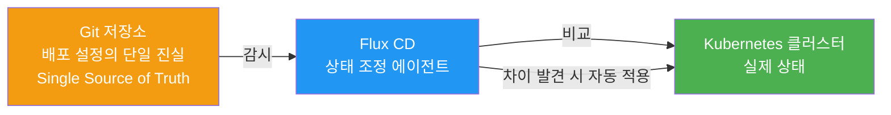
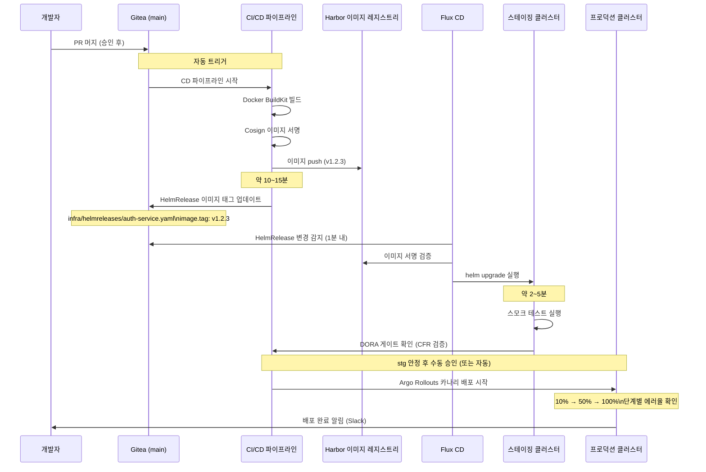

# GitOps 배포 — 코드 머지부터 서비스 배포까지

> **버전**: 1.0.0 | **작성일**: 2026-04-11
> **대상**: CI/CD 기초를 마친 개발자
> **전제 조건**: `pipelines/02-quality-gate.md` 학습 완료
> **소요 시간**: 약 45분
> **CSAP**: D-13 (변경 관리), D-06 (침해사고 관리)

---

## 목차

1. [GitOps란? — 선언적 배포](#1-gitops란--선언적-배포)
2. [배포 파이프라인 타임라인](#2-배포-파이프라인-타임라인)
3. [HelmRelease 업데이트 방법](#3-helmrelease-업데이트-방법)
4. [배포 상태 확인 방법](#4-배포-상태-확인-방법)
5. [롤백 방법](#5-롤백-방법)
6. [스테이징 vs 프로덕션 차이](#6-스테이징-vs-프로덕션-차이)

---

## 1. GitOps란? — 선언적 배포

### 1.1 명령적 배포 vs 선언적 배포

```
명령적 배포 (전통 방식):
  "이 명령어를 실행해서 배포해"
  kubectl apply -f deployment.yaml
  → 누가 언제 어떻게 배포했는지 추적 어려움
  → 실수로 잘못된 명령어 실행 가능

선언적 배포 (GitOps):
  "Git에 있는 이 상태로 클러스터를 유지해"
  git commit → Flux가 자동으로 맞춤
  → 모든 변경이 Git 커밋으로 추적됨
  → 실수 시 git revert로 즉시 원복 가능
  → CSAP D-13 변경 관리 자동 충족
```

### 1.2 GitOps 핵심 원칙



**핵심**: Flux는 Git과 클러스터 상태를 비교하여 차이가 있으면 자동으로 맞춥니다. 개발자가 직접 `kubectl apply`를 실행할 필요가 없습니다.

### 1.3 배포 설정 파일 위치

```
infra/
├── helmreleases/               ← Flux가 감시하는 배포 설정
│   ├── auth-service.yaml       ← auth-service HelmRelease
│   ├── user-service.yaml       ← user-service HelmRelease
│   └── ...
├── charts/                     ← Helm Chart 정의
│   ├── auth-service/
│   │   ├── Chart.yaml
│   │   ├── values.yaml         ← 기본값
│   │   ├── values-stg.yaml     ← 스테이징 환경 값
│   │   └── values-prod.yaml    ← 프로덕션 환경 값
│   └── ...
└── kustomize/                  ← 환경별 설정 오버레이
    ├── staging/
    └── production/
```

---

## 2. 배포 파이프라인 타임라인

코드를 main에 머지한 순간부터 실제 배포까지의 타임라인입니다.



### 2.1 단계별 시간 요약

| 단계 | 소요 시간 | 비고 |
|------|---------|------|
| PR 머지 → 이미지 빌드 완료 | ~15분 | 자동 |
| HelmRelease 업데이트 | ~1분 | 자동 |
| Flux 변경 감지 | ~1분 | 1분마다 폴링 |
| 스테이징 배포 완료 | ~5분 | 자동 |
| DORA 게이트 확인 | ~2분 | 자동 |
| 프로덕션 승인 | 담당자 확인 | 수동 또는 자동 |
| 카나리 → 전체 배포 | ~10분 | Argo Rollouts |
| **전체** | **약 35~45분** | |

---

## 3. HelmRelease 업데이트 방법

### 3.1 이미지 버전 변경 (자동)

일반적으로 CI/CD 파이프라인이 자동으로 처리합니다. 수동으로 변경해야 할 때를 위해 방법을 알아둡니다.

```yaml
# infra/helmreleases/auth-service.yaml
apiVersion: helm.toolkit.fluxcd.io/v2beta1
kind: HelmRelease
metadata:
  name: auth-service
  namespace: saas-services
spec:
  interval: 1m                  # Flux 조정 주기
  chart:
    spec:
      chart: ./infra/charts/auth-service
      sourceRef:
        kind: GitRepository
        name: public-saas
  values:
    image:
      repository: localhost:8080/public-saas/auth-service
      tag: v1.2.3              # ← 이 값이 CI/CD에서 자동 업데이트됨
    replicaCount: 2
    resources:
      requests:
        memory: "256Mi"
        cpu: "100m"
      limits:
        memory: "512Mi"
        cpu: "500m"
```

### 3.2 환경 변수 변경

```yaml
# infra/charts/auth-service/values-prod.yaml
env:
  LOG_LEVEL: "info"
  DB_POOL_SIZE: "20"
  # ❌ 시크릿은 여기에 절대 포함 금지
  # DB_PASSWORD: "secret"  ← BLOCKED

# 시크릿은 Kubernetes Secret 또는 Sealed Secret 사용
secretRef:
  name: auth-service-secrets    # kubectl create secret 으로 생성
```

### 3.3 레플리카 수 변경

```bash
# 임시 레플리카 변경 (권장하지 않음 — GitOps 원칙 위반)
kubectl scale deployment/auth-service -n saas-services --replicas=3

# ✅ 올바른 방법: HelmRelease 값 변경 후 커밋
# infra/charts/auth-service/values-prod.yaml
replicaCount: 3  # 2에서 3으로 변경
```

```bash
# 변경 커밋
git add infra/charts/auth-service/values-prod.yaml
git commit -m "feat(auth-service): 프로덕션 레플리카 2→3 (트래픽 증가 대응)"
git push origin main
```

---

## 4. 배포 상태 확인 방법

### 4.1 Flux HelmRelease 상태 확인

```bash
# 모든 HelmRelease 상태 확인
flux get helmreleases -n saas-services

# 결과 예시:
# NAME            REVISION  SUSPENDED  READY  MESSAGE
# auth-service    v1.2.3    False      True   Release reconciliation succeeded
# user-service    v2.1.0    False      True   Release reconciliation succeeded
# billing-service v1.5.1    False      False  upgrade failed: error installing chart

# 특정 서비스 상세 상태
flux get helmrelease auth-service -n saas-services
```

**상태 해석**:

| READY | MESSAGE | 의미 |
|-------|---------|------|
| True | Release reconciliation succeeded | 정상 |
| False | upgrade failed: ... | 배포 실패 |
| False | dependency not ready | 의존 서비스 아직 준비 중 |
| Unknown | Reconciliation in progress | 배포 진행 중 |

### 4.2 Pod 상태 확인

```bash
# 서비스 Pod 상태
kubectl get pods -n saas-services -l app=auth-service

# 결과 예시:
# NAME                            READY   STATUS    RESTARTS   AGE
# auth-service-7d9b4f8c6-xkz2p   1/1     Running   0          5m
# auth-service-7d9b4f8c6-abc1d   1/1     Running   0          5m

# 상세 정보 (문제 있을 때)
kubectl describe pod auth-service-7d9b4f8c6-xkz2p -n saas-services
```

**Pod STATUS 해석**:

| STATUS | 의미 | 대응 |
|--------|------|------|
| Running | 정상 실행 중 | - |
| Pending | 스케줄링 대기 | 리소스 부족 가능성 |
| CrashLoopBackOff | 반복 크래시 | 로그 확인 필요 |
| ImagePullBackOff | 이미지 다운로드 실패 | Harbor 접근 및 이미지 태그 확인 |
| OOMKilled | 메모리 초과 | 메모리 limit 증가 |

### 4.3 롤아웃 상태 확인

```bash
# 배포 진행 상태 실시간 모니터링
kubectl rollout status deployment/auth-service -n saas-services

# 결과 예시:
# Waiting for deployment "auth-service" rollout to finish: 1 out of 2 new replicas updated...
# Waiting for deployment "auth-service" rollout to finish: 1 old replicas are pending termination...
# deployment "auth-service" successfully rolled out

# 현재 ReplicaSet 이력 (롤백 가능한 버전)
kubectl rollout history deployment/auth-service -n saas-services

# 결과:
# REVISION  CHANGE-CAUSE
# 1         v1.2.1 초기 배포
# 2         v1.2.2 버그 수정
# 3         v1.2.3 새 기능 추가 ← 현재
```

### 4.4 서비스 로그 확인

```bash
# 최근 100줄 로그
kubectl logs -n saas-services deployment/auth-service --tail=100

# 실시간 스트리밍
kubectl logs -n saas-services deployment/auth-service -f

# 이전 Pod 로그 (크래시 후)
kubectl logs -n saas-services deployment/auth-service --previous

# 여러 Pod 로그 통합 (stern 도구)
stern auth-service -n saas-services
```

---

## 5. 롤백 방법

### 5.1 즉각 롤백 (Kubernetes 레벨)

```bash
# 이전 버전으로 즉각 롤백
kubectl rollout undo deployment/auth-service -n saas-services

# 특정 리비전으로 롤백
kubectl rollout undo deployment/auth-service --to-revision=2 -n saas-services

# 롤백 완료 확인
kubectl rollout status deployment/auth-service -n saas-services
```

**주의**: 이 방법은 Kubernetes 레벨에서만 롤백합니다. Flux가 다음 조정 사이클에서 Git 상태로 다시 복원할 수 있습니다.

### 5.2 영구적 롤백 (GitOps 방식 권장)

```bash
# HelmRelease의 이미지 태그를 이전 버전으로 변경
# infra/helmreleases/auth-service.yaml
# image.tag: v1.2.3 → v1.2.2

# 커밋
git commit -m "fix(auth-service): v1.2.3 장애로 v1.2.2로 롤백"
git push origin main

# Flux가 자동으로 이전 버전 배포
# 또는 즉시 적용
flux reconcile helmrelease auth-service -n saas-services
```

### 5.3 Flux 조정 일시 중단 (긴급 상황)

```bash
# Flux 자동 조정 일시 중단 (수동 제어 필요할 때)
flux suspend helmrelease auth-service -n saas-services

# 수동으로 롤백 실행
kubectl rollout undo deployment/auth-service -n saas-services

# 상황 안정 후 Flux 재개
flux resume helmrelease auth-service -n saas-services
```

---

## 6. 스테이징 vs 프로덕션 차이

| 항목 | 스테이징 | 프로덕션 |
|------|---------|---------|
| 자동 배포 | main 머지 시 자동 | 수동 승인 후 |
| 레플리카 수 | 1~2개 | 2~3개 이상 |
| 리소스 | 최소 사양 | 운영 사양 |
| 데이터 | 테스트 데이터 | 실제 데이터 |
| 알림 | 팀 내부 채널 | 전체 알림 + 에스컬레이션 |
| 롤백 | 즉각 가능 | 검토 후 결정 |
| 배포 방식 | 직접 업그레이드 | Argo Rollouts 카나리 |

### 6.1 스테이징에서 먼저 검증하는 것들

```bash
# 스테이징 접속 (개발자 환경)
kubectl config use-context k3s-staging

# 스테이징 Pod 상태 확인
kubectl get pods -n saas-services

# API 동작 확인 (스테이징 엔드포인트)
curl -X POST https://api-stg.saas.internal/auth/login \
  -H 'Content-Type: application/json' \
  -d '{"email":"test@example.com","password":"testpass"}'
```

---

## 다음 단계

정상적인 배포 흐름을 이해했습니다. 다음은 긴급 상황에서 핫픽스를 배포하는 방법을 배울 차례입니다.

`02-hotfix-process.md`로 이동하십시오.

---

> **참조**: `infra/helmreleases/` — 서비스별 HelmRelease 설정
> **참조**: `.gitea/workflows/release-pipeline-v2.yaml` — 릴리스 파이프라인
> **CSAP 연관**: D-13 (변경 관리 — 모든 배포를 Git 커밋으로 추적)
