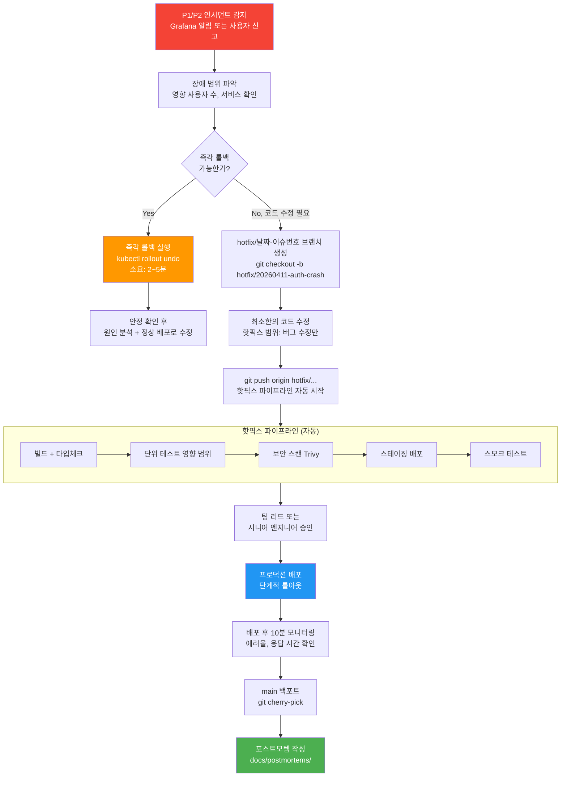
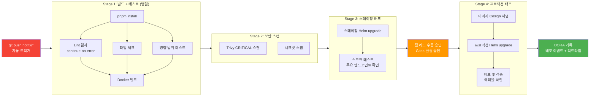

# 핫픽스 긴급 배포 프로세스

> **버전**: 1.0.0 | **작성일**: 2026-04-11
> **대상**: 운영 중인 서비스를 담당하는 개발자
> **전제 조건**: `01-gitops-deploy.md` 학습 완료
> **소요 시간**: 약 30분
> **Design Ref**: MTU-N249 S3.1 — Hotfix 파이프라인
> **Plan SC**: FR-HF.1, FR-HF.2
> **CSAP**: D-06 (침해사고 관리), D-13 (변경 관리)

---

## 목차

1. [언제 핫픽스를 사용하는가?](#1-언제-핫픽스를-사용하는가)
2. [핫픽스 단계별 프로세스](#2-핫픽스-단계별-프로세스)
3. [핫픽스 파이프라인 상세](#3-핫픽스-파이프라인-상세)
4. [핫픽스 후 main 백포트](#4-핫픽스-후-main-백포트)
5. [핫픽스 관련 CSAP 요건](#5-핫픽스-관련-csap-요건)
6. [핫픽스 후 포스트모템 작성](#6-핫픽스-후-포스트모템-작성)

---

## 1. 언제 핫픽스를 사용하는가?

### 1.1 핫픽스가 필요한 상황

```
핫픽스(Hotfix) = 프로덕션 긴급 장애를 수정하는 빠른 배포 경로

핫픽스를 사용해야 하는 상황:
  ✅ P1/P2 인시던트: 프로덕션 서비스 다운 또는 심각한 기능 장애
  ✅ 보안 취약점: 즉각 패치가 필요한 CVE 발견
  ✅ 데이터 손상: 사용자 데이터 오류가 진행 중인 경우
  ✅ 법적/규제 위반: CSAP 위반 상황이 실시간 발생 중인 경우

핫픽스를 사용하지 말아야 하는 상황:
  ❌ 기능 개선: 새 기능 추가는 일반 배포로
  ❌ 마이너 버그: 사용자 영향이 없는 버그는 일반 배포로
  ❌ "빨리 배포하고 싶어서": Q-Gate 우회 목적의 핫픽스 금지
```

### 1.2 인시던트 레벨 정의

| 레벨 | 정의 | 핫픽스 여부 | 예시 |
|------|------|-----------|------|
| P1 | 전체 서비스 다운 | 즉시 핫픽스 | 로그인 불가, 데이터 조회 전체 실패 |
| P2 | 주요 기능 장애 | 핫픽스 고려 | 결제 실패, 특정 테넌트 접근 불가 |
| P3 | 일부 기능 이상 | 일반 배포 | 특정 화면 오류, UI 버그 |
| P4 | 사소한 이슈 | 일반 배포 | 오탈자, 색상 오류 |

---

## 2. 핫픽스 단계별 프로세스



### 2.1 단계별 실행 명령어

**Step 1: 즉각 롤백 (코드 수정 없이 이전 버전으로)**

```bash
# 이전 버전으로 즉시 롤백
kubectl rollout undo deployment/auth-service -n saas-services

# 롤백 완료 확인
kubectl rollout status deployment/auth-service -n saas-services

# 롤백 후 상태 확인
kubectl get pods -n saas-services -l app=auth-service
```

**Step 2: 핫픽스 브랜치 생성**

```bash
# 날짜와 이슈 번호를 포함한 브랜치 이름
git checkout main
git pull origin main
git checkout -b hotfix/20260411-auth-crash

# 또는 stg 기준으로
git checkout stg
git pull origin stg
git checkout -b hotfix/20260411-auth-crash
```

**Step 3: 최소한의 버그 수정 + 커밋**

```bash
# 버그 수정 후
git add [수정한 파일만]
git commit -m "fix(auth): JWT 만료 처리 오류 수정 (P1 긴급)"

# 핫픽스 파이프라인 자동 시작
git push origin hotfix/20260411-auth-crash
```

---

## 3. 핫픽스 파이프라인 상세

`hotfix/*` 브랜치 push 시 `.gitea/workflows/hotfix-pipeline.yaml`이 자동 실행됩니다.



### 3.1 일반 CI vs 핫픽스 파이프라인 차이

| 항목 | 일반 CI | 핫픽스 파이프라인 |
|------|---------|--------------|
| E2E 테스트 | 실행 | 건너뜀 (시간 절약) |
| Q-Gate | 전체 G1~G7 | 핵심 항목만 (G3, G5) |
| Lint | 강제 실패 | continue-on-error (경고만) |
| 프로덕션 승인 | 자동 | 수동 승인 필수 |
| 감사 로그 | 표준 | 핫픽스 표시 추가 |

**중요**: 핫픽스라고 해서 보안 검사를 완전히 생략하지는 않습니다. Trivy CRITICAL 취약점과 시크릿 스캔은 반드시 통과해야 합니다.

### 3.2 핫픽스 파이프라인 모니터링

```bash
# Gitea Actions에서 파이프라인 진행 상태 확인
# https://[gitea-url]/[org]/[repo]/actions

# 또는 CLI로 확인
# (Gitea CLI가 설치된 경우)
gh run list --workflow=hotfix-pipeline.yaml
```

---

## 4. 핫픽스 후 main 백포트

핫픽스가 프로덕션에 배포된 후에는 반드시 main 브랜치에도 같은 수정을 반영해야 합니다. 그렇지 않으면 다음 일반 배포에서 버그가 다시 나타납니다.

### 4.1 cherry-pick으로 백포트

```bash
# 핫픽스 커밋 해시 확인
git log hotfix/20260411-auth-crash --oneline
# 예시: abc123d fix(auth): JWT 만료 처리 오류 수정 (P1 긴급)

# main 브랜치에 cherry-pick
git checkout main
git pull origin main
git cherry-pick abc123d

# 충돌 발생 시
git mergetool           # 충돌 해결
git cherry-pick --continue

# 백포트 커밋 push
git push origin main
```

### 4.2 백포트 PR 방식 (더 안전한 방법)

```bash
# 백포트 브랜치 생성
git checkout main
git checkout -b backport/20260411-auth-crash-to-main

# cherry-pick
git cherry-pick abc123d

# PR 생성 (Gitea)
git push origin backport/20260411-auth-crash-to-main
# → Gitea에서 PR 생성 → 리뷰 후 머지
```

백포트 PR은 Q-Gate를 모두 통과해야 합니다. 핫픽스에서 건너뛴 E2E 테스트와 Q-Gate도 이 시점에 실행됩니다.

### 4.3 백포트 확인

```bash
# main에 백포트가 반영되었는지 확인
git log main --oneline | grep "auth-crash"
# → fix(auth): JWT 만료 처리 오류 수정 (P1 긴급)
```

---

## 5. 핫픽스 관련 CSAP 요건

핫픽스는 긴급 절차이지만 CSAP D-06, D-13 요건은 여전히 준수해야 합니다.

### 5.1 D-13 변경 관리

```
CSAP D-13 요건:
  - 모든 소프트웨어 변경은 변경 관리 절차를 따라야 함
  - 긴급 변경도 사후 문서화 필수

핫픽스 대응:
  - 핫픽스 브랜치 = 변경 요청 기록
  - Gitea PR/커밋 = 변경 승인 기록
  - 포스트모템 문서 = 사후 분석 기록
```

### 5.2 D-06 침해사고 관리

```bash
# 핫픽스 시작 시 감사 로그 기록 (auditLog 사용)
# 핫픽스 코드에도 auditLog() 호출 확인

# audit.jsonl에서 핫픽스 이벤트 확인
jq '. | select(.action | test("HOTFIX|EMERGENCY"))' .claude/audit.jsonl
```

### 5.3 핫픽스 체크리스트 (CSAP 준수)

```
배포 전:
  [ ] 장애 영향 범위 문서화
  [ ] 수정 내용의 최소화 검증 (최소 변경 원칙)
  [ ] 팀 리드 승인 획득
  [ ] 스테이징 스모크 테스트 통과

배포 후:
  [ ] 10분 이상 모니터링
  [ ] 에러율 정상 복귀 확인
  [ ] 감사 로그 기록 확인
  [ ] main 백포트 완료

24시간 내:
  [ ] 포스트모템 초안 작성
  [ ] DORA 변경 실패율 확인 (자동 기록)
```

---

## 6. 핫픽스 후 포스트모템 작성

### 6.1 포스트모템이란?

포스트모템(Postmortem)은 장애 후 "무슨 일이 있었는가, 왜 일어났는가, 다음에는 어떻게 방지할 것인가"를 기록하는 문서입니다.

**중요**: 포스트모템은 책임 추궁이 아닙니다. "비난 없는 포스트모템(Blameless Postmortem)" 원칙을 따릅니다.

### 6.2 포스트모템 템플릿

```markdown
# 포스트모템: [서비스명] [장애 일시]

## 요약
- 발생 시각: 2026-04-11 09:15 KST
- 해결 시각: 2026-04-11 09:43 KST
- 영향 지속 시간: 28분
- 영향 범위: auth-service 로그인 기능 전체 불가
- 영향 사용자 수: 약 1,200명 (추정)
- 인시던트 레벨: P1

## 타임라인
| 시각 | 사건 |
|------|------|
| 09:15 | Grafana 알림: auth-service 에러율 95% 초과 |
| 09:18 | 온콜 담당자 인지 |
| 09:22 | 원인 파악: JWT 검증 라이브러리 버그 |
| 09:25 | 즉각 롤백 시도 (v1.2.2로) |
| 09:30 | 롤백 완료, 서비스 정상화 |
| 09:43 | 모니터링 완료, 인시던트 종료 |

## 근본 원인
prom-client v5.0.1 업데이트 시 JWT 검증 인터페이스 변경으로
기존 토큰 검증 코드가 항상 false를 반환하게 됨.

## 왜 발견하지 못했는가 (5 Whys)
1. 왜 배포했는가? → 의존성 업데이트 PR이 테스트를 통과했음
2. 왜 테스트를 통과했는가? → JWT 검증 실패 경로의 테스트가 없었음
3. 왜 테스트가 없었는가? → 커버리지 기준이 "라인"만 80%를 봤음
4. 왜 브랜치 커버리지를 안 봤는가? → 설정 누락
5. 왜 설정이 누락되었는가? → 온보딩 문서에 명시되지 않았음

## 수정 조치
- 즉각: v1.2.2로 롤백 완료
- 단기 (1주): 브랜치 커버리지 80% 강제 (vitest.config.ts 수정)
- 중기 (1개월): JWT 검증 통합 테스트 추가, 카나리 배포 도입

## 교훈 (다음에는 이렇게)
- 라이브러리 메이저 업데이트 시 변경 인터페이스 확인
- 브랜치 커버리지를 Q-Gate에 명시적으로 포함
```

### 6.3 포스트모템 파일 저장

```bash
# 파일 저장 위치
docs/postmortems/2026-04-11-auth-jwt-crash.md

# 커밋
git add docs/postmortems/2026-04-11-auth-jwt-crash.md
git commit -m "docs(postmortem): 2026-04-11 auth-service P1 장애 포스트모템"
```

---

## 요약

핫픽스 프로세스 핵심 체크리스트:

```
1. 즉각 롤백 먼저 시도 → 안되면 핫픽스 브랜치
2. hotfix/YYYYMMDD-설명 브랜치 이름 형식
3. 최소한의 수정만 (버그 수정 외 변경 금지)
4. 스테이징에서 스모크 테스트 확인
5. 팀 리드 승인 후 프로덕션 배포
6. 10분 이상 모니터링
7. main 백포트 (24시간 내)
8. 포스트모템 작성 (24시간 내)
```

---

> **참조**: `.gitea/workflows/hotfix-pipeline.yaml` — 핫픽스 파이프라인 설정
> **참조**: `docs/postmortems/` — 과거 포스트모템 모음
> **Design Ref**: MTU-N249 S3.1 — Hotfix 파이프라인
> **Plan SC**: FR-HF.1 (핫픽스 파이프라인), FR-HF.2 (main 백포트)
> **CSAP 연관**: D-06 (침해사고 관리), D-13 (변경 관리 — 긴급 변경 절차)
