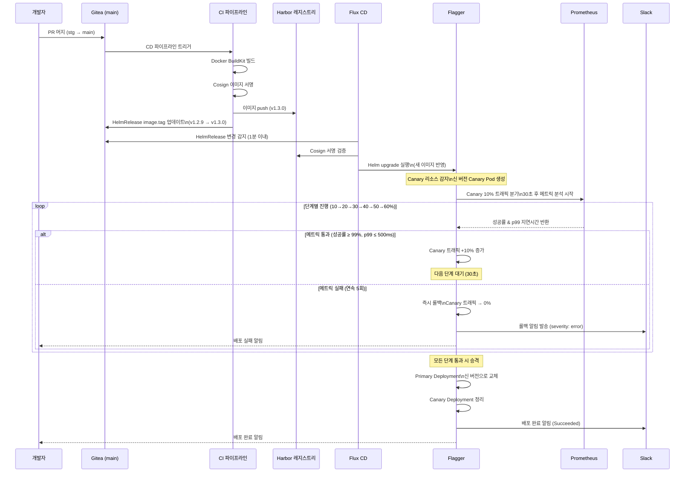
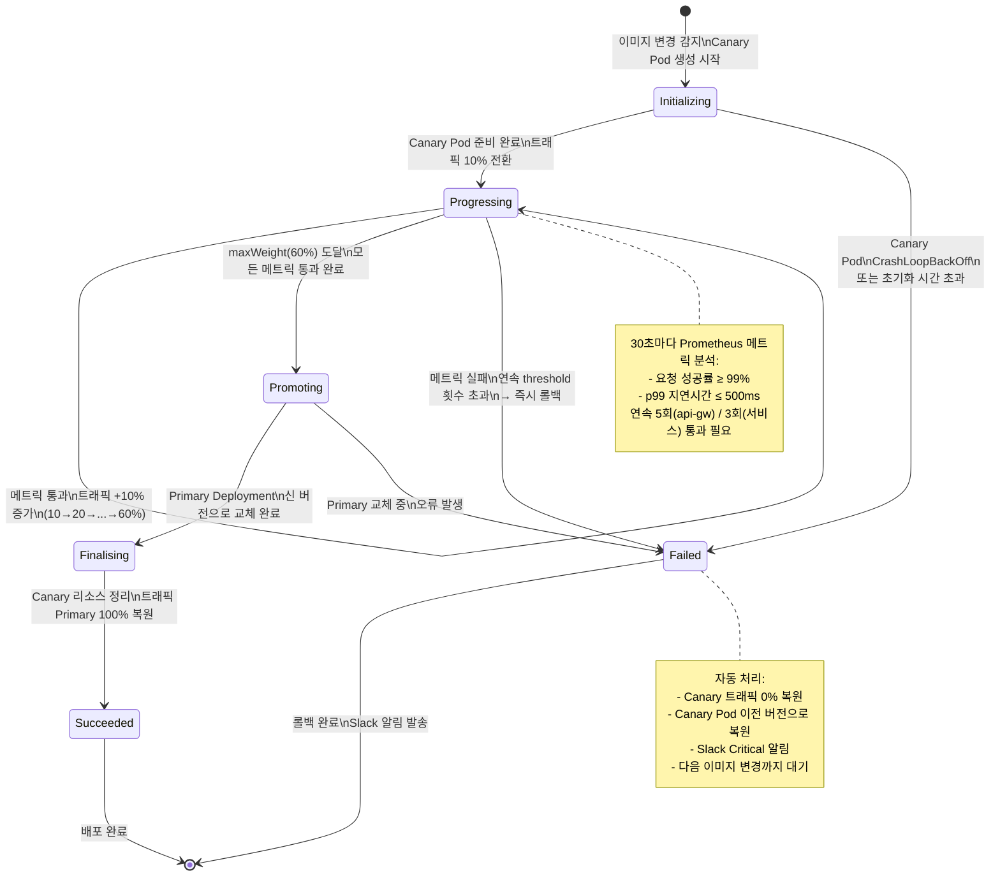

# 카나리 배포 — 점진적 릴리스로 리스크를 최소화하는 방법

> **버전**: 1.0.0 | **작성일**: 2026-04-12
> **대상**: `01-gitops-deploy.md`와 `02-hotfix-process.md`를 완료한 개발자
> **소요 시간**: 약 60분
> **CSAP**: D-12 (시스템 개발 보안 — 안전한 배포), D-13 (변경 관리)
> **관련 파일**: `infra/flagger/canary-services.yaml`, `infra/flagger/canary-api-gateway.yaml`

---

## 목차

1. [카나리 배포란? — 광산의 카나리아 새 이야기](#1-카나리-배포란--광산의-카나리아-새-이야기)
2. [배포 전략 비교 — 블루/그린 vs 카나리 vs 롤링](#2-배포-전략-비교--블루그린-vs-카나리-vs-롤링)
3. [이 프로젝트의 카나리 배포 구성 (Flagger + Traefik)](#3-이-프로젝트의-카나리-배포-구성-flagger--traefik)
4. [카나리 가중치 단계와 진행 조건](#4-카나리-가중치-단계와-진행-조건)
5. [자동 롤백 조건](#5-자동-롤백-조건)
6. [Flagger Canary 리소스 YAML 상세 설명](#6-flagger-canary-리소스-yaml-상세-설명)
7. [카나리 배포 모니터링 (Grafana + Prometheus)](#7-카나리-배포-모니터링-grafana--prometheus)
8. [카나리 상태 확인 명령어](#8-카나리-상태-확인-명령어)
9. [수동 승격과 수동 롤백](#9-수동-승격과-수동-롤백)
10. [카나리를 언제 사용해야 하는가](#10-카나리를-언제-사용해야-하는가)
11. [실패 사례와 교훈](#11-실패-사례와-교훈)
12. [전체 배포 흐름 다이어그램](#12-전체-배포-흐름-다이어그램)
13. [카나리 상태 다이어그램](#13-카나리-상태-다이어그램)

---

## 1. 카나리 배포란? — 광산의 카나리아 새 이야기

### 1.1 유래: 탄광 속의 카나리아

19세기 광부들은 탄광에 들어갈 때 카나리아 새를 작은 새장에 넣어 가져갔습니다. 카나리아는 인간보다 일산화탄소에 훨씬 민감합니다. 유독 가스가 누출되면 광부들이 느끼기 전에 카나리아가 먼저 반응을 보였습니다. 이를 신호로 광부들은 안전하게 대피할 수 있었습니다.

```
탄광 비유:
  카나리아 = 새 버전 코드 (소수 사용자에게 먼저 노출)
  탄광 속 유독 가스 = 버그, 성능 저하, 에러 폭발
  광부 = 대다수의 실제 사용자
  광부 대피 = 자동 롤백

새 버전이 문제가 있다면:
  → 소수 사용자(5~10%)만 영향받음
  → 자동으로 에러율 감지
  → 전체 사용자에게 퍼지기 전에 자동 롤백
```

### 1.2 카나리 배포의 핵심 개념

카나리 배포는 새 버전을 **전체 사용자가 아닌 일부 사용자**에게만 먼저 노출하는 배포 전략입니다.

```
일반 배포 (All-or-Nothing):
  구 버전 100% → 신 버전 100% (한 번에 전환)
  위험: 버그 발견 시 전체 사용자 영향

카나리 배포 (점진적 전환):
  구 버전 100%
  → 신 버전 10% / 구 버전 90% (관찰)
  → 신 버전 30% / 구 버전 70% (관찰)
  → 신 버전 60% / 구 버전 40% (관찰)
  → 신 버전 100% (전체 전환)
  장점: 문제 조기 감지, 영향 범위 최소화
```

### 1.3 공공기관 시스템에서 카나리가 중요한 이유

공공기관 SaaS 시스템은 일반 상업 서비스와 다른 제약이 있습니다.

- **무중단 운영 의무**: 민원 처리 시스템 등은 업무 시간 중 중단이 불가합니다.
- **감리 책임**: 배포 실패로 인한 서비스 중단은 감리 지적 사항이 됩니다.
- **CSAP D-12 요건**: 시스템 변경은 안전한 절차를 따라야 합니다.

카나리 배포는 이러한 요건을 충족하면서도 지속적인 개선을 가능하게 합니다.

---

## 2. 배포 전략 비교 — 블루/그린 vs 카나리 vs 롤링

각 배포 전략은 서로 다른 트레이드오프를 가집니다. 프로젝트의 요구사항에 따라 적절한 전략을 선택합니다.

| 항목 | 블루/그린 | 카나리 | 롤링 업데이트 |
|------|---------|--------|------------|
| **개념** | 두 환경을 동시에 유지, 한 번에 전환 | 트래픽을 단계별로 이전 | Pod를 하나씩 교체 |
| **리소스 비용** | 2배 (두 환경 동시 운영) | 1.x배 (Canary Pod 소수) | 1배 (추가 비용 없음) |
| **롤백 속도** | 즉각 (트래픽 전환만) | 즉각 (자동 롤백) | 느림 (전체 재배포) |
| **실제 트래픽 테스트** | 없음 (사전 테스트만) | 있음 (소수 사용자) | 없음 |
| **점진적 검증** | 없음 | 있음 | 없음 |
| **복잡도** | 중간 | 높음 | 낮음 |
| **이 프로젝트 사용** | 스테이징 | 프로덕션 핵심 서비스 | 스테이징 단순 서비스 |
| **적합한 변경** | 대규모 인프라 변경 | 기능 변경, API 변경 | 설정 변경, 패치 |

### 2.1 블루/그린 배포

```
블루 환경 (구 버전): 사용자 100% 트래픽 수신
그린 환경 (신 버전): 준비 완료 후 대기

테스트 완료 시:
  로드 밸런서 → 그린 환경으로 전환
  블루 환경 → 대기 상태 유지 (즉각 롤백용)

장점: 즉각 롤백, 제로 다운타임
단점: 두 배 비용, 실제 사용자 트래픽 없이 테스트
```

### 2.2 카나리 배포 (이 프로젝트의 방식)

```
1단계: 신 버전 10% / 구 버전 90%
         ↓ 30초마다 메트릭 분석
2단계: 신 버전 30% / 구 버전 70%
         ↓ 30초마다 메트릭 분석
3단계: 신 버전 60% / 구 버전 40%
         ↓ 30초마다 메트릭 분석
4단계: 신 버전 100% (완전 승격)

실패 감지 시: 즉시 0% 롤백
```

### 2.3 롤링 업데이트

```
Pod 1: 신 버전으로 교체 (구 버전 Pod 2, 3 운영 중)
Pod 2: 신 버전으로 교체 (구 버전 Pod 3 운영 중)
Pod 3: 신 버전으로 교체 (완료)

장점: 추가 비용 없음, 단순함
단점: 문제 발견 시 이미 일부 Pod에 배포된 상태
```

---

## 3. 이 프로젝트의 카나리 배포 구성 (Flagger + Traefik)

### 3.1 구성 요소

이 프로젝트는 다음 구성 요소로 카나리 배포를 구현합니다.

| 구성 요소 | 역할 | 위치 |
|---------|------|------|
| **Flagger** | 카나리 오케스트레이터 — 메트릭 분석, 자동 승격/롤백 | `infra/flagger/` |
| **Traefik** | 트래픽 분기 — 가중치 기반 라우팅 | k3s 기본 Ingress |
| **Prometheus** | 메트릭 수집 — 성공률, 지연시간 | `infra/monitoring/` |
| **Alertmanager** | 알림 발송 — 롤백 시 Slack 알림 | `infra/flagger/alert-provider.yaml` |

### 3.2 Flagger의 동작 원리

```
1. Flagger가 Deployment 변경 감지
   └→ auth-service Deployment의 image 태그가 변경됨

2. Canary Pod 생성
   └→ auth-service-primary (구 버전, 트래픽 대부분)
   └→ auth-service-canary (신 버전, 소수 트래픽)

3. Traefik TraefikService 가중치 설정
   └→ primary: 90%, canary: 10%

4. 30초마다 Prometheus 메트릭 분석
   └→ 성공률 >= 99% AND p99 지연 <= 500ms → 다음 단계

5. 모든 단계 통과 시
   └→ primary를 새 버전으로 교체
   └→ canary Pod 삭제

6. 어떤 단계에서라도 실패 시
   └→ canary 트래픽을 0%로 즉각 복원
   └→ Slack 알림 발송
```

### 3.3 적용 대상 서비스

현재 카나리 배포가 적용된 서비스 목록입니다.

| 서비스 | 설정 파일 | 임계값 |
|--------|---------|-------|
| api-gateway | `canary-api-gateway.yaml` | 성공률 99%+, p99 500ms 이하 |
| auth-service | `canary-services.yaml` | 성공률 99%+, p99 500ms 이하 |
| tenant-service | `canary-services.yaml` | 성공률 99%+, p99 500ms 이하 |
| audit-service | `canary-services.yaml` | 성공률 99%+, p99 500ms 이하 (Critical Alert) |

---

## 4. 카나리 가중치 단계와 진행 조건

### 4.1 API Gateway 카나리 단계 (10% 증분)

`infra/flagger/canary-api-gateway.yaml` 기준:

```
시작: Primary 100%
    ↓ 이미지 변경 감지
단계 1: Canary 10% / Primary 90%
    ↓ 30초 후 메트릭 확인 (성공 5회 연속 필요)
단계 2: Canary 20% / Primary 80%
    ↓ 30초 후 메트릭 확인
단계 3: Canary 30% / Primary 70%
    ↓ 30초 후 메트릭 확인
단계 4: Canary 40% / Primary 60%
    ↓ 30초 후 메트릭 확인
단계 5: Canary 50% / Primary 50%
    ↓ 30초 후 메트릭 확인
단계 6: Canary 60% / Primary 40%  (maxWeight)
    ↓ 30초 후 최종 메트릭 확인
완료: Canary가 Primary로 승격 → 신 버전 100%
```

### 4.2 핵심 서비스 카나리 단계 (20% 증분)

`infra/flagger/canary-services.yaml` 기준 (auth, tenant, audit):

```
시작: Primary 100%
    ↓ 이미지 변경 감지
단계 1: Canary 20% / Primary 80%
    ↓ 30초 후 메트릭 확인 (성공 3회 연속 필요)
단계 2: Canary 40% / Primary 60%
    ↓ 30초 후 메트릭 확인
단계 3: Canary 60% / Primary 40%  (maxWeight)
    ↓ 30초 후 최종 메트릭 확인
완료: Canary가 Primary로 승격 → 신 버전 100%
```

### 4.3 진행 조건 (승격 기준)

각 단계를 통과하려면 모든 메트릭이 임계값을 충족해야 합니다.

```yaml
# 진행 조건: 두 메트릭 모두 충족 필요
메트릭 1 — 요청 성공률:
  측정 대상: HTTP 2xx/3xx 응답 비율
  임계값: 99% 이상
  측정 주기: 30초

메트릭 2 — p99 지연시간:
  측정 대상: 99번째 백분위 응답 시간
  임계값: 500ms 이하
  측정 주기: 30초
```

**실제 Prometheus 쿼리** (`infra/flagger/metric-templates.yaml`):

```yaml
# 성공률 쿼리
sum(
  rate(
    traefik_service_requests_total{
      service=~"{{ namespace }}-{{ target }}-canary.*",
      code=~"2..|3.."
    }[{{ interval }}]
  )
)
/
sum(
  rate(
    traefik_service_requests_total{
      service=~"{{ namespace }}-{{ target }}-canary.*"
    }[{{ interval }}]
  )
) * 100

# p99 지연시간 쿼리 (ms 단위)
histogram_quantile(
  0.99,
  sum(
    rate(
      traefik_service_request_duration_seconds_bucket{
        service=~"{{ namespace }}-{{ target }}-canary.*"
      }[{{ interval }}]
    )
  ) by (le)
) * 1000
```

---

## 5. 자동 롤백 조건

### 5.1 롤백을 트리거하는 조건

Flagger는 다음 조건 중 하나라도 충족되면 자동으로 롤백을 실행합니다.

| 조건 | 임계값 | 트리거 기준 |
|------|--------|----------|
| 요청 성공률 하락 | 99% 미만 | 연속 3회 (auth/tenant/audit) 또는 5회 (api-gw) 실패 |
| p99 지연시간 초과 | 500ms 초과 | 연속 3회 (auth/tenant/audit) 또는 5회 (api-gw) 실패 |
| 배포 시간 초과 | 600초 | progressDeadlineSeconds 초과 시 |
| Canary Pod 비정상 | CrashLoopBackOff 등 | Pod 헬스체크 실패 |

### 5.2 롤백 시 일어나는 일

```
1. Flagger가 실패 조건 감지
   └→ 예: 성공률 96% (임계값 99% 미만) 3회 연속

2. 트래픽 즉시 원복
   └→ Canary 트래픽 → 0%
   └→ Primary 트래픽 → 100%

3. Canary Deployment 원래 버전으로 복원
   └→ image.tag를 이전 태그로 되돌림

4. Canary 상태 → Failed

5. Slack 알림 발송
   └→ severity: error (일반 서비스)
   └→ severity: critical (audit-service)

6. 다음 배포는 새 이미지 변경이 있을 때까지 대기
```

### 5.3 롤백이 일어나지 않는 상황 (주의)

롤백이 자동으로 일어나지 않는 상황이 있습니다. 이를 알아야 수동 대응을 제때 할 수 있습니다.

```
주의 상황 1: 트래픽이 너무 적을 때
  → Canary가 10% 트래픽을 받아도 요청 수가 너무 적으면
    Prometheus 메트릭이 통계적으로 유효하지 않음
  → 야간 배포 시 트래픽이 매우 적어 메트릭 판단 불가
  → 대응: 야간 배포는 다음날 아침까지 모니터링 유지

주의 상황 2: 에러가 Primary에서 발생할 때
  → Canary 메트릭만 분석하므로 Primary 에러는 감지 불가
  → DB 문제, 외부 의존성 문제는 Primary/Canary 모두 영향
  → 대응: Grafana 대시보드 전체 에러율 별도 모니터링

주의 상황 3: 스테이징에서만 발생하는 문제
  → 카나리는 프로덕션에서만 동작
  → 스테이징에서 직접 배포 테스트 필요
```

---

## 6. Flagger Canary 리소스 YAML 상세 설명

실제 프로젝트 파일을 분석합니다. `infra/flagger/canary-api-gateway.yaml`:

```yaml
apiVersion: flagger.app/v1beta1
kind: Canary
metadata:
  name: api-gateway                    # Canary 리소스 이름
  namespace: saas-platform             # 배포 대상 네임스페이스
spec:
  targetRef:
    apiVersion: apps/v1
    kind: Deployment
    name: api-gateway                  # 관찰할 Deployment 이름
                                       # 이 Deployment의 image 변경을 감지

  provider: traefik                    # 트래픽 제어 도구 (k3s 기본 Ingress)
                                       # 대안: istio, linkerd, nginx 등

  service:
    port: 3000                         # 서비스 포트
    targetPort: 3000                   # 컨테이너 포트

  analysis:
    interval: 30s                      # 메트릭 분석 주기
                                       # 30초마다 Prometheus 쿼리 실행

    threshold: 5                       # 연속 성공 횟수 (api-gateway: 5회)
                                       # 5회 연속 메트릭 통과 시 다음 단계

    maxWeight: 60                      # Canary 최대 트래픽 비율 (%)
                                       # 60%까지만 올린 후 승격 (Primary 교체)

    stepWeight: 10                     # 단계별 트래픽 증가량 (%)
                                       # 10→20→30→40→50→60% 순서

    stepWeightPromotion: 10            # 승격 단계의 트래픽 증가량

    metrics:
      - name: request-success-rate     # MetricTemplate 이름 참조
        templateRef:
          name: request-success-rate
          namespace: saas-platform
        thresholdRange:
          min: 99                      # 최소 99% 이상이어야 통과
        interval: 30s

      - name: request-duration-p99     # p99 지연시간 측정
        templateRef:
          name: request-duration-p99
          namespace: saas-platform
        thresholdRange:
          max: 500                     # 최대 500ms 이하여야 통과
        interval: 30s

    alerts:
      - name: "on-call"               # AlertProvider 이름
        severity: error               # 알림 심각도
        providerRef:
          name: prometheus-alert      # Alertmanager 연동
          namespace: saas-platform
```

### 6.1 핵심 서비스 특이점 (auth/tenant/audit)

`infra/flagger/canary-services.yaml`에서 다른 점:

```yaml
analysis:
  threshold: 3          # api-gateway(5)보다 적은 연속 성공 요구
  maxWeight: 60         # 동일
  stepWeight: 20        # api-gateway(10)보다 큰 증가량 → 더 빠른 배포

# audit-service는 알림 심각도가 다름
alerts:
  - name: "audit-service-canary"
    severity: critical   # 감사 서비스 — CSAP D-06 핵심
```

audit-service에 `critical` 심각도를 사용하는 이유: 감사 로그 서비스가 중단되면 CSAP D-06 요건 위반입니다. 즉각적이고 강력한 알림이 필요합니다.

### 6.2 Flagger가 자동으로 생성하는 리소스

Canary 리소스를 적용하면 Flagger가 자동으로 다음을 생성합니다.

```bash
# Flagger가 자동 생성하는 리소스 확인
kubectl get all -n saas-platform -l app=api-gateway

# 생성 결과:
# deployment.apps/api-gateway          ← 원본 (Primary로 변환)
# deployment.apps/api-gateway-primary  ← Primary Deployment (구 버전)
# deployment.apps/api-gateway-canary   ← Canary Deployment (신 버전)
#
# service/api-gateway                  ← 원본 서비스 (Canary로 라우팅)
# service/api-gateway-primary         ← Primary 서비스 전용
# service/api-gateway-canary          ← Canary 서비스 전용
```

---

## 7. 카나리 배포 모니터링 (Grafana + Prometheus)

### 7.1 Grafana에서 카나리 진행 상황 확인

Grafana 대시보드에서 카나리 배포 진행을 실시간으로 확인할 수 있습니다.

```
접속: https://grafana.saas.internal

확인해야 할 패널:
  1. "Canary Weight" 패널
     → 현재 Canary 트래픽 비율 (0~60%)
     → 배포 중이면 점진적으로 올라가는 그래프

  2. "Request Success Rate (Canary vs Primary)" 패널
     → 두 버전의 성공률 비교
     → Canary 라인이 Primary보다 낮으면 경고 신호

  3. "p99 Latency (Canary vs Primary)" 패널
     → 두 버전의 지연시간 비교
     → Canary 라인이 500ms 선을 넘으면 롤백 임박

  4. "Error Rate by Status Code" 패널
     → 4xx, 5xx 에러 코드별 발생률
     → Canary 배포 중 5xx 급증 시 즉시 주의
```

### 7.2 Prometheus 직접 쿼리

터미널에서 메트릭을 직접 확인하는 방법:

```bash
# Prometheus 포트 포워딩
kubectl port-forward svc/prometheus-kube-prometheus-prometheus \
  -n monitoring 9090:9090

# 브라우저에서 http://localhost:9090 접속 후 쿼리 실행:

# 1. Canary 성공률 조회
sum(
  rate(traefik_service_requests_total{
    service=~"saas-platform-api-gateway-canary.*",
    code=~"2..|3.."
  }[1m])
) /
sum(
  rate(traefik_service_requests_total{
    service=~"saas-platform-api-gateway-canary.*"
  }[1m])
) * 100

# 2. Canary p99 지연시간 조회
histogram_quantile(0.99,
  sum(
    rate(traefik_service_request_duration_seconds_bucket{
      service=~"saas-platform-api-gateway-canary.*"
    }[1m])
  ) by (le)
) * 1000
```

---

## 8. 카나리 상태 확인 명령어

### 8.1 기본 상태 확인

```bash
# 모든 Canary 리소스 상태 확인
kubectl get canary -n saas-production

# 결과 예시:
# NAME             STATUS      WEIGHT  LASTTRANSITIONTIME
# auth-service     Progressing 20      2026-04-12T09:30:00Z
# tenant-service   Succeeded   0       2026-04-12T08:15:00Z
# audit-service    Initializing 0      2026-04-12T09:35:00Z
# api-gateway      Failed       0      2026-04-12T07:00:00Z

# 특정 Canary 상세 정보
kubectl describe canary auth-service -n saas-production
```

### 8.2 상태값 해석

| STATUS | 의미 | 대응 |
|--------|------|------|
| Initializing | Canary Pod 초기화 중 | 대기 (1~2분 소요) |
| Progressing | 단계적 트래픽 이전 중 | Grafana 모니터링 |
| Waiting | 승격 대기 중 (임시 중단) | 수동 재개 필요할 수 있음 |
| Promoting | Primary 교체 중 | 대기 |
| Finalising | 마무리 처리 중 | 대기 |
| Succeeded | 배포 완료 | 정상 |
| Failed | 롤백 완료 | 원인 분석 필요 |

### 8.3 실시간 이벤트 스트리밍

```bash
# Canary 이벤트 실시간 확인
kubectl get events -n saas-production \
  --field-selector involvedObject.name=auth-service \
  --watch

# 결과 예시:
# LAST SEEN  TYPE     REASON                OBJECT             MESSAGE
# 0s         Normal   Synced                canary/auth-service Starting canary analysis
# 30s        Normal   Synced                canary/auth-service Advance auth-service canary weight 20
# 60s        Normal   Synced                canary/auth-service Advance auth-service canary weight 40
# 90s        Normal   Synced                canary/auth-service Advance auth-service canary weight 60
# 120s       Normal   Promoting             canary/auth-service Copying auth-service.saas-production template spec...
# 150s       Normal   Synced                canary/auth-service auth-service promotion completed

# 롤백 이벤트 예시:
# 0s         Warning  Synced                canary/auth-service Halt advancement auth-service
#                                                               canary error count 10 > 0
# 30s        Warning  Synced                canary/auth-service Rolling back auth-service failed checks threshold reached 3
```

### 8.4 Pod 상태 확인

```bash
# Canary와 Primary Pod 구분하여 확인
kubectl get pods -n saas-production \
  -l app=auth-service -o wide

# 결과:
# NAME                                   READY  STATUS   NODE
# auth-service-primary-7d9b-abc1         1/1    Running  node-1  ← Primary (구 버전)
# auth-service-canary-5c8f-xyz2          1/1    Running  node-2  ← Canary (신 버전)

# Flagger 로그 확인
kubectl logs -n flagger-system \
  deployment/flagger --tail=50 | grep auth-service
```

---

## 9. 수동 승격과 수동 롤백

### 9.1 수동 승격 (Manual Promotion)

자동 분석 없이 Canary를 즉시 Primary로 승격합니다. 충분한 사전 테스트가 완료되었고 메트릭이 안정적임을 확인한 경우에만 사용합니다.

```bash
# 수동 승격 (Flagger annotation 방식)
kubectl annotate canary auth-service \
  -n saas-production \
  flagger.app/manual-gating=true

# 승격 실행
kubectl annotate canary auth-service \
  -n saas-production \
  flagger.app/action=promote

# 승격 상태 확인
kubectl describe canary auth-service -n saas-production | grep -A5 Status
```

**주의**: 수동 승격은 메트릭 검증을 건너뜁니다. CSAP D-13 변경 관리 관점에서 수동 승격 사유를 감사 로그에 반드시 기록하십시오.

### 9.2 수동 롤백 (Manual Rollback)

카나리 배포 중 문제가 발견되면 즉시 롤백합니다.

```bash
# 방법 1: Flagger annotation으로 롤백
kubectl annotate canary auth-service \
  -n saas-production \
  flagger.app/action=rollback

# 방법 2: Canary Deployment를 이전 이미지로 강제 변경
kubectl set image deployment/auth-service \
  auth-service=localhost:8080/public-saas/auth-service:v1.2.2 \
  -n saas-production

# 롤백 확인
kubectl get canary auth-service -n saas-production

# 결과:
# NAME          STATUS  WEIGHT  LASTTRANSITIONTIME
# auth-service  Failed  0       2026-04-12T10:00:00Z
```

### 9.3 Flux와 함께 영구 롤백

자동 롤백이나 수동 롤백은 일시적입니다. Flux가 다음 조정 주기에 다시 배포를 시도할 수 있습니다. 영구적인 롤백은 GitOps 방식으로 처리합니다.

```bash
# HelmRelease 이미지 태그를 이전 버전으로 변경
# infra/helmreleases/auth-service.yaml에서:
#   image.tag: v1.2.3 → v1.2.2

git add infra/helmreleases/auth-service.yaml
git commit -m "fix(auth-service): v1.2.3 카나리 실패로 v1.2.2 롤백 (#이슈번호)"
git push origin main

# Flux 즉시 조정 (선택사항)
flux reconcile helmrelease auth-service -n saas-production
```

### 9.4 카나리 일시 중단 (Suspend)

배포를 잠시 멈추고 싶을 때 (메트릭 확인, 팀 협의 등):

```bash
# 카나리 일시 중단 (현재 가중치 유지)
kubectl patch canary auth-service \
  -n saas-production \
  --type=merge \
  -p '{"spec":{"analysis":{"interval":"999h"}}}'

# 재개
kubectl patch canary auth-service \
  -n saas-production \
  --type=merge \
  -p '{"spec":{"analysis":{"interval":"30s"}}}'
```

---

## 10. 카나리를 언제 사용해야 하는가

### 10.1 카나리 배포가 필요한 상황

다음 유형의 변경은 반드시 카나리 배포를 통해 진행합니다.

```
고위험 변경 (카나리 필수):
  ✓ API 응답 형식 변경 (하위 호환성 깨질 수 있음)
  ✓ 인증/인가 로직 변경 (전체 사용자 로그아웃 위험)
  ✓ 데이터베이스 스키마 변경 (동반 코드 변경 시)
  ✓ 외부 서비스 연동 변경 (AI API, 알림 서버 등)
  ✓ 성능에 민감한 쿼리 최적화
  ✓ 새로운 기능 플래그 활성화 (대규모 사용자 영향)
```

### 10.2 일반 배포로 충분한 상황

```
저위험 변경 (일반 배포 가능):
  ✓ 로그 메시지 수정
  ✓ 오탈자 수정
  ✓ 내부 변수명 리팩토링 (동작 변화 없음)
  ✓ 테스트 코드만 변경
  ✓ 주석 추가/수정
  ✓ 의존성 패치 버전 업데이트 (minor/patch)
```

### 10.3 결정 플로우차트

```
새 배포를 시작하기 전에:

  Q1: 이 변경이 API 계약을 변경하는가?
      YES → 카나리 필수
      NO ↓

  Q2: 인증/권한 로직이 변경되는가?
      YES → 카나리 필수
      NO ↓

  Q3: DB 스키마가 변경되는가?
      YES → 카나리 + DB 마이그레이션 전략 검토
      NO ↓

  Q4: 영향 받는 사용자가 100명 이상인가?
      YES → 카나리 권장
      NO → 일반 배포 가능 (모니터링 유지)
```

### 10.4 Feature Flag와의 조합

카나리 배포와 Feature Flag를 함께 사용하면 더 세밀한 제어가 가능합니다.

```typescript
// 카나리: 신 버전 Pod에만 트래픽 일부 전달
// Feature Flag: 그 안에서 특정 테넌트/사용자만 새 기능 활성화

import { getFeatureFlag } from '@public-saas/feature-flag-sdk'

async function handleRequest(tenantId: string) {
  const isEnabled = await getFeatureFlag('new-billing-ui', tenantId)

  if (isEnabled) {
    return newBillingHandler()
  }
  return legacyBillingHandler()
}
```

이 패턴으로 카나리 10% 트래픽 중에서도 특정 테넌트만 새 기능을 경험할 수 있습니다.

---

## 11. 실패 사례와 교훈

### 사례 1: 야간 배포 후 메트릭 없음 (2026년 3월)

**상황**: 새벽 2시에 배포를 시작했고, Canary가 10% 트래픽을 받았지만 트래픽 자체가 거의 없었습니다. Prometheus 메트릭 분석이 "데이터 부족"으로 표시되며 카나리가 Progressing 상태에서 무한 대기했습니다.

**원인**: 야간에는 분당 요청 수가 10 미만으로, 통계적으로 유효한 메트릭을 산출할 수 없었습니다.

**교훈**:
- 야간 배포는 다음날 업무 시작 직후로 시간대를 변경했습니다.
- 트래픽이 적을 때는 `threshold`(연속 성공 횟수)를 낮추거나, 부하 테스트 Webhook을 추가합니다.
- 배포 후 최소 2시간은 Grafana 모니터링을 유지합니다.

### 사례 2: DB 마이그레이션과 카나리 순서 오류 (2026년 2월)

**상황**: 새 컬럼을 추가하는 DB 마이그레이션을 먼저 실행하고 카나리 배포를 시작했습니다. 그런데 구 버전 코드(Primary)가 새 컬럼을 인식하지 못해 에러가 발생했습니다.

**원인**: DB 스키마 변경과 코드 배포의 순서가 맞지 않았습니다.

**교훈**:
- DB 마이그레이션은 하위 호환 방식으로 작성합니다 (컬럼 추가 시 nullable 또는 default 값 필수).
- 구 버전 코드가 새 스키마에서도 동작해야 합니다.
- 컬럼 삭제는 코드 배포 완료 후 별도 마이그레이션으로 진행합니다.

```sql
-- 좋은 예: 기존 코드와 호환되는 마이그레이션
ALTER TABLE users ADD COLUMN phone_number VARCHAR(20) NULL;
-- NULL 허용 → 구 버전 코드가 이 컬럼을 몰라도 에러 없음

-- 나쁜 예: 기존 코드 즉시 깨짐
ALTER TABLE users ALTER COLUMN email SET NOT NULL;
-- 구 버전이 email을 안 채우는 경우 에러 발생
```

### 사례 3: Canary 성공 후 Primary 교체 중 순간 다운 (2026년 1월)

**상황**: 모든 단계가 성공적으로 완료되고 Primary 교체가 시작되었는데, 교체 중 약 2초간 응답 지연이 급증했습니다. 일부 사용자가 `504 Gateway Timeout`을 경험했습니다.

**원인**: Primary Pod가 종료될 때 진행 중인 요청을 처리하기 전에 연결이 끊어졌습니다.

**교훈**:
- 모든 서비스에 Graceful Shutdown을 구현합니다 (`platform/packages/mesh-ready/src/graceful-shutdown.ts` 참조).
- `terminationGracePeriodSeconds: 30`을 모든 Deployment에 설정합니다.
- Pod 종료 전 `preStop` 훅에 sleep을 추가하여 로드 밸런서 업데이트를 기다립니다.

```yaml
# Deployment spec에 추가
spec:
  template:
    spec:
      terminationGracePeriodSeconds: 30
      containers:
        - name: auth-service
          lifecycle:
            preStop:
              exec:
                command: ["/bin/sh", "-c", "sleep 5"]
```

---

## 12. 전체 배포 흐름 다이어그램



---

## 13. 카나리 상태 다이어그램



---

## 다음 단계

카나리 배포의 원리와 실제 운용 방법을 배웠습니다.

실무에서 바로 적용할 수 있는 체크리스트:

```
배포 전:
  □ 변경 유형 평가 (카나리 필수 여부 판단)
  □ DB 마이그레이션이 있다면 하위 호환성 확인
  □ Grafana 대시보드 탭 열어두기

배포 중:
  □ kubectl get canary -n saas-production 주기적 확인
  □ Grafana 에러율, 지연시간 패널 모니터링
  □ Slack 채널 알림 확인

배포 후:
  □ Succeeded 상태 확인
  □ 최소 30분간 Grafana 모니터링 유지
  □ 배포 완료 릴리즈 노트 작성
```

---

> **참조 파일**: `infra/flagger/canary-api-gateway.yaml` — API Gateway 카나리 설정
> **참조 파일**: `infra/flagger/canary-services.yaml` — 핵심 서비스 카나리 설정
> **참조 파일**: `infra/flagger/metric-templates.yaml` — Prometheus 메트릭 쿼리
> **참조 파일**: `infra/flagger/alert-provider.yaml` — Alertmanager 연동 설정
> **CSAP 연관**: D-12 (시스템 개발 보안 — 안전한 점진적 배포)
> **CSAP 연관**: D-13 (변경 관리 — Git 기반 배포 이력 추적)

---

| 버전 | 일자 | 내용 | 작성자 |
|------|------|------|--------|
| 1.0.0 | 2026-04-12 | 최초 작성 | Implementer (Sonnet) |
