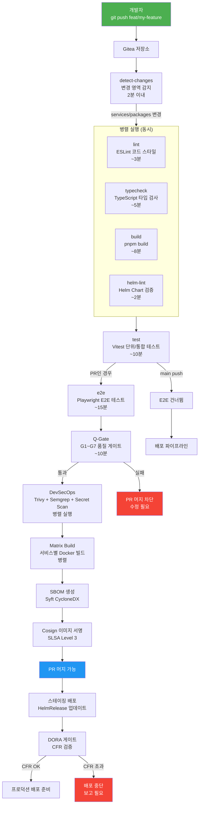

# CI 파이프라인 따라가기

> **버전**: 1.0.0 | **작성일**: 2026-04-11
> **대상**: CI/CD를 처음 접하는 신규 개발자
> **소요 시간**: 약 60분
> **Design Ref**: MTU-N244 S3.1 — CI 파이프라인 병렬화
> **Plan SC**: FR-N244.1~FR-N244.5
> **CSAP**: D-12 (시스템 개발 보안), D-13 (변경 관리)

---

## 목차

1. [PR 생성부터 머지까지 전체 흐름](#1-pr-생성부터-머지까지-전체-흐름)
2. [각 단계 상세 설명](#2-각-단계-상세-설명)
3. [CI 실패 시 디버깅 방법](#3-ci-실패-시-디버깅-방법)
4. [파이프라인 로그 읽는 법](#4-파이프라인-로그-읽는-법)
5. [실습: 의도적 실패 만들고 수정하기](#5-실습-의도적-실패-만들고-수정하기)
6. [자주 겪는 문제와 해결법](#6-자주-겪는-문제와-해결법)

---

## 1. PR 생성부터 머지까지 전체 흐름

### 1.1 전체 파이프라인 다이어그램



### 1.2 단계별 소요 시간

| 단계 | 소요 시간 | 병렬 여부 |
|------|---------|---------|
| detect-changes | ~2분 | 단독 |
| lint + typecheck + build + helm-lint | ~8분 | 병렬 실행 |
| test | ~10분 | 단독 |
| e2e (PR만) | ~15분 | 단독 |
| Q-Gate (PR만) | ~10분 | 병렬 실행 |
| DevSecOps | ~10분 | 병렬 실행 |
| Matrix Build + SBOM + Sign | ~15분 | 병렬 실행 |
| **전체 (PR 기준)** | **약 40~50분** | |

---

## 2. 각 단계 상세 설명

### 2.1 detect-changes — 변경 영역 감지

이 단계는 "이번 커밋에서 어떤 영역이 바뀌었는가"를 파악하여 불필요한 작업을 건너뛰게 합니다.

```yaml
# .gitea/workflows/ci.yml 발췌
detect-changes:
  outputs:
    services_changed: true/false   # platform/services/ 하위 변경
    packages_changed: true/false   # packages/ 하위 변경
    infra_changed: true/false      # infra/ 하위 변경
    docs_only: true/false          # 문서만 변경 (CI 건너뜀)
```

**실제 동작 예시**:

```bash
# 문서만 수정한 경우
docs/guides/onboarding/README.md 만 변경
→ docs_only=true
→ lint, test, build 모두 건너뜀
→ 즉시 통과 (CI 시간 절약)

# 서비스 코드 수정한 경우
platform/services/auth-service/src/routes.ts 변경
→ services_changed=true
→ 전체 CI 파이프라인 실행
```

### 2.2 lint — ESLint 코드 스타일 검사

**목적**: 코딩 컨벤션 위반, 잠재적 버그 패턴 자동 탐지

```bash
# 로컬에서 미리 실행
pnpm run lint

# 특정 파일만 검사
pnpm eslint platform/services/auth-service/src/
```

**자주 발생하는 lint 오류**:

```typescript
// ❌ no-explicit-any 규칙 위반
function process(data: any) { ... }

// ✅ 수정
function process(data: unknown) { ... }
function process(data: UserInput) { ... }  // 타입 정의 후 사용

// ❌ no-unused-vars 규칙 위반
import { unusedFunction } from './utils';

// ✅ 수정: 미사용 import 제거

// ❌ 하드코딩 비밀 탐지 (no-secrets 플러그인)
const apiKey = 'sk-1234567890abcdef';

// ✅ 수정: 환경 변수 사용
const apiKey = process.env.AI_API_KEY;
```

**lint 규칙 파일 위치**: `.eslintrc.json` 또는 `eslint.config.js`

### 2.3 typecheck — TypeScript 타입 검사

**목적**: 런타임 이전에 타입 오류를 컴파일 시점에 잡아냄

```bash
# 로컬에서 미리 실행
pnpm run typecheck

# 특정 패키지만 검사
pnpm -F @public-saas/auth-service typecheck
```

**자주 발생하는 타입 오류**:

```typescript
// ❌ Property 'userId' does not exist on type 'Request'
app.get('/profile', (req, res) => {
  const userId = req.userId;  // Express Request에는 userId 없음
});

// ✅ 수정: Express Request 확장 타입 사용
app.get('/profile', (req: AuthenticatedRequest, res) => {
  const userId = req.userId;  // AuthenticatedRequest에 userId 정의됨
});

// ❌ Argument of type 'string | undefined' not assignable to 'string'
const name: string = req.query.name;  // query 값은 undefined일 수 있음

// ✅ 수정
const name: string = req.query.name as string ?? 'unknown';
// 또는 Zod로 검증 (CSAP D-12 권장)
const { name } = querySchema.parse(req.query);
```

### 2.4 build — pnpm 빌드

**목적**: TypeScript를 JavaScript로 트랜스파일하고 번들 에러 확인

```bash
# 로컬에서 미리 실행
pnpm run build

# 특정 패키지만 빌드
pnpm -F @public-saas/auth-service build
```

빌드 중 `Cannot find module` 오류가 발생하면 import 경로를 확인합니다.

### 2.5 helm-lint — Helm Chart 유효성 검사

**목적**: Kubernetes 배포 설정 파일(Helm Chart)의 문법 오류 사전 탐지

```bash
# 로컬에서 미리 실행
helm lint infra/charts/auth-service/

# 실제 값으로 렌더링하여 검사
helm template auth-service infra/charts/auth-service/ \
  -f infra/charts/auth-service/values-stg.yaml | kubectl apply --dry-run=client -f -
```

### 2.6 test — Vitest 단위/통합 테스트

**목적**: 코드 동작의 정확성 검증, 회귀 방지

```bash
# 로컬에서 실행
pnpm run test

# watch 모드 (개발 중)
pnpm run test --watch

# 커버리지 포함
pnpm run test --coverage
```

**Q-Gate G4**: 커버리지 80% 미만이면 PR 머지 차단됩니다.

```
Coverage report:
  Statements:  82.3% (목표: 80% 이상) ✅
  Branches:    79.1% (목표: 80% 이상) ❌  ← 통과 실패!
  Functions:   88.2% (목표: 80% 이상) ✅
  Lines:       83.5% (목표: 80% 이상) ✅
```

Branches 커버리지가 낮으면 if/else 분기 중 테스트되지 않은 경로가 있다는 의미입니다.

### 2.7 Docker BuildKit 빌드

**목적**: 최적화된 Docker 이미지 생성

```bash
# 로컬에서 이미지 빌드
docker build \
  --build-arg SERVICE_NAME=auth-service \
  -t localhost:8080/public-saas/auth-service:local \
  platform/services/auth-service/

# BuildKit 캐시 활용 (빌드 속도 향상)
docker buildx build \
  --cache-from type=registry,ref=localhost:8080/public-saas/cache \
  --cache-to type=registry,ref=localhost:8080/public-saas/cache \
  -t localhost:8080/public-saas/auth-service:latest \
  platform/services/auth-service/
```

**멀티스테이지 빌드 구조**:

```dockerfile
# 일반적인 Dockerfile 구조
FROM node:22-alpine AS builder    # 빌드 스테이지
WORKDIR /app
COPY package.json pnpm-lock.yaml ./
RUN pnpm install --frozen-lockfile
COPY . .
RUN pnpm build

FROM node:22-alpine AS runtime    # 실행 스테이지 (크기 최소화)
WORKDIR /app
COPY --from=builder /app/dist ./dist
COPY --from=builder /app/node_modules ./node_modules
# ❌ 시크릿, 빌드 도구, 테스트 파일 포함 금지
CMD ["node", "dist/index.js"]
```

### 2.8 Cosign 이미지 서명 (SLSA Level 3)

**목적**: 이미지가 공식 파이프라인에서 빌드되었음을 암호학적으로 증명

```bash
# 서명 확인 (배포 전 검증)
cosign verify \
  --certificate-identity=https://gitea.example.com/ci \
  --certificate-oidc-issuer=https://gitea.example.com \
  localhost:8080/public-saas/auth-service:v1.2.3
```

Kyverno 정책으로 서명되지 않은 이미지는 클러스터에 배포가 차단됩니다 (CSAP D-11).

---

## 3. CI 실패 시 디버깅 방법

### 3.1 실패 원인 파악 순서

```
Step 1: Gitea PR 화면에서 실패한 체크 확인
         → 어떤 단계(lint/test/build)가 실패했는가?

Step 2: 실패한 단계의 로그 클릭
         → 정확한 오류 메시지 확인

Step 3: 로컬에서 같은 명령어 실행
         → pnpm run lint / pnpm run test / pnpm run build

Step 4: 오류 수정 후 커밋 + 푸시
         → 자동으로 CI 재실행
```

### 3.2 빠른 디버깅 체크리스트

```bash
# 1. lint 실패 시
pnpm run lint 2>&1 | head -50  # 첫 50줄 오류 확인

# 2. typecheck 실패 시
pnpm run typecheck 2>&1 | grep "error TS"

# 3. test 실패 시
pnpm run test 2>&1 | grep -A 10 "FAIL"

# 4. build 실패 시
pnpm run build 2>&1 | tail -30  # 마지막 30줄 확인
```

### 3.3 "내 로컬은 되는데 CI가 실패"하는 경우

```
원인 1: 로컬에서 설치 후 lock 파일이 업데이트되지 않음
  해결: pnpm install --frozen-lockfile 로컬에서 실행

원인 2: 로컬 환경변수가 있는데 CI 환경에 없음
  해결: CI 환경변수 설정 확인 (Settings → Secrets)

원인 3: 파일 경로 대소문자 차이 (Mac은 대소문자 무시)
  해결: import 경로 정확히 확인 (Linux는 대소문자 구분)

원인 4: 로컬에 전역 설치된 도구에 의존
  해결: package.json devDependencies에 도구 추가
```

---

## 4. 파이프라인 로그 읽는 법

### 4.1 Gitea Actions 로그 접근

```
1. Gitea PR 페이지 → "Checks" 탭
2. 실패한 체크 항목 클릭
3. 실패한 Step 클릭 → 로그 펼치기
```

### 4.2 로그 구조 이해

```
[2026-04-11T09:15:00Z] Step: Run lint
[2026-04-11T09:15:01Z] > pnpm run lint
[2026-04-11T09:15:02Z]
[2026-04-11T09:15:02Z] platform/services/auth-service/src/routes.ts
[2026-04-11T09:15:02Z]   15:3  error  'userService' is defined but never used  no-unused-vars
[2026-04-11T09:15:02Z]   23:1  error  Unexpected console statement             no-console
[2026-04-11T09:15:02Z]
[2026-04-11T09:15:02Z] 2 problems (2 errors, 0 warnings)
[2026-04-11T09:15:02Z]
[2026-04-11T09:15:02Z] Process completed with exit code 1.  ← 실패
```

**읽는 포인트**:
- 파일 경로: `platform/services/auth-service/src/routes.ts`
- 줄 번호:컬럼 번호: `15:3`
- 규칙 ID: `no-unused-vars` → ESLint 규칙 문서에서 해결법 검색

### 4.3 테스트 실패 로그 읽기

```
[2026-04-11T09:20:00Z] FAIL platform/services/auth-service/src/auth.test.ts
[2026-04-11T09:20:00Z]
[2026-04-11T09:20:00Z]  ● AuthService › login › 잘못된 비밀번호로 401 반환
[2026-04-11T09:20:00Z]
[2026-04-11T09:20:00Z]   Expected: 401
[2026-04-11T09:20:00Z]   Received: 200   ← 실제로는 200이 왔음!
[2026-04-11T09:20:00Z]
[2026-04-11T09:20:00Z]   at Object.<anonymous> (auth.test.ts:45:28)
```

**읽는 포인트**:
- 테스트 이름: `AuthService › login › 잘못된 비밀번호로 401 반환`
- 기대값 vs 실제값: Expected 401, Received 200
- 위치: `auth.test.ts:45:28`

---

## 5. 실습: 의도적 실패 만들고 수정하기

### 실습 목표

CI 실패를 직접 경험하고 수정하는 과정을 연습합니다.

### 5.1 실습 준비

```bash
# 새 브랜치 생성
git checkout -b feat/ci-practice

# 예시 서비스 파일 찾기
ls platform/services/auth-service/src/
```

### 5.2 Step 1 — lint 실패 만들기

```typescript
// platform/services/auth-service/src/routes.ts 에 추가
// ❌ console.log 추가 (no-console 규칙 위반)
console.log('디버깅용 로그 — lint 실패 예정');

// ❌ 미사용 변수 추가
const unusedVariable = '나는 쓰이지 않는다';
```

```bash
# 로컬에서 확인
pnpm run lint
# → 오류 메시지 확인
```

### 5.3 Step 2 — 수정하기

```typescript
// console.log 제거
// 미사용 변수 제거

// 또는 디버깅이 필요하다면 logger 사용
import { logger } from '@/lib/logger';
logger.debug({ context: 'routes' }, '디버깅 정보');
```

```bash
# 수정 후 재확인
pnpm run lint
# → 오류 없음 확인
```

### 5.4 Step 3 — 커밋 및 푸시

```bash
git add -A
git commit -m "fix(auth): lint 오류 수정 연습"
git push origin feat/ci-practice
```

Gitea에서 PR을 생성하고 CI가 통과하는지 확인합니다.

### 5.5 실습 정리

```bash
# 실습 완료 후 브랜치 삭제
git checkout stg
git branch -d feat/ci-practice
```

---

## 6. 자주 겪는 문제와 해결법

### 6.1 pnpm install 실패

```
ERROR: The "node_modules/.pnpm" directory structure is corrupted
```

해결:
```bash
# 캐시 정리
pnpm store prune
rm -rf node_modules
pnpm install
```

### 6.2 Docker 빌드 실패 — 레이어 캐시 문제

```
Error: COPY failed: file not found in build context
```

해결:
```bash
# .dockerignore 파일 확인
cat .dockerignore

# 필요한 파일이 제외되어 있는지 확인
docker build --no-cache -t test:local .
```

### 6.3 테스트 타임아웃

```
● Test suite failed to run
  Timeout - Async callback was not invoked within 5000ms
```

해결:
```typescript
// vitest.config.ts에서 타임아웃 조정
export default defineConfig({
  test: {
    testTimeout: 30000,  // 30초로 늘리기
  }
});

// 또는 개별 테스트에 타임아웃 설정
it('DB 연결 테스트', { timeout: 15000 }, async () => {
  // ...
});
```

### 6.4 Cosign 서명 실패

```
Error: cosign: failed to sign: error verifying certificate
```

해결: DevOps팀에 문의. Cosign 인증서 갱신이 필요한 경우입니다.

---

## 다음 단계

CI 파이프라인의 전체 흐름을 이해했습니다. 다음은 Q-Gate의 각 단계를 더 깊이 이해합니다.

`02-quality-gate.md`로 이동하십시오.

---

> **참조**: `.gitea/workflows/ci.yml` — CI 파이프라인 전체 설정
> **참조**: `.gitea/workflows/matrix-build.yml` — Docker 이미지 병렬 빌드
> **Design Ref**: MTU-N244 S3.1 — CI 파이프라인 병렬화
> **CSAP 연관**: D-12 (시스템 개발 보안), D-13 (변경 관리 — PR 승인 게이트)
