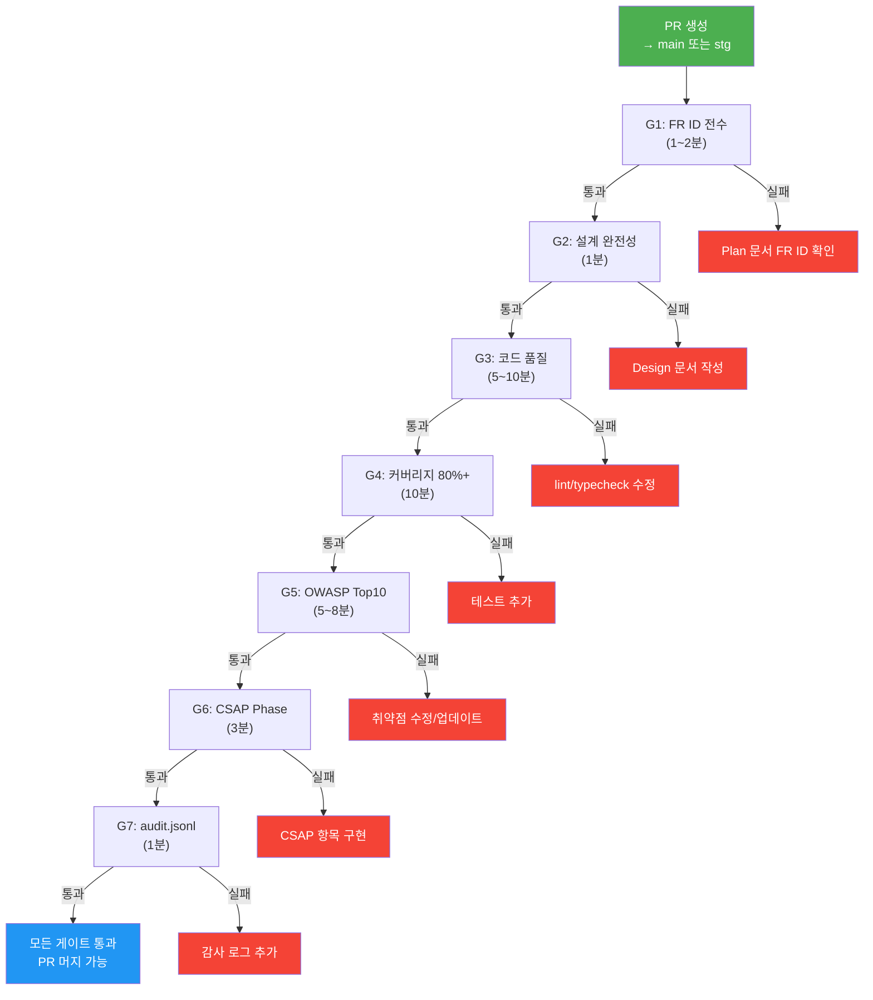

# Q-Gate 품질 게이트 심화

> **버전**: 1.0.0 | **작성일**: 2026-04-11
> **대상**: CI 파이프라인 기초를 마친 개발자
> **전제 조건**: `01-ci-walkthrough.md` 학습 완료
> **소요 시간**: 약 45분
> **Design Ref**: MTU-N250 S3
> **Plan SC**: FR-N250.1~FR-N250.4
> **CSAP**: D-12 (시스템 개발 보안), D-13 (변경 관리)

---

## 목차

1. [Q-Gate란? — 7단계 품질 검문소](#1-q-gate란--7단계-품질-검문소)
2. [G1~G7 각 게이트 상세 설명](#2-g1g7-각-게이트-상세-설명)
3. [Q-Gate 흐름 분석](#3-q-gate-흐름-분석)
4. [로컬에서 Q-Gate 사전 점검하는 법](#4-로컬에서-q-gate-사전-점검하는-법)
5. [자주 실패하는 케이스와 해결법](#5-자주-실패하는-케이스와-해결법)

---

## 1. Q-Gate란? — 7단계 품질 검문소

### 1.1 공항 출국 심사 비유

Q-Gate(Quality Gate)는 코드가 프로덕션에 배포되기 전에 통과해야 하는 7개의 자동화된 검문소입니다.

```
공항 비유:
  G1: 여권 확인 (신분 증명 — FR ID 존재 확인)
  G2: 항공권 확인 (목적지 — 설계 완전성)
  G3: 금속 탐지기 (보안 — 코드 품질)
  G4: 액체류 검사 (안전성 — 테스트 커버리지)
  G5: 수하물 X-ray (위험물 — OWASP 취약점)
  G6: 최종 게이트 (적격성 — CSAP 준수)
  G7: 탑승 확인 (기록 — 감사 로그)
```

하나라도 통과하지 못하면 PR 머지가 차단됩니다.

### 1.2 Q-Gate가 필요한 이유

CLAUDE.md §6에서 정의된 7단계 품질 게이트는 공공기관 서비스의 품질과 보안을 자동으로 보장합니다.

```
수동 검토만 있을 때:
  개발자 A: "PR 리뷰 시간이 없어서 대충 확인했다"
  → 보안 취약점이 프로덕션에 배포됨
  → CSAP 감사에서 결함 발견

Q-Gate 자동화:
  모든 PR에 대해 동일한 기준으로 자동 검증
  → 사람의 실수 없이 일관성 있는 품질 보장
  → CSAP 감사 증거 자동 생성
```

---

## 2. G1~G7 각 게이트 상세 설명

### 2.1 G1: FR ID 전수 (요구사항 추적)

**목적**: 구현에 대응하는 요구사항 ID가 존재하는지 확인

```bash
# 자동화된 검사 내용
# Plan 문서에서 FR ID 개수 확인
grep -roh 'FR-[A-Z0-9]*\.[0-9]*' docs/01-plan/mtus/*.plan.md | wc -l
```

**통과 조건**: Plan 문서에 FR ID가 1개 이상 정의되어 있어야 함

**실패 시 조치**:
```
❌ 실패: Plan 문서에 FR ID가 없습니다
✅ 해결: 해당 기능의 Plan 문서를 먼저 작성하거나
         기존 Plan 문서의 FR ID를 확인합니다
         (CLAUDE.md §1: "구현 착수 전 Plan + Design 문서 완비 필수")
```

**FR ID 형식 예시**:
```
FR-1.1    → 모듈 1의 기능 요구사항 1
FR-AUTH.1 → 인증 모듈의 기능 요구사항 1
NFR-1     → 비기능 요구사항 1
AI-REQ-1  → AI 연동 요구사항 1
```

### 2.2 G2: 설계 완전성 (문서 검사)

**목적**: 구현에 앞서 설계 문서가 준비되었는지 확인

```bash
# 자동화된 검사 내용
# Design 문서와 Plan 문서의 연결 확인
ls docs/02-design/features/*.design.md
```

**통과 조건**: 변경된 기능에 대응하는 Design 문서가 존재해야 함

**실패 시 조치**:
```
❌ 실패: Design 문서 없이 구현 시작
✅ 해결: docs/02-design/features/ 에 .design.md 파일 작성 후 재시도
```

### 2.3 G3: 코드 품질 (AgentShield 102규칙)

**목적**: 코딩 표준 준수, 잠재적 버그 패턴 제거

```bash
# 자동화된 검사 내용
pnpm run lint                    # ESLint 규칙 확인
pnpm run typecheck               # TypeScript 타입 안전성
npx ts-prune --error             # 미사용 export 탐지 (dead code)
```

**통과 조건**: lint 오류 0개, 타입 오류 0개, 미사용 export 0개

**AgentShield 102개 규칙 주요 카테고리**:

| 카테고리 | 규칙 수 | 예시 |
|---------|---------|------|
| 보안 | 30개 | 하드코딩 시크릿 금지, SQL 주입 패턴 |
| 코드 품질 | 35개 | 함수 크기, 중첩 깊이, 복잡도 |
| TypeScript | 25개 | any 타입 금지, 엄격 모드 |
| 감사 | 12개 | 민감 작업 로그 누락 탐지 |

### 2.4 G4: 테스트 커버리지 80%+

**목적**: 코드의 80% 이상이 테스트로 검증됨을 보장

```bash
# 자동화된 검사 내용
pnpm run test --coverage

# 결과 예시
Coverage:
  Statements:  85.2% ✅
  Branches:    81.7% ✅
  Functions:   88.9% ✅
  Lines:       84.3% ✅
```

**통과 조건**: 모든 커버리지 지표 80% 이상

**커버리지 80%를 맞추기 어려울 때**:

```typescript
// 테스트가 어려운 코드의 예시와 해결법

// ❌ 테스트하기 어려운 구조 (외부 의존성이 직접 연결됨)
async function getUser(userId: string) {
  const db = new Database(process.env.DB_URL);  // 직접 생성
  return db.findUser(userId);
}

// ✅ 테스트하기 쉬운 구조 (의존성 주입)
async function getUser(userId: string, db: Database) {
  return db.findUser(userId);
}

// 테스트 코드
it('사용자 조회', async () => {
  const mockDb = { findUser: vi.fn().mockResolvedValue({ id: 'user-1' }) };
  const result = await getUser('user-1', mockDb as any);
  expect(result.id).toBe('user-1');
});
```

**커버리지 제외 대상**:
```typescript
/* istanbul ignore next */
// 위 주석이 있는 코드는 커버리지 계산에서 제외
// 단, 남용 금지 — 실제 테스트 불가능한 경우에만 사용
```

### 2.5 G5: OWASP Top10 통과

**목적**: 웹 애플리케이션의 10대 보안 취약점 자동 탐지

```bash
# 자동화된 검사 도구
# Trivy: Docker 이미지 + 의존성 CVE 스캔
trivy fs --severity HIGH,CRITICAL .

# Semgrep: SAST (정적 보안 분석)
semgrep --config=p/owasp-top-10 .

# Secret Scan: 하드코딩된 시크릿 탐지
detect-secrets scan --all-files
```

**OWASP Top10 중 개발자가 직접 방지해야 하는 항목**:

| 순위 | 취약점 | 우리 대응 방법 |
|------|--------|-------------|
| A01 | 접근 제어 오류 | RBAC 검사 (모든 API 엔드포인트) |
| A02 | 암호화 실패 | AES-256 저장, TLS 1.3 전송 |
| A03 | 주입 (SQL, XSS) | Zod 입력 검증, 파라미터화 쿼리 |
| A07 | 인증 실패 | JWT + 블랙리스트, bcrypt 해시 |
| A09 | 보안 로깅 실패 | auditLog() 필수 호출 |

**CRITICAL 취약점 발견 시**:
```
G5 실패 → PR 머지 즉시 차단
→ 취약한 의존성은 pnpm update [패키지명] 으로 업데이트
→ 코드 취약점은 Semgrep 결과 메시지 참조하여 수정
```

### 2.6 G6: CSAP Phase 100%

**목적**: CSAP 79개 통제항목 중 해당 Phase의 모든 항목이 구현되었는지 확인

```bash
# 자동화된 검사 내용
# csap-evidence.yml 워크플로우에서 CSAP 증거 수집
# 항목별 증거 파일 존재 여부 확인
```

**통과 조건**: 해당 스프린트의 CSAP 항목 100% 구현

**G6 관련 주요 CSAP 항목 (개발자 관련)**:

```
D-08: 모든 API에 RBAC 검사 → 코드 리뷰에서 확인
D-09: 민감 데이터 암호화 → Semgrep SAST로 자동 탐지
D-12: Zod 입력 검증 → PR 리뷰에서 확인
```

### 2.7 G7: 감사 추적 audit.jsonl 완비

**목적**: 모든 민감 작업에 감사 로그가 존재하는지 확인

```bash
# 자동화된 검사 내용
# audit.jsonl 파일 무결성 확인
# 새로운 민감 작업에 auditLog() 호출이 있는지 확인
jq '. | select(.timestamp)' .claude/audit.jsonl | wc -l
```

**통과 조건**: audit.jsonl 파일이 있고, 새로운 민감 작업에 감사 로그 호출이 있어야 함

**G7 실패 시 가장 흔한 원인**:

```typescript
// ❌ G7 실패: 민감 작업에 감사 로그 없음
async function deleteUser(userId: string) {
  await db.users.delete(userId);  // 감사 로그 없음!
}

// ✅ G7 통과: 감사 로그 추가
async function deleteUser(adminUser: User, userId: string) {
  await auditLog({
    actor: adminUser.id,
    action: 'USER_DELETE',
    target: userId,
    timestamp: new Date().toISOString(),
    ip: getClientIP(),
  });
  await db.users.delete(userId);
}
```

---

## 3. Q-Gate 흐름 분석



---

## 4. 로컬에서 Q-Gate 사전 점검하는 법

PR 생성 전에 로컬에서 미리 검사하면 CI 실패를 줄일 수 있습니다.

### 4.1 빠른 사전 점검 스크립트

```bash
#!/bin/bash
# 파일: scripts/pre-pr-check.sh
# PR 제출 전 로컬 사전 점검

echo "=== Q-Gate 로컬 사전 점검 ==="

echo ""
echo "[G3] 코드 품질 검사..."
pnpm run lint
if [ $? -ne 0 ]; then
  echo "❌ G3 실패: lint 오류가 있습니다"
  exit 1
fi

pnpm run typecheck
if [ $? -ne 0 ]; then
  echo "❌ G3 실패: typecheck 오류가 있습니다"
  exit 1
fi
echo "✅ G3 통과"

echo ""
echo "[G4] 테스트 커버리지 검사..."
pnpm run test --coverage
if [ $? -ne 0 ]; then
  echo "❌ G4 실패: 테스트 실패 또는 커버리지 부족"
  exit 1
fi
echo "✅ G4 통과"

echo ""
echo "[G5] 보안 취약점 검사..."
npx detect-secrets scan --all-files 2>&1 | grep -v "^#"
echo "ℹ️  하드코딩 시크릿이 없는지 위 결과를 확인하십시오"

echo ""
echo "[G7] 감사 로그 확인..."
# 새로운 민감 함수에 auditLog() 가 있는지 간단 확인
git diff --name-only HEAD~1 | xargs grep -l "delete\|admin\|RBAC" 2>/dev/null | while read file; do
  if ! grep -q "auditLog" "$file" 2>/dev/null; then
    echo "⚠️  $file: 민감 작업이 있는 것 같지만 auditLog()가 없습니다"
  fi
done

echo ""
echo "=== 사전 점검 완료 ==="
echo "G1, G2, G6은 CI에서 자동 검사됩니다"
```

```bash
# 스크립트 실행 권한 부여
chmod +x scripts/pre-pr-check.sh

# PR 제출 전 실행
./scripts/pre-pr-check.sh
```

### 4.2 개별 검사 명령어 모음

```bash
# G3 - lint
pnpm run lint
pnpm run lint --fix  # 자동 수정 가능한 항목 자동 수정

# G3 - typecheck
pnpm run typecheck

# G3 - dead code 탐지
npx ts-prune 2>/dev/null | grep -v "(used in module)"

# G4 - 커버리지 확인
pnpm run test --coverage
# 결과 파일: coverage/lcov-report/index.html 브라우저에서 열기

# G5 - 시크릿 스캔
npx detect-secrets scan --all-files

# G5 - 의존성 취약점 (pnpm 내장)
pnpm audit --audit-level=high

# G7 - 감사 로그 확인
cat .claude/audit.jsonl | tail -20 | jq .
```

---

## 5. 자주 실패하는 케이스와 해결법

### 케이스 1: G3 — TypeScript strict 모드 오류

```typescript
// 오류: Object is possibly 'undefined'
const user = users.find(u => u.id === userId);
console.log(user.name);  // ❌ user가 undefined일 수 있음

// 해결 1: Optional chaining
console.log(user?.name);

// 해결 2: null 체크
if (!user) throw new Error(`User ${userId} not found`);
console.log(user.name);  // 이제 안전

// 해결 3: 단언 (확실히 존재할 때만)
const user = users.find(u => u.id === userId)!;
console.log(user.name);
```

### 케이스 2: G4 — 특정 서비스만 커버리지 부족

```bash
# 서비스별 커버리지 확인
pnpm run test --coverage 2>&1 | grep -A 5 "auth-service"

# 커버리지 낮은 파일 식별
# coverage/lcov-report/index.html 열어서 빨간 줄 확인
```

```typescript
// 분기(Branch) 커버리지 높이기
// 테스트에서 모든 if/else 경로를 테스트해야 함

// 함수 코드
function getDiscount(userType: 'premium' | 'regular'): number {
  if (userType === 'premium') return 0.2;  // 분기 1
  return 0;                                 // 분기 2
}

// 테스트 (두 분기 모두 테스트)
it('프리미엄 사용자 20% 할인', () => {
  expect(getDiscount('premium')).toBe(0.2);
});
it('일반 사용자 할인 없음', () => {
  expect(getDiscount('regular')).toBe(0);
});
```

### 케이스 3: G5 — Semgrep SAST 경고

```
semgrep-security: Detected SQL injection vulnerability
  src/repositories/user.repository.ts:45
  const query = `SELECT * FROM users WHERE email = '${email}'`;
```

해결:
```typescript
// ❌ 직접 문자열 결합 (SQL 주입 취약)
const query = `SELECT * FROM users WHERE email = '${email}'`;

// ✅ 파라미터화 쿼리 (CSAP D-12 준수)
const result = await db.execute(
  'SELECT * FROM users WHERE email = $1',
  [email]
);
```

### 케이스 4: G5 — npm 패키지 HIGH CVE

```
HIGH: lodash@4.17.20 - Prototype Pollution (CVE-2021-23337)
```

해결:
```bash
# 특정 패키지 업데이트
pnpm update lodash

# 최신 버전으로 강제 업데이트
pnpm update lodash --latest

# CVE가 수정된 버전 확인 후 지정
pnpm add lodash@4.17.21
```

### 케이스 5: G7 — 감사 로그 파일 오류

```
Error: .claude/audit.jsonl is not valid JSON Lines
```

해결:
```bash
# audit.jsonl 파일 유효성 확인
jq -c '.' .claude/audit.jsonl

# 마지막 항목 확인
tail -5 .claude/audit.jsonl

# 손상된 줄 확인 (jq 파싱 오류 줄 번호)
jq -c '.' .claude/audit.jsonl 2>&1 | grep "parse error"
```

---

## 다음 단계

Q-Gate의 모든 단계를 이해했습니다. 다음은 코드가 실제 서버에 배포되는 GitOps 방식을 배울 차례입니다.

`../deployment/01-gitops-deploy.md`로 이동하십시오.

---

> **참조**: `.gitea/workflows/quality-gate.yml` — Q-Gate 전체 워크플로우
> **참조**: `.claude/rules/csap-compliance.md` — CSAP 준수 규칙
> **Design Ref**: MTU-N250 S3 — Q-Gate 자동화 설계
> **Plan SC**: FR-N250.1 (G1-G3), FR-N250.2 (G4), FR-N250.3 (G5-G6), FR-N250.4 (G7)
