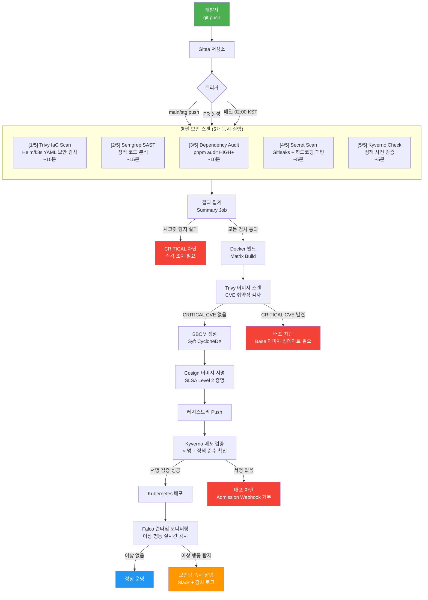
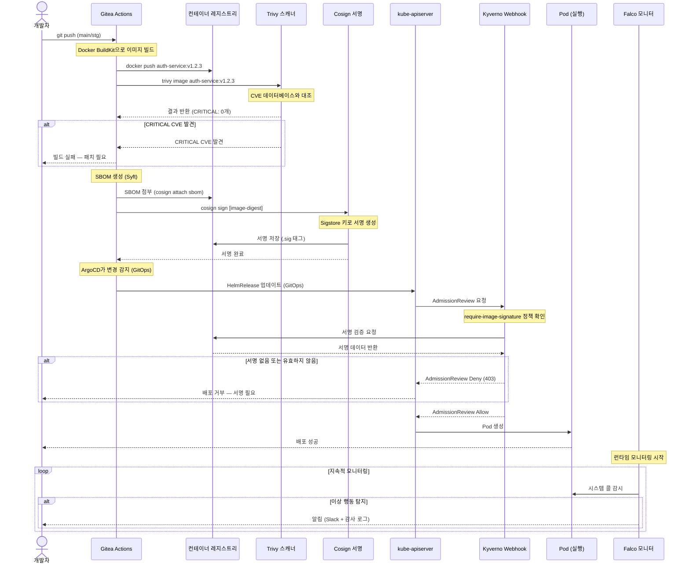
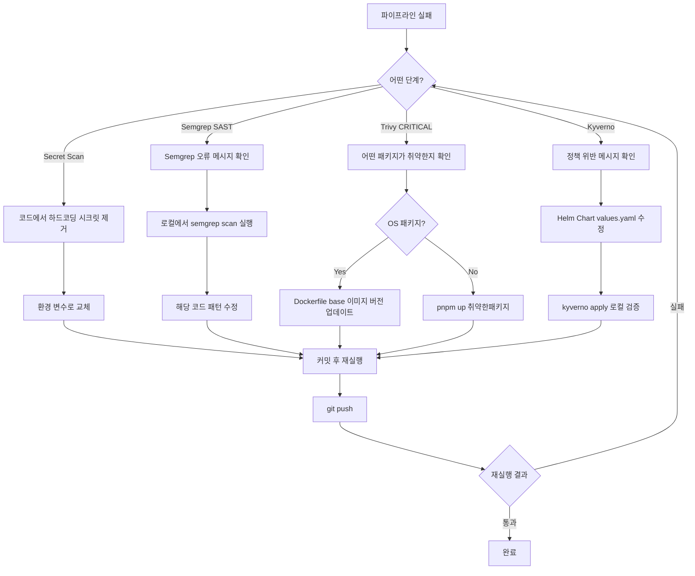

# DevSecOps 파이프라인 — 보안을 개발 과정에 내재화하기

> **버전**: 1.0.0 | **작성일**: 2026-04-12
> **대상**: 보안 검사 도구를 처음 접하는 신규 개발자
> **전제 조건**: `01-ci-walkthrough.md`, `02-quality-gate.md` 학습 완료
> **소요 시간**: 약 90분
> **Design Ref**: MTU-N246 S3.1~S3.5 — DevSecOps 통합
> **Plan SC**: FR-N246.1~FR-N246.6
> **CSAP**: D-05 (공급망 보안), D-08 (접근 통제), D-11 (가상화 보안), D-12 (시스템 개발 보안)

---

## 목차

1. [DevSecOps란?](#1-devsecops란)
2. [이 프로젝트의 DevSecOps 도구](#2-이-프로젝트의-devsecops-도구)
3. [파이프라인 전체 흐름](#3-파이프라인-전체-흐름)
4. [Semgrep — 정적 코드 분석](#4-semgrep--정적-코드-분석)
5. [Trivy — 취약점 스캔](#5-trivy--취약점-스캔)
6. [Cosign — 이미지 서명 (SLSA)](#6-cosign--이미지-서명-slsa)
7. [Kyverno — 정책 엔진](#7-kyverno--정책-엔진)
8. [Falco — 런타임 이상 탐지](#8-falco--런타임-이상-탐지)
9. [Q-Gate G5 (OWASP Top 10) 통과 방법](#9-q-gate-g5-owasp-top-10-통과-방법)
10. [Q-Gate G6 (CSAP)와의 관계](#10-q-gate-g6-csap와의-관계)
11. [이미지 빌드부터 배포까지 시퀀스](#11-이미지-빌드부터-배포까지-시퀀스)
12. [자주 겪는 문제와 해결법](#12-자주-겪는-문제와-해결법)

---

## 1. DevSecOps란?

### 1.1 Dev + Sec + Ops — 세 가지를 통합하다

전통적인 소프트웨어 개발에서 보안(Security)은 배포 직전, 또는 배포 이후에 별도 팀이 수행하는 "마지막 단계"였습니다. 문제를 늦게 발견할수록 수정 비용이 기하급수적으로 높아집니다.

```
전통 방식:
  개발 완료 → 테스트 완료 → 보안 검사 → 문제 발견 → 재개발
  (수정 비용: 최대 100배)

DevSecOps:
  개발 중 자동 보안 검사 → 즉시 피드백 → 즉시 수정
  (수정 비용: 1배)
```

**DevSecOps**는 Development(개발), Security(보안), Operations(운영) 세 가지를 처음부터 통합하는 방법론입니다. 핵심 원칙은 **Shift-Left Security** — "보안 검사를 개발 과정의 왼쪽(초기)으로 이동"입니다.

```
코드 작성 → 커밋 → [보안 자동 검사] → PR → 배포
              ↑
         여기서 자동으로 잡아냄
```

### 1.2 공공기관 SaaS에서 DevSecOps가 필수인 이유

일반 기업과 달리 공공기관 SaaS는 CSAP(클라우드 보안 인증)를 유지해야 합니다. CSAP 감사에서 보안 취약점이 발견되면 인증이 취소될 수 있습니다.

```
CSAP 감사 시나리오:
  감사원: "SQL 주입 취약점이 있습니까?"
  우리: "아니요, Semgrep이 매일 자동으로 검사하고 있습니다."
  감사원: "증거를 보여주세요."
  우리: "CI 파이프라인 로그 + 아티팩트를 제출합니다."
```

DevSecOps는 보안 검사의 **자동화된 증거**를 생성하여 CSAP 감사 시 즉시 제출할 수 있게 합니다.

### 1.3 개발자 입장에서 바뀌는 것

DevSecOps를 도입하면 개발자 경험이 다음과 같이 바뀝니다.

| 이전 | DevSecOps 도입 후 |
|------|-----------------|
| 배포 전날 보안팀 검사 의뢰 | PR 생성 시 자동 검사 (~10분) |
| 보안 문제 발견 시 배포 지연 (수일~수주) | 즉시 피드백, 같은 날 수정 가능 |
| "내 코드에 취약점이 있는지 모름" | 커밋하면 즉시 알려줌 |
| 수동 보안 체크리스트 | 102개 규칙 자동 적용 |

---

## 2. 이 프로젝트의 DevSecOps 도구

이 프로젝트에서 사용하는 보안 도구는 총 5가지입니다. 각 도구는 서로 다른 레이어를 방어합니다.

```
보안 레이어별 도구:

  소스코드 레이어    → Semgrep (SAST 정적 분석)
  의존성 레이어      → pnpm audit + Trivy (CVE 스캔)
  컨테이너 레이어    → Trivy (이미지 스캔) + Cosign (서명)
  인프라 레이어      → Kyverno (정책 강제)
  런타임 레이어      → Falco (이상 행동 탐지)
```

### 2.1 Semgrep — SAST (Static Application Security Testing)

**역할**: 소스코드를 실행하지 않고 코드 패턴을 분석하여 취약점을 탐지

**쉬운 비유**: 맞춤법 검사기처럼 코드의 "보안 맞춤법"을 자동으로 검사

```
Semgrep이 탐지하는 것:
  → SQL 주입 패턴: `SELECT * FROM users WHERE id = '${userId}'`
  → 하드코딩 비밀번호: `password = "secret123"`
  → 미검증 입력: eval(req.body.code)
  → 안전하지 않은 랜덤: Math.random() (암호학적 난수 아님)
  → OWASP Top 10 패턴 (A01~A10 전체)
```

**장점**: 코드를 실행하지 않아도 됨 → 빌드 전에도 실행 가능

### 2.2 Trivy — 컨테이너 이미지 취약점 스캔

**역할**: Docker 이미지 내 OS 패키지, npm 패키지의 알려진 취약점(CVE) 탐지

**쉬운 비유**: 식품의 성분표 + 리콜 목록을 자동으로 대조

```
Trivy가 검사하는 것:
  → node:22-alpine OS 패키지 취약점
  → node_modules 내 npm 패키지 CVE
  → Dockerfile 설정 오류 (루트 실행, 불필요한 포트 등)
  → Helm Chart 보안 설정 오류
  → Kubernetes Manifest 보안 오류
```

**CVE**: Common Vulnerabilities and Exposures — 공식 등록된 보안 취약점 목록

### 2.3 Cosign — 이미지 서명 (SLSA Level 2)

**역할**: Docker 이미지가 "우리 공식 파이프라인에서 빌드된 것"임을 암호학적으로 증명

**쉬운 비유**: 공문서의 공인 서명 + 인감도장

```
Cosign이 해결하는 문제:
  "이 이미지는 정말 우리가 만든 것인가? 누군가 조작하지 않았는가?"

서명 없는 이미지:
  → 누군가 악의적으로 변조된 이미지를 레지스트리에 올릴 수 있음
  → 클러스터에 배포 시 악성코드 실행 가능

서명된 이미지:
  → 빌드 시 Cosign이 서명 생성 + 레지스트리에 저장
  → 배포 시 Kyverno가 서명 검증 → 서명 없으면 배포 차단
```

**SLSA Level 2**: Supply-chain Levels for Software Artifacts — 소프트웨어 공급망 보안 수준. Level 2는 빌드 과정이 기록되고 서명됨을 의미합니다.

### 2.4 Kyverno — 정책 엔진

**역할**: Kubernetes 클러스터에 배포되는 모든 리소스가 보안 정책을 준수하는지 강제

**쉬운 비유**: 건물 입주 심사 — 조건에 맞지 않으면 입주 불가

```
Kyverno가 강제하는 정책 예시:
  → 서명되지 않은 이미지 배포 차단 (CSAP D-11)
  → root 사용자로 실행되는 Pod 차단
  → readOnlyRootFilesystem=false인 Pod 차단
  → CPU/메모리 limits 없는 Pod 차단
  → latest 태그 이미지 배포 차단
```

**정책 종류**:
- `validate`: 규칙 위반 시 배포 차단
- `mutate`: 자동으로 안전한 설정 추가
- `generate`: 새 리소스 생성 시 필요한 리소스 자동 생성

### 2.5 Falco — 런타임 이상 행동 탐지

**역할**: 실제 실행 중인 컨테이너에서 의심스러운 행동을 실시간 탐지

**쉬운 비유**: CCTV + 경보 시스템 — 이상 행동 발생 시 즉시 알림

```
Falco가 탐지하는 것:
  → 컨테이너 내에서 shell 실행 (누군가 침입 후 명령어 실행 중)
  → 예상치 않은 네트워크 연결 (데이터 유출 시도)
  → 민감한 파일(/etc/passwd 등) 읽기
  → 파일 시스템 변경 (악성코드 설치 시도)
  → 권한 상승 시도 (sudo, chmod 등)
```

Semgrep이 "코드를 짜는 단계"를 방어한다면, Falco는 "이미 배포된 후"를 방어합니다.

---

## 3. 파이프라인 전체 흐름

### 3.1 DevSecOps 파이프라인 플로우차트



### 3.2 파이프라인 트리거 조건

| 이벤트 | DevSecOps 실행 여부 | 이유 |
|--------|-------------------|------|
| `feat/*`, `fix/*` 브랜치 push | 일부 실행 | CI는 실행, DevSecOps는 PR 생성 시 |
| PR → main, stg | **전체 실행** | 머지 전 보안 검사 필수 |
| main, stg push | **전체 실행** | 머지 직후 재검증 |
| 매일 02:00 KST | **전체 실행** | 신규 CVE 발견 위한 정기 스캔 |
| 수동 트리거 | **전체 실행** | 임시 보안 검사 필요 시 |

### 3.3 실패 심각도 분류

```
CRITICAL (파이프라인 즉시 차단):
  → 하드코딩된 API 키/비밀번호 발견 (Secret Scan)
  → Cosign 서명 없는 이미지 배포 시도 (Kyverno)
  → CRITICAL 등급 CVE가 있는 이미지 (Trivy)

HIGH (경고, 차단하지 않음):
  → IaC 보안 설정 위반 (Trivy IaC)
  → SAST 위반 발견 (Semgrep)
  → HIGH 등급 CVE (Trivy)

INFO (기록만):
  → MEDIUM/LOW 등급 CVE
  → 정책 위반이지만 예외 허용된 경우
```

---

## 4. Semgrep — 정적 코드 분석

### 4.1 로컬에서 Semgrep 실행하기

PR을 올리기 전에 로컬에서 먼저 확인하면 파이프라인 실패를 방지할 수 있습니다.

```bash
# Semgrep 설치
pip3 install semgrep

# 또는 Docker로 실행 (설치 없이)
docker run --rm -v $(pwd):/src semgrep/semgrep semgrep scan \
  --config "p/owasp-top-ten" \
  --config "p/typescript" \
  /src/platform/

# 로컬 설치 후 실행
semgrep scan \
  --config auto \
  --config "p/owasp-top-ten" \
  --config "p/typescript" \
  platform/

# 특정 파일만 검사
semgrep scan --config "p/owasp-top-ten" platform/services/auth-service/src/

# 특정 규칙만 실행
semgrep scan --config "p/secrets" platform/
```

### 4.2 Semgrep 결과 해석하기

```
실제 Semgrep 출력 예시:

  platform/services/auth-service/src/routes.ts
  Severity: ERROR  ←── 심각도 (ERROR=즉시 수정)
  Rule ID: typescript.node.security.audit.sql-injection.detect-sql-injection
  ←── 규칙 ID (검색하면 상세 설명 나옴)

    12 ┆ const query = `SELECT * FROM users WHERE id = '${userId}'`;
                         ──────────────────────────────────────────
    Detected SQL injection due to template literal interpolation.
    Use parameterized queries instead.
    ←── 발견된 문제와 해결 방법

  More details: https://semgrep.dev/r/...
  ←── 상세 문서 링크
```

**심각도 수준 이해**:

| Semgrep 심각도 | 의미 | CI 동작 |
|--------------|------|---------|
| `ERROR` | 즉각 수정 필요 (보안 취약점) | 파이프라인 실패 |
| `WARNING` | 확인 권장 (잠재적 위험) | 경고만 표시 |
| `INFO` | 참고용 | 통과 |

### 4.3 자주 발견되는 규칙과 수정법

```typescript
// 규칙: detect-sql-injection
// ❌ 발견:
const query = `SELECT * FROM users WHERE email = '${email}'`;

// ✅ 수정: Prisma ORM 사용
const user = await db.users.findFirst({ where: { email } });

// ✅ 수정: 파라미터화 쿼리
const user = await db.$queryRaw`SELECT id FROM users WHERE email = ${email}`;
```

```typescript
// 규칙: hardcoded-password / hardcoded-secret
// ❌ 발견:
const JWT_SECRET = 'my-secret-key-2026';
const API_KEY = 'sk-proj-abc123';

// ✅ 수정: 환경 변수 사용
const JWT_SECRET = process.env.JWT_SECRET;
if (!JWT_SECRET) throw new Error('JWT_SECRET 환경 변수 누락');
```

```typescript
// 규칙: insecure-random
// ❌ 발견: Math.random()으로 토큰 생성
const token = Math.random().toString(36).substr(2);

// ✅ 수정: 암호학적 난수 생성기 사용
import { randomBytes } from 'crypto';
const token = randomBytes(32).toString('hex');
```

```typescript
// 규칙: eval-injection
// ❌ 발견:
eval(req.body.expression);
new Function(userInput)();

// ✅ 수정: 허용된 연산만 명시적으로 처리
// eval은 사용자 입력에 절대 사용 금지
```

### 4.4 Semgrep 예외 처리 (정말 필요한 경우)

```typescript
// 특정 줄 예외 처리 (사유 주석 필수)
const legacyHash = md5(data); // nosemgrep: typescript.crypto.md5-used
// NOTE: 레거시 API 호환성. Phase 2에서 SHA-256으로 전환 예정 (FR-2.3)

// 파일 전체 예외 (주의: 감사 시 설명 필요)
// nosemgrep
```

**주의**: 예외 처리는 `// nosemgrep` 주석으로만 가능합니다. PR 리뷰어가 사유를 검토합니다.

---

## 5. Trivy — 취약점 스캔

### 5.1 Trivy가 스캔하는 대상

이 프로젝트에서 Trivy는 두 가지를 스캔합니다.

```
1. IaC 스캔 (CI 파이프라인에서 자동):
   → helm/ — Helm Chart 보안 설정
   → deploy/ — Kubernetes Manifest
   → infra/ — 인프라 설정 파일

2. 이미지 스캔 (Docker 빌드 후 자동):
   → 빌드된 Docker 이미지 내 OS 패키지 CVE
   → node_modules 내 npm 패키지 CVE
```

### 5.2 로컬에서 Trivy 실행하기

```bash
# Trivy 설치
curl -sfL https://raw.githubusercontent.com/aquasecurity/trivy/main/contrib/install.sh | \
  sh -s -- -b ~/.local/bin v0.58.0

# 이미지 스캔
trivy image \
  --severity CRITICAL,HIGH \
  localhost:8080/public-saas/auth-service:latest

# IaC 스캔 (Helm Chart)
trivy config \
  --severity HIGH,CRITICAL \
  helm/

# 특정 디렉토리 파일시스템 스캔
trivy fs \
  --severity HIGH,CRITICAL \
  platform/services/auth-service/

# JSON 리포트 출력
trivy image \
  --format json \
  --output trivy-report.json \
  localhost:8080/public-saas/auth-service:latest
```

### 5.3 Trivy 결과 해석하기

```
실제 Trivy 출력 예시:

  2026-04-12T09:15:00Z  INFO  Detected OS: alpine 3.19
  2026-04-12T09:15:01Z  INFO  Detecting Alpine vulnerabilities...

  localhost:8080/public-saas/auth-service:v1.2.3 (alpine 3.19.1)
  ═══════════════════════════════════════════════════════════

  Total: 3 (CRITICAL: 1, HIGH: 2)

  ┌──────────────────┬────────────────┬──────────┬──────────────────────┬──────────┬──────────────────────┐
  │    Library       │ Vulnerability  │ Severity │ Installed Version    │  Fixed   │        Title         │
  │                  │                │          │                      │ Version  │                      │
  ├──────────────────┼────────────────┼──────────┼──────────────────────┼──────────┼──────────────────────┤
  │ libssl3          │ CVE-2024-12345 │ CRITICAL │ 3.1.4-r5             │ 3.1.4-r6 │ OpenSSL Buffer Over. │
  ├──────────────────┼────────────────┼──────────┼──────────────────────┼──────────┼──────────────────────┤
  │ node             │ CVE-2024-22019 │ HIGH     │ 22.0.0               │ 22.1.0   │ HTTP Request Smuggli.│
  └──────────────────┴────────────────┴──────────┴──────────────────────┴──────────┴──────────────────────┘
```

**CVE 심각도 이해**:

| 심각도 | CVSS 점수 | 의미 | 조치 기한 |
|-------|---------|------|---------|
| `CRITICAL` | 9.0~10.0 | 원격 코드 실행 등 치명적 취약점 | **즉시 수정 필수** (배포 차단) |
| `HIGH` | 7.0~8.9 | 심각한 취약점 | 1주일 이내 수정 |
| `MEDIUM` | 4.0~6.9 | 중간 위험도 | 다음 릴리즈 포함 |
| `LOW` | 0.1~3.9 | 낮은 위험도 | 분기별 검토 |

### 5.4 CRITICAL CVE 수정 방법

```dockerfile
# Dockerfile에서 base 이미지 버전 업데이트
# ❌ 취약점이 있는 버전
FROM node:22.0.0-alpine3.19

# ✅ 수정: 패치된 버전으로 업데이트
FROM node:22.1.0-alpine3.19

# 또는 OS 패키지 직접 업데이트
FROM node:22-alpine
RUN apk upgrade --no-cache  # 모든 패키지를 최신으로 업데이트
```

```bash
# npm 패키지 취약점 수정
# 취약한 패키지 확인
pnpm audit --audit-level=high

# 자동 수정 (breaking change 없는 경우)
pnpm audit --fix

# 특정 패키지 강제 업데이트
pnpm up package-name@latest
```

### 5.5 Trivy IaC 스캔 — Helm Chart 보안 설정

```
IaC 스캔 출력 예시:

  helm/auth-service/templates/deployment.yaml (helm)
  ═══════════════════════════════════════════

  Failures: 3

  MEDIUM: Container 'auth-service' of Deployment 'auth-service'
          should set 'resources.limits.cpu'
  ← CPU 제한이 없으면 하나의 Pod이 모든 CPU를 독점할 수 있음

  HIGH: Container 'auth-service' of Deployment 'auth-service'
        should set 'securityContext.runAsNonRoot' to true
  ← 루트로 실행되면 컨테이너 탈출 시 호스트 전체 위험

  CRITICAL: Container 'auth-service' has no read-only root filesystem
  ← 파일시스템이 쓰기 가능하면 악성코드 설치 가능
```

```yaml
# ✅ 안전한 Helm Chart 보안 설정
# helm/auth-service/templates/deployment.yaml
spec:
  template:
    spec:
      securityContext:
        runAsNonRoot: true      # 루트 실행 금지 (CRITICAL 해결)
        runAsUser: 1001         # 비루트 사용자
        fsGroup: 1001
      containers:
        - name: auth-service
          securityContext:
            allowPrivilegeEscalation: false  # 권한 상승 금지
            readOnlyRootFilesystem: true      # 읽기 전용 파일시스템 (CRITICAL 해결)
            capabilities:
              drop: ["ALL"]                   # 모든 Linux 권한 제거
          resources:
            limits:
              cpu: "500m"       # CPU 제한 (MEDIUM 해결)
              memory: "512Mi"
            requests:
              cpu: "100m"
              memory: "128Mi"
```

---

## 6. Cosign — 이미지 서명 (SLSA)

### 6.1 Cosign 서명이 필요한 이유

```
문제 상황:
  1. 공격자가 레지스트리에 접근
  2. auth-service:v1.2.3 이미지를 악성 버전으로 교체
  3. ArgoCD가 이미지 Pull → 악성코드 실행

Cosign 해결책:
  1. 빌드 시 Cosign이 이미지 서명 생성 (비밀키로 서명)
  2. 서명을 레지스트리에 함께 저장
  3. Kyverno가 배포 전 서명 검증 (공개키로 검증)
  4. 서명이 없거나 유효하지 않으면 배포 차단
```

### 6.2 서명 확인 방법

```bash
# 이미지 서명 확인
cosign verify \
  --certificate-identity=https://gitea.example.com/ci \
  --certificate-oidc-issuer=https://gitea.example.com \
  localhost:8080/public-saas/auth-service:v1.2.3

# 성공 시 출력:
# [{"critical":{"identity":{"docker-reference":"..."},...},"optional":{...}}]

# 실패 시 출력:
# Error: no signatures found for image
# → Kyverno가 배포 차단

# SBOM 조회 (소프트웨어 구성 요소 목록)
cosign download sbom \
  localhost:8080/public-saas/auth-service:v1.2.3
```

### 6.3 파이프라인에서의 서명 과정

```bash
# 파이프라인 내부 동작 (.gitea/workflows/sign-image.yml 발췌)

# 1. Docker 이미지 빌드 및 Push
docker buildx build \
  --platform linux/amd64 \
  -t localhost:8080/public-saas/auth-service:${GIT_SHA} \
  --push \
  platform/services/auth-service/

# 2. 이미지 다이제스트 획득 (태그 대신 불변 다이제스트 서명)
IMAGE_DIGEST=$(docker inspect --format='{{index .RepoDigests 0}}' \
  localhost:8080/public-saas/auth-service:${GIT_SHA})

# 3. Cosign으로 서명
cosign sign \
  --key cosign.key \  # 비밀키 (Sealed Secret에 보관)
  ${IMAGE_DIGEST}

# 4. SBOM 첨부
syft localhost:8080/public-saas/auth-service:${GIT_SHA} \
  -o cyclonedx-json > sbom.json

cosign attach sbom \
  --sbom sbom.json \
  ${IMAGE_DIGEST}
```

### 6.4 SLSA Level 2가 의미하는 것

```
SLSA (Supply-chain Levels for Software Artifacts) 레벨:

  Level 1: 빌드 스크립트 존재
  Level 2: 빌드 서비스 사용 + 출처(Provenance) 기록
  ← 우리 현재 수준
  Level 3: 빌드 과정 보안 + 불변 Provenance
  Level 4: 최고 보안 (재현 가능한 빌드)

Level 2 달성 요건:
  ✅ Gitea Actions (CI 서비스)에서 빌드
  ✅ 빌드 출처(누가, 언제, 어떤 소스로 빌드했는지) 기록
  ✅ Cosign으로 서명 (조작 감지 가능)
```

---

## 7. Kyverno — 정책 엔진

### 7.1 Kyverno가 동작하는 방식

Kyverno는 Kubernetes의 **Admission Webhook**으로 동작합니다.

```
배포 요청 흐름:
  ArgoCD → kubectl apply → kube-apiserver
                                ↓
                    [Admission Webhook]
                          Kyverno
                    (정책 검사 실행)
                       ↓         ↓
                    허용       거부 (400 오류)
                 실제 배포   배포 차단
```

### 7.2 이 프로젝트의 핵심 Kyverno 정책

```yaml
# infra/kyverno/verify-image-signature.yaml
# 서명되지 않은 이미지 배포 차단 (CSAP D-11)
apiVersion: kyverno.io/v1
kind: ClusterPolicy
metadata:
  name: require-image-signature
spec:
  rules:
    - name: check-image-signature
      match:
        resources:
          kinds: [Pod]
      verifyImages:
        - imageReferences:
            - "localhost:8080/public-saas/*"  # 내부 레지스트리 이미지만 적용
          attestors:
            - entries:
                - keyless:
                    subject: "https://gitea.example.com/ci"
                    issuer: "https://gitea.example.com"
```

```yaml
# infra/security/pod-security-standards/require-non-root.yaml
# 루트 실행 Pod 차단 (CSAP D-11)
apiVersion: kyverno.io/v1
kind: ClusterPolicy
metadata:
  name: require-run-as-non-root
spec:
  rules:
    - name: run-as-non-root
      validate:
        message: "Pod은 루트 사용자로 실행할 수 없습니다"
        pattern:
          spec:
            securityContext:
              runAsNonRoot: true
```

### 7.3 로컬에서 Kyverno 정책 검증

```bash
# Kyverno CLI 설치
curl -sSfL https://github.com/kyverno/kyverno/releases/latest/download/kyverno-cli_linux_amd64.tar.gz | \
  tar xz -C ~/.local/bin kyverno

# 정책이 내 Manifest에 적용되는지 확인
kyverno apply infra/kyverno/verify-image-signature.yaml \
  --resource deploy/base/deployment.yaml

# 성공 시:
#   pass: 1  ← 정책 통과

# 실패 시:
#   fail: 1
#   policy require-image-signature/check-image-signature: image not signed
```

---

## 8. Falco — 런타임 이상 탐지

### 8.1 Falco가 탐지하는 패턴

Falco는 실제 서비스가 실행 중일 때 **이상 행동**을 실시간으로 감지합니다.

```yaml
# Falco 기본 규칙 예시

# 컨테이너에서 shell 실행 탐지 (침입 후 명령 실행)
- rule: Terminal shell in container
  condition: >
    spawned_process and container and
    shell_procs and proc.tty != 0
  output: >
    A shell was spawned in a container with an attached terminal
    (user=%user.name container=%container.name image=%container.image.repository)
  priority: NOTICE

# 민감 파일 읽기 탐지
- rule: Read sensitive file untrusted
  condition: >
    sensitive_files and open_read and
    not trusted_programs and container
  output: >
    Sensitive file opened for reading by non-trusted program
    (file=%fd.name user=%user.name container=%container.name)
  priority: WARNING
```

### 8.2 개발자가 알아야 할 Falco 규칙

개발자가 의도하지 않게 Falco 경보를 트리거할 수 있는 상황:

```
경보 트리거 상황과 대처:

1. 컨테이너에서 shell 실행
   원인: kubectl exec -it pod-name -- sh (디버깅용)
   대처: 프로덕션에서는 kubectl exec 최소화, 로그로 디버깅

2. 예상치 않은 네트워크 연결
   원인: 허용되지 않은 외부 API 직접 호출
   대처: 모든 외부 연결은 API Gateway 경유

3. 파일 시스템 쓰기
   원인: readOnlyRootFilesystem=true인데 파일 쓰기 시도
   대처: 쓰기 필요한 디렉토리는 Volume Mount로 처리
```

---

## 9. Q-Gate G5 (OWASP Top 10) 통과 방법

### 9.1 OWASP Top 10이란?

OWASP(Open Web Application Security Project)가 매년 발표하는 "가장 위험한 웹 취약점 10가지"입니다. Semgrep은 이 10가지를 자동으로 검사합니다.

```
OWASP Top 10 (2021):
  A01: Broken Access Control       → authMiddleware + hasPermission()
  A02: Cryptographic Failures      → AES-256 + TLS 1.3 + bcrypt
  A03: Injection                   → Zod 검증 + ORM (SQL 주입 방지)
  A04: Insecure Design             → 설계 단계 보안 리뷰
  A05: Security Misconfiguration   → Trivy IaC 스캔
  A06: Vulnerable Components       → pnpm audit + Trivy 이미지 스캔
  A07: Auth & Session Failures     → JWT 15분 만료 + 블랙리스트
  A08: Software Integrity Failures → Cosign 서명 + SBOM
  A09: Logging Failures            → auditLog() + Falco
  A10: Server-Side Request Forgery → URL 검증 + 내부 API 격리
```

### 9.2 G5 통과를 위한 개발자 체크리스트

PR 제출 전 다음을 확인합니다.

```bash
# 1. Semgrep 로컬 실행 (OWASP Top 10 규칙)
semgrep scan --config "p/owasp-top-ten" platform/

# 출력에 ERROR가 없어야 합니다

# 2. 하드코딩 시크릿 확인
# 코드에 다음 패턴이 없는지 확인:
grep -r "password\s*=" platform/services/ | grep -v ".env" | grep -v "process.env"
grep -r "secret\s*=" platform/services/ | grep -v ".env" | grep -v "process.env"

# 3. 모든 API 엔드포인트 인증 확인
# 각 route에 authMiddleware가 적용되어 있는지 확인
grep -r "router\." platform/services/ | grep -v "authMiddleware" | grep "get\|post\|put\|delete"

# 4. 입력 검증 확인
# Zod 사용 없이 req.body를 직접 사용하는 코드 검색
grep -r "req\.body\." platform/services/ | grep -v "schema\|parse\|safeParse"
```

### 9.3 G5 실패 시 대처 방법

```
Q-Gate G5 실패 메시지 예시:
  [FAIL] OWASP Top 10 — Semgrep 위반 2건 발견

  1. A03 Injection: platform/services/user-service/src/routes.ts:45
     SQL 주입 패턴: template literal in SQL query

  2. A09 Logging Failures: platform/services/order-service/src/handlers.ts:89
     민감 작업에 auditLog() 누락

대처:
  1. 각 위반 코드를 수정 (위 4.3 섹션 참조)
  2. 로컬에서 Semgrep 재실행하여 통과 확인
  3. 커밋 후 Push → CI 재실행
```

---

## 10. Q-Gate G6 (CSAP)와의 관계

### 10.1 G5와 G6의 차이

```
Q-Gate G5 (OWASP Top 10):
  → OWASP 국제 표준 보안 취약점 10가지 점검
  → Semgrep 자동 검사
  → 대상: 코드 레벨 취약점

Q-Gate G6 (CSAP):
  → 한국 공공기관 클라우드 보안 인증 79개 항목 점검
  → DevSecOps 도구 + 감사 로그 검사 포함
  → 대상: 코드 + 인프라 + 프로세스 전체
```

### 10.2 DevSecOps와 CSAP 항목 매핑

| DevSecOps 도구 | CSAP 항목 | 근거 |
|--------------|---------|------|
| Semgrep SAST | D-12 시스템 개발 보안 | 보안 코딩 자동 검사 |
| Trivy CVE 스캔 | D-07 취약점 관리 | 알려진 취약점 패치 |
| Trivy IaC 스캔 | D-12 시스템 개발 보안 | 인프라 설정 보안 |
| Cosign 서명 | D-11 가상화 보안 | 이미지 무결성 보장 |
| Kyverno 정책 | D-08 접근 통제, D-11 가상화 | 배포 정책 강제 |
| Falco 모니터링 | D-06 침해사고 관리 | 런타임 이상 탐지 |
| pnpm audit | D-05 공급망 보안 | 의존성 취약점 관리 |
| Gitleaks 스캔 | D-09 암호화 | 시크릿 노출 방지 |

### 10.3 CSAP 증거 자동 수집

DevSecOps 파이프라인 실행 결과는 자동으로 CSAP 증거로 보존됩니다.

```yaml
# .gitea/workflows/devsecops.yml — 감사 로그 기록
- name: Audit Log
  if: always()
  run: |
    TIMESTAMP=$(date -u '+%Y-%m-%dT%H:%M:%SZ')
    echo '{
      "timestamp": "${TIMESTAMP}",
      "action": "DEVSECOPS_SCAN",
      "semgrep": "${{ needs.semgrep-sast.result }}",
      "trivy": "${{ needs.trivy-iac.result }}",
      "secrets": "${{ needs.secret-scan.result }}",
      "csap_ref": "D-05,D-08,D-12"
    }' >> .claude/audit.jsonl
```

```bash
# 증거 파일 확인
# 매주 자동 수집 (.gitea/workflows/csap-evidence.yml)
ls evidence/2026-04-12/
  D-06/  D-07/  D-08/  D-09/  D-11/  D-12/
  manifest.sha256
  evidence-index.md
```

---

## 11. 이미지 빌드부터 배포까지 시퀀스

### 11.1 전체 시퀀스 다이어그램



### 11.2 실패 시 개발자 행동 흐름



---

## 12. 자주 겪는 문제와 해결법

### 12.1 "Semgrep: No findings" 인데 파이프라인 실패

```
원인: Semgrep이 설치되지 않아 건너뛰었지만 다른 이유로 실패

확인:
  파이프라인 로그에서 "[SKIP] Semgrep 미설치" 메시지 찾기
  → CI 환경에 pip3가 없는 경우

해결:
  DevOps팀에 CI runner에 pip3/semgrep 설치 요청
  임시: Docker 이미지로 실행하도록 워크플로우 수정
```

### 12.2 Trivy가 내 코드에 없는 CVE를 보고

```
원인: node_modules에 포함된 전이 의존성의 취약점

확인:
  pnpm why 취약한패키지명
  # 어떤 패키지가 이 패키지를 의존하는지 확인

해결 1: 직접 의존성이 새 버전에서 패치한 경우
  pnpm up 직접의존패키지@latest

해결 2: 아직 패치 버전이 없는 경우
  # .npmrc 또는 package.json에 overrides 추가
  # "overrides": { "취약한패키지": "^안전한버전" }

해결 3: 사용되지 않는 패키지인 경우
  pnpm remove 불필요한패키지
```

### 12.3 Cosign 서명 실패

```
Error: cosign: failed to sign: error verifying certificate
→ Cosign 인증서가 만료된 경우

해결: DevOps팀에 Cosign 키 갱신 요청
     (Sealed Secret 업데이트 필요)
```

```
Error: cosign: OIDC token expired
→ CI runner의 OIDC 토큰이 만료

해결: 워크플로우가 30분 이상 걸렸을 경우 발생
     파이프라인을 재실행하거나 타임아웃 설정 조정
```

### 12.4 Kyverno가 서명된 이미지인데 차단

```
Error: image not signed
→ 서명은 되었지만 Kyverno 정책의 subject/issuer가 다름

확인:
  cosign verify --certificate-identity=X --certificate-oidc-issuer=Y 이미지

  # Kyverno 정책의 subject/issuer와 대조
  kubectl get clusterpolicy require-image-signature -o yaml | grep subject

해결: Kyverno 정책의 subject/issuer 값을 실제 서명 값에 맞게 수정
```

### 12.5 Falco 경보가 너무 많이 발생 (노이즈)

```
원인: 정상적인 애플리케이션 동작을 이상 행동으로 오탐

해결: Falco 규칙에 예외(exception) 추가
  DevOps팀에 예외 추가 요청 (사유 문서 필요)

예외 추가 방법:
  # /etc/falco/falco_rules.local.yaml
  - rule: Terminal shell in container
    exceptions:
      - name: allowed-containers
        fields: [container.name]
        values:
          - [debug-tools]  # 허용할 컨테이너 이름
```

---

## DevSecOps 도구 요약

| 도구 | 레이어 | 실행 시점 | CSAP 항목 | 로컬 실행 명령 |
|------|--------|---------|---------|-------------|
| Semgrep | 소스코드 | PR 생성 시 | D-12 | `semgrep scan --config p/owasp-top-ten platform/` |
| Trivy (IaC) | 인프라 설정 | PR 생성 시 | D-12 | `trivy config helm/` |
| Trivy (Image) | 컨테이너 | Docker 빌드 후 | D-07 | `trivy image [이미지명]` |
| pnpm audit | 의존성 | PR 생성 시 | D-05 | `pnpm audit --audit-level=high` |
| Gitleaks | 시크릿 | PR 생성 시 | D-09 | `gitleaks detect --source .` |
| Kyverno | 클러스터 | 배포 시 | D-08, D-11 | `kyverno apply [정책] --resource [매니페스트]` |
| Cosign | 이미지 서명 | 빌드 후 | D-11 | `cosign verify [이미지]` |
| Falco | 런타임 | 항상 실행 중 | D-06 | 별도 설치 (클러스터에서 실행) |

---

## 다음 단계

DevSecOps 파이프라인 전체를 이해했습니다. 이제 보안의 또 다른 핵심 주제인 N2SF 데이터 분류를 학습합니다.

`../../../07-security/n2sf/01-data-classification.md`로 이동하십시오.

---

> **참조**: `.gitea/workflows/devsecops.yml` — DevSecOps 파이프라인 전체 설정
> **참조**: `.gitea/workflows/sign-image.yml` — Cosign 서명 워크플로우
> **참조**: `infra/kyverno/` — Kyverno 정책 파일
> **Design Ref**: MTU-N246 S3.1~S3.5 — DevSecOps 통합
> **CSAP 연관**: D-05, D-07, D-08, D-11, D-12
