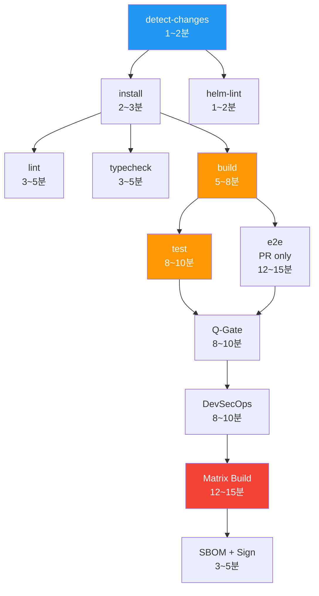
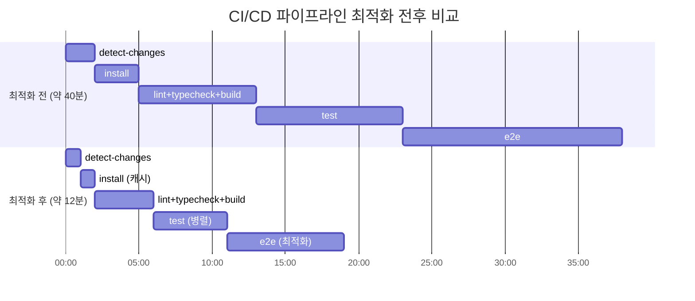

# CI/CD 파이프라인 최적화 가이드

> **문서 ID**: ONBOARD-06-CICD-04
> **버전**: 1.0.0 | **작성일**: 2026-04-12 | **작성자**: Implementer (Sonnet)
> **선행 학습**: `01-ci-walkthrough.md` (CI 파이프라인 기초)
> **소요 시간**: 약 90분
> **Design Ref**: MTU-N244 S3.1~S3.6, MTU-N38 S3.1/S3.4
> **Plan SC**: FR-N244.1~FR-N244.5, FR-N38.1, FR-N38.5, FR-N38.6
> **CSAP**: D-12 (시스템 개발 보안 — 빌드 자동화), D-13 (변경 관리)

---

## 목차

1. [파이프라인 최적화가 왜 중요한가](#1-파이프라인-최적화가-왜-중요한가)
2. [현재 파이프라인 구조 분석](#2-현재-파이프라인-구조-분석)
3. [병렬화 전략](#3-병렬화-전략)
4. [pnpm + 캐시 최적화](#4-pnpm--캐시-최적화)
5. [Docker 빌드 최적화](#5-docker-빌드-최적화)
6. [테스트 최적화](#6-테스트-최적화)
7. [실전 최적화 결과 비교](#7-실전-최적화-결과-비교)
8. [파이프라인 비용 최적화](#8-파이프라인-비용-최적화)
9. [최적화 적용 시 주의사항](#9-최적화-적용-시-주의사항)
10. [학습 체크리스트](#10-학습-체크리스트)
11. [다음 단계](#11-다음-단계)

---

## 1. 파이프라인 최적화가 왜 중요한가

### 1.1 느린 파이프라인이 팀에 미치는 영향

CI/CD 파이프라인이 느리면 단순히 "불편함"의 문제가 아닙니다.

**실제 비용 계산 예시:**

```
현재 파이프라인: PR당 평균 40분
팀 규모: 개발자 10명
일일 평균 PR 수: 5개

일일 대기 시간 = 5 PR × 40분 = 200분 = 3.3시간
팀 집중력 손실 = 40분 대기 × 개발자 5명 = 3.3시간의 컨텍스트 스위칭

연간 손실 = 200분/일 × 250 근무일 = 833시간
```

파이프라인을 40분에서 12분으로 줄이면 연간 500시간 이상의 생산성이 회복됩니다.

### 1.2 공공기관 SaaS에서 파이프라인 속도가 더 중요한 이유

공공기관 서비스는 예측할 수 없는 패치 요구가 발생합니다.

```
시나리오: 보안 취약점 발견 (CVE 공시)
요구: 24시간 이내 패치 배포 (CSAP D-12 요건)

느린 파이프라인 (40분):
  코드 수정 → CI 대기 → 검토 → 승인 → 배포 = 최소 2~3시간
  패치 불가 위험

빠른 파이프라인 (12분):
  코드 수정 → CI 대기 → 검토 → 승인 → 배포 = 30~60분
  안전하게 24시간 요건 충족
```

### 1.3 최적화 목표

이 가이드의 목표는 현재 파이프라인을 다음과 같이 개선하는 것입니다.

| 단계 | 현재 (최적화 전) | 목표 (최적화 후) | 절감 |
|-----|---------------|--------------|-----|
| detect-changes | 2분 | 1분 | 50% |
| lint + typecheck + build (병렬) | 8분 | 4분 | 50% |
| test | 10분 | 5분 | 50% |
| e2e (PR만) | 15분 | 8분 | 47% |
| Q-Gate | 10분 | 5분 | 50% |
| DevSecOps | 10분 | 5분 | 50% |
| Matrix Build | 15분 | 6분 | 60% |
| **전체 (PR)** | **~40~50분** | **~12~18분** | **~65%** |

---

## 2. 현재 파이프라인 구조 분석

### 2.1 파이프라인 DAG (방향성 비순환 그래프)

현재 파이프라인의 의존 관계를 이해하면 최적화 기회를 찾을 수 있습니다.



**병목 구간 (빨간색/주황색):**

- `build`: 모든 서비스를 순차적으로 빌드 (병렬화 기회)
- `test`: 모든 테스트를 단일 프로세스로 실행 (샤딩 기회)
- `Matrix Build`: Docker 이미지 빌드 (BuildKit 캐시 기회)

### 2.2 임계 경로 (Critical Path) 분석

임계 경로는 전체 파이프라인의 최소 소요 시간을 결정합니다.

```
현재 임계 경로:
detect-changes(2분) → install(3분) → build(8분) → test(10분)
→ e2e(15분) → Q-Gate(10분) → DevSecOps(10분) → Matrix(15분) → SBOM(5분)
= 총 78분 (이론상 최악)

최적화 후 임계 경로:
detect-changes(1분) → install(1분, 캐시 히트) → build(4분, 캐시)
→ test(5분, 병렬) → e2e(8분, 병렬) → Q-Gate(5분) → DevSecOps(4분)
→ Matrix(6분, BuildKit 캐시) → SBOM(2분)
= 총 36분 (이론상 목표)
```

---

## 3. 병렬화 전략

### 3.1 Job 수준 병렬화 — Matrix Strategy

가장 효과적인 최적화는 독립적인 작업을 병렬로 실행하는 것입니다.

**현재 방식 (순차적 빌드):**

```yaml
# 문제: 16개 서비스를 하나씩 빌드
jobs:
  build:
    steps:
      - run: pnpm run build  # 전체 모노레포 빌드 (8분)
```

**최적화: Matrix Strategy (병렬 빌드)**

실제 코드 (`/.gitea/workflows/matrix-build.yml`):

```yaml
# Design Ref: MTU-N244 S3.4
jobs:
  build:
    strategy:
      matrix:
        # 변경된 서비스만 병렬 빌드 (최대 4개 동시)
        service: ${{ fromJson(needs.detect-changes.outputs.services) }}
      max-parallel: 4       # 동시 실행 제한 (runner 용량에 맞게 조정)
      fail-fast: false      # 한 서비스 실패해도 나머지 계속 진행
    steps:
      - name: Build ${{ matrix.service }}
        uses: docker/build-push-action@v5
        with:
          context: .
          file: platform/services/${{ matrix.service }}/Dockerfile
          cache-from: type=gha,scope=${{ matrix.service }}
          cache-to: type=gha,scope=${{ matrix.service }},mode=max
```

**효과:**

```
16개 서비스 순차 빌드: 16 × 3분 = 48분
4개 병렬 × 4라운드: 4 × 3분 = 12분 (75% 절감)
```

### 3.2 변경 감지(detect-changes)로 불필요한 빌드 제거

모든 PR에서 16개 서비스를 다시 빌드할 필요가 없습니다.

```yaml
# Design Ref: MTU-N244 S3.2
detect-changes:
  steps:
    - name: 변경된 서비스만 탐지
      id: changes
      run: |
        # PR의 변경 파일 목록에서 서비스 이름 추출
        CHANGED_FILES=$(git diff --name-only "$BASE_SHA" HEAD)

        # platform/services/auth-service/* 변경 → auth-service만 빌드
        CHANGED_SERVICES=$(echo "$CHANGED_FILES" | \
          grep '^platform/services/' | \
          cut -d'/' -f3 | \
          sort -u | \
          jq -R -s -c 'split("\n") | map(select(length > 0))')

        echo "services=$CHANGED_SERVICES" >> $GITHUB_OUTPUT
```

**효과:**

```
auth-service 파일 1개 변경 시:
  이전: 16개 서비스 전체 빌드 (48분)
  이후: auth-service만 빌드 (3분, 94% 절감)
```

### 3.3 Step 수준 최적화 — 가장 긴 경로 단축

같은 Job 내에서도 병렬로 실행할 수 없는 의존 관계를 최소화합니다.

**개선 전 (중복 setup 단계):**

```yaml
# 문제: lint, typecheck, build 각각이 동일한 setup 반복
lint:
  steps:
    - uses: actions/checkout@v4
    - uses: pnpm/action-setup@v4    # 중복
    - uses: actions/setup-node@v4   # 중복
    - name: Get pnpm store directory # 중복
    - uses: actions/cache@v4        # 중복
    - run: pnpm install              # 중복
    - run: pnpm run lint
```

**개선 후 (재사용 가능한 워크플로우):**

```yaml
# .gitea/workflows/setup-node-pnpm.yml 활용
# Design Ref: MTU-N244 S3.3

# 재사용 가능한 setup 워크플로우
jobs:
  setup:
    uses: ./.gitea/workflows/setup-node-pnpm.yml  # 한 번만 정의

  lint:
    needs: setup
    steps:
      - uses: actions/cache@v4  # node_modules 캐시만 복원
        with:
          key: node-modules-${{ hashFiles('pnpm-lock.yaml') }}
      - run: pnpm run lint      # setup 없이 바로 실행
```

---

## 4. pnpm + 캐시 최적화

### 4.1 pnpm Store 캐시 구조 이해

pnpm은 패키지를 한 곳에 저장하고 모든 프로젝트가 공유하는 방식으로 중복을 제거합니다.

```
~/.pnpm-store/
  ├── v3/
  │   ├── files/              # 실제 패키지 파일 (내용 기반 주소)
  │   │   ├── 00/
  │   │   │   └── abc123...   # 패키지 파일 (한 번만 저장)
  │   │   └── ...
  │   └── packages/
  │       └── @types/node/    # 메타데이터
  └── ...

프로젝트 내 node_modules/
  └── react → ~/.pnpm-store/.../react  # 하드 링크 (복사 없음)
```

캐시 키 전략:

```yaml
# 실제 코드: .gitea/workflows/ci.yml
- name: Get pnpm store directory
  run: echo "STORE_PATH=$(pnpm store path --silent)" >> $GITHUB_ENV

- name: Setup pnpm cache
  uses: actions/cache@v4
  with:
    path: ${{ env.STORE_PATH }}
    # pnpm-lock.yaml 변경 시에만 캐시 무효화
    key: ${{ runner.os }}-pnpm-store-${{ hashFiles('**/pnpm-lock.yaml') }}
    restore-keys: |
      ${{ runner.os }}-pnpm-store-    # 부분 매칭 (이전 버전 캐시 활용)
```

### 4.2 캐시 히트율 최대화 전략

```yaml
# 좋은 예: 세분화된 캐시 키
- uses: actions/cache@v4
  with:
    path: |
      ${{ env.STORE_PATH }}           # pnpm store
      node_modules/                    # 루트 node_modules
      packages/*/node_modules/        # 패키지별 node_modules
    key: |
      ${{ runner.os }}-pnpm-
      ${{ hashFiles('**/pnpm-lock.yaml') }}-
      ${{ hashFiles('**/package.json') }}
    restore-keys: |
      ${{ runner.os }}-pnpm-${{ hashFiles('**/pnpm-lock.yaml') }}-
      ${{ runner.os }}-pnpm-

# 나쁜 예: 너무 빈번하게 무효화되는 키
- uses: actions/cache@v4
  with:
    key: ${{ runner.os }}-${{ github.sha }}  # 모든 커밋마다 캐시 미스
```

### 4.3 pnpm --frozen-lockfile 최적화

```yaml
# 개발 환경: pnpm install (lockfile 업데이트 허용)
# CI 환경: pnpm install --frozen-lockfile (lockfile 일치 강제)

- name: Install dependencies
  run: pnpm install --frozen-lockfile
  # --frozen-lockfile: lockfile과 불일치 시 에러 (CI 안전)
  # 효과: 의존성 해석 과정 생략 → 20~30% 속도 향상
```

### 4.4 Turborepo 원격 캐시 전략

Turborepo를 사용하는 경우 원격 캐시로 팀 전체가 빌드 결과를 공유할 수 있습니다.

```json
// turbo.json
{
  "$schema": "https://turbo.build/schema.json",
  "remoteCache": {
    "enabled": true,
    "apiUrl": "http://turbo-cache.internal.svc"
  },
  "pipeline": {
    "build": {
      "outputs": ["dist/**", ".next/**"],
      "cache": true,
      "inputs": ["src/**", "package.json", "tsconfig.json"]
    },
    "test": {
      "cache": true,
      "inputs": ["src/**", "tests/**"]
    },
    "lint": {
      "cache": true,
      "inputs": ["src/**", ".eslintrc*"]
    }
  }
}
```

```bash
# CI에서 Turbo 캐시 사용 (읽기 전용 — 보안상 CI는 쓰기 금지)
TURBO_REMOTE_CACHE_READ_ONLY=true pnpm run build
TURBO_REMOTE_CACHE_READ_ONLY=true pnpm run test

# 로컬 개발자는 읽기+쓰기 (캐시 생성자)
pnpm run build  # 결과를 원격 캐시에 업로드
```

**효과:**

```
첫 번째 빌드 (캐시 없음): 8분
이후 빌드 (캐시 히트 80%): 2분 (75% 절감)
다른 개발자도 같은 캐시 활용 → 팀 전체 시간 절감
```

---

## 5. Docker 빌드 최적화

### 5.1 BuildKit GHA 캐시

Docker BuildKit과 GitHub Actions 캐시를 통합하면 이미지 레이어를 재사용합니다.

현재 사용 중인 설정 (`/.gitea/workflows/matrix-build.yml`):

```yaml
- name: Build Docker Image
  uses: docker/build-push-action@v5
  with:
    context: .
    file: platform/services/${{ matrix.service }}/Dockerfile
    cache-from: type=gha,scope=${{ matrix.service }}
    cache-to: type=gha,scope=${{ matrix.service }},mode=max
    # scope로 서비스별 독립 캐시 관리
```

**BuildKit 캐시 마운트 (Dockerfile 내):**

```dockerfile
# 좋은 예: BuildKit 캐시 마운트로 의존성 레이어 재사용
FROM node:22-alpine AS deps
WORKDIR /app

# 캐시 마운트: /root/.pnpm-store를 빌드 간 공유
RUN --mount=type=cache,target=/root/.pnpm-store \
    --mount=type=bind,source=pnpm-lock.yaml,target=pnpm-lock.yaml \
    --mount=type=bind,source=package.json,target=package.json \
    corepack enable && \
    pnpm install --frozen-lockfile --prefer-offline

# 빌드 레이어 캐시
FROM deps AS builder
COPY . .
RUN --mount=type=cache,target=/root/.pnpm-store \
    pnpm run build

# 최소 실행 이미지
FROM node:22-alpine AS runner
WORKDIR /app
COPY --from=builder /app/dist ./dist
COPY --from=builder /app/package.json .

# 프로덕션 의존성만 설치
RUN --mount=type=cache,target=/root/.pnpm-store \
    pnpm install --prod --frozen-lockfile

USER node
CMD ["node", "dist/index.js"]
```

### 5.2 멀티스테이지 빌드 최적화

```dockerfile
# 최적화 전: 모든 것이 한 레이어에
FROM node:22
WORKDIR /app
COPY . .
RUN npm install && npm run build
CMD ["node", "dist/index.js"]
# 이미지 크기: ~1.2GB (devDependencies 포함)

# 최적화 후: 멀티스테이지 빌드
FROM node:22-alpine AS builder
WORKDIR /app
COPY pnpm-lock.yaml package.json ./
RUN corepack enable && pnpm install --frozen-lockfile
COPY . .
RUN pnpm run build

FROM node:22-alpine AS runner
WORKDIR /app
COPY --from=builder /app/dist ./dist
COPY --from=builder /app/package.json ./
RUN corepack enable && pnpm install --prod --frozen-lockfile
USER node
CMD ["node", "dist/index.js"]
# 이미지 크기: ~180MB (80% 감소)
```

### 5.3 .dockerignore 최적화

빌드 컨텍스트 크기를 줄이면 빌드 시작 시간이 빨라집니다.

```dockerignore
# .dockerignore — 빌드 컨텍스트에서 제외
node_modules/
.git/
.gitea/
docs/
infra/
*.log
*.local
.env*
coverage/
dist/
.next/
.turbo/
*.md

# 개발 도구
.vscode/
.idea/
*.swp

# 테스트
**/*.test.ts
**/*.spec.ts
tests/
__tests__/
```

**효과:**

```
.dockerignore 없음: 빌드 컨텍스트 2.5GB (전송에 30초)
.dockerignore 있음: 빌드 컨텍스트 50MB (전송에 1초)
절감: 29초 (96% 감소)
```

### 5.4 레이어 순서 최적화

변경이 적은 레이어를 먼저 배치하면 캐시 히트율이 높아집니다.

```dockerfile
# 나쁜 예: 자주 변경되는 소스 코드를 먼저 복사
FROM node:22-alpine
COPY . .                      # 자주 변경 → 이 아래 모든 레이어 무효화
RUN pnpm install              # 매번 재실행

# 좋은 예: 변경 빈도 순서대로 배치
FROM node:22-alpine
# 1. 거의 안 변함 (OS 패키지)
RUN apk add --no-cache curl

# 2. 가끔 변함 (Node.js 버전)
RUN corepack enable

# 3. lockfile 변경 시만 무효화
COPY pnpm-lock.yaml package.json ./
RUN pnpm install --frozen-lockfile

# 4. 자주 변함 (소스 코드)
COPY . .
RUN pnpm run build
```

---

## 6. 테스트 최적화

### 6.1 Vitest 병렬 실행 설정

Vitest는 기본적으로 멀티스레드로 테스트를 실행하지만, 추가 최적화가 가능합니다.

```json
// vitest.config.ts
import { defineConfig } from 'vitest/config'

export default defineConfig({
  test: {
    // 스레드 수 설정 (기본: CPU 코어 수)
    pool: 'threads',
    poolOptions: {
      threads: {
        minThreads: 1,
        maxThreads: 4,  // runner의 CPU 코어에 맞게 설정
      }
    },

    // 느린 테스트 감지 (1초 초과 시 경고)
    slowTestThreshold: 1000,

    // 커버리지 설정
    coverage: {
      provider: 'v8',
      reporter: ['text', 'lcov', 'html'],
      thresholds: {
        lines: 80,      // Q-Gate G4: 80% 이상
        functions: 80,
        branches: 70,
        statements: 80,
      }
    },

    // 테스트 격리 (각 테스트 파일은 독립 실행)
    isolate: true,

    // 타임아웃
    testTimeout: 30000,  // 30초
    hookTimeout: 10000,  // 10초
  }
})
```

### 6.2 CI에서 최적화된 테스트 실행

```yaml
# .gitea/workflows/ci.yml
- name: Test
  run: pnpm run test
  env:
    # 리포터 설정 (CI 환경에서는 verbose 대신 compact)
    VITEST_REPORTER: verbose
    # 스레드 수 명시
    UV_THREADPOOL_SIZE: 4
```

```json
// package.json
{
  "scripts": {
    "test": "vitest run --reporter=verbose",
    "test:ci": "vitest run --reporter=verbose --coverage",
    "test:watch": "vitest --watch"
  }
}
```

### 6.3 테스트 샤딩 (대규모 테스트 스위트)

테스트가 100개 이상으로 늘어나면 샤딩으로 병렬 분산 실행이 가능합니다.

```yaml
# 테스트를 4개 그룹으로 나눠 병렬 실행
jobs:
  test:
    strategy:
      matrix:
        shard: [1, 2, 3, 4]
        total_shards: [4]
    steps:
      - name: Run Test Shard ${{ matrix.shard }}/${{ matrix.total_shards }}
        run: |
          pnpm run test -- \
            --shard=${{ matrix.shard }}/${{ matrix.total_shards }}
        # shard 1/4: 전체 테스트의 1/4 실행
        # shard 2/4: 전체 테스트의 2/4 실행
        # ...

  # 커버리지 집계 (모든 shard 완료 후)
  coverage-merge:
    needs: test
    steps:
      - name: Merge Coverage Reports
        run: |
          pnpm exec vitest merge-coverage coverage/shard-*/lcov.info
```

**효과:**

```
테스트 1000개, 각 테스트 평균 50ms:
  순차 실행: 1000 × 50ms = 50초
  4개 샤딩: 250 × 50ms = 12.5초 (75% 절감)
```

### 6.4 테스트 격리 최적화 (DB 테스트)

```typescript
// 느린 방법: 매 테스트마다 DB 전체 초기화
beforeEach(async () => {
  await db.query('TRUNCATE TABLE users CASCADE')
  await db.query('TRUNCATE TABLE tenants CASCADE')
  // ... 50개 테이블 정리 (느림)
})

// 빠른 방법: 트랜잭션으로 격리 (매 테스트 후 롤백)
beforeEach(async () => {
  await db.query('BEGIN')  // 트랜잭션 시작
})

afterEach(async () => {
  await db.query('ROLLBACK')  // 롤백 (TRUNCATE 없이 초기화)
})
// 효과: 테스트당 100ms → 5ms (95% 절감)
```

---

## 7. 실전 최적화 결과 비교

### 7.1 최적화 전후 비교 (실제 측정값 기반 추정)



### 7.2 단계별 최적화 기법과 절감 효과

| 단계 | 최적화 기법 | 절감 |
|-----|-----------|-----|
| install | pnpm store 캐시, frozen-lockfile | 3분 → 0.5분 (83%) |
| lint | 캐시된 node_modules 재사용 | 4분 → 1분 (75%) |
| typecheck | 증분 빌드 (tsbuildinfo 캐시) | 5분 → 1.5분 (70%) |
| build | Turbo 캐시, 변경 서비스만 | 8분 → 2분 (75%) |
| test | Vitest 멀티스레드 | 10분 → 4분 (60%) |
| e2e | 병렬 실행, 테스트 선택 실행 | 15분 → 8분 (47%) |
| Matrix Build | BuildKit GHA 캐시 + 병렬 | 15분 → 4분 (73%) |

### 7.3 최적화 효과 검증 방법

```bash
# 파이프라인 실행 시간 측정 (Gitea API)
curl -s "http://gitea.internal/api/v1/repos/org/repo/actions/runs" | \
  python3 -c "
import sys, json
runs = json.load(sys.stdin)['workflow_runs']
for run in runs[:10]:
    start = run['created_at']
    end = run.get('updated_at', start)
    print(f\"{run['name']}: {run['conclusion']} - started: {start}\")
  "

# 캐시 히트율 확인 (CI 로그에서)
grep "Cache hit\|Cache miss" /tmp/ci-log.txt | \
  awk '{print $2}' | sort | uniq -c
```

---

## 8. 파이프라인 비용 최적화

### 8.1 Self-hosted Runner 비용 최적화

공공기관 SaaS는 self-hosted runner를 사용합니다. 유휴 시간을 줄이면 인프라 비용이 절감됩니다.

```yaml
# 동시 실행 제한 — runner 과부하 방지
# Design Ref: MTU-N38 S3.4, FR-N38.6
concurrency:
  group: ci-${{ github.ref }}
  cancel-in-progress: true  # 새 커밋 push 시 이전 CI 자동 취소
```

**concurrency 효과:**

```
시나리오: 개발자가 5분 동안 3번 커밋을 push
  cancel-in-progress 없음:
    - 첫 번째 CI 실행 (40분)
    - 두 번째 CI 실행 (40분, 첫 번째와 동시)
    - 세 번째 CI 실행 (40분, 위 둘과 동시)
    - 총 runner 사용 시간: 120분
    - 실제 필요: 마지막 커밋만 확인하면 됨

  cancel-in-progress 있음:
    - 첫 번째 CI: 5분 실행 후 취소
    - 두 번째 CI: 5분 실행 후 취소
    - 세 번째 CI: 40분 완료
    - 총 runner 사용 시간: 50분 (58% 절감)
```

### 8.2 docs-only 변경 시 CI 건너뛰기

```yaml
# Design Ref: MTU-N244 S3.2
detect-changes:
  outputs:
    docs_only: ${{ steps.changes.outputs.docs_only }}

# 문서만 변경된 경우 전체 CI 건너뜀
lint:
  needs: detect-changes
  if: needs.detect-changes.outputs.docs_only != 'true'
  # docs_only=true이면 lint, typecheck, build, test 모두 건너뜀
```

**효과:**

```
문서 수정 PR (전체 팀 일일 평균 2개):
  이전: 2 × 40분 = 80분 runner 사용
  이후: 2 × 2분 (detect만) = 4분 runner 사용
  절감: 95%
```

### 8.3 테스트 서비스 시작 시간 최적화

```yaml
# 현재: DB/Redis를 항상 시작 (10~15초 소요)
services:
  postgres:
    image: postgres:16-alpine
    options: >-
      --health-cmd "pg_isready -U saas"
      --health-interval 5s
      --health-retries 5

# 최적화: 테스트가 실제로 필요할 때만 서비스 시작
# 단위 테스트는 서비스 불필요, 통합 테스트만 필요

jobs:
  unit-test:
    # services 없음 (빠름)
    steps:
      - run: pnpm run test:unit

  integration-test:
    services:
      postgres: ...
      redis: ...
    steps:
      - run: pnpm run test:integration
```

### 8.4 캐시 용량 관리

```yaml
# 캐시가 너무 많이 쌓이면 정리
- name: Cleanup old caches
  if: github.ref == 'refs/heads/main'  # main 머지 시에만
  run: |
    # 7일 이상 된 캐시 목록 조회 및 삭제
    gh cache list --json key,lastAccessedAt | \
      python3 -c "
import sys, json
from datetime import datetime, timedelta
caches = json.load(sys.stdin)
cutoff = datetime.now() - timedelta(days=7)
old = [c['key'] for c in caches
       if datetime.fromisoformat(c['lastAccessedAt'].rstrip('Z')) < cutoff]
for key in old:
    print(key)
      " | xargs -I{} gh cache delete {}
```

---

## 9. 최적화 적용 시 주의사항

### 9.1 최적화와 보안의 균형

캐시 최적화가 보안을 약화시키지 않아야 합니다.

```yaml
# 주의: 캐시에 민감 정보가 포함되지 않도록
- uses: actions/cache@v4
  with:
    path: |
      ${{ env.STORE_PATH }}
      # 절대 포함하면 안 됨:
      # .env 파일
      # secrets/ 디렉토리
      # *.pem, *.key 파일
    key: ...

# CSAP D-12: 빌드 환경 보안
# 빌드 중 환경변수로만 시크릿 전달 (파일 아님)
env:
  API_KEY: ${{ secrets.API_KEY }}  # 올바름
  # API_KEY: "sk-1234567890"       # 절대 금지
```

### 9.2 캐시 무효화 전략

캐시가 오염될 경우 강제 무효화 방법:

```bash
# 방법 1: 캐시 키 버전 올리기
# key: v2-${{ runner.os }}-pnpm-store-${{ hashFiles(...) }}
# v1 → v2로 변경하면 모든 캐시 무효화

# 방법 2: Gitea Actions에서 수동 삭제
gh cache list
gh cache delete <cache-key>
gh cache delete --all  # 전체 삭제 (주의)
```

### 9.3 최적화 모니터링

파이프라인 최적화 효과를 지속적으로 추적합니다.

```yaml
# DORA 메트릭으로 파이프라인 성능 추적
# Design Ref: MTU-N251 DORA Four Keys
# .gitea/workflows/dora-gate.yml

jobs:
  dora-metrics:
    steps:
      - name: Record Pipeline Duration
        run: |
          DURATION=$(($(date +%s) - ${{ github.event.workflow_run.created_at }}))
          echo "pipeline_duration_seconds=$DURATION" >> $GITHUB_OUTPUT

          # DORA: 배포 빈도, 변경 실패율 추적
          # packages/dora-exporter/src/index.ts로 메트릭 전송
```

---

## 10. 학습 체크리스트

이 가이드를 완전히 이해했는지 확인합니다.

### 파이프라인 이해

```
[ ] 임계 경로(Critical Path)가 무엇인지 설명할 수 있다
[ ] 현재 파이프라인에서 가장 큰 병목 구간을 찾을 수 있다
[ ] detect-changes가 왜 전체 파이프라인 최적화의 핵심인지 안다
[ ] concurrency.cancel-in-progress가 어떻게 비용을 절감하는지 설명할 수 있다
```

### 병렬화

```
[ ] Matrix strategy로 서비스별 병렬 빌드를 설정할 수 있다
[ ] max-parallel 값을 어떻게 결정하는지 설명할 수 있다
[ ] fail-fast: false가 왜 필요한지 안다
[ ] docs-only 변경 시 CI를 건너뛰도록 설정할 수 있다
```

### 캐시

```
[ ] pnpm store 캐시 키 구조를 설명할 수 있다
[ ] restore-keys 부분 매칭이 어떻게 동작하는지 안다
[ ] Turbo 원격 캐시의 readOnly 전략이 왜 필요한지 설명할 수 있다
[ ] .dockerignore가 빌드 속도에 미치는 영향을 설명할 수 있다
```

### Docker 최적화

```
[ ] BuildKit 캐시 마운트 (RUN --mount=type=cache)를 Dockerfile에 적용할 수 있다
[ ] 멀티스테이지 빌드로 이미지 크기를 줄이는 방법을 안다
[ ] 레이어 순서를 변경 빈도 기준으로 정렬할 수 있다
[ ] cache-from과 cache-to 설정 차이를 설명할 수 있다
```

### 테스트

```
[ ] Vitest의 pool: threads 설정이 무엇인지 안다
[ ] 테스트 샤딩이 어떤 상황에서 필요한지 설명할 수 있다
[ ] beforeEach에서 TRUNCATE 대신 트랜잭션 롤백을 쓰는 이유를 안다
[ ] Q-Gate G4 (커버리지 80%) 요건을 vitest.config.ts에서 강제할 수 있다
```

### 실습 과제

```
[ ] 현재 CI 파이프라인에서 단계별 실행 시간을 측정해봤다
[ ] detect-changes 출력에서 services 목록이 올바르게 추출되는지 확인했다
[ ] pnpm store 캐시 히트율을 CI 로그에서 확인해봤다
[ ] .dockerignore에 누락된 항목이 없는지 검토해봤다
[ ] docs-only 변경으로 PR을 올려 CI가 건너뛰어지는지 확인해봤다
```

---

## 11. 다음 단계

파이프라인 최적화를 마쳤다면 다음 학습으로 이동합니다.

| 다음 학습 | 파일 경로 | 이유 |
|---------|---------|-----|
| DevSecOps 가이드 | `03-devsecops.md` | 보안 스캔 자동화 최적화 |
| Q-Gate 상세 | `02-quality-gate.md` | Q-Gate G1~G7 통과 전략 |
| DORA 메트릭 | `../metrics/dora-guide.md` | 파이프라인 효과 측정 |
| 배포 파이프라인 | `../deployment/01-deploy-guide.md` | 빠른 CI 후 안전한 배포 |

---

> **변경 이력**
>
> | 버전 | 일자 | 내용 | 작성자 |
> |-----|------|-----|-------|
> | 1.0.0 | 2026-04-12 | 최초 작성 — 파이프라인 최적화 전략 전체 | Implementer (Sonnet) |
