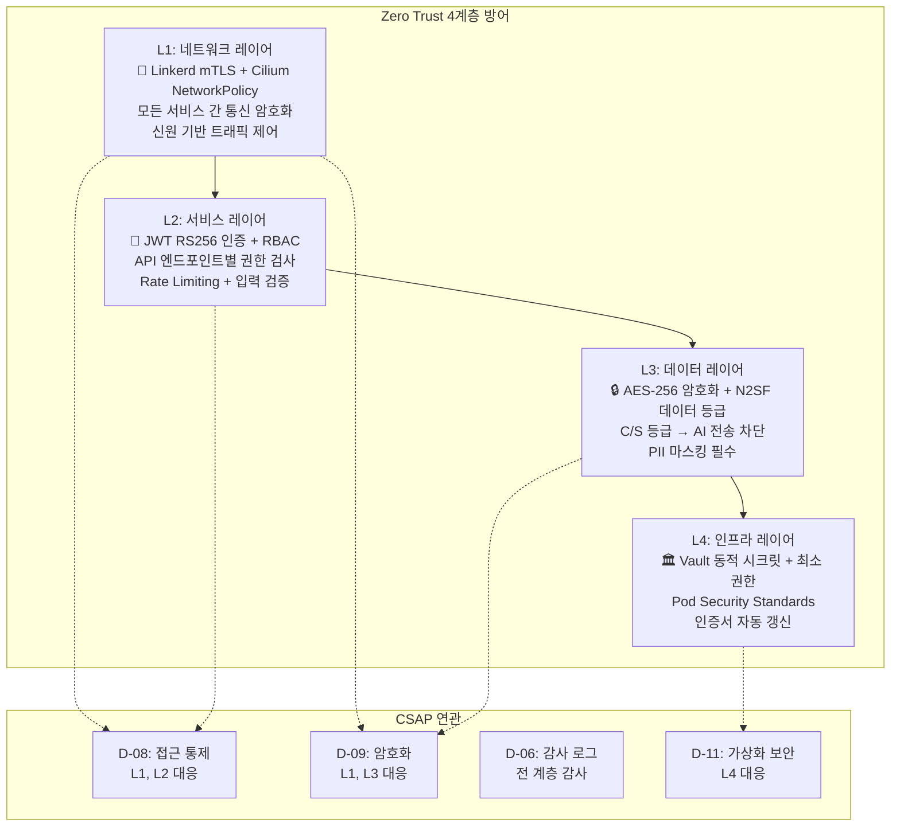
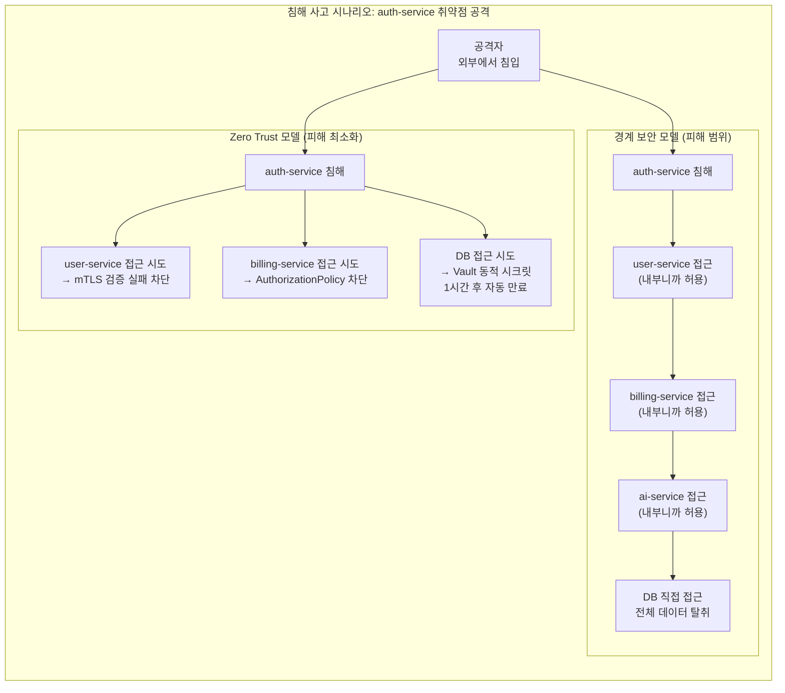
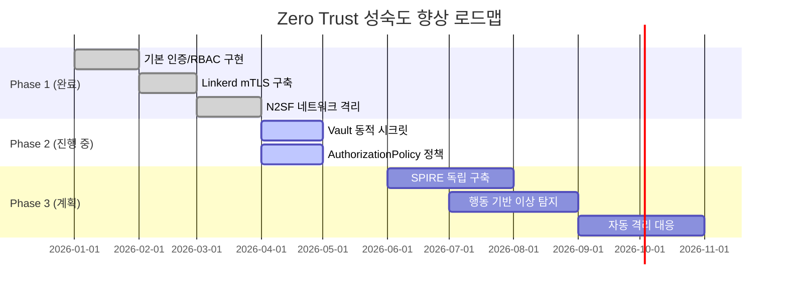

# Zero Trust 아키텍처 심화 — 우리 프로젝트에서의 구현

> **문서 ID**: ONBOARD-07-07
> **버전**: 1.0.0 | **작성일**: 2026-04-12 | **작성자**: Implementer (Sonnet)
> **대상**: 신규 개발자, DevOps 엔지니어, 보안 담당자
> **선행 문서**:
>   - `07-security/05-security-hardening.md` — 보안 강화 기초 (중복 내용 제외)
>   - `04-infrastructure/components/06-linkerd.md` — Linkerd mTLS 기초 (중복 내용 제외)
>   - `07-security/coding/01-secure-patterns.md` — 보안 코딩 패턴
> **예상 소요 시간**: 약 150분
> **CSAP**: D-08 (접근 통제 — Zero Trust mTLS), D-09 (암호화 — TLS 1.3+), D-11 (가상화 보안)
> **Design Ref**: MTU-N54 §3.5, MTU-N93 §2, DS-N114.3

---

## 목차

1. [Zero Trust란 무엇인가](#1-zero-trust란-무엇인가)
2. [우리 프로젝트의 Zero Trust 구현 계층](#2-우리-프로젝트의-zero-trust-구현-계층)
3. [Linkerd mTLS 심화 (실제 설정 분석)](#3-linkerd-mtls-심화-실제-설정-분석)
4. [SPIFFE/SPIRE 기반 신원 관리](#4-spiffespire-기반-신원-관리)
5. [최소 권한 원칙 (Least Privilege)](#5-최소-권한-원칙-least-privilege)
6. [Zero Trust CSAP 연관성](#6-zero-trust-csap-연관성)
7. [Zero Trust 성숙도 평가](#7-zero-trust-성숙도-평가)
8. [학습 체크리스트](#8-학습-체크리스트)
9. [다음 단계](#9-다음-단계)

---

## 1. Zero Trust란 무엇인가

### 1.1 "Never Trust, Always Verify" 원칙

Zero Trust는 "한 번 인증받으면 믿는다"는 기존 보안 모델을 완전히 뒤집는 개념입니다.

```
기존 경계 보안 모델의 가정:
  "방화벽 안에 들어온 것은 안전하다"
  → 내부 트래픽은 신뢰

Zero Trust 모델의 가정:
  "어떤 요청도 기본적으로 신뢰하지 않는다"
  → 내부 트래픽도 항상 검증
```

**Never Trust, Always Verify**의 실질적 의미:

| 질문 | 기존 모델 답변 | Zero Trust 답변 |
|------|---------------|----------------|
| 내부 서비스끼리 통신해도 되나? | 방화벽 안이니 OK | mTLS로 신원 확인 후에만 OK |
| 사내 VPN 접속자를 믿어도 되나? | VPN이면 안전 | VPN + MFA + 최소 권한 검증 필요 |
| 관리자는 모든 서비스에 접근 가능한가? | 관리자 = 전체 접근 | 역할 범위 내 명시적 허용만 |
| 서비스 A가 서비스 B에게 요청하면? | 내부니까 허용 | 서비스 계정 mTLS 인증 후 허용 |

### 1.2 기존 경계 보안 vs Zero Trust 비교

```mermaid
graph TB
    subgraph "기존 경계 보안 모델 (Castle-and-Moat)"
        Internet1["인터넷\n(외부 = 위험)"]
        Firewall1["방화벽\n(성벽)"]
        subgraph "신뢰 영역 (방화벽 내부)"
            SvcA1["auth-service\n✓ 신뢰"]
            SvcB1["user-service\n✓ 신뢰"]
            SvcC1["ai-service\n✓ 신뢰"]
            DB1["Database\n✓ 신뢰"]
        end
        Internet1 --> Firewall1
        Firewall1 --> SvcA1
        SvcA1 --> SvcB1
        SvcB1 --> SvcC1
        SvcC1 --> DB1
    end

    subgraph "Zero Trust 모델 (우리 프로젝트)"
        Internet2["인터넷"]
        GW2["API Gateway\n+ WAF + Rate Limit"]
        subgraph "검증 필요 영역 (모든 트래픽 검증)"
            SvcA2["auth-service\n🔐 mTLS + RBAC"]
            SvcB2["user-service\n🔐 mTLS + RBAC"]
            SvcC2["ai-service\n🔐 mTLS + N2SF 검사"]
            DB2["Database\n🔐 동적 시크릿 + 최소 권한"]
        end
        Internet2 --> GW2
        GW2 -->|"JWT 검증 후"| SvcA2
        SvcA2 -->|"mTLS + ServiceAccount"| SvcB2
        SvcB2 -->|"mTLS + ServiceAccount"| SvcC2
        SvcC2 -->|"Vault 동적 시크릿"| DB2
    end
```



### 1.3 기존 경계 보안의 문제점

경계 보안 모델은 **"외부는 위험, 내부는 안전"**이라고 가정합니다. 그러나 이 가정은 다음 상황에서 붕괴됩니다.

```
시나리오 1: 내부자 위협
  → 내부 직원이 악의적으로 데이터 탈취
  → 경계 보안: 방화벽 안이므로 탐지 불가
  → Zero Trust: 최소 권한으로 접근 범위 제한 + 모든 접근 감사 로그

시나리오 2: 공급망 공격 (Supply Chain)
  → npm 패키지에 악성코드 삽입 → 서비스 배포 시 포함됨
  → 경계 보안: 배포된 서비스는 신뢰 → 자유롭게 내부 API 호출
  → Zero Trust: 서비스 계정 mTLS + 최소 권한 → 감염 서비스 피해 최소화

시나리오 3: 측면 이동 (Lateral Movement)
  → auth-service 취약점 공격 → 내부 네트워크 진입
  → 경계 보안: 내부에 있으므로 다른 서비스 자유롭게 접근
  → Zero Trust: 서비스 간 AuthorizationPolicy → ai-service, DB 접근 차단
```

---

## 2. 우리 프로젝트의 Zero Trust 구현 계층

### 2.1 4계층 Zero Trust 구조

우리 프로젝트의 Zero Trust는 4개의 독립 계층으로 구현됩니다. 각 계층이 독립적으로 검증하므로, 한 계층이 우회되어도 다른 계층이 차단합니다.



### 2.2 L1: 네트워크 레이어 — Linkerd mTLS + NetworkPolicy

네트워크 레이어에서 모든 서비스 간 통신은 자동으로 mTLS(상호 TLS)로 암호화됩니다.

> **참고**: Linkerd mTLS 기초 동작 원리와 설치 방법은 `04-infrastructure/components/06-linkerd.md`를 참조하십시오. 이 문서는 Zero Trust 관점의 정책 설정에 집중합니다.

**실제 설정 파일** (`infra/linkerd/authorization/default-deny.yaml`):

```yaml
# 기본 거부 정책 — Zero Trust의 핵심
# Design Ref: MTU-N54 §3.5
# CSAP: D-08 접근 통제

apiVersion: policy.linkerd.io/v1beta3
kind: AuthorizationPolicy
metadata:
  name: default-deny
  namespace: saas
  annotations:
    description: "Zero Trust 기본 거부 - 명시적 허용 정책만 통과"
    csap.compliance/control: "D-08"
spec:
  targetRef:
    group: policy.linkerd.io
    kind: Server
    name: ""  # 모든 서버에 적용
  requiredAuthenticationRefs:
    - name: mesh-only
      kind: MeshTLSAuthentication
      group: policy.linkerd.io
---
# 메시 내 서비스 인증만 허용
apiVersion: policy.linkerd.io/v1alpha1
kind: MeshTLSAuthentication
metadata:
  name: mesh-only
  namespace: saas
spec:
  identities:
    # 이 패턴에 매칭되는 서비스 계정만 mTLS 통신 허용
    - "*.saas.serviceaccount.identity.linkerd.cluster.local"
```

이 설정의 의미:
- `default-deny`: 명시적으로 허용하지 않은 모든 트래픽 차단
- `mesh-only`: Linkerd mesh 내의 서비스 계정만 통신 허용
- 외부에서 직접 서비스에 접근하면 자동 차단

### 2.3 L2: 서비스 레이어 — JWT 인증 + RBAC

모든 API 엔드포인트는 JWT 검증 + RBAC 권한 검사를 수행합니다.

```typescript
// platform/services/auth-service/src/lib/permissions.ts 기반
// Design Ref: DESIGN-MTU-P01 §5 — RBAC
// CSAP D-08-05: 역할 기반 접근 통제

// 역할 계층 구조
enum UserRole {
  SUPER_ADMIN  = 'SUPER_ADMIN',  // 전체 시스템 관리
  TENANT_ADMIN = 'TENANT_ADMIN', // 소속 테넌트 내 관리
  USER         = 'USER',         // 일반 사용자 (읽기+쓰기)
  VIEWER       = 'VIEWER',       // 읽기 전용
  AUDITOR      = 'AUDITOR',      // 감사 전용 (읽기 + 감사 로그)
}

// 역할별 권한 매핑 (최소 권한 원칙)
const ROLE_PERMISSIONS: Record<UserRole, string[]> = {
  [UserRole.SUPER_ADMIN]: [
    'tenant:read', 'tenant:write', 'tenant:delete',
    'user:read', 'user:write', 'user:delete',
    'billing:read', 'billing:write',
    'audit:read', 'system:admin',
  ],
  [UserRole.TENANT_ADMIN]: [
    'tenant:read',           // 자기 테넌트만
    'user:read', 'user:write',
    'billing:read',
  ],
  [UserRole.USER]: [
    'tenant:read',
    'user:read',             // 자기 프로필만
  ],
  [UserRole.VIEWER]: [
    'tenant:read',
  ],
  [UserRole.AUDITOR]: [
    'tenant:read',
    'audit:read',            // 감사 로그 읽기 전용
  ],
};
```

### 2.4 L3: 데이터 레이어 — N2SF 데이터 등급 검사

모든 데이터 흐름에서 N2SF 등급을 확인하고, C/S 등급 데이터의 외부 전송을 차단합니다.

```typescript
// CSAP 규칙에서 발췌한 N2SF 패턴
// Design Ref: CLAUDE.md — N2SF AI 연동 데이터 분류 규칙

enum DataGrade { C = 'C', S = 'S', O = 'O' }

async function sendToAI(data: unknown, grade: DataGrade): Promise<{ response: string }> {
  // C, S 등급: AI API 전송 절대 금지
  if (grade === DataGrade.C || grade === DataGrade.S) {
    throw new Error(
      `BLOCKED: ${grade}등급 데이터는 AI API 전송 금지 (N2SF N-05)`
    );
  }

  // O 등급: PII 마스킹 후 AI Gateway 경유 전송
  const masked = await maskPII(data);
  return aiGateway.send(masked);
}
```

**Cilium 네트워크 정책으로 N2SF 격리** (`infra/cilium/network-policies/n2sf-l7-policies.yaml`):

```yaml
# C등급 네임스페이스 완전 격리
apiVersion: cilium.io/v2
kind: CiliumNetworkPolicy
metadata:
  name: n2sf-grade-c-isolation
  namespace: grade-c
  labels:
    n2sf: "C"
    csap: "D-10"
spec:
  description: "C등급 네임스페이스 완전 격리 (N2SF N-03)"
  endpointSelector: {}
  ingress:
    - fromEndpoints:
        - matchLabels:
            "k8s:io.kubernetes.pod.namespace": grade-c
  egress:
    - toEndpoints:
        - matchLabels:
            "k8s:io.kubernetes.pod.namespace": grade-c
    # DNS만 예외적으로 허용 (내부 DNS만)
    - toEndpoints:
        - matchLabels:
            "k8s:io.kubernetes.pod.namespace": kube-system
            "k8s-app": kube-dns
      toPorts:
        - ports:
            - port: "53"
              protocol: UDP
```

### 2.5 L4: 인프라 레이어 — Vault 동적 시크릿

Vault는 하드코딩된 시크릿 대신 **동적 시크릿**을 제공합니다. 동적 시크릿은 사용할 때마다 새로 발급되고, TTL(Time-To-Live) 이후 자동 만료됩니다.

```bash
# Vault 동적 데이터베이스 시크릿 발급 예시

# 1. 서비스가 Vault에 자기 자신을 인증 (K8s ServiceAccount 사용)
vault write auth/kubernetes/login \
  role="billing-service" \
  jwt="$(cat /var/run/secrets/kubernetes.io/serviceaccount/token)"

# 2. 동적 DB 자격증명 발급 (1시간 TTL)
vault read database/creds/billing-service-role
# 출력:
# lease_id: database/creds/billing-service-role/XXXXX
# username: v-k8s-billing-abc123
# password: A1b2C3d4E5f6  (매번 다른 임시 비밀번호)
# lease_duration: 1h
# renewable: true

# 3. TTL 만료 후 자격증명 자동 무효화
# → 탈취되어도 최대 1시간만 유효
```

---

## 3. Linkerd mTLS 심화 (실제 설정 분석)

### 3.1 서비스 간 자동 mTLS 활성화 방법

Linkerd는 `linkerd.io/inject: enabled` 어노테이션만 추가하면 자동으로 mTLS를 활성화합니다.

```yaml
# 서비스 배포 시 Linkerd inject 어노테이션 추가
apiVersion: apps/v1
kind: Deployment
metadata:
  name: user-service
  namespace: saas
  annotations:
    linkerd.io/inject: enabled       # mTLS 자동 활성화
    config.linkerd.io/proxy-cpu-request: "10m"
    config.linkerd.io/proxy-memory-request: "20Mi"
spec:
  template:
    metadata:
      annotations:
        linkerd.io/inject: enabled   # Pod 레벨에도 명시
    spec:
      serviceAccountName: user-service  # SPIFFE ID의 기반
      containers:
        - name: user-service
          image: registry.saas.local/user-service:1.0.0
```

### 3.2 ServerAuthorization 정책 설정

서비스 간 접근을 세밀하게 제어합니다. (`infra/linkerd/authorization/service-mesh-policies.yaml` 기반):

```yaml
# tenant-service: api-gateway에서만 접근 허용
# Design Ref: DS-N114.3
# CSAP D-08: 접근 통제 (서비스 간 인증)
apiVersion: policy.linkerd.io/v1beta1
kind: ServerAuthorization
metadata:
  name: tenant-service-allow-gateway
  namespace: saas-system
  labels:
    csap.compliance/control: D-08
spec:
  server:
    name: tenant-service
  client:
    meshTLS:
      serviceAccounts:
        - name: api-gateway  # api-gateway ServiceAccount만 허용

---
# audit-service: 모든 서비스에서 쓰기 허용
# (CSAP D-06 전수 기록 요건상 차단 불가)
apiVersion: policy.linkerd.io/v1beta1
kind: ServerAuthorization
metadata:
  name: audit-service-allow-all-write
  namespace: saas-system
  labels:
    csap.compliance/control: D-06
  annotations:
    description: "감사 로그 기록은 모든 서비스에서 허용 (D-06 전수 기록 요건)"
spec:
  server:
    name: audit-service
  client:
    meshTLS:
      serviceAccounts:
        - name: api-gateway
        - name: auth-service
        - name: tenant-service
        - name: catalog-service
        - name: ai-gateway
        - name: compliance-service

---
# ai-gateway: api-gateway에서만 접근 허용 (N2SF 격리)
apiVersion: policy.linkerd.io/v1beta1
kind: ServerAuthorization
metadata:
  name: ai-gateway-allow-gateway-only
  namespace: saas-system
spec:
  server:
    name: ai-gateway
  client:
    meshTLS:
      serviceAccounts:
        - name: api-gateway  # N2SF O등급 검사 완료 후에만 전달
```

### 3.3 인증서 자동 갱신 (cert-manager 연동)

Linkerd의 루트 CA 인증서를 cert-manager가 자동 갱신합니다.

```yaml
# infra/linkerd/cert-manager/linkerd-ca.yaml
apiVersion: cert-manager.io/v1
kind: Certificate
metadata:
  name: linkerd-trust-anchor
  namespace: linkerd
spec:
  isCA: true
  commonName: root.linkerd.cluster.local
  secretName: linkerd-trust-anchor
  duration: 8760h   # 1년
  renewBefore: 720h # 만료 30일 전 자동 갱신
  privateKey:
    algorithm: ECDSA
    size: 256
  issuerRef:
    name: selfsigned-issuer
    kind: ClusterIssuer

---
# Linkerd issuer 인증서 (루트 CA에서 서명)
apiVersion: cert-manager.io/v1
kind: Certificate
metadata:
  name: linkerd-identity-issuer
  namespace: linkerd
spec:
  isCA: true
  commonName: identity.linkerd.cluster.local
  secretName: linkerd-identity-issuer
  duration: 2160h   # 90일
  renewBefore: 168h # 만료 7일 전 자동 갱신
  issuerRef:
    name: linkerd-trust-anchor
    kind: Issuer
```

### 3.4 mTLS 동작 확인 방법

```bash
# Linkerd viz 대시보드로 mTLS 확인
linkerd viz dashboard &

# 명령줄로 mTLS 연결 상태 확인
linkerd viz edges deployment -n saas

# 출력 예시:
# SRC                DST              SRC_NS   DST_NS   SECURED
# api-gateway        auth-service     saas     saas     √
# auth-service       user-service     saas     saas     √
# user-service       ai-service       saas     saas     √
# (√ = mTLS 활성화, ✗ = 평문 통신 = 보안 위반)

# 특정 서비스의 mTLS 상태 상세 확인
linkerd viz stat deploy/auth-service -n saas

# mTLS 없는 트래픽 탐지 (보안 이상)
linkerd viz edges deployment -n saas \
  | grep "✗" \
  | tee /tmp/mtls-violations.txt

if [ -s /tmp/mtls-violations.txt ]; then
  echo "WARNING: mTLS 미활성화 트래픽 발견 - 즉시 조치 필요"
  cat /tmp/mtls-violations.txt
fi
```

---

## 4. SPIFFE/SPIRE 기반 신원 관리

### 4.1 SPIFFE ID란 무엇인가

**SPIFFE(Secure Production Identity Framework For Everyone)**는 마이크로서비스에 표준화된 신원을 부여하는 프레임워크입니다. 사람이 주민등록번호를 가지듯, 서비스는 SPIFFE ID를 가집니다.

```
SPIFFE ID 형식:
  spiffe://{trust-domain}/{path}

우리 프로젝트 예시:
  spiffe://cluster.local/ns/saas/sa/auth-service
  spiffe://cluster.local/ns/saas/sa/billing-service
  spiffe://cluster.local/ns/saas/sa/ai-gateway

구성 요소:
  trust-domain: cluster.local (클러스터 도메인)
  ns:           네임스페이스 (saas, monitoring 등)
  sa:           ServiceAccount 이름
```

### 4.2 Kubernetes ServiceAccount와 SPIFFE 연결

Linkerd는 Kubernetes ServiceAccount를 SPIFFE ID로 자동 변환합니다.

```yaml
# auth-service에 전용 ServiceAccount 생성
apiVersion: v1
kind: ServiceAccount
metadata:
  name: auth-service
  namespace: saas
  annotations:
    description: "auth-service 전용 신원 (SPIFFE ID 기반)"

---
# Deployment에서 ServiceAccount 지정
apiVersion: apps/v1
kind: Deployment
metadata:
  name: auth-service
  namespace: saas
spec:
  template:
    spec:
      serviceAccountName: auth-service  # SPIFFE ID 기반
      # → SPIFFE ID: spiffe://cluster.local/ns/saas/sa/auth-service
      automountServiceAccountToken: true
```

### 4.3 Linkerd에서의 SPIFFE 구현

```bash
# Linkerd proxy에서 발급된 SVID(SPIFFE Verifiable Identity Document) 확인
kubectl exec -n saas deploy/auth-service \
  -c linkerd-proxy \
  -- curl -s http://localhost:4191/proxy-ready

# Linkerd identity 확인
linkerd viz edges pod \
  -n saas \
  -l app=auth-service

# SPIFFE ID로 서비스 간 신원 확인
kubectl get serverauthorization -n saas-system -o yaml \
  | grep -A5 "serviceAccounts"
```

---

## 5. 최소 권한 원칙 (Least Privilege)

### 5.1 최소 권한이란

최소 권한 원칙(Principle of Least Privilege, PoLP)은 서비스나 사용자에게 **업무 수행에 필요한 최소한의 권한만** 부여하는 원칙입니다.

```
잘못된 예시 (과도한 권한):
  billing-service가 user-service, auth-service, ai-service에
  모두 접근 가능 → 침해 시 모든 서비스 위험

올바른 예시 (최소 권한):
  billing-service → subscription-service (구독 정보 조회)만 허용
  billing-service → tenant-service (테넌트 정보 조회)만 허용
  billing-service → 다른 모든 서비스 → 차단
```

### 5.2 K8s RBAC 최소 권한 설정

```yaml
# billing-service가 구독 정보만 읽을 수 있는 Role
apiVersion: rbac.authorization.k8s.io/v1
kind: Role
metadata:
  name: billing-service-role
  namespace: saas
rules:
  # 구독 정보 읽기 (billing-service 업무에 필요한 최소한)
  - apiGroups: [""]
    resources: ["configmaps"]
    resourceNames: ["subscription-config"]  # 특정 ConfigMap만
    verbs: ["get"]
  # Secret 접근 없음 (Vault에서 직접 발급)
  # Pod 관리 권한 없음
  # 다른 Deployment 접근 권한 없음

---
apiVersion: rbac.authorization.k8s.io/v1
kind: RoleBinding
metadata:
  name: billing-service-binding
  namespace: saas
subjects:
  - kind: ServiceAccount
    name: billing-service
    namespace: saas
roleRef:
  kind: Role
  apiGroup: rbac.authorization.k8s.io
  name: billing-service-role

---
# SUPER_ADMIN 전용 ClusterRole (관리 작업)
apiVersion: rbac.authorization.k8s.io/v1
kind: ClusterRole
metadata:
  name: saas-super-admin
  labels:
    csap.compliance/control: D-08
rules:
  - apiGroups: ["apps"]
    resources: ["deployments"]
    verbs: ["get", "list", "watch"]  # 읽기만 (배포는 Flux GitOps)
  - apiGroups: [""]
    resources: ["pods", "services"]
    verbs: ["get", "list", "watch"]
  # kubectl exec 권한 없음 (프로덕션 Pod 접근 차단)
  # Secret 읽기 권한 없음 (Vault에서만 접근)
```

### 5.3 Vault 정책 최소 권한

```hcl
# infra/vault/policies/billing-service.hcl
# billing-service가 사용할 수 있는 Vault 경로만 허용

# 데이터베이스 자격증명 (billing DB만)
path "database/creds/billing-service-role" {
  capabilities = ["read"]
}

# 빌링 전용 시크릿 (다른 서비스 시크릿 접근 불가)
path "secret/data/billing/*" {
  capabilities = ["read"]
}

# 다른 서비스 시크릿 접근 차단
path "secret/data/auth/*"   { capabilities = [] }
path "secret/data/ai/*"     { capabilities = [] }
path "secret/data/admin/*"  { capabilities = [] }
```

### 5.4 N2SF 데이터 접근 최소 권한

```typescript
// platform/services/billing-service/src/handlers/billing.handler.ts 기반
// CSAP D-08-05: 테넌트 격리 — JWT 클레임 기반

/**
 * 인보이스 목록 조회 핸들러
 * SUPER_ADMIN 제외 본인 테넌트 인보이스만 조회 (최소 권한)
 */
export async function listInvoicesHandler(
  request: FastifyRequest<{
    Querystring: { subscriptionId?: string; status?: string };
  }>,
  reply: FastifyReply,
): Promise<void> {
  const jwtTenantId = request.headers['x-user-tenant-id'] as string | undefined;
  const jwtRole     = request.headers['x-user-role']      as string | undefined;

  const where: Record<string, unknown> = {};

  // 최소 권한: SUPER_ADMIN이 아닌 경우 본인 테넌트만
  if (jwtRole !== 'SUPER_ADMIN' && jwtTenantId) {
    where['subscription'] = { is: { tenantId: jwtTenantId } };
    // → 다른 기관의 청구서는 쿼리 자체에서 제외
  }

  const invoices = await prisma.invoice.findMany({ where });
  await reply.send({ success: true, data: invoices });
}
```

---

## 6. Zero Trust CSAP 연관성

### 6.1 CSAP D-08 접근 통제와 Zero Trust

CSAP D-08은 "접근 통제"를 12개 세부 항목으로 요구합니다. Zero Trust는 이 요구사항을 자동으로 충족시킵니다.

| CSAP D-08 항목 | Zero Trust 구현 | 관련 파일 |
|----------------|----------------|-----------|
| D-08-01: 인증 관리 | JWT RS256, 15분 만료 | `auth-service/src/lib/jwt.ts` |
| D-08-02: 세션 관리 | Redis 블랙리스트, 3개 동시 세션 제한 | `auth-service/src/lib/session.ts` |
| D-08-03: 권한 관리 | RBAC 5개 역할, 최소 권한 | `auth-service/src/lib/permissions.ts` |
| D-08-04: 암호화 전송 | Linkerd mTLS (TLS 1.3) | `infra/linkerd/authorization/` |
| D-08-05: 테넌트 격리 | JWT 클레임 기반 데이터 격리 | `billing.handler.ts` |
| D-08-06: 접근 기록 | 모든 API 호출 감사 로그 | `lib/audit.ts` |

```typescript
// D-08 준수 패턴 — 모든 API 엔드포인트에 적용
// Design Ref: CLAUDE.md — D-08 패턴

export async function secureHandler(req: Request): Promise<Response> {
  // 1. 인증 (D-08-01)
  const user = await verifyToken(req.headers.authorization);
  if (!user) {
    return Response.json({ error: 'Unauthorized' }, { status: 401 });
  }

  // 2. 권한 검사 (D-08-03)
  if (!hasPermission(user, 'resource:read')) {
    return Response.json({ error: 'Forbidden' }, { status: 403 });
  }

  // 3. 감사 로그 (D-08-06)
  await auditLog({
    actor: user.id,
    action: 'RESOURCE_READ',
    target: 'resource',
    timestamp: new Date().toISOString(),
    ip: getClientIP(req),
  });

  // 4. 비즈니스 로직
  const data = await getResource(user.tenantId); // D-08-05 테넌트 격리
  return Response.json({ data });
}
```

### 6.2 Zero Trust 구현 증거 수집 방법

감리 시 Zero Trust 구현 증거로 제출할 수 있는 항목들:

```bash
# 1. Linkerd mTLS 활성화 현황 캡처
linkerd viz edges deployment -n saas \
  > /tmp/mtls-status-$(date +%Y%m%d).txt

# 2. NetworkPolicy 현황 캡처
kubectl get networkpolicy,ciliumnetworkpolicy -A \
  -o yaml > /tmp/network-policies-$(date +%Y%m%d).yaml

# 3. AuthorizationPolicy 현황 캡처
kubectl get authorizationpolicy,serverauthorization -A \
  -o yaml > /tmp/authorization-policies-$(date +%Y%m%d).yaml

# 4. RBAC 설정 캡처
kubectl get roles,rolebindings,clusterroles,clusterrolebindings \
  -n saas -o yaml > /tmp/rbac-$(date +%Y%m%d).yaml

# 5. Vault 정책 현황
vault policy list | xargs -I {} vault policy read {} \
  > /tmp/vault-policies-$(date +%Y%m%d).txt

# 감사 증거 패키지 생성
tar -czf csap-zero-trust-evidence-$(date +%Y%m%d).tar.gz \
  /tmp/mtls-status-*.txt \
  /tmp/network-policies-*.yaml \
  /tmp/authorization-policies-*.yaml \
  /tmp/rbac-*.yaml \
  /tmp/vault-policies-*.txt
```

### 6.3 침해 사고 시 Zero Trust의 피해 최소화 효과



Zero Trust 적용 시 침해 범위가 `auth-service`로 격리됩니다. 다른 서비스는 자동으로 보호됩니다.

---

## 7. Zero Trust 성숙도 평가

### 7.1 Zero Trust 성숙도 모델 (5단계)

CISA(미국 사이버보안청)의 Zero Trust 성숙도 모델을 공공기관 SaaS 관점으로 적용합니다.

| 단계 | 수준 | 설명 | 해당 기관 예시 |
|------|------|------|--------------|
| 1 | 초기 (Traditional) | 경계 방화벽만 | 대부분의 레거시 시스템 |
| 2 | 기초 (Initial ZT) | MFA + 기본 RBAC | Phase 1 목표 |
| 3 | 발전 (Advanced ZT) | mTLS + 동적 시크릿 + 네트워크 정책 | **현재 우리 프로젝트** |
| 4 | 최적화 (Optimal ZT) | SPIRE + 행동 분석 + AI 탐지 | Phase 3 목표 |
| 5 | 완전 (Full ZT) | 지속적 검증 + 자동 대응 | 국방부급 |

### 7.2 현재 우리 프로젝트 Zero Trust 성숙도

```
현재 달성 수준: 3단계 (발전 — Advanced Zero Trust)

완료된 항목:
  [✓] L1 네트워크: Linkerd mTLS 자동 암호화
  [✓] L1 네트워크: Cilium N2SF 등급별 네트워크 격리
  [✓] L1 네트워크: AuthorizationPolicy 기본 거부
  [✓] L2 서비스: JWT RS256 인증 (15분 만료)
  [✓] L2 서비스: RBAC 5개 역할 + 최소 권한
  [✓] L2 서비스: 테넌트 격리 (JWT 클레임 기반)
  [✓] L3 데이터: N2SF C/S 등급 AI 전송 차단
  [✓] L3 데이터: PII 마스킹 (O등급 AI 전송)
  [✓] L4 인프라: Vault 동적 시크릿
  [✓] L4 인프라: Pod Security Standards

미완성 항목 (Phase 3):
  [ ] SPIRE 독립 실행 (현재 Linkerd 내장 SPIFFE 사용)
  [ ] 행동 기반 이상 탐지 (ML 기반)
  [ ] 지속적 재인증 (세션 중간 재검증)
  [ ] 자동화된 침해 대응 (격리 자동화)
```

### 7.3 성숙도 향상 로드맵



### 7.4 성숙도별 구현 체크리스트

**단계 2 (기초) 체크리스트:**

```
[ ] MFA(다단계 인증) 적용 — TOTP/OTP
[ ] JWT 기반 인증 (접근 토큰 15분, 갱신 7일)
[ ] 기본 RBAC (역할별 권한 분리)
[ ] 테넌트 격리 (다른 테넌트 데이터 접근 불가)
[ ] 로그인 실패 잠금 (5회 실패 시 계정 잠금)
```

**단계 3 (발전 — 현재 목표) 체크리스트:**

```
[✓] Linkerd mTLS (서비스 간 자동 암호화)
[✓] AuthorizationPolicy (서비스 간 접근 제어)
[✓] NetworkPolicy (네트워크 레벨 격리)
[✓] Vault 동적 시크릿 (하드코딩 시크릿 제거)
[✓] Pod Security Standards (Restricted)
[✓] N2SF 데이터 등급 기반 접근 제어
[ ] 인증서 자동 갱신 자동화 완료
[ ] 모든 서비스 mTLS 100% 적용 확인
```

**단계 4 (최적화 — Phase 3 목표) 체크리스트:**

```
[ ] SPIRE 독립 실행형 배포
[ ] 행동 기반 이상 탐지 (비정상 트래픽 자동 탐지)
[ ] 지속적 재인증 (장기 세션 중간 재검증)
[ ] 자동 격리 (침해된 서비스 자동 격리)
[ ] Zero Trust 성숙도 외부 감사 통과
```

---

## 8. 학습 체크리스트

이 문서를 완료한 후 아래 항목을 확인하십시오.

```
[ ] "Never Trust, Always Verify" 원칙을 자신의 말로 설명할 수 있다.
[ ] 기존 경계 보안 모델의 취약점을 3가지 시나리오로 설명할 수 있다.
[ ] 우리 프로젝트의 Zero Trust 4계층 구조를 그림으로 그릴 수 있다.
[ ] Linkerd AuthorizationPolicy와 기존 NetworkPolicy의 차이를 설명할 수 있다.
[ ] SPIFFE ID 형식을 이해하고, 우리 auth-service의 SPIFFE ID를 답할 수 있다.
[ ] 최소 권한 원칙을 billing-service 예시로 설명할 수 있다.
[ ] Vault 동적 시크릿이 하드코딩 시크릿보다 안전한 이유를 설명할 수 있다.
[ ] CSAP D-08 12개 항목과 Zero Trust 구현의 연관성을 매핑할 수 있다.
[ ] 우리 프로젝트의 현재 Zero Trust 성숙도 수준과 미완성 항목을 말할 수 있다.
[ ] linkerd viz edges 명령어로 mTLS 상태를 실제로 확인했다.
```

---

## 9. 다음 단계

| 학습 주제 | 문서 경로 |
|-----------|-----------|
| Linkerd mTLS 기초 동작 원리 | `04-infrastructure/components/06-linkerd.md` |
| 보안 강화 전체 가이드 | `07-security/05-security-hardening.md` |
| N2SF 데이터 분류 체계 | `07-security/n2sf/` |
| CSAP 79개 항목 체크리스트 | `07-security/csap/` |
| 보안 사고 대응 절차 | `07-security/06-security-incident-response.md` |
| Vault 동적 시크릿 실습 | `04-infrastructure/` |

---

## 변경 이력

| 버전 | 일자 | 내용 | 작성자 |
|------|------|------|-------|
| 1.0.0 | 2026-04-12 | 초기 작성 — Zero Trust 아키텍처 심화 | Implementer (Sonnet) |
