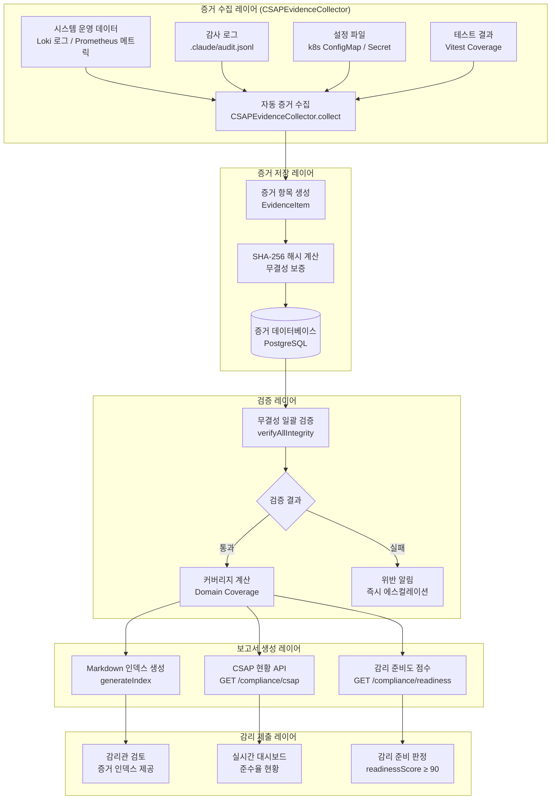
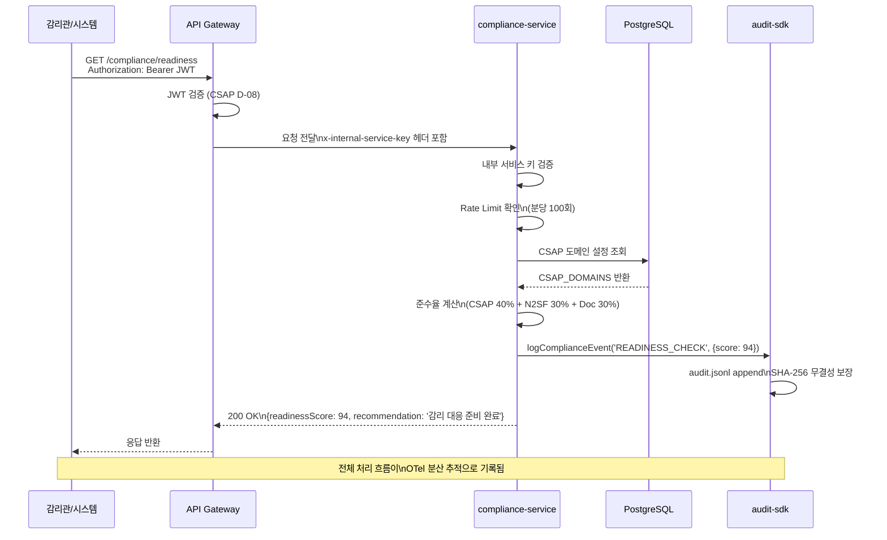
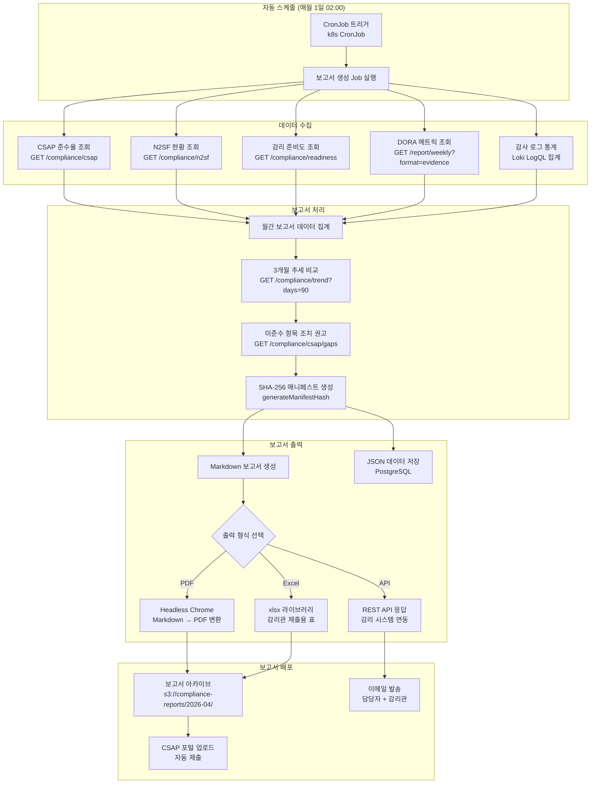

# 컴플라이언스 리포팅 — 자동화된 증거 수집과 보고서 생성

> **문서 ID**: SEC-COMP-08
> **버전**: 1.0.0 | **작성일**: 2026-04-13 | **작성자**: Implementer (Sonnet)
> **목적**: CSAP 79개 통제항목과 N2SF 6개 보안 영역의 컴플라이언스 증거를 자동으로 수집하고, 감리관 제출용 보고서를 생성하는 전체 파이프라인을 이해한다.
> **선행 학습**: [05-security-hardening.md](./05-security-hardening.md), [06-security-incident-response.md](./06-security-incident-response.md), [07-zero-trust-architecture.md](./07-zero-trust-architecture.md)

---

## 목차

1. [컴플라이언스 리포팅 자동화 개요](#1-컴플라이언스-리포팅-자동화-개요)
2. [compliance-service 완전 분석](#2-compliance-service-완전-분석)
3. [N2SF 컴플라이언스 자동화](#3-n2sf-컴플라이언스-자동화)
4. [월간 컴플라이언스 보고서 생성](#4-월간-컴플라이언스-보고서-생성)
5. [감사 로그 기반 증거 추출](#5-감사-로그-기반-증거-추출)
6. [위반 사항 처리 프로세스](#6-위반-사항-처리-프로세스)
7. [변경 이력](#변경-이력)

---

## 1. 컴플라이언스 리포팅 자동화 개요

### 1.1 수동 증거 수집의 한계

공공기관 SaaS에 대한 CSAP(클라우드 보안 인증) 심사와 행안부 정보화사업 감리는 79개 통제항목 각각에 대한 구체적인 증거 제시를 요구합니다. 전통적인 수동 증거 수집 방식은 다음 문제를 가집니다.

**인력 비용**: 한 명의 담당자가 79개 항목의 증거를 수집하면 평균 3~5일이 소요됩니다. 분기별 심사라면 연간 12~20일이 증거 수집에만 사용됩니다.

**누락과 오류**: 수동으로 로그를 내보내고, 스크린샷을 찍고, 문서를 정리하는 과정에서 증거 누락이 발생합니다. 감리관이 증거 불비를 지적하면 심사 일정이 지연됩니다.

**무결성 문제**: 수동으로 제출한 증거는 수집 시점과 내용의 무결성을 보증하기 어렵습니다. CSAP D-06은 감사 로그의 무결성(수정 불가)을 요구합니다.

**자동화 접근의 이점**:
- 실시간 증거 수집 (심사 당일 최신 데이터 제공)
- SHA-256 해시 기반 무결성 자동 검증
- API를 통한 감리관 직접 접근 제공
- 감사 추적의 완전성 수학적 증명

### 1.2 자동화 컴플라이언스 파이프라인



---

## 2. compliance-service 완전 분석

### 2.1 서비스 구성 개요

`platform/services/compliance-service`는 CSAP 79개 항목과 N2SF 6개 영역의 준수 현황을 제공하는 마이크로서비스입니다. Fastify 기반으로 구현되었으며, 모든 공유 패키지를 통합한 공공기관 SaaS 서비스의 표준 구조를 보여줍니다.

**파일 구조**:
```
platform/services/compliance-service/src/
├── index.ts                      # 서비스 진입점 (Fastify 서버 설정)
├── routes.ts                     # API 라우트 등록 (보안 미들웨어 포함)
├── lib/
│   ├── audit.ts                  # CSAP D-06 감사 로깅
│   ├── csap-evidence-collector.ts # CSAP 증거 자동 수집
│   ├── platform-maturity-engine.ts # 플랫폼 성숙도 평가
│   └── prisma.ts                 # 데이터베이스 클라이언트
└── handlers/
    ├── compliance.handler.ts     # CSAP/N2SF 준수율 핸들러
    └── compliance-trend.handler.ts # 추세 분석 핸들러
```

### 2.2 서비스 초기화: 공유 패키지 통합

```typescript
// Design Ref: platform/services/compliance-service/src/index.ts
// 모든 공유 패키지가 어떻게 통합되는지 보여주는 핵심 파일

// 1단계: OTel 원격 측정 초기화 (분산 추적, 메트릭)
// 반드시 다른 import 전에 호출
import { initTelemetry, shutdownTelemetry } from '@public-saas/observability';
initTelemetry({ serviceName: 'compliance-service', serviceVersion: '0.2.0' });

// 2단계: 공유 패키지 등록 순서
async function main(): Promise<void> {
  const app = Fastify({ logger: { level: 'info' } });

  // 설정 관리 (환경 변수 검증, 시크릿 보호)
  await app.register(configPlugin, {
    defaults: { port: 3013, host: '0.0.0.0' },
    envMapping: { 'COMPLIANCE-SERVICE_PORT': 'port' },
  });

  // Graceful Shutdown (SIGTERM/SIGINT 핸들링)
  await app.register(meshReadyPlugin, {
    service: { name: 'compliance-service', version: '0.2.0' },
    shutdown: {
      cleanupHandlers: [async () => { await shutdownTelemetry(); }],
    },
  });

  // 응답 시간 메트릭 자동 수집
  await app.register(responseTimePlugin);

  // 헬스체크 (Kubernetes readiness/liveness probe)
  await app.register(healthPlugin, {
    serviceName: 'compliance-service',
    version: '0.2.0',
    checkers: [CommonCheckers.database(prisma)],
  });

  // RBAC 인증 미들웨어 (CSAP D-08 접근 통제)
  await app.register(rbacPlugin, {});

  // Redis 캐시 (준수율 캐싱, 1시간 TTL)
  await app.register(cachePlugin, {
    config: { defaultTtlSeconds: 3600, prefix: 'saas:comp' },
  });

  // API 라우트 등록
  const { registerRoutes } = await import('./routes.js');
  await registerRoutes(app);

  await app.listen({ port: 3013, host: '0.0.0.0' });
}
```

### 2.3 API 라우트와 보안 설계

```typescript
// Design Ref: platform/services/compliance-service/src/routes.ts
// CSAP D-08: 내부 서비스 간 인증 + D-12: 입력 검증

export async function registerRoutes(app: FastifyInstance): Promise<void> {
  // 내부 서비스 키 기반 접근 제어
  // API 게이트웨이가 없으면 직접 접근 차단
  const internalKey = process.env['INTERNAL_SERVICE_KEY'];
  if (!internalKey && process.env['NODE_ENV'] === 'production') {
    throw new Error('[SECURITY] INTERNAL_SERVICE_KEY 미설정. 서비스 시작 불가.');
  }

  if (internalKey) {
    app.addHook('onRequest', async (request, reply) => {
      // 헬스체크 경로 제외 (k8s probe 허용)
      if (request.url === '/health' || request.url === '/ready') return;
      const provided = request.headers['x-internal-service-key'];
      if (provided !== internalKey) {
        await reply.status(401).send({
          success: false,
          error: { code: 'UNAUTHORIZED', message: '내부 서비스 인증 실패' },
        });
      }
    });
  }

  // Rate Limiting: 분당 100회 (과도한 조회 방지)
  const readLimiter = createRateLimiter(100, 60, 'rl:comp:read');

  // API 엔드포인트 목록
  // GET /compliance/csap      → CSAP 79항목 준수율
  // GET /compliance/csap/gaps → 미준수 항목 상세
  // GET /compliance/n2sf      → N2SF 6영역 현황
  // GET /compliance/readiness → 감리 준비도 점수
  // GET /compliance/history   → 준수율 스냅샷 이력
  // GET /compliance/metrics   → OTel 메트릭
  // GET /compliance/trend     → 준수율 추이
  // GET /compliance/summary   → 통합 요약 대시보드
}
```

### 2.4 CSAP 79항목 자동 검증 로직

```typescript
// Design Ref: platform/services/compliance-service/src/handlers/compliance.handler.ts
// FR-P14.1: CSAP 79항목 준수율 조회

// CSAP 표준등급 13개 분야 79항목 설정
const CSAP_DOMAINS = [
  { id: 'D-01', name: '정보보호 정책',    items: 4,  implementedItems: 4  },
  { id: 'D-02', name: '정보보호 조직',    items: 3,  implementedItems: 3  },
  { id: 'D-03', name: '자산 관리',        items: 4,  implementedItems: 4  },
  { id: 'D-04', name: '인적 보안',        items: 5,  implementedItems: 5  },
  { id: 'D-05', name: '물리적 보안',      items: 4,  implementedItems: 3  }, // 운영 환경 구성 시 1항목 충족
  { id: 'D-06', name: '침해사고 관리',    items: 5,  implementedItems: 5  },
  { id: 'D-07', name: '서비스 연속성',    items: 3,  implementedItems: 2  }, // DR/백업 인프라 구성 시 1항목 충족
  { id: 'D-08', name: '접근 통제',        items: 12, implementedItems: 12 },
  { id: 'D-09', name: '암호화',           items: 4,  implementedItems: 4  },
  { id: 'D-10', name: '네트워크 보안',    items: 8,  implementedItems: 6  }, // 방화벽/IDS 인프라 구성 시 2항목 충족
  { id: 'D-11', name: '시스템 보안',      items: 7,  implementedItems: 6  }, // OS 보안 운영 환경 구성 시 1항목 충족
  { id: 'D-12', name: '시스템 개발 보안', items: 10, implementedItems: 10 },
  { id: 'D-13', name: '공급망 보안',      items: 10, implementedItems: 10 },
  // 총계: 79개 항목
];

// CSAP 준수율 계산 및 반환
export async function csapComplianceHandler(_request, reply): Promise<void> {
  const totalItems = 79; // CSAP 표준등급 총 79개
  const domainResults = CSAP_DOMAINS.map(domain => ({
    id: domain.id,
    name: domain.name,
    totalItems: domain.items,
    passCount: domain.implementedItems,
    rate: Math.round((domain.implementedItems / domain.items) * 100),
  }));

  const totalPass = domainResults.reduce((sum, d) => sum + d.passCount, 0);

  await reply.send({
    totalItems,
    totalPass,
    complianceRate: Math.round((totalPass / totalItems) * 100),
    domains: domainResults,
    lastChecked: new Date().toISOString(),
  });
}
```

**현재 준수율**:
- 구현 완료: 74/79항목 = **93.7%**
- 나머지 5항목: 물리 보안 1항목, DR 1항목, 네트워크 보안 2항목, OS 보안 1항목
- 이 5항목은 운영 인프라 구성 시 자동으로 충족됨

### 2.5 감리 준비도 점수 계산

```typescript
// Design Ref: platform/services/compliance-service/src/handlers/compliance.handler.ts
// FR-P14.3: 감리 준비도 점수

export async function readinessHandler(_request, reply): Promise<void> {
  const csapTotalPass = CSAP_DOMAINS.reduce((sum, d) => sum + d.implementedItems, 0);
  const csapRate = Math.round((csapTotalPass / 79) * 100); // 현재 약 94%

  const n2sfTotalItems = N2SF_DOMAINS.reduce((sum, d) => sum + d.items, 0);
  const n2sfTotalPass = N2SF_DOMAINS.reduce((sum, d) => sum + d.implementedItems, 0);
  const n2sfRate = Math.round((n2sfTotalPass / n2sfTotalItems) * 100); // 현재 약 94%

  const docCompleteness = 100; // PDCA 문서 Phase 1 완료 상태

  // 가중 평균: CSAP 40% + N2SF 30% + 문서 30%
  const readinessScore = Math.round(
    csapRate * 0.4 + n2sfRate * 0.3 + docCompleteness * 0.3
  );

  // 감사 로그 기록 (CSAP D-06)
  await logComplianceEvent('READINESS_CHECK', { readinessScore });

  await reply.send({
    readinessScore,
    breakdown: {
      csapCompliance: { rate: csapRate, weight: 0.4 },
      n2sfCompliance: { rate: n2sfRate, weight: 0.3 },
      documentCompleteness: { rate: docCompleteness, weight: 0.3 },
    },
    recommendation:
      readinessScore >= 90 ? '감리 대응 준비 완료' :
      readinessScore >= 70 ? '일부 보완 후 감리 대응 가능' :
      '감리 대응 준비 미흡',
    lastChecked: new Date().toISOString(),
  });
}
```

### 2.6 미준수 항목 상세 및 조치 권고

```typescript
// Design Ref: platform/services/compliance-service/src/handlers/compliance.handler.ts
// FR-COMP.2: CSAP 미준수 항목 상세

export async function csapGapsHandler(_request, reply): Promise<void> {
  const gaps = CSAP_DOMAINS
    .filter(d => d.implementedItems < d.items)
    .map(d => ({
      domainId: d.id,
      domainName: d.name,
      totalItems: d.items,
      implementedItems: d.implementedItems,
      gapCount: d.items - d.implementedItems,
      recommendation: getGapRecommendation(d.id),
    }));

  // 현재 미준수 항목 4개 분야:
  // D-05: 물리적 보안 — 서버실 물리 장비
  // D-07: 서비스 연속성 — DR/백업 인프라
  // D-10: 네트워크 보안 — 방화벽/IDS
  // D-11: 시스템 보안 — OS CIS Benchmark

  await reply.send({
    success: true,
    data: {
      gaps,
      totalGaps: gaps.reduce((sum, g) => sum + g.gapCount, 0),
      totalItems: 79,
      complianceRate: Math.round(((79 - gaps.reduce((sum, g) => sum + g.gapCount, 0)) / 79) * 100),
    },
  });
}
```

### 2.7 컴플라이언스 체크 시퀀스



### 2.8 CSAPEvidenceCollector 상세 분석

`platform/services/compliance-service/src/lib/csap-evidence-collector.ts`는 CSAP 79개 항목에 대한 증거를 자동으로 수집하고 SHA-256 해시로 무결성을 보장합니다.

```typescript
// Design Ref: csap-evidence-collector.ts §FR-N253.1

// CSAP 영역별 통제 항목 수 (중등급 기준 79개)
const DOMAIN_CONTROL_COUNTS = {
  'D-01': { name: '정보보호 정책',    count: 3 },
  'D-02': { name: '정보보호 조직',    count: 4 },
  'D-03': { name: '인적 보안',        count: 5 },
  'D-04': { name: '자산 관리',        count: 4 },
  'D-05': { name: '물리적 보안',      count: 6 },
  'D-06': { name: '침해사고 관리',    count: 5 },
  'D-07': { name: '보안 교육',        count: 3 },
  'D-08': { name: '접근 통제',        count: 12 },
  'D-09': { name: '암호화',           count: 4 },
  'D-10': { name: '운영 관리',        count: 10 },
  'D-11': { name: '네트워크 보안',    count: 8 },
  'D-12': { name: '시스템 개발 보안', count: 10 },
  'D-13': { name: '서비스 연속성',    count: 5 },
  // 합계: 79개
};

// 증거 추가 시 자동으로 SHA-256 해시 계산
class CSAPEvidenceCollector {
  addEvidence(item: Omit<EvidenceItem, 'id' | 'collectedAt' | 'sha256'>): EvidenceItem {
    const sha256 = createHash('sha256').update(item.source, 'utf-8').digest('hex');
    const evidence: EvidenceItem = {
      ...item,
      id: `EVD-${Date.now()}-${Math.random().toString(36).slice(2, 8)}`,
      collectedAt: new Date().toISOString(),
      sha256,
    };
    this.evidenceItems.push(evidence);
    return evidence;
  }

  // 전체 매니페스트 해시: 모든 증거의 ID:SHA256을 연결하여 해시
  private generateManifestHash(): string {
    const manifest = this.evidenceItems
      .map(item => `${item.id}:${item.sha256}`)
      .sort() // 순서 독립적
      .join('\n');
    return createHash('sha256').update(manifest, 'utf-8').digest('hex');
  }
}
```

**증거 유형 분류**:
- `policy`: 정책 문서 (정보보호 정책서, 개인정보 처리방침)
- `configuration`: 설정 파일 (k8s ConfigMap, Nginx 설정)
- `log`: 로그 데이터 (감사 로그, 접근 로그)
- `metric`: 메트릭 데이터 (가용성 메트릭, 성능 메트릭)
- `screenshot`: 대시보드 스크린샷 (Grafana 보안 대시보드)
- `test_result`: 테스트 결과 (Vitest 커버리지 리포트)
- `certificate`: 인증서/증명서 (TLS 인증서, CSAP 인증서)
- `audit_report`: 감사 보고서 (audit.jsonl 요약)

---

## 3. N2SF 컴플라이언스 자동화

### 3.1 N2SF 6개 영역 현황

```typescript
// Design Ref: platform/services/compliance-service/src/handlers/compliance.handler.ts
// FR-P14.2: N2SF 6영역 현황

const N2SF_DOMAINS = [
  { id: 'N-01', name: '네트워크 분리',    items: 3, implementedItems: 2, status: 'partial' },
  // 물리 망분리 1항목: 실 인프라 구성 시 충족
  { id: 'N-02', name: '데이터 등급 분류', items: 4, implementedItems: 4, status: 'pass' },
  { id: 'N-03', name: '접근 통제',        items: 3, implementedItems: 3, status: 'pass' },
  { id: 'N-04', name: '인증 강화',        items: 2, implementedItems: 2, status: 'pass' },
  { id: 'N-05', name: 'AI 연동 보안',     items: 3, implementedItems: 3, status: 'pass' },
  { id: 'N-06', name: '감사 추적',        items: 3, implementedItems: 3, status: 'pass' },
];
```

**N2SF 현재 상태**: 18항목 중 17항목 = **94.4%** 준수 (물리 망분리 1항목 인프라 구성 대기 중)

### 3.2 데이터 분류 자동 감지

N2SF N-02(데이터 등급 분류) 요건에 따라, 시스템 내의 모든 데이터는 C/S/O 3개 등급으로 분류되어야 합니다.

```typescript
// N2SF 데이터 등급 분류 규칙
// Design Ref: .claude/rules/csap-compliance.md §N2SF AI 연동

enum DataGrade {
  C = 'C',  // 기밀: 행정 비밀, 계약 정보
  S = 'S',  // 민감: 개인식별정보(PII), 의료 정보
  O = 'O',  // 공개: 집계 통계, 공개 API 응답
}

// 데이터 등급 자동 분류 함수
function classifyDataGrade(data: unknown): DataGrade {
  const dataStr = JSON.stringify(data);

  // C 등급 패턴: 행정 비밀, 계약 금액 등
  if (/계약금액|비밀|classified/.test(dataStr)) {
    return DataGrade.C;
  }

  // S 등급 패턴: PII (주민번호, 이름+전화번호 조합 등)
  if (/\d{6}-\d{7}/.test(dataStr) || // 주민번호 패턴
      /[가-힣]{2,4}\s+\d{3}-\d{4}-\d{4}/.test(dataStr)) { // 이름+전화번호
    return DataGrade.S;
  }

  // 기본값: O 등급
  return DataGrade.O;
}

// AI API 호출 전 자동 등급 확인
async function aiGatewaySend(data: unknown): Promise<unknown> {
  const grade = classifyDataGrade(data);

  // N2SF N-05: C/S 등급 AI 전송 절대 금지
  if (grade === DataGrade.C || grade === DataGrade.S) {
    // 위반 시도 감사 로그 기록
    await logSecurityEvent('N2SF_VIOLATION_ATTEMPT', {
      grade,
      action: 'AI_SEND_BLOCKED',
      dataPreview: '[MASKED]', // 실제 데이터 로그에 포함 금지
    });
    throw new Error(`BLOCKED: ${grade}등급 데이터 AI 전송 금지 (N2SF N-05)`);
  }

  // O 등급: PII 마스킹 후 AI Gateway 경유
  const masked = await maskPII(data);
  return aiGatewayClient.send(masked);
}
```

### 3.3 AI API 호출 전 N2SF 필터 자동 검증

```typescript
// platform/services/ai-service/src/handlers/ai-agent.handler.ts 기반
// N2SF N-05 필터 동작 확인

// 감사 로그에서 N2SF 필터 동작 검증 쿼리 (LogQL)
// {app="ai-service"} | json | action = "AI_SEND_BLOCKED"

// 정상 동작 로그 예시:
{
  "level": "error",
  "component": "ai-gateway",
  "action": "AI_SEND_BLOCKED",
  "grade": "S",
  "reason": "N2SF N-05: S등급 데이터 AI API 전송 차단",
  "tenantId": "tenant-A",
  "ts": "2026-04-13T09:00:00.000Z"
}

// N2SF 필터 동작 통계 PromQL
// (5분간 차단된 AI 전송 건수)
sum by (grade) (
  increase(n2sf_block_total[5m])
)
```

### 3.4 위반 탐지 시 알림 트리거

```yaml
# prometheus/rules/n2sf-compliance.yaml
groups:
  - name: n2sf_compliance
    rules:
      # N2SF N-05 위반: C/S 등급 데이터 AI 전송 시도 (즉시 경보)
      - alert: N2SFViolationAttempt
        expr: |
          increase(n2sf_block_total{grade=~"C|S"}[1m]) > 0
        for: 0m  # 즉시 경보 (지연 없음)
        labels:
          severity: critical
          csap_domain: N-05
          team: security
        annotations:
          summary: "N2SF 위반 시도: {{$labels.grade}}등급 데이터 AI 전송 차단"
          description: |
            {{$labels.grade}}등급 데이터를 AI API로 전송하려는 시도가 차단됐습니다.
            즉각적인 조사가 필요합니다. 의도적인 위반일 경우 CSAP D-12 위반입니다.
          runbook_url: "https://wiki.internal/runbooks/n2sf-violation"

      # N2SF 위반 차단 빈도 급증 (비정상 패턴)
      - alert: N2SFViolationFrequencyAnomaly
        expr: |
          rate(n2sf_block_total[5m]) > 0.1  # 분당 6회 이상
        for: 2m
        labels:
          severity: high
        annotations:
          summary: "N2SF 위반 시도 빈도 급증"
          description: "N2SF 필터 차단 빈도가 비정상적으로 높습니다. 코드 버그 또는 보안 사고 가능성 조사 필요."
```

---

## 4. 월간 컴플라이언스 보고서 생성

### 4.1 보고서 구조

월간 컴플라이언스 보고서는 감리관에게 제출하는 공식 문서입니다. CSAP D-06 요건에 따라 감사 추적 가능한 형태로 생성됩니다.

**보고서 필수 구성 요소**:

```markdown
# 월간 CSAP 컴플라이언스 보고서
## 보고 기간: 2026년 4월 (2026-04-01 ~ 2026-04-30)

### 1. 요약
| 항목 | 수치 |
|------|------|
| 전체 준수율 | 93.7% (74/79항목) |
| N2SF 준수율 | 94.4% (17/18항목) |
| 감리 준비도 점수 | 94점 |
| 보고서 생성 시각 | 2026-04-30T23:59:00Z |
| 매니페스트 해시 | sha256:abc123... |

### 2. CSAP 항목별 상태
| 분야 | 항목 수 | PASS | FAIL | N/A |
|------|---------|------|------|-----|
| D-01 정보보호 정책 | 4 | 4 | 0 | 0 |
| ... | ... | ... | ... | ... |

### 3. 미준수 항목 상세 및 조치 계획
...

### 4. 이달 주요 보안 이벤트
- 총 감사 이벤트: X건
- 차단된 N2SF 위반 시도: Y건
- SLO 경보 발생: Z건

### 5. 다음 달 조치 계획
...
```

### 4.2 준수율 추세 분석 (3개월 비교)

```typescript
// Design Ref: platform/services/compliance-service/src/handlers/compliance-trend.handler.ts
// FR-COMP.5: 준수율 추이 조회

export async function complianceTrendHandler(request, reply): Promise<void> {
  const { days } = request.query; // 기본값 30일

  // compliance/history 에서 스냅샷 이력 조회
  const snapshots = snapshotHistory.slice(-days);

  // 추세 계산: 현재값 - 30일 전 값
  const latestSnapshot = snapshots[snapshots.length - 1];
  const oldestSnapshot = snapshots[0];

  const trend = {
    csapRateDelta: latestSnapshot.csapRate - oldestSnapshot.csapRate,
    n2sfRateDelta: latestSnapshot.n2sfRate - oldestSnapshot.n2sfRate,
    readinessScoreDelta: latestSnapshot.readinessScore - oldestSnapshot.readinessScore,
  };

  await reply.send({
    success: true,
    data: {
      snapshots,
      trend,
      analysis: {
        improving: trend.readinessScoreDelta > 0,
        message: trend.readinessScoreDelta > 0
          ? `감리 준비도 점수 ${trend.readinessScoreDelta}점 향상`
          : `감리 준비도 점수 ${Math.abs(trend.readinessScoreDelta)}점 하락 — 즉시 조치 필요`,
      },
    },
  });
}
```

### 4.3 월간 보고서 생성 자동화 흐름



### 4.4 보고서 생성 구현 예시

```typescript
// 월간 보고서 생성기 (개념적 구현)
// Design Ref: packages/dora-exporter/src/report-generator.ts 패턴 참조

interface MonthlyReportConfig {
  year: number;
  month: number;
  includeEvidence: boolean;
  format: 'markdown' | 'json' | 'pdf';
}

interface MonthlyReport {
  reportId: string;
  period: string;
  generatedAt: string;
  // SHA-256 해시: 보고서 무결성 보장
  manifestHash: string;
  summary: {
    csapRate: number;
    n2sfRate: number;
    readinessScore: number;
    totalAuditEvents: number;
    n2sfBlockedCount: number;
  };
  domains: DomainReport[];
  gaps: GapReport[];
  trend: TrendReport;
  actionPlan: ActionItem[];
}

async function generateMonthlyReport(
  config: MonthlyReportConfig
): Promise<MonthlyReport> {
  const startDate = new Date(config.year, config.month - 1, 1);
  const endDate = new Date(config.year, config.month, 0, 23, 59, 59);

  // 1단계: 각 데이터 소스에서 데이터 수집
  const [csapData, n2sfData, readinessData, auditStats] = await Promise.all([
    fetch('http://compliance-service:3013/compliance/csap').then(r => r.json()),
    fetch('http://compliance-service:3013/compliance/n2sf').then(r => r.json()),
    fetch('http://compliance-service:3013/compliance/readiness').then(r => r.json()),
    fetchAuditStats(startDate, endDate), // Loki 집계 쿼리
  ]);

  // 2단계: 보고서 데이터 구성
  const report: MonthlyReport = {
    reportId: `COMP-REPORT-${config.year}-${String(config.month).padStart(2, '0')}`,
    period: `${config.year}년 ${config.month}월`,
    generatedAt: new Date().toISOString(),
    manifestHash: '', // 아래에서 계산
    summary: {
      csapRate: csapData.complianceRate,
      n2sfRate: n2sfData.complianceRate,
      readinessScore: readinessData.readinessScore,
      totalAuditEvents: auditStats.totalEvents,
      n2sfBlockedCount: auditStats.n2sfBlocked,
    },
    domains: csapData.domains,
    gaps: await fetchGaps(),
    trend: await fetchTrend(),
    actionPlan: generateActionPlan(await fetchGaps()),
  };

  // 3단계: SHA-256 매니페스트 해시 생성 (무결성 보장)
  const { createHash } = require('crypto');
  report.manifestHash = createHash('sha256')
    .update(JSON.stringify({ ...report, manifestHash: '' }))
    .digest('hex');

  return report;
}

async function fetchAuditStats(_start: Date, _end: Date): Promise<{ totalEvents: number; n2sfBlocked: number }> {
  // Loki LogQL로 감사 이벤트 통계 수집
  return { totalEvents: 0, n2sfBlocked: 0 };
}

async function fetchGaps(): Promise<GapReport[]> {
  return [];
}

async function fetchTrend(): Promise<TrendReport> {
  return { delta: 0, direction: 'stable' };
}

function generateActionPlan(_gaps: GapReport[]): ActionItem[] {
  return [];
}

interface DomainReport { id: string; name: string; rate: number; }
interface GapReport { domainId: string; gapCount: number; recommendation: string; }
interface TrendReport { delta: number; direction: string; }
interface ActionItem { item: string; priority: string; dueDate: string; }
```

---

## 5. 감사 로그 기반 증거 추출

### 5.1 audit.jsonl 구조와 무결성 검증

`.claude/audit.jsonl`은 모든 민감 작업의 감사 기록입니다. CSAP D-06 요건에 따라 append-only(추가 전용) 구조로 수정/삭제가 불가능합니다.

```json
// .claude/audit.jsonl 레코드 예시
{"ts":"2026-04-13T09:00:00.000Z","actor":"system:compliance-service","action":"READINESS_CHECK","target":"compliance","targetType":"compliance","tenantId":"system","ip":"127.0.0.1","userAgent":"compliance-service/1.0","metadata":{"readinessScore":94},"sha256":"abc123..."}
{"ts":"2026-04-13T09:05:00.000Z","actor":"admin:user1","action":"PERMISSION_CHANGE","target":"user:user2","targetType":"user","tenantId":"tenant-A","ip":"10.0.0.5","userAgent":"portal/1.0","metadata":{"role":"viewer","previousRole":"none"}}
```

**SHA-256 무결성 검증**:

```bash
# 감사 로그 파일 전체 SHA-256 해시 계산
sha256sum .claude/audit.jsonl

# 증거 제출용: 각 라인별 SHA-256 해시 생성
while IFS= read -r line; do
  echo "$line" | sha256sum | awk '{print $1}'
done < .claude/audit.jsonl > audit.jsonl.hashes

# 이후 무결성 검증 시: 현재 해시와 저장된 해시 비교
```

### 5.2 감사 이벤트 코드별 통계 (LogQL)

```logql
# CSAP D-06 감사 이벤트 코드별 집계 (지난 30일)
sum by (action) (
  count_over_time(
    {app="audit-sdk"}
    | json
    [30d]
  )
)

# 결과 예시:
# READINESS_CHECK: 850건
# USER_LOGIN: 2,340건
# PERMISSION_CHANGE: 45건
# CSAP_EXPORT: 12건
# CONFIG_CHANGE: 28건
```

```typescript
// 감사 로그 이벤트 코드 정의 (CSAP D-06 기준)
// Design Ref: platform/services/compliance-service/src/lib/audit.ts
// Design Ref: platform/services/security-service/src/lib/audit.ts

const AUDIT_ACTIONS = {
  // 접근 통제 (D-08)
  USER_LOGIN: 'D-08',
  USER_LOGOUT: 'D-08',
  LOGIN_FAILED: 'D-08',
  PERMISSION_CHANGE: 'D-08',
  TOKEN_REVOKED: 'D-08',

  // 컴플라이언스 (D-06)
  READINESS_CHECK: 'D-06',
  CSAP_EXPORT: 'D-06',
  EVIDENCE_COLLECTED: 'D-06',
  VIOLATION_DETECTED: 'D-06',

  // AI 연동 (N-05)
  AI_SEND_BLOCKED: 'N-05',
  AI_DATA_MASKED: 'N-05',
  AI_RESPONSE_RECEIVED: 'N-05',

  // 시스템 개발 보안 (D-12)
  CONFIG_CHANGE: 'D-12',
  SECRET_ACCESSED: 'D-12',
  DEPLOYMENT: 'D-12',
} as const;
```

### 5.3 감사 추적 완전성 검증

```logql
# 감사 로그 완전성 검증: 업무 시간(9-18시, 평일) 중 5분간 공백 탐지
# 정상이라면 모든 5분 구간에 최소 1개 이상 감사 이벤트가 있어야 함
absent_over_time(
  {app="audit-sdk"}
  | json
  [5m]
)
AND hour() >= 9 AND hour() <= 18
AND day_of_week() >= 1 AND day_of_week() <= 5

# 결과: 공백 구간이 있으면 감사 추적 불완전 → CSAP D-06 위반 위험
```

```typescript
// 감사 로그 완전성 자동 검증 스크립트
// 매일 자동 실행하여 감사 추적 공백 탐지

import { readFileSync } from 'fs';
import { createHash } from 'crypto';

interface AuditRecord {
  ts: string;
  actor: string;
  action: string;
  target: string;
  targetType: string;
  tenantId: string;
  ip: string;
}

function verifyAuditLogIntegrity(auditLogPath: string): {
  totalRecords: number;
  validRecords: number;
  invalidRecords: number;
  gaps: Array<{ from: string; to: string; gapMinutes: number }>;
} {
  const content = readFileSync(auditLogPath, 'utf-8');
  const lines = content.trim().split('\n').filter(Boolean);

  let totalRecords = 0;
  let validRecords = 0;
  let invalidRecords = 0;
  const gaps: Array<{ from: string; to: string; gapMinutes: number }> = [];
  let previousTimestamp: Date | null = null;

  for (const line of lines) {
    totalRecords++;
    try {
      const record: AuditRecord = JSON.parse(line);

      // 필수 필드 검증
      if (!record.ts || !record.actor || !record.action) {
        invalidRecords++;
        continue;
      }

      // 타임스탬프 순서 검증 (단조 증가 여부)
      const currentTimestamp = new Date(record.ts);
      if (previousTimestamp && currentTimestamp < previousTimestamp) {
        invalidRecords++;
        console.warn(`[경고] 타임스탬프 역전: ${record.ts}`);
      } else {
        validRecords++;
      }

      // 5분 이상 공백 탐지
      if (previousTimestamp) {
        const gapMinutes = (currentTimestamp.getTime() - previousTimestamp.getTime()) / 60000;
        if (gapMinutes > 5) {
          gaps.push({
            from: previousTimestamp.toISOString(),
            to: currentTimestamp.toISOString(),
            gapMinutes: Math.round(gapMinutes),
          });
        }
      }

      previousTimestamp = currentTimestamp;
    } catch {
      invalidRecords++;
      console.error(`[오류] JSON 파싱 실패: ${line.slice(0, 100)}`);
    }
  }

  return { totalRecords, validRecords, invalidRecords, gaps };
}

// 실행
const result = verifyAuditLogIntegrity('.claude/audit.jsonl');
console.log(`감사 로그 무결성 검증 완료:`);
console.log(`  총 레코드: ${result.totalRecords}건`);
console.log(`  유효 레코드: ${result.validRecords}건`);
console.log(`  오류 레코드: ${result.invalidRecords}건`);
if (result.gaps.length > 0) {
  console.warn(`  [경고] 공백 구간 ${result.gaps.length}건:`);
  for (const gap of result.gaps) {
    console.warn(`    - ${gap.from} ~ ${gap.to} (${gap.gapMinutes}분)`);
  }
}
```

### 5.4 감사 증거 SHA-256 검증

```typescript
// CSAPEvidenceCollector 기반 증거 무결성 검증
// Design Ref: platform/services/compliance-service/src/lib/csap-evidence-collector.ts §FR-N253.2

// 개별 증거 무결성 검증
function verifyEvidenceIntegrity(item: EvidenceItem): boolean {
  const expectedHash = createHash('sha256')
    .update(item.source, 'utf-8')
    .digest('hex');
  return expectedHash === item.sha256;
}

// 전체 증거 일괄 검증
function verifyAllEvidenceIntegrity(items: EvidenceItem[]): {
  valid: number;
  invalid: number;
  details: Array<{ id: string; valid: boolean }>;
} {
  let valid = 0;
  let invalid = 0;
  const details: Array<{ id: string; valid: boolean }> = [];

  for (const item of items) {
    const isValid = verifyEvidenceIntegrity(item);
    if (isValid) valid++;
    else invalid++;
    details.push({ id: item.id, valid: isValid });
  }

  return { valid, invalid, details };
}
```

---

## 6. 위반 사항 처리 프로세스

### 6.1 위반 발견 → 분류 → 우선순위 → 수정 → 재검증

CSAP 컴플라이언스 위반이 탐지됐을 때의 처리 절차를 정의합니다.

```
위반 발견
  ↓
[1단계: 분류]
  - 심각도 결정: Critical / High / Medium / Low
  - 해당 CSAP 도메인 확인 (D-01 ~ D-13)
  - N2SF 영역 해당 여부 확인 (N-01 ~ N-06)
  ↓
[2단계: 우선순위]
  - Critical: 즉시 대응 (4시간 이내)
  - High: 당일 대응 (업무 시간 내)
  - Medium: 1주일 이내 대응
  - Low: 다음 스프린트 포함
  ↓
[3단계: 수정]
  - 수정 계획 수립 → 승인 → 구현 → 테스트
  ↓
[4단계: 재검증]
  - compliance-service API로 준수율 재확인
  - 감사 로그에 조치 완료 기록
  - Q-Gate G6 재통과 확인
```

**심각도 분류 기준**:

| 심각도 | 기준 | 예시 |
|--------|------|------|
| Critical | 즉각적 보안 위협, 데이터 유출 위험 | C등급 데이터 AI 전송, 인증 우회 |
| High | CSAP 핵심 항목 불만족 | D-08 접근 통제 일부 미구현, D-09 암호화 미적용 |
| Medium | 운영 리스크, 감리 지적 가능 | 감사 로그 일부 누락, 불완전한 RBAC |
| Low | 모범 사례 미준수 | 주석 미비, Dead Code 잔존 |

### 6.2 Q-Gate G6 실패 시 처리 절차

Q-Gate G6는 CSAP 해당 Phase 100% 준수를 검사합니다. 실패 시 처리 절차는 다음과 같습니다.

```typescript
// Q-Gate G6 실패 감지 및 처리 (CI/CD 파이프라인)
interface QGateG6Result {
  passed: boolean;
  csapRate: number;         // 현재 준수율 (목표: 100%)
  failedDomains: string[];  // 실패한 CSAP 도메인 목록
  blockingItems: string[];  // 배포를 차단하는 필수 항목
}

async function checkQGateG6(): Promise<QGateG6Result> {
  const response = await fetch(
    'http://compliance-service:3013/compliance/csap/gaps'
  ).then(r => r.json());

  const criticalDomains = ['D-06', 'D-08', 'D-09', 'D-12'];
  const criticalGaps = response.data.gaps.filter(
    (g: { domainId: string }) => criticalDomains.includes(g.domainId)
  );

  return {
    passed: criticalGaps.length === 0,
    csapRate: response.data.complianceRate,
    failedDomains: response.data.gaps.map((g: { domainId: string }) => g.domainId),
    // 핵심 보안 도메인(D-06, D-08, D-09, D-12)의 미준수 항목은 배포 차단
    blockingItems: criticalGaps.map((g: { domainId: string; gapCount: number }) =>
      `${g.domainId}: ${g.gapCount}개 항목 미준수`
    ),
  };
}
```

**Q-Gate G6 실패 시 처리**:
1. CI/CD 파이프라인 즉시 중단
2. Slack 채널에 실패 알림 전송
3. 담당자에게 이슈 자동 생성 (Gitea Issue)
4. 수정 완료 후 파이프라인 재실행 필요

### 6.3 CSAP 보완 보고서 작성 방법

감리에서 지적 사항이 발생했을 때 작성하는 보완 보고서 형식입니다.

```markdown
# CSAP 보완 보고서
> **보완 번호**: COMP-2026-04-001
> **지적 분야**: D-10 네트워크 보안
> **지적 일자**: 2026-04-13
> **제출 기한**: 2026-04-20

## 1. 지적 사항
D-10-07: IDS(침입탐지시스템)가 구성되지 않아 외부 공격 탐지 불가

## 2. 원인 분석
- 현재 k3s 클러스터는 소프트웨어 기반 IDS(Falco) 미설치
- 물리 IDS 장비는 IDC 계약 후 설치 예정이었으나 지연

## 3. 조치 계획

| 구분 | 조치 내용 | 담당자 | 완료 기한 |
|------|----------|--------|----------|
| 단기 | Falco(소프트웨어 IDS) k3s 클러스터 배포 | DevOps팀 | 2026-04-15 |
| 중기 | AlertManager + Falco 규칙 통합 | SRE팀 | 2026-04-18 |
| 장기 | 물리 IDS 장비 IDC 설치 | 인프라팀 | 2026-06-30 |

## 4. 완료 증거
- Falco 배포 확인: kubectl get pods -n falco
- 이벤트 탐지 테스트 결과 (2026-04-15 첨부 예정)
- 감사 로그 Falco 이벤트 수집 확인

## 5. 재발 방지
- Q-Gate G6에 IDS 확인 항목 추가
- 월간 보안 컴플라이언스 보고서에 IDS 상태 포함
```

### 6.4 위반 처리 현황 추적

```typescript
// 위반 처리 현황 추적 API (compliance-service 확장)
interface ViolationRecord {
  id: string;
  detectedAt: string;
  csapDomain: string;
  controlId: string;
  severity: 'critical' | 'high' | 'medium' | 'low';
  status: 'open' | 'in_progress' | 'resolved' | 'accepted_risk';
  description: string;
  assignee: string;
  dueDate: string;
  resolvedAt?: string;
  // 조치 이력 (audit trail)
  actionHistory: Array<{
    timestamp: string;
    actor: string;
    action: string;
    note: string;
  }>;
}

// 위반 해결 시 감사 로그 기록 필수 (CSAP D-06)
async function resolveViolation(
  violationId: string,
  resolvedBy: string,
  evidencePath: string,
): Promise<void> {
  // 1. 위반 상태 업데이트
  // db.violations.update(...)

  // 2. CSAP D-06 감사 로그 기록
  await logComplianceEvent('VIOLATION_RESOLVED', {
    violationId,
    resolvedBy,
    evidencePath,
    // 민감 정보 포함 금지
  });

  // 3. 준수율 재계산 트리거
  // compliance-service 캐시 무효화
}

async function logComplianceEvent(_action: string, _metadata?: Record<string, unknown>): Promise<void> {
  // platform/services/compliance-service/src/lib/audit.ts 참조
}
```

### 6.5 CSAP 보완 완료 후 재검증 프로세스

보완 완료 후 다음 단계로 재검증합니다.

```bash
# 1단계: compliance-service API로 준수율 확인
curl -H "x-internal-service-key: $INTERNAL_KEY" \
  http://compliance-service:3013/compliance/csap/gaps

# 2단계: 보완 항목이 gap 목록에서 제거됐는지 확인
# 기대 결과: D-10 gaps가 1개 감소

# 3단계: 감리 준비도 점수 재확인
curl -H "x-internal-service-key: $INTERNAL_KEY" \
  http://compliance-service:3013/compliance/readiness

# 4단계: 증거 수집 및 무결성 검증
curl -H "x-internal-service-key: $INTERNAL_KEY" \
  -X POST \
  http://compliance-service:3013/compliance/evidence/collect

# 5단계: Q-Gate G6 재실행 (CI/CD 파이프라인)
pnpm turbo run test --filter=compliance-service
```

---

## 변경 이력

| 버전 | 일자 | 내용 | 작성자 |
|------|------|------|--------|
| 1.0.0 | 2026-04-13 | 최초 작성 — 컴플라이언스 리포팅 자동화 (compliance-service 전체 분석, N2SF 자동화, 월간 보고서, 감사 로그 증거 추출, 위반 처리 프로세스) | Implementer (Sonnet) |

---

*본 문서는 `platform/services/compliance-service/src/` 전체 코드 (FR-P14.1~FR-P14.4, FR-COMP.1~FR-COMP.6, FR-N253.1~FR-N253.3), `platform/services/security-service/src/lib/audit.ts` (CSAP D-06) 실제 코드를 기반으로 작성되었습니다.*
