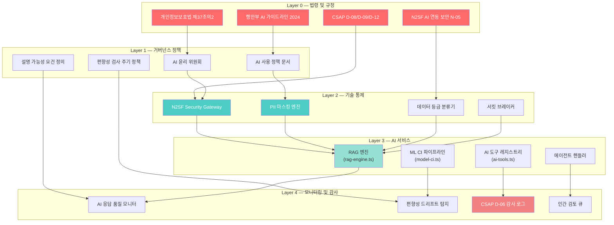
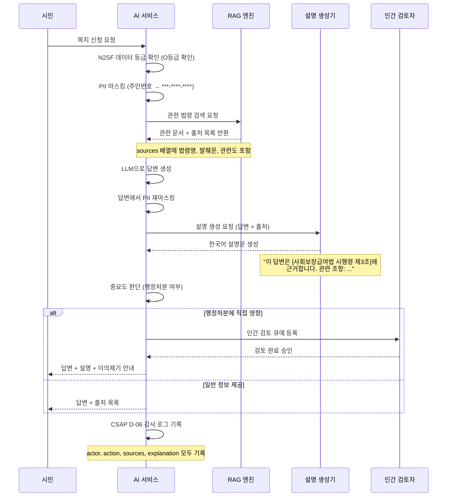
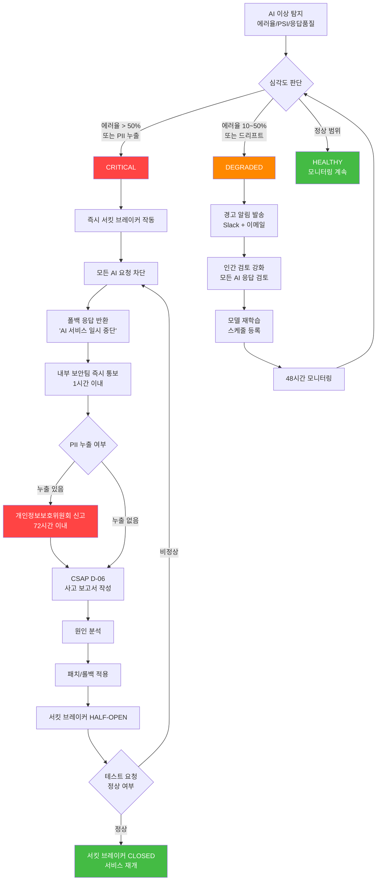

# AI 윤리 및 거버넌스 — 공공기관 AI 책임 개발 가이드

> **문서 ID**: ONBOARD-SEC-011
> **버전**: 1.0.0
> **작성일**: 2026-04-13
> **목적**: 공공기관 SaaS 프레임워크에서 AI를 책임 있고 투명하게 개발·운영하기 위한 윤리 원칙, 거버넌스 체계, 기술 구현 방법을 초급자 수준에서 완전히 이해할 수 있도록 안내한다.
> **선행 학습**: `07-security/05-security-hardening.md`, `07-security/08-compliance-reporting.md`, `07-security/10-secret-management-guide.md`

---

## 목차

1. [공공기관 AI 거버넌스 프레임워크](#1-공공기관-ai-거버넌스-프레임워크)
2. [AI 모델 편향성 검사](#2-ai-모델-편향성-검사)
3. [AI 설명 가능성 (XAI)](#3-ai-설명-가능성-xai)
4. [AI 응답 품질 보증](#4-ai-응답-품질-보증)
5. [N2SF AI 윤리 확장](#5-n2sf-ai-윤리-확장)
6. [AI 사고 대응](#6-ai-사고-대응)
7. [변경 이력](#7-변경-이력)

---

## 1. 공공기관 AI 거버넌스 프레임워크

### 1.1 왜 공공기관 AI는 일반 AI와 다른가

공공기관이 AI를 활용하는 상황은 민간 기업과 본질적으로 다릅니다. 민간 기업의 AI가 잘못된 추천을 내리면 소비자가 다른 서비스로 전환할 수 있지만, 공공기관의 AI가 잘못된 판단을 내리면 시민의 기본권이 침해될 수 있습니다.

구체적인 예를 들면 다음과 같습니다.

- **사회복지 급여 심사 AI**: 소득·재산 데이터를 분석해 급여 수급 자격을 판단합니다. AI가 특정 지역이나 직업군을 불리하게 평가하면 헌법상 평등권 침해가 됩니다.
- **채용 심사 AI**: 공개 채용에서 AI가 특정 학교 출신이나 성별을 편향적으로 평가하면 공무원법 위반이 됩니다.
- **민원 우선순위 AI**: AI가 특정 계층의 민원을 낮은 우선순위로 배치하면 행정 서비스 차별이 됩니다.

이러한 이유로 행안부는 2024년 「공공분야 AI 서비스 개발·운영 가이드라인」을 제정하였고, 이 프레임워크는 해당 가이드라인을 완전히 준수합니다.

### 1.2 행안부 AI 활용 가이드라인 (2024) 핵심 요건

행안부 가이드라인은 공공 AI에 다음 6가지 원칙을 요구합니다.

**원칙 1 — 공공성**: AI 도입 목적이 공공 이익에 부합해야 합니다. 비용 절감만을 위한 AI 도입은 지양합니다.

**원칙 2 — 투명성**: AI가 어떤 데이터를 활용해 어떤 판단을 내렸는지 이해관계자에게 설명할 수 있어야 합니다. 블랙박스 모델을 행정 처분에 직접 사용할 수 없습니다.

**원칙 3 — 공정성**: AI 모델이 특정 집단에 불리한 결과를 내지 않도록 정기적으로 편향성을 검사해야 합니다.

**원칙 4 — 안전성**: AI 오작동 시 즉각 차단하고 인간이 개입할 수 있는 안전장치가 필요합니다.

**원칙 5 — 개인정보 보호**: AI 학습과 추론 과정에서 개인정보보호법, CSAP D-09(암호화), N2SF 데이터 등급 분류를 반드시 준수합니다.

**원칙 6 — 책임성**: AI 결정에 대한 최종 책임은 담당 공무원에게 있습니다. AI는 보조 도구이지 의사결정자가 아닙니다.

### 1.3 개인정보보호법과 AI 설명 가능성 요건

2023년 개정 개인정보보호법 제37조의2는 **완전히 자동화된 의사결정에 대한 거부권 및 설명 요구권**을 신설했습니다. 이것이 공공 AI 개발에 미치는 영향은 다음과 같습니다.

```
[개인정보보호법 제37조의2 핵심 내용]

정보주체는 자신에게 법적 또는 중대한 영향을 미치는
완전히 자동화된 의사결정에 대해:

1. 거부할 권리가 있다.
2. 그 결정에 대한 설명을 요구할 권리가 있다.
3. 인간의 검토를 요구할 권리가 있다.

처리자는 자동화된 결정 사실, 관련 기준, 이의제기 방법을
정보주체에게 알려야 한다.
```

이를 위반하면 개인정보보호위원회로부터 과태료(최대 3,000만 원) 또는 과징금(전년도 매출액의 3%)이 부과될 수 있습니다.

이 프레임워크는 이 요건을 충족하기 위해 다음을 구현합니다.

- RAG 기반 출처 추적 (모든 AI 답변에 참조 문서 표시)
- 설명 API 엔드포인트 (`/api/v1/ai/explain`)
- 인간 검토 게이트 (Human-in-the-Loop)

### 1.4 AI 거버넌스 레이어 아키텍처

아래 다이어그램은 이 프레임워크의 AI 거버넌스가 어떤 계층 구조로 동작하는지 보여줍니다.



**다이어그램 읽는 법**: Layer 0(법령)이 Layer 1(정책)을 강제하고, Layer 1이 Layer 2(기술 통제)를 구성하며, Layer 2가 Layer 3(AI 서비스)을 제어합니다. Layer 4(모니터링)는 모든 계층을 감시합니다.

### 1.5 AI 거버넌스 위원회 구성

공공기관 AI 거버넌스는 기술 부서만의 문제가 아닙니다. 다양한 이해관계자가 참여해야 합니다.

| 역할 | 책임 | 검토 주기 |
|------|------|-----------|
| AI 윤리 책임자 (CTO) | 편향성 검사 결과 최종 승인 | 분기 |
| 개인정보 보호관 (CPO) | PII 처리 방침 검토 | 월 |
| 법무 담당관 | 개인정보보호법 준수 검토 | 분기 |
| 서비스 담당 공무원 | AI 결정 수용 여부 판단 | 개별 건별 |
| AI 개발팀 | 모델 성능 및 편향성 보고 | 월 |
| 시민 대표 (선택) | 서비스 대상자 피드백 | 연 |

---

## 2. AI 모델 편향성 검사

### 2.1 공공 서비스에서 편향이 미치는 영향

편향(Bias)은 AI 모델이 특정 집단에 대해 일관되게 부정확하거나 불공평한 결과를 내는 현상입니다. 공공 서비스에서 이것이 왜 중요한지 구체적인 시나리오로 이해합니다.

**시나리오 A — 복지 급여 심사**
```
[훈련 데이터 문제]
과거 급여 데이터에 특정 지역 주민의 신청이 과도하게 반려된
이력이 있다면, AI 모델은 해당 지역을 "높은 반려 확률"로 학습합니다.
결과적으로 실제로 자격이 있는 시민이 AI 심사에서 불합격할 수 있습니다.

[법적 결과]
- 헌법 제11조(평등권) 위반 가능성
- 사회보장기본법 위반
- 행정심판 및 행정소송 대상
```

**시나리오 B — 민원 분류**
```
[편향 유형]
AI 민원 분류기가 특정 언어 패턴이나 표현 방식에서
성별, 연령대, 학력 수준을 추론하여 우선순위를 차별적으로 부여할 수 있습니다.

[결과]
노인이나 외국인이 작성한 민원이 지속적으로 낮은 우선순위를
받는다면, 이것은 디지털 격차의 재생산입니다.
```

### 2.2 편향의 종류

공공 AI에서 주의해야 할 편향의 유형을 이해합니다.

**1) 역사적 편향 (Historical Bias)**
과거 데이터 자체가 불공평했던 경우. 예를 들어 특정 지역 공공 투자 부족이 데이터에 반영되어, AI가 해당 지역을 "저개발 지역"으로 고착화합니다.

**2) 측정 편향 (Measurement Bias)**
데이터 수집 방식이 특정 집단에서 부정확한 경우. 예를 들어 스마트폰 앱 사용자 데이터만 수집하면 고령층 데이터가 누락됩니다.

**3) 집계 편향 (Aggregation Bias)**
서로 다른 집단을 같은 모델로 처리하는 경우. 예를 들어 도시와 농촌 주민을 같은 복지 모델로 심사하면 농촌 특성이 반영되지 않습니다.

**4) 표현 편향 (Representation Bias)**
특정 집단이 훈련 데이터에서 과소 또는 과대 대표되는 경우.

### 2.3 통계적 편향 탐지 방법

편향을 탐지하기 위해 주로 사용되는 통계 지표들을 이해합니다.

**지표 1 — Demographic Parity (인구 통계적 동등성)**
```
정의: 서로 다른 집단이 동일한 긍정 결과를 받는 비율이 같아야 한다.

수식:
  P(Y_hat = 1 | A = 0) = P(Y_hat = 1 | A = 1)

예시 — 복지 수급 승인율 검사:
  지역 A 승인율: 78%
  지역 B 승인율: 62%
  차이: 16%p → 임계값(10%p) 초과 → 편향 의심

허용 임계값: 각 집단 간 승인율 차이 10%p 이하
```

**지표 2 — Equalized Odds (균등화 확률)**
```
정의: 실제 양성(True Positive)과 위양성(False Positive) 비율이
      집단 간에 동일해야 한다.

중요성: "정확하게 자격 있는 사람을 승인하는 비율"이
         집단별로 같아야 공정하다.
```

**지표 3 — Calibration (보정 정확성)**
```
정의: 모델이 "80% 확률"이라고 예측했을 때,
      실제로 80%가 그 결과여야 한다.

공공 서비스 적용: 급여 승인 확률 0.8 예측 중 실제 80%가 자격 있다면 합격.
                  특정 집단에서만 보정이 맞지 않으면 편향.
```

### 2.4 model-ci.ts의 검증 기준 해설

이 프레임워크의 ML CI 파이프라인(`packages/ml-pipeline/src/model-ci.ts`)은 모델 검증 단계에서 다음과 같은 기준을 적용합니다.

```typescript
// 실제 코드: model-ci.ts의 DEFAULT_VALIDATION_CRITERIA
const DEFAULT_VALIDATION_CRITERIA: ModelValidationCriteria = {
  minAccuracy: 0.85,        // 전체 정확도 85% 이상
  maxInferenceTimeMs: 100,  // 추론 시간 100ms 이하
  maxModelSizeMb: 500,      // 모델 크기 500MB 이하
  requiredMetrics: ['accuracy', 'f1_score', 'precision', 'recall'],
  // 필수 메트릭: 4개 모두 제출해야 함
};
```

**각 메트릭의 의미와 공공 AI 적용**

| 메트릭 | 의미 | 공공 AI 중요성 |
|--------|------|----------------|
| `accuracy` | 전체 정확도 (맞은 수 / 전체) | 기본 성능 기준 |
| `f1_score` | precision과 recall의 조화 평균 | 불균형 데이터셋에서 핵심 |
| `precision` | 긍정 예측 중 실제 긍정 비율 | 오승인 방지 (세금 낭비 방지) |
| `recall` | 실제 긍정 중 긍정 예측 비율 | 오탈락 방지 (권리 침해 방지) |

**공공 AI에서 recall이 특히 중요한 이유**: 복지 심사에서 자격 있는 사람을 탈락시키는 것(낮은 recall)은 자격 없는 사람을 통과시키는 것(낮은 precision)보다 사회적 피해가 큽니다. 따라서 공공 복지 AI는 recall을 precision보다 우선시해야 합니다.

**PSI(Population Stability Index) — 모델 드리프트 감지**

`ModelDriftDetector` 클래스는 PSI를 계산하여 모델의 입력 분포가 변화했는지 감지합니다.

```typescript
// 실제 코드: model-ci.ts의 PSI 임계값
constructor(psiThreshold = 0.2, ksThreshold = 0.05) {
  this.psiThreshold = psiThreshold;  // PSI > 0.2 → 드리프트
}

// PSI 해석 기준
if (psi > 0.25) {
  recommendation = '심각한 드리프트 - 즉시 모델 재학습 필요';
} else if (psi > 0.2) {
  recommendation = '경미한 드리프트 - 재학습 검토 필요';
} else if (psi > 0.1) {
  recommendation = '주의 - 추이 모니터링 강화';
}
```

PSI가 0.2를 초과한다는 것은 모델이 학습할 때의 데이터 분포와 현재 운영 중인 데이터 분포가 크게 달라졌음을 의미합니다. 이 상태에서 계속 운영하면 편향이 심화될 수 있습니다.

### 2.5 공공 AI 전용 편향성 검사 구현

```typescript
// Design Ref: ONBOARD-SEC-011 §2.5
// Plan SC: AI-REQ-3 편향성 검사

interface FairnessMetrics {
  groupAccuracy: Record<string, number>;      // 집단별 정확도
  demographicParityDiff: number;              // 인구 통계적 동등성 차이
  equalizedOddsDiff: number;                  // 균등화 확률 차이
  disparateImpactRatio: number;               // 불평등 영향 비율
}

async function checkFairness(
  modelPredictions: Array<{ prediction: number; actual: number; group: string }>,
): Promise<{ passed: boolean; metrics: FairnessMetrics; violations: string[] }> {
  const groups = [...new Set(modelPredictions.map(p => p.group))];
  const groupAccuracy: Record<string, number> = {};
  const groupPositiveRates: Record<string, number> = {};

  for (const group of groups) {
    const groupData = modelPredictions.filter(p => p.group === group);
    const correct = groupData.filter(p => p.prediction === p.actual).length;
    const positiveCount = groupData.filter(p => p.prediction === 1).length;

    groupAccuracy[group] = correct / groupData.length;
    groupPositiveRates[group] = positiveCount / groupData.length;
  }

  const positiveRateValues = Object.values(groupPositiveRates);
  const maxRate = Math.max(...positiveRateValues);
  const minRate = Math.min(...positiveRateValues);
  const demographicParityDiff = maxRate - minRate;

  // 불평등 영향 비율: 가장 낮은 집단 / 가장 높은 집단
  // 0.8 이상이어야 공정 (4/5 규칙)
  const disparateImpactRatio = minRate / maxRate;

  const violations: string[] = [];

  // 공공 AI 편향성 판단 기준
  if (demographicParityDiff > 0.1) {
    violations.push(`인구 통계적 동등성 위반: 집단 간 승인율 차이 ${(demographicParityDiff * 100).toFixed(1)}%p (임계값 10%p)`);
  }
  if (disparateImpactRatio < 0.8) {
    violations.push(`불평등 영향 위반: 비율 ${disparateImpactRatio.toFixed(2)} (4/5 규칙 미달)`);
  }

  return {
    passed: violations.length === 0,
    metrics: {
      groupAccuracy,
      demographicParityDiff,
      equalizedOddsDiff: 0, // 상세 계산 생략
      disparateImpactRatio,
    },
    violations,
  };
}
```

### 2.6 편향성 완화 전략

편향이 발견되었을 때 적용할 수 있는 3가지 전략입니다.

**전처리 완화 (Pre-processing)**
- 훈련 데이터에서 과소 대표 집단의 샘플을 오버샘플링합니다.
- 불공정한 특성(지역 코드, 성별 등)을 직접 제거합니다.
- 단, 공공 서비스에서 지역을 완전히 제거하면 서비스 차별화가 불가능해질 수 있어 신중해야 합니다.

**학습 중 완화 (In-processing)**
- 공정성 제약 조건을 손실 함수에 추가합니다.
- 예: Fairness Constraints를 적용한 Logistic Regression

**후처리 완화 (Post-processing)**
- 집단별로 의사결정 임계값을 조정합니다.
- 예: 집단 A의 임계값 0.5, 집단 B의 임계값 0.45 (더 낮은 확률에도 긍정 결정)

**이 프레임워크의 권고 접근법**: 공공 서비스의 투명성 요건 때문에 후처리 완화가 가장 설명하기 쉽습니다. 각 집단별 임계값을 명시적으로 설정하고 이를 운영 문서에 기록합니다.

---

## 3. AI 설명 가능성 (XAI)

### 3.1 설명이 필요한 순간

AI가 내린 결정에 대해 설명을 제공해야 하는 상황은 법령과 행정 절차에 의해 명시적으로 정해져 있습니다.

**법적 의무가 있는 설명 요구 상황**

| 상황 | 관련 법령 | 설명 내용 |
|------|----------|-----------|
| 복지 급여 거부 | 사회보장기본법 제13조 | 거부 사유, AI 판단 근거 |
| 행정 처분 | 행정절차법 제23조 | 처분 이유 및 근거 법령 |
| 정보공개 거부 | 정보공개법 제13조 | 비공개 사유 |
| 개인정보 자동처리 | 개인정보보호법 제37조의2 | AI 결정 기준 및 이의제기 방법 |

**설명의 깊이**

1. **무엇(What)**: 어떤 결정이 내려졌는가
2. **왜(Why)**: 어떤 데이터와 기준으로 결정했는가
3. **어떻게(How)**: 결정에 가장 영향을 미친 요소는 무엇인가
4. **대안(What-if)**: 어떤 조건이 바뀌면 결정이 달라지는가

공공기관은 최소한 1, 2번을 제공해야 하며, 중요한 처분의 경우 3, 4번까지 제공해야 합니다.

### 3.2 LIME — 국소적 설명

LIME(Local Interpretable Model-agnostic Explanations)은 블랙박스 AI 모델의 특정 예측을 설명하기 위한 기술입니다.

**핵심 아이디어**: 복잡한 모델 전체를 이해하려 하지 않고, 특정 하나의 예측 주변에서만 동작하는 단순한 선형 모델로 국소적으로 근사합니다.

```
[LIME 동작 원리]

1. 설명할 입력 x 선택 (예: 민원 텍스트)
   "교통 신호등 고장으로 사고 위험"

2. x 주변의 변형 샘플 생성
   - "교통 신호등 고장"
   - "사고 위험"
   - "신호등 고장으로 위험"

3. 변형 샘플들에 대해 원본 모델 예측 실행
   - 교통 카테고리: 0.92
   - 교통 카테고리: 0.88
   - 교통 카테고리: 0.95

4. 가중치가 적용된 선형 모델 피팅
   "교통" 단어 기여도: +0.45
   "신호등" 단어 기여도: +0.38
   "사고" 단어 기여도: +0.31

5. 설명 출력
   "이 민원은 '교통'(기여 45%), '신호등'(기여 38%), '사고'(기여 31%) 키워드로 인해
    교통 카테고리로 분류되었습니다."
```

**텍스트 민원 분류 LIME 적용 예시**

```typescript
// Design Ref: ONBOARD-SEC-011 §3.2
// LIME 스타일 텍스트 설명 생성기 (간소화 구현)

interface TokenContribution {
  token: string;
  contribution: number;  // -1.0 ~ 1.0
  direction: 'positive' | 'negative' | 'neutral';
}

interface LIMEExplanation {
  prediction: string;
  confidence: number;
  topTokens: TokenContribution[];
  humanReadable: string;
}

async function explainClassification(
  text: string,
  classifier: (t: string) => Promise<{ category: string; confidence: number }>,
  numSamples: number = 50,
): Promise<LIMEExplanation> {
  const originalResult = await classifier(text);
  const tokens = text.split(/\s+/);
  const contributions: Record<string, number[]> = {};

  // 토큰 하나씩 제거하며 예측 변화 측정
  for (const token of tokens) {
    contributions[token] = [];
    for (let i = 0; i < Math.min(numSamples, tokens.length); i++) {
      const perturbed = tokens.filter(t => t !== token).join(' ');
      const perturbedResult = await classifier(perturbed);
      const impact = originalResult.confidence - perturbedResult.confidence;
      contributions[token].push(impact);
    }
  }

  const avgContributions = Object.entries(contributions).map(([token, values]) => ({
    token,
    contribution: values.reduce((a, b) => a + b, 0) / values.length,
    direction: (values.reduce((a, b) => a + b, 0) / values.length) > 0.05
      ? 'positive' as const
      : (values.reduce((a, b) => a + b, 0) / values.length) < -0.05
        ? 'negative' as const
        : 'neutral' as const,
  })).sort((a, b) => Math.abs(b.contribution) - Math.abs(a.contribution));

  const topTokens = avgContributions.slice(0, 5);
  const topPositive = topTokens.filter(t => t.direction === 'positive').slice(0, 3);

  const humanReadable = `이 민원은 ${topPositive.map(t => `'${t.token}'(기여도 ${(t.contribution * 100).toFixed(0)}%)`).join(', ')} 키워드로 인해 '${originalResult.category}' 카테고리로 분류되었습니다. (신뢰도: ${(originalResult.confidence * 100).toFixed(0)}%)`;

  return {
    prediction: originalResult.category,
    confidence: originalResult.confidence,
    topTokens,
    humanReadable,
  };
}
```

### 3.3 SHAP — 전역적 기여도 분석

SHAP(SHapley Additive exPlanations)은 게임 이론의 Shapley 값을 활용하여 각 입력 특성이 예측에 얼마나 기여했는지를 공정하게 계산합니다.

**LIME vs SHAP 비교**

| 항목 | LIME | SHAP |
|------|------|------|
| 설명 범위 | 국소(하나의 예측) | 전역(전체 모델) + 국소 |
| 계산 비용 | 낮음 | 높음 |
| 일관성 | 낮음 (랜덤 샘플링) | 높음 (이론적 보장) |
| 공공 AI 적합성 | 개별 민원 설명 | 모델 전체 공정성 감사 |

**공공 AI에서의 실용 권고**: 개별 시민에게 제공하는 설명에는 LIME을 사용하고, 정기 편향성 감사 보고서에는 SHAP을 사용합니다.

### 3.4 RAG 기반 출처 추적

이 프레임워크의 RAG 엔진(`rag-engine.ts`)은 AI 응답의 출처를 자동으로 추적합니다. 이것은 공공기관 AI에서 설명 가능성을 구현하는 가장 실용적인 방법입니다.

```typescript
// 실제 코드: rag-engine.ts의 출처 정보 구조
export interface RAGSource {
  documentTitle: string;  // 참조 문서명
  chunkIndex: number;     // 문서 내 청크 번호
  score: number;          // 관련도 점수 (0~1)
  excerpt: string;        // 인용 발췌문 (150자)
}

// Advanced RAG 응답에 출처가 포함되는 방식
const ragResponse: AdvancedRAGResponse = {
  answer: "복지 급여 신청 기준은...",
  sources: [
    {
      documentTitle: "사회보장급여법 시행령",
      chunkIndex: 3,
      score: 0.92,
      excerpt: "소득 인정액이 기준 중위소득 50% 이하인 경우..."
    },
    {
      documentTitle: "복지부 고시 제2024-18호",
      chunkIndex: 7,
      score: 0.87,
      excerpt: "재산 환산율 적용 기준..."
    }
  ],
  // ...
};
```

시민이 "AI가 왜 이렇게 답변했나요?"라고 물으면, `sources` 배열을 보여주면 됩니다. 이것이 개인정보보호법 제37조의2가 요구하는 "관련 기준" 설명을 자동으로 충족합니다.

### 3.5 AI 결정 설명 생성 흐름



---

## 4. AI 응답 품질 보증

### 4.1 Hallucination — AI가 거짓말을 하는 문제

Hallucination(환각)은 AI 모델이 사실과 다른 내용을 자신감 있게 생성하는 현상입니다. 공공기관에서 이것은 특히 위험합니다.

**공공기관 Hallucination 사례**

```
[실제 발생 가능한 시나리오]

시민 질문: "저는 기초생활수급자인데 청년 지원금 신청할 수 있나요?"

나쁜 AI 응답 (Hallucination):
"네, 기초생활수급자도 청년 지원금을 신청할 수 있습니다.
신청은 복지로(www.bokjiro.go.kr)에서 가능하며,
지원금은 월 50만원입니다." (← 이 숫자는 AI가 만들어낸 것일 수 있음)

좋은 RAG 기반 응답:
"제공된 문서에서 확인한 결과, 청년 지원금 중복 수령 가능 여부는
'서울형 청년 주거 지원사업 운영 지침(2024)' [출처] 제3조에 따라
결정됩니다. 기초생활수급자 여부가 제한 요건인지는
해당 문서에서 명시적으로 확인되지 않으며, 정확한 확인을 위해
담당 주민센터에 문의하시기 바랍니다."
```

두 번째 응답이 훨씬 길고 덜 편리해 보이지만, 시민에게 잘못된 정보를 주지 않는다는 점에서 공공 서비스에서는 반드시 이런 방식이어야 합니다.

### 4.2 Hallucination 탐지 방법

이 프레임워크에서 Hallucination을 탐지하는 세 가지 방법입니다.

**방법 1 — 출처 커버리지 검사**

```typescript
// Design Ref: ONBOARD-SEC-011 §4.2
// RAG 응답의 모든 주요 사실 주장이 출처로 뒷받침되는지 검사

interface HallucinationCheck {
  answer: string;
  sources: RAGSource[];
  confidenceScore: number;  // 0~1
  ungroundedClaims: string[];  // 출처 없는 주장 목록
}

function checkHallucination(response: RAGResponse): HallucinationCheck {
  const ungroundedClaims: string[] = [];

  // 숫자/금액 주장이 출처에 있는지 확인
  const numberClaims = response.answer.match(/\d+[만억원%개월일]/g) ?? [];
  for (const claim of numberClaims) {
    const isGrounded = response.sources.some(s =>
      s.excerpt.includes(claim.replace(/[만억원%개월일]/g, ''))
    );
    if (!isGrounded) {
      ungroundedClaims.push(`숫자 주장 '${claim}'의 출처 미확인`);
    }
  }

  // 출처 관련도 평균
  const avgScore = response.sources.length > 0
    ? response.sources.reduce((sum, s) => sum + s.score, 0) / response.sources.length
    : 0;

  return {
    answer: response.answer,
    sources: response.sources,
    confidenceScore: avgScore,
    ungroundedClaims,
  };
}
```

**방법 2 — 자기 일관성 검사 (Self-Consistency)**

같은 질문을 3번 실행하여 답변이 일관되는지 확인합니다. 불일치하는 부분이 있다면 Hallucination 위험 신호입니다.

**방법 3 — 무지 명시 검사**

RAG 엔진의 시스템 프롬프트는 이미 이것을 구현합니다.

```typescript
// 실제 코드: rag-engine.ts의 DEFAULT_SYSTEM_PROMPT
const DEFAULT_SYSTEM_PROMPT = `...
문서에 없는 내용은 "제공된 문서에서 찾을 수 없습니다"라고 정직하게 답하세요.
...`;
```

이 프롬프트 설계가 Hallucination을 가장 효과적으로 막습니다.

### 4.3 응답 검증 파이프라인

```typescript
// Design Ref: ONBOARD-SEC-011 §4.3
// Plan SC: AI-REQ-4 응답 품질 보증

interface QualityGate {
  name: string;
  check: (response: RAGResponse) => Promise<{ passed: boolean; reason?: string }>;
  severity: 'block' | 'warn' | 'log';
}

const QUALITY_GATES: QualityGate[] = [
  {
    name: 'minimum-sources',
    severity: 'block',
    check: async (r) => ({
      passed: r.sources.length > 0,
      reason: '출처 없는 응답은 공공기관에서 사용 불가',
    }),
  },
  {
    name: 'source-relevance',
    severity: 'warn',
    check: async (r) => ({
      passed: r.sources.every(s => s.score >= 0.3),
      reason: '낮은 관련도 출처 사용 — 답변 신뢰성 낮을 수 있음',
    }),
  },
  {
    name: 'pii-not-in-answer',
    severity: 'block',
    check: async (r) => {
      // 주민번호, 전화번호 패턴 검사
      const piiPattern = /\d{6}-\d{7}|\d{3}-\d{4}-\d{4}/;
      return {
        passed: !piiPattern.test(r.answer),
        reason: 'PII가 응답에 포함됨 — 즉시 차단',
      };
    },
  },
  {
    name: 'answer-not-empty',
    severity: 'block',
    check: async (r) => ({
      passed: r.answer.length >= 10,
      reason: '응답이 너무 짧음',
    }),
  },
];

async function runQualityGates(response: RAGResponse): Promise<{
  passed: boolean;
  results: Array<{ gate: string; passed: boolean; severity: string; reason?: string }>;
}> {
  const results = [];
  let blocked = false;

  for (const gate of QUALITY_GATES) {
    const result = await gate.check(response);
    results.push({ gate: gate.name, passed: result.passed, severity: gate.severity, reason: result.reason });
    if (!result.passed && gate.severity === 'block') {
      blocked = true;
    }
  }

  return { passed: !blocked, results };
}
```

### 4.4 인간 검토 (Human-in-the-Loop) 적용 시점

AI가 아무리 정확해도 다음 상황에서는 반드시 인간 검토가 필요합니다.

**반드시 인간 검토 필요**
- 행정 처분(급여 거부, 허가 취소 등)에 AI 결과가 직접 사용될 때
- AI 신뢰도 점수가 0.7 미만일 때
- 민원인이 AI 결정에 이의를 제기했을 때
- 개인정보가 처리 과정에 포함될 때
- PSI 드리프트 감지로 모델 신뢰성이 낮아진 때

**인간 검토 불필요**
- 일반적인 법령·정책 안내 (낮은 위험도)
- 내부 직원용 문서 검색
- 집계된 통계 데이터 조회

**인간 검토 큐 구현**

```typescript
// Design Ref: ONBOARD-SEC-011 §4.4

interface HumanReviewRequest {
  requestId: string;
  ragResponse: RAGResponse;
  triggerReason: string;
  priority: 'urgent' | 'normal';
  deadline: Date;
  citizenId?: string;  // 마스킹 필수
}

async function queueForHumanReview(
  response: RAGResponse,
  reason: string,
  priority: 'urgent' | 'normal' = 'normal',
): Promise<{ queued: boolean; reviewId: string; estimatedWait: string }> {
  // CSAP D-06: 인간 검토 큐 등록 감사 로그
  await auditLog({
    actor: 'ai-service',
    action: 'HUMAN_REVIEW_QUEUED',
    target: 'human-review-queue',
    metadata: { reason, priority, sourceCount: response.sources.length },
  });

  const reviewId = `HRV-${Date.now()}`;
  const estimatedWait = priority === 'urgent' ? '30분 이내' : '2시간 이내';

  return { queued: true, reviewId, estimatedWait };
}
```

---

## 5. N2SF AI 윤리 확장

### 5.1 N2SF 데이터 등급과 AI의 관계

N2SF(국가정보화 보안 프레임워크)는 데이터를 3개 등급으로 분류합니다. AI API 전송 관점에서 이 등급이 결정적입니다.

| 등급 | 명칭 | 예시 | AI API 전송 |
|------|------|------|------------|
| C (기밀) | Classified | 비밀 행정 문서, 국가 안보 정보 | 절대 금지 |
| S (민감) | Sensitive | 개인 의료 기록, 납세 정보, 주민등록 | 절대 금지 |
| O (공개) | Open | 공개 법령, 정책 안내문, 통계 | PII 마스킹 후 허용 |

### 5.2 C/S 등급 데이터 AI 처리 절대 금지 — 이유

이것이 왜 "절대 금지"인지 이해해야 합니다. 단순히 규정이기 때문이 아닙니다.

**기술적 이유**

외부 AI API(Anthropic, OpenAI 등)에 데이터를 전송하면 해당 데이터는 API 공급업체의 서버에서 처리됩니다. 이 과정에서:

1. 데이터가 일시적으로 외부 서버 메모리에 저장됩니다.
2. 모델 개선을 위해 학습 데이터로 사용될 수 있습니다 (약관에 따라 다름).
3. 외부 서버 보안 침해 시 데이터가 노출될 수 있습니다.
4. 데이터 처리 국가가 달라 국내 개인정보보호법 적용이 불명확해집니다.

**법적 이유**

- 개인정보보호법 제17조: 개인정보 제3자 제공 동의 없이 전송 금지
- 국가정보원 클라우드 보안 가이드라인: 비밀 자료 외부 클라우드 저장 금지
- 전자정부법 제47조: 공공정보 관리 원칙

**사례로 이해하기**

```
잘못된 구현 — 절대 해서는 안 됨:

async function analyzeWelfare(citizenData: WelfareApplication) {
  // ❌ S등급 데이터(납세 정보, 재산 정보)를 직접 Anthropic API에 전송
  const response = await anthropic.messages.create({
    model: 'claude-sonnet-4-6',
    messages: [{
      role: 'user',
      content: `다음 신청자를 심사하세요:
        이름: ${citizenData.name}
        주민번호: ${citizenData.ssn}
        재산: ${citizenData.assets}
        소득: ${citizenData.income}`
    }]
  });
}
```

```typescript
// 올바른 구현 — N2SF 게이트웨이 경유:

async function analyzeWelfare(citizenData: WelfareApplication) {
  // 1. 데이터 등급 확인
  const grade = classifyData(citizenData);  // → 'S'

  // 2. S등급이면 AI API 전송 금지
  if (grade === 'S' || grade === 'C') {
    throw new Error(`BLOCKED: ${grade}등급 데이터는 외부 AI API 전송 금지 (N2SF N-05)`);
  }

  // 3. O등급만 허용 — PII 마스킹 후 전송
  const maskedData = maskPII(citizenData.publicFields);  // 공개 필드만
  return await aiGateway.send(maskedData);  // 내부 게이트웨이 경유
}
```

### 5.3 PII 자동 마스킹 구현 확인

RAG 엔진은 질문과 답변 모두에 PII 마스킹을 적용합니다.

```typescript
// 실제 코드: rag-engine.ts의 PII 마스킹 적용 지점

// 질문 마스킹 (AI에 전송 전)
const maskedQuestion = maskPII(question);  // 라인 125

// 답변 마스킹 (AI 응답 수신 후)
answer: maskPII(llmResponse.text),  // 라인 146
```

이 중요한 패턴을 이해해야 합니다. AI에 전송하기 전과 AI에서 받은 후, 두 번 마스킹합니다.

**왜 두 번인가?**
- 전송 전 마스킹: AI에 PII가 노출되지 않도록
- 수신 후 마스킹: AI가 컨텍스트에서 PII를 유추하여 응답에 포함시켰을 경우 방어

**PII 마스킹 패턴 (pii-masking.ts에서 구현)**

```typescript
// Design Ref: ONBOARD-SEC-011 §5.3
// 공공기관 PII 마스킹 기준

const PII_PATTERNS: Array<[RegExp, string]> = [
  [/\d{6}-\d{7}/g, '******-*******'],          // 주민등록번호
  [/\d{3}-\d{4}-\d{4}/g, '***-****-****'],      // 휴대전화
  [/\d{2,3}-\d{3,4}-\d{4}/g, '**-***-****'],    // 유선전화
  [/[a-zA-Z0-9._%+-]+@[a-zA-Z0-9.-]+\.[a-zA-Z]{2,}/g, '***@***.***'],  // 이메일
  [/\d{6}(?=[-\s]?\d)/g, '******'],             // 생년월일 6자리
];

export function maskPII(text: string): string {
  let masked = text;
  for (const [pattern, replacement] of PII_PATTERNS) {
    masked = masked.replace(pattern, replacement);
  }
  return masked;
}
```

### 5.4 ai-tools.ts에서 윤리 제약 구현 확인

AI 도구 레지스트리에는 여러 윤리 제약이 구현되어 있습니다.

**제약 1 — 안전한 계산기 (Code Injection 방지)**

```typescript
// 실제 코드: ai-tools.ts 라인 130
// CSAP D-12: 안전한 수학 표현식만 허용 (Function 생성자/eval 사용 금지)
if (!/^[\d\s+\-*/().,]+$/.test(expression)) {
  return { success: false, output: '', error: '허용되지 않는 계산식입니다. 숫자와 사칙연산만 가능합니다.' };
}
```

이 정규식은 숫자와 사칙연산 기호만 허용합니다. `eval()` 이나 `new Function()` 같은 위험한 동적 코드 실행을 완전히 배제합니다.

**제약 2 — AI 초안 명시**

```typescript
// 실제 코드: ai-tools.ts 라인 166
const formatted = `[${docType}]
...
본 문서는 AI 초안입니다. 최종 검토 후 사용하세요.`;
```

AI가 생성한 모든 공문서 초안에는 이 경고문이 자동으로 추가됩니다. 공무원이 AI 생성 문서를 검토 없이 사용하는 것을 방지합니다.

**제약 3 — 텍스트 크기 제한 (DoS 방지)**

```typescript
// 실제 코드: ai-tools.ts 라인 100
const text = String(params['text'] ?? '').slice(0, 50000);
```

요약 도구에 입력되는 텍스트를 50,000자로 제한합니다. 무한히 긴 입력으로 시스템을 과부하시키는 공격을 방지합니다.

---

## 6. AI 사고 대응

### 6.1 AI 오작동 유형

AI 사고는 소프트웨어 버그와 다릅니다. AI 오작동은 예측하기 어렵고 점진적으로 악화되는 경향이 있습니다.

**유형 1 — 갑작스러운 성능 저하**
모델이 갑자기 이상한 응답을 생성합니다. 원인: 모델 프로바이더 업데이트, 프롬프트 주입 공격, 인프라 오류.

**유형 2 — 점진적 드리프트**
시간이 지남에 따라 응답 품질이 서서히 낮아집니다. 원인: 입력 데이터 분포 변화(PSI 증가), 지식베이스 문서 노후화.

**유형 3 — 보안 사고**
악의적 사용자가 프롬프트를 조작하여 AI가 민감 정보를 누출하거나 의도치 않은 행동을 하게 만듭니다. 원인: 프롬프트 인젝션, 탈옥(jailbreak) 시도.

**유형 4 — 가용성 장애**
AI API 공급업체 장애 또는 토큰 한도 초과로 서비스가 중단됩니다.

### 6.2 AI 오작동 탐지

```typescript
// Design Ref: ONBOARD-SEC-011 §6.2
// Plan SC: AI-REQ-6 사고 탐지

interface AIHealthMetrics {
  responseTimeP95Ms: number;    // p95 응답 시간
  errorRate5Min: number;        // 최근 5분 에러율
  avgSourceScore: number;       // 평균 출처 관련도
  hallucinationRate: number;    // Hallucination 탐지율
  psiCurrent: number;           // 현재 PSI
}

function assessAIHealth(metrics: AIHealthMetrics): {
  status: 'healthy' | 'degraded' | 'critical';
  actions: string[];
} {
  const actions: string[] = [];
  let status: 'healthy' | 'degraded' | 'critical' = 'healthy';

  if (metrics.errorRate5Min > 0.5) {
    status = 'critical';
    actions.push('즉시 서킷 브레이커 작동');
    actions.push('AI 서비스 롤백');
    actions.push('CSAP D-06 사고 보고서 작성');
  } else if (metrics.errorRate5Min > 0.1) {
    status = 'degraded';
    actions.push('경고 알림 발송');
    actions.push('폴백 응답 활성화');
  }

  if (metrics.psiCurrent > 0.25) {
    if (status === 'healthy') status = 'degraded';
    actions.push('모델 드리프트 감지 — 재학습 스케줄 등록');
  }

  if (metrics.hallucinationRate > 0.05) {
    if (status === 'healthy') status = 'degraded';
    actions.push('Hallucination 임계값 초과 — 인간 검토 강화');
  }

  return { status, actions };
}
```

### 6.3 서킷 브레이커 패턴

AI 서비스 장애 시 전체 시스템이 멈추지 않도록 서킷 브레이커를 사용합니다.

```
서킷 브레이커 상태 전환:

[CLOSED] ─── 에러율 > 50% ──→ [OPEN]
   ↑                              │
   │                              │ 30초 후
   │                              ↓
   └─ 테스트 요청 성공 ── [HALF-OPEN]

CLOSED  : 정상 동작. 모든 AI 요청 통과.
OPEN    : 장애 감지. AI 요청 즉시 차단, 폴백 응답 반환.
HALF-OPEN: 회복 테스트. 소량의 요청만 통과시켜 상태 확인.
```

### 6.4 CSAP 관련 AI 사고 보고 의무

CSAP D-06(침해사고 관리)에 따라 AI 관련 보안 사고는 반드시 보고해야 합니다.

**보고 기준** (다음 중 하나 해당 시):
- AI가 C/S 등급 데이터를 처리하는 오류가 발생했을 때
- AI 프롬프트 인젝션 공격이 탐지되었을 때
- AI 응답에 PII가 포함된 것이 발견되었을 때
- AI 에러율이 50% 이상 1시간 이상 지속될 때

**보고 절차**: 사고 발생 → 1시간 내 내부 보안팀 보고 → 24시간 내 CSAP 인증기관 보고 → 72시간 내 상세 보고서 제출

### 6.5 AI 사고 대응 흐름



### 6.6 사고 후 학습 (Post-Incident Review)

AI 사고는 재발 방지를 위한 학습 기회입니다. 모든 CRITICAL 사고에 대해 다음 문서를 작성합니다.

```markdown
## AI 사고 PIR (Post-Incident Review)

**사고 ID**: AI-INC-2026-001
**발생 시각**: 2026-04-13 14:30 KST
**복구 시각**: 2026-04-13 15:45 KST
**영향 범위**: 민원 분류 서비스 75분 중단

### 타임라인
| 시각 | 이벤트 |
|------|--------|
| 14:30 | PSI 0.31 감지 (임계값 0.25 초과) |
| 14:32 | 에러율 55% 달성, 서킷 브레이커 작동 |
| 14:35 | 보안팀 통보 완료 |
| 15:20 | 이전 모델 버전으로 롤백 |
| 15:45 | 서비스 정상화 확인 |

### 근본 원인
입력 데이터의 언어 패턴 분포 변화 (외래어 증가)로 PSI 급등

### 재발 방지 조치
1. PSI 모니터링 주기: 1시간 → 15분으로 단축
2. 0.2 이상 시 사전 경고 알림 추가
3. 언어 다양성 대응 훈련 데이터 보강
```

---

## 7. 변경 이력

| 버전 | 일자 | 변경 내용 | 작성자 |
|------|------|-----------|--------|
| 1.0.0 | 2026-04-13 | 최초 작성 — AI 윤리 거버넌스 초급자 가이드 | Implementer Agent |

---

*본 문서는 행안부 AI 활용 가이드라인(2024), 개인정보보호법 제37조의2, CSAP D-06/D-08/D-12 요건을 기반으로 작성되었습니다. 실제 운영 적용 전 법무팀 검토를 받으시기 바랍니다.*
