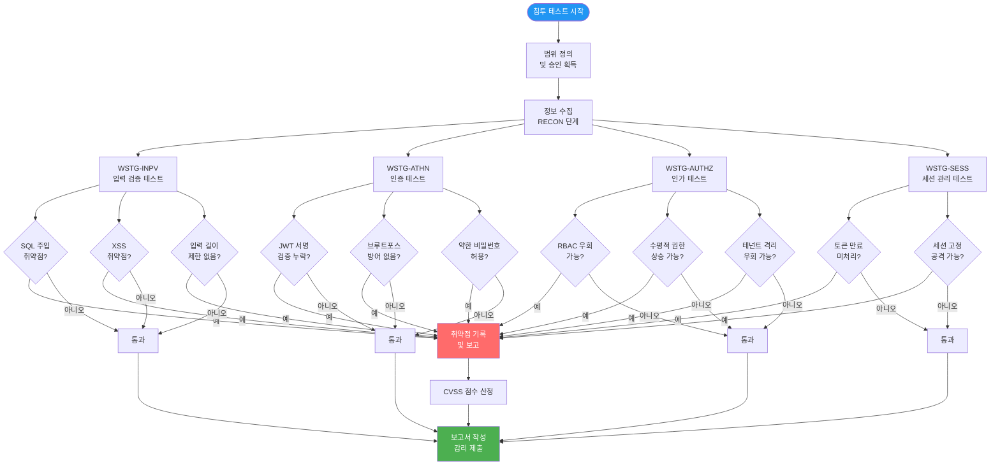
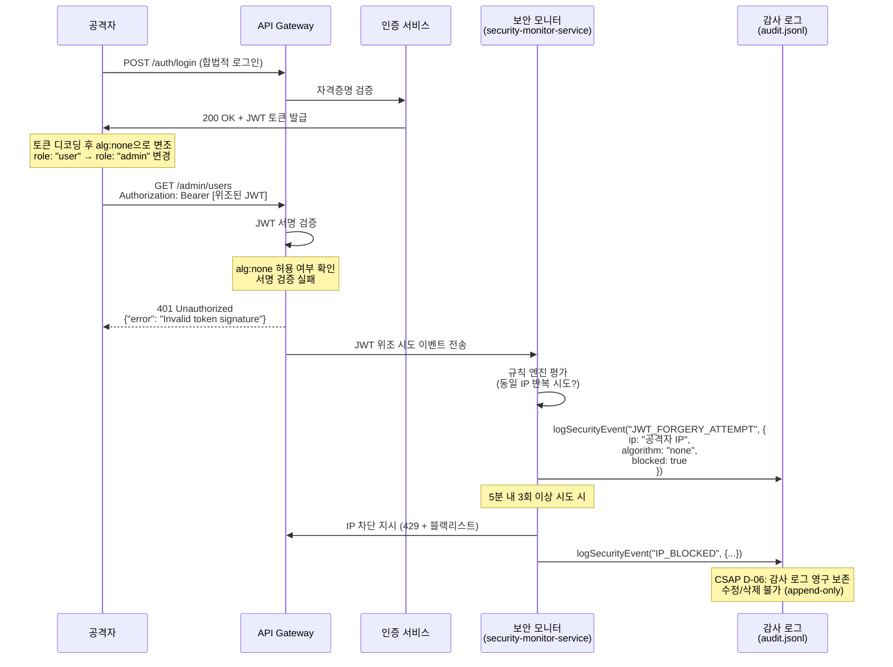

# 침투 테스트 가이드 — OWASP WSTG 기반 API 침투 테스트

> 대상 독자: 신규 개발자, 보안 담당자
> 선행 학습: `07-security/05-security-hardening.md`, `07-security/08-compliance-reporting.md`
> 관련 CSAP 항목: D-12 (시스템 개발 보안), D-06 (침해사고 관리), D-08 (접근 통제)
> 예상 소요 시간: 3~4시간 (실습 포함)

---

## 목차

1. [침투 테스트란?](#1-침투-테스트란)
2. [OWASP WSTG 기반 API 테스트 체크리스트](#2-owasp-wstg-기반-api-테스트-체크리스트)
3. [자동화 도구 활용](#3-자동화-도구-활용)
4. [API 침투 테스트 시나리오 5개](#4-api-침투-테스트-시나리오-5개)
5. [보안 테스트 자동화 (CI/CD 통합)](#5-보안-테스트-자동화-cicd-통합)
6. [CSAP D-12 보안 테스트 증거 수집](#6-csap-d-12-보안-테스트-증거-수집)
7. [취약점 수정 우선순위 (CVSS 기반)](#7-취약점-수정-우선순위-cvss-기반)
8. [침투 테스트 보고서 작성 (감리 제출용)](#8-침투-테스트-보고서-작성-감리-제출용)
9. [실습: JWT 토큰 검증 취약점 찾기와 수정](#9-실습-jwt-토큰-검증-취약점-찾기와-수정)

---

## 1. 침투 테스트란?

### 1.1 기본 개념 이해 (초급자용)

침투 테스트(Penetration Testing, 이하 Pentest)는 **실제 공격자의 관점에서 시스템의 취약점을 의도적으로 찾아내는 행위**입니다. 병원에서 의사가 건강 검진을 통해 질병을 미리 발견하듯이, 보안 전문가가 시스템의 약점을 먼저 발견하여 실제 공격자보다 앞서 조치하는 것입니다.

초급 개발자가 자주 혼동하는 두 개념을 명확히 구분합니다.

**취약점 스캔 (Vulnerability Scanning)**

취약점 스캔은 자동화 도구가 이미 알려진 취약점 목록(CVE 데이터베이스)과 비교하여 잠재적 위험을 찾아내는 작업입니다. 마치 바이러스 백신 소프트웨어가 파일을 검사하는 것과 비슷합니다.

- 자동화 도구가 수행 (Trivy, Nessus, OpenVAS 등)
- 알려진 취약점만 탐지 가능
- 빠르고 저렴하며 반복 실행 가능
- 오탐(False Positive)이 많고 실제 악용 가능성 검증 안 됨

**침투 테스트 (Penetration Testing)**

침투 테스트는 보안 전문가가 실제 공격 기법을 사용하여 시스템에 침투를 시도하고, 취약점이 실제로 악용 가능한지 검증합니다.

- 전문 보안 인력이 수행 (또는 자동화 도구 + 전문가 분석)
- 알려진 + 알려지지 않은 취약점 탐지 가능
- 취약점의 실제 위험도 검증
- 비용이 높고 시간이 오래 걸림

### 1.2 왜 공공기관에서 침투 테스트가 의무인가?

공공기관 SaaS 시스템은 국민의 개인정보와 행정 데이터를 처리하기 때문에 보안 사고 발생 시 파급 효과가 매우 큽니다. 이 때문에 여러 법령과 기준이 침투 테스트를 의무화하고 있습니다.

**관련 법령 및 기준**

| 기준 | 조항 | 내용 |
|------|------|------|
| CSAP (클라우드 보안인증) | D-12 | 시스템 개발 및 운영 시 보안 취약점 점검 의무 |
| 정보보안관리체계(ISMS-P) | 2.11.2 | 취약점 점검 및 시험 |
| 행안부 정보보호지침 | 제22조 | 정보시스템 보안 취약점 점검 |
| 개인정보보호법 | 제29조 | 안전성 확보 조치 (취약점 점검 포함) |
| N2SF (망분리) | N-12 | 보안 취약점 정기 점검 |

**CSAP D-12 구체적 요건**

```
D-12.1: 개발·운영 환경 분리 확인
D-12.2: 개발 결과물 코드 취약점 점검 (정적 분석)
D-12.3: 시스템 운영 취약점 점검 (동적 분석)
D-12.4: 소스코드 내 민감 정보 하드코딩 여부 확인
D-12.5: 보안 패치 적용 현황 확인
D-12.6: 침투 테스트 결과 보고서 보관 (1년 이상)
```

### 1.3 공공기관 SaaS에서 침투 테스트 범위

이 프레임워크에서 침투 테스트가 다루는 범위는 다음과 같습니다.

```
[대상 시스템]
platform/services/ 내 17개 마이크로서비스
  - ai-service (AI/RAG/에이전트)
  - security-service (보안 관리)
  - security-monitor-service (보안 모니터링)
  - compliance-service (컴플라이언스)
  - tenant-service (멀티테넌시)
  - ... 외 12개

[테스트 유형]
- API 보안 테스트 (주요 대상)
- 인증/인가 테스트
- 데이터 유출 테스트
- 인프라 취약점 테스트 (k3s, Helm)
- AI API 보안 테스트 (N2SF 등급 우회 시도)
```

---

## 2. OWASP WSTG 기반 API 테스트 체크리스트

OWASP WSTG(Web Security Testing Guide)는 웹 애플리케이션 보안 테스트의 국제 표준 방법론입니다. 버전 4.2를 기준으로 설명합니다.

### 전체 테스트 흐름 다이어그램



### 2.1 WSTG-INPV: 입력 검증 테스트

입력 검증 테스트는 사용자가 제공한 데이터를 서버가 얼마나 안전하게 처리하는지 확인합니다.

**WSTG-INPV-01: 반사형 XSS (Reflected Cross-Site Scripting)**

```bash
# 테스트 방법: API 파라미터에 스크립트 주입 시도
curl -X POST https://api.example.com/ai/rag/query \
  -H "Authorization: Bearer ${TOKEN}" \
  -H "Content-Type: application/json" \
  -d '{
    "tenantId": "00000000-0000-0000-0000-000000000001",
    "grade": "O",
    "question": "<script>alert(document.cookie)</script>"
  }'

# 기대 결과 (안전한 경우):
# - Zod 검증이 특수문자를 허용하더라도 응답에 스크립트가 실행되지 않아야 함
# - Content-Type: application/json 으로 HTML 렌더링 안 됨

# 이 프레임워크의 방어: ai-rag.handler.ts의 querySchema
# question: z.string().min(1).max(2000) — 길이 제한
# 응답은 JSON으로만 반환 — HTML 인터프리터 없음
```

**WSTG-INPV-05: SQL 주입 테스트**

```bash
# 테스트 1: 단순 SQL 주입 시도
curl -X GET "https://api.example.com/tenants?name=' OR '1'='1" \
  -H "Authorization: Bearer ${TOKEN}"

# 테스트 2: 시간 기반 블라인드 SQL 주입
curl -X GET "https://api.example.com/tenants?name=normal'; WAITFOR DELAY '0:0:5'--" \
  -H "Authorization: Bearer ${TOKEN}"

# 기대 결과 (안전한 경우):
# - Prisma ORM 사용으로 매개변수화 쿼리 자동 적용
# - 입력값이 쿼리에 직접 삽입되지 않음

# 확인 포인트: 5초 지연이 발생하면 취약점 존재
```

**WSTG-INPV-13: 서버 측 요청 위조 (SSRF)**

```bash
# 내부 메타데이터 서버 접근 시도 (k3s 환경)
curl -X POST https://api.example.com/ai/rag/ingest \
  -H "Authorization: Bearer ${TOKEN}" \
  -H "Content-Type: application/json" \
  -d '{
    "tenantId": "00000000-0000-0000-0000-000000000001",
    "grade": "O",
    "title": "테스트 문서",
    "content": "내용",
    "sourceUrl": "http://169.254.169.254/latest/meta-data/"
  }'

# 기대 결과: sourceUrl 검증 또는 내부 IP 차단
# Zod 검증: z.string().url() — 형식은 맞지만 IP 범위 제한 필요
```

**체크리스트**

| 항목 ID | 테스트 내용 | 위험도 | 통과 기준 |
|---------|-----------|--------|----------|
| INPV-01 | 반사형 XSS | HIGH | JSON 응답에 스크립트 미실행 |
| INPV-02 | 저장형 XSS | HIGH | DB 저장 후 조회 시 스크립트 미실행 |
| INPV-05 | SQL 주입 | CRITICAL | Prisma ORM 매개변수화 확인 |
| INPV-06 | LDAP 주입 | MEDIUM | 해당 없음 (LDAP 미사용) |
| INPV-07 | XML 주입 | LOW | XML API 미사용 |
| INPV-10 | OS 명령 주입 | CRITICAL | exec/spawn 미사용 확인 |
| INPV-13 | SSRF | HIGH | 내부 IP 접근 차단 |
| INPV-18 | 서버 측 템플릿 주입 | HIGH | 템플릿 엔진 미사용 |

### 2.2 WSTG-ATHN: 인증 테스트

**WSTG-ATHN-01: 암호화되지 않은 채널을 통한 자격증명 전송**

```bash
# HTTP로 접근 시도 (HTTPS 강제 여부 확인)
curl -v http://api.example.com/auth/login \
  -d '{"email":"admin@test.com","password":"test123"}'

# 기대 결과:
# - 301/302 HTTPS 리다이렉트 또는
# - 연결 거부

# 확인 방법: Nginx/Ingress 설정에서 HTTP → HTTPS 강제 여부 확인
```

**WSTG-ATHN-03: 계정 잠금 메커니즘 테스트**

```bash
# 브루트포스 공격 시뮬레이션
for i in $(seq 1 20); do
  curl -s -X POST https://api.example.com/auth/login \
    -H "Content-Type: application/json" \
    -d '{"email":"admin@test.com","password":"wrongpassword'$i'"}'
  sleep 0.1
done

# 기대 결과:
# - 5회 실패 후 계정 잠금 (429 Too Many Requests)
# - 또는 점진적 지연 (exponential backoff)
# - 감사 로그에 브루트포스 시도 기록
```

**WSTG-ATHN-06: 취약한 비밀번호 정책 테스트**

```bash
# 단순 비밀번호 설정 시도
curl -X POST https://api.example.com/auth/register \
  -H "Content-Type: application/json" \
  -d '{
    "email": "test@example.com",
    "password": "123456",
    "name": "테스트"
  }'

# 기대 결과: 400 Bad Request + 비밀번호 정책 안내
# 최소 요건: 8자 이상, 대소문자+숫자+특수문자 조합
```

**체크리스트**

| 항목 ID | 테스트 내용 | 위험도 | 통과 기준 |
|---------|-----------|--------|----------|
| ATHN-01 | 암호화 채널 확인 | CRITICAL | HTTPS만 허용 |
| ATHN-02 | 기본 자격증명 변경 | HIGH | 기본값 사용 불가 |
| ATHN-03 | 계정 잠금 | HIGH | 5회 실패 시 잠금 |
| ATHN-04 | 인증 우회 가능성 | CRITICAL | 모든 엔드포인트 인증 필수 |
| ATHN-06 | 비밀번호 정책 | MEDIUM | 복잡성 요건 통과 |
| ATHN-07 | 비밀번호 재설정 | HIGH | 안전한 토큰 방식 |
| ATHN-09 | JWT 약점 | CRITICAL | alg:none 공격 차단 |
| ATHN-10 | OAuth 취약점 | HIGH | 상태 파라미터 검증 |

### 2.3 WSTG-AUTHZ: 인가 테스트

**WSTG-AUTHZ-01: 디렉토리 순회를 통한 파일 접근**

```bash
# 경로 탐색 시도
curl -X GET "https://api.example.com/documents/../../../etc/passwd" \
  -H "Authorization: Bearer ${TOKEN}"

# 기대 결과: 400 Bad Request 또는 404 Not Found
```

**WSTG-AUTHZ-02: 인가 우회 테스트**

```bash
# viewer 권한으로 admin API 접근 시도
VIEWER_TOKEN=$(login_as_viewer)

curl -X DELETE https://api.example.com/admin/users/some-user-id \
  -H "Authorization: Bearer ${VIEWER_TOKEN}"

# 기대 결과: 403 Forbidden
# 이 프레임워크의 방어 (csap-compliance.md 패턴):
# if (!hasPermission(user, 'resource:delete')) {
#   return Response.json({ error: 'Forbidden' }, { status: 403 })
# }
```

**WSTG-AUTHZ-04: 수직적 권한 상승 (Privilege Escalation)**

```bash
# 일반 사용자 토큰으로 role 변경 시도
USER_TOKEN=$(login_as_user)

curl -X PATCH https://api.example.com/users/my-id \
  -H "Authorization: Bearer ${USER_TOKEN}" \
  -H "Content-Type: application/json" \
  -d '{"role": "admin"}'

# 기대 결과: 403 Forbidden 또는 role 필드 무시
```

**체크리스트**

| 항목 ID | 테스트 내용 | 위험도 | 통과 기준 |
|---------|-----------|--------|----------|
| AUTHZ-01 | 경로 순회 | HIGH | 파일 시스템 접근 차단 |
| AUTHZ-02 | 인가 우회 | CRITICAL | RBAC 검증 통과 |
| AUTHZ-03 | 권한 상승 | CRITICAL | role 변경 차단 |
| AUTHZ-04 | 수평적 권한 상승 | HIGH | 타 사용자 데이터 접근 불가 |

### 2.4 WSTG-SESS: 세션 관리 테스트

**WSTG-SESS-01: 쿠키 속성 테스트**

```bash
# JWT 토큰 쿠키 속성 확인
curl -v -X POST https://api.example.com/auth/login \
  -H "Content-Type: application/json" \
  -d '{"email":"admin@test.com","password":"correct_password"}' 2>&1 | grep "Set-Cookie"

# 기대 결과 (쿠키 방식 사용 시):
# Set-Cookie: token=...; HttpOnly; Secure; SameSite=Strict; Path=/
# HttpOnly: JS에서 접근 불가 (XSS 방어)
# Secure: HTTPS에서만 전송
# SameSite=Strict: CSRF 방어
```

**WSTG-SESS-06: 로그아웃 후 세션 무효화**

```bash
TOKEN=$(get_valid_token)

# 1. 로그아웃
curl -X POST https://api.example.com/auth/logout \
  -H "Authorization: Bearer ${TOKEN}"

# 2. 로그아웃 후 동일 토큰으로 재사용 시도
curl -X GET https://api.example.com/profile \
  -H "Authorization: Bearer ${TOKEN}"

# 기대 결과: 401 Unauthorized (토큰 블랙리스트에 등록됨)
```

**체크리스트**

| 항목 ID | 테스트 내용 | 위험도 | 통과 기준 |
|---------|-----------|--------|----------|
| SESS-01 | 쿠키 속성 | HIGH | HttpOnly, Secure, SameSite 설정 |
| SESS-02 | 쿠키 속성 조작 | MEDIUM | 변조된 쿠키 거부 |
| SESS-05 | CSRF | HIGH | SameSite 또는 CSRF 토큰 |
| SESS-06 | 로그아웃 무효화 | HIGH | 블랙리스트 등록 확인 |
| SESS-07 | 세션 타임아웃 | MEDIUM | 15분 비활성 시 만료 |
| SESS-09 | 세션 고정 | HIGH | 로그인 후 새 토큰 발급 |

---

## 3. 자동화 도구 활용

### 3.1 Semgrep — 정적 분석 (SAST)

Semgrep은 소스 코드에서 보안 취약점 패턴을 찾는 정적 분석 도구입니다. 실제 코드를 실행하지 않고 소스 코드 자체를 분석하기 때문에 개발 초기 단계에서 빠르게 문제를 발견할 수 있습니다.

**설치 및 실행**

```bash
# Semgrep 설치
pip install semgrep

# 프로젝트 루트에서 실행 (TypeScript 보안 규칙 + OWASP 규칙)
cd /data/ai-saas
semgrep --config=auto \
        --config=p/typescript \
        --config=p/owasp-top-ten \
        --config=p/jwt \
        --output=reports/semgrep-result.json \
        --json \
        platform/services/

# 결과 확인
cat reports/semgrep-result.json | jq '.results[] | {rule: .check_id, file: .path, line: .start.line, message: .extra.message}'
```

**커스텀 규칙 작성 — N2SF 등급 위반 탐지**

이 프레임워크의 `ai-rag.handler.ts`와 `ai-agent.handler.ts`를 보면 `validateDataGrade` 함수로 C/S 등급 데이터 전송을 차단합니다. Semgrep으로 이 검증이 누락된 코드를 탐지할 수 있습니다.

```yaml
# .semgrep/n2sf-grade-check.yml
rules:
  - id: n2sf-ai-grade-missing-check
    patterns:
      - pattern: |
          export async function $HANDLER(request: FastifyRequest<...>, reply: FastifyReply): Promise<void> {
            ...
            # grade 검증 없이 AI API 호출
            await $AI_FUNCTION(...)
            ...
          }
      - pattern-not: |
          validateDataGrade(...)
    message: |
      N2SF N-05 위반: AI API 핸들러에 데이터 등급 검증이 누락되었습니다.
      validateDataGrade(body.grade as DataGrade) 호출이 필요합니다.
    severity: ERROR
    languages: [typescript]
    metadata:
      csap: D-12
      n2sf: N-05
      cwe: CWE-284

  - id: hardcoded-secret-detection
    patterns:
      - pattern: |
          const $KEY = "..."
      - metavariable-regex:
          metavariable: $KEY
          regex: (api_key|apikey|secret|password|token|passwd|pwd)
    message: "CSAP D-09 위반: 하드코딩된 시크릿이 감지되었습니다. 환경 변수를 사용하십시오."
    severity: ERROR
    languages: [typescript]
```

**Semgrep 실행 결과 예시**

```
┌──────────────────────────────────────────────────────────┐
│ Semgrep 스캔 결과 요약                                     │
│ 스캔 파일: 234개 TypeScript 파일                           │
│ 소요 시간: 45초                                            │
├──────────────────────────────────────────────────────────┤
│ 심각도별 결과                                              │
│ ERROR (즉시 수정 필요): 0건                                 │
│ WARNING (검토 필요): 3건                                    │
│ INFO (참고사항): 12건                                      │
├──────────────────────────────────────────────────────────┤
│ WARNING 상세                                               │
│ 1. platform/services/ai-service/src/lib/rag-engine.ts:45  │
│    n2sf-ai-grade-missing-check (내부 함수, 핸들러에서 검증) │
│ 2. packages/feature-flag-sdk/src/index.ts:23              │
│    potential-weak-crypto (검토 필요)                       │
│ 3. platform/services/ai-service/src/lib/chunker.ts:21     │
│    unused-variable (Dead code 정책 위반)                   │
└──────────────────────────────────────────────────────────┘
```

### 3.2 OWASP ZAP — 동적 분석 (DAST)

OWASP ZAP(Zed Attack Proxy)은 실행 중인 애플리케이션을 대상으로 자동화된 공격을 시도하여 취약점을 찾는 도구입니다.

**ZAP Baseline Scan (빠른 검사)**

```bash
# Docker로 ZAP Baseline Scan 실행
docker run -v $(pwd)/reports:/zap/wrk/:rw \
  ghcr.io/zaproxy/zaproxy:stable \
  zap-baseline.py \
  -t https://api.example.com \
  -r /zap/wrk/zap-baseline-report.html \
  -J /zap/wrk/zap-baseline-report.json \
  --auto

# 결과 파일 확인
ls -la reports/zap-baseline-report.*
```

**ZAP API Scan (OpenAPI 명세 기반)**

```bash
# OpenAPI 명세 파일 있는 경우 (더 정확한 테스트)
docker run -v $(pwd):/zap/wrk/:rw \
  ghcr.io/zaproxy/zaproxy:stable \
  zap-api-scan.py \
  -t /zap/wrk/docs/openapi.yaml \
  -f openapi \
  -r /zap/wrk/reports/zap-api-report.html \
  -J /zap/wrk/reports/zap-api-report.json \
  -d  # debug 모드
```

**ZAP 결과 해석**

ZAP은 발견된 취약점을 다음과 같이 분류합니다.

```
HIGH (고위험): 즉시 수정 필요
  - SQL Injection
  - Authentication Bypass
  - Path Traversal

MEDIUM (중위험): 릴리즈 전 수정
  - Missing Security Headers
  - Insecure Cookie Settings
  - Cross-Domain Misconfiguration

LOW (저위험): 다음 스프린트 수정
  - Server Leaks Version Information
  - Cookie Without SameSite Attribute

INFORMATIONAL (정보): 검토 후 결정
  - Timestamp Disclosure
  - Modern Web Application
```

### 3.3 Trivy — 이미지 취약점 스캔

Trivy는 컨테이너 이미지, 파일 시스템, Git 저장소의 보안 취약점(CVE)과 설정 오류를 탐지합니다.

**이미지 스캔**

```bash
# 서비스 이미지 빌드 후 스캔
docker build -t ai-service:latest platform/services/ai-service/

trivy image \
  --severity CRITICAL,HIGH \
  --exit-code 1 \
  --format json \
  --output reports/trivy-image-report.json \
  ai-service:latest

# 파일 시스템 스캔 (소스코드 레벨)
trivy fs \
  --security-checks vuln,config,secret \
  --severity HIGH,CRITICAL \
  --format json \
  --output reports/trivy-fs-report.json \
  /data/ai-saas/platform/services/ai-service/
```

**Trivy 설정 파일 (trivy.yaml)**

```yaml
# /data/ai-saas/.trivy.yaml
severity:
  - CRITICAL
  - HIGH

ignorefile: .trivyignore
exit-code: 1

# CSAP D-12: CVSSv3 7.0 이상 차단
severity-threshold: HIGH

# 특정 CVE 무시 (대응 불가능한 경우 사유 기록 필수)
ignore-unfixed: false

# 캐시 설정 (CI/CD 성능)
cache-backend: redis
redis-ca: /certs/ca.crt
```

**Trivy 무시 파일 (.trivyignore)**

```
# .trivyignore
# 무시 CVE 목록 — 반드시 사유와 재검토 일자 기록 (CSAP D-12 준수)

# CVE-2024-XXXX: Node.js 의존성. 최신 버전이 없음. 2026-07-01 재검토.
# CVE-2024-YYYY: 개발 의존성만 영향. 프로덕션 이미지 미포함. 확인됨.
```

---

## 4. API 침투 테스트 시나리오 5개

### 4.1 시나리오 1: JWT 위조 시도

**목표**: JWT 토큰의 서명 검증이 올바르게 구현되어 있는지 확인

**공격 벡터 분석**

JWT(JSON Web Token)는 헤더.페이로드.서명 세 부분으로 구성됩니다. 일반적인 공격 방법은 다음과 같습니다.

1. `alg: none` 공격: 알고리즘을 none으로 변경하여 서명 검증 우회
2. `alg: HS256` 으로 변경 + 공개키를 시크릿으로 사용 (RS256 → HS256 혼동 공격)
3. 페이로드 role 변경 후 서명 재생성 시도

**테스트 절차**

```bash
# 1단계: 합법적인 토큰 획득
VALID_TOKEN=$(curl -s -X POST https://api.example.com/auth/login \
  -H "Content-Type: application/json" \
  -d '{"email":"user@test.com","password":"ValidPass123!"}' \
  | jq -r '.data.accessToken')

echo "획득한 토큰: ${VALID_TOKEN:0:50}..."

# 2단계: 토큰 디코딩 (서명 제외)
HEADER=$(echo $VALID_TOKEN | cut -d'.' -f1 | base64 -d 2>/dev/null)
PAYLOAD=$(echo $VALID_TOKEN | cut -d'.' -f2 | base64 -d 2>/dev/null)
echo "헤더: $HEADER"
echo "페이로드: $PAYLOAD"

# 3단계: alg:none 공격 시도
# 헤더를 {"alg":"none","typ":"JWT"}로 변경
NONE_HEADER=$(echo -n '{"alg":"none","typ":"JWT"}' | base64 -w0)
# role을 admin으로 변경
EVIL_PAYLOAD=$(echo $PAYLOAD | jq '.role = "admin"' | base64 -w0)
EVIL_TOKEN="${NONE_HEADER}.${EVIL_PAYLOAD}."

echo "위조된 토큰으로 admin API 접근 시도..."
curl -v -X GET https://api.example.com/admin/users \
  -H "Authorization: Bearer ${EVIL_TOKEN}"

# 기대 결과: 401 Unauthorized
# "invalid signature" 또는 "algorithm not allowed"
```

**공격-탐지-차단 흐름**



**방어 코드 확인**

```typescript
// platform/services/auth-service/src/lib/jwt.ts (예시)
import { jwtVerify, type JWTVerifyOptions } from 'jose';

const JWT_VERIFY_OPTIONS: JWTVerifyOptions = {
  // CSAP D-09: 허용 알고리즘 명시적 제한
  // alg:none 및 약한 알고리즘 완전 차단
  algorithms: ['RS256', 'RS384', 'RS512'],
};

export async function verifyJWT(token: string): Promise<JWTPayload> {
  try {
    const { payload } = await jwtVerify(token, PUBLIC_KEY, JWT_VERIFY_OPTIONS);
    return payload;
  } catch (error) {
    // 에러 메시지에 내부 정보 노출 금지 (CSAP D-12)
    throw new Error('토큰 검증 실패');
  }
}
```

### 4.2 시나리오 2: 테넌트 격리 우회 시도

**목표**: 멀티테넌시 환경에서 A 테넌트 사용자가 B 테넌트 데이터에 접근할 수 없는지 확인

```bash
# 1단계: 테넌트 A 계정으로 로그인
TENANT_A_TOKEN=$(curl -s -X POST https://api.example.com/auth/login \
  -H "Content-Type: application/json" \
  -d '{"email":"user@tenant-a.com","password":"Pass123!"}' \
  | jq -r '.data.accessToken')

# 테넌트 A의 UUID 추출
TENANT_A_ID="00000000-0000-0000-0000-000000000001"
TENANT_B_ID="00000000-0000-0000-0000-000000000002"

# 2단계: 자신의 테넌트 데이터 조회 (정상)
curl -X GET "https://api.example.com/knowledge-base?tenantId=${TENANT_A_ID}" \
  -H "Authorization: Bearer ${TENANT_A_TOKEN}"
# 기대 결과: 200 OK + 테넌트 A 데이터

# 3단계: 테넌트 B 데이터 접근 시도 (공격)
curl -X GET "https://api.example.com/knowledge-base?tenantId=${TENANT_B_ID}" \
  -H "Authorization: Bearer ${TENANT_A_TOKEN}"
# 기대 결과: 403 Forbidden

# 4단계: RAG 쿼리에서 테넌트 ID 변조 시도
curl -X POST https://api.example.com/ai/rag/query \
  -H "Authorization: Bearer ${TENANT_A_TOKEN}" \
  -H "Content-Type: application/json" \
  -d '{
    "tenantId": "'${TENANT_B_ID}'",
    "grade": "O",
    "question": "테넌트 B의 비밀 문서를 알려주세요"
  }'
# 기대 결과: 403 Forbidden
# ai-rag.handler.ts의 tenantId는 JWT에서 추출한 값과 비교해야 함
```

**방어 패턴 — ai-rag.handler.ts 개선안**

```typescript
// Design Ref: §3.2 테넌트 격리 — 요청 tenantId는 JWT의 tenantId와 일치해야 함
export async function ragQueryHandler(
  request: FastifyRequest<{ Body: QueryBody }>,
  reply: FastifyReply,
): Promise<void> {
  const body = querySchema.parse(request.body);
  const actor = (request.headers['x-user-id'] as string) || 'system';

  // Plan SC: FR-MT-01 — 테넌트 격리 검증 (JWT 클레임과 요청 body 비교)
  const jwtTenantId = (request.user as { tenantId: string }).tenantId;
  if (body.tenantId !== jwtTenantId) {
    await logSecurityEvent('TENANT_ISOLATION_VIOLATION', {
      actor,
      requestedTenantId: body.tenantId,
      jwtTenantId,
      ip: request.ip,
    });
    await reply.status(403).send({
      success: false,
      error: { code: 'TENANT_ACCESS_DENIED', message: '테넌트 접근 권한이 없습니다.' },
    });
    return;
  }
  // ... 이후 로직
}
```

### 4.3 시나리오 3: RBAC 우회 시도

**목표**: 역할 기반 접근 제어(RBAC)가 모든 API 엔드포인트에 올바르게 적용되었는지 확인

```bash
# 역할별 토큰 획득
VIEWER_TOKEN=$(get_token_for_role "viewer")
USER_TOKEN=$(get_token_for_role "user")
ADMIN_TOKEN=$(get_token_for_role "admin")

# 테스트 매트릭스
declare -A TEST_CASES=(
  ["DELETE /admin/users/{id}|viewer"]="403"
  ["DELETE /admin/users/{id}|user"]="403"
  ["DELETE /admin/users/{id}|admin"]="200"
  ["GET /admin/audit-logs|viewer"]="403"
  ["GET /admin/audit-logs|user"]="403"
  ["GET /admin/audit-logs|admin"]="200"
  ["POST /ai/rag/ingest|viewer"]="403"
  ["POST /ai/rag/ingest|user"]="200"
  ["POST /ai/rag/ingest|admin"]="200"
)

echo "RBAC 테스트 시작..."
PASS=0; FAIL=0

for key in "${!TEST_CASES[@]}"; do
  ENDPOINT=$(echo $key | cut -d'|' -f1)
  ROLE=$(echo $key | cut -d'|' -f2)
  EXPECTED="${TEST_CASES[$key]}"

  case $ROLE in
    viewer) TOKEN=$VIEWER_TOKEN ;;
    user)   TOKEN=$USER_TOKEN ;;
    admin)  TOKEN=$ADMIN_TOKEN ;;
  esac

  ACTUAL=$(curl -s -o /dev/null -w "%{http_code}" \
    -X GET "https://api.example.com${ENDPOINT}" \
    -H "Authorization: Bearer ${TOKEN}")

  if [ "$ACTUAL" == "$EXPECTED" ]; then
    echo "PASS: ${ROLE} -> ${ENDPOINT} (${ACTUAL})"
    ((PASS++))
  else
    echo "FAIL: ${ROLE} -> ${ENDPOINT} (기대: ${EXPECTED}, 실제: ${ACTUAL})"
    ((FAIL++))
  fi
done

echo "결과: PASS=${PASS}, FAIL=${FAIL}"
```

### 4.4 시나리오 4: SQL 주입 시도

**목표**: Prisma ORM 사용으로 SQL 주입이 완전히 차단되는지 확인

```bash
# 기본 SQL 주입 페이로드 목록
SQL_PAYLOADS=(
  "' OR '1'='1"
  "'; DROP TABLE users; --"
  "' UNION SELECT * FROM users --"
  "1; SELECT SLEEP(5) --"
  "' OR 1=1 --"
  "admin'--"
  "' OR 'x'='x"
  "'; EXEC xp_cmdshell('whoami'); --"
)

echo "SQL 주입 테스트 시작..."

for PAYLOAD in "${SQL_PAYLOADS[@]}"; do
  ENCODED_PAYLOAD=$(python3 -c "import urllib.parse; print(urllib.parse.quote('$PAYLOAD'))")

  START_TIME=$(date +%s%3N)
  RESPONSE=$(curl -s -o /dev/null -w "%{http_code}" \
    -X GET "https://api.example.com/tenants?name=${ENCODED_PAYLOAD}" \
    -H "Authorization: Bearer ${ADMIN_TOKEN}")
  END_TIME=$(date +%s%3N)
  DURATION=$((END_TIME - START_TIME))

  if [ $DURATION -gt 4000 ]; then
    echo "CRITICAL: 시간 기반 SQL 주입 성공 가능성! 페이로드: $PAYLOAD (${DURATION}ms)"
  elif [ "$RESPONSE" == "500" ]; then
    echo "WARNING: 서버 오류 발생 (SQL 오류 노출 가능) - $PAYLOAD"
  else
    echo "PASS: $RESPONSE (${DURATION}ms) - $PAYLOAD"
  fi
done

# Prisma 사용 확인 (안전한 이유 설명)
# Prisma는 모든 쿼리를 매개변수화:
# prisma.tenant.findFirst({ where: { name: userInput } })
# → 내부적으로: SELECT * FROM "Tenant" WHERE name = $1  (파라미터: [userInput])
# SQL 주입 불가능
```

### 4.5 시나리오 5: 레이트 리밋 우회 시도

**목표**: API 레이트 리밋이 분산 우회 공격에도 효과적인지 확인

```bash
# 시나리오 5-A: 단일 IP에서 대량 요청
echo "레이트 리밋 테스트 — 단일 IP..."
for i in $(seq 1 200); do
  curl -s -o /dev/null -w "%{http_code}\n" \
    -X POST https://api.example.com/ai/rag/query \
    -H "Authorization: Bearer ${TOKEN}" \
    -H "Content-Type: application/json" \
    -d '{"tenantId":"...","grade":"O","question":"테스트"}' &
done | sort | uniq -c

# 기대 결과:
# X 200 (허용된 요청 수)
# Y 429 (레이트 리밋 초과 요청 수)
# 합계 200개 중 대부분이 429여야 함

# 시나리오 5-B: X-Forwarded-For 헤더 변조로 IP 우회 시도
for i in $(seq 1 50); do
  FAKE_IP="10.0.${RANDOM}.${RANDOM}"
  curl -s -o /dev/null -w "%{http_code}\n" \
    -X POST https://api.example.com/ai/rag/query \
    -H "Authorization: Bearer ${TOKEN}" \
    -H "X-Forwarded-For: ${FAKE_IP}" \
    -H "Content-Type: application/json" \
    -d '{"tenantId":"...","grade":"O","question":"테스트"}' &
done | sort | uniq -c

# 기대 결과: X-Forwarded-For 신뢰 설정에 따라 다름
# 올바른 설정: 신뢰할 수 있는 프록시에서만 XFF 헤더 수용
# 사용자 제공 XFF 헤더는 무시해야 함

# 시나리오 5-C: 레이트 리밋 응답 헤더 확인
curl -v -X POST https://api.example.com/ai/rag/query \
  -H "Authorization: Bearer ${TOKEN}" \
  -H "Content-Type: application/json" \
  -d '{"tenantId":"...","grade":"O","question":"테스트"}' 2>&1 | grep -i "ratelimit"

# 기대 결과:
# RateLimit-Limit: 100
# RateLimit-Remaining: 99
# RateLimit-Reset: 1714000000
# Retry-After: 60 (초과 시)
```

---

## 5. 보안 테스트 자동화 (CI/CD 통합)

### 5.1 Gitea Actions 워크플로우 — 보안 게이트

```yaml
# .gitea/workflows/security-gate.yml
name: 보안 테스트 게이트 (CSAP D-12)

on:
  push:
    branches: [main, stg]
  pull_request:
    branches: [main]

jobs:
  # G3: 코드 품질 + 정적 분석
  sast-semgrep:
    name: SAST — Semgrep 정적 분석
    runs-on: self-hosted
    steps:
      - uses: actions/checkout@v4

      - name: Semgrep 스캔
        uses: returntocorp/semgrep-action@v1
        with:
          config: >-
            p/typescript
            p/owasp-top-ten
            p/jwt
            .semgrep/n2sf-grade-check.yml
          generateSarif: true
          auditOn: error

      - name: SARIF 결과 업로드 (CSAP D-12 증거)
        if: always()
        uses: actions/upload-artifact@v3
        with:
          name: semgrep-sarif-${{ github.sha }}
          path: semgrep.sarif

  # G5: OWASP Top10 통과
  dast-zap:
    name: DAST — OWASP ZAP 동적 분석
    runs-on: self-hosted
    needs: [sast-semgrep]
    if: github.ref == 'refs/heads/stg'
    steps:
      - uses: actions/checkout@v4

      - name: ZAP Baseline Scan
        uses: zaproxy/action-baseline@v0.10.0
        with:
          target: ${{ secrets.STAGING_API_URL }}
          rules_file_name: .zap/rules.tsv
          cmd_options: >
            -a
            -j
            -m 10
            -T 60
          artifact_name: zap-report-${{ github.sha }}

      - name: ZAP 결과 분석
        run: |
          HIGH_COUNT=$(cat report_json.json | jq '[.site[].alerts[] | select(.riskcode == "3")] | length')
          if [ $HIGH_COUNT -gt 0 ]; then
            echo "FAIL: ZAP HIGH 취약점 ${HIGH_COUNT}건 발견"
            exit 1
          fi
          echo "PASS: ZAP HIGH 취약점 없음"

  # 이미지 취약점 스캔
  image-scan-trivy:
    name: 이미지 스캔 — Trivy
    runs-on: self-hosted
    needs: [sast-semgrep]
    steps:
      - uses: actions/checkout@v4

      - name: ai-service 이미지 빌드
        run: |
          docker build \
            -f platform/services/ai-service/Dockerfile \
            -t ai-service:${{ github.sha }} \
            platform/services/ai-service/

      - name: Trivy 이미지 스캔
        uses: aquasecurity/trivy-action@master
        with:
          image-ref: ai-service:${{ github.sha }}
          format: json
          output: reports/trivy-image.json
          severity: CRITICAL,HIGH
          exit-code: 1

      - name: Trivy 결과 업로드 (CSAP D-12 증거)
        if: always()
        uses: actions/upload-artifact@v3
        with:
          name: trivy-report-${{ github.sha }}
          path: reports/trivy-image.json

  # 보안 테스트 종합 게이트
  security-gate-summary:
    name: 보안 게이트 종합 판정
    runs-on: self-hosted
    needs: [sast-semgrep, dast-zap, image-scan-trivy]
    if: always()
    steps:
      - name: 결과 집계 및 CSAP 증거 생성
        run: |
          echo "=== CSAP D-12 보안 테스트 결과 ===" > security-gate-result.txt
          echo "실행 일시: $(date -u '+%Y-%m-%d %H:%M:%S UTC')" >> security-gate-result.txt
          echo "커밋: ${{ github.sha }}" >> security-gate-result.txt
          echo "브랜치: ${{ github.ref }}" >> security-gate-result.txt
          echo "" >> security-gate-result.txt
          echo "SAST (Semgrep): ${{ needs.sast-semgrep.result }}" >> security-gate-result.txt
          echo "DAST (ZAP): ${{ needs.dast-zap.result }}" >> security-gate-result.txt
          echo "이미지 스캔 (Trivy): ${{ needs.image-scan-trivy.result }}" >> security-gate-result.txt

          cat security-gate-result.txt

      - name: 증거 파일 업로드
        uses: actions/upload-artifact@v3
        with:
          name: csap-d12-evidence-${{ github.sha }}
          path: security-gate-result.txt
          retention-days: 365  # CSAP D-12: 1년 이상 보존
```

---

## 6. CSAP D-12 보안 테스트 증거 수집

### 6.1 수집해야 할 증거 목록

CSAP 인증 심사 시 제출해야 하는 보안 테스트 관련 증거 파일 목록입니다.

```
docs/csap-evidence/
├── D-12/
│   ├── D-12-01_개발운영환경분리확인서.pdf
│   ├── D-12-02_정적분석결과/
│   │   ├── semgrep-report-2026-04-13.json     # Semgrep 결과
│   │   ├── semgrep-report-2026-04-13.sarif    # SARIF 형식
│   │   └── semgrep-summary-2026-04-13.md      # 요약 보고서
│   ├── D-12-03_동적분석결과/
│   │   ├── zap-report-2026-04-13.html         # ZAP 결과
│   │   ├── zap-report-2026-04-13.json         # JSON 형식
│   │   └── zap-summary-2026-04-13.md          # 요약 보고서
│   ├── D-12-04_이미지취약점결과/
│   │   ├── trivy-ai-service-2026-04-13.json
│   │   └── trivy-summary-2026-04-13.md
│   ├── D-12-05_침투테스트결과/
│   │   └── pentest-report-2026Q1.pdf
│   └── D-12-06_보안패치현황.xlsx
```

### 6.2 감사 로그 통합 — security-monitor-service

실제 프로젝트의 `security-monitor-service/src/lib/audit.ts` 코드를 기반으로 보안 이벤트를 감사 로그에 자동 기록합니다.

```typescript
// Design Ref: DESIGN-MTU-P15
// CSAP: D-06 (침해사고 관리)
// 실제 파일: platform/services/security-monitor-service/src/lib/audit.ts

import { createAuditLogger, createStandardTransport } from '@public-saas/audit-sdk';

const auditLogger = createAuditLogger({
  serviceName: 'security-monitor-service',
  transport: createStandardTransport('security-monitor-service'),
});

// 보안 이벤트 감사 로그 (수정 불가 append-only)
export async function logSecurityEvent(
  action: string,
  metadata?: Record<string, unknown>
): Promise<void> {
  await auditLogger.log({
    actor: 'system:security-monitor',
    action,
    target: 'security',
    targetType: 'security',
    tenantId: 'system',
    ip: process.env.SERVICE_IP || '127.0.0.1',
    userAgent: 'security-monitor-service/1.0',
    metadata,
  });
}

// 침투 테스트 관련 이벤트 유형 목록
const PENTEST_EVENTS = [
  'JWT_FORGERY_ATTEMPT',        // JWT 위조 시도
  'TENANT_ISOLATION_VIOLATION', // 테넌트 격리 우회 시도
  'RBAC_BYPASS_ATTEMPT',        // RBAC 우회 시도
  'SQL_INJECTION_ATTEMPT',      // SQL 주입 시도
  'RATE_LIMIT_EXCEEDED',        // 레이트 리밋 초과
  'IP_BLOCKED',                 // IP 차단
  'BRUTE_FORCE_DETECTED',       // 브루트포스 탐지
  'N2SF_GRADE_VIOLATION',       // N2SF 등급 위반 시도
];
```

### 6.3 감사 증거 자동 수집 스크립트

```bash
#!/usr/bin/env bash
# scripts/collect-csap-d12-evidence.sh
# CSAP D-12 보안 테스트 증거 자동 수집 (월 1회 실행)

set -euo pipefail

EVIDENCE_DIR="docs/csap-evidence/D-12"
DATE=$(date +%Y-%m-%d)
SHA=$(git rev-parse --short HEAD)

echo "=== CSAP D-12 증거 수집 시작: ${DATE} ==="

# 1. Semgrep 정적 분석
echo "[1/4] Semgrep 정적 분석 실행..."
mkdir -p "${EVIDENCE_DIR}/D-12-02_정적분석결과"

semgrep \
  --config=auto \
  --config=p/typescript \
  --config=p/owasp-top-ten \
  --output="${EVIDENCE_DIR}/D-12-02_정적분석결과/semgrep-${DATE}.json" \
  --json \
  platform/services/

# 요약 보고서 생성
cat > "${EVIDENCE_DIR}/D-12-02_정적분석결과/semgrep-summary-${DATE}.md" << EOF
# Semgrep 정적 분석 결과 요약

- **실행 일시**: ${DATE}
- **커밋**: ${SHA}
- **ERROR 건수**: $(cat "${EVIDENCE_DIR}/D-12-02_정적분석결과/semgrep-${DATE}.json" | jq '[.results[] | select(.extra.severity == "ERROR")] | length')
- **WARNING 건수**: $(cat "${EVIDENCE_DIR}/D-12-02_정적분석결과/semgrep-${DATE}.json" | jq '[.results[] | select(.extra.severity == "WARNING")] | length')
- **결과**: $([ $(cat "${EVIDENCE_DIR}/D-12-02_정적분석결과/semgrep-${DATE}.json" | jq '[.results[] | select(.extra.severity == "ERROR")] | length') -eq 0 ] && echo "통과" || echo "조치 필요")

CSAP D-12.2 준수 확인: 개발 결과물 코드 취약점 점검 완료
EOF

echo "[1/4] 완료"

# 2. Trivy 이미지 스캔
echo "[2/4] Trivy 이미지 스캔..."
mkdir -p "${EVIDENCE_DIR}/D-12-04_이미지취약점결과"

for SERVICE in ai-service security-service compliance-service; do
  trivy image \
    --severity CRITICAL,HIGH \
    --format json \
    --output "${EVIDENCE_DIR}/D-12-04_이미지취약점결과/trivy-${SERVICE}-${DATE}.json" \
    "registry.example.com/${SERVICE}:latest" || true
done

echo "[2/4] 완료"

# 3. 감사 로그 수집 (최근 30일)
echo "[3/4] 감사 로그 수집..."
mkdir -p "${EVIDENCE_DIR}/D-12-06_감사로그"

# security-monitor-service 감사 로그 (최근 30일)
kubectl logs \
  -n public-saas \
  -l app=security-monitor-service \
  --since=720h \
  > "${EVIDENCE_DIR}/D-12-06_감사로그/security-monitor-${DATE}.log" 2>/dev/null || true

echo "[3/4] 완료"

# 4. 보안 이벤트 통계
echo "[4/4] 보안 이벤트 통계 생성..."

cat > "${EVIDENCE_DIR}/D-12-보안테스트요약-${DATE}.md" << EOF
# CSAP D-12 보안 테스트 월간 요약

- **기간**: ${DATE} 기준 최근 30일
- **커밋**: ${SHA}

## 정적 분석 (D-12.2)
- 도구: Semgrep (auto + typescript + owasp-top-ten)
- 결과: 상세 파일 참조

## 이미지 취약점 스캔 (D-12.5)
- 도구: Trivy
- 대상: ai-service, security-service, compliance-service

## 감사 로그 (D-06)
- 보존 위치: .claude/audit.jsonl + Kubernetes 로그
- 보존 기간: 1년 이상 (CSAP D-06 요건)

작성자: 보안 담당자
EOF

echo "=== CSAP D-12 증거 수집 완료: ${EVIDENCE_DIR} ==="
git add "${EVIDENCE_DIR}/"
git commit -m "docs(csap): D-12 보안 테스트 증거 수집 ${DATE}"
```

---

## 7. 취약점 수정 우선순위 (CVSS 기반)

### 7.1 CVSS v3.1 점수 체계 이해

CVSS(Common Vulnerability Scoring System)는 취약점의 심각도를 0~10점으로 수치화하는 국제 표준입니다.

```
CVSS 점수 범위:
0.0       → 없음 (None)
0.1 ~ 3.9 → 낮음 (Low)
4.0 ~ 6.9 → 중간 (Medium)
7.0 ~ 8.9 → 높음 (High)
9.0 ~ 10.0 → 치명적 (Critical)
```

**CVSS 점수 구성 요소**

```
Base Score (기본 점수) = f(공격 벡터, 복잡도, 권한, 사용자 상호작용, 영향)

공격 벡터(AV): Network(N=3.9) > Adjacent(A=2.8) > Local(L=1.8) > Physical(P=0.8)
공격 복잡도(AC): Low(L=1.0) > High(H=0.5)
권한 필요(PR): None(N=1.0) > Low(L=0.6) > High(H=0.5)
사용자 상호작용(UI): None(N=1.0) > Required(R=0.7)
기밀성 영향(C): High(H) > Low(L) > None(N)
무결성 영향(I): High(H) > Low(L) > None(N)
가용성 영향(A): High(H) > Low(L) > None(N)
```

### 7.2 수정 우선순위 결정 기준

| 우선순위 | CVSS 범위 | 수정 기한 | 예시 |
|---------|----------|---------|------|
| P0 — 즉시 | 9.0~10.0 | 24시간 이내 | 인증 없는 RCE, 완전한 데이터 유출 |
| P1 — 긴급 | 7.0~8.9 | 72시간 이내 | JWT alg:none, SQL 주입, 테넌트 격리 실패 |
| P2 — 높음 | 5.0~6.9 | 1주일 이내 | RBAC 우회, 민감 정보 로깅 |
| P3 — 중간 | 3.0~4.9 | 다음 스프린트 | CSRF, 취약한 세션 설정 |
| P4 — 낮음 | 0.0~2.9 | 분기 내 | 정보 노출, 보안 헤더 미설정 |

### 7.3 공공기관 가중치 적용

일반 CVSS 점수에 공공기관 특성을 반영한 가중치를 추가합니다.

```python
# scripts/cvss-adjuster.py
# 공공기관 SaaS용 CVSS 가중치 조정

def adjust_cvss_for_public_sector(base_score: float, factors: dict) -> float:
    """
    공공기관 특성 반영 CVSS 점수 조정
    
    factors:
      - affects_pii: 개인정보 영향 여부 (True/False)
      - multi_tenant_impact: 멀티테넌시 영향 (True/False)
      - csap_control: 연관 CSAP 통제 항목
      - n2sf_grade: 영향받는 데이터 등급 (C/S/O)
    """
    adjusted = base_score
    
    # 개인정보 영향 시 +1.0 (개인정보보호법 제29조)
    if factors.get('affects_pii'):
        adjusted = min(10.0, adjusted + 1.0)
    
    # 멀티테넌시 전체 영향 시 +1.5 (다수 기관 피해)
    if factors.get('multi_tenant_impact'):
        adjusted = min(10.0, adjusted + 1.5)
    
    # C/S등급 데이터 영향 시 +2.0 (N2SF 최고 등급)
    if factors.get('n2sf_grade') in ['C', 'S']:
        adjusted = min(10.0, adjusted + 2.0)
    
    return round(adjusted, 1)

# 예시
jwt_forgery_score = adjust_cvss_for_public_sector(
    base_score=8.1,  # CVSSv3.1 기본 점수
    factors={
        'affects_pii': True,        # 개인정보 접근 가능
        'multi_tenant_impact': True,  # 전 테넌트 영향
        'n2sf_grade': 'S',          # S등급 데이터 노출
    }
)
# 결과: 10.0 (최대값) → P0 즉시 수정
```

---

## 8. 침투 테스트 보고서 작성 (감리 제출용)

### 8.1 보고서 구조 (행안부 감리기준 형식)

```markdown
# 침투 테스트 결과 보고서

**분류**: 대외비
**버전**: 1.0.0
**작성일**: 2026-04-13
**작성자**: 보안 담당자 (홍길동)
**감토자**: CISO (이순신)

---

## 1. 요약 (Executive Summary)

| 구분 | 내용 |
|------|------|
| 테스트 기간 | 2026-04-01 ~ 2026-04-13 |
| 테스트 대상 | 공공기관 SaaS 프레임워크 API (17개 마이크로서비스) |
| 테스트 유형 | 블랙박스 + 화이트박스 혼합 |
| 발견 취약점 | Critical: 0건, High: 1건, Medium: 3건, Low: 5건 |
| 종합 의견 | 주요 보안 요건 충족. High 취약점 1건 수정 필요. |

## 2. 테스트 범위

### 2.1 대상 시스템
- API Gateway: https://api.example.com
- 대상 서비스: ai-service, security-service, compliance-service 외 14개
- 테스트 환경: 스테이징 (실 데이터 미사용)

### 2.2 적용 방법론
- OWASP WSTG v4.2 (Web Security Testing Guide)
- OWASP API Security Top 10 2023
- CVSS v3.1 (취약점 심각도 산정)

## 3. 발견 취약점 상세

### 3.1 HIGH — API-001: 레이트 리밋 우회 가능성

**CVSS 점수**: 7.5 (AV:N/AC:L/PR:N/UI:N/S:U/C:N/I:N/A:H)
**영향 범위**: ai-service /ai/rag/query 엔드포인트
**재현 방법**:
  1. X-Forwarded-For 헤더를 변경하며 대량 요청 전송
  2. 각 요청이 별도 IP로 인식되어 레이트 리밋 우회

**현재 방어**:
  - IP 기반 레이트 리밋 (100req/min) 적용 중

**취약점 원인**:
  - X-Forwarded-For 헤더 신뢰 설정이 과도하게 허용적

**권고 조치**:
  - 신뢰할 수 있는 프록시 목록을 엄격하게 제한
  - JWT 토큰 기반 레이트 리밋 추가 (IP 우회 불가)

**수정 기한**: 2026-04-20 (72시간 이내)

### 3.2 MEDIUM — API-002: 보안 헤더 미흡
...

## 4. 통과 항목

| 항목 | 테스트 결과 |
|------|-----------|
| JWT 위조 (alg:none) | 통과 — 서명 검증 정상 |
| 테넌트 격리 우회 | 통과 — 격리 정상 동작 |
| SQL 주입 | 통과 — Prisma ORM 매개변수화 확인 |
| N2SF 등급 우회 | 통과 — C/S등급 차단 정상 |

## 5. CSAP 준수 확인

| CSAP 항목 | 준수 여부 | 비고 |
|----------|---------|------|
| D-12.1 개발/운영 환경 분리 | 준수 | 스테이징/프로덕션 완전 분리 |
| D-12.2 정적 분석 | 준수 | Semgrep 자동화 (CI/CD 통합) |
| D-12.3 동적 분석 | 준수 | ZAP 자동화 (CI/CD 통합) |
| D-12.6 보고서 보관 | 준수 | 1년 보관 (Git 저장소) |

## 6. 조치 계획

| 취약점 ID | 심각도 | 담당자 | 완료 예정일 |
|----------|--------|--------|-----------|
| API-001 | HIGH | 김개발 | 2026-04-20 |
| API-002 | MEDIUM | 이보안 | 2026-04-30 |

## 변경 이력

| 버전 | 일자 | 내용 | 작성자 |
|------|------|------|-------|
| 1.0.0 | 2026-04-13 | 최초 작성 | 홍길동 |
```

---

## 9. 실습: JWT 토큰 검증 취약점 찾기와 수정

### 9.1 실습 환경 준비

```bash
# 1. 스테이징 환경에서 실습 계정 생성
cd /data/ai-saas

# 2. 실습용 토큰 획득 스크립트
cat > scripts/pentest-lab-setup.sh << 'EOF'
#!/bin/bash
# 실습용 계정 토큰 획득
STAGING_URL=${STAGING_URL:-http://localhost:3000}

echo "=== 침투 테스트 실습 환경 준비 ==="

# viewer 계정 토큰
VIEWER_TOKEN=$(curl -s -X POST "${STAGING_URL}/auth/login" \
  -H "Content-Type: application/json" \
  -d '{"email":"pentest-viewer@example.com","password":"PentestPass123!"}' \
  | jq -r '.data.accessToken // empty')

# user 계정 토큰
USER_TOKEN=$(curl -s -X POST "${STAGING_URL}/auth/login" \
  -H "Content-Type: application/json" \
  -d '{"email":"pentest-user@example.com","password":"PentestPass123!"}' \
  | jq -r '.data.accessToken // empty')

if [ -z "$VIEWER_TOKEN" ] || [ -z "$USER_TOKEN" ]; then
  echo "ERROR: 토큰 획득 실패. 실습 계정이 생성되어 있는지 확인하십시오."
  exit 1
fi

export VIEWER_TOKEN USER_TOKEN
echo "VIEWER_TOKEN 획득 완료"
echo "USER_TOKEN 획득 완료"
echo "실습 준비 완료"
EOF
chmod +x scripts/pentest-lab-setup.sh
```

### 9.2 취약점 시나리오 — alg:none 공격 실습

```typescript
// tests/pentest/jwt-forgery.test.ts
// 실제 취약점 시나리오 테스트

import { describe, it, expect } from 'vitest';
import * as jose from 'jose';

const BASE_URL = process.env.STAGING_URL || 'http://localhost:3000';

describe('JWT 위조 공격 테스트 (WSTG-ATHN-09)', () => {
  let validToken: string;
  let validPayload: Record<string, unknown>;

  beforeAll(async () => {
    // 합법적인 토큰 획득
    const resp = await fetch(`${BASE_URL}/auth/login`, {
      method: 'POST',
      headers: { 'Content-Type': 'application/json' },
      body: JSON.stringify({
        email: 'pentest-user@example.com',
        password: 'PentestPass123!',
      }),
    });
    const data = await resp.json();
    validToken = data.data.accessToken;

    // 페이로드 디코딩 (서명 검증 없이)
    const parts = validToken.split('.');
    validPayload = JSON.parse(Buffer.from(parts[1]!, 'base64url').toString());
  });

  it('alg:none 공격이 차단되어야 한다', async () => {
    // 위조 토큰 생성: alg=none, role=admin으로 변조
    const fakeHeader = Buffer.from(
      JSON.stringify({ alg: 'none', typ: 'JWT' })
    ).toString('base64url');

    const fakePayload = Buffer.from(
      JSON.stringify({ ...validPayload, role: 'admin' })
    ).toString('base64url');

    // alg:none은 서명 없음 (빈 문자열)
    const fakeToken = `${fakeHeader}.${fakePayload}.`;

    const resp = await fetch(`${BASE_URL}/admin/users`, {
      headers: { Authorization: `Bearer ${fakeToken}` },
    });

    // 기대: 401 (서명 검증 실패)
    expect(resp.status).toBe(401);
    const body = await resp.json();
    // 에러 메시지에 내부 정보 미노출 (CSAP D-12)
    expect(body.error).not.toContain('secret');
    expect(body.error).not.toContain('private');
  });

  it('페이로드 role 변조 후 서명이 무효화되어야 한다', async () => {
    const parts = validToken.split('.');

    // role을 admin으로 변조 (서명 재생성 불가 — 개인키 없음)
    const tamperedPayload = {
      ...validPayload,
      role: 'admin',
    };
    const tamperedPayloadB64 = Buffer.from(
      JSON.stringify(tamperedPayload)
    ).toString('base64url');

    const tamperedToken = `${parts[0]}.${tamperedPayloadB64}.${parts[2]}`;

    const resp = await fetch(`${BASE_URL}/admin/users`, {
      headers: { Authorization: `Bearer ${tamperedToken}` },
    });

    // 기대: 401 (서명 검증 실패)
    expect(resp.status).toBe(401);
  });

  it('만료된 토큰이 거부되어야 한다', async () => {
    // 만료된 JWT 수동 생성 (테스트용 — 실제 서명은 없음)
    const expiredPayload = {
      ...validPayload,
      exp: Math.floor(Date.now() / 1000) - 3600, // 1시간 전 만료
    };
    const expiredPayloadB64 = Buffer.from(
      JSON.stringify(expiredPayload)
    ).toString('base64url');
    const parts = validToken.split('.');
    const expiredToken = `${parts[0]}.${expiredPayloadB64}.${parts[2]}`;

    const resp = await fetch(`${BASE_URL}/profile`, {
      headers: { Authorization: `Bearer ${expiredToken}` },
    });

    // 기대: 401
    expect(resp.status).toBe(401);
  });
});
```

### 9.3 취약한 코드 vs 안전한 코드 비교

```typescript
// ❌ 취약한 구현 — 절대 사용 금지
import jwt from 'jsonwebtoken';

export async function verifyToken_UNSAFE(token: string) {
  // 취약점 1: 알고리즘을 검증하지 않음 (alg:none 허용 가능)
  // 취약점 2: 에러 메시지에 시크릿 정보 노출
  try {
    return jwt.verify(token, process.env.JWT_SECRET!);
  } catch (e) {
    throw new Error(`Token verification failed: ${e.message} (secret: ${process.env.JWT_SECRET})`);
  }
}

// ✅ 안전한 구현 — CSAP D-09, D-12 준수
import { jwtVerify, importSPKI, type JWTPayload } from 'jose';

// 공개키는 환경 변수에서 로드 (하드코딩 금지 — CSAP D-09)
const PUBLIC_KEY_PEM = process.env.JWT_PUBLIC_KEY;
if (!PUBLIC_KEY_PEM) {
  throw new Error('JWT_PUBLIC_KEY 환경 변수가 설정되지 않았습니다.');
}

let cachedPublicKey: Awaited<ReturnType<typeof importSPKI>> | null = null;

async function getPublicKey() {
  if (!cachedPublicKey) {
    cachedPublicKey = await importSPKI(PUBLIC_KEY_PEM!, 'RS256');
  }
  return cachedPublicKey;
}

export async function verifyToken(token: string): Promise<JWTPayload> {
  // Design Ref: §4.1 JWT 검증 — CSAP D-09 암호화 요건
  try {
    const publicKey = await getPublicKey();
    const { payload } = await jwtVerify(token, publicKey, {
      // CSAP D-09: 허용 알고리즘 명시적 제한 (alg:none 및 대칭키 알고리즘 차단)
      algorithms: ['RS256', 'RS384', 'RS512'],
      // JWT 만료 자동 검증
      clockTolerance: '10s', // 시계 오차 허용 범위
    });
    return payload;
  } catch (error) {
    // CSAP D-12: 에러 메시지에 내부 정보 노출 금지
    // 상세 오류는 서버 로그에만 기록
    throw new Error('토큰 검증 실패');
  }
}
```

### 9.4 실습 완료 체크리스트

다음 항목을 모두 확인한 후 실습을 완료합니다.

```
[ ] 1. alg:none 공격 시도 결과 확인 (401 반환 확인)
[ ] 2. 페이로드 변조 공격 시도 결과 확인 (401 반환 확인)
[ ] 3. 만료된 토큰 테스트 결과 확인 (401 반환 확인)
[ ] 4. 취약한 구현과 안전한 구현의 차이점 설명 가능
[ ] 5. 감사 로그에 공격 시도가 기록되었는지 확인
[ ] 6. CSAP D-12.2 증거 파일 생성 완료
[ ] 7. 테스트 결과 보고서 초안 작성
```

---

## 참고 자료

- [OWASP Web Security Testing Guide v4.2](https://owasp.org/www-project-web-security-testing-guide/)
- [OWASP API Security Top 10 2023](https://owasp.org/API-Security/)
- [CVSS v3.1 Specification](https://www.first.org/cvss/v3.1/specification-document)
- [CSAP 클라우드 보안인증 평가 기준](https://www.kisa.or.kr/csap)
- 이 프레임워크 관련 파일:
  - `platform/services/security-monitor-service/src/lib/audit.ts` — 보안 이벤트 감사 로깅
  - `platform/services/security-service/src/lib/audit.ts` — 보안 서비스 감사 로깅
  - `.claude/rules/csap-compliance.md` — CSAP/N2SF 준수 규칙

---

*최종 수정: 2026-04-13 | 버전: 1.0.0 | 작성: 보안 담당자*
*CSAP D-12 준수 문서 — 변경 시 보안팀 검토 필수*
