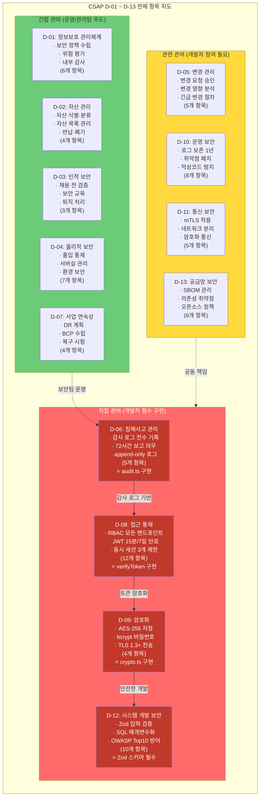
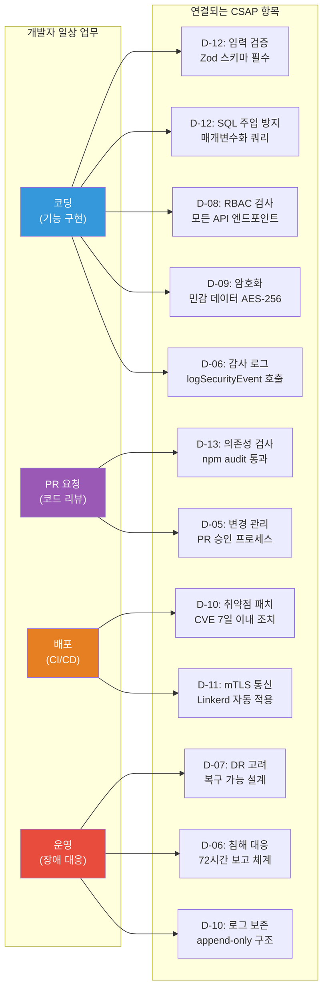

# CSAP 심화 완전 가이드 — D-01~D-13 전체 항목 개발자 관점 상세 해설

> 대상 독자: 공공기관 SaaS 프레임워크 신규 개발자  
> 선행 학습: 07-security/05-security-hardening.md, 07-security/08-compliance-reporting.md  
> 소요 시간: 약 4~5시간 정독  
> 최종 수정: 2026-04-13

---

## 목차

1. [CSAP란 무엇인가 — 초급자를 위한 완전 설명](#1-csap란-무엇인가)
2. [CSAP 전체 항목 지도 — D-01~D-13](#2-csap-전체-항목-지도)
3. [D-01~D-05: 조직·자산·인적·물리·변경 관리](#3-d-01~d-05-간접-관여-영역)
4. [D-06: 침해사고 관리 — 개발자 핵심 필수](#4-d-06-침해사고-관리)
5. [D-07: 사업 연속성 관리 — DR 계획과 개발자 역할](#5-d-07-사업-연속성-관리)
6. [D-08: 접근 통제 — RBAC와 JWT 구현 요건](#6-d-08-접근-통제)
7. [D-09: 암호화 — AES-256, bcrypt, TLS 1.3 구현](#7-d-09-암호화)
8. [D-10: 운영 보안 — 로그 보존과 취약점 패치](#8-d-10-운영-보안)
9. [D-11: 통신 보안 — mTLS와 Linkerd 구현](#9-d-11-통신-보안)
10. [D-12: 시스템 개발 보안 — 입력 검증과 OWASP](#10-d-12-시스템-개발-보안)
11. [D-13: 공급망 보안 — SBOM과 의존성 스캔](#11-d-13-공급망-보안)
12. [개발자 일상 업무와 CSAP 매핑](#12-개발자-일상-업무와-csap-매핑)
13. [CSAP 준수 체크리스트 — 코드 리뷰 기준](#13-csap-준수-체크리스트)

---

## 1. CSAP란 무엇인가

### 1.1 클라우드 서비스 보안인증(CSAP) 기본 개념

CSAP(Cloud Security Assurance Program)는 한국인터넷진흥원(KISA)이 운영하는 클라우드 서비스 보안 인증 제도입니다. 2021년 「클라우드컴퓨팅법」 개정 이후 공공기관이 외부 클라우드 서비스를 도입할 때 반드시 CSAP 인증을 획득한 서비스를 사용해야 합니다.

쉽게 말하면, 우리가 개발하는 SaaS 플랫폼이 공공기관에 납품되려면 이 인증이 있어야 한다는 뜻입니다. 인증 없이는 공공기관 계약 자체가 불가능합니다.

**개발자 입장에서 CSAP가 중요한 이유:**

- 코드 한 줄이 인증 탈락 원인이 될 수 있습니다.
- 감리 시 소스 코드를 직접 열어서 검사합니다.
- 특히 D-06(감사 로그), D-08(접근 통제), D-09(암호화), D-12(개발 보안)는 코드 레벨에서 직접 검증합니다.

### 1.2 CSAP 등급 체계 — 중등급 vs 상등급

| 구분 | 중등급 (Standard) | 상등급 (Advanced) |
|------|-------------------|-------------------|
| 적용 대상 | 비공개 업무, 일반 행정 | 국가 안보, 개인정보 대규모 처리 |
| 통제 항목 수 | 79개 | 117개 |
| 물리 분리 | 논리적 분리 허용 | 물리적 망 분리 필수 |
| 데이터 위치 | 국내 데이터센터 | 전용 보안구역 |
| 암호화 강도 | AES-256 | AES-256 + HSM 적용 |
| 감사 기간 | 1년 보존 | 5년 보존 |
| 개발 보안 | D-12 일반 요건 | D-12 강화 + 코드 서명 |

우리 프레임워크는 **중등급 79항목**을 기본 목표로 하며, 상등급 추가 요건도 선택적으로 적용합니다.

### 1.3 CSAP 통제 영역 전체 구조

CSAP는 13개 도메인(D-01~D-13)으로 구성됩니다. 각 도메인은 세부 통제 항목을 포함하며, 총 79개(중등급) 항목으로 이루어집니다.

```
D-01: 정보보호 관리체계 (6개)
D-02: 자산 관리 (4개)
D-03: 인적 보안 (3개)
D-04: 물리적 보안 (7개)
D-05: 변경 관리 (5개)
D-06: 침해사고 관리 (5개)   ← 개발자 직접 관여
D-07: 사업 연속성 (4개)
D-08: 접근 통제 (12개)      ← 개발자 직접 관여
D-09: 암호화 (4개)          ← 개발자 직접 관여
D-10: 운영 보안 (8개)       ← 개발자 관련
D-11: 통신 보안 (5개)       ← 개발자 관련
D-12: 시스템 개발 보안 (10개) ← 개발자 직접 관여
D-13: 공급망 보안 (6개)     ← 개발자 관련
```

---

## 2. CSAP 전체 항목 지도

### 2.1 D-01~D-13 개발자 관여도 다이어그램



### 2.2 개발자 일상 업무와 CSAP 항목 연결 지도



---

## 3. D-01~D-05: 간접 관여 영역

### 3.1 D-01: 정보보호 관리체계 (6개 항목)

D-01은 조직 차원의 정보보호 정책을 다룹니다. 개발자가 직접 구현할 코드는 없지만, 정책을 이해하고 준수해야 합니다.

**개발자 관련 요건:**

- D-01.1: 정보보호 정책 문서 검토 의무 (연 1회 이상)
- D-01.3: 위험 평가 참여 의무 — 새 기능 개발 시 위험 요소 식별 보고서 작성
- D-01.5: 내부 감사 협조 의무 — 감사 시 코드 설명 가능해야 함

**실무 시사점:** 새 서비스를 개발할 때 `docs/01-plan` 아래 위험 분석 섹션을 반드시 작성해야 합니다. "보안 위험 없음"이라는 체크만으로는 감리를 통과하지 못합니다.

### 3.2 D-02: 자산 관리 (4개 항목)

소프트웨어 자산(소스 코드, 라이브러리, 컨테이너 이미지)도 자산 목록에 포함됩니다.

**개발자 관련 요건:**

- D-02.1: 소프트웨어 자산 목록 유지 — `package.json` 의존성이 자산 목록에 해당
- D-02.3: 폐기 절차 — 서비스 종료 시 컨테이너 이미지, 데이터베이스 데이터 안전 삭제

### 3.3 D-03: 인적 보안 (3개 항목)

개발자 채용, 퇴직, 보안 교육에 관한 항목입니다. 개발자는 다음 의무가 있습니다.

- 연 1회 보안 교육 이수 (CSAP 교육 포함)
- 퇴직 시 접근 권한 즉시 회수 절차 준수
- 프리랜서/외부 개발자도 동일 기준 적용

### 3.4 D-04: 물리적 보안 (7개 항목)

데이터센터 물리 보안 항목으로, 개발자는 원격 접속 정책을 준수해야 합니다.

- 개발 환경에서 운영 DB 직접 접속 금지 (별도 배스천 호스트 경유)
- 운영 서버 SSH 키는 HSM 또는 Vault에서 관리
- 개인 노트북으로 운영 데이터 다운로드 금지

### 3.5 D-05: 변경 관리 (5개 항목)

변경 관리는 개발자와 직접 연관됩니다. 모든 코드 변경은 변경 관리 절차를 거쳐야 합니다.

**PR 생성 시 필수 항목:**

```markdown
## 변경 요청 정보 (D-05 요건)
- 변경 유형: [기능 추가 / 버그 수정 / 보안 패치 / 긴급 변경]
- 영향 범위: [서비스명, 데이터베이스, API 엔드포인트]
- 롤백 계획: [이전 버전으로 복구하는 방법]
- 테스트 결과: [단위/통합/E2E 테스트 통과 여부]
- CSAP 관련 항목: [변경되는 CSAP 통제 항목]
```

긴급 변경(핫픽스)의 경우 사후 승인을 받을 수 있지만, 반드시 24시간 이내에 문서화해야 합니다.

---

## 4. D-06: 침해사고 관리 — 개발자 핵심 필수

D-06은 개발자가 가장 직접적으로 구현해야 하는 항목 중 하나입니다. 모든 보안 관련 이벤트를 추적 가능한 감사 로그로 남겨야 합니다.

### 4.1 D-06 세부 항목 (5개)

| 항목 ID | 요건 | 개발자 책임 |
|---------|------|-------------|
| D-06.1 | 침해사고 탐지 체계 구축 | 이상 행위 감지 로직 구현 |
| D-06.2 | 침해사고 대응 절차 수립 | 자동 알림/차단 코드 구현 |
| D-06.3 | **72시간 내 신고 의무** | 심각도 분류 자동화 구현 |
| D-06.4 | **감사 로그 전수 기록** | 모든 민감 작업 auditLog 호출 |
| D-06.5 | 로그 무결성 보장 | append-only 구조, 수정 불가 |

### 4.2 실제 코드 분석 — logSecurityEvent와 logComplianceEvent

우리 프레임워크의 감사 로깅은 `@public-saas/audit-sdk`를 공통으로 사용합니다. 각 서비스마다 별도의 감사 로거를 초기화하는 패턴을 따릅니다.

**security-service의 감사 로거 (`platform/services/security-service/src/lib/audit.ts`):**

```typescript
// CSAP D-06 준수 패턴 — 보안 서비스 감사 로거
import { createAuditLogger, createStandardTransport } from '@public-saas/audit-sdk';

// 서비스별 전용 로거 인스턴스 생성
const auditLogger = createAuditLogger({
  serviceName: 'security-service',
  transport: createStandardTransport('security-service'),
});

// 모든 보안 이벤트 기록 함수
export async function logSecurityEvent(
  action: string,
  metadata?: Record<string, unknown>
): Promise<void> {
  await auditLogger.log({
    actor: 'system:security-service',   // 행위자 (서비스 자신)
    action,                              // 이벤트 종류 (예: 'LOGIN_FAILED')
    target: 'security',                  // 대상 리소스
    targetType: 'security',             // 대상 유형
    tenantId: 'system',                 // 테넌트 ID (시스템 이벤트)
    ip: process.env.SERVICE_IP || '127.0.0.1', // CSAP D-06: 출처 IP 기록 필수
    userAgent: 'security-service/1.0',  // 요청 에이전트
    metadata,                           // 추가 컨텍스트 정보
  });
}
```

**compliance-service의 감사 로거 (`platform/services/compliance-service/src/lib/audit.ts`):**

```typescript
// CSAP D-06 준수 패턴 — 준수 서비스 감사 로거
import { createAuditLogger, createStandardTransport } from '@public-saas/audit-sdk';

const auditLogger = createAuditLogger({
  serviceName: 'compliance-service',
  transport: createStandardTransport('compliance-service'),
});

// 준수 관련 이벤트 기록
export async function logComplianceEvent(
  action: string,
  metadata?: Record<string, unknown>
): Promise<void> {
  await auditLogger.log({
    actor: 'system:compliance-service',
    action,
    target: 'compliance',
    targetType: 'compliance',
    tenantId: 'system',
    ip: process.env.SERVICE_IP || '127.0.0.1',
    userAgent: 'compliance-service/1.0',
    metadata,
  });
}
```

### 4.3 감사 로그 이벤트 분류 체계

CSAP D-06은 감사 로그에 기록할 이벤트 유형을 구체적으로 요구합니다.

```typescript
// 필수 감사 이벤트 유형 목록 (CSAP D-06.4 기준)
export const AUDIT_EVENTS = {
  // 인증/인가 관련
  AUTH: {
    LOGIN_SUCCESS: 'AUTH_LOGIN_SUCCESS',
    LOGIN_FAILED: 'AUTH_LOGIN_FAILED',
    LOGOUT: 'AUTH_LOGOUT',
    TOKEN_REFRESH: 'AUTH_TOKEN_REFRESH',
    MFA_CHALLENGE: 'AUTH_MFA_CHALLENGE',
    PERMISSION_DENIED: 'AUTH_PERMISSION_DENIED',
  },
  // 데이터 접근 관련
  DATA: {
    READ_SENSITIVE: 'DATA_READ_SENSITIVE',      // 개인정보, 기밀문서 열람
    EXPORT: 'DATA_EXPORT',                       // 데이터 다운로드
    DELETE: 'DATA_DELETE',                       // 데이터 삭제
    BULK_OPERATION: 'DATA_BULK_OPERATION',      // 대량 처리
  },
  // 관리자 작업 관련
  ADMIN: {
    USER_CREATE: 'ADMIN_USER_CREATE',
    USER_DELETE: 'ADMIN_USER_DELETE',
    ROLE_CHANGE: 'ADMIN_ROLE_CHANGE',
    CONFIG_CHANGE: 'ADMIN_CONFIG_CHANGE',
    TENANT_PROVISION: 'ADMIN_TENANT_PROVISION',
  },
  // 보안 이벤트 관련
  SECURITY: {
    SUSPICIOUS_ACTIVITY: 'SEC_SUSPICIOUS_ACTIVITY',
    IP_BLOCKED: 'SEC_IP_BLOCKED',
    RATE_LIMIT_EXCEEDED: 'SEC_RATE_LIMIT_EXCEEDED',
    GRADE_VIOLATION: 'SEC_GRADE_VIOLATION',     // N2SF 등급 위반
  },
} as const;
```

### 4.4 올바른 감사 로그 구현 패턴

```typescript
// ✅ CSAP D-06 준수 — 민감 작업 전수 기록 패턴
import { logSecurityEvent } from '@/lib/audit';

async function deleteUser(adminUser: User, targetUserId: string, req: Request): Promise<void> {
  // 1. 감사 로그 먼저 기록 (작업 전 기록 원칙)
  await logSecurityEvent('ADMIN_USER_DELETE', {
    actor: adminUser.id,
    actorRole: adminUser.role,
    target: targetUserId,
    timestamp: new Date().toISOString(),
    ip: getClientIP(req),              // IP 기록 필수 (D-06.4)
    userAgent: req.headers['user-agent'],
    reason: '계정 비활성화 요청',       // 사유 기록 (D-06.4)
  });

  // 2. 실제 작업 실행
  await prisma.user.delete({ where: { id: targetUserId } });
}

// ❌ 잘못된 패턴 — 감사 로그 없는 민감 작업
async function deleteUser(adminUser: User, targetUserId: string): Promise<void> {
  await prisma.user.delete({ where: { id: targetUserId } }); // CSAP D-06 위반!
}
```

### 4.5 append-only 로그 구조 이해

CSAP D-06.5는 감사 로그가 수정·삭제 불가능한 구조여야 함을 요구합니다. 우리 프레임워크에서는 다음 방법으로 이를 보장합니다.

**방법 1: PostgreSQL 트리거 기반 불변성**

```sql
-- 감사 로그 테이블에 UPDATE, DELETE 트리거 금지
CREATE OR REPLACE FUNCTION prevent_audit_modification()
RETURNS TRIGGER AS $$
BEGIN
  RAISE EXCEPTION 'CSAP D-06: 감사 로그는 수정/삭제할 수 없습니다.';
END;
$$ LANGUAGE plpgsql;

CREATE TRIGGER audit_immutable
  BEFORE UPDATE OR DELETE ON audit_logs
  FOR EACH ROW EXECUTE FUNCTION prevent_audit_modification();
```

**방법 2: Loki 기반 로그 불변성**

Grafana Loki는 기본적으로 append-only 구조입니다. 한 번 수집된 로그는 삭제 API를 통해서만 제거할 수 있으며, 이 API 자체도 감사 로그에 기록됩니다.

**방법 3: `.claude/audit.jsonl` 구조**

로컬 개발 환경의 감사 로그는 JSON Lines 형식으로 `.claude/audit.jsonl`에 저장됩니다. 이 파일은 append-only로만 쓰이며, CI/CD에서 검증합니다.

### 4.6 72시간 보고 의무와 자동화

CSAP D-06.3은 중요 침해사고 발생 시 72시간 이내에 KISA에 신고할 의무를 부여합니다. 개발자는 침해사고 심각도를 자동으로 분류하는 로직을 구현해야 합니다.

```typescript
// 침해사고 심각도 자동 분류 및 알림
enum IncidentSeverity {
  CRITICAL = 'CRITICAL', // 72시간 KISA 신고 대상
  HIGH = 'HIGH',         // 24시간 내 내부 보고
  MEDIUM = 'MEDIUM',     // 72시간 내 내부 보고
  LOW = 'LOW',           // 주간 보고서에 포함
}

function classifySeverity(event: SecurityEvent): IncidentSeverity {
  if (
    event.type === 'DATA_BREACH' ||
    event.affectedUsers > 1000 ||
    event.containsPII === true ||
    event.type === 'RANSOMWARE'
  ) {
    return IncidentSeverity.CRITICAL; // KISA 72시간 신고 대상
  }
  if (event.type === 'UNAUTHORIZED_ACCESS' || event.attemptCount > 100) {
    return IncidentSeverity.HIGH;
  }
  // ... 추가 분류 로직
  return IncidentSeverity.LOW;
}
```

---

## 5. D-07: 사업 연속성 관리 — DR 계획과 개발자 역할

D-07은 재해복구(Disaster Recovery)와 업무 연속성 계획(Business Continuity Plan)을 다룹니다. 개발자는 시스템 설계 단계에서 복구 가능성을 고려해야 합니다.

### 5.1 D-07 핵심 요건과 개발자 역할

| D-07 항목 | 운영팀 역할 | 개발자 역할 |
|-----------|-------------|-------------|
| D-07.1 BCP 수립 | BCP 문서 작성 | 서비스 종속성 목록 제공 |
| D-07.2 DR 계획 | DR 사이트 구성 | 상태 비저장(stateless) 설계 |
| D-07.3 복구 시험 | 주기적 복구 훈련 | 복구 스크립트 작성·검증 |
| D-07.4 BCDR 개선 | RTO/RPO 목표 관리 | 데이터 백업 로직 구현 |

### 5.2 개발자가 고려해야 할 RTO/RPO

```typescript
// DR 목표 (Design에서 정의된 값)
const DR_TARGETS = {
  RTO: 4 * 60 * 60 * 1000,  // 4시간 (Recovery Time Objective)
  RPO: 1 * 60 * 60 * 1000,  // 1시간 (Recovery Point Objective)
};

// RPO 준수를 위한 데이터 백업 주기 설정
// PostgreSQL WAL 스트리밍: 실시간
// 스냅샷 백업: 매 1시간 (RPO = 1시간)
```

### 5.3 graceful-shutdown 구현 (DR 지원)

`platform/packages/mesh-ready/src/graceful-shutdown.ts`의 구현은 CSAP D-07과 직접 연결됩니다.

```typescript
// Graceful Shutdown — DR 상황에서 데이터 손실 최소화
// Design Ref: §7 사업 연속성
process.on('SIGTERM', async () => {
  // 1. 새 요청 수신 중단
  server.close();

  // 2. 진행 중인 요청 완료 대기 (최대 30초)
  await waitForActiveRequests(30_000);

  // 3. 데이터베이스 연결 정상 종료
  await prisma.$disconnect();

  // 4. 감사 로그 플러시 (D-06 데이터 손실 방지)
  await auditLogger.flush();

  process.exit(0);
});
```

---

## 6. D-08: 접근 통제 — RBAC와 JWT 구현 요건

D-08은 개발자가 코드 레벨에서 직접 구현해야 하는 접근 통제를 다룹니다. 12개 항목 중 8개가 코드 구현과 직결됩니다.

### 6.1 D-08 세부 항목 (12개)

| 항목 ID | 요건 | 구현 방법 |
|---------|------|-----------|
| D-08.1 | 사용자 식별 및 인증 | JWT 토큰 검증 |
| D-08.2 | 최소 권한 원칙 | RBAC 역할별 권한 분리 |
| D-08.3 | **모든 API 접근 통제** | 모든 엔드포인트 인증 미들웨어 |
| D-08.4 | 접근 권한 목록 관리 | 역할-권한 매핑 테이블 |
| D-08.5 | 권한 변경 기록 | 감사 로그 연동 |
| D-08.6 | **세션 관리** | JWT 만료, 블랙리스트 |
| D-08.7 | 특권 계정 관리 | 관리자 계정 MFA 강제 |
| D-08.8 | 원격 접근 통제 | VPN/배스천 호스트 경유 |
| D-08.9 | 동시 세션 제한 | 최대 3개 세션 |
| D-08.10 | 자동 잠금 | 5회 실패 시 계정 잠금 |
| D-08.11 | 암호 정책 | 8자 이상, 복잡도 요건 |
| D-08.12 | 접근 로그 기록 | 모든 인증 시도 로깅 |

### 6.2 RBAC 구현 패턴

```typescript
// CSAP D-08.2~D-08.3 준수 — RBAC 접근 통제 구현
// Design Ref: §3 접근 통제 아키텍처

// 역할-권한 매핑 정의
const PERMISSIONS = {
  // 시스템 관리자
  'system:admin': [
    'tenant:*', 'user:*', 'config:*', 'audit:read',
  ],
  // 테넌트 관리자
  'tenant:admin': [
    'tenant:read', 'tenant:update',
    'user:create', 'user:read', 'user:update', 'user:delete',
    'report:*',
  ],
  // 일반 사용자
  'tenant:user': [
    'user:read-own', 'user:update-own',
    'document:read', 'document:create',
  ],
  // 읽기 전용 감사자
  'tenant:auditor': [
    'audit:read', 'report:read', 'user:read',
  ],
} as const;

// 모든 API 엔드포인트에 적용할 인증 미들웨어
async function requirePermission(
  permission: string
): Promise<FastifyPluginCallback> {
  return async (request, reply) => {
    // 1. JWT 토큰 검증 (D-08.1)
    const user = await verifyToken(request.headers.authorization);
    if (!user) {
      // 감사 로그 기록 (D-06)
      await logSecurityEvent('AUTH_TOKEN_INVALID', {
        ip: request.ip,
        path: request.url,
      });
      return reply.status(401).send({ error: 'Unauthorized' });
    }

    // 2. 권한 검사 (D-08.3)
    if (!hasPermission(user.role, permission)) {
      // 감사 로그 기록 (D-06, D-08.5)
      await logSecurityEvent('AUTH_PERMISSION_DENIED', {
        userId: user.id,
        requiredPermission: permission,
        userRole: user.role,
        ip: request.ip,
      });
      return reply.status(403).send({ error: 'Forbidden' });
    }

    request.user = user; // 이후 핸들러에서 사용
  };
}

// 실제 사용 예시
app.get('/api/admin/users', {
  preHandler: requirePermission('user:read'),
}, async (request, reply) => {
  // 권한 검사 통과 후 비즈니스 로직
  const users = await userService.findAll(request.user.tenantId);
  return reply.send({ data: users });
});
```

### 6.3 JWT 토큰 보안 요건

CSAP D-08.6은 세션 관리에 대한 구체적인 요건을 정합니다.

```typescript
// CSAP D-08.6 준수 — JWT 토큰 관리
const JWT_CONFIG = {
  // 접근 토큰: 15분 (짧은 만료로 탈취 피해 최소화)
  ACCESS_TOKEN_TTL: '15m',

  // 갱신 토큰: 7일 (편의성과 보안의 균형)
  REFRESH_TOKEN_TTL: '7d',

  // 알고리즘: RS256 (비대칭 키, 서명 검증 분리)
  ALGORITHM: 'RS256',

  // 발급자: 명시적으로 검증
  ISSUER: process.env.JWT_ISSUER,
};

// 로그아웃 시 토큰 블랙리스트 등록 (D-08.6)
async function logout(token: string, userId: string): Promise<void> {
  const decoded = jwt.decode(token) as { jti: string; exp: number };

  // Redis에 블랙리스트 등록 (만료 시간까지만 유지)
  const ttl = decoded.exp - Math.floor(Date.now() / 1000);
  await redis.setex(`blacklist:${decoded.jti}`, ttl, '1');

  // 감사 로그 기록 (D-06)
  await logSecurityEvent('AUTH_LOGOUT', { userId, jti: decoded.jti });
}

// 동시 세션 제한 (D-08.9) — 최대 3개
async function enforceSessionLimit(userId: string, newSessionId: string): Promise<void> {
  const sessions = await redis.smembers(`sessions:${userId}`);

  if (sessions.length >= 3) {
    // 가장 오래된 세션 제거
    const oldest = sessions[0];
    await redis.srem(`sessions:${userId}`, oldest);
    await redis.del(`session:${oldest}`);

    // 강제 로그아웃 알림
    await logSecurityEvent('SESSION_LIMIT_EXCEEDED', {
      userId,
      removedSession: oldest,
      currentSessions: sessions.length,
    });
  }

  await redis.sadd(`sessions:${userId}`, newSessionId);
}
```

### 6.4 계정 잠금 구현 (D-08.10)

```typescript
// CSAP D-08.10 — 5회 실패 시 계정 잠금
const LOCKOUT_CONFIG = {
  MAX_ATTEMPTS: 5,
  LOCKOUT_DURATION: 30 * 60, // 30분 (초)
  WINDOW_DURATION: 5 * 60,   // 5분 시도 창
};

async function checkLoginAttempts(userId: string): Promise<void> {
  const key = `login_attempts:${userId}`;
  const attempts = await redis.incr(key);

  if (attempts === 1) {
    // 첫 시도 시 만료 시간 설정
    await redis.expire(key, LOCKOUT_CONFIG.WINDOW_DURATION);
  }

  if (attempts > LOCKOUT_CONFIG.MAX_ATTEMPTS) {
    // 계정 잠금
    await redis.setex(
      `locked:${userId}`,
      LOCKOUT_CONFIG.LOCKOUT_DURATION,
      '1'
    );
    await logSecurityEvent('AUTH_ACCOUNT_LOCKED', {
      userId,
      attemptCount: attempts,
      lockDuration: LOCKOUT_CONFIG.LOCKOUT_DURATION,
    });
    throw new Error('ACCOUNT_LOCKED');
  }
}
```

---

## 7. D-09: 암호화 — AES-256, bcrypt, TLS 1.3 구현

D-09는 데이터 보호를 위한 암호화 요건을 정의합니다. 4개 항목 모두 코드 레벨 구현과 직결됩니다.

### 7.1 D-09 세부 항목 (4개)

| 항목 ID | 요건 | 구현 기술 |
|---------|------|-----------|
| D-09.1 | **저장 데이터 암호화** | AES-256-GCM |
| D-09.2 | **전송 데이터 암호화** | TLS 1.3+ |
| D-09.3 | **비밀번호 해시** | bcrypt (cost factor 12+) |
| D-09.4 | 암호화 키 관리 | HashiCorp Vault |

### 7.2 AES-256 저장 암호화 구현

```typescript
// CSAP D-09.1 준수 — 민감 데이터 AES-256-GCM 암호화
// Design Ref: §5 암호화 아키텍처
import { createCipheriv, createDecipheriv, randomBytes } from 'crypto';

const ALGORITHM = 'aes-256-gcm';
const IV_LENGTH = 16;    // 128비트 IV
const TAG_LENGTH = 16;   // 128비트 인증 태그

// 환경 변수에서 키 로드 (절대 하드코딩 금지 — CSAP D-09.4)
function getEncryptionKey(): Buffer {
  const key = process.env.ENCRYPTION_KEY;
  if (!key) {
    throw new Error('ENCRYPTION_KEY 환경 변수가 설정되지 않았습니다.');
  }
  const keyBuffer = Buffer.from(key, 'base64');
  if (keyBuffer.length !== 32) {
    throw new Error('ENCRYPTION_KEY는 32바이트(256비트)여야 합니다.');
  }
  return keyBuffer;
}

export async function encrypt(plaintext: string): Promise<string> {
  const key = getEncryptionKey();
  const iv = randomBytes(IV_LENGTH);
  const cipher = createCipheriv(ALGORITHM, key, iv);

  const encrypted = Buffer.concat([
    cipher.update(plaintext, 'utf8'),
    cipher.final(),
  ]);
  const tag = cipher.getAuthTag();

  // IV + 암호문 + 인증 태그를 Base64로 인코딩하여 저장
  const combined = Buffer.concat([iv, encrypted, tag]);
  return combined.toString('base64');
}

export async function decrypt(ciphertext: string): Promise<string> {
  const key = getEncryptionKey();
  const combined = Buffer.from(ciphertext, 'base64');

  const iv = combined.slice(0, IV_LENGTH);
  const tag = combined.slice(combined.length - TAG_LENGTH);
  const encrypted = combined.slice(IV_LENGTH, combined.length - TAG_LENGTH);

  const decipher = createDecipheriv(ALGORITHM, key, iv);
  decipher.setAuthTag(tag);

  const decrypted = Buffer.concat([
    decipher.update(encrypted),
    decipher.final(),
  ]);
  return decrypted.toString('utf8');
}

// 사용 예시: 개인정보 저장 시
async function saveSensitiveData(userId: string, ssn: string): Promise<void> {
  const encryptedSSN = await encrypt(ssn); // D-09.1 적용
  await prisma.userProfile.update({
    where: { userId },
    data: { ssn: encryptedSSN },           // 암호화된 값만 DB에 저장
  });
}
```

### 7.3 bcrypt 비밀번호 해시 구현

```typescript
// CSAP D-09.3 준수 — 비밀번호 bcrypt 해시
import bcrypt from 'bcrypt';

const BCRYPT_ROUNDS = 12; // 최소 12 (CSAP 권장: 10 이상)

export async function hashPassword(password: string): Promise<string> {
  // 입력 검증 (D-12)
  if (password.length < 8) {
    throw new Error('비밀번호는 8자 이상이어야 합니다.');
  }
  return bcrypt.hash(password, BCRYPT_ROUNDS);
}

export async function verifyPassword(
  password: string,
  hash: string
): Promise<boolean> {
  return bcrypt.compare(password, hash);
}

// ❌ 절대 금지 패턴
const BAD_PASSWORD = 'SHA256:' + sha256(password); // 역산 가능, CSAP D-09 위반
const BAD_PASSWORD2 = md5(password);               // 취약한 해시, CSAP D-09 위반
```

### 7.4 TLS 1.3 전송 암호화 설정

```typescript
// CSAP D-09.2 준수 — TLS 1.3+ 강제 적용
import { createServer } from 'https';
import { readFileSync } from 'fs';

const tlsOptions = {
  // TLS 1.3만 허용 (1.0, 1.1, 1.2 차단)
  minVersion: 'TLSv1.3' as const,

  // 서버 인증서 (Let's Encrypt 또는 공인 인증서)
  cert: readFileSync(process.env.TLS_CERT_PATH!),
  key: readFileSync(process.env.TLS_KEY_PATH!),

  // 취약한 암호 스위트 제외
  ciphers: [
    'TLS_AES_256_GCM_SHA384',
    'TLS_CHACHA20_POLY1305_SHA256',
    'TLS_AES_128_GCM_SHA256',
  ].join(':'),

  // HSTS 헤더 설정
  // Strict-Transport-Security: max-age=31536000; includeSubDomains
};

// Kubernetes Ingress YAML에서도 강제
// nginx.ingress.kubernetes.io/ssl-protocols: "TLSv1.3"
```

### 7.5 암호화 키 관리 — HashiCorp Vault

```bash
# HashiCorp Vault에서 암호화 키 로드 (CSAP D-09.4)
# 하드코딩 절대 금지 — 환경 변수는 Vault에서 주입

# Kubernetes Secret (Vault Agent Injector 사용)
kubectl create secret generic app-encryption-key \
  --from-literal=ENCRYPTION_KEY="$(vault read -field=key secret/data/saas/encryption)"

# 개발 환경 키 생성 (256비트 = 32바이트)
node -e "console.log(require('crypto').randomBytes(32).toString('base64'))"
```

---

## 8. D-10: 운영 보안 — 로그 보존과 취약점 패치

D-10은 시스템이 운영되는 동안 지속적으로 보안을 유지하기 위한 요건을 다룹니다.

### 8.1 D-10 세부 항목 (8개)

| 항목 ID | 요건 | 개발자 관련 사항 |
|---------|------|-----------------|
| D-10.1 | 변경 이력 관리 | git 커밋 히스토리 보존 |
| D-10.2 | **로그 보존 1년** | Loki 보존 정책 설정 |
| D-10.3 | **취약점 패치** | CVE 7일 이내 패치 의무 |
| D-10.4 | 악성코드 방지 | CI에서 Trivy 이미지 스캔 |
| D-10.5 | 취약점 스캔 | OWASP ZAP 자동화 |
| D-10.6 | 패치 관리 | 의존성 업데이트 주기 |
| D-10.7 | 기술 취약점 점검 | 월 1회 침투 테스트 |
| D-10.8 | 용량 계획 | 리소스 한도 설정 |

### 8.2 로그 보존 1년 정책 구현

```yaml
# Grafana Loki 보존 정책 설정 (CSAP D-10.2)
# helm/loki/values.yaml
loki:
  config:
    table_manager:
      retention_deletes_enabled: true
      retention_period: 8760h  # 365일 = 1년 (CSAP D-10 최소 요건)

    # 감사 로그는 별도 스토리지 클래스로 더 오래 보존
    # (상등급 요건: 5년)
    schema_config:
      configs:
        - from: "2026-01-01"
          store: boltdb-shipper
          object_store: filesystem
          schema: v11
          index:
            prefix: loki_index_
            period: 24h
```

```typescript
// 로그 보존 정책 코드 레벨 설정
const LOG_RETENTION_POLICY = {
  AUDIT_LOGS: 365 * 24 * 60 * 60 * 1000,  // 1년 (CSAP 중등급)
  APPLICATION_LOGS: 90 * 24 * 60 * 60 * 1000, // 90일
  ACCESS_LOGS: 180 * 24 * 60 * 60 * 1000, // 6개월
  DEBUG_LOGS: 7 * 24 * 60 * 60 * 1000,    // 7일 (개발 환경만)
} as const;
```

### 8.3 취약점 패치 의무 (D-10.3)

```bash
# CVE 모니터링 및 패치 프로세스
# 1. 의존성 취약점 확인 (매일 자동 실행)
npm audit --audit-level=high

# 2. 컨테이너 이미지 취약점 스캔 (CI/CD에서 자동)
trivy image public-saas/ai-service:latest \
  --severity HIGH,CRITICAL \
  --exit-code 1  # HIGH 이상 발견 시 배포 중단

# 3. CVSS 점수별 패치 기한
# CVSS 9.0~10.0 (Critical): 24시간 이내
# CVSS 7.0~8.9 (High): 7일 이내
# CVSS 4.0~6.9 (Medium): 30일 이내
# CVSS 0.1~3.9 (Low): 90일 이내
```

---

## 9. D-11: 통신 보안 — mTLS와 Linkerd 구현

D-11은 서비스 간 통신과 외부 통신의 보안을 다룹니다. 우리 프레임워크는 Linkerd 서비스 메시를 사용하여 mTLS를 자동으로 적용합니다.

### 9.1 D-11 세부 항목 (5개)

| 항목 ID | 요건 | 구현 기술 |
|---------|------|-----------|
| D-11.1 | 네트워크 분리 | k3s 네임스페이스 격리 |
| D-11.2 | **mTLS 서비스 간 통신** | Linkerd 자동 mTLS |
| D-11.3 | 암호화된 외부 통신 | TLS 1.3 Ingress |
| D-11.4 | 네트워크 트래픽 모니터링 | Linkerd tap |
| D-11.5 | 방화벽 규칙 | NetworkPolicy |

### 9.2 Linkerd mTLS 자동 적용

Linkerd를 사용하면 코드 변경 없이 서비스 간 mTLS가 자동으로 적용됩니다.

```yaml
# 서비스에 Linkerd 주입 설정
# k8s/ai-service/deployment.yaml
apiVersion: apps/v1
kind: Deployment
metadata:
  name: ai-service
  annotations:
    # Linkerd 자동 주입 활성화 (D-11.2 준수)
    linkerd.io/inject: enabled
spec:
  template:
    metadata:
      annotations:
        linkerd.io/inject: enabled
    spec:
      containers:
        - name: ai-service
          image: public-saas/ai-service:latest
          # Linkerd proxy가 사이드카로 자동 주입됨
          # 모든 서비스 간 트래픽이 mTLS로 암호화됨
```

```bash
# mTLS 적용 확인
linkerd viz edges deployment -n public-saas

# 출력 예시:
# SRC                DST               SECURED
# ai-service         vector-store      ✓ (mTLS)
# ai-service         compliance-svc    ✓ (mTLS)
# gateway            ai-service        ✓ (mTLS)
```

### 9.3 NetworkPolicy — 네트워크 최소 권한

```yaml
# CSAP D-11.1 준수 — 최소 권한 네트워크 정책
# k8s/network-policies/ai-service-policy.yaml
apiVersion: networking.k8s.io/v1
kind: NetworkPolicy
metadata:
  name: ai-service-network-policy
  namespace: public-saas
spec:
  podSelector:
    matchLabels:
      app: ai-service
  policyTypes:
    - Ingress
    - Egress
  ingress:
    # API 게이트웨이에서만 수신 허용
    - from:
        - namespaceSelector:
            matchLabels:
              kubernetes.io/metadata.name: public-saas
          podSelector:
            matchLabels:
              app: api-gateway
      ports:
        - protocol: TCP
          port: 3000
  egress:
    # PostgreSQL 접속만 허용
    - to:
        - podSelector:
            matchLabels:
              app: postgresql
      ports:
        - protocol: TCP
          port: 5432
    # DNS 조회 허용
    - to: []
      ports:
        - protocol: UDP
          port: 53
```

---

## 10. D-12: 시스템 개발 보안 — 입력 검증과 OWASP

D-12는 개발자가 코딩 단계에서 가장 직접적으로 적용해야 하는 항목입니다. 10개 항목 모두 코드 구현과 직결됩니다.

### 10.1 D-12 세부 항목 (10개)

| 항목 ID | 요건 | 구현 방법 | OWASP 연관 |
|---------|------|-----------|------------|
| D-12.1 | 보안 요건 정의 | Plan 문서 보안 섹션 | - |
| D-12.2 | 보안 설계 | Design 문서 위협 모델 | - |
| D-12.3 | **입력 데이터 검증** | Zod 스키마 | A03 Injection |
| D-12.4 | **SQL 주입 방지** | 매개변수화 쿼리 | A03 Injection |
| D-12.5 | **XSS 방지** | DOMPurify, CSP 헤더 | A03 Injection |
| D-12.6 | **CSRF 방지** | CSRF 토큰, SameSite | A01 |
| D-12.7 | **에러 처리** | 민감 정보 노출 금지 | A09 |
| D-12.8 | 시큐어 코딩 표준 | ESLint 보안 규칙 | - |
| D-12.9 | 코드 보안 검토 | 코드 리뷰 체크리스트 | - |
| D-12.10 | 보안 테스트 | SAST/DAST 자동화 | - |

### 10.2 Zod 입력 검증 — RAG 핸들러 실제 구현

RAG 핸들러(`platform/services/ai-service/src/handlers/ai-rag.handler.ts`)의 실제 구현을 분석합니다.

```typescript
// CSAP D-12.3 준수 — Zod 입력 검증 실제 구현
// 출처: platform/services/ai-service/src/handlers/ai-rag.handler.ts

// 문서 수집 요청 스키마
const ingestSchema = z.object({
  tenantId: z.string().uuid(),        // UUID 형식 강제
  grade: z.enum(['O']),               // O등급만 허용 (N2SF 규칙)
  title: z.string().min(1).max(200),  // 길이 제한
  content: z.string().min(1).max(500_000), // 최대 50만자 (DoS 방지)
  sourceUrl: z.string().url().optional(),  // URL 형식 검증
  metadata: z.record(z.unknown()).optional(),
  embedModelId: z.string().optional(),
});

// 핸들러에서 검증 적용
export async function ragIngestHandler(
  request: FastifyRequest<{ Body: IngestBody }>,
  reply: FastifyReply,
): Promise<void> {
  // Zod 검증 — 실패 시 자동으로 400 에러 (D-12.3)
  const body = ingestSchema.parse(request.body);

  // N2SF N-05: C/S등급 데이터 AI 전송 차단 (추가 검증)
  try {
    validateDataGrade(body.grade as DataGrade);
  } catch (error) {
    if (error instanceof DataGradeViolationError) {
      // 등급 위반 감사 로그 기록 (D-06 연동)
      await logAiEvent('AI_GRADE_VIOLATION', actor, 'rag', body.tenantId, request.ip,
        request.headers['user-agent'] ?? 'unknown',
        { grade: body.grade, blocked: true, endpoint: 'rag/ingest' });
      return reply.status(403).send({
        success: false,
        error: { code: error.code, message: error.message }
      });
    }
    throw error;
  }
  // 비즈니스 로직 ...
}
```

### 10.3 SQL 주입 방지 — Prisma ORM 매개변수화

```typescript
// ✅ CSAP D-12.4 준수 — Prisma 매개변수화 쿼리 (SQL 주입 방지)
// Prisma는 기본적으로 모든 쿼리를 매개변수화함

// 안전한 패턴
const users = await prisma.user.findMany({
  where: {
    email: userInput,      // Prisma가 자동으로 매개변수화
    tenantId: tenantId,    // 직접 문자열 결합 없음
  },
});

// Raw 쿼리 사용 시 반드시 태그드 템플릿 사용
const result = await prisma.$queryRaw`
  SELECT * FROM users
  WHERE email = ${userEmail}     -- $1 매개변수로 변환됨
  AND tenant_id = ${tenantId}    -- $2 매개변수로 변환됨
`;

// ❌ 절대 금지 — SQL 직접 결합 (CSAP D-12.4 위반)
const BAD_QUERY = await prisma.$queryRawUnsafe(
  `SELECT * FROM users WHERE email = '${userEmail}'`  // SQL 주입 취약점!
);
```

### 10.4 에러 처리 — 민감 정보 노출 방지 (D-12.7)

```typescript
// ✅ CSAP D-12.7 준수 — 안전한 에러 응답
import { randomUUID } from 'crypto';

export function createSafeErrorHandler(app: FastifyInstance): void {
  app.setErrorHandler(async (error, request, reply) => {
    // 에러 ID 생성 (추적용)
    const errorId = randomUUID();

    // 내부 로그: 전체 에러 정보 기록 (모니터링용)
    request.log.error({
      errorId,
      error: error.message,
      stack: error.stack,       // 내부 로그에만 스택 트레이스
      url: request.url,
      userId: request.user?.id,
    });

    // 감사 로그 기록 (D-06)
    await logSecurityEvent('INTERNAL_ERROR', {
      errorId,
      errorType: error.constructor.name,
    });

    // 외부 응답: 최소한의 정보만 노출
    // 스택 트레이스, DB 오류, 시스템 경로 절대 포함 금지
    await reply.status(500).send({
      error: '내부 서버 오류가 발생했습니다.',
      errorId,                   // 추적용 ID만 제공
      // error.message 직접 노출 금지 — DB 정보 포함 가능
      // error.stack 절대 금지 — 시스템 정보 노출
    });
  });
}
```

### 10.5 OWASP Top 10 매핑

| OWASP 2021 순위 | 취약점 | 우리 프레임워크 대응 | CSAP 항목 |
|-----------------|--------|---------------------|-----------|
| A01 | 접근 통제 실패 | RBAC + JWT 검증 | D-08 |
| A02 | 암호화 실패 | AES-256, bcrypt | D-09 |
| A03 | 주입 공격 | Zod + Prisma 매개변수화 | D-12.3~4 |
| A04 | 안전하지 않은 설계 | 위협 모델링 필수 | D-12.1~2 |
| A05 | 보안 구성 오류 | Helm 보안 값, NetworkPolicy | D-10 |
| A06 | 취약하고 오래된 구성요소 | Trivy, npm audit | D-13 |
| A07 | 인증 및 인증 실패 | MFA, 계정 잠금 | D-08 |
| A08 | 소프트웨어 무결성 실패 | SBOM, 서명 검증 | D-13 |
| A09 | 보안 로깅 실패 | audit.ts 전수 기록 | D-06 |
| A10 | SSRF | URL 화이트리스트 | D-12.5 |

---

## 11. D-13: 공급망 보안 — SBOM과 의존성 스캔

D-13은 오픈소스 라이브러리와 컨테이너 이미지를 통한 공급망 공격을 방어하기 위한 요건입니다.

### 11.1 D-13 세부 항목 (6개)

| 항목 ID | 요건 | 구현 방법 |
|---------|------|-----------|
| D-13.1 | **SBOM 생성 및 관리** | CycloneDX, Syft |
| D-13.2 | 공급망 위험 평가 | 의존성 라이선스 검토 |
| D-13.3 | **의존성 취약점 스캔** | Snyk, npm audit |
| D-13.4 | 코드 서명 검증 | Sigstore Cosign |
| D-13.5 | 오픈소스 정책 | 허용 라이선스 목록 |
| D-13.6 | 공급업체 보안 평가 | 서드파티 검토 |

### 11.2 SBOM 생성 자동화

```bash
# CI/CD에서 SBOM 자동 생성 (CSAP D-13.1)
# .gitea/workflows/security-scan.yml 에 포함

# CycloneDX SBOM 생성 (npm 의존성)
npm install -g @cyclonedx/cyclonedx-npm
cyclonedx-npm --output-file sbom.json --output-format JSON

# Syft SBOM 생성 (컨테이너 이미지)
syft public-saas/ai-service:latest \
  -o cyclonedx-json=ai-service-sbom.json

# Grype 취약점 스캔 (SBOM 기반)
grype sbom:ai-service-sbom.json \
  --fail-on high

# 결과물 아카이브 (감리 증적)
# artifacts/sbom/YYYY-MM-DD/
```

### 11.3 허용 라이선스 정책

```javascript
// .licensecheckrc.js — 허용 라이선스 목록 (CSAP D-13.5)
module.exports = {
  allowedLicenses: [
    'MIT',
    'ISC',
    'BSD-2-Clause',
    'BSD-3-Clause',
    'Apache-2.0',
    'CC0-1.0',
  ],
  // 금지 라이선스 (AGPL, GPL은 공공기관 납품 시 법적 문제)
  forbiddenLicenses: [
    'GPL-2.0',
    'GPL-3.0',
    'AGPL-3.0',
    'LGPL-2.1',
    'LGPL-3.0',
    'Commons-Clause',
  ],
  // 예외 목록 (법무 검토 완료)
  exceptions: {
    'some-gpl-package': '법무팀 검토 완료, 격리 사용 승인 (2026-01-15)',
  },
};
```

### 11.4 컨테이너 이미지 서명 및 검증

```bash
# Sigstore Cosign으로 이미지 서명 (CSAP D-13.4)
# CI/CD에서 빌드 후 자동 서명

# 서명
cosign sign --key $COSIGN_PRIVATE_KEY \
  public-saas/ai-service:v1.2.3

# 배포 시 서명 검증 (Kubernetes Admission Webhook)
cosign verify \
  --key $COSIGN_PUBLIC_KEY \
  public-saas/ai-service:v1.2.3

# 미서명 이미지 배포 차단 정책
# OPA Gatekeeper 또는 Kyverno 정책으로 강제
```

---

## 12. 개발자 일상 업무와 CSAP 매핑

### 12.1 코딩 단계 체크리스트

매일 코드를 작성할 때 다음 항목을 확인합니다.

```markdown
## 코딩 단계 CSAP 체크리스트

### D-12: 시스템 개발 보안
- [ ] 모든 API 입력에 Zod 스키마 검증 적용했는가?
- [ ] DB 쿼리에 직접 문자열 결합 없이 Prisma/매개변수화 사용했는가?
- [ ] 하드코딩된 시크릿(API 키, 비밀번호)이 없는가?
- [ ] 에러 메시지에 스택 트레이스, DB 정보가 노출되지 않는가?

### D-08: 접근 통제
- [ ] 모든 API 엔드포인트에 인증 미들웨어가 적용되었는가?
- [ ] 역할별 권한 검사(RBAC)가 구현되었는가?
- [ ] 다른 테넌트 데이터에 접근하는 버그가 없는가? (격리 확인)

### D-09: 암호화
- [ ] 민감 데이터를 평문으로 저장하지 않았는가?
- [ ] 비밀번호는 bcrypt로 해시했는가?
- [ ] 환경 변수로 시크릿을 관리했는가?

### D-06: 감사 로깅
- [ ] 새로운 민감 작업에 logSecurityEvent 또는 logComplianceEvent를 호출했는가?
- [ ] 감사 로그에 actor, action, target, ip, timestamp가 모두 포함되었는가?
```

### 12.2 PR 요청 단계 체크리스트

```markdown
## PR 단계 CSAP 체크리스트

### D-05: 변경 관리
- [ ] PR 설명에 변경 유형, 영향 범위, 롤백 계획이 기재되었는가?
- [ ] 긴급 변경인 경우 사전 승인 또는 사후 24시간 내 문서화 계획이 있는가?

### D-13: 공급망 보안
- [ ] 새로운 npm 패키지를 추가했다면 라이선스를 확인했는가?
- [ ] npm audit 실행 결과 HIGH 이상 취약점이 없는가?
- [ ] 추가한 패키지의 SBOM을 업데이트했는가?

### D-10: 운영 보안
- [ ] 새로운 민감 정보를 다루는 로직에 로그 보존 정책이 적용되었는가?
- [ ] 서비스 다운타임 없이 배포 가능한가? (Graceful Shutdown 구현 여부)
```

### 12.3 배포 단계 체크리스트

```markdown
## 배포 단계 CSAP 체크리스트

### D-11: 통신 보안
- [ ] Linkerd 주입 어노테이션이 Deployment에 포함되었는가?
- [ ] NetworkPolicy가 최소 권한으로 설정되었는가?
- [ ] Ingress TLS가 TLS 1.3+으로 설정되었는가?

### D-10: 운영 보안
- [ ] Trivy 이미지 스캔 결과 CRITICAL/HIGH 취약점이 없는가?
- [ ] 컨테이너 이미지가 Cosign으로 서명되었는가?

### D-07: 사업 연속성
- [ ] Graceful Shutdown이 올바르게 동작하는가?
- [ ] 헬스 체크 엔드포인트가 정상 동작하는가?
- [ ] 배포 실패 시 자동 롤백이 설정되었는가?
```

---

## 13. CSAP 준수 체크리스트 — 코드 리뷰 기준

코드 리뷰어(Reviewer 에이전트 포함)는 다음 기준으로 CSAP 준수 여부를 평가합니다.

### 13.1 자동 검사 항목 (AgentShield 102 규칙)

```bash
# CSAP 관련 자동 검사 실행
npm run lint              # ESLint 보안 규칙
npm run audit:dead-code   # 미사용 코드 탐지
npm audit                 # 의존성 취약점 스캔
```

### 13.2 수동 리뷰 항목 (코드 리뷰어 확인 사항)

| 분류 | 확인 항목 | 통과 기준 |
|------|-----------|-----------|
| D-06 | 감사 로그 기록 완전성 | 모든 민감 작업에 logXxxEvent 호출 |
| D-08 | API 인증 적용 범위 | 공개 API 외 전체 인증 미들웨어 |
| D-08 | 테넌트 격리 | tenantId 필터 누락 없음 |
| D-09 | 암호화 누락 | 민감 필드 평문 저장 없음 |
| D-12 | 입력 검증 | 모든 요청 바디 Zod 검증 |
| D-12 | 에러 처리 | 스택 트레이스 외부 미노출 |
| D-13 | 새 의존성 | 라이선스 및 취약점 확인 |

### 13.3 Q-GATE 연동

CSAP 준수는 7단계 Q-GATE와 연동됩니다.

- **G1 (Auditor)**: FR ID와 CSAP 항목 추적성 확인
- **G3 (Reviewer)**: D-08, D-09, D-12 코드 레벨 검사
- **G5 (Reviewer)**: OWASP Top 10 통과 여부
- **G6 (Auditor)**: CSAP 해당 Phase 100% 커버리지
- **G7 (Auditor)**: 감사 로그 `audit.jsonl` 완비

---

## 부록 A: CSAP 관련 용어 정리

| 용어 | 설명 |
|------|------|
| CSAP | Cloud Security Assurance Program — 클라우드 서비스 보안인증 |
| KISA | 한국인터넷진흥원 — CSAP 인증 기관 |
| RTO | Recovery Time Objective — 목표 복구 시간 |
| RPO | Recovery Point Objective — 목표 복구 지점 |
| SBOM | Software Bill of Materials — 소프트웨어 구성 요소 목록 |
| mTLS | Mutual TLS — 상호 인증 TLS |
| RBAC | Role-Based Access Control — 역할 기반 접근 통제 |
| CVE | Common Vulnerabilities and Exposures — 공개 취약점 목록 |
| CVSS | Common Vulnerability Scoring System — 취약점 심각도 점수 |
| BCP | Business Continuity Plan — 업무 연속성 계획 |
| DR | Disaster Recovery — 재해 복구 |
| N2SF | National Network Security Framework — 국가망보안 체계 |

## 부록 B: 참고 문서 및 링크

- CSAP 통제 기준: https://csap.kisa.or.kr
- OWASP Top 10: https://owasp.org/www-project-top-ten/
- 07-security/05-security-hardening.md — 보안 강화 실무 가이드
- 07-security/06-security-incident-response.md — 침해사고 대응 절차
- 07-security/08-compliance-reporting.md — CSAP 준수 보고 가이드
- 07-security/csap/ — CSAP 세부 항목별 구현 가이드

---

*작성: Implementer 에이전트 | 검토: Reviewer 에이전트 | 감리: Auditor 에이전트*  
*최종 수정: 2026-04-13 | 버전: 1.0.0 | Design Ref: CSAP-GUIDE-D01-D13*
