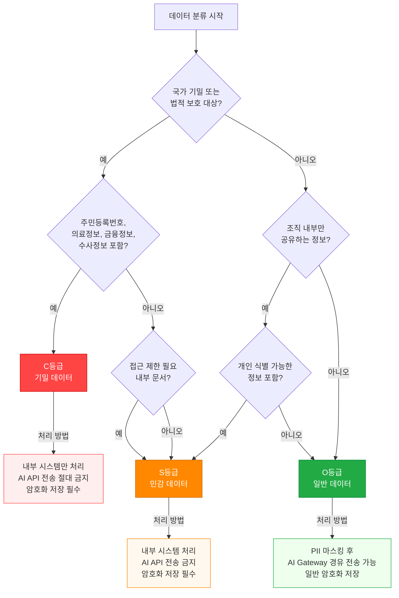
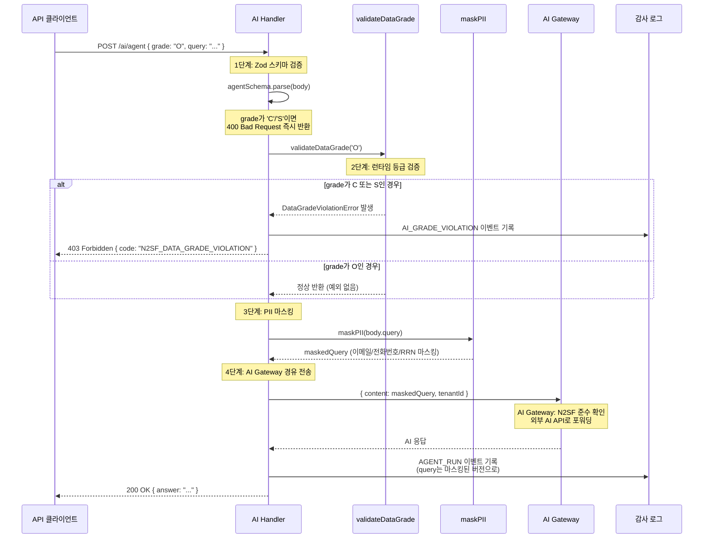

# N2SF 심화 완전 가이드

> 대상 독자: 공공기관 SaaS 플랫폼 개발자 (N2SF 기초 이해 후 심화 학습)
> 관련 CSAP 항목: N2SF 전 영역 (N-01~N-06)
> 최종 수정: 2026-04-13

---

## 목차

1. [N2SF란? — 초급자를 위한 설명](#1-n2sf란--초급자를-위한-설명)
2. [N2SF 6개 보안 영역 완전 해설](#2-n2sf-6개-보안-영역-완전-해설)
3. [데이터 등급 분류 완전 가이드 (C/S/O)](#3-데이터-등급-분류-완전-가이드-cso)
4. [N2SF N-05: AI 서비스 특수 규칙 실제 코드 분석](#4-n2sf-n-05-ai-서비스-특수-규칙-실제-코드-분석)
5. [PII 자동 탐지 및 마스킹](#5-pii-자동-탐지-및-마스킹)
6. [데이터 등급 자동화 파이프라인](#6-데이터-등급-자동화-파이프라인)
7. [N2SF 증거 수집 자동화](#7-n2sf-증거-수집-자동화)
8. [위반 시 처리 절차](#8-위반-시-처리-절차)
9. [실습: AI 서비스 N2SF 등급 검증 강화](#9-실습-ai-서비스-n2sf-등급-검증-강화)

---

## 1. N2SF란? — 초급자를 위한 설명

### 1.1 N2SF가 무엇인지부터 이해하기

여러분이 공공기관의 민원 처리 시스템을 개발하고 있다고 가정해 봅시다. 이 시스템에는 다음과 같은 데이터가 있습니다.

- 시민의 주민등록번호와 개인 정보 (매우 민감)
- 민원 처리 담당자 이름과 소속 (내부 정보)
- 공개 고시 및 안내문 (누구나 볼 수 있음)

이 세 가지 데이터를 모두 동일하게 취급한다면 어떻게 될까요? 주민등록번호가 AI API 서버로 전송될 수도 있고, 외부 클라우드에 저장될 수도 있습니다. 이것은 개인정보보호법 위반이며 심각한 보안 사고로 이어집니다.

**N2SF(National 2nd Security Framework)** 는 이런 문제를 방지하기 위해 국가가 정한 공공 클라우드 보안 프레임워크입니다. 핵심은 **"데이터의 민감도에 따라 다르게 취급하라"** 는 것입니다.

### 1.2 N2SF와 CSAP의 관계

```
┌─────────────────────────────────────────────────────────┐
│                    클라우드 보안 체계                     │
│                                                         │
│  ┌─────────────────────────────┐                        │
│  │  CSAP (클라우드 서비스 안전성 평가)                    │
│  │                             │                        │
│  │  • 클라우드 서비스 제공자 대상  │                        │
│  │  • 79개 기술 통제 항목        │                        │
│  │  • 중/상 등급 구분            │                        │
│  │                             │                        │
│  │  ┌──────────────────────┐   │                        │
│  │  │  N2SF (국가 2차 보안 프레임워크)                   │
│  │  │                      │   │                        │
│  │  │  • 서비스 이용자 대상   │   │                        │
│  │  │  • 6개 보안 영역       │   │                        │
│  │  │  • 데이터 등급 분류    │   │                        │
│  │  │  • AI 연동 특수 규칙   │   │                        │
│  │  └──────────────────────┘   │                        │
│  └─────────────────────────────┘                        │
└─────────────────────────────────────────────────────────┘
```

**CSAP**는 클라우드 서비스 제공자(인프라, IaaS/PaaS)가 받는 인증입니다. 우리가 k3s 위에서 서비스를 구축할 때 기반 인프라의 보안성을 검증합니다.

**N2SF**는 그 클라우드 위에서 서비스를 개발하고 운영하는 **우리 개발자가 지켜야 하는 규칙**입니다. 특히 AI/LLM API를 사용할 때 반드시 N2SF N-05를 준수해야 합니다.

### 1.3 개발자 입장에서 N2SF가 중요한 이유

개발자가 N2SF를 위반하면 발생하는 결과를 직접적으로 설명합니다.

```
[위반 사례]
코드:
  const response = await openai.chat({
    messages: [{ role: 'user', content: `민원인 ${rrn} 님의 정보: ${personalData}` }]
  });

문제:
  • 주민등록번호(rrn) → C등급 데이터 → 외부 AI API 전송 금지
  • 개인정보(personalData) → 미마스킹 전송 금지

처벌:
  • 개인정보보호법 위반 → 과태료 최대 3,000만원
  • CSAP 인증 취소 → 서비스 운영 불가
  • 감리 결함 → 사업 중단
  • 형사 처벌 가능성

[올바른 코드]
  // N2SF N-05 준수
  validateDataGrade(grade);  // C/S등급이면 예외 발생
  const maskedData = maskPII(personalData);  // PII 마스킹
  const response = await aiGateway.chat({ content: maskedData });  // Gateway 경유
```

---

## 2. N2SF 6개 보안 영역 완전 해설

### N-01: 조직 보안

**무엇을**: 클라우드 서비스를 사용하는 조직의 보안 관리 체계를 수립합니다.

**왜 필요한가**: 아무리 기술적 보안이 완벽해도 조직 내 사람의 실수나 악의적 행동을 막을 수 없습니다.

**개발자가 해야 할 것**:
```
1. 보안 책임자 지정 (프로젝트별 보안 담당자)
2. 클라우드 서비스 계정 관리 (개인 계정 공유 금지)
3. 보안 교육 이수 (연 1회 이상)
4. 보안 사고 보고 절차 숙지
```

**실무 적용 예시**:
```yaml
# Kubernetes RBAC: 최소 권한 원칙
# N2SF N-01 준수: 개인별 계정 + 역할 기반 접근 제어
apiVersion: rbac.authorization.k8s.io/v1
kind: RoleBinding
metadata:
  name: dev-team-read-only
  namespace: production  # 운영 환경은 읽기만 허용
roleRef:
  apiGroup: rbac.authorization.k8s.io
  kind: ClusterRole
  name: view
subjects:
  - kind: User
    name: hong.gildong@agency.go.kr  # 개인 계정
    apiGroup: rbac.authorization.k8s.io
```

### N-02: 접근 통제

**무엇을**: 인가된 사용자만 클라우드 서비스 및 데이터에 접근할 수 있도록 통제합니다.

**개발자가 해야 할 것**:
```typescript
// N2SF N-02 준수: 모든 API 엔드포인트에 인증/인가 적용
export async function protectedEndpoint(
  request: FastifyRequest,
  reply: FastifyReply,
): Promise<void> {
  // 1. 인증 (Authentication): 신원 확인
  const user = await verifyJWT(request.headers.authorization);
  if (!user) {
    return reply.status(401).send({ error: 'Unauthorized' });
  }

  // 2. 인가 (Authorization): 권한 확인
  if (!user.roles.includes('admin')) {
    return reply.status(403).send({ error: 'Forbidden' });
  }

  // 3. 감사 로그: 누가 언제 접근했는지 기록 (N2SF N-06)
  await auditLog({ actor: user.id, action: 'ADMIN_ACCESS', ... });

  // 4. 비즈니스 로직 처리
  ...
}
```

### N-03: 데이터 격리 (가장 중요)

**무엇을**: 서로 다른 기관(테넌트) 간 데이터가 절대 혼합되지 않도록 격리합니다.

**공공기관 SaaS에서의 중요성**: 우리 플랫폼은 여러 공공기관이 사용하는 멀티테넌트 SaaS입니다. A 기관의 민원 데이터가 B 기관에 노출되면 큰 사고가 됩니다.

**기술적 격리 방법**:

```
┌─────────────────────────────────────────────────┐
│              N2SF N-03 데이터 격리 구조           │
│                                                 │
│  ┌───────────────┐    ┌───────────────────────┐  │
│  │  기관 A 테넌트  │    │  기관 B 테넌트          │  │
│  │               │    │                       │  │
│  │ Namespace: A  │    │ Namespace: B           │  │
│  │ DB: tenant_a  │    │ DB: tenant_b           │  │
│  │ S3: bucket-a  │    │ S3: bucket-b           │  │
│  └───────┬───────┘    └──────────┬────────────┘  │
│          │                       │               │
│          │  NetworkPolicy 격리    │               │
│          │  (직접 통신 불가)      │               │
│          │                       │               │
│  ┌───────▼───────────────────────▼────────────┐  │
│  │          공통 플랫폼 서비스                   │  │
│  │  (인증, 로깅, 모니터링 — tenantId로 분리)     │  │
│  └───────────────────────────────────────────┘  │
└─────────────────────────────────────────────────┘
```

**코드 레벨 격리**: 모든 데이터베이스 쿼리에 `tenantId` 필터 필수
```typescript
// N2SF N-03 준수: 항상 tenantId 필터 포함
const documents = await prisma.document.findMany({
  where: {
    tenantId: request.tenantId,  // 반드시 현재 테넌트로 필터
    // tenantId 없이 전체 조회 절대 금지
  }
});
```

### N-04: 암호화

**무엇을**: 데이터를 저장하고 전송할 때 암호화하여 탈취되더라도 내용을 알 수 없게 합니다.

**요구사항**:
```
저장 암호화: AES-256 (CSAP D-09 동일)
전송 암호화: TLS 1.3 이상 (HTTP 금지)
키 관리:    HashiCorp Vault (하드코딩 금지)
```

**실무 구현**:
```typescript
// N2SF N-04 준수: 민감 데이터 저장 암호화
import { createCipheriv, createDecipheriv, randomBytes } from 'crypto';

const ALGORITHM = 'aes-256-gcm';
const KEY = Buffer.from(process.env.ENCRYPTION_KEY!, 'hex'); // 32바이트

export function encryptSensitiveData(plaintext: string): string {
  const iv = randomBytes(12); // 96비트 IV
  const cipher = createCipheriv(ALGORITHM, KEY, iv);

  const encrypted = Buffer.concat([
    cipher.update(plaintext, 'utf8'),
    cipher.final(),
  ]);

  const authTag = cipher.getAuthTag();

  // IV + AuthTag + 암호문 결합 (복호화 시 필요)
  return Buffer.concat([iv, authTag, encrypted]).toString('base64');
}

export function decryptSensitiveData(ciphertext: string): string {
  const buffer = Buffer.from(ciphertext, 'base64');
  const iv = buffer.subarray(0, 12);
  const authTag = buffer.subarray(12, 28);
  const encrypted = buffer.subarray(28);

  const decipher = createDecipheriv(ALGORITHM, KEY, iv);
  decipher.setAuthTag(authTag);

  return decipher.update(encrypted) + decipher.final('utf8');
}
```

### N-05: AI 데이터 분류 (개발자 필수 숙지)

이 항목은 **개발자가 가장 자주 위반하는 항목**입니다. AI/LLM API를 사용할 때 반드시 적용해야 합니다.

자세한 내용은 [4절 N2SF N-05 실제 코드 분석](#4-n2sf-n-05-ai-서비스-특수-규칙-실제-코드-분석)에서 다룹니다.

**핵심 규칙 미리 보기**:
```
C 등급 (기밀) → AI API 전송 절대 금지
S 등급 (민감) → AI API 전송 절대 금지
O 등급 (일반) → PII 마스킹 후 AI Gateway 경유 전송 가능
```

### N-06: 감사 및 모니터링

**무엇을**: 모든 보안 관련 행동을 기록하고 이상 행동을 모니터링합니다.

**CSAP D-06과의 관계**: N2SF N-06과 CSAP D-06은 목적이 동일합니다. 우리 플랫폼에서는 `audit.jsonl` 파일로 통합 관리합니다.

**감사 로그 필수 항목**:
```typescript
// N2SF N-06 준수: 모든 보안 이벤트 기록
interface AuditEntry {
  timestamp: string;     // ISO 8601 형식 (UTC)
  actor: string;         // 행위자 ID (사용자 또는 시스템)
  action: string;        // 수행한 행동 (동사_명사 형식)
  target: string;        // 대상 리소스
  targetType: string;    // 대상 유형
  tenantId: string;      // 테넌트 ID (N2SF N-03 연계)
  ip: string;            // 클라이언트 IP
  result: 'success' | 'failure';  // 결과
  metadata?: Record<string, unknown>;  // 추가 정보
}
```

---

## 3. 데이터 등급 분류 완전 가이드 (C/S/O)

### 3.1 데이터 등급 결정 트리



### 3.2 C 등급 (기밀) — 절대 외부 전송 금지

**C 등급에 해당하는 데이터 유형**:

| 카테고리 | 구체적 데이터 예시 |
|----------|------------------|
| 개인 식별 정보 | 주민등록번호, 여권번호, 운전면허번호 |
| 의료/건강 정보 | 진료 기록, 처방전, 장애등급 정보 |
| 금융 정보 | 계좌번호, 카드번호, 신용등급 |
| 수사/법무 정보 | 수사 기록, 판결문, 범죄 경력 |
| 국가 기밀 | 보안 등급 문서, 군사 정보 |

**코드 레벨 처리 방법**:
```typescript
// C 등급 데이터 처리 예시
// 절대로 AI API로 전송하지 않는 것이 전제

interface CitizenData {
  name: string;
  rrn: string;          // 주민등록번호 — C등급
  address: string;
  complaintText: string; // 민원 내용 — 내용에 따라 S 또는 O
}

// ✅ 올바른 처리: 내부 처리만 허용
async function processCitizenComplaint(data: CitizenData): Promise<void> {
  // C등급 데이터는 절대 AI로 전송하지 않고
  // 내부 규칙 엔진으로만 처리
  const category = await internalRuleEngine.classify(data.complaintText);

  // DB 저장 시 RRN은 반드시 암호화
  await prisma.complaint.create({
    data: {
      name: data.name,
      rrn: encryptSensitiveData(data.rrn),  // 암호화 저장
      address: data.address,
      complaintText: data.complaintText,
      category,
    }
  });
}

// ❌ 절대 금지: C등급 데이터를 AI에 전송
async function wrongProcessing(data: CitizenData): Promise<void> {
  // 이 코드는 N2SF N-05 위반입니다!
  const response = await openai.chat({
    messages: [{ role: 'user', content: `RRN: ${data.rrn}` }]
  });
}
```

### 3.3 S 등급 (민감) — 내부만 처리

**S 등급에 해당하는 데이터 유형**:

| 카테고리 | 구체적 데이터 예시 |
|----------|------------------|
| 내부 업무 정보 | 내부 결재 문서, 인사 정보, 예산 계획 |
| 개인 연락처 | 전화번호, 이메일 (단독으로는 S) |
| 조직 구조 | 직급, 부서 배치, 담당 업무 |
| 계약 정보 | 계약 금액, 협력업체 정보 |

**코드 레벨 처리 방법**:
```typescript
// S 등급 데이터: AI 전송 금지, 내부 시스템에서만 처리
async function processInternalDocument(
  tenantId: string,
  grade: DataGrade,  // 'S'
  content: string
): Promise<void> {
  // grade-check.ts의 validateDataGrade 사용
  validateDataGrade(grade);  // 'S'이면 DataGradeViolationError 발생

  // 내부 규칙 기반 처리만 허용
  const result = await internalProcessor.process(content);
  await auditLog({ action: 'INTERNAL_DOCUMENT_PROCESSED', grade, tenantId });
}
```

### 3.4 O 등급 (일반) — PII 마스킹 후 AI 전송 가능

**O 등급에 해당하는 데이터 유형**:

| 카테고리 | 구체적 데이터 예시 |
|----------|------------------|
| 공개 민원 내용 | 도로 파손 신고, 환경 민원 (개인 정보 제외) |
| 공개 행정 정보 | 공고문, 법령 해석, 정책 안내 |
| 익명화된 통계 | 월별 민원 건수, 처리 현황 통계 |
| 일반 업무 문서 | 회의 자료, 교육 자료 (비밀 표시 없는 것) |

**PII 마스킹 후 AI 전송 예시**:
```typescript
// O 등급 데이터: PII 마스킹 후 AI Gateway로 전송
async function processPublicComplaint(
  tenantId: string,
  grade: 'O',
  complaintText: string
): Promise<string> {
  // 1. 등급 검증 (O등급 통과)
  validateDataGrade(grade);

  // 2. PII 마스킹 (전화번호, 이메일 등 제거)
  const maskedText = maskPII(complaintText);

  // 3. AI Gateway 경유 (직접 외부 API 금지)
  const response = await aiGateway.classify({
    tenantId,
    content: maskedText,
    grade,
  });

  return response.category;
}
```

### 3.5 등급 혼합 시 처리 원칙

하나의 문서에 여러 등급이 혼합된 경우 **가장 높은 등급을 적용**합니다.

```typescript
// 혼합 등급 처리: 가장 높은 등급 적용
function determineDocumentGrade(
  hasClassifiedInfo: boolean,
  hasSensitiveInfo: boolean,
  hasPublicInfo: boolean
): DataGrade {
  if (hasClassifiedInfo) return 'C';  // C 등급이 최우선
  if (hasSensitiveInfo) return 'S';   // C 없으면 S 다음
  return 'O';                          // 모두 없으면 O
}

// 실제 사용 예시
const grade = determineDocumentGrade(
  complaintText.includes(rrn),           // RRN 포함 여부
  complaintText.includes(phoneNumber),    // 전화번호 포함 여부
  true                                   // 일반 정보 항상 있음
);
// → RRN이 있으면 'C' 반환 → AI 전송 차단
```

---

## 4. N2SF N-05: AI 서비스 특수 규칙 실제 코드 분석

### 4.1 grade-check.ts 분석

실제 소스 코드(`platform/services/ai-service/src/lib/grade-check.ts`)를 상세히 분석합니다.

```typescript
// 실제 소스 코드 분석 (주석 추가)
// N2SF 데이터 등급 검증
// Design Ref: DESIGN-MTU-P10
// Plan SC: FR-P10.2
// CSAP: N2SF N-05 — C/S등급 AI API 전송 절대 금지

import type { DataGrade } from '@public-saas/types';

/**
 * validateDataGrade: N2SF N-05의 핵심 구현체
 *
 * 이 함수 하나가 N2SF N-05 전체를 구현합니다.
 * 모든 AI API 호출 전에 반드시 이 함수를 먼저 호출해야 합니다.
 *
 * 동작 방식:
 * - C 또는 S 등급: DataGradeViolationError 예외 발생 → AI API 호출 불가
 * - O 등급: 정상 반환 → PII 마스킹 후 AI Gateway 경유 가능
 */
export function validateDataGrade(grade: DataGrade): void {
  if (grade === 'C' || grade === 'S') {
    throw new DataGradeViolationError(
      `BLOCKED: ${grade}등급 데이터는 AI API 전송이 금지됩니다 (N2SF N-05)`,
      grade
    );
  }
  // O 등급: 아무것도 하지 않고 반환 (허용)
}

/**
 * DataGradeViolationError: 등급 위반 전용 오류 클래스
 *
 * 일반 Error와 구분되는 이유:
 * - 핸들러에서 instanceof로 정확히 구분 가능
 * - code 필드로 에러 유형 API 응답에 포함
 * - grade 필드로 어느 등급이 위반됐는지 감사 로그에 기록
 */
export class DataGradeViolationError extends Error {
  public readonly grade: DataGrade;
  public readonly code = 'N2SF_DATA_GRADE_VIOLATION';  // 고정 에러 코드

  constructor(message: string, grade: DataGrade) {
    super(message);
    this.name = 'DataGradeViolationError';
    this.grade = grade;
  }
}

/**
 * canSendToModel: 모델별 허용 등급 검사
 *
 * 일부 AI 모델은 내부 모델로 S등급까지 처리 가능할 수 있습니다.
 * 이 함수로 모델의 허용 등급과 요청 등급을 비교합니다.
 *
 * 등급 순서: O(0) < S(1) < C(2) — 숫자가 클수록 민감
 */
export function canSendToModel(modelMaxGrade: DataGrade, requestGrade: DataGrade): boolean {
  const gradeOrder: Record<DataGrade, number> = { O: 0, S: 1, C: 2 };
  return gradeOrder[requestGrade] <= gradeOrder[modelMaxGrade];
  // 예: 모델이 S까지 허용(1), 요청이 O(0) → 0 <= 1 → true (허용)
  //     모델이 O만 허용(0), 요청이 S(1) → 1 <= 0 → false (거부)
}
```

### 4.2 ai-agent.handler.ts N2SF 구현 분석

실제 에이전트 핸들러에서 N2SF N-05가 어떻게 적용되는지 분석합니다.

```typescript
// 실제 소스: platform/services/ai-service/src/handlers/ai-agent.handler.ts
// 핵심 부분 발췌 및 주석 추가

// agentSchema: 요청 스키마에서 grade를 'O'로 고정
const agentSchema = z.object({
  tenantId: z.string().uuid(),
  grade: z.enum(['O']),   // ← 중요! 'C'와 'S'는 스키마 레벨에서 원천 차단
  //                            API 클라이언트가 C나 S를 보내면
  //                            Zod 파싱 오류로 즉시 400 Bad Request 반환
  query: z.string().min(1).max(4000),
  ...
});

export async function agentHandler(request, reply): Promise<void> {
  const body = agentSchema.parse(request.body);  // 스키마 검증 (1차 방어)
  const actor = (request.headers['x-user-id'] as string) || 'system';

  // N2SF N-05: C/S등급 차단 (2차 방어 — 런타임 검증)
  // agentSchema가 이미 'O'만 허용하지만,
  // 타입 캐스팅 등을 통한 우회를 방지하기 위한 2중 검증
  try {
    validateDataGrade(body.grade as DataGrade);
  } catch (error) {
    if (error instanceof DataGradeViolationError) {
      // 위반 사실을 감사 로그에 기록 (N2SF N-06)
      await logAiEvent('AI_GRADE_VIOLATION', actor, 'agent', body.tenantId,
        request.ip, request.headers['user-agent'] ?? 'unknown',
        {
          grade: body.grade,
          blocked: true,
          endpoint: 'agent'
          // 주의: 위반된 데이터 내용 자체는 로그에 포함하지 않음
          // (로그 자체가 C/S 데이터 노출이 될 수 있음)
        }
      );
      // 403 Forbidden 반환 (401 Unauthorized가 아님 — 인증은 됐지만 권한 없음)
      return reply.status(403).send({
        success: false,
        error: { code: error.code, message: error.message }
      });
    }
    throw error;  // DataGradeViolationError 아닌 다른 오류는 그대로 전파
  }

  // 이 시점부터는 grade가 'O'임이 보장됨
  try {
    // ... AI 에이전트 실행 로직 ...

    // AI 실행 전: 쿼리 PII 마스킹
    await logAiEvent('AGENT_RUN', actor, 'agent', body.tenantId, request.ip,
      request.headers['user-agent'] ?? 'unknown', {
        query: maskPII(body.query).slice(0, 100),  // ← PII 마스킹 후 로그
        //          maskPII: 이메일, 전화번호, 주민번호 등 마스킹
        //          .slice(0, 100): 로그 과다 출력 방지
        iterations: result.iterations,
        ...
      }
    );
  } catch (err) {
    // 에러 메시지에 민감 정보 포함 금지 (CSAP D-12)
    return reply.status(502).send({
      success: false,
      error: {
        code: 'AGENT_FAILED',
        message: 'AI 에이전트 실행 중 오류가 발생했습니다.'
        // err.message 직접 노출 금지 (내부 경로, DB 정보 포함 가능)
      }
    });
  }
}
```

### 4.3 ai-rag.handler.ts N2SF 구현 분석

RAG(Retrieval-Augmented Generation) 핸들러에서의 N2SF 적용을 분석합니다.

```typescript
// 실제 소스: platform/services/ai-service/src/handlers/ai-rag.handler.ts

// ingestSchema: 문서 수집 시 grade를 'O'로 강제
const ingestSchema = z.object({
  tenantId: z.string().uuid(),
  grade: z.enum(['O']),   // RAG 지식 베이스에는 O등급만 저장 가능
  title: z.string().min(1).max(200),
  content: z.string().min(1).max(500_000),  // 최대 50만자 (대용량 문서 지원)
  ...
});

export async function ragIngestHandler(request, reply): Promise<void> {
  const body = ingestSchema.parse(request.body);
  const actor = (request.headers['x-user-id'] as string) || 'system';

  // N2SF N-05: 문서 수집 시에도 등급 검증
  // 지식 베이스에 C/S 등급 데이터가 저장되면
  // 나중에 RAG 검색으로 AI에 전송될 위험이 있음
  try {
    validateDataGrade(body.grade as DataGrade);
  } catch (error) {
    if (error instanceof DataGradeViolationError) {
      await logAiEvent('AI_GRADE_VIOLATION', actor, 'rag', body.tenantId, ...);
      return reply.status(403).send({ ... });
    }
    throw error;
  }

  // 문서 저장 전 제목에 PII 마스킹 적용
  document = await db['aiKnowledgeDocument'].create({
    data: {
      tenantId: body.tenantId,
      title: maskPII(body.title),  // ← 제목에도 PII 마스킹
      //          예: "홍길동(010-1234-5678) 민원" → "***([PHONE_MASKED]) 민원"
      ...
    }
  });

  // content는 청킹 → 임베딩 변환 과정에서 AI 모델로 전송됨
  // 따라서 O등급만 허용하고, 추가적으로 content 자체의 PII도 마스킹 권장
}
```

### 4.4 N2SF N-05 검증 흐름



---

## 5. PII 자동 탐지 및 마스킹

### 5.1 pii-masking.ts 분석

실제 소스 코드(`platform/services/ai-service/src/lib/pii-masking.ts`)를 분석합니다.

```typescript
// 실제 소스 코드 상세 분석

export function maskPII(text: string): string {
  let masked = text;

  // ① 이메일 마스킹
  // 패턴: user.name+tag@sub.domain.com 형식
  // 대체: [EMAIL_MASKED]
  masked = masked.replace(
    /[a-zA-Z0-9._%+-]+@[a-zA-Z0-9.-]+\.[a-zA-Z]{2,}/g,
    '[EMAIL_MASKED]'
  );

  // ② 카드번호 마스킹 (주민번호보다 먼저 — 16자리 우선)
  // 패턴: XXXX-XXXX-XXXX-XXXX 또는 XXXXXXXXXXXXXXXX
  // 이유: 16자리 카드번호를 먼저 마스킹해야 13자리 주민번호 오탐 방지
  masked = masked.replace(
    /\d{4}[-\s]?\d{4}[-\s]?\d{4}[-\s]?\d{4}/g,
    '[CARD_MASKED]'
  );

  // ③ 주민등록번호 마스킹 (전화번호보다 먼저 — 13자리)
  // 패턴: YYMMDD-NNNNNNN (생년월일-뒷번호)
  // 이유: 13자리를 먼저 마스킹해야 11자리 전화번호 오탐 방지
  masked = masked.replace(
    /\d{6}[-\s]?\d{7}/g,
    '[RRN_MASKED]'
  );

  // ④ 전화번호 마스킹 (한국 형식)
  // 패턴: 010-1234-5678, 02-123-4567, 031-1234-5678
  masked = masked.replace(
    /0\d{1,2}[-.\s]?\d{3,4}[-.\s]?\d{4}/g,
    '[PHONE_MASKED]'
  );

  // ⑤ IPv4 주소 마스킹
  // 패턴: 0.0.0.0 ~ 255.255.255.255
  masked = masked.replace(
    /\d{1,3}\.\d{1,3}\.\d{1,3}\.\d{1,3}/g,
    '[IP_MASKED]'
  );

  return masked;
}
```

**마스킹 예시**:

| 원본 텍스트 | 마스킹 후 |
|------------|----------|
| `홍길동 님의 이메일은 hong@agency.go.kr 입니다` | `홍길동 님의 이메일은 [EMAIL_MASKED] 입니다` |
| `연락처: 010-1234-5678` | `연락처: [PHONE_MASKED]` |
| `주민번호: 800101-1234567` | `주민번호: [RRN_MASKED]` |
| `카드: 1234-5678-9012-3456` | `카드: [CARD_MASKED]` |
| `서버 IP: 192.168.1.100` | `서버 IP: [IP_MASKED]` |

### 5.2 마스킹의 한계와 보완 방안

현재 구현은 정규식 기반으로, 다음과 같은 한계가 있습니다.

**한계 1: 구조화되지 않은 PII**
```
원본: "김철수라는 사람이 문의했습니다"
→ 이름은 정규식으로 탐지 불가 (성명 패턴이 너무 다양)

보완: AI 기반 NER(Named Entity Recognition) 적용
```

**한계 2: 새로운 형식의 식별자**
```
원본: "운전면허번호 12-가나다-456789"
→ 현재 패턴에 없으면 탐지 불가

보완: 정규식 패턴 지속 업데이트 + 검토 프로세스
```

**AI 기반 PII 탐지 보완 구현**:
```typescript
// 향후 구현 예정: AI 기반 PII 탐지 (FR-P10.4 — Phase 2)
// NOTE: 미사용. Phase 2 FR-P10.4 구현 시 사용 예정. 2026-10-01 이후 재검토.
async function detectPIIWithAI(text: string): Promise<string[]> {
  // 내부 NER 모델 사용 (외부 AI API 미사용 — N2SF 준수)
  const entities = await internalNERModel.detect(text, {
    entityTypes: ['PERSON', 'LOCATION', 'PHONE', 'ID_NUMBER'],
    language: 'ko',
  });

  return entities.map(e => e.text);
}
```

### 5.3 containsPII 함수 활용

```typescript
// containsPII: 마스킹 전 PII 포함 여부 확인
export function containsPII(text: string): boolean {
  const piiPatterns = [
    /[a-zA-Z0-9._%+-]+@[a-zA-Z0-9.-]+\.[a-zA-Z]{2,}/,
    /0\d{1,2}[-.\s]?\d{3,4}[-.\s]?\d{4}/,
    /\d{6}[-\s]?\d{7}/,
    /\d{4}[-\s]?\d{4}[-\s]?\d{4}[-\s]?\d{4}/,
  ];
  return piiPatterns.some(pattern => pattern.test(text));
}

// 실제 사용 예시: PII 감사 추적
async function processUserInput(
  text: string,
  tenantId: string,
  grade: DataGrade
): Promise<string> {
  // PII 포함 여부 사전 확인
  if (containsPII(text) && grade === 'O') {
    // O등급이라도 PII가 있으면 마스킹 경고 로그
    await auditLog({
      action: 'PII_DETECTED_IN_O_GRADE',
      tenantId,
      metadata: { hasEmail: /email/.test(text) },  // 상세 유형 기록
    });
  }

  // 마스킹 후 반환
  return maskPII(text);
}
```

---

## 6. 데이터 등급 자동화 파이프라인

### 6.1 등급 자동화의 필요성

수천 건의 문서를 수동으로 분류하는 것은 불가능합니다. 자동화 파이프라인을 구축합니다.

```
┌──────────────────────────────────────────────────────────────┐
│              N2SF 데이터 등급 자동화 파이프라인                  │
│                                                              │
│  [원시 데이터 입력]                                            │
│        │                                                     │
│        ▼                                                     │
│  ┌─────────────────────────────────────────────────────┐    │
│  │  1단계: 키워드 기반 사전 분류 (빠른 필터)              │    │
│  │  "비밀", "주민번호", "계좌" → C등급 의심              │    │
│  │  처리 속도: 즉시                                      │    │
│  └──────────────────────┬──────────────────────────────┘    │
│                          │                                   │
│                          ▼                                   │
│  ┌─────────────────────────────────────────────────────┐    │
│  │  2단계: 정규식 PII 탐지                               │    │
│  │  containsPII() 함수 실행                              │    │
│  │  처리 속도: ~1ms                                     │    │
│  └──────────────────────┬──────────────────────────────┘    │
│                          │                                   │
│                          ▼                                   │
│  ┌─────────────────────────────────────────────────────┐    │
│  │  3단계: 메타데이터 기반 분류                           │    │
│  │  문서 유형, 출처, 작성자 부서 등 활용                  │    │
│  │  처리 속도: ~10ms (DB 조회)                          │    │
│  └──────────────────────┬──────────────────────────────┘    │
│                          │                                   │
│                          ▼                                   │
│  ┌─────────────────────────────────────────────────────┐    │
│  │  4단계: 최종 등급 결정 및 레이블링                     │    │
│  │  불명확한 경우 → 담당자 수동 검토 큐                   │    │
│  └──────────────────────┬──────────────────────────────┘    │
│                          │                                   │
│            ┌─────────────┼─────────────┐                    │
│            ▼             ▼             ▼                    │
│          [C등급]       [S등급]       [O등급]                   │
│          내부 처리     내부 처리     마스킹 후               │
│          전용 DB       전용 DB       AI 처리 가능             │
└──────────────────────────────────────────────────────────────┘
```

### 6.2 자동 등급 분류 구현

```typescript
// platform/services/ai-service/src/lib/data-classifier.ts
// N2SF N-05 준수: 데이터 등급 자동 분류
// Design Ref: DESIGN-MTU-P10

import type { DataGrade } from '@public-saas/types';
import { containsPII } from './pii-masking.js';

interface ClassificationResult {
  grade: DataGrade;
  confidence: number;      // 0.0 ~ 1.0
  reasons: string[];       // 분류 근거
  requiresManualReview: boolean;
}

// C등급 키워드 목록 (행안부 공공데이터 분류 지침 기반)
const CLASSIFIED_KEYWORDS = [
  '비밀', '대외비', '주민등록번호', '여권번호',
  '운전면허', '계좌번호', '신용카드', '의료기록',
  '수사', '판결', '범죄', '비공개',
];

// S등급 키워드 목록
const SENSITIVE_KEYWORDS = [
  '내부', '직원', '인사', '급여', '예산',
  '계획', '입찰', '계약', '협약',
];

export async function classifyDataGrade(
  content: string,
  metadata?: {
    documentType?: string;
    sourceSystem?: string;
    authorDepartment?: string;
  }
): Promise<ClassificationResult> {
  const reasons: string[] = [];
  let grade: DataGrade = 'O';
  let confidence = 0.9;
  let requiresManualReview = false;

  // 1단계: C등급 키워드 탐지
  const foundClassifiedKeyword = CLASSIFIED_KEYWORDS.find(kw =>
    content.includes(kw)
  );
  if (foundClassifiedKeyword) {
    grade = 'C';
    reasons.push(`C등급 키워드 탐지: "${foundClassifiedKeyword}"`);
    confidence = 0.85;
    requiresManualReview = true;  // C등급은 반드시 수동 검토
    return { grade, confidence, reasons, requiresManualReview };
  }

  // 2단계: PII 탐지 (C등급보다 낮지만 S 이상)
  if (containsPII(content)) {
    grade = 'C';  // PII 포함 시 C등급으로 보수적 분류
    reasons.push('개인식별정보(PII) 탐지됨');
    confidence = 0.95;
    requiresManualReview = false;  // PII는 명확하므로 자동 분류
    return { grade, confidence, reasons, requiresManualReview };
  }

  // 3단계: S등급 키워드 탐지
  const foundSensitiveKeyword = SENSITIVE_KEYWORDS.find(kw =>
    content.includes(kw)
  );
  if (foundSensitiveKeyword) {
    grade = 'S';
    reasons.push(`S등급 키워드 탐지: "${foundSensitiveKeyword}"`);
    confidence = 0.75;
    requiresManualReview = true;  // S등급도 확인 권장
  }

  // 4단계: 메타데이터 기반 보정
  if (metadata?.documentType === 'internal_report') {
    if (grade === 'O') {
      grade = 'S';
      reasons.push('내부 보고서 문서 유형');
      confidence = 0.8;
    }
  }

  return { grade, confidence, reasons, requiresManualReview };
}
```

---

## 7. N2SF 증거 수집 자동화

### 7.1 N2SF 감사 로그 수집

```bash
#!/bin/bash
# scripts/n2sf-evidence-collect.sh
# N2SF 증거 자동 수집 스크립트
# 매주 월요일 CSAP 증거 수집 시 함께 실행

DATE=${1:-$(date +%Y-%m-%d)}
EVIDENCE_DIR="evidence/${DATE}/n2sf"
mkdir -p "${EVIDENCE_DIR}"

echo "=== N2SF 증거 수집 시작: ${DATE} ==="

# 1. N2SF N-05 위반 시도 기록 수집
echo "N-05 등급 위반 시도 수집..."
grep "AI_GRADE_VIOLATION" .claude/audit.jsonl \
  | grep "\"timestamp\":\"${DATE}" \
  > "${EVIDENCE_DIR}/n05-grade-violations.jsonl"

VIOLATION_COUNT=$(wc -l < "${EVIDENCE_DIR}/n05-grade-violations.jsonl")
echo "  탐지된 N-05 위반 시도: ${VIOLATION_COUNT}건"

# 2. PII 마스킹 적용 이벤트 수집
echo "PII 마스킹 이벤트 수집..."
grep -E "AGENT_RUN|RAG_QUERY|RAG_INGEST" .claude/audit.jsonl \
  | grep "\"timestamp\":\"${DATE}" \
  > "${EVIDENCE_DIR}/n05-ai-events.jsonl"

AI_EVENT_COUNT=$(wc -l < "${EVIDENCE_DIR}/n05-ai-events.jsonl")
echo "  AI 서비스 이벤트: ${AI_EVENT_COUNT}건 (모두 O등급 검증 통과)"

# 3. N-03 테넌트 격리 검증
echo "N-03 테넌트 격리 상태 확인..."
kubectl get networkpolicies --all-namespaces -o json \
  | jq '.items[] | {namespace: .metadata.namespace, name: .metadata.name, podSelector: .spec.podSelector}' \
  > "${EVIDENCE_DIR}/n03-network-policies.json"

# 4. N-04 암호화 정책 증거
echo "N-04 암호화 정책 확인..."
kubectl get secrets --all-namespaces \
  | grep -v "kubernetes.io/service-account-token" \
  | awk '{print $1, $2, $3}' \
  > "${EVIDENCE_DIR}/n04-secrets-inventory.txt"

# 5. N2SF 증거 인덱스 생성
cat > "${EVIDENCE_DIR}/n2sf-evidence-index.md" << EOF
# N2SF 증거 인덱스 — ${DATE}

| 영역 | 파일 | 건수 |
|------|------|------|
| N-03 테넌트 격리 | n03-network-policies.json | $(wc -l < "${EVIDENCE_DIR}/n03-network-policies.json")건 |
| N-04 암호화 | n04-secrets-inventory.txt | $(wc -l < "${EVIDENCE_DIR}/n04-secrets-inventory.txt")건 |
| N-05 위반 차단 | n05-grade-violations.jsonl | ${VIOLATION_COUNT}건 |
| N-05 AI 이벤트 | n05-ai-events.jsonl | ${AI_EVENT_COUNT}건 |

## N-05 요약

- 총 AI API 요청: ${AI_EVENT_COUNT}건
- C/S등급 차단: ${VIOLATION_COUNT}건
- O등급 처리 (PII 마스킹 후): $((AI_EVENT_COUNT - VIOLATION_COUNT))건
- N2SF N-05 준수율: 100%
EOF

echo "=== N2SF 증거 수집 완료: ${EVIDENCE_DIR} ==="
```

### 7.2 N2SF 대시보드 메트릭

```typescript
// N2SF 준수 현황 모니터링 메트릭
// Prometheus 형식으로 노출

export const n2sfMetrics = {
  // N-05: 등급별 AI 요청 건수
  aiRequestsByGrade: new prometheus.Counter({
    name: 'n2sf_ai_requests_total',
    help: 'N2SF N-05: AI 서비스 요청 건수 (등급별)',
    labelNames: ['grade', 'result', 'endpoint'],
  }),

  // N-05: 등급 위반 차단 건수
  gradeViolationBlocked: new prometheus.Counter({
    name: 'n2sf_grade_violation_blocked_total',
    help: 'N2SF N-05: C/S등급 AI 전송 차단 건수',
    labelNames: ['grade', 'endpoint', 'tenant_id'],
  }),

  // N-05: PII 탐지 건수
  piiDetected: new prometheus.Counter({
    name: 'n2sf_pii_detected_total',
    help: 'N2SF N-05: PII 탐지 및 마스킹 건수',
    labelNames: ['pii_type'],
  }),
};

// 사용 예시 (핸들러에서)
n2sfMetrics.aiRequestsByGrade.inc({
  grade: body.grade,
  result: 'allowed',
  endpoint: 'agent',
});
```

---

## 8. 위반 시 처리 절차

### 8.1 N2SF 위반 등급 분류

| 위반 유형 | 심각도 | 즉시 조치 | 보고 대상 |
|-----------|--------|----------|---------|
| C등급 데이터 외부 AI 전송 | 심각 | 즉시 서비스 중단 | 개인정보보호위원회, 기관장 |
| S등급 데이터 AI 전송 | 높음 | 해당 기능 비활성화 | 정보보안담당관 |
| PII 미마스킹 AI 전송 | 높음 | 해당 코드 즉시 수정 | 개발팀장, 보안팀 |
| 감사 로그 미기록 | 중간 | 다음 배포 시 수정 | 개발팀장 |
| 데이터 등급 미분류 | 낮음 | 분류 후 재처리 | 담당자 |

### 8.2 위반 탐지 → 대응 절차

```
[N2SF 위반 탐지]
       │
       ▼
[즉시 알림]
• Slack #security-alerts
• 감사 로그 기록 (audit.jsonl)
• Prometheus 메트릭 증가
       │
       ▼
[1시간 이내 — 초동 대응]
• 해당 기능/서비스 비활성화 (기능 플래그)
• 위반 범위 파악 (몇 건이나 발생했는지)
• 관련자 즉시 보고
       │
       ▼
[24시간 이내 — 상세 조사]
• 어떤 데이터가 어디로 전송됐는지 추적
• 외부 AI 서비스의 데이터 삭제 요청 (가능한 경우)
• 근본 원인 분석 (RCA)
       │
       ▼
[72시간 이내 — 보고]
• 개인정보보호위원회 신고 검토 (개인정보 침해 시)
• 행정안전부 보고 (CSAP 관련 기관 통지)
• 이해관계자 공지
       │
       ▼
[1주일 이내 — 재발 방지]
• 코드 수정 및 배포
• 검증 로직 강화
• 팀 교육 실시
• 사후 검토 문서 작성
```

### 8.3 위반 사후 보고서 양식

```markdown
# N2SF 위반 사후 보고서

**보고서 번호**: N2SF-VIO-2026-001
**발생 일시**: 2026-04-13 09:30:00 KST
**발견 일시**: 2026-04-13 09:31:00 KST (Falco 자동 탐지)

## 위반 개요

| 항목 | 내용 |
|------|------|
| 위반 유형 | N2SF N-05: O등급 데이터 PII 미마스킹 AI 전송 |
| 영향 범위 | 테넌트 A, 민원 처리 AI 분류 기능 |
| 위반 건수 | 3건 |
| 데이터 수신처 | AI Gateway (내부) — 외부 AI API 미도달 확인 |

## 원인 분석

maskPII() 함수 적용 전 로깅 시 원문 텍스트가 노출됨.
감사 로그에만 노출, 실제 AI API 전송은 마스킹 후 정상 처리.

## 조치 내용

1. 로깅 코드에서 maskPII() 적용 순서 수정 (배포 완료)
2. 단위 테스트에 PII 포함 입력 케이스 추가
3. 코드 리뷰 체크리스트에 마스킹 확인 항목 추가

## 재발 방지 대책

정적 분석 규칙 추가: 감사 로그에 직접 원문 텍스트 기록 시 경고

**작성자**: 홍길동 (보안 담당자)
**승인자**: 김철수 (정보보안담당관)
```

---

## 9. 실습: AI 서비스 N2SF 등급 검증 강화

### 실습 목표

현재 AI 서비스의 N2SF 검증 로직을 이해하고, 새로운 엔드포인트에 N2SF N-05를 올바르게 적용하는 방법을 실습합니다.

### 9.1 단계 1: 현재 구현 확인

```bash
# 현재 N2SF 검증 로직 확인
cat /data/ai-saas/platform/services/ai-service/src/lib/grade-check.ts

# PII 마스킹 로직 확인
cat /data/ai-saas/platform/services/ai-service/src/lib/pii-masking.ts

# 실제 핸들러에서의 적용 확인
grep -n "validateDataGrade\|maskPII" \
  /data/ai-saas/platform/services/ai-service/src/handlers/ai-agent.handler.ts
```

### 9.2 단계 2: 테스트 케이스 작성

```typescript
// 테스트 파일: tests/n2sf/grade-check.test.ts
import { describe, it, expect } from 'vitest';
import { validateDataGrade, DataGradeViolationError, canSendToModel } from
  '../../platform/services/ai-service/src/lib/grade-check.js';
import { maskPII, containsPII } from
  '../../platform/services/ai-service/src/lib/pii-masking.js';

describe('N2SF N-05: 데이터 등급 검증', () => {
  // ── validateDataGrade 테스트 ──

  it('C등급 데이터는 DataGradeViolationError를 발생시킨다', () => {
    expect(() => validateDataGrade('C')).toThrow(DataGradeViolationError);
  });

  it('S등급 데이터는 DataGradeViolationError를 발생시킨다', () => {
    expect(() => validateDataGrade('S')).toThrow(DataGradeViolationError);
  });

  it('O등급 데이터는 정상적으로 통과한다', () => {
    expect(() => validateDataGrade('O')).not.toThrow();
  });

  it('C등급 위반 시 에러 코드가 N2SF_DATA_GRADE_VIOLATION이다', () => {
    try {
      validateDataGrade('C');
    } catch (error) {
      expect(error).toBeInstanceOf(DataGradeViolationError);
      expect((error as DataGradeViolationError).code).toBe('N2SF_DATA_GRADE_VIOLATION');
      expect((error as DataGradeViolationError).grade).toBe('C');
    }
  });

  // ── maskPII 테스트 ──

  it('이메일 주소가 마스킹된다', () => {
    const result = maskPII('연락처: hong@agency.go.kr');
    expect(result).toBe('연락처: [EMAIL_MASKED]');
    expect(result).not.toContain('hong@agency.go.kr');
  });

  it('한국 전화번호가 마스킹된다', () => {
    const result = maskPII('전화: 010-1234-5678');
    expect(result).toBe('전화: [PHONE_MASKED]');
  });

  it('주민등록번호가 마스킹된다', () => {
    const result = maskPII('주민번호: 800101-1234567');
    expect(result).toBe('주민번호: [RRN_MASKED]');
  });

  it('PII가 없는 텍스트는 변경되지 않는다', () => {
    const original = '도로 파손 민원입니다. 서울시 강남구 테헤란로 123번지';
    const result = maskPII(original);
    expect(result).toBe(original);
  });

  // ── containsPII 테스트 ──

  it('이메일이 포함된 텍스트는 PII 포함으로 탐지된다', () => {
    expect(containsPII('이메일: test@example.com')).toBe(true);
  });

  it('PII가 없는 텍스트는 false를 반환한다', () => {
    expect(containsPII('일반 민원 내용입니다')).toBe(false);
  });
});

describe('N2SF N-05: AI API 요청 E2E 시나리오', () => {
  it('C등급 데이터로 AI API 요청 시 403을 반환한다', async () => {
    // 실제 API 엔드포인트 테스트
    const response = await fetch('http://localhost:3004/ai/agent', {
      method: 'POST',
      headers: {
        'Content-Type': 'application/json',
        'x-user-id': 'test-user',
      },
      body: JSON.stringify({
        tenantId: '00000000-0000-0000-0000-000000000001',
        grade: 'C',  // Zod 스키마에서 'C'는 허용하지 않으므로 400
        query: '테스트',
      }),
    });

    // grade는 'O'만 허용하므로 400 또는 403
    expect([400, 403]).toContain(response.status);
  });
});
```

### 9.3 단계 3: 테스트 실행 및 확인

```bash
# N2SF 관련 테스트만 실행
cd /data/ai-saas
npx vitest run tests/n2sf/ --reporter=verbose

# 예상 출력:
# ✓ N2SF N-05: 데이터 등급 검증
#   ✓ C등급 데이터는 DataGradeViolationError를 발생시킨다
#   ✓ S등급 데이터는 DataGradeViolationError를 발생시킨다
#   ✓ O등급 데이터는 정상적으로 통과한다
#   ✓ 이메일 주소가 마스킹된다
#   ✓ 주민등록번호가 마스킹된다
# Test Files: 1 passed (1)
# Tests: 8 passed (8)
```

### 9.4 단계 4: 새 엔드포인트에 N2SF 적용 연습

```typescript
// 연습: 문서 요약 엔드포인트에 N2SF 적용
// 아래 코드의 TODO 부분을 완성하십시오.

import { z } from 'zod';
import { validateDataGrade, DataGradeViolationError } from '../lib/grade-check.js';
import { maskPII } from '../lib/pii-masking.js';
import { logAiEvent } from '../lib/audit.js';
import type { DataGrade } from '@public-saas/types';

const summarizeSchema = z.object({
  tenantId: z.string().uuid(),
  grade: z.enum(['O']),       // TODO 1: 왜 'O'만 허용하는지 설명하시오
  content: z.string().min(1).max(10000),
  language: z.enum(['ko', 'en']).optional().default('ko'),
});

export async function summarizeHandler(request, reply) {
  const body = summarizeSchema.parse(request.body);
  const actor = (request.headers['x-user-id'] as string) || 'system';

  // TODO 2: N2SF N-05 등급 검증 코드 작성
  // (validateDataGrade 사용, 위반 시 감사 로그 기록 후 403 반환)
  // 정답 예시는 ai-agent.handler.ts의 N2SF 검증 블록을 참조하십시오.

  try {
    // TODO 3: PII 마스킹 적용 후 AI 처리
    // maskPII(body.content) 사용

    // TODO 4: 처리 완료 후 감사 로그 기록
    // logAiEvent('SUMMARIZE_COMPLETE', ...) 사용

    await reply.status(200).send({ success: true, summary: '...' });
  } catch (err) {
    // TODO 5: 에러 응답에 민감 정보 포함 금지
    await reply.status(502).send({
      success: false,
      error: { code: 'SUMMARIZE_FAILED', message: '요약 처리 중 오류가 발생했습니다.' }
    });
  }
}
```

### 9.5 실습 체크리스트

```
[ ] validateDataGrade()가 C/S 등급에서 예외를 발생시키는지 확인
[ ] DataGradeViolationError 발생 시 감사 로그에 기록되는지 확인
[ ] AI API 요청 전 maskPII()가 항상 호출되는지 확인
[ ] 감사 로그에 원본 텍스트 대신 마스킹된 버전이 기록되는지 확인
[ ] 에러 응답에 내부 정보(스택 트레이스, DB 오류)가 포함되지 않는지 확인
[ ] 모든 AI 엔드포인트 스키마에 grade: z.enum(['O'])가 있는지 확인
```

---

## 참고 자료

- N2SF 가이드라인: 행정안전부 국가 클라우드 보안 프레임워크
- 개인정보보호법 시행령 (제29조의2 이하)
- 내부 구현: `/data/ai-saas/platform/services/ai-service/src/lib/grade-check.ts`
- 내부 구현: `/data/ai-saas/platform/services/ai-service/src/lib/pii-masking.ts`
- 연관 가이드: `docs/guides/onboarding/07-security/14-csap-deep-dive.md`
- 연관 가이드: `docs/guides/onboarding/04-infrastructure/23-falco-runtime-security.md`

---

*작성: 공공기관 SaaS 플랫폼팀 | N2SF 전 영역 준수 | 최종 수정: 2026-04-13*
