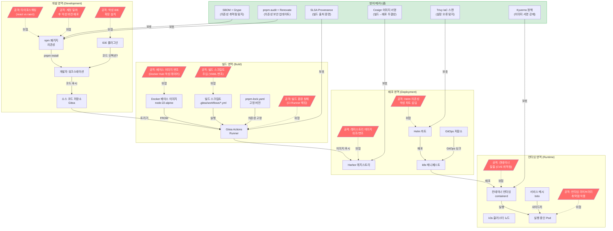

# 소프트웨어 공급망 보안 완전 가이드

> CSAP D-12 (시스템 개발 보안) | SLSA L2+ | Cosign + Sigstore | SBOM | Trivy/Grype
> 대상 독자: 개발자, DevOps 엔지니어, 보안 담당자 (초급~중급)
> 최종 수정: 2026-04-13

---

## Executive Summary

| 관점 | 내용 |
|------|------|
| WHY | 소프트웨어 공급망 공격(SolarWinds, XZ Utils 등)이 증가하고 있으며, 공공기관 SaaS는 CSAP D-12 (개발 보안 자동화) 요건을 충족해야 합니다. |
| WHO | 빌드 파이프라인 담당 DevOps 엔지니어, 보안 담당자, 코드 기여 개발자 |
| RISK | 의존성 패키지 변조, 이미지 위조, 빌드 환경 침해, 라이선스 미준수로 인한 법적 리스크 |
| SUCCESS | SBOM 전 서비스 100% 생성, 이미지 서명 100%, Critical CVE 0개 배포 차단, SLSA L2 달성 |
| SCOPE | packages/ 내 27개 패키지, platform/services/ 내 17개 서비스, CI/CD 파이프라인 전체 |

---

## 목차

1. [소프트웨어 공급망이란?](#1-소프트웨어-공급망이란)
2. [공급망 공격 경로 다이어그램](#2-공급망-공격-경로-다이어그램)
3. [SLSA 4단계 레벨 가이드](#3-slsa-4단계-레벨-가이드)
4. [Cosign 이미지 서명 완전 가이드](#4-cosign-이미지-서명-완전-가이드)
5. [SBOM 생성 및 관리](#5-sbom-생성-및-관리)
6. [feature-flag-sdk 의존성 보안 분석](#6-feature-flag-sdk-의존성-보안-분석)
7. [Trivy 3가지 스캔 모드](#7-trivy-3가지-스캔-모드)
8. [Renovate Bot 자동 업데이트](#8-renovate-bot-자동-업데이트)
9. [라이선스 컴플라이언스](#9-라이선스-컴플라이언스)
10. [CSAP D-12 공급망 보안 체크리스트](#10-csap-d-12-공급망-보안-체크리스트)
11. [공급망 보안 게이트 플로우차트](#11-공급망-보안-게이트-플로우차트)

---

## 1. 소프트웨어 공급망이란?

소프트웨어 공급망(Software Supply Chain)은 소프트웨어가 개발자의 코드 작성부터 최종 사용자에게 실행되기까지 거치는 모든 단계와 구성요소를 말합니다.

### 1.1 공급망의 구성 요소

공급망은 크게 4개 영역으로 나눌 수 있습니다.

**개발 영역 (Development)**
- 개발자가 작성하는 소스 코드
- npm, PyPI 등의 오픈소스 의존성 패키지
- 개발 도구 (ESLint, TypeScript 컴파일러 등)
- IDE 플러그인 및 확장

**빌드 영역 (Build)**
- CI/CD 파이프라인 스크립트 (`.gitea/workflows/*.yml`)
- Docker 베이스 이미지 (node:22-alpine 등)
- 빌드 도구 체인 (pnpm, Webpack 등)
- 빌드 환경 (GitHub/Gitea Actions Runner)

**배포 영역 (Deployment)**
- 컨테이너 레지스트리 (Harbor)
- Helm 차트
- Kubernetes 매니페스트
- GitOps 저장소

**런타임 영역 (Runtime)**
- 클러스터 노드의 OS 및 커널
- 컨테이너 런타임 (containerd)
- 서비스 메시 (Istio)
- 시크릿 관리 (Vault)

### 1.2 왜 공급망 보안이 중요한가?

2020년 SolarWinds 공격에서는 빌드 시스템이 침해되어 수천 개 기관에 악성 업데이트가 배포되었습니다. 2024년 XZ Utils 사건에서는 오픈소스 라이브러리에 백도어가 심겼습니다. 공공기관 SaaS가 사용하는 npm 패키지는 평균 수백 개의 전이적(transitive) 의존성을 가지며, 그 중 하나만 침해되어도 전체 시스템이 위험합니다.

**공공기관 SaaS 프레임워크의 현황**

본 프로젝트의 `.gitea/workflows/sbom-scan.yml`에서는 다음과 같이 Trivy 공급망 공격 교훈을 직접 반영하고 있습니다.

```yaml
# Design Ref: MTU-N37 S3.1
# 보안 참고:
#   - Trivy 공급망 공격(2026-03-19) 대응으로 Grype 채택
#   - 모든 바이너리 다운로드 시 SHA256 체크섬 검증 필수
#   - GitHub Actions 태그가 아닌 커밋 SHA 핀 고정
```

이처럼 도구 자체도 공급망 공격의 대상이 될 수 있으므로, 설치 스크립트에도 무결성 검증이 필요합니다.

---

## 2. 공급망 공격 경로 다이어그램

아래 다이어그램은 개발부터 런타임까지 각 단계에서 발생할 수 있는 공급망 공격 경로를 보여줍니다.



### 2.1 공격 경로별 위협 요약

| 단계 | 공격 유형 | 실제 사례 | 대응 도구 |
|------|-----------|----------|---------|
| 개발 | 타이포스쿼팅 | `event-stream` 악성 패키지 | pnpm audit, Renovate |
| 개발 | 계정 탈취 후 악성 배포 | `ua-parser-js` v1.0.1 사건 | SBOM + Grype 스캔 |
| 빌드 | 빌드 환경 침해 | SolarWinds Orion 빌드 서버 | SLSA Provenance |
| 빌드 | 베이스 이미지 변조 | Docker Hub 악성 이미지 | Cosign 서명, Trivy 스캔 |
| 배포 | 레지스트리 변조 | Harbor 이미지 위조 | Cosign 서명 검증 |
| 런타임 | 컨테이너 탈출 | runc CVE-2024-21626 | Trivy, 정기 패치 |

### 2.2 공공기관 SaaS 위협 모델

공공기관 SaaS의 경우 일반 기업 대비 위협 강도가 높습니다. 행정 데이터와 국민 개인정보를 처리하므로 국가 지원 해킹 그룹의 주요 표적이 됩니다. CSAP D-12 (시스템 개발 보안) 요건은 이러한 고위험 환경에서 개발 단계부터 보안을 내재화하도록 강제합니다.

---

## 3. SLSA 4단계 레벨 가이드

SLSA(Supply chain Levels for Software Artifacts)는 Google이 제안하고 OpenSSF(Open Source Security Foundation)가 관리하는 공급망 보안 프레임워크입니다. 빌드 무결성을 4단계로 측정합니다.

### 3.1 SLSA 레벨 정의

| 레벨 | 명칭 | 핵심 요건 | 방어 효과 |
|------|------|----------|---------|
| L0 | 없음 | 없음 | 없음 |
| L1 | 출처 문서화 | 빌드 과정 문서화, 빌드 스크립트 존재 | 실수로 인한 빌드 오류 탐지 |
| L2 | 호스팅된 빌드 | 호스팅된 빌드 플랫폼 사용, 서명된 Provenance | 서버 측 빌드 침해 탐지 |
| L3 | 강화된 빌드 | 에페머럴 빌드 환경, 격리된 빌드, 비유출 시크릿 | 고급 빌드 환경 침해 방어 |
| L4 | 2인 인가 | 2인 코드 리뷰, 의존성 잠금 | 내부자 위협 방어 |

### 3.2 공공기관 SaaS 권장 레벨: L2+

본 프로젝트가 SLSA L2를 권장 기준으로 설정한 근거는 다음과 같습니다.

**L1은 불충분한 이유**
L1은 빌드 스크립트 문서화에 그치며, 빌드 서버가 침해되었을 때 탐지할 수단이 없습니다. CSAP D-12 요건의 "개발 환경 보안"을 충족하지 못합니다.

**L2가 현실적 최소 기준인 이유**
- Gitea Actions는 호스팅된 빌드 플랫폼으로 L2 요건을 충족합니다.
- `slsa-provenance.yml` 워크플로우가 서명된 Provenance를 생성합니다.
- CSAP 감리에서 "빌드 출처 증명"으로 인정됩니다.

**L3 달성 경로 (중기 목표)**
```yaml
# .gitea/workflows/slsa-provenance.yml 에서 이미 구현 중
# SLSA L3: 에페머럴 환경 (각 실행마다 새 컨테이너)
jobs:
  generate-provenance:
    runs-on: ubuntu-latest  # 매 실행마다 신규 컨테이너 (에페머럴)
```

L3 달성을 위해 추가로 필요한 사항:
1. `self-hosted` Runner를 에페머럴 컨테이너 기반으로 전환
2. 빌드 시크릿을 빌드 후 즉시 파기 (현재 Vault 연동으로 부분 충족)
3. 2인 리뷰 정책 강제화 (Gitea Branch Protection 설정)

### 3.3 SLSA Provenance 파일 이해

본 프로젝트 `.gitea/workflows/slsa-provenance.yml`이 생성하는 in-toto SLSA Provenance v1 형식을 살펴보겠습니다.

```json
{
  "_type": "https://in-toto.io/Statement/v1",
  "subject": [{
    "name": "localhost:8080/public-saas/api-gateway:main-abc1234",
    "digest": {
      "sha256": "b94d27b9934d3e08a52e52d7da7dabfac484efe04cbb4adfa5b4da6438db3f0d"
    }
  }],
  "predicateType": "https://slsa.dev/provenance/v1",
  "predicate": {
    "buildDefinition": {
      "buildType": "https://gitea-actions/v1",
      "externalParameters": {
        "repository": "public-saas/api-gateway",
        "ref": "refs/heads/main",
        "workflow": ".gitea/workflows/slsa-provenance.yml",
        "commit": "abc1234"
      },
      "internalParameters": {
        "runner": "ephemeral-container",
        "os": "Linux",
        "arch": "x86_64"
      }
    },
    "runDetails": {
      "builder": {
        "id": "https://gitea.local/actions/runner"
      },
      "metadata": {
        "invocationId": "run_20260413_001",
        "startedOn": "2026-04-13T09:00:00Z"
      }
    }
  }
}
```

이 파일이 의미하는 것:
- `subject`: 어떤 이미지에 대한 증명인지 (SHA256 다이제스트로 고정)
- `buildDefinition.externalParameters`: 어떤 저장소의 어떤 커밋에서 빌드됐는지
- `runDetails.builder.id`: 어떤 빌드 시스템이 빌드했는지
- `metadata.invocationId`: 구체적으로 어떤 파이프라인 실행인지

### 3.4 Provenance 검증 방법

배포 시 Provenance를 검증하여 이미지가 신뢰할 수 있는 파이프라인에서 빌드됐는지 확인합니다.

```bash
# 이미지 Provenance 검증
cosign verify-attestation \
  --key infra/cosign/cosign.pub \
  --type slsaprovenance \
  localhost:8080/public-saas/api-gateway:main-abc1234@sha256:b94d27b9...

# 검증 성공 시 출력 예시:
# Verification for localhost:8080/public-saas/api-gateway:main-abc1234
# The following checks were performed on each of these signatures:
#   - The cosign claims were validated
#   - The signatures were verified against the specified public key
```

---

## 4. Cosign 이미지 서명 완전 가이드

Cosign은 Sigstore 프로젝트의 컨테이너 이미지 서명 도구입니다. 이미지가 신뢰할 수 있는 파이프라인에서 빌드되고 변조되지 않았음을 암호학적으로 증명합니다.

### 4.1 Cosign 서명 방식 비교

| 방식 | 키 관리 | 인프라 요구사항 | 본 프로젝트 채택 여부 |
|------|--------|--------------|-------------------|
| 키 기반 서명 (cosign.key) | 직접 관리 | 키 파일 보관 | 채택 (주 방식) |
| Keyless 서명 (Fulcio/Rekor) | 자동 (OIDC) | Sigstore 공개 인프라 | 참고용 (온프레미스 부적합) |
| KMS 기반 서명 (AWS KMS 등) | 클라우드 KMS | 클라우드 의존 | 외부 클라우드 사용 금지로 미채택 |

**왜 키 기반 서명을 채택했나?**

공공기관 SaaS는 외부 클라우드 서비스 사용이 제한됩니다 (CLAUDE.md 절대 제약). Sigstore의 Fulcio/Rekor는 공개 인터넷 기반 서비스이므로, 내부망 온프레미스 환경에서는 키 파일을 Vault에 안전하게 보관하는 방식을 채택했습니다.

### 4.2 키 쌍 생성 및 관리

```bash
# 1단계: Cosign 키 쌍 생성
cosign generate-key-pair

# 생성되는 파일:
# - cosign.key  (개인키, COSIGN_PASSWORD로 암호화됨)
# - cosign.pub  (공개키, 저장소에 커밋 가능)

# 2단계: 개인키를 Vault에 저장 (하드코딩 절대 금지 - CSAP D-09)
vault kv put secret/cosign/signing-key \
  private_key=@cosign.key \
  password="${COSIGN_PASSWORD}"

# 3단계: 공개키는 저장소에 커밋 (infra/cosign/cosign.pub)
# 이 파일은 서명 검증에만 사용되므로 공개 가능
cp cosign.pub infra/cosign/cosign.pub
git add infra/cosign/cosign.pub
git commit -m "feat(security): Cosign 공개키 등록"
```

### 4.3 실제 서명 파이프라인 분석

본 프로젝트 `.gitea/workflows/sign-image.yml`의 핵심 단계를 분석합니다.

```yaml
# Design Ref: MTU-N27 Design -- CI/CD 자동화
# Plan SC: FR-N27.5
# CSAP: D-12-01 (개발 보안 자동화)

- name: Sign Image with Cosign
  env:
    COSIGN_PASSWORD: ${{ secrets.COSIGN_PASSWORD }}  # Vault 또는 Gitea Secrets에서 주입
  run: |
    cosign sign \
      --key ${{ env.COSIGN_KEY_PATH }} \        # /opt/cosign/cosign.key (Runner 마운트)
      --signing-config ${{ env.SIGNING_CONFIG_PATH }} \
      --allow-insecure-registry \               # 내부 Harbor HTTP 허용 (운영환경에서는 제거)
      ${{ steps.image-ref.outputs.ref }}        # 서명할 이미지 참조

- name: Verify Signature
  run: |
    cosign verify \
      --key infra/cosign/cosign.pub \           # 공개키로 검증
      --insecure-ignore-tlog \                  # 투명성 로그 건너뜀 (온프레미스)
      --allow-insecure-registry \
      ${{ steps.image-ref.outputs.ref }}
```

**중요한 설계 결정: `--insecure-ignore-tlog`**

Sigstore의 Rekor는 공개 투명성 로그(Transparency Log)입니다. 온프레미스 환경에서는 이 공개 인프라에 의존할 수 없으므로 `--insecure-ignore-tlog` 플래그를 사용합니다. 대신 내부 감사 로그(`.claude/audit.jsonl`)가 서명 이벤트를 모두 기록합니다.

### 4.4 서명 검증 감사 로그

```yaml
# sign-image.yml의 감사 로그 단계
- name: Audit Log
  if: always()  # 성공/실패 무관하게 항상 기록
  run: |
    echo "{
      \"timestamp\":\"$(date -u +%Y-%m-%dT%H:%M:%SZ)\",
      \"action\":\"IMAGE_SIGN\",
      \"image\":\"${{ steps.image-ref.outputs.ref }}\",
      \"status\":\"${{ job.status }}\",
      \"actor\":\"gitea-actions\"
    }" >> .claude/audit.jsonl
```

이 감사 로그는 CSAP D-06 (침해사고 관리) 요건을 충족합니다. 모든 이미지 서명 이벤트가 추적됩니다.

### 4.5 Keyless 서명 참고 (공개 인터넷 환경)

공개 인터넷이 허용되는 환경(예: 오픈소스 프로젝트)에서는 keyless 서명이 더 편리합니다. 본 프로젝트에서는 적용하지 않지만, 개념 이해를 위해 설명합니다.

```bash
# Keyless 서명 (OIDC 기반, 공개 Sigstore 사용)
COSIGN_EXPERIMENTAL=1 cosign sign \
  --fulcio-url https://fulcio.sigstore.dev \
  --rekor-url https://rekor.sigstore.dev \
  ${IMAGE_REF}

# 동작 원리:
# 1. OIDC 제공자(GitHub/Google)에서 단기 인증서 발급 (Fulcio)
# 2. 서명이 공개 투명성 로그에 기록됨 (Rekor)
# 3. 개인키 없이 서명 가능 (Identity 기반)
```

---

## 5. SBOM 생성 및 관리

SBOM(Software Bill of Materials, 소프트웨어 구성 명세서)은 소프트웨어에 포함된 모든 구성요소 목록입니다. 식품의 성분표처럼, 어떤 오픈소스 라이브러리가 어떤 버전으로 포함되어 있는지를 문서화합니다.

### 5.1 SBOM 표준 비교

| 표준 | 관리 기관 | 형식 | 주요 용도 |
|------|---------|------|---------|
| CycloneDX | OWASP | JSON, XML | 취약점 스캔, 라이선스 분석 |
| SPDX | Linux Foundation | JSON, RDF | 라이선스 컴플라이언스 |
| SWID | NIST | XML | 자산 관리 |

**본 프로젝트 선택: CycloneDX 1.6 (주) + SPDX (부)**

`sbom-scan.yml`에서 두 형식을 모두 생성합니다.
```yaml
syft "${{ steps.image.outputs.ref }}" \
  -o cyclonedx-json=sbom-output/sbom-${{ matrix.service }}.cdx.json \
  -o spdx-json=sbom-output/sbom-${{ matrix.service }}.spdx.json
```

### 5.2 Syft로 SBOM 생성

Syft는 Anchore에서 개발한 SBOM 생성 도구입니다. 컨테이너 이미지, 파일시스템, 소스 코드 디렉토리에서 SBOM을 생성할 수 있습니다.

```bash
# 컨테이너 이미지에서 SBOM 생성
syft localhost:8080/public-saas/api-gateway:main-abc1234 \
  -o cyclonedx-json=sbom-api-gateway.cdx.json

# 로컬 소스 디렉토리에서 SBOM 생성 (이미지 빌드 전)
syft dir:platform/services/api-gateway/ \
  -o cyclonedx-json=sbom-api-gateway-source.cdx.json

# 설치된 패키지 확인
syft packages localhost:8080/public-saas/api-gateway:latest

# 출력 예시:
# NAME                    VERSION    TYPE
# express                 4.21.0     npm
# zod                     3.23.0     npm
# @fastify/rate-limit     10.1.0     npm
# ...
```

### 5.3 생성된 CycloneDX SBOM 구조 이해

```json
{
  "bomFormat": "CycloneDX",
  "specVersion": "1.6",
  "serialNumber": "urn:uuid:abc123-def456",
  "version": 1,
  "metadata": {
    "timestamp": "2026-04-13T09:00:00Z",
    "tools": [{"vendor": "anchore", "name": "syft", "version": "1.19.0"}],
    "component": {
      "type": "container",
      "name": "public-saas/api-gateway",
      "version": "main-abc1234"
    }
  },
  "components": [
    {
      "type": "library",
      "name": "express",
      "version": "4.21.0",
      "purl": "pkg:npm/express@4.21.0",
      "licenses": [{"license": {"id": "MIT"}}],
      "hashes": [
        {"alg": "SHA-256", "content": "b94d27b9..."}
      ]
    }
  ]
}
```

각 필드의 의미:
- `purl`: Package URL — 패키지를 전 세계에서 유일하게 식별하는 URL 형식 (`pkg:npm/express@4.21.0`)
- `hashes`: 파일 무결성 검증용 체크섬
- `licenses`: 라이선스 정보 (컴플라이언스 검토에 활용)

### 5.4 Grype로 취약점 스캔

Grype는 SBOM 또는 이미지에서 알려진 취약점(CVE)을 스캔하는 도구입니다.

```bash
# SBOM 파일 기반 스캔
grype sbom:sbom-api-gateway.cdx.json

# 이미지 직접 스캔
grype localhost:8080/public-saas/api-gateway:latest

# Critical/High만 표시하고 발견 시 종료코드 1 반환 (파이프라인 차단용)
grype sbom:sbom-api-gateway.cdx.json \
  --fail-on critical \
  --output json > grype-results.json

# 결과 예시:
# NAME        INSTALLED  FIXED-IN    TYPE   VULNERABILITY  SEVERITY
# express     4.19.0     4.21.0      npm    CVE-2024-29041 HIGH
# semver      5.7.1      5.7.2       npm    CVE-2022-25883 MEDIUM
```

### 5.5 SBOM Attestation (이미지에 SBOM 첨부)

SBOM을 이미지와 함께 레지스트리에 저장하면, 배포 시 자동으로 SBOM을 조회하고 취약점을 검증할 수 있습니다.

```bash
# SBOM을 이미지에 첨부 (Cosign Attestation)
cosign attest \
  --key cosign.key \
  --type cyclonedx \
  --predicate sbom-api-gateway.cdx.json \
  --allow-insecure-registry \
  localhost:8080/public-saas/api-gateway:main-abc1234

# Attestation 검증
cosign verify-attestation \
  --key infra/cosign/cosign.pub \
  --type cyclonedx \
  --insecure-ignore-tlog \
  localhost:8080/public-saas/api-gateway:main-abc1234

# SBOM 내용 추출
cosign download attestation \
  localhost:8080/public-saas/api-gateway:main-abc1234 | \
  jq -r '.payload' | base64 -d | jq '.predicate.components[].name'
```

### 5.6 SBOM 보존 정책 (CSAP D-06)

```yaml
# sbom-scan.yml에서 365일 보존 설정
- name: Upload SBOM artifact
  uses: actions/upload-artifact@v4
  with:
    name: sbom-${{ matrix.service }}-${{ steps.image.outputs.tag }}
    path: sbom-output/
    retention-days: 365  # CSAP D-06: 1년 보존
```

CSAP D-06 (침해사고 관리)은 보안 관련 아티팩트를 최소 1년 보존하도록 요구합니다. SBOM은 침해 사고 발생 시 어떤 버전의 라이브러리가 영향을 받았는지 소급 조사하는 데 필수적입니다.

---

## 6. feature-flag-sdk 의존성 보안 분석

실제 프로젝트 코드를 통해 의존성 보안을 어떻게 관리해야 하는지 살펴보겠습니다.

### 6.1 feature-flag-sdk 의존성 현황

`/data/ai-saas/packages/feature-flag-sdk/package.json` 분석:

```json
{
  "name": "@saas/feature-flag-sdk",
  "version": "1.0.0",
  "dependencies": {
    "unleash-client": "^6.1.0"  // 주요 의존성: Unleash 클라이언트
  },
  "devDependencies": {
    "typescript": "^5.4.0",
    "@types/node": "^20.0.0"
  }
}
```

**의존성 분석 관점**
- `unleash-client@^6.1.0`: 캐럿(^) 버전 범위는 마이너 업데이트를 자동 허용합니다. 6.1.x에서 6.9.x까지 자동 설치될 수 있어 예기치 않은 변경이 발생할 수 있습니다.
- 전이적 의존성: `unleash-client`는 내부적으로 `got`, `uuid` 등 추가 패키지를 사용합니다. `pnpm-lock.yaml`이 전이적 의존성 버전을 고정합니다.

### 6.2 SDK의 보안 설계 분석

`/data/ai-saas/packages/feature-flag-sdk/src/index.ts` 에서 보안 관련 코드를 분석합니다.

```typescript
// API 키 하드코딩 방지 (CSAP D-09) - 실제 코드에서 발췌
constructor(config: FeatureFlagConfig) {
  // NFR-3: API 키 하드코딩 검증
  if (!config.apiKey || config.apiKey.startsWith('sk-') || config.apiKey.length < 10) {
    throw new Error('유효한 API 키를 환경 변수에서 제공해야 합니다 (하드코딩 금지 - CSAP D-09)');
  }
  // ...
}
```

이 코드는 3가지 보안 검증을 수행합니다.
1. `!config.apiKey`: 빈 키 방지 — 환경 변수가 설정되지 않으면 즉시 실패
2. `config.apiKey.startsWith('sk-')`: OpenAI 등 외부 서비스 키 패턴 감지 — 혼용 방지
3. `config.apiKey.length < 10`: 의미 없는 더미 키 방지

```typescript
// 팩토리 함수에서 환경 변수 우선 로드 - 실제 코드에서 발췌
export function createFeatureFlagClient(overrides?: Partial<FeatureFlagConfig>): IFeatureFlagClient {
  const config: FeatureFlagConfig = {
    apiUrl: overrides?.apiUrl ?? process.env.UNLEASH_API_URL ?? 'http://unleash-edge:3063/api',
    apiKey: overrides?.apiKey ?? process.env.UNLEASH_API_KEY ?? '',  // 빈 문자열 기본값 → 즉시 에러
    appName: overrides?.appName ?? process.env.APP_NAME ?? 'saas-platform',
  };

  if (!config.apiKey) {
    throw new Error('UNLEASH_API_KEY 환경 변수가 설정되지 않았습니다');
  }
  // ...
}
```

**Fail-Safe 기본값 패턴**: `process.env.UNLEASH_API_URL ?? 'http://unleash-edge:3063/api'`는 환경 변수가 없을 때 내부 서비스 주소로 폴백합니다. 외부 URL이 기본값으로 하드코딩되지 않은 것이 중요합니다.

### 6.3 의존성 보안 강화 권고사항

```bash
# 현재 의존성 취약점 확인
cd packages/feature-flag-sdk
pnpm audit --audit-level=high

# 취약점 발견 시 업데이트
pnpm update unleash-client --latest

# 버전 고정 (lock 파일 업데이트)
pnpm install --frozen-lockfile

# SBOM 생성으로 전이적 의존성 확인
syft dir:. -o cyclonedx-json=sdk-sbom.json
grype sbom:sdk-sbom.json
```

### 6.4 SDK 의존성 공급망 위험 시나리오

**시나리오: unleash-client 악성 버전 배포**

1. 공격자가 npm 계정 탈취 후 `unleash-client@6.1.1-malicious` 배포
2. `^6.1.0` 버전 범위로 자동 설치 가능
3. SDK가 Unleash 서버와 통신할 때 데이터 탈취

**대응 방법**:
- `pnpm-lock.yaml` 엄격 고정: `pnpm install --frozen-lockfile` (CI 필수)
- Renovate Bot으로 버전 업데이트를 PR 리뷰로 통제
- Grype 스캔으로 CVE 발견 시 배포 차단

---

## 7. Trivy 3가지 스캔 모드

Trivy는 Aqua Security에서 개발한 오픈소스 취약점 스캔 도구입니다. 컨테이너 이미지, 파일시스템, IaC(Infrastructure as Code) 3가지 모드를 지원합니다.

> 주의: 본 프로젝트의 `sbom-scan.yml`은 "Trivy 공급망 공격(2026-03-19)" 사건으로 인해 취약점 스캔에는 Grype를 채택했습니다. 그러나 Trivy의 IaC 스캔 기능은 `devsecops.yml`에서 여전히 사용 중입니다. 두 도구의 역할을 구분하여 이해하는 것이 중요합니다.

### 7.1 모드 1: 컨테이너 이미지 스캔

```bash
# 기본 이미지 스캔
trivy image localhost:8080/public-saas/api-gateway:latest

# JSON 출력 (파이프라인 통합용)
trivy image \
  --format json \
  --output trivy-results.json \
  localhost:8080/public-saas/api-gateway:latest

# High/Critical만 스캔하고 발견 시 종료코드 1
trivy image \
  --severity HIGH,CRITICAL \
  --exit-code 1 \
  localhost:8080/public-saas/api-gateway:latest

# 특정 CVE 무시 (.trivyignore 사용)
trivy image \
  --ignorefile .trivyignore \
  localhost:8080/public-saas/api-gateway:latest
```

**.trivyignore 예시** (수용 가능한 위험 등록):
```
# CVE-2023-44487: HTTP/2 Rapid Reset — WAF에서 차단 중, 허용
CVE-2023-44487

# GHSA-c2qf-rxjj-qqgw: next.js XSS — v14.2.5 업그레이드 예정 (2026-05-01)
GHSA-c2qf-rxjj-qqgw
```

### 7.2 모드 2: 파일시스템 스캔

파일시스템 스캔은 이미지 빌드 전 소스 코드 단계에서 취약점을 탐지하는 "Shift-Left" 접근법입니다.

```bash
# 현재 디렉토리 스캔
trivy fs .

# 특정 서비스 디렉토리 스캔
trivy fs platform/services/ai-service/ \
  --severity HIGH,CRITICAL \
  --format sarif \
  --output fs-scan.sarif

# package.json + lock 파일에서 의존성 스캔
trivy fs \
  --scanners vuln,secret \
  packages/feature-flag-sdk/

# 시크릿 스캔 포함 (하드코딩된 API 키, 비밀번호 탐지)
trivy fs \
  --scanners secret \
  --secret-config trivy-secret.yaml \
  .
```

### 7.3 모드 3: IaC (Infrastructure as Code) 스캔

IaC 스캔은 Kubernetes 매니페스트, Helm 차트, Terraform 설정의 보안 오류를 탐지합니다. 본 프로젝트 `devsecops.yml`에서 실제로 사용 중입니다.

```yaml
# devsecops.yml에서 발췌 - 실제 파이프라인 설정
- name: Trivy IaC Scan — Helm Charts
  run: |
    trivy config \
      --severity HIGH,CRITICAL \
      --exit-code 0 \         # 발견해도 파이프라인 계속 (결과 수집용)
      --format table \
      helm/

- name: Trivy IaC Scan — k8s Manifests
  run: |
    trivy config \
      --severity HIGH,CRITICAL \
      --exit-code 0 \
      --format table \
      deploy/

- name: Trivy IaC Scan — Infra Configs
  run: |
    trivy config \
      --severity HIGH,CRITICAL \
      --exit-code 0 \
      --format json \
      --output trivy-iac-report.json \
      infra/
```

**IaC 스캔에서 탐지하는 문제 유형**:

```bash
# 탐지 예시
# HIGH: KSV001 — 컨테이너가 root로 실행됨
# securityContext.runAsNonRoot: true 누락

# MEDIUM: KSV003 — Capabilities 과도 부여
# securityContext.capabilities.drop: ["ALL"] 누락

# HIGH: KSV020 — Liveness Probe 누락
# 재시작 자동화 불가능
```

**수정 예시**:
```yaml
# 취약한 설정 (Trivy 탐지)
spec:
  containers:
  - name: api-gateway
    image: localhost:8080/public-saas/api-gateway:latest
    # securityContext 없음 -> KSV001, KSV003 탐지

# 수정된 설정
spec:
  containers:
  - name: api-gateway
    image: localhost:8080/public-saas/api-gateway:latest
    securityContext:
      runAsNonRoot: true
      runAsUser: 1000
      allowPrivilegeEscalation: false
      readOnlyRootFilesystem: true
      capabilities:
        drop:
        - ALL
    livenessProbe:
      httpGet:
        path: /healthz
        port: 3000
      initialDelaySeconds: 15
      periodSeconds: 10
```

### 7.4 Trivy 설정 파일

```yaml
# trivy.yaml — 프로젝트 루트에 위치
cache:
  dir: /tmp/trivy-cache

db:
  skip-update: false
  no-progress: true

scan:
  scanners:
  - vuln
  - secret
  - config

vuln:
  ignore-unfixed: true    # 아직 패치가 없는 CVE 무시

report:
  format: table
  output: ""

severity:
- HIGH
- CRITICAL
```

---

## 8. Renovate Bot 자동 업데이트

Renovate Bot은 의존성 업데이트를 자동으로 PR(Pull Request)로 생성하는 도구입니다. 수동으로 의존성을 업데이트하는 것보다 훨씬 빠르게 보안 패치를 적용할 수 있습니다.

### 8.1 Renovate 설정 파일

```json
// renovate.json — 프로젝트 루트에 위치
{
  "$schema": "https://docs.renovatebot.com/renovate-schema.json",
  "extends": [
    "config:best-practices",
    ":dependencyDashboard",
    ":semanticCommits"
  ],

  // CSAP 보안 패치 우선 자동 병합
  "packageRules": [
    {
      "matchUpdateTypes": ["patch"],
      "matchCategories": ["security"],
      "automerge": true,
      "automergeType": "pr",
      "labels": ["security", "auto-merge"]
    },
    // 마이너 업데이트: 리뷰 후 병합
    {
      "matchUpdateTypes": ["minor"],
      "automerge": false,
      "labels": ["dependencies", "minor-update"],
      "reviewers": ["security-team"]
    },
    // 메이저 업데이트: 철저한 테스트 후 수동 병합
    {
      "matchUpdateTypes": ["major"],
      "automerge": false,
      "labels": ["dependencies", "major-update", "needs-review"],
      "reviewers": ["security-team", "tech-lead"],
      "schedule": ["on the first day of the month"]
    }
  ],

  // 공공기관 SaaS 특수 설정
  "vulnerabilityAlerts": {
    "labels": ["security"],
    "assignees": ["security-team"]
  },

  // 그룹화: 관련 패키지 동시 업데이트
  "grouping": [
    {
      "groupName": "TypeScript 관련",
      "matchPackageNames": ["typescript", "@types/*"]
    },
    {
      "groupName": "Next.js 관련",
      "matchPackageNames": ["next", "react", "react-dom", "@types/react"]
    }
  ]
}
```

### 8.2 Renovate PR 처리 절차

```
Renovate가 취약점 발견
        ↓
자동 PR 생성 (패치 버전)
        ↓
CI 파이프라인 자동 실행
  - lint, typecheck, build, test
  - SBOM + Grype 재스캔
        ↓
모든 체크 통과 시
        ↓
보안 패치: 자동 병합 (automerge: true)
마이너:   리뷰어에게 알림
메이저:   수동 리뷰 + 테스트
```

### 8.3 긴급 보안 패치 절차

Renovate Bot이 아직 탐지하지 못한 제로데이(0-day) 취약점의 경우:

```bash
# 1단계: 취약 패키지 즉시 확인
pnpm audit --audit-level=critical

# 2단계: 수동 업데이트
pnpm update express@latest --recursive

# 3단계: lock 파일 업데이트 및 커밋
git add pnpm-lock.yaml
git commit -m "fix(security): CVE-2024-XXXX express 긴급 패치"

# 4단계: 파이프라인 수동 트리거
# Gitea Actions → Security Audit → Run workflow
```

---

## 9. 라이선스 컴플라이언스

공공기관 소프트웨어에 사용하는 오픈소스 라이선스는 법적 요건을 충족해야 합니다. 부적절한 라이선스 사용은 저작권 침해로 이어질 수 있습니다.

### 9.1 공공기관 허용/금지 라이선스 목록

| 라이선스 | 유형 | 공공기관 허용 여부 | 주요 조건 |
|---------|------|-----------------|---------|
| MIT | 허용적(Permissive) | 허용 | 저작권 표시 필요 |
| Apache-2.0 | 허용적 | 허용 | 저작권 표시, NOTICE 파일 |
| BSD-2-Clause | 허용적 | 허용 | 저작권 표시 필요 |
| BSD-3-Clause | 허용적 | 허용 | 저작권 표시 필요 |
| ISC | 허용적 | 허용 | 저작권 표시 필요 |
| LGPL-2.1/3.0 | 약한 카피레프트 | 조건부 허용 | 수정 시 소스 공개 |
| MPL-2.0 | 약한 카피레프트 | 조건부 허용 | 파일 단위 소스 공개 |
| GPL-2.0/3.0 | 강한 카피레프트 | 주의 | 파생물 전체 소스 공개 |
| AGPL-3.0 | 강한 카피레프트 | 금지 권고 | 네트워크 서비스도 소스 공개 |
| SSPL | 비OSI | 금지 | MongoDB 등의 상업적 제한 |
| Commercial | 상용 | 별도 계약 필요 | 라이선스 비용 |

**AGPL-3.0을 금지 권고하는 이유**: AGPL은 네트워크를 통해 서비스를 제공하는 것만으로도 소스 코드 공개 의무가 발생합니다. 공공기관 SaaS의 핵심 비즈니스 로직이 공개될 수 있어 보안 위험이 있습니다.

### 9.2 라이선스 자동 검사

```bash
# license-checker로 현재 의존성 라이선스 확인
npx license-checker --production --json > licenses.json

# 금지된 라이선스 탐지
npx license-checker \
  --production \
  --excludePrivatePackages \
  --failOn "GPL-3.0;AGPL-3.0;SSPL-1.0"

# SBOM에서 라이선스 추출 (CycloneDX)
cat sbom-api-gateway.cdx.json | \
  jq '[.components[] | {name: .name, version: .version, license: .licenses[].license.id}]'
```

### 9.3 라이선스 알림 파일 자동 생성

```bash
# NOTICE 파일 자동 생성 (Apache-2.0 요건)
npx license-checker \
  --production \
  --customPath format.json \
  --out NOTICE.md

# NOTICE.md 예시:
# # NOTICE
# This product includes software developed by:
# - express (MIT) — Copyright (c) TJ Holowaychuk
# - zod (MIT) — Copyright (c) Colin McDonnell
```

### 9.4 라이선스 거버넌스 프로세스

```
신규 의존성 추가 PR 생성
        ↓
CI: license-checker 자동 실행
        ↓
금지 라이선스 발견?
  YES → PR 차단 + 작성자 알림
  NO  → 다음 단계
        ↓
허용적 라이선스: 자동 승인
조건부 허용: 보안팀 리뷰
LGPL/GPL: 법무팀 검토 요청
```

---

## 10. CSAP D-12 공급망 보안 체크리스트

CSAP D-12 (시스템 개발 보안) 항목 중 공급망 보안 관련 체크리스트입니다. 각 항목을 구현 시 참조하십시오.

### 10.1 의존성 관리 (D-12-01)

```
[ ] 모든 의존성이 pnpm-lock.yaml에 버전 고정됨
[ ] CI에서 --frozen-lockfile 옵션으로 설치 (버전 드리프트 방지)
[ ] pnpm audit 주간 자동 실행 (security.yml)
[ ] Renovate Bot으로 보안 패치 자동 PR 생성
[ ] 의존성 추가 시 라이선스 검토 완료
[ ] 금지 라이선스(AGPL, SSPL) 미사용 확인
```

### 10.2 빌드 무결성 (D-12-02)

```
[ ] 모든 이미지에 Cosign 서명 적용 (sign-image.yml)
[ ] SLSA Provenance 생성 (slsa-provenance.yml)
[ ] Kyverno로 서명되지 않은 이미지 배포 차단
[ ] 빌드 환경 에페머럴화 (일회용 컨테이너)
[ ] 빌드 아티팩트 무결성 해시 기록
[ ] 빌드 로그 365일 보존 (CSAP D-06 연동)
```

### 10.3 소프트웨어 구성 명세서 (D-12-03)

```
[ ] 전 서비스 SBOM 생성 (CycloneDX 1.6 + SPDX)
[ ] SBOM을 이미지에 Attestation으로 첨부
[ ] Grype로 CVE 스캔 및 결과 기록
[ ] Critical CVE 발견 시 배포 차단 설정
[ ] SBOM 아티팩트 365일 보존
[ ] 취약점 스캔 결과 감사 로그 기록
```

### 10.4 인프라 코드 보안 (D-12-04)

```
[ ] Trivy IaC로 Helm/k8s YAML 스캔 (devsecops.yml)
[ ] Semgrep SAST로 소스 코드 정적 분석
[ ] Gitleaks로 하드코딩 시크릿 탐지
[ ] 컨테이너 runAsNonRoot: true 설정
[ ] readOnlyRootFilesystem: true 설정
[ ] capabilities.drop: ALL 설정
```

### 10.5 운영 단계 모니터링

```
[ ] 배포된 이미지 Cosign 서명 정기 재검증
[ ] 새로운 CVE 공개 시 배포된 이미지 소급 스캔
[ ] Harbor 레지스트리 접근 로그 모니터링
[ ] 이미지 다이제스트 불일치 알림 설정
[ ] SBOM 비교로 이미지 변조 탐지
```

---

## 11. 공급망 보안 게이트 플로우차트

아래 다이어그램은 PR 생성부터 배포 승인까지 공급망 보안 게이트가 어떻게 동작하는지 보여줍니다.

```mermaid
flowchart TD
    START([개발자 코드 푸시\n또는 PR 생성]) --> CI_TRIGGER

    CI_TRIGGER[CI 파이프라인 트리거\nci.yml] --> PARALLEL_START

    subgraph PARALLEL_CHECKS["병렬 보안 검사 (devsecops.yml)"]
        direction TB
        P1["[1/5] Trivy IaC 스캔\n- Helm 차트 보안 검사\n- k8s YAML 보안 검사\n- Infra 설정 검사"]
        P2["[2/5] Semgrep SAST\n- OWASP Top 10 패턴\n- TypeScript 보안 규칙\n- 커스텀 공공기관 규칙"]
        P3["[3/5] 의존성 감사\n- pnpm audit HIGH+\n- 취약 패키지 탐지\n- 버전 고정 확인"]
        P4["[4/5] 시크릿 탐지\n- Gitleaks 전체 히스토리\n- API 키 패턴 탐지\n- 비밀번호 패턴 탐지"]
        P5["[5/5] Kyverno 검증\n- 이미지 서명 정책\n- Pod 보안 표준\n- 네트워크 정책"]
    end

    PARALLEL_START --> P1 & P2 & P3 & P4 & P5

    P1 & P2 & P3 & P4 & P5 --> SECURITY_GATE{보안 게이트\n시크릿 탐지\nCritical 취약점?}

    SECURITY_GATE -->|CRITICAL 발견| BLOCK_DEPLOY[배포 차단\n작성자 알림\n보안팀 에스컬레이션]
    SECURITY_GATE -->|통과| BUILD_IMAGE

    BLOCK_DEPLOY --> FIX[개발자 수정] --> CI_TRIGGER

    BUILD_IMAGE["Docker 이미지 빌드\nHarbor에 푸시\nCI.yml: build job"] --> SBOM_STAGE

    subgraph SBOM_PIPELINE["SBOM & 취약점 파이프라인 (sbom-scan.yml)"]
        direction TB
        SBOM_GEN["Stage 1: SBOM 생성 (Syft)\n- CycloneDX 1.6 JSON\n- SPDX JSON\n- 17개 서비스 매트릭스"]
        GRYPE_SCAN["Stage 2: Grype 취약점 스캔\n- Critical/High/Medium/Low 분류\n- 결과 JSON 아티팩트 (365일)"]
        SBOM_ATTEST["Stage 3: Cosign SBOM Attestation\n- SBOM을 이미지에 첨부\n- 무결성 증명"]
        SBOM_GEN --> GRYPE_SCAN --> SBOM_ATTEST
    end

    SBOM_STAGE[SBOM 파이프라인 시작] --> SBOM_GEN

    SBOM_ATTEST --> CVE_GATE{CVE 게이트\nCritical/High\n발견 여부?}

    CVE_GATE -->|Critical 발견| VULN_BLOCK[배포 차단\nGrype 결과 기록\nSLA 대응 시작]
    CVE_GATE -->|High 발견| VULN_WARN[경고 기록\n보안팀 알림\n수용/패치 결정 필요]
    CVE_GATE -->|통과| IMAGE_SIGN

    VULN_BLOCK --> PATCH[패치 적용\nRenovate PR 또는\n수동 업데이트] --> CI_TRIGGER
    VULN_WARN --> ACCEPT{보안팀 수용\n결정?}
    ACCEPT -->|수용 거부| PATCH
    ACCEPT -->|수용 (기한 설정)| IMAGE_SIGN

    subgraph SIGNING_PIPELINE["이미지 서명 (sign-image.yml)"]
        direction TB
        COSIGN_SIGN["Cosign 이미지 서명\n- cosign.key 사용\n- Harbor에 서명 업로드"]
        SLSA_PROV["SLSA Provenance 생성\n- in-toto v1 형식\n- Cosign Attestation"]
        VERIFY["서명 검증\n- cosign.pub으로 확인\n- Attestation 검증"]
        AUDIT_LOG["감사 로그 기록\n- audit.jsonl\n- CSAP D-06"]
        COSIGN_SIGN --> SLSA_PROV --> VERIFY --> AUDIT_LOG
    end

    IMAGE_SIGN[이미지 서명 시작] --> COSIGN_SIGN

    AUDIT_LOG --> KYVERNO_GATE{Kyverno 런타임\n정책 검증\n서명 확인}

    KYVERNO_GATE -->|서명 미존재| POLICY_BLOCK[정책 위반\n배포 차단\n감사 기록]
    KYVERNO_GATE -->|서명 확인됨| APPROVE_DEPLOY

    POLICY_BLOCK --> INVESTIGATE[원인 조사\n및 재서명] --> IMAGE_SIGN

    APPROVE_DEPLOY["배포 승인\nGitOps 동기화\nArgo CD 적용"] --> RUNTIME_MONITOR

    RUNTIME_MONITOR["런타임 모니터링\n- 컨테이너 이미지 무결성 정기 검증\n- 새 CVE 소급 스캔\n- Harbor 접근 로그 모니터링"]

    style BLOCK_DEPLOY fill:#ff4444,color:#fff
    style VULN_BLOCK fill:#ff4444,color:#fff
    style POLICY_BLOCK fill:#ff4444,color:#fff
    style APPROVE_DEPLOY fill:#28a745,color:#fff
    style VULN_WARN fill:#ffc107,color:#000
```

### 11.1 게이트별 대응 SLA

| 게이트 | 발견 심각도 | 대응 SLA | 담당자 |
|--------|-----------|---------|--------|
| 시크릿 탐지 | Critical | 즉시 차단, 4시간 내 제거 | 개발자 + 보안팀 |
| CVE 스캔 | Critical | 즉시 차단, 48시간 내 패치 | 개발팀 |
| CVE 스캔 | High | 경고, 2주 내 패치 | 개발팀 |
| IaC 스캔 | High | 경고, 4주 내 수정 | DevOps팀 |
| Kyverno 정책 | 서명 없음 | 즉시 차단, 재서명 후 재배포 | DevOps팀 |

### 11.2 월간 공급망 보안 리뷰 절차

```
1주차: 자동화 도구 실행 결과 집계
  - Grype 스캔 결과 취합
  - pnpm audit 취약점 현황
  - 새 CVE 공개 목록 확인

2주차: 취약점 우선순위 결정
  - CVSS 점수 + 공공기관 SaaS 영향도 평가
  - 수용/패치/마이그레이션 결정

3주차: 패치 적용 및 검증
  - 패치 적용 후 회귀 테스트
  - 재스캔으로 패치 확인

4주차: CSAP 감리 증거 수집
  - SBOM 아티팩트 인덱싱
  - 감사 로그 무결성 검증
  - 공급망 보안 현황 보고서 작성
```

---

## 변경 이력

| 버전 | 일자 | 내용 | 작성자 |
|------|------|------|--------|
| 1.0.0 | 2026-04-13 | 최초 작성 — SLSA/Cosign/SBOM/Trivy 완전 가이드 | Implementer Agent |

---

## 참조 문서

- CSAP 보안인증 기준 D-12 (시스템 개발 보안)
- SLSA 공식 문서: https://slsa.dev
- Sigstore/Cosign 문서: https://docs.sigstore.dev
- SBOM CycloneDX 표준: https://cyclonedx.org
- `/data/ai-saas/.gitea/workflows/sign-image.yml`
- `/data/ai-saas/.gitea/workflows/sbom-scan.yml`
- `/data/ai-saas/.gitea/workflows/slsa-provenance.yml`
- `/data/ai-saas/.gitea/workflows/devsecops.yml`
