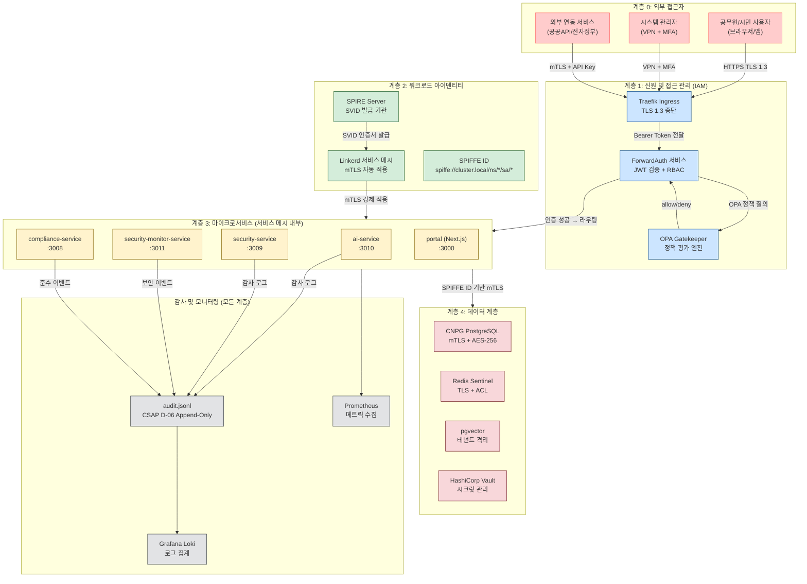
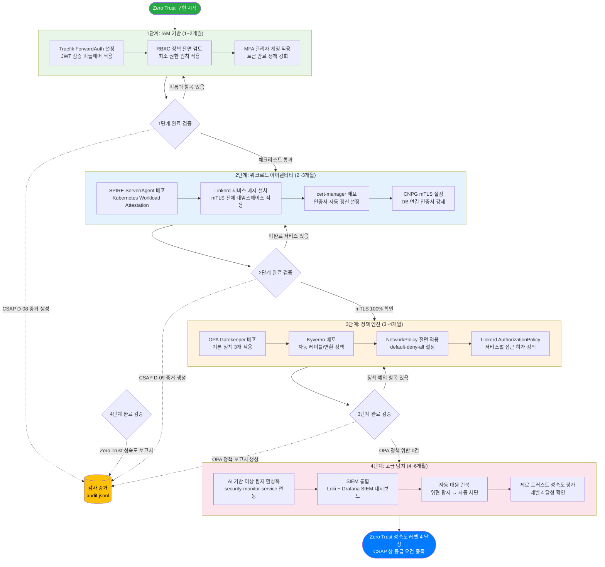

# Zero Trust 구현 완전 가이드

> 대상: 공공기관 SaaS 플랫폼 보안 담당자 및 개발자
> CSAP 준수: D-08 접근 통제, D-09 암호화, D-06 감사 로깅
> 최종 수정: 2026-04-13

---

## 목차

1. [Zero Trust란 무엇인가](#1-zero-trust란-무엇인가)
2. [Zero Trust 아키텍처 다이어그램](#2-zero-trust-아키텍처-다이어그램)
3. [security-service audit.ts 완전 분석](#3-security-service-auditts-완전-분석)
4. [security-monitor-service audit.ts 분석](#4-security-monitor-service-auditts-분석)
5. [compliance-service audit.ts 분석](#5-compliance-service-auditts-분석)
6. [SPIFFE/SPIRE 워크로드 아이덴티티](#6-spiffespire-워크로드-아이덴티티)
7. [OPA Gatekeeper 정책 작성법](#7-opa-gatekeeper-정책-작성법)
8. [Kyverno vs OPA — 선택 기준과 공존 전략](#8-kyverno-vs-opa--선택-기준과-공존-전략)
9. [mTLS 인증서 순환 — cert-manager + CNPG](#9-mtls-인증서-순환--cert-manager--cnpg)
10. [Zero Trust 삼각형 — 네트워크 격리·서비스 아이덴티티·접근 정책](#10-zero-trust-삼각형)
11. [Zero Trust 성숙도 평가 체크리스트](#11-zero-trust-성숙도-평가-체크리스트)
12. [Zero Trust 구현 로드맵](#12-zero-trust-구현-로드맵)

---

## 1. Zero Trust란 무엇인가

### 1.1 개념 정의

Zero Trust는 "신뢰하지 않음, 항상 검증(Never Trust, Always Verify)"이라는 철학을 바탕으로 하는 보안 모델입니다. 전통적인 경계 보안(Perimeter Security) 모델은 내부 네트워크에 있는 모든 것을 신뢰했습니다. 방화벽 안쪽에 들어온 사용자나 서비스는 별다른 추가 검증 없이 자원에 접근할 수 있었습니다.

하지만 이 모델에는 근본적인 취약점이 있습니다. 내부자 위협(Insider Threat), 래터럴 무브먼트(Lateral Movement), 공급망 공격(Supply Chain Attack) 등은 모두 "일단 안에 들어오면 믿을 수 있다"는 가정을 무너뜨립니다.

공공기관 SaaS 환경에서 Zero Trust는 더욱 중요합니다. 다수의 기관(테넌트)이 하나의 플랫폼을 공유하고, 각 기관 데이터는 완전히 격리되어야 하며, 내부 서비스 간 통신도 명시적으로 허가받은 것만 허용되어야 합니다.

### 1.2 Zero Trust의 핵심 원칙 5가지

**원칙 1: 명시적 검증(Verify Explicitly)**
모든 접근 요청은 신원(Identity), 위치(Location), 장치 상태(Device Health), 서비스/워크로드 컨텍스트, 비정상 행위 여부를 검증한 후에만 허가됩니다.

**원칙 2: 최소 권한(Least Privilege Access)**
모든 주체(사용자, 서비스, 워크로드)는 업무 수행에 필요한 최소한의 권한만 부여받습니다. 불필요한 권한은 CSAP D-08 위반 항목이기도 합니다.

**원칙 3: 침해 가정(Assume Breach)**
이미 공격자가 내부에 있다고 가정하고 설계합니다. 세분화(Micro-segmentation), 종단간 암호화(E2E Encryption), 세션 분석(Session Analytics)을 통해 피해 범위를 최소화합니다.

**원칙 4: 지속적 검증(Continuous Validation)**
최초 인증으로 영구적인 접근권을 부여하지 않습니다. JWT 토큰 15분 만료, 세션 주기적 재검증, 접근 컨텍스트 변화 감지 등을 통해 지속 검증합니다.

**원칙 5: 포괄적 감사(Comprehensive Audit)**
모든 접근 시도(성공/실패 모두)를 로깅합니다. CSAP D-06은 감사 로그 최소 1년 보존을 요구합니다. 감사 로그 자체도 수정/삭제가 불가능한 append-only 구조여야 합니다.

### 1.3 공공기관 SaaS에서 Zero Trust가 중요한 이유

공공기관 SaaS는 다음과 같은 이유로 특히 강력한 Zero Trust가 필요합니다.

첫째, **다중 테넌트 환경**: 기획재정부, 행정안전부, 교육부 등 서로 다른 기관이 하나의 플랫폼을 사용합니다. A 기관의 데이터가 B 기관에 노출되는 것은 CSAP C등급 위반이자 형사 처벌 대상이 될 수 있습니다.

둘째, **내부자 위협**: 공공기관 내부의 직원, 계약업체, 시스템 관리자 등 내부자에 의한 데이터 유출이 지속적으로 발생합니다. "신뢰받는 내부자"라는 개념을 폐기해야 합니다.

셋째, **마이크로서비스 복잡성**: AI 서비스, RAG 서비스, 보안 모니터링 서비스 등 수십 개의 서비스가 서로 통신합니다. 서비스 간 통신도 명시적으로 허가되어야 합니다.

넷째, **CSAP 인증 요건**: CSAP 중/상 등급은 접근 통제(D-08), 암호화(D-09), 감사 로깅(D-06) 등에서 Zero Trust 관련 요건을 명시적으로 포함합니다.

---

## 2. Zero Trust 아키텍처 다이어그램

### 2.1 Zero Trust 4계층 아키텍처

이 다이어그램은 공공기관 SaaS 플랫폼의 Zero Trust를 4개 계층으로 표현합니다. 각 계층은 "신뢰하지 않음"의 방어선을 형성합니다.



### 2.2 계층별 검증 흐름 설명

**계층 0 (외부 접근자)**: 모든 외부 접근은 신뢰하지 않습니다. 일반 사용자는 TLS 1.3으로만 진입하고, 시스템 관리자는 추가로 VPN과 MFA를 거쳐야 합니다.

**계층 1 (IAM)**: Traefik은 TLS를 종단하고 ForwardAuth에 인증을 위임합니다. ForwardAuth는 JWT 토큰을 검증하고 OPA에 RBAC 정책을 질의합니다. 이 세 단계 모두 통과해야 서비스에 접근할 수 있습니다.

**계층 2 (워크로드 아이덴티티)**: SPIRE는 각 서비스에 SPIFFE ID 기반의 X.509 인증서(SVID)를 발급합니다. Linkerd는 이 인증서를 사용해 서비스 간 통신을 자동으로 mTLS로 암호화합니다. 서비스는 "내가 ai-service다"라고 주장할 수 없고, SPIRE가 발급한 암호학적 증명만이 신원을 증명합니다.

**계층 3 (서비스)**: 서비스들은 서비스 메시 내에서 mTLS로 통신합니다. 각 서비스는 자신의 SPIFFE ID로만 접근 가능한 서비스만 호출할 수 있습니다.

**계층 4 (데이터)**: 데이터베이스, 캐시, 벡터 저장소는 모두 mTLS와 추가 인증을 요구합니다. 테넌트 데이터는 행 수준 보안(RLS)으로 격리됩니다.

---

## 3. security-service audit.ts 완전 분석

### 3.1 실제 코드 전문

`/data/ai-saas/platform/services/security-service/src/lib/audit.ts` 파일의 전체 내용은 다음과 같습니다.

```typescript
// 보안 모니터링 서비스 감사 로깅
// Design Ref: DESIGN-MTU-P15
// CSAP: D-06

import { createAuditLogger, createStandardTransport } from '@public-saas/audit-sdk';

const auditLogger = createAuditLogger({
  serviceName: 'security-service',
  transport: createStandardTransport('security-service'),
});

export async function logSecurityEvent(
  action: string,
  metadata?: Record<string, unknown>
): Promise<void> {
  await auditLogger.log({
    actor: 'system:security-service',
    action,
    target: 'security',
    targetType: 'security',
    tenantId: 'system',
    ip: process.env.SERVICE_IP || '127.0.0.1', // CSAP D-06: 내부 서비스 루프백 기본값
    userAgent: 'security-service/1.0',
    metadata,
  });
}
```

### 3.2 코드 분석 — 한 줄씩 이해하기

**1~3번째 줄: 목적과 설계 참조**

```typescript
// 보안 모니터링 서비스 감사 로깅
// Design Ref: DESIGN-MTU-P15
// CSAP: D-06
```

이 주석들은 단순한 설명이 아니라 감리 추적성의 핵심입니다. `Design Ref: DESIGN-MTU-P15`는 이 파일이 `docs/02-design/mtus/MTU-P15` 설계 문서를 따른다는 것을 의미합니다. `CSAP: D-06`은 이 코드가 CSAP 통제항목 D-06(침해사고 관리)을 구현한다는 선언입니다. 감리사는 이 주석을 보고 설계 문서와 코드를 대조할 수 있습니다.

**5번째 줄: audit-sdk 임포트**

```typescript
import { createAuditLogger, createStandardTransport } from '@public-saas/audit-sdk';
```

`@public-saas/audit-sdk`는 공공기관 SaaS 플랫폼이 자체 개발한 감사 로깅 패키지입니다. 각 서비스가 직접 `fs.appendFile`로 로그를 쓰는 대신 중앙화된 SDK를 통해 표준화된 형식으로 로그를 생성합니다.

`createStandardTransport`는 로그를 `.claude/audit.jsonl` 파일에 JSON Lines 형식으로 append-only로 기록하는 전송 방식을 생성합니다. CSAP D-06은 로그 무결성(수정/삭제 불가)을 요구하는데, append-only 파일 구조가 이를 충족합니다.

**7~10번째 줄: 감사 로거 초기화**

```typescript
const auditLogger = createAuditLogger({
  serviceName: 'security-service',
  transport: createStandardTransport('security-service'),
});
```

`serviceName: 'security-service'`는 로그 레코드에 서비스 출처를 명시합니다. 여러 서비스의 로그가 하나의 파일에 통합될 때 어느 서비스에서 발생한 이벤트인지 구분하기 위한 필수 필드입니다.

모듈 수준에서 한 번 초기화하는 패턴(Singleton)을 사용합니다. 매 함수 호출 시마다 로거를 생성하지 않아 성능 오버헤드를 방지합니다.

**12~23번째 줄: logSecurityEvent 함수**

```typescript
export async function logSecurityEvent(
  action: string,
  metadata?: Record<string, unknown>
): Promise<void> {
```

`action: string`은 이벤트 유형을 나타냅니다. 예를 들어 `'INTRUSION_DETECTED'`, `'PORT_SCAN_BLOCKED'`, `'BRUTE_FORCE_ATTEMPT'` 등입니다. 문자열 타입이므로 확장 가능하지만, 실제 사용 시에는 열거형(Enum)으로 정의하여 오탈자를 방지하는 것이 권장됩니다.

`metadata?: Record<string, unknown>`은 이벤트별 추가 정보를 자유 형식으로 담습니다. IP 주소, 공격 패턴, 차단된 요청 내용 등을 포함할 수 있습니다.

반환 타입 `Promise<void>`는 로그 기록이 비동기로 이루어짐을 보여줍니다. 파일 I/O 또는 네트워크 전송을 수반하는 감사 로그는 async/await가 필수입니다. 로그 기록에 실패했을 때 호출자가 에러를 인지하고 처리할 수 있어야 하기 때문입니다.

```typescript
  await auditLogger.log({
    actor: 'system:security-service',
    action,
    target: 'security',
    targetType: 'security',
    tenantId: 'system',
    ip: process.env.SERVICE_IP || '127.0.0.1',
    userAgent: 'security-service/1.0',
    metadata,
  });
```

**actor 필드**: `'system:security-service'`는 이 이벤트를 생성한 주체가 사람이 아니라 보안 서비스 자체임을 명시합니다. CSAP D-06은 모든 행위자(actor)를 기록하도록 요구합니다. `system:` 접두사는 자동화 시스템이 생성한 이벤트임을 나타내는 컨벤션입니다.

**target/targetType 필드**: `'security'`로 고정되어 있습니다. 이는 보안 서비스가 보안 자원 자체를 대상으로 동작함을 나타냅니다. 예를 들어 방화벽 규칙, 접근 차단 목록 등이 대상이 됩니다.

**tenantId 필드**: `'system'`으로 고정됩니다. 보안 서비스는 특정 테넌트에 종속되지 않고 전체 시스템 레벨에서 동작하기 때문입니다. 테넌트별 보안 이벤트는 해당 테넌트의 ID로 기록되어야 합니다.

**ip 필드**: `process.env.SERVICE_IP || '127.0.0.1'` — 환경 변수에서 서비스 IP를 읽고, 없으면 루프백을 사용합니다. 하드코딩하지 않는 것이 CSAP 시크릿 관리 요건에 부합합니다. 서비스는 Kubernetes Pod에서 실행되므로 Pod IP가 환경 변수로 주입됩니다.

**userAgent 필드**: `'security-service/1.0'`은 로그 분석 시 어떤 서비스 버전이 이벤트를 생성했는지 추적하는 데 사용됩니다.

### 3.3 logSecurityEvent 호출 패턴 예시

실제 보안 서비스에서 이 함수를 호출하는 방법입니다.

```typescript
// 침입 탐지 이벤트 기록
await logSecurityEvent('INTRUSION_DETECTED', {
  sourceIp: '203.0.113.100',
  attackType: 'sql_injection',
  targetEndpoint: '/api/users',
  blocked: true,
  ruleId: 'WAF-SQL-001',
});

// 비정상 접근 패턴 감지
await logSecurityEvent('ANOMALY_DETECTED', {
  userId: 'user-uuid-여기',
  anomalyType: 'unusual_access_time',
  riskScore: 0.87,
  baselineHour: 9,
  actualHour: 3,
});

// 방화벽 규칙 변경
await logSecurityEvent('FIREWALL_RULE_CHANGED', {
  changedBy: 'admin:system',
  ruleId: 'FW-100',
  oldAction: 'allow',
  newAction: 'deny',
  reason: '위협 인텔리전스 업데이트',
});
```

### 3.4 CSAP D-06 준수 관점에서의 분석

CSAP D-06(침해사고 관리)의 핵심 요건과 이 코드의 매핑입니다.

| CSAP D-06 요건 | 코드 구현 | 충족 여부 |
|---|---|---|
| 보안 이벤트 전수 기록 | `logSecurityEvent` 함수 | 충족 |
| 행위자(actor) 기록 | `actor: 'system:security-service'` | 충족 |
| 대상(target) 기록 | `target: 'security'` | 충족 |
| 타임스탬프 기록 | audit-sdk 내부 자동 생성 | 충족 |
| IP 주소 기록 | `ip: process.env.SERVICE_IP` | 충족 |
| 로그 무결성(수정 불가) | append-only transport | 충족 |
| 로그 1년 보존 | 운영 정책으로 관리 | 별도 설정 필요 |

---

## 4. security-monitor-service audit.ts 분석

### 4.1 실제 코드

`/data/ai-saas/platform/services/security-monitor-service/src/lib/audit.ts`

```typescript
// 보안 모니터링 서비스 감사 로깅
// Design Ref: DESIGN-MTU-P15
// CSAP: D-06

import { createAuditLogger, createStandardTransport } from '@public-saas/audit-sdk';

const auditLogger = createAuditLogger({
  serviceName: 'security-monitor-service',
  transport: createStandardTransport('security-monitor-service'),
});

export async function logSecurityEvent(
  action: string,
  metadata?: Record<string, unknown>
): Promise<void> {
  await auditLogger.log({
    actor: 'system:security-monitor',
    action,
    target: 'security',
    targetType: 'security',
    tenantId: 'system',
    ip: process.env.SERVICE_IP || '127.0.0.1',
    userAgent: 'security-monitor-service/1.0',
    metadata,
  });
}
```

### 4.2 security-service와의 차이점 분석

두 서비스의 audit.ts는 구조가 거의 동일하지만 중요한 차이점이 있습니다.

| 항목 | security-service | security-monitor-service |
|---|---|---|
| serviceName | `'security-service'` | `'security-monitor-service'` |
| actor | `'system:security-service'` | `'system:security-monitor'` |
| userAgent | `'security-service/1.0'` | `'security-monitor-service/1.0'` |
| 역할 | 보안 정책 실행 | 실시간 위협 모니터링 |

이 차이가 중요한 이유는 **로그 분석 시 이벤트 출처를 명확히 구분**할 수 있기 때문입니다. 침해 사고 발생 시 "보안 정책이 차단한 것인가(security-service)" vs "모니터링이 탐지한 것인가(security-monitor-service)"를 구분해야 올바른 대응이 가능합니다.

### 4.3 실시간 위협 탐지 로깅 패턴

security-monitor-service는 실시간으로 다음과 같은 위협을 탐지하고 로깅합니다.

```typescript
// 비정상 로그인 패턴 탐지
await logSecurityEvent('BRUTE_FORCE_DETECTED', {
  targetUser: 'user@example.go.kr',
  attemptCount: 15,
  timeWindowSeconds: 300,
  sourceIps: ['203.0.113.1', '203.0.113.2', '203.0.113.3'],
  blocked: true,
  blockDurationSeconds: 3600,
});

// API 이상 호출 탐지
await logSecurityEvent('API_ANOMALY_DETECTED', {
  tenantId: 'tenant-uuid',
  endpoint: '/ai/rag/query',
  normalRatePerMinute: 5,
  actualRatePerMinute: 47,
  anomalyScore: 0.94,
  action: 'rate_limit_applied',
});

// 민감 데이터 접근 이상 패턴
await logSecurityEvent('SENSITIVE_DATA_ACCESS_ANOMALY', {
  userId: 'user-uuid',
  resourceType: 'personal_information',
  accessCount24h: 1247,
  normalCount24h: 12,
  riskLevel: 'critical',
  autoBlocked: true,
});
```

### 4.4 실시간 위협 모니터링 아키텍처

security-monitor-service는 다음 데이터 소스를 지속적으로 모니터링합니다.

```
Loki 로그 스트림
    │
    ▼
LogQL 쿼리 (1분 주기)
    │
    ├── 비정상 인증 시도 (5분 내 5회 실패)
    ├── 비정상 API 호출 빈도 (정상 대비 10배 초과)
    ├── 야간 민감 자원 접근 (23:00 ~ 06:00)
    └── 특권 계정 이상 행동
    │
    ▼
위협 점수 계산 (0.0 ~ 1.0)
    │
    ├── 0.0 ~ 0.3: 정보 로깅만
    ├── 0.3 ~ 0.7: 경고 + Slack 알림
    ├── 0.7 ~ 0.9: 즉시 차단 + 담당자 통보
    └── 0.9 ~ 1.0: 계정 잠금 + CSOC 에스컬레이션
    │
    ▼
logSecurityEvent 호출 (CSAP D-06)
```

---

## 5. compliance-service audit.ts 분석

### 5.1 실제 코드

`/data/ai-saas/platform/services/compliance-service/src/lib/audit.ts`

```typescript
// 준수 현황 서비스 감사 로깅
// Design Ref: DESIGN-MTU-P14
// CSAP: D-06

import { createAuditLogger, createStandardTransport } from '@public-saas/audit-sdk';

const auditLogger = createAuditLogger({
  serviceName: 'compliance-service',
  transport: createStandardTransport('compliance-service'),
});

export async function logComplianceEvent(
  action: string,
  metadata?: Record<string, unknown>
): Promise<void> {
  await auditLogger.log({
    actor: 'system:compliance-service',
    action,
    target: 'compliance',
    targetType: 'compliance',
    tenantId: 'system',
    ip: process.env.SERVICE_IP || '127.0.0.1',
    userAgent: 'compliance-service/1.0',
    metadata,
  });
}
```

### 5.2 security-service와의 핵심 차이점

가장 중요한 차이는 함수명입니다.

| 항목 | security-service | compliance-service |
|---|---|---|
| 함수명 | `logSecurityEvent` | `logComplianceEvent` |
| target | `'security'` | `'compliance'` |
| targetType | `'security'` | `'compliance'` |
| Design Ref | `DESIGN-MTU-P15` | `DESIGN-MTU-P14` |

함수명이 `logComplianceEvent`인 이유는 이 서비스가 다루는 이벤트의 성격이 다르기 때문입니다. 보안 이벤트(침입, 차단)가 아니라 준수 이벤트(감사 수행, 체크리스트 통과/실패, 인증 갱신 등)를 기록합니다.

### 5.3 logComplianceEvent — CSAP 증거 생성 패턴

compliance-service는 CSAP 심사를 위한 법적 증거를 생성합니다. 다음은 주요 사용 패턴입니다.

```typescript
// CSAP 체크리스트 항목 검증 완료
await logComplianceEvent('CSAP_CHECKLIST_VERIFIED', {
  checklistId: 'D-08-01',
  category: '접근통제',
  result: 'PASS',
  verifiedBy: 'system:compliance-service',
  evidence: [
    'RBAC 정책 구성 확인됨',
    'JWT 토큰 15분 만료 설정 확인됨',
    '세션 3개 제한 설정 확인됨',
  ],
  nextReviewDate: '2026-07-01',
});

// CSAP 인증 갱신 필요 알림
await logComplianceEvent('CSAP_CERTIFICATION_EXPIRY_WARNING', {
  certificationLevel: '중',
  expiryDate: '2026-10-01',
  daysRemaining: 172,
  requiredActions: [
    '연간 취약점 점검 수행',
    '접근 권한 반기 검토',
    '암호화 키 갱신',
  ],
});

// N2SF 데이터 등급 위반 기록
await logComplianceEvent('N2SF_GRADE_VIOLATION_RECORDED', {
  requestId: 'req-uuid',
  attemptedGrade: 'C',
  allowedGrade: 'O',
  endpoint: '/ai/rag/query',
  blocked: true,
  tenantId: 'tenant-uuid',
  reportedTo: 'security-team',
});

// 월간 감사 보고서 생성
await logComplianceEvent('AUDIT_REPORT_GENERATED', {
  reportType: 'monthly',
  period: '2026-03',
  totalChecks: 79,
  passedChecks: 75,
  failedChecks: 4,
  passRate: 0.9494,
  reportUrl: '/compliance/reports/2026-03',
});
```

### 5.4 세 서비스 감사 로그 통합 분석

세 서비스의 감사 로그는 `.claude/audit.jsonl`에 통합 기록됩니다. 각 레코드는 다음 구조를 가집니다.

```json
{
  "timestamp": "2026-04-13T09:30:00.000Z",
  "serviceName": "security-service",
  "actor": "system:security-service",
  "action": "INTRUSION_DETECTED",
  "target": "security",
  "targetType": "security",
  "tenantId": "system",
  "ip": "10.0.0.15",
  "userAgent": "security-service/1.0",
  "metadata": {
    "sourceIp": "203.0.113.100",
    "attackType": "sql_injection",
    "blocked": true
  }
}
```

SIEM(Security Information and Event Management) 시스템이나 Grafana Loki에서 이 로그를 분석할 때 `serviceName` 필드로 출처를 구분하고, `action` 필드로 이벤트 유형을 필터링하고, `tenantId`로 기관별 통계를 생성할 수 있습니다.

---

## 6. SPIFFE/SPIRE 워크로드 아이덴티티

### 6.1 SPIFFE/SPIRE란 무엇인가

SPIFFE(Secure Production Identity Framework For Everyone)는 워크로드(컨테이너, 서비스, 프로세스)에 암호학적으로 검증 가능한 신원을 부여하는 표준입니다. SPIRE(SPIFFE Runtime Environment)는 SPIFFE를 구현한 오픈소스 소프트웨어입니다.

Zero Trust의 "서비스 아이덴티티" 문제를 해결합니다. 기존 방식에서 서비스 간 신원 확인은 다음과 같이 취약했습니다.

```
# 기존 방식 (취약)
service-A가 service-B에게: "나는 ai-service야"
service-B: "그래, 믿을게"
→ 누군가 네트워크에 침투하면 "나는 ai-service야"라고 주장 가능
```

SPIFFE/SPIRE 방식은 다음과 같습니다.

```
# SPIFFE/SPIRE 방식 (안전)
SPIRE Server가 ai-service Pod에게 SVID(X.509 인증서) 발급
  - Subject: spiffe://cluster.local/ns/ai-service/sa/ai-service
  - Issued by: SPIRE Server (Kubernetes Workload Attestation)
  - Expires: 1시간 (자동 갱신)

service-B: SVID의 SPIFFE URI를 확인 → 암호학적으로 검증됨
→ 위조 불가능
```

### 6.2 SPIFFE URI 구조

공공기관 SaaS에서 사용하는 SPIFFE URI 형식입니다.

```
spiffe://{trust-domain}/ns/{namespace}/sa/{service-account}

예시:
spiffe://cluster.local/ns/default/sa/ai-service
spiffe://cluster.local/ns/security/sa/security-monitor-service
spiffe://cluster.local/ns/compliance/sa/compliance-service
spiffe://cluster.local/ns/tenant-a/sa/portal
```

| 구성요소 | 의미 | 예시 |
|---|---|---|
| `cluster.local` | 신뢰 도메인 | k3s 클러스터의 신뢰 도메인 |
| `ns/default` | Kubernetes 네임스페이스 | 서비스가 배포된 네임스페이스 |
| `sa/ai-service` | Kubernetes 서비스 어카운트 | 서비스에 할당된 어카운트명 |

### 6.3 SPIRE Server 설치 — k3s 환경

```yaml
# spire-server.yaml
apiVersion: apps/v1
kind: StatefulSet
metadata:
  name: spire-server
  namespace: spire
spec:
  replicas: 1
  selector:
    matchLabels:
      app: spire-server
  template:
    metadata:
      labels:
        app: spire-server
    spec:
      serviceAccountName: spire-server
      containers:
        - name: spire-server
          image: ghcr.io/spiffe/spire-server:1.9.0
          args:
            - -config
            - /run/spire/config/server.conf
          volumeMounts:
            - name: spire-config
              mountPath: /run/spire/config
              readOnly: true
            - name: spire-data
              mountPath: /run/spire/data
      volumes:
        - name: spire-config
          configMap:
            name: spire-server-config
        - name: spire-data
          emptyDir: {}
---
# SPIRE Server 설정
apiVersion: v1
kind: ConfigMap
metadata:
  name: spire-server-config
  namespace: spire
data:
  server.conf: |
    server {
      bind_address = "0.0.0.0"
      bind_port = "8081"
      trust_domain = "cluster.local"
      data_dir = "/run/spire/data"
      log_level = "INFO"
      ca_ttl = "24h"
      default_x509_svid_ttl = "1h"
    }
    plugins {
      DataStore "sql" {
        plugin_data {
          database_type = "sqlite3"
          connection_string = "/run/spire/data/datastore.sqlite3"
        }
      }
      NodeAttestor "k8s_psat" {
        plugin_data {
          clusters = {
            "k3s-cluster" = {
              service_account_allow_list = ["spire:spire-agent"]
            }
          }
        }
      }
      KeyManager "memory" {
        plugin_data {}
      }
      Notifier "k8sbundle" {
        plugin_data {
          namespace = "spire"
        }
      }
    }
```

### 6.4 SPIRE Agent — 각 노드에 DaemonSet으로 배포

```yaml
# spire-agent.yaml
apiVersion: apps/v1
kind: DaemonSet
metadata:
  name: spire-agent
  namespace: spire
spec:
  selector:
    matchLabels:
      app: spire-agent
  template:
    metadata:
      labels:
        app: spire-agent
    spec:
      hostPID: true
      hostNetwork: true
      dnsPolicy: ClusterFirstWithHostNet
      serviceAccountName: spire-agent
      initContainers:
        - name: init
          image: cgr.dev/chainguard/wait-for-it:latest
          args: ["-t", "30", "spire-server:8081"]
      containers:
        - name: spire-agent
          image: ghcr.io/spiffe/spire-agent:1.9.0
          args: ["-config", "/run/spire/config/agent.conf"]
          volumeMounts:
            - name: spire-config
              mountPath: /run/spire/config
              readOnly: true
            - name: spire-agent-socket
              mountPath: /run/spire/sockets
            - name: spiffe-bundle
              mountPath: /run/spire/bundle
      volumes:
        - name: spire-config
          configMap:
            name: spire-agent-config
        - name: spire-agent-socket
          hostPath:
            path: /run/spire/sockets
            type: DirectoryOrCreate
        - name: spiffe-bundle
          configMap:
            name: spire-bundle
```

### 6.5 Linkerd와 SPIRE 통합

Linkerd 2.x는 SPIRE를 신뢰 앵커(Trust Anchor)로 사용할 수 있습니다.

```yaml
# linkerd-values.yaml — SPIRE 통합 설정
identity:
  externalCA: true
  serviceAccountTokenProjection: true

# SPIRE가 Linkerd 인증서 발급자 역할
identityTrustAnchorsPEM: |
  -----BEGIN CERTIFICATE-----
  (SPIRE CA 인증서 내용)
  -----END CERTIFICATE-----
```

각 서비스의 Linkerd Proxy는 SPIRE Agent로부터 SVID를 받아 mTLS 연결을 수립합니다.

```
ai-service Pod                    compliance-service Pod
    │                                      │
    │ SVID: spiffe://cluster.local/        │ SVID: spiffe://cluster.local/
    │       ns/default/sa/ai-service       │       ns/default/sa/compliance-service
    │                                      │
    └────── mTLS (SPIFFE SVID 상호 검증) ──┘
```

### 6.6 서비스 인가 정책 — AuthorizationPolicy

SPIFFE ID를 기반으로 어떤 서비스가 어떤 서비스를 호출할 수 있는지 명시적으로 정의합니다.

```yaml
# ai-service가 compliance-service를 호출 허가
apiVersion: policy.linkerd.io/v1beta3
kind: AuthorizationPolicy
metadata:
  name: allow-ai-to-compliance
  namespace: default
spec:
  targetRef:
    group: core
    kind: Service
    name: compliance-service
  requiredAuthenticationRefs:
    - name: ai-service-identity
      kind: MeshTLSAuthentication
      group: policy.linkerd.io
---
apiVersion: policy.linkerd.io/v1beta2
kind: MeshTLSAuthentication
metadata:
  name: ai-service-identity
  namespace: default
spec:
  identities:
    - "spiffe://cluster.local/ns/default/sa/ai-service"
---
# 기본 거부 정책 — 명시적으로 허가하지 않은 모든 통신 차단
apiVersion: policy.linkerd.io/v1beta1
kind: NetworkAuthentication
metadata:
  name: default-deny
  namespace: default
spec:
  networks:
    - cidr: "0.0.0.0/0"
      except:
        - cidr: "10.0.0.0/8"  # 클러스터 내부만 허용
```

---

## 7. OPA Gatekeeper 정책 작성법

### 7.1 OPA Gatekeeper란

OPA(Open Policy Agent) Gatekeeper는 Kubernetes Admission Controller로 동작하는 정책 엔진입니다. Kubernetes에 리소스를 생성/수정할 때 Gatekeeper가 먼저 검사하고, 정책 위반 시 거부합니다.

공공기관 SaaS에서 OPA Gatekeeper의 역할은 다음과 같습니다.

- 승인되지 않은 컨테이너 이미지 배포 차단
- 보안 컨텍스트 없는 Pod 배포 차단
- 테넌트 격리 정책 위반 리소스 차단
- 과도한 리소스 할당 차단

### 7.2 ConstraintTemplate 구조 이해

ConstraintTemplate은 정책의 "형태"를 정의합니다. 실제 정책 값은 Constraint 리소스에서 지정합니다.

```yaml
# constraint-template-approved-images.yaml
# 목적: 승인된 컨테이너 이미지 레지스트리만 허용
apiVersion: templates.gatekeeper.sh/v1
kind: ConstraintTemplate
metadata:
  name: allowedimageregistries
  annotations:
    description: "승인된 이미지 레지스트리에서만 컨테이너 배포 허용 (CSAP D-12)"
spec:
  crd:
    spec:
      names:
        kind: AllowedImageRegistries
      validation:
        openAPIV3Schema:
          type: object
          properties:
            registries:
              type: array
              description: "허용된 레지스트리 목록"
              items:
                type: string
  targets:
    - target: admission.k8s.gatekeeper.sh
      rego: |
        package allowedimageregistries

        # 위반 메시지 생성
        violation[{"msg": msg}] {
          container := input.review.object.spec.containers[_]
          not is_allowed_registry(container.image)
          msg := sprintf(
            "컨테이너 '%v'의 이미지 '%v'는 허용되지 않은 레지스트리입니다. (CSAP D-12)",
            [container.name, container.image]
          )
        }

        # initContainers도 검사
        violation[{"msg": msg}] {
          container := input.review.object.spec.initContainers[_]
          not is_allowed_registry(container.image)
          msg := sprintf(
            "initContainer '%v'의 이미지 '%v'는 허용되지 않은 레지스트리입니다. (CSAP D-12)",
            [container.name, container.image]
          )
        }

        # 허용 레지스트리 확인 함수
        is_allowed_registry(image) {
          registry := input.parameters.registries[_]
          startswith(image, registry)
        }
```

### 7.3 정책 1: 승인된 이미지 레지스트리 강제

```yaml
# constraint-approved-images.yaml
apiVersion: constraints.gatekeeper.sh/v1beta1
kind: AllowedImageRegistries
metadata:
  name: prod-approved-registries
  annotations:
    csap-control: "D-12-05"
    description: "공공기관 SaaS 승인 레지스트리 목록"
spec:
  match:
    kinds:
      - apiGroups: [""]
        kinds: ["Pod"]
    namespaces:
      - default
      - ai-service
      - security
  parameters:
    registries:
      - "registry.internal.go.kr/"  # 내부 프라이빗 레지스트리
      - "ghcr.io/public-saas/"       # 공개 SaaS 레지스트리
      - "cgr.dev/chainguard/"        # 강화된 기반 이미지
```

### 7.4 정책 2: 루트 컨테이너 실행 금지

```yaml
# constraint-template-no-root.yaml
apiVersion: templates.gatekeeper.sh/v1
kind: ConstraintTemplate
metadata:
  name: norootocontainers
  annotations:
    description: "루트(UID=0)로 실행되는 컨테이너 차단 (CSAP D-08, N2SF)"
spec:
  crd:
    spec:
      names:
        kind: NoRootContainers
  targets:
    - target: admission.k8s.gatekeeper.sh
      rego: |
        package norootocontainers

        # Pod 레벨 runAsNonRoot 미설정 위반
        violation[{"msg": msg}] {
          container := input.review.object.spec.containers[_]
          not container.securityContext.runAsNonRoot
          msg := sprintf(
            "컨테이너 '%v': securityContext.runAsNonRoot=true 필수 (CSAP D-08)",
            [container.name]
          )
        }

        # runAsUser=0 명시적 설정 위반
        violation[{"msg": msg}] {
          container := input.review.object.spec.containers[_]
          container.securityContext.runAsUser == 0
          msg := sprintf(
            "컨테이너 '%v': runAsUser=0(root) 실행 금지 (CSAP D-08)",
            [container.name]
          )
        }

        # 읽기 전용 루트 파일시스템 강제
        violation[{"msg": msg}] {
          container := input.review.object.spec.containers[_]
          not container.securityContext.readOnlyRootFilesystem
          msg := sprintf(
            "컨테이너 '%v': readOnlyRootFilesystem=true 필수 (CSAP D-12)",
            [container.name]
          )
        }
---
apiVersion: constraints.gatekeeper.sh/v1beta1
kind: NoRootContainers
metadata:
  name: enforce-no-root
  annotations:
    csap-control: "D-08-09, D-12-03"
spec:
  match:
    kinds:
      - apiGroups: [""]
        kinds: ["Pod"]
    namespaces:
      - default
      - ai-service
      - security
      - compliance
```

### 7.5 정책 3: 테넌트 격리 — 네임스페이스 레이블 강제

```yaml
# constraint-template-tenant-isolation.yaml
apiVersion: templates.gatekeeper.sh/v1
kind: ConstraintTemplate
metadata:
  name: tenantisolationlabel
  annotations:
    description: "모든 Pod에 테넌트 레이블 필수 — N2SF 데이터 격리 근거"
spec:
  crd:
    spec:
      names:
        kind: TenantIsolationLabel
      validation:
        openAPIV3Schema:
          type: object
          properties:
            requiredLabels:
              type: array
              items:
                type: string
  targets:
    - target: admission.k8s.gatekeeper.sh
      rego: |
        package tenantisolationlabel

        violation[{"msg": msg}] {
          label := input.parameters.requiredLabels[_]
          not input.review.object.metadata.labels[label]
          msg := sprintf(
            "Pod에 필수 레이블 '%v' 누락. 테넌트 격리를 위해 필수 (N2SF N-04)",
            [label]
          )
        }

        # 테넌트 ID가 유효한 UUID 형식인지 검증
        violation[{"msg": msg}] {
          tenantId := input.review.object.metadata.labels["tenant-id"]
          not is_valid_uuid(tenantId)
          msg := sprintf(
            "tenant-id 레이블 값 '%v'이 유효한 UUID 형식이 아닙니다",
            [tenantId]
          )
        }

        is_valid_uuid(s) {
          regex.match(
            `^[0-9a-f]{8}-[0-9a-f]{4}-4[0-9a-f]{3}-[89ab][0-9a-f]{3}-[0-9a-f]{12}$`,
            s
          )
        }
---
apiVersion: constraints.gatekeeper.sh/v1beta1
kind: TenantIsolationLabel
metadata:
  name: enforce-tenant-labels
  annotations:
    csap-control: "D-08-01"
    n2sf-control: "N-04"
spec:
  match:
    kinds:
      - apiGroups: ["apps"]
        kinds: ["Deployment", "StatefulSet", "DaemonSet"]
  parameters:
    requiredLabels:
      - "tenant-id"
      - "data-classification"
      - "csap-scope"
```

### 7.6 Gatekeeper 운영 명령어

```bash
# Gatekeeper 설치 (k3s 환경)
kubectl apply -f https://raw.githubusercontent.com/open-policy-agent/gatekeeper/v3.15.0/deploy/gatekeeper.yaml

# 정책 위반 현황 조회
kubectl get constraints
kubectl describe norootocontainers enforce-no-root

# 특정 Namespace에서의 위반 확인
kubectl get events \
  --field-selector reason=FailedCreate \
  -n default | grep gatekeeper

# Gatekeeper Audit 결과 조회 (기존 리소스 위반 검사)
kubectl get constraintpodstatuses -n gatekeeper-system

# 정책 드라이런 모드 (경고만, 차단 안 함)
kubectl annotate constraints enforce-no-root \
  gatekeeper.sh/enforcement-action=warn
```

---

## 8. Kyverno vs OPA — 선택 기준과 공존 전략

### 8.1 두 도구 비교

| 항목 | OPA Gatekeeper | Kyverno |
|---|---|---|
| 정책 언어 | Rego (별도 학습 필요) | YAML (K8s 친화적) |
| 학습 곡선 | 높음 | 낮음 |
| 유연성 | 매우 높음 | 높음 |
| 정책 생성/수정 | Rego 작성 필요 | YAML 수정만으로 가능 |
| 변환(Mutation) | 제한적 | 강력함 |
| 보고서 생성 | 기본 기능 | PolicyReport CRD 내장 |
| CNCF 성숙도 | Graduated | Incubating |
| 공공기관 채택 | 많음 | 증가 중 |

### 8.2 언제 무엇을 선택할 것인가

**OPA Gatekeeper를 선택하는 경우:**
- 복잡한 비즈니스 로직이 필요한 정책 (예: 테넌트별 다른 규칙)
- 외부 데이터 소스와 연동하는 정책 (예: 허용 이미지 목록을 DB에서 조회)
- 여러 서비스에 걸친 통합 정책 (K8s 외에도 적용)
- 팀에 Rego 전문가가 있는 경우

**Kyverno를 선택하는 경우:**
- 빠른 정책 구현이 필요한 경우
- 컨테이너 자동 레이블 추가 등 변환(Mutation) 중심 정책
- K8s 운영팀이 Rego를 배우기 어려운 경우
- PolicyReport로 간편한 감사 보고서가 필요한 경우

### 8.3 공공기관 SaaS 공존 전략

공공기관 SaaS에서는 두 도구를 계층별로 역할을 분리하여 사용합니다.

```
OPA Gatekeeper (복잡 검증 정책 담당)
  ├── 이미지 레지스트리 검증 (Rego로 복잡한 패턴 검사)
  ├── 테넌트 격리 정책 (테넌트별 맞춤 로직)
  └── CSAP 통제항목 검증 (79개 항목 중 복잡한 것)

Kyverno (간단 변환/검증 정책 담당)
  ├── 자동 레이블 추가 (tenant-id, data-classification)
  ├── 기본 보안 컨텍스트 자동 설정
  ├── ResourceQuota 자동 생성
  └── NetworkPolicy 자동 적용
```

```yaml
# Kyverno 예시: 배포 시 자동으로 data-classification 레이블 추가
apiVersion: kyverno.io/v1
kind: ClusterPolicy
metadata:
  name: add-data-classification-label
  annotations:
    policies.kyverno.io/description: |
      data-classification 레이블이 없는 Pod에 기본값 'internal'을 자동 추가.
      N2SF 데이터 분류 요건 지원 (N-03)
spec:
  rules:
    - name: add-default-classification
      match:
        any:
          - resources:
              kinds:
                - Pod
      mutate:
        patchStrategicMerge:
          metadata:
            labels:
              +(data-classification): "internal"
```

---

## 9. mTLS 인증서 순환 — cert-manager + CNPG

### 9.1 인증서 자동 갱신의 중요성

mTLS에서 인증서가 만료되면 서비스 간 통신이 전면 차단됩니다. 수동 갱신은 다음 문제를 야기합니다.

- 갱신을 잊으면 장애 발생 (인증서 만료로 인한 운영 중단)
- 갱신 절차에 사람이 개입하면 보안 리스크 (절차 오류, 내부자 위협)
- 수십 개 서비스의 인증서를 수동으로 관리하는 것은 비현실적

cert-manager는 이 문제를 해결하는 Kubernetes 네이티브 인증서 관리 도구입니다.

### 9.2 cert-manager 설치 및 ClusterIssuer 설정

```bash
# cert-manager 설치
kubectl apply -f https://github.com/cert-manager/cert-manager/releases/download/v1.14.0/cert-manager.yaml

# 설치 확인
kubectl -n cert-manager get pods
```

```yaml
# cluster-issuer-internal-ca.yaml
# 공공기관 내부 CA를 사용하는 ClusterIssuer
apiVersion: cert-manager.io/v1
kind: ClusterIssuer
metadata:
  name: internal-ca-issuer
  annotations:
    csap-control: "D-09-02"
    description: "공공기관 내부 CA — CSAP D-09 암호화 인증서 발급"
spec:
  ca:
    secretName: internal-ca-key-pair  # 내부 CA 키 쌍 (Vault에서 주입)
---
# Vault 연동 ClusterIssuer (PKI Secrets Engine 사용)
apiVersion: cert-manager.io/v1
kind: ClusterIssuer
metadata:
  name: vault-issuer
  annotations:
    csap-control: "D-09-03"
spec:
  vault:
    path: pki/sign/public-saas
    server: https://vault.internal:8200
    auth:
      kubernetes:
        role: cert-manager
        mountPath: /v1/auth/kubernetes
```

### 9.3 서비스 인증서 자동 발급

```yaml
# ai-service-certificate.yaml
apiVersion: cert-manager.io/v1
kind: Certificate
metadata:
  name: ai-service-mtls-cert
  namespace: default
  annotations:
    csap-control: "D-09-01"
    description: "ai-service mTLS 인증서 — 30일 유효, 7일 전 자동 갱신"
spec:
  secretName: ai-service-mtls-tls
  issuerRef:
    name: internal-ca-issuer
    kind: ClusterIssuer
  commonName: "ai-service.default.svc.cluster.local"
  dnsNames:
    - "ai-service.default.svc.cluster.local"
    - "ai-service.default.svc"
    - "ai-service"
  duration: 720h    # 30일 유효
  renewBefore: 168h # 7일 전 자동 갱신
  privateKey:
    algorithm: ECDSA
    size: 256
    rotationPolicy: Always  # 갱신 시마다 새 키 생성
  usages:
    - digital signature
    - key encipherment
    - client auth
    - server auth
```

### 9.4 CNPG(CloudNativePG) 데이터베이스 인증서 설정

CNPG는 PostgreSQL을 Kubernetes에서 운영하는 오퍼레이터입니다. 데이터베이스 연결도 mTLS로 보호합니다.

```yaml
# cnpg-cluster.yaml
apiVersion: postgresql.cnpg.io/v1
kind: Cluster
metadata:
  name: public-saas-db
  namespace: default
  annotations:
    csap-control: "D-09-01, D-09-02"
spec:
  instances: 3
  imageName: ghcr.io/cloudnative-pg/postgresql:16.2

  # mTLS 설정 — cert-manager 연동
  certificates:
    serverTLSSecret: cnpg-server-mtls-tls
    serverCASecret: internal-ca-secret
    clientCASecret: internal-ca-secret
    replicationTLSSecret: cnpg-replication-mtls-tls

  # PostgreSQL SSL 강제
  postgresql:
    parameters:
      ssl: "on"
      ssl_min_protocol_version: "TLSv1.3"
      ssl_ciphers: "HIGH:!aNULL:!MD5"
      # 클라이언트 인증서 검증 강제 (clientcert=verify-full)
      ssl_ca_file: "/etc/ssl/certs/ca.crt"
```

```yaml
# cnpg-server-certificate.yaml
apiVersion: cert-manager.io/v1
kind: Certificate
metadata:
  name: cnpg-server-mtls
  namespace: default
spec:
  secretName: cnpg-server-mtls-tls
  issuerRef:
    name: internal-ca-issuer
    kind: ClusterIssuer
  commonName: "public-saas-db-rw.default.svc.cluster.local"
  dnsNames:
    - "public-saas-db-rw.default.svc.cluster.local"
    - "public-saas-db-r.default.svc.cluster.local"
    - "public-saas-db-ro.default.svc.cluster.local"
  duration: 720h
  renewBefore: 168h
  privateKey:
    algorithm: ECDSA
    size: 256
    rotationPolicy: Always
  usages:
    - digital signature
    - key encipherment
    - server auth
```

### 9.5 인증서 갱신 모니터링

```yaml
# Prometheus AlertRule — 인증서 만료 경고
apiVersion: monitoring.coreos.com/v1
kind: PrometheusRule
metadata:
  name: cert-expiry-alerts
  namespace: monitoring
spec:
  groups:
    - name: certificate-expiry
      interval: 1h
      rules:
        - alert: CertificateExpiringSoon
          expr: |
            certmanager_certificate_expiration_timestamp_seconds
            - time() < 7 * 24 * 3600
          labels:
            severity: warning
            csap-control: D-09
          annotations:
            summary: "인증서 만료 7일 이내: {{ $labels.name }}"
            description: |
              네임스페이스 {{ $labels.namespace }}의
              인증서 {{ $labels.name }}이
              {{ $value | humanizeDuration }} 후 만료됩니다.
              CSAP D-09 준수를 위해 즉시 확인하십시오.

        - alert: CertificateExpired
          expr: |
            certmanager_certificate_expiration_timestamp_seconds - time() < 0
          labels:
            severity: critical
            csap-control: D-09
          annotations:
            summary: "인증서 만료됨: {{ $labels.name }}"
            description: |
              [긴급] 네임스페이스 {{ $labels.namespace }}의
              인증서 {{ $labels.name }}이 만료되었습니다.
              서비스 간 mTLS 통신이 차단될 수 있습니다.
```

---

## 10. Zero Trust 삼각형

### 10.1 세 가지 핵심 요소

Zero Trust는 다음 세 요소가 서로 보완하며 완성됩니다. 하나라도 빠지면 Zero Trust라 할 수 없습니다.

```
           [네트워크 격리]
                △
               / \
              /   \
             /     \
            /       \
           /  Zero   \
          /  Trust    \
         /  삼각형    \
        ◁─────────────▷
[서비스 아이덴티티]  [접근 정책]
```

**꼭짓점 1: 네트워크 격리**
서비스 간 통신은 기본적으로 차단됩니다. Kubernetes NetworkPolicy와 Linkerd AuthorizationPolicy를 통해 명시적으로 허가된 통신만 가능합니다.

**꼭짓점 2: 서비스 아이덴티티**
모든 서비스는 SPIFFE/SPIRE가 발급한 암호학적으로 검증 가능한 신원을 가집니다. "나는 ai-service다"라는 주장이 아니라 X.509 인증서가 신원을 증명합니다.

**꼭짓점 3: 접근 정책**
OPA Gatekeeper와 Linkerd AuthorizationPolicy를 통해 "누가 무엇을 할 수 있는가"를 명시적으로 정의합니다. 기본은 거부(Default Deny)이며, 허가만 열립니다.

### 10.2 네트워크 격리 — Kubernetes NetworkPolicy

```yaml
# 기본 거부 정책 — 모든 Ingress/Egress 차단
apiVersion: networking.k8s.io/v1
kind: NetworkPolicy
metadata:
  name: default-deny-all
  namespace: default
  annotations:
    csap-control: "D-08-07"
    description: "Zero Trust 기반 기본 거부 정책 — 명시적 허가만 통신 가능"
spec:
  podSelector: {}  # 네임스페이스 전체 적용
  policyTypes:
    - Ingress
    - Egress
---
# ai-service의 명시적 허가 정책
apiVersion: networking.k8s.io/v1
kind: NetworkPolicy
metadata:
  name: ai-service-policy
  namespace: default
spec:
  podSelector:
    matchLabels:
      app: ai-service
  policyTypes:
    - Ingress
    - Egress
  ingress:
    - from:
        - podSelector:
            matchLabels:
              app: traefik        # Traefik에서만 인바운드 허용
        - podSelector:
            matchLabels:
              app: portal         # Portal에서도 허용
      ports:
        - port: 3010
          protocol: TCP
  egress:
    - to:
        - podSelector:
            matchLabels:
              app: postgresql     # DB 접근 허용
      ports:
        - port: 5432
          protocol: TCP
    - to:
        - podSelector:
            matchLabels:
              app: redis          # Redis 접근 허용
      ports:
        - port: 6379
          protocol: TCP
    - to:                         # DNS 허용 (필수)
        - namespaceSelector:
            matchLabels:
              kubernetes.io/metadata.name: kube-system
      ports:
        - port: 53
          protocol: UDP
```

### 10.3 Zero Trust 삼각형 검증 체크리스트

세 요소가 모두 적용되어 있는지 확인하는 체크리스트입니다.

```bash
# 네트워크 격리 확인
kubectl get networkpolicy -A | grep default-deny
# → 모든 네임스페이스에 default-deny-all 존재해야 함

# 서비스 아이덴티티 확인
kubectl -n spire get spiffeids
# → 모든 서비스에 SPIFFE ID 존재해야 함

# 접근 정책 확인
kubectl get authorizationpolicies -A
# → 모든 서비스에 명시적 AuthorizationPolicy 존재해야 함

# mTLS 적용 확인
linkerd viz edges -n default
# → 모든 엣지에 mTLS:true 표시되어야 함
```

---

## 11. Zero Trust 성숙도 평가 체크리스트

### 11.1 성숙도 레벨 정의

Zero Trust 성숙도는 5단계로 평가합니다.

| 레벨 | 명칭 | 설명 | CSAP 연관 |
|---|---|---|---|
| 0 | 미구현 | 경계 보안만 있음 | 기준 미달 |
| 1 | 기초 | IAM + 기본 RBAC | D-08 부분 충족 |
| 2 | 진화 | mTLS + 서비스 아이덴티티 | D-08, D-09 충족 |
| 3 | 고급 | OPA + 마이크로 세분화 | D-08, D-09, D-12 충족 |
| 4 | 최적 | AI 기반 이상 탐지 + 자동 대응 | CSAP 상 등급 요건 |

### 11.2 정체성 및 접근 관리 (IAM) 체크리스트

- [ ] 모든 API 엔드포인트에 JWT 인증 적용 (`/health`, `/ready` 예외)
- [ ] JWT 토큰 만료 시간 15분 이하 설정
- [ ] 토큰 갱신 토큰(Refresh Token) 만료 7일 이하 설정
- [ ] 로그아웃 시 토큰 블랙리스트 등록 구현
- [ ] 동시 세션 3개 이하 제한
- [ ] RBAC 정책: 역할별 권한 최소화 원칙 적용
- [ ] 서비스 계정 비밀번호 90일 주기 교체 정책
- [ ] MFA(다중 인증): 관리자 계정 필수 적용
- [ ] 비활성 계정 90일 후 자동 잠금 정책

### 11.3 워크로드 아이덴티티 체크리스트

- [ ] SPIRE Server 배포 및 운영 (HA 구성 권장)
- [ ] 모든 서비스에 SPIFFE ID 발급 확인
- [ ] Linkerd 서비스 메시 설치 및 전체 네임스페이스 적용
- [ ] mTLS 적용률 100% (`linkerd viz edges` 확인)
- [ ] SVID 인증서 유효 기간 1시간 이하 설정
- [ ] 인증서 자동 갱신 동작 확인
- [ ] 만료 인증서 경보 설정 (만료 7일 전)

### 11.4 네트워크 보안 체크리스트

- [ ] 모든 네임스페이스에 `default-deny-all` NetworkPolicy 적용
- [ ] 서비스별 명시적 인그레스/이그레스 허가 정책 작성
- [ ] 서비스 메시 `AuthorizationPolicy`: 기본 거부 설정
- [ ] 외부 접근: TLS 1.3 이상만 허용 (TLS 1.2 이하 차단)
- [ ] 내부 DNS 이외 DNS 쿼리 차단
- [ ] 클러스터 외부 이그레스: 명시적 허가 목록만 허용

### 11.5 데이터 보호 체크리스트

- [ ] 저장 데이터 암호화: AES-256 (CSAP D-09)
- [ ] 전송 데이터 암호화: TLS 1.3 (CSAP D-09)
- [ ] 데이터베이스 연결: mTLS + 인증서 검증
- [ ] N2SF 데이터 등급 분류 및 격리 구현
- [ ] 테넌트 간 데이터 격리: 행 수준 보안(RLS) 적용
- [ ] 암호화 키 HSM 또는 Vault 관리 (하드코딩 금지)
- [ ] 키 교체 정책: 연간 이상 (CSAP 요건)

### 11.6 감사 및 모니터링 체크리스트

- [ ] 모든 보안 이벤트 `logSecurityEvent` 호출 확인
- [ ] 모든 준수 이벤트 `logComplianceEvent` 호출 확인
- [ ] 감사 로그 append-only 구조 확인 (수정/삭제 불가)
- [ ] 감사 로그 1년 이상 보존 정책 적용
- [ ] 실시간 위협 탐지 규칙 동작 확인
- [ ] Grafana 대시보드: 보안 이벤트 실시간 모니터링
- [ ] 감사 보고서 월간 자동 생성 확인
- [ ] CSAP 증거 파일 반기 업데이트 확인

---

## 12. Zero Trust 구현 로드맵

### 12.1 4단계 구현 로드맵 플로우차트



### 12.2 CSAP 인증 시 Zero Trust 증거 제출 목록

CSAP 심사 시 Zero Trust 구현 증거로 제출해야 하는 산출물입니다.

| CSAP 통제항목 | 필요 증거 | 생성 방법 |
|---|---|---|
| D-08-01 | RBAC 정책 문서 + OPA 정책 목록 | `kubectl get constraints -A -o yaml` |
| D-08-07 | NetworkPolicy 전체 목록 | `kubectl get networkpolicy -A -o yaml` |
| D-09-01 | 인증서 목록 + 유효 기간 | `kubectl get certificates -A` |
| D-09-02 | mTLS 적용률 100% 확인 | `linkerd viz edges -n default --output json` |
| D-06-01 | 감사 로그 샘플 (1년치) | `.claude/audit.jsonl` 조회 |
| D-12-03 | 보안 컨텍스트 정책 | OPA `NoRootContainers` 위반 건수: 0 |

### 12.3 일반적인 구현 실수와 해결책

**실수 1: ForwardAuth 없는 일부 경로**

문제: `/health`, `/ready`는 인증 예외이지만, 개발자가 임시로 추가한 `/debug` 경로가 예외 목록에 남아있는 경우

```typescript
// 잘못된 예시
if (request.url.startsWith('/health') ||
    request.url.startsWith('/ready') ||
    request.url.startsWith('/debug')) return;  // 운영에서 제거해야 함
```

해결책: `NODE_ENV=production`에서는 `/debug` 경로 자체를 라우터에 등록하지 않습니다.

**실수 2: mTLS 없는 서비스 발견**

문제: 새로운 서비스를 배포할 때 Linkerd 어노테이션을 누락한 경우

```bash
# 확인 방법
linkerd viz edges -n default | grep "No mTLS"

# 해결책: Namespace 레벨에서 자동 주입 활성화
kubectl label namespace default linkerd.io/inject=enabled
```

**실수 3: OPA Gatekeeper 드라이런 모드 방치**

문제: 정책 테스트를 위해 드라이런(warn)으로 설정했다가 운영에서 그대로 배포

```bash
# 현재 enforcement 모드 확인
kubectl get constraints -o jsonpath='{range .items[*]}{.metadata.name}: {.spec.enforcementAction}{"\n"}{end}'

# warn 모드인 정책을 deny로 변경
kubectl patch constraints enforce-no-root \
  --type=merge \
  -p '{"spec":{"enforcementAction":"deny"}}'
```

---

*이 문서는 CSAP D-08, D-09, D-12 요건을 충족하는 Zero Trust 구현을 위한 실무 가이드입니다.*
*최신 버전: docs/guides/onboarding/07-security/17-zero-trust-implementation.md*
