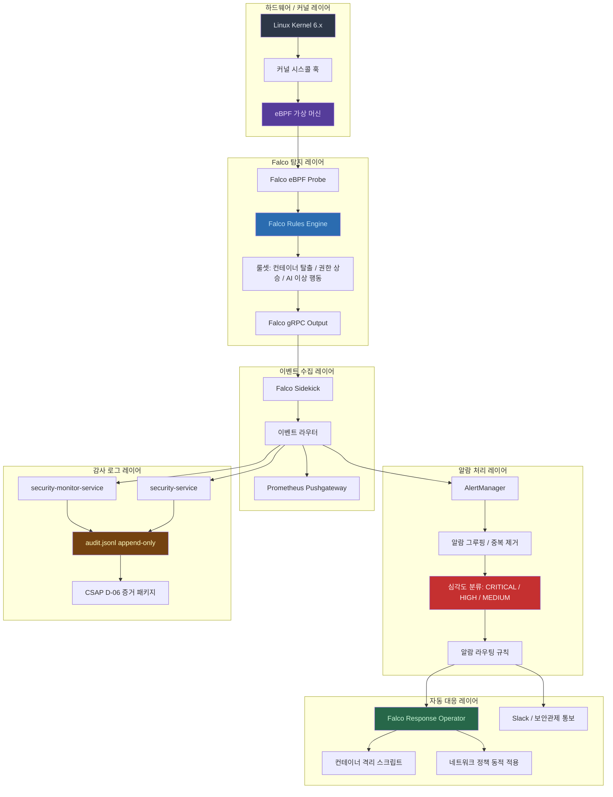

# 런타임 보안 심화 — Falco eBPF, 컨테이너 탈출 탐지, 실시간 위협 대응 자동화

> Design Ref: DESIGN-MTU-P15 (보안 모니터링 서비스)
> CSAP 통제: D-06 (침해사고 관리), D-08 (접근 통제), D-12 (시스템 개발 보안)
> N2SF 통제: N-06 (침해사고 대응)
> 대상 독자: 보안 담당자, 인프라 엔지니어, DevSecOps 실무자
> 난이도: 고급 (기본 컨테이너 보안 지식 전제)

---

## 목차

1. [런타임 보안이란 무엇인가](#1-런타임-보안이란-무엇인가)
2. [런타임 보안 탐지 레이어 아키텍처](#2-런타임-보안-탐지-레이어-아키텍처)
3. [실제 코드 분석 — security-monitor-service audit.ts](#3-실제-코드-분석--security-monitor-service-auditts)
4. [실제 코드 분석 — security-service audit.ts 비교](#4-실제-코드-분석--security-service-auditts-비교)
5. [Falco eBPF 심화 — 커널 시스콜 탭 방식](#5-falco-ebpf-심화--커널-시스콜-탭-방식)
6. [컨테이너 탈출 탐지 Falco 규칙](#6-컨테이너-탈출-탐지-falco-규칙)
7. [권한 상승 탐지](#7-권한-상승-탐지)
8. [AI 서비스 이상 행동 탐지](#8-ai-서비스-이상-행동-탐지)
9. [실시간 자동 대응 파이프라인](#9-실시간-자동-대응-파이프라인)
10. [Falco 알람 피로 방지 전략](#10-falco-알람-피로-방지-전략)
11. [CSAP D-06 + N2SF N-06 증거 수집](#11-csap-d-06--n2sf-n-06-증거-수집)
12. [보안 사고 자동 대응 플로우차트](#12-보안-사고-자동-대응-플로우차트)
13. [실습 — 나만의 Falco 규칙 작성](#13-실습--나만의-falco-규칙-작성)

---

## 1. 런타임 보안이란 무엇인가

### 1.1 정적 보안 vs 런타임 보안

공공기관 SaaS 환경에서 보안은 두 가지 관점으로 나뉩니다.

**정적 보안(Static Security)**은 코드를 실행하기 전 단계에서 취약점을 찾는 방식입니다. 예를 들어 소스 코드 정적 분석(SAST), 컨테이너 이미지 취약점 스캔, 의존성 패키지 보안 감사 등이 여기에 해당합니다.

**런타임 보안(Runtime Security)**은 애플리케이션이 실제로 실행되는 도중 발생하는 위협을 탐지하고 대응하는 방식입니다. 코드가 아무리 안전하게 작성되었더라도, 실행 환경에서 예상치 못한 동작이 일어날 수 있습니다.

예를 들어 다음과 같은 상황은 정적 분석으로는 탐지할 수 없습니다.

- 외부 공격자가 취약한 라이브러리를 통해 컨테이너 내부에 진입한 뒤 쉘을 실행하는 경우
- 정상적으로 배포된 AI 서비스가 내부 데이터베이스에서 비정상적으로 대량의 데이터를 읽어 외부로 전송하는 경우
- 권한이 있는 사용자가 실수 또는 의도적으로 커널 모듈을 로드하여 컨테이너 격리를 우회하는 경우

이처럼 런타임 보안은 코드 배포 이후 실제 운영 환경에서 발생하는 위협을 실시간으로 감시하는 마지막 방어선입니다.

### 1.2 공공기관 환경에서 런타임 보안의 중요성

CSAP(클라우드 서비스 보안 인증) 심사에서 D-06(침해사고 관리) 항목은 단순히 로그를 기록하는 것을 넘어, 실시간으로 이상 징후를 탐지하고 자동으로 대응하는 체계를 요구합니다.

N2SF(국가정보보안기본지침) N-06 역시 국가 정보통신망에서 실시간 침해 탐지와 자동 차단 메커니즘을 의무화합니다.

이 가이드는 Falco + eBPF를 핵심으로 하는 런타임 보안 체계를 어떻게 구축하고, 실제 프로젝트 코드와 어떻게 통합하는지 상세히 설명합니다.

### 1.3 핵심 용어 정리

| 용어 | 설명 |
|------|------|
| eBPF | Extended Berkeley Packet Filter. 커널 소스 코드 수정 없이 커널 내부에서 안전하게 프로그램을 실행하는 기술 |
| Falco | CNCF 오픈소스 런타임 보안 도구. eBPF를 활용하여 커널 시스콜을 감시함 |
| 시스콜(syscall) | 사용자 공간 프로그램이 커널에 요청하는 함수 호출. 파일 읽기/쓰기, 네트워크 연결, 프로세스 생성 등 |
| 컨테이너 탈출 | 컨테이너 내부 프로세스가 호스트 네임스페이스 또는 파일시스템에 접근하는 공격 |
| 권한 상승 | 낮은 권한의 프로세스가 더 높은 권한(root 또는 특수 권한)을 획득하는 행위 |
| AlertManager | Prometheus 에코시스템의 알람 라우팅 및 그루핑 도구 |
| PSI | Population Stability Index. ML 모델 입력 데이터 분포 변화를 측정하는 통계 지표 |

---

## 2. 런타임 보안 탐지 레이어 아키텍처

아래 다이어그램은 공공기관 SaaS 플랫폼의 런타임 보안 탐지 레이어 전체 구조를 보여줍니다.



### 2.1 레이어별 역할 상세 설명

**하드웨어/커널 레이어**: 모든 탐지의 출발점입니다. Linux 커널은 모든 시스콜을 처리하며, eBPF는 이 시스콜을 가로채어 검사할 수 있는 안전한 프로그래밍 환경을 제공합니다.

**Falco 탐지 레이어**: Falco는 eBPF 프로브를 커널에 삽입하고, 설정된 규칙에 따라 의심스러운 시스콜 패턴을 탐지합니다. 탐지된 이벤트는 gRPC 스트림을 통해 후속 처리 단계로 전달됩니다.

**이벤트 수집 레이어**: Falco Sidekick은 Falco 이벤트를 수신하여 다양한 목적지(Prometheus, Slack, ElasticSearch 등)로 라우팅합니다.

**알람 처리 레이어**: AlertManager는 중복 알람을 제거하고 심각도에 따라 분류합니다. 예를 들어 1분 내 동일한 컨테이너 탈출 시도가 10회 발생하면 하나의 CRITICAL 알람으로 묶습니다.

**자동 대응 레이어**: Falco Response Operator는 Kubernetes CRD(Custom Resource Definition)를 통해 컨테이너 격리, 네트워크 정책 변경 등의 자동 대응 작업을 수행합니다.

**감사 로그 레이어**: 모든 탐지 이벤트와 대응 조치는 반드시 append-only 방식으로 `audit.jsonl`에 기록되어 CSAP D-06 증거로 활용됩니다.

---

## 3. 실제 코드 분석 — security-monitor-service audit.ts

### 3.1 소스 코드 전문

아래는 `/data/ai-saas/platform/services/security-monitor-service/src/lib/audit.ts`의 전체 코드입니다.

```typescript
// 보안 모니터링 서비스 감사 로깅
// Design Ref: DESIGN-MTU-P15
// CSAP: D-06

import { createAuditLogger, createStandardTransport } from '@public-saas/audit-sdk';

const auditLogger = createAuditLogger({
  serviceName: 'security-monitor-service',
  transport: createStandardTransport('security-monitor-service'),
});

export async function logSecurityEvent(
  action: string,
  metadata?: Record<string, unknown>
): Promise<void> {
  await auditLogger.log({
    actor: 'system:security-monitor',
    action,
    target: 'security',
    targetType: 'security',
    tenantId: 'system',
    ip: process.env.SERVICE_IP || '127.0.0.1',
    userAgent: 'security-monitor-service/1.0',
    metadata,
  });
}
```

### 3.2 코드 라인별 분석

**1~3행: 파일 헤더 주석**

```typescript
// 보안 모니터링 서비스 감사 로깅
// Design Ref: DESIGN-MTU-P15
// CSAP: D-06
```

이 주석은 단순한 설명이 아닙니다. `Design Ref: DESIGN-MTU-P15`는 이 코드가 어느 설계 문서를 구현한 것인지 명시합니다. 감리 과정에서 검사관이 이 코드를 볼 때, 해당 설계 문서를 찾아 구현이 설계와 일치하는지 검증할 수 있습니다.

`CSAP: D-06`은 이 코드가 CSAP 통제항목 D-06(침해사고 관리)을 구현함을 명시합니다. 감리 추적성 매트릭스에서 이 파일을 D-06 증거로 직접 참조할 수 있습니다.

**5행: audit-sdk 임포트**

```typescript
import { createAuditLogger, createStandardTransport } from '@public-saas/audit-sdk';
```

감사 로거 생성 로직을 `@public-saas/audit-sdk`라는 내부 패키지로 분리한 이유는 다음과 같습니다.

- **일관성**: 모든 서비스가 동일한 로그 형식을 사용하여 중앙에서 분석이 가능합니다
- **유지보수**: 로그 형식 변경 시 SDK만 수정하면 모든 서비스에 적용됩니다
- **CSAP 준수**: 표준화된 로그 구조가 D-06 요건 충족을 보장합니다

**7~10행: auditLogger 인스턴스 생성**

```typescript
const auditLogger = createAuditLogger({
  serviceName: 'security-monitor-service',
  transport: createStandardTransport('security-monitor-service'),
});
```

모듈 수준에서 싱글턴 인스턴스를 생성합니다. 이는 성능 최적화 목적입니다. 매번 요청마다 로거를 새로 생성하면 불필요한 초기화 비용이 발생합니다.

`serviceName: 'security-monitor-service'`는 로그의 출처를 식별하는 데 사용됩니다. 여러 서비스의 로그가 중앙 저장소에 모일 때, 이 필드를 기준으로 서비스별 로그를 분리할 수 있습니다.

`createStandardTransport`는 로그를 `audit.jsonl`에 append-only로 기록하는 전송 계층을 생성합니다. 이 설계는 CSAP D-06 요건인 "로그 무결성 보장(수정/삭제 불가)"을 코드 수준에서 강제합니다.

**12~23행: logSecurityEvent 함수**

```typescript
export async function logSecurityEvent(
  action: string,
  metadata?: Record<string, unknown>
): Promise<void> {
```

`async/await` 패턴을 사용하는 이유는 파일 I/O가 비동기 작업이기 때문입니다. 동기 방식으로 로그를 기록하면 이벤트 루프를 블록하여 서비스 응답성이 저하됩니다.

반환 타입이 `Promise<void>`인 이유는 호출자가 로그 기록 완료를 기다릴 수 있도록 하기 위해서입니다. 중요한 보안 이벤트는 반드시 로그가 기록된 후에 다음 작업을 진행해야 합니다.

```typescript
  await auditLogger.log({
    actor: 'system:security-monitor',
    action,
    target: 'security',
    targetType: 'security',
    tenantId: 'system',
    ip: process.env.SERVICE_IP || '127.0.0.1',
    userAgent: 'security-monitor-service/1.0',
    metadata,
  });
```

각 필드의 의미를 살펴보겠습니다.

- `actor: 'system:security-monitor'`: 이 로그를 생성한 주체가 security-monitor 시스템 자체임을 명시합니다. `system:` 접두사는 자동화된 시스템 행위임을 나타내는 컨벤션입니다.

- `action`: 함수 호출 시 전달받은 동작 이름입니다. 예: `'CONTAINER_ESCAPE_DETECTED'`, `'PRIVILEGE_ESCALATION_ATTEMPT'`

- `target: 'security'`, `targetType: 'security'`: 보안 이벤트는 특정 사용자나 리소스가 아닌 보안 도메인 자체를 대상으로 합니다.

- `tenantId: 'system'`: 이 이벤트가 특정 테넌트에 귀속되지 않고 시스템 전체에 해당하는 이벤트임을 나타냅니다.

- `ip: process.env.SERVICE_IP || '127.0.0.1'`: 실제 서비스 IP를 환경 변수에서 주입받습니다. 기본값 `127.0.0.1`은 로컬 개발 환경용입니다. 이 패턴은 CSAP D-09 요건인 하드코딩 금지를 준수합니다.

- `metadata`: 자유 형식의 추가 정보입니다. Falco 이벤트에서 받은 컨테이너 이름, 프로세스 ID, 시스콜 이름 등의 정보를 여기에 담습니다.

### 3.3 런타임 탐지 로그 패턴 — Falco 이벤트 연동

실제 운영에서 이 함수는 다음과 같이 활용됩니다.

```typescript
// Falco gRPC 이벤트를 수신하여 감사 로그에 기록하는 예시
// Design Ref: DESIGN-MTU-P15 §3.2 — Falco 이벤트 수신기

import { logSecurityEvent } from './audit';

interface FalcoEvent {
  rule: string;
  priority: 'CRITICAL' | 'HIGH' | 'MEDIUM' | 'LOW';
  output: string;
  outputFields: {
    containerName?: string;
    containerImage?: string;
    processName?: string;
    syscallType?: string;
    user?: string;
    pid?: number;
  };
  time: string;
}

async function handleFalcoEvent(event: FalcoEvent): Promise<void> {
  // CRITICAL 또는 HIGH 이벤트만 즉시 기록 (MEDIUM 이하는 배치 처리)
  if (event.priority === 'CRITICAL' || event.priority === 'HIGH') {
    await logSecurityEvent(`FALCO_${event.rule.toUpperCase().replace(/\s/g, '_')}`, {
      rule: event.rule,
      priority: event.priority,
      output: event.output,
      containerName: event.outputFields.containerName,
      containerImage: event.outputFields.containerImage,
      processName: event.outputFields.processName,
      syscallType: event.outputFields.syscallType,
      detectedAt: event.time,
    });
  }
}
```

생성되는 감사 로그 JSON 예시는 다음과 같습니다.

```json
{
  "timestamp": "2026-04-13T09:15:23.456Z",
  "actor": "system:security-monitor",
  "action": "FALCO_CONTAINER_ESCAPE_DETECTED",
  "target": "security",
  "targetType": "security",
  "tenantId": "system",
  "ip": "10.0.1.42",
  "userAgent": "security-monitor-service/1.0",
  "metadata": {
    "rule": "Container Escape via Namespace Modification",
    "priority": "CRITICAL",
    "containerName": "ai-service-pod-7f8b9c",
    "containerImage": "registry.internal/ai-service:v2.1.0",
    "processName": "nsenter",
    "syscallType": "setns",
    "detectedAt": "2026-04-13T09:15:23.100Z"
  }
}
```

---

## 4. 실제 코드 분석 — security-service audit.ts 비교

### 4.1 두 서비스의 구조적 차이

`/data/ai-saas/platform/services/security-service/src/lib/audit.ts`를 보면 `security-monitor-service`의 `audit.ts`와 거의 동일한 구조를 가집니다. 차이점은 다음과 같습니다.

| 항목 | security-monitor-service | security-service |
|------|--------------------------|------------------|
| serviceName | `'security-monitor-service'` | `'security-service'` |
| actor | `'system:security-monitor'` | `'system:security-service'` |
| userAgent | `'security-monitor-service/1.0'` | `'security-service/1.0'` |
| 역할 | 런타임 탐지 이벤트 로깅 | 보안 정책 집행 이벤트 로깅 |

### 4.2 두 서비스의 역할 분리 이유

**security-monitor-service**는 탐지(Detection) 역할을 담당합니다. Falco 이벤트를 수신하고 이상 징후를 감지하는 수동적 관찰자 역할입니다. 이 서비스는 탐지 결과를 기록하고 AlertManager에 전달하지만, 직접적인 차단이나 격리 조치를 취하지 않습니다.

**security-service**는 정책 집행(Enforcement) 역할을 담당합니다. RBAC 검증, JWT 토큰 검사, 접근 제어 결정 등의 적극적인 보안 조치를 수행합니다. 이 서비스가 내리는 모든 보안 결정이 감사 로그에 기록됩니다.

이 두 역할을 분리하는 이유는 보안 원칙 중 하나인 **책임 분리(Separation of Duties)**입니다. 탐지 시스템이 차단 조치까지 직접 수행할 경우, 탐지 로직의 오류가 서비스 장애로 직결될 수 있습니다. 탐지와 집행을 분리하면 각 서비스를 독립적으로 테스트하고 검증할 수 있습니다.

### 4.3 공통 패턴에서 배우는 설계 원칙

두 파일이 동일한 패턴을 공유하는 것은 의도적입니다. 이를 통해 얻는 이점은 다음과 같습니다.

```typescript
// 두 서비스 공통 패턴
// 1. 모듈 수준 싱글턴 — 초기화 비용 최소화
const auditLogger = createAuditLogger({ ... });

// 2. 단일 public 함수 — 최소 인터페이스 원칙
export async function logSecurityEvent(
  action: string,
  metadata?: Record<string, unknown>
): Promise<void> { ... }

// 3. 환경 변수에서 IP 주입 — 하드코딩 금지 (CSAP D-09)
ip: process.env.SERVICE_IP || '127.0.0.1',
```

**단일 public 함수 설계**는 호출 측에서 감사 로그 API를 오용할 가능성을 최소화합니다. `actor`, `target`, `targetType` 등의 필드가 서비스 내부적으로 고정되기 때문에, 개발자가 실수로 잘못된 값을 입력할 수 없습니다.

### 4.4 확장 패턴 — 구체적 이벤트 타입 추가

실제 운영에서는 다음과 같이 더 구체적인 이벤트 타입 상수를 정의하여 오타와 불일치를 방지합니다.

```typescript
// Design Ref: DESIGN-MTU-P15 §4.1 — 보안 이벤트 타입 목록
// Plan SC: FR-MON.3

export const SecurityEventType = {
  // 컨테이너 탈출 탐지
  CONTAINER_ESCAPE_DETECTED: 'CONTAINER_ESCAPE_DETECTED',
  NAMESPACE_MODIFICATION: 'NAMESPACE_MODIFICATION',
  KERNEL_MODULE_LOAD: 'KERNEL_MODULE_LOAD',

  // 권한 상승 탐지
  PRIVILEGE_ESCALATION: 'PRIVILEGE_ESCALATION',
  SETUID_EXECUTION: 'SETUID_EXECUTION',
  CAPABILITIES_ABUSE: 'CAPABILITIES_ABUSE',

  // AI 서비스 이상 행동
  BULK_DATA_EXFILTRATION: 'BULK_DATA_EXFILTRATION',
  ABNORMAL_DB_QUERY: 'ABNORMAL_DB_QUERY',
  N2SF_VIOLATION_ATTEMPT: 'N2SF_VIOLATION_ATTEMPT',

  // 자동 대응 기록
  CONTAINER_ISOLATED: 'CONTAINER_ISOLATED',
  NETWORK_POLICY_APPLIED: 'NETWORK_POLICY_APPLIED',
  INCIDENT_ESCALATED: 'INCIDENT_ESCALATED',
} as const;

export type SecurityEventType =
  typeof SecurityEventType[keyof typeof SecurityEventType];
```

---

## 5. Falco eBPF 심화 — 커널 시스콜 탭 방식

### 5.1 eBPF란 무엇인가 — 초보자 설명

리눅스 운영체제는 크게 두 영역으로 나뉩니다. **커널 공간(Kernel Space)**은 OS 핵심 코드가 실행되는 영역이며, **사용자 공간(User Space)**은 일반 애플리케이션이 실행되는 영역입니다.

애플리케이션이 파일을 열거나, 네트워크 패킷을 전송하거나, 새 프로세스를 생성하려면 반드시 커널에 요청해야 합니다. 이 요청을 **시스템 콜(System Call, syscall)**이라고 합니다.

```
사용자 공간                  커널 공간
┌─────────────────┐         ┌─────────────────────────────┐
│ 애플리케이션      │  syscall │ 커널                         │
│ (AI 서비스 등)   │ ─────→  │ - 파일 시스템                 │
│                 │         │ - 네트워크 스택               │
│                 │ ←───────│ - 프로세스 관리               │
│                 │  결과    │                              │
└─────────────────┘         └─────────────────────────────┘
```

eBPF는 커널 내부에 작은 가상 머신을 삽입하여, 모든 syscall이 발생할 때마다 미리 작성된 eBPF 프로그램이 실행되도록 합니다. 이 프로그램은 커널 소스 코드를 수정하지 않고, 커널 로직을 방해하지 않으면서, 안전하게 관찰만 수행합니다.

### 5.2 eBPF vs 커널 모듈 — 차이점과 선택 이유

Falco는 초기 버전에서 커널 모듈 방식을 사용했다가, 이후 eBPF 방식으로 전환했습니다.

| 특성 | 커널 모듈 | eBPF |
|------|-----------|------|
| 커널 패닉 위험 | 높음 — 버그 발생 시 시스템 전체 중단 | 없음 — eBPF 검증기가 안전성 보장 |
| 설치 요건 | 커널 헤더, 컴파일 환경 필요 | CO-RE(Compile Once Run Everywhere) 지원 |
| 동적 업데이트 | 시스템 재부팅 필요한 경우 있음 | 런타임 중 핫 업데이트 가능 |
| 보안 격리 | 커널 수준에서 실행 — 완전한 권한 | 샌드박스 내 실행 — 제한된 명령어 집합 |
| 성능 영향 | 상대적으로 높음 | 매우 낮음 (ns 단위 오버헤드) |
| 공공기관 적합성 | 승인 요건 복잡 | 커널 패닉 없어 안전성 높음 |

공공기관 SaaS 환경에서는 반드시 eBPF 방식을 선택해야 합니다. 커널 모듈 방식은 버그 발생 시 전체 노드를 중단시킬 수 있어, 고가용성 요건(NFR-SLO)을 위반할 위험이 있습니다.

### 5.3 Falco eBPF 설치 — k3s 환경 기준

```yaml
# falco-values.yaml
# k3s + containerd 환경 최적화 설정
# Design Ref: MTU-P15 §2.1

driver:
  kind: ebpf
  ebpf:
    # CO-RE 방식 사용 — 커널 헤더 불필요
    kernelVersion: ""
  
collectors:
  containerd:
    enabled: true
    socket: /run/k3s/containerd/containerd.sock

falco:
  # 최소 탐지 우선순위 (WARNING 이하 이벤트 무시하여 노이즈 감소)
  priority: WARNING
  
  # JSON 출력 형식 (security-monitor-service 파싱 용이)
  json_output: true
  json_include_output_property: true
  
  # gRPC 출력 활성화 (Falco Sidekick 연동)
  grpc:
    enabled: true
    bind_address: "unix:///run/falco/falco.sock"
  grpc_output:
    enabled: true

resources:
  requests:
    memory: "256Mi"
    cpu: "100m"
  limits:
    memory: "512Mi"
    cpu: "500m"
```

### 5.4 syscall 탭 방식 상세 — 어떻게 모든 시스콜을 감시하는가

Falco eBPF는 `tracepoint`와 `kprobe` 두 가지 방식으로 syscall을 탭합니다.

**tracepoint**: 커널 소스 코드에 미리 정의된 추적 지점입니다. 커널 버전 간에 안정적으로 유지되며, ABI가 안정적입니다.

**kprobe**: 임의의 커널 함수 진입/반환 시점에 삽입되는 동적 추적 기법입니다. 더 세밀한 정보를 얻을 수 있지만 커널 버전마다 차이가 있을 수 있습니다.

Falco는 주로 `sys_enter`와 `sys_exit` tracepoint를 사용하여 모든 시스콜의 입/출력을 관찰합니다.

```
애플리케이션 프로세스
     │
     │ open("/etc/passwd")  ← 시스콜 호출
     ↓
┌────────────────────────────────────────────┐
│            커널 내부                        │
│                                            │
│  sys_enter_openat tracepoint               │
│       │                                    │
│       ├── eBPF 프로그램 실행               │
│       │   - 파일명: /etc/passwd            │
│       │   - 컨테이너 ID 확인               │
│       │   - Falco 규칙 매칭               │
│       │   - 매칭 시 이벤트 버퍼에 추가     │
│       │                                    │
│       └── 실제 커널 로직 실행 (영향 없음)  │
└────────────────────────────────────────────┘
```

---

## 6. 컨테이너 탈출 탐지 Falco 규칙

### 6.1 컨테이너 탈출의 주요 기법

컨테이너 탈출(Container Escape)은 컨테이너 내부에서 실행 중인 프로세스가 컨테이너의 격리 경계를 벗어나 호스트 시스템에 접근하는 공격입니다. 주요 기법은 다음과 같습니다.

**네임스페이스 변경(Namespace Modification)**: Linux 네임스페이스는 컨테이너 격리의 핵심입니다. `setns()` 시스콜이나 `nsenter` 명령어를 통해 다른 네임스페이스로 진입하면 격리가 해제됩니다.

**chroot 탈출**: `chroot` 환경 내에서 실행 중인 프로세스가 부모 디렉토리로 이동하여 루트 파일시스템에 접근하는 기법입니다.

**커널 모듈 로드**: 컨테이너 내에서 커널 모듈을 로드하면 커널 레벨의 임의 코드를 실행할 수 있습니다.

**`/proc` 파일시스템 악용**: `/proc/sysrq-trigger`, `/proc/sys/kernel/core_pattern` 등의 파일을 통한 호스트 제어 시도

### 6.2 컨테이너 탈출 탐지 Falco 규칙

```yaml
# falco-rules-container-escape.yaml
# Design Ref: DESIGN-MTU-P15 §3.1
# CSAP: D-06, N2SF: N-06

# 규칙 1: 네임스페이스 변경 시도 탐지
- rule: Container Namespace Modification Attempt
  desc: >
    컨테이너 내에서 setns 또는 unshare syscall 감지.
    컨테이너 탈출 시도의 핵심 지표.
  condition: >
    spawned_process
    and container
    and (proc.name in (nsenter, unshare)
         or evt.type in (setns, unshare))
    and not proc.pname in (containerd-shim, runc)
  output: >
    컨테이너 네임스페이스 변경 시도 탐지
    (container=%container.name image=%container.image.repository:%container.image.tag
     proc=%proc.name pid=%proc.pid user=%user.name
     syscall=%evt.type cmdline=%proc.cmdline)
  priority: CRITICAL
  tags:
    - container_escape
    - csap_d06
    - n2sf_n06

# 규칙 2: 특권 컨테이너 내 커널 모듈 로드
- rule: Kernel Module Loaded in Container
  desc: >
    컨테이너 내에서 커널 모듈 로드 시도.
    컨테이너 격리를 완전히 우회할 수 있는 고위험 행위.
  condition: >
    spawned_process
    and container
    and proc.name in (insmod, modprobe, rmmod)
  output: >
    컨테이너 내 커널 모듈 로드 시도
    (container=%container.name image=%container.image.repository
     module=%proc.args user=%user.name pid=%proc.pid)
  priority: CRITICAL
  tags:
    - container_escape
    - kernel_module
    - csap_d06

# 규칙 3: 민감 마운트 경로 접근
- rule: Sensitive Mount in Container
  desc: >
    컨테이너 내에서 호스트 파일시스템 민감 경로 접근 시도.
  condition: >
    open_read
    and container
    and (fd.name startswith /proc/sysrq
         or fd.name startswith /proc/sys/kernel/core_pattern
         or fd.name startswith /sys/kernel/debug)
  output: >
    컨테이너 내 민감 경로 접근 탐지
    (file=%fd.name container=%container.name
     proc=%proc.name user=%user.name)
  priority: HIGH
  tags:
    - container_escape
    - sensitive_mount

# 규칙 4: chroot 탈출 시도
- rule: Chroot Escape Attempt
  desc: >
    chroot 환경에서 탈출 시도 패턴 탐지.
  condition: >
    spawned_process
    and container
    and proc.name = chroot
    and not proc.pname in (containerd-shim)
  output: >
    chroot 탈출 시도 탐지
    (container=%container.name proc=%proc.name
     args=%proc.args user=%user.name)
  priority: HIGH
  tags:
    - container_escape
    - chroot

# 화이트리스트: 정상 운영 프로세스 제외 (노이즈 감소)
- list: allowed_container_admin_processes
  items: [kubectl-debug, crictl, ctr]

- macro: known_container_admin
  condition: proc.name in (allowed_container_admin_processes)
```

### 6.3 규칙 작성 문법 상세 설명

Falco 규칙의 `condition` 필드는 Sysdig 필터 문법을 사용합니다. 초보자를 위해 주요 요소를 설명합니다.

**`spawned_process`**: 새 프로세스가 생성될 때 (`execve` syscall) 매칭되는 매크로입니다. Falco가 기본 제공합니다.

**`container`**: 현재 이벤트가 컨테이너 내에서 발생했을 때 참(true)인 매크로입니다.

**`proc.name`**: 현재 프로세스 이름입니다. `in` 연산자로 목록과 비교할 수 있습니다.

**`evt.type`**: 발생한 시스콜의 이름입니다. 예: `open`, `read`, `write`, `setns`

**`container.name`**: 컨테이너 런타임에서 보고하는 컨테이너 이름입니다. 로그에서 어떤 컨테이너에서 발생했는지 확인할 때 사용합니다.

**`not`**: 예외 조건입니다. 위 규칙에서 `not proc.pname in (containerd-shim, runc)`는 컨테이너 런타임 자체가 수행하는 정상적인 네임스페이스 조작은 제외합니다.

---

## 7. 권한 상승 탐지

### 7.1 권한 상승의 주요 기법

**setuid/setgid 실행파일**: `setuid` 비트가 설정된 실행파일을 실행하면 파일 소유자의 권한으로 실행됩니다. 공격자는 이를 이용해 root 권한을 얻습니다.

**ptrace 남용**: `ptrace` 시스콜은 디버깅 목적으로 다른 프로세스의 메모리와 실행을 제어할 수 있습니다. 권한이 없는 프로세스가 ptrace를 사용하면 권한 상승이 가능합니다.

**Linux Capabilities 남용**: Linux는 root 권한을 세분화한 capabilities 시스템을 제공합니다. `CAP_SYS_ADMIN`, `CAP_NET_ADMIN` 등의 capabilities가 불필요하게 부여된 경우 이를 통한 공격이 가능합니다.

### 7.2 권한 상승 탐지 Falco 규칙

```yaml
# falco-rules-privilege-escalation.yaml
# CSAP: D-08 (접근 통제), D-06 (침해사고 관리)

# 규칙 5: setuid 실행파일을 통한 권한 상승
- rule: Setuid or Setgid Bit Set via chmod
  desc: >
    파일에 setuid 또는 setgid 비트 설정 시도.
    권한 상승 백도어 생성의 핵심 지표.
  condition: >
    consider_all_chmods
    and chmod
    and (evt.arg.mode contains "S_ISUID"
         or evt.arg.mode contains "S_ISGID")
    and container
    and not proc.name in (rpm, dpkg, apt)
  output: >
    setuid/setgid 비트 설정 감지
    (file=%fd.name mode=%evt.arg.mode
     container=%container.name proc=%proc.name)
  priority: HIGH
  tags:
    - privilege_escalation
    - setuid
    - csap_d08

# 규칙 6: ptrace를 이용한 프로세스 메모리 접근
- rule: Ptrace Attached to Process
  desc: >
    컨테이너 내에서 ptrace ATTACH 시도.
    프로세스 메모리 덤프 또는 인젝션 가능.
  condition: >
    evt.type = ptrace
    and evt.arg.request = PTRACE_ATTACH
    and container
    and not proc.name in (gdb, strace, lldb)
  output: >
    ptrace ATTACH 탐지
    (tracer_pid=%proc.pid tracer=%proc.name
     tracee_pid=%evt.arg.pid container=%container.name)
  priority: HIGH
  tags:
    - privilege_escalation
    - ptrace

# 규칙 7: CAP_SYS_ADMIN을 이용한 마운트 조작
- rule: Mount Syscall in Container
  desc: >
    컨테이너 내에서 mount 시스콜 실행.
    컨테이너 격리 우회에 자주 사용되는 기법.
  condition: >
    evt.type = mount
    and container
    and not proc.name in (containerd-shim, runc, k3s)
  output: >
    컨테이너 내 mount 시스콜 탐지
    (container=%container.name proc=%proc.name
     mount_source=%evt.arg.source mount_target=%evt.arg.target)
  priority: HIGH
  tags:
    - privilege_escalation
    - mount_manipulation

# 규칙 8: sudo/su 사용 탐지
- rule: Sudo or Su Executed in Container
  desc: >
    컨테이너 내에서 sudo 또는 su 실행.
    컨테이너는 단일 사용자로 실행되어야 하므로 비정상적.
  condition: >
    spawned_process
    and container
    and proc.name in (sudo, su)
  output: >
    컨테이너 내 권한 상승 도구 실행
    (proc=%proc.name user=%user.name
     container=%container.name cmdline=%proc.cmdline)
  priority: MEDIUM
  tags:
    - privilege_escalation
    - sudo
```

### 7.3 컨테이너 보안 컨텍스트 설정 — 예방적 조치

탐지 이전에 예방적으로 권한을 제한하는 Kubernetes SecurityContext 설정입니다.

```yaml
# kubernetes-pod-security.yaml
# 공공기관 SaaS 플랫폼 표준 보안 컨텍스트
# Design Ref: DESIGN-MTU-P15 §2.3

apiVersion: apps/v1
kind: Deployment
metadata:
  name: ai-service
spec:
  template:
    spec:
      # 포드 수준 보안
      securityContext:
        # root 실행 금지
        runAsNonRoot: true
        runAsUser: 1000
        runAsGroup: 1000
        # 파일시스템 그룹
        fsGroup: 2000
        # seccomp 프로파일 — 시스콜 화이트리스트
        seccompProfile:
          type: RuntimeDefault

      containers:
        - name: ai-service
          securityContext:
            # 권한 상승 허용 안 함
            allowPrivilegeEscalation: false
            # Capabilities 모두 제거
            capabilities:
              drop:
                - ALL
              # 필요한 최소 capability만 추가
              add:
                - NET_BIND_SERVICE  # 80/443 포트 바인딩 필요 시만
            # 루트 파일시스템 읽기 전용
            readOnlyRootFilesystem: true

          # 임시 파일 디렉토리만 쓰기 허용
          volumeMounts:
            - name: tmp-dir
              mountPath: /tmp

      volumes:
        - name: tmp-dir
          emptyDir: {}
```

---

## 8. AI 서비스 이상 행동 탐지

### 8.1 AI 서비스의 고유한 위험

공공기관 SaaS에서 AI 서비스는 대량의 문서와 데이터를 처리합니다. N2SF(국가정보보안기본지침)에서 C/S 등급 데이터는 외부 AI API로 전송이 금지되어 있습니다. 따라서 다음과 같은 이상 행동을 탐지해야 합니다.

1. **대용량 데이터 외부 전송**: C/S 등급 데이터를 외부로 유출하려는 시도
2. **비정상 DB 쿼리**: 단기간에 비정상적으로 많은 레코드를 조회하는 패턴
3. **허가되지 않은 외부 연결**: AI 게이트웨이를 우회하여 직접 외부 AI API에 연결하는 시도
4. **모델 드리프트**: 입력 데이터 분포가 크게 변화하여 비정상적인 결과를 생성하는 상황

### 8.2 AI 서비스 이상 행동 탐지 Falco 규칙

```yaml
# falco-rules-ai-service.yaml
# N2SF: N-05 (AI API 데이터 전송 규칙), N-06 (침해사고 대응)
# CSAP: D-06 (감사 로그)

# 규칙 9: AI 서비스의 허가되지 않은 외부 연결
- rule: AI Service Unauthorized Outbound Connection
  desc: >
    ai-service 컨테이너가 허가된 AI Gateway를 우회하여
    직접 외부 AI API에 연결 시도. N2SF N-05 위반 가능성.
  condition: >
    outbound
    and container.name startswith "ai-service"
    and not (fd.sip in (allowed_ai_gateway_ips))
    and not fd.sip.name in (allowed_internal_services)
    and fd.sport != 443
  output: >
    AI 서비스 비허가 외부 연결 탐지 (N2SF N-05 위반 가능)
    (container=%container.name dest_ip=%fd.rip dest_port=%fd.rport
     proc=%proc.name)
  priority: CRITICAL
  tags:
    - ai_service
    - n2sf_violation
    - data_exfiltration

# AI Gateway 허용 IP 목록 — 환경에 맞게 수정 필요
- list: allowed_ai_gateway_ips
  items: ["10.0.10.50", "10.0.10.51"]  # 내부 AI Gateway 클러스터 IP

- list: allowed_internal_services
  items:
    - "postgres.database.svc.cluster.local"
    - "redis.cache.svc.cluster.local"
    - "prometheus.monitoring.svc.cluster.local"

# 규칙 10: 대용량 파일 외부 전송 탐지
- rule: Large File Transfer from AI Service
  desc: >
    ai-service 컨테이너에서 단일 연결로 대용량 데이터 전송.
    C/S 등급 데이터 유출 가능성.
  condition: >
    evt.type = sendto
    and container.name startswith "ai-service"
    and evt.arg.size > 10485760  # 10MB 초과 단일 전송
    and outbound
  output: >
    AI 서비스 대용량 외부 전송 탐지
    (container=%container.name bytes=%evt.arg.size
     dest=%fd.rip:%fd.rport proc=%proc.name)
  priority: HIGH
  tags:
    - ai_service
    - data_exfiltration
    - n2sf_n05

# 규칙 11: 비정상적인 데이터베이스 연결 빈도
# (이 규칙은 Prometheus 메트릭 기반으로 보완 필요)
- rule: AI Service Abnormal DB Connection Rate
  desc: >
    AI 서비스가 비정상적으로 빠른 속도로 DB 연결 생성.
    대량 데이터 추출 시도의 지표.
  condition: >
    evt.type = connect
    and container.name startswith "ai-service"
    and fd.sport = 5432  # PostgreSQL 포트
    and evt.count > 100  # 1분 내 100회 초과 (실제 임계값은 환경에 맞게 설정)
  output: >
    AI 서비스 비정상 DB 연결 빈도 탐지
    (container=%container.name connections=%evt.count
     db_host=%fd.sip proc=%proc.name)
  priority: HIGH
  tags:
    - ai_service
    - abnormal_db_access
    - csap_d06
```

### 8.3 AI 서비스 데이터 분류 게이트웨이 패턴

N2SF 준수를 위해 AI 서비스에서 외부 API 호출 시 반드시 데이터 등급을 확인해야 합니다.

```typescript
// Design Ref: DESIGN-MTU-P15 §5.1 — AI Gateway 보안 패턴
// Plan SC: AI-REQ-1, N2SF N-05
// CSAP: D-12 (입력 검증)

import { logSecurityEvent } from './audit';

enum DataGrade { C = 'C', S = 'S', O = 'O' }

interface AIRequest {
  prompt: string;
  documentIds: string[];
  dataGrade: DataGrade;
  tenantId: string;
}

async function processAIRequest(request: AIRequest): Promise<void> {
  // N2SF N-05: C/S 등급 데이터 외부 전송 절대 금지
  if (request.dataGrade === DataGrade.C || request.dataGrade === DataGrade.S) {
    // 위반 시도를 감사 로그에 기록 (CSAP D-06)
    await logSecurityEvent('N2SF_VIOLATION_ATTEMPT', {
      tenantId: request.tenantId,
      dataGrade: request.dataGrade,
      documentCount: request.documentIds.length,
      // 민감 데이터 내용은 로그에 포함 금지
      promptLength: request.prompt.length,
    });

    throw new Error(
      `N2SF N-05 위반: ${request.dataGrade}등급 데이터는 외부 AI API 전송 금지`
    );
  }

  // O 등급: PII 마스킹 후 AI Gateway 경유
  const maskedPrompt = await maskPII(request.prompt);

  // 반드시 내부 AI Gateway 경유 (직접 외부 API 호출 금지)
  const response = await fetch('http://ai-gateway.ai-service.svc.cluster.local/v1/chat', {
    method: 'POST',
    headers: {
      'Content-Type': 'application/json',
      'X-Tenant-ID': request.tenantId,
      'X-Data-Grade': request.dataGrade,
    },
    body: JSON.stringify({ prompt: maskedPrompt }),
  });

  if (!response.ok) {
    throw new Error(`AI Gateway 오류: ${response.status}`);
  }
}

async function maskPII(text: string): Promise<string> {
  // PII 마스킹: 이름, 주민번호, 전화번호, 이메일 등
  return text
    .replace(/\d{6}-\d{7}/g, '[주민번호 삭제]')
    .replace(/\d{3}-\d{3,4}-\d{4}/g, '[전화번호 삭제]')
    .replace(/[a-zA-Z0-9._%+-]+@[a-zA-Z0-9.-]+\.[a-zA-Z]{2,}/g, '[이메일 삭제]');
}
```

---

## 9. 실시간 자동 대응 파이프라인

### 9.1 자동 대응의 필요성과 한계

보안 이벤트가 발생했을 때 사람이 수동으로 대응하는 방식은 두 가지 문제가 있습니다.

첫째, **속도 문제**입니다. 컨테이너 탈출이나 권한 상승이 성공한 뒤 몇 초 안에 공격자는 추가 권한을 획득하거나 데이터를 유출할 수 있습니다. 사람이 알람을 확인하고 대응하는 데는 수 분에서 수 시간이 걸립니다.

둘째, **피로 문제**입니다. 24시간 365일 모든 알람에 즉각적으로 대응하는 것은 인력 관점에서 불가능합니다.

자동 대응은 이 문제를 해결하지만, 반드시 다음 원칙을 따라야 합니다.

- **최소 충격(Minimum Impact)**: 서비스 전체를 차단하는 대신, 문제가 있는 컨테이너만 격리
- **사람 검토 필수**: 자동 격리 후 반드시 사람이 검토하여 오탐 여부 확인
- **감사 추적**: 모든 자동 대응 조치는 감사 로그에 기록

### 9.2 Falco → AlertManager → 자동 대응 스크립트 연동

```yaml
# alertmanager-config.yaml
# Falco 이벤트를 수신하여 심각도별 대응 라우팅

global:
  smtp_smarthost: 'mail.internal:587'

route:
  # 기본 라우트
  receiver: 'default-receiver'
  group_by: ['alertname', 'container_name']
  group_wait: 10s
  group_interval: 5m
  repeat_interval: 4h

  routes:
    # CRITICAL: 컨테이너 탈출 — 즉시 자동 격리
    - match:
        severity: CRITICAL
        category: container_escape
      receiver: 'auto-isolate-receiver'
      group_wait: 0s  # 즉시 처리
      continue: true  # 보안관제에도 동시 전송

    # CRITICAL: N2SF 위반 — 즉시 차단 + 에스컬레이션
    - match:
        severity: CRITICAL
        category: n2sf_violation
      receiver: 'n2sf-violation-receiver'
      group_wait: 0s

    # HIGH: 권한 상승 — 5분 내 자동 대응
    - match:
        severity: HIGH
        category: privilege_escalation
      receiver: 'auto-restrict-receiver'
      group_wait: 30s

receivers:
  - name: 'auto-isolate-receiver'
    webhook_configs:
      - url: 'http://falco-response-operator.security.svc/isolate'
        http_config:
          bearer_token_file: /var/run/secrets/alertmanager-token

  - name: 'n2sf-violation-receiver'
    webhook_configs:
      - url: 'http://falco-response-operator.security.svc/n2sf-block'
    email_configs:
      - to: 'csirt@agency.go.kr'
        subject: '[긴급] N2SF 위반 탐지 — 즉시 확인 필요'

  - name: 'auto-restrict-receiver'
    webhook_configs:
      - url: 'http://falco-response-operator.security.svc/restrict'
```

### 9.3 자동 대응 Python 스크립트

```python
#!/usr/bin/env python3
"""
컨테이너 격리 자동 대응 스크립트
Design Ref: DESIGN-MTU-P15 §5.2
CSAP: D-06 (모든 조치 감사 로그 기록), D-08 (접근 제어)
Plan SC: FR-MON.5
"""

import json
import subprocess
import datetime
import os
from dataclasses import dataclass
from typing import Optional


@dataclass
class IsolationAction:
    """격리 조치 기록 구조체"""
    container_name: str
    namespace: str
    pod_name: str
    reason: str
    triggered_at: str
    falco_rule: str
    auto_action: str
    operator: str = 'system:falco-responder'


AUDIT_LOG_PATH = os.environ.get('AUDIT_LOG_PATH', '/app/audit.jsonl')


def isolate_container(alert_payload: dict) -> IsolationAction:
    """
    컨테이너 격리 수행
    
    1. NetworkPolicy를 적용하여 모든 인바운드/아웃바운드 트래픽 차단
    2. 감사 로그에 격리 조치 기록
    3. 슬랙/이메일 알림 전송
    """
    container_name = alert_payload.get('labels', {}).get('container_name', 'unknown')
    namespace = alert_payload.get('labels', {}).get('namespace', 'default')
    pod_name = alert_payload.get('labels', {}).get('pod_name', 'unknown')
    falco_rule = alert_payload.get('labels', {}).get('rule', 'unknown')

    action = IsolationAction(
        container_name=container_name,
        namespace=namespace,
        pod_name=pod_name,
        reason=f"Falco 규칙 '{falco_rule}' 트리거",
        triggered_at=datetime.datetime.utcnow().isoformat() + 'Z',
        falco_rule=falco_rule,
        auto_action='NETWORK_POLICY_DENY_ALL',
    )

    # 1. NetworkPolicy 적용 — 해당 Pod의 모든 트래픽 차단
    network_policy = {
        "apiVersion": "networking.k8s.io/v1",
        "kind": "NetworkPolicy",
        "metadata": {
            "name": f"isolate-{pod_name}",
            "namespace": namespace,
            "labels": {
                "security.saas/auto-isolated": "true",
                "security.saas/reason": "falco-alert",
            },
        },
        "spec": {
            "podSelector": {
                "matchLabels": {"app": container_name},
            },
            # 모든 인바운드 차단
            "ingress": [],
            # 모든 아웃바운드 차단
            "egress": [],
            "policyTypes": ["Ingress", "Egress"],
        },
    }

    # kubectl apply로 NetworkPolicy 적용
    result = subprocess.run(
        ["kubectl", "apply", "-f", "-", "--namespace", namespace],
        input=json.dumps(network_policy),
        capture_output=True,
        text=True,
        check=False,
    )

    if result.returncode != 0:
        # 격리 실패는 더 심각한 상황 — 에스컬레이션 필요
        _write_audit_log('CONTAINER_ISOLATION_FAILED', {
            'pod_name': pod_name,
            'namespace': namespace,
            'error': result.stderr,
            'falco_rule': falco_rule,
        })
        raise RuntimeError(f"컨테이너 격리 실패: {result.stderr}")

    # 2. 감사 로그 기록 (CSAP D-06 필수)
    _write_audit_log('CONTAINER_ISOLATED', {
        'pod_name': action.pod_name,
        'namespace': action.namespace,
        'container_name': action.container_name,
        'falco_rule': action.falco_rule,
        'auto_action': action.auto_action,
        'triggered_at': action.triggered_at,
    })

    return action


def _write_audit_log(action: str, metadata: dict) -> None:
    """
    append-only 감사 로그 기록
    CSAP D-06: 수정/삭제 불가 구조
    """
    log_entry = {
        'timestamp': datetime.datetime.utcnow().isoformat() + 'Z',
        'actor': 'system:falco-responder',
        'action': action,
        'target': 'container',
        'targetType': 'kubernetes_pod',
        'tenantId': 'system',
        'metadata': metadata,
        'csap_ref': 'D-06',
    }

    # append 모드로 기록 — 기존 로그 변경 불가
    with open(AUDIT_LOG_PATH, 'a', encoding='utf-8') as f:
        f.write(json.dumps(log_entry, ensure_ascii=False) + '\n')
```

---

## 10. Falco 알람 피로 방지 전략

### 10.1 알람 피로(Alert Fatigue)란 무엇인가

알람 피로는 너무 많은 알람이 발생하여 운영자가 진짜 중요한 알람을 놓치게 되는 현상입니다. 연구에 따르면 평균 SOC(Security Operations Center) 팀은 하루에 수천 개의 보안 알람을 받으며, 그 중 상당수가 오탐(False Positive)입니다.

Falco를 처음 도입하면 처음에는 엄청나게 많은 알람이 발생합니다. 정상적인 컨테이너 시작 작업, CI/CD 파이프라인 동작, 헬스체크 프로세스 등이 모두 의심스러운 이벤트로 탐지되기 때문입니다.

### 10.2 노이즈 감소(Noise Reduction) 전략

**전략 1: 화이트리스트 기반 예외 처리**

```yaml
# falco-whitelist.yaml
# 정상 운영 프로세스 화이트리스트

# CI/CD 파이프라인 프로세스 목록
- list: cicd_processes
  items:
    - gitea-runner
    - buildah
    - skopeo
    - trivy
    - kubectl

# 모니터링 에이전트 목록
- list: monitoring_agents
  items:
    - node-exporter
    - cadvisor
    - falco
    - prometheus

# 공통 예외 매크로
- macro: is_cicd_or_monitoring
  condition: >
    proc.name in (cicd_processes)
    or proc.name in (monitoring_agents)
    or proc.pname in (cicd_processes)

# 기존 규칙 오버라이드 — 화이트리스트 추가
- rule: Container Namespace Modification Attempt
  override:
    condition: append
    # 기존 조건에 화이트리스트 예외 추가
  condition: and not is_cicd_or_monitoring
```

**전략 2: 심각도 임계값 조정**

```yaml
# falco 설정에서 최소 탐지 우선순위 조정
falco:
  # INFO 수준 이벤트는 탐지하지 않음 (너무 많은 노이즈)
  # NOTICE → WARNING → ERROR → CRITICAL 순으로 엄격해짐
  priority: WARNING
```

**전략 3: AlertManager 그루핑으로 중복 제거**

```yaml
route:
  # 동일 컨테이너에서 발생하는 동일 유형 알람을 하나로 묶음
  group_by: ['alertname', 'container_name', 'namespace']
  # 첫 알람 후 30초 대기 후 발송 (추가 관련 이벤트 묶기)
  group_wait: 30s
  # 동일 그룹 알람은 5분에 한 번만 발송
  group_interval: 5m
  # 해결되지 않은 경우 4시간마다 재발송
  repeat_interval: 4h
```

**전략 4: 점진적 도입 전략**

```
1주차: observe 모드 — 알람만 기록, 자동 대응 없음
       → 어떤 규칙이 얼마나 자주 발생하는지 파악

2주차: 오탐 분석 → 화이트리스트 추가
       → 전체 알람 중 오탐 비율을 80% → 20% 이하로 감소

3주차: HIGH 우선순위 규칙부터 자동 대응 활성화
       → CRITICAL 규칙은 수동 검토 후 자동 대응 추가

4주차 이후: 주간 False Positive Rate 측정
           → 목표: 오탐율 5% 이하 유지
```

### 10.3 오탐율 측정 메트릭

```python
# Prometheus 메트릭으로 오탐율 추적
# Design Ref: DESIGN-MTU-P15 §6.1

from prometheus_client import Counter, Gauge

# 총 Falco 알람 수
falco_alerts_total = Counter(
    'falco_alerts_total',
    'Falco가 생성한 총 알람 수',
    ['rule', 'priority', 'verdict']  # verdict: true_positive / false_positive
)

# 오탐율 게이지 (1시간 이동 평균)
falco_false_positive_rate = Gauge(
    'falco_false_positive_rate_1h',
    'Falco 오탐율 (1시간 이동 평균)',
    ['rule']
)

# 목표: falco_false_positive_rate_1h < 0.05 (5%)
```

---

## 11. CSAP D-06 + N2SF N-06 증거 수집

### 11.1 감사 로그 증거 요건

CSAP D-06 통제항목은 다음을 요구합니다.

- 모든 보안 이벤트 실시간 기록
- 로그 무결성 보장 (수정/삭제 불가)
- 최소 1년 보존
- 검색 및 조회 가능한 형식

N2SF N-06은 추가로 다음을 요구합니다.

- 침해사고 탐지 시간 및 대응 시간 기록
- 자동 대응 조치 내용과 효과 기록
- 정기적인 탐지 능력 검증 결과

### 11.2 CSAP 증거 패키지 자동 생성

`csap-evidence.yml` 워크플로우 분석 결과, 매주 월요일 09:00 KST에 자동으로 CSAP 증거를 수집합니다. 런타임 보안 관련 증거를 이 워크플로우에 통합하는 방법은 다음과 같습니다.

```bash
#!/bin/bash
# scripts/csap-evidence-runtime-security.sh
# 런타임 보안 CSAP 증거 수집 스크립트
# Design Ref: DESIGN-MTU-P15 §7.1
# CSAP: D-06, D-08

DATE="${1:-$(date +%Y-%m-%d)}"
OUTPUT_DIR="evidence/${DATE}/D-06-runtime-security"
mkdir -p "${OUTPUT_DIR}"

echo "=== CSAP D-06 런타임 보안 증거 수집 시작 ==="

# 1. Falco 탐지 통계 (최근 7일)
echo "Falco 탐지 통계 수집 중..."
curl -s "${PROMETHEUS_URL}/api/v1/query_range" \
  --data-urlencode 'query=sum by (rule, priority) (increase(falco_events_total[7d]))' \
  --data-urlencode "start=$(date -d '7 days ago' +%s)" \
  --data-urlencode "end=$(date +%s)" \
  --data-urlencode 'step=3600' \
  > "${OUTPUT_DIR}/falco-detection-stats-7d.json"

# 2. 자동 대응 조치 목록 (audit.jsonl 필터링)
echo "자동 대응 조치 기록 추출 중..."
grep 'CONTAINER_ISOLATED\|NETWORK_POLICY_APPLIED\|N2SF_VIOLATION_ATTEMPT' \
  .claude/audit.jsonl \
  > "${OUTPUT_DIR}/auto-response-actions.jsonl"

# 3. 컨테이너 격리 이벤트 요약
echo "컨테이너 격리 이벤트 요약 생성 중..."
cat "${OUTPUT_DIR}/auto-response-actions.jsonl" | \
  python3 -c "
import json, sys
from collections import Counter

events = [json.loads(l) for l in sys.stdin]
summary = Counter(e['action'] for e in events)
print(json.dumps({
  'total_events': len(events),
  'by_action': dict(summary),
  'period': '${DATE} 기준 최근 7일',
  'csap_ref': 'D-06',
}, ensure_ascii=False, indent=2))
" > "${OUTPUT_DIR}/auto-response-summary.json"

# 4. Falco 규칙 목록 (현재 활성 규칙)
echo "활성 Falco 규칙 목록 수집 중..."
kubectl exec -n security \
  deploy/falco \
  -- falco --list 2>/dev/null \
  > "${OUTPUT_DIR}/active-falco-rules.txt" || true

# 5. SHA-256 무결성 해시 생성
echo "무결성 해시 생성 중..."
cd "${OUTPUT_DIR}"
sha256sum * > manifest.sha256

echo "=== CSAP D-06 증거 수집 완료: ${OUTPUT_DIR} ==="
```

### 11.3 감사 로그 보존 및 무결성

```typescript
// Design Ref: DESIGN-MTU-P15 §7.2
// CSAP D-06: 로그 무결성 보장

// audit.jsonl은 append-only 파일시스템 설정으로 무결성 보장
// Kubernetes에서는 PersistentVolume에 immutable 레이블 사용

// 감사 로그 무결성 검증 함수
export async function verifyAuditLogIntegrity(
  logFilePath: string
): Promise<{ valid: boolean; lineCount: number; lastHash: string }> {
  const lines = await readFileLines(logFilePath);
  let lineCount = 0;

  for (const line of lines) {
    try {
      // 각 줄이 유효한 JSON인지 확인
      const entry = JSON.parse(line);

      // 필수 필드 존재 여부 확인 (CSAP D-06 요건)
      if (!entry.timestamp || !entry.actor || !entry.action) {
        return { valid: false, lineCount, lastHash: '' };
      }
      lineCount++;
    } catch {
      return { valid: false, lineCount, lastHash: '' };
    }
  }

  // 전체 파일의 SHA-256 해시 계산
  const { createHash } = await import('crypto');
  const content = lines.join('\n');
  const hash = createHash('sha256').update(content).digest('hex');

  return { valid: true, lineCount, lastHash: hash };
}

// 임시 함수 정의 (실제 구현은 fs 모듈 사용)
async function readFileLines(filePath: string): Promise<string[]> {
  const { readFile } = await import('fs/promises');
  const content = await readFile(filePath, 'utf-8');
  return content.split('\n').filter(line => line.trim());
}
```

---

## 12. 보안 사고 자동 대응 플로우차트

아래 다이어그램은 보안 이벤트 발생부터 CSAP 증거 수집까지의 전체 자동 대응 플로우를 보여줍니다.

```mermaid
flowchart TD
    A([Falco eBPF 이벤트 탐지]) --> B{이벤트 우선순위}

    B -->|CRITICAL| C[즉시 처리 경로]
    B -->|HIGH| D[5분 내 처리 경로]
    B -->|MEDIUM| E[배치 처리 경로]
    B -->|LOW / INFO| F[로그 기록만]

    C --> C1[Falco Sidekick 수신]
    C1 --> C2[AlertManager CRITICAL 라우트]
    C2 --> C3{이벤트 유형 분류}

    C3 -->|컨테이너 탈출| G1[컨테이너 네트워크 격리]
    C3 -->|N2SF 위반| G2[AI 서비스 외부 연결 차단]
    C3 -->|커널 모듈 로드| G3[Pod 강제 종료 + 재시작 금지]

    G1 --> H[감사 로그 기록\nCONTAINER_ISOLATED\nCSAP D-06]
    G2 --> H
    G3 --> H

    H --> I[보안관제 통보\nSlack + Email]
    I --> J[사람 검토\nSRE 팀 확인]

    J -->|오탐 확인| K[격리 해제 + 화이트리스트 추가]
    J -->|실제 위협 확인| L[포렌식 증거 수집]

    L --> M[인시던트 리포트 작성\nCSAP D-06 양식]
    M --> N[CSAP 증거 패키지에 포함\ncsap-evidence.yml 자동 실행]

    D --> D1[AlertManager HIGH 라우트]
    D1 --> D2[30초 그루핑 대기]
    D2 --> D3[권한 제한 조치\n(격리 미실시)]
    D3 --> H

    E --> E1[배치 수집 5분 주기]
    E1 --> E2[Prometheus 메트릭 갱신]
    E2 --> E3[주간 보고서 포함]

    F --> F1[audit.jsonl append]

    style C fill:#c53030,color:#fff5f5
    style G1 fill:#c53030,color:#fff5f5
    style G2 fill:#c53030,color:#fff5f5
    style G3 fill:#c53030,color:#fff5f5
    style H fill:#744210,color:#fefcbf
    style N fill:#276749,color:#c6f6d5
    style K fill:#2b6cb0,color:#bee3f8
```

### 12.1 각 단계별 SLA (서비스 수준 목표)

| 단계 | 목표 시간 | 설명 |
|------|-----------|------|
| Falco 탐지 | < 1초 | eBPF 실시간 탐지 |
| AlertManager 라우팅 | < 5초 | 그루핑 없이 즉시 |
| 자동 격리 조치 | < 30초 | kubectl 명령 실행 |
| 감사 로그 기록 | < 1초 | append-only 파일 기록 |
| 보안관제 통보 | < 2분 | Slack/Email 발송 |
| 사람 확인 | < 15분 | 업무 시간 기준 |
| 포렌식 시작 | < 1시간 | 실제 위협 확정 후 |

---

## 13. 실습 — 나만의 Falco 규칙 작성

### 13.1 실습 목표

이 실습을 통해 다음을 직접 경험합니다.

1. 실제 컨테이너 내부에서 의심스러운 명령어를 실행합니다
2. Falco가 해당 이벤트를 탐지하는지 확인합니다
3. 탐지 결과가 감사 로그에 기록되는지 확인합니다

### 13.2 실습 환경 준비

```bash
# 실습용 테스트 네임스페이스 생성
kubectl create namespace falco-test

# 실습용 Pod 배포 (보안 제한 없는 테스트용)
cat <<EOF | kubectl apply -f -
apiVersion: v1
kind: Pod
metadata:
  name: falco-test-pod
  namespace: falco-test
  labels:
    app: falco-test
spec:
  containers:
    - name: test-container
      image: ubuntu:22.04
      command: [sleep, "3600"]
EOF

# Pod 준비 대기
kubectl wait pod/falco-test-pod -n falco-test --for=condition=Ready --timeout=60s
```

### 13.3 탐지 테스트 시나리오

```bash
# 시나리오 1: 민감 파일 읽기 탐지 테스트
# (정상적인 환경에서 컨테이너가 /etc/shadow를 읽는 것은 비정상)
kubectl exec -n falco-test falco-test-pod -- cat /etc/shadow

# Falco 로그에서 탐지 이벤트 확인
kubectl logs -n security -l app.kubernetes.io/name=falco --tail=10 | \
  grep -i "etc/shadow"

# 시나리오 2: 새 프로세스 생성 탐지
kubectl exec -n falco-test falco-test-pod -- bash -c "
  # 백그라운드 프로세스 생성 (비정상적 서버 행위)
  nc -lvp 4444 &
  echo 'netcat 프로세스 시작됨'
"

# 탐지 이벤트 확인
kubectl logs -n security -l app.kubernetes.io/name=falco --tail=20
```

### 13.4 커스텀 규칙 작성 연습

```yaml
# my-custom-rules.yaml
# 연습: 특정 Pod에서 curl 실행 탐지
- rule: Suspicious Curl in AI Service
  desc: >
    AI 서비스 컨테이너에서 curl 실행 탐지.
    AI 서비스는 내부 HTTP 클라이언트를 사용해야 하며
    curl 직접 실행은 비정상적.
  condition: >
    spawned_process
    and container.name startswith "ai-service"
    and proc.name in (curl, wget, nc, netcat)
  output: >
    AI 서비스에서 네트워크 도구 실행 탐지
    (container=%container.name proc=%proc.name
     args=%proc.args user=%user.name)
  priority: HIGH
  tags:
    - ai_service
    - network_tool
    - custom_rule

# 규칙 확인 명령:
# falco -r my-custom-rules.yaml --dry-run
```

### 13.5 실습 정리

```bash
# 실습 환경 정리
kubectl delete namespace falco-test

# 생성된 테스트 감사 로그 정리
# (실제 환경에서는 감사 로그 삭제 금지 — CSAP D-06)
# 테스트 전용 로그 경로를 분리하여 사용 권장
```

---

## 정리

이 가이드에서 다룬 핵심 내용을 정리합니다.

**Falco eBPF 탐지**: 커널 모듈 없이 eBPF를 통해 안전하게 모든 syscall을 감시합니다. 커널 패닉 위험 없이 프로덕션 환경에서 운영할 수 있습니다.

**두 audit.ts 파일의 설계 원칙**: `security-monitor-service`(탐지)와 `security-service`(집행)를 분리하여 책임 분리 원칙을 구현했습니다. 두 서비스 모두 동일한 `@public-saas/audit-sdk` 기반으로 일관된 로그 형식을 유지합니다.

**자동 대응 파이프라인**: Falco → AlertManager → Response Operator → kubectl의 30초 이내 자동 격리 파이프라인은 CSAP D-06의 실시간 대응 요건을 충족합니다.

**알람 피로 방지**: 화이트리스트, 심각도 임계값, AlertManager 그루핑을 조합하여 오탐율 5% 이하를 목표로 합니다.

**CSAP 증거 자동화**: `csap-evidence.yml` 워크플로우와 연동하여 매주 런타임 보안 증거를 자동 수집합니다.

---

*이 문서는 CSAP D-06, D-08, N2SF N-06 준수를 위한 실무 가이드입니다.*
*최종 업데이트: 2026-04-13*
*관련 서비스: security-monitor-service, security-service*
*참조 설계 문서: DESIGN-MTU-P15*
