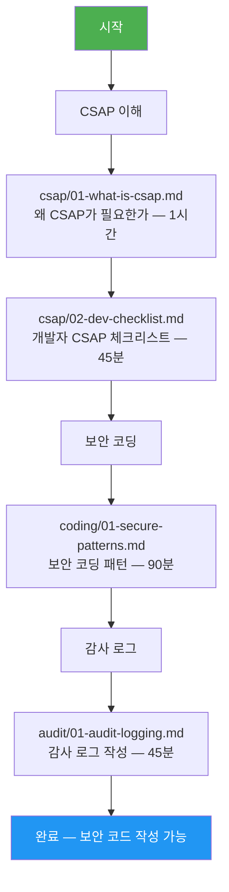

# 7장: 보안 — 학습 맵

> **대상**: 모든 신규 개발자 (필수 학습)
> **버전**: 1.0.0 | **작성일**: 2026-04-11
> **CSAP**: D-06, D-08, D-09, D-12 (전 항목)

---

## 이 섹션을 배우면

공공기관 SaaS 서비스에서 개발자가 직접 책임지는 보안 요건을 이해하고, CSAP 위반 없이 안전한 코드를 작성할 수 있게 됩니다.

---

## 보안 학습을 먼저 해야 하는 이유

```
공공기관 SaaS 특수성:
  → 국민 개인정보를 처리함 (주민번호, 주소, 의료정보)
  → CSAP 감사에서 보안 결함 발견 시 인증 취소 가능
  → 보안 사고 시 법적 책임 + 국민 피해

개발자가 직접 방어해야 하는 취약점:
  → SQL 주입: 나쁜 사람이 DB 전체를 읽어갈 수 있음
  → XSS: 다른 사용자의 세션을 탈취할 수 있음
  → 하드코딩 시크릿: API 키가 GitHub에 노출되면 즉각 피해
  → 미인증 API: 아무나 데이터를 조회할 수 있음
```

---

## 학습 순서 (권장: 3일 이내 완료)



---

## 섹션 구조

| 폴더 | 파일 | 설명 | 소요 시간 |
|------|------|------|----------|
| `csap/` | `01-what-is-csap.md` | CSAP 초보자 설명 | 60분 |
| `csap/` | `02-dev-checklist.md` | 개발자 체크리스트 | 45분 |
| `coding/` | `01-secure-patterns.md` | 보안 코딩 패턴 모음 | 90분 |
| `audit/` | `01-audit-logging.md` | 감사 로그 작성법 | 45분 |

---

## 기존 참조 문서

- `.claude/rules/csap-compliance.md` — CSAP 코드 규칙 (코딩 중 항상 열어두기)
- `docs/guides/onboarding/07-security-compliance.md` — 기존 통합 가이드 (단일 파일 버전)
