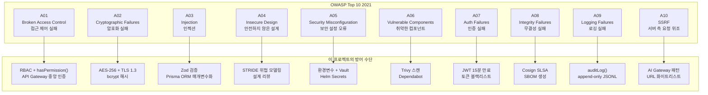
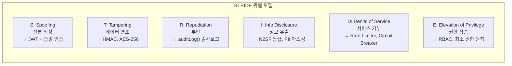
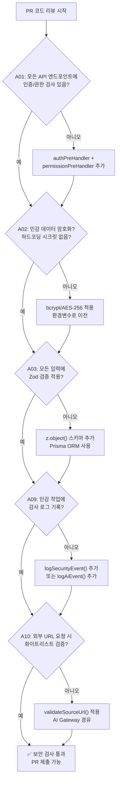
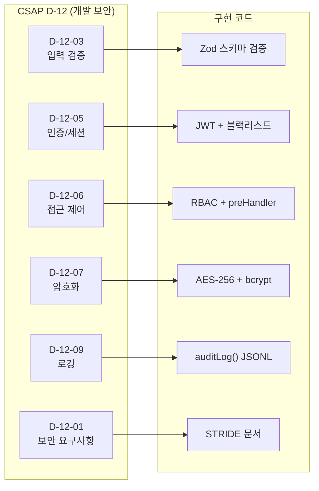

# OWASP Top 10 보안 패턴 가이드

> 이 가이드를 마치면 OWASP Top 10 2021의 모든 취약점을 이해하고,
> 이 프로젝트에서 각 취약점을 어떻게 방어하는지 설명하며,
> 안전한 코드를 직접 작성할 수 있습니다.

## 목차

1. [OWASP Top 10이란?](#1-owasp-top-10이란)
2. [A01: Broken Access Control](#2-a01-broken-access-control)
3. [A02: Cryptographic Failures](#3-a02-cryptographic-failures)
4. [A03: Injection](#4-a03-injection)
5. [A04: Insecure Design](#5-a04-insecure-design)
6. [A05: Security Misconfiguration](#6-a05-security-misconfiguration)
7. [A06: Vulnerable and Outdated Components](#7-a06-vulnerable-and-outdated-components)
8. [A07: Identification and Authentication Failures](#8-a07-identification-and-authentication-failures)
9. [A08: Software and Data Integrity Failures](#9-a08-software-and-data-integrity-failures)
10. [A09: Security Logging and Monitoring Failures](#10-a09-security-logging-and-monitoring-failures)
11. [A10: Server-Side Request Forgery (SSRF)](#11-a10-server-side-request-forgery-ssrf)
12. [보안 코드 리뷰 체크리스트](#12-보안-코드-리뷰-체크리스트)
13. [Semgrep으로 자동 탐지하기](#13-semgrep으로-자동-탐지하기)
14. [CSAP D-12 매핑 테이블](#14-csap-d-12-매핑-테이블)
15. [학습 체크리스트](#학습-체크리스트)
16. [다음 단계](#다음-단계)

---

## 1. OWASP Top 10이란?

OWASP(Open Web Application Security Project)는 웹 애플리케이션 보안의 국제 표준 기관입니다.
OWASP Top 10은 가장 위험한 웹 보안 취약점 10가지 목록으로, 2021년 버전이 현재 기준입니다.

**공공기관 SaaS에서 OWASP Top 10이 중요한 이유:**
- CSAP(클라우드 보안 인증제) D-12(개발 보안) 요건에 직접 연결됩니다
- 행안부 감리 기준에서 보안 취약점 점검 항목으로 사용합니다
- 민간 해커그룹의 공격이 대부분 이 10가지 취약점을 악용합니다



---

## 2. A01: Broken Access Control

**설명**: 인증된 사용자가 본인의 권한 범위를 벗어난 리소스에 접근할 수 있는 취약점입니다.
2021년 1위로, 가장 흔하게 발생하는 취약점입니다.

**공격 시나리오**: 일반 사용자 A가 `/api/v1/tenants/admindata`에 접근해 다른 테넌트의 데이터를 조회합니다.

### CSAP D-08 연계

이 프로젝트의 API Gateway(`platform/services/api-gateway/src/routes/proxy.ts`)는
모든 요청에 대해 중앙 집중식 접근 제어를 수행합니다.

```typescript
// ❌ 취약한 코드 — 인증 없이 직접 접근
app.get('/api/v1/tenants/:id/data', async (req, reply) => {
  // 권한 검사 없음! 누구나 접근 가능
  const data = await prisma.tenant.findUnique({ where: { id: req.params.id } });
  return reply.send(data);
});
```

```typescript
// ✅ 안전한 코드 — 이 프로젝트의 실제 패턴 (proxy.ts 기반)

/** 역할별 기본 권한 매핑 (CSAP D-08-05) */
const ROLE_PERMISSIONS: Record<string, string[]> = {
  SUPER_ADMIN: ['audit:read', 'security:read', 'admin:all'],
  TENANT_ADMIN: ['audit:read'],
  AUDITOR: ['audit:read', 'security:read'],
  USER: [],
  VIEWER: [],
};

// 모든 보호된 라우트에 인증 preHandler 자동 적용
// SERVICE_REGISTRY의 requireAuth: true 설정된 모든 서비스에 적용됨
async function authPreHandler(request: FastifyRequest, reply: FastifyReply): Promise<void> {
  const authHeader = request.headers.authorization;
  if (!authHeader?.startsWith('Bearer ')) {
    await reply.status(401).send({
      success: false,
      error: { code: 'AUTH_NO_TOKEN', message: '인증 토큰이 필요합니다' },
    });
    return;
  }

  // auth-service를 통한 JWT 검증 (중앙 인증)
  const verifyResponse = await fetch(`${AUTH_SERVICE_URL}/auth/verify`, {
    headers: { authorization: authHeader },
    signal: AbortSignal.timeout(5000), // CSAP D-07: 인증 검증 타임아웃 5초
  });

  if (!verifyResponse.ok) {
    await reply.status(401).send({
      success: false,
      error: { code: 'AUTH_TOKEN_INVALID', message: '인증 실패' },
    });
    return;
  }

  // JWT 페이로드를 요청 컨텍스트에 주입
  const { data } = await verifyResponse.json();
  (request as any).user = data;

  // 하위 서비스 actor 추적 헤더 주입 (CSAP D-06, D-08)
  request.headers['x-user-id'] = data.sub ?? 'anonymous';
  request.headers['x-user-tenant-id'] = data.tenantId ?? '';
  request.headers['x-user-role'] = data.role ?? '';
}

// RBAC 권한 검사 (requiredPermissions 기반)
function makePermissionPreHandler(requiredPermissions: string[]) {
  return async function permissionPreHandler(request: FastifyRequest, reply: FastifyReply) {
    const user = (request as any).user;
    const userPermissions = user.permissions ?? ROLE_PERMISSIONS[user.role ?? ''] ?? [];
    const hasAll = requiredPermissions.every(
      (p) => userPermissions.includes(p) || userPermissions.includes('admin:all'),
    );

    if (!hasAll) {
      await reply.status(403).send({
        success: false,
        error: { code: 'FORBIDDEN', message: '이 리소스에 접근할 권한이 없습니다' },
      });
      return;
    }
  };
}
```

```typescript
// ✅ AI 에이전트 핸들러에서의 권한 검사 (ai-agent.handler.ts 실제 코드)
export async function agentHandler(
  request: FastifyRequest<{ Body: AgentBody }>,
  reply: FastifyReply,
): Promise<void> {
  const body = agentSchema.parse(request.body);
  const actor = (request.headers['x-user-id'] as string) || 'system';

  // N2SF N-05: C/S 등급 데이터 차단 (접근 제어의 일환)
  try {
    validateDataGrade(body.grade as DataGrade);
  } catch (error) {
    if (error instanceof DataGradeViolationError) {
      await logAiEvent('AI_GRADE_VIOLATION', actor, 'agent', body.tenantId, request.ip, ...);
      await reply.status(403).send({
        success: false,
        error: { code: error.code, message: error.message }
      });
      return;
    }
  }
  // ...
}
```

**핵심 방어 원칙:**
- 모든 API 엔드포인트에 인증 preHandler 적용
- 역할(ROLE)보다 권한(PERMISSION) 기반 검사 사용
- 테넌트 격리: `x-user-tenant-id` 헤더로 데이터 소유권 검증
- 실패 시 401(미인증) 또는 403(권한 없음) 구분

---

## 3. A02: Cryptographic Failures

**설명**: 데이터를 평문으로 저장하거나 약한 암호화 알고리즘을 사용하는 취약점입니다.
(구 명칭: Sensitive Data Exposure)

**공격 시나리오**: 데이터베이스 백업 파일이 유출되었을 때 평문으로 저장된 비밀번호가 노출됩니다.

### 이 프로젝트의 암호화 정책 (CSAP D-09)

```typescript
// ❌ 취약한 코드 — 비밀번호 평문 저장
const user = await prisma.user.create({
  data: {
    email: 'user@example.com',
    password: plainPassword,  // ← 절대 금지! CSAP D-09 위반
  },
});

// ❌ 취약한 코드 — MD5/SHA1 해시 (레인보우 테이블 공격 가능)
const hash = crypto.createHash('md5').update(password).digest('hex');  // ← 위험!
```

```typescript
// ✅ 안전한 코드 — bcrypt 해시 (비밀번호)
import bcrypt from 'bcrypt';

// CSAP D-09: bcrypt 솔트 라운드 12 (최소 10 이상)
const BCRYPT_ROUNDS = 12;

async function hashPassword(plainPassword: string): Promise<string> {
  return bcrypt.hash(plainPassword, BCRYPT_ROUNDS);
}

async function verifyPassword(plainPassword: string, hash: string): Promise<boolean> {
  return bcrypt.compare(plainPassword, hash);
}

// ✅ 안전한 코드 — AES-256-GCM 암호화 (민감 데이터 저장)
import { createCipheriv, createDecipheriv, randomBytes } from 'crypto';

const ALGORITHM = 'aes-256-gcm';

function encryptSensitiveData(plaintext: string): {
  encrypted: string;
  iv: string;
  tag: string;
} {
  // 환경변수에서 키 로드 (하드코딩 절대 금지!)
  const key = Buffer.from(process.env.ENCRYPTION_KEY!, 'hex');
  if (key.length !== 32) {
    throw new Error('ENCRYPTION_KEY는 32바이트(64자 hex)여야 합니다');
  }

  const iv = randomBytes(16); // 매 암호화마다 새로운 IV 생성
  const cipher = createCipheriv(ALGORITHM, key, iv);

  let encrypted = cipher.update(plaintext, 'utf8', 'hex');
  encrypted += cipher.final('hex');
  const tag = cipher.getAuthTag();

  return {
    encrypted,
    iv: iv.toString('hex'),
    tag: tag.toString('hex'),
  };
}

function decryptSensitiveData(encrypted: string, iv: string, tag: string): string {
  const key = Buffer.from(process.env.ENCRYPTION_KEY!, 'hex');
  const decipher = createDecipheriv(ALGORITHM, key, Buffer.from(iv, 'hex'));
  decipher.setAuthTag(Buffer.from(tag, 'hex'));

  let decrypted = decipher.update(encrypted, 'hex', 'utf8');
  decrypted += decipher.final('utf8');
  return decrypted;
}
```

```typescript
// ✅ 안전한 코드 — 하드코딩 시크릿 절대 금지 (CSAP D-12)

// ❌ 절대 금지
const API_KEY = 'sk-1234567890abcdef';  // BLOCKED

// ✅ 환경변수 사용
const API_KEY = process.env.API_KEY;
if (!API_KEY) {
  throw new Error('API_KEY 환경 변수가 설정되지 않았습니다. 서비스를 시작할 수 없습니다.');
}
```

**암호화 정책 요약:**

| 데이터 유형 | 저장 시 | 전송 시 |
|-----------|--------|--------|
| 비밀번호 | bcrypt (라운드 12+) | TLS 1.3+ |
| 주민등록번호/개인정보 | AES-256-GCM | TLS 1.3+ |
| API 키/토큰 | SHA-256 해시 또는 Vault | TLS 1.3+ |
| 일반 업무 데이터 | 평문 (DB 디스크 암호화) | TLS 1.3+ |

---

## 4. A03: Injection

**설명**: 신뢰할 수 없는 데이터를 명령어나 쿼리에 삽입해 의도치 않은 동작을 유발하는 취약점입니다.
SQL 인젝션, NoSQL 인젝션, OS 명령 인젝션, LDAP 인젝션 등이 포함됩니다.

### 4.1 SQL 인젝션 방어 (CSAP D-12)

```typescript
// ❌ 취약한 코드 — SQL 직접 결합
const userEmail = req.body.email;  // 공격자가 "' OR 1=1 --" 입력
const result = await db.execute(
  `SELECT * FROM users WHERE email = '${userEmail}'`  // ← SQL 인젝션!
);
// 실행되는 쿼리: SELECT * FROM users WHERE email = '' OR 1=1 --'
// 결과: 모든 사용자 데이터 유출!
```

```typescript
// ✅ 안전한 코드 — Prisma ORM 사용 (매개변수화 쿼리 자동 적용)
// Prisma는 내부적으로 준비된 문(Prepared Statement)을 사용하여 SQL 인젝션을 방지합니다.
const user = await prisma.user.findUnique({
  where: { email: userEmail },  // 입력값이 자동으로 이스케이프됨
});

// ✅ 안전한 코드 — 원시 SQL이 필요한 경우 매개변수화 쿼리 사용
const users = await prisma.$queryRaw`
  SELECT * FROM users WHERE email = ${userEmail} AND tenant_id = ${tenantId}
`;
// Prisma의 템플릿 리터럴은 자동으로 매개변수화됨
```

### 4.2 입력 검증 — Zod (CSAP D-12)

이 프로젝트의 모든 API 핸들러는 Zod로 입력을 검증합니다.
AI 에이전트 핸들러의 실제 예시:

```typescript
// platform/services/ai-service/src/handlers/ai-agent.handler.ts (실제 코드)
const agentSchema = z.object({
  tenantId: z.string().uuid(),           // UUID 형식 강제
  grade: z.enum(['O']),                  // 허용 값 목록으로 제한
  query: z.string().min(1).max(4000),    // 길이 제한
  maxIterations: z.number().int().min(1).max(10).optional().default(10), // 범위 제한
  tools: z.array(z.string()).optional(), // 배열 타입 강제
  modelId: z.string().optional(),
});

export async function agentHandler(
  request: FastifyRequest<{ Body: AgentBody }>,
  reply: FastifyReply,
): Promise<void> {
  // 입력 검증 — 실패 시 ZodError 자동 발생
  const body = agentSchema.parse(request.body);
  // body는 이제 완전히 타입 안전하고 검증된 데이터
  // ...
}
```

```typescript
// ❌ 취약한 코드 — 입력 검증 없이 직접 사용
app.post('/ai/agent', async (req, reply) => {
  const { tenantId, query, grade } = req.body;  // 검증 없음!
  // query에 악성 프롬프트 인젝션 가능
  // grade에 'C' 또는 'S' 등급 전달로 N2SF 우회 가능
  await runAgent(query, tenantId);
});

// ✅ 안전한 코드 — Zod로 모든 입력 검증
const requestSchema = z.object({
  tenantId: z.string().uuid('올바른 UUID 형식이어야 합니다'),
  query: z.string()
    .min(1, '질의는 최소 1자 이상이어야 합니다')
    .max(4000, '질의는 최대 4000자까지 입력 가능합니다')
    .transform(q => q.trim()),  // 앞뒤 공백 제거
  grade: z.enum(['O'], {
    errorMap: () => ({ message: 'O 등급 데이터만 허용됩니다 (N2SF N-05)' }),
  }),
});

app.post('/ai/agent', async (req, reply) => {
  const body = requestSchema.parse(req.body);  // 검증 + 변환 동시
  // ...
});
```

### 4.3 XSS(Cross-Site Scripting) 방어

```typescript
// ❌ 취약한 코드 — HTML 직접 삽입
function renderUserContent(userInput: string): string {
  return `<div>${userInput}</div>`;  // XSS 취약점!
  // userInput이 "<script>alert('XSS')</script>"라면 실행됨
}

// ✅ 안전한 코드 — DOMPurify로 새니타이즈 (프론트엔드)
import DOMPurify from 'dompurify';

function renderUserContent(userInput: string): string {
  const sanitized = DOMPurify.sanitize(userInput, {
    ALLOWED_TAGS: ['b', 'i', 'em', 'strong', 'p'],  // 허용 태그 화이트리스트
    ALLOWED_ATTR: [],  // 속성 금지
  });
  return `<div>${sanitized}</div>`;
}

// ✅ 안전한 코드 — 백엔드에서 escape
function escapeHtml(text: string): string {
  return text
    .replace(/&/g, '&amp;')
    .replace(/</g, '&lt;')
    .replace(/>/g, '&gt;')
    .replace(/"/g, '&quot;')
    .replace(/'/g, '&#039;');
}
```

---

## 5. A04: Insecure Design

**설명**: 보안 요구사항을 처음부터 설계에 포함하지 않아 발생하는 취약점입니다.
코드 수준이 아닌 아키텍처 수준의 문제입니다.

### STRIDE 위협 모델링

이 프로젝트는 새로운 기능 설계 시 STRIDE 위협 모델링을 수행합니다.



```typescript
// ✅ 안전한 설계 — AI 서비스에 Rate Limiter 적용 (routes.ts 실제 코드)
// CSAP D-08-06: Rate Limiting

const readLimiter = createRateLimiter(100, 60, 'rl:ai:read');
const writeLimiter = createRateLimiter(20, 60, 'rl:ai:write');
const chatLimiter = createRateLimiter(10, 60, 'rl:ai:chat');
const agentLimiter = createRateLimiter(5, 60, 'rl:ai:agent'); // 에이전트는 비용이 높아 제한

// 각 엔드포인트에 적합한 Rate Limiter 적용
app.post(
  '/ai/agent',
  {
    schema: { /* ... */ },
    preHandler: agentLimiter,  // 분당 5회로 제한 (DoS 방어)
  },
  agentHandler as never,
);
```

```typescript
// ✅ 안전한 설계 — Circuit Breaker 패턴 (circuit-breaker.ts 실제 코드)
// CSAP D-07: 장애 격리

class CircuitBreakerManager {
  async execute<T>(serviceId: string, action: () => Promise<T>): Promise<T> {
    const circuit = this.getCircuit(serviceId);

    // OPEN 상태: 즉시 실패 반환 (하위 서비스 과부하 방지)
    if (circuit.state === 'OPEN') {
      const elapsed = Date.now() - circuit.lastFailureTime;
      if (elapsed >= this.options.resetTimeout) {
        circuit.state = 'HALF_OPEN';
      } else {
        throw new CircuitOpenError(serviceId, this.options.resetTimeout - elapsed);
      }
    }
    // ...
  }
}
```

**설계 단계 보안 체크리스트:**
- [ ] 새 기능 설계 시 Plan + Design 문서에 보안 위협 섹션 포함
- [ ] 민감 데이터 흐름 다이어그램 작성 (N2SF 등급 표시)
- [ ] Rate Limiting 정책 명시 (엔드포인트별 한도)
- [ ] 실패 시나리오 처리 설계 (Circuit Breaker 적용 여부)

---

## 6. A05: Security Misconfiguration

**설명**: 기본 설정, 불필요한 기능 활성화, 잘못된 권한 등 보안 설정이 잘못된 경우 발생합니다.

```typescript
// ❌ 취약한 설정 — 시크릿 하드코딩
const config = {
  database: {
    host: 'localhost',
    password: 'admin123',  // ← 하드코딩! BLOCKED
  },
  jwt: {
    secret: 'my-jwt-secret',  // ← 하드코딩! BLOCKED
  },
};

// ✅ 안전한 설정 — 환경변수 사용 (routes.ts 실제 패턴)
// platform/services/ai-service/src/routes.ts
const internalKey = process.env['INTERNAL_SERVICE_KEY'];
if (!internalKey && process.env['NODE_ENV'] === 'production') {
  throw new Error(
    '[SECURITY] INTERNAL_SERVICE_KEY 환경변수가 설정되지 않았습니다. 서비스를 시작할 수 없습니다.'
  );
}
```

```typescript
// ✅ 안전한 설정 — 보안 HTTP 헤더 설정
// platform/services/api-gateway/src/plugins/security-headers.ts 패턴

app.addHook('onSend', (request, reply, _payload, done) => {
  // XSS 방어
  reply.header('X-Content-Type-Options', 'nosniff');
  reply.header('X-Frame-Options', 'DENY');
  reply.header('X-XSS-Protection', '1; mode=block');

  // HTTPS 강제
  reply.header('Strict-Transport-Security', 'max-age=31536000; includeSubDomains; preload');

  // 콘텐츠 보안 정책
  reply.header('Content-Security-Policy', "default-src 'self'; script-src 'self'");

  // 정보 노출 방지
  reply.header('X-Powered-By', '');  // 기술 스택 숨김
  reply.removeHeader('Server');       // 서버 정보 숨김

  done();
});
```

```bash
# ✅ 환경변수 관리 — .env 파일은 커밋 금지
# .gitignore에 반드시 포함
.env
.env.*
secrets.*
*credential*

# ✅ 운영 환경에서 Kubernetes Secret 또는 Vault 사용
kubectl create secret generic ai-service-secrets \
  --from-literal=ENCRYPTION_KEY=$(openssl rand -hex 32) \
  --from-literal=INTERNAL_SERVICE_KEY=$(openssl rand -hex 32)
```

---

## 7. A06: Vulnerable and Outdated Components

**설명**: 알려진 취약점이 있는 라이브러리나 프레임워크를 사용하는 경우 발생합니다.

```bash
# ✅ 취약점 스캔 — npm audit
npm audit
npm audit fix         # 자동 수정 가능한 것 수정
npm audit fix --force # 강제 수정 (주의: 중단 변경 가능)

# ✅ Trivy 컨테이너 이미지 스캔 (CI/CD에 통합)
trivy image public-saas/ai-service:latest --exit-code 1 --severity CRITICAL,HIGH

# ✅ Snyk 의존성 스캔
npx snyk test
npx snyk monitor  # 지속적 모니터링
```

```yaml
# ✅ GitHub Dependabot 설정 (자동 취약점 PR)
# .github/dependabot.yml
version: 2
updates:
  - package-ecosystem: "npm"
    directory: "/"
    schedule:
      interval: "weekly"
    open-pull-requests-limit: 10
    labels:
      - "security"
      - "dependencies"
```

```typescript
// ✅ 패키지 버전 고정 (pnpm-lock.yaml 커밋 필수)
// package.json
{
  "dependencies": {
    "fastify": "^4.25.0",  // ^ 허용
    "zod": "^3.22.0"
  },
  "engines": {
    "node": ">=20.0.0",   // LTS 버전 강제
    "pnpm": ">=8.0.0"
  }
}
```

---

## 8. A07: Identification and Authentication Failures

**설명**: 인증 메커니즘이 잘못 구현되어 공격자가 타인의 계정을 탈취할 수 있는 취약점입니다.

```typescript
// ❌ 취약한 코드 — 만료 없는 JWT
const token = jwt.sign({ userId: user.id }, SECRET);  // 만료 설정 없음!

// ❌ 취약한 코드 — 약한 JWT 시크릿
const SECRET = 'secret';  // 브루트포스 공격에 취약
```

```typescript
// ✅ 안전한 코드 — JWT 15분 만료 (CSAP D-08)
const ACCESS_TOKEN_EXPIRES = '15m';  // 접근 토큰: 15분
const REFRESH_TOKEN_EXPIRES = '7d';  // 갱신 토큰: 7일

function generateTokens(userId: string, tenantId: string, role: string) {
  const accessToken = jwt.sign(
    { sub: userId, tenantId, role, type: 'access' },
    process.env.JWT_SECRET!,
    {
      expiresIn: ACCESS_TOKEN_EXPIRES,
      algorithm: 'HS256',
      issuer: 'public-saas-auth',
      audience: 'public-saas-api',
    }
  );

  const refreshToken = jwt.sign(
    { sub: userId, type: 'refresh' },
    process.env.JWT_REFRESH_SECRET!,
    { expiresIn: REFRESH_TOKEN_EXPIRES, algorithm: 'HS256' }
  );

  return { accessToken, refreshToken };
}
```

```typescript
// ✅ 안전한 코드 — 로그아웃 시 토큰 블랙리스트 등록 (CSAP D-08)
// Redis 기반 토큰 블랙리스트

async function invalidateToken(token: string, userId: string): Promise<void> {
  // JWT 디코딩으로 만료 시간 계산
  const decoded = jwt.decode(token) as { exp?: number };
  if (!decoded?.exp) return;

  const remainingTtl = decoded.exp - Math.floor(Date.now() / 1000);
  if (remainingTtl <= 0) return;  // 이미 만료된 토큰

  // Redis에 블랙리스트 등록 (만료 시간까지 유지)
  await redis.setex(`blacklist:token:${token}`, remainingTtl, userId);
}

async function isTokenBlacklisted(token: string): Promise<boolean> {
  const result = await redis.get(`blacklist:token:${token}`);
  return result !== null;
}

// JWT 검증 미들웨어에 블랙리스트 확인 추가
async function verifyToken(token: string): Promise<JwtPayload> {
  // 1. 서명 검증
  const payload = jwt.verify(token, process.env.JWT_SECRET!) as JwtPayload;

  // 2. 블랙리스트 확인 (로그아웃한 토큰 차단)
  if (await isTokenBlacklisted(token)) {
    throw new Error('이미 무효화된 토큰입니다.');
  }

  return payload;
}
```

```typescript
// ✅ 안전한 코드 — 동시 세션 제한 (CSAP D-08)
const MAX_CONCURRENT_SESSIONS = 3;

async function createSession(userId: string, deviceInfo: string): Promise<string> {
  const sessionKey = `sessions:user:${userId}`;
  const sessions = await redis.lrange(sessionKey, 0, -1);

  // 최대 세션 수 초과 시 가장 오래된 세션 만료 처리
  if (sessions.length >= MAX_CONCURRENT_SESSIONS) {
    const oldestSession = sessions[0];
    await redis.lrem(sessionKey, 1, oldestSession);
    await invalidateToken(oldestSession, userId);
  }

  const newSessionToken = generateSessionToken();
  await redis.rpush(sessionKey, newSessionToken);
  await redis.expire(sessionKey, 7 * 24 * 60 * 60); // 7일

  return newSessionToken;
}
```

**인증 보안 체크리스트:**
- [ ] JWT 만료 시간 설정 (접근: 15분, 갱신: 7일)
- [ ] 로그아웃 시 블랙리스트 등록
- [ ] 동시 세션 최대 3개로 제한
- [ ] 브루트포스 방지 (Rate Limiting + 계정 잠금)
- [ ] JWT 시크릿은 256비트 이상 랜덤 값 사용

---

## 9. A08: Software and Data Integrity Failures

**설명**: 코드나 인프라가 무결성 검증 없이 업데이트되거나, 안전하지 않은 역직렬화를 사용하는 취약점입니다.

```bash
# ✅ 컨테이너 이미지 서명 — Cosign (SLSA Level 2)
# CI/CD 파이프라인에서 자동 실행

# 이미지 빌드 후 서명
cosign sign --key cosign.key \
  public-saas/ai-service:${VERSION}

# 배포 전 서명 검증
cosign verify --key cosign.pub \
  public-saas/ai-service:${VERSION}
```

```bash
# ✅ SBOM(소프트웨어 부품 목록) 생성
# 어떤 오픈소스 컴포넌트가 포함되어 있는지 추적

syft packages public-saas/ai-service:latest \
  -o spdx-json > sbom.json

# 취약점 스캔에 SBOM 활용
grype sbom:./sbom.json --fail-on high
```

```typescript
// ✅ 안전한 코드 — 역직렬화 검증 (JSON 파싱 시 스키마 검증)
// JSON.parse() 직후 반드시 Zod 검증

import { z } from 'zod';

const webhookPayloadSchema = z.object({
  event: z.string(),
  data: z.record(z.unknown()),
  timestamp: z.string().datetime(),
});

async function processWebhook(rawBody: string): Promise<void> {
  let parsed: unknown;
  try {
    parsed = JSON.parse(rawBody);  // JSON 파싱
  } catch {
    throw new Error('유효하지 않은 JSON 형식입니다.');
  }

  // 스키마 검증 (역직렬화 취약점 방지)
  const payload = webhookPayloadSchema.parse(parsed);
  // payload는 이제 타입 안전하고 검증된 데이터
}
```

```yaml
# ✅ Gitea CI/CD 파이프라인에서 무결성 검증
# .gitea/workflows/deploy.yml

steps:
  - name: 이미지 빌드
    run: docker build -t public-saas/ai-service:${{ github.sha }} .

  - name: 취약점 스캔
    run: trivy image --exit-code 1 --severity CRITICAL public-saas/ai-service:${{ github.sha }}

  - name: 이미지 서명
    run: cosign sign --key ${{ secrets.COSIGN_KEY }} public-saas/ai-service:${{ github.sha }}

  - name: SBOM 생성
    run: syft public-saas/ai-service:${{ github.sha }} -o spdx-json > sbom.json
```

---

## 10. A09: Security Logging and Monitoring Failures

**설명**: 보안 이벤트가 기록되지 않거나 모니터링되지 않아 침해 사고를 탐지하지 못하는 취약점입니다.

### 이 프로젝트의 감사 로깅 구현

```typescript
// platform/services/security-service/src/lib/audit.ts (실제 코드)
import { createAuditLogger, createStandardTransport } from '@public-saas/audit-sdk';

const auditLogger = createAuditLogger({
  serviceName: 'security-service',
  transport: createStandardTransport('security-service'),
});

// 모든 보안 이벤트 기록 (CSAP D-06)
export async function logSecurityEvent(
  action: string,
  metadata?: Record<string, unknown>
): Promise<void> {
  await auditLogger.log({
    actor: 'system:security-service',
    action,
    target: 'security',
    targetType: 'security',
    tenantId: 'system',
    ip: process.env.SERVICE_IP || '127.0.0.1',
    userAgent: 'security-service/1.0',
    metadata,
  });
}
```

```typescript
// AI 서비스의 감사 로깅 패턴 (ai-agent.handler.ts 실제 코드)

// 등급 위반 이벤트 기록
await logAiEvent('AI_GRADE_VIOLATION', actor, 'agent', body.tenantId, request.ip,
  request.headers['user-agent'] ?? 'unknown',
  { grade: body.grade, blocked: true, endpoint: 'agent' });

// 에이전트 실행 완료 기록
await logAiEvent('AGENT_RUN', actor, 'agent', body.tenantId, request.ip,
  request.headers['user-agent'] ?? 'unknown', {
    query: maskPII(body.query).slice(0, 100),  // PII 마스킹 후 기록!
    iterations: result.iterations,
    tokensUsed: result.tokensUsed,
    timedOut: result.timedOut,
    durationMs,
  });
```

```typescript
// ❌ 취약한 코드 — 로깅 없는 민감 작업
async function deleteUser(targetUserId: string): Promise<void> {
  // 누가, 언제, 무엇을 삭제했는지 기록 없음!
  await prisma.user.delete({ where: { id: targetUserId } });
}

// ✅ 안전한 코드 — 감사 로그 필수 (CSAP D-06)
async function deleteUser(adminUser: User, targetUserId: string, ip: string): Promise<void> {
  // 작업 전 감사 로그 기록
  await logSecurityEvent('USER_DELETE', {
    actor: adminUser.id,
    target: targetUserId,
    ip,
    timestamp: new Date().toISOString(),
  });

  await prisma.user.delete({ where: { id: targetUserId } });
}
```

```typescript
// ✅ 감사 로그 구조 (append-only JSONL 형식)
// .claude/audit.jsonl

interface AuditEntry {
  timestamp: string;    // ISO 8601
  actor: string;        // 작업자 ID
  action: string;       // 수행한 작업
  target: string;       // 대상 리소스
  targetType: string;   // 리소스 유형
  tenantId: string;     // 테넌트 ID
  ip: string;           // 클라이언트 IP
  userAgent: string;    // 클라이언트 정보
  metadata?: Record<string, unknown>;  // 추가 정보
  result?: 'success' | 'failure';      // 결과
}

// 로그 보존 정책 (CSAP D-06)
// - 최소 1년 보존
// - append-only (수정/삭제 불가)
// - 암호화 저장 (AES-256)
```

**감사 로깅 필수 이벤트 목록:**

| 이벤트 유형 | 로그 필수 여부 | CSAP 조항 |
|-----------|-------------|---------|
| 로그인 성공/실패 | 필수 | D-06 |
| 로그아웃 | 필수 | D-06 |
| 사용자 생성/수정/삭제 | 필수 | D-06 |
| 권한 변경 | 필수 | D-06, D-08 |
| AI 요청 (N2SF 등급 위반) | 필수 | D-06, N2SF |
| 개인정보 조회/수정 | 필수 | D-06 |
| 설정 변경 | 필수 | D-06 |
| 보안 정책 변경 | 필수 | D-06 |

---

## 11. A10: Server-Side Request Forgery (SSRF)

**설명**: 서버가 공격자가 지정한 내부 또는 외부 URL로 요청을 보내도록 유도하는 취약점입니다.

**공격 시나리오**: AI 서비스에 `sourceUrl: "http://169.254.169.254/metadata"` (AWS 메타데이터 서버)를
전달하여 내부 인증 정보를 탈취합니다.

### 이 프로젝트의 SSRF 방어 — AI Gateway 패턴

```typescript
// ❌ 취약한 코드 — URL 검증 없이 외부 요청
app.post('/ai/rag/ingest', async (req, reply) => {
  const { sourceUrl } = req.body;
  const content = await fetch(sourceUrl).then(r => r.text());  // SSRF 취약점!
  // sourceUrl이 http://internal-service/secret이라면?
});
```

```typescript
// ✅ 안전한 코드 — URL 화이트리스트 + AI Gateway 패턴

// 허용된 도메인 화이트리스트 (SSRF 방어)
const ALLOWED_SOURCE_DOMAINS = new Set([
  'data.go.kr',          // 공공데이터포털
  'open.neis.go.kr',     // 교육정보 개방포털
  'ecos.bok.or.kr',      // 한국은행 경제통계
  // 내부 서비스 도메인은 명시적 승인 후 추가
]);

function validateSourceUrl(url: string): void {
  let parsed: URL;
  try {
    parsed = new URL(url);
  } catch {
    throw new Error('유효하지 않은 URL 형식입니다.');
  }

  // HTTPS만 허용 (HTTP 차단)
  if (parsed.protocol !== 'https:') {
    throw new Error('HTTPS URL만 허용됩니다.');
  }

  // 내부 IP 범위 차단 (SSRF 핵심 방어)
  const hostname = parsed.hostname;
  if (
    hostname === 'localhost' ||
    hostname === '127.0.0.1' ||
    hostname.startsWith('10.') ||
    hostname.startsWith('172.16.') ||
    hostname.startsWith('192.168.') ||
    hostname === '169.254.169.254'  // AWS 메타데이터 서버
  ) {
    throw new Error('내부 네트워크 URL은 허용되지 않습니다.');
  }

  // 화이트리스트 검사
  if (!ALLOWED_SOURCE_DOMAINS.has(hostname)) {
    throw new Error(`허용되지 않은 도메인입니다: ${hostname}`);
  }
}

// RAG 수집 핸들러에서 URL 검증 적용
app.post('/ai/rag/ingest', async (req, reply) => {
  const body = ragIngestSchema.parse(req.body);

  if (body.sourceUrl) {
    validateSourceUrl(body.sourceUrl);  // SSRF 방어
  }

  // AI Gateway를 통한 안전한 요청
  const content = await aiGateway.fetchContent(body.sourceUrl);
  // ...
});
```

```typescript
// ✅ 안전한 코드 — AI API는 반드시 AI Gateway 경유
// N2SF 규정: 외부 AI API 직접 호출 금지

// ❌ 직접 호출 — 절대 금지
const response = await fetch('https://api.openai.com/v1/chat', {
  headers: { Authorization: `Bearer ${process.env.OPENAI_KEY}` },
  body: JSON.stringify({ model: 'gpt-4', messages }),
});

// ✅ AI Gateway 경유 (내부 서비스만 허용)
const response = await fetch(`${process.env.AI_GATEWAY_URL}/v1/chat`, {
  headers: {
    Authorization: `Bearer ${process.env.GATEWAY_API_KEY}`,
    'X-Data-Grade': grade,  // N2SF 등급 전달
    'X-Tenant-Id': tenantId,
  },
  body: JSON.stringify({ model: modelId, messages, grade }),
});
```

---

## 12. 보안 코드 리뷰 체크리스트

PR을 올리기 전에 반드시 스스로 확인하세요.



### PR 제출 전 셀프 체크 항목

**A01 접근 제어**
- [ ] 새로 추가한 API 엔드포인트에 `preHandler: authPreHandler` 적용
- [ ] 테넌트 격리: `x-user-tenant-id`와 요청 데이터의 `tenantId` 일치 확인
- [ ] 관리자 전용 기능에 `requiredPermissions` 설정

**A02 암호화**
- [ ] 코드에 하드코딩된 비밀번호, API 키, 토큰 없음
- [ ] 비밀번호는 bcrypt로 해시 (평문 저장 없음)
- [ ] 환경변수 누락 시 서버 시작 실패 처리

**A03 인젝션**
- [ ] 모든 API 입력에 Zod 스키마 검증 적용
- [ ] 데이터베이스 쿼리는 Prisma ORM 사용 (원시 SQL 없음)
- [ ] 사용자 입력이 HTML에 출력될 경우 DOMPurify 새니타이즈

**A05 보안 설정**
- [ ] `.env` 파일이 `.gitignore`에 포함됨
- [ ] `NODE_ENV=production`에서 디버그 정보 노출 없음
- [ ] 불필요한 API 엔드포인트 노출 없음

**A09 로깅**
- [ ] 민감 작업(생성/수정/삭제)에 `logSecurityEvent()` 호출
- [ ] 로그에 PII 데이터 마스킹 (`maskPII()` 사용)
- [ ] 에러 메시지에 스택 트레이스 노출 없음

**A10 SSRF**
- [ ] 외부 URL을 사용자로부터 받는 경우 `validateSourceUrl()` 적용
- [ ] AI API 호출은 반드시 AI Gateway 경유
- [ ] 내부 서비스 URL을 사용자 입력으로 받지 않음

---

## 13. Semgrep으로 자동 탐지하기

Semgrep은 코드에서 보안 취약점 패턴을 자동으로 찾아주는 정적 분석 도구입니다.

### 설치 및 기본 실행

```bash
# Semgrep 설치
pip install semgrep

# OWASP 규칙으로 스캔
semgrep --config p/owasp-top-ten .

# TypeScript 특화 보안 규칙
semgrep --config p/typescript-security .

# 결과를 SARIF 형식으로 내보내기 (CI/CD 통합)
semgrep --config p/owasp-top-ten --output results.sarif --sarif .
```

### 커스텀 Semgrep 규칙

이 프로젝트에 특화된 규칙을 작성할 수 있습니다.

```yaml
# .semgrep/rules/no-hardcoded-secrets.yml
rules:
  - id: no-hardcoded-api-key
    patterns:
      - pattern: |
          const $VAR = "sk-..."
      - pattern: |
          apiKey: "..."
    message: |
      하드코딩된 API 키 발견. process.env를 사용하세요.
      CSAP D-12, OWASP A05 위반.
    languages: [typescript, javascript]
    severity: ERROR

  - id: no-sql-string-concat
    patterns:
      - pattern: |
          `SELECT ... ${...}`
      - pattern: |
          "SELECT ... " + $VAR
    message: |
      SQL 문자열 결합 발견. Prisma ORM 또는 매개변수화 쿼리를 사용하세요.
      SQL 인젝션(OWASP A03) 취약점.
    languages: [typescript, javascript]
    severity: ERROR

  - id: require-zod-validation
    patterns:
      - pattern: |
          export async function $HANDLER(request: FastifyRequest, ...) {
            ...
            const body = request.body;
            ...
          }
    message: |
      API 핸들러에서 Zod 검증 없이 request.body를 직접 사용합니다.
      스키마.parse(request.body)를 사용하세요.
    languages: [typescript]
    severity: WARNING
```

```bash
# 커스텀 규칙으로 스캔
semgrep --config .semgrep/rules/ .

# CI/CD에서 자동 실행 (Gitea Actions)
# .gitea/workflows/security.yml
```

```yaml
# .gitea/workflows/security.yml
name: Security Scan

on: [push, pull_request]

jobs:
  semgrep:
    runs-on: ubuntu-latest
    steps:
      - uses: actions/checkout@v4

      - name: Semgrep OWASP 스캔
        run: |
          pip install semgrep
          semgrep --config p/owasp-top-ten \
                  --config .semgrep/rules/ \
                  --exit-code 1 \
                  --json > semgrep-results.json || true

      - name: 결과 업로드
        uses: actions/upload-artifact@v4
        with:
          name: semgrep-results
          path: semgrep-results.json
```

---

## 14. CSAP D-12 매핑 테이블

CSAP(클라우드 보안 인증제) D-12(시스템 개발 보안) 요건과 OWASP Top 10의 매핑입니다.

| CSAP D-12 항목 | 설명 | OWASP 연관 | 이 프로젝트 구현 |
|-------------|-----|----------|--------------|
| D-12-01 | 보안 요구사항 정의 | A04 | Plan 문서 보안 섹션 필수 |
| D-12-02 | 위협 모델링 | A04 | STRIDE 분석 Design 문서 |
| D-12-03 | 입력 데이터 검증 | A03 | Zod 스키마 전수 적용 |
| D-12-04 | 출력 데이터 인코딩 | A03 | DOMPurify, escapeHtml |
| D-12-05 | 인증 및 세션 관리 | A07 | JWT 15분, 블랙리스트 |
| D-12-06 | 접근 제어 | A01 | RBAC, authPreHandler |
| D-12-07 | 암호화 | A02 | AES-256, bcrypt, TLS 1.3 |
| D-12-08 | 에러 처리 | A09 | 민감 정보 노출 없는 에러 |
| D-12-09 | 로깅 | A09 | auditLog(), append-only |
| D-12-10 | 보안 테스트 | 전체 | OWASP ZAP, Semgrep |



---

## 학습 체크리스트

이 가이드를 완료한 후 다음 항목들을 스스로 확인해 보세요.

**OWASP Top 10 이해**
- [ ] OWASP Top 10 2021 목록 10개를 모두 말할 수 있다
- [ ] 각 취약점이 어떤 공격으로 이어지는지 설명할 수 있다
- [ ] 이 프로젝트에서 각 취약점을 어떻게 방어하는지 알고 있다

**A01 접근 제어**
- [ ] `authPreHandler`와 `makePermissionPreHandler`의 역할을 이해했다
- [ ] `ROLE_PERMISSIONS` 매핑 테이블을 수정할 수 있다
- [ ] 테넌트 격리를 위한 헤더 주입 패턴을 설명할 수 있다

**A03 인젝션 방어**
- [ ] Zod 스키마로 입력을 검증하는 코드를 직접 작성할 수 있다
- [ ] Prisma ORM이 SQL 인젝션을 방지하는 이유를 설명할 수 있다
- [ ] DOMPurify로 XSS를 방지하는 방법을 안다

**A09 감사 로깅**
- [ ] `logSecurityEvent()` 함수를 적절한 위치에 추가할 수 있다
- [ ] PII 마스킹 없이 개인정보를 로그에 기록하면 안 되는 이유를 안다
- [ ] append-only 로그 구조가 CSAP D-06 요건과 어떻게 연결되는지 이해했다

**보안 코드 리뷰**
- [ ] PR 제출 전 보안 체크리스트 13개 항목을 스스로 점검할 수 있다
- [ ] Semgrep 커스텀 규칙을 작성하고 실행할 수 있다
- [ ] CSAP D-12와 OWASP Top 10의 매핑을 설명할 수 있다

---

## 다음 단계

OWASP Top 10을 마스터했다면, 다음 가이드로 이어가세요.

- **감사 로깅 심화**: `07-security/audit/` — 감사 로그 쿼리, 분석, 리포팅
- **N2SF 데이터 분류**: `07-security/n2sf/` — C/S/O 등급 분류와 AI API 연동 규칙
- **위협 모델링**: `07-security/threat-modeling/` — STRIDE 실습, 설계 리뷰 방법
- **CSAP 점검**: `07-security/csap/` — 79개 통제항목 자가 점검 방법

```
💡 실무 팁: 보안은 기능 개발 후 추가하는 것이 아닙니다.
   설계 단계에서 "이 기능이 OWASP Top 10 중 어떤 취약점에 노출될 수 있는가?"를
   먼저 생각하고, Plan 문서의 보안 위협 섹션에 기록한 후 구현을 시작하세요.
```
